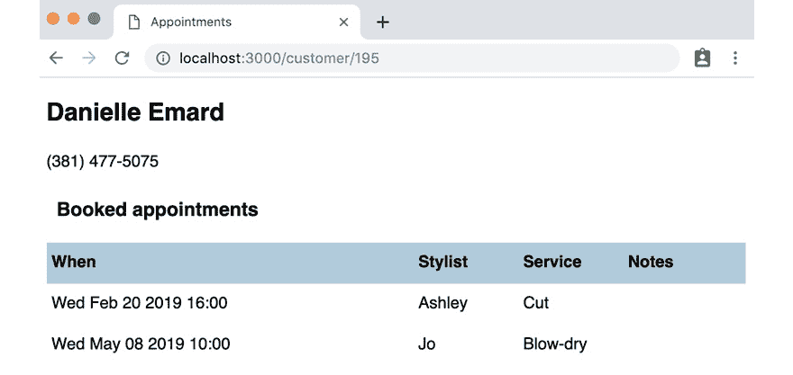

# 13

# 测试驱动 GraphQL

**GraphQL** 为获取数据提供了 HTTP 请求的替代方案。它为数据请求提供了一系列额外的功能。

与 Redux 类似，GraphQL 系统可能看起来很复杂，但 TDD 有助于提供理解和学习的途径。

在本章中，我们将使用 `CustomerHistory` 组件来显示单个客户的详细信息及其预约历史。

这是一个基础的 GraphQL 实现，展示了测试驱动技术的核心。如果您使用的是其他 GraphQL 库而不是 Relay，本章中我们将探讨的技术也适用。

这是新 `CustomerHistory` 组件的外观：



图 13.1 – 新的 CustomerHistory 组件

本章涵盖了以下主题：

+   在开始之前编译模式

+   测试驱动 Relay 环境

+   从组件内部获取 GraphQL 数据

到本章结束时，您将探索测试驱动方法在 GraphQL 中的应用。

# 技术要求

本章的代码文件可以在此处找到：

[`github.com/PacktPublishing/Mastering-React-Test-Driven-Development-Second-Edition/tree/main/Chapter13`](https://github.com/PacktPublishing/Mastering-React-Test-Driven-Development-Second-Edition/tree/main/Chapter13)

# 在开始之前编译模式

本章的代码示例已经包含了一些新增内容：

+   `react-relay`、`relay-compiler` 和 `babel-plugin-relay` 包。

+   Babel 配置以确保您的构建过程理解新的 GraphQL 语法。

+   在 `relay.config.json` 文件中的 Relay 配置。主要的配置项是模式的存储位置。

+   文件 `src/schema.graphql` 中的 GraphQL 模式。

+   一个位于 `POST/graphql` 的服务器端点，用于处理传入的 GraphQL 请求。

本书不涉及这些内容的每个细节，但您在开始之前需要编译模式，可以通过输入以下命令来完成：

```js
npx relay-compiler
```

`npm run build` 命令也已修改，以便在您忘记的情况下为您运行此命令。一旦所有内容都编译完成，您就可以开始编写测试了。

# 测试 Relay 环境

有几种不同的方法可以将 Relay 集成到 React 应用程序中。本书中我们将使用 `fetchQuery` 函数，该函数与我们已经用于标准 HTTP 请求的 `global.fetch` 函数类似。

然而，Relay 的 `fetchQuery` 函数的设置比 `global.fetch` 复杂得多。

`fetchQuery` 函数的一个参数是 *环境*，在本节中，我们将了解这是什么以及如何构建它。

为什么我们需要构建一个环境？

继电器环境是一个扩展点，可以添加各种功能。数据缓存就是一个例子。如果你对此感兴趣，请查看本章末尾的*进一步阅读*部分。

我们将构建一个名为`buildEnvironment`的函数，然后是另一个名为`getEnvironment`的函数，它提供这个环境的单例实例，这样初始化只需要进行一次。这两个函数都返回一个类型为`Environment`的对象。

`Environment`构造函数所需的参数之一是一个名为`performFetch`的函数。不出所料，这个函数实际上是获取数据的部分——在我们的例子中，是从`POST /graphql`服务器端点获取数据。

在一个单独的测试中，我们将检查`performFetch`是否传递给了新的`Environment`对象。我们需要将`performFetch`视为其自身的单元，因为我们不会测试结果环境的操作行为，而只是测试其构建。

## 构建 performFetch 函数

让我们首先创建自己的`performFetch`函数：

1.  创建一个新文件，`test/relayEnvironment.test.js`，并添加以下设置。这以通常的方式设置我们的`global.fetch`间谍。这里有两个新的常量，`text`和`variables`，我们将很快使用：

    ```js
    import {
      fetchResponseOk,
      fetchResponseError
    } from "./builders/fetch";
    import {
      performFetch
    } from "../src/relayEnvironment";
    describe("performFetch", () => {
      let response = { data: { id: 123 } };
      const text = "test";
      const variables = { a: 123 };
      beforeEach(() => {
        jest
          .spyOn(global, "fetch")
          .mockResolvedValue(fetchResponseOk(response));
      });
    });
    ```

1.  然后，添加第一个测试，检查我们是否发出了适当的 HTTP 请求。`performFetch`函数调用包含两个参数，它们包含`text`（封装在对象中）和`variables`。这模仿了继电器环境将如何为每个请求调用`performFetch`函数：

    ```js
    it("sends HTTP request to POST /graphql", () => {
      performFetch({ text }, variables);
      expect(global.fetch).toBeCalledWith(
        "/graphql",
        expect.objectContaining({
          method: "POST",
        })
      );
    });
    ```

1.  创建一个新文件，`src/relayEnvironment.js`，并使用以下代码使测试通过：

    ```js
    export const performFetch = (operation, variables) =>
      global
        .fetch("/graphql", {
          method: "POST",
        });
    ```

1.  添加我们 HTTP 请求舞蹈的第二个测试，确保我们传递了正确的请求配置：

    ```js
    it("calls fetch with the correct configuration", () => {
      performFetch({ text }, variables);
      expect(global.fetch).toBeCalledWith(
        "/graphql",
        expect.objectContaining({
          credentials: "same-origin",
          headers: { "Content-Type": "application/json" },
        })
      );
    });
    ```

1.  通过添加这里突出显示的两行代码来使它通过：

    ```js
    export const performFetch = (operation, variables) =>
      global
        .fetch("/graphql", {
          method: "POST",
          credentials: "same-origin",
          headers: { "Content-Type": "application/json" },
        });
    ```

1.  然后，添加我们 HTTP 请求舞蹈的第三个和最后一个测试。这个测试检查我们是否传递了正确的请求数据——所需的`text`查询和包含在内的`variables`参数：

    ```js
    it("calls fetch with query and variables as request body", async () => {
      performFetch({ text }, variables);
      expect(global.fetch).toBeCalledWith(
        "/graphql",
        expect.objectContaining({
          body: JSON.stringify({
            query: text,
            variables,
          }),
        })
      );
    });
    ```

1.  通过定义`fetch`请求的`body`属性来使它通过，如下所示：

    ```js
    export const performFetch = (operation, variables) =>
      global
        .fetch("/graphql", {
          method: "POST",
          headers: { "Content-Type": "application/json" },
          body: JSON.stringify({
            query: operation.text,
            variables
          })
        });
    ```

理解操作、文本和变量

`operation`参数的`text`属性是定义查询的静态数据，而`variables`参数将是与这个特定请求相关的部分。

本章中我们编写的测试并不包括检查这个继电器管道代码的*行为*。在编写这种不涉及行为的单元测试时，重要的是要注意，将需要某种类型的**端到端测试**。这将确保你的单元测试具有正确的规范。

1.  下一个测试检查我们从函数返回正确的数据。继电器期望我们的`performFetch`函数返回一个承诺，该承诺将解决或拒绝。在这种情况下，我们将其解决为`fetch`响应：

    ```js
    it("returns the request data", async () => {
      const result = await performFetch(
         { text }, variables
      );
      expect(result).toEqual(response);
    });
    ```

1.  使其通过：

    ```js
    export const performFetch = (operation, variables) =>
      global
      .fetch("/graphql", ...)
      .then(result => result.json());
    ```

1.  现在，我们需要处理错误情况。如果发生了 HTTP 错误，我们需要让 promise 拒绝。我们使用我们之前没有见过的 `expect` 函数的新形式；它接受一个 promise 并期望它拒绝：

    ```js
    it("rejects when the request fails", () => {
      global.fetch.mockResolvedValue(
        fetchResponseError(500)
      );
      return expect(
        performFetch({ text }, variables)
      ).rejects.toEqual(new Error(500));
    });
    ```

1.  在我们的生产代码中，我们将测试 fetch 响应的 `ok` 属性是否为 `false`，如果是，则拒绝 promise。添加以下函数：

    ```js
    const verifyStatusOk = result => {
      if (!result.ok) {
        return Promise.reject(new Error(500));
      } else {
        return result;
      }
    };
    ```

1.  在你的 promise 链中调用该函数。之后，我们的 `performFetch` 函数就完成了：

    ```js
    export const performFetch = (operation, variables) =>
      global
        .fetch("/graphql", ...)
        .then(verifyStatusOk)
        .then(result => result.json());
    ```

现在，你已经学会了如何指定和测试 `Environment` 构造函数所需的 `performFetch` 函数。现在，我们准备进行这个构造。

## 测试 Environment 对象的构造

我们将构建一个名为 `buildEnvironment` 的函数，它接受构建 `Environment` 对象所需的所有各种部分。之所以有这么多部分，是因为它们都是扩展点，使得配置 Relay 连接成为可能。

这些部分是我们的 `performFetch` 函数和一些直接来自 `relay-runtime` 包的 Relay 类型。我们将使用 `jest.mock` 一次性模拟所有这些。

让我们开始吧：

1.  在相同的测试文件 `test/relayEnvironment.test.js` 中，更新你的导入以包含新的函数：

    ```js
    import {
      performFetch,
      buildEnvironment
    } from "../src/relayEnvironment";
    ```

1.  现在，是时候从 `relay-runtime` 包中导入所有我们需要的相关部分并模拟它们了。在文件顶部添加以下内容：

    ```js
    import {
      Environment,
      Network,
      Store,
      RecordSource
    } from "relay-runtime";
    jest.mock("relay-runtime");
    ```

1.  对于我们的第一个测试，我们需要测试 `Environment` 构造函数是否被调用：

    ```js
    describe("buildEnvironment", () => {
      const environment = { a: 123 };
      beforeEach(() => {
        Environment.mockImplementation(() => environment);
      });
      it("returns environment", () => {
        expect(buildEnvironment()).toEqual(environment);
      });
    });
    ```

1.  首先，在 `src/relayEnvironment.js` 的生产代码中添加所有导入：

    ```js
    import {
      Environment,
      Network,
      RecordSource,
      Store
    } from "relay-runtime";
    ```

1.  通过在文件底部添加以下代码来使测试通过：

    ```js
    export const buildEnvironment = () =>
        new Environment();
    ```

1.  第二个测试确保我们向 `Environment` 函数传递了正确的参数。它的第一个参数是调用 `Network.create` 的结果，第二个参数是构造 `Store` 对象的结果。测试需要模拟这些并检查返回值：

    ```js
    describe("buildEnvironment", () => {
      const environment = { a: 123 };
      const network = { b: 234 };
      const store = { c: 345 };
      beforeEach(() => {
        Environment.mockImplementation(() => environment);
        Network.create.mockReturnValue(network);
        Store.mockImplementation(() => store);
      });
      it("returns environment", () => {
        expect(buildEnvironment()).toEqual(environment);
      });
      it("calls Environment with network and store", () => {
        expect(Environment).toBeCalledWith({
          network,
          store
        });
    });
    });
    ```

模拟构造函数

注意我们模拟构造函数和函数调用的差异。为了模拟一个新的 `Store` 和一个新的 `Environment`，我们需要使用 `mockImplementation(fn)`。为了模拟 `Network.create`，我们需要使用 `mockReturnValue(returnValue)`。

1.  通过更新函数以将这些参数传递给 `Environment` 构造函数来使测试通过：

    ```js
    export const buildEnvironment = () =>
      new Environment({
        network: Network.create(),
        store: new Store()
      });
    ```

1.  接下来，我们需要确保 `Network.create` 获取到我们的 `performFetch` 函数的引用：

    ```js
    it("calls Network.create with performFetch", () => {
      expect(Network.create).toBeCalledWith(performFetch);
    });
    ```

1.  通过将 `performFetch` 传递给 `Network.create` 函数来实现这个通过：

    ```js
    export const buildEnvironment = () =>
      new Environment({
        network: Network.create(performFetch),
        store: new Store()
      });
    ```

1.  `Store` 构造函数需要一个 `RecordSource` 对象。在你的测试设置中添加一个新的模拟实现 `RecordSource`：

    ```js
    describe("buildEnvironment", () => {
      ...
      const recordSource = { d: 456 };
      beforeEach(() => {
        ...
        RecordSource.mockImplementation(
          () => recordSource
        );
      });
      ...
    });
    ```

1.  添加以下测试以指定我们想要的行为：

    ```js
    it("calls Store with RecordSource", () => {
      expect(Store).toBeCalledWith(recordSource);
    });
    ```

1.  通过构造一个新的 `RecordSource` 对象来实现这个通过：

    ```js
    export const buildEnvironment = () =>
      new Environment({
        network: Network.create(performFetch),
        store: new Store(new RecordSource())
      });
    ```

就这样，`buildEnvironment` 就完成了！在这个阶段，你将拥有一个有效的 `Environment` 对象。

## 测试 Environment 单例实例

因为创建 `Environment` 需要大量的配置工作，所以通常我们会创建一次，然后在整个应用程序中使用这个值。

使用 RelayEnvironmentProvider 的替代方法

使用这里显示的单例实例的替代方法之一是使用 React Context。Relay 提供的 `RelayEnvironmentProvider` 组件可以帮助你做到这一点。有关更多信息，请参阅本章末尾的 *进一步阅读* 部分。

让我们构建 `getEnvironment` 函数：

1.  在 `test/relayEnvironment.test.js` 的顶部导入新的函数：

    ```js
    import {
      performFetch,
      buildEnvironment,
      getEnvironment
    } from "../src/relayEnvironment";
    ```

1.  在文件的底部，添加一个包含一个测试的第三个 `describe` 块，针对这个函数：

    ```js
    describe("getEnvironment", () => {
      it("constructs the object only once", () => {
        getEnvironment();
        getEnvironment();
        expect(Environment.mock.calls.length).toEqual(1);
      });
    });
    ```

1.  在 `src/relayEnvironment.js` 中，通过引入一个顶层变量来存储 `getEnvironment` 的结果（如果尚未调用）来实现这一点：

    ```js
    let environment = null;
    export const getEnvironment = () =>
      environment || (environment = buildEnvironment());
    ```

环境模板代码就到这里。我们现在有一个闪亮的 `getEnvironment` 函数，我们可以在我们的 React 组件中使用它。

在下一节中，我们将开始构建 `CustomerHistory` 组件。

# 在组件内部获取 GraphQL 数据

现在我们有了 Relay 环境，我们可以开始构建我们的功能。回想一下介绍中提到的，我们正在构建一个新的 `CustomerHistory` 组件，用于显示客户详情和客户的预约列表。返回此信息的 GraphQL 查询已经存在于我们的服务器中，所以我们只需要以正确的方式调用它。查询看起来像这样：

```js
customer(id: $id) {
  id
  firstName
  lastName
  phoneNumber
  appointments {
    startsAt
    stylist
    service
    notes
  }
}
```

这表示我们为指定的客户 ID（由 `$id` 参数指定）获取一个客户记录，以及他们的预约列表。

当组件挂载时，我们的组件将执行此查询。我们将直接测试 `fetchQuery` 的调用：

1.  创建一个新的文件，`test/CustomerHistory.test.js`，并添加以下设置。我们将把这个设置分成几个部分，因为它很长！首先是我们导入，以及再次调用模拟 `relay-runtime`，这样我们就可以模拟 `fetchQuery`：

    ```js
    import React from "react";
    import { act } from "react-dom/test-utils";
    import {
      initializeReactContainer,
      render,
      renderAndWait,
      container,
      element,
      elements,
      textOf,
    } from "./reactTestExtensions";
    import { fetchQuery } from "relay-runtime";
    import {
      CustomerHistory,
      query
    } from "../src/CustomerHistory";
    import {
      getEnvironment
    } from "../src/relayEnvironment";
    jest.mock("relay-runtime");
    jest.mock("../src/relayEnvironment");
    ```

1.  现在，让我们定义一些示例数据：

    ```js
    const date = new Date("February 16, 2019");
    const appointments = [
      {
        startsAt: date.setHours(9, 0, 0, 0),
        stylist: "Jo",
        service: "Cut",
        notes: "Note one"
      },
      {
        startsAt: date.setHours(10, 0, 0, 0),
        stylist: "Stevie",
        service: "Cut & color",
        notes: "Note two"
      }
    ];
    const customer = {
      firstName: "Ashley",
      lastName: "Jones",
      phoneNumber: "123",
      appointments
    };
    ```

1.  接下来，让我们确保 `beforeEach` 正确设置。这个占位符使用特殊的 `sendCustomer` 模拟，来模仿 `fetchQuery` 请求的返回值：

    ```js
    describe("CustomerHistory", () => {
      let unsubscribeSpy = jest.fn();
      const sendCustomer = ({ next }) => {
        act(() => next({ customer }));
        return { unsubscribe: unsubscribeSpy };
      };
      beforeEach(() => {
        initializeReactContainer();
        fetchQuery.mockReturnValue(
          { subscribe: sendCustomer }
        );
      });
    });
    ```

fetchQuery 的返回值

这个函数有一个相对复杂的用法模式。对 `fetchQuery` 的调用返回一个具有 `subscribe` 和 `unsubscribe` 函数属性的对象。我们使用具有 `next` 回调属性的对象调用 `subscribe`。该回调由 Relay 的 `fetchQuery` 在查询返回结果集时调用。我们可以使用该回调来设置组件状态。最后，`unsubscribe` 函数从 `useEffect` 块返回，以便在组件卸载或相关属性更改时调用。

1.  最后，添加测试，检查我们是否以预期的方式调用 `fetchQuery`：

    ```js
    it("calls fetchQuery", async () => {
      await renderAndWait(<CustomerHistory id={123} />);
      expect(fetchQuery).toBeCalledWith(
        getEnvironment(), query, { id: 123 }
      );
    });
    ```

1.  让我们确保这一点。创建一个新的文件，`src/CustomerHistory.js`，并从导入和导出的 `query` 定义开始：

    ```js
    import React, { useEffect } from "react";
    import { fetchQuery, graphql } from "relay-runtime";
    import { getEnvironment } from "./relayEnvironment";
    export const query = graphql`
      query CustomerHistoryQuery($id: ID!) {
        customer(id: $id) {
          id
          firstName
          lastName
          phoneNumber
          appointments {
            startsAt
            stylist
            service
            notes
          }
        }
      }
    `;
    ```

1.  添加该组件，以及一个 `useEffect` 钩子：

    ```js
    export const CustomerHistory = ({ id }) => {
      useEffect(() => {
        fetchQuery(getEnvironment(), query, { id });
      }, [id]);
      return null;
    };
    ```

1.  如果你现在运行测试，你可能会看到错误，如下所示：

    ```js
        Cannot find module './__generated__/CustomerHistoryQuery.graphql' from 'src/CustomerHistory.js'
    ```

为了修复这个问题，运行以下命令来编译你的 GraphQL 查询：

```js
npx relay-compiler
```

1.  接下来，我们可以添加一个测试来显示当我们提取一些数据时会发生什么：

    ```js
    it("unsubscribes when id changes", async () => {
      await renderAndWait(<CustomerHistory id={123} />);
      await renderAndWait(<CustomerHistory id={234} />);
      expect(unsubscribeSpy).toBeCalled();
    });
    ```

1.  为了使测试通过，更新 `useEffect` 块以返回 `unsubscribe` 函数属性：

    ```js
    useEffect(() => {
      const subscription = fetchQuery(
        getEnvironment(), query, { id }
      );
      return subscription.unsubscribe;
    }, [id]);
    ```

1.  然后，更新你的组件以渲染这些数据，包括客户数据：

    ```js
    it("renders the first name and last name together in a h2", async () => {
      await renderAndWait(<CustomerHistory id={123} />);
      await new Promise(setTimeout);
      expect(element("h2")).toContainText("Ashley Jones");
    });
    ```

1.  然后，更新你的组件以包括一个新的状态变量 `customer`。这是通过在我们的下一个回调定义中调用 `setCustomer` 来设置的：

    ```js
    export const CustomerHistory = ({ id }) => {
      const [customer, setCustomer] = useState(null);
      useEffect(() => {
        const subscription = fetchQuery(
          getEnvironment(), query, { id }
        ).subscribe({
          next: ({ customer }) => setCustomer(customer),
        });
        return subscription.unsubscribe;
      }, [id]);
    ```

1.  通过扩展你的 JSX 来渲染客户数据，使测试通过：

    ```js
    const { firstName, lastName } = customer;
    return (
      <>
        <h2>
          {firstName} {lastName}
        </h2>
      </>
    );
    ```

1.  现在，添加一个测试来渲染客户的电话号码：

    ```js
    it("renders the phone number", async () => {
      await renderAndWait(<CustomerHistory id={123} />);
      expect(document.body).toContainText("123");
    });
    ```

1.  通过以下更改使测试通过：

    ```js
    const { firstName, lastName, phoneNumber } = customer;
    return (
      <>
        <h2>
          {firstName} {lastName}
        </h2>
        <p>{phoneNumber}</p>
      </>
    );
    ```

1.  现在，让我们开始渲染预约信息：

    ```js
    it("renders a Booked appointments heading", async () => {
      await renderAndWait(<CustomerHistory id={123} />);
      expect(element("h3")).not.toBeNull();
      expect(element("h3")).toContainText(
        "Booked appointments"
      );
    });
    ```

1.  这很容易修复；添加一个 `h3` 元素，如下所示：

    ```js
    const { firstName, lastName, phoneNumber } = customer;
    return (
      <>
        <h2>
          {firstName} {lastName}
        </h2>
        <p>{phoneNumber}</p>
        <h3>Booked appointments</h3>
      </>
    );
    ```

1.  接下来，我们将为每个可用的预约渲染一个表格：

    ```js
    it("renders a table with four column headings", async () => {
      await renderAndWait(<CustomerHistory id={123} />);
      const headings = elements(
        "table > thead > tr > th"
      );
      expect(textOf(headings)).toEqual([
        "When",
        "Stylist",
        "Service",
        "Notes",
      ]);
    });
    ```

1.  添加以下表格：

    ```js
    const { firstName, lastName, phoneNumber } = customer;
    return (
      <>
        <h2>
          {firstName} {lastName}
        </h2>
        <p>{phoneNumber}</p>
        <h3>Booked appointments</h3>
        <table>
          <thead>
            <tr>
              <th>When</th>
              <th>Stylist</th>
              <th>Service</th>
              <th>Notes</th>
            </tr>
          </thead>
        </table>
      </>
    );
    ```

1.  对于下一组测试，我们将使用一个 `columnValues` 辅助函数，它将找到一个渲染的表格元素并提取列中的所有值。我们可以使用这个来测试我们的代码显示的是一系列预约的数据，而不仅仅是单个数据：

    ```js
    const columnValues = (columnNumber) =>
      elements("tbody > tr").map(
        (tr) => tr.childNodes[columnNumber]
      );
    it("renders the start time of each appointment in the correct format", async () => {
      await renderAndWait(<CustomerHistory id={123} />);
      expect(textOf(columnValues(0))).toEqual([
        "Sat Feb 16 2019 09:00",
        "Sat Feb 16 2019 10:00",
      ]);
    });
    ```

1.  在 `thead` 下方添加一个新的 `tbody` 元素。这引用了一个我们还没有构建的新 `AppointmentRow` 组件，但我们将在这个下一步中完成它：

    ```js
    <table>
      <thead>
        ...
      </thead>
      <tbody>
        {customer.appointments.map((appointment, i) => (
          <AppointmentRow
            appointment={appointment}
            key={i}
          />
        ))}
      </tbody>
    </table>
    ```

1.  现在，让我们定义 `AppointmentRow`。在 `CustomerHistory` 定义之上添加此代码。之后，你的测试应该通过：

    ```js
    const toTimeString = (startsAt) =>
      new Date(Number(startsAt))
        .toString()
        .substring(0, 21);
    const AppointmentRow = ({ appointment }) => (
      <tr>
        <td>{toTimeString(appointment.startsAt)}</td>
      </tr>
    );
    ```

1.  让我们添加其他列，从样式列开始：

    ```js
    it("renders the stylist", async () => {
      await renderAndWait(<CustomerHistory id={123} />);
      expect(textOf(columnValues(1))).toEqual([
        "Jo", "Stevie"
      ]);
    });
    ```

1.  将它作为 `AppointmentRow` 的下一个列添加：

    ```js
    const AppointmentRow = ({ appointment }) => (
      <tr>
        <td>{toTimeString(appointment.startsAt)}</td>
        <td>{appointment.stylist}</td>
      </tr>
    );
    ```

1.  接下来是 `service` 字段：

    ```js
    it("renders the service", async () => {
      await renderAndWait(<CustomerHistory id={123} />);
      expect(textOf(columnValues(2))).toEqual([
        "Cut",
        "Cut & color",
      ]);
    });
    ```

1.  再次，这仅仅涉及在 `AppointmentRow` 中添加一个额外的 `td` 元素：

    ```js
    const AppointmentRow = ({ appointment }) => (
      <tr>
        <td>{toTimeString(appointment.startsAt)}</td>
        <td>{appointment.stylist}</td>
        <td>{appointment.service}</td>
      </tr>
    );
    ```

1.  最后，为了渲染信息，我们还将显示 `notes` 字段。

    ```js
    it("renders notes", async () => {
      await renderAndWait(<CustomerHistory id={123} />);
      expect(textOf(columnValues(3))).toEqual([
        "Note one",
        "Note two",
      ]);
    });
    ```

1.  完成如这里所示的 `AppointmentRow` 组件：

    ```js
    const AppointmentRow = ({ appointment }) => (
      <tr>
        <td>{toTimeString(appointment.startsAt)}</td>
        <td>{appointment.stylist}</td>
        <td>{appointment.service}</td>
        <td>{appointment.notes}</td>
      </tr>
    );
    ```

1.  我们几乎完成了。让我们在刚刚完成的测试下方显示一个 `describe` 块。它使用一个不执行任何操作的 `noSend` 模拟；没有调用 `next`。这可以用来模拟数据仍在加载的情况：

    ```js
    describe("submitting", () => {
      const noSend = () => unsubscribeSpy;
      beforeEach(() => {
        fetchQuery.mockReturnValue({ subscribe: noSend });
      });
      it("displays a loading message", async () => {
        await renderAndWait(<CustomerHistory id={123} />);
        expect(element("[role=alert]")).toContainText(
          "Loading"
        );
      });
    });
    ```

1.  为了使测试通过，在 JSX 之前引入一个条件：

    ```js
    export const CustomerHistory = ({ id }) => {
      const [customer, setCustomer] = useState(null);
      useEffect(() => {
        ...
      }, [id]);
      if (!customer) {
        return <p role="alert">Loading</p>;
      }
      ...
    };
    ```

1.  最后，让我们处理在获取数据时出现错误的情况。这使用了另一个模拟的 `errorSend`，它调用错误回调。它就像 `next` 回调一样，可以用来设置状态，我们将在下一步中看到：

    ```js
    describe("when there is an error fetching data", () => {
      const errorSend = ({ error }) => {
        act(() => error());
        return { unsubscribe: unsubscribeSpy };
      };
      beforeEach(() => {
        fetchQuery.mockReturnValue(
          { subscribe: errorSend }
        );
      });
      it("displays an error message", async () => {
        await renderAndWait(<CustomerHistory />);
        expect(element("[role=alert]")).toContainText(
          "Sorry, an error occurred while pulling data from the server."
        );
      });
    });
    ```

1.  为了使测试通过，你需要引入一个新的 `status` 状态变量。最初，它具有 `loading` 值。当成功时，它变为 `loaded`，当发生错误时，它变为 `failed`。对于 `failed` 状态，我们渲染指定的错误消息：

    ```js
    const [customer, setCustomer] = useState(null);
    const [status, setStatus] = useState("loading");
    useEffect(() => {
      const subscription = fetchQuery(
        getEnvironment(), query, { id }
      ).subscribe({
        next: ({ customer }) => {
          setCustomer(customer);
          setStatus("loaded");
        },
        error: (_) => setStatus("failed"),
      })
      return subscription.unsubscribe;
    }, [id]);
    if (status === "loading") {
      return <p role="alert">Loading</p>;
    }
    if (status === "failed") {
      return (
        <p role="alert">
          Sorry, an error occurred while pulling data from
    the server.
        </p>
      );
    }
    const { firstName, lastName, phoneNumber } = customer;
    ...
    ```

这就完成了新的 `CustomerHistory` 组件。你现在已经学会了如何在你的应用程序中测试驱动 Relay 的 `fetchQuery` 函数的使用，并且这个组件现在可以与 `App` 集成了。这被留作练习。

# 摘要

本章探讨了如何使用 Relay 测试驱动集成 GraphQL 端点。你看到了如何测试驱动构建 Relay 环境，以及如何构建使用`fetchQuery` API 的组件。

在*第三部分*，*交互性*中，我们将开始在一个新的代码库中工作，这将使我们能够探索涉及撤销/重做、动画和 WebSocket 操作更复杂的用例。

在*第十四章*, *构建 Logo 解释器*中，我们将首先编写新的 Redux 中间件来处理撤销/重做行为。

# 练习

通过以下步骤将`CustomerHistory`组件集成到你的应用程序的其余部分：

1.  在`/viewHistory?customer=<customer id>`处添加一个新的路由，显示`CustomerHistory`组件，使用一个新的中间`CustomerHistoryRoute`组件。

1.  在`CustomerSearch`屏幕上的搜索操作中添加一个新的`Link`，标题为**查看历史记录**，当按下时，将导航到新路由。

# 进一步阅读

`RelayEnvironmentProvider`组件：

[`relay.dev/docs/api-reference/relay-environment-provider/`](https://relay.dev/docs/api-reference/relay-environment-provider/)

# 第三部分 – 交互性

本部分介绍了一个新的代码库，使我们能够探索更多复杂场景，在这些场景中可以应用 TDD。你将深入探究 Redux 中间件、动画和 WebSockets。目标是展示如何使用 TDD 工作流程来处理复杂任务。

本部分包括以下章节：

+   *第十四章*, *构建 Logo 解释器*

+   *第十五章*, *添加动画*

+   *第十六章*, *与 WebSockets 协作*
