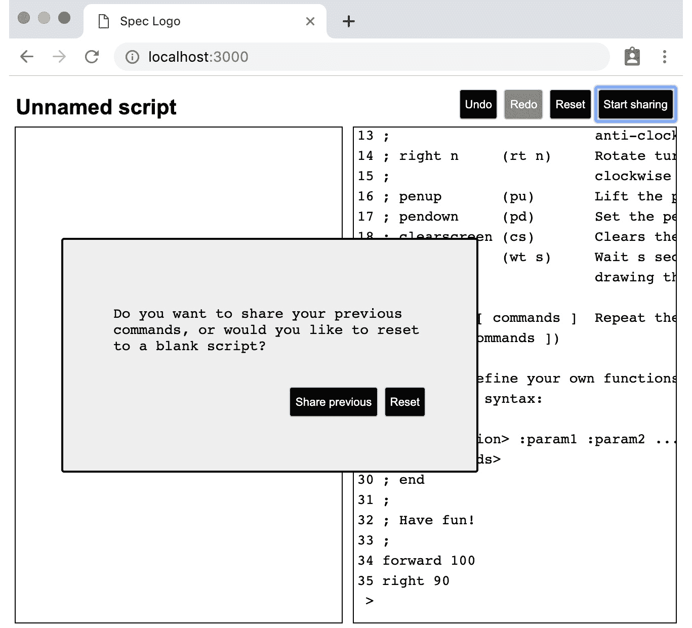

# 18

# 由 Cucumber 测试引导的特性

在上一章中，我们学习了编写 Cucumber 测试的基本元素以及如何使用 Puppeteer 操作我们的 UI。但我们还没有探讨这些技术如何融入更广泛的开发生成过程。在本章中，我们将实现一个新的应用程序功能，但首先从 Cucumber 测试开始。这些将作为验收测试，我们的（虚构的）产品负责人可以使用它来确定软件是否按要求工作。

验收测试

**验收测试**是一个产品负责人或客户可以使用来决定是否接受交付的软件的测试。如果它通过，他们接受软件。如果它失败，开发者必须回去调整他们的工作。

我们可以使用术语**验收测试驱动开发（ATDD）**来指代一个整个团队都可以参与的测试工作流程。将其视为类似于 TDD，但它是在更广泛的团队层面上进行的，产品负责人和客户都参与其中。使用 Cucumber 编写 BDD 测试是将 ATDD 引入团队的一种方式——但不是唯一的方式。

在本章中，我们将使用我们的 BDD 风格的 Cucumber 测试作为我们的验收测试。

想象一下，我们的产品负责人已经看到了我们构建**Spec Logo**所做的出色工作。他们注意到共享屏幕功能很好，但还可以添加一些功能：它应该给演讲者提供在开始共享之前重置其状态的选择，如下所示：



图 18.1 – 新的共享对话框

产品负责人为我们提供了一些目前为红色以供实施的 Cucumber 测试——包括步骤定义和生成代码。

本章涵盖了以下主题：

+   为对话框添加 Cucumber 测试

+   通过测试驱动生产代码修复 Cucumber 测试

+   避免在测试代码中使用超时

到本章结束时，你将看到更多关于 Cucumber 测试的示例以及它们如何作为团队工作流程的一部分被使用。你还将了解到如何避免在代码中使用特定的超时设置。

# 技术要求

本章的代码文件可以在以下位置找到：

[`github.com/PacktPublishing/Mastering-React-Test-Driven-Development-Second-Edition/tree/main/Chapter18`](https://github.com/PacktPublishing/Mastering-React-Test-Driven-Development-Second-Edition/tree/main/Chapter18)

# 为对话框添加 Cucumber 测试

在本节中，我们将添加一个新的 Cucumber 测试，它目前不会通过。

让我们先看看这个新功能：

1.  打开`features/sharing.feature`文件，看看你被给出的第一个特性。阅读步骤并尝试理解我们的产品负责人在描述什么。测试覆盖了很多行为——与我们的单元测试不同。它讲述了一个完整的故事：

    ```js
    Scenario: Presenter chooses to reset current state when sharing
      Given the presenter navigated to the application page
      And the presenter entered the following instructions at the prompt:
        | forward 10 |
        | right 90 |
      And the presenter clicked the button 'startSharing'
      When the presenter clicks the button 'reset'
      And the observer navigates to the presenter's sharing link
      Then the observer should see no lines
      And the presenter should see no lines
      And the observer should see the turtle at x = 0, y = 0, angle = 0
      And the presenter should see the turtle at x = 0, y = 0, angle = 0
    ```

1.  第一个`the presenter navigated to the application page`已经工作，如果你运行`npx cucumber-js`，你可以验证这一点。

1.  下一个步骤 `the presenter entered the following instructions at the prompt` 与上一章的一个步骤非常相似。我们本可以选择在这里提取共性，就像我们处理 `browseToPageFor` 函数那样；然而，我们将等待测试和实现完成后再进行重构。现在，我们只是复制代码。打开 `features/support/sharing.steps.js` 并在代码底部添加以下步骤定义：

    ```js
    When(
      "the presenter entered the following instructions at the prompt:",
      async function(dataTable) {
        for (let instruction of dataTable.raw()) {
          await this.getPage("presenter").type(
           "textarea",
           `${instruction}\n`
          );
          await this.getPage(
            "presenter"
          ).waitForTimeout(3500);
        }
      }
    );
    ```

1.  接下来是 `the presenter clicked the button 'startSharing'`。在这之后出现的行是第一个 `npx cucumber-js`，你将获得这个函数的模板代码。将模板代码复制并粘贴到你的步骤定义文件中，如下面的代码块所示：

    ```js
    When(
      "the presenter clicks the button {string}",
      function (string) {
        // Write code here that turns the phrase above
        // into concrete actions
        return "pending";
      }
    );
    ```

两个 When 语句

这个场景有两个 `When` 语句，这是不寻常的。就像你在 **Act** 阶段的单元测试一样，你通常只想有一个 **When** 语句。然而，由于此时有两个用户一起工作，为这两个用户有一个单一的操作是有意义的，所以我们将在这个场合让我们的产品所有者免责。

1.  这个步骤定义与我们之前编写的非常相似。按照以下代码块所示填写函数。这里有一个新的 `waitForSelector` 调用。这个调用在我们继续之前等待按钮出现在页面上，这给了对话框渲染的时间：

    ```js
    When(
      "the presenter clicks the button {string}",
      async function (
        buttonId
      ) {
        await this.getPage(
          "presenter"
        ).waitForSelector(`button#${buttonId}`);
        await this.getPage(
          "presenter"
        ).click(`button#${buttonId}`);
      }
    );
    ```

1.  第二个 `Then` 子句。第一个是 `the observer should see no lines`；运行 `npx cucumber-js` 并复制 Cucumber 提供的模板函数，如下面的代码块所示：

    ```js
    Then("the observer should see no lines", function () {
      // Write code here that turns the phrase above
      // into concrete actions
      return "pending";
    });
    ```

1.  对于这个步骤，我们想要断言页面上没有线元素：

    ```js
    Then(
      "the observer should see no lines",
      async function () {
        const numLines = await this.getPage(
          "observer"
        ).$$eval("line", lines => lines.length);
        expect(numLines).toEqual(0);
      }
    );
    ```

1.  运行 `npx cucumber-js`，你应该会看到这个步骤通过了，下一个步骤非常相似。复制你刚才编写的步骤定义，并修改它以适用于演示者，如下面的代码块所示。同样，我们稍后可以清理重复的部分：

    ```js
    Then(
      "the presenter should see no lines",
      async function () {
        const numLines = await this.getPage(
          "presenter"
        ).$$eval("line", lines => lines.length);
        expect(numLines).toEqual(0);
      }
    );
    ```

1.  现在运行 Cucumber，你会看到这个步骤失败了；这是我们遇到的第一次失败。它指向我们需要在代码库中做出的具体更改：

    ```js
    ✖ And the presenter should see no lines
       Error: expect(received).toEqual(expected)
       Expected value to equal:
       0
       Received:
       1
    ```

1.  由于我们已经遇到了一个红色步骤，我们现在可以回过头来开始编写代码，使其变为绿色。然而，因为我们只有两个几乎相同的子句需要完成，我将选择在继续之前完成这些定义。Cucumber 告诉我们应使用哪个模板函数，所以现在添加如下：

    ```js
    Then(
      "the observer should see the turtle at x = {int}, y = {int}, angle = {int}",
      function (int, int2, int3) {
        // Write code here that turns the phrase above
        // into concrete actions
        return "pending";
    });
    ```

1.  我们需要定义几个辅助函数，可以告诉我们海龟当前的 *x*、*y* 和角度值。我们需要这样做，因为我们只有 SVG `polygon` 元素，它使用 `points` 字符串和 `transform` 字符串来定位海龟。我们的辅助函数将把这些字符串转换回数字。作为提醒，以下是海龟初始的位置：

    ```js
    <polygon
      points="-5,5, 0,-7, 5,5"
      fill="green"
      stroke-width="2"
      stroke="black"
      transform="rotate(90, 0, 0)" />
    ```

我们可以使用第一个`points`坐标来计算*x*和*y*，通过将第一个数字加 5，从第二个数字减 5。角度可以通过将旋转的第一个参数减去 90 来计算。创建一个名为`features/support/turtle.js`的新文件，然后添加以下两个定义：

```js
export const calculateTurtleXYFromPoints = points => {
  const firstComma = points.indexOf(",");
  const secondComma = points.indexOf(
    ",",
    firstComma + 1
  );
  return {
    x:
      parseFloat(
        points.substring(0, firstComma)
      ) + 5,
    y:
      parseFloat(
        points.substring(firstComma + 1, secondComma)
      ) - 5
  };
};
export const calculateTurtleAngleFromTransform = (
  transform 
) => {
  const firstParen = transform.indexOf("(");
  const firstComma = transform.indexOf(",");
  return (
    parseFloat(
      transform.substring(
        firstParen + 1, 
        firstComma
      )
    ) - 90
  );
}
```

1.  在`feature/sharing.steps.js`中，更新步骤定义，如下面的代码块所示：

    ```js
    Then(
      "the observer should see the turtle at x = {int}, y = {int}, angle = {int}",
      async function (
        expectedX, expectedY, expectedAngle
      ) {
        await this.getPage(
          "observer"
        ).waitForTimeout(4000);
        const turtle = await this.getPage(
          "observer"
        ).$eval(
          "polygon",
          polygon => ({
            points: polygon.getAttribute("points"),
            transform: polygon.getAttribute("transform")
          })
        );
        const position = calculateTurtleXYFromPoints(
          turtle.points
        );
        const angle = calculateTurtleAngleFromTransform(
          turtle.transform
        );
        expect(position.x).toBeCloseTo(expectedX);
        expect(position.y).toBeCloseTo(expectedY);
        expect(angle).toBeCloseTo(expectedAngle);
      }
    );
    ```

1.  最后，按照以下方式为演示者重复此步骤定义：

    ```js
    Then(
      "the presenter should see the turtle at x = {int}, y = {int}, angle = {int}",
      async function (
        expectedX, expectedY, expectedAngle
      ) {
        await this.getPage(
          "presenter"
        ).waitForTimeout(4000);
        const turtle = await this.getPage(
          "presenter"
        ).$eval(
          "polygon",
          polygon => ({
            points: polygon.getAttribute("points"),
            transform: polygon.getAttribute("transform")
          })
        );
        const position = calculateTurtleXYFromPoints(   
          turtle.points
        );
        const angle = calculateTurtleAngleFromTransform(
          turtle.transform
        );
        expect(position.x).toBeCloseTo(expectedX);
        expect(position.y).toBeCloseTo(expectedY);
        expect(angle).toBeCloseTo(expectedAngle);
      }
    );
    ```

那是第一个测试；现在，让我们继续到第二个场景：

1.  我们第二个场景的大部分步骤定义已经实现；只有两个还没有：

    ```js
      Then these lines should have been drawn for the observer:
        | x1 | y1 | x2 | y2 |
        | 0 | 0 | 10 | 0 |
      And these lines should have been drawn for the presenter:
        | x1 | y1 | x2 | y2 |
        | 0 | 0 | 10 | 0 |
    ```

我们已经在`features/support/drawing.steps.js`中有一个与这两个非常相似的步骤定义。让我们将这个逻辑提取到一个单独的模块中，这样我们就可以重用它。创建一个名为`features/support/svg.js`的新文件，然后从绘图步骤定义中复制以下代码：

```js
import expect from "expect";
export const checkLinesFromDataTable = page =>
  return async function (dataTable) {
    await this.getPage(page).waitForTimeout(2000);
    const lines = await this.getPage(page).$$eval(
      "line",
      lines =>
        lines.map(line => ({
          x1: parseFloat(line.getAttribute("x1")),
          y1: parseFloat(line.getAttribute("y1")),
          x2: parseFloat(line.getAttribute("x2")),
          y2: parseFloat(line.getAttribute("y2"))
        }))
    );
    for (let i = 0; i < lines.length; ++i) {
      expect(lines[i].x1).toBeCloseTo(
        parseInt(dataTable.hashes()[i].x1)
      );
      expect(lines[i].y1).toBeCloseTo(
        parseInt(dataTable.hashes()[i].y1)
      );
      expect(lines[i].x2).toBeCloseTo(
        parseInt(dataTable.hashes()[i].x2)
      );
      expect(lines[i].y2).toBeCloseTo(
        parseInt(dataTable.hashes()[i].y2)
      );
    }
  };
```

1.  在`features/support/drawing.steps.js`中，修改`这些行应该已经被绘制`步骤定义，使其现在使用此函数：

    ```js
    import { checkLinesFromDataTable } from "./svg";
    Then(
      "these lines should have been drawn:",
      checkLinesFromDataTable("user")
    );
    ```

1.  我们最新共享场景的两个新步骤定义现在很简单。在`features/support/sharing.steps.js`中，添加以下`import`语句和步骤定义：

    ```js
    import { checkLinesFromDataTable } from "./svg";
    Then(
      "these lines should have been drawn for the presenter:",
      checkLinesFromDataTable("presenter")
    );
    Then(
      "these lines should have been drawn for the observer:",
      checkLinesFromDataTable("observer")
    );
    ```

您现在已经看到了如何编写较长的步骤定义以及如何将公共功能提取到支持函数中。

步骤定义完成后，是时候让这两个场景都通过了。

# 通过测试驱动生产代码来修复 Cucumber 测试

在本节中，我们将先进行一些初步设计，然后编写单元测试，以覆盖 Cucumber 测试的功能，然后使用这些测试来构建新的实现。

让我们进行一些初步设计：

+   当用户点击**开始共享**时，应该弹出一个带有**重置**按钮的对话框。

+   如果用户选择重置，Redux 存储将发送一个带有新`reset`属性设置为`true`的`START_SHARING`动作：

    ```js
    { type: "START_SHARING", reset: true }
    ```

+   如果用户选择共享他们的现有命令，则`START_SHARING`动作将带有`reset`设置为`false`发送：

    ```js
    { type: "START_SHARING", reset: false }
    ```

+   当用户点击`RESET`动作应该发送到 Redux 存储。

+   在`RESET`动作发生之后，才应该开始共享。

那就是我们所需要的所有初步设计。让我们继续集成`Dialog`组件。

## 添加对话框

既然我们知道我们要构建什么，那就让我们开始吧！为此，执行以下步骤：

1.  打开`test/MenuButtons.test.js`并跳过标题为`当点击开始共享时触发 START_SHARING 动作`的测试。我们暂时将这个连接断开。但我们会回来修复它：

    ```js
    it.skip("dispatches an action of START_SHARING when start sharing is clicked", () => {
      ...
    });
    ```

1.  在同一文件中，添加一个新的`import`语句用于`Dialog`组件，并使用`jest.mock`进行模拟。`Dialog`组件已经在代码库中存在，但直到现在还没有被使用：

    ```js
    import { Dialog } from "../src/Dialog";
    jest.mock("../src/Dialog", () => ({
      Dialog: jest.fn(() => <div id="Dialog" />),
    });
    ```

1.  在你跳过的测试下面添加这个新测试。非常简单，它检查在点击适当的按钮时显示对话框：

    ```js
    it("opens a dialog when start sharing is clicked", () => {
      renderWithStore(<MenuButtons />);
      click(buttonWithLabel("Start sharing"));
      expect(Dialog).toBeCalled();
    });
    ```

1.  在`src/MenuButtons.js`中，向 JSX 添加一个新的`Dialog`元素，包括文件顶部的`import`语句。新组件应放置在返回的 JSX 的底部。然后测试应该通过：

    ```js
    import { Dialog } from "./Dialog";
    export const MenuButtons = () => {
      ...
      return (
        <>
          ...
         <Dialog />
        </>
      );
    };
    ```

1.  接下来，让我们设置`message`属性以对用户更有用。将此添加到你的测试套件中：

    ```js
    it("prints a useful message in the sharing dialog", () => {
      renderWithStore(<MenuButtons />);
      click(buttonWithLabel("Start sharing"));
      expect(propsOf(Dialog).message).toEqual(
        "Do you want to share your previous commands, or would you like to reset to a blank script?"
      );
    });
    ```

1.  为了使这个测试通过，向你的实现添加`message`属性：

    ```js
    <Dialog
      message="Do you want to share your previous commands, or would you like to reset to a blank script?"
    />
    ```

1.  现在，我们需要确保在点击分享按钮之前不显示对话框；添加以下测试：

    ```js
    it("does not initially show the dialog", () => {
      renderWithStore(<MenuButtons />);
      expect(Dialog).not.toBeCalled();
    });
    ```

1.  通过添加一个新的状态变量`isSharingDialogOpen`来使这个测试通过。分享按钮在点击时将此设置为`true`。你需要在文件顶部添加`useState`的`import`语句：

    ```js
    import React, { useState } from "react";
    export const MenuButtons = () => {
      const [
        isSharingDialogOpen, setIsSharingDialogOpen
      ] = useState(false);
      const openSharingDialog = () =>
       setIsSharingDialogOpen(true);
      ...
      return (
        <>
          ...
          {environment.isSharing ? (
            <button
              id="stopSharing"
              onClick={() => dispatch(stopSharing())}
            >
              Stop sharing
            </button>
          ) : (
            <button
              id="startSharing"
              onClick={openSharingDialog}
            >
              Start sharing
            </button>
          )}
          {isSharingDialogOpen ? (
            <Dialog
              message="..."
            />
          ) : null}
        </>
      );
    };
    ```

1.  现在，让我们添加一个测试来添加按钮到对话框。这是通过在`Dialog`组件上指定`buttons`属性来完成的：

    ```js
    it("passes Share and Reset buttons to the dialog", () => {
      renderWithStore(<MenuButtons />);
      click(buttonWithLabel("Start sharing"));
      expect(propsOf(Dialog).buttons).toEqual([
        { id: "keep", text: "Share previous" },
        { id: "reset", text: "Reset" }
      ]);
    });
    ```

1.  通过向`Dialog`组件添加`buttons`属性来使这个测试通过，如下所示：

    ```js
    {isSharingDialogOpen ? (
      <Dialog
        message="..."
        buttons={[
         { id: "keep", text: "Share previous" },
         { id: "reset", text: "Reset" }
        ]}
      />
    ) : null}
    ```

1.  对于下一个测试，我们将测试对话框是否关闭。首先在你的测试套件中定义一个新的`closeDialog`辅助函数：

    ```js
    const closeDialog = () =>
      act(() => propsOf(Dialog).onClose());
    ```

1.  添加下一个测试，检查一旦对话框调用了`onClose`属性，`Dialog`组件就会消失：

    ```js
    it("closes the dialog when the onClose prop is called", () => {
      renderWithStore(<MenuButtons />);
      click(buttonWithLabel("Start sharing"));
      closeDialog();
      expect(element("#dialog")).toBeNull();
    });
    ```

1.  通过在`Dialog` JSX 中添加以下行来使这个测试通过：

    ```js
    <Dialog
      onClose={() => setIsSharingDialogOpen(false)}
      ...
    />
    ```

1.  现在回到你跳过的测试，并修改它，使其与以下代码块相同。我们将修改`START_SHARING` Redux 动作以接受一个新的`reset`布尔变量：

    ```js
    const makeDialogChoice = button =>
      act(() => propsOf(Dialog).onChoose(button));
    it("dispatches an action of START_SHARING when dialog onChoose prop is invoked with reset", () => {
      renderWithStore(<MenuButtons />);
      click(buttonWithLabel("Start sharing"));
      makeDialogChoice("reset");
      return expectRedux(store)
        .toDispatchAnAction()
        .matching({ type: "START_SHARING", reset: true });
    });
    ```

1.  为了使这个测试通过，转到`src/MenuButtons.js`并修改`startSharing`函数，为创建的 Redux 动作添加一个`reset`属性。注意我们目前将值硬编码为`true`——我们将在即将到来的测试中进行三角测量：

    ```js
    const startSharing = () => ({
      type: "START_SHARING",
      reset: true,
    });
    ```

测试中的三角测量

查看*第一章**，使用测试驱动开发的第一步*，以了解三角测量的提醒以及为什么我们要这样做。

1.  在`MenuButtons`组件中，设置`Dialog`组件的`onChoose`属性：

    ```js
    return (
      <>
        ...
        {isSharingDialogOpen ? (
          <Dialog
            onClose={() => setIsSharingDialogOpen(false)}
            onChoose={() => dispatch(startSharing())}
            ...
          />
        ) : null}
      </>
    );
    ```

1.  最后，我们需要添加一个新的测试，用于发送`false`值给`reset`动作属性：

    ```js
    it("dispatches an action of START_SHARING when dialog onChoose prop is invoked with share", () => {
      renderWithStore(<MenuButtons />);
      click(buttonWithLabel("Start sharing"));
      makeDialogChoice("share");
      return expectRedux(store)
        .toDispatchAnAction()
        .matching({
          type: "START_SHARING",
          reset: false
        });
    });
    ```

1.  为了使这个测试通过，修改`startSharing`以接受一个`button`参数，然后使用它来设置`reset`属性：

    ```js
    const startSharing = (button) => ({
      type: "START_SHARING",
      reset: button === "reset",
    });
    ```

1.  然后，最后，在`MenuButtons`组件 JSX 中，设置`Dialog`元素的`onChoose`属性：

    ```js
    onChoose={(button) => dispatch(startSharing(button))}
    ```

你现在已经完成了 Cucumber 测试中指定的第一个新功能。有一个对话框正在显示，并且一个`reset`布尔标志正在通过 Redux 存储发送。我们正在逐步接近一个可工作的解决方案。

## 更新 sagas 到重置或回放状态

现在，我们需要更新分享 saga 以处理新的重置标志：

1.  打开`test/middleware/sharingSagas.test.js`，并在`START_SHARING`嵌套`describe`块的末尾添加以下测试：

    ```js
    it("puts an action of RESET if reset is true", async () => {
      store.dispatch({
        type: "START_SHARING",
        reset: true,
      });
      await notifySocketOpened();
      await sendSocketMessage({
        type: "UNKNOWN",
        id: 123,
      });
      return expectRedux(store)
        .toDispatchAnAction()
        .matching({ type: "RESET" });
    });
    ```

1.  在`src/middleware/sharingSagas.js`中修改`startSharing`，使其与以下代码块相同。别忘了将新的`action`参数添加到第一行：

    ```js
    function* startSharing(action) {
      ...
      if (action.reset) {
        yield put({ type: "RESET" });
      }
    }
    ```

1.  现在是棘手的第二个测试。如果`reset`是`false`，我们希望重新播放所有当前的动作：

    ```js
    it("shares all existing actions if reset is false", async () => {
      const forward10 = {
        type: "SUBMIT_EDIT_LINE",
        text: "forward 10",
      };
      const right90 = {
        type: "SUBMIT_EDIT_LINE",
        text: "right 90"
      };
      store.dispatch(forward10);
      store.dispatch(right90);
      store.dispatch({
        type: "START_SHARING",
        reset: false,
      });
      await notifySocketOpened();
      await sendSocketMessage({
        type: "UNKNOWN",
        id: 123,
      });
      expect(sendSpy).toBeCalledWith(
        JSON.stringify({
          type: "NEW_ACTION",
          innerAction: forward10,
        })
      );
      expect(sendSpy).toBeCalledWith(
        JSON.stringify({
          type: "NEW_ACTION",
          innerAction: right90
        })
      );
    });
    ```

1.  要使这通过，我们可以使用`export`命名空间中的`toInstructions`函数。我们还需要使用两个新的`redux-saga`函数：`select`和`all`。`select`函数用于检索状态，而`all`函数与`yield`一起使用，以确保在继续之前等待所有传递的调用完成。现在将那些`import`语句添加到`src/middleware/sharingSagas.js`中：

    ```js
    import {
      call,
      put,
      takeLatest,
      take,
      all,
      select
    } from "redux-saga/effects";
    import { eventChannel, END } from "redux-saga";
    import { toInstructions } from "../language/export";
    ```

1.  现在，通过在条件语句后面添加一个`else`块来修改`startSharing`函数。

    ```js
    if (action.reset) {
      yield put({ type: "RESET" });
    } else {
      const state = yield select(state => state.script);
      const instructions = toInstructions(state);
      yield all(
        instructions.map(instruction =>
          call(shareNewAction, {
            innerAction: {
              type: "SUBMIT_EDIT_LINE",
              text: instruction
            }
          })
        )
      );
    }
    ```

1.  如果你现在运行测试，你会注意到有几个无关的失败。我们可以通过在我们的测试中的`startSharing`辅助方法中为`reset`属性添加一个默认值来修复这些问题：

    ```js
    const startSharing = async () => {
      store.dispatch({
        type: "START_SHARING",
        reset: true
      });
      ...
    };
    ```

这样就完成了功能；单元测试和 Cucumber 测试都应该通过。现在手动尝试一下也是个不错的选择。

在下一节中，我们将专注于重构我们的 Cucumber 测试，使它们运行得更快。

# 避免测试代码中的超时

在本节中，我们将通过用`waitForSelector`调用替换`waitForTimeout`调用，来提高我们的 Cucumber 测试运行的速度。

我们的大多数步骤定义都包含等待，在等待动画完成的同时暂停我们的测试脚本与浏览器的交互。以下是我们测试中的一个示例，它等待了 3 秒钟：

```js
await this.getPage("user").waitForTimeout(3000);
```

不仅这个超时会减慢测试套件，这种等待方式也很脆弱，因为可能存在超时稍微太短而动画尚未完成的情况。在这种情况下，测试将间歇性失败。相反，等待期实际上相当长。随着更多测试的添加，超时累积，测试运行突然变得非常慢。

避免超时

无论自动化测试的类型如何，避免在测试代码中使用超时都是一个好主意。超时将显著增加运行测试套件所需的时间。几乎总是有方法可以避免使用它们，就像本节中突出显示的那样。

我们可以做的替代方案是修改我们的生产代码，在元素动画时通知我们，通过设置一个`isAnimating`类。然后我们使用 Puppeteer 的`waitForSelector`函数来检查这个类值的改变，完全替换`waitForTimeout`。

## 添加 HTML 类以标记动画状态

我们这样做是通过在动画运行时给 viewport 的`div`元素添加一个`isAnimating`类。

让我们从在`Drawing`元素准备好动画一个新 Logo 命令时添加`isAnimating`类开始：

1.  在`test/Drawing.test.js`中，在主`Display`上下文中的重置上下文下方添加一个新的嵌套`describe`块。然后，添加以下测试：

    ```js
    describe("isAnimating", () => {
      it("adds isAnimating class to viewport when animation begins", () => {
        renderWithStore(<Drawing />, {
          script: { drawCommands: [horizontalLine] }
        });
        triggerRequestAnimationFrame(0);
        expect(
          element("#viewport")
        ).toHaveClass("isAnimating");
      });
    });
    ```

1.  在`src/Drawing.js`中，更新 JSX 以在`viewport`元素上包含这个类名：

    ```js
    return (
      <div
        id="viewport"
        className="isAnimating"
      >
        ...
      </div>
    );
    ```

1.  让我们进行三角测量，以便将这个状态变量放在合适的位置。为此，添加以下测试：

    ```js
    it("initially does not have the isAnimating class set", () => {
      renderWithStore(<Drawing />, {
        script: { drawCommands: [] }
      });
      expect(
        element("#viewport")
      ).not.toHaveClass("isAnimating");
    });
    ```

1.  为了使这个测试通过，将`className`更新为仅在`commandToAnimate`不为 null 时设置`isAnimating`：

    ```js
    className={commandToAnimate ? "isAnimating" : ""}>
    ```

1.  作为最后的点缀，我们将添加一个可能不必要的测试。我们想要在动画完成后小心地移除`isAnimating`类。然而，我们的实现已经处理了这个问题，因为当发生这种情况时，`commandToAnimate`将被设置为`undefined`。换句话说，我们不需要为此进行显式的测试，这个添加就完成了。然而，为了完整性，你可以添加这个测试：

    ```js
    it("removes isAnimating class when animation is finished", () => {
      renderWithStore(<Drawing />, {
        script: { drawCommands: [horizontalLine] },
      });
      triggerAnimationSequence([0, 500]);
      expect(element("#viewport")).not.toHaveClass(
        "isAnimating"
      );
    });
    ```

完成了添加`isAnimating`类功能。现在我们可以使用这个类作为替换`waitForTimeout`调用的手段。

## 更新步骤定义以使用 waitForSelector

我们已经准备好在我们的步骤定义中使用这种新行为，引入一个新的`waitForSelector`调用，等待元素上的`isAnimating`类出现（或消失）：

1.  在`features/support/world.js`中，向`World`类添加以下两个方法。第一个方法等待`isAnimating`选择器在 DOM 中出现，第二个方法等待它消失：

    ```js
    waitForAnimationToBegin(page) {
      return this.getPage(page).waitForSelector(
        ".isAnimating"
      );
    }
    waitForAnimationToEnd(page) {
      return this.getPage(page).waitForSelector(
        ".isAnimating",
       { hidden: true }
      );
    }
    ```

1.  在`features/support/drawing.steps.js`中，搜索这个文件中的单个`waitForTimeout`调用，并将其替换为以下代码块：

    ```js
    When(
      "the user enters the following instructions at the prompt:",
      async function (dataTable) {
        for (let instruction of dataTable.raw()) {
          await this.getPage("user").type(
            "textarea",
            `${instruction}\n`
          );
          await this.waitForAnimationToEnd("user");
        }
      }
    );
    ```

注意类转换

我们在每个指令输入后等待动画。这很重要，因为它反映了`isAnimating`类将在应用程序中添加和删除的方式。如果我们只有一个`waitForAnimationToEnd`函数作为页面上的最后一个指令，那么如果在一系列指令的*中间*捕获到`isAnimating`类的移除，而不是捕获*最后一个*，我们可能会提前退出步骤定义。

1.  现在，打开`features/support/sharing.steps.js`；这个文件中有一个与上一个类似的步骤，所以现在以相同的方式更新它：

    ```js
    When(
      "the presenter entered the following instructions at the prompt:",
      async function(dataTable) {
        for (let instruction of dataTable.raw()) {
          await this.getPage("presenter").type(
            "textarea",
            `${instruction}\n`
          );
          await this.waitForAnimationToEnd("presenter");
        }
      }
    );
    ```

1.  在文件底部，更新检查海龟位置的两个步骤定义：

    ```js
    Then(
      "the observer should see the turtle at x = {int}, y = {int}, angle = {int}",
      async function (
        expectedX, expectedY, expectedAngle
      ) {
        await this.waitForAnimationToEnd("observer");
        ...
      }
    );
    Then(
      "the presenter should see the turtle at x = {int}, y = {int}, angle = {int}",
      async function (
        expectedX, expectedY, expectedAngle
      ) {
        await this.waitForAnimationToEnd("presenter");
        ...
      }
    );
    ```

1.  打开`features/support/svg.js`并更新其中的函数，如下所示：

    ```js
    export const checkLinesFromDataTable = page => {
      return async function (dataTable) {
        await this.waitForAnimationToEnd(page);
        ...
      }
    };
    ```

1.  如果你现在运行`npx cucumber-js`，你会看到我们有一个测试失败，这与观察者的屏幕输出有关。它表明我们需要在加载观察者页面时等待动画。在这种情况下，我们需要在等待动画开始之前等待动画结束。我们可以通过向功能添加一个新的步骤来修复这个问题。打开`features/sharing.feature`并修改最后一个测试，在**When**部分包含一个*第三个*条目：

    ```js
    When the presenter clicks the button 'keep'
    And the observer navigates to the presenter's sharing link
    And the observer waits for animations to finish
    ```

封装多个 When 子句

如果您对有三个**When**子句不满意，那么您总是可以将它们合并为一个单独的步骤。

1.  在`features/support/sharing.steps.js`中，在其他的**When**步骤定义之下添加这个新的步骤定义：

    ```js
    When(
      "the observer waits for animations to finish",
      async function () {
        await this.waitForAnimationToBegin("observer");
        await this.waitForAnimationToEnd("observer");
      }
    );
    ```

您的测试现在应该通过了，并且它们应该运行得更快。在我的机器上，它们现在只需要之前四分之一的时间。

# 摘要

在本章中，我们探讨了如何将 Cucumber 集成到您团队的日常工作流程中。

您看到了一些 Cucumber 测试与单元测试不同的方式。您还学习了如何避免使用超时来保持测试套件快速运行。

我们现在已经完成了对**Spec Logo**世界的探索。

在本书的最后一章，我们将探讨 TDD 与其他开发者流程的比较。

# 练习

尽可能地从您的步骤定义中移除重复内容。
