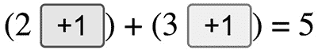
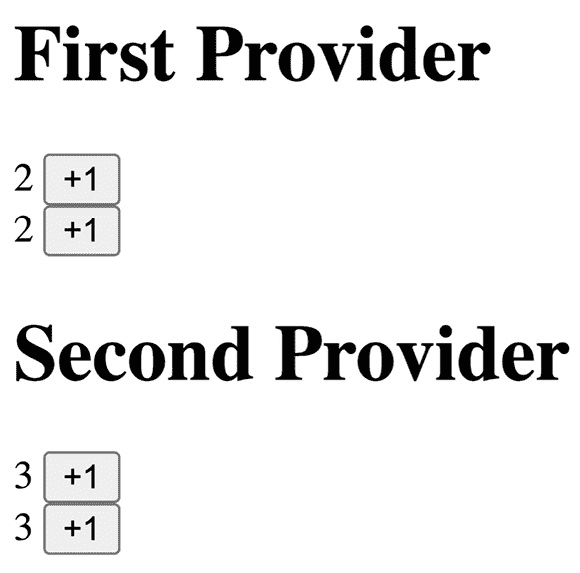
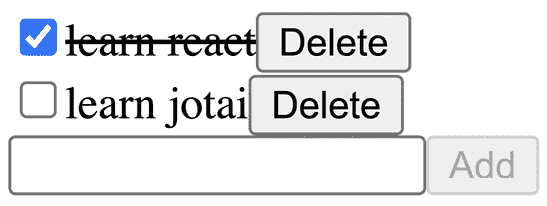

# *第八章*：用例场景 2 – Jotai

Jotai ([`github.com/pmndrs/jotai`](https://github.com/pmndrs/jotai)) 是一个用于全局状态的轻量级库。它模仿了 `useState`/`useReducer`，并使用所谓的原子，这些通常是小的状态片段。与 Zustand 不同，它是一个组件状态，并且像 Zustand 一样，它是一个不可变更新模型。其实现基于我们在 *第五章* 中学到的上下文和订阅模式，*使用上下文和订阅共享组件状态*。

在本章中，我们将学习 Jotai 库的基本用法以及它是如何处理优化重新渲染的。使用原子，库可以跟踪依赖关系并根据依赖关系触发重新渲染。因为 Jotai 内部使用 Context，而原子本身不持有值，所以原子定义是可重用的，与模块状态不同。我们还将讨论一个使用原子的新颖模式，称为 **原子中的原子**，这是一种使用数组结构优化重新渲染的技术。

在本章中，我们将涵盖以下主题：

+   理解 Jotai

+   探索渲染优化

+   理解 Jotai 如何存储原子值

+   添加数组结构

+   使用 Jotai 的不同功能

# 技术要求

预期你具备适度的 React 知识，包括 React hooks。请参考官方网站 [`reactjs.org`](https://reactjs.org) 了解更多。

在某些代码中，我们使用 TypeScript ([`www.typescriptlang.org`](https://www.typescriptlang.org))，你应该对其有基本了解。

本章中的代码可在 GitHub 上找到 [`github.com/PacktPublishing/Micro-State-Management-with-React-Hooks/tree/main/chapter_08`](https://github.com/PacktPublishing/Micro-State-Management-with-React-Hooks/tree/main/chapter_08)。

要运行本章中的代码片段，你需要一个 React 环境——例如，Create React App ([`create-react-app.dev`](https://create-react-app.dev)) 或 CodeSandbox ([`codesandbox.io`](https://codesandbox.io))。

# 理解 Jotai

要理解 Jotai 的 **应用程序编程接口**（**API**），让我们回顾一个简单的计数器示例和 Context 的解决方案。

这里有一个包含两个独立计数器的示例：

```js
const Counter1 = () => {
  const [count, setCount] = useState(0); // [1]
  const inc = () => setCount((c) => c + 1);
  return <>{count} <button onClick={inc}>+1</button></>;
};
const Counter2 = () => {
  const [count, setCount] = useState(0);
  const inc = () => setCount((c) => c + 1);
  return <>{count} <button onClick={inc}>+1</button></>;
};
const App = () => (
  <>
    <div><Counter1 /></div>
    <div><Counter2 /></div>
  </>
);
```

因为这些 `Counter1` 和 `Counter2` 组件有自己的局部状态，所以这些组件中显示的数字是隔离的。

如果我们想让这两个组件共享一个单一的计数状态，我们可以将状态提升并使用 Context 来传递，正如我们在 *第二章* 的 *有效使用局部状态* 部分所讨论的那样，*使用局部和全局状态*。让我们看看一个使用 Context 解决的示例。

首先，我们创建一个 `Context` 变量来保存计数状态，如下所示：

```js
const CountContext = createContext();
const CountProvider = ({ children }) => (
  <CountContext.Provider value={useState(0)}>
    {children}
  </CountContext.Provider>
);
```

注意 `Context` 值与我们在上一个示例中使用的相同状态 `useState(0)`（标记为 **[1]**）。

然后，以下是对修改后的组件的修改，我们将`useState(0)`替换为`useContext(CountContext)`：

```js
const Counter1 = () => {
  const [count, setCount] = useContext(CountContext);
  const inc = () => setCount((c) => c + 1);
  return <>{count} <button onClick={inc}>+1</button></>;
};
const Counter2 = () => {
  const [count, setCount] = useContext(CountContext);
  const inc = () => setCount((c) => c + 1);
  return <>{count} <button onClick={inc}>+1</button></>;
};
```

最后，我们用`CountProvider`包裹这些组件，如下所示：

```js
const App = () => (
  <CountProvider>
    <div><Counter1 /></div>
    <div><Counter2 /></div>
  </CountProvider>
);
```

这使得拥有一个共享的计数状态成为可能，你将看到`Counter1`和`Counter2`组件中的两个`count`数字会同时增加。

现在，让我们看看与 Context 相比，Jotai 是如何有帮助的。使用 Jotai 有两个好处，如下所示：

+   语法简洁性

+   动态原子创建

让我们从第一个好处开始——Jotai 如何帮助简化语法。

## 语法简洁性

为了理解语法的简洁性，让我们看看使用 Jotai 的相同计数示例。首先，我们需要从 Jotai 库中导入一些函数，如下所示：

```js
import { atom, useAtom } from "jotai";
```

`atom`函数和`useAtom`钩子是 Jotai 提供的基本函数。

原子代表状态的一部分。原子通常是一小块状态，它是触发重新渲染的最小单位。`atom`函数创建原子的定义。`atom`函数接受一个参数来指定初始值，就像`useState`一样。以下代码用于定义一个新的原子：

```js
const countAtom = atom(0);
```

注意与`useState(0)`的相似性。

现在，我们在计数组件中使用原子。我们不用`useState(0)`，而是使用`useAtom(countAtom)`，如下所示：

```js
const Counter1 = () => {
  const [count, setCount] = useAtom(countAtom);
  const inc = () => setCount((c) => c + 1);
  return <>{count} <button onClick={inc}>+1</button></>;
};
const Counter2 = () => {
  const [count, setCount] = useAtom(countAtom);
  const inc = () => setCount((c) => c + 1);
  return <>{count} <button onClick={inc}>+1</button></>;
};
```

因为`useAtom(countAtom)`返回与`useState(0)`相同的元组`[count, setCount]`，所以其余的代码不需要更改。

最后，我们的`App`组件与本章的第一个例子相同，即没有使用 Context，如下面的代码片段所示：

```js
const App = () => (
  <>
    <div><Counter1 /></div>
    <div><Counter2 /></div>
  </>
);
```

与本章的第二个例子不同，该例子使用 Context，我们不需要提供者。这是由于 Context 中的“默认存储”，正如我们在*第五章*的*实现 Context 和订阅模式*部分所学的，*使用 Context 和订阅共享组件状态*。当我们需要为不同的子树提供不同的值时，我们可以选择使用提供者。

为了更好地理解 Jotai 中语法的简洁性，假设你想添加另一个全局状态——比如说，`text`；你最终会添加以下代码：

```js
const TextContext = createContext();
const TextProvider = ({ children }) => (
  <TextContext.Provider value={useState("")}>
    {children}
  </TextContext.Provider>
);
const App = () => (
  <TextProvider>
    ...
  </TextProvider>
);
// When you use it in a component
  const [text, setText] = useContext(TextContext);
```

这并不太糟糕。我们添加的是一个 Context 定义和一个提供者定义，并且用`Provider`组件包裹了`App`。你还可以避免提供者嵌套，正如我们在*第三章*的*使用 Context 的最佳实践*部分所学的，*使用 Context 共享组件状态*。

然而，相同的例子也可以用 Jotai 原子来完成，如下所示：

```js
const textAtom = atom("");
// When you use it in a component
  const [text, setText] = useAtom(textAtom);
```

这要简单得多。本质上，我们只添加了一行原子定义。即使我们有更多的原子，我们只需要为每个原子定义一行在 Jotai 中。另一方面，使用 Context 需要为每个状态片段创建一个 Context。虽然可以用 Context 做，但并不简单。Jotai 的语法要简单得多。这是 Jotai 的第一个好处。

虽然语法简洁性很好，但它并没有提供任何新的功能。让我们简要地讨论第二个好处。

## 动态原子创建

Jotai 的第二个好处是新的功能——即动态原子创建。原子可以在 React 组件的生命周期中创建和销毁。这与多上下文方法不同，因为添加新状态意味着添加一个新的`Provider`组件。如果你添加了一个新组件，所有其子组件都将重新挂载，丢弃它们的状态。我们将在*添加数组结构*部分介绍动态原子创建的用例。

Jotai 的实现基于我们在*第五章*学到的内容，*使用上下文和订阅共享组件状态*。Jotai 的 store 基本上是一个原子配置对象和原子值的`WeakMap`对象([`developer.mozilla.org/en-US/docs/Web/JavaScript/Reference/Global_Objects/WeakMap`](https://developer.mozilla.org/en-US/docs/Web/JavaScript/Reference/Global_Objects/WeakMap))。一个`atom`函数。`useAtom`钩子返回。Jotai 中的订阅是基于原子的，这意味着`useAtom`钩子订阅了`store`中的某个原子。基于原子的订阅提供了避免额外重新渲染的能力。我们将在下一节进一步讨论这一点。

在本节中，我们讨论了 Jotai 库的基本心智模型和 API。接下来，我们将深入了解原子模型是如何解决渲染优化的。

# 探索渲染优化

让我们回顾一下基于选择器的渲染优化。我们将从一个例子开始，这个例子来自*第四章*，*使用订阅共享模块状态*，在那里我们创建了`createStore`和`useStoreSelector`。

让我们使用`createStore`定义一个新的`store`对象`person`。我们定义三个属性：`firstName`、`lastName`和`age`，如下所示：

```js
const personStore = createStore({
  firstName: "React",
  lastName: "Hooks",
  age: 3,
});
```

假设我们想要创建一个显示`firstName`和`lastName`的组件。一种直接的方法是选择这些属性。以下是一个使用`useStoreSelector`的例子：

```js
const selectFirstName = (state) => state.firstName;
const selectLastName = (state) => state.lastName;
const PersonComponent = () => {
  const firstName =
    useStoreSelector(store, selectFirstName);
  const lastName = useStoreSelector(store, selectLastName);
  return <>{firstName} {lastName}</>;
};
```

由于我们只从`store`中选择了两个属性，当未选择的属性`age`发生变化时，`PersonComponent`不会重新渲染。

这种`store`和选择器方法就是我们所说的`store`，它包含了一切，并在需要时从`store`中选择状态片段。

现在，Jotai 原子对于相同的示例会是什么样子呢？首先，我们定义原子，如下所示：

```js
const firstNameAtom = atom("React");
const lastNameAtom = atom("Hooks");
const ageAtom = atom(3);
```

原子是触发重新渲染的单位。你可以将原子做得尽可能小以控制重新渲染，就像原始值一样。但原子也可以是对象。

`PersonComponent`可以使用`useAtom`钩子实现，如下所示：

```js
const PersonComponent = () => {
  const [firstName] = useAtom(firstNameAtom);
  const [lastName] = useAtom(lastNameAtom);
  return <>{firstName} {lastName}</>;
};
```

因为这与`ageAtom`没有关系，所以当`ageAtom`的值发生变化时，`PersonComponent`不会重新渲染。

原子可以尽可能小，但这意味着我们可能会有太多的原子需要组织。Jotai 有一个关于派生原子的概念，你可以从现有原子中创建另一个原子。让我们创建一个名为`personAtom`的变量，它包含名字、姓氏和年龄。我们可以使用`atom`函数，它接受一个`read`函数来生成派生值。代码在以下代码片段中展示：

```js
const personAtom = atom((get) => ({
  firstName: get(firstNameAtom),
  lastName: get(lastNameAtom),
  age: get(ageAtom),
}));
```

`read`函数接受一个名为`get`的参数，你可以通过它引用其他原子并获取它们的值。`personAtom`的值是一个具有三个属性的对象——`firstName`、`lastName`和`age`。这个值在任何一个属性发生变化时都会更新，这意味着当`firstNameAtom`、`lastNameAtom`或`ageAtom`更新时。这被称为依赖跟踪，并且由 Jotai 库自动完成。

重要提示

依赖跟踪是动态的，适用于条件评估。例如，假设一个`read`函数是`(get) => get(a) ? get(b) : get(c)`。在这种情况下，如果`a`的值是真实的，则依赖项是`a`和`b`，而如果`a`的值是假的，则依赖项是`a`和`c`。

使用`personAtom`，我们可以重新实现`PersonComponent`，如下所示：

```js
const PersonComponent = () => {
  const person = useAtom(personAtom);
  return <>{person.firstName} {person.lastName}</>;
};
```

然而，这并不是我们预期的结果。当`ageAtom`改变其值时，它会重新渲染，从而引起额外的重新渲染。

为了避免额外的重新渲染，我们应该创建一个只包含我们使用的值的派生原子。这里有一个名为`fullNameAtom`的另一个原子：

```js
const fullNameAtom = atom((get) => ({
  firstName: get(firstNameAtom),
  lastName: get(lastNameAtom),
}));
```

使用`fullNameAtom`，我们可以再次实现`PersonComponent`，如下所示：

```js
const PersonComponent = () => {
  const person = useAtom(fullNameAtom);
  return <>{person.firstName} {person.lastName}</>;
};
```

多亏了`fullNameAtom`，即使`ageAtom`的值发生变化，它也不会重新渲染。

我们称这为**自下而上**的方法。我们创建小的原子并将它们组合起来创建更大的原子。我们可以通过仅添加将在组件中使用到的原子来优化重新渲染。优化不是自动的，但在原子模型中更为直接。

我们如何使用存储和选择器方法来完成最后一个示例？以下是一个使用`identity`选择器的示例：

```js
const identity = (x) => x;
const PersonComponent = () => {
  const person = useStoreSelector(store, identity);
  return <>{person.firstName} {person.lastName}</>;
};
```

如你所猜，这会导致额外的重新渲染。当`store`中的`age`属性发生变化时，组件会重新渲染。

一种可能的修复方法是只选择`firstName`和`lastName`。以下示例说明了这一点：

```js
const selectFullName = (state) => ({
  firstName: state.firstName,
  lastName: state.lastName,
});
const PersonComponent = () => {
  const person = useStoreSelector(store, selectFullName);
  return <>{person.firstName} {person.lastName}</>;
};
```

很遗憾，这不起作用。当 `age` 发生变化时，`selectFullName` 函数会被重新评估，并返回一个具有相同属性值的新对象。`useStoreSelector` 假设新对象可能包含新值并触发重新渲染，这导致额外的重新渲染。这是选择器方法的一个已知问题，典型的解决方案是使用自定义相等函数或记忆化技术。

原子模型的优点是原子组合可以轻松地与组件中将要显示的内容相关联。因此，控制重新渲染非常简单。使用原子的渲染优化不需要自定义相等函数或记忆化技术。

让我们通过一个反例来了解派生原子。首先，我们定义两个 `count` 原子，如下所示：

```js
const count1Atom = atom(0);
const count2Atom = atom(0);
```

我们定义一个组件来使用那些 `count` 原子。我们不是定义两个计数组件，而是定义一个适用于两个原子的单个 `Counter` 组件。为此，组件接收 `countAtom` 作为其 `props`，如下面的代码片段所示：

```js
const Counter = ({ countAtom }) => {
  const [count, setCount] = useAtom(countAtom);
  const inc = () => setCount((c) => c + 1);
  return <>{count} <button onClick={inc}>+1</button></>;
};
```

这对于任何 `countAtom` 配置都是可重用的。即使我们定义了一个新的 `count3Atom` 配置，我们也不需要定义一个新的组件。

接下来，我们定义一个派生原子，用于计算两个计数的总数。我们使用 `atom` 和一个 `read` 函数作为第一个参数，如下所示：

```js
const totalAtom = atom(
  (get) => get(count1Atom) + get(count2Atom)
);
```

使用 `read` 函数，`atom` 将创建一个派生原子。派生原子的值是 `read` 函数的结果。只有当依赖项发生变化时，派生原子才会重新评估其 `read` 函数并更新其值。在这种情况下，`count1Atom` 或 `count2Atom` 发生变化。

`Total` 组件是一个用于使用 `totalAtom` 并显示 `total` 数值的组件，如下面的代码片段所示：

```js
const Total = () => {
  const [total] = useAtom(totalAtom);
  return <>{total}</>;
};
```

`totalAtom` 是一个派生原子，它是只读的，因为它的值是 `read` 函数的结果。因此，没有设置 `totalAtom` 值的概念。

最后，我们定义一个 `App` 组件。它将 `count1Atom` 和 `count2Atom` 传递给 `Counter` 组件，如下所示：

```js
const App = () => (
  <>
    (<Counter countAtom={count1Atom} />)
    +
    (<Counter countAtom={count2Atom} />)
    =
    <Total />  
  </>
);
```

原子可以作为 `props` 传递，例如本例中的 `Counter` 原子，或者可以通过任何其他方式传递——模块级别的常量、`props`、上下文，甚至作为其他原子中的值。我们将在 *添加数组结构* 部分了解将原子放入另一个原子的用例。

当你运行应用程序时，你会看到一个包含第一个计数、第二个计数和总数的等式。通过点击显示在计数之后的按钮，你会看到计数增加以及总数，如下面的截图所示：



图 8.1 – 计数应用程序的截图

在本节中，我们了解了 Jotai 库中的原子模型和渲染优化。接下来，我们将探讨 Jotai 如何存储原子值。

# 理解 Jotai 如何存储原子值

到目前为止，我们还没有讨论 Jotai 如何使用 Context。在本节中，我们将展示 Jotai 如何存储原子值以及原子是如何可重用的。

首先，让我们回顾一个简单的原子定义，`countAtom`。`atom`接受一个初始值`0`并返回一个原子配置，如下所示：

```js
const countAtom = atom(0);
```

在实现上，`countAtom`是一个包含一些表示原子行为的属性的对象。在这种情况下，`countAtom`是一个原始原子，它是一个可以更新为值或更新函数的值的原子。原始原子被设计成像`useState`一样行为。

重要的是，像`countAtom`这样的原子配置不持有它们的值。我们有一个`store`来持有原子值。`store`有一个`WeakMap`对象，其键是一个原子配置对象，其值是一个原子值。

当我们使用`useAtom`时，默认情况下，它使用在模块级别定义的默认`store`。然而，Jotai 提供了一个名为`Provider`的组件，它允许你在组件级别创建`store`。我们可以从 Jotai 库中导入`Provider`以及`atom`和`useAtom`，如下所示：

```js
import { atom, useAtom, Provider } from "jotai";
```

假设我们已经定义了`Counter`组件，如下所示：

```js
const Counter = ({ countAtom }) => {
  const [count, setCount] = useAtom(countAtom);
  const inc = () => setCount((c) => c + 1);
  return <>{count} <button onClick={inc}>+1</button></>;
};
```

这与我们在*理解 Jotai*部分和*探索渲染优化*部分中定义的相同组件。

我们然后使用`Provider`定义一个`App`组件。我们使用两个`Provider`组件，并为每个`Provider`组件放入两个`Counter`组件，如下所示：

```js
const App = () => (
  <>
    <Provider>
      <h1>First Provider</h1>
      <div><Counter /></div>
      <div><Counter /></div>
    </Provider>
    <Provider>
      <h1>Second Provider</h1>
      <div><Counter /></div>
      <div><Counter /></div>
    </Provider>
  </>
);
```

在`App`中的两个`Provider`组件隔离了存储。因此，在`Counter`组件中使用的`countAtom`是隔离的。第一个`Provider`组件下的两个`Counter`组件共享`countAtom`的值，但第二个`Provider`组件下的另外两个`Counter`组件的`countAtom`值与第一个`Provider`组件中的值不同，如上图所示：



图 8.2 – 两个-provider 应用的截图

再次强调，重要的是`countAtom`本身不持有值。因此，`countAtom`可以用于多个`Provider`组件。这与模块状态有显著的不同。

我们可以定义一个派生原子。以下是一个用于定义`countAtom`双倍数值的派生原子：

```js
const doubledCountAtom = atom(
  (get) => get(countAtom) * 2
);
```

由于`countAtom`不持有值，`doubledCountAtom`也不持有值。如果`doubledCountAtom`在第一个`Provider`组件中使用，它表示`Provider`组件中`countAtom`值的两倍。同样适用于第二个`Provider`组件，并且第一个`Provider`组件中的值可以与第二个`Provider`组件中的值不同。

因为原子配置只是定义而没有持有值，所以原子配置是可重用的。示例显示它可以用于两个`Provider`组件，但本质上，它可以用于更多`Provider`组件。此外，`Provider`组件可以在 React 组件生命周期中动态使用。在实现上，Jotai 完全基于 Context，Jotai 可以做 Context 能做的所有事情。在本节中，我们了解到原子配置不持有值，因此是可重用的。接下来，我们将学习如何使用 Jotai 处理数组。

# 添加数组结构

在 React 中处理数组结构很棘手。当组件渲染数组结构时，我们需要为数组项传递稳定的`key`属性。这在删除或重新排序数组项时尤其必要。

在本节中，我们将学习如何在 Jotai 中处理数组结构。我们将从一个传统方法开始，然后介绍一种我们称之为**原子中的原子**的新模式。

让我们使用在*第七章*的*处理结构化数据*部分中使用的相同的待办事项应用示例，即*用例场景 1 – Zustand*。

首先，我们定义一个`Todo`类型。它具有`id`字符串、`title`字符串和`done`布尔属性，如下面的代码片段所示：

```js
type Todo = {
  id: string;
  title: string;
  done: boolean;
};
```

接下来，我们定义`todosAtom`，它代表定义的`Todo`项数组，如下所示：

```js
const todosAtom = atom<Todo[]>([]);
```

我们用`Todo[]`类型注解`atom()`函数。

然后，我们定义一个`TodoItem`组件。这是一个纯组件，它接收`todo`、`removeTodo`和`toggleTodo`作为`props`。代码如下所示：

```js
const TodoItem = ({
  todo,
  removeTodo,
  toggleTodo,
}: {
  todo: Todo;
  removeTodo: (id: string) => void;
  toggleTodo: (id: string) => void;
}) => {
  return (
    <div>
      <input
        type="checkbox"
        checked={todo.done}
        onChange={() => toggleTodo(todo.id)}
      />
      <span
        style={{
          textDecoration:
            todo.done ? "line-through" : "none",
        }}
      >
        {todo.title}
      </span>
      <button
        onClick={() => removeTodo(todo.id)}
      >Delete</button>
    </div>
  );
};
```

`<input>`中的`onChange`回调调用`toggleTodo`，而`<button>`中的`onClick`回调调用`removeTodo`。两者都基于`id`字符串。

我们用`memo`包装`TodoItem`以创建一个记忆化的版本，如下所示：

```js
const MemoedTodoItem = memo(TodoItem);
```

这允许我们避免不必要的重新渲染，除非`todo`、`removeTodo`或`toggleTodo`发生变化。

现在，我们准备好创建一个`TodoList`组件。它使用`todosAtom`，使用`useCallback`定义`removeTodo`和`toggleTodo`，并对`todo`数组进行映射，如下所示：

```js
const TodoList = () => {
  const [todos, setTodos] = useAtom(todosAtom);
  const removeTodo = useCallback((id: string) => setTodos(
    (prev) => prev.filter((item) => item.id !== id)
  ), [setTodos]);
  const toggleTodo = useCallback((id: string) => setTodos(
    (prev) => prev.map((item) =>
      item.id === id ? { ...item, done: !item.done } : item
    )
  ), [setTodos]);
  return (
    <div>
      {todos.map((todo) => (
        <MemoedTodoItem
          key={todo.id}
          todo={todo}
          removeTodo={removeTodo}
          toggleTodo={toggleTodo}
        />
      ))}
    </div>
  );
};
```

`TodoList`组件为每个`todos`数组项渲染`MemoedTodoItem`组件。`key`属性指定为`todo.id`。

下一个组件是`NewTodo`。它使用`todosAtom`并在按钮点击时添加一个新项。新原子的`id`值应该是唯一生成的，在下面的示例中，它使用了`nanoid`([`www.npmjs.com/package/nanoid`](https://www.npmjs.com/package/nanoid))：

```js
const NewTodo = () => {
  const [, setTodos] = useAtom(todosAtom);
  const [text, setText] = useState("");
  const onClick = () => {
    setTodos((prev) => [
      ...prev,
      { id: nanoid(), title: text, done: false },
    ]);
    setText("");
  };
  return (
    <div>
      <input
        value={text}
        onChange={(e) => setText(e.target.value)}
      />
      <button onClick={onClick} disabled={!text}>
        Add
      </button>
    </div>
  );
};
```

为了简单起见，我们使用了`useAtom`来处理`todosAtom`。然而，这实际上使得`NewTodo`组件在`todosAtom`的值改变时重新渲染。我们可以通过一个额外的实用钩子`useUpdateAtom`轻松避免这种情况。

最后，我们创建一个`App`组件来渲染`TodoList`和`NewTodo`，如下所示：

```js
const App = () => (
  <>
    <TodoList />
    <NewTodo />
  </>
);
```

这工作得非常完美。你可以添加、删除和切换待办事项，没有任何问题，如下所示：



图 8.3 – Todo 应用的截图

然而，从开发者的角度来看，有两个问题，如下所示：

+   第一个问题是我们需要修改整个`todos`数组来修改单个项目。在`toggleTodo`函数中，它需要遍历所有项目并修改其中一个项目。在原子模型中，如果能简单地修改一个项目那就很好了。这也与性能有关。当`todos`数组的项目被修改时，`todos`数组本身也会改变。因此，`TodoList`会重新渲染。多亏了`MemoedTodoItem`，`MemoedTodoItem`组件只有在特定项目改变时才会重新渲染。理想情况下，我们希望触发那些特定的`MemoedTodoItem`组件重新渲染。

+   第二个问题是项目的`id`值。`id`值主要用于`map`中的`key`，如果能避免使用`id`那就更好了。

使用 Jotai，我们提出了一种新的模式，**原子中的原子**，我们将原子配置放在另一个原子值中。这个模式解决了两个问题，并且与 Jotai 的心智模型更一致。

让我们看看如何使用新的模式在这个部分重新创建之前创建的相同的 Todo 应用。

我们首先定义`Todo`类型，如下所示：

```js
type Todo = {
  title: string;
  done: boolean;
};
```

这次，`Todo`类型没有`id`值。

然后，我们使用`PrimitiveAtom`创建一个`TodoAtom`类型，这是 Jotai 库导出的一个泛型类型。代码如下所示：

```js
type TodoAtom = PrimitiveAtom<Todo>;
```

我们使用这个`TodoAtom`类型来创建一个`todoAtomsAtom`配置，如下所示：

```js
const todoAtomsAtom = atom<TodoAtom[]>([]);
```

名称是明确的，表明这是一个代表`TodoAtom`数组的`atom`。这种结构就是为什么这个模式被命名为**原子中的原子**。

这里是`TodoItem`组件。它接收`todoAtom`和`remove`属性。组件使用`todoAtom`原子和`useAtom`：

```js
const TodoItem = ({
  todoAtom,
  remove,
}: {
  todoAtom: TodoAtom;
  remove: (todoAtom: TodoAtom) => void;
}) => {
  const [todo, setTodo] = useAtom(todoAtom);
  return (
    <div>
      <input
        type="checkbox"
        checked={todo.done}
        onChange={() => setTodo(
          (prev) => ({ ...prev, done: !prev.done })
        )}
      />
      <span
        style={{
          textDecoration: 
            todo.done ? "line-through" : "none",
        }}
      >
        {todo.title}
      </span>
      <button onClick={() => remove(todoAtom)}>
        Delete
      </button>
    </div>
  );
};
const MemoedTodoItem = memo(TodoItem);
```

由于`TodoItem`组件中的`useAtom`配置，`onChange`回调非常简单，只关心项目。它不依赖于它是否是数组中的一个项目。

应该仔细查看`TodoList`组件。它使用`todoAtomsAtom`，它返回`todoAtoms`作为其值。`todoatoms`变量包含一个`todoAtom`数组。`remove`函数很有趣，因为它接受`todoAtom`作为原子配置，并在`todoAtomsAtom`中过滤`todoAtom`数组。`TodoList`的完整代码如下所示：

```js
const TodoList = () => {
  const [todoAtoms, setTodoAtoms] =
    useAtom(todoAtomsAtom);
  const remove = useCallback(
    (todoAtom: TodoAtom) => setTodoAtoms(
      (prev) => prev.filter((item) => item !== todoAtom)
    ),
    [setTodoAtoms]
  );
  return (
    <div>
      {todoAtoms.map((todoAtom) => (
        <MemoedTodoItem
          key={`${todoAtom}`}
          todoAtom={todoAtom}
          remove={remove}
        />
      ))}
    </div>
  );
};
```

`TodoList`遍历`todoatoms`变量，并为每个`todoAtom`配置渲染`MemoedTodoItem`。对于`map`中的`key`，我们指定了字符串化的`todoAtom`配置。原子配置返回的`TodoList`组件与上一个版本略有不同。因为它处理`todoatomsAtom`，如果其中一个项目使用`toggleTodo`被切换，它不会改变。因此，它可以自然地减少一些额外的重新渲染。

`NewTodo` 组件几乎与前一个示例相同。一个例外是，在创建新项目时，它将创建一个新的原子配置并将其推入 `todoAtomsAtom`。以下代码片段显示了 `NewTodo` 组件的代码：

```js
const NewTodo = () => {
  const [, setTodoAtoms] = useAtom(todoAtomsAtom);
  const [text, setText] = useState("");
  const onClick = () => {
    setTodoAtoms((prev) => [
      ...prev,
      atom<Todo>({ title: text, done: false }),
    ]);
    setText("");
  };
  return (
    <div>
      <input
        value={text}
        onChange={(e) => setText(e.target.value)}
      />
      <button onClick={onClick} disabled={!text}>
        Add
      </button>
    </div>
  );
};
```

代码的其余部分和 `NewTodo` 组件的行为基本上与前一个示例等效。

最后，我们有相同的 `App` 组件来运行应用程序，如图所示：

```js
const App = () => (
  <>
    <TodoList />
    <NewTodo />
  </>
);
```

如果你运行应用程序，你将看不到与前一个示例的差异。如描述的那样，这些差异是为了开发者。

让我们总结一下与 **原子内原子** 模式的区别，如下所示：

+   数组原子用于存储项目原子的数组。

+   要在数组中添加新项目，我们创建一个新的原子并将其添加。

+   原子配置可以作为字符串进行评估，并返回 UIDs。

+   一个渲染项目的组件在每个组件中使用项目原子。它简化了项目值的修改，并自然地避免了额外的重新渲染。

在本节中，我们学习了如何处理数组结构。我们看到了两种模式——一种天真模式和一种 **原子内原子** 模式——以及它们的区别。接下来，我们将学习 Jotai 库提供的其他一些功能。

# 使用 Jotai 的不同功能

到目前为止，我们已经学习了 Jotai 库的一些基础知识。在本节中，我们将介绍一些更基本的功能，这些功能在处理复杂场景时是必要的。我们还将简要介绍一些高级功能，这些功能的用例超出了本书的范围。

在本节中，我们将讨论以下主题：

+   定义原子的 `write` 函数

+   使用动作原子

+   理解原子的 `onMount` 选项

+   介绍 `jotai/utils` 包

+   理解库的使用

+   更高级功能的介绍

让我们逐一查看。

## 定义原子的 `write` 函数

我们已经看到了如何创建派生原子。例如，`doubledCountAtom` 与 `countAtom` 在 *理解 Jotai 如何存储原子值* 部分中定义，如下所示：

```js
const countAtom = atom(0);
const doubledCountAtom = atom(
  (get) => get(countAtom) * 2
);
```

`countAtom` 被称为原始原子，因为它不是从另一个原子派生出来的。原始原子是一个可写的原子，你可以更改其值。

`doubledCountAtom` 是一个只读的派生原子，因为它的值完全依赖于 `countAtom`。`doubledCountAtom` 的值只能通过更改 `countAtom` 的值来更改，而 `countAtom` 是一个可写的原子。

要创建一个可写的派生原子，`atom` 函数除了接受第一个参数 `read` 函数外，还接受一个可选的第二个参数 `write` 函数。

例如，让我们重新定义 `doubledCountAtom` 以使其可写。我们传递一个 `write` 函数，该函数将改变 `countAtom` 的值，如下所示：

```js
const doubledCountAtom = atom(
  (get) => get(countAtom) * 2,
  (get, set, arg) => set(countAtom, arg / 2)
);
```

`write` 函数接受三个参数，如下所示：

+   `get` 是一个返回原子值的函数。

+   `set` 是一个用于设置原子值的函数。

+   `arg` 是在更新原子时接收的任意值（在这种情况下，`doubledCountAtom`）。

使用 `write` 函数，创建的原子可以像原始原子一样写入。实际上，它并不完全像 `countAtom`，因为 `countAtom` 接受一个更新函数，例如 `setCount((c) => c + 1)`。

我们可以技术上创建一个与 `countAtom` 行为完全相同的新的原子。这会有什么用例？例如，你可以添加日志，如下所示：

```js
const anotherCountAtom = atom(
  (get) => get(countAtom),
  (get, set, arg) => {
    const nextCount = typeof arg === 'function' ?
      arg(get(countAtom)) : arg
    set(countAtom, nextCount)
    console.log('set count', nextCount)
  )
);
```

`anotherCountAtom` 与 `countAtom` 的工作方式相同，并在设置值时显示一条日志消息。

可写派生原子是一个强大的功能，可以在某些复杂场景中提供帮助。在下一小节中，我们将看到使用 `write` 函数的另一种模式。

## 使用动作原子

为了组织状态变更代码，我们通常会创建一个或多个函数。我们可以为此目的使用原子，并将它们称为动作原子。

要创建动作原子，我们只使用 `atom` 函数第二个参数的 `write` 函数。第一个参数可以是任何东西，但我们通常使用 `null` 作为惯例。

让我们看看一个例子。我们有 `countAtom` 如常，以及 `incrementCountAtom`，它是一个动作原子，如下所示：

```js
const countAtom = count(0);
const incrementCountAtom(
  null,
  (get, set, arg) => set(countAtom, (c) => c + 1)
);
```

在这种情况下，`incrementCountAtom` 的 `write` 函数只使用了三个参数中的 `set`。

我们可以使用这个原子像普通原子一样，只需忽略它的值。例如，这里是一个显示增加计数按钮的组件：

```js
const IncrementButton = () => {
  const [, incrementCount] = useAtom(incrementCountAtom);
  return <button onClick={incrementCount}>Click</button>;
};
```

这是一个没有参数的简单案例。你可以接受一个参数，并且可以创建任意数量的动作原子。

接下来，我们将看到一个不太常用但很重要的特性。

## 理解原子的 onMount 选项

在某些用例中，我们希望在原子开始使用时运行某些逻辑。一个很好的例子是订阅外部数据源。这可以通过 `useEffect` 钩子来完成，但为了在原子级别定义逻辑，Jotai 原子有 `onMount` 选项。

要了解它是如何使用的，让我们创建一个原子，它在挂载和卸载时显示登录消息，如下所示：

```js
const countAtom = atom(0);
countAtom.onMount = (setCount) => {
  console.log("count atom starts to be used");
  const onUnmount = () => {
    console.log("count atom ends to be used");
  };
  return onUnmount;
};
```

`onMount` 函数的主体显示有关使用开始的日志消息。它还返回一个 `onUnmount` 函数，显示有关使用结束的日志消息。`onMount` 函数接受一个参数，这是一个用于更新 `countAtom` 的函数。

这是一个虚构的例子，但有许多实际用例可以连接外部数据源。

接下来，我们将讨论实用函数。

## 介绍 jotai/utils 包

Jotai 库提供了两个基本函数 `atom` 和 `useAtom`，以及主包中的一个额外的 `Provider` 组件。虽然小 API 很好理解基本功能，但我们希望有一些实用函数来帮助开发。

Jotai 提供了一个名为 `jotai/utils` 的单独包，其中包含各种实用函数。例如，`atomWithStorage` 是一个创建具有特定功能的原子的函数——即与持久存储同步。有关更多信息和其他实用函数，请参阅项目网站 [`github.com/pmndrs/jotai`](https://github.com/pmndrs/jotai)。

接下来，我们将讨论如何在其他库中使用 Jotai 库。

## 理解库的使用

假设有两个库在内部使用 Jotai 库。如果我们开发一个使用这两个库的应用程序，将存在双重提供者的问题。因为 Jotai 原子通过引用来区分，所以第一个库中的原子可能会意外地连接到第二个库中的提供者。结果，它可能无法按库作者的预期工作。Jotai 库提供了一个“作用域”的概念，这是连接到特定提供者的方式。为了使其按预期工作，我们应该将相同的范围变量传递给`Provider`组件和`useAtom`钩子。

在实现方面，这是 Context 的工作方式。作用域功能只是用来恢复 Context 功能。如何使用此功能进行其他目的仍在探索中。作为社区的一员，我们将利用此功能进行更多用例的开发。

最后，我们将看到 Jotai 库中的一些高级功能。

## 高级功能介绍

在这本书中，我们还没有涵盖更多高级功能。

最值得注意的是，Jotai 支持 React Suspense 功能。当一个派生原子的`read`函数返回一个 promise 时，`useAtom`钩子将暂停，React 将显示一个回退。这个功能是实验性的，可能会发生变化，但它是一个非常重要的功能值得探索。

另一个需要注意的是关于库的集成。Jotai 是一个使用原子模型解决单个问题的库，即避免额外的重新渲染。通过与其他库集成，使用场景得以扩展。原子模型具有足够的灵活性，可以与其他库集成，特别是对于外部数据源，`onMount`选项是必要的。

要了解更多关于这些高级功能的信息，请参考项目网站：

[`github.com/pmndrs/jotai`](https://github.com/pmndrs/jotai)

在本节中，我们讨论了 Jotai 库提供的其他一些功能。Jotai 是一个提供构建块的原始库，但足够灵活，可以覆盖实际使用场景。

# 摘要

在本章中，我们学习了名为 Jotai 的库。它基于原子模型和 Context，我们通过简单的示例学习了其基础知识，但它们展示了原子模型的灵活性。Context 和订阅的组合是唯一实现面向 React 的全局状态的方法。如果你的需求是 Context 且没有额外的重新渲染，这种方法应该是你的选择。

在下一章中，我们将学习另一个名为 Valtio 的库，这是一个主要用于模块状态的库，具有独特的语法。
