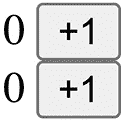
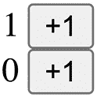
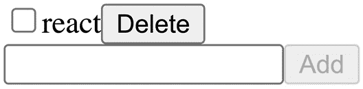
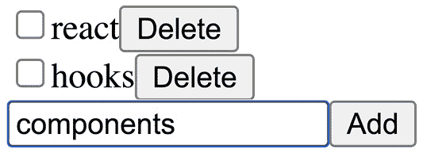
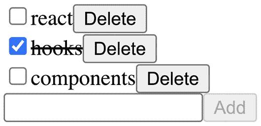
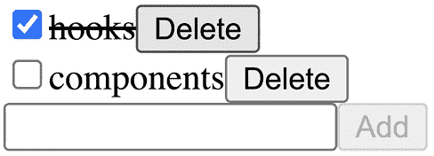

# *第九章*：用例场景 3 – Valtio

Valtio ([`github.com/pmndrs/valtio`](https://github.com/pmndrs/valtio)) 是另一个用于全局状态的库。与 Zustand 和 Jotai 不同，它基于可变更新模型。它主要用于模块状态，如 Zustand。它利用代理获取不可变快照，这是与 React 集成所需的。

API 只是 JavaScript，所有操作都在幕后进行。它还利用代理自动优化重新渲染。它不需要选择器来控制重新渲染。自动渲染优化基于一种称为 **状态使用跟踪** 的技术。使用状态使用跟踪，它可以检测状态中哪些部分被使用，并且只有当状态的使用部分发生变化时，它才会让组件重新渲染。最终，开发者需要编写的代码更少。

在本章中，我们将了解 Valtio 库的基本用法以及它如何处理可变更新。快照是创建不可变状态的关键特性。我们还将讨论快照和代理如何帮助我们优化重新渲染。

在本章中，我们将涵盖以下主题：

+   探索 Valtio，另一个模块状态库

+   利用代理检测突变并创建不可变状态

+   使用代理优化重新渲染

+   创建小型应用程序代码

+   这种方法的优缺点

# 技术要求

预期你具备一定的 React 知识，包括 React Hooks。请参考官方网站 [`reactjs.org`](https://reactjs.org) 了解更多。

在某些代码中，我们使用 TypeScript ([`www.typescriptlang.org`](https://www.typescriptlang.org))，你应该对其有基本了解。

本章中的代码可在 GitHub 上找到：[`github.com/PacktPublishing/Micro-State-Management-with-React-Hooks/tree/main/chapter_09`](https://github.com/PacktPublishing/Micro-State-Management-with-React-Hooks/tree/main/chapter_09)。

要运行代码片段，你需要一个 React 环境，例如，Create React App ([`create-react-app.dev`](https://create-react-app.dev)) 或 CodeSandbox ([`codesandbox.io`](https://codesandbox.io))。

# 探索 Valtio，另一个模块状态库

Valtio 是一个主要用于模块状态的库，与 Zustand 相同。

正如我们在 *第七章* 中学到的，*用例场景 1 – Zustand*，我们在 Zustand 中创建存储的方式如下：

```js
const store = create(() => ({
  count: 0,
  text: "hello",
}));
```

`store` 变量有一些属性，其中之一是 `setState`。使用 `setState`，我们可以更新状态。例如，以下代码是增加 `count` 值：

```js
store.setState((prev) => ({
  count: prev.count + 1,
}))
```

为什么我们需要使用 `setState` 来更新状态值？因为我们希望以不可变的方式更新状态。内部，之前的 `setState` 工作方式如下：

```js
moduleState = Object.assign({}, moduleState, {
  count: moduleState.count + 1
});
```

这是更新对象的不变方式。

让我们想象一个不需要遵循不可变更新规则的情况。在这种情况下，增加 `moduleState` 中 `count` 值的代码如下：

```js
++moduleState.count;
```

如果我们能够编写这样的代码并且让它与 React 一起工作，那岂不是很好？实际上，我们可以使用代理来实现这一点。

代理是 JavaScript 中的一个特殊对象（[`developer.mozilla.org/en-US/docs/Web/JavaScript/Reference/Global_Objects/Proxy`](https://developer.mozilla.org/en-US/docs/Web/JavaScript/Reference/Global_Objects/Proxy)）。我们可以定义一些处理器来捕获对象操作。例如，你可以添加一个 `set` 处理器来捕获对象变更：

```js
const proxyObject = new Proxy({
  count: 0,
  text: "hello",
}, {
  set: (target, prop, value) => {
    console.log("start setting", prop);
    target[prop] = value;
    console.log("end setting", prop);
  },
});
```

我们使用 `new Proxy` 和两个参数创建 `proxyObject`。第一个参数是一个对象本身。第二个参数是一个包含处理器的集合对象。在这种情况下，我们有一个 `set` 处理器，它捕获 `set` 操作并添加 `console.log` 语句。

`proxyObject` 是一个特殊对象，当你设置一个值时，它将在设置值前后向控制台记录日志。以下是在 Node.js REPL 中运行代码的屏幕输出（[`nodejs.dev/learn/how-to-use-the-nodejs-repl`](https://nodejs.dev/learn/how-to-use-the-nodejs-repl)）：

```js
> ++proxyObject.count
start setting count
end setting count
1
```

从概念上讲，由于代理可以检测任何变更，我们可以技术上使用与 Zustand 中的 `setState` 相似的行为。Valtio 是一个利用代理来检测状态变更的库。

在本节中，我们了解到 Valtio 是一个使用变更更新模型的库。接下来，我们将学习 Valtio 如何通过变更创建不可变状态。

# 利用代理检测变更并创建不可变状态

Valtio 使用代理从可变对象创建不可变对象。我们称这个不可变对象为 **快照**。

要创建一个被代理对象包装的可变对象，我们使用 Valtio 导出的 `proxy` 函数。

以下示例是创建一个具有 `count` 属性的对象：

```js
import { proxy } from "valtio";
const state = proxy({ count: 0 });
```

`proxy` 函数返回的 `state` 对象是一个检测变更的代理对象。这允许你创建一个不可变对象。

要创建一个不可变对象，我们使用 Valtio 导出的 `snapshot` 函数，如下所示：

```js
import { snapshot } from "valtio";
const snap1 = snapshot(state);
```

虽然变量 `state` 是 `{ count: 0 }` 并且 `snap1` 变量也是 `{ count: 0 }`，但 `state` 和 `snap1` 有不同的引用。`state` 是一个被代理包装的可变对象，而 `snap1` 是使用 `Object.freeze` 冻结的不可变对象（[`developer.mozilla.org/en-US/docs/Web/JavaScript/Reference/Global_Objects/Object/freeze`](https://developer.mozilla.org/en-US/docs/Web/JavaScript/Reference/Global_Objects/Object/freeze)）。

让我们看看快照是如何工作的。我们变更 `state` 对象并创建另一个快照，如下所示：

```js
++state.count;
const snap2 = snapshot(state);
```

变量 `state` 是 `{ count: 1 }` 并且与之前有相同的引用。变量 `snap2` 是 `{ count: 1 }` 并且有新的引用。因为 `snap1` 和 `snap2` 是不可变的，我们可以使用 `snap1 === snap2` 来检查它们的相等性，并知道对象中是否有任何差异。

`proxy` 和 `snapshot` 函数适用于嵌套对象，并优化了快照的创建。这意味着只有在其属性发生变化时，`snapshot` 函数才会创建新的快照。让我们看看另一个例子。`state2` 有两个嵌套的 `c` 属性：

```js
const state2 = proxy({
  obj1: { c: 0 },
  obj2: { c: 0 },
});
const snap21 = snapshot(state2)
++state2.obj.c;
const snap22 = snapshot(state2)
```

在这种情况下，`snap21` 变量是 `{ obj1: { c: 0 }, obj2: { c: 0 } }`，而 `snap22` 变量是 `{ obj1: { c: 1 }, obj2: { c: 0 } }`。`snap21` 和 `snap22` 有不同的引用，因此 `snap21 !== snap22` 成立。

关于嵌套对象呢？`snap21.obj1` 和 `snap22.obj1` 是不同的，但 `snap21.obj2` 和 `snap22.obj2` 是相同的。这是因为 `obj2` 的内部 `c` 属性的值没有改变。`obj2` 不需要改变，因此 `snap21.obj2 === snap22.obj2` 成立。

这种快照优化是一个重要特性。`snap21.obj2` 和 `snap22.obj2` 有相同的引用意味着它们共享内存。Valtio 只在必要时创建快照，优化内存使用。这种优化可以在 Zustand 中完成，但开发者有责任正确创建新的不可变状态。相比之下，Valtio 在幕后进行优化。在 Valtio 中，开发者无需承担创建新不可变状态的责任。

重要提示

Valtio 的优化基于与先前快照的缓存。换句话说，缓存大小为 1。如果我们使用 `++state.count` 增加计数，然后使用 `--state.count` 减少它，将创建一个新的快照。

在本节中，我们学习了 Valtio 如何自动创建不可变状态“快照”。接下来，我们将学习 Valtio 为 React 提供的钩子。

# 使用代理优化重新渲染

Valtio 使用代理来优化重新渲染，以及检测突变。这是我们学习到的优化重新渲染的模式，在 *第六章* 的 *检测属性访问* 部分，*介绍全局状态库*。

让我们通过一个计数器应用程序来了解 Valtio 钩子的使用和行为。这个钩子叫做 `useSnapshot`。`useSnapshot` 的实现基于 `snapshot` 函数和另一个代理来包装它。这个 `snapshot` 代理与 `proxy` 函数中使用的代理有不同的目的。`snapshot` 代理用于检测快照对象的属性访问。我们将看到渲染优化是如何通过 `snapshot` 代理来实现的。

我们从导入 Valtio 的函数开始创建计数器应用程序：

```js
import { proxy, useSnapshot } from "valtio";
```

`proxy` 和 `useSnapshot` 是 Valtio 提供的两个主要函数，它们涵盖了大多数用例。

我们然后使用 `proxy` 创建一个 `state` 对象。在我们的计数器应用程序中，有两个计数器 - `count1` 和 `count2`：

```js
const state = proxy({
  count1: 0,
  count2: 0,
});
```

`proxy` 函数接受一个初始对象并返回一个新的代理对象。我们可以像喜欢的那样修改 `state` 对象。

接下来，我们定义 `Counter1` 组件，它使用 `state` 对象并显示 `count1` 属性：

```js
const Counter1 = () => {
  const snap = useSnapshot(state);
  const inc = () => ++state.count1;
  return (
    <>
      {snap.count1} <button onClick={inc}>+1</button>
    </>
  );
};
```

我们的习惯是将 `useSnapshot` 的返回值命名为 `name`。`inc` 动作是一个用于修改 `state` 对象的函数。我们修改 `state` 代理对象；`snap` 仅用于读取。`snap` 对象使用 `Object.freeze` 冻结（[`developer.mozilla.org/en-US/docs/Web/JavaScript/Reference/Global_Objects/Object/freeze`](https://developer.mozilla.org/en-US/docs/Web/JavaScript/Reference/Global_Objects/Object/freeze)）并且技术上不能被修改。没有 `Object.freeze`，JavaScript 对象始终是可变的，我们只能按照惯例将其视为不可变。`snap.count1` 是访问 `state` 对象的 `count1` 属性。这种访问被 `useSnapshot` 钩子检测为跟踪信息，并且基于跟踪信息，`useSnapshot` 钩子仅在必要时触发重新渲染。

我们同样定义 `Counter2` 组件：

```js
const Counter2 = () => {
  const snap = useSnapshot(state);
  const inc = () => ++state.count2;
  return (
    <>
      {snap.count2} <button onClick={inc}>+1</button>
    </>
  );
};
```

与 `Counter1` 的区别在于它使用 `count2` 属性而不是 `count1` 属性。如果我们想定义一个共享组件，我们可以定义一个单独的组件并在 `props` 中取属性名。

最后，我们定义 `App` 组件。由于我们不使用 Context，因此没有提供者：

```js
const App = () => (
  <>
    <div><Counter1 /></div>
    <div><Counter2 /></div>
  </>
);
```

这个应用是如何工作的呢？在初始渲染时，`state` 对象是 `{ count1: 0, count2: 0 }`，其快照对象也是如此。`Counter1` 组件访问快照对象的 `count1` 属性，而 `Counter2` 组件访问快照对象的 `count2` 属性。每个 `useSnapshot` 钩子都知道并记住跟踪信息。跟踪信息表示访问了哪个属性。

当我们在 `Counter1` 组件（*图 9.1* 中的第一个按钮）中点击按钮时，它增加 `state` 对象的 `count1` 属性：



图 9.1 – 计数器应用的第一张截图

因此，`state` 对象变为 `{ count1: 1, count2: 0 }`。`Counter1` 组件使用新的数字 `1` 重新渲染。然而，`Counter2` 组件不会重新渲染，因为 `count2` 仍然是 `0` 并且没有变化（*图 9.2*）：



图 9.2 – 计数器应用的第二张截图

使用跟踪信息优化重新渲染。

在我们的计数器应用中，`state` 对象很简单，有两个具有数值属性的属性。Valtio 支持嵌套对象和数组。一个虚构的例子如下：

```js
const contrivedState = proxy({
  num: 123,
  str: "hello",
  arr: [1, 2, 3],
  nestedObject: { foo: "bar" },
  objectArray: [{ a: 1 }, { b: 2 }],
});
```

基本上，任何包含普通对象和数组的对象都完全支持，即使它们嵌套得很深。更多信息，请参阅项目网站：[`github.com/pmndrs/valtio`](https://github.com/pmndrs/valtio)。

在本节中，我们学习了 Valtio 如何通过快照和代理优化重新渲染。在下一节中，我们将通过示例学习如何构建一个应用。

# 创建小型应用程序代码

我们将学习如何创建一个小型应用。我们的示例应用是一个待办事项应用。Valtio 对应用的结构没有特定意见。这是其中一种典型模式。

让我们看看待办应用可以如何构建。首先，我们定义`Todo`类型：

```js
type Todo = {
  id: string;
  title: string;
  done: boolean;
};
```

一个`Todo`项目有一个字符串类型的`id`值，一个字符串类型的`title`值，以及一个布尔类型的`done`值。

然后我们使用定义的`Todo`类型定义一个`state`对象：

```js
const state = proxy<{ todos: Todo[] }>({
  todos: [],
});
```

`state`对象是通过用`proxy`包装一个初始对象来创建的。

为了操作`state`对象，我们定义了一些辅助函数 – `addTodo`用于添加一个新的待办事项，`removeTodo`用于删除它，以及`toggleTodo`用于切换`完成`状态：

```js
const createTodo = (title: string) => {
  state.todos.push({
    id: nanoid(),
    title,
    done: false,
  });
};
const removeTodo = (id: string) => {
  const index = state.todos.findIndex(
    (item) => item.id === id
  );
  state.todos.splice(index, 1);
};
const toggleTodo = (id: string) => {
  const index = state.todos.findIndex(
    (item) => item.id === id
  );
  state.todos[index].done = !state.todos[index].done;
};
```

`nanoid`是一个用于生成唯一 ID 的小函数（[`www.npmjs.com/package/nanoid`](https://www.npmjs.com/package/nanoid)）。注意这三个函数都是基于正常的 JavaScript 语法。它们将`state`当作一个正常的 JavaScript 对象来处理。这是通过代理实现的。

以下是一个`TodoItem`组件，它具有与`完成`状态相关的复选框切换、具有不同样式的文本，以及一个用于删除项目的按钮：

```js
const TodoItem = ({
  id,
  title,
  done,
}: {
  id: string;
  title: string;
  done: boolean;
}) => {
  return (
    <div>
      <input
        type="checkbox"
        checked={done}
        onChange={() => toggleTodo(id)}
      />
      <span
        style={{
          textDecoration: done ? "line-through" : "none",
        }}
      >
        {title}
      </span>
      <button onClick={() => removeTodo(id)}>
        Delete
      </button>
    </div>
  );
};
const MemoedTodoItem = memo(TodoItem);
```

注意这个组件分别接收`id`、`title`和`done`属性，而不是接收`todo`对象。这是因为我们使用了`memo`函数并创建了`MemoedTodoItem`组件。我们的状态使用跟踪检测属性访问，如果我们向 memoed 组件传递一个对象，属性访问将被省略。

要使用`MemoedTodoItem`组件，`TodoList`组件使用`useSnapshot`定义，如下所示：

```js
const TodoList = () => {
  const { todos } = useSnapshot(state);
  return (
    <div>
      {todos.map((todo) => (
        <MemoedTodoItem
          key={todo.id}
          id={todo.id}
          title={todo.title}
          done={todo.done}
        />
      ))}
    </div>
  );
};
```

这个组件从`useSnapshot`的结果中获取`todos`，并访问`todos`数组中对象的全部属性。因此，如果`todos`的任何部分发生变化，`useSnapshot`将触发重新渲染。这不是一个大问题，这是一个有效的模式，因为`MemoedTodoItem`组件只有在`id`、`title`或`done`发生变化时才会重新渲染。我们将在本节稍后学习另一种模式。

要创建一个新的待办事项，以下是一个小的组件，它具有输入字段的本地状态，并在点击**添加**按钮时调用`createTodo`：

```js
const NewTodo = () => {
  const [text, setText] = useState("");
  const onClick = () => {
    createTodo(text);
    setText("");
  };
  return (
    <div>
      <input
        value={text}
        onChange={(e) => setText(e.target.value)}
      />
      <button onClick={onClick} disabled={!text}>
        Add
      </button>
    </div>
  );
};
```

最后，我们在`App`组件中组合定义的组件：

```js
const App = () => (
  <>
    <TodoList />
    <NewTodo />
  </>
);
```

让我们看看这个应用是如何工作的：

1.  起初，它只有一个文本字段和一个**添加**按钮（*图 9.3*）：

    图 9.3 – todos 应用的第一次截图

1.  如果我们点击**添加**按钮，将添加一个新的项目（*图 9.4*）：

    图 9.4 – todos 应用的第二次截图

1.  我们可以添加尽可能多的项目（*图 9.5*）：

    图 9.5 – todos 应用的第三张截图

1.  点击复选框将切换`完成`状态（*图 9.6*）：

    图 9.6 – todos 应用的第四张截图

1.  点击**删除**按钮将删除项目（*图 9.7*）：



图 9.7 – todos 应用的第五张截图

我们迄今为止创建的应用程序运行得相当好。但在额外重新渲染方面仍有改进的空间。当我们切换现有项目的 `done` 状态时，不仅相应的 `TodoItem` 组件，而且 `TodoList` 组件也会重新渲染。正如所提到的，只要 `TodoList` 组件本身相对较轻量，这并不是一个大问题。

我们还有一个模式来消除 `TodoList` 组件中的额外重新渲染。这并不意味着整体性能总能得到提升。我们应该采取哪种方法取决于具体的应用程序。

在新的方法中，我们在每个 `TodoItem` 组件中使用 `useSnapshot`。`TodoItem` 组件只接收 `id` 属性。以下是被修改的 `TodoItem` 组件：

```js
const TodoItem = ({ id }: { id: string }) => {
  const todoState = state.todos.find(
    (todo) => todo.id === id
  );
  if (!todoState) {
    throw new Error("invalid todo id");
  }
  const { title, done } = useSnapshot(todoState);
  return (
    <div>
      <input
        type="checkbox"
        checked={done}
        onChange={() => toggleTodo(id)}
      />
      <span
        style={{
          textDecoration: done ? "line-through" : "none",
        }}
      >
        {title}
      </span>
      <button onClick={() => removeTodo(id)}>
        Delete
      </button>
    </div>
  );
};
const MemoedTodoItem = memo(TodoItem);
```

根据 `id` 属性，它找到 `todoState`，使用 `useSnapshot` 与 `todoState`，并获取 `title` 和 `done` 属性。只有当 `id`、`title` 或 `done` 属性发生变化时，此组件才会重新渲染。

现在，让我们看看修改后的 `TodoList` 组件。与之前的版本不同，它只需要传递 `id` 属性：

```js
const TodoList = () => {
  const { todos } = useSnapshot(state);
  const todoIds = todos.map((todo) => todo.id);
  return (
    <div>
      {todoIds.map((todoId) => (
        <MemoedTodoItem key={todoId} id={todoId} />
      ))}
    </div>
  );
};
```

因此，`todoIds` 是从每个 `todo` 对象的 `id` 属性创建的。只有当 `id` 的顺序发生变化，或者添加或删除某些 `id` 时，此组件才会重新渲染。如果只是更改现有项目的 `done` 状态，此组件不会重新渲染。因此，消除了额外的重新渲染。

在中等大小的应用程序中，两种方法在性能方面的变化是微妙的。这两种方法对不同的编码模式更有意义。开发者可以选择他们更熟悉的那个。

在本节中，我们通过一个小型应用学习了 `useSnapshot` 的使用场景。接下来，我们将讨论这个库以及一般方法的优缺点。

# 这种方法的优缺点

我们已经看到了 Valtio 的工作原理，一个问题是我们在什么时候应该使用它，在什么时候不应该使用它。

一个很大的方面是心理模型。我们有两种状态更新模型。一个是不可变更新，另一个是可变更新。虽然 JavaScript 本身允许可变更新，但 React 是围绕不可变状态构建的。因此，如果我们混合这两种模型，我们应该小心不要让自己困惑。一个可能的解决方案是将 Valtio 状态和 React 状态明确分开，以便心理模型切换是合理的。如果它有效，Valtio 就可以适应。否则，也许我们应该坚持不可变更新。

可变更新的主要好处是我们可以使用原生 JavaScript 函数。

例如，可以使用以下方式从数组中删除具有 `index` 值的项目：

```js
array.splice(index, 1)
```

在不可变更新中，这并不那么容易。例如，可以使用 `slice` 来编写，如下所示：

```js
[...array.slice(0, index), ...array.slice(index + 1)]
```

另一个例子是更改深层嵌套对象中的值。可以在可变更新中这样做：

```js
state.a.b.c.text = "hello";
```

在不可变更新中，它必须类似于以下内容：

```js
{
  ...state,
  a: {
    ...state.a,
    b: {
      ...state.a.b,
      c: {
        ...state.a.b.c,
        text: "hello",
      },
    },
  },
}
```

这样写并不愉快。Valtio 帮助减少具有可变更新的应用程序代码。

Valtio 还帮助减少基于代理的渲染优化的应用程序代码。

假设我们有一个具有`count`和`text`属性的状态，如下所示：

```js
const state = proxy({ count: 0, text: "hello" });
```

如果我们只在一个组件中使用`count`，我们可以在 Valtio 中写出以下内容：

```js
const Component = () => {
  const { count } = useSnapshot(state);
  return <>{count}</>;
};
```

相比之下，使用 Zustand，它将类似于以下内容：

```js
const Component = () => {
  const count = useStore((state) => state.count);
  return <>{count}</>;
};
```

差异微不足道，但我们有两个地方都有`count`。

让我们看看一个假设的场景。假设我们想在`showText`属性为真时显示`text`值。使用`useSnapshot`，可以这样做：

```js
const Component = ({ showText }) => {
  const snap = useSnapshot(state);
  return <>{snap.count} {showText ? snap.text : ""}</>;
};
```

使用基于选择器的钩子实现相同的行为很困难。一个解决方案是使用钩子两次。使用 Zustand，它将类似于以下内容：

```js
const Component = ({ showText }) => {
  const count = useStore((state) => state.count);
  const text = useStore(
    (state) => showText ? state.text : ""
  );
  return <>{count} {text}</>;
};
```

这意味着如果我们有更多条件，我们需要更多钩子。

另一方面，基于代理的渲染优化的一个缺点可能是可预测性较低。代理在幕后处理渲染优化，有时很难调试行为。有些人可能更喜欢显式的基于选择器的钩子。

总结来说，没有一种适合所有情况的解决方案。选择适合他们需求的解决方案取决于开发者。

在本节中，我们讨论了 Valtio 库采用的方法。

# 摘要

在本章中，我们了解了一个名为 Valtio 的库。它广泛使用代理。我们已经看到了示例，并学习了如何使用它。它允许修改状态，感觉就像使用正常的 JavaScript 对象一样，并且基于代理的渲染优化有助于减少应用程序代码。这种方法是否是一个好的选择取决于开发者的需求。

在下一章中，我们将了解另一个名为 React Tracked 的库，这是一个基于 Context 的库，类似于 Valtio，具有基于代理的渲染优化。
