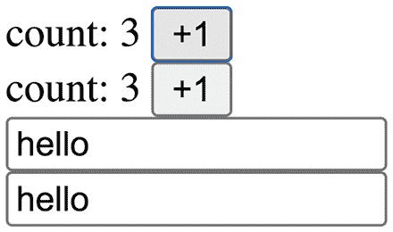

# 第十章：*第十章*：用例场景 4 – React Tracked

React Tracked ([`react-tracked.js.org`](https://react-tracked.js.org)) 是一个用于状态使用跟踪的库，它根据属性访问自动优化重新渲染。它提供了与 Valtio 相同的功能，我们在 *第九章*，*用例场景 3 – Valtio* 中讨论过，以消除额外的重新渲染。

React Tracked 可以与其他状态管理库一起使用。主要用例是 `useState` 或 `useReducer`，但它也可以与 Redux ([`redux.js.org`](https://redux.js.org))、Zustand（在第 *第七章*，*用例场景 1 – Zustand*）和其他类似库一起使用。

在本章中，我们将再次讨论使用状态使用跟踪优化重新渲染，并比较相关库。我们将学习 React Tracked 的两种用法，一种与 `useState` 一起使用，另一种与 React Redux ([`react-redux.js.org`](https://react-redux.js.org)) 一起使用。我们将以查看 React Tracked 将如何与 React 的未来版本一起工作来结束。

在本章中，我们将涵盖以下主题：

+   理解 React Tracked

+   使用 React Tracked 和 `useState` 以及 `useReducer`

+   使用 React Tracked 和 React Redux

+   未来展望

# 技术要求

预期你有一定的 React 知识，包括 React Hooks。请参考官方网站 [`reactjs.org`](https://reactjs.org) 了解更多。

在某些代码中，我们使用了 TypeScript ([`www.typescriptlang.org`](https://www.typescriptlang.org))，你应该对其有基本了解。

本章的代码可在 GitHub 上找到：[`github.com/PacktPublishing/Micro-State-Management-with-React-Hooks/tree/main/chapter_10`](https://github.com/PacktPublishing/Micro-State-Management-with-React-Hooks/tree/main/chapter_10)。

要运行代码片段，你需要一个 React 环境 - 例如，Create React App ([`create-react-app.dev`](https://create-react-app.dev)) 或 CodeSandbox ([`codesandbox.io`](https://codesandbox.io))。

# 理解 React Tracked

我们已经学习了几种全局状态库，但 React Tracked 与我们之前学过的略有不同。React Tracked 不提供状态功能，但它提供的是渲染优化功能。我们称这种功能为 **状态使用跟踪**。

让我们回顾一下 React Context 的行为，因为 React Tracked 中状态使用跟踪的一个用例是针对 React Context。

假设我们使用 `createContext` 定义了一个 Context，如下所示：

```js
const NameContext = createContext([
  { firstName: 'react', lastName: 'hooks' },
  () => {},
]);
```

`createContext` 接收一个初始值，在这个例子中是一个数组。数组中的第一个元素是一个初始状态对象。数组中的第二个元素，`() => {}`，是一个占位符更新函数。

我们之所以将这样的数组作为初始值，是为了匹配 `useState` 的返回值。我们经常使用 `useState` 定义 `NameProvider` 以实现全局状态：

```js
const NameProvider = ({ children }) => (
  <NameContext.Provider
    value={
      useState({ firstName: 'react', lastName: 'hooks' })
    }
  >
    {children}
  </NameContext.Provider>
};
```

你通常应该在根组件或靠近根组件的某个组件中使用 `NameProvider` 组件。

现在我们有了 `NameProvider` 组件，我们可以在其树结构下使用它。为了使用 Context 值，我们使用 `useContext`。假设我们只需要 `firstName`，并定义一个 `useFirstName` 钩子：

```js
const useFirstName = () => {
  const [{ firstName }] = useContext(NameContext);
  return firstName;
};
```

这没问题。然而，存在额外的重新渲染的可能性。如果我们只更新 `lastName` 而不改变 `firstName`，新的 Context 值将被传播，并且 `useContext(NameContext)` 触发重新渲染。`useFirstName` 钩子只从 Context 值中读取 `firstName`。因此，这成为了一个额外的重新渲染。

从实现的角度来看，这种行为是明显的。但从开发者的角度来看，这并不理想，因为它只使用了 Context 值中的 `firstName`。从开发者的角度来看，期望它不依赖于其他属性——在这种情况下，`lastName`。

状态使用跟踪是实现这种预期行为的功能。如果我们只在状态对象中使用 `firstName`，我们期望钩子只在 `firstName` 变化时触发重新渲染。这可以通过代理实现。

React Tracked 允许我们定义一个名为 `useTracked` 的钩子，它可以替代 `useContext(NameContext)`。`useTracked` 使用代理包装状态并跟踪其使用情况。`useTracked` 的预期用法如下：

```js
const useFirstName = () => {
  const [{ firstName }] = useTracked();
  return firstName;
};
```

这种用法与 `useContext(NameContext)` 的用法没有区别。这正是状态使用跟踪的全部要点。我们的代码看起来和平时一样，但幕后它跟踪状态使用并自动优化渲染。

自动渲染优化在 *第九章*，*用例场景 3 – Valtio* 中进行了讨论。React Tracked 和 Valtio 使用相同的状态使用跟踪功能。实际上，它们使用相同的内部库，称为 `proxy-compare`：[`github.com/dai-shi/proxy-compare`](https://github.com/dai-shi/proxy-compare)。

在本节中，我们回顾了状态使用跟踪，并学习了它如何优化重新渲染。在下一节中，我们将学习如何使用 `useState` 和 `useReducer` 与 React Tracked 一起使用。

# 使用 `useState` 和 `useReducer` 与 React Tracked

React Tracked 的主要用例是替换 React Context 的一个用例。React Tracked 中的 API 专门为此用例设计。

我们将探索使用 `useState` 和 `useReducer` 的两种用法。首先，让我们了解使用 `useState` 的用法。

## 使用 `useState` 和 React Tracked

在探索使用 `useState` 的 React Tracked 用法之前，让我们回顾一下如何使用 React Context 创建全局状态。

我们首先创建一个自定义钩子，它使用初始状态值调用 `useState`：

```js
const useValue = () =>
  useState({ count: 0, text: "hello" });
```

定义自定义钩子对于 TypeScript 来说是好的，因为你可以使用 `typeof` 操作符来获取类型。

以下是我们 Context 的定义：

```js
const StateContext = createContext<
  ReturnType<typeof useValue> | null
>(null);
```

它在 TypeScript 中有一个类型注解。默认值是 `null`。

要使用 Context，我们需要一个 `Provider` 组件。以下是一个使用 `useValue` 作为 Context 值的自定义 `Provider`：

```js
const Provider = ({ children }: { children: ReactNode }) => (
  <StateContext.Provider value={useValue()}>
    {children}
  </StateContext.Provider>
);
```

这是一个注入 `StateContext.Provider` 组件的组件。由于我们单独定义了 `useValue`，`Provider` 的实现可以使用它，在 **JavaScript 语法扩展**（**JSX**）中。

要消费 Context 的值，我们使用 `useContext`。我们如下定义一个自定义钩子：

```js
const useStateContext = () => {
  const contextValue = useContext(StateContext);
  if (contextValue === null) {
    throw new Error("Please use Provider");
  }
  return contextValue;
};
```

这个自定义钩子通过比较 `contextValue` 与 `null` 来检查 `Provider` 的存在。如果是 `null`，它将抛出一个错误，开发者将注意到 `Provider` 缺失。

现在，是时候为应用定义一些组件了。第一个组件是 `Counter`，它显示状态中的 `count` 属性以及一个用于增加 `count` 值的按钮：

```js
const Counter = () => {
  const [state, setState] = useStateContext();
  const inc = () => {
    setState((prev) => ({
      ...prev,
      count: prev.count + 1,
    }));
  };
  return (
    <div>
      count: {state.count}
      <button onClick={inc}>+1</button>
    </div>
  );
};
```

注意，`useStateContext` 返回一个包含 `state` 值和更新函数的元组。这与 `useValue` 返回的内容完全相同。

接下来，我们定义第二个组件，`TextBox`，它显示状态中 `text` 属性的输入字段：

```js
const TextBox = () => {
  const [state, setState] = useStateContext();
  const setText = (text: string) => {
    setState((prev) => ({ ...prev, text }));
  };
  return (
    <div>
      <input
        value={state.text}
        onChange={(e) => setText(e.target.value)}
      />
    </div>
  );
};
```

我们再次使用 `useStateContext` 并获取 `state` 值和 `setState` 函数。`setText` 函数接受一个字符串参数并调用 `setState` 函数。

最后，我们定义 `App` 组件，它包含 `Provider`、`Counter` 和 `TextBox` 组件：

```js
const App = () => (
  <Provider>
    <div>
      <Counter />
      <Counter />
      <TextBox />
      <TextBox />
    </div>
  </Provider>
);
```

这个应用是如何工作的呢？Context 将状态对象作为一个整体处理，当状态对象发生变化时，`useContext` 将触发重新渲染。即使状态对象中只有一个属性发生变化，所有的 `useContext` 钩子都会触发重新渲染。这意味着如果我们点击 `Counter` 组件中的按钮，它将增加状态对象的 `count` 属性，并导致 `Counter` 和 `TextBox` 组件重新渲染。当 `Counter` 组件重新渲染时，会显示新的 `count` 值，而 `TextBox` 组件会重新渲染相同的 `text` 值。这是一个额外的重新渲染。

Context 的额外重新渲染行为是预期的，如果我们想避免它，我们应该将其拆分成更小的部分。请参阅 *第三章*，*使用 Context 共享组件状态*，以了解更多关于 React Context 的最佳实践。

现在，React Tracked 看起来是什么样子呢？让我们将之前的示例转换为一个新的示例，使用 React Tracked。首先，我们从 React Tracked 库中导入 `createContainer`：

```js
import { createContainer } from "react-tracked";
```

我们随后使用在 `const useValue = () => useState({ count: 0, text: "hello" });` 中定义的 `useValue` 钩子并调用 `createContainer` 函数：

```js
const { Provider, useTracked } = 
  createContainer(useValue);
```

从结果中提取了 `Provider` 和 `useTracked`。`Provider` 组件可以像本节前一个示例中那样使用。`useTracked` 钩子可以像本节前一个示例中定义的 `useStateContext` 钩子那样使用。

使用新的 `useTracked` 钩子，`Counter` 组件如下所示：

```js
const Counter = () => {
  const [state, setState] = useTracked();
  const inc = () => {
    setState(
      (prev) => ({ ...prev, count: prev.count + 1 })
    );
  };
  return (
    <div>
      count: {state.count}
      <button onClick={inc}>+1</button>
    </div>
  );
};
```

我们只是将 `useStateContext` 替换为 `useTracked`。其余的代码保持不变。

同样，以下是新 `TextBox` 组件：

```js
const TextBox = () => {
  const [state, setState] = useTracked();
  const setText = (text: string) => {
    setState((prev) => ({ ...prev, text }));
  };
  return (
    <div>
      <input
        value={state.text}
        onChange={(e) => setText(e.target.value)}
      />
    </div>
  );
};
```

唯一的改变是将 `useStateContext` 替换为 `useTracked`。

`App` 组件与该节前一个示例中的完全相同，使用新的 `Provider` 组件：

```js
const App = () => (
  <Provider>
    <div>
      <Counter />
      <Counter />
      <TextBox />
      <TextBox />
    </div>
  </Provider>
);
```

这个新应用程序是如何表现的？`useTracked` 返回的 `state` 对象是受跟踪的，这意味着 `useTracked` 钩子会记住 `state` 的哪些属性被访问。只有当访问的属性发生变化时，`useTracked` 钩子才会触发重新渲染。因此，如果你在 `Counter` 组件中点击按钮，只有 `Counter` 组件会重新渲染，而 `TextBox` 组件不会重新渲染，如下所示：



图 10.1 – 使用 React Tracked 和 useState 的应用程序截图

实质上，我们改变的是 `createContainer` 而不是 `createContext`，以及 `useTracked` 而不是 `useStateContext`。这个结果给我们带来了优化的重新渲染。这是状态使用跟踪功能。

我们传递给 `createContainer` 函数的 `useValue` 自定义钩子可以是任何东西，只要它返回一个类似于 `useState` 的元组即可。让我们看看另一个使用 `useReducer` 的示例。

## 使用 React Tracked 和 useReducer

在这个示例中，我们使用 `useReducer` 而不是 `useState`。`useReducer` 钩子是一个具有更多功能的先进钩子，但它主要是语法上的差异。请参阅 *第一章* 中 *Exploring the similarity and difference between useState and useReducer* 部分，*What Is Micro State Management with React Hooks?*，以获取更详细的讨论。

关于 `useReducer` 的重要注意事项

`useReducer` 钩子是官方的 React 钩子。它接受一个用于更新状态的 reducer 函数。reducer 函数是一种编程模式，与 React 或 JavaScript 无关。`useReducer` 钩子将此模式应用于状态。在 React 中，reducer 函数因 Redux 而流行。`useReducer` 在 reduce 模式方面涵盖了 Redux 的使用案例。然而，它并没有涵盖 Redux 的其他使用案例，例如 React Redux 和 store enhancer 或 middleware。与 Redux 不同，`useReducer` 钩子接受任何类型的动作。

新的 `useValue` 钩子使用 `useReducer` 和 `useEffect`。`useReducer` 使用一个还原函数和一个初始状态来定义。`useEffect` 有一个将状态值记录到控制台的功能。以下是在 TypeScript 中的 `useValue` 代码：

```js
const useValue = () => {
  type State = { count: number; text: string };
  type Action =
    | { type: "INC" }
    | { type: "SET_TEXT"; text: string };
  const [state, dispatch] = useReducer(
    (state: State, action: Action) => {
      if (action.type === "INC") {
        return { ...state, count: state.count + 1 };
      }
      if (action.type === "SET_TEXT") {
        return { ...state, text: action.text };
      }
      throw new Error("unknown action type");
    },
    { count: 0, text: "hello" }
  );
  useEffect(() => {
    console.log("latest state", state);
  }, [state]);
  return [state, dispatch] as const;
};
```

Reducer 函数接受 `INC` 和 `SET_TEXT` 的动作类型。`useEffect` 钩子在控制台日志中使用，但不仅限于它。例如，它可以与远程资源交互。`useValue` 钩子返回一个包含 `state` 和 `dispatch` 的元组。只要返回的元组遵循这种形状，我们就可以按我们的喜好实现钩子。例如，我们可以使用多个 `useState` 钩子。

使用新的 `useValue` 钩子，我们运行 `createContainer`：

```js
const { Provider, useTracked } = createContainer(useValue);
```

我们使用 `createContainer` 的方式不会改变，即使我们改变了 `useValue`。

使用新的 `useTracked` 钩子，我们实现 `Counter` 组件：

```js
const Counter = () => {
  const [state, dispatch] = useTracked();
  const inc = () => dispatch({ type: "INC" });
  return (
    <div>
      count: {state.count}
      <button onClick={inc}>+1</button>
    </div>
  );
};
```

因为 `useTracked` 返回的元组形状与 `useValue` 返回的形状相同，所以我们把元组的第二个项目命名为 `dispatch`，这是一个分发动作的函数。`Counter` 组件分发一个 `INC` 动作。

接下来是 `TextBox` 组件：

```js
const TextBox = () => {
  const [state, dispatch] = useTracked();
  const setText = (text: string) => {
    dispatch({ type: "SET_TEXT", text });
  };
  return (
    <div>
      <input
        value={state.text}
        onChange={(e) => setText(e.target.value)}
      />
    </div>
  );
};
```

同样，`dispatch` 函数用于 `SET_TEXT` 动作。

最后，我们有 `App` 组件：

```js
const App = () => (
  <Provider>
    <div>
      <Counter />
      <Counter />
      <TextBox />
      <TextBox />
    </div>
  </Provider>
);
```

新的 `App` 组件的行为与上一个完全相同。与 `useState` 和 `useReducer` 的示例相比，区别在于 `useValue` 返回一个包含 `state` 和 `dispatch` 的元组；因此 `useTracked` 也返回一个包含 `state` 和 `dispatch` 的元组。

React Tracked 可以优化重新渲染的原因不仅在于状态使用跟踪，还在于其内部库 `use-context-selector` ([`github.com/dai-shi/use-context-selector`](https://github.com/dai-shi/use-context-selector))。它允许我们使用 `selector` 函数订阅 Context 值。这种订阅绕过了 React Context 的限制。

在本节中，我们看到了一个基本的与裸 React Context 的示例，以及两个与 React Tracked 和 `useState`、`useReducer` 一起的示例。在下一节中，我们将学习使用 React Redux 的 React Tracked 的一个用法，它使用状态使用跟踪功能而不使用 `use-context-selector`。

# 使用 React Tracked 和 React Redux

React Tracked 的主要用途是替换 React Context 的一个用例。这是通过内部使用 `use-context-selector` 来实现的。

React Tracked 提供了一个名为 `createTrackedSelector` 的低级函数，用于覆盖非 React Context 用例。它接受一个名为 `useSelector` 的钩子，并返回一个名为 `useTrackedState` 的钩子：

```js
const useTrackedState = createTrackedSelector(useSelector);
```

`useSelector` 是一个钩子，它接受一个选择器函数并返回选择器函数的结果。当结果改变时，它将触发重新渲染。`useTrackedState` 是一个钩子，它返回一个包裹在代理中的整个 `state` 以跟踪 `state` 的使用。

让我们看看一个具体的 React Redux 示例。这提供了一个 `useSelector` 钩子，应用 `createTrackedSelector` 非常简单。

关于 React Redux 的重要说明

React Redux 在内部使用 React Context，但它不使用 Context 来传播状态值。它使用 React Context 进行依赖注入，而状态传播是通过订阅完成的。React Redux 的 `useSelector` 被优化为仅在选择器结果改变时重新渲染。在撰写本文时，使用 Context 传播是不可能的。还有许多其他库采用相同的方法，实际上，`use-context-selector` UserLand 解决方案也是如此。

首先，我们从库中导入一些函数，即 `redux`、`react-redux` 和 `react-tracked`：

```js
import { createStore } from "redux";
import {
  Provider,
  useDispatch,
  useSelector,
} from "react-redux";
import { createTrackedSelector } from "react-tracked";
```

前两行导入是传统的 React Redux 设置。第三行是我们的补充。

接下来，我们使用 `initialState` 和 `reducer` 定义一个 Redux 存储：

```js
type State = { count: number; text: string };
type Action =
  | { type: "INC" }
  | { type: "SET_TEXT"; text: string };
const initialState: State = { count: 0, text: "hello" };
const reducer = (state = initialState, action: Action) => {
  if (action.type === "INC") {
    return { ...state, count: state.count + 1 };
  }
  if (action.type === "SET_TEXT") {
    return { ...state, text: action.text };
  }
  return state;
};
const store = createStore(reducer);
```

这是一种创建 Redux 存储的传统方式。请注意，它与 React Tracked 没有关系，任何创建 Redux 存储的方式都会工作。

`createTrackedSelector` 允许我们通过从 `react-redux` 直接导入的 `useSelector` 钩子创建 `useTrackedState` 钩子：

```js
const useTrackedState = 
  createTrackedSelector<State>(useSelector);
```

我们需要显式地使用 `<State>` 类型化钩子。

使用 `useTrackedState`，`Counter` 组件的定义如下：

```js
const Counter = () => {
  const dispatch = useDispatch();
  const { count } = useTrackedState();
  const inc = () => dispatch({ type: "INC" });
  return (
    <div>
      count: {count} <button onClick={inc}>+1</button>
    </div>
  );
};
```

这应该与正常的 React Redux 模式大致相同，除了 `useTrackedState` 行。在 React Redux 中，它将是以下这样：

```js
  const count = useSelector((state) => state.count);
```

这种变化可能看起来微不足道，但使用 `useSelector`，开发者对重新渲染有更多的控制和责任，而使用 `useTrackedState`，钩子会自动控制重新渲染。

同样，`TextBox` 组件的实现如下：

```js
const TextBox = () => {
  const dispatch = useDispatch();
  const state = useTrackedState();
  const setText = (text: string) => {
    dispatch({ type: "SET_TEXT", text });
  };
  return (
    <div>
      <input
        value={state.text}
        onChange={(e) => setText(e.target.value)}
      />
    </div>
  );
};
```

再次强调，我们使用 `useTrackedState` 而不是 `useSelector` 来实现自动渲染优化。为了解释自动渲染优化如何有用，让我们想象一下 `TextBox` 组件接受一个 `showCount` 属性，它是一个布尔值，用于在 `state` 中显示 `count` 值。我们可以按如下方式修改 `TextBox` 组件：

```js
const TextBox = ({ showCount }: { showCount: boolean }) => {
  const dispatch = useDispatch();
  const state = useTrackedState();
  const setText = (text: string) => {
    dispatch({ type: "SET_TEXT", text });
  };
  return (
    <div>
      <input
        value={state.text}
        onChange={(e) => setText(e.target.value)}
      />
      {showCount && <span>{state.count}</span>}
    </div>
  );
};
```

注意，我们没有对 `useTrackedState` 行进行任何更改。使用单个 `useSelector` 实现相同的行为将是困难的。

最后，以下是将所有组件组合在一起的 `App` 组件：

```js
const App = () => (
  <Provider store={store}>
    <div>
      <Counter />
      <Counter />
      <TextBox />
      <TextBox />
    </div>
  </Provider>
);
```

这与使用不带 React Tracked 的正常 React Redux 完全相同。在这个应用程序中，重新渲染被优化了，这意味着点击按钮只会触发 `Counter` 组件的重新渲染，而 `TextBox` 组件不会重新渲染，如下面的图所示：


图 10.2 – 使用 React Tracked 和 React Redux 的应用程序截图

在本节中，我们学习了如何使用 React Tracked 与非 React Context 用例。接下来，我们将讨论 React Tracked 在未来版本的 React 中可能的样子。

# 未来展望

React Tracked 的实现依赖于两个内部库：

+   `proxy-compare` ([`github.com/dai-shi/proxy-compare`](https://github.com/dai-shi/proxy-compare))

+   `use-context-selector` ([`github.com/dai-shi/use-context-selector`](https://github.com/dai-shi/use-context-selector))

正如我们在*使用 React Tracked 与 useState 和 useReducer*部分以及*使用 React Tracked 与 React Redux*部分所学的，使用 React Tracked 有两种方式。第一种是通过 React Context 使用`createContainer`，第二种是通过 React Redux 使用`createTrackedSelector`。基本函数是`createTrackedSelector`，它使用`proxy-compare`库实现。`createContainer`函数是一个高级抽象，它使用`createTrackedSelector`和`use-context-selector`库实现。

在 React Tracked 中关于 Context 的使用方面，`use-context-selector`库非常重要。`use-context-selector`的作用是什么？它提供了一个`useContextSelector`钩子。正如我们在*第三章*的*理解 Context*部分所学的，*通过 Context 共享组件状态*，React Context 被设计成当 Context 值发生变化时，所有 Context 消费者组件都会重新渲染。有一个提议旨在改进 Context 的行为——`useContextSelector`。`use-context-selector`库是一个 Userland 库，尽可能地模拟了提议的`useContextSelector`钩子。

在撰写本文时，情况非常不确定，但 React 的未来版本可能会实现`useContextSelector`，或者类似的形式。在这种情况下，React Tracked 可以轻松地从`use-context-selector`库迁移到本地的`useContextSelector`。希望这应该能够提供与 React 特性完全兼容。

在 React Tracked 的实现中将`use-context-selector`抽象出来有助于迁移。如果 React 在未来有一个官方的`useContextSelector`钩子，React Tracked 可以迁移而不改变其公共 API。在这个实现设计中，`createTrackedSelector`是 React Tracked 中的一个构建块函数，而`createContainer`是一个粘合函数。导出这两个函数允许我们使用这两种方式。

在本节中，我们讨论了 React Tracked 的实现设计和它如何迁移到可能的未来版本。

# 摘要

在本章中，我们了解了一个库——React Tracked。这个库有两个目的。一个目的是替代 React Context 的使用场景。另一个目的是增强一些其他库（如 React Redux）提供的选择器钩子。

从技术上讲，React Tracked 库不是一个全局状态库。它是与状态函数一起使用的，例如`useState`和`useReducer`，或者 Redux。React Tracked 提供的是优化重新渲染的功能。

在下一章中，我们将比较三个全局状态库，即 Zustand、Jotai 和 Valtio，并讨论全局状态模式，以结束本书。
