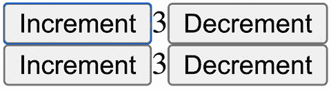
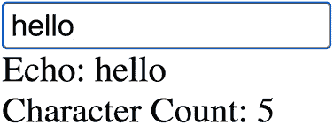
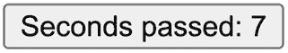

# 第十一章：*第十一章*：三个全局状态库的相似之处和不同之处

在这本书中，我们介绍了三个全局状态库：Zustand、Jotai 和 Valtio。让我们讨论一下它们之间的相似之处和不同之处。这三个库有一些可比较的功能。

Zustand 在用法和存储模型方面与 Redux（以及 React Redux）相似，但与 Redux 不同，它不是基于 reducers 的。

Jotai 在 API 方面与 Recoil ([`recoiljs.org`](https://recoiljs.org)) 相似，但其目标更多的是提供一个针对非选择器基础的渲染优化的最小 API。

Valtio 在突变更新模型方面与 MobX 相似，但相似程度仅是微小的，并且渲染优化实现非常不同。

这三个库都提供了适合微状态管理的原始功能。它们在编码风格和渲染优化方法上有所不同。

在本章中，我们将通过将其与其可比较的库配对来讨论每个库，然后讨论这三个库之间的相似之处和不同之处。我们将涵盖以下主题：

+   Zustand 与 Redux 的区别

+   理解何时使用 Jotai 和 Recoil

+   使用 Valtio 和 MobX

+   比较 Zustand、Jotai 和 Valtio

# 技术要求

预期你对 React 有一定的了解，包括 React hooks。参考官方网站，[`reactjs.org`](https://reactjs.org)，以了解更多信息。

在某些代码中，我们使用 TypeScript ([`www.typescriptlang.org`](https://www.typescriptlang.org))，你应该对其有基本了解。

本章中的代码可在 GitHub 上找到：[`github.com/PacktPublishing/Micro-State-Management-with-React-Hooks/tree/main/chapter_11`](https://github.com/PacktPublishing/Micro-State-Management-with-React-Hooks/tree/main/chapter_11)。

要运行代码片段，你需要一个 React 环境，例如，Create React App ([`create-react-app.dev`](https://create-react-app.dev)) 或 CodeSandbox ([`codesandbox.io`](https://codesandbox.io))。

# Zustand 与 Redux 的区别

在某些用例中，开发者的体验在 Zustand 和 Redux 中可能是相似的。它们都基于单向数据流。在单向数据流中，我们派发`action`，它代表一个更新状态的命令，在状态通过`action`更新后，新的状态被传播到需要它的地方。这种派发和传播的分离简化了数据流，并使整个系统更具可预测性。

另一方面，它们在更新状态的方式上有所不同。Redux 基于 reducers。Reducer 是一个纯函数，它接受一个先前的状态和一个`action`对象，并返回一个新的状态。使用 reducers 更新状态是一种严格的方法，但它带来了更高的可预测性。Zustand 采取了一种灵活的方法，并且不一定使用 reducers 来更新状态。

在本节中，我们将通过将一个 Redux 示例转换为 Zustand 来展示比较。然后我们将看到两者之间的差异。

## Redux 和 Zustand 的示例

让我们看看一个官方的 Redux 教程。这是所谓的现代 Redux，使用 Redux Toolkit：[`redux-toolkit.js.org/tutorials/quick-start`](https://redux-toolkit.js.org/tutorials/quick-start)。

要创建一个 Redux 存储，我们可以使用 Redux Toolkit 库中的`configureStore`：

```js
// src/app/store.js
import { configureStore } from "@reduxjs/toolkit";
import counterReducer from "../features/counter/counterSlice";
export const store = configureStore({
  reducer: {
    counter: counterReducer,
  },
});
```

`configureStore`函数接受减少器并返回一个`store`变量。在这种情况下，它使用一个减少器——`counterReducer`。

`counterReducer`是在一个单独的文件中定义的，使用 Redux Toolkit 库中的`createSlice`。首先，我们导入`createSlice`并定义`initialState`：

```js
// features/counter/counterSlice.js
import { createSlice } from "@reduxjs/toolkit";
const initialState = {
  value: 0,
};
```

我们然后使用`createSlice`和`initialState`定义`counterSlice`：

```js
export const counterSlice = createSlice({
  name: "counter",
  initialState,
  reducers: {
    increment: (state) => {
      state.value += 1;
    },
    decrement: (state) => {
      state.value -= 1;
    },
    incrementByAmount: (
      state,
      action: PayloadAction<number>
     ) => {
      state.value += action.payload;
    },
  },
});
```

使用`createSlice`函数创建的`counterSlice`变量包含一个减少器和动作。为了使它们易于导入，我们提取减少器和动作属性并分别导出：

```js
export const {
  increment,
  decrement,
  incrementByAmount
} = counterSlice.actions;
export default counterSlice.reducer;
```

接下来是使用创建的存储的`Counter`组件。首先，我们从`react-redux`库中导入两个钩子，从`counterSlice`文件中导入两个动作：

```js
// features/counter/Counter.jsx
import { useSelector, useDispatch } from "react-redux";
import { decrement, increment } from "./counterSlice";
```

我们然后定义`Counter`组件：

```js
export function Counter() {
  const count = useSelector((
    state: { counter: { value: number; }; }
  ) => state.counter.value);
  const dispatch = useDispatch();
  return (
    <div>
      <button onClick={() => dispatch(increment())}>
        Increment
      </button>
      <span>{count}</span>
      <button onClick={() => dispatch(decrement())}>
        Decrement
      </button>
    </div>
  );
}
```

此组件使用来自 React Redux 库的`useSelector`和`useDispatch`钩子。我们使用一个选择器函数从存储状态中获取计数值。注意，此组件没有直接使用创建的存储。`useSelector`钩子从 Context 中获取存储。

最后，`App`组件看起来如下：

```js
// App.jsx
import { Provider } from "react-redux";
import { store } from "./app/store";
import { Counter } from "./features/counter/Counter";
const App = () => (
  <Provider store={store}>
    <div>
      <Counter />
      <Counter />
    </div>
  </Provider>
);
export default App;
```

我们通过`Provider`组件传递我们创建的`store`变量。这允许`Counter`组件中的`useSelector`钩子访问`store`变量。

如*图 11.1*所示，这按预期工作。我们在`App`组件中有两个`Counter`组件，它们共享相同的`count`值。



图 11.1 – 使用 Redux 的应用程序截图

现在，让我们看看这如何在 Zustand 中实现。

首先，我们使用 Zustand 库中的`create`函数创建一个存储。我们首先导入 Zustand 库：

```js
// store.js
import create from "zustand";
```

然后我们为 TypeScript 定义`State`类型：

```js
type State = {
  counter: {
    value: number;
  };
  counterActions: {
    increment: () => void;
    decrement: () => void;
    incrementByAmount: (amount: number) => void;
  };
};
```

以下是一个`store`定义。在 Zustand 中，一个钩子`useStore`代表一个`store`：

```js
export const useStore = create<State>((set) => ({
  counter: { value: 0 },
  counterActions: {
    increment: () =>
      set((state) => ({
        counter: { value: state.counter.value + 1 },
      })),
    decrement: () =>
      set((state) => ({
        counter: { value: state.counter.value - 1 },
      })),
    incrementByAmount: (amount: number) =>
      set((state) => ({
        counter: { value: state.counter.value + amount },
      })),
  },
}));
```

这定义了`store`中的计数状态和计数操作。减少器逻辑是在动作函数体中实现的。

接下来是`Counter`组件，它使用了创建的存储：

```js
// Counter.jsx
import { useStore } from "./store";
export function Counter() {
  const count = useStore((state) => state.counter.value);
  const { increment, decrement } = useStore(
    (state) => state.counterActions
  );
  return (
    <div>
      <div>
        <button onClick={increment}>Increment</button>
        <span>{count}</span>
        <button onClick={decrement}>Decrement</button>
      </div>
    </div>
  );
}
```

我们使用`useStore`钩子来获取`count`值和更新`count`值的动作。注意，`useStore`钩子直接从存储文件导入。

最后，`App`组件看起来如下：

```js
// App.jsx
import { Counter } from "./Counter";
const App = () => (
  <div>
    <Counter />
    <Counter />
  </div>
);
export default App;
```

由于我们不使用 Context，因此不需要提供者组件。

现在，让我们讨论两者的比较。

## 比较 Redux 和 Zustand 的示例

虽然*示例与 Redux 和 Zustand*部分的两个实现共享一些共同的概念，但也有一些显著的不同：

+   Redux 和 Zustand 的示例之间最大的区别之一是目录结构。现代 Redux 建议使用`features`目录结构，`createSlice`函数被设计成遵循功能目录模式。这对于大型应用来说是一个有用的模式。另一方面，Zustand 对结构没有意见。开发者如何组织文件和目录取决于他们。虽然使用 Zustand 可以遵循`features`目录结构，但库没有提供具体支持。我们的 Zustand 示例展示了`counterActions`的模式，但这只是其中一种可能。

+   在创建存储代码中的另一个区别是使用了 Immer ([`immerjs.github.io/immer/`](https://immerjs.github.io/immer/))。Immer 允许使用类似`state.value += 1;`的突变风格。现代 Redux 默认使用 Immer。Zustand 默认不使用它，我们的例子也是如此。在 Zustand 中使用 Immer 是可选的。

+   在存储传播方面，Redux 使用 Context，而 Zustand 使用模块导入。Context 允许在运行时注入存储，这在某些用例中效果更好。Zustand 可选地支持 Context 的使用。

+   最重要的是，Redux Toolkit 基于 Redux，而 Redux 基于单向数据流。因此，在 Redux 中更新状态需要分发动作。这种限制有时对可维护性和可扩展性有益。Zustand 对数据流没有意见，虽然它可以用于单向数据流，但没有库支持，开发者需要处理所有事情。

总结来说，现代 Redux 对如何管理状态有更多的意见，而 Zustand 则较少。最终，Zustand 是一个简约的库，而 Redux 及其家族则是一套功能齐全的库。现代 Redux 和 Zustand 的使用看起来很相似，但它们背后的哲学是不同的。

在本节中，我们看到了现代 Redux 和 Zustand 之间的比较。接下来，我们将比较 Recoil 和 Jotai。

# 理解何时使用 Jotai 和 Recoil

Jotai 的 API 高度受到 Recoil 的启发。最初，它是故意设计来帮助从 Recoil 迁移到 Jotai 的。在本节中，我们将通过将 Recoil 的示例转换为 Jotai 来进行比较。然后，我们将讨论两者之间的差异。

## Recoil 和 Jotai 的示例

让我们查看 Recoil 教程[`recoiljs.org/docs/introduction/getting-started`](https://recoiljs.org/docs/introduction/getting-started)，看看 Recoil 教程中的示例是如何转换为 Jotai 的。

首先，以回弹（Recoil）为例，我们需要从 Recoil 库中导入一些函数：

```js
import {
  RecoilRoot,
  atom,
  selector,
  useRecoilState,
  useRecoilValue,
} from "recoil";
```

在这个例子中使用了五个。

文本字符串的第一个状态是通过`atom`函数创建的：

```js
const textState = atom({
  key: "textState",
  default: "",
});
```

它接受两个属性——`key` 字符串和 `default` 值。

要使用定义的状态，我们使用 `useRecoilState` 钩子：

```js
const TextInput = () => {
  const [text, setText] = useRecoilState(textState);
  return (
    <div>
      <input
        type="text"
        value={text}
        onChange={(event) => {
          setText(event.target.value);
        }}
      />
      <br />
      Echo: {text}
    </div>
  );
};
```

`useRecoilState` 返回的值与 `useState` 相同。因此，其余的代码应该很熟悉。

第二个状态是一个派生状态。我们使用 `selector` 函数定义派生状态：

```js
const charCountState = selector({
  key: "charCountState",
  get: ({ get }) => get(textState).length,
});
```

它接受两个属性——一个 `key` 字符串和一个 `get` 函数。`get` 属性是一个返回派生值的函数。`get` 属性内的另一个 `get` 函数返回由其他 `atom` 和 `selector` 函数创建的其他状态值。

要使用第二个状态，我们使用 `useRecoilValue` 钩子，它只返回状态的部分值：

```js
const CharacterCount = () => {
  const count = useRecoilValue(charCountState);
  return <>Character Count: {count}</>;
};
```

当 `textState` 发生变化时，此组件将重新渲染，因为 `charCountState` 是从它派生出来的。

`CharacterCounter` 组件如下定义，以组合已定义的两个组件：

```js
const CharacterCounter = () => (
  <div>
    <TextInput />
    <CharacterCount />
  </div>
);
```

最后，我们定义 `App` 组件：

```js
const App = () => (
  <RecoilRoot>
    <CharacterCounter />
  </RecoilRoot>
);
```

在 `App` 组件中，我们使用 `RecoilRoot` 组件，它包含状态值。

如 *图 11.2* 所示，此应用程序的工作方式如下：如果你在文本字段中输入某些内容，文本将显示在文本字段下方，并且字符数如下所示：



图 11.2 – 使用 Recoil 的应用程序截图

现在，让我们将此示例代码转换为 Jotai。

我们首先从 Jotai 库中导入两个函数：

```js
import { atom, useAtom } from "jotai";
```

Jotai 的 API 尝试保持最小化，最小使用需要两个函数。

文本字符串的第一个原子使用 `atom` 函数创建：

```js
const textAtom = atom("");
```

这几乎与 Recoil 相同，只是它只有 `default` 值，因为 Jotai 不需要 `key` 字符串。在变量名后缀 `Atom` 而不是 `State` 是一个技术上不重要的约定。

要使用定义的原子，我们使用 `useAtom` 函数：

```js
const TextInput = () => {
  const [text, setText] = useAtom(textAtom);
  return (
    <div>
      <input
        type="text"
        value={text}
        onChange={(event) => {
          setText(event.target.value);
        }}
      />
      <br />
      Echo: {text}
    </div>
  );
};
```

`useAtom` 函数的工作方式类似于 `useState`，其余的代码应该对习惯使用 `useState` 的人来说很熟悉。

第二个原子是一个派生原子，它使用 `atom` 函数定义：

```js
const charCountAtom = atom((get) => get(textAtom).length);
```

在这种情况下，我们将一个函数传递给 `atom` 函数。内部函数计算派生值。

要使用第二个原子，我们再次使用 `useAtom` 函数：

```js
const CharacterCount = () => {
  const [count] = useAtom(charCountAtom);
  return <>Character Count: {count}</>;
};
```

需要用 `[count]` 获取返回值的第一个部分。除此之外，代码和行为应该与 Recoil 相似。

`CharacterCounter` 组件如下定义，以组合已定义的两个组件：

```js
const CharacterCounter = () => (
  <div>
    <TextInput />
    <CharacterCount />
  </div>
);
```

最后，我们定义 `App` 组件：

```js
const App = () => (
  <>
    <CharacterCounter />
  </>
);
```

Jotai 的最小使用案例不需要 `Provider` 组件。

从 Recoil 示例到 Jotai 示例的转换主要是语法上的，行为是相同的。

让我们讨论一些差异。

## 比较 Recoil 和 Jotai 的示例

尽管在示例中没有使用到许多功能方面存在许多差异，但我们将讨论范围限制在我们展示的示例中，如下所示：

+   最大的差异是`key`字符串的存在。开发 Jotai 的一个主要动机是省略`key`字符串。多亏了这个特性，Recoil 中的`atom ({ key: "textState", default: "" })`原子定义在 Jotai 中可以写成`atom("")`。从技术上讲，这看起来很简单，但这给开发者体验带来了巨大的差异。在编码中命名是一个困难的工作，尤其是因为`key`属性必须是唯一的。在实现上，Jotai 利用`WeakMap`并依赖于原子对象的引用。另一方面，Recoil 基于`key`字符串，不依赖于对象引用。`key`字符串的好处是它们是可序列化的。这应该有助于实现持久化，这需要序列化。Jotai 将需要一些技术来克服序列化问题。

+   与`key`字符串相关的另一个差异是统一的`atom`函数。Jotai 中的`atom`函数在 Recoil 中的`atom`和`selector`上都适用。然而，也存在一个缺点。它不能完全表达，可能需要 Jotai 中的其他函数来支持其他用例。

+   最后但同样重要的是，Jotai 的无提供者模式，允许省略`Provider`组件，在技术上很简单，但对开发者非常友好，有助于降低使用库的心理障碍。

Recoil 和 Jotai 的基本功能相同，开发者需要根据其他需求或仅仅基于对 API 的偏好来做出选择。Jotai 的 API 是极简的，与 Zustand 相同。

在本节中，我们看到了 Recoil 和 Jotai 之间的比较。接下来，我们将看到 MobX 和 Valtio 之间的比较。

# 使用 Valtio 和 MobX

虽然动机相当不同，但 Valtio 经常与 MobX ([`mobx.js.org`](https://mobx.js.org)) 相比较。在用法上，Valtio 和 MobX 在它们的 React 绑定方面有一些相似之处。两者都基于可变状态，开发者可以直接修改状态，这导致了相似的用法。JavaScript 基于可变对象，因此修改对象的语法非常自然和紧凑。与不可变状态相比，这是一个很大的优势。

另一方面，它们在渲染优化方面的差异。对于渲染优化，Valtio 使用一个钩子，而 MobX React 使用**高阶组件**（**HoC**）: [`reactjs.org/docs/higher-order-components.html`](https://reactjs.org/docs/higher-order-components.html)。

在本节中，我们将把一个简单的 MobX 示例转换为 Valtio。然后我们将看到两者之间的差异。

重要提示

从概念上讲，Valtio 与 Immer ([`immerjs.github.io/immer/`](https://immerjs.github.io/immer/)) 相当。两者都试图连接不可变状态和可变状态。Valtio 基于可变状态并将状态转换为不可变状态，而 Immer 基于不可变状态并暂时使用可变状态（草稿）。

## 涉及 MobX 和 Valtio 的示例

让我们从 MobX 文档中举一个例子：[`mobx.js.org/README.html#a-quick-example`](https://mobx.js.org/README.html#a-quick-example)。

我们首先从 MobX 库中导入一些函数：

```js
import { makeAutoObservable } from "mobx";
import { observer } from "mobx-react";
```

由于 MobX 库是框架无关的，因此相关的 React 函数是从 MobX React 库导入的。

下一步是定义业务逻辑，即计时器。我们创建一个类然后实例化它：

```js
class Timer {
  secondsPassed = 0;
  constructor() {
    makeAutoObservable(this);
  }
  increase() {
    this.secondsPassed += 1;
  }
  reset() {
    this.secondsPassed = 0;
  }
}
const myTimer = new Timer();
```

它有一个属性和两个用于修改属性的函数。`makeAutoObservable`用于将`myTimer`实例变为可观察对象。

我们可以在代码的任何地方调用这个可变函数。例如，让我们设置一个间隔：

```js
setInterval(() => {
  myTimer.increase();
}, 1000);
```

这将每秒增加`secondsPassed`属性。

现在，使用`timer`的组件如下：

```js
const TimerView = observer(({ timer }: { timer: Timer }) => (
  <button onClick={() => timer.reset()}>
    Seconds passed: {timer.secondsPassed}
  </button>
));
```

`observer`函数是一个高阶组件。它理解`timer.secondsPassed`在渲染函数中被使用，并且当`timer.secondsPassed`变化时将触发重新渲染。

最后，`App`组件包含`TimerView`组件和`myTimer`实例：

```js
const App = () => (
  <>
    <TimerView timer={myTimer} />
  </>
);
```

如*图 11.3*所示，如果你运行这个应用，它将显示一个带有标签显示已过去秒数的按钮。标签每秒变化一次。点击此按钮将重置数值。



图 11.3 – 使用 MobX 的应用截图

现在，让我们看看使用 Valtio 会是什么样子？让我们用 Valtio 查看相同的示例。

我们首先从 Valtio 库中导入两个函数：

```js
import { proxy, useSnapshot } from "valtio";
```

虽然 Valtio 是一个用于 React 的库，但它有一个用于非 React 用例的原生包。

我们使用`proxy`函数来定义一个`myTimer`实例：

```js
const myTimer = proxy({
  secondsPassed: 0,
  increase: () => {
    myTimer.secondsPassed += 1;
  },
  reset: () => {
    myTimer.secondsPassed = 0;
  },
});
```

它有一个`secondsPassed`属性用于数值和一个用于更新数值的两个函数属性。

我们使用其中一个函数属性定期增加`secondsPassed`属性：

```js
setInterval(() => {
  myTimer.increase();
}, 1000);
```

这个`setInterval`的使用与 MobX 完全相同。

接下来是使用`useSnapshot`的`TimerView`组件：

```js
const TimerView = ({ timer }: { timer: typeof myTimer }) => {
  const snap = useSnapshot(timer);
  return (
    <button onClick={() => timer.reset()}>
      Seconds passed: {snap.secondsPassed}
    </button>
  );
};
```

在 Valtio 中，`useSnapshot`是一个钩子，用于理解状态在渲染函数中的使用情况，并且当状态中被使用部分发生变化时将触发重新渲染。

最后，`App`组件与 MobX 相同：

```js
const App = () => (
  <>
    <TimerView timer={myTimer} />
  </>
);
```

最后，我们应该有与 MobX 相同的行为。它显示一个带有标签的按钮。标签显示已过去的秒数，点击按钮将重置值。

现在，让我们讨论一些区别。

## 比较 MobX 和 Valtio 的示例

MobX 和 Valtio 中的两个示例看起来很相似，但有两个主要区别：

+   第一个区别是更新方法。尽管两者都使用可变操作，但 MobX 示例是类基础的，而 Valtio 示例是对象基础的。这主要是风格上的，Valtio 对风格并不强加。

    Valtio 允许的一种样式是将函数与状态对象分离。同样的示例可以用以下方法实现：

    ```js
    // timer.js
    const timer = proxy({ secondsPassed: 0 })
    export const increase = () => {
      timer.secondsPassed += 1;
    };
    export const reset = () => {
      timer.secondsPassed = 0;
    };
    export const useSecondsPasses = () =>
      useSnapshot(timer).secondsPassed;
    ```

    我们在由`proxy`函数定义的状态对象外部定义更新函数。这种方法的优点是它允许代码拆分、压缩和删除死代码。最终，我们可以期待一个优化的包大小。

+   第二个不同点是渲染优化方法。虽然 MobX 采用观察者方法，Valtio 采用钩子方法。每种方法都有其优缺点。观察者方法更可预测。钩子方法更“并发渲染”友好。实现这种方法可能非常不同。还有风格上的差异；一些开发者更喜欢 HoC 风格，而其他开发者更喜欢钩子风格。

    重要提示

    到目前为止，关于并发渲染，我们只有有限的信息。这是我们的最佳观察，但并不能保证这个说法在未来是否成立。

在本节中，我们比较了 MobX 和 Valtio。接下来，我们将讨论 Zustand、Jotai 和 Valtio 之间的比较。

# 比较 Zustand、Jotai 和 Valtio

到目前为止，在本章中，我们已经比较了以下对：

+   在*Zustand 与 Redux 的区别*部分比较了 Zustand 和 Redux

+   在*理解何时使用 Jotai 和 Recoil*部分比较了 Jotai 和 Recoil

+   在*使用 Valtio 和 MobX*部分比较了 Valtio 和 MobX

我们比较这些对是因为它们有一些相似之处。在本节中，我们将比较 Zustand、Jotai 和 Valtio。

首先，这三个库都是由 Poimandres GitHub 组织提供的([`github.com/pmndrs`](https://github.com/pmndrs))。这是一个开发者集体，提供许多库。来自单个 GitHub 组织的三个微状态管理库听起来可能有些反直觉，但它们具有不同的风格。这三个库中也有一个共同的哲学：它们的 API 表面较小。所有三个库都尽力提供小的 API 表面，让开发者按需组合 API。

但那么，这三个库之间的区别是什么？

有两个方面：

+   `countAtom`：

    ```js
    const countAtom = atom(0);
    ```

    这个`countAtom`变量持有配置对象，并不存储值。原子值存储在`Provider`组件中。因此，`countAtom`可以被多个组件复用。使用模块状态实现相同的行为比较棘手。使用 Zustand 和 Valtio，我们最终会使用 React Context。另一方面，从 React 外部访问组件状态在技术上是不可能的。我们可能需要某种模块状态来连接到组件状态。

    我们是否使用模块状态或组件状态取决于应用需求。通常，使用模块状态或组件状态作为全局状态可以满足应用需求，但在一些罕见情况下，同时使用这两种类型的状态可能是有意义的。

+   `state = { count: 0 }`。如果您想在不可变状态模型中更新 count，您需要创建一个新的对象。因此，将计数增加`1`应该是`state = { count: state.count + 1 }`。在可变状态模式中，它可以是`++state.count`。这是因为 JavaScript 对象本质上是可变的。不可变模型的好处是您可以比较对象引用以了解是否发生了任何变化。这有助于提高大型嵌套对象的表现。因为 React 主要基于不可变模型，所以与具有相同模型的 Zustand 具有兼容性。因此，Zustand 是一个非常薄的库。另一方面，具有可变状态模型的 Valtio 需要填补两个模型之间的差距。最终，Zustand 和 Valtio 采用了不同的状态更新风格。可变更新风格非常方便，尤其是在对象深度嵌套时。回顾*第九章*中*这种方法的优势和劣势*部分的例子，*用例场景 3 – Valtio*。

    关于 Immer 使用的注意事项

    使用 Immer 允许在 Zustand 和 Jotai 中更新状态，与 Zustand 和 Immer 的组合相比，Valtio 在可变状态模型上进行了更多优化。它具有更小的 API 表面，并且还优化了重新渲染。Jotai 和 Immer 的组合对于大对象很有用，并且 Jotai 库提供了一种特定功能来集成 Immer。然而，Jotai 原子通常很小，在这种情况下，不可变更新风格并不是一个大问题。

这三个库之间有一些细微的差别，但重要的是它们基于不同的原则。如果我们必须选择其中一个，我们需要看看哪个原则与我们的应用程序需求和我们的心智模型很好地匹配。

# 摘要

在本章中，我们总结了本书中解释的全局状态三个库之间的差异。它们之所以不同，是因为它们基于不同的模型。

实质上，微状态管理涉及为特定问题选择正确的解决方案和正确的库。微状态管理要求您了解您的问题是什么以及您的问题有哪些解决方案。我们希望这本书涵盖了一些可以帮助开发者找到正确解决方案的主题。

# 嗨！

我是 Daishi Kato，Micro State Management with React Hooks 的作者。我真心希望您喜欢阅读这本书，并发现它对提高您在 React Hooks 中的生产力和效率很有用。

如果您能在亚马逊上留下对 Micro State Management with React Hooks 的评论，分享您的想法，这将对我（以及其他潜在读者！）真的非常有帮助。

点击下面的链接或扫描二维码留下您的评论：

[`packt.link/r/1801812373`](https://packt.link/r/1801812373)


您的评论将帮助我了解这本书哪些地方做得好，以及未来版本可以如何改进，所以这真的非常感谢。

祝好，


大地加藤
