# 1

# 赢得组件通信

在本章中，您将掌握 Angular 中的组件通信。您将学习不同的技术来建立组件间的通信，并了解在哪种情况下哪种技术是合适的。您还将学习关于自 Angular v17 起稳定的新的信号 API 的内容。

本章我们将涵盖以下食谱：

+   使用组件 **@Input** 和 **@Output** 属性进行组件通信

+   使用服务进行组件通信

+   使用设置器来拦截输入属性的变化

+   使用 **ngOnChanges** 来拦截输入属性的变化

+   通过模板变量在父模板中访问子组件

+   使用 **ViewChild** 在父组件类中访问子组件

+   独立组件和通过路由参数传递数据

+   使用信号进行组件通信

# 技术要求

对于本章的食谱，请确保您的设置已按照 'Angular-Cookbook-2E' GitHub 仓库中的 'Technical Requirements' 完成。有关设置详情，请访问：[`github.com/PacktPublishing/Angular-Cookbook-2E/tree/main/docs/technical-requirements.md`](https://github.com/PacktPublishing/Angular-Cookbook-2E/tree/main/docs/technical-requirements.md)。本章的起始代码位于 [`github.com/PacktPublishing/Angular-Cookbook-2E/tree/main/start/apps/chapter01`](https://github.com/PacktPublishing/Angular-Cookbook-2E/tree/main/start/apps/chapter01)。

# 使用组件 @Input 和 @Output 属性进行组件通信

您将从包含父组件和两个子组件的应用开始。然后，您将使用 Angular `@Input` 和 `@Output` 装饰器通过属性和 **EventEmitter**(s) 建立它们之间的通信。通信流程如图 *图 1.1* 所示。

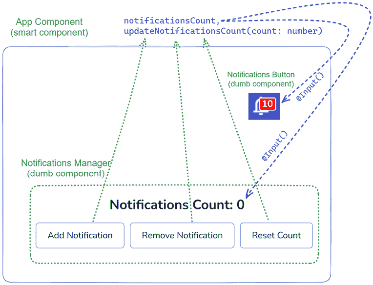

图 1.1：使用 @Input() 和 @Output() 属性的通信流程

## 准备工作

我们将要工作的应用位于克隆的仓库中的 `start/apps/chapter01/cc-inputs-outputs`：

1.  在您的代码编辑器中打开代码仓库。

1.  打开终端，导航到代码仓库目录，并运行以下命令来启动项目：

    ```js
    npm run serve cc-inputs-outputs 
    ```

    这应该在新的浏览器标签页中打开应用，您应该看到以下内容：

    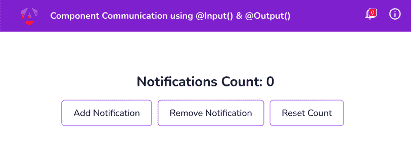

    图 1.2：在 http://localhost:4200 上运行的 cc-inputs-outputs 应用

## 如何做到这一点...

到目前为止，我们有一个包含 `AppComponent`、`NotificationsButtonComponent` 和 `NotificationsManagerComponent` 的应用。虽然 `AppComponent` 是其他两个组件的父组件，但它们之间完全没有组件通信来同步两个组件中的通知计数值。让我们使用以下步骤建立它们之间适当的通信：

1.  我们将把 `notificationsCount` 变量从 `NotificationsManagerComponent` 移动到 `AppComponent`。为此，在 `app.component.ts` 中创建一个 `notificationsCount` 属性，如下所示：

    ```js
    export class AppComponent {
      **notificationsCount =** **0****;**
    } 
    ```

1.  接下来，将 `notifications-manager.component.ts` 中的 `notificationsCount` 属性转换为 `@Input()`，将其重命名为 `count`，并按以下方式替换其用法：

    ```js
    import { Component, OnInit, **Input** } from '@angular/core';
    @Component({
      selector: 'app-notifications-manager',
      templateUrl: './notifications-manager.component.html',
      styleUrls: ['./notifications-manager.component.scss']
    })
    ...
    export class NotificationsManagerComponent implements OnInit {
      @Input() **count** = 0
    constructor() { }
      ngOnInit(): void {
      }
      addNotification() {
        this.**count**++;
      }
      removeNotification() {
        if (this.**count** == 0) {
          return;
        }
        this.**count**--;
      }
      resetCount() {
        this.**count** = 0;
      }
    } 
    ```

1.  更新 `notifications-manager.component.html` 以使用 `count` 而不是 `notificationsCount`：

    ```js
    <div class="notif-manager">
    <div class="notif-manager__count">
        Notifications Count: {{**count**}}
      </div>
      ...
    </div> 
    ```

1.  接下来，将 `notificationsCount` 属性从 `app.component.html` 传递到 `<app-notifications-manager>` 元素作为输入：

    ```js
    <div class="content" role="main">
    <app-notifications-manager
     **[****count****]=****"notificationsCount"**>
    </app-notifications-manager>
    </div> 
    ```

    现在，你可以通过将 `app.component.ts` 中的 `notificationsCount` 的值赋为 `10` 来测试值是否被正确地从 `app.component.html` 传递到 `app-notifications-manager`。你将看到在 `NotificationsManagerComponent` 中显示的初始值将是 `10`：

    ```js
    export class AppComponent {
      notificationsCount = **10**;
    } 
    ```

1.  现在，在 `notifications-button.component.ts` 中也创建一个名为 `count` 的 `@Input()`：

    ```js
    import { Component, OnInit, **Input** } from '@angular/core';
    ...
    export class NotificationsButtonComponent implements OnInit {
      @**Input****() count =** **0****;**
      ...
    } 
    ```

1.  从 `app.component.html` 中也将 `notificationsCount` 传递给 `<app-notifications-button>`：

    ```js
    <!-- Toolbar -->
    <div class="toolbar" role="banner">
      ...
      <span>@Component Inputs and Outputs</span>
    <div class="spacer"></div>
    <div class="notif-bell">
    <app-notifications-button
     **[****count****]=****"notificationsCount"**>
    </app-notifications-button>
    </div>
    </div>
    ... 
    ```

1.  使用 `notifications-button.component.html` 中的 `count` 输入与通知铃声图标一起：

    ```js
    <div class="bell">
    <i class="material-icons">notifications</i>
    <div class="bell__count">
    <div class="bell__count__digits">
          {{**count**}}
        </div>
    </div>
    </div> 
    ```

    你现在应该看到通知铃声图标计数的值也是 `10`。

    目前，如果你通过添加/删除通知从 `NotificationsManagerComponent` 改变计数，通知铃声图标上的计数不会改变。

1.  为了传达从 `NotificationsManagerComponent` 到 `NotificationsButtonComponent` 的变化，我们现在将使用 Angular 的 `@Output()` 属性。在 `notifications-manager.component.ts` 中使用来自 `'@angular/core'` 的 `@Output` 和 `@EventEmitter`：

    ```js
    import { Component, OnInit, Input, **Output****,** **EventEmitter**} from '@angular/core';
    ...
    export class NotificationsManagerComponent implements OnInit {
      @Input() count = 0
    **@Output****() countChanged =** **new****EventEmitter****<****number****>();**
    ...
      addNotification() {
        this.count++;
        **this****.****countChanged****.****emit****(****this****.****count****);**
      }
      removeNotification() {
        ...
        this.count--;
        **this****.****countChanged****.****emit****(****this****.****count****);**
      }
      resetCount() {
        this.count = 0;
        **this****.****countChanged****.****emit****(****this****.****count****)**;
      }
    } 
    ```

1.  然后，在 `app.component.html` 中监听来自 `NotificationsManagerComponent` 的先前发出的事件，并相应地更新 `notificationsCount` 属性：

    ```js
    <div class="content" role="main">
    <app-notifications-manager
     **(****countChanged****)=****"updateNotificationsCount($event)**"
     [count]="notificationsCount">
     </app-notifications- manager>
    </div> 
    ```

1.  由于我们之前已监听 `countChanged` 事件并调用 `updateNotificationsCount` 方法，我们需要在 `app.component.ts` 中创建此方法并相应地更新 `notificationsCount` 属性的值：

    ```js
    export class AppComponent {
      notificationsCount = 10;
      **updateNotificationsCount****(****count:** **number****) {**
    **this****.****notificationsCount** **= count;**
    **}**
    } 
    ```

## 它是如何工作的…

为了使用 `@Input()` 和 `@Output()` 属性在组件之间进行通信，数据流始终是 *从* 子组件 *到* 父组件通过输出事件发射器（`@Output()`），*从* 父组件到子组件通过输入绑定（`@Input()`）。一般来说，当两个兄弟组件需要通信时，其中一个必须使用输出发射器将值传递给父组件，然后父组件可以将新的（更新的）值 *作为输入* 提供给其他子组件。因此，`NotificationsManagerComponent` 发出 `countChanged` 事件。`AppComponent`（作为父组件）监听该事件并更新 `notificationsCount` 的值，由于 `notificationsCount` 被作为 `@Input()` count 传递给 `NotificationsButtonComponent`，这会自动更新 `NotificationsButtonComponent` 中的 `count` 属性。*图 1.3* 展示了整个流程：

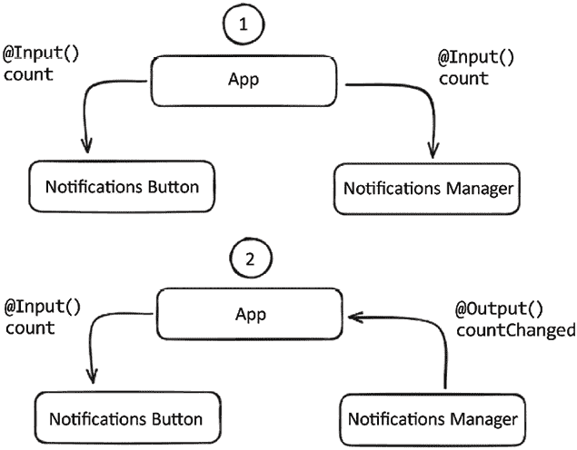

图 1.3：组件如何通过输入和输出进行通信

## 参考内容

+   Angular 组件如何通信？[`www.thirdrocktechkno.com/blog/how-angular-components-communicate`](https://www.thirdrocktechkno.com/blog/how-angular-components-communicate)

+   Dhananjay Kumar 的《*Angular 中的组件通信*》：[`www.youtube.com/watch?v=I8Z8g9APaDY`](https://www.youtube.com/watch?v=I8Z8g9APaDY)

# 使用服务进行组件通信

在这个菜谱中，你将从包含父组件和子组件的应用程序开始。然后，你将使用 Angular 服务在它们之间建立通信。我们将使用 `BehaviorSubject` 和 `Observable` 流来在组件和服务之间进行通信。

## 准备工作

该菜谱的项目位于 `start/apps/chapter01/cc-services`:

1.  在 Visual Studio Code 中打开项目。

1.  打开终端，导航到代码仓库目录，并运行以下命令以启动项目：

    ```js
    npm run serve cc-services 
    ```

    这应该在新的浏览器标签页中打开应用程序，你应该看到如下所示的应用程序：

    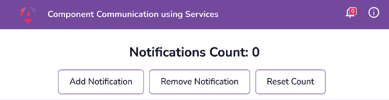

    图 1.4：运行在 http://localhost:4200 上的 cc-services 应用程序

## 如何做到这一点…

与前面的菜谱类似，我们有一个包含 `AppComponent`、`NotificationsButtonComponent` 和 `NotificationsManagerComponent` 的应用程序。`AppComponent` 是前面提到的其他两个组件的父组件，我们需要使用以下步骤在它们之间建立适当的通信：

1.  从终端确保你位于工作区的根目录，并运行以下命令创建一个名为 `NotificationsService` 的新服务：

    ```js
    cd start && nx g s services/Notifications --project cc-services 
    ```

1.  在 `notifications.service.ts` 中创建一个名为 `count$` 的 `BehaviorSubject`，并使用 `0` 初始化它（`BehaviorSubject` 需要一个初始值）：

    ```js
    import { Injectable } from '@angular/core';
    **import** **{** **BehaviorSubject** **}** **from****'rxjs'****;**
    @Injectable({
      providedIn: 'root'
    })
    export class NotificationsService {
      **count$ =** **new****BehaviorSubject****(****0****);**
    setCount(value: number) {
        this.count$.next(value);
      }
    } 
    ```

1.  将 `notifications-manager.component.ts` 中的 `notificationsCount` 属性重命名为 `notificationsCount$`，并将其分配给服务的 `count$` 属性，如下所示：

    ```js
    import { Component, **inject** } from '@angular/core';
    **import** **{** **NotificationsService** **}** **from****'../services/notifications.service'****;**
    ...
    export class NotificationsManagerComponent implements OnInit {
      **notificationService =** **inject****(****NotificationsService****);**
    **notificationsCount$ =** **this****.****notificationService****.****count$****;**
    ...
    } 
    ```

1.  修改与 `NotificationsManagerComponent` 相关的函数，以更新 `Behavior Subject` 的值，如下所示：

    ```js
    ...
    export class NotificationsManagerComponent implements OnInit {
      ...
      addNotification() {
        **const** **currentValue =**
    **this****.****notificationsCount$****.****getValue****();**
    **this****.****notificationService****.****setCount****(currentValue +** **1****);**
      }
      removeNotification() {
        **const** **currentValue =**
    **this****.****notificationsCount$****.****getValue****();**
    **if** **(currentValue ===** **0****) {**
    **return****;**
    **}**
    **this****.****notificationService****.****setCount****(currentValue -** **1****);**
      }
      resetCount() {
        **this****.****notificationService****.****setCount****(****0****);**
      }
    } 
    ```

1.  在 `notifications-manager.component.html` 中使用 `async` 管道，利用 `notificationsCount$` 可观察对象来显示其值：

    ```js
    <div class="notif-manager">
    <div class="notif-manager__count">
        Notifications Count: {{**notificationsCount$ | async**}}
      </div>
      ...
    </div> 
    ```

1.  现在，类似地，在 `notifications-button.component.ts` 中注入 `NotificationsService`，在 `NotificationsButtonComponent` 中创建一个名为 `notificationsCount$` 的可观察对象，并将其分配给服务的 `count$` 可观察对象：

    ```js
    import { Component**, inject** } from '@angular/core';
    **import** **{** **NotificationsService** **}** **from****'../services/notifications.service'****;**
    ...
    export class NotificationsButtonComponent {
      **notificationsCount$ =** **inject****(****NotificationsService****).****count$****;**
    } 
    ```

1.  在 `notifications-button.component.html` 中使用 `async` 管道，利用 `notificationsCount$` 可观察对象：

    ```js
    <div class="bell">
    <i class="material-icons">notifications</i>
    <div class="bell__count">
    <div class="bell__count__digits">
          {{**notificationsCount$ | async**}}
        </div>
    </div>
    </div> 
    ```

    如果你现在刷新应用程序，你应该能够在通知管理组件和通知按钮组件中看到值 `0`。

1.  将 `count BehaviorSubject` 的初始值更改为 `10` 并查看它是否在两个组件中反映：

    ```js
    ...
    export class NotificationsService {
      private count: BehaviorSubject<number> = new
    BehaviorSubject<number>(**10**);
      ...
    } 
    ```

## 它是如何工作的…

`BehaviorSubject` 是一种特殊的 **Observable** 类型，它需要一个初始值并且可以被多个订阅者使用。在这个菜谱中，我们创建一个 `BehaviorSubject` 来存储通知计数器的值。

一旦我们创建了名为 `count$` 的 `BehaviorSubject`，我们使用（相对较新的）`inject` 函数在我们的组件中注入 `NotificationsService`，并将服务的 `count$` 属性分配给组件的一个属性。这允许我们在 `NotificationsButtonComponent` 和 `NotificationsManagerComponent` 中使用 `BehaviorSubject`。

然后，我们在上述两个函数的模板中使用 `notificationsCount$` 属性，以便能够渲染计数值。注意，我们在模板中使用了 **async** 管道。这有助于 Angular 在组件渲染时让模板订阅 `BehaviorSubject`，并在组件销毁时自动取消订阅。

要更新 `BehaviorSubject` 的值，我们通过提供要设置的新值来使用其 `next` 方法。一旦 `count$` 的值被更新，组件就会因为 RxJS 和 Angular 的变更检测而重新渲染新值。

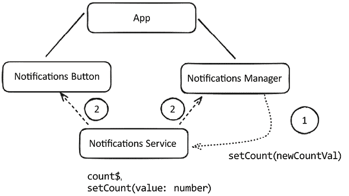

图 1.5：使用 Angular 服务进行组件通信的方式

## 相关内容

+   来自 RxJS 官方文档的主题：[`www.learnrxjs.io/learn-rxjs/subjects`](https://www.learnrxjs.io/learn-rxjs/subjects)

+   `BehaviorSubject` 与 **Observable** 在 Stack Overflow 上的比较：[`stackoverflow.com/a/40231605`](https://stackoverflow.com/a/40231605)

# 使用设置器来拦截输入属性更改

在这个菜谱中，你将学习如何拦截从父组件传递的 `@Input` 的更改，以及如何在此事件上执行某些操作。我们将拦截从 `VersionControlComponent` 父组件传递到 `VcLogsComponent` 子组件的 `vName` 输入。我们将使用 *设置器* 在 `vName` 的值更改时生成日志，并在子组件中显示这些日志。

## 准备工作

本菜谱的项目位于 `start/apps/chapter01/cc-setters`：

1.  在 Visual Studio Code 中打开项目。

1.  打开终端，导航到代码仓库目录，并运行以下命令以启动项目：

    ```js
    npm run serve cc-setters 
    ```

    这应该会在新浏览器标签页中打开应用程序，你应该看到以下应用程序：

    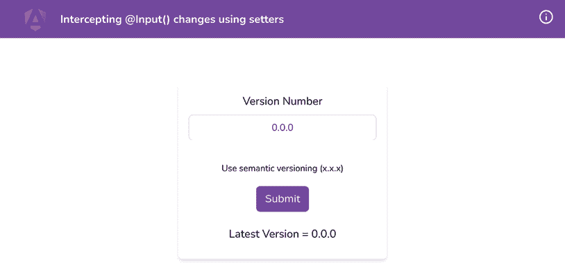

    图 1.6：在 http://localhost:4200 上运行的 cc-setters 应用程序

## 如何做到这一点...

1.  我们首先在 `VcLogsComponent` 中创建一个 `logs` 数组，如下所示，以存储我们稍后将在模板中显示的所有日志：

    ```js
    export class VcLogsComponent implements OnInit {
      @Input() vName;
      **logs****:** **string****[] = [];**
    } 
    ```

1.  让我们修改 HTML 模板，以便我们可以显示日志。按照以下方式修改 `vc-logs.component.html` 文件：

    ```js
    <h5>Latest Version = {{vName}}</h5>
    **<****div****class****=****"logs"****>**
    **<****div****class****=****"logs__item"** *******ngFor****=****"let log of logs"****>**
    **{{log}}**
    **</****div****>**
    **</****div****>** 
    ```

    以下截图显示了带有日志容器的应用程序：

    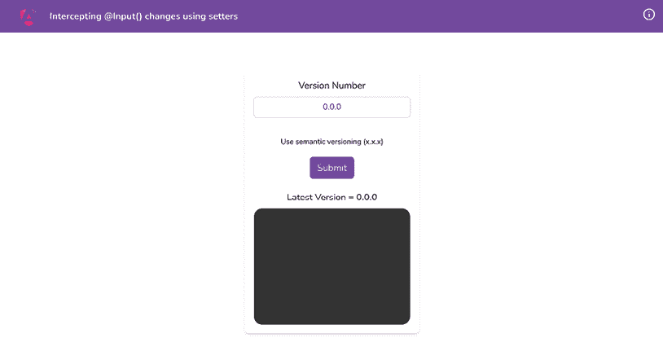

    图 1.7：带有日志容器的 cc-setters 应用程序

1.  现在，我们将`vc-logs.component.ts`中的`@Input()`转换为使用*getter*和*setter*，以便我们可以拦截输入变化。为此，我们还将创建一个名为`_vName`的内部属性。代码应如下所示：

    ```js
    import { Component, **Input** } from '@angular/core'
    ...
    export class VcLogsComponent implements OnInit {
      **@Input****()**
    **get****vName****() {**
    **return****this****.****_vName****;**
    **}**
    **set****vName****(****name:** **string****) {**
    **this****.****_vName** **= name;**
    **}**
    logs: string[] = [];
      **_vName!:** **string****;**
    ...
    } 
    ```

1.  修改 setter 以创建一些日志。每当`vName`的值发生变化时，我们将向`logs`数组中推送一个新的日志。第一次，我们将推送一条日志，内容为`'initial version is x.x.x'`：

    ```js
    export class VcLogsComponent implements OnInit {
      ...
      set vName(name: string) {
        **if** **(!****this****.****_vName****) {**
    **this****.****logs****.****push****(****`initial version is** **${name.trim()}****`****)**
    **}**
    this._vName = name;
      }
    ...
    } 
    ```

1.  现在，每次我们更改版本名称时，都需要显示不同的消息，内容为`'version changed to x.x.x'`。*图 1.8*显示了最终输出。为了进行必要的更改，让我们修改`vName`setter 如下：

    ```js
    export class VcLogsComponent implements OnInit {
      ...
      set vName(name: string) {
        if (!name) return;
        if (!this._vName) {
          this.logs.push(`initial version is ${name.trim()}`)
        }**else** **{**
    **this****.****logs****.****push****(****`version changed to** **${name.trim()}****`****)**
    **}**
    this._vName = name;
      } 
    ```

    以下截图显示了最终输出：

    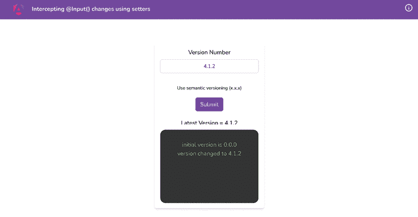

    图 1.8：使用 setter 的最终输出

## 工作原理...

JavaScript 有`getters`作为返回动态计算值的函数。它也有`setters`作为在目标属性变化时执行一些逻辑的函数。Angular 使用 TypeScript，它是 JavaScript 的超集，Angular 的`@Input()`属性也可以使用`getters`和`setters`，因为它们基本上是提供类中的属性。

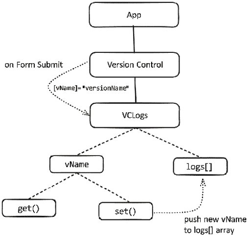

图 1.9：解释 cc-setters 应用中数据流的图表

对于这个菜谱，我们为名为`vName`的输入使用 getter 和 setter，所以每当输入发生变化时，我们使用 setter 函数将新版本推送到日志列表。然后我们在模板中使用`logs`数组来渲染视图上的日志列表。

总是使用私有变量/属性与使用 getters 和 setters 的属性一起使用是一个好主意。这样我们就可以在我们的组件中修改私有属性，而模板只通过 getter 访问公共属性。

## 参见

+   Angular 的 setter 官方文档：[`angular.io/guide/component-interaction#intercept-input-property-changes-with-a-setter`](https://angular.io/guide/component-interaction#intercept-input-property-changes-with-a-setter)

+   Mozilla 的 getter 函数官方文档：[`developer.mozilla.org/en-US/docs/Web/JavaScript/Reference/Functions/get`](https://developer.mozilla.org/en-US/docs/Web/JavaScript/Reference/Functions/get)

+   Mozilla 的 setter 函数官方文档：[`developer.mozilla.org/en-US/docs/Web/JavaScript/Reference/Functions/set`](https://developer.mozilla.org/en-US/docs/Web/JavaScript/Reference/Functions/set)

# 使用 ngOnChanges 拦截输入属性变化

在这个菜谱中，您将学习如何使用`ngOnChanges`通过`SimpleChanges` API 拦截变化。我们将监听从`VersionControlComponent`父组件传递到`VcLogsComponent`子组件的`vName`输入。

## 准备工作

我们将要工作的应用位于克隆的仓库中的`start/apps/chapter01/cc-ng-on-changes`：

1.  在您的代码编辑器中打开代码仓库。

1.  打开终端，导航到代码仓库目录，并运行以下命令以启动项目：

    ```js
    npm run serve cc-ng-on-changes 
    ```

    这应该在新的浏览器标签页中打开应用，你应该看到以下内容：

    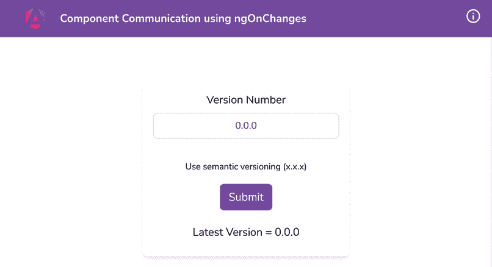

    图 1.10：运行在 http://localhost:4200 上的 cc-ng-on-changes 应用

## 如何做到这一点...

1.  我们首先在`VcLogsComponent`中创建一个`logs`数组，如下所示，以存储我们稍后将在模板中使用的所有日志：

    ```js
    export class VcLogsComponent implements OnInit {
      @Input() vName;
      **logs****:** **string****[] = [];**
    ...
    } 
    ```

1.  让我们创建显示日志的 HTML。让我们在`vc-logs.component.html`中使用以下代码添加`logs`容器和日志项：

    ```js
    <h5>Latest Version = {{vName}}</h5>
    **<****div****class****=****"logs"****>**
    **<****div****class****=****"logs__item"** *******ngFor****=****"let log of logs"****>**
    **{{log}}**
    **</****div****>**
    **</****div****>** 
    ```

    以下截图显示了带有`logs`容器的应用：

    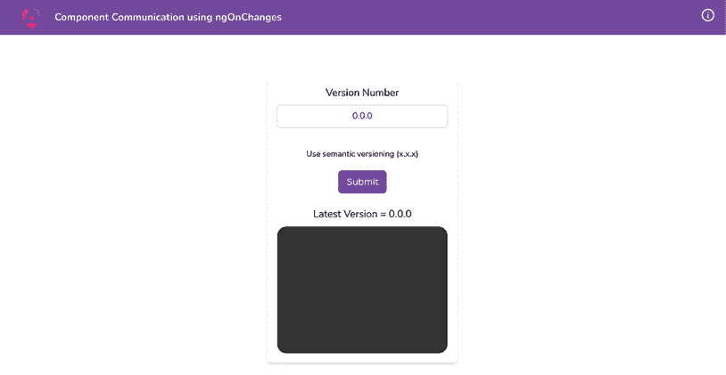

    图 1.11：带有日志容器的 cc-ng-on-changes 应用

1.  现在，让我们在`VcLogsComponent`中实现`ngOnChanges`，如下所示，在`vc-logs.component.ts`文件中使用简单的更改：

    ```js
    import { Component, Input, **OnChanges****,** **SimpleChanges** } from '@angular/core';
    ...
    export class VcLogsComponent **implements****OnChanges** {
      @Input() vName;
      logs: string[] = [];
      **ngOnChanges****(****changes: SimpleChanges****) {**
    **}**
    } 
    ```

1.  现在我们可以为`vName`输入的初始版本添加一个日志，表示“初始版本是 x.x.x”。我们通过使用`isFirstChange`方法检查它是否是初始值来完成此操作，如下所示：

    ```js
    ...
    export class VcLogsComponent implements OnChanges {
      ...
      ngOnChanges(changes: SimpleChanges) {
        **const** **{ currentValue } = changes[****'vName'****];**
    **if** **(changes[****'vName'****].****isFirstChange****()) {**
    **this****.****logs****.****push****(****`initial version is** **${currentValue.trim()}****`****);**
    **}**
      }
    } 
    ```

1.  让我们处理在初始值分配之后更新版本的情况。为此，我们将添加另一个日志，表示“版本已更改为 x.x.x”，使用`else`条件，如下所示：

    ```js
    ...
    export class VcLogsComponent implements OnInit, OnChanges {
      ...
      ngOnChanges(changes: SimpleChanges) {
        const { currentValue } = changes['vName'];
        if (changes['vName'].isFirstChange()) {
          this.logs.push(`initial version is ${currentValue.trim()}`);
        } **else** **{**
    **this****.****logs****.****push****(****`version changed to** **${currentValue.trim()}****`****)**
    **}**
      }
    } 
    ```

    以下截图显示了最终输出：

    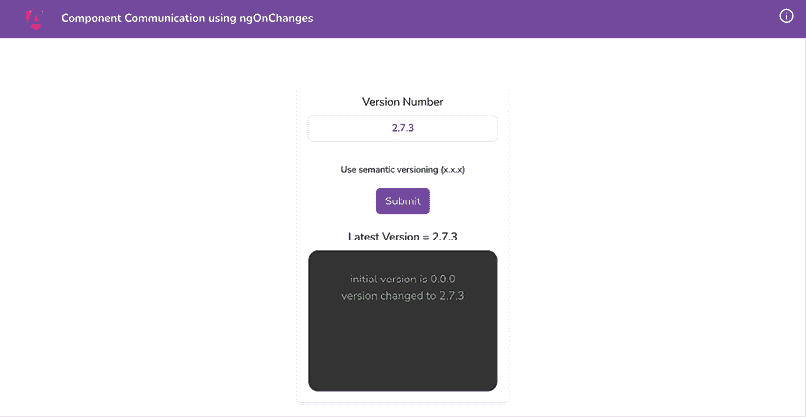

    图 1.12：使用`ngOnChanges`的最终输出

## 它是如何工作的…

`ngOnChanges`是 Angular 提供的许多**生命周期钩子**之一。它在`ngOnInit`钩子之前触发。因此，在第一次调用中，你将获得*初始值*，稍后获得*更新后的值*。每当任何输入发生变化时，`ngOnChanges`回调都会使用`SimpleChanges`触发。在变化中，对于每个`@Input()`，你可以获取前一个值、当前值以及一个表示这是否是输入的第一个更改（即初始值）的*布尔值*。当我们更新父级中的`vName`输入值时，`ngOnChanges`会使用更新后的值被调用。然后，根据情况，我们将适当的日志添加到我们的`logs`数组中，并在 UI 上显示它。

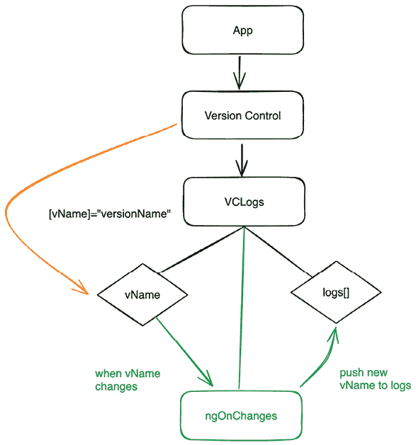

图 1.13：`ngOnChanges`如何将新版本推送到日志数组

## 参见

+   Angular 生命周期钩子：[`angular.io/guide/lifecycle-hooks`](https://angular.io/guide/lifecycle-hooks)

+   使用`ngOnChanges`生命周期钩子进行变更检测：[`angular.io/guide/lifecycle-hooks#using-change-detection-hooks`](https://angular.io/guide/lifecycle-hooks#using-change-detection-hooks)

+   **SimpleChanges** API 参考：[`angular.io/api/core/SimpleChanges`](https://angular.io/api/core/SimpleChanges)

# 通过模板变量在父模板中访问子组件

在这个示例中，你将学习如何使用 **Angular 模板引用变量** 来在父组件的模板中访问子组件。你将从具有 `AppComponent` 作为父组件和 `GalleryComponent` 作为子组件的应用程序开始。然后你将在父模板中为子组件创建一个模板变量来访问它并在组件类中执行一些操作。

## 准备工作

我们将要工作的应用程序位于克隆的仓库中的 `start/apps/chapter01/cc-template-vars` 目录内：

1.  在你的代码编辑器中打开代码仓库。

1.  打开终端，导航到代码仓库目录，并运行以下命令以启动项目：

    ```js
    npm run serve cc-template-vars 
    ```

    这应该在新的浏览器标签页中打开应用程序，你应该看到以下内容：

    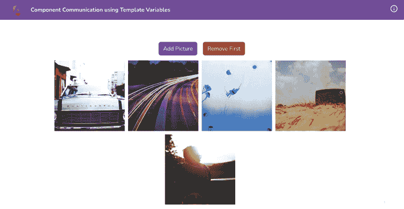

    图 1.14：在 http://localhost:4200 上运行的 cc-template-vars 应用程序

点击顶部的按钮以查看相应的控制台日志。这表明我们已经将点击处理程序绑定到了按钮上。

## 如何操作…

1.  我们将在 `app.component.html` 文件中的 `<app-gallery>` 组件上创建一个名为 `#gallery` 的模板变量，如下所示：

    ```js
    ...
    <div class="content" role="main">
      ...
      <app-gallery **#****gallery**></app-gallery>
    </div> 
    ```

1.  修改 `app.component.ts` 中的 `addNewPicture` 和 `removeFirstPicture` 方法，使其接受一个名为 `gallery` 的参数。这样我们就可以在点击按钮时，从 `app.component.html` 将模板变量 `#gallery` 传递给它们。代码如下：

    ```js
    import { Component } from '@angular/core';
    **import** **{** **GalleryComponent** **}** **from****'./components/gallery/gallery.component'**;
    ...
    export class AppComponent {
      ...
      addNewPicture(**gallery: GalleryComponent**) {
        console.log('added new picture'**, gallery**);
      }
      removeFirstPicture(**gallery: GalleryComponent**) {
        console.log('removed first picture'**, gallery**);
      }
    } 
    ```

1.  现在，让我们将 `#gallery` 模板变量从 `app.component.html` 传递给两个按钮的点击处理程序，如下所示：

    ```js
    ...
    <div class="content" role="main">
    <div class="gallery-actions">
    <button class="btn btn-primary"
          (click)="addNewPicture(**gallery**)">Add Picture</button>
    <button class="btn btn-danger"
          (click)="removeFirstPicture(**gallery**)">Remove First</button>
    </div>
      ...
    </div> 
    ```

    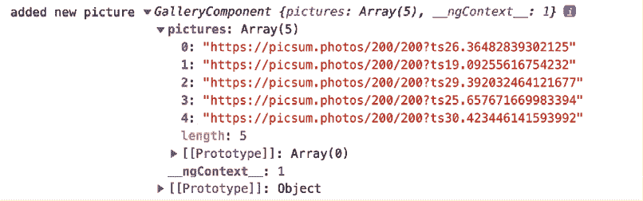

    图 1.15：点击添加图片按钮时的控制台日志

1.  现在我们可以实现添加新图片的代码。为此，我们将访问 `GalleryComponent` 类的 `generateImage` 方法，并将一个新项目作为第一个元素添加到 `pictures` 数组中。代码如下：

    ```js
    ...
    export class AppComponent {
      ...
      addNewPicture(gallery: GalleryComponent) {
        **gallery.****pictures****.****unshift****(gallery.****generateImage****());**
      }
      ...
    } 
    ```

1.  为了从数组中移除第一个项目，我们将在 `GalleryComponent` 类中的 `pictures` 数组上使用 JavaScript 数组类的 `shift` 方法。代码如下：

    ```js
    ...
    export class AppComponent {
       ...
      removeFirstPicture(gallery: GalleryComponent) {
        **gallery.****pictures****.****shift****();**
      }
    } 
    ```

## 工作原理…

**模板引用变量** 通常是指向模板中 DOM 元素的引用。它也可以是指向 Angular 中的组件或指令（来源：[`angular.io/guide/template-reference-variables`](https://angular.io/guide/template-reference-variables)）。

在这个示例中，我们通过在 `<app-gallery>` 标签上创建一个引用（变量）来在 `app.component.html` 中引用我们的画廊组件。在这个例子中，这个标签是一个 Angular 组件。在模板中用变量引用它之后，我们将这个引用（模板变量）作为函数参数传递给组件中的函数。

我们随后通过传递的模板变量来访问 `GalleryComponent` 的属性和方法。您可以看到，我们能够直接从 `AppComponent` 中添加和移除位于 `GalleryComponent` 中的 `pictures` 数组中的项目——即，我们是从父组件（`App`）中访问 `GalleryComponent` 的属性和方法。

## 参见

+   Angular 模板变量：[`angular.io/guide/template-reference-variables`](https://angular.io/guide/template-reference-variables)

+   Angular 模板语句：[`angular.io/guide/template-statements`](https://angular.io/guide/template-statements)

# 在父组件类中使用 ViewChild 访问子组件

在本食谱中，您将学习如何使用 `ViewChild` 装饰器在父组件类中访问子组件。您将从具有 `AppComponent` 作为父组件和 `GalleryComponent` 作为子组件的应用程序开始。然后，您将在父组件类中为子组件创建一个 `ViewChild` 以访问它并执行一些操作。

## 准备工作

我们将要工作的项目位于克隆的仓库中的 `chapter01/start_here/cc-view-child`：

1.  在您的代码编辑器中打开代码仓库。

1.  打开终端，导航到代码仓库目录，并运行以下命令以运行项目：

    ```js
    npm run serve cc-view-child to serve the project. 
    ```

    这应该在新的浏览器标签页中打开应用程序，您应该看到以下内容：

    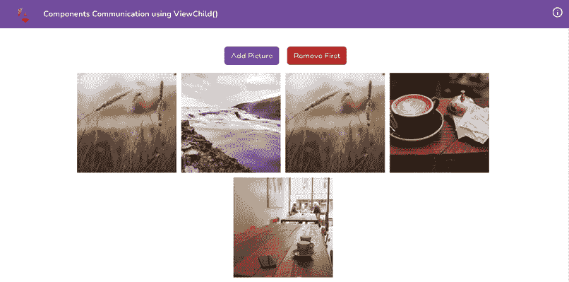

    图 1.16：在 http://localhost:4200 上运行的 cc-view-child 应用

点击顶部的按钮以查看相应的控制台日志。

## 如何实现…

1.  我们将从将 `GalleryComponent` 导入到我们的 `app.component.ts` 文件开始，这样我们就可以为它创建一个 `ViewChild`：

    ```js
    import { Component**,** **ViewChild** } from '@angular/core';
    **import** **{** **GalleryComponent** **}** **from****'****./components/gallery/gallery.component'****;**
    ...
    export class AppComponent {
      **@ViewChild****(****GalleryComponent****) gallery!:** **GalleryComponent****;**
     **...**
    } 
    ```

1.  为了处理添加新图片，我们将在 `AppComponent` 中的 `addNewPicture` 方法中使用 gallery `ViewChild`。我们将使用 `GalleryComponent` 的 `generateImage` 方法将新图片添加到数组的顶部，如下所示：

    ```js
    ...
    export class AppComponent {
      @ViewChild(GalleryComponent) gallery!: GalleryComponent;
      addNewPicture() {    console.log('added new picture');
        **this****.****gallery****.****pictures****.****unshift****(**
    **this****.****gallery****.****generateImage****()**
    **);**
      }
      ...
    } 
    ```

1.  为了处理移除图片，我们将在 `AppComponent` 类中的 `removeFirstPicture` 方法中添加逻辑。我们将使用 `Array.prototype.shift` 方法在 `pictures` 数组上移除第一个元素，如下所示：

    ```js
    ...
    export class AppComponent {
    ...
      removeFirstPicture() {
        **this****.****gallery****.****pictures****.****shift****();**
      }
    } 
    ```

## 它是如何工作的…

`ViewChild()` 是 Angular 提供的一个装饰器，用于访问在父组件模板中使用的子组件。它为 Angular 的变更检测器配置了一个 **视图查询**。变更检测器试图找到与查询匹配的第一个元素，并将其分配给与 `ViewChild()` 装饰器关联的属性。在我们的教程中，我们通过提供 `GalleryComponent` 作为查询参数创建了一个 `ViewChild`，即 `ViewChild(GalleryComponent)`。这允许 Angular 变更检测器在 `app.component.html` 模板中找到 `<app-gallery>` 元素，然后将其分配给 `AppComponent` 类中的 `gallery` 属性。定义 `gallery` 属性的类型为 `GalleryComponent` 非常重要，这样我们就可以在组件中轻松地使用它，并利用 TypeScript 的所有魔法。

视图查询在 `ngOnInit` 生命周期钩子之后和 `ngAfterViewInit` 钩子之前执行。

## 参见

+   Angular `ViewChild`：[`angular.io/api/core/ViewChild`](https://angular.io/api/core/ViewChild)

+   数组的 `shift` 方法：[`developer.mozilla.org/en-US/docs/Web/JavaScript/Reference/Global_Objects/Array/shift`](https://developer.mozilla.org/en-US/docs/Web/JavaScript/Reference/Global_Objects/Array/shift)

# 独立组件和通过路由参数传递数据

在本教程中，我们将学习如何使用 **独立组件** 并如何通过路由参数传递一些数据到其他组件。请注意，这不仅仅限于独立组件，也可以用常规组件实现。应用程序的起始代码为我们提供了一个用户列表视图。我们的任务是使用路由参数实现 `details` 视图。

## 准备工作

我们将要工作的项目位于克隆的仓库中的 `start/apps/cc-standalone-components` 目录下：

1.  在您的代码编辑器中打开代码仓库。

1.  打开终端，导航到代码仓库目录，并运行以下命令来运行项目：

    ```js
    npm run serve cc-standalone-components 
    ```

    您应该能够看到应用程序如下所示：

    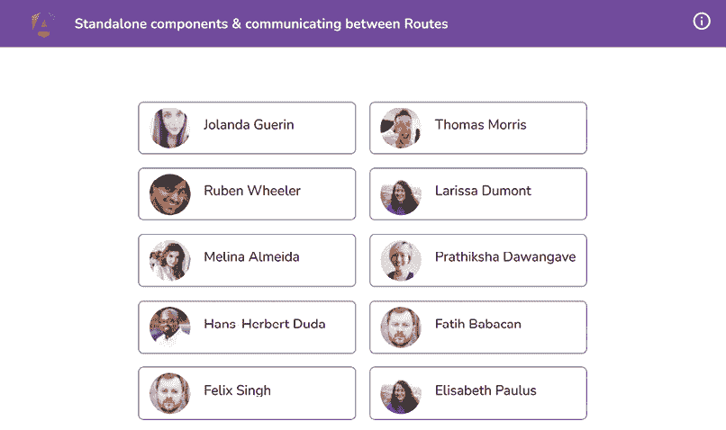

    图 1.17：显示应用程序 cc-standalone-components 的用户列表

## 如何操作…

1.  创建 `UserDetails` 组件/页面，稍后我们将在这里查看单个用户的详细信息。从项目根目录运行以下命令来创建它：

    ```js
    cd start && nx g c user-details --standalone --directory apps/chapter01/cc-standalone-components/src/app/user-details 
    ```

    如果被问及，请选择 `@nx/angular:component` 的 `schematics` 并选择“按提供”操作。

1.  我们现在将创建一个路由用于 `UserDetailsComponent`。按照以下方式更新 `app.routes.ts` 文件：

    ```js
    ...
    export const appRoutes: Route[] = [
      {...},
      **{**
    **path****:** **':uuid'****,**
    **loadComponent****:** **() =>**
    **import****(****'****./user-details/user-details.component'****)**
    **.****then****(****(****m****) =>** **m.****UserDetailsComponent**
    **),**
    **},**
    ]; 
    ```

1.  现在在 `users.component.ts` 文件中将 `RouterModule` 作为导入添加到 `UsersComponent` 中，如下所示：

    ```js
    ...
    import { RouterModule } from '@angular/router';
    @Component({
      ...
      imports: [CommonModule, RouterModule],
      ...
    })
    export class UsersComponent{} 
    ```

1.  在 `users.component.html` 文件中为用户列表中的每个用户项添加 `routerLink` 以导航到用户详情页面，如下所示：

    ```js
    <ul>
      @for (user of users; track user.uuid) {
        <li **routerLink****=****"/{{ user.uuid }}"****>**
          ...
        </li>
      }
    </ul> 
    ```

1.  在 `user-details.component.ts` 文件中 `UserDetailsComponent` 类的导入中添加 `RouterModule`：

    ```js
    ...
    import { RouterModule } from '@angular/router';
    @Component({
      ...
      imports: [CommonModule, RouterModule],
      ...
    })
    export class UserDetailsComponent {} 
    ```

1.  进一步更新 `UserDetailsComponent` 以创建一个用于保持当前显示用户数据的 **可观察对象**：

    ```js
    import { Component, **inject** } from '@angular/core';
    import { CommonModule } from '@angular/common';
    import { **ActivatedRoute****,** RouterModule } from '@angular/router';
    **import** **{** **Observable** **}** **from****'rxjs'****;**
    **import** **{** **User** **}** **from****'../data'****;**
    @Component({...})
    export class UserDetailsComponent {
      **route =** **inject****(****ActivatedRoute****);**
    **user$!:** **Observable****<****User** **|** **undefined****>;**
    } 
    ```

1.  现在创建一个 `constructor` 函数，从路由参数中获取 `uuid`，并获取和设置当前显示的用户数据，如下所示：

    ```js
    ...
    import { filter, map, Observable } from 'rxjs';
    import { User, USERS } from '../data';
    @Component({...})
    export class UserDetailsComponent {
      ...
      constructor() {
        this.user$ = this.route.paramMap.pipe(
          filter((params) => !!params.get('uuid')),
          map((params) => {
            const uuid = params.get('uuid');
            return USERS.find((user) => user.uuid === uuid);
          })
        );
      }
    } 
    ```

1.  最后，让我们更新 `user-details.component.html` 文件中 `UserDetailsComponent` 的模板，以如下方式显示用户：

    ```js
    <ng-container *ngIf="user$ | async as user">
    <div class="flex gap-4 items-center">
    <a routerLink="/" class="hover:text-slate-500">
    <span class="material-symbols-outlined"> arrow_back
          </span>
    </a>
    <article routerLink="/{{ user.uuid }}">
    
    <h4>{{ user.name.first }} {{ user.name.last }}</h4>
    </article>
    </div>
    </ng-container> 
    ```

    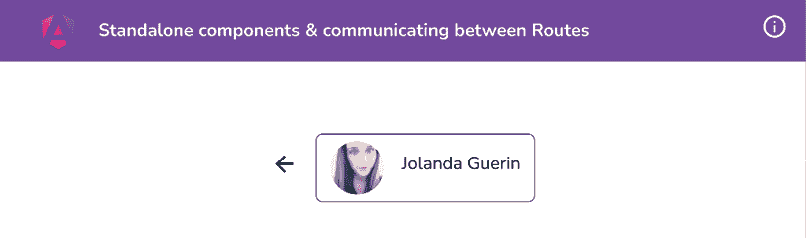

    图 1.18：用户详细信息分页显示当前选定的用户信息

## 它是如何工作的…

应用程序的起始模板包含一个配置为在主页路由（**/**）上显示的 `UsersComponent`。我们首先使用 Nx CLI 命令 `nx g c user-details --standalone --directory apps/chapter01/cc-standalone-components/src/app/user-details` 创建 `UserDetailsComponent`。注意，这使用 `--standalone` 来让 Angular 知道我们需要一个独立组件。我们还使用 `--directory apps/chapter01/cc-standalone-components/src/app/user-details`；因为我们正在使用 Nx 仓库，我们需要指定我们创建组件的确切目录。

然后，我们在 `app.routes.ts` 文件中添加 `UserDetailsComponent` 的路由。注意，我们使用 `':uuid'` 作为此路由的路径。这将导致一个示例路由 `http://localhost:4200/abc123` 显示组件，而 `uuid` 的值变为 `abc123` 作为路由参数。然后我们在 `UserDetailsComponent` 和 `UsersComponent` 类的装饰器元数据中导入 `RouterModule`。如果你之前使用过 Angular，你可能认为这通常是在 `NgModule` 中导入的。嗯，你是对的。但是，由于这些是独立组件，它们需要有自己的导入处理，因为它们本身不是任何 `NgModule` 的一部分。

然后，我们在主页路由（在 `UsersComponent` 模板）上的每个用户项添加 `routerLink` 以导航到用户的详细信息页面，并将用户的 ID 作为 `uuid` 参数传递。接下来的步骤是从 `ActivatedRoute` 服务中检索 `uuid` 参数，并使用 `uuid`（用户的 ID）获取所需用户。你会注意到我们在 `USERS` 数组上执行 `find` 方法，通过 `uuid` 查找所需用户。

最后，我们修改 `user-details.component.html` 文件以更新模板，显示视图上所需用户。简单易行！

## 参见

+   独立组件 - Angular 官方：[`angular.io/guide/standalone-components`](https://angular.io/guide/standalone-components)

+   开始使用 Angular 独立组件：[`www.youtube.com/watch?v=x5PZwb4XurU`](https://www.youtube.com/watch?v=x5PZwb4XurU)

# 使用信号进行组件通信

**信号** 是 Angular 生态系统中的一个强大补充。它们也比常规的 Angular 类属性更高效，因为当你改变信号值时，Angular 只会通知订阅了该信号的组件来运行变更检测。这可以提高你应用程序的性能，特别是如果有许多组件订阅了该信号。在这个菜谱中，我们将使用 Angular 信号来实现一些有趣的结果。我们将显示完成任务的数目与总任务数。当所有任务都完成时，我们还将显示一条消息。让我们开始吧！

## 准备工作

我们将要工作的应用程序位于克隆的仓库中的 `start/apps/chapter01/ng-cc-signals` 目录内。执行以下步骤开始：

1.  在你的代码编辑器中打开代码仓库。

1.  打开终端，导航到代码仓库目录，并运行以下命令来运行项目：

    ```js
    npm run serve ng-cc-signals 
    ```

    这应该会在浏览器中打开一个新标签页，你应该在 `http://localhost:4200` 看到以下内容：

    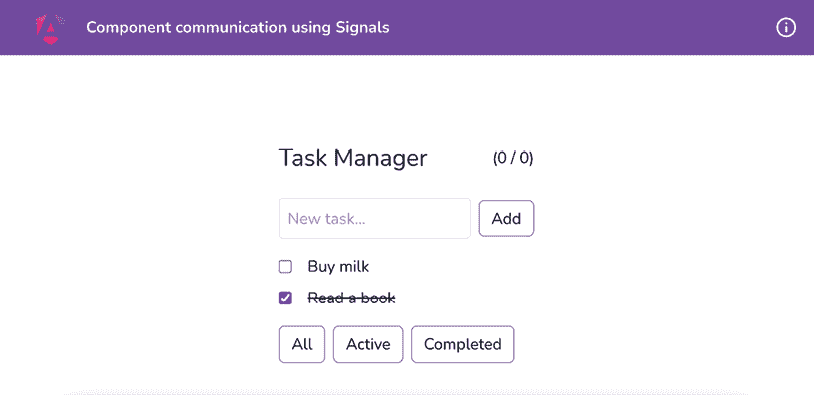

    图 1.19：ng-cc-signals 应用在 http://localhost:4200 上运行

现在我们已经在本地运行了应用程序，让我们在下一节中逐步介绍菜谱。

## 如何操作

我们正在工作的应用程序是一个基本的 *任务管理器* 应用程序。然而，我们有以下两个有趣的要求：

+   我们应该能够在 **任务管理器** 标题下 *动态地* 看到完成任务的计数与总任务数。这意味着任何对任务的更改都应该自动更新它。

+   当所有任务都完成时，我们应该向用户显示一条消息以祝贺他们。

让我们开始吧：

1.  首先，我们将为任务创建一个 `type`，并为过滤器创建一个 `enum`，因为 —— *TypeScript 赢家*。在 `src/app` 文件夹内创建一个新文件，命名为 `task.model.ts`，并将以下代码添加到其中：

    ```js
    ...
    **export****type****Task** **= {**
    **completed****:** **boolean****;**
    **title****:** **string****;**
    **}**
    **export****enum****TasksFilter** **{**
    **All****,**
    **Active****,**
    **Completed**
    **}** 
    ```

1.  现在，我们将在 `app.component.ts` 文件中为任务数组创建第一个信号。更新如下：

    ```js
    import { CommonModule } from '@angular/common';
    import { Component, **signal** } from '@angular/core';
    import { RouterModule } from '@angular/router';
    **import** **{** **Task** **}** **from****'./task.model'****;**
    ...
    export class AppComponent {
      tasks = **signal<****Task****[]>(**[
        { title: 'Buy milk', completed: false },
        { title: 'Read a book', completed: true },
      ]**)**;
    } 
    ```

    由于属性更改为信号，`app.component.html` 应该会开始抱怨。

1.  更新 `app.component.html` 文件以使用信号及其获取函数如下：

    ```js
    <!-- Task List -->
    <ul>
          @for (task of **tasks()**; track $index) {
            <li class="mb-2 flex gap-4 items-center cursor
    -pointer hover:opacity-70">
    <input type="checkbox" [checked]=
     "task.completed" />
    <span [ngClass]="{'line-through': task.completed}" >{{ task.title }}</span>
    </li>
          }
        </ul> 
    ```

1.  我们将实现切换任务为完成或未完成的功能。更新 `app.component.ts` 如下：

    ```js
    ...
    export class AppComponent {
      tasks = signal<Task[]>([...]);

      **toggleTask****(****task: Task****) {**
    **const** **updatedTasks =** **this****.****tasks****().****map****(****taskItem** **=>**
    **taskItem.****title** **=== task.****title** **? {...taskItem,**
    **completed****: !taskItem.****completed****} : taskItem**
    **);**
    **this****.****tasks****.****set****(updatedTasks);**
    **}**
    } 
    ```

1.  现在更新模板以将每个项的点击处理程序绑定到切换其 `完成` 状态。更新 `app.component.html` 如下：

    ```js
    <!-- Task List -->
    <ul>
          @for (task of tasks(); track $index) {
            <li **(****click****)=****"toggleTask(task)"** class="mb-2 flex
    gap-4 items-center cursor-pointer
    hover:opacity-70">
    <input type="checkbox" [checked]=
     "task.completed" />
    <span [ngClass]="{'line-through':
    task.completed}">{{ task.title }}</span>
    </li>
          }
        </ul> 
    ```

    你应该能够通过点击任务项来标记任务为 `完成` 或未完成。

1.  我们现在将创建一个 `computed` 属性来跟踪完成任务的数目。更新 `app.component.ts` 文件如下：

    ```js
    ...
    import { Component, **computed,** signal } from '@angular/core';
    ...
    export class AppComponent {
      tasks = signal<Task[]>([...]);

      **finishedTasksCount =** **computed****(****() =>** **{**
    **return****this****.****tasks****().****filter****(****task** **=>**
    **task.****completed****).****length****;**
    **})**
    toggleTask(task: Task) {...}
    } 
    ```

1.  更新模板以显示完成任务的计数。我们将更新 `app.component.html` 文件如下：

    ```js
    <main class="content" role="main">
    <div class="mx-auto p-4">
    <div class="flex items-center justify-between mb-4">
    <h1 class="text-2xl">Task Manager</h1>
    <span>
            (**{{finishedTasksCount()}}** / **{{tasks().length}}**)
          </span>
    </div>
        ...
      </div>
    </main> 
    ```

    你应该能够看到如图所示的完成任务的计数和任务计数：

    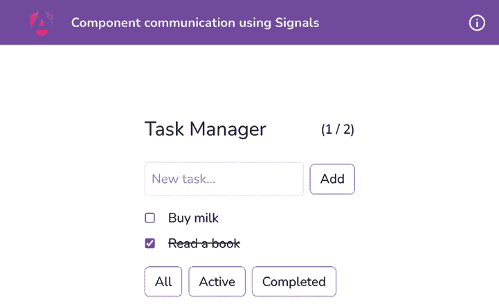

    图 1.20：显示完成任务的计数

1.  我们现在将添加添加新任务的功能。按照以下方式更新 `app.component.ts` 文件：

    ```js
    ...
    export class AppComponent {
      ...
      finishedTasksCount = computed(() => {...})

      **addTask****(****titleInput: HTMLInputElement****) {**
    **if** **(titleInput.****value****) {**
    **const** **newTask = {** 
    **title****: titleInput.****value****,** 
    **completed****:** **false**
    **};**
    **this****.****tasks****.****set****([...****this****.****tasks****(), newTask]);**
    **}**
    **titleInput.****value** **=** **''****;**
    **}**
    toggleTask(task: Task) {...}
    } 
    ```

1.  现在，更新 `app.component.html` 以将 `addTask` 方法绑定到输入和 `Add` 按钮上，如下所示：

    ```js
    <!-- Task Input -->
    <div class="mb-4">
    <input **#****titleInput** **(****keydown.enter****)=**
    **"addTask(titleInput)"** class="p-2 border rounded
    mr-2" placeholder="New task..." />
    <button **(****click****)=****"addTask(titleInput)"**>Add</button>
    </div> 
    ```

    你应该能够创建如图所示的新任务：

    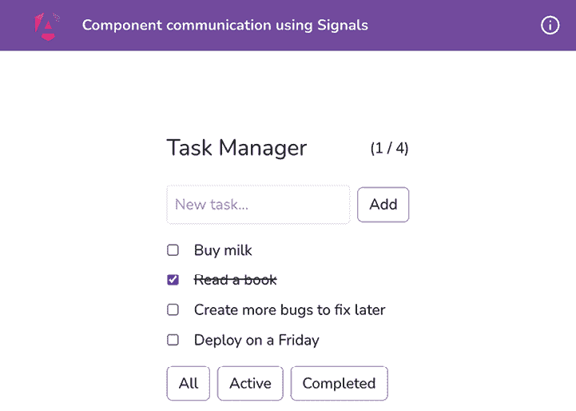

    ![图 1.21：在应用程序中创建新任务]

1.  我们现在将添加通过项目完成状态过滤项的可能性。让我们在 `app.component.ts` 文件中添加一个新的 `signal` 和一个 `computed` 属性，如下所示：

    ```js
    ...
    import { Task**,** **TasksFilter** } from './task.model';

    ...
    export class AppComponent {
      tasks = signal<Task[]>([...]);
      **filter =** **signal****(****TasksFilter****.****All****);**
    **filters =** **TasksFilter****;**
    **filteredTasks =** **computed****(****() =>** **{**
    **switch****(****this****.****filter****()) {**
    **case****TasksFilter****.****All****:**
    **return****this****.****tasks****();**
    **case****TasksFilter****.****Active****:**
    **return****this****.****tasks****().****filter****(****taskItem** **=>** **{**
    **return** **!taskItem.****completed****;**
    **});**
    **case****TasksFilter****.****Completed****:**
    **return****this****.****tasks****().****filter****(****taskItem** **=>** **{**
    **return** **taskItem.****completed****;**
    **});**
    **}**
    **})**
    **changeFilter****(****filter: TasksFilter****) {**
    **this****.****filter****.****set****(filter);**
    **}**
      ...
    } 
    ```

1.  现在我们可以使用 `changeFilter` 方法和在模板中的 `filteredTasks` 计算信号来过滤任务。按照以下方式更新 `app.component.html` 文件：

    ```js
    <!-- Task List -->
    <ul>
          @for (task of **filteredTasks()**; track $index) {
            <li (click)="toggleTask(task)" class="mb-2 flex gap-
    4 items-center cursor-pointer hover:opacity-70">
    <input type="checkbox" [checked]=
     "task.completed" />
    <span [ngClass]="{'line-through':
    task.completed}">{{ task.title }}</span>
    </li>
          }
        </ul>
    <!-- Filters -->
    <div class="mt-4">
    <button **(****click****)=****"changeFilter(filters.All)"**
    **[****ngClass****]=****"{'!bg-purple-500 text-white': filter()**
    **=== filters.All}"** class="p-2 rounded mr-2">
            All</button>
    <button **(****click****)=****"changeFilter(filters.Active)"**
    **[****ngClass****]=****"{'!bg-purple-500 text-white': filter()**
    **=== filters.Active}"** class="p-2 rounded mr-2">
            Active</button>
    <button **(****click****)=****"changeFilter(filters.Completed)"**
    **[****ngClass****]=****"{'!bg-purple-500 text-white': filter()**
    **=== filters.Completed}"** class="p-2 rounded">
            Completed</button>
    </div> 
    ```

    如果你现在查看应用程序，你可以通过**所有**、**活动**或**完成**来过滤任务，如图所示：

    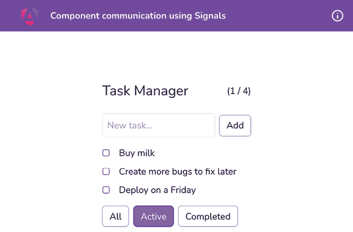

    图 1.22：通过 Active 应用中的过滤任务

1.  最后，我们将实现 snack bar。我们希望在用户完成所有活动任务时显示它。让我们首先更新 `app.component.ts` 文件以导入 `SnackbarComponent` 并创建一个 `effect`，如下所示：

    ```js
    ...
    import { Component, computed, signal, effect, ViewChild } from '@angular/core';
    ...
    import { SnackbarComponent } from './components/snackbar/snackbar.component';

    @Component({
      ...,
      imports: [CommonModule, RouterModule, SnackbarComponent],
    })
    export class AppComponent {
      @ViewChild(SnackbarComponent) snackbar!: SnackbarComponent;
      ...
      completedEffectRef = effect(() => {
        const tasks = this.tasks();
        if (this.finishedTasksCount() === tasks.length && tasks.length > 0) {
          this.snackbar.show();
        }
      })

      ...
    } 
    ```

1.  现在，我们可以更新模板以在 UI 中添加 snackbar 组件。让我们按照以下方式更新 `app.component.html` 文件：

    ```js
    <main>
      ...
    </main>
    **<****app-snackbar****>**
    **Congratulations! You completed all tasks.**
    **</****app-snackbar****>** 
    ```

    如果你现在将所有任务标记为完成，你应该会看到如图所示的 snackbar：

    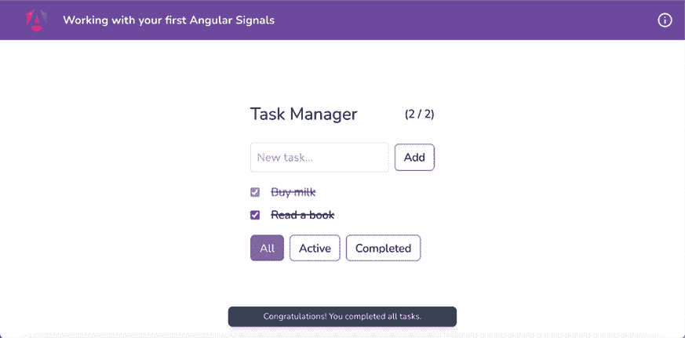

    ![图 1.23：使用**效果**显示所有任务完成时的 snackbar]

哇！仅仅通过使用信号，我们就可以在 Angular 中创建一个完全功能（小型）的任务管理器应用程序。现在你知道如何在 Angular 中使用信号了，请看下一节了解菜谱是如何工作的。

## 工作原理

Angular 核心团队发布了一个关于信号的**请求评论**（**RFC**），我非常兴奋。我已经说过这个了吗？*我想是的！*但是它太棒了，我不得不再次提到。信号最大的好处是它们与 Angular 的变更检测协同工作的方式。而不是 Angular 的变更检测在应用程序中寻找变化，信号可以在发生变化时通知 Angular 变更检测。

在这个菜谱中，我们首先创建了一个任务项的 `type` 和一个过滤器的 `enum`。然后我们使用 `@angular/core` 包中的 `signal` 函数创建了一个 `WritableSignal`，类型为 `Task`。这是因为 `signal` 函数返回一个 `WritableSignal`。

在撰写本书时，`signal` 函数是从 `@angular/core` 包导出的，信号仍然处于开发者预览阶段。这可能会随着未来的版本而改变。

在 Angular 中使用信号时，获取或渲染信号值的方式是使用其 getter 函数，这实际上就是将信号作为一个函数来调用。在菜谱中，你可以看到我们提到了 `this.tasks()` 几次。我们正在获取任务信号的值，它是一个类型为 `Task` 的数组。

注意，我们也在模板（`app.component.html`）中以相同的方式使用这个信号来通过`{{tasks().length}}`渲染总任务数。这就是如何获取信号值的方法。然而，要设置信号，我们需要在信号本身上使用`set`方法。让我们观察`filter`信号和`changeFilter`方法如下：

```js
filter = signal(TasksFilter.All); 
...
changeFilter(filter: TasksFilter) {
  this.filter.set(filter);
} 
```

注意，为了更新过滤信号值，我们使用语句`this.filter.set(filter)`。我们本可以避免创建`changeFilter`方法，并在`app.component.html`（模板）中使用类似`filter.set(filters.All)`等的语句，但我发现这种方法在 TypeScript 和 HTML 文件中都要干净得多，也更容易阅读。

除了信号之外，我们还使用了*计算属性*。这些属性依赖于一个或多个信号，如果这些信号中的任何一个发生变化，它们将自动更新。这很强大，可以在不写很多代码的情况下为应用程序提供响应性。如果你将鼠标悬停在`app.component.ts`中的`finishedTasksCount`（计算）属性上，你会注意到它显示：

```js
(property) AppComponent.finishedTasksCount: Signal<number> 
```

这意味着计算属性不是可写的信号，因为它们是自动计算的，我们不会手动更改它们。

最后，我们实现了一个`效果`。一个`效果`是一段代码——技术上是一个函数，如果函数代码块中使用的任何信号发生变化，它将自动触发。这可以用于诸如发起 API 调用、保存到本地存储、报告分析事件和记录日志等操作。如果你的代码中存在需要根据信号触发的副作用，你可以使用`效果`来实现。

现在你已经了解了食谱的工作原理，请查看下一节以获取更多阅读内容。

## 参见

+   带示例的 Angular 信号：[`www.youtube.com/watch?v=IzMzjZXbeQk`](https://www.youtube.com/watch?v=IzMzjZXbeQk)

+   Angular 信号官方文档：[`angular.dev/guide/signals#writable-signals`](https://angular.dev/guide/signals#writable-signals)

# 在 Discord 上了解更多

要加入这本书的 Discord 社区——在那里你可以分享反馈、向作者提问，并了解新版本发布——请扫描下面的二维码：

`packt.link/AngularCookbook2e`


