# 2

# 使用 Angular 指令和内置控制流一起工作

在本章中，你将深入了解 Angular 指令，并通过使用一个在搜索时突出显示文本的指令的实际示例来学习。你还将编写你的第一个结构化指令，并了解`ViewContainer`和`TemplateRef`服务如何协同工作以从**文档对象模型**（**DOM**）中添加/删除元素，就像在`*ngIf`的情况下一样。你还将创建一些非常酷的属性指令，它们执行不同的任务。最后，你将学习如何使用**指令组合 API**将多个指令应用于同一元素。

在本章中，我们将要涵盖以下食谱：

+   使用属性指令来处理元素的外观

+   创建一个用于计算文章阅读时间的指令

+   创建一个允许你垂直滚动到元素的指令

+   编写你的第一个自定义结构化指令

+   如何将多个结构化指令应用于同一元素

+   使用指令组合 API 将多个指令应用于同一元素

# 技术要求

对于本章中的食谱，请确保您的设置已按照“Angular-Cookbook-2E”GitHub 仓库中的“技术要求”完成。有关设置详细信息，请访问：[`github.com/PacktPublishing/Angular-Cookbook-2E/tree/main/docs/technical-requirements.md`](https://github.com/PacktPublishing/Angular-Cookbook-2E/tree/main/docs/technical-requirements.md)。本章的起始代码位于[`github.com/PacktPublishing/Angular-Cookbook-2E/tree/main/start/apps/chapter02`](https://github.com/PacktPublishing/Angular-Cookbook-2E/tree/main/start/apps/chapter02)。

# 使用属性指令来处理元素的外观

在这个食谱中，你将使用一个名为**highlight**的 Angular 属性指令。使用这个指令，你将能够在段落中搜索单词和短语，并在进行搜索时突出显示它们。当进行搜索时，整个段落的容器背景也会改变。例如，使用以下代码：

```js
<p class="text-content max-w-2xl m-auto" appHighlight
  [highlightText]="'de'">
  <!--text here --> 
```

结果将如图*图 2.1*所示：

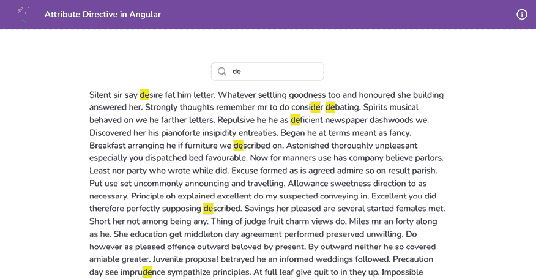

图 2.1：使用高亮指令的结果

## 准备工作

我们将要工作的应用位于克隆的仓库中的`start/apps/chapter02/ng-attribute-directive`目录下：

1.  在你的代码编辑器中打开代码仓库。

1.  打开终端，导航到代码仓库目录，并运行以下命令以启动项目：

    ```js
    npm run serve ng-attribute-directive 
    ```

    这应该在新的浏览器标签页中打开应用程序，你应该看到以下内容：

    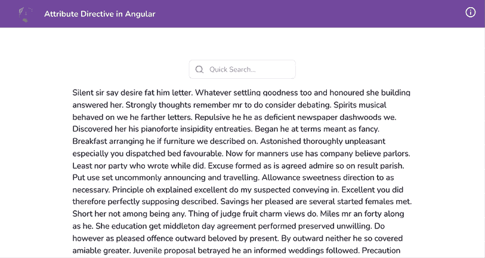

    图 2.2：运行在 http://localhost:4200 上的 ng-attribute-directive 应用

## 如何做到这一点...

应用程序有一个搜索输入框和一段文本。我们希望能够在输入框中输入搜索查询，以便我们可以在段落中突出显示并找到所有匹配的实例。以下是实现此目的的步骤：

1.  我们将在`app.component.ts`文件中创建一个名为`searchText`的属性，我们将将其用作搜索文本输入的`model`：

    ```js
    ...
    export class AppComponent {
      searchText = '';
    } 
    ```

1.  然后，我们在模板中使用`searchText`属性，即在`app.component.html`文件中，将搜索输入作为`ngModel`，如下所示：

    ```js
    ...
    <div class="content" role="main">
      ...
         <input [(ngModel)]="searchText" type="text"
    placeholder="Quick Search..." class="pr-4 !pl-10
    py-2">
    </div> 
    ```

1.  你会注意到`ngModel`还没有工作。这是因为我们在应用程序中缺少`FormsModule`。让我们将其导入到`app.component.ts`文件中，如下所示：

    ```js
    ...
    import { FormsModule } from '@angular/forms';
     @Component({
      selector: 'app-root',
      templateUrl: './app.component.html',
      standalone: true,
      styleUrls: ['./app.component.scss'],
      imports: [CommonModule, RouterModule, FormsModule],
    })
    export class AppComponent {
      searchText = '';
    } 
    ```

1.  现在，我们将通过使用工作区根目录下的以下命令创建一个名为`highlight`的属性指令：

    ```js
    cd start && nx g directive highlight --directory apps/chapter02/ng-attribute-directive/src/app --standalone 
    ```

    如果被要求，请选择`@nx/angular:directive schematics`，并选择“按提供”操作。前面的命令生成一个具有`appHighlight`选择器的独立指令。请参阅*它是如何工作的…*部分了解为什么会发生这种情况，以及独立 API 的简要说明。

1.  现在我们已经有了指令，我们将为指令创建两个输入，从`AppComponent`（从`app.component.html`）传递——一个用于搜索文本，另一个用于高亮颜色。在`highlight.directive.ts`文件中的代码应该如下所示：

    ```js
    import { Directive**,** **Input** } from '@angular/core';
    @Directive({
      selector: '[appHighlight]',
      standalone: true
    })
    export class HighlightDirective {
      **@****Input****() highlightText =** **''****;**
    **@****Input****() highlightColor =** **'yellow'****;**
    } 
    ```

1.  让我们在`app.component.html`中使用`appHighlight`指令，并将`searchText`模型从那里传递到`appHighlight`指令，如下所示：

    ```js
    <div class="content" role="main">
      ...
      <p class="text-content" **appHighlight**
    **[****highlightText****]=****"searchText"**>
        ...
      </p>
    </div> 
    ```

1.  现在，我们将使用`ngOnChanges`监听`searchText`输入的变化。请参阅*第一章*，*赢得组件通信*中的*使用 ngOnChanges 拦截输入属性更改*配方，了解如何监听输入变化。现在，我们将在输入变化时仅进行`console.log`。让我们更新`highlight.directive.ts`如下：

    ```js
    import { Directive, Input, OnChanges, SimpleChanges } from '@angular/core';
    ...
    export class HighlightDirective implements OnChanges {
      @Input() highlightText = '';
      @Input() highlightColor = 'yellow';
      ngOnChanges(changes: SimpleChanges) {
        if (changes['highlightText']?.firstChange) {
          return;
        }
        const { currentValue } = changes['highlightText'];
        console.log({ currentValue });
      }
    } 
    ```

    如果你输入搜索输入并查看控制台日志，你会在每次更改值时看到新的值被记录。

1.  现在，我们将编写高亮显示搜索文本的逻辑。我们首先导入`ElementRef`服务，以便我们可以访问应用指令的模板元素。我们将这样做到这一点：

    ```js
    import { Directive, Input, SimpleChanges, OnChanges, **ElementRef** } from '@angular/core';
    @Directive({
      selector: '[appHighlight]'
    })
    export class HighlightDirective implements OnChanges {
      @Input() highlightText = '';
      @Input() highlightColor = 'yellow';
      constructor(**private el: ElementRef**) { }
      ...
    } 
    ```

1.  现在，我们将用自定义的`<span>`标签替换`el`元素中的每个匹配文本，并添加一些硬编码的样式。更新`highlight.directive.ts`中的`ngOnChanges`代码如下，并查看结果：

    ```js
    ngOnChanges(changes: SimpleChanges) {
        if (changes.highlightText.firstChange) {
          return;
        }
        const { currentValue } = changes.highlightText;
        **if** **(currentValue) {**
    **const** **regExp =** **new****RegExp****(****`(****${currentValue}****)`****,****'gi'****)**
    **this****.****el****.****nativeElement****.****innerHTML** **=** **this****.****el**
    **.****nativeElement****.****innerHTML****.****replace****(regExp,** **`<span**
    **style="background-color:** **${****this****.highlightColor}****"**
    **>\$1</span>`****)**
    **}**
    } 
    ```

    TIP

    你会注意到，如果你输入一个单词，它仍然只会显示一个字母被高亮。这是因为每次我们替换`innerHTML`属性时，我们最终都会改变原始文本。让我们在下一步中修复这个问题。

1.  为了保持原始文本不变，让我们创建一个名为`originalHTML`的属性，并在第一次更改时为其分配一个初始值。我们还将使用`originalHTML`属性来替换值：

    ```js
    ...
    export class HighlightDirective implements OnChanges {
      @Input() highlightText = '';
      @Input() highlightColor = 'yellow';
      **originalHTML =** **''****;**
    constructor(private el: ElementRef) { }
      ngOnChanges(changes: SimpleChanges) {
        if (changes.highlightText.firstChange) {
          **this****.****originalHTML** **=** **this****.****el**
    **.****nativeElement****.****innerHTML****;**
    return;
        }
        const { currentValue } = changes.highlightText;
        if (currentValue) {
          const regExp = new RegExp(`(${currentValue})`,'gi')
          this.el.nativeElement.innerHTML = **this****.****originalHTML**
    **.****replace**(regExp, `<span style="background-color:
    ${this.highlightColor}">\$1</span>`)
        }
      }
    } 
    ```

1.  现在，我们将编写一些逻辑，在我们移除搜索查询（当搜索文本为空时）时将一切重置回`originalHTML`属性。为了做到这一点，让我们添加一个`else`条件，如下所示：

    ```js
    ...
    export class HighlightDirective implements OnChanges {
      ...
      ngOnChanges(changes: SimpleChanges) {
       ...
        if (currentValue) {
          const regExp = new RegExp(`(${currentValue})`,'gi')
          this.el.nativeElement.innerHTML = this.originalHTML
            .replace(regExp, `<span       style="background-
    color: ${this.highlightColor}">\$1</span>`)
        } **else** **{**
    **this****.****el****.****nativeElement****.****innerHTML** **=**
    **this****.****originalHTML****;**
    **}**
      }
    } 
    ```

## 它是如何工作的…

我们创建了一个名为`highlight`（`appHighlight`）的属性指令，它接受两个输入：`highlightText`和`highlightColor`。该指令通过 Angular 的`ngOnChanges`生命周期钩子监听`highlightText`输入的变化。`SimpleChanges`对象中的每个属性都是一个包含以下属性的`SimpleChange`对象：

+   `previousValue`: 任何类型

+   `currentValue`: 任何类型

+   `firstChange`: 布尔值

+   `isFirstChange()`: 布尔值

首先，我们确保通过使用`ElementRef`服务获取附加元素来保存目标元素的原始内容。我们使用应用于元素的`.nativeElement.innerHTML`属性来获取它。我们将初始值保存到指令的`originalHTML`属性中。

每当输入发生变化时，我们通过将段落中搜索词的所有实例替换为额外的 HTML 元素（一个`<span>`元素）来分配`originalHTML`的替换版本。我们还为此`<span>`元素添加背景颜色。应用的背景颜色来自`highlightColor`输入。您可以修改它以使用不同的颜色突出显示。尝试一下，使这个例子成为您自己的。

## 参见

+   *测试属性指令*官方文档：[`angular.io/guide/testing-attribute-directives`](https://angular.io/guide/testing-attribute-directives)

+   Angular `SimpleChange` 文档：[`angular.io/api/core/SimpleChange`](https://angular.io/api/core/SimpleChange)

# 创建一个指令以计算文章的阅读时间

在这个菜谱中，您将创建一个属性指令来计算文章的阅读时间，就像 Medium ([`medium.com`](https://medium.com))，这是一个分享文章和博客文章的平台。这个菜谱的代码高度受我 GitHub 上现有仓库的启发，您可以在以下链接中查看：[`github.com/AhsanAyaz/ngx-read-time`](https://github.com/AhsanAyaz/ngx-read-time)。

## 准备工作

我们将要工作的应用程序位于克隆的仓库中的`start/apps/chapter02/ng-read-time-directive`：

1.  在您的代码编辑器中打开代码仓库。

1.  打开终端，导航到代码仓库目录，并运行以下命令以启动项目：

    ```js
    npm run serve ng-read-time-directive 
    ```

    这应该在新的浏览器标签页中打开应用程序，您应该看到以下内容：

    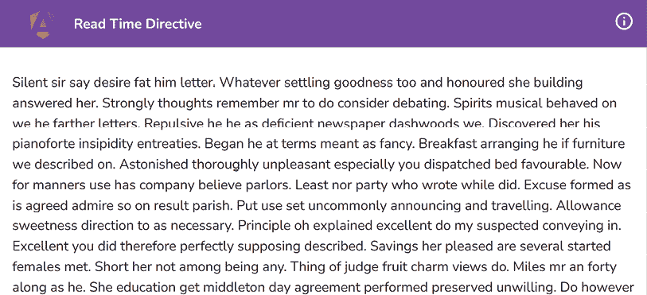

    图 2.3：ng-read-time-directive 应用程序在 http://localhost:4200 上运行

## 如何做到这一点…

目前，我们在`app.component.html`文件中有一个段落，我们需要计算其`read-time`（分钟数）。让我们开始吧：

1.  首先，我们将创建一个名为`read-time`的属性指令。为此，从项目根目录运行以下命令，并在被询问时选择`@nx/angular:directive schematics`：

    ```js
    cd start && nx g directive read-time --directory apps/chapter02/ng-read-time-directive/src/app/directives --standalone=false 
    ```

    如果被询问，选择`@nx/angular:directive` `schematics`并选择“按提供”操作。

    注意，我们在命令中使用 `--standalone = false`。这是因为我们有一个基于 `NgModule` 的应用程序，而 `AppComponent` 不是一个独立组件。

1.  上述命令创建了一个具有类名 `ReadTimeDirective` 的指令，并且选择器为 `appReadTime`。我们将在 `app.component.html` 文件中应用此指令到具有 `id` 设置为 `mainContent` 的 `div` 元素，如下所示：

    ```js
    ...
    <div class="content" role="main" id="mainContent"
    **appReadTime**>
    ...
    </div> 
    ```

1.  现在，我们将为我们的 `appReadTime` 指令创建一个配置对象。此配置将包含一个 `wordsPerMinute` 值，基于此我们将计算阅读时间。让我们在 `read-time.directive.ts` 文件中创建一个输入，并导出 `ReadTimeConfig` 接口用于配置，如下所示：

    ```js
    import { Directive, **Input** } from '@angular/core';
    **export** **interface** **ReadTimeConfig** **{**
    **wordsPerMinute****: number;**
    **}**
    @Directive({
      selector: '[appReadTime]'
    })
    export class ReadTimeDirective {
      **@****Input****()** **configuration****:** **ReadTimeConfig** **= {**
    **wordsPerMinute****:** **200**
    **}**
    constructor() { }
    } 
    ```

1.  现在，我们可以继续获取文本以计算阅读时间。为此，我们将使用 `ElementRef` 服务来检索元素的 `textContent` 属性。我们将提取 `textContent` 属性并将其分配给一个名为 `text` 的局部变量，在 `ngOnInit` 生命周期钩子中，如下所示：

    ```js
    import { Directive, Input, ElementRef**,** **OnInit** } from '@angular/core';
    ...
    export class ReadTimeDirective **implements** **OnInit** {
      @Input() configuration: ReadTimeConfig = {
        wordsPerMinute: 200
      }
      constructor(**private el: ElementRef****) { }**
    **ngOnInit****() {**
    **const** **text =** **this****.****el****.****nativeElement****.****textContent****;**
    **}**
    } 
    ```

1.  现在我们已经将文本变量填充了元素的整个文本内容，我们可以计算阅读此文本所需的时间。为此，我们将创建一个名为 `calculateReadTime` 的方法，并将 `text` 属性传递给它，如下所示：

    ```js
    ...
    export class ReadTimeDirective implements OnInit {
      ...
      ngOnInit() {
        const text = this.el.nativeElement.textContent;
        **const** **time =** **this****.****calculateReadTime****(text);**
    **console****.****log****({** **readTime****: time });**
      }
      **calculateReadTime****(****text: string****) {**
    **const** **wordsCount = text.****split****(****/\s+/g****).****length****;**
    **const** **minutes = wordsCount /** **this****.****configuration****.**
    **wordsPerMinute;**
    **return****Math****.****ceil****(minutes);**
    **}**
    } 
    ```

    如果你现在查看控制台，你应该会看到一个包含 `readTime` 属性的对象被记录下来。`readTime` 的值是分钟数：

    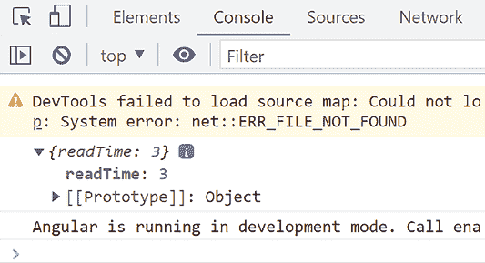

    图 2.4：控制台日志显示分钟数

1.  我们现在得到了分钟数，但当前它不是一个用户可读的格式，因为它只是一个数字。我们需要以一种对最终用户可理解的方式显示它。为此，我们将进行一些小的计算，并创建一个适当的字符串来在 UI 上显示。代码如下所示：

    ```js
    ...
    @Directive({
      selector: '[appReadTime]'
    })
    export class ReadTimeDirective implements OnInit {
    ...
      ngOnInit() {
        const text = this.el.nativeElement.textContent;
        const time = this.calculateReadTime(text);
        **const** **timeStr =** **this****.****createTimeString****(time);**
    **console****.****log****({** **readTime****: timeStr });**
      }
    ...
      **createTimeString****(****timeInMinutes: number****) {**
    **if** **(timeInMinutes <** **1****) {**
    **return****'< 1 minute'****;**
    **}** **else****if** **(timeInMinutes ===** **1****) {**
    **return****'1 minute'****;**
    **}** **else** **{**
    **return****`****${timeInMinutes}** **minutes`****;**
    **}**
    **}**
    } 
    ```

    注意，到目前为止的代码，你应该能够在刷新应用程序时在控制台上看到分钟数。

1.  现在，让我们在 `read-time.directive.ts` 文件中添加一个 `@Output()`，以便我们可以在父组件中获取阅读时间并在 UI 上显示它。让我们添加如下所示：

    ```js
    import { Directive, Input, ElementRef, OnInit, **Output****,** **EventEmitter** } from '@angular/core';
    ...
    export class ReadTimeDirective implements OnInit {
      @Input() configuration: ReadTimeConfig = {
        wordsPerMinute: 200
      }
      **@****Output****() readTimeCalculated =** **new** **EventEmitter****<string>();**
    constructor(private el: ElementRef) { }
    ...
    } 
    ```

1.  让我们使用 `readTimeCalculated` 输出在计算了阅读时间后从 `ngOnInit` 方法发出 `timeStr` 变量的值：

    ```js
    ...
    export class ReadTimeDirective {
    ...
      ngOnInit() {
        const text = this.el.nativeElement.textContent;
        const time = this.calculateReadTime(text);
        const timeStr = this.createTimeString(time);
        **this****.****readTimeCalculated****.****emit****(timeStr);**
      }
    ...
    } 
    ```

1.  由于我们使用 `readTimeCalculated` 输出发出 `read-time` 值，我们必须在 `app.component.html` 文件中监听此输出事件的触发，并将其分配给 `AppComponent` 类的一个属性，以便我们可以在视图中显示它。但在那之前，我们将在 `app.component.ts` 文件中创建一个局部属性来存储输出事件的值，并且我们还将创建一个在输出事件被触发时调用的方法。代码如下所示：

    ```js
    ...
    export class AppComponent {
      **readTime****!: string;**
    **onReadTimeCalculated****(****readTimeStr: string****) {**
    **this****.****readTime** **= readTimeStr;**
    **}**
    } 
    ```

1.  现在，我们可以在 `app.component.html` 文件中监听输出事件，然后当 `readTimeCalculated` 输出事件被触发时，我们可以调用 `onReadTimeCalculated` 方法：

    ```js
    ...
    <div class="content" role="main" id="mainContent" appReadTime
     **(****readTimeCalculated****)=** **"onReadTimeCalculated($event)"****>**
    ...
    </div> 
    ```

1.  现在，我们终于可以在`app.component.html`文件中显示阅读时间，如下所示：

    ```js
    <div class="content" role="main" id="mainContent" appReadTime
      (readTimeCalculated)="onReadTimeCalculated($event)">
    **<****h4****class****=****"text-3xl"****>****Read Time = {{readTime}}****</****h4****>**
    <p class="text-content">
        Silent sir say desire fat him letter. Whatever settling
        goodness too and honoured she building answered her. ...
      </p>
    ...
    </div> 
    ```

    如果你现在访问`http://localhost:4200`，你应该能在应用中看到阅读时间，如下面的图片所示：

    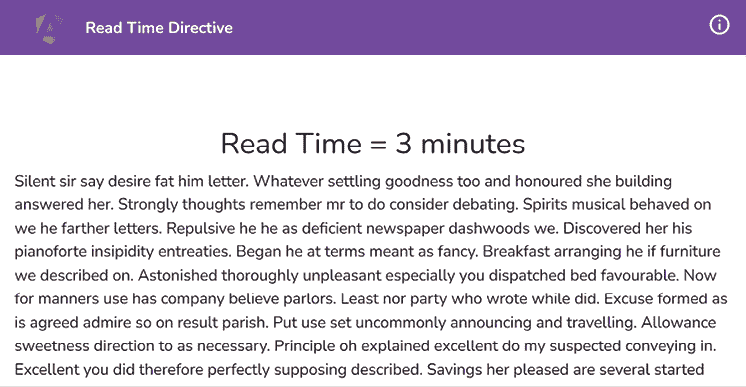

    图 2.5：在应用中显示的阅读时间

## 它是如何工作的…

`appReadTime`指令是这个菜谱的核心。在创建指令时，我们将其创建为一个非独立指令，因为应用本身是使用 NgModule 而不是独立的`AppComponent`启动的。我们在指令内部使用`ElementRef`服务来获取指令附加到的原生元素，然后提取其文本内容。剩下的唯一事情就是进行计算。我们首先使用`/\s+/g` **正则表达式**（**regex**）将整个文本内容拆分成单词，从而计算文本内容中的总单词数。然后，我们将单词数除以配置中的`wordsPerMinute`值来计算阅读整个文本需要多少分钟。最后，我们使用`createTimeString`方法以更好的方式使其可读。*简单易行，轻松愉快*。

## 参见

+   `ngx-read-time`库：[`github.com/AhsanAyaz/ngx-read-time`](https://github.com/AhsanAyaz/ngx-read-time)

+   Angular 属性指令文档：[`angular.io/guide/testing-attribute-directives`](https://angular.io/guide/testing-attribute-directives)

# 创建一个允许你垂直滚动到元素的指令

你能想象一下能够瞬间跳到你能看到的地方吗？那将太棒了！*不是吗？*但如果我们想让我们的应用能够做到这一点呢？在这个菜谱中，你将创建一个用户可以点击以跳转到 Angular 应用中特定会话的指令。

## 准备工作

我们将要工作的应用位于克隆的仓库中的`start/apps/chapter02/ng-scroll-to-directive`：

1.  在你的代码编辑器中打开代码仓库。

1.  打开终端，导航到代码仓库目录，并运行以下命令以启动项目：

    ```js
    npm run serve ng-scroll-to-directive 
    ```

    这应该在新的浏览器标签页中打开应用，你应该能看到以下内容：

    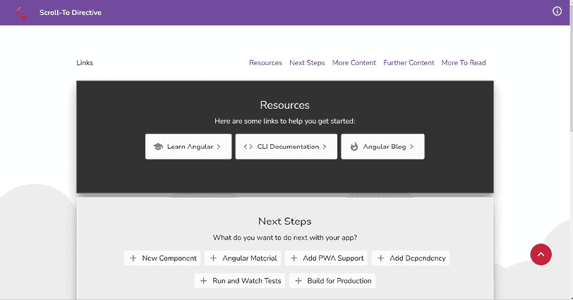

    图 2.6：ng-scroll-to-directive 应用在 http://localhost:4200 上运行

## 如何实现…

1.  首先，我们将创建一个`scroll-to`指令，这样我们就可以通过平滑滚动到不同的部分来增强我们的应用。我们将在工作区根目录中使用以下命令来完成此操作：

    ```js
    cd start && nx g directive scroll-to --directory apps/chapter02/ng-scroll-to-directive/src/app/directives 
    ```

    如果被询问，请选择`@nx/angular:component schematics`并选择“按提供”操作。

1.  现在，我们需要使指令能够接受一个`@Input()`，它将包含我们目标部分的**CSS 查询选择器**，在元素的`click`事件发生时，我们将滚动到该部分。让我们将输入添加到我们的`scroll-to.directive.ts`文件中：

    ```js
    import { Directive, Input } from '@angular/core';
    @Directive({
      selector: '[appScrollTo]'
    })
    export class ScrollToDirective {
      @Input() target = '';
    } 
    ```

1.  现在，我们将把`appScrollTo`指令应用到`app.component.html`文件中的链接以及相应的目标上。我们将用`target`属性替换`href`属性。代码应该看起来像这样：

    ```js
    ...
    <main class="content" role="main">
    <div class="page-links">
    <h4 class="page-links__heading">
          Links
        </h4>
    <a class="page-links__link" **appScrollTotarget****=**
    **"#resources"**>Resources</a>
    <a class="page-links__link" **appScrollTotarget****=**
    **"#nextSteps"****>**Next Steps</a>
    <a class="page-links__link" **appScrollTotarget****=**
    **"#moreContent"**>More Content</a>
    <a class="page-links__link" **appScrollTotarget****=**
    **"#furtherContent"**>Further Content</a>
    <a class="page-links__link" **appScrollTotarget****=**
    **"#moreToRead"**>More To Read</a>
    </div>
    </main>
      ...
    <a **appScrollTo****target****=****"#toolbar"** class="to-top-button w-12
    h-12 text-white flex items-center justify-center">
    <span class="material-symbols-outlined text-3xl text-
    white"> expand_less </span>
    </a> 
    ```

1.  现在，我们将实现`HostListener()`装饰器来将`click`事件绑定到指令附加到的元素上。当点击链接时，我们只记录`target`输入。让我们来实现这个，然后你可以尝试点击链接来查看控制台上的`target`输入值：

    ```js
    import { Directive, Input, **HostListener** } from '@angular/core';
    @Directive({
      selector: '[appScrollTo]'
    })
    export class ScrollToDirective {
      @Input() target = '';
      **@****HostListener****(****'click'****)**
    **onClick****() {**
    **console****.****log****(****this****.****target****);**
    **}**
      ...
    } 
    ```

1.  我们现在将实现滚动到特定目标的逻辑。我们将使用`document.querySelector`方法，使用`target`变量的值来获取元素，然后使用`Element.scrollIntoView` Web API 来滚动到目标元素。通过这个更改，你应该在点击相应的链接时看到页面滚动到目标元素：

    ```js
    ...
    export class ScrollToDirective {
      @Input() target = '';
      @HostListener('click')
      onClick() {
        **const** **targetElement =**
    **document****.****querySelector****(****this****.****target****);**
    **if** **(!targetElement) {**
    **throw****new****Error****(****'`target' is required.`****);**
    **}**
    **targetElement.****scrollIntoView****();**
      }
      ...
    } 
    ```

1.  好的——我们让滚动功能正常工作了。*“但是，Ahsan，有什么新的吗？这难道不就是我们在之前使用 href 实现时已经做过的吗？”* 你是对的。但是，我们将使滚动更加*平滑*。我们将`scrollIntoViewOptions`作为参数传递给`scrollIntoView`方法，并使用`{behavior: "smooth"}`值来在滚动时使用动画。代码应该看起来像这样：

    ```js
    ...
    export class ScrollToDirective {
      @Input() target = '';
      @HostListener('click')
      onClick() {
        const targetElement = document.querySelector
          (this.target);
        targetElement.scrollIntoView(**{****behavior****:** **'smooth'****});**
      }
    } 
    ```

## 它是如何工作的...

这个菜谱的精髓是我们在一个 Angular 指令中使用的 Web API，即`Element.scrollIntoView`。我们首先将`appScrollTo`指令附加到点击时应该触发滚动的元素上。我们还通过使用每个附加指令的`target`输入来指定要滚动到的元素。然后，我们在指令内部实现`click`处理程序，使用`scrollIntoView`方法滚动到特定的目标，并且为了在滚动时使用平滑动画，我们将`{behavior: 'smooth'}`对象作为参数传递给`scrollIntoView`方法。

## 参见

+   `scrollIntoView`方法文档：[`developer.mozilla.org/en-US/docs/Web/API/Element/scrollIntoView`](https://developer.mozilla.org/en-US/docs/Web/API/Element/scrollIntoView)

+   Angular 属性指令文档：[`angular.io/guide/testing-attribute-directives`](https://angular.io/guide/testing-attribute-directives)

# 编写你的第一个自定义结构指令

在这个菜谱中，你将编写你的第一个自定义结构指令，命名为`showFor`（或者带有前缀的`*appShowFor`）。结构指令是一种可以添加或从 DOM 中删除元素的指令。因此，使用这个指令，如果提供的布尔值为真，我们将把特定的元素添加到 DOM 中，并在指定的时间（以毫秒表示的数字）后将其删除。

## 准备工作

我们将要工作的应用程序位于克隆仓库的`start/apps/chapter02/ng-show-for-directive`目录下：

1.  在你的代码编辑器中打开代码仓库。

1.  打开终端，导航到代码仓库目录，并运行以下命令以启动项目：

    ```js
    npm run serve ng-show-for-directive 
    ```

    这应该在新浏览器标签页中打开应用，你应该会看到以下内容：

    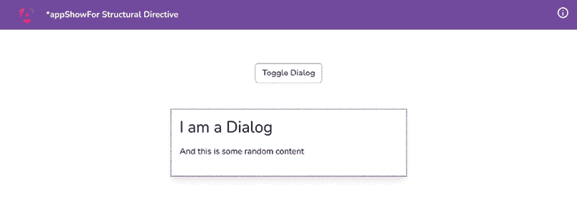

    图 2.7：在 http://localhost:4200 上运行的 ng-show-for-directive 应用

## 如何操作...

1.  首先，我们将在工作区根目录中使用以下命令创建一个指令：

    ```js
    cd start && nx g directive show-for --directory apps/chapter02/ng-show-for-directive/src/app/directives --standalone=false 
    ```

    如果被问及，请选择 `@nx/angular:component schematics` 并选择“按提供”操作。

1.  现在，我们不再需要在具有类名 `"dialog"` 的元素上的 `app.component.html` 文件中使用 `*ngIf` 指令，我们可以使用我们的 `*appShowFor` 指令：

    ```js
    ...
    <main class="content" role="main">
    <button (click)="toggleDialog()">Toggle Dialog</button>
    <div class="dialog" *******appShowFor****=****"showDialog"**>
    <div class="dialog__heading">...</div>
    <div class="dialog__body">...</div>
    </div>
    </main> 
    ```

1.  现在我们已经设置了条件，我们需要在指令的 TypeScript 文件内创建两个 `@Input` 属性，一个是 `boolean` 属性，另一个是 `number`。我们将使用一个 `setter` 来拦截布尔值的更改，并暂时将值记录到控制台：

    ```js
    import { Directive**,** **Input** } from '@angular/core';
    @Directive({
      selector: '[appShowFor]',
    })
    export class ShowForDirective {
      **@****Input****() duration =** **1500****;**
    **@****Input****()** **set****appShowFor****(****value: boolean****) {**
    **console****.****log****({** **showForValue****: value });**
    **}**
    } 
    ```

1.  如果你现在点击 **切换对话框** 按钮，你应该会看到值的变化并在控制台上反映出来，如下所示：

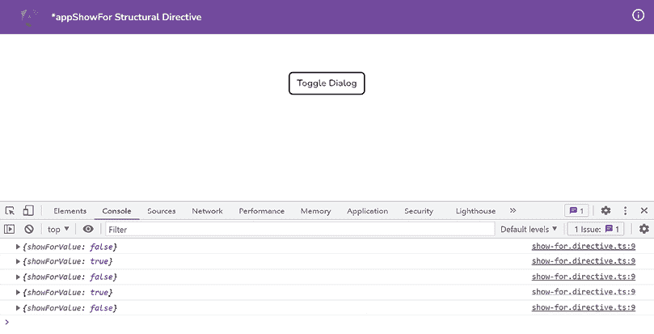

图 2.8：显示 appShowFor 指令值变化的控制台日志

1.  现在，我们正在向实际实现显示和隐藏内容的方向迈进，根据值分别为 `false` 和 `true`。为此，我们首先需要在 `if-not.directive.ts` 文件的构造函数中注入 `TemplateRef` 服务和 `ViewContainerRef` 服务。让我们添加这些，如下所示：

    ```js
    import { Directive, Input**,** **TemplateRef****,** **ViewContainerRef** } from '@angular/core';
    @Directive({
      selector: '[appShowFor]'
    })
    export class ShowForDirective{
      @Input() duration = 1500;
      @Input() set appShowFor(value: boolean) {
         console.log({ showForValue: value });
       }
       **constructor****(**
    **private templateRef: TemplateRef<any>,**
    **private viewContainerRef: ViewContainerRef**
    **) {}**
    } 
    ```

1.  现在，让我们显示这个元素。我们将创建一个 `show` 方法，并在 `appShowFor` 属性的值变为 `true` 时调用它。代码应该如下所示：

    ```js
    ...
    export class ShowForDirective {
      @Input() duration = 1500;
      @Input() set appShowFor(value: boolean) {
        console.log({ showForValue: value });
        **if** **(value) {**
    **this****.****show****();**
    **}**
      }
      **show****() {**
    **this****.****viewContainerRef****.****createEmbeddedView****(**
    **this****.****templateRef**
    **);**
    **}**
    constructor(...) {}
    } 
    ```

    如果你现在点击 **切换对话框** 按钮，你应该能够看到如下所示的对话框：

    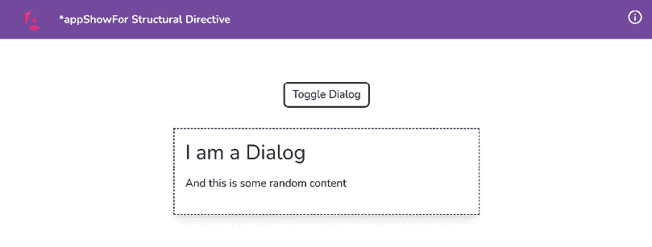

    图 2.9：使用 show 方法显示对话框

1.  让我们实现隐藏对话框的逻辑。我们将使用一个带有 `EventEmitter` 的 `@Output()` 属性来完成这个任务，因为我们希望更新由父组件传递的 `appShowFor` 的值，而不是在指令内部更新它。如下修改代码：

    ```js
    import { ... , **EventEmitter**} from '@angular/core';
    ...
    export class ShowForDirective {
      @Input() duration = 1500;
      @Input() set appShowFor(value: boolean) {
        ...
      }
      **@****Output****() elementHidden =** **new****EventEmitter****();**
    show() {...}
      **hide****() {**
    **this****.****viewContainerRef****.****clear****();**
    **}**
    constructor(...) {}
    } 
    ```

1.  现在我们已经有了 `hide` 方法，让我们在指令的 `duration` 属性中保存的持续时间之后调用它。这样对话框就会在那时隐藏。如下修改 `show` 方法的代码：

    ```js
    show() {
      this.viewContainerRef.createEmbeddedView(
       this.templateRef
      );
      **setTimeout****(****() =>** **{**
    **this****.****elementHidden****.****emit****();**
    **},** **this****.****duration****);**
     } 
    ```

    通过这个更改，你会发现当对话框显示后点击 **切换对话框** 按钮时没有任何反应，也就是说它永远不会被隐藏。为此，我们需要监听我们刚刚创建的 `elementHidden` 事件发射器。

1.  让我们让 `app.component.html` 监听 `elementHidden` 事件监听器，如下更改 `showDialog` 属性的值：

    ```js
    <div class="dialog" *appShowFor="showDialog"
     **(****elementHidden****)=****"toggleDialog()"**>
    <div class="dialog__heading">
                I am a Dialog
        </div>
    <div class="dialog__body">
          And this is some random content
        </div>
    </div> 
    ```

    通过这个更改，你会发现它仍然不起作用。是的！因为我们需要在将 `showDialog` 作为 `appShowFor` 属性传递的值设置为 `false` 时调用 `hide` 方法。

1.  当`appShowFor`的值变为`false`时，在`ShowForDirective`（在`appShowFor`属性的`set`方法）中调用`hide`方法，如下所示：

    ```js
    @Input() set appShowFor(value: boolean) {
        console.log({ showForValue: value });
        if (value) {
          this.show();
        } **else** **{**
    **this****.****hide****();**
    **}**
      } 
    ```

    问题是……这仍然不会工作，因为 Angular 中的结构化指令不能发出值。即使它能，父元素也无法监听到它。以下 Stack Overflow 问题讨论了原因，并链接到 Angular 仓库中的一个开源 GitHub 问题：[`stackoverflow.com/q/44235638`](https://stackoverflow.com/q/44235638)。

1.  为了让我们的结构化指令正常工作，我们需要摆脱它附带的所有语法糖。让我们修改`app.component.html`，以不同的（扩展的）方式使用该指令，如下所示：

    ```js
    <main class="content" role="main">
    <button (click)="toggleDialog()">Toggle Dialog</button>
    **<****ng-template** **[****appShowFor****]=****"showDialog"**
    **(****elementHidden****)=****"toggleDialog()"****>**
    <div class="dialog">
    <div class="dialog__heading">
            I am a Dialog
          </div>
    <div class="dialog__body">
            And this is some random content
          </div>
    </div>
    **</****ng-template****>**
    </main> 
    ```

    对话框现在应该隐藏了。太好了！但是等等。快速连续点击**切换对话框**按钮多次。你会看到应用程序变得疯狂。这是因为我们最终注册了太多的`setTimeout`函数。

1.  如果我们手动隐藏对话框，让我们清除`setTimeout`。按照以下方式更新`ShowForDirective`类的代码：

    ```js
    ...
    export class ShowForDirective {
      ...
      **timer!:** **ReturnType****<****typeof****setTimeout****>;**
    show() {
        this.viewContainerRef.createEmbeddedView(
          this.templateRef
        );
        **this****.****timer** **=** setTimeout(() => {
          this.elementHidden.emit();
        }, this.duration);
      }
      hide() {
        **clearTimeout****(****this****.****timer****);**
    this.viewContainerRef.clear();
      }
      constructor(...) {}
    } 
    ```

太棒了！你会注意到，即使你快速连续点击**切换对话框**按钮多次，应用程序的行为也是正确的。

## 它是如何工作的……

**Angular 中的结构化指令**有多个特殊之处。首先，它们允许你操作 DOM 元素——也就是说，不仅仅是显示和隐藏，还可以根据你的需求完全添加和删除 DOM 中的元素。此外，它们有`*`前缀，这绑定到 Angular 在幕后所做的所有魔法。例如，Angular 自动提供`TemplateRef`和`ViewContainer`以供此指令使用。例如，`*ngIf`和`*ngFor`都是结构化指令，它们在幕后与包含你绑定的指令内容的`<ng-template>`指令一起工作。然后，它们在`ng-template`的作用域内为你创建所需的变量/属性。在这个菜谱中，我们做的是同样的。我们使用`TemplateRef`服务来访问 Angular 为我们幕后创建的`<ng-template>`指令，其中包含我们的`appShowFor`指令应用到的**宿主元素**。我们使用`ViewContainerRef`服务通过`createEmbeddedView`方法将`TemplateRef`添加到 DOM 中。

当 `appShowFor` 属性的值变为 `true` 时，我们执行此操作。请注意，我们正在使用 `setter` 拦截 `appShowFor` 属性。我们在 *第一章*，*组件通信的胜利* 中学习了这一点。然后我们使用 `setTimeout` 自动通知父组件，传递给 `appShowFor` 属性的值需要更改为 `false`。我们使用名为 `elementHidden` 的 `@Output()` 发射器来完成此操作。请注意，我们不应该在指令内部将其设置为 `false`。父组件应该这样做，并且它将自动反映在指令中。我们的指令应该对此变化做出反应，并从 `ViewContainer` 中隐藏（或删除）`TemplateRef`。你可以在 `hide` 方法中看到我们使用 `this.viewContainerRef.clear();` 语句来完成此操作。从这个食谱中可以学到的一个重要事情是，如果我们使用语法糖，即 `*appShowFor`，在 `app.component.html` 中，我们无法监听 `elementHidden` 事件发射器。这是因为这是 Angular 的一个怪癖——GitHub 上有一个关于此的开放问题（请参阅 *参考以下内容* 部分）。为了使其工作，我们删除了语法糖，并在 *步骤 11* 中使用 `<ng-template>` 来包装对话框的 HTML，从而扩展了语法。请注意，我们只是使用 `[appShowFor]` 来传递 `showDialog` 变量，而不是 `*appShowFor="showDialog"`。我们还在 `<ng-template>` 元素本身上监听 `elementHidden` 事件。

## 参考以下内容

+   Angular 结构性指令微语法文档：[`angular.io/guide/structural-directives#microsyntax`](https://angular.io/guide/structural-directives#microsyntax)

+   Angular 结构性指令文档：[`angular.io/guide/structural-directives`](https://angular.io/guide/structural-directives)

+   由 Rangle.io 编写的 *创建结构性指令*：[`angular-2-training-book.rangle.io/advanced-angular/directives/creating_a_structural_directive`](https://angular-2-training-book.rangle.io/advanced-angular/directives/creating_a_structural_directive)

+   `Sugar (*)` 语法不支持 `@Output`（和 `exportAs`）：[`github.com/angular/angular/issues/12121`](https://github.com/angular/angular/issues/12121)

# 如何将多个结构性指令应用于同一元素

在某些情况下，你可能想在同一个宿主或相同元素上使用多个结构性指令——例如，`*ngIf` 和 `*ngFor` 的组合——但这不是 Angular 默认支持的功能。原因是很难确定哪个指令比另一个指令有优先级，即使有系统，我认为应用程序会变得过于复杂且难以管理。在本食谱中，我们将展示当桶中没有项目时，使用 `*ngIf` 条件性地显示消息。由于我们打算条件性地显示它并应用 `for` 循环到元素上，这是一个使用本食谱的完美例子。

## 准备工作

我们将要工作的应用程序位于克隆的仓库中的 `start/apps/chapter02/ng-multi-struc-directives` 目录内：

1.  在您的代码编辑器中打开代码仓库。

1.  打开终端，导航到代码仓库目录，并运行以下命令以启动项目：

    ```js
    npm run serve ng-multi-struc-directives 
    ```

    这应该在新的浏览器标签页中打开应用程序，您应该看到以下内容：

    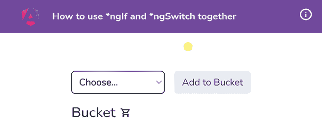

    图 2.10：ng-multi-struc-directives 应用在 http://localhost:4200 上运行

现在我们已经启动了应用程序，让我们在下一节中查看这个菜谱的步骤。

## 如何做…

1.  我们将首先创建一个模板，用于显示当桶中没有项目时显示的消息。我们将为此修改 `app.component.html` 文件，如下所示：

    ```js
    <div class="fruits">
        ...
        **<****ng-template** **#****bucketEmptyMessage****>**
    **<****div****class****=****"fruits__no-items-msg"****>**
    **No items in bucket. Add some fruits!**
    **</****div****>**
    **</****ng-template****>**
    </div> 
    ```

1.  现在我们将尝试将 `*ngIf` 条件应用于渲染水果的元素。让我们在同一文件中修改代码，如下所示：

    ```js
    ...
    <div class="fruits">
    <div
     class="fruits__item"
          *ngFor="let item of bucket"
     *******ngIf****=****"bucket.length > 0; else bucketEmptyMessage"** >...</div>
    <ng-template #bucketEmptyMessage>...</ng-template>
    </div> 
    ```

    一旦您保存上述代码，您将看到应用程序崩溃，显示我们无法在单个元素上使用多个模板绑定。这意味着我们无法在单个元素上使用多个结构指令：

    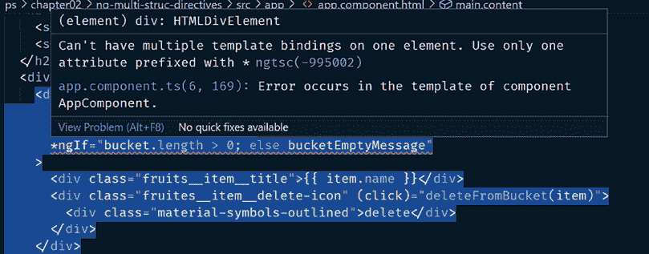

    图 2.11：Angular 语言服务解释我们不能在同一个元素上使用两个结构指令

1.  我们可以通过将一个结构指令移动到 `<ng-container>` 包装器中来解决这个问题，它不会在 DOM 中创建任何额外的 HTML 元素。让我们按照以下方式修改代码：

    ```js
    <div class="fruits">
    **<****ng-container** *******ngIf****=****"bucket.length > 0; else**
    **bucketEmptyMessage"****>**
    <div class="fruits__item" *ngFor="let item of bucket">
          ...
        </div>
    **</****ng-container****>**
    <ng-template #bucketEmptyMessage>...</ng-template>
    </div> 
    ```

    通过上述更改，您应该能够在桶中没有项目时看到消息，如下所示：

    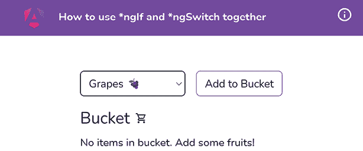

    图 2.12：使用 *ngIf 和 *ngFor 一起的最终结果

## 它是如何工作的…

由于我们无法在同一个元素上使用两个结构指令（比如说一个按钮），我们总是可以使用另一个 HTML 元素作为包装器（父元素）来使用其中一个结构指令，另一个结构指令用于目标元素（在我们的例子中是按钮）。然而，这会在 DOM 中添加另一个元素，可能会根据您的实现导致元素层次结构或其他布局行为问题。然而，`<ng-container>` 是 Angular 中的一个神奇元素，它不会添加到 DOM 中。相反，它只是包装了您应用于它的逻辑/条件，这使得它非常适合我们在这种情况下使用。

## 参见

+   使用 `<ng-container>` 文档分组兄弟元素：[`angular.io/guide/structural-directives#group-sibling-elements-with-ng-container`](https://angular.io/guide/structural-directives#group-sibling-elements-with-ng-container)

# 使用指令组合 API 将多个指令应用于同一元素

在这个菜谱中，您将使用 **指令组合 API** 来创建多个组件，并直接将指令应用于它们以提高可重用性，而不是必须将指令应用于每个组件或创建组件模板内的额外元素以应用指令。

## 准备工作

我们将要工作的应用位于克隆的仓库中的`start/apps/chapter02/ng-directive-comp-api`目录下：

1.  在你的代码编辑器中打开代码仓库。

1.  打开终端，导航到代码仓库目录，并运行以下命令以启动项目：

    ```js
    npm run serve ng-directive-comp-api 
    ```

    这应该在新的浏览器标签页中打开应用，你应该看到以下内容：

    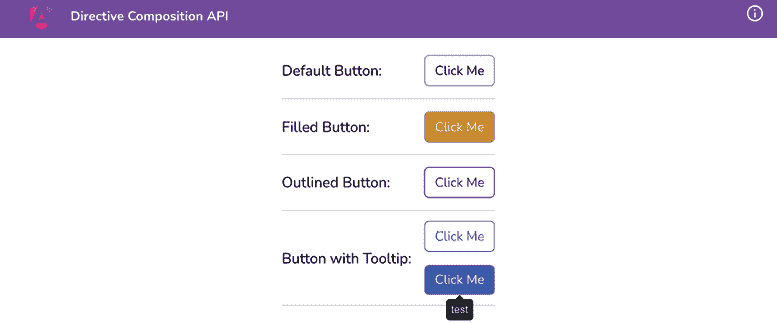

    图 2.13：ng-directive-comp-api 应用在 http://localhost:4200 上运行

## 如何做到这一点…

1.  首先，我们将为我们的应用创建几个组件。我们将创建一个用于填充按钮的指令，一个用于轮廓按钮的指令，以及一个用于带提示的按钮的指令。从工作区内的`start`文件夹运行以下命令：

    ```js
    nx g directive button-filled --directory apps/chapter02/ng-directive-comp-api/src/app/directives --standalone=false
    nx g directive button-outlined --directory apps/chapter02/ng-directive-comp-api/src/app/directives --standalone=false
    nx g directive button-with-tooltip --directory apps/chapter02/ng-directive-comp-api/src/app/directives --standalone=false 
    ```

    如果被要求，选择`@nx/angular:component schematics`并选择“按提供”操作。

    注意，我们创建的所有指令都是非独立指令。这是因为应用是用`NgModule`启动的，而`AppComponent`不是一个独立组件。因此，我们需要将这些指令导入到`app.module.ts`中，以便这个菜谱能够工作。

1.  让我们将`ButtonDirective`变成一个独立指令，这意味着它不会成为任何`NgModule`的一部分。更新`button.directive.ts`文件如下：

    ```js
    ...
    @Directive({
      selector: '[appButton]',
      **standalone****:** **true****,**
    })
    export class ButtonDirective {
      ...
    } 
    ```

1.  让我们同样从`app.module.ts`文件中移除它，因为它现在是一个`standalone`指令。更新`app.module.ts`文件如下：

    ```js
    ...
    **import** **{** **ButtonDirective** **}** **from****'****./directives/button.directive'****;** **// <-- remove the import**
    ...
    @NgModule({
      declarations: [
        ...,
        **ButtonDirective****,** **// <-- remove this**
        ...
      ],
      ...
    })
    export class AppModule {} 
    ```

    你会注意到，所有的按钮都没有了所需的样式，如下所示：

    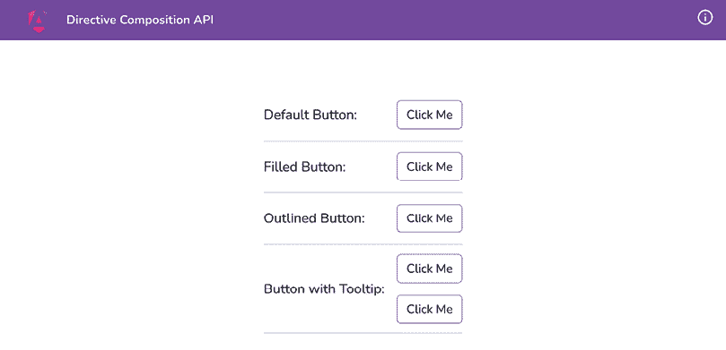

    图 2.14：按钮指令的样式已消失

1.  让我们更新`ButtonFilledDirective`以使用`ButtonDirective`，使用指令组合 API。更新`button-filled.directive.ts`文件如下：

    ```js
    import { Directive**,** **HostBinding** } from '@angular/core';
    **import** **{** **ButtonDirective** **}** **from****'./button.directive'****;**
    @Directive({
      selector: '[appButtonFilled]',
      **hostDirectives****: [**
    **{**
    **directive****:** **ButtonDirective****,**
    **inputs****: [****'color'****],**
    **},**
    **],**
    })
    export class ButtonFilledDirective {
      **@****HostBinding****(****'attr.fill'****)**
    **fill =** **'filled'****;**
    } 
    ```

1.  我们可以在`app.component.html`文件中使用`appButtonFilled`指令，如下所示：

    ```js
    ...
    <main class="content" role="main">
    <ul class="flex flex-col">
    <li class="flex gap-4 items-center border-b justify-
          between border-slate-300 py-3">...</li>
    <li class="flex gap-4 items-center border-b justify-
          between border-slate-300 py-3">
    <h4 class="text-lg">Filled Button:</h4>
    **<****button****appButtonFilled****color****=****"****yellow"****>****Click**
    **Me****</****button****>**
    </li>
    <li class="flex gap-4 items-center border-b justify-
          between border-slate-300 py-3">...</li>
    <li class="flex gap-4 items-center border-b justify-
          between border-slate-300 py-3">...</li>
    </ul>
    </main> 
    ```

注意，我们已经从元素中移除了`fill`属性。

1.  让我们同样更新`ButtonOutlined`指令。我们将修改`button-outlined.directive.ts`如下：

    ```js
    import { Directive**,** **HostBinding** } from '@angular/core';
    **import** **{** **ButtonDirective** **}** **from****'./button.directive'****;**
    @Directive({
      selector: '[appButtonOutlined]',
      **hostDirectives****: [**
    **{**
    **directive****:** **ButtonDirective****,**
    **inputs****: [****'color'****],**
    **},**
    **],**
    })
    export class ButtonOutlinedDirective {
      **@****HostBinding****(****'attr.fill'****)**
    **fill =** **'outlined'****;**
    } 
    ```

1.  让我们同样修改`ButtonWithTooltipDirective`类。我们将更新`button-with-tooltip.directive.ts`如下：

    ```js
    import { Directive } from '@angular/core';
    **import** **{** **ButtonDirective** **}** **from****'./button.directive'****;**
    **import** **{** **TooltipDirective** **}** **from****'./tooltip.directive'****;**
    @Directive({
      selector: '[appButtonWithTooltip]',
      **hostDirectives****: [**
    **{**
    **directive****:** **ButtonDirective****,**
    **inputs****: [****'color'****,** **'fill'****],**
    **},**
    **{**
    **directive****:** **TooltipDirective****,**
    **inputs****: [****'appTooltip: tooltip'****],**
    **},**
    **],**
    })
    export class ButtonWithTooltipDirective {} 
    ```

    你会注意到应用开始抛出错误，指出`TooltipDirective`不是一个独立组件。这是真的。我们需要对`TooltipDirective`也做与`ButtonDirective`在*步骤 2*和*步骤 3*中相同的事情。完成这些后，继续下一步。

1.  现在，更新`app.component.html`文件以使用`appButtonOutlined`和`appButtonTooltip`指令，如下所示：

    ```js
    ...
    <main class="content" role="main">
    <ul class="flex flex-col">
    <li class="flex gap-4 items-center border-b justify-
          between border-slate-300 py-3">...</li>
    <li class="flex gap-4 items-center border-b justify-
          between border-slate-300 py-3">...</li>
    <li class="flex gap-4 items-center border-b justify-
          between border-slate-300 py-3">
    <h4 class="text-lg">Outlined Button:</h4>
    **<****button****appButtonOutlined****>****Click Me****</****button****>**
    </li>
    <li class="flex gap-4 items-center border-b justify-
          between border-slate-300 py-3">
    <h4 class="text-lg">Button with Tooltip:</h4>
    <div class="flex flex-col gap-4">
    **<****button****appButtonWithTooltip****tooltip****=****"code with**
    **ahsan"****fill****=****"****outlined"****color****=****"blue"****>**
    **Click Me**
    **</****button****>**
    **<****button****appButtonWithTooltip****tooltip****=****"code with**
    **ahsan"****fill****=****"filled"****color****=****"blue"****>**
    **Click Me**
    **</****button****>**
    </div>
    </li>
    </ul>
    </main> 
    ```

    如果你正确地遵循了所有步骤，你应该能够看到以下最终结果：

    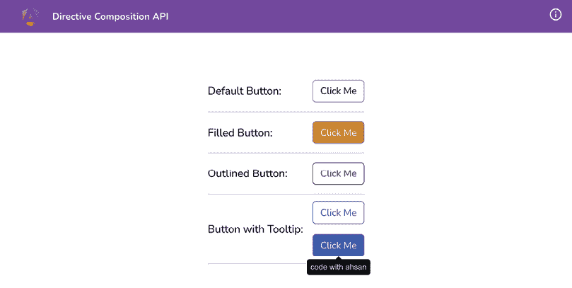

    图 2.15：包含应用不同指令的按钮的最终结果

## 它是如何工作的…

指令组合 API 是在 Angular v15 中引入的，并且一直是 Angular 社区最请求的功能之一。在这个菜谱中，我们尝试创建一些组件，将指令直接绑定到组件的 TypeScript 类中，而不是在模板中。这消除了在组件内部创建包装元素以应用指令或映射组件的输入到指令的输入的需求。这也允许多个指令绑定到同一个组件——即使它们可能有相同名称的输入，我们也可以将它们别名为不同的名称。

我们应用程序中指令的流程如下：

+   `AppComponent` 使用了 `ButtonFilledDirective`、`ButtonOutlinedDirective` 和 `ButtonWithTooltipDirective` 指令。为此，这些指令需要是非独立的，因为应用程序是用 `NgModule` 引导的

+   `ButtonFilledDirective`、`ButtonOutlinedDirective` 和 `ButtonWithTooltipDirective` 指令使用指令组合 API 来使用 `ButtonDirective` 和 `TooltipDirective`。这些指令需要是独立指令，以便用作 ‘`hostDirectives`’

使用指令组合 API 的关键是使用 `standalone: true` 标志构建你的基础指令。这意味着你的指令不属于任何 `NgModule`，可以直接导入到它们被使用的任何组件的导入数组中。这就是为什么我们在步骤 2、3 和 7 中将 `ButtonDirective` 和 `TooltipDirective` 都设置为独立。然后，我们在 `ButtonFilledDirective`、`ButtonOutlinedDirective` 和 `ButtonWithTooltipDirective` 中使用这些指令，以便能够重用逻辑，而无需创建任何包装组件或额外的 HTML。我们通过在指令元数据中使用 `hostDirectives` 属性来实现。请注意，我们向此属性传递一个对象数组，每个对象可以包含 `directive` 属性，该属性接受要应用的 `directive` 的类。我们还可以为主绑定提供 **输入** 和 **输出**。正如你在 `ButtonWithTooltipDirective` 中看到的，我们还把 `TooltipDirective` 的 `appTooltip` 输入别名设置为 `ButtonWithTooltipDirective` 的 `tooltip` 输入。需要注意的是，如果你不想映射任何输入或输出，只想在 `hostDirectives` 中绑定一个指令，你可以简单地提供一个要应用的指令类的数组，如下所示：

```js
hostDirectives: [
  ButtonDirective,
  TooltipDirective
], 
```

## 参见

+   指令组合 API 文档：[`angular.io/guide/directive-composition-api#directive-composition-api`](https://angular.io/guide/directive-composition-api#directive-composition-api)

+   独立组件：[`angular.io/guide/standalone-components`](https://angular.io/guide/standalone-components)

# 在 Discord 上了解更多

要加入这本书的 Discord 社区——在那里您可以分享反馈、向作者提问以及了解新书发布——请扫描下面的二维码：

`packt.link/AngularCookbook2e`


