# 3

# Angular 中依赖注入的魔法

本章全部关于 Angular 中 **依赖注入**（**DI**）的魔法。在这里，你将了解 Angular 中 DI 概念的详细信息。DI 是 Angular 用于将不同依赖项注入到组件、指令和服务的进程。你将通过几个示例进行操作，使用服务和提供者来获得一些实际经验，这些经验可以在你以后的 Angular 项目中利用。

在本章中，我们将介绍以下食谱：

+   使用 Angular DI 令牌

+   可选依赖项

+   使用 `providedIn` 创建单例服务

+   使用 `forRoot()` 创建单例服务

+   对同一 DI 令牌提供替代类

+   使用值提供者进行动态配置

# 技术要求

对于本章的食谱，请确保你的设置已按照 'Angular-Cookbook-2E' GitHub 仓库中的 '技术要求' 完成。有关设置详细信息，请访问：[`github.com/PacktPublishing/Angular-Cookbook-2E/tree/main/docs/technical-requirements.md`](https://github.com/PacktPublishing/Angular-Cookbook-2E/tree/main/docs/technical-requirements.md)。本章的起始代码位于 [`github.com/PacktPublishing/Angular-Cookbook-2E/tree/main/start/apps/chapter03`](https://github.com/PacktPublishing/Angular-Cookbook-2E/tree/main/start/apps/chapter03)。

# 使用 Angular DI 令牌

在这个食谱中，你将学习如何创建基本的 DI 令牌。我们将为常规 TypeScript 类创建它，以便使用 DI 作为 Angular 服务。在我们的应用程序中有一个名为 `Jokes` 的类，它通过手动创建该类的新实例在 `AppComponent` 中使用。这使得我们的代码紧密耦合且难以测试，因为 `AppComponent` 类直接使用 `Jokes` 类。

换句话说，当运行 `App` 组件的测试时，我们现在依赖于 `Jokes` 类，如果该类中发生任何变化，我们的测试将失败。由于 Angular 专注于 **DI** 和 **服务**，我们将使用 DI 令牌来使用 `Jokes` 类作为 Angular 服务。我们将使用 `InjectionToken` 方法创建 DI 令牌，然后使用 `@Inject` 装饰器来使我们能够在服务中使用该类。

## 准备工作

我们将要工作的应用位于克隆的仓库中的 `start/apps/chapter03/ng-di-token`：

1.  在你的代码编辑器中打开代码仓库。

1.  打开终端，导航到代码仓库目录，并运行以下命令以启动项目：

    ```js
    npm run serve ng-di-token 
    ```

    这应该会在新浏览器标签页中打开应用，你应该会看到以下内容：

    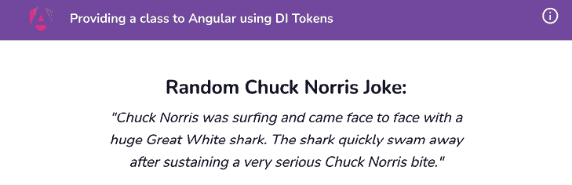

    图 3.1：在 http://localhost:4200 上运行的 ng-di-token 应用

现在我们已经运行了应用，我们可以继续进行食谱的步骤。

## 如何操作...

我们目前拥有的应用程序向一个从 TypeScript 类 `Jokes` 中检索到的随机用户显示问候消息。我们通过在 `AppComponent` 类中使用语句 `jokes = new Jokes();` 创建 `Jokes` 类的实例。然而，Angular 有一种内置的方式使用类作为服务通过依赖注入（DI）。所以，我们不会将其作为类使用，而是将其作为 Angular 服务使用 DI。我们将首先为我们的 `Jokes` 类创建一个 `InjectionToken`，然后将其注入到 `AppComponent` 类中。按照以下步骤进行操作：

1.  我们将在 `jokes.class.ts` 文件中创建一个 `InjectionToken`。我们将命名令牌为 `'Jokes'`，使用一个新的 `InjectionToken` 实例。最后，我们将从这个文件中导出这个令牌：

    ```js
    import { InjectionToken } from '@angular/core';
    export const JOKES = new InjectionToken('Jokes', {
      providedIn: 'root',
      factory: () => new Jokes(),
    });
    class Jokes {...}
    export default Jokes; 
    ```

1.  现在，我们将使用 `@angular/core` 包中的 `inject` 方法和 `jokes.class.ts` 文件中的 `JOKES` 令牌来使用该类，如下所示：

    ```js
    import { Component, **inject**, OnInit } from '@angular/core';
    **import** **{** **JOKES** **}** **from****'./classes/jokes.class'****;**
    import { IJoke } from './interfaces/joke.interface';
    @Component({...})
    export class AppComponent implements OnInit {
      joke!: IJoke;
      **jokes =** **inject****(****JOKES****);**
      ...
    } 
    ```

就这样。你应该看到应用程序与之前一样工作。唯一的区别是，我们不是手动实例化 `Jokes` 类的实例，而是依赖于注入令牌来实例化它。这不仅带来了无需创建实例的便利，而且如果 `Jokes` 类通过 Angular DI 使用其他类作为依赖项，并且其中任何一个缺失，我们将会得到适当的错误来修复问题。因此，我们有一个更健壮的服务和组件架构，这确保在应用程序运行/构建之前满足依赖项。现在我们知道了配方，让我们更详细地看看它是如何工作的。

## 它是如何工作的…

Angular 不识别常规 TypeScript 类作为可注入项。然而，我们可以创建自己的注入令牌，并使用 `@angular/core` 包中的 `inject` 方法在需要的地方注入相关的类和值。Angular 在幕后识别这些令牌并找到它们的对应定义，这通常是以 `factory` 函数的形式。请注意，我们在令牌定义中使用 `providedIn: 'root'`。这意味着在整个应用程序中只有一个类的实例。

## 相关内容

+   Angular 中的 DI ([`angular.io/guide/dependency-injection`](https://angular.io/guide/dependency-injection))

+   `InjectionToken` 文档 ([`angular.io/api/core/InjectionToken`](https://angular.io/api/core/InjectionToken))

# 可选依赖

当你在 Angular 应用程序中使用或配置一个可能存在或不存在或尚未提供的依赖项时，Angular 中的可选依赖项非常强大。在这个配方中，我们将学习如何使用 `@Optional` 装饰器在组件和服务中配置可选依赖项。我们将与 `LoggerService` 一起工作，确保如果组件尚未提供 `LoggerService`，它们不会崩溃。

## 准备工作

我们将要工作的应用程序位于克隆的仓库中的`start/apps/chapter03/ng-optional-dependencies`目录下：

1.  在你的代码编辑器中打开代码仓库。

1.  打开终端，导航到代码仓库目录，并运行以下命令来启动项目：

    ```js
    npm run serve ng-optional-dependencies 
    ```

    这应该在新的浏览器标签页中打开应用程序，你应该会看到以下内容：

    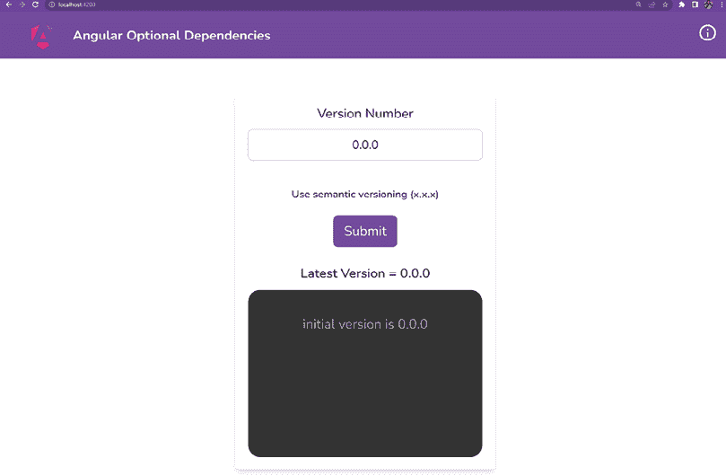

    图 3.2：ng-optional-dependencies 应用程序在 http://localhost:4200 上运行

现在我们已经运行了应用程序，我们可以继续进行下一步骤。

## 如何做到这一点…

我们将有一个包含`LoggerService`的应用程序，该服务通过`providedIn: 'root'`作为其可注入配置提供。我们将看到当我们没有在任何地方提供此服务时会发生什么。然后，我们将使用`@Optional`装饰器识别和修复问题。按照以下步骤操作：

1.  首先，让我们运行应用程序，输入一个新的版本号，`0.0.1`，然后点击**提交**按钮。

    这将导致日志通过`LoggerService`保存到`localStorage`中。打开**Chrome 开发者工具**，导航到**应用程序**，选择**本地存储**，然后点击`http://localhost:4200`。你会看到带有日志值的键`vc_logs_ng_od`，如下所示：

    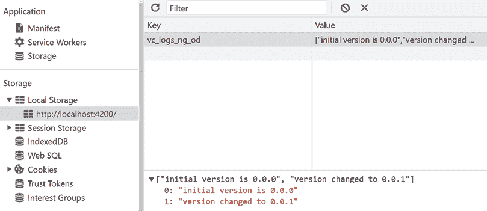

    图 3.3：日志被保存在 http://localhost:4200 的 localStorage 中

1.  让我们在`logger.service.ts`文件中尝试移除为`LoggerService`提供的`@Injectable`装饰器中的配置。更改应如下所示：

    ```js
    import { Injectable } from '@angular/core'; 
    **// <-- remove the above import**
    import { Logger } from '../interfaces/logger';
    @Injectable(**{****//<-- remove this object**
    **providedIn: 'root'**
    **})**
    export class LoggerService implements Logger {
      ...
    } 
    ```

    这将导致 Angular 无法识别它，并在控制台抛出错误，如下所示：

    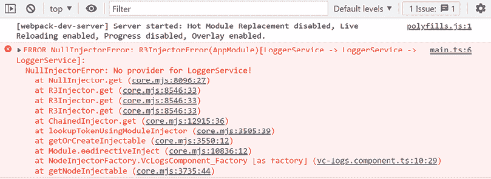

    图 3.4：一个反映 Angular 无法识别 LoggerService 错误的错误

1.  我们现在可以使用`@Optional`装饰器将依赖项标记为可选。让我们从`@angular/core`包中导入它，并在`vc-logs.component.ts`文件的`VcLogsComponent`构造函数中使用装饰器，如下所示：

    ```js
    import { Component, OnInit, Input, OnChanges, SimpleChanges**,** **Optional** } from '@angular/core';
    ...
    export class VcLogsComponent implements OnInit {
      ...
      **constructor****(****@Optional****()** **private** **logger: LoggerService****) {**
    **this****.****logs** **=** **this****.****logger****?.****retrieveLogs****() || [];**
    **}**
      ...
    } 
    ```

    太好了！现在，如果你刷新应用程序并查看控制台，应该会有不同的错误。太棒了，有进展！

    *图 3.5* 显示，我们有一个新的错误，因为我们正在尝试在`ngOnChanges`方法内部调用`this.logger.log()`语句。

    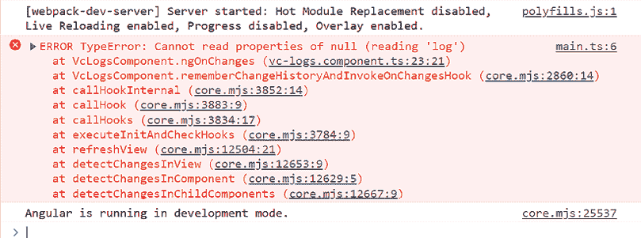

    图 3.5：一个详细说明`this.logger`现在是基本为空的错误

1.  为了解决这个问题，我们可以选择完全不记录任何日志，或者如果未提供`LoggerService`，则回退到`console.*`方法。回退到`console.*`方法的代码如下：

    ```js
    ...
    export class VcLogsComponent implements OnInit {
      ...
      constructor(@Optional() private loggerService: 
    LoggerService) {
        this.logs = this.logger?.retrieveLogs() || [];
      }
      **get****log****() {**
    **return****this****.****logger****?.****log****.****bind****(****this****.****logger****) ||**
    **console****.****log****;**
    **}**
      ... 
    ```

1.  让我们也更新`ngOnChanges`块以使用此日志（获取器）函数：

    ```js
    ...
    export class VcLogsComponent implements OnInit {
      ...
      constructor(@Optional() private logger: LoggerService) { }
      get log() {}
      ngOnChanges(changes: SimpleChanges) {
        const currValue = changes['vName'].currentValue;
        let message;
        if (changes['vName'].isFirstChange()) {
          message = `initial version is ${currValue.trim()}`;
          if (!this.logs.length) {
            **this****.****log****(message);**
    this.logs.push(message);
          }
        } else {
            message = `version changed to ${currValue.trim()}`;
            **this****.****log****(message);**
    this.logs.push(message);
        }
      }
      ... 
    ```

1.  现在，如果你更新版本并点击**提交**，你应该会在控制台上看到日志，如下所示：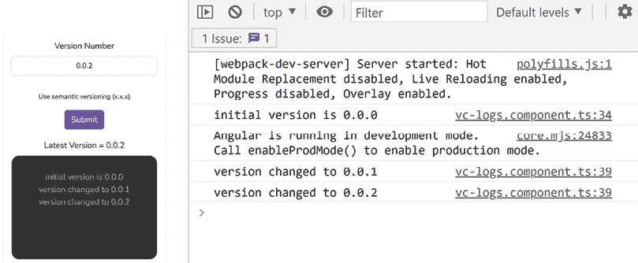

    图 3.6：当未提供 LoggerService 时，日志作为回退在控制台上的打印

太好了！我们已经完成了食谱，一切看起来都很棒。请参考下一节了解它是如何工作的。

## 工作原理

`@Optional`装饰器是`@angular/core`包中的一个特殊装饰器，它允许你将一个依赖项标记为可选。在幕后，当在具有依赖项的类的构造函数方法中使用时，如果依赖项不存在或未提供给应用程序，Angular 将提供值为`null`。由于我们从`LoggerService`类的`@Injectable()`装饰器中移除了配置对象，它不会在 Angular 中提供用于 DI。因此，我们的`@Optional()`装饰器在注入时将其设置为`null`，不会导致 Angular 抛出*图 3.4*中显示的`NullInjectorError`。在*步骤 4*中，我们在组件的类`VcLogsComponent`中创建了一个`log`获取器函数，这样我们就可以在服务提供时使用`LoggerService`的`log`方法；否则使用`console.log`。然后，在接下来的步骤中，我们只需使用我们创建的`log`方法。如果你回到`logger.service.ts`文件并将服务作为`providedIn: 'root'`再次提供，你现在将看不到任何控制台日志，并且会看到现在应用程序正在使用服务，即使用`localStorage`的`LoggerService`。

## 参考以下内容

+   Angular 中的可选依赖项（[`angular.io/guide/dependency-injection#optional-dependencies`](https://angular.io/guide/dependency-injection#optional-dependencies)）

+   Angular 中的分层注入器（[`angular.io/guide/hierarchical-dependency-injection`](https://angular.io/guide/hierarchical-dependency-injection)）

# 使用`providedIn`创建单例服务

在本食谱中，你将学习如何确保你的 Angular 服务作为单例使用的几个技巧。这意味着在整个应用程序中，你的服务将只有一个实例。我们将使用一些技术，包括`providedIn: 'root'`语句，通过使用`@Optional()`和`@SkipSelf()`装饰器确保在整个应用程序中只提供一次服务。

## 准备工作

我们将要工作的应用程序位于克隆的仓库中的`start/apps/chapter03/ng-singleton-service`内：

1.  在你的代码编辑器中打开代码仓库。

1.  打开终端，导航到代码仓库目录，并运行以下命令以启动项目：

    ```js
    npm run serve ng-singleton-service 
    ```

    这应该在新的浏览器标签页中打开应用程序，你应该看到以下内容：

    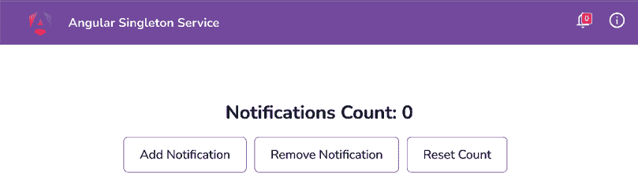

    图 3.7：运行在 http://localhost:4200 上的 ng-singleton-service 应用程序

现在我们已经启动了应用程序，我们可以继续进行下一步的步骤。

## 如何操作

该应用程序的问题在于，如果你添加或删除任何通知，页眉中铃铛图标上的计数不会改变。这是因为我们在`AppModule`和`HomeModule`类中提供了多个`NotificationsService`实例。请参考以下步骤以确保应用程序中只有一个服务实例：

1.  我们将使用`providedIn: 'root'`为`NotificationService`来告诉 Angular 它只应在根模块中提供，并且在整个应用中只有一个实例。所以，让我们去`notifications.service.ts`文件，并在`@Injectable`装饰器参数中传递`providedIn: 'root'`，如下所示：

    ```js
    import { Injectable } from '@angular/core';
    import { BehaviorSubject, Observable } from 'rxjs';
    @Injectable(**{**
    **providedIn****:** **'root'**
    **}**)
    export class NotificationsService {
      ...
    } 
    ```

    太好了！现在，即使你刷新并尝试添加或删除通知，你仍然会看到标题中的计数没有变化。*“但是为什么这样，Ahsan？”* 好吧，我很高兴你问了。这是因为我们仍然在`AppModule`和`HomeModule`类中提供了这个服务。

1.  首先，让我们从`app.module.ts`中的`providers`数组中移除`NotificationsService`，如下面的代码块中突出显示：

    ```js
    ...
    import { NotificationsButtonComponent } from './components/notifications-button/notifications-button.component';
    **import** **{** **NotificationsService** **}** **from** './services/notifications.service'**;**
    // <-- Remove the import above
    @NgModule({
      declarations: [... ],
      imports: [...],
      providers: [
        **NotificationsService** **// <-- Remove this**
      ],
      bootstrap: [AppComponent]
    })
    export class AppModule { } 
    ```

1.  现在，我们将从`home.module.ts`中移除`NotificationsService`，如下面的代码块中突出显示：

    ```js
    ...
    **import** **{** **NotificationsService** **}** **from****'../services/notifications.service'****;** 
    **// <-- Remove the import above**
    @NgModule({
      declarations: [...],
      imports: [...],
      providers: [
        **NotificationsService****// <-- Remove this**
      ]
    })
    export class HomeModule { } 
    ```

    太棒了！现在，你应该能够看到标题中的计数根据你是否添加/删除通知而改变。然而，如果有人不小心在另一个懒加载的模块中错误地提供了它，会发生什么呢？

1.  让我们把`NotificationsService`放回`home.module.ts`文件中：

    ```js
    ...
    **import** **{** **NotificationsService** **}** **from****'../services/notifications.service'****;**
    @NgModule({
      declarations: [HomeComponent, NotificationsManagerComponent],
      imports: [CommonModule, HomeRoutingModule],
      providers: [**NotificationsService**],
    })
    export class HomeModule {} 
    ```

    哗啦！我们在控制台或编译时间都没有任何错误。然而，我们有一个问题，那就是标题中的计数没有更新。那么，我们如何提醒开发者他们犯了这样的错误呢？

1.  为了提醒开发者关于潜在的重复提供者，我们将在我们的`NotificationsService`中使用来自`@angular/core`包的`@SkipSelf`装饰器，并抛出一个错误来通知并修改`NotificationsService`，如下所示：

    ```js
    import { Injectable, **SkipSelf** } from '@angular/core';
    import { BehaviorSubject, Observable } from 'rxjs';
    @Injectable({
      providedIn: 'root',
    })
    export class NotificationsService {
      ...
      **constructor****(****@SkipSelf****() existingService:**
    **NotificationsService****) {**
    **if** **(existingService) {**
    **throw****Error****(**
    **'The service has already been provided in the**
    **app.**
    **Avoid providing it again in child  modules'**
    **);**
    **}**
    **}**
      ...
    } 
    ```

    在完成前一步后，你会注意到我们有一个问题，那就是我们未能向我们的应用提供`NotificationsService`。你应该在控制台中看到以下内容：

    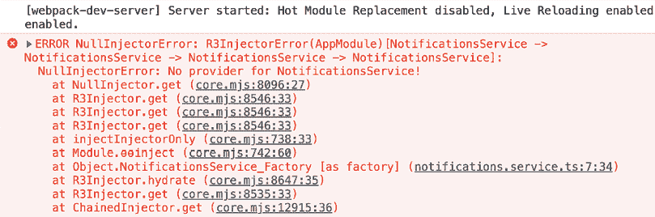

    图 3.8：一个详细说明 NotificationsService 无法注入到 NotificationsService 的错误

    原因是`NotificationsService`现在成为了它自己的依赖。这行不通，因为它还没有被 Angular 解析。为了解决这个问题，我们将在下一步中使用`@Optional()`装饰器。

1.  好吧——现在，我们将在`notifications.service.ts`中使用`@Optional()`装饰器，它位于构造函数中的依赖项旁边，与`@SkipSelf`装饰器一起。代码应该如下所示：

    ```js
    import { Injectable**,** **Optional**, SkipSelf } from '@angular/core';
    ...
    export class NotificationsService {
      ...
      constructor(**@Optional****()** @SkipSelf() existingService:
    NotificationsService) {
        if (existingService) {
          throw Error ('The service has already been provided in
    the app. Avoid providing it again in child
    modules');
        }
      }
      ...
    } 
    ```

    我们现在已经解决了`NotificationsService` -> `NotificationsService`依赖问题。你应该在控制台中看到`NotificationsService`被多次提供的正确错误，如下所示：

    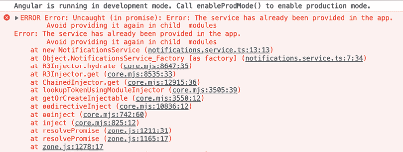

    图 3.9：一个详细说明 NotificationsService 已经在应用中提供的错误

1.  现在，我们将安全地从`home.module.ts`文件中的`providers`数组中移除提供的`NotificationsService`，正如*步骤 3*中所示，并检查应用是否正常工作。

哗！我们现在使用`providedIn`策略有一个单例服务。在下一节中，让我们讨论它是如何工作的。

## 它是如何工作的

每当我们尝试在某个地方注入一个服务时，默认情况下，它会尝试在注入服务的相关模块中寻找服务。当我们使用 `providedIn: 'root'` 来声明一个服务时，无论服务在哪里注入，Angular 都知道它必须在根作用域中找到服务定义，而不是尝试在功能模块或其他地方寻找。

然而，你必须确保整个应用中只提供一次服务。如果你在多个模块中提供它，即使使用 `providedIn: 'root'`，你也会有多个服务实例。为了避免在多个模块或应用中的多个位置提供服务，我们可以在服务的构造函数中使用 `@SkipSelf()` 装饰器和 `@Optional()` 装饰器来检查服务是否已经在应用中提供。

## 参见

+   Angular 中的分层依赖注入 ([`angular.io/guide/hierarchical-dependency-injection`](https://angular.io/guide/hierarchical-dependency-injection))

# 使用 `forRoot()` 创建单例服务

在这个菜谱中，你将学习如何使用 `ModuleWithProviders` 和 `forRoot()` 语句来确保你的 Angular 服务在整个应用中以单例的形式使用。我们将从一个具有多个 `NotificationsService` 实例的应用开始，并实现必要的代码以确保我们最终在我们的应用中获得单个服务实例。

## 准备工作

我们将要工作的应用位于 `start/apps/chapter03/ng-singleton-service-forroot`，在克隆的仓库内：

1.  在你的代码编辑器中打开代码仓库。

1.  打开终端，导航到代码仓库目录，并运行以下命令来运行项目：

    ```js
    npm run serve ng-singleton-service-forroot 
    ```

    这应该在新的浏览器标签页中打开应用，你应该看到以下内容：

    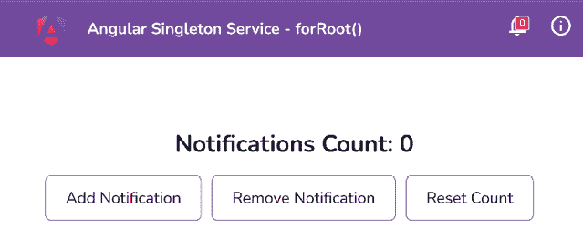

    图 3.10：运行在 http://localhost:4200 的 ng-singleton-service-forroot 应用

现在我们已经运行了应用，在下一节中，我们可以继续进行菜谱的步骤。

## 如何操作

为了确保你只使用 `forRoot` 方法在应用中有一个单例服务，你需要理解 `ModuleWithProviders` 和 `static forRoot()` 方法是如何创建和实现的。执行以下步骤：

1.  首先，我们要确保服务有自己的模块。在许多 Angular 应用中，你可能会看到 `CoreModule`，其中提供了服务（假设我们没有使用 `providedIn: 'root'` 语法的原因）。为了开始，我们将使用以下命令从项目根目录创建一个名为 `ServicesModule` 的模块：

    ```js
    cd start && nx g m services --project ng-singleton-service-forroot 
    ```

1.  让我们在 `services.module.ts` 文件中的 `ServicesModule` 类内创建一个静态方法 `forRoot()`。我们将命名该方法为 `forRoot`，并返回一个包含 `NotificationsService`（在 `providers` 数组中提供）的 `ModuleWithProviders` 对象，如下所示：

    ```js
    import { **ModuleWithProviders****,** NgModule } from '@angular/core';
    import { CommonModule } from '@angular/common';
    **import** **{** **NotificationsService** **}** **from****'./notifications.service'****;**
    @NgModule({
      declarations: [],
      imports: [CommonModule],
    })
    export class ServicesModule {
      **static****forRoot****():** **ModuleWithProviders****<****ServicesModule****> {**
    **return** **{**
    **ngModule****:** **ServicesModule****,**
    **providers****: [****NotificationsService****],**
    **};**
    **}**
    } 
    ```

1.  现在，我们将从`app.module.ts`文件的`providers`数组中移除`NotificationsService`，并在`app.module.ts`文件中包含`ServicesModule`。特别是，我们将使用`forRoot()`方法在`imports`数组中添加`ServicesModule`，如下面的代码块所示。

    这是因为它将`ServicesModule`及其提供者注入到`AppModule`中，例如，提供`NotificationsService`，如下所示：

    ```js
    ...
    **import** **{** **NotificationsService** **}** **from** **'./services/notifications.service'****;**
    **// <-- Remove the import above**
    **import** **{** **ServicesModule** **}** **from****'./services/services.module'****;**
    @NgModule({
      declarations: [...],
      imports: [
        ...,
        **ServicesModule****.****forRoot****()**
      ],
      providers: [
        **NotificationsService**// <-- **Remove this**
      ],
      bootstrap: [AppComponent]
    })
    export class AppModule { } 
    ```

    你会注意到，在添加/删除通知时，标题中的计数仍然没有改变。这是因为我们仍在`home.module.ts`文件中提供`NotificationsService`。

1.  我们将从`home.module.ts`文件的`providers`数组中移除`NotificationsService`，如下所示：

    ```js
    ...
    **import** **{** **NotificationsService** **}** **from****'../services/notifications.service'****;** 
    **//  <-- Remove the above import**
    **import** **{** **ServicesModule** **}** **from****'../services/services.module'****;**
    @NgModule({
      declarations: [HomeComponent,
        NotificationsManagerComponent],
      imports: [CommonModule, HomeRoutingModule,
        **ServicesModule**],
      providers: [
        **NotificationsService****// <-- Remove this**
      ],
    })
    export class HomeModule {} 
    ```

干得好。现在我们已经完成了这个食谱，在下一节中，让我们讨论它是如何工作的。

## 工作原理

`ModuleWithProviders`充当`NgModule`的包装器，将其与`providers`数组捆绑在一起。它用于配置`NgModule`及其提供者，确保当模块在其他地方导入时，它也带来了其提供者。在我们的`ServicesModule`中，我们创建了一个返回`ModuleWithProviders`的`forRoot`方法。它包括我们的`NotificationsService`，这使得我们可以在整个应用中拥有这个服务的单个实例，避免了在`ServicesModule`的`providers`数组中提供`NotificationsService`并将其导入到各个模块时通常出现的多个实例。因此，为了确保单个实例，`ServicesModule`应该使用`ModuleWithProviders`方法导入，而不是标准方式。这就是为什么在使用`ModuleWithProviders`方法时，我们不按常规方式导入`ServicesModule`，如下所示：

```js
@NgModule({
  ...
  imports: [..., **ServicesModule**],
}) 
```

相反，我们使用`forRoot`方法导入它，这确保了`NotificationService`在整个应用中只被提供一次，如下所示：

```js
@NgModule({
...
  imports: [..., **ServicesModule****.****forRoot****()**],
}) 
```

现在你已经了解了这个食谱的工作原理，请查看下一节以获取一些有用的链接。

## 参见

+   `ModuleWithProviders` Angular 文档([`angular.io/api/core/ModuleWithProviders`](https://angular.io/api/core/ModuleWithProviders))

+   `ModuleWithProviders`迁移文档([`angular.io/guide/migration-module-with-providers%20`](https://angular.io/guide/migration-module-with-providers%20))

# 针对相同的 DI 令牌提供备用类

在这个食谱中，你将学习如何使用**别名类提供者**向应用提供两个不同的服务。这在复杂的应用程序中非常有用，其中你需要为某些组件/模块缩小服务的/类的实现，即针对相同的 DI 令牌提供不同的类以实现多态行为。此外，别名在组件/服务单元测试中使用，以模拟依赖服务的实际实现，这样我们就不依赖于它了。

## 准备工作

我们将要工作的应用位于 `start/apps/chapter03/ng-aliased-class-providers`，在克隆的仓库内：

1.  在您的代码编辑器中打开代码仓库。

1.  打开终端，导航到代码仓库目录，并运行以下命令以启动项目：

    ```js
    npm run serve ng-aliased-class-providers 
    ```

    这应该在新的浏览器标签页中打开应用，您应该看到如图 3.11 所示的应用。

1.  点击 **登录为管理员** 按钮。您应该看到以下截图类似的内容：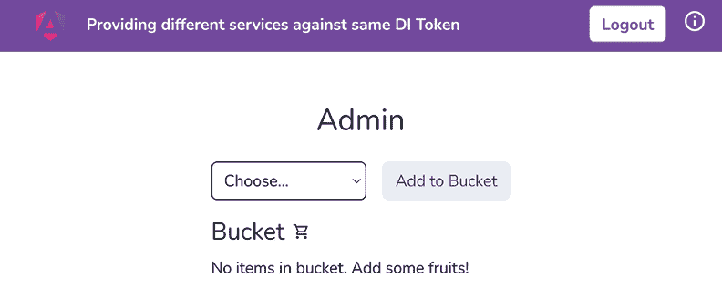

    图 3.11：运行在 http://localhost:4200 的 ng-aliased-class-providers 应用

现在我们已经运行了应用，让我们进入下一节，按照菜谱的步骤进行操作。

## 如何做到这一点

我们有一个名为 `BucketComponent` 的独立组件，它被用于管理员和员工组件中。`BucketComponent` 在幕后使用 `BucketService` 来添加/删除桶中的项目。对于员工，我们将通过提供一个 `aliased` 类提供者和名为 `EmployeeBucketService` 的 `BucketService` 替换来限制删除项目的权限。这样我们就可以覆盖删除项目功能。按照以下步骤开始：

1.  我们将首先在 `employee` 文件夹内创建 `EmployeeBucketService`。从工作区根目录运行以下命令：

    ```js
    cd start && nx g service employee/employee-bucket --project ng-aliased-class-providers 
    ```

1.  接下来，我们将从 `BucketService` 扩展 `EmployeeBucketService`，以便我们能够获得 `BucketService` 类的所有优点。让我们按照以下方式修改代码：

    ```js
    import { Injectable } from '@angular/core';
    **import** **{** **BucketService** **}** **from****'../bucket/bucket.service'****;**
    ...
    export class EmployeeBucketService**extends****BucketService** {
      constructor() {
        **super****();**
      }
    } 
    ```

1.  现在，我们将重写 `removeItem` 方法以显示一个简单的 `alert`，说明员工不能从桶中删除项目。您的代码应如下所示：

    ```js
    ...
    export class EmployeeBucketService extends BucketService {
      constructor() {...}
      **override****removeItem****() {**
    **alert****(****'Employees can not delete items'****);**
    **}**
    } 
    ```

1.  作为最后一步，我们需要将 `aliased` 类提供者提供给 `employee.component.ts` 文件，如下所示：

    ```js
    ...
    **import** **{** **BucketService** **}** **from****'../bucket/bucket.service'****;**
    **import** **{** **EmployeeBucketService** **}** **from****'****./employee-bucket.service'****;**
    @Component({
      ...
      **providers****: [{**
    **provide****:** **BucketService****,**
    **useClass****:** **EmployeeBucketService****,**
    **}],**
    })
    export class EmployeeComponent {} 
    ```

如果您现在以员工身份登录应用并尝试删除项目，您将看到一个弹出窗口，上面写着“员工不能删除项目”。

## 它是如何工作的

当我们将服务注入到组件中时，Angular 会尝试在我们提供的依赖项的组件/模块中找到该组件，然后通过移动组件和模块的层次结构来查找。我们的 `BucketService` 在 `'root'` 中提供，使用 `providedIn: 'root'` 语法。因此，它位于层次结构的顶部。然而，由于在这个菜谱中，我们在 `EmployeeComponent` 类中对 DI 令牌 `BucketService` 使用了一个 `aliased` 类提供者，当 Angular 为 `EmployeeComponent` 查找 `BucketService` 时，它会快速找到 `EmployeeComponent` 中的 `EmployeeBucketService` 对应的令牌并停止搜索——即，它不会到达`'root'`以获取实际的 `BucketService`。这正是我们想要的。

## 参见

+   Angular 中的依赖注入 ([`angular.io/guide/dependency-injection`](https://angular.io/guide/dependency-injection))

+   Angular 中的分层注入器 ([`angular.io/guide/hierarchical-dependency-injection`](https://angular.io/guide/hierarchical-dependency-injection))

# 使用值提供者的动态配置

在这个菜谱中，你将学习如何在 Angular 中使用值提供者来为你的应用提供常量和配置值。我们将从上一个菜谱中的相同示例开始，该示例涉及`EmployeeComponent`和`AdminComponent`使用`BucketComponent`来管理一个水果桶。我们将通过使用值提供者的配置来限制`EmployeeComponent`删除桶中项目的权限。因此，员工甚至看不到**删除**按钮。

## 准备工作

我们将要工作的应用位于克隆的仓库中的`start/apps/chapter03/ng-value-providers`目录下：

1.  在你的代码编辑器中打开代码仓库。

1.  打开终端，导航到代码仓库目录，并运行以下命令来运行项目：

    ```js
    npm run serve ng-value-providers 
    ```

    这应该会在新浏览器标签页中打开应用，你应该会看到如图 3.12 所示的界面。

1.  点击**登录为管理员**按钮。你应该会看到如下截图：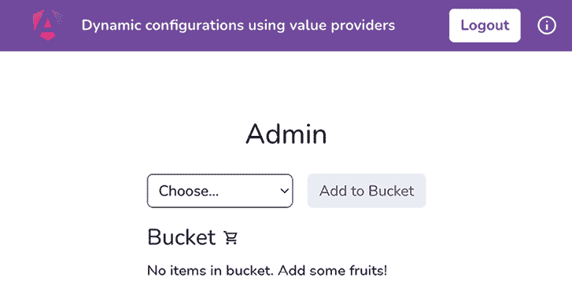

    图 3.12：运行在 http://localhost:4200 的 ng-value-providers 应用

现在你看到应用正在运行，让我们看看下一步要遵循的菜谱。

## 如何操作

我们有一个名为`BucketComponent`的独立组件，它被用于管理员和员工组件中。`BucketComponent`在幕后使用`BucketService`来添加/删除桶中的项目。对于员工，我们将通过提供值提供者来限制删除项目的权限。这样我们就可以覆盖删除项目的功能。让我们从以下步骤开始：

1.  首先，我们将在项目根目录下创建一个新的文件，命名为`app-config.ts`，并在其中使用`InjectionToken`创建值提供者。代码应如下所示：

    ```js
    import { InjectionToken } from '@angular/core';
    export interface IAppConfig {
      canDeleteItems: boolean;
    }
    export const APP_CONFIG = new InjectionToken<IAppConfig>('APP_CONFIG');
    export const AppConfig: IAppConfig = {
      canDeleteItems: true,
    }; 
    ```

    在我们实际上可以在`BucketComponent`中使用这个`AppConfig`常量之前，我们需要将其注册到`AppModule`中，这样当我们向`BucketComponent`注入这个值时，提供者的值才能被解析。

1.  让我们在`app.module.ts`文件中添加提供者，如下所示：

    ```js
    ...
    **import** **{** **AppConfig****,** **APP_CONFIG** **}** **from****'./app-config'****;**
    @NgModule({
      declarations: [AppComponent],
      imports: [...],
      **providers****: [{**
    **provide****:** **APP_CONFIG****,**
    **useValue****:** **AppConfig****,**
    **}],**
    bootstrap: [AppComponent],
    })
    export class AppModule {} 
    ```

    现在，应用已经知道了`AppConfig`常量。下一步是在`BucketComponent`中使用这个常量。

1.  我们将使用`inject`方法将其注入到`BucketComponent`类中，在`bucket/bucket.component.ts`文件中，如下所示：

    ```js
    import { Component, i**nject,** OnInit } from '@angular/core';
    ...
    **import** **{** **APP_CONFIG** **}** **from****'../app-config'****;**
    ...
    export class BucketComponent implements OnInit {
      bucketService = inject(BucketService);
      **appConfig =** **inject****(****APP_CONFIG****);**
      ...
    } 
    ```

    太好了！常量已经注入。现在，如果你刷新应用，你不应该收到任何错误。下一步是使用`BucketComponent`中的`config`的`canDeleteItems`属性来显示/隐藏`delete`按钮。

1.  现在，我们将在`bucket/bucket.component.html`文件中添加一个`*ngIf`指令，仅在`appConfig.canDeleteItems`的值为`true`时显示`delete`按钮。更新具有`fruites__item__delete-icon`类的元素，如下所示：

    ```js
    ...
    <div *******ngIf****=****"appConfig.canDeleteItems"**
     class="fruites__item__delete-icon"
      (click)="deleteFromBucket(item)">
    <div class="material-symbols-outlined">delete</div>
    </div>
    ... 
    ```

    您可以通过将`AppConfig`常量的`canDeleteItems`属性设置为`false`来测试是否一切正常。请注意，**删除**按钮现在对管理员和员工都不可见。测试完成后，请将`canDeleteItems`的值再次设置为`true`。

    现在，我们已经设置好了一切。让我们添加一个新的常量，以便我们只为员工隐藏**删除**按钮。

1.  现在，让我们创建一个员工配置对象。我们将在`employee`文件夹内创建一个`employee.config.ts`文件，并将以下代码添加到其中：

    ```js
    import { IAppConfig } from '../app-config';
    export const EmployeeConfig: IAppConfig = {
      canDeleteItems: false,
    }; 
    ```

1.  现在，我们将这个`EmployeeConfig`常量提供给`EmployeeComponent`，用于相同的`APP_CONFIG`注入令牌。`employee.component.ts`文件中的代码应如下所示：

    ```js
    ...
    **import** **{** **APP_CONFIG** **}** **from****'../app-config'****;**
    **import** **{** **EmployeeConfig** **}** **from****'./employee.config'****;**
    @Component({
      ...
      **providers****: [{**
    **provide****:** **APP_CONFIG****,**
    **useValue****:** **EmployeeConfig****,**
    **}],**
    })
    export class EmployeeComponent {} 
    ```

完成了！配方现在完整了。您可以看到，**删除**按钮对管理员可见，但对员工隐藏。这一切都归功于值提供者的魔力。

## 工作原理

当我们将令牌注入到组件中时，Angular 会尝试在注入位置找到令牌的解析值，然后通过移动组件和模块的层次结构向上查找。我们在`EmployeeComponent`类中针对`APP_CONFIG`令牌提供了`EmployeeConfig`对象。当 Angular 尝试解析`BucketComponent`的令牌值时，它会在`EmployeeComponent`内部找到`EmployeeConfig`，而不是在`AppModule`中作为`AppConfig`提供的值。因此，Angular 会立即停止，不会到达`AppModule`。这真是太神奇了，因为我们现在可以拥有全局配置，并覆盖嵌套模块/组件内的配置。

## 参见

+   Angular 中的依赖注入([`angular.io/guide/dependency-injection`](https://angular.io/guide/dependency-injection))

+   Angular 中的分层注入器([`angular.io/guide/hierarchical-dependency-injection`](https://angular.io/guide/hierarchical-dependency-injection))

# 在 Discord 上了解更多

要加入这本书的 Discord 社区——在那里您可以分享反馈、向作者提问，并了解新版本——请扫描下面的二维码：

`packt.link/AngularCookbook2e`


