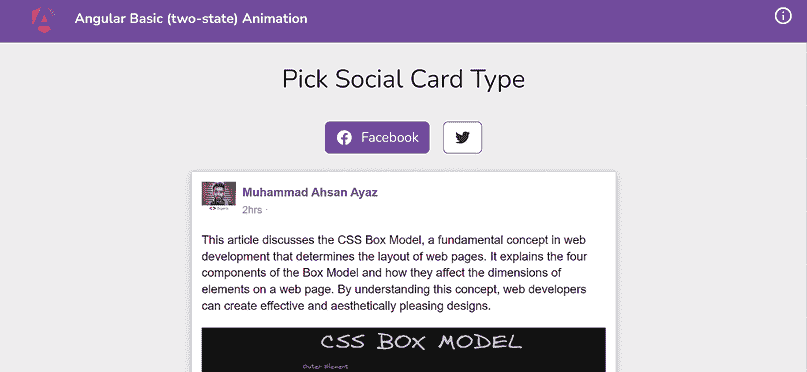
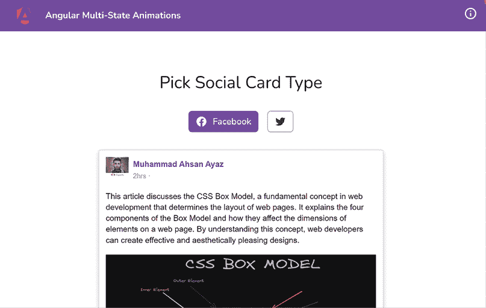
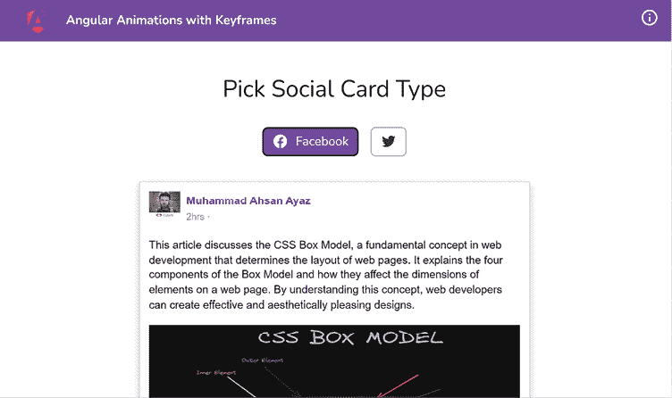
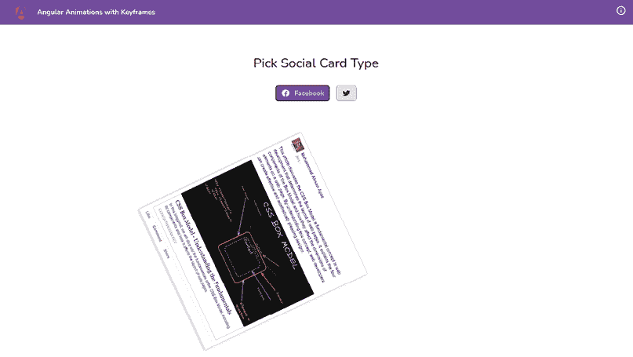
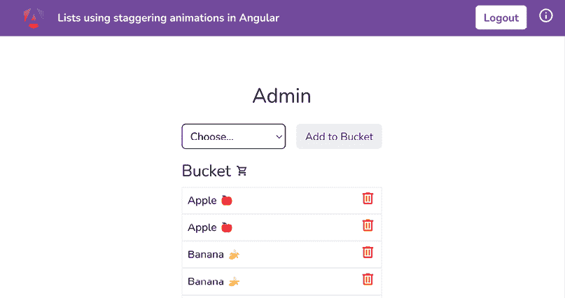
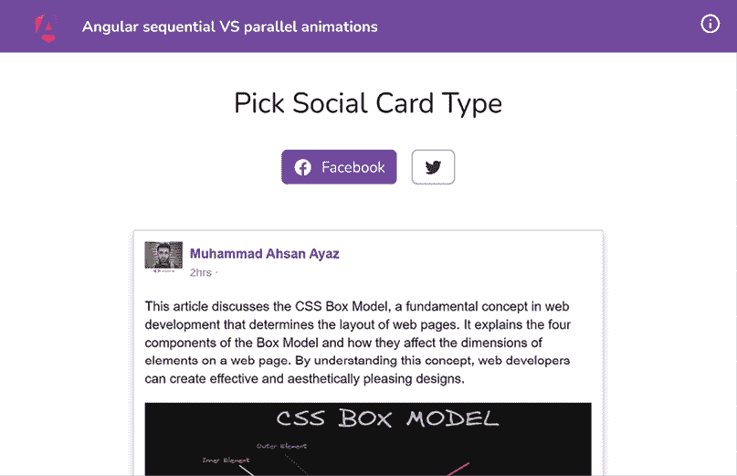
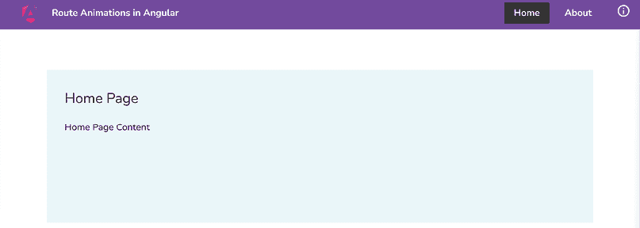
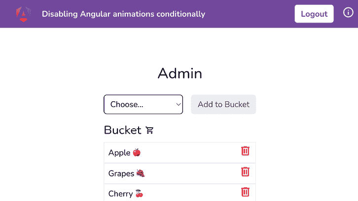

# 第四章：理解 Angular 动画

在本章中，你将学习如何在 Angular 中处理**动画**。你将了解多状态动画、交错动画和关键帧动画，以及如何在 Angular 应用程序中实现切换路由的动画以及如何有条件地禁用动画。

以下是我们将在本章中涵盖的菜谱：

+   创建你的第一个两种状态的 Angular 动画

+   与多状态动画一起工作

+   使用关键帧创建复杂的 Angular 动画

+   使用交错动画在 Angular 中动画化列表

+   Angular 中的顺序动画与并行动画

+   Angular 中的路由动画

+   有条件地禁用 Angular 动画

# 技术要求

对于本章的菜谱，确保你的设置已按照'Angular-Cookbook-2E' GitHub 仓库中的'技术要求'完成。有关设置详细信息，请访问：[`github.com/PacktPublishing/Angular-Cookbook-2E/tree/main/docs/technical-requirements.md`](https://github.com/PacktPublishing/Angular-Cookbook-2E/tree/main/docs/technical-requirements.md)。本章的起始代码位于[`github.com/PacktPublishing/Angular-Cookbook-2E/tree/main/start/apps/chapter04`](https://github.com/PacktPublishing/Angular-Cookbook-2E/tree/main/start/apps/chapter04)。

# 创建你的第一个两种状态的 Angular 动画

在这个菜谱中，你将创建一个基本的两种状态 Angular 动画，它具有淡入淡出效果。我们将从一个已经内置了 UI 的 Angular 应用程序开始。然后，我们将使用 Angular 动画在应用程序中启用动画，并逐步创建我们的第一个动画。

## 准备工作

我们将要工作的应用程序位于克隆的仓库中的`start/apps/chapter04/ng-basic-animation`：

1.  在你的代码编辑器中打开代码仓库。

1.  打开终端，导航到代码仓库目录，并运行以下命令以运行项目：

    ```js
    npm run serve ng-basic-animation 
    ```

    这应该在新的浏览器标签页中打开应用程序，你应该看到以下内容：

    

    图 4.1：ng-basic-animation 应用程序在 http://localhost:4200 上运行

现在我们已经运行了应用程序，我们将继续到菜谱的步骤。

## 如何做到这一点...

我们有一个完全没有配置 Angular 动画的应用程序。我们将使用 Angular 动画为卡片创建淡入效果。让我们继续以下步骤：

1.  首先，我们将从`@angular/platform-browser/animations`包中导入`provideAnimations`函数到我们的`src/app/app.config.ts`文件中，这样我们就可以在应用程序中使用动画了。我们将在`providers`数组中使用它，如下所示：

    ```js
    ...
    **import** **{ provideAnimations }** **from****'@angular/platform-browser/animations'****;** 
    export const appConfig: ApplicationConfig = {
      providers: [
        provideRouter(appRoutes, withEnabledBlockingInitialNavigation())**,**
    **provideAnimations****()**
      ],
    }; 
    ```

1.  现在修改`app.component.ts`文件，添加以下动画：

    ```js
    ...
    **import** **{ trigger, transition, style, animate }** **from****'@angular/animations'****;**
    @Component({
      ...
      imports: [CommonModule, FbCardComponent,
        TwitterCardComponent],
      **animations****: [**
    **trigger****(****'fadeInOut'****, [**
    **transition****(****':enter'****, [**
    **style****({** **opacity****:** **0****,** **scale****:** **0.85** **}),**
    **animate****(****'200ms 100ms'****,** **style****({** **opacity****:** **1****,**
    **scale****:** **1** **})),**
    **]),**
    **transition****(****':leave'****, [** 
    **style****({** **opacity****:** **1****,** **scale****:** **1** **}),** 
    **animate****(****'100ms'****,** **style****({** **opacity****:** **0****,** **scale****:** **0.85** **})),**
    **]),**
    **]),**
    **],** 
    })
    ... 
    ```

1.  最后，在`app.component.html`文件中为两个卡片添加`fadeInOut`动画，如下所示：

    ```js
     <!-- Toolbar -->
    <div class="toolbar" role="banner">...</div>
    <main class="content" role="main">
    <div class="type-picker mb-8">...</div>
    <ng-container [ngSwitch]="selectedCardType">
    <app-fb-card **[@****fadeInOut****]**
    *ngSwitchCase="'facebook'"></app-fb-card>
    <app-twitter-card **[@****fadeInOut****]**
     *ngSwitchCase="'twitter'"></app-twitter-card>
    </ng-container>
    </main>} 
    ```

太好了！你现在已经为卡片实现了基本的*淡入* <=> *淡出*动画。简单，但很漂亮！参考下一节了解菜谱的工作原理。

## 它是如何工作的...

Angular 提供了自己的动画 API，允许您对 CSS 过渡支持的任何属性进行动画处理。好处是您可以根据所需条件动态配置它们。如果我们要在 CSS 中创建相同的行为，我们必须执行以下操作：

1.  我们需要在 CSS 中创建以下关键帧：

    ```js
    @keyframes fadeIn {
      0% { opacity: 0; transform: scale(0.85); }
      100% { opacity: 1; transform: scale(1); }
    }
    @keyframes fadeOut {
      0% { opacity: 1; transform: scale(1); }
      100% { opacity: 0; transform: scale(0.85); }
    } 
    ```

    创建应用这些动画的 CSS 类：

    ```js
    /* For elements that are entering */
    .fade-in {
      animation: fadeIn 200ms 100ms forwards;
    }

    /* For elements that are leaving */
    .fade-out {
      animation: fadeOut 100ms forwards;
    } 
    ```

1.  然后，我们必须在每个元素上添加和删除 CSS 类，因为它们在 DOM 中 **创建** 和 **移除** 时。然而，Angular 使用内置的 `:enter` 和 `:leave` 状态来处理此过程，这些状态分别在项目被添加到或从 DOM 中移除时触发。

即使有上述步骤，当处理此类动画时，仍可能出现更多挑战。多亏了 Angular 动画，我们可以更快地实现这些功能。

我们首先使用 `trigger` 函数注册名为 `fadeInOut` 的动画。然后我们使用 `transition` 函数注册 `:enter` 和 `:leave` 过渡。最后，我们使用 `style` 和 `animate` 函数定义了这些过渡的样式和动画。请注意，我们在 `:enter` 过渡中使用 `'200ms 100ms..'`。`200ms` 是过渡的持续时间，而 `100ms` 是延迟。我们添加这个延迟，以便在我们可以移动到下一个要显示的卡的 `:enter` 过渡之前，等待之前显示的卡的 `:leave` 过渡完成。让我们深入了解我们使用的每个函数：

1.  `trigger` 函数：`trigger` 函数用于在 Angular 中定义动画触发器。第一个参数是触发器的名称，它将在模板中使用以将动画绑定到特定元素。第二个参数是状态和过渡定义的数组。例如，`trigger('fadeInOut', [...])` 注册了一个名为 `'fadeInOut'` 的动画触发器。

1.  `:enter` 和 `:leave` 过渡：`:enter` 是 `void => *` 状态转换的别名。它表示一个元素被添加到 DOM 中的状态。`:leave` 是 `* => void` 状态转换的别名。它表示一个元素被从 DOM 中移除的状态。这些别名对于元素进入或离开视图时常见的动画非常有用，例如淡入和淡出动画。

1.  `transition` 函数：`transition` 函数用于定义过渡将发生的状态。它接受两个参数：第一个是一个字符串，定义了状态更改表达式；第二个是一个数组，当过渡被触发时将运行动画步骤。例如，`transition(':enter', [...])` 定义了当元素进入视图时将执行的动画步骤。

1.  `style`：`style`函数用于定义在动画中将使用的 CSS 样式集。它接受一个对象，其中键是 CSS 属性，值是这些属性的期望值。例如，`style({ opacity: 0, scale: 0.85 })`将透明度设置为`0`并将元素缩小到原始大小的 85%。 

1.  `animate`：`animate`函数用于定义样式之间的转换的计时和缓动。第一个参数是一个字符串，定义了持续时间、延迟和缓动曲线。例如，`200ms 100ms`意味着动画将持续 200 毫秒，并在延迟 100 毫秒后开始。第二个参数是动画将过渡到的样式或一组样式。例如，`animate('200ms 100ms', style({ opacity: 1, scale: 1 }))`将在等待 100 毫秒后，在 300 毫秒内将元素过渡到全透明度和原始大小。

## 参见

+   Angular 中的动画：[`angular.io/guide/animations`](https://angular.io/guide/animations)

+   *使用示例解释 Angular 动画*：[`www.freecodecamp.org/news/angular-animations-explained-with-examples/`](https://www.freecodecamp.org/news/angular-animations-explained-with-examples/)

# 多状态动画的制作

在这个食谱中，我们将处理包含多个状态的 Angular 动画。这意味着我们将为特定项目处理超过两个状态。我们也将使用相同的 Facebook 和 Twitter 卡片示例来完成这个食谱。

我们将为两张卡片配置以下状态：

+   卡片出现在屏幕上的状态。

+   用户悬停在卡片上时的状态。

+   用户将鼠标从卡片移开时的状态。

## 准备工作

我们将要工作的应用程序位于克隆的仓库中的`start/apps/chapter04/ng-multi-state-animations`目录内：

1.  在你的代码编辑器中打开代码仓库。

1.  打开终端，导航到代码仓库目录，并运行以下命令以运行项目：

    ```js
    npm run serve ng-multi-state-animations 
    ```

    这应该会在新浏览器标签页中打开应用程序，你应该会看到以下内容：

    

    图 4.2：ng-multi-state-animations 应用程序在 http://localhost:4200 上运行

现在我们已经在本地上运行了应用程序，接下来让我们看看下一节中食谱的步骤。

## 如何做到这一点…

我们已经有一个工作中的应用程序，它为社交卡片制作了一个动画。当你点击 Facebook 或 Twitter 按钮时，你会看到相应的卡片从左到右出现滑动动画。为了保持食谱简单，我们将实现两个更多状态和两个动画，用于当用户将鼠标光标移至卡片上以及当用户从卡片移开时。让我们在以下步骤中添加相关代码：

1.  我们首先在 `components/fb-card/fb-card.component.ts` 文件中的 `FbCardComponent` 上添加两个 `@HostListener` 实例，一个用于卡片的 `mouseenter` 事件，另一个用于 `mouseleave` 事件。我们将这些状态分别命名为 `hovered` 和 `active`。代码应如下所示：

    ```js
    import { Component, **HostListener**} from '@angular/core';
    ...
    @Component({...})
    export class FbCardComponent {
      **cardState****:** **'active'** **|** **'hovered'** **=** **'active'****;**
    **@****HostListener****(****'mouseenter'****)**
    **onMouseEnter****() {**
    **this****.****cardState** **=** **'hovered'****;**
    **}**
    **@****HostListener****(****'mouseleave'****)**
    **onMouseLeave****() {**
    **this****.****cardState** **=** **'active'****;**
    **}**
    } 
    ```

1.  现在，我们将在 `components/twitter-card/twitter-card-component.ts` 文件中为 `TwitterCardComponent` 做同样的事情。代码应如下所示：

    ```js
    import { Component, **HostListener**} from '@angular/core';
    ...
    @Component({...})
    export class TwitterCardComponent {
      **cardState****:** **'active'** **|** **'hovered'** **=** **'active'****;**
    **@****HostListener****(****'mouseenter'****)** 
    **onMouseEnter****() {** 
    **this****.****cardState** **=** **'hovered'****;** 
    **}** 
    **@****HostListener****(****'mouseleave'****)** 
    **onMouseLeave****() {** 
    **this****.****cardState** **=** **'active'****;** 
    **}**
    } 
    ```

    到目前为止，应该没有视觉变化，因为我们只是更新了 `cardState` 变量以拥有悬停和活动状态。我们还没有为动画定义过渡。

1.  现在，我们将定义当用户的鼠标进入卡片时我们的状态，即 `mouseenter` 事件。这个状态被称为 `hovered`，在 `animation.ts` 文件中应如下所示：

    ```js
    ...
    export const cardAnimation = trigger('cardAnimation', [
      state('active', style({
        color: 'rgb(51, 51, 51)',
        backgroundColor: 'white'
      })),
      **state****(****'hovered'****,** **style****({**
    **transform****:** **'scale3d(1.05, 1.05, 1.05)'****,**
    **backgroundColor****:** **'#333'****,**
    **color****:** **'white'**
    **})),**
    transition('void => active', [...]),
    ]) 
    ```

    如果你现在刷新应用，点击 Facebook 或 Twitter 按钮，并将鼠标悬停在卡片上，你会看到卡片的 UI 发生变化。这是因为我们将状态更改为 `hovered`。然而，在样式更改之间还没有动画效果。让我们在下一步添加动画。

1.  我们现在将在 `animations.ts` 文件中添加 `active => hovered` 过渡，这样我们就可以从 `active` 状态平滑地导航到 `hovered` 状态：

    ```js
    ...
    export const cardAnimation = trigger('cardAnimation', [
      state('active', style(...)),
      state('hovered', style(...)),
      transition('void => active', [...]),
      **transition****(****'active => hovered'****, [**
    **animate****(****'0.3s 0s ease-out'****,** **style****({**
    **transform****:** **'scale3d(1.05, 1.05, 1.05)'****,**
    **backgroundColor****:** **'#333'****,**
    **color****:** **'white'**
    **}))**
    **]),**
    ]) 
    ```

    如果你刷新应用，现在你应该会看到 `mouseenter` 事件上的平滑过渡。

1.  最后，我们将添加最终的过渡，`hovered => active`，这样当用户离开卡片时，我们可以通过平滑动画恢复到活动状态。代码应如下所示：

    ```js
    ...
    export const cardAnimation = trigger('cardAnimation', [
      state('active', style(...)),
      state('hovered', style(...)),
      transition('void => active', [...]),
      transition('active => hovered', [...]),
      **transition****(****'hovered => active'****, [**
    **animate****(****'0.3s 0s ease-out'****,** **style****({**
    **transform****:** **'scale3d(1, 1, 1)'****,**
    **color****:** **'rgb(51, 51, 51)'****,**
    **backgroundColor****:** **'white'**
    **}))**
    **]),**
    ]) 
    ```

哇！你现在知道如何使用 **Angular 动画** 在单个元素上实现不同的状态和不同的动画。

## 它是如何工作的…

Angular 使用触发器来理解动画处于哪种状态。一个示例语法如下：

```js
<div [@animationTriggerName]="expression">...</div>; 
```

`expression` 可以是一个有效的 JavaScript 表达式，并计算为状态的名称。在我们的例子中，我们将其绑定到 `cardState` 属性，它包含 `active` 或 `hovered`。因此，我们最终为我们的卡片得到三个过渡：

+   `void => active`（当元素被添加到 DOM 中并渲染时）

+   `active => hovered`（当卡片上的 `mouseenter` 事件触发时）

+   `hovered => active`（当卡片上的 `mouseleave` 事件触发时）

## 参见

+   触发动画：[`angular.io/guide/animations#triggering-the-animation`](https://angular.io/guide/animations#triggering-the-animation)

+   可重用动画：[`angular.io/guide/reusable-animations`](https://angular.io/guide/reusable-animations)

# 使用关键帧创建复杂的 Angular 动画

由于你已经从之前的菜谱中了解了 Angular 动画，你可能正在想，“这很简单。”好吧，现在是时候提升你的动画技能了。在这个菜谱中，你将使用 `keyframes` 创建一个复杂的 Angular 动画，以开始编写一些高级动画。

## 准备工作

我们将要工作的应用位于克隆的仓库中的`start/apps/chapter04/ng-animations-keyframes`：

1.  在你的代码编辑器中打开代码仓库。

1.  打开终端，导航到代码仓库目录，并运行以下命令来启动项目：

    ```js
    npm run serve ng-animations-keyframes 
    ```

    这应该在新浏览器标签页中打开应用，你应该看到以下内容：

    

    图 4.3：ng-animations-keyframes 应用在 http://localhost:4200 上运行

现在我们已经在本地上运行了应用，让我们在下一节中查看食谱的步骤。

## 如何做到这一点...

我们现在有一个应用，它有一个单一的过渡，即`void => active`，当元素进入 DOM 时触发。目前，动画非常简单。我们将使用`keyframes`函数来构建一个复杂动画：

1.  让我们从向`animations.ts`文件添加`@angular/animations`中的`keyframes`函数开始，如下所示：

    ```js
    import {
      ...,
      keyframes
    } from '@angular/animations';
    ... 
    ```

1.  现在，我们将把`void => transition`的单样式动画转换为使用关键帧，如下所示：

    ```js
    ...
    export const cardAnimation = trigger('cardAnimation', [
      ...,
      transition('void => *', [
        style({ // ← Remove this style
    transform: 'translateX(-200px)',
          opacity: 0
        }),
        animate('0.2s ease', **keyframes****([**
    **style****({**
    **transform****:** **'translateX(-200px)'****,**
    **offset****:** **0**
    **}),**
    **style****({**
    **transform****:** **'translateX(0)'****,**
    **offset****:** **1**
    **})**
    **]))**
      ]),
    ]) 
    ```

    注意，之前我们不得不定义初始样式和`animate`函数。现在我们可以在按时间顺序的`keyframes`函数内部定义相同的样式。如果你现在刷新应用并尝试，你仍然会看到之前的相同动画。但现在我们使用的是`keyframes`。

1.  最后，让我们开始添加一些复杂的动画。让我们通过在`style`的`transform`属性中添加`scale3d`到`offset: 0`来以缩小的卡片开始动画。我们还将增加动画时间为`1.5s`：

    ```js
    ...
    export const cardAnimation = trigger('cardAnimation', [
      transition('void => active', [
        animate('**1.5s** ease', keyframes([
          style({
            transform: 'translateX(-200px)
    **scale3d(0.4,0.4,0.4)**',
            offset: 0
          }),
          style({...})
        ]))
      ]),
    ]) 
    ```

    你现在应该看到卡片动画从一个小的卡片开始，它从左侧滑行并移动到右侧，逐渐增大。

1.  现在我们将实现一个类似“之字形”的动画来代替卡片出现的滑动动画。让我们向`keyframes`数组添加以下关键帧元素，以给我们的动画添加一个颠簸效果：

    ```js
    ...
    export const cardAnimation = trigger('cardAnimation', [
      transition('void => *', [
        animate('1.5s 0s ease', keyframes([
          style({
            transform: 'translateX(-200px)
    scale3d(0.4,0.4,0.4)',
            offset: 0
          }),
          **style****({**
    **transform****:** **'translateX(0px) rotate(-90deg)**
    **scale3d(0.5, 0.5, 0.5)'****,**
    **offset****:** **0.25**
    **}),**
    **style****({**
    **transform****:** **'translateX(-200px) rotate(90deg)**
    **translateY(0) scale3d(0.6, 0.6, 0.6)'****,**
    **offset****:** **0.5**
    **}),**
    style({
            transform: 'translateX(0)',
            offset: 1
          })
        ]))
      ]),
    ]) 
    ```

    如果你刷新应用并点击任何按钮，你应该看到卡片向右墙壁弹跳，然后撞到卡片的左侧墙壁，最后返回到正常状态：

    

    图 4.4：卡片向右弹跳然后撞到左侧墙壁

1.  作为最后一步，我们在卡片返回原始位置之前将其顺时针旋转。为此，我们将使用`offset: 0.75`，结合`rotate`函数和一些额外的角度。代码应该如下所示：

    ```js
    ...
    export const cardAnimation = trigger('cardAnimation', [
      transition('void => *', [
        animate('1.5s 0s ease', keyframes([
          style({...}),
          style({...}),
          style({...}),
          **style****({**
    **transform****:** **'translateX(-100px) rotate(135deg)**
    **translateY(0) scale3d(0.6, 0.6, 0.6)'****,**
    **offset****:** **0.75**
    **}),**
    style({...})
        ]))
      ]),
    ]) 
    ```

太棒了！你现在知道如何使用`keyframes`函数在 Angular 中实现复杂动画。你将在下一节中看到它是如何工作的。

## 它是如何工作的...

对于 Angular 中的复杂动画，`@angular/animations`包中的`keyframes`函数是提供动画整个旅程中不同时间偏移的绝佳方式。我们可以使用`style`函数来定义偏移量，它返回一个类型为`AnimationStyleMetadata`的对象。`style`函数接受标记作为输入，这些标记是一个键值对，其中键是字符串类型，值可以是字符串或数字。本质上，一个标记代表一个 CSS 属性。这允许我们传递`offset`属性，如菜谱中所示，其值介于`0`和`1`之间，反映了动画从`0%`到`100%`的时间。因此，我们可以为不同的偏移量定义不同的样式来创建高级动画。

## 参见

+   Angular 中的动画：[`angular.io/guide/animations`](https://angular.io/guide/animations)

+   使用示例解释 Angular 动画：[`www.freecodecamp.org/news/angular-animations-explained-with-examples/`](https://www.freecodecamp.org/news/angular-animations-explained-with-examples/)

# 使用交错动画在 Angular 中动画化列表

无论你今天构建什么类型的 Web 应用程序，你很可能会在其中实现某种类型的列表。为了使这些列表更加出色，为什么不给它们实现优雅的动画呢？在这个菜谱中，你将学习如何使用交错动画在 Angular 中动画化列表。

## 准备工作

我们将要工作的应用程序位于克隆的仓库`start/apps/chapter04/ng-animating-lists`中：

1.  在你的代码编辑器中打开代码仓库。

1.  打开终端，导航到代码仓库目录，并运行以下命令以提供项目：

    ```js
    npm run serve ng-animating-lists 
    ```

    这应该在新的浏览器标签页中打开应用程序，你应该看到以下内容：

    

    图 4.5：ng-animating-lists 应用程序在 http://localhost:4200 上运行

现在我们已经在本地运行了应用程序，让我们在下一节中查看菜谱的步骤。

## 如何做…

我们现在有一个应用程序，其中包含一个桶项目列表。我们需要使用交错动画来动画化这个列表。我们将一步步完成这个操作。我很兴奋——你呢？

太棒了。我们将按照以下步骤进行菜谱：

1.  首先，让我们在`src/app/app.config.ts`文件中使用 Angular 的`provideAnimations`函数提供 Angular 动画，如下所示：

    ```js
    ...
    **import** **{ provideAnimations }** **from****'@angular/platform-browser/animations'****;**
    import { appRoutes } from './app.routes';
    export const appConfig: ApplicationConfig = {
      providers: [
        provideRouter(appRoutes,
          withEnabledBlockingInitialNavigation()),
        **provideAnimations****()**
      ], 
    ```

1.  现在，在项目的`app`文件夹中创建一个名为`animations.ts`的文件，并将以下代码添加到注册一个名为`listItemAnimation`的基本列表项动画中：

    ```js
    import { trigger, style, animate, transition } from '@angular/animations';
    export const ANIMATIONS = {
      LIST_ITEM_ANIMATION: trigger('listItemAnimation', [
        transition(':enter', [
          style({ opacity: 0 }),
          animate('0.5s ease', style({ opacity: 1 })),
        ]),
        transition(':leave', [
          style({ opacity: 1 }),
          animate('0.5s ease', style({ opacity: 0 })),
        ]),
      ]),
    }; 
    ```

1.  现在，我们将动画添加到`app/bucket/bucket.component.ts`文件中的`BucketComponent`，如下所示：

    ```js
    ...
    **import** **{** **ANIMATIONS** **}** **from****'../../../constants/animations'****;**
    @Component({
      ...
      **animations****: [****ANIMATIONS****.****LIST_ITEM_ANIMATION****]**
    }) 
    ```

    由于我们已经将动画导入到组件中，现在我们可以在模板中使用它了。

1.  让我们在`bucket.component.html`文件中将动画添加到`html`元素，带有`fruits__item`类，如下所示：

    ```js
    <div class="fruits__item" *ngFor="let item of bucket"
     **@****listItemAnimation**>
      ...
    </div> 
    ```

    如果你现在刷新应用程序并向桶列表中添加一个项目，你应该看到它以淡入效果出现。如果你删除一个项目，你应该看到它以动画消失。

1.  我们现在将修改`LIST_ITEM_ANIMATION`以使用`stagger`函数。这是因为交错动画应用于列表，而不是列表项。首先，我们需要从`@angular/animations`中导入`stagger`函数。然后我们需要从触发器数组中删除所有内容，然后创建一个如下所示的列表通配符转换：

    ```js
    import {
      ...,
      **stagger,**
    } from '@angular/animations';
    export const ANIMATIONS = {
      LIST_ITEM_ANIMATION: trigger('listItemAnimation', [
        **transition****(****'* <=> *'****, [**
    **// we'll add more code here**
    **]),**
      ]),
    }; 
    ```

1.  现在，我们将添加一个查询，用于当列表中添加新项目时的情况。这里我们将使用交错动画。代码应该如下所示：

    ```js
    import { trigger, style, animate, transition, stagger, **query** } from '@angular/animations';
    export const ANIMATIONS = {
      LIST_ITEM_ANIMATION: trigger('listItemAnimation', [
        transition('* <=> *', [
          **query****(**
    **':enter'****,**
    **[**
    **style****({** **opacity****:** **0** **}),**
    **stagger****(****100****, [**
    **animate****(****'0.5s ease'****,** **style****({** **opacity****:** **1** **}))**
    **]),**
    **],**
    **{** **optional****:** **true** **}**
    **),**
        ]),
      ]),
    }; 
    ```

1.  现在我们将添加一个查询，用于当项目离开列表时的情况。代码应该如下所示：

    ```js
    export const ANIMATIONS = {
      LIST_ITEM_ANIMATION: trigger('listItemAnimation', [
        transition('* <=> *', [
          query(':enter', [...],
            { optional: true }
          ),
          **query****(**
    **':leave'****,**
    **[**
    **style****({** **opacity****:** **1** **}),**
    **animate****(****'0.5s ease'****,** **style****({** **opacity****:** **0** **}))**
    **],**
    **{** **optional****:** **true** **}**
    **),**
        ]),
      ]),
    }; 
    ```

1.  现在我们可以将动画应用到列表本身。按照以下方式更新`bucket.component.html`，将动画放置在具有`fruits`类的`div`上：

    ```js
     ...
      <div class="fruits" *ngIf="$bucket | async as bucket"
    **[@****listItemAnimation****]=****"bucket.length"**>
        ...
    </div>
    ... 
    ```

    注意，我们将`[@ listAnimationlistItemAnimation]`属性绑定到`bucket.length`。这将确保动画在桶的长度改变时触发，即当向桶中添加或从桶中删除项目时。这是由于`('* <=> *')`转换。

太棒了！你现在知道如何在 Angular 中实现列表的交错动画。你将在下一节中看到它是如何工作的。

## 它是如何工作的…

交错动画仅在`query`函数内部工作，并且应用于列表（包含项目）而不是项目本身。为了搜索或查询项目，我们首先使用`query`函数。然后我们使用`stagger`函数来定义在动画开始之前我们想要多少毫秒的交错。我们还在`stagger`函数中使用动画来定义查询中找到的每个元素的动画。请注意，我们在`:enter`查询和`:leave`查询中都使用了`{` `optional: true` `}`。我们这样做是因为如果没有项目要动画化，无论是应用程序启动时还是所有项目都被删除时，Angular 都会抛出一个错误，因为它找不到可以动画化的内容。

## 参见

+   Angular 中的动画：[`angular.io/guide/animations`](https://angular.io/guide/animations)

+   Angular 动画交错文档：[`angular.io/api/animations/stagger`](https://angular.io/api/animations/stagger )

# Angular 中的顺序与并行动画

在这个菜谱中，你将学习如何在 Angular 中按顺序运行动画与并行运行动画。这在我们需要在开始下一个动画之前完成一个动画，或者同时运行动画时非常有用。

## 准备工作

我们将要工作的应用程序位于克隆的仓库中的`start/apps/chapter04/ng-seq-parallel-animations`目录下：

1.  在你的代码编辑器中打开代码仓库。

1.  打开终端，导航到代码仓库目录，并运行以下命令以启动项目：

    ```js
    npm run serve ng-seq-parallel-animations 
    ```

    这应该在新的浏览器标签页中打开应用程序，你应该看到以下内容：

    

    图 4.6：ng-seq-parallel-animations 应用程序在 http://localhost:4200 上运行

现在我们已经在本地运行了应用程序，让我们在下一节中查看菜谱的步骤。

## 如何操作...

我们有一个应用程序，显示我们在前面的菜谱中使用的两个社交卡片。一个用于 Facebook，一个用于 Twitter。

为了同时按顺序和并行运行两张卡片上的动画，我们将使用`query`函数来按顺序配置动画。然后我们将使用`group`函数来并行运行它们。让我们开始吧：

1.  首先，让我们在`src/app/app.config.ts`文件中使用 Angular 的`provideAnimations`函数提供 Angular 动画，如下所示：

    ```js
    ...
    **import** **{ provideAnimations }** **from****'@angular/platform-browser/animations'****;**
    export const appConfig: ApplicationConfig = {
      providers: [
        provideRouter(appRoutes,
          withEnabledBlockingInitialNavigation())**,**
    **provideAnimations****()**
      ],
    }; 
    ```

1.  我们将创建一个简单的包装转换来处理卡片进入和离开 DOM。之后，我们将处理当当前卡片离开视图时如何一起触发它们。在`app`文件夹中创建一个名为`animations.ts`的新文件。将以下代码添加到其中：

    ```js
    import { trigger, style, transition, animate, query, group, keyframes } from '@angular/animations';
    const duration = '1.5s';
    export const cardAnimation = trigger('cardAnimation', [
      transition('* <=> *', [
        // more code here later
      ]),
    ]); 
    ```

1.  现在，让我们为卡片离开视图时添加一个查询。在`transition`数组内部，按照以下方式添加以下`query`：

    ```js
    export const cardAnimation = trigger('cardAnimation', [
      transition('* <=> *', [
         **query****(** **':leave'****, [**
    **style****({** **transform****:** **'translateX(0)'****,** **opacity****:** **1** **}),**
    **animate****(** **`****${duration}** **ease`****,** **style****({**
    **transform****:** **'translateX(100%)'****,**
    **})**
    **),**
    **animate****(** **`****${duration}** **ease`****,** **style****({**
    **opacity****:** **0****,**
    **})**
    **),**
    **],**
    **{** **optional****:** **true** **}**
    **)**
      ]),
    ]); 
    ```

1.  我们将在`app.component.ts`文件中导入动画并将其添加到`animations`数组中，如下所示：

    ```js
    ...
    **import** **{ cardAnimation }** **from****'./animation'****;**
    ...
    @Component({
      ...
      **animations****: [cardAnimation],**
      ...
    })
    export class AppComponent {...} 
    ```

1.  现在，我们将更新`app.component.html`文件以使用具有`card-container`类的元素的动画。按照以下方式更新文件：

    ```js
    ...
    <main>
      …
      <div class="card-container relative h-[600px] w-full 
    overflow-hidden py-4" 
    **[@****cardAnimation****]=****"selectedCardType"**>
        ...
      </div>
    </main> 
    ```

    你应该可以通过点击 Facebook 和 Twitter 按钮看到动画了。也就是说，卡片从屏幕右侧的位置滑动到当前位置。然而，它看起来并不漂亮。

1.  让我们为下一张卡片进入视图时添加另一个查询。我们首先确保卡片在开始进入 DOM 时是`不可见`的。按照以下方式替换`animations.ts`文件中的动画：

    ```js
    ...
    export const cardAnimation = trigger('cardAnimation', [
      transition('* <=> *', [
        **query****(****':enter'****, [**
    **style****({** **opacity****:** **0** **}),**
    **]),**
    query( ':leave', [
          ...
        ]),
    ]); 
    ```

1.  现在为要进入屏幕的卡片添加第二个`query`。我们将确保它从左侧滑入并缓慢变得可见。按照以下方式更新`animations.ts`文件：

    ```js
    ...
    export const cardAnimation = trigger('cardAnimation', [
      transition('* <=> *', [    query(':enter', [...]),
        query(':leave', [...]),
        **query****(** **':enter'****, [**
    **style****({**
    **transform****:** **'translateX(-100%)'****,**
    **opacity****:** **0****,**
    **}),**
    **animate****(** **`****${duration}** **ease`****,** **style****({**
    **transform****:** **'translateX(0)'****,**
    **opacity****:** **1****,**
    **})**
    **),**
    **],**
    **{** **optional****:** **true** **}**
    **),**
      ]),
    ]); 
    ```

    你会注意到动画现在正在工作。然而，它们真的很慢。也就是说，在当前卡片离开屏幕后，下一张卡片需要很长时间才能出现。这是因为它们都是按顺序运行的。

1.  我们可以将第二个和第三个查询包裹在`group`函数中，以并行运行它们。按照以下方式更新`animations.ts`文件中的代码：

    ```js
    import { ..., **group** } from '@angular/animations';
    export const cardAnimation = trigger('cardAnimation', [
      transition('* <=> *', [
        query(':enter', [...]),
        **group****([**
    query( ':leave', [...], { optional: true }),
          query(':enter', [...], { optional: true }),
        **]),**
      ]),
    ]); 
    ```

然后，砰！你现在可以看到动画正在并行运行，并且在执行`:enter`转换之前不会等待`:leave`转换完成。

## 它是如何工作的...

在 Angular 中，动画默认按顺序运行。如果一个转换有多个步骤，即`style`和`animate`用法，动画将按顺序运行。`group`函数使我们能够并行运行动画。对于这个菜谱，我们希望`:enter`和`:leave`转换同时运行，所以我们把它们组合起来并行运行。

## 参见

+   Angular 中的顺序动画与并行动画对比 ([`angular.io/guide/complex-animation-sequences#sequential-vs-parallel-animation`](https://angular.io/guide/complex-animation-sequences#sequential-vs-parallel-animation))

+   Angular 动画`sequence`函数 ([`angular.io/api/animations/sequence`](https://angular.io/api/animations/sequence))

# Angular 中的路由动画

在这个菜谱中，你将学习如何在 Angular 中实现路由动画。你将学习如何通过将过渡状态名称作为数据属性传递给路由来配置路由动画。你还将学习如何使用`RouterOutlet` API 获取过渡名称并将其应用于要执行的动画。我们将实现一些 3D 过渡，这将很有趣！

## 准备中

我们将要工作的应用位于克隆的仓库中的`start/apps/chapter04/ng-route-animations`：

1.  在你的代码编辑器中打开代码仓库。

1.  打开终端，导航到代码仓库目录，并运行以下命令以运行项目：

    ```js
    npm run serve ng-route-animations 
    ```

    这应该在新的浏览器标签页中打开应用，你应该看到以下内容：

    

    图 4.7：ng-route-animations 应用在 http://localhost:4200 上运行

现在我们已经在本地上运行了应用，让我们在下一节中查看菜谱的步骤。

## 如何做到这一点…

我们现在有一个简单的应用，包含两个懒加载的路由。这些路由是针对**主页**和**关于**页面的，我们现在将开始配置应用的动画：

1.  首先，让我们在`src/app/app.config.ts`文件中使用 Angular 的`provideAnimations`函数提供 Angular 动画，如下所示：

    ```js
    ...
    **import** **{ provideAnimations }** **from****'@angular/platform-browser/animations'****;** 
    export const appConfig: ApplicationConfig = {
      providers: [
        provideRouter(appRoutes,
          withEnabledBlockingInitialNavigation())**,**
    **provideAnimations****()**
      ],
    }; 
    ```

1.  我们现在将在`app`文件夹内创建一个名为`animations.ts`的新文件。让我们将以下代码放入`animations.ts`文件中，以注册一个基本的触发器来处理从路由到其他所有路由的动画：

    ```js
    import {trigger,  transition } from '@angular/animations';
    export const ROUTE_ANIMATION = trigger('routeAnimation', [
      transition('* <=> *', [
        // states and transitions to be added here
      ])
    ]); 
    ```

1.  我们现在将为动画注册一些查询和基本状态。让我们按照以下方式在`transition`函数的数组中添加以下项：

    ```js
    import { trigger, transition, **style**, **query** } from '@angular/animations';
    **const** **optional = {** **optional****:** **true** **};**
    export const ROUTE_ANIMATION = trigger('routeAnimation', [
      transition('* <=> *', [
        **style****({** **position****:** **'relative'****,**
    **perspective****:** **'1000px'** **}),**
    **query****(**
    **':enter, :leave'****,**
    **[****style****({** **position****:** **'absolute'****,** **width****:** **'100%'** **})],**
    **optional**
    **),**
      ]),
    ]); 
    ```

    好的！我们已经注册了从路由到其他所有路由的`routeAnimation`触发器。现在，让我们在路由中提供这些过渡状态。

1.  我们可以使用每个路由的唯一标识符来提供过渡状态。有许多方法可以做到这一点，但最简单的方法是在`app.routes.ts`文件中使用路由配置中的`data`属性来提供它们，如下所示：

    ```js
    export const appRoutes: Route[] = [
      ...,
      {
        path: 'home',
       **data****: {** **transitionState****:** **'HomePage'** **},**
    loadComponent: () =>
    import('./home/home.component').then(
            (m) => m.HomeComponent),
      },
      {
        path: 'about',
        **data****: {** **transitionState****:** **'****AboutPage'** **},**
    loadComponent: () =>
    import('./about/about.component').then(
            (m) => m.AboutComponent),
      },
    ]; 
    ```

1.  现在，我们需要在`app.component.html`文件中提供这个`transitionState`属性，从当前路由到路由动画触发器。为此，在`app.component.ts`文件中创建一个`@ViewChild`属性。这个`ViewChild`将针对`app.component.html`模板中的`<router-outlet>`元素。这样我们就可以获取当前路由的`data`和提供的`transitionState`值。`app.component.ts`文件中的代码应该如下所示：

    ```js
    import { CommonModule } from '@angular/common';
    import { Component, **ViewChild**} from '@angular/core';
    import { RouterModule, **RouterOutlet**} from '@angular/router';
    export class AppComponent {
      **@****ViewChild****(****RouterOutlet****) routerOutlet!:** **RouterOutlet****;**
    } 
    ```

1.  我们还将从`animations.ts`文件中导入`ROUTE_ANIMATION`到`app.component.ts`中，如下所示：

    ```js
    ...
    **import** **{** **ROUTE_ANIMATION** **}** **from****'./animations'****;**
    @Component({
      selector: "app-root",
      templateUrl: "./app.component.html",
      styleUrls: ["./app.component.scss"],
      **animations****: [**
    **ROUTE_ANIMATION**
    **]**
    }) 
    ```

    我们现在将创建一个名为`getRouteAnimationState`的方法，该方法将获取当前路由的数据和`transitionState`值，并返回它。这个函数将在`app.component.html`中使用。按照以下方式修改你的`app.component.ts`代码：

    ```js
    ...
    @Component({
    ...
    })
    export class AppComponent {
      @ViewChild(RouterOutlet) routerOutlet!: RouterOutlet;
      **getRouteAnimationState****() {**
    **return** **(**
    **this****.****routerOutlet** **&&**
    **this****.****routerOutlet****.****activatedRouteData** **&&**
    **this****.****routerOutlet****.****activatedRouteData****[****'transitionState'****]**
    **);**
    **}**
    } 
    ```

1.  最后，让我们在`app.component.html`中使用`getRouteAnimationState`方法和`@routeAnimation`触发器，以便我们可以看到动画的播放效果：

    ```js
    ...
    <div class="content" role="main">
    <div class="router-container"
     **[@****routeAnimation****]=****"getRouteAnimationState()"**>
    <router-outlet></router-outlet>
    </div>
    </div> 
    ```

1.  现在我们已经设置好了一切，让我们最终确定动画。我们将为路由离开视图添加一个查询。更新`animations.ts`文件如下：

    ```js
    import { trigger, style, transition, query, **animate, keyframes** } from '@angular/animations';
    ...
    export const ROUTE_ANIMATION = trigger('routeAnimation', [
      transition('* <=> *', [
        style({ position: 'relative', perspective: '1000px' }),
        query( ':enter, :leave', [...] ,optional),
        **query****(** **':leave'****, [**
    **animate****(** **'1s ease-in'****,** **keyframes****([**
    **style****({** **opacity****:** **1****,** **offset****:** **0****,**
    **transform****:** **'rotateY(0) translateX(0)**
    **translateZ(0)'****,**
    **}),**
    **style****({** **offset****:** **0.25****,** **transform****:**
    **'rotateY(45deg) translateX(25%)**
    **translateZ(100px) translateY(5%)'****,**
    **}),**
    **style****({** **offset****:** **0.5****,** **transform****:**
    **'rotateY(90deg) translateX(75%)**
    **translateZ(400px) translateY(10%)'****,**
    **}),**
    **style****({** **offset****:** **0.75****,** **transform****:**
    **'rotateY(135deg) translateX(75%)**
    **translateZ(800px) translateY(15%)'****,**
    **}),**
    **style****({** **opacity****:** **0****,** **offset****:** **1****,** **transform****:**
    **'rotateY(180deg) translateX(0)**
    **translateZ(1200px) translateY(25%)'****,**
    **}),**
    **])**
    **),**
    **],**
    **optional**
    **),**
      ]),
    ]); 
    ```

    如果你在不同路由之间导航，你会注意到离开路由在进入路由之后以动画形式退出。让我们也为进入路由添加动画。

1.  我们将为进入视图的路由添加动画。更新`animations.ts`如下：

    ```js
    ...
    export const ROUTE_ANIMATION = trigger('routeAnimation', [
      transition('* <=> *', [
        style({ position: 'relative', perspective: '1000px' }),
        query(':enter, :leave', ...),
        query(':leave', ...),
        **query****(** **':enter'****, [**
    **animate****(** **'****1s ease-out'****,** **keyframes****([**
    **style****({** **opacity****:** **0****,** **offset****:** **0****,** **transform****:**
    **'rotateY(180deg) translateX(25%)** **translateZ(1200px)'****,**
    **}),**
    **style****({** **offset****:** **0.25****,** **transform****:**
    **'rotateY(225deg) translateX(-25%) translateZ(1200px)'****,**
    **}),**
    **style****({** **offset****:** **0.5****,** **transform****:**
    **'rotateY(270deg) translateX(-50%) translateZ(400px)'****,**
    **}),**
    **style****({** **offset****:** **0.75****,** **transform****:**
    **'rotateY(315deg) translateX(-50%) translateZ(25px)'****,**
    **}),**
    **style****({** **opacity****:** **1****,** **offset****:** **1****,** **transform****:**
    **'rotateY(360deg) translateX(0) translateZ(0)'****,**
    **}),**
    **])**
    **),**
    **],**
    **optional**
    **),**
      ]),
    ]); 
    ```

    如果你查看导航时的动画路由，你会注意到进入路由立即出现，然后我们看到离开路由的动画，之后我们看到进入路由的动画。让我们将进入和离开动画组合在一起，以并行运行它们。

1.  更新`animations.ts`如下，以并行运行进入和离开路由的动画：

    ```js
    import {..., **group** } from '@angular/animations';
    export const ROUTE_ANIMATION = trigger('routeAnimation', [
      transition('* <=> *', [
        style({ position: 'relative', perspective: '1000px' }),
        query( ':enter, :leave', ...),
        **group****([**
    query( ':leave', [...], optional ),
          query( ':enter', [...], optional),
        **]),**
      ]),
    ]); 
    ```

哇！刷新应用，看看魔法。现在，当你从**主页**导航到**关于**页面，反之亦然时，你应该会看到进入和离开路由的 3D 动画。在 Angular 中使用关键帧和动画，你可以做到的事情没有极限。

## 它是如何工作的…

在`animations.ts`文件中，我们首先定义了一个名为`routeAnimation`的动画触发器。然后我们确保默认情况下，触发器分配的 HTML 元素具有`position: 'relative'`样式：

```js
transition('* <=> *', [
    **style****({**
**position****:** **'relative'**
**}),**
    ...
]) 
```

然后，我们按照所述，使用`:enter`和`:leave`将样式`position: 'absolute'`应用到子元素上：

```js
 query(':enter, :leave', [
      style({
        **position****:** **'absolute'****,**
width: '100%'
      })
    ], {optional: true}), 
```

这样确保这些元素，即要加载的路由，具有`position: 'absolute'`样式和全宽使用`width: '100%'`，以便它们可以相互叠加。你可以通过注释其中任何一个样式来随意尝试，看看会发生什么（尽管这样做有风险！）。

然后，我们定义了我们的路由转换，作为两个动画的组合，第一个是`query :leave`，第二个是`query :enter`。对于离开视图的路由，我们通过动画将`opacity`设置为`0`，而对于进入视图的路由，我们也通过动画将`opacity`设置为`1`。请注意，Angular 动画的动画是按顺序运行的：

```js
 query(':leave', [
      ...
    ], {optional: true}),
    query(':enter', [
      ...
    ], {optional: true}), 
```

你会注意到在我们的代码中，我们正在使用 `keyframes` 函数进行动画。对于离开路由，"`keyframes` 函数" 从 `opacity` `1` 开始，最初没有任何变换。然后它结束于 `opacity 0`，但变换设置为 `'rotateY(180deg) translateX(0) translateZ(1200px) translateY(25%)'`。这与进入路由相反。

最后，我们使用 `group` 函数将离开和进入动画一起包裹起来，这样它们可以并行运行而不是按顺序运行。这使得进入路由在离开路由消失时进入。

## 参见

+   Angular 中的动画 ([`angular.io/guide/animations`](https://angular.io/guide/animations))

+   Angular 路由过渡动画 ([`angular.io/guide/route-animations`](https://angular.io/guide/route-animations))

# 有条件地禁用 Angular 动画

在这个菜谱中，你将学习如何在 Angular 中有条件地禁用动画。这在各种情况下都很有用，例如在特定设备上禁用动画。

小贴士：使用 `ngx-device-detector` 来识别你的 Angular App 是否在手机、平板电脑等设备上运行（一个不再是秘密的秘密……我创建了它！）

不再是秘密的推广，在这个菜谱中，我们将禁用应用程序中员工的动画，考虑到我们目前只对管理员推出动画。

## 准备工作

我们将要工作的 App 位于克隆的仓库中的 `start/apps/chapter04/ng-disable-animations` 目录内：

1.  在你的代码编辑器中打开代码仓库。

1.  打开终端，导航到代码仓库目录，并运行以下命令来运行项目：

    ```js
    npm run serve ng-disable-animations 
    ```

    这应该在新的浏览器标签页中打开 App。以管理员身份登录，添加一些 bucket 项目，你应该会看到以下内容：

    

    图 4.8：ng-disable-animations App 在 http://localhost:4200 上运行

现在我们已经让 App 运行起来，我们将继续进行下一步骤。

## 如何做到这一点…

我们有一个已经配置了一些 Angular 动画的 App。你会注意到管理员和员工页面都启用了动画。我们将使用一个 `config` 来禁用员工页面的动画。接下来，我们按照以下步骤继续操作：

1.  首先，我们将在 `src/app/app.config.ts` 文件中为我们的 `IEmployeeConfig` 接口和 `EMPLOYEE_CONFIG` 变量添加一个名为 `disableAnimations` 的新属性，如下所示：

    ```js
    ...
    export interface IEmployeeConfig {
      canDeleteItems: boolean;
    **disableAnimations****: boolean;**
    }
    ...
    export const employeeConfig: IEmployeeConfig = {
      canDeleteItems: true,
      **disableAnimations****:** **false**
    };
    ... 
    ```

    如果你保存文件，TypeScript 将在控制台中开始抛出错误，因为我们还需要在 `employee.config.ts` 文件中添加相同的 `disableAnimations` 属性。

1.  按照以下方式更新 `src/app/employee/employee.config.ts` 文件：

    ```js
    import { IEmployeeConfig } from '../app.config';

    export const employeeConfig: IEmployeeConfig = {
      canDeleteItems: false,
      **disableAnimations****:** **true**
    }; 
    ```

1.  最后，在 `bucket.component.ts` 中添加一个 `HostBinding` 来根据配置禁用 bucket 组件中的动画。更新 `bucket/bucket.component.ts` 文件如下：

    ```js
    import { CommonModule } from '@angular/common';
    import { Component, inject, OnInit, **HostBinding** } from '@angular/core';
    ...
    @Component({...})
    export class BucketComponent implements OnInit {
      ...
      fruits: string[] = Object.values(Fruit);
      **@****HostBinding****(****'@.disabled'****)**
    **animationsDisabled =** **this****.****appConfig****.****disableAnimations****;**
    ngOnInit(): void {...}
            ...
    } 
    ```

太好了！如果你现在刷新应用程序并查看 **Admin** 页面，你会看到动画正在工作。如果你转到 **Employee** 页面，你会看到那里的动画被禁用了。魔法！查看下一节以了解配方是如何工作的。

## 它是如何工作的...

Angular 提供了一种使用 `[@.disabled]` 绑定来禁用动画的方法。你可以在模板的任何位置放置一个表达式，该表达式评估一个布尔值。在这种情况下，所有在其嵌套 HTML 树中应用的子动画都将被禁用。我们有一个应用程序级别的配置，该配置通过 `EmployeeConfig` 对象在 `employee` 组件中被覆盖。因此，我们首先在 `IAppConfig` 接口中创建了一个 `disableAnimations` 属性。此接口由 `app-config.ts` 文件中的 `AppConfig` 变量和 `employee.config.ts` 文件中的 `employeeConfig` 变量使用。正如你所见，我们将 `disabledAnimations` 的值设置为 `false`，用于 `app.config.ts` 中定义的配置，以及 `true`，用于 `employee.config.ts` 中定义的配置。然后，我们在 `BucketComponent` 类中使用 `@HostBinding()` 装饰器，通过将其值分配给提供的配置的 `disabledAnimations` 属性。由于 `AdminComponent` 类通过 `EMPLOYEE_CONFIG` 标记获取 `app.config.ts` 中定义的配置，而 `EmployeeComponent` 类通过 `EMPLOYEE_CONFIG` 标记获取 `employee.config.ts` 中定义的配置，因此这些组件的动画分别被启用和禁用。

## 参考以下内容

+   Angular 中的动画：[`angular.io/guide/animations`](https://angular.io/guide/animations)

+   使用示例解释 Angular 动画: [`www.freecodecamp.org/news/angular-animations-explained-with-examples/`](https://www.freecodecamp.org/news/angular-animations-explained-with-examples/)

# 在 Discord 上了解更多

要加入此书的 Discord 社区——在那里你可以分享反馈、向作者提问，并了解新版本——请扫描下面的二维码：

`packt.link/AngularCookbook2e`


