# 5

# Angular 和 RxJS – 强强联合

**Angular** 和 **RxJS** 构成了一个令人惊叹的强大组合。通过结合这些技术，你可以在 Angular 应用程序中以响应式的方式处理数据，处理流，并在 Angular 应用程序中实现复杂的企业逻辑。这正是本章将要介绍的内容。

本章我们将介绍以下食谱：

+   在 Angular 中使用 RxJS 进行顺序和并行 HTTP 请求

+   监听多个可观察流

+   取消订阅流以避免内存泄漏

+   使用 Angular 的 `async` 管道自动取消订阅流

+   使用 `map` 操作符转换数据

+   使用 `switchMap` 和 `debounceTime` 操作符与自动完成功能以获得更好的性能

+   创建自定义 RxJS 操作符

+   使用 RxJS 重试失败的 HTTP 请求

# 技术要求

对于本章的食谱，确保你的设置已按照 'Angular-Cookbook-2E' GitHub 仓库中的 'Technical Requirements'（技术要求）完成。有关设置详情，请访问：[`github.com/PacktPublishing/Angular-Cookbook-2E/tree/main/docs/technical-requirements.md`](https://github.com/PacktPublishing/Angular-Cookbook-2E/tree/main/docs/technical-requirements.md)。本章的起始代码位于 [`github.com/PacktPublishing/Angular-Cookbook-2E/tree/main/start/apps/chapter05`](https://github.com/PacktPublishing/Angular-Cookbook-2E/tree/main/start/apps/chapter05)。

# 在 Angular 中使用 RxJS 进行顺序和并行 HTTP 请求

在这个食谱中，你将学习如何使用不同的 RxJS 操作符在 Angular 应用程序中进行顺序和并行 HTTP 请求。我们将使用著名的星球大战 API（**swapi**）获取一些数据以在 UI 上显示。

## 准备工作

我们将要工作的应用程序位于克隆的仓库中的 `start/apps/chapter05/rx-seq-parallel-http`：

1.  在你的代码编辑器中打开代码仓库。

1.  打开终端，导航到代码仓库目录，并运行以下命令以运行项目：

    ```js
    npm run serve rx-seq-parallel-http 
    ```

    这应该会在新浏览器标签页中打开应用程序，你应该会看到以下内容：

    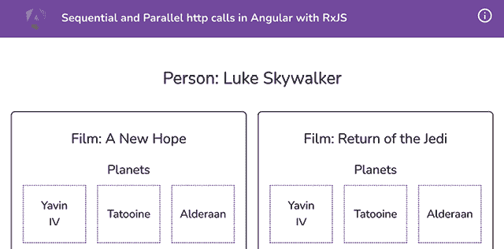

    图 5.1：运行在 http://localhost:4200 的 rx-seq-parallel-http 应用程序

现在我们已经运行了应用程序，我们将继续进行食谱的步骤。

## 如何做到这一点…

我们有一个使用 Star Wars API (swapi) 从星球大战中获取人物及其参与的电影的 Angular 应用程序。所有这些操作都通过大量的 HTTP 请求完成，而我们的代码到目前为止完全是垃圾。这是因为我们首先显示加载器，但在我们检索所有数据之前就将其隐藏了。此外，如果你不断刷新页面，你会看到电影序列每次都会改变。因此，我们看到了 UI 跳动很多。我们希望的方法是先获取人物，然后获取所有电影，然后隐藏加载器。我们将使用 RxJS 实现这种方法。让我们开始吧：

1.  首先，我们将避免使用`setTimeout`函数，而是依赖于在`1500ms`内获取到人员数据。我们更愿意将此操作移至`subscribe`块内部，并且也会适当地处理错误。按照以下方式更新`app.component.ts`中的`fetchData`方法：

    ```js
    fetchData() {
        this.loadingData = true;
        this.swapi.fetchPerson('1').subscribe({
          next: (person) => {
              this.person = person;
              this.person.filmObjects = [];
              this.person.films.forEach((filmUrl) => {
                this.swapi.fetchFilm(filmUrl).subscribe({
                  next: (film) => {
                    this.person.filmObjects.push(film);
                    this.loadingData = false;
                  },
                  error: (err) => {
                    console.error('Error while fetching film',
                      err);
                  },
                });
              });
          },
          error: (err) => {
            console.error('Error while fetching person', err);
          }
        });
      } 
    ```

    这存在一个潜在问题。那就是，一旦检索到第一部电影，加载器就会隐藏，因为我们把`this.loadingData`设置为`false`。

1.  现在，我们将使用`pipe`方法添加`mergeMap`操作符，以便以后能够链式调用。目前，我们只需将添加`filmObjects`数组到`this.person`对象的代码移至`mergeMap`回调中。现在按照以下方式更新`fetchData`方法：

    ```js
    ...
    **import** **{ mergeMap,** **of** **}** **from****'****rxjs'****;**
    ...
      fetchData() {
        this.loadingData = true;
        this.swapi
          .fetchPerson('1')
          .pipe(
            **mergeMap****((person) => {**
    **const** **personObj = {**
    **...person,**
    **filmObjects****: [],**
    **};**
    **return** **of****(personObj);**
    **})**
    **)**
          .subscribe({
            next: (person) => {
              this.person = person;
              this.person.films.forEach((filmUrl) => {
                this.swapi.fetchFilm(filmUrl).subscribe({
                  next: (film) => {
                    this.person.filmObjects.push(film);
                    this.loadingData = false;
                  },
                  error: (err) => {
                    console.error('Error while fetching film', err);
                  },
                });
              });
            },
            error: (err) => {
              console.error('Error while fetching person', err);
            },
          });
      } 
    ```

    注意到 UI 变得*稍微好一些*。加载器仍然会在从服务器检索到任何一部电影后立即隐藏。然而，我们希望在所有电影都检索完毕后隐藏加载器。此外，电影的顺序仍然不可预测。

1.  现在，我们将使用`forkJoin`函数并行地对电影进行 API 调用，并等待合并后的响应。我们这样做而不是使用`of`操作符，因为`of`操作符只是从`mergeMap`函数传递电影 URL。按照以下方式更新`fetchData`方法，并更新顶部的导入：

    ```js
    import { **forkJoin,** mergeMap, of **(//<-- remove of)** } from 'rxjs';
    ...
      fetchData() {
        this.loadingData = true;
        this.swapi
          .fetchPerson('1')
          .pipe(
            mergeMap((person) => {
              const personObj = {
                ...person,
                filmObjects: [],
              };
              this.person = personObj;
              **return** **forkJoin****(**
    **this****.person.films.****map****((filmUrl) =>**
    **this****.swapi****.****fetchFilm****(filmUrl))**
    **);**
            }),
            catchError((err) => {
              console.error('Error while fetching films', err);
              alert('Could not get films. Please try again.');
              return of([]);
            })
          )
          .subscribe({
            next: (films) => {
              this.person.filmObjects = films;
              this.loadingData = false;
            },
            error: (err) => {
              console.error('Error while fetching person', err);
            },
          });
      } 
    ```

哇哦！现在如果你刷新应用，你会注意到两件事。首先，加载器只有在所有数据都检索完毕后才会停止。其次，电影的顺序总是相同（并且正确）。

现在你已经完成了食谱，让我们继续到下一部分，了解这一切是如何工作的。

## 它是如何工作的...

`mergeMap` 操作符允许我们通过从其回调中返回一个 **可观察对象** 来链式连接可观察对象。您可以将它想象成我们链式调用 `Promise.then`，但这是针对可观察对象的。一个流行的替代方案是 `switchMap` 操作符，它的工作方式类似于 `mergeMap` 操作符，但在第一次调用/执行完成之前被调用两次或更多次时，也会取消之前的调用/执行。我们首先移除了 `setTimeout` 函数（将这些情况放入代码中通常没有意义，因为结果在时间上并不总是可预测的），并将获取人物信息的逻辑移动到获取人物信息的 `subscribe` 块中。我们还使用了 `of` 操作符从 `mergeMap` 函数的回调中返回 `personObject` 对象。`mergeMap` 函数用于将可观察对象链式连接起来，在我们的上下文中，它可以链式等待一个 HTTP 调用完成，以便我们可以执行其他的调用。在 *步骤 3* 中，我们打算并行执行所有人物的电影的多个 HTTP 调用。我们使用 `forkJoin` 操作符来完成这项工作，它接受一个可观察对象的数组。在这种情况下，这些可观察对象是针对每部电影的 HTTP 调用。`forkJoin` 还使得等待所有并行调用完成并触发 `subscribe` 块的回调成为可能。`forkJoin` 还做的一件事是，它以与可观察对象相同的顺序提供响应的数组形式给我们。这使得响应可预测，并且我们总是在 UI 上显示相同的数据。

## 参见

+   *捕捉点游戏*—RxJS 文档 ([`www.learnrxjs.io/learn-rxjs/recipes/catch-the-dot-game`](https://www.learnrxjs.io/learn-rxjs/recipes/catch-the-dot-game))

+   RxJS `mergeMap` 操作符文档 ([`www.learnrxjs.io/learn-rxjs/operators/transformation/mergemap`](https://www.learnrxjs.io/learn-rxjs/operators/transformation/mergemap))

+   RxJS `merge` 操作符文档 ([`www.learnrxjs.io/learn-rxjs/operators/combination/forkjoin`](https://www.learnrxjs.io/learn-rxjs/operators/combination/forkjoin))

# 监听多个可观察流

在这个菜谱中，我们将使用 `combineLatest` 操作符一次性监听多个可观察流。使用此操作符将导致输出为一个数组，合并所有流。当您希望从所有流中获取最新的输出并合并到一个订阅中时，这种方法是合适的。

## 准备中

我们将要工作的应用程序位于克隆的仓库中的 `start/apps/chapter05/rx-multiple-streams` 目录下：

1.  在您的代码编辑器中打开代码仓库。

1.  打开终端，导航到代码仓库目录，并运行以下命令以启动项目：

    ```js
    npm run serve rx-multiple-streams 
    ```

    这应该在新的浏览器标签页中打开应用程序，您应该看到以下内容：

    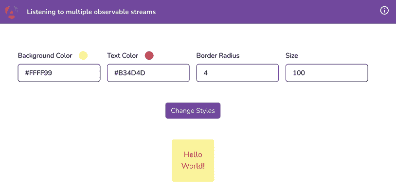

    图 5.2：在 http://localhost:4200 上运行的 rx-multiple-streams 应用程序

现在我们已经在本地运行了应用，让我们在下一节中查看食谱的步骤。

## 如何做到这一点...

对于这个食谱，我们有一个显示盒子的应用。这个盒子有一个大小（宽度和高度）、边框半径、背景颜色和文本颜色。它还有四个使用**Reactive Forms** API 来修改所有这些因素的输入。目前，即使输入发生变化，我们也必须手动点击按钮来应用更改。如果我们能够订阅输入的变化并立即更新盒子，而不需要用户点击按钮，那会怎么样？这正是我们要在这里做的：

1.  我们将首先创建一个名为`listenToInputChanges`的方法。我们将创建一个我们想要工作的控件数组。更新`home.component.ts`的代码，如下所示：

    ```js
    ...
    export class HomeComponent implements OnInit {
      ...
      ngOnInit() {
        this.applyChanges();
      }
      **listenToInputChanges****() {**
    **const****controls****:** **AbstractControl****[] = [**
    **this****.****boxForm****.****controls****.****size****,**
    **this****.****boxForm****.****controls****.****borderRadius****,**
    **this****.****boxForm****.****controls****.****textColor****,**
    **this****.****boxForm****.****controls****.****backgroundColor****,**
    **];**
    **}**
      ...
    } 
    ```

1.  现在，我们将遍历控件，给它们赋予初始值，这样当 Observable 流被订阅时，它们就有值可以工作了。进一步更新`listenToInputChanges`方法，如下所示：

    ```js
    **import** **{ startWith }** **from****'rxjs'****;**
    ...
    export class HomeComponent implements OnInit {
    ...
    listenToInputChanges() {
        const controls: AbstractControl[] = [...];
        controls.map((control) =>
          control.valueChanges.pipe(**startWith****(control.value)**)
        );
      }
    } 
    ```

1.  现在，我们将用名为`boxStyles$`的`Observable`替换`boxStyles`属性。然后，我们将每个表单控制的`valueChanges`流包裹在`combineLatest`操作符中，以将它们连接起来。最后，我们将连接流的输出分配给`boxStyles$`Observable。更新`home.component.ts`文件，如下所示：

    ```js
    ...
    import { **Observable**, **combineLatest**, startWith} from 'rxjs';
    ...
    export class HomeComponent implements OnInit, OnDestroy {
      ...
      **boxStyles$!:** **Observable****<****BoxStyles****>;**
            ...
      listenToInputChanges() {
        **this****.****boxStyles$** **=** **combineLatest****(**
          controls.map((control) =>
            control.valueChanges.pipe(startWith(control.value))
          );
        **);**
    **}**
      ...
    } 
    ```

1.  现在我们将在组合流上使用`map`操作符和`pipe`来将其映射到`BoxStyle`类型值。更新`home/home.component.ts`文件中的`listenToInputChanges`方法，如下所示：

    ```js
    import { combineLatest, **map**, Observable, startWith } from 'rxjs';
    export class HomeComponent implements OnInit {
      listenToInputChanges() {
        const controls: AbstractControl[] = [...];
        this.boxStyles$ = combineLatest(...)**.****pipe****(**
    **map****(****(****[size, borderRadius, textColor,**
    **backgroundColor]****) =>** **{**
    **return** **{** **width****:** **`****${size}****px`****,** **height****:** **`****${size}****px`****,**
    **backgroundColor****: backgroundColor,**
    **color****: textColor,**
    **borderRadius****:** **`****${borderRadius}****px`****,**
    **};**
    **})**
    **);**
      }
    } 
    ```

1.  我们需要从`home.component.ts`文件中移除`setBoxStyles`和`applyChanges`方法以及`applyChanges`方法的用法。更新文件，如下所示：

    ```js
    export class HomeComponent implements OnInit {
      ...
      ngOnInit() {
        **this****.****listenToInputChanges****();** **//← Add this call**
        ...
        **this****.****applyChanges****();** **//← Remove this call**
    **}**
    **...**
    **setBoxStyles****(****...****) {...}** **//← Remove this method**
    **applyChanges****() {...}** **//← Remove this method**
      ...
    } 
    ```

1.  我们还需要从模板中移除`applyChanges`方法的用法。从`home.component.html`文件中的`<form>`元素移除`(ngSubmit)`处理器，使其看起来像这样：

    ```js
    <div class="home" [formGroup]="boxForm"
     **(****ngSubmit****)=****"applyChanges()"****<!--← Remove this-->**
      ...
    </div> 
    ```

1.  我们还需要从`home.component.html`模板中移除`submit-btn-container`元素，因为我们不再需要它了。从文件中删除以下部分：

    ```js
    <div class="row submit-btn-container" **<!--← Remove this element -->**
    <button class="btn btn-primary" type="submit" 
        (click)="applyChanges()">Change Styles</button>
    </div> 
    ```

1.  现在我们可以使用`boxStyles$`Observable 了，让我们在模板中使用它，即`home.component.html`文件，而不是`boxStyles`属性：

    ```js
     ...
      **<****div****class****=****"row"** *******ngIf****=****"boxStyles$ | async as**
    **boxStyles"****>**
    **<****div****class****=****"box"** **[****ngStyle****]=****"boxStyles"****>**
    **<****div****class****=****"box__text"****>**
    **Hello World!**
    **</****div****>**
    **</****div****>**
    **</****div****>**
      ... 
    ```

哇！如果你刷新应用，你应该能看到带有默认样式的盒子出现。如果你更改了任何选项，你也会看到相应的变化。

恭喜你完成了这个食谱。你现在已经是使用`combineLatest`操作符处理多个流的专家了。查看下一节以了解它是如何工作的。

## 它是如何工作的...

Reactive Forms 的美丽之处在于，它们比常规的 `ngModel` 绑定或模板驱动的表单提供了更多的灵活性。对于每个表单控件，我们可以订阅其 `valueChanges` 可观察对象，每当输入改变时，它都会接收到一个新的值。因此，我们不需要依赖于 **提交** 按钮的点击，而是直接订阅每个 **表单控件** 的 `valueChanges` 属性。在常规场景中，这会导致四个不同的流对应四个输入，这意味着我们需要处理四个订阅并确保取消订阅它们。这就是 `combineLatest` 操作符发挥作用的地方。我们使用了 `combineLatest` 操作符将这四个流合并为一个，这意味着我们只需要在组件销毁时取消订阅一个流。但是，嘿！记得如果我们使用 `async` 管道，我们就不需要这样做吗？这正是我们做的。我们从 `home.component.ts` 文件中移除了订阅，并使用 `pipe` 方法与 `map` 操作符。`map` 操作符根据我们的需求转换数据，然后将转换后的数据返回设置到 `boxStyles$` 可观察对象。最后，我们在模板中使用 `async` 管道订阅 `boxStyles$` 可观察对象，并将其值作为 `[ngStyle]` 分配给我们的盒子元素。由于 `valueChanges` 是一个 `Subject` 而不是一个 `ReplaySubject`，我们还通过 `startWith` 将 `valueChanges` 管道化，以提供一个初始值。如果我们不使用 `startWith`，盒子将不会显示，除非所有输入至少手动更改一次值。试试看！

## 参见

+   `combineLatest` 操作符文档（[`www.learnrxjs.io/learn-rxjs/operators/combination/combinelatest`](https://www.learnrxjs.io/learn-rxjs/operators/combination/combinelatest)）

+   `combineLatest` 操作符的视觉表示（[`rxjs-dev.firebaseapp.com/api/index/function/combineLatest`](https://rxjs-dev.firebaseapp.com/api/index/function/combineLatest)）

# 取消订阅流以避免内存泄漏

流式处理很有趣，它们很棒。当你完成这一章时，你会对 RxJS 和流有更多的了解。一个现实是，当不小心使用流时，会遇到一些未预见的问题。使用流时犯的最大错误之一是在不再需要它们时没有取消订阅，在这个菜谱中，你将学习如何取消订阅流以避免 Angular 应用中的内存泄漏。

## 准备工作

我们将要工作的应用程序位于克隆的仓库中的 `start/apps/chapter05/rx-unsubscribing-streams`：

1.  在你的代码编辑器中打开代码仓库。

1.  打开终端，导航到代码仓库目录，并运行以下命令以启动项目：

    ```js
    npm run serve rx-unsubscribing-streams 
    ```

    这应该在新的浏览器标签页中打开应用程序，你应该看到以下内容：

    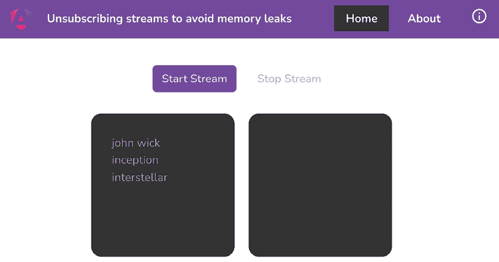

    图 5.3：在 http://localhost:4200 上运行的 rxjs-unsubscribing-streams 应用程序

现在我们已经在本地运行了应用，让我们在下一节中查看食谱的步骤。

## 如何做到这一点…

我们目前有一个有两个路由的应用——即**主页**和**关于**。这是为了向你展示未处理的订阅可能会在应用中引起内存泄漏。默认路由是**主页**，在`HomeComponent`类中，我们使用`interval`操作符函数处理一个输出数据的流：

1.  点击**开始流**按钮，你应该会看到流正在发出值。

1.  然后，通过点击页眉（右上角）的**关于**按钮导航到**关于**页面，然后返回到**主页**页面。

    你看到什么奇怪的吗？没有？一切看起来都正常，对吧？嗯，并不完全是这样。

1.  为了查看我们是否有未处理的订阅，让我们在`home.component.ts`文件中的`startStream`方法内放置`console.log`——具体来说，在`subscribe`函数的块内，如下所示：

    ```js
    ...
    export class HomeComponent implements OnInit {
      ...
      startStream() {
        const streamSource = interval(1500);
        this.subscription = streamSource.subscribe((input) => {
          this.outputStreamData.push(input);
          **console****.****log****({ input });**
        });
      }
      stopStream() {...}
    } 
    ```

    如果你现在按照*步骤 1* 中提到的步骤操作，你将在控制台上看到以下输出，如图*图 5.4*所示：

    ![img/B18469_05_04.png]

    图 5.4：在关于页面上间隔发出值

    想要更多乐趣吗？尝试多次执行*步骤 1*，甚至一次都不刷新页面。你将看到的将是*混乱！*

1.  因此，为了解决这个问题，我们将使用最简单的方法——即在用户离开路由时取消订阅流。让我们为它实现`ngOnDestroy`生命周期方法，如下所示：

    ```js
    import { Component, **OnDestroy** } from '@angular/core';
    ...
    @Component({...})
    export class HomeComponent implements **OnDestroy** {
      ...
      startStream() {...}
      **ngOnDestroy****() {**
    **this****.****stopStream****();**
    **}**
    stopStream() {...}
    } 
    ```

太好了！如果你再次按照*步骤 1* 的说明操作，你会发现一旦你离开**主页**页面，控制台上就没有进一步的日志了，而且我们的应用现在没有未处理的流导致内存泄漏。阅读下一节以了解它是如何工作的。

## 它是如何工作的…

当我们创建一个`Observable/stream`并订阅它时，RxJS 会自动将我们提供的`subscribe`函数块作为处理程序添加到`Observable`。所以，每当`Observable`发出值时，我们的方法都应该被调用。有趣的部分是，Angular 不会在组件卸载或你离开路由时自动销毁那个订阅/处理程序。这是因为可观察的核心是**RxJS**，而不是 Angular；因此，这不是 Angular 的责任来处理它。

Angular 提供了一些生命周期方法，我们使用了`OnDestroy` `(ngOnDestroy)`方法。因此，我们使用了`ngOnDestroy`方法来调用`stopStream`方法，以便在用户离开页面时立即销毁订阅。这是可能的，因为当我们离开一个路由时，Angular 会销毁该路由，因此我们可以执行我们的`stopStream`方法。

## 还有更多…

在一个复杂的 Angular 应用中，可能会出现一个组件中有多个订阅的情况，当组件被销毁时，你希望一次性清理所有这些订阅。同样，你可能希望根据某些事件/条件来取消订阅，而不是使用 `OnDestroy` 生命周期。以下是一个例子，其中你手头有多个订阅，并且希望在组件销毁时一起清理它们：

```js
startStream() {
    const streamSource = interval(1500);
    **const** **secondStreamSource =** **interval****(****3000****);**
**const** **fastestStreamSource =** **interval****(****500****);**
    streamSource.subscribe((input) => {
      this.outputStreamData.push(input);
      **console****.****log****(****'first stream output'****, input);**
    });
    **secondStreamSource.****subscribe****(****input** **=>** **{**
**this****.****outputStreamData****.****push****(input);**
**console****.****log****(****'second stream output'****, input)**
**});**
**fastestStreamSource.****subscribe****(****input** **=>** **{**
**this****.****outputStreamData****.****push****(input);**
**console****.****log****(****'fastest stream output'****, input)**
**});**
  }
  stopStream() {
    **// remove code from here**
  } 
```

注意，我们不再将 `streamSource` 中的 **订阅** 保存到 `this.subscription` 中，并且也从 `stopStream` 方法中移除了代码。这样做的原因是我们没有为每个订阅设置单独的属性/变量。相反，我们将有一个单独的变量来处理。让我们看看以下步骤来开始操作：

1.  首先，我们在 `HomeComponent` 类中创建一个名为 `isStreamActive` 的属性：

    ```js
    import { Component, OnDestroy } from '@angular/core';
      ...
    export class HomeComponent implements OnDestroy {
      isStreamActive = true;
      ...
    } 
    ```

1.  现在，我们将从 `rxjs/operators` 中导入 `takeWhile` 操作符，如下所示：

    ```js
    import { Component, OnInit, OnDestroy } from '@angular/core';
    ...
    import { interval, Subscription, **takeWhile** } from 'rxjs'; 
    ```

1.  我们现在将使用 `takeWhile` 操作符与每个流一起使用，使它们仅在 `isStreamActive` 属性设置为 `true` 时工作。由于 `takeWhile` 接受一个 `predicate` 方法，它应该看起来像这样：

    ```js
    startStream() {
        ...
        streamSource
          **.****pipe****(****takeWhile****(****() =>****this****.****isStreamActive****))**
          .subscribe(input => {...});
        secondStreamSource
          **.****pipe****(****takeWhile****(****() =>****this****.****isStreamActive****))**
          .subscribe(input => {...});
        fastestStreamSource
          **.****pipe****(****takeWhile****(****() =>****this****.****isStreamActive****))**
          .subscribe(input => {...});
      } 
    ```

    如果你现在点击 **开始流** 按钮在 **主页** 上，你仍然看不到任何输出或日志，因为 `isStreamActive` 属性仍然是 **未定义** 的。

1.  要使流工作，我们在 `startStream` 方法中将 `isStreamActive` 属性设置为 `true`。代码应该看起来像这样：

    ```js
     ngOnDestroy() {
        this.stopStream();
      }
      startStream() {
      **isStreamActive =** **true****;**
    const streamSource = interval(1500);
        const secondStreamSource = interval(3000);
        const fastestStreamSource = interval(500);
        ...
      } 
    ```

    在这一步之后，如果你现在尝试开始流并离开页面，你仍然会看到流的问题——也就是说，它们没有被取消订阅。

1.  要一次性取消所有流的订阅，我们在 `stopStream` 方法中将 `isStreamActive` 的值设置为 `false`，如下所示：

    ```js
     stopStream() {
        **this****.****isStreamActive** **=** **false****;**
      } 
    ```

1.  最后，更新模板以根据 `isStreamActive` 属性而不是 `subscription` 来处理哪个按钮被禁用。按照以下方式更新 `home.component.html` 文件：

    ```js
     <div class="home">
    <div class="buttons-container">
    <button [disabled]="**isStreamActive**" class="btn btn-
    primary" (click)="startStream()">Start
              Stream</button>
    <button [disabled]="**!isStreamActive**" class="btn
    btn-dark" (click)="stopStream()">Stop
              Stream</button>
    </div>
          ...
      </div> 
    ```

然后，当你在流正在发出值时离开路由，流将立即停止。哇！

## 参见

+   了解 RxJS 订阅 ([`www.learnrxjs.io/learn-rxjs/concepts/rxjs-primer#subscription`](https://www.learnrxjs.io/learn-rxjs/concepts/rxjs-primer#subscription))

+   `takeWhile` 操作符文档 ([`www.learnrxjs.io/learn-rxjs/operators/filtering/takewhile`](https://www.learnrxjs.io/learn-rxjs/operators/filtering/takewhile))

# 使用 Angular 的异步管道自动取消订阅流

如你在前面的食谱中所学，取消订阅你订阅的流是至关重要的。如果我们有一种更简单的方法在组件销毁时取消订阅它们——也就是说，让 Angular 以某种方式处理它——会怎样？在这个食谱中，你将学习如何使用 Angular 的`async`管道与可观察对象直接绑定流中的数据到 Angular 模板，而不是需要在`*.component.ts`文件中进行订阅。

## 准备工作

我们将要工作的应用程序位于克隆的仓库中的`start/apps/chapter05/ng-async-pipe`：

1.  在你的代码编辑器中打开代码仓库。

1.  打开终端，导航到代码仓库目录，并运行以下命令以运行项目：

    ```js
    npm run serve ng-async-pipe 
    ```

    这应该在新的浏览器标签页中打开应用程序，你应该看到以下内容：

    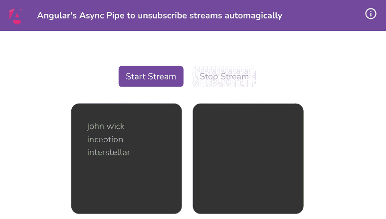

    图 5.5：运行在 http://localhost:4200 上的 ng-async-pipe 应用程序

现在我们已经在本地上运行了应用程序，接下来让我们看看下一节中食谱的步骤。

## 如何做到这一点...

我们目前拥有的应用程序有三个流/可观察对象在不同的间隔观察值。我们依赖于`isStreamActive`属性来保持订阅活跃或当属性设置为`false`时停止它。我们将删除`takeWhile`的使用，并设法让一切工作得和现在一样。

1.  首先，在`HomeComponent`类中添加一个名为`streamOutput$`的类型为`Observable`的属性。按照以下方式更新`home.component.ts`文件中的代码：

    ```js
    ...
    import { interval, **Observable**, takeWhile } from 'rxjs';
    ...
    export class HomeComponent implements OnDestroy {
      ...
      isStreamActive!: boolean;
      **streamsOutput$!:** **Observable****<****number****>;**
    constructor() { }
      ...
    } 
    ```

1.  我们现在将所有流合并以输出单个输出——即`outputStreamData`数组。我们将从`startStream`方法中删除所有现有的`pipe`和`subscribe`函数，因此代码现在应该看起来像这样：

    ```js
    ...
    import { interval, **merge**, **scan**, Observable, takeWhile } from 'rxjs';
    ...
    export class HomeComponent implements OnDestroy {
      ...
      startStream() {
        ...
        const fastestStreamSource = interval(500);
        **this****.****streamsOutput$** **=** **merge****(**
    **streamSource,**
    **secondStreamSource,**
    **fastestStreamSource**
    **).****pipe****(**
    **scan****(****(****acc, next****) =>** **{**
    **return** **[...acc, next];**
    **}, []** **as****number****[])**
    **);**
      }
      ...
    } 
    ```

1.  由于我们希望在点击**停止流**按钮时停止流，我们将在流中使用`takeWhile`操作符来与流一起工作，只有在点击**开始流**按钮时才发出值，并在点击**停止流**按钮时停止。按照以下方式更新`home.component.ts`中的`startStream`方法：

    ```js
    startStream() {
        ...
        this.streamsOutput$ = merge(...).pipe(
          **takeWhile****(****() =>****this****.****isStreamActive****),**
    scan((acc, next) => {
            return [...acc, next];
          }, [] as number[])
        **)**
      } 
    ```

1.  删除`ngOnDestroy`方法，因为当我们将离开组件（转到另一个路由）时，我们的流将自动取消订阅。这是因为我们正在使用`async`管道，Angular 本身在使用`async`管道时会为我们处理订阅和取消订阅。此外，我们应该删除`implements OnDestroy`语句和`OnDestroy`导入。

1.  最后，修改`home.component.html`中的模板，以使用`streamOutput$`可观察对象和`async`管道来循环输出数组：

    ```js
     <div class="output-stream">
    <div class="input-stream__item" *ngFor="let item of
    **streamsOutput$ | async**">
            {{item}}
          </div>
    </div> 
    ```

1.  为了验证在组件销毁时订阅确实被销毁，让我们在`startStream`方法中的`tap`操作符内添加`console.log`，如下所示：

    ```js
    import { ..., takeWhile, **tap** } from 'rxjs';
    startStream() {
        ...
        this.streamsOutput$ = merge(...).pipe(
          takeWhile(...),
          scan(...)**,**
    **tap****(****(****output****) =>****console****.****log****(****'output'****, output))**
        )
      } 
    ```

哈哈！随着这个更改，你可以尝试刷新应用；离开**主页**路由，你会看到一旦你离开主页，控制台日志就会停止。此外，你还可以开始和停止流以在控制台看到输出。你对刚刚通过移除所有额外代码所得到的结果感到满意吗？我当然满意。在下一节中，我们将看到这一切是如何工作的。

## 它是如何工作的…

Angular 的`async`管道会在组件销毁时自动销毁/取消订阅，这为我们提供了一个很好的机会在可能的地方使用它。在菜谱中，我们基本上使用`merge`操作符组合了所有流。有趣的部分是，对于`streamsOutput$`属性，我们想要一个输出数组的可观察对象，我们可以遍历它。然而，合并流只会将它们组合起来，并发出任何流发出的最新值。因此，我们添加了一个带有`scan`操作符的`pipe`函数，以获取组合流的最新输出并将其添加到之前发出的所有输出数组中。这有点像 JavaScript 数组中的`reduce`函数。

有趣的事实——流在未被订阅的情况下不会发出任何值。“*但是 Ahsan，我们没有订阅流，我们只是合并并映射了数据。订阅在哪里？*”很高兴你问了。Angular 的`async`管道会自动订阅流本身，这会触发`console.log`，这是我们使用`tap`函数在*步骤 6*中添加的。

重要提示

`async`管道有一个限制，就是你不能在组件销毁之前停止订阅。对于想要有条件地订阅和取消订阅的情况，你可能需要选择像`takeWhile/takeUntil`这样的操作符，或者当组件销毁时自己使用常规的`unsubscribe`函数。

## 参见

+   Angular `async`管道文档([`angular.io/api/common/AsyncPipe`](https://angular.io/api/common/AsyncPipe))

# 使用 map 操作符转换数据

在 Web 应用中制作 API/HTTP 调用时，通常服务器不会以易于直接渲染到 UI 的形式返回数据。我们通常需要将服务器接收到的数据进行某种转换，以便将其映射到我们的 UI 可以处理的内容。在这个菜谱中，你将学习如何使用`map`操作符来转换 HTTP 调用的响应。

## 准备工作

我们将要工作的应用位于克隆的仓库中的`start/apps/chapter05/rx-map-operator`目录内：

1.  在你的代码编辑器中打开代码仓库。

1.  打开终端，导航到代码仓库目录，并运行以下命令以启动项目：

    ```js
    npm run serve rx-map-operator 
    ```

    这应该在新的浏览器标签页中打开应用，你应该看到以下内容：

    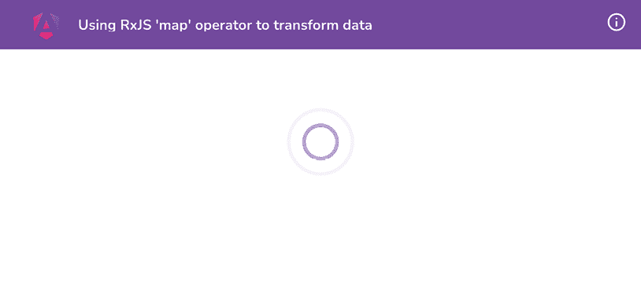

    图 5.6：运行在 http://localhost:4200 的 rx-map-operator 应用

现在我们已经在本地上运行了应用，让我们在下一节中查看菜谱的步骤。

## 如何操作…

我们的应用模板（`app.component.html`）已经设置好了。同样，我们的`app.component.ts`文件和所需的`appData`数据结构也已经设置。

1.  我们将首先在`swapi.service.ts`文件中创建一个方法来获取数据。我们希望只有一个函数能够从不同的 API 调用中获取数据，将其合并，并返回。按照以下方式更新文件：

    ```js
    ...
    import { delay, forkJoin, **Observable** } from 'rxjs';
    import { IFilm, **IPerson** } from './interfaces';
    ...
    export class SwapiService {
      ...
      **fetchData****(****personId****:** **string****):** **Observable****<{****person****:**
    **IPerson****}> {**
    **}**
    fetchPerson(id: string) {...}
      fetchPersonFilms(films: string[]) {...}
    } 
    ```

    *你将看到 TypeScript 对我们很生气。不用担心，我们会在适当的时候让它高兴起来*。

1.  让我们在`fetchData`函数中添加以下代码，首先获取人物，然后获取该人物的影片：

    ```js
    ...
    export class SwapiService {
      ...
      fetchData(personId: string): Observable<{person: IPerson}> {
        let personInfo: IPerson;
        **return****this****.****fetchPerson****(personId)**
    **.****pipe****(**
    **mergeMap****(****(****person****) =>** **{**
    **personInfo = person;**
    **return****this****.****fetchPersonFilms****(person.****films****);**
    **})**
    **)**
    **}**
      ...
    } 
    ```

    现在我们可以在收到影片后决定要做什么。

1.  我们将遍历`films` HTTP 调用返回的响应，并将其添加到`personInfo`对象中。按照以下方式更新`swapi.service.ts`文件：

    ```js
    ...
    import { delay, forkJoin, **map**, mergeMap, Observable } from 'rxjs';
    ...
    export class SwapiService {
     ...
      fetchData(personId: string): Observable<{ person: IPerson }> {
        let personInfo: IPerson;
        return this.fetchPerson(personId).pipe(
          mergeMap((person) => {
            personInfo = person;
            return this.fetchPersonFilms(person.films);
          })**,**
    **map****(****(****films: IFilm[]****) =>** **{**
    **personInfo.****filmObjects** **= films;**
    **return** **{**
    **person****: personInfo,**
    **};**
    **})**
        );
      }
      ...
    } 
    ```

1.  最后，让我们在`app.component.ts`文件中使用`SwapiService`的`fetchData`方法。按照以下方式更新文件中的`fetchData`方法，并确保从文件中删除未使用的依赖项：

    ```js
    ...
    export class AppComponent implements OnInit {
      ...
      fetchData() {
        this.loadingData = true;
        **this****.****swapi****.****fetchData****(****'1'****).****subscribe****(****(****response****) =>** **{**
    **this****.****appData** **= response;**
    **this****.****loadingData** **=** **false****;**
    **});**
      }
    } 
    ```

    是的！如果你现在刷新应用，你会注意到数据正在视图中显示：

    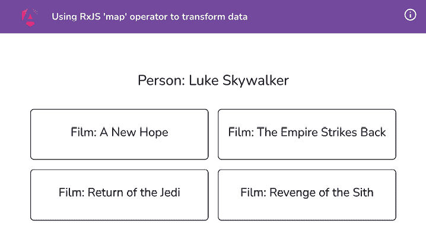

    图 5.7：显示从 swapi 接收到的数据的 UI

现在你已经完成了配方，请查看下一节了解它是如何工作的。

## 它是如何工作的…

`map`运算符是所有时间中最常用的 RxJS 运算符之一。特别是在 Angular 中，当我们进行 HTTP 调用时。在这个配方中，我们的目标是尽可能少地在`app.component.ts`文件中做工作。这是因为作为社区采纳的实践之一，组件应该从服务请求数据，服务应该以这种方式提供数据，以便它可以绑定到 UI 变量。Angular 文档也鼓励将组件的代码保持尽可能小。通常，将代码分布到不同的层，即组件、服务、管道等，也是一个好主意。这是为了能够轻松地扩展应用程序，有更好的测试可能性，并且能够轻松地用完全不同的事物替换层。因此，我们在`SwapiService`类中创建了`fetchData`方法，使用`fetchPerson`和`fetchPersonFilms`方法首先进行 HTTP 调用，然后我们使用了`map`运算符将数据转换成组件/UI 期望的确切数据结构。

## 参见

+   `map`运算符文档（[`www.learnrxjs.io/learn-rxjs/operators/transformation/map`](https://www.learnrxjs.io/learn-rxjs/operators/transformation/map))

# 使用 switchMap 和 debounceTime 运算符以及自动完成功能以获得更好的性能

对于许多应用程序，我们具有用户键入时搜索内容等特性。这对于用户体验（**UX**）来说非常好，因为用户不需要按按钮就可以进行搜索。然而，如果我们每次按键都向服务器发送 HTTP 调用，这将导致发送大量的 HTTP 调用，我们无法知道哪个 HTTP 调用会首先完成；因此，我们无法确定是否会在视图中显示正确的数据。在本食谱中，您将学习如何使用`switchMap`操作符取消最后一个订阅并创建一个新的订阅。这将导致取消之前的 HTTP 调用，并保留一个 HTTP 调用——最后一个。我们将使用`debounceTime`操作符等待输入空闲后再尝试进行调用。

## 准备工作

我们将要工作的应用程序位于克隆的仓库中的`start/apps/chapter05/rx-switchmap-operator`目录内：

1.  在您的代码编辑器中打开代码仓库。

1.  打开终端，导航到代码仓库目录，并运行以下命令以运行项目：

    ```js
    npm run serve rx-switchmap-operato 
    ```

    这应该在新的浏览器标签页中打开应用程序，您应该看到以下内容：

    

    图 5.8：在 http://localhost:4200 上运行的 rx-switchmap-operator 应用程序

现在我们已经在本地上运行了应用程序，打开**Chrome DevTools**并转到**网络**标签页。在搜索输入中键入`wolf`，您会看到向 API 服务器发送了四个调用，如下所示：

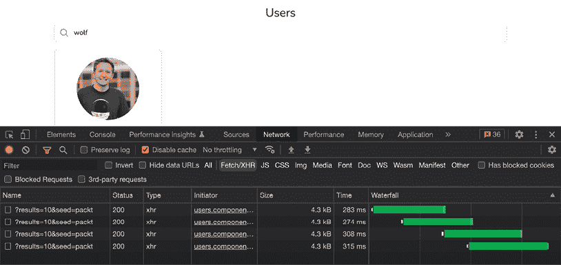

图 5.9：为每次输入更改发送单独的 HTTP 调用

## 如何做到这一点...

您可以在主页上的搜索框中开始键入以查看过滤后的用户，如果您看到**网络**标签页，您会注意到每当输入更改时，我们都会发送一个新的 HTTP 调用。让我们通过使用`switchMap`操作符来避免在每次按键时发送调用。

1.  首先，在`users/users.component.ts`文件中从`rxjs/operators`导入`switchMap`操作符，如下所示：

    ```js
    ...
    import { mergeMap, startWith, takeWhile, **switchMap** } from 'rxjs/operators'; 
    ```

1.  我们现在将修改对`username`表单控制的订阅——具体来说，是使用`switchMap`操作符来调用`this.userService.searchUsers(query)`方法的`valueChanges`可观察对象。这返回一个包含 HTTP 调用结果的`Observable`。代码应该看起来像这样：

    ```js
    ngOnInit() {
        ...
        this.searchForm.controls['username'].valueChanges
          .pipe(
            startWith(''),
            takeWhile(() => this.componentAlive),
            **switchMap**((query) =>
    this.userService.searchUsers(query))
          )
          .subscribe((users) => {...});
      } 
    ```

    如果您现在刷新应用程序，打开**Chrome DevTools**，在快速输入`wolf`时检查网络类型，您会看到所有之前的调用都被取消，我们只有最新的 HTTP 调用成功：

    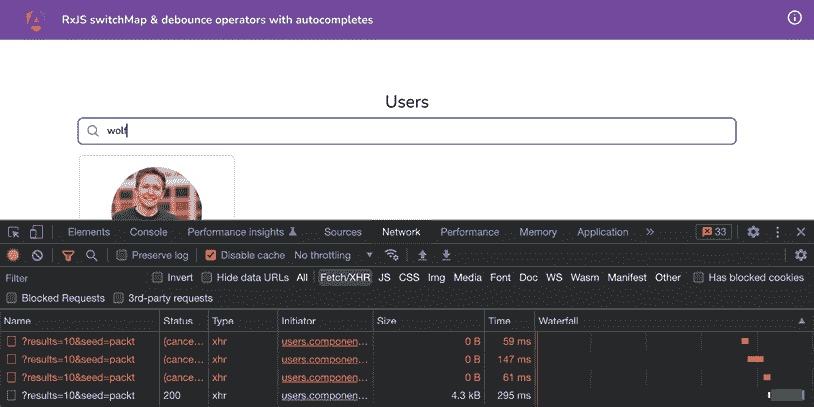

    图 5.10：switchMap 取消之前的 HTTP 调用

    好吧，看起来不错，但`backend/api`端点仍然接收那些调用。

1.  现在我们将使用`debounceTime`操作符等待搜索输入空闲后再开始执行调用。按照以下方式更新`users.component.ts`文件：

    ```js
    ...
    import { **debounceTime, ..**.} from 'rxjs/operators';
    ...
    export class UsersComponent implements OnInit {
      ...
      ngOnInit() {
        ...
        this.searchForm.controls['username'].valueChanges
          .pipe(
            startWith(''),
            **debounceTime****(****500****),**
    takeWhile(() => this.componentAlive),
            switchMap((query) =>
    this.userService.searchUsers(query))
          )
          .subscribe((users) => {...});
      }
    } 
    ```

    *图 5.11*显示，即使在搜索输入中键入四个字母之后，也只向服务器发送了一个调用：

    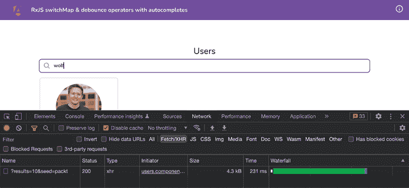

    图 5.11：等待输入空闲的 debounceTime

哇！我们现在只有一个调用会成功，处理数据，并最终显示在视图中；请看下一节了解它是如何工作的。

## 它是如何工作的...

`switchMap`操作符取消之前的（内部）订阅，并订阅一个新的可观察对象。在我们的例子中，父级可观察对象（输入元素的`valueChanges`发射器）发出一个值，`switchMap`操作符取消正在进行的上一个操作。这就是为什么它会取消我们例子中之前发送的所有 HTTP 调用，并仅订阅最后一个。然而，调用仍然到达 API 端点。如果这是我们自己的服务器，我们可能仍然会收到 API 调用，所以我们使用`debounceTime`操作符在表单控件上等待输入空闲（500 毫秒），然后我们才发送第一个调用。

## 参见

+   `switchMap`操作符文档([`www.learnrxjs.io/learn-rxjs/operators/transformation/switchmap`](https://www.learnrxjs.io/learn-rxjs/operators/transformation/switchmap))

+   `debounceTime`操作符文档([`www.learnrxjs.io/learn-rxjs/operators/filtering/debouncetime`](https://www.learnrxjs.io/learn-rxjs/operators/filtering/debouncetime))

# 创建自定义 RxJS 操作符

通过遵循本章中的其他食谱，我必须问你是否已经成为 RxJS 的粉丝了？*你成为了吗？*好吧，我是。在这个食谱中，你将提升你的 RxJS 技能。你将创建自己的自定义 RxJS 操作符，它可以直接连接到任何可观察流并在控制台上记录值。我们将称之为`logWithLabel`操作符。

## 准备工作

我们将要工作的应用位于克隆的仓库中的`start/apps/chapter05/rx-custom-operator`：

1.  在你的代码编辑器中打开代码仓库。

1.  打开终端，导航到代码仓库目录，并运行以下命令来提供项目服务：

    ```js
    npm run serve rx-custom-operator 
    ```

    这应该在新的浏览器标签页中打开应用。如果你在打开 DevTools 的同时点击**开始流**按钮，你应该看到以下内容：

    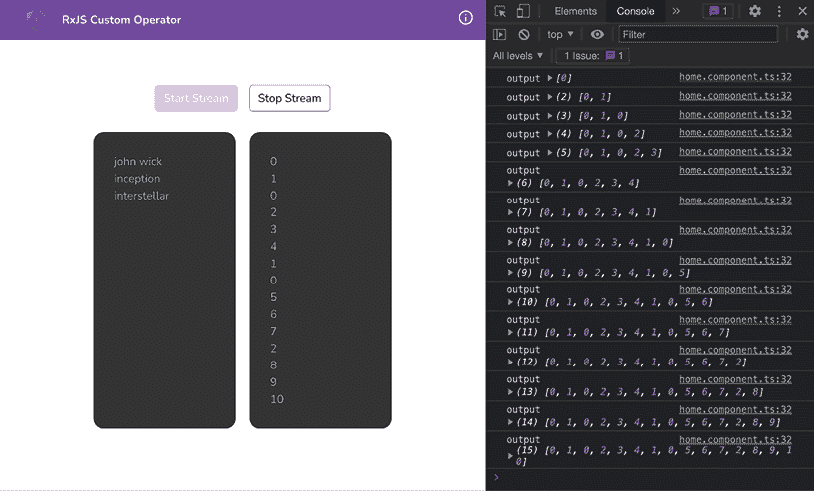

    图 5.12：在 http://localhost.4200 上运行的 rx-custom-operator 应用

让我们在下一节中跳转到食谱步骤。

## 如何做到这一点...

我们将创建一个名为`logWithLabel`的自定义 RxJS 操作符，它将在控制台上带有标签记录可观察流中的值。

1.  在`app`文件夹内创建一个新文件，并将其命名为`log-with-label.ts`。然后在文件中添加以下代码：

    ```js
    import { Observable } from 'rxjs/internal/Observable';
    import { tap } from 'rxjs/operators';
    const logWithLabel = <T>(
      label: string
    ): ((source$: Observable<T>) => Observable<T>) => {
      return (source$) => source$.pipe(tap((value) =>
    console.log(label, value)));
    };
    export default logWithLabel; 
    ```

1.  现在我们可以从`home/home.component.ts`文件中的`log-with-label.ts`文件导入`logWithLabel`操作符，如下所示：

    ```js
    ...
    **import** **logWithLabel** **from****'../log-with-label'****;**
    @Component({...})
    export class HomeComponent {
      ...
      startStream() {
        ...
        this.streamsOutput$ = merge(...).pipe(
          takeWhile(...),
          scan(...),
          **logWithLabel****(****'stream-output'****)**
        );
      }
      ...
    } 
    ```

    就这样！如果你刷新应用并点击**开始流**按钮，你可以使用`logWithLabel`操作符查看输出，如下所示：

    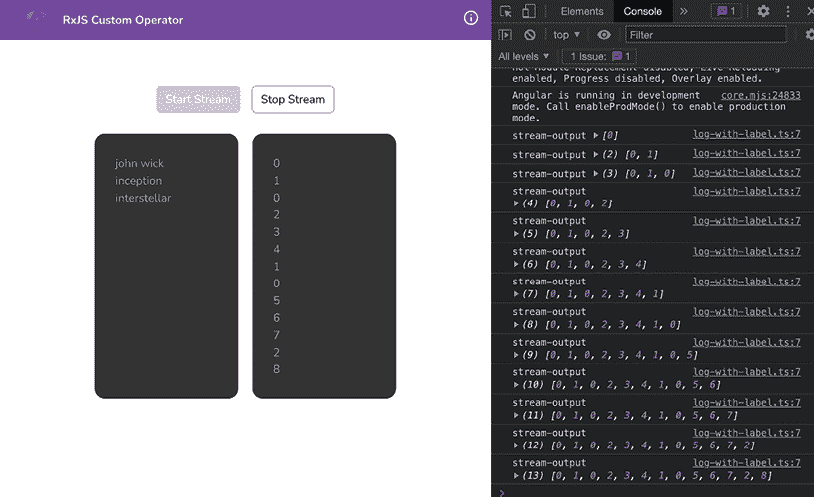

    图 5.13：使用 logWithLabel 自定义 RxJS 操作符记录的日志

请参阅下一节了解它是如何工作的。

## 它是如何工作的...

一个自定义 RxJS 操作符是一个函数，它应该接受一个可观察源流并返回*某物*。那个*某物*通常是可观察的。在这个菜谱中，我们希望深入到流中，每次流发出值时在控制台记录一些内容。我们还希望为这个流的日志添加一个自定义标签。这就是我们最终创建自定义操作符作为`工厂`函数的原因，它可以接受`label`作为输入，即当我们调用`logWithLabel`函数（让我们称它为`函数 A`）时，它返回一个函数（让我们称它为`函数 B`）。返回的函数（`B`）是 RxJS 在我们使用`pipe`函数中的`logWithLabel`方法时与可观察流一起调用的。在`函数 B`内部，我们使用 RxJS 的`tap`操作符来拦截源可观察流并在控制台使用提供的`label`记录值。

## 参见

+   `tap`操作符文档([`rxjs.dev/api/operators/tap`](https://rxjs.dev/api/operators/tap))

+   `Observable`文档([`rxjs.dev/guide/observable`](https://rxjs.dev/guide/observable))

# 使用 RxJS 重试失败的 HTTP 请求

在这个菜谱中，你将学习如何使用 RxJS 操作符智能地重试 HTTP 请求。我们将使用一种称为**指数退避**的技术。这意味着我们将重试 HTTP 请求，但每次后续调用都比前一次尝试的延迟更长，并在尝试几次最大次数后停止。听起来很激动人心吗？让我们开始吧。

## 准备工作

我们将要与之合作的应用程序位于克隆的仓库中的`start/apps/chapter05/rx-retry-http-calls`：

1.  在你的代码编辑器中打开代码仓库。

1.  打开终端，导航到代码仓库目录，并运行以下命令以使用后端服务器提供项目：

    ```js
    npm run serve rx-retry-http-calls with-server 
    ```

    这应该在新的浏览器标签页中打开应用程序，你应该看到以下内容：

    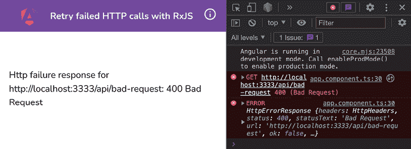

    图 5.14：在 http://localhost.4200 上运行的 rx-retry-http-calls

让我们跳到下一节中的菜谱步骤。

## 如何做到这一点...

我们将创建一个名为`backoff`的自定义 RxJS 操作符，它将使用指数`退避`策略为我们重试 HTTP 请求。

1.  在`app`文件夹内创建一个新文件，并将其命名为`retry-backoff.ts`。然后在文件中添加以下代码：

    ```js
    import { of, pipe, throwError } from 'rxjs';
    import { retry } from 'rxjs/operators';
    export function retryBackoff(maxTries: number, delay: number) {
      return pipe(
        retry({
          delay: (error, retryCount) => {
            return retryCount > maxTries ? throwError(() =>
              error) : of(retryCount);
          },
        })
      );
    } 
    ```

1.  现在，让我们在`app.component.ts`中使用这个操作符来重试 HTTP 请求。按照以下方式更新文件：

    ```js
    ...
    **import** **{ retryBackoff }** **from****'./retry-backoff'****;**
    ...
    export class AppComponent implements OnInit {
      ...
      ngOnInit(): void {
        this.isMakingHttpCall = true;
        this.http
          .get('http://localhost:3333/api/bad-request')
          .pipe(
            **retryBackoff****(****3****,** **300****),**
    catchError(...)
          )
          .subscribe(...);
      }
    } 
    ```

    如果你刷新应用程序，你会注意到现在我们正在重试 HTTP 请求。但所有的重试都是立即完成的（注意**瀑布**列），如图 5.15 所示。我们不想这样。我们希望每次尝试都以递增的延迟完成。

    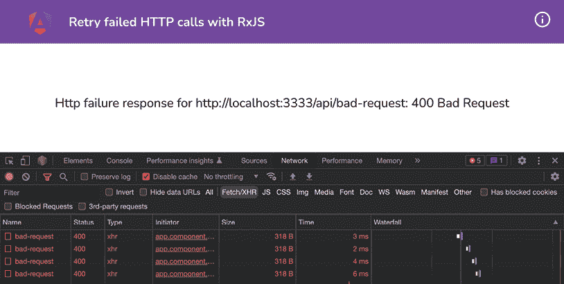

    图 5.15：立即多次重试 HTTP 请求

1.  将 `retry-backoff.ts` 文件更新为使用 `timer` 操作符和一些计算来添加延迟，如下所示：

    ```js
    import { of, pipe, throwError, **timer** } from 'rxjs';
    import { **map, mergeMap**, retry } from 'rxjs/operators';
    export function retryBackoff(maxTries: number, delay: number) {
      return pipe(
        retry({
          delay: (error, retryCount) => {
            return (
              retryCount > maxTries ? throwError(() => error) :
                of(retryCount)
            )**.****pipe****(**
    **map****(****(****count****) =>** **count * count),**
    **mergeMap****(****(****countSq****) =>****timer****(countSq * delay))**
    **);**
          },
        })
      );
    } 
    ```

    就这样！如果您刷新应用程序，您会看到每次 HTTP 调用的后续重试的延迟都比前一次增加。注意最后一个 HTTP 调用在 **Waterfall** 列中的位置有多远（它在 *图 5.16* 的右边缘）：

    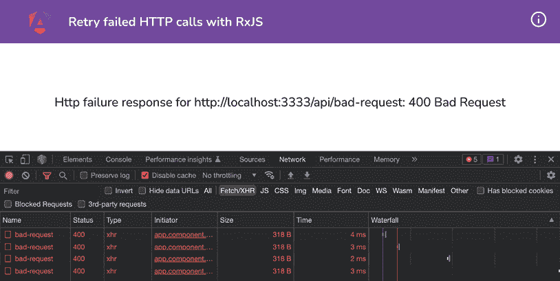

    图 5.16：使用指数退避重试 HTTP 调用

查看下一节以了解它是如何工作的。

## 它是如何工作的…

`retry` 操作符有两个重载（在撰写本书时）。其中一个接受 `number` 参数，RxJS 将仅重试观察者指定次数（直到抛出异常）。另一个重载是它接受一个配置对象。在配置对象中，我们使用 `delay` 函数来处理我们的逻辑。`delay` 函数接收来自 RxJS 的 `error` 和 `retryCount`，我们使用它们来抛出错误，如果我们已经尝试了最大次数，或者传递 `retryCount`。我们从 `retryBackoff` 函数的参数中获取最大尝试次数。最后，我们使 `map` 和 `mergeMap` 操作符与 `delay` 一起工作。使用 `map` 操作符，我们取 `retryCount` 变量值的平方。然后，在 `mergeMap` 操作符中，我们将平方值与传递给 `retryBackoff` 函数的延迟相乘。结果，每次后续请求的延迟等于 `((retryCount * retryCount) * delay)`。请注意，我们使用 `timer` 函数让 RxJS 在再次重试 HTTP 调用之前等待。

## 另请参阅

+   **RxJS 自定义操作符** ([`indepth.dev/posts/1421/rxjs-custom-operators`](https://indepth.dev/posts/1421/rxjs-custom-operators))

+   **指数退避**文档 ([`angular.io/guide/practical-observable-usage#exponential-backoff`](https://angular.io/guide/practical-observable-usage#exponential-backoff))

# 在 Discord 上了解更多信息

要加入这本书的 Discord 社区——在那里您可以分享反馈、向作者提问以及了解新版本——请扫描下面的二维码：

[AngularCookbook2e](https://packt.link/AngularCookbook2e)


