# 6

# 使用 NgRx 进行响应式状态管理

Angular 和 **reactive programming** 是最佳拍档，以响应式的方式处理应用程序的状态是你可以为你的应用程序做的最好的事情之一。**NgRx**（代表 **Angular Reactive Extensions**）是一个提供一组库作为 Angular 的响应式扩展的框架。在本章中，你将学习如何使用 NgRx 生态系统以响应式的方式管理你的应用程序状态，你还将了解 NgRx 生态系统将帮助你的一些酷功能。

这里是我们将在本章中涵盖的食谱：

+   使用动作和还原器创建你的第一个 NgRx 存储

+   使用 NgRx Store Devtools 调试状态变化

+   使用 NgRx 选择器在组件中选择和渲染状态

+   使用 NgRx 效果从 API 调用中获取数据

+   使用 NgRx 组件存储来管理组件的状态

# 技术要求

对于本章的食谱，请确保你的设置已按照 'Angular-Cookbook-2E' GitHub 仓库中的 'Technical Requirements' 完成设置。有关设置详细信息，请访问：[`github.com/PacktPublishing/Angular-Cookbook-2E/tree/main/docs/technical-requirements.md`](https://github.com/PacktPublishing/Angular-Cookbook-2E/tree/main/docs/technical-requirements.md)。本章的入门代码位于 [`github.com/PacktPublishing/Angular-Cookbook-2E/tree/main/start/apps/chapter06`](https://github.com/PacktPublishing/Angular-Cookbook-2E/tree/main/start/apps/chapter06)。

# 使用动作和还原器创建你的第一个 NgRx 存储

在这个食谱中，你将通过设置你的第一个 NgRx 存储，逐步了解 NgRx 的基础知识。你还将创建一些动作，以及一个还原器，为了看到还原器中的变化，我们将添加适当的控制台日志。

## 准备工作

我们将要工作的应用程序位于克隆的仓库中的 `start/apps/chapter06/ngrx-actions-reducer` 目录内：

1.  在你的代码编辑器中打开代码仓库。

1.  打开终端，导航到代码仓库目录，并运行以下命令以运行项目：

    ```js
    npm run serve ngrx-actions-reducer 
    ```

    这应该在新的浏览器标签页中打开应用程序。如果你添加了一些项目，你应该会看到以下内容：

    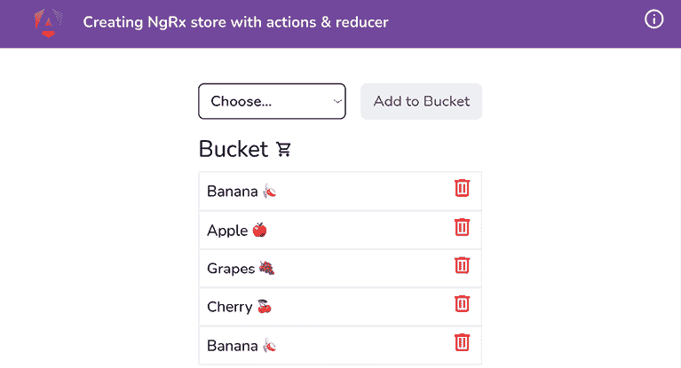

    图 6.1：在 http://localhost:4200 上运行的 ngrx-actions-reducers 应用程序

现在我们已经运行了应用程序，我们将继续进行食谱的步骤。

## 如何做…

我们有一个包含一个桶的单页 Angular 应用程序。你可以向你的桶中添加水果，并从桶中移除项目。我们已经在工作区中安装了 `@ngrx/store` 包，所以你不需要安装它。然而，当你独立工作（或在你的一些自己的项目中）时，你将首先添加 NgRx 并运行以下命令：

```js
npm install @ngrx/store 
```

更新 `app.config.ts` 文件以提供 NgRx 存储，如下所示：

```js
...
import { provideStore } from '@ngrx/store';
...
import { provideAnimations } from '@angular/platform-browser/animations';
import { provideStore } from '@ngrx/store';
export const appConfig: ApplicationConfig = {
  providers: [
    ...,
    provideAnimations(),
    **provideStore****({}),**
  ],
}; 
```

注意，我们已经将一个空对象 `{}` 传递给 `provideStore()` 方法；我们将从现在开始更改它。

现在，我们将创建一些动作。在`app`文件夹内创建一个名为`store`的文件夹。然后，在`store`文件夹内创建一个名为`bucket.actions.ts`的文件，最后，将以下代码添加到新创建的文件中：

```js
import { createActionGroup, props } from '@ngrx/store';
import { IFruit } from '../interfaces/fruit.interface';
export const BucketActions = createActionGroup({
  source: 'Bucket',
  events: {
    'Add Fruit': props<{ fruit: IFruit }>(),
    'Remove Fruit': props<{ fruitId: number }>(),
  },
}); 
```

由于我们现在有了动作，我们必须创建一个 reducer。

在`store`文件夹内创建一个新文件，命名为`bucket.reducer.ts`，并将以下代码添加到其中以定义必要的导入和初始状态：

```js
import { createReducer, on } from '@ngrx/store';
import { IFruit } from '../interfaces/fruit.interface';
import { BucketActions } from './bucket.actions';
export const initialState: ReadonlyArray<IFruit> = []; 
```

现在，我们将定义 reducer。将以下代码添加到`bucket.reducer.ts`文件中：

```js
...
**export****const** **bucketReducer =** **createReducer****(**
**initialState,**
**on****(****BucketActions****.****addFruit****,** **(****_state, { fruit }****) =>** **{**
**console****.****log****({ fruit });**
**return** **[fruit, ..._state];**
**}),**
**on****(****BucketActions****.****removeFruit****,** **(****_state, { fruitId }****) =>** **{**
**console****.****log****({ fruitId });**
**return** **_state.****filter****(****(****fr****) =>** **fr.****id** **=== fruitId);**
**})**
**);** 
```

接下来，我们将更新`app.config.ts`文件以使用我们刚刚创建的 reducer。按照以下方式更新文件：

```js
...
**import** **{ bucketReducer }** **from****'./app/store/bucket.reducer'****;**
bootstrapApplication(AppComponent, {
  providers: [
    ...,
    provideStore(**{**
**bucket****: bucketReducer,**
**}**),
  ],
}).catch((err) => console.error(err)); 
```

现在，我们将使用我们创建的动作来查看 reducer 函数的控制台日志。按照以下方式更新`bucket.component.ts`文件，首先使用 NgRx 存储库如下：

```js
...
**import** **{** **StoreModule****,** **Store** **}** **from****'@ngrx/store'****;**
@Component({
  ...,
  imports: [CommonModule, FormsModule, **StoreModule**],
})
export class BucketComponent implements OnInit {
  ...
  fruits: string[] = Object.values(Fruit);
  **store =** **inject****(****Store****);**
  ...
} 
```

让我们派发动作到存储库，以便我们在桶中添加水果和移除水果。我们还将稍微修改一下代码以避免重复。按照以下方式更新`bucket.component.ts`文件：

```js
...
**import** **{** **BucketActions** **}** **from****'../store/bucket.actions'****;**
...
export class BucketComponent implements OnInit {
  ...
    addSelectedFruitToBucket() {
    **const****newFruit****:** **IFruit** **= {**
**id****:** **Date****.****now****(),**
**name****:** **this****.****selectedFruit****,**
**};**
**this****.****store****.****dispatch****(**
**BucketActions****.****addFruit****({**
**fruit****: newFruit,**
**})**
**);**
this.bucketService.addItem(**newFruit**);
  }
  deleteFromBucket(fruit: IFruit) {
    **this****.****store****.****dispatch****(**
**BucketActions****.****removeFruit****({**
**fruitId****: fruit.****id****,**
**})**
**);**
this.bucketService.removeItem(fruit);
  }
} 
```

现在如果您向桶中添加或移除项目，您将在控制台看到日志，如下所示在*图 6.2*中，这意味着我们的操作和 reducer 正在工作：

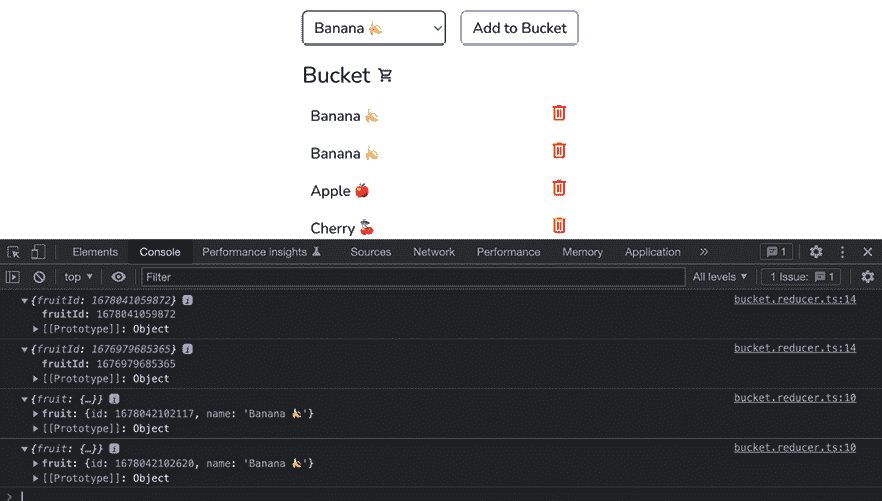

图 6.2：显示从桶中添加和移除项目动作的日志

这样就完成了这个食谱的所有内容！您现在能够将 NgRx 存储库集成到 Angular 应用程序中，创建 NgRx 动作，并派发这些动作。您还能够创建一个 reducer，定义其状态，并监听动作以对其做出反应。

## 参见

+   NgRx 存储库浏览教程([`ngrx.io/guide/store/walkthrough`](https://ngrx.io/guide/store/walkthrough))

+   NgRx reducers 文档([`ngrx.io/guide/store/reducers`](https://ngrx.io/guide/store/reducers))

+   NgRx actions 文档([`ngrx.io/guide/store/actions`](https://ngrx.io/guide/store/actions))

# 使用 NgRx Store Devtools 调试状态变化

在这个食谱中，您将学习如何使用`@ngrx/store-devtools`来调试应用程序的状态、派发的动作以及动作派发时状态的变化。我们将使用我们熟悉的现有应用程序来了解这个过程。

## 准备中

我们将要工作的应用程序位于克隆的仓库中的`start/apps/chapter06/ngrx-devtools`：

1.  在您的代码编辑器中打开代码仓库。

1.  打开终端，导航到代码仓库目录，并运行以下命令以启动项目：

    ```js
    npm run serve ngrx-devtools 
    ```

    这应该在新的浏览器标签页中打开应用程序。如果您添加了一些项目，您应该会看到以下内容：

    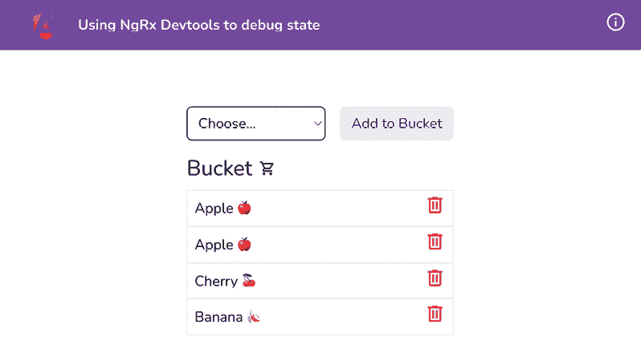

    图 6.3：使用运行在 http://localhost:4200 的 ngrx-devtools 应用

现在我们已经设置了应用程序，让我们在下一节中查看食谱的步骤。

## 如何做到这一点…

我们有一个已经集成了`@ngrx/store`包的 Angular 应用程序。我们还有一个设置好的 reducer 和一些动作，这些动作会在你添加或移除项目时立即在控制台记录。我们已经在工作区中安装了`@ngrx/store-devtools`包，所以你不需要安装它。然而，当你独立工作（或在你的一些自己的项目中）时，你会从添加 NgRx 存储`devtools`并运行以下命令开始：

```js
npm install @ngrx/store-devtools 
```

1.  首先，更新您的`app.config.ts`文件以包含`StoreDevtoolsModule.instrument`条目，如下所示：

    ```js
    ...
    **import** **{ provideStoreDevtools }** **from****'@ngrx/store-devtools'****;**
    import { bucketReducer } from './app/store/bucket.reducer';
    bootstrapApplication(AppComponent, {
      providers: [
        ...,
        provideStore({
          bucket: bucketReducer,
        }),
        **provideStoreDevtools****({**
    **maxAge****:** **50****,**
    **}),**
      ],
    }).catch((err) => console.error(err)); 
    ```

1.  现在从[`github.com/zalmoxisus/redux-devtools-extension/`](https://github.com/zalmoxisus/redux-devtools-extension/)下载**Redux DevTools**扩展程序到您的浏览器中并安装它。在这本书中，我会持续使用 Chrome 浏览器。

1.  打开**Chrome DevTools**。应该有一个名为**Redux**的新标签页。点击它并刷新页面。你会看到如下内容：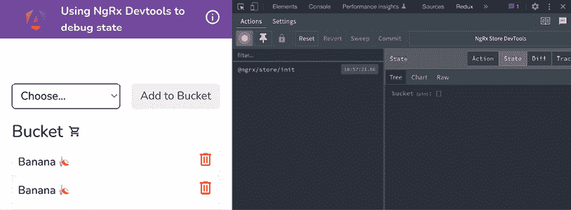

    图 6.4：Redux DevTools 显示最初派发的 Redux 动作

1.  移除所有水果，往桶里加两个樱桃和一个香蕉，然后从桶里移除香蕉。你应该会看到所有相关的动作和状态如下所示：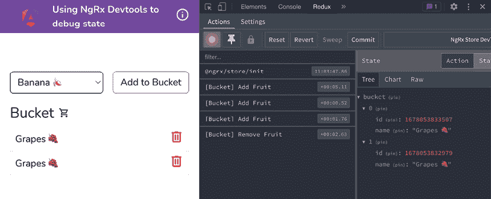

    图 6.5：Redux DevTools 显示桶动作和状态

太好了！你刚刚学会了如何使用 Redux DevTools 扩展来查看你的 NgRx 状态和正在派发的动作。

## 它是如何工作的...

重要的是要理解 NgRx 是 Angular 和 RxJS 的结合，从而实现了包括 Redux 在内的不同模式的实现。通过使用 Store Devtools 包和 Redux DevTools 扩展，我们能够轻松地调试应用程序，这有助于我们找到潜在的 bug，预测状态变化，并在`@ngrx/store`包的幕后发生的事情上更加透明。

## 还有更多...

你还可以看到动作在应用程序状态中引起的差异，即当我们向桶中添加一个项目并从桶中移除一个项目时。分别参见*图 6.6*和*图 6.7*：

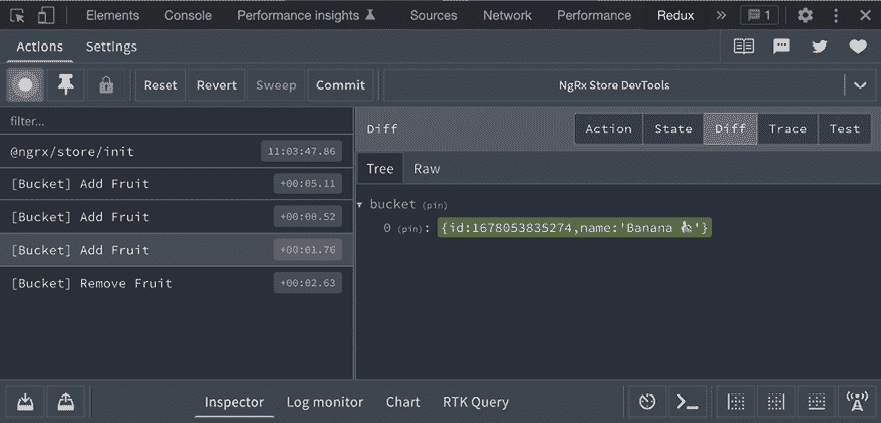

图 6.6：Redux Devtools 中的添加水果动作

注意*图 6.6*中桶项目周围的绿色背景。这表示状态中的添加。你可以在以下图片中看到`ReemoveFruit`动作：

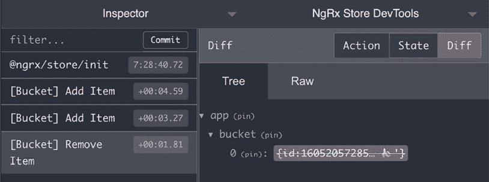

图 6.7：Redux Devtools 中的移除水果动作

现在注意红色背景和`Diff`的删除线。这表示从状态中移除。

## 参见

+   NgRx Store Devtools 文档([`ngrx.io/guide/store-devtools`](https://ngrx.io/guide/store-devtools))

# 使用 NgRx 选择器在组件中选择和渲染状态

在之前的菜谱中，我们创建了一些动作，一个单独的 reducer，并且我们集成了 devtools 来观察状态变化。然而，我们的 bucket 应用仍然使用`BucketService`中的某些变量来渲染数据。在这个菜谱中，我们将全力以赴使用 NgRx。我们将从状态中渲染 bucket 项目，因为我们已经将它们保存在 NgRx 存储中。

## 准备工作

我们将要工作的应用位于克隆的仓库中的`start/apps/chapter06/ngrx-selectors`：

1.  在你的代码编辑器中打开代码仓库。

1.  打开终端，导航到代码仓库目录，并运行以下命令以运行项目：

    ```js
    npm run serve ngrx-selectors 
    ```

    这应该会在新浏览器标签页中打开应用，你应该会看到以下内容：

    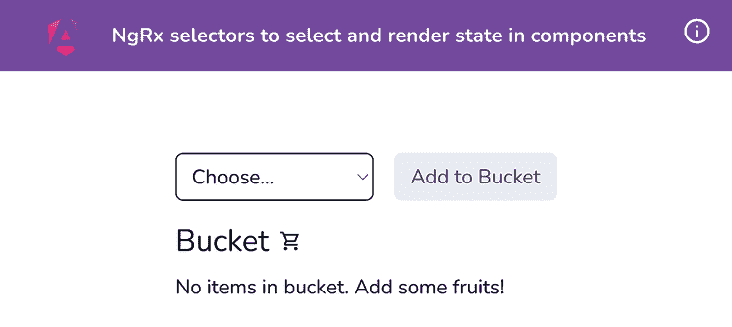

    图 6.8：使用运行在 http://localhost:4200 的 ngrx-selectors 应用

现在我们已经在本地运行了应用，让我们在下一节中查看菜谱的步骤。

## 如何操作…

在这个菜谱中，我们只需要处理 NgRx 选择器。存储、动作和 reducer 已经设置好了。*简单易懂*！让我们开始吧！

我们首先将在**主页**上显示我们的 bucket 中的水果，为此，我们必须创建我们的第一个 NgRx 选择器：

1.  在`store`文件夹内创建一个新文件。命名为`bucket.selectors.ts`并将以下代码添加到其中：

    ```js
    import { createFeatureSelector } from '@ngrx/store';
    import { IFruit } from '../interfaces/fruit.interface';
    export const selectBucket =
    createFeatureSelector<ReadonlyArray<IFruit>>('bucket'); 
    ```

    现在我们已经有了选择器，让我们在`BucketComponent`类中使用它。

1.  按照以下方式修改`bucket.component.ts`文件以重新分配`$bucket`可观察对象：

    ```js
    ...
    **import** **{ selectBucket }** **from****'../store/bucket.selectors'****;**
          ...
    export class BucketComponent implements OnInit {
      ...
      store = inject(Store);
      **$bucket****:** **Observable****<****IFruit****[]> =** **this****.****store****.****select****(**
    **selectBucket);**
    ngOnInit(): void {
        this.bucketService.loadItems();
      }
      ...
    } 
    ```

    刷新应用并尝试向 bucket 中添加和移除项目。你可以看到我们仍然得到了渲染的 bucket 项目。这次，它来自 NgRx 存储。

1.  现在我们可以移除从`BucketService`管理状态的额外代码。按照以下方式更新`bucket.component.ts`文件中的`BucketComponent`类：

    ```js
    //  remove the `implements onInit` below
    export class BucketComponent implements OnInit {
      **bucketService =** **inject****(****BucketService****);****// ← remove**
    selectedFruit: Fruit = '' as Fruit;
      ...
      **ngOnInit****():** **void** **{****// ← remove this method**
    **this****.****bucketService****.****loadItems****();**
    **}**
    addSelectedFruitToBucket() {
        const newFruit: IFruit = {...};
        this.store.dispatch(...);
        **this****.****bucketService****.****addItem****(newFruit);****// ← remove**
      }
      deleteFromBucket(fruit: IFruit) {
        this.store.dispatch(...);
        **this****.****bucketService****.****removeItem****(fruit);****// ← remove**
      }
    } 
    ```

    一旦你移除了代码，确保也从文件中移除未使用的依赖（导入）。尝试运行应用，你会发现它仍然可以工作。*太好了！*

1.  现在我们可以更新`bucket.service.ts`文件，使其不再将 bucket 项目保存在`BehaviorSubject`中。按照以下方式更新文件：

    ```js
    ...
    import { Injectable } from '@angular/core';
    import { IFruit } from '../interfaces/fruit.interface';
    import { IBucketService } from '../interfaces/bucket-service';
    @Injectable({
      providedIn: 'root',
    })
    export class BucketService implements IBucketService {
      **storeKey =** **'bucket_ngrx-selectors'****;**
    **loadItems****() {**
    **return****JSON****.****parse****(****window****.****localStorage****.****getItem****(**
    **this****.****storeKey****) ||** **'[]'****);**
    **}**
    **saveItems****(****items****:** **IFruit****[]****) {**
    **window****.****localStorage****.****setItem****(**
    **this****.****storeKey****,** **JSON****.****stringify****(items));**
    **r}**
    } 
    ```

    注意我们已经移除了`addItem`和`removeItem`函数，并添加了`saveItems`方法。

1.  你会看到 TypeScript 很生气。这是因为`BucketService`不再实现`IBucketService`接口了。更新`bucket-service.ts`文件以更新接口如下：

    ```js
    import { IFruit } from './fruit.interface';
    export interface IBucketService {
      loadItems(): void;
      **saveItems****(****fruit****:** **IFruit****[]):** **void****;**
    } 
    ```

就这样！你已经完成了菜谱。你会注意到，一旦我们刷新应用，我们就失去了 bucket 项目。但别担心——我们将在下一个菜谱中把它们带回来。

## 它是如何工作的…

在这个菜谱中，我们已经设置了动作和选择器。然而，我们只是将动作分发给存储以添加/移除项目。组件仍然使用 `BucketService` 和从它生成的 Observable 来管理状态并渲染项目。由于我们只想在整个过程中使用 NgRx，我们在应用中引入了一个选择器来选择桶中的项目。

注意我们使用了来自 `@ngrx/store` 包的 `createFeatureSelector` 方法。这允许我们从应用中选择一个功能。例如，你的应用可以有配置文件、用户、事件和设置等功能。理想情况下，我们创建功能选择器来提取目标功能的唯一数据，而不是整个 NgRx 状态对象。

然后，我们使用我们刚刚创建的选择器 `selectBucket()` 替换 `BucketComponent` 类中的 `$bucket` 属性。注意，选择器返回一个 `Readonly` 数组。这确保了我们不会修改实际数据，并且它是只读的。最后，我们从 `BucketService` 类中移除不必要的函数，并从 `BucketComponent` 类中移除对这些函数的使用。

如果你现在从整体上审视这个应用，我们可以使用 NgRx 来向桶中添加和移除项目，并且可以使用选择器在 UI 中渲染这些项目。然而，一旦你刷新应用，所有内容都会消失，因为数据不是持久的；尽管我们有使用 `LocalStorage` 获取和保存项目的函数。处理这种情况的理想方式是使用 NgRx 效果。然而，你将在下一个菜谱中学习它们。你可以挑战自己再次回到这个菜谱，实现一个将更新后的桶列表保存到存储中的效果。

## 参考以下内容

+   NgRx 选择器文档 ([`ngrx.io/guide/store/selectors`](https://ngrx.io/guide/store/selectors))

# 使用 NgRx 效果从 API 调用中获取数据

在这个菜谱中，你将学习如何使用 `@ngrx/effects` 包中的 NgRx 效果。我们有一个已经安装了 `@ngrx/store` 和 `@ngrx/store-devtools` 的应用。我们能够向桶中添加和移除项目。然而，在这个菜谱中，我们将使用服务器来接收、存储、添加和移除桶中的项目，即数据将同时存在于 NgRx 存储和后端。

## 准备工作

我们将要工作的应用位于克隆的仓库中的 `start/apps/chapter06/ngrx-effects` 目录内：

1.  在你的代码编辑器中打开代码仓库。

1.  打开终端，导航到代码仓库目录，并运行以下命令以使用后端应用提供项目服务：

    ```js
    npm run serve ngrx-effects with-server 
    ```

    这应该在新的浏览器标签页中打开应用，你应该看到以下内容：

    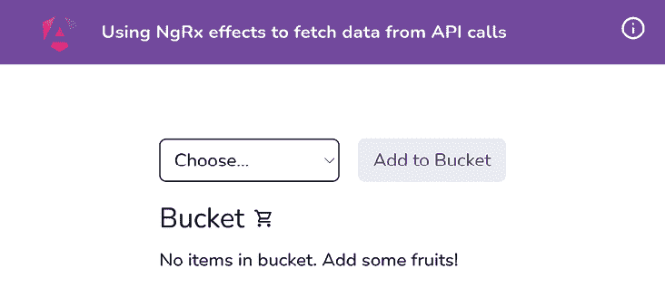

    图 6.9：在 http://localhost:4200 上运行的 ngrx-effects 应用

现在我们已经在本地上运行了应用，让我们在下一节中查看菜谱的步骤。

## 如何实现...

我们有一个包含 bucket 的单页 Angular 应用。你可以向 bucket 中添加水果，并从 bucket 中移除项目。我们已经在工作区中安装了 `@ngrx/store`、`@ngrx/store-devtools` 和 `@ngrx/effects` 包，所以你不需要安装它们。然而，当你在一个独立的应用（或你的一些自己的项目中）工作时，你可以通过运行以下命令来添加 NgRx effects：

```js
npm install --save @ngrx/effects 
```

现在，让我们按照以下步骤进行：

1.  我们将更新 `bucket.actions.ts` 文件，添加一些包括 API 调用的动作。按照以下方式更新文件：

    ```js
    import { createActionGroup, **props**, **emptyProps** } from '@ngrx/store';
    import { IFruit } from '../interfaces/fruit.interface';
    export const BucketActions = createActionGroup({
      source: 'Bucket',
      events: {
        **'Get Bucket'****:** **emptyProps****(),**
    **'****Get Bucket Success'****: props<{** **bucket****:** **IFruit****[] }>(),**
    **'Get Bucket Failure'****: props<{** **error****:** **string** **}>(),**
    'Add Fruit': props<{ fruit: IFruit }>(),
        **'****Add Fruit Success'****: props<{** **fruit****:** **IFruit** **}>(),**
    **'Add Fruit Failure'****: props<{** **error****:** **string** **}>(),**
    'Remove Fruit': props<{ fruitId: number }>(),
        **'****Remove Fruit Success'****: props<{** **fruitId****:** **number** **}>(),**
    **'Remove Fruit Failure'****: props<{** **error****:** **string** **}>(),**
      },
    }); 
    ```

1.  在 `store` 文件夹中创建一个名为 `bucket.effects.ts` 的文件，并将以下代码添加到其中：

    ```js
    import { Injectable } from '@angular/core';
    import { Actions, ofType, createEffect } from '@ngrx/effects';
    import { of } from 'rxjs';
    import { catchError, exhaustMap, map } from 'rxjs/operators';
    import { BucketService } from '../bucket/bucket.service';
    import { BucketActions } from './bucket.actions';
    @Injectable()
    export class BucketEffects {
      getBucket$ = createEffect(() =>
    this.actions$.pipe(
          ofType(BucketActions.getBucket),
          exhaustMap(() =>
    this.bucketService.getBucket().pipe(
              map(({ bucket }) => BucketActions
     .getBucketSuccess({ bucket })),
              catchError((error) => of(BucketActions
     .getBucketFailure({ error })))
            )
          )
        )
      );
      constructor(
     private actions$: Actions,
     private bucketService: BucketService
     ) {}
    } 
    ```

1.  现在，我们可以在 `app.config.ts` 文件中通过 `BucketEffects` 类提供效果，如下所示：

    ```js
    ...
    **import** **{ provideEffects }** **from****'@ngrx/effects'****;**
    ...
    import { BucketEffects } from './app/store/bucket.effects';
    ...
    bootstrapApplication(AppComponent, {
      providers: [
        ...,
        provideHttpClient(),
        **provideEffects****([****BucketEffects****]),**
      ],
    }).catch((err) => console.error(err)); 
    ```

1.  我们现在将更新 `bucket.reducer.ts` 文件，在 HTTP 调用成功事件中添加或移除项目，并在应用启动时设置从服务器检索的 bucket 项目。按照以下方式更新文件：

    ```js
    ...
    export const initialState: ReadonlyArray<IFruit> = [];
    export const bucketReducer = createReducer(
      initialState,
      **on****(****BucketActions****.****getBucketSuccess****,**
    **(****_state, { bucket }****) =>** **{**
    **return** **bucket;**
    **}),**
    on(BucketActions.**addFruitSuccess**, (_state, { fruit }) => {
        console.log({ fruit });
        return [fruit, ..._state];
      }),
      on(BucketActions.**removeFruitSuccess**, (_state, { fruitId }) => {
        console.log({ fruitId });
        return _state.filter((fr) => fr.id !== fruitId);
      })
    ); 
    ```

1.  现在，当组件挂载时，我们将从 `bucket.componen.ts` 中分发 `getBucket` 动作。按照以下方式更新 `bucket.component.ts`：

    ```js
    import { CommonModule } from '@angular/common';
    import { Component, inject, **OnInit** } from '@angular/core';
    ...
    @Component({...})
    export class BucketComponent**implements****OnInit** {
      ...
      **ngOnInit****() {**
    **this****.****store****.****dispatch****(****BucketActions****.****getBucket****());**
    **}**
      ...
    } 
    ```

    现在我们已经链接了一切，刷新应用，你将看到来自服务器的 bucket 项目。你可以在 Redux Devtools 中看到以下动作：

    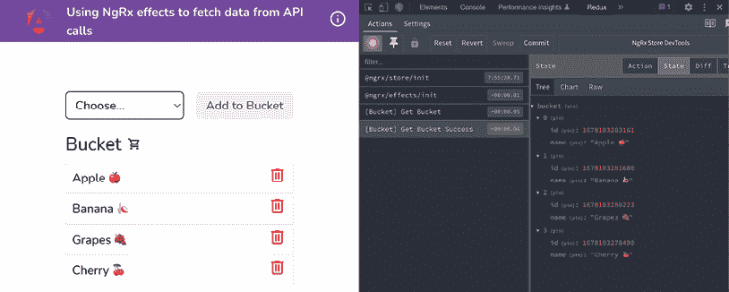

    图 6.10：使用 NgRx effects 从服务器获取 bucket

    你也应该能够看到由于图 6.9 中的 `[Bucket] Get Bucket` 动作而发生的网络调用（见图 6.10）。

    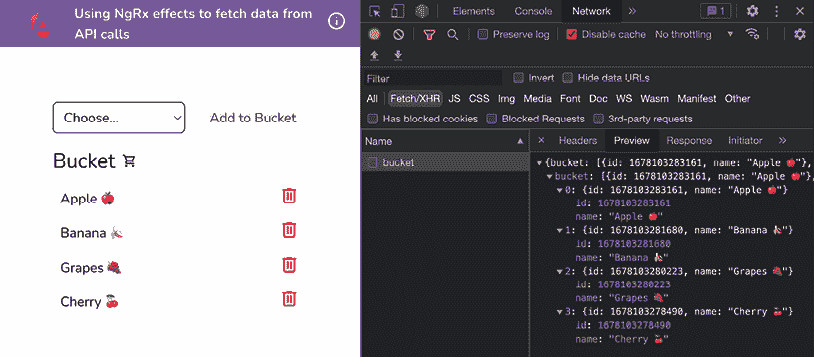

    图 6.11：@ngrx/effects 初始化网络调用

    如果你尝试添加或移除项目，你会看到它们不起作用。这是因为我们在第 4 步中更改了我们的 reducer，使其在出现 `addFruitSuccess` 或 `removeFruitSuccess` 事件时采取行动。

1.  现在我们将在 `bucket.effects.ts` 中添加 `addFruit` 的效果。按照以下方式更新文件：

    ```js
    ...
    export class BucketEffects {
      ...
      **addItem$ =** **createEffect****(****() =>**
    **this****.****actions$****.****pipe****(**
    **ofType****(****BucketActions****.****addFruit****),**
    **exhaustMap****(****(****action****) =>**
    **this****.****bucketService****.****addItem****(action.****fruit****).****pipe****(**
    **map****(****(****{ fruit }****) =>****BucketActions**
    **.****addFruitSuccess****({ fruit })),**
    **catchError****(****(****error****) =>****of****(**
    **BucketActions****.****addFruitFailure****({ error })))**
    **)**
    **)**
    **)**
    **);**
      ...
    } 
    ```

1.  让我们在 `bucket.effects.ts` 中也添加 `removeFruit` 的效果。按照以下方式更新文件：

    ```js
    ...
    export class BucketEffects {
      ...
      **removeItem$ =** **createEffect****(****() =>**
    **this****.****actions$****.****pipe****(**
    **ofType****(****BucketActions****.****removeFruit****),**
    **exhaustMap****(****(****action****) =>**
    **this****.****bucketService****.****removeItem****(**
    **action.****fruitId****).****pipe****(**
    **map****(****() =>**
    **BucketActions****.****removeFruitSuccess****({** **fruitId****:**
    **action.****fruitId** **})**
    **),**
    **catchError****(****(****error****) =>****of****(**
    **BucketActions****.****removeFruitFailure****({ error })))**
    **)**
    **)**
    **)**
    **);**
      ...
    } 
    ```

    如果你现在刷新应用，添加一个苹果，然后移除它，你应该能在 Redux Devtools 中看到状态，如图所示：

    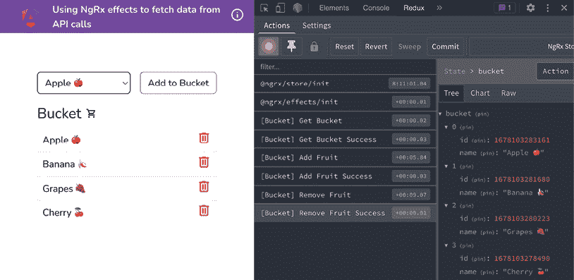

    图 6.12：NgRx effects 获取 bucket 并添加和移除项目

    注意图 6.11 中的状态显示了 4 个项目，这在 UI 中显示。同时，注意动作分发的顺序。在这种情况下，每个 API/HTTP 动作都会导致以下 `Success` 动作。

太棒了！你现在知道如何在 Angular 应用中使用 NgRx effects 了。查看下一节以了解 NgRx effects 是如何工作的。

## 它是如何工作的…

为了使 NgRx 效果正常工作，我们需要安装 `@ngrx/effects` 包，创建一个效果，并在 `main.ts` 文件中的效果数组（根效果）中注册它。NgRx 效果本质上是一种监听动作、执行某些操作（我们称这种操作为副作用），然后返回一个动作的东西。当从任何组件或甚至从另一个效果向存储发送动作时，注册的效果会执行你想要它执行的任务，并应该返回另一个动作。对于 HTTP 调用，我们通常有三个动作——即主要动作，以及随后的成功和失败动作。理想情况下，在成功动作（也许在失败动作上也是如此），你可能会想要更新一些你的状态变量。在 *步骤 4* 中，在 `BucketEffects` 类内部，你会注意到我们注入了 NgRx 的 `Action` 服务和 `BucketService`。然后我们使用 `createEffect` 函数创建效果。效果本身使用 `ofType` 操作符监听特定事件的 `Action` 流。然后我们使用 `exhaustMap` 操作符执行 HTTP 调用，它返回一个可观察对象。最后，我们使用 `map` 操作符返回成功动作，并使用 `catchError` 操作符返回失败动作。

## 参见

+   NgRx 效果文档 ([`ngrx.io/guide/effects`](https://ngrx.io/guide/effects))

# 使用 NgRx Component Store 管理组件的状态

在这个食谱中，你将学习如何使用 **NgRx Component Store** 以及如何用它来代替基于推送的 `Subject/BehaviorSubject` 模式和用于维护组件状态的服务。我们还将看到如何使用 **Component Store** 促进跨组件通信。

记住 `@ngrx/component-store` 是一个独立的库，并且与 Redux 或 `@ngrx/store` 等不相关。

## 准备工作

我们将要工作的应用位于克隆的仓库中的 `start/apps/chapter06/ngrx-component-store`：

1.  在你的代码编辑器中打开代码仓库。

1.  打开终端，导航到代码仓库目录，并运行以下命令以使用后端应用提供项目：

    ```js
    npm run serve ngrx-component-store 
    ```

    这应该会在新浏览器标签页中打开应用，你应该会看到以下内容：

    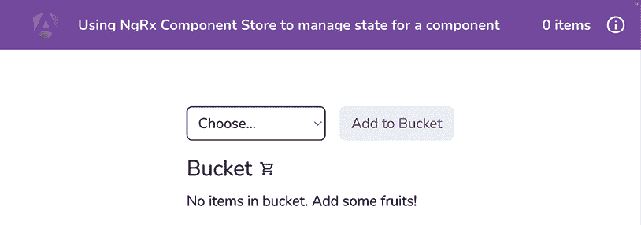

    图 6.13：在 http://localhost:4200 上运行的 ngrx-component-store 应用

现在我们已经在本地上运行了应用，让我们在下一节中查看食谱的步骤。

## 如何做到这一点…

我们有我们最喜欢的桶应用，我们已经在很多食谱中使用过。桶的当前状态存储在组件本身中。这限制了状态仅限于组件内部，我们无法在顶部标题中使用桶的长度。一种方法可能是使用 `BehaviorSubject`。但我们会更愿意使用 NgRx Component Store。我们已经在单仓库中安装了 `@ngrx/component-store` 包。但如果你正在开发一个新项目，你将按照以下方式安装包：

```js
npm install @ngrx/component-store 
```

我们将在 `BucketService` 中构建我们的组件存储。

1.  让我们使其与 `ComponentStore` 兼容。为了做到这一点，我们将为桶状态创建一个接口，从 `ComponentStore` 扩展 `BucketService`，并通过调用 `super` 方法初始化服务。按照以下方式更新 `bucket.service.ts` 文件：

    ```js
    ...
    **import** **{** **ComponentStore** **}** **from****'@ngrx/component-store'****;**
    **import** **{** **IFruit** **}** **from****'../interfaces/fruit.interface'****;**
    **export****interface****BucketState** **{**
    **bucket****:** **IFruit****[];**
    **}**
    ...
    export class BucketService **extends****ComponentStore****<**
    **BucketState****>** {
      storeKey = 'bucket_ngrx-component-store';
      **constructor****() {**
    **super****({** **bucket****: [] });**
    **}**
    loadItems() {...}
      saveItems(items: IFruit[]) {...}
    } 
    ```

    直到我们实际上显示 `ComponentStore` 中的数据，这一切都没有意义。让我们现在着手解决这个问题。

1.  让我们在 `BucketService` 中创建一个 `bucket$` 可观察对象，如下所示：

    ```js
    ...
    **import** **{** **Observable** **}** **from****'rxjs/internal/Observable'****;**
    import { IFruit } from '../interfaces/fruit.interface';
    ...
    export class BucketService extends ComponentStore<BucketState> {
      storeKey = 'bucket_ngrx-component-store';
      **readonly****bucket$****:** **Observable****<****IFruit****[]> =** **this****.****select****(**
    **(****state****) =>** **state.****bucket****);**
      ...
    } 
    ```

1.  首先，让我们确保我们可以使用 `localStorage` 中的值初始化组件存储。我们将按照以下方式更新 `bucket.service.ts` 文件中的 `constructor` 方法，以使用 `loadItems` 方法：

    ```js
     constructor() {
        super({ bucket: [] });
        **this****.****setState****({**
    **bucket****:** **this****.****loadItems****(),**
    **});**
      } 
    ```

1.  现在我们将添加将水果项目添加到和从桶中移除的方法：

    ```js
    export class BucketService extends ComponentStore<BucketState> {
      ...
      **readonly** **addItem =** **this****.****updater****(****(****state****:** **BucketState****,**
    **fruit****:** **IFruit****) =>** **{**
    **const** **bucketUpdated = [fruit, ...state.****bucket****];**
    **this****.****saveItems****(bucketUpdated);**
    **return** **{**
    **bucket****: bucketUpdated,**
    **};**
    **});**
    **readonly** **removeItem =** **this****.****updater****(****(****state****:** **BucketState****,**
    **fruitId****:** **number****) =>** **{**
    **const** **bucketUpdated = state.****bucket****.****filter****(****(****fr****) =>**
    **fr.****id** **!== fruitId);**
    **this****.****saveItems****(bucketUpdated);**
    **return** **{**
    **bucket****: bucketUpdated,**
    **};**
    **});**
      ...
    } 
    ```

1.  现在我们已经设置了组件存储，让我们在 `bucket.component.ts` 文件中使用它，如下所示：

    ```js
    ...
    **import** **{** **BucketService** **}** **from****'****./bucket.service'****;**
    @Component({...})
    export class BucketComponent {
      ...
      **bucket****:** **IFruit****[] = [];** **//← remove**
    **store =** **inject****(****BucketService****);** **//← add**
    **bucket$ =** **this****.****store****.****bucket$****;** **//← add**
    addSelectedFruitToBucket() {
        const newFruit: IFruit = {
          id: Date.now(),
          name: this.selectedFruit,
        };
        **this****.****store****.****addItem****(newFruit);**
      }
      deleteFromBucket(fruit: IFruit) {
        **this****.****store****.****removeItem****(fruit.****id****);**
      }
    } 
    ```

1.  我们现在可以在模板中使用 `bucket$` 可观察对象。按照以下方式更新 `bucket.component.html` 文件：

    ```js
     <div class="fruits" *ngIf="**bucket$ | async as bucket**"
        [@listItemAnimation]="bucket.length">
    <ng-container *ngIf="bucket.length > 0; else
          bucketEmptyMessage">
        ...
        </ng-container>
    <ng-template #bucketEmptyMessage>...</ng-template>
    </div> 
    ```

    经过这次更改，你应该能看到应用正在工作。如果你现在尝试添加或删除项目，你应该能够看到它们在应用中有所反映。现在所有这些操作都是通过组件存储来完成的。

1.  我们接下来需要做的是在应用页眉中使用桶的长度。让我们在 `bucket.service.ts` 文件中创建一个新的状态选择器，如下所示：

    ```js
    ...
    export class BucketService extends ComponentStore<BucketState> {
      storeKey = 'bucket_ngrx-component-store';
      readonly bucket$: Observable<IFruit[]> =
        this.select((state) => state.bucket);
      **readonly****bucketLength$****:** **Observable****<****number****> =**
    **this****.****select****(**
    **(****state****) =>** **state.****bucket****.****length**
    **);**
      ...
    } 
    ```

1.  现在我们可以使用组件存储在应用页眉中。首先，让我们按照以下方式在 `app.component.ts` 中导入存储：

    ```js
    ...
    **import** **{** **BucketService** **}** **from****'./bucket/bucket.service'****;**
    ...
    export class AppComponent {
      **store =** **inject****(****BucketService****);**
    **bucketLength$ =** **this****.****store****.****bucketLength$****;**
    } 
    ```

1.  我们现在可以在 `app.component.html` 中使用 `bucketLength$` 可观察对象，如下所示：

    ```js
    <span class="mr-4">{{**bucketLength$ | async**}} items</span> 
    ```

    哇！如果你从桶中添加和删除项目，你应该能够在页眉中看到桶的长度：

    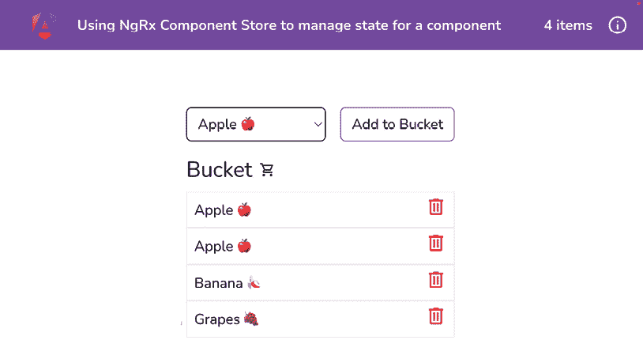

    图 6.14：通过组件存储在页眉中显示桶的长度

恭喜！你已经完成了食谱。查看下一节以了解它是如何工作的。

## 它是如何工作的…

如前所述，`@ngrx/component-store` 是一个独立的包，可以轻松地安装到你的 Angular 应用中，而无需使用 `@ngrx/store`、`@ngrx/effects` 等等。它旨在取代 Angular 服务中 `BehaviorSubject` 的使用，这正是我们在本食谱中做的。我们介绍了如何初始化 `ComponentStore`，以及如何使用 `setState` 方法设置初始状态，因为我们已经有了值而没有访问状态，我们还学习了如何创建更新器方法，这些方法可以用来更新状态，因为它们可以访问状态，并允许我们为我们的用例传递参数。

## 参见

+   `@ngrx/component-store` 文档 ([`ngrx.io/guide/component-store`](https://ngrx.io/guide/component-store))

+   `@ngrx/component-store` 文档中的效果 ([`ngrx.io/guide/component-store/effect`](https://ngrx.io/guide/component-store/effect))

# 在 Discord 上了解更多

要加入这本书的 Discord 社区——在那里你可以分享反馈，向作者提问，并了解新版本——请扫描下面的二维码：

`packt.link/AngularCookbook2e`


