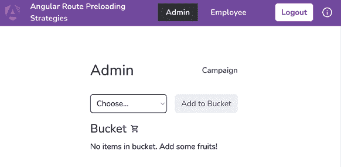
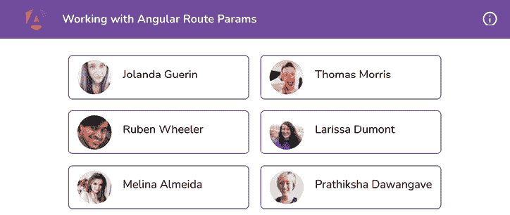

# 7

# 理解 Angular 导航和路由

Angular 最令人惊奇的事情之一是它是一个完整的生态系统（一个框架），而不仅仅是一个库。在这个生态系统中，Angular 路由是学习和理解的最关键的模块之一。在本章中，你将学习一些关于 Angular 路由和导航的非常酷的技术。你将了解如何保护你的路由，监听路由变化，并在路由变化时配置全局操作。

以下是我们将在本章中涵盖的食谱：

+   在 Angular (独立) 应用中创建路由

+   Angular 中的懒加载路由

+   预加载路由策略

+   使用路由守卫授权访问路由

+   使用路由参数进行操作

+   在路由变化之间显示全局加载器

# 技术要求

对于本章的食谱，请确保你的设置已按照 'Angular-Cookbook-2E' GitHub 仓库中的 '技术要求' 完成。有关设置详情，请访问：[`github.com/PacktPublishing/Angular-Cookbook-2E/tree/main/docs/technical-requirements.md`](https://github.com/PacktPublishing/Angular-Cookbook-2E/tree/main/docs/technical-requirements.md)。本章的起始代码位于 [`github.com/PacktPublishing/Angular-Cookbook-2E/tree/main/start/apps/chapter07`](https://github.com/PacktPublishing/Angular-Cookbook-2E/tree/main/start/apps/chapter07)。

# 在 Angular (独立) 应用中创建路由

如果你问我我们过去 7-8 年是如何创建 Web 应用项目的话，你会惊讶地了解到那是多么困难。幸运的是，软件开发行业中的工具和标准已经发展，对于 Angular 来说，开始一个项目变得超级简单。使用 Angular 独立应用，应用的引导过程和路由配置都要小得多。在本食谱中，你将要在一个新的 Angular 应用程序中实现一些路由。

## 准备工作

我们将要工作的应用位于克隆的仓库中的 `start/apps/chapter07/ng-basic-routing` 目录下：

1.  在你的代码编辑器中打开代码仓库。

1.  打开终端，导航到代码仓库目录，并运行以下命令以启动项目：

    ```js
    npm run serve ng-basic-routing 
    ```

    这应该在新的浏览器标签页中打开应用。你应该看到以下内容：

    

    图 7.1：ng-basic-routes 应用在 http://localhost:4200 上运行

## 如何操作…

我们将在应用中配置路由，添加一些路由，并在页眉中添加这些路由的链接。让我们开始吧：

1.  首先，在 `app` 文件夹内创建一个名为 `app.routes.ts` 的文件，并将以下代码添加到其中：

    ```js
    import { Route } from '@angular/router';
    export const appRoutes: Route[] = []; 
    ```

1.  现在更新 `src` 文件夹中的 `app.config.ts` 文件，并按照以下更改进行：

    ```js
    import { ApplicationConfig } from '@angular/core';
    **import** **{**
    **provideRouter,**
    **withEnabledBlockingInitialNavigation,**
    **}** **from****'@angular/router'****;**
    **import** **{ appRoutes }** **from****'./app.routes'****;**
    export const appConfig: ApplicationConfig = {
      providers: [**provideRouter****(appRoutes,** **withEnabledBlockingInitialNavigation****())**],
    }; 
    ```

1.  现在，让我们创建一些组件（作为页面）。我们将创建一个主页和一个`about`页。在工作区的`start`文件夹中，从终端运行以下`npx`命令。如果需要，你可以使用`@nx/angular:component`脚本来选择“按提供”操作：

    ```js
    nx g c home --directory apps/chapter07/ng-basic-routing/src/app/home --standalone
    nx g c about --directory apps/chapter07/ng-basic-routing/src/app/about --standalone 
    ```

    你现在应该在项目的`app`文件夹中看到创建了两个新文件夹。

1.  我们现在将配置路由。更新我们在*步骤 1*中创建的`app.routes.ts`文件，如下所示：

    ```js
    import { Route } from '@angular/router';
    **import** **{** **AboutComponent** **}** **from****'./about/about.component'****;**
    **import** **{** **HomeComponent** **}** **from****'./home/home.component'****;**
    export const appRoutes: Route[] = [**{**
    **path****:** **''****,**
    **pathMatch****:** **'full'****,**
    **redirectTo****:** **'home'**
    **}, {**
    **path****:** **'home'****,**
    **component****:** **HomeComponent**
    **}, {**
    **path****:** **'about'****,**
    **component****:** **AboutComponent**
    **}**
    ]; 
    ```

1.  剩下的就是在视图中使用模板中的`<router-outlet>`来连接路由。更新`app.component.html`文件如下：

    ```js
    <!-- Toolbar -->
    ...
    <main class="content" role="main">
    **<****router-outlet****></****router-outlet****>**
    </main> 
    ```

    但是等等！这会导致应用崩溃。这是因为`AppComponent`还没有理解路由。

1.  更新`app.component.ts`文件，在其中添加`RouterModule`，如下所示：

    ```js
    ...
    **import** **{** **RouterModule** **}** **from****'@angular/router'****;**
    @Component({
      ...,
      imports: [CommonModule, **RouterModule**],
    })
    export class AppComponent {} 
    ```

    哇！现在你应该能够看到`home`组件了，如下所示：

    

    图 7.2：ng-basic-routes 应用中的 home 组件

    如果你查看 URL，它默认为`http://localhost:4200/home`，即使你尝试访问`https://localhost:4200`。

1.  最后，我们将在页眉中添加路由的链接。更新`app.component.html`文件如下：

    ```js
    <!-- Toolbar -->
    <div class="toolbar" role="banner">
      ...
      <div class="spacer"></div>
    **<****div****class****=****"route-links"****>**
    **<****div**
    **class****=****"route-links__route-link"**
    **routerLink****=****"/home"**
    **routerLinkActive****=****"route-links__route-link--active"**
    **>**
    **Home**
    **</****div****>**
    **<****div**
    **class****=****"route-links__route-link"**
    **routerLink****=****"/about"**
    **routerLinkActive****=****"route-links__route-link--active"**
    **>**
    **About**
    **</****div****>**
    **</****div****>**
      ...
    <main class="content" role="main">...</main> 
    ```

    现在，如果你点击顶部的**关于**链接，你应该能够看到`about`路由，如下所示：

    

    图 7.3：ng-basic-routes 应用中的 about 组件

太棒了！在几分钟内，借助 Angular 路由和 NX CLI，我们能够创建一个主页和一个`about`页，并且还配置了路由。现代网络的奇迹！

现在你已经知道了基本路由是如何实现的，下一节将帮助你理解它是如何工作的。

## 它是如何工作的…

当我们创建一个不带`--routing`标志的 Angular 应用时，我们不会得到`app.routes.ts`文件，也不会在`main.ts`文件中添加配置。在这个例子中，我们使用了一个已经设置了此标志的应用。如果你要开始一个新的项目，你可以在创建应用时直接使用`--routing`标志，以便从应用一开始就设置好路由。然后我们使用`nx g c <component name> –standalone`命令创建了一些独立组件。如果你使用 Angular CLI 而不是 NX 单仓库，你只需在上一个命令中将`nx`替换为`ng`，其余的都相同。使用`npx`允许我们使用`nx`包，而无需在我们的系统中全局安装它。由于我们有一个独立的应用，即`AppComponent`是一个独立组件（注意`app.component.ts`文件中的`standalone: true`），我们必须将其导入到`RouterModule`中，以便能够使用`<router-outlet>`和链接上的`routeLink`属性。由于我们没有`AppModule`（因为应用是一个独立应用），我们通过在`main.ts`文件中使用`provideRouter`函数并添加路由来配置路由。

## 参见

+   Angular 路由文档：[`angular.io/guide/router`](https://angular.io/guide/router)

+   Angular 独立组件：[`angular.io/guide/standalone-components`](https://angular.io/guide/standalone-components)

# Angular 中的懒加载路由

在前面的食谱中，我们学习了如何创建一个带有急速加载路由的基本路由应用。在这个食谱中，你将学习如何使用功能模块来懒加载它们，而不是在应用加载时加载它们。对于这个食谱，我们假设我们已经有路由在位，我们只需要懒加载它们。

## 准备工作

我们将要工作的应用位于克隆的仓库中的`start/apps/chapter07/ng-lazy-routing`：

1.  在你的代码编辑器中打开代码仓库。

1.  打开终端，导航到代码仓库目录，并运行以下命令以启动项目：

    ```js
    npm run serve ng-lazy-routing 
    ```

    这应该在新的浏览器标签中打开应用。如果你打开**网络**标签，你应该会看到以下内容：

    

    图 7.4：ng-lazy-routing 应用在 http://localhost:4200 上运行

现在我们已经在本地运行了应用，让我们看看下一节中食谱的步骤。

## 如何实现...

如*图 7.4*所示，我们所有的组件和模块都在`main.js`文件中。因此，`main.js`文件的大小约为 11.9 KB（这可能会根据 Angular 如何进一步优化框架而改变）。我们将修改代码和路由结构以实现懒加载。因此，当我们导航到这些路由时，路由的文件将会被加载。在*独立组件*时代之前，这一步是困难的。即使今天，如果你使用`NgModules`与 Angular 应用一起工作，你也会发现设置路由需要更多的代码。但既然我们的应用只有独立组件，看看这变得有多简单：

1.  将`app.routes.ts`更新为使用`loadComponent`方法代替路由中的`component`属性，如下所示：

    ```js
    import { Route } from '@angular/router';
    export const appRoutes: Route[] = [{
      path: '',
      pathMatch: 'full',
      redirectTo: 'home'
    }**, {**
    **path****:** **'home'****,**
    **loadComponent****:** **() =>****import****(****'./home/home.component'****).****then****(****m** **=>** **m.****HomeComponent****)**
    **}, {**
    **path****:** **'about'****,**
    **loadComponent****:** **() =>****import****(****'./about/about.component'****).****then****(****m** **=>** **m.****AboutComponent****)**
    **}**]; 
    ```

    刷新应用后，你会看到`main.js`文件的包大小降至 8.3 KB，之前大约是 11.9 KB。请看以下截图：

    

    图 7.5：应用加载时 main.js 文件大小的减少

    但关于`Home`和`About`路由呢？还有懒加载呢？好吧，点击页眉中的**About**路由，你会在**网络**标签中看到一个针对该路由的新 JavaScript 文件正在下载。这就是懒加载的作用！请看以下截图：

    

    图 7.6：关于路由的懒加载

太棒了！你刚刚学会了如何在 Angular 应用中懒加载路由和功能组件的艺术。你现在可以向你的朋友炫耀这项技能了。

## 它是如何工作的...

Angular 使用模块和组件，通常，功能被拆分为 `NgModules`，或者使用独立组件，组件本身是懒加载的。我们将从独立组件的角度来探讨。正如我们所知，`AppComponent` 作为独立 Angular 应用的入口点，Angular 将在构建过程中导入并捆绑在 `AppComponent` 中导入的任何内容，从而生成 `main.js` 文件。然而，如果我们想懒加载我们的路由/功能组件，我们需要避免在 `AppComponent` 中直接导入功能组件，甚至不在路由中导入它们。相反，我们可以使用 `loadChildren` 方法来懒加载其他模块，或者使用 `loadComponent` 方法来懒加载其他独立组件。这正是我们在本食谱中做的事情。需要注意的是，在 `app.routes.ts` 文件中，路由保持不变。

## 参考也

+   在 Angular 中懒加载模块：[`angular.io/guide/lazy-loading-ngmodules`](https://angular.io/guide/lazy-loading-ngmodules)

+   懒加载独立组件：[`angular.io/guide/standalone-components#routing-and-lazy-loading`](https://angular.io/guide/standalone-components#routing-and-lazy-loading)

# 预加载路由策略

我们已经熟悉了如何在导航期间懒加载不同的功能模块。不过，有时你可能希望预加载后续路由以使下一个路由导航瞬间完成，或者甚至可能希望根据应用程序的业务逻辑使用自定义预加载策略。在本食谱中，你将了解 `PreloadAllModules` 策略，并实现一个自定义策略来选择哪些模块应该被预加载。

## 准备工作

我们将要工作的应用位于克隆的仓库中的 `start/apps/chapter07/ng-route-preload-strat`：

1.  在你的代码编辑器中打开代码仓库。

1.  打开终端，导航到代码仓库目录，并运行以下命令以运行项目：

    ```js
    npm run serve ng-route-preload-strat 
    ```

    这应该在新的浏览器标签页中打开应用。如果你以管理员身份登录，你应该看到以下内容：

    

    图 7.7：在 http://localhost:4200 上运行的 ng-route-preload-strat 应用

1.  通过按 Windows 上的 *Ctrl* + *Shift* + *C* 或 Mac 上的 *Cmd* + *Shift* + *C* 来打开 Chrome 开发者工具。

1.  导航到 **网络** 选项卡，并仅过滤 JavaScript 文件。你应该看到如下内容！

    图 7.8：应用加载时加载的 JavaScript 文件

现在我们已经在本地运行了应用，让我们看看本食谱的下一节。

## 如何操作…

注意在 *图 7.8* 中的第一个网络调用。这是包含 `admin` 组件和 `bucket` 组件的 JavaScript 包。尽管 `app-routes.ts` 中的所有路由都配置为懒加载，但我们仍然可以查看如果我们使用 `PreloadAllModules` 策略然后自定义预加载策略会发生什么：

1.  我们将首先尝试使用`PreloadAllModules`策略。为了使用它，让我们按照以下方式修改`app/app.config.ts`文件：

    ```js
    import { ApplicationConfig } from '@angular/core';
    import {
      **PreloadAllModules****,**
    **provideRouter****,**
    **withEnabledBlockingInitialNavigation****,**
    **withPreloading****,**
    **}** from '@angular/router';
    import { appRoutes } from './app.routes';
    import { provideAnimations } from '@angular/platform-browser/animations';
    export const appConfig: ApplicationConfig = {
      providers: [
        provideRouter(
          appRoutes,
          withEnabledBlockingInitialNavigation(),
          **withPreloading****(****PreloadAllModules****)**
        ),
        provideAnimations(),
      ],
    }; 
    ```

    如果你刷新应用，你应该看到所有组件的 JavaScript 包正在下载，如下所示：

    

    图 7.9：使用 PreloadAllModules 策略预先加载所有组件

    这已经提供了巨大的性能优势，因为最小的`app` `shell`首先被加载，然后所有其他包并行预加载。这意味着当用户现在导航到页面时，他们不需要下载路由的包并立即导航（即，导航将更快）。但如果我们只想预加载`admin`模块，假设我们的应用主要是为管理员设计的呢？我们将为那个创建一个自定义预加载策略。

1.  让我们从`start`文件夹中运行以下命令来创建一个名为`CustomPreloadStrategy`的服务：

    ```js
    nx g service app-preload-strategy --project ng-route-preload-strat 
    ```

1.  为了使用我们的预加载策略服务与 Angular 一起工作，我们的服务需要实现`@angular/router`包中的`PreloadingStrategy`接口。按照以下方式修改新创建的服务：

    ```js
    import { Injectable } from '@angular/core';
    **import** **{** **PreloadingStrategy** **}** **from****'@angular/router'****;**
    @Injectable({
      providedIn: 'root'
    })
    export class CustomPreloadStrategyService**implements****PreloadingStrategy** {
    } 
    ```

1.  接下来，我们需要实现`PreloadingStrategy`接口中的`preload`方法，以便我们的服务能够正常工作。让我们修改`CustomPreloadStrategyService`以实现`preload`方法，如下所示：

    ```js
    import { Injectable } from '@angular/core';
    import { PreloadingStrategy**,** **Route** } from '@angular/router';
    **import** **{** **Observable****,** **of** **}** **from****'rxjs'****;**
    @Injectable({...})
    export class CustomPreloadStrategyService implements PreloadingStrategy {
      **preload****(****route****:** **Route****,** **load****:** **() =>****Observable****<****any****>):**
    **Observable****<****any****> {**
    **return****of****(****null****)**
    **}**
    **logAndLoad****(****route****:** **Route****,** **load****: () =>** **Observable****<****any****>****) {**
    **console****.****log****(****`Preloading route:** **${route.path}****`****);**
    **return****load****();**
    **}**
    } 
    ```

1.  目前，我们的`preload`方法返回`of(null)`。相反，为了决定要预加载哪些路由，我们将在我们的路由定义中添加一个对象作为`data`对象，该对象具有布尔值，用于预加载`admin`路由和`employee`路由。让我们按照以下方式修改`app-routes.ts`：

    ```js
    ...
    export const appRoutes: Route[] = [
      { path: '', ...},
      { path: 'auth', ...},
      { path: 'admin', ..., **data****: {** **loadForAdmin****:** **true** **}** },
      {
        path: 'admin-campaign',
        ...,
        **data****: {** **loadForAdmin****:** **true** **}**
      },
      {
        path: 'employee',
        ...,
       **data****: {** **loadForEmployee****:** **true** **},**
      },
      {
        path: 'employee-campaign',
        ...,
        **data****: {** **loadForEmployee****:** **true** **},**
      },
    ]; 
    ```

1.  现在让我们在`AppPreloadStrategyService`类的`preload`方法中添加逻辑，以处理在*步骤 5*中添加的属性。我们将首先注入`AuthService`，并在`preload`方法内部创建一些变量。更新`app-preload-strategy.service.ts`文件如下：

    ```js
    ...
    **import** **{** **AuthService** **}** **from****'./auth/auth.service'****;**
    **import** **{** **UserType** **}** **from****'./constants/user-type'****;**
    ...
    export class AppPreloadStrategyService implements PreloadingStrategy {
      **auth =** **inject****(****AuthService****);**
    preload(route: Route, load: () => Observable<any>): Observable<any> {
        **const** **isLoggedIn =** **this****.****auth****.****isLoggedIn****();**
    **if** **(!isLoggedIn) {**
    **return****of****(****null****)**
    **}**
    **const** **isAdmin =** **this****.****auth****.****loggedInUserType** **===**
    **UserType****.****Admin****;**
    return of(null)
      }
      logAndLoad(route: Route, load: () => Observable<any>) {...}
    } 
    ```

1.  让我们进一步修改`preload`方法，以便与`loadForAdmin`和`loadForEmployee`路由数据属性一起使用如下：

    ```js
    ...
    export class CustomPreloadStrategyService implements PreloadingStrategy {
    ...
      preload(route: Route, load: () => Observable<any>):
      Observable<any> {
        ...
        const isAdmin = this.auth.loggedInUserType ===
      UserType.Admin;
        **if** **(**
    **(isAdmin && route.****data****?.[****'loadForAdmin'****]) ||**
    **(!isAdmin && route.****data****?.[****'loadForEmployee'****])**
    **) {**
    **return****this****.****logAndLoad****(route, load);**
    **}**
    return of(null)
      }
    } 
    ```

1.  最后一步是使用我们的自定义预加载策略。为了做到这一点，我们需要按照以下方式修改`app/app.config.ts`文件：

    ```js
    import { ApplicationConfig } from '@angular/core';
    import {
      provideRouter,
      withEnabledBlockingInitialNavigation,
      withPreloading,
    } from '@angular/router';
    import { appRoutes } from './app.routes';
    **import** **{** **AppPreloadStrategyService** **}** **from****'./app-preload-strategy.service'****;**
    import { provideAnimations } from '@angular/platform-browser/animations';
    export const appConfig: ApplicationConfig = {
      providers: [
        provideRouter(
          appRoutes,
          withEnabledBlockingInitialNavigation(),
          withPreloading(AppPreloadStrategyService)
        ),
        provideAnimations(),
      ],
    }; 
    ```

    哇！如果你现在刷新应用并监控**网络**选项卡，你会注意到当你以`admin`身份登录时，你可以在控制台日志中看到`admin-campaign`路由已被预加载，如图*图 7.10*所示：

    

    图 7.10：使用自定义预加载策略在到达 admin 路由时预加载 admin-campaign 路由

    你也可以查看**网络**选项卡来查看正在下载的包：

    

    图 7.11：为 admin-campaign 路由预先加载 JavaScript 包

尝试注销并作为员工登录。你会看到`employee-campaign`路由正在预加载。不仅如此，如果你刷新`employee-campaign`路由，你还会看到`employee`路由也在预加载。对于`admin-campaign`和`admin`路由也是如此。

现在你已经完成了配方，请查看下一节了解它是如何工作的。

## 它是如何工作的…

Angular 提供了一种很好的方式来实现我们自己的自定义预加载策略，用于我们的功能模块。我们可以轻松地决定哪些模块应该预加载，哪些不应该。在配方中，我们学习了一种非常简单的方法来配置预加载，即通过在路由配置的`data`对象中添加名为`loadForAdmin`和`loadForEmployee`的属性。我们创建了自己的自定义预加载策略服务，名为`AppPreloadStrategyService`，该服务实现了来自`@angular/router`包的`PreloadingStrategy`接口。`PreloadingStrategy`类提供了一个名为`preload`的方法，该方法具有以下签名：

```js
preload(route: Route, load: () => Observable<any>) => Observable<any> 
```

命名为`load`的参数是 Angular 路由中的一个方法，它允许我们通过调用它来加载组件/模块。因此，它提供了一个可观察对象。由于`preload`方法必须返回一个可观察对象，所以当我们不想预加载一个路由时，我们返回`of(null)`；当我们想加载与路由关联的组件时，我们返回`load`（它返回一个可观察对象）。一般来说，目标是拥有一个自定义预加载策略，该策略使用`preload`方法来决定是否应该预加载路由。这是因为 Angular 会遍历每个路由，使用我们的自定义预加载策略，并让我们决定哪些路由应该预加载。就是这样。我们可以看到登录用户是否是`admin`并且路由的数据中是否有`loadForAdmin`属性，或者登录用户是否是员工并且路由的数据中是否有`loadForEmployee`属性。然后我们预加载该路由。否则，我们不预加载。当用户未登录时，没有预加载。

## 相关内容

+   在`web.dev`上的路由预加载策略文章：[`web.dev/route-preloading-in-angular/`](https://web.dev/route-preloading-in-angular/)

+   Angular 中的路由预加载策略：[`www.youtube.com/watch?v=RQGLcMnh9k8`](https://www.youtube.com/watch?v=RQGLcMnh9k8)

# 使用路由守卫授权访问路由

并非你的 Angular 应用中的所有路由都应该对世界上所有人可访问。在本配方中，我们将学习如何在 Angular 中创建路由守卫以防止未经授权访问路由。

## 准备工作

我们将要工作的应用位于克隆的仓库中的`start/apps/chapter07/ng-route-guards`目录内：

1.  在你的代码编辑器中打开代码仓库。

1.  打开终端，导航到代码仓库目录，并运行以下命令以运行项目：

    ```js
    npm run serve ng-route-guards 
    ```

    这应该在新的浏览器标签页中打开应用。你应该看到以下内容：

    

    图 7.12：ng-route-guards 应用在 http://localhost:4200 上运行

现在我们已经在本地运行了应用程序，让我们看看下一节中食谱的步骤。

## 如何实现...

我们已经有一个应用程序，其中已经设置了一些路由。你可以以员工或管理员的身份登录，以访问应用程序的待办事项列表。然而，如果你点击页眉中的任意一个按钮，你会看到即使没有登录，你也可以导航到**管理员**和**员工**部分。这正是我们想要防止发生的事情。注意在`auth.service.ts`文件中，我们已经有了一种让用户登录的方法，我们可以使用`isLoggedIn`方法来检查用户是否已登录：

1.  首先，让我们创建一个路由守卫，它将只允许用户在登录的情况下访问特定的路由。我们将它命名为`AuthGuard`。让我们在`auth`文件夹内创建一个新文件，并将其命名为`auth.guards.ts`。然后添加以下代码：

    ```js
    import { inject } from "@angular/core";
    import { CanActivateFn, Router } from "@angular/router";
    import { AuthService } from "./auth.service";
    export const canActivateAdminOrEmployee: CanActivateFn =
      () => {
      const router = inject(Router);
      const authService = inject(AuthService);
      const isLoggedIn = authService.isLoggedIn();
      if (!isLoggedIn) {
        router.navigate(['/auth']);
        return false;
      }
      return true;
    }; 
    ```

1.  现在我们可以将这个守卫添加到路由中。按照以下方式更新`app.routes.ts`：

    ```js
     import { Route } from '@angular/router';
    import { canActivateAdminOrEmployee } from './auth/auth.guards';
    export const appRoutes: Route[] = [
      {...},
      { path: 'auth', ... },
      {
        path: 'admin',
        ...,
        **canActivate****: [canActivateAdminOrEmployee]**
      },
      {
        path: 'employee',
        ...,
        **canActivate****: [canActivateAdminOrEmployee]**
      }
    ]; 
    ```

    如果你现在尝试在不登录的情况下访问管理员或员工页面，你会看到由于路由守卫的存在，你将无法再这样做。

1.  让我们确保如果我们已经登录，我们无法访问`auth`页面。在`auth.guards.ts`文件中添加一个函数守卫，如下所示：

    ```js
    ...
    **import** **{** **UserType** **}** **from****'../constants/user-type'****;**
    **export****const****canActivateLogin****:** **CanActivateFn** **=** **() =>** **{**
    **const** **router =** **inject****(****Router****);**
    **const** **authService =** **inject****(****AuthService****);**
    **const** **isLoggedIn = authService.****isLoggedIn****();**
    **if** **(router.****url** **===** **'/'** **&& isLoggedIn) {**
    **const** **isAdmin = authService.****loggedInUserType** **===**
    **UserType****.****Admin****;**
    **router.****navigate****([****`/****${isAdmin ?** **'admin'** **:**
    **'employee'****}****`****])**
    **return****false**
    **}**
    **return** **!authService.****isLoggedIn****()**
    **}**
    export const canActivateAdminOrEmployee: CanActivateFn = () => {...}; 
    ```

    如果你登录，然后点击浏览器的**后退**按钮，你会看到你也不能回到`/auth`页面。即使你打开一个新标签页并访问`http://localhost:4200`，你也会看到它根据登录用户的类型带你到正确的页面。

太好了！现在，在路由守卫方面，你已经成为了一名授权专家。权力越大，责任越大。明智地使用它。

## 它是如何工作的…

从 Angular v14.2 开始，Angular 切换到了功能路由守卫。这使得与之前的版本相比，配置路由变得更加容易。有许多路由守卫，例如`CanActivate`、`CanDeactivate`和`CanActivateChildren`。在`main.ts`中使用的`provideRouter`函数使我们能够提供带有功能路由守卫的路由。一个路由可以将守卫作为数组与守卫属性名称相对。你可以在*步骤 2*中看到我们如何为`/employee`和`/admin`路由提供了我们的`canActivateAdminOrEmployee`守卫。功能守卫应该返回一个布尔值或一个`UrlTree`，一个布尔值或`UrlTree`的**promise**，或者一个布尔值或`UrlTree`的可观察对象。在我们的菜谱中，我们专注于布尔值的用法。在`canActivateAdminOrEmployee`守卫中，我们检查用户是否已登录。如果是这样，我们允许路由被激活（即，我们允许路由发生），或者我们导航到`/auth`路由。在`canActivateLogin`守卫中，我们做了一些更复杂的事情。由于有人可能会到达主页（路由是`/`，它重定向到`/auth`），我们必须首先检查用户是否已登录，如果是这样，那么这是哪种类型的用户。基于评估，我们将用户路由到`/employee`或`/admin`路由。

## 参见

+   在 Angular 路由中防止未授权访问：[`angular.io/guide/router#preventing-unauthorized-access`](https://angular.io/guide/router#preventing-unauthorized-access)

+   Angular `CanActivateFn` 文档：[`angular.io/api/router/CanActivateFn`](https://angular.io/api/router/CanActivateFn)

# 使用路由参数进行工作

不论是使用 Node.js 构建 REST API 还是配置 Angular 的路由，设置路由是一项绝对的艺术，尤其是在处理参数时。在这个菜谱中，你将创建一些带有参数的路由，并学习如何在路由激活后如何在组件中获取这些参数。

## 准备工作

我们将要工作的应用位于克隆的仓库中的`start/apps/chapter07/ng-route-params`目录下：

1.  在你的代码编辑器中打开代码仓库。

1.  打开终端，导航到代码仓库目录，并运行以下命令以运行项目：

    ```js
    npm run serve ng-route-guards 
    ```

    这应该在新的浏览器标签页中打开应用。你应该看到以下内容：

    

    图 7.13：在 localhost:4200 上运行的 ng-route-params 应用

现在我们已经在本地运行了应用，让我们在下一节中查看菜谱的步骤。

## 如何做到这一点...

目前的问题是，我们有一个用于打开用户详情的路由，但我们看不到任何内容，即我们有一个空白页面。这是因为这个路由没有任何关于要显示哪个用户的想法。如果有一种方法可以从用户列表页面传递点击的用户信息到用户详情页面不是很好吗？这正是我们将在本菜谱中要做的：

1.  首先，我们必须使我们的用户路由能够接受 `route` 参数。这将是一个 `required` 参数，这意味着没有传递此参数，路由将无法工作。让我们修改 `app.routes.ts` 以将此必需参数添加到路由定义中，如下所示：

    ```js
    import { Route } from '@angular/router';
    export const appRoutes: Route[] = [
      { path: '', ...},
      { path: 'users', ...},
      {
        path: 'users/**:uuid**',
        loadComponent: () => ...,
      },
    ]; 
    ```

1.  我们现在将更新 `src/app/components/users-list/users-list.component.html` 文件，以更改链接以使用 `uuid`，如下所示：

    ```js
    <ul>
    <li
     routerLink="/users/**{{user.uuid}}**"
        *ngFor="let user of users">
        ...
      </li>
    </ul> 
    ```

    我们现在能够使用 `uuid` 导航到特定用户的路由，您也应该能在地址栏中看到它，如下所示：

    

    图 7.14：地址栏中显示的 UUID

1.  要根据 `uuid` 从 `UserService` 获取用户，我们需要在 `UserDetailsComponent` 中从路由参数中获取 `uuid` 值。让我们按照以下方式更新 `user-details.component.ts`：

    ```js
    ...
    import { **ActivatedRoute****,** RouterModule } from '@angular/router';
    import { **filter, map,** Observable} from 'rxjs';
    ...
    @Component({...})
    export class UserDetailsComponent {
      **route =** **inject****(****ActivatedRoute****);**
      ...
      **constructor****() {**
    **this****.****user$** **=** **this****.****route****.****paramMap****.****pipe****(**
    **map****(****(****params****) =>** **params.****get****(****'uuid'****)),**
    **filter****(****(****uuid****) =>** **!!uuid),**
    **map****(****(****uuid****) =>** **{**
    **return****this****.****userService****.****getById****(uuid** **as****string****) ||**
    **null****;**
    **})**
    **);**
    **}**
    } 
    ```

    现在，您应该能够从 `/users` 页面看到我们点击的用户。唯一剩下的事情是显示相似用户。

1.  而不是创建另一个订阅，我们可以使用 RxJS 的 `tap` 操作符来利用我们在上一步中创建的订阅。进一步更新 `user-details.component.ts` 文件，如下所示：

    ```js
    ...
    import { filter, map, Observable**,** **of****, tap**} from 'rxjs';
    ...
    @Component({...})
    export class UserDetailsComponent {
      ...
      constructor() {
        this.user$ = this.route.paramMap.pipe(
          map((params) => params.get('uuid')),
          filter((uuid) => !!uuid),
          **tap****(****(****uuid****) =>** **{**
    **this****.****similarUsers$** **=**
    **of****(****this****.****userService****.****getSimilar****(uuid** **as****string****))**
    **}),**
    map((uuid) => {...})
        );
      }
    } 
    ```

    然后，砰！您应该能够看到被点击的用户以及相似用户，如下所示：

    

    图 7.15：地址栏中显示的 UUID

太好了！通过这次更改，您可以在主页上刷新应用，然后点击任何用户。您应该能看到当前用户以及相似用户正在被加载。要了解配方背后的所有魔法，请参阅下一节。

## 它是如何工作的……

所有这一切都始于我们将路由的路径更改为 `user/:userId`。这使得 `userId` 成为我们的路由参数。拼图的另一部分是在 `UserDetailsComponent` 中检索此参数，然后使用它来获取目标用户以及相似用户。为此，我们使用 `ActivatedRoute` 服务。`ActivatedRoute` 服务包含有关当前路由的大量必要信息，因此我们能够通过订阅 `paramMap` 可观察对象来获取当前路由的 `uuid` 参数，所以即使参数在用户页面上发生变化，我们仍然执行必要的操作。`ActivatedRoute` 还有一个 `queryParamMap` 可观察对象，但它适用于查询参数而不是路由参数。如果您不想订阅 `paramMap` 可观察对象，只想在 `ngOnInit` 或构造函数中一次出现值，您还可以使用 `ActivatedRoute` 对象上的 `snapshot` 属性，如下所示：

```js
this.route.snapshot.paramMap.get('uuid'); 
```

注意，使用`paramMap`可观察对象时，我们还使用了`tap`操作符来执行一些额外操作。即将相似用户的值分配给所需的可观察对象。由于这两个可观察对象都仅在模板中使用`async`管道，因此我们不需要自己取消订阅，因为 Angular 会处理这个问题。此外，如果你将新的可观察对象重新分配给由`async`管道使用的属性，它将自动订阅新的可观察对象并取消之前的订阅。

注意，你也可以直接将路由定义中解析的值作为`@Input()`属性提供给组件，使用 v16 中引入的`bindToComponentInputs`或`withComponentInputBinding`属性，分别用于 Angular 模块和独立组件的 Angular Router。有关相关链接，包括解释如何使用`withComponentInputBinding`的文章，请参阅下一节。

## 相关内容

+   *访问* *查询参数和片段*: [`angular.io/guide/router#accessing-query-parameters-and-fragments`](https://angular.io/guide/router#accessing-query-parameters-and-fragments)

+   *获取路由* *信息* – Angular 文档: [`angular.io/guide/router#getting-route-information`](https://angular.io/guide/router#getting-route-information)

+   *绑定路由信息* *到组件输入（新路由功能）*: [`itnext.io/bind-route-info-to-component-inputs-new-router-feature-1d747e559dc4`](https://itnext.io/bind-route-info-to-component-inputs-new-router-feature-1d747e559dc4)

# 在路由转换之间显示全局加载器

构建快速且响应迅速的用户界面是赢得用户的关键。应用程序对最终用户来说变得更加有趣，这可以为应用程序的所有者/创建者带来很多价值。现代网络的核心体验之一是在后台发生某些操作时显示加载器。在这个食谱中，你将学习如何在 Angular 应用程序中创建一个全局用户界面加载器，以便在应用程序中发生路由转换时显示。

## 准备工作

我们将要工作的应用程序位于克隆的仓库中的`start/apps/chapter07/ng-global-loader`目录内：

1.  在你的代码编辑器中打开代码仓库。

1.  打开终端，导航到代码仓库目录，并运行以下命令以启动项目：

    ```js
    npm run serve ng-global-loader 
    ```

    这应该在新的浏览器标签页中打开应用程序，你应该看到以下内容：

    

    图 7.16：ng-global-loader 应用程序在 http://localhost:4200 上运行

现在我们已经在本地运行了应用程序，让我们在下一节中查看食谱的步骤。

## 如何操作…

如果你尝试登录或登出，你会注意到路由变化需要一段时间。我们在 `start/apps/chapter07/ng-global-loader/src/app/auth/auth.guard.ts` 文件中的 `canActivateLogin` 路由守卫中手动模拟了路由变化的延迟，该文件使用 RxJS 的 `delay` 操作符在一个可观察链中，在检查用户是否登录以及用户的类型之前。目的是模拟需要基于 HTTP 调用来路由的使用场景。在这个食谱中，我们已经创建了 `LoaderComponent`，我们必须在路由变化期间使用它：

1.  我们首先在 `app.component.ts` 中添加一个新的属性 `isRouting`。我们将其初始化为 `true`。我们还在 `AppComponent` 类的 `imports` 中导入 `LoaderComponent` 类，这样我们就可以在模板中使用它。按照以下方式更新文件：

    ```js
    ...
    @Component({
      ...
      imports: [RouterModule, CommonModule**,** **LoaderComponent**],
      providers: [...],
    })
    export class AppComponent {
      ...
      router = inject(Router);
      **isRouting =** **true****;**
      ...
    } 
    ```

1.  现在，我们将在 `app.component.html` 中添加加载器以有条件地显示它，并将整个应用内容包裹在另一个变量中。按照以下方式更新文件：

    ```js
    <div *ngIf="isRouting; else app" class="loader-container
      fixed w-full h-full flex items-center justify-center ">
    <app-loader></app-loader>
    </div>
    <ng-template #app>
    <div class="toolbar" role="banner">...</div>
    <main class="content" role="main">...</main>
    </ng-template> 
    ```

    你现在应该能够在每个路由上，在屏幕上持续看到加载器。然而，我们希望它与 Angular 路由一起工作。

1.  现在，我们将更新 `app.component.ts` 文件以监听路由服务的 `events` 属性，并在 `NavigationStart` 事件上采取行动。按照以下方式修改 `app.component.ts` 文件中的代码：

    ```js
    import { **NavigationStart****,** Router, RouterModule } from '@angular/router';
    ...
    @Component({...})
    export class AppComponent {
      **constructor****() {**
    **this****.****router****.****events****.****subscribe****(****(****event****) =>** **{**
    **if** **(event** **instanceof****NavigationStart****) {**
    **this****.****isRouting** **=** **true****;**
    **}**
    **})**
    **}**
    get isLoggedIn() {...}
    } 
    ```

    如果你刷新应用，你会注意到 `<app-loader>` 从未消失。这是因为我们没有在任何地方将 `isRouting` 属性标记为 `false`。

1.  要将 `isRouting` 标记为 `false`，我们需要检查三个不同的事件：`NavigationEnd`、`NavigationError` 和 `NavigationCancel`。让我们添加一些额外的逻辑来处理这三个事件并将属性标记为 `false`：

    ```js
    ...
    import { **NavigationCancel****,** **NavigationEnd****,** **NavigationError****,** NavigationStart, Router, RouterModule } from '@angular/router';
    ...
    @Component({...})
    export class AppComponent {
      ...
      isRouting = **false**;
      constructor() {
        this.router.events.subscribe((event) => {
          if (event instanceof NavigationStart) {
            this.isRouting = true;
          }**else****if** **(**
    **event** **instanceof****NavigationEnd** **||**
    **event** **instanceof****NavigationError** **||**
    **event** **instanceof****NavigationCancel**
    **) {**
    **this****.****isRouting** **=** **false****;**
    **}**
        })
      }
      ...
    } 
    ```

    现在我们有一个在页面间导航时显示的全局加载器。

恭喜你完成了食谱。现在你可以在 Angular 应用中实现一个全局加载器，它将从导航开始显示到导航结束。

## 它是如何工作的…

路由服务是 Angular 中一个非常强大的服务。它拥有许多方法以及我们可以用于我们应用中不同任务的观察者。对于这个菜谱，我们使用了`events`观察者。通过订阅`events`观察者，我们可以监听`Router`服务通过观察者发出的所有事件。这个用法中最常见的案例之一（尤其是作为一个**单页应用程序**（SPA））是使用 Google Analytics 或 Mixpanel 跟踪页面访问。对于这个菜谱，我们只对`NavigationStart`、`NavigationEnd`、`NavigationError`和`NavigationCancel`事件感兴趣。当路由开始导航时，会发出`NavigationStart`事件。当导航成功结束时，会发出`NavigationEnd`事件。当由于路由守卫返回`false`或由于某些原因使用`UrlTree`进行重定向而取消导航时，会发出`NavigationCancel`事件。当在导航过程中由于任何原因出现错误时，会发出`NavigationError`事件。所有这些事件都是`Event`类型，我们可以通过检查它是否是目标事件的实例来识别事件类型，使用`instanceof`关键字。请注意，由于我们在`AppComponent`中订阅了`Router.events`属性，所以我们不必担心取消订阅，因为应用中只有一个订阅，且`AppComponent`在整个应用生命周期中不会被销毁。

## 参见

+   路由事件文档：[`angular.io/guide/router#router-events`](https://angular.io/guide/router#router-events)

+   路由服务文档：[`angular.io/api/router/Router`](https://angular.io/api/router/Router)

# 在 Discord 上了解更多

要加入这本书的 Discord 社区——在那里您可以分享反馈、向作者提问，并了解新版本——请扫描下面的二维码：

`packt.link/AngularCookbook2e`


