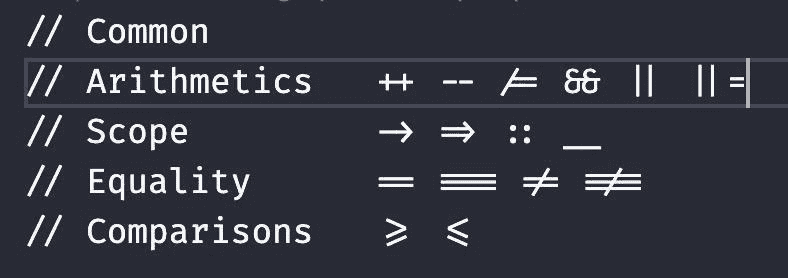
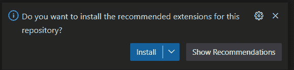
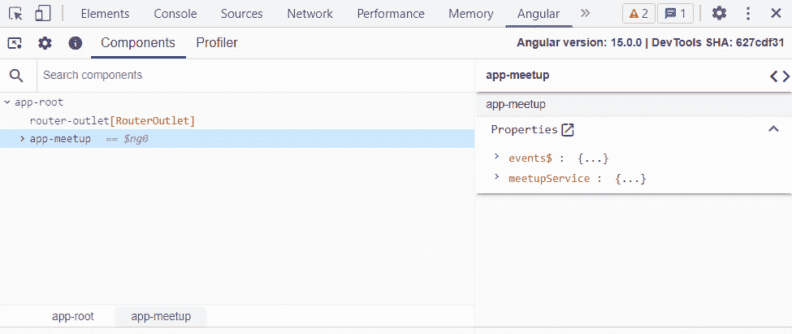
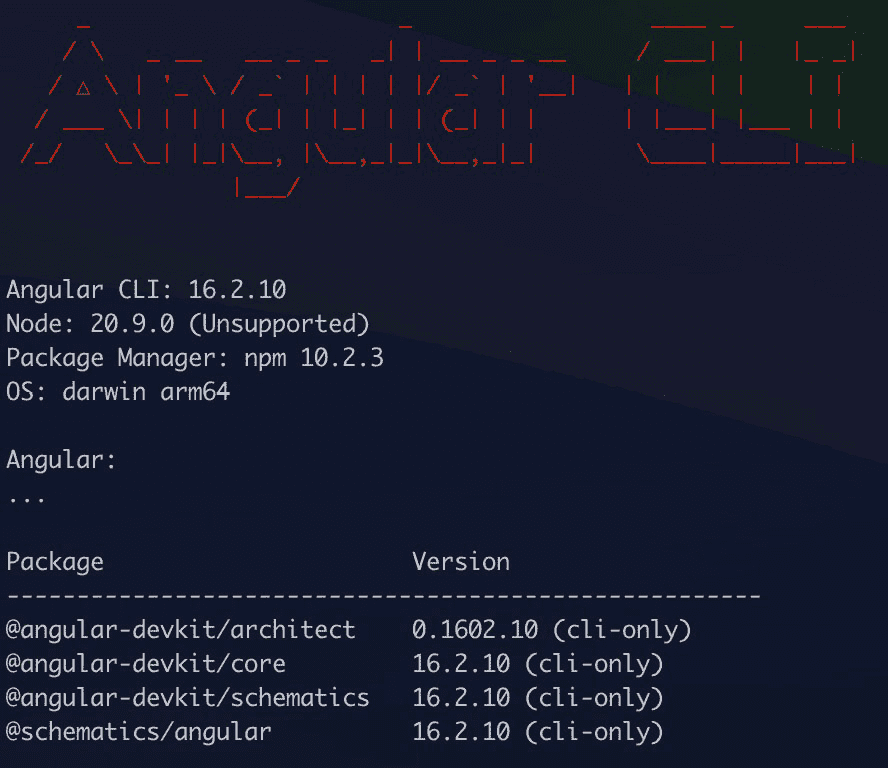
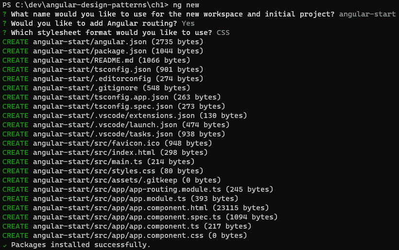
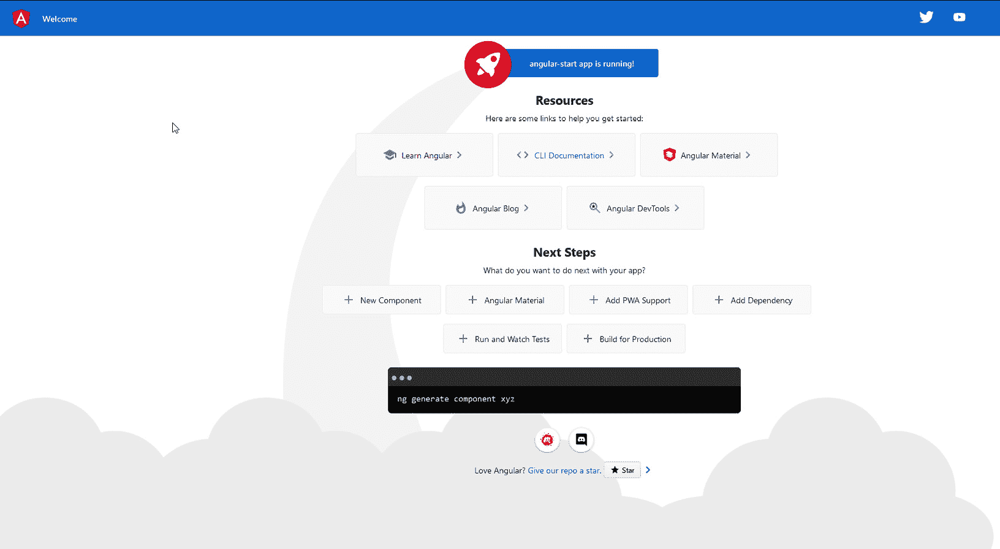
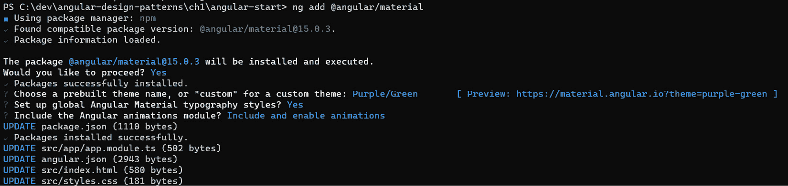

# 1

# 正确开始项目

**Angular** 是一个以“*一应俱全*”作为开发理念的框架。这意味着您需要的所有前端应用程序资源在创建新项目时就已经全部可用。

在本章中，您将了解为什么为您的 Web 应用程序选择 Angular，它的主要特性和设计是什么，以及为什么公司，尤其是最大的公司，选择 Angular 作为开发单页应用程序的主要框架。

您将探索构成框架的技术，并在需要特定情况下的可能替代方案时，充分利用这些技术。您还将使用最佳工具设置您的办公空间，以帮助您和您的团队提高生产力。

在本章中，我们将涵盖以下主题：

+   为什么选择 Angular？

+   生态系统中有哪些技术？

+   配置您的开发环境

+   开始一个 Angular 项目

+   使用 Angular **命令行界面** (**CLI**) 提高您的生产力

到本章结束时，您将为在项目中使用 Angular 提供论据，并在您的开发工作区中更加高效。

# 技术要求

要遵循本章中的说明，您需要以下内容：

+   **Visual Studio Code** (**VS** **Code**) ([`code.visualstudio.com/Download`](https://code.visualstudio.com/Download))

+   Node.js 18 或更高版本 ([`nodejs.org/en/download/`](https://nodejs.org/en/download/))

本章的代码文件可在 [此处](https://example.org) 获取。

# 为什么选择 Angular？

在特定项目中选择要使用的技术对其成功至关重要。作为项目开发者或架构师，您必须通过选择最适合这项工作的工具来帮助您的团队完成这项任务。

Angular 框架是构建单页应用程序最常用的工具之一，与 React 和 Vue 一起。在选择适合这项工作的正确工具时，您需要回答“为什么”。

以下是一些选择 Angular 的论据。

## 一应俱全

Angular 是一个有观点的框架，这意味着 Angular 开发团队已经为每个可能出现在 Web 应用程序中的挑战做出了几个工具和解决方案的选择。这样，您和您的团队就不必研究应该使用哪个路由引擎或状态管理库；所有这些都已经包含并为您项目配置好了。

此功能还简化了您团队中新开发者的入职流程。遵循文档中提出的指南和使用最佳实践，Angular 项目通常具有相同的结构和开发方法。了解 Angular 后，您可以快速定位到任何正在进行的项目。

## Google 支持

Angular 是由谷歌的 Angular 团队创建和维护的。尽管像 Vue.js 和 Svelte 这样的优秀框架仅由其社区维护，但有一个大型科技公司支持框架，这为技术选择带来了安全性，尤其是对于大型公司来说。

此外，Angular 被用于超过 300 个内部应用程序和谷歌产品中，这意味着稳定性和质量，因为，在发布框架的新版本之前，它已经在所有这些应用程序中得到验证。

自从版本 13 以来，Angular 团队一直努力通过发布路线图([`angular.io/guide/roadmap`](https://angular.io/guide/roadmap))来增加社区内的透明度，详细说明所有正在进行中的改进以及未来框架的预期，让您放心，它将在未来几年内得到支持。

## 社区

技术的生命力取决于支持它的社区，Angular 拥有一个庞大的社区。聚会、播客、活动、文章和视频——Angular 社区拥有许多资源来帮助开发者。

构成这个社区的人们还对 Angular 做出了重要的贡献，即提供反馈、创建和修复 Angular 的问题。由于它是一个开源项目，每个人都受邀评估和贡献代码。

Angular 团队还通过**请求评论**（**RFCs**）的方式向社区寻求帮助，以做出重大的框架决策。

此外，社区还创建了众多库，扩展了框架的可能性，例如 NgRx([`ngrx.io/`](https://ngrx.io/))用于高级状态管理和 Transloco([`ngneat.github.io/transloco/`](https://ngneat.github.io/transloco/))以支持国际化等。

## 工具

与其竞争对手相比，Angular 的一个不同之处在于从一开始就专注于工具和开发者体验。Angular CLI 工具是一个强大的生产力工具，我们将在本章中探讨它，它不仅用于项目的简单创建和设置。

从测试的角度来看，Angular 已经配备了 Karma 作为测试运行器和 Jasmine 作为配置工具。Angular 的工具已经使用 webpack 配置了项目构建，并且已经有一个开发服务器。

该工具也是可扩展的，允许社区为配置和更新他们的库创建常规。

基于这些论点，您将能够根据您的项目选择 Angular；现在让我们看看构成框架生态系统的技术有哪些。

# 生态系统中有哪些技术？

当 Angular 团队为不断增长的 Web 应用程序开发复杂性寻找解决方案时，决定将最佳的工具和库联合在一个有见地的包中，并尽可能多地使用默认配置。

然后，我们有以下库构成了 Angular 的核心。

## TypeScript

**TypeScript** 是 JavaScript 语言的超集，它向语言添加了类型检查和其他功能，确保了更好的开发体验和安全性，适用于 Web 开发。

它自 Angular 的第一个版本以来就存在，是框架的基石，它使得依赖注入、类型化表单和 Angular 的工具等功能成为可能。

TypeScript 目前是 Node.js 后端开发的首选工具，并且受到 React 和 Vue.js 等其他框架社区的鼓励。

## RXJS

RXJS 是一个在 JavaScript 语言中实现响应式范式的库 ([`www.reactivemanifesto.org/`](https://www.reactivemanifesto.org/))。

自 Angular 的第一个版本以来，响应性一直是框架想要实现的核心主题，因此它使用 **RXJS** 库来帮助实现这一目标。

HTTP 请求、路由、表单以及其他 Angular 元素使用可观察对象及其操作符的概念，为 Angular 开发者提供工具，以创建更流畅和动态的应用程序，同时减少样板代码。

RXJS 还提供了在前端应用程序中进行状态管理的方法，无需使用更复杂的模式，如 Redux。

## Karma 和 Jasmine

质量在任何应用程序中都应该是首要任务，这对于前端应用程序尤为重要，因为对于用户来说，它就是 **那个** 应用程序。

质量的一个证明方式是通过测试，考虑到这一点，Angular 默认已经包含了 **Jasmine** 和 **Karma** 工具组合。

Jasmine 是一个用于对 JavaScript 和 TypeScript 应用程序进行单元测试的框架，它提供了多个断言和测试组装功能。

Karma 是测试运行器，即执行单元测试设置的运行环境，它借助 Jasmine 来执行。这个环境在其配置文件中配置，在浏览器中运行，与客户的日常生活相比，使测试更加真实。

由于测试执行的性能，社区中许多人将这两个工具切换到 Jest 框架，这是完全可以接受的，甚至 Angular CLI 还提供了便利；然而，应该注意的是，这个工具不在浏览器中运行，这确实提高了测试执行的性能，但可能会隐藏一些只有通过在浏览器中进行测试才能提供的特定性。

## Webpack

在应用程序开发完成后，需要创建捆绑包以发送到生产环境，Webpack 就是 Angular 团队选择的这个任务的工具。

Webpack 是一个非常强大且通用的打包器，正是由于它，框架能够实现一些有趣的优化，如摇树优化和捆绑的懒加载。

然而，Webpack 的配置复杂，考虑到这一点，Angular 团队已经设置并创建了一些抽象，以便对工具进行微调，例如 `angular.json` 文件。

我们理解框架的各个组成部分以及它们如何与提供丰富和流畅的用户界面相关联。现在，我们将设置我们的开发环境。

# 配置您的开发环境

拥有正确工具的井然有序的环境是通往卓越和高效的第一步；现在，让我们在您的开发空间中设置此环境。

按照技术要求部分中的说明安装 Node.js 后，以下工具及其插件将帮助您在您的开发流程中。

## VS Code

**VS Code** ([`code.visualstudio.com/`](https://code.visualstudio.com/)) 目前是大多数开发者的默认工具，尤其是对于前端项目。

还有其他非常好的工具，例如 WebStorm ([`www.jetbrains.com/webstorm`](https://www.jetbrains.com/webstorm))，但 VS Code，特别是针对 Angular 项目的插件，可以极大地提高生产力和人体工程学。

要安装此处列出的插件，在代码编辑器中点击**扩展**或使用快捷键 *Ctrl* + *Shift* + *X*（Windows）或 *Cmd* + *Shift* + *X*（macOS）。

以下是为开发 Angular 应用程序推荐的 VS Code 插件。

### Git 扩展包

**Git 扩展包** ([`marketplace.visualstudio.com/items?itemName=donjayamanne.git-extension-pack`](https://marketplace.visualstudio.com/items?itemName=donjayamanne.git-extension-pack)) 并非专门用于开发 Angular 应用程序，但它对任何类型的工作都很有用。

Git 是版本控制的默认工具，VS Code 对其有原生支持。这一套插件进一步增强了这种支持，增加了在编辑器中读取先前提交中注释和更改的能力、支持多个项目，以及更好地查看您的存储库历史和日志。

### Angular 语言服务

**Angular 语言服务** ([`marketplace.visualstudio.com/items?itemName=Angular.ng-template`](https://marketplace.visualstudio.com/items?itemName=Angular.ng-template)) 扩展由 Angular 团队维护，并从代码编辑器开始添加了对框架大多数功能的支持。

通过将此扩展添加到您的编辑器中，它将具有以下功能：

+   在 HTML 模板文件中进行自动完成，让您无需查阅 TypeScript 文件即可使用组件方法

+   检查 HTML 模板文件和 TypeScript 文件中可能的编译错误

+   快速在 HTML 和 TypeScript 模板之间导航，让您能够查阅方法和对象的定义

此扩展也适用于其他 IDE，如 WebStorm 和 Eclipse。

### Prettier

**Prettier** ([`marketplace.visualstudio.com/items?itemName=esbenp.prettier-vscode`](https://marketplace.visualstudio.com/items?itemName=esbenp.prettier-vscode)) 是一个 JavaScript 工具，用于解决代码格式化问题。尽管可以进行一些自定义，但它对格式化设置有明确的观点。

除了 TypeScript，Prettier 还格式化 HTML、CSS、JSON 和 JavaScript 文件，这使得此扩展对于使用 Node.js 进行后端开发也非常有用。

为了在整个团队中标准化格式，您可以将 Prettier 作为项目包安装，并在项目的 CI/CD 轨道上运行它，我们将在 *第十二章*，*打包一切 – 部署最佳实践* 中看到。

### ESLint

在创建应用程序时，强烈建议使用代码检查器以确保良好的语言实践并避免开发初期的错误。

在过去，用于检查 TypeScript 项目的默认工具是 **TSLint**，但该项目已被 **ESLint** (https://marketplace.visualstudio.com/items?itemName=dbaeumer.vscode-eslint) 吸收，这使得您能够验证 JavaScript 和 TypeScript 项目。

使用此扩展，在您键入项目代码的同时，验证会迅速发生。ESLint 可以作为包安装到您的 Angular 项目中，从而在项目的 CI/CD 传输带上执行此验证，我们将在 *第十二章*，*打包一切 – 部署最佳实践* 中看到。

### EditorConfig

**EditorConfig** ([`marketplace.visualstudio.com/items?itemName=EditorConfig.EditorConfig`](https://marketplace.visualstudio.com/items?itemName=EditorConfig.EditorConfig)) 插件不仅为 VS Code，还为任何支持此格式的 IDE 提供创建默认配置文件的功能。

此插件对标准化您的项目和团队中的事物非常有用——例如，每个 *Tab* 键表示的空格数，或者您的项目是否将使用单引号或双引号来表示字符串。

要使用它，只需在项目的根目录下创建或拥有一个名为 `.editorconfig` 的文件，VS Code 将尊重文件中描述的设置。

## VS Code 设置

VS Code 除了扩展之外，还有一些原生设置可以帮助您在日常工作中。通过访问 **文件** 菜单，我们可以激活自动保存标志，这样您就不必总是担心按 *Ctrl* + *S*（尽管这个习惯已经在我们的脑海中根深蒂固...）。

另一个有趣的设置是 **禅模式**，其中所有窗口和菜单都被隐藏，这样您就可以专注于代码。要激活它，请转到 **视图** | **外观** | **禅模式**，或使用键盘快捷键 *Ctrl* + *K* + *Z*（Windows/Linux 系统）和 *Cmd* + *K* + *Z*（macOS）。

为了在编辑时提高代码的可读性，一个有趣的设置是 **括号着色**，它将为您的代码中的每个括号和括号赋予不同的颜色。

要启用此设置，请使用快捷键 *Ctrl* + *Shift* + *P*（Windows/Linux）或 *Cmd* + *Shift* + *P*（macOS）打开 `配置` 文件，并输入 `打开用户` `设置 (JSON)`。

在文件中添加以下元素：

```js
{
  "editor.bracketPairColorization.enabled": true,
  "editor.guides.bracketPairs": true
}
```

VS Code 还具有 **内联提示** 功能，它显示参数类型和返回方法的详细信息，以及您正在阅读的代码行上的其他有用信息。

要在**设置**菜单中配置它，查找**内联提示**并激活它，如果它尚未配置。对于您的 Angular 应用程序的开发，您还可以通过选择**TypeScript**来执行特定的配置。

您也可以通过直接使用以下元素配置 `settings.json` 文件来启用此功能：

```js
{
  "typescript.inlayHints.parameterNames.enabled": "all",
  "typescript.inlayHints.functionLikeReturnTypes.enabled": true,
  "typescript.inlayHints.parameterTypes.enabled": true,
  "typescript.inlayHints.propertyDeclarationTypes.enabled": true,
  "typescript.inlayHints.variableTypes.enabled": true,
  "editor.inlayHints.enabled": "on"
}
```

## Fira Code 字体和连字符

并非每个开发者都会注意到的一个重要细节是他们代码编辑器中使用的字体类型。一个令人困惑的字体可能会使阅读代码变得困难，并使您的眼睛感到疲劳。

理想的选择是使用等宽字体，即字符占据相同水平空间的字体。

如下图中所示，一个非常受欢迎的字体是 `==`、`>=` 和 `=>`：



图 1.1 – 带有字体连字符的符号示例

在您的操作系统上安装字体后，要启用 VS Code 中字体的连字符，按照上一节中的说明访问 `configuration` 文件，并添加以下元素：

```js
{
  "editor.fontFamily": "Fira Code",
  "editor.fontLigatures": true,
}
```

## 在项目中标准化扩展和设置

在 *为什么选择 Angular？* 部分中，我们了解到选择这个框架进行项目开发的一个优点是它为开发团队提供标准化。

您还可以标准化您的 VS Code 设置，并将它们记录在您的 Git 仓库中，这样不仅您，我们的团队也能获得这种生产力飞跃。

要完成这个任务，在你的仓库中创建一个名为 `.vscode` 的文件夹，并在该文件夹内创建两个文件。`extensions.json` 文件将包含项目推荐的所有扩展。在这个例子中，我们将使用我们之前看到的扩展：

```js
{
  "recommendations": [
    "dbaeumer.vscode-eslint",
    "esbenp.prettier-vscode",
    "Angular.ng-template",
    "donjayamanne.git-extension-pack",
    "editorconfig.editorconfig"
  ]
 }
```

让我们再创建一个 `settings.json` 文件，它允许您将 VS Code 设置添加到您的工作区。这些设置优先于用户设置和 VS Code 的默认设置。

此文件将包含之前建议的设置：

```js
{
  "editor.bracketPairColorization.enabled": true,
  "editor.guides.bracketPairs": true
  "editor.fontFamily": "Fira Code",
  "editor.fontLigatures": true,
  "typescript.inlayHints.parameterNames.enabled": "all",
  "typescript.inlayHints.functionLikeReturnTypes.enabled": true,
  "typescript.inlayHints.parameterTypes.enabled": true,
  "typescript.inlayHints.propertyDeclarationTypes.enabled": true,
  "typescript.inlayHints.variableTypes.enabled": true,
  "editor.inlayHints.enabled": "on"
}
```

通过在您的仓库中同步这些文件，当您的团队成员下载项目并首次打开 VS Code 时，将显示以下消息：



图 1.2 – VS Code 推荐扩展的提示

一旦确认，文件中配置的所有扩展都将安装到团队成员的 VS Code 开发环境中，从而自动化标准化团队工作环境的任务。

## Angular DevTools

从 Angular 框架中缺失的一个工具是钻入浏览器中的应用程序的方式。多年来，像 Chrome 和 Firefox 这样的浏览器已经极大地改善了所有类型网站的开发者体验。

在此背景下，Angular 团队从版本 12 开始为 Chrome 和 Firefox 创建了 Angular DevTools 扩展。

要安装它，您需要前往浏览器（Chrome 或 Firefox）的扩展程序商店并点击 **安装**。

安装后，访问使用 Angular 构建的网站，以及为开发设置的构建，开发者工具中会出现 **Angular** 选项卡：



图 1.3 – Angular DevTools Chrome 扩展示例

此工具允许您浏览应用程序的结构，定位屏幕上组件的代码，并对您的应用程序进行性能分析以检测可能的问题。

现在，您已经拥有了开发 Angular 应用程序的生产力开发环境，我们准备开始我们的应用程序。

# 开始一个 Angular 项目

我们已经安装并配置了我们的工具，现在我们将开始我们的 Angular 应用程序。首先，我们将安装 Angular CLI，它将负责创建和构建我们的应用程序。在您的终端中，输入以下命令：

```js
npm install -g @angular/cli@16
```

安装 CLI 后，使用以下命令来确认安装：

```js
ng version
```

以下图应在您的终端中显示（Angular 版本可能更新）：



图 1.4 – Angular CLI 提示确认您已正确安装工具

如果 `ng` 命令不被识别，请重新启动终端。此 `ng` 命令是 CLI 调用，并将在本章和其他章节中使用。

让我们使用 `ng new` 命令开始我们的项目。Angular CLI 将要求您定义一些项目：

1.  第一项是项目的名称；对于此示例，输入 `angular-start`。

1.  第二个提示是您是否想配置项目的路由，我们将输入 `Yes`。此请求将告诉 CLI 创建路由的基本文件，这对于大多数应用程序是推荐的；一个例外可能是您想要创建的 Angular 库。

1.  下一个提示将告诉您项目将使用哪种 CSS 格式。Angular 默认支持常规 CSS 以及 SCSS、Sass 和 Less 工具。对于本书中的此和其他示例，我们将使用 `CSS`。

1.  确认 Angular CLI 将创建项目的整个初始结构，并使用 `npm i` 命令安装依赖项，为开发启动做好准备，如下例所示。



图 1.5 – 由 angular-cli 生成的文件提示

要验证项目是否成功安装，在您的操作系统终端中输入以下命令：

```js
ng serve
```

此命令将启动开发 Web 服务器并加载示例项目页面，如图 *图 1**.6* 所示：



图 1.6 – 创建项目时由 angular-cli 生成的示例页面

`ng new`命令还有其他选项，可以用于项目中特定的需求。它们列在官方文档（[`angular.io/cli/new`](https://angular.io/cli/new)）中，以下是一些可能有趣的选项：

+   `参数 '—package-manager'`: 使用此参数，可以选择其他 node 包管理器，例如`https://yarnpkg.com/`）。

+   `参数 '--skip-install'`: 使用此参数，CLI 不会执行包安装步骤，这对于为你的团队创建自动化工具可能很有用。

+   `参数 '--strict'`: 此参数默认设置为`true`，但重要的是要提及它，因为它将项目配置为`strict`模式，该模式配置 TypeScript 和 Angular 机制以改进类型和模板验证。有关更多详细信息，请参阅*第三章*，*Angular 的 TypeScript 模式*。

## 项目结构

Angular CLI 使用 Angular 团队推荐的结构创建项目，并默认配置所有文件。为了深化我们对框架的了解，我们需要了解主要文件、它们的函数以及可用的自定义化，如下所示：

+   `src`: 这是你的项目所在的文件夹，包括所有组件、模块和服务。

+   `assets`: 包含你在项目中需要的静态文件，例如图片和图标。在构建过程中，默认情况下，它将从此文件夹导出文件，而不会对生产构建进行任何更改。

+   `index.html`: 这是应用程序的初始文件。在构建过程中，此文件将被使用，除非有非常具体的需求，否则建议不要修改它。标题信息必须使用 Angular 功能进行更改，而不是直接在此文件中更改。

+   `main.ts`: 这是将在应用程序中加载的第一个 JavaScript 文件。除非你的项目有非常具体的需求需要更改它，否则你不应该更改它。

+   `styles.css`: 这是一个可以包含应用程序全局 CSS 的文件，即所有组件都可以读取的 CSS，因为 Angular 默认将每个组件的 CSS 隔离。当你的项目使用 Material（[`material.angular.io/`](https://material.angular.io/)）等设计系统时，通常需要修改此文件。

+   `.editorconfig`: 如本章的*VS Code*部分所述，此文件以及解释和配置 IDE 的扩展，允许在代码约定中实现标准化，例如使用双引号或单引号以及使用制表符或缩进空格。

+   `angular.json`: 这是 Angular 应用程序最重要的配置文件。在其中，您可以自定义项目构建的方式，并定义包大小的*预算*（更多详情请参阅*第十二章*，*打包一切 – 部署最佳实践*），以及其他设置。

+   `package.json`和`package-lock.json`：这些文件指的是项目`npm`包的依赖项，也是创建将在 Angular 应用程序 CI/CD 管道中使用的`npm`脚本的地点（更多详情请参阅*第十二章*，*打包一切 – 部署最佳实践*）。

截至 Angular 版本 15，CLI 默认隐藏 Karma 配置文件和环境变量文件（`enviroment.ts`），理由是简化项目结构。仍然可以创建这些文件以微调应用程序构建、测试和环境过程（更多详情请参阅*第八章*，*改进后端集成：拦截器模式*）。

我们使用`angular-cli`工具创建了我们的项目，但这个工具可以为我们提供更多帮助，正如我们接下来将要学习的。

# 使用 Angular CLI 提高您的生产力

我们学习了如何创建具有所有选项的项目，但 Angular CLI 远不止是一个项目创建工具。它是 Angular 应用程序生产力和工作流程中非常重要的工具。所有可用选项都使用以下命令描述：

```js
ng --help
```

我们将详细介绍一些最有趣的选择，在接下来的章节中，我们将继续使用这些工具，鉴于这个工具的实用性。

## ng add

此命令的功能是将 Angular 库添加到您的项目中。您可能会想，“npm install 不是做同样的事情吗？”您是对的。然而，当您需要将 Angular Material 作为库安装时，安装依赖项只是第一步。

许多库，如 Angular Material 本身，需要配置`angular.json`文件和创建一些其他`lib`文件，以及其他任务。`ng add`命令允许库创建者自动化这些步骤并简化他们的工作流程。

为了在创建的项目中举例说明这一点，我们将使用以下命令：

```js
ng add @angular/material
```

执行上述命令后，库将进行一些提示（格式与`ng new`命令中看到的相同），最后，它将使用库配置我们的项目，如图*图 1.7*所示。



图 1.7 – 使用 angular-cli 安装 Angular Material

## ng update

在我们项目的开发过程中，更新某个版本的耗时往往比添加一个新库要长。`ng update` 命令使这项任务变得几乎微不足道，在我们更新应用程序的 Angular 版本时，它是最大的盟友之一。

在 Angular 更新网站([`update.angular.io/`](https://update.angular.io/))上，Angular 团队详细说明了如何更新旧版本的项目。较大的和更复杂的项目可能有它们的怪癖（通常在网站上描述），但所有应用程序都从以下命令开始（在这种情况下，版本 15）：

```js
ng update @angular/core@15 @angular/cli@15
```

Angular CLI 将负责更新包，甚至可能进行破坏自动化的更改；通常，这已经足够完全更新您的应用程序。

这个命令，就像 `ng add` 一样，也适用于由其作者配置过的库，并且可以从这种自动化中受益。

## ng serve

这个命令被每一位 Angular 开发者使用（这是您创建项目后应该做的第一件事），其功能是上传开发 Web 服务器。

此命令最有趣和最有生产力的特性之一是热重载功能；也就是说，每当项目文件更新时，服务器都会重新启动，让您能够实时在界面上看到其修改。

对于此命令的一个生产力提示是使用以下`open`参数：

```js
ng serve --open
```

使用此参数，一旦 Angular 加载您的应用程序，CLI 就会打开操作系统默认的浏览器，并显示您正在工作的应用程序。

## ng build

`ng build` 命令旨在准备您的应用程序包以便由您选择的生成 Web 服务器执行。

它执行一系列优化以确保交付尽可能小的应用程序包。

这导致了性能提升，因为客户端下载较小的包更快，这在互联网速度慢的环境中尤为重要。

我们将在*第十二章*中更详细地讨论此命令，*打包一切 – 部署最佳实践*。

## ng deploy

`ng deploy` 命令允许您将应用程序完全部署到云服务提供商，如微软 Azure。

此命令与您想要使用的提供商的 Angular 库协同工作，因此为了使其工作，您需要安装它。

我们将在*第十二章*中更详细地讨论此命令，*打包一切 – 部署最佳实践*。

## ng generate

`ng generate` 命令具有生成您应用程序可以使用的几乎所有类型的 Angular 组件的功能。此功能在您的流程中提高了生产力，因为它生成了所有必要的文件。

让我们在示例项目中使用以下命令生成我们的`about`页面：

```js
ng generate component about
```

我们可以在我们的项目文件夹中分析，Angular CLI 创建了渲染组件所需的 TypeScript、HTML 和 CSS 文件。

然而，它还为此组件生成了单元测试文件，并更新了模块以供其使用。所有这些文件都已经包含了组件开发所需的最小样板代码。

除了生成几乎所有标准的 Angular 组件外，此命令还可以被希望提供这种开发体验的外部库使用，如下面的 Angular Material 示例所示：

```js
ng generate @angular/material:navigation home
```

在本书的几乎每一章中，我们都会使用此命令来生成我们将要研究的组件，以及它们的最佳实践和模式。

# 摘要

在本章中，我们介绍了 Angular 的特性和哲学，以及如何以最高效的方式启动一个项目。我们学习了构成其生态系统的技术，以及如何使用最佳的 VS Code 扩展和设置来配置其桌面环境。最后，我们学习了如何使用 Angular CLI 启动一个项目，以及这个强大工具能为我们提供哪些其他功能。

现在，你将能够争论为什么要在你团队的项目中使用 Angular，你将能够帮助它设置一个高效的工作环境。你还将能够使用 Angular CLI 来创建和维护你的项目。

在下一章中，我们将学习如何组织 Angular 应用程序的组件。
