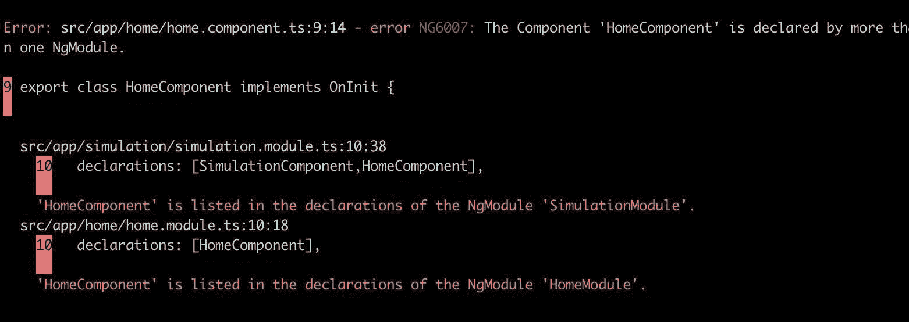
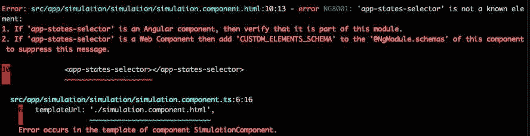
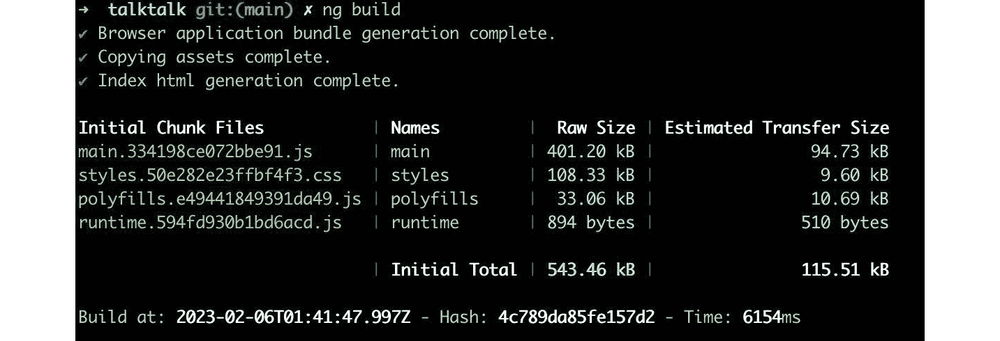
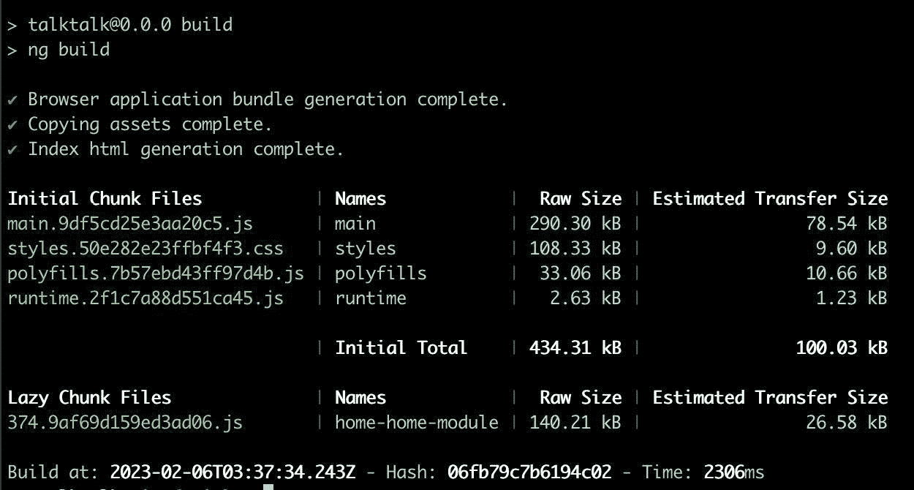

# 2

# 组织您的应用程序

一个混乱的项目是一个等待破坏用户体验的虫窝。除了质量外，从开始就组织良好的项目将为您的团队带来生产力，在 Angular 的情况下，还有可能提高您应用程序的性能。

在本章中，您将了解 Angular 模块的功能，这些模块与 JavaScript 模块之间的区别，以及如何以最佳方式在项目中使用它们。

您将了解单模块应用的反模式以及如何避免它，以及为什么要避免它。您还将使用 Angular 模块通过 `SharedModule` 模式优化对应用程序中常用组件的导入。最后，您将了解如何使用懒加载来优化您应用程序的性能。

在本章中，我们将介绍以下主题：

+   使用 Angular 模块组织应用程序

+   第一个模块：`AppModule`

+   避免反模式：单模块应用

+   优化常用模块的使用：`SharedModule` 模式

+   提高您应用程序的大小：懒加载

到本章结束时，您将能够将您的 Angular 应用程序组织成功能化和优化的模块。

# 技术要求

要遵循本章中的说明，您需要以下内容：

+   Visual Studio Code ([`code.visualstudio.com/Download`](https://code.visualstudio.com/Download))

+   Node.js 18 或更高版本 ([`nodejs.org/en/download/`](https://nodejs.org/en/download/))

本章的代码文件可在 [`github.com/PacktPublishing/Angular-Design-Patterns-and-Best-Practices/tree/main/ch2`](https://github.com/PacktPublishing/Angular-Design-Patterns-and-Best-Practices/tree/main/ch2) 获取。

# 使用 Angular 模块组织应用程序

使用框架组织应用程序组件的基础是 Angular 模块，在文档和社区中更广为人知的是名称 **NgModules**。

Angular 模块是一个带有 `@NgModule` 装饰器的 TypeScript 类，其中包含元数据，如下例所示：

```js
import { NgModule } from '@angular/core';
@NgModule({
 declarations: [SimulationComponent],
 providers:[],
 imports: [
   CommonModule,
   SharedModule,
   MatCardModule,
   MatButtonModule,
   MatSelectModule,
   MatRadioModule,ReactiveFormsModule,
 ],
 exports: [SimulationComponent],
})
export class SimulationModule {}
```

让我们在以下子节中详细说明这些元数据类型。

## 声明

此元数据包含一个由组件、指令和管道组成的数组，这些组件必须只属于一个模块，否则 Angular 编译器将抛出错误，如图 *图 2**.1* 所示：



图 2.1 – 在多个模块中声明组件时的错误信息

## 提供者

在这个属性中，我们可以使用 Angular 的依赖注入系统注册我们想要注入的类，通常用于服务（将在 *第五章*，*Angular 服务和* *单例模式* 中详细介绍）。

## 导入

在这个元数据中，我们通知模块我们想要导入并使用它们的组件和服务。例如，如果我们想使用 Angular 的 HTTP 请求服务，我们必须在这里声明 `HttpClientModule` 模块。

重要的是要知道，在这里，我们不应该导入组件或服务，而只导入 Ngmodules。

## exports

默认情况下，`declarations` 属性中的所有项都是私有的。这意味着如果一个模块包含了 `StateSelectorComponent` 组件和另一个模块，例如，导入该模块以使用此组件将导致以下错误发生：



图 2.2 – 使用未正确导出的组件时的错误信息

为了让 Angular 知道该组件可以被使用，必须在 `exports` 元数据中声明它。

与 `imports` 元数据不同，在这里，你可以声明组件、管道、指令和其他模块（如我们将在 *优化常用模块的使用 – SharedModule 模式* 部分中看到的）。

现在我们已经知道了如何声明一个模块，让我们来研究创建 Angular 项目时生成的模块。

# 第一个模块 – AppModule

Angular 中的模块对于框架来说非常重要，因此当您启动一个项目时，它会自动创建一个名为 **AppModule** 的模块。

此模块包含我们在上一节中研究的所有参数（`declarations`、`providers`、`imports` 和 `exports`），以及一个额外的参数：`bootstrap`。此模块包含将被注入到应用程序的 `index.html` 文件中的第一个组件，并将成为您 Angular 应用程序组件树的根。

您可能想知道这是哪个 `index.html` 文件和哪个树。

如我们在 *第一章* 中所述，*正确开始项目*，Angular 是一个框架，`index.html` 文件实际上是网络服务器向其用户提供的唯一 *页面*。

由 Angular 引擎渲染的所有接口（称为 `index.html` 文件，第一个组件在 `bootstrap` 元数据中描述）遵循逻辑树类型的数据结构，此树的根是第一个组件。

## Angular 和 JavaScript 模块之间的区别是什么？

几乎所有编程语言都为开发者提供了一种方式，可以在一个或多个文件中组织函数、类和变量，从而提高可维护性和关注点的分离。

在 JavaScript 中，在其创建和几个提议之后，语言模块的概念得到了巩固。解释这个概念的最佳方式是使用示例来演示。首先，我们创建一个 `sum.mjs` 文件 – 一个接收两个数字并返回它们的和的 `sum` 函数。这里重要的是，我们使用 `export` 关键字来指示我们想在源文件之外的作用域中使用它：

```js
export function sum(numberA,numberB){
  return numberA + numberB;
}
```

在`index.mjs`文件中，我们将使用创建的函数，为此，我们在文件的第一行进行声明。使用保留字`import`，我们指明哪个函数以及它来自哪个文件：

```js
import {sum} from './sum.mjs';
const numberA = 5;
const numberB = 10;
console.log(sum(numberA,numberB));
```

你可能想知道为什么使用`.mjs`扩展名。这是因为，在示例中，我们正在使用 Node.js 来执行，这种类型的模块——**ECMAScript 模块**（**ESM**），因为 JavaScript 语言的官方名称是 ECMAScript——是在版本 14 中引入的。

Angular，以及所有其他 SPA 框架，在其开发中使用 JavaScript 模块，我们可以在任何 Angular 组件或服务中注意到我们导出类并使用 ESM 导入：

```js
import { Component } from '@angular/core';
@Component({
  selector: 'app-home',
  templateUrl: './home.component.html',
  styleUrls: ['./home.component.css']
})
export class HomeComponent {
```

在前面的代码片段中，我们正在从`@angular/core`库中导入`Component`装饰器，并将`HomeComponent`类导出以在其他项目部分中使用。

## 模块类型

现在我们已经理解和加强了 Angular 框架中模块的概念，让我们将应用程序分割并更好地利用这个特性。组织应用程序模块没有固定的规则，但 Angular 团队和社区建议根据具有共同特性的功能分组来分离模块。

基于这个想法，我们可以有以下类型的 Angular 模块：

+   业务领域模块

+   组件模块

### 业务领域模块

一个应用程序将服务于一个或多个用户工作流程。此类模块旨在根据组成它们的接口的亲和力对这些流程进行分组。例如，在资源管理应用程序中，我们可以有会计模块和库存模块。

在`ch2`文件夹中可用的应用程序中，有一个我们将用于本章和其他章节以将我们的知识付诸实践的*talktalk*应用程序。在项目文件夹中，让我们使用以下命令创建`home`模块：

```js
ng g m home
```

在此命令中，我们使用 Angular CLI 的缩写`ng`和`g`代表`m`代表`home`。

让我们创建一个表示应用程序主页的`Page`组件，由于我们正在使用 Angular material，我们将使用 Angular CLI 来生成一个带有侧菜单的页面，使用以下命令：

```js
ng generate @angular/material:navigation home/home
```

除了创建组件外，Angular CLI 还编辑了`home.module.ts`文件，将其添加到`declarations`属性中。按照以下示例更改此文件：

```js
import { NgModule } from '@angular/core';
import { CommonModule } from '@angular/common';
import { HomeComponent } from './home/home.component';
import { LayoutModule } from '@angular/cdk/layout';
import { MatToolbarModule } from '@angular/material/toolbar';
import { MatButtonModule } from '@angular/material/button';
import { MatSidenavModule } from '@angular/material/sidenav';
import { MatIconModule } from '@angular/material/icon';
import { MatListModule } from '@angular/material/list';
@NgModule({
 declarations: [HomeComponent],
 imports: [
   CommonModule,
   LayoutModule,
   MatToolbarModule,
   MatButtonModule,
   MatSidenavModule,
   MatIconModule,
   MatListModule,
 ],
 exports: [HomeComponent],
})
export class HomeModule {}
```

在此模块中，我们将导出`HomeComponent`组件以在应用程序的路由中使用。在`app.module.ts`文件中，按以下方式导入模块：

```js
import { NgModule } from '@angular/core';
import { BrowserModule } from '@angular/platform-browser';
import { AppRoutingModule } from './app-routing.module';
import { AppComponent } from './app.component';
import { BrowserAnimationsModule } from '@angular/platform-browser/animations';
import { HomeModule } from './home/home.module';
@NgModule({
 declarations: [
   AppComponent
 ],
 imports: [
   BrowserModule,
   AppRoutingModule,
   BrowserAnimationsModule,
   HomeModule
 ],
 providers: [],
 bootstrap: [AppComponent]
})
export class AppModule { }
```

在`NgModule`元数据的`import`属性中，我们可以更改`app-routing.module.ts`文件中的路由：

```js
import { NgModule } from '@angular/core';
import { Routes, RouterModule } from '@angular/router';
import { HomeComponent } from './home/home/home.component';
const routes: Routes = [
  { path: '', pathMatch: 'full', redirectTo: 'home' },
  {
    path: 'home',
    component: HomeComponent
  },
];
@NgModule({
 imports: [RouterModule.forRoot(routes)],
 exports: [RouterModule],
})
export class AppRoutingModule {}
```

`routes`组件也是`NgModule`，然而，它专门用于组织路由，并且只从 Angular 导入和导出`RouterModule`。在这里，在`routes`数组中，我们为`HomeComponent`创建方向。

运行`ng serve --o`命令，我们得到应用程序的主页：


图 2.3 – talktalk 示例应用程序菜单页面

### 组件模块

这个模块的目的是将那些将被业务域组件和其他组件重用的指令组件和管道分组。即使使用像 Angular Material 这样的组件库，你的系统也需要根据你的业务域规则创建自定义组件。

这种类型的组件在 `declaration` 属性中声明了组件、指令和管道，并在 `exports` 属性中导出，如下面的示例所示：

```js
import { NgModule } from '@angular/core';
import { CommonModule } from '@angular/common';
import { StatesSelectorComponent } from './states-selector/states-selector.component';
import { MatSelectModule } from '@angular/material/select';
@NgModule({
 declarations: [StatesSelectorComponent],
 imports: [CommonModule, MatSelectModule],
 exports: [StatesSelectorComponent],
})
export class ComponentsModule {}
```

将项目分解为业务域模块和组件将组织你的代码并提高其可维护性。让我们分析 Angular 应用程序中的一种常见反模式。

# 避免反模式 – 单模块应用

当我们开始使用 Angular 进行学习和开发时，通常不太关注应用模块的组织和使用。正如我们在本章开头所学的，NgModules 对 Angular 来说是如此基础，以至于当我们开始一个项目时，Angular CLI 就会为该项目创建第一个模块，即 `AppModule`。

理论上，仅此模块对于你的应用程序运行是必要的。从那里，我们可以声明所有组件和指令，并导入项目可能需要的所有库，如下面的示例所示：

```js
import { NgModule } from '@angular/core';
. . .
@NgModule({
 declarations: [
   AppComponent,
   StatesSelectorComponent,
   HomeComponent,
   SimulationComponent
 ],
 imports: [
   BrowserModule,AppRoutingModule,
   BrowserAnimationsModule,HttpClientModule,
   ReactiveFormsModule,LayoutModule,
   MatToolbarModule,MatButtonModule,
   MatSidenavModule,MatIconModule,
   MatListModule,
 ],
 bootstrap: [AppComponent]
})
export class AppModule { }
```

这种方法存在一些问题，是一种我们称之为单模块应用的反模式。

我们在这里遇到的问题如下：

+   **无序的文件夹结构**：随着项目的增长，团队将很快不知道哪些组件属于项目的哪个区域。随着项目的增长，这个文件将变得更大、更混乱。

+   **包大小和构建时间**：Angular 有几个构建和打包优化，这些优化依赖于应用模块的定义。如果我们只在一个模块中，这些优化效果并不明显。

+   **组件可维护性和更新问题**：随着这个文件的增长，团队将难以弃用不再使用的组件或更新那些 Angular CLI 无法自动更新的组件。

解决这种反模式的方法是应用我们在本章中学到的知识：将模块分为业务域（或功能）和组件模块。

我们可以使用 `NgModel` 来减少在应用程序中重复导入常用组件，正如我们将在下一节关于 `SharedModule` 模式的部分中所看到的。

# 优化常用模块的使用 – SharedModule 模式

如果我们观察 Angular 项目，我们将看到模块使用模式，例如 `HttpModule`，如下面的示例所示：

```js
import { NgModule } from '@angular/core';
import { CommonModule } from '@angular/common';
import { HomeComponent } from './home/home.component';
import { LayoutModule } from '@angular/cdk/layout';
import { MatToolbarModule } from '@angular/material/toolbar';
import { MatButtonModule } from '@angular/material/button';
import { MatSidenavModule } from '@angular/material/sidenav';
import { MatIconModule } from '@angular/material/icon';
import { MatListModule } from '@angular/material/list';
@NgModule({
 declarations: [HomeComponent],
 imports: [
   CommonModule,
   LayoutModule,
   MatToolbarModule,
   MatButtonModule,
   MatSidenavModule,
   MatIconModule,
   MatListModule,
 ],
 exports: [HomeComponent],
})
export class HomeModule {}
```

为了避免代码重复并使新团队成员更容易上手，别忘了将一个重要的模块添加到项目中；我们可以创建 `SharedModule` 来集中管理 Angular 项目的公共依赖。

让我们在我们的项目中使用 Angular CLI 来实现这一点：

```js
ng generate module shared
```

在新创建的文件中，我们将放置 Angular Material 的依赖项：

```js
import { NgModule } from '@angular/core';
...
@NgModule({
 imports: [
   CommonModule,
   LayoutModule,
   MatToolbarModule,
   MatButtonModule,
   MatSidenavModule,
   MatIconModule,
   MatListModule,
 ],
 exports: [
   CommonModule,
   LayoutModule,
   MatToolbarModule,
   MatButtonModule,
   MatSidenavModule,
   MatIconModule,
   MatListModule,
 ]
})
export class SharedModule { }
```

在本模块中，我们正在导入 Angular Material 的依赖项并导出相同的依赖项，而不声明任何组件、指令或管道。

在`home.module.ts`文件中，我们可以重构以使用`SharedModule`：

```js
import { NgModule } from '@angular/core';
import { HomeComponent } from './home/home.component';
import { SharedModule } from '../shared/shared.module';
@NgModule({
 declarations: [HomeComponent],
 imports: [
   SharedModule
 ],
 exports: [HomeComponent],
})
export class HomeModule {}
```

注意使用`SharedModule`后，文件变得多么简洁且易于阅读。

重要

在`SharedModule`中存在的模块必须是您项目中大多数模块共有的模块，因为这会增加模块包的大小。如果模块需要一些特定的依赖项，您必须在那个依赖项中声明它，而不是在`SharedModule`中。

在下一个主题中，我们将看到一个将提高用户体验的功能，该功能基于将应用程序组织成模块。

# 提高应用程序的大小 – 懒加载

将模块从您的 Angular 应用程序中分离出来的好策略将提高团队的生产力并改善代码组织。但另一个将影响用户质量的优势是使用模块的懒加载技术。

如果我们使用`ng build`命令运行示例应用程序的构建过程，我们可以看到以下消息：



图 2.4 – 示例应用程序包大小

我们应用程序的初始包（`main.ts`文件）的大小为 94.73 kB，这可能看起来很小，但考虑到我们的应用程序功能较少，这是一个相当大的大小。

随着项目功能的增加，这种初始包的增长趋势会相当明显，这会损害用户的体验，因为他们最初需要下载一个更大的文件。这个问题在互联网不太好的环境中尤其明显，例如 3G 网络。

为了减小这个文件并相应地提高用户体验，理想的情况是拥有更小的包，并且这些包只在必要时加载 – 也就是说，以懒加载的方式。

我们将重构我们的项目，我们已经采取的第一步是将功能分离到功能模块中（在*避免反模式 – 单模块应用*部分，我们解释了不分离应用程序模块的危险，毫无疑问，包的大小对用户影响最大）。

现在，让我们为`Home`模块创建一个路由文件。由于该模块已经存在，让我们在`home.module.ts`文件所在的同一文件夹中手动创建`home-routing.module.ts`文件。

在此文件中，我们将添加以下代码：

```js
import { NgModule } from '@angular/core';
import { Routes, RouterModule } from '@angular/router';
import { HomeComponent } from './home/home.component';
const routes: Routes = [
  {
    path: '',
    component: HomeComponent,
  },
];
@NgModule({
 imports: [RouterModule.forChild(routes)],
 exports: [RouterModule],
})
export class HomeRoutingModule {}
```

此路由文件与应用程序的主要路由文件类似，不同之处在于`@NgModule`的导入使用`forChild`方法而不是`forRoot`。这是因为此模块是主路由的子路由。

另一个需要注意的重要细节是，为`HomeComponent`组件选择的路径是空的。我们可以解释这一点，因为定义`/home`路由以及如何表示`/home`组件的主要路由文件已经定义。

在`home.module.ts`文件中，让我们将其更改为导入路由文件：

```js
import { NgModule } from '@angular/core';
import { HomeComponent } from './home/home.component';
import { SharedModule } from '../shared/shared.module';
import { HomeRoutingModule } from './home-routing.module';
@NgModule({
 declarations: [HomeComponent],
 imports: [
   SharedModule,HomeRoutingModule
 ]
})
export class HomeModule {}
```

在这个文件中，我们还移除了`HomeComponent`组件的导出，因为`Home`模块的路由文件会加载它。

在项目的主要路由文件`app-routing.module.ts`中，让我们按照以下方式重构它：

```js
import { NgModule } from '@angular/core';
import { Routes, RouterModule } from '@angular/router';
const routes: Routes = [
  { path: '', pathMatch: 'full', redirectTo: 'home' },
  {
    path: 'home',
    loadChildren: () =>
      import('./home/home.module').then((file) => file.HomeModule),
  },
];
@NgModule({
 imports: [RouterModule.forRoot(routes)],
 exports: [RouterModule],
})
export class AppRoutingModule {}
```

在此代码中，最重要的部分是`loadChildren`属性。这是我们配置懒加载的地方，因为我们向 Angular 的路由机制传递一个返回`import`承诺的函数。

注意，`import`函数不是一个 Angular 函数，而是一个标准的 JavaScript 函数，它允许动态加载代码。Angular 的路由引擎使用这个语言特性来实现这一功能。

最后，在主模块`AppModule`中，让我们移除`HomeModule`的导入：

```js
import { NgModule } from '@angular/core';
import { BrowserModule } from '@angular/platform-browser';
import { AppRoutingModule } from './app-routing.module';
import { AppComponent } from './app.component';
import { BrowserAnimationsModule } from '@angular/platform-browser/animations';
@NgModule({
 declarations: [
   AppComponent
 ],
 imports: [
   BrowserModule,
   AppRoutingModule,
   BrowserAnimationsModule
 ],
 providers: [],
 bootstrap: [AppComponent]
})
export class AppModule { }
```

使用`ng serve`命令运行我们的应用程序时，我们没有注意到任何差异。然而，当执行`ng build`命令时，我们可以注意到以下诊断：



图 2.5 – 使用懒加载重构后的应用程序包大小

Angular 构建过程已将`Home`模块分离成其自己的包，并将`main.ts`包变得更小。这种差异可能看起来很小，但请注意，这样我们的应用程序可以扩展并增加复杂性，而初始包将保持较小或增长很少。

新功能仍然存在并被应用程序加载，但初始加载将更快，并且这些新功能将仅在用户访问他们想要的路径时按需下载，从而提供非常积极的流畅性和响应性。

# 摘要

在本章中，我们详细研究了 Angular 模块以及我们如何利用它们来组织应用程序的性能。我们学习了 Angular 模块与 JavaScript 模块之间的区别，并看到了模块定义的每个属性以及我们可以在项目中创建的类型。最后，我们学习了如何避免单模块应用程序的反模式以及如何创建`SharedModule`。

我们重申了我们的示例应用，使用分批懒加载，这证明了良好的模块组织反映了我们用户的表现力和流畅性。现在，你可以以这种方式组织你的应用程序，使其能够扩展并增加复杂性和功能，而不会损害项目的可维护性。

在下一章中，我们将学习如何有效地使用 TypeScript 来为我们的 Angular 项目提高生产效率。
