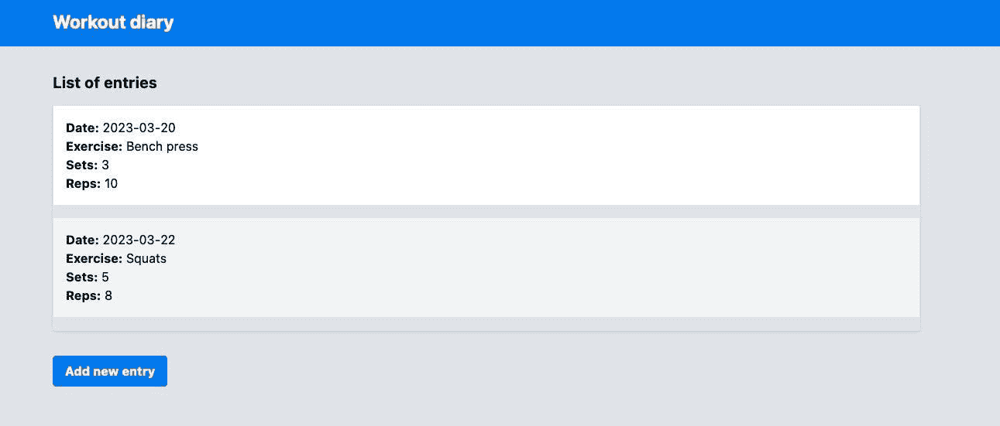
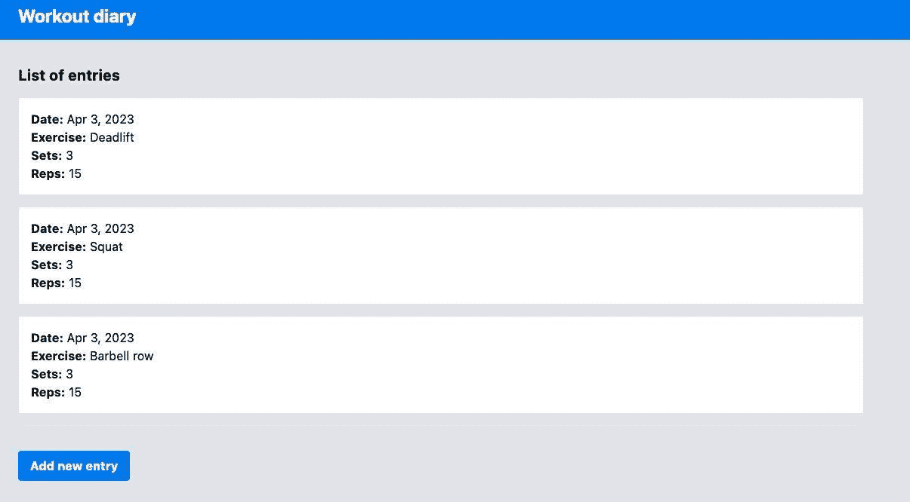
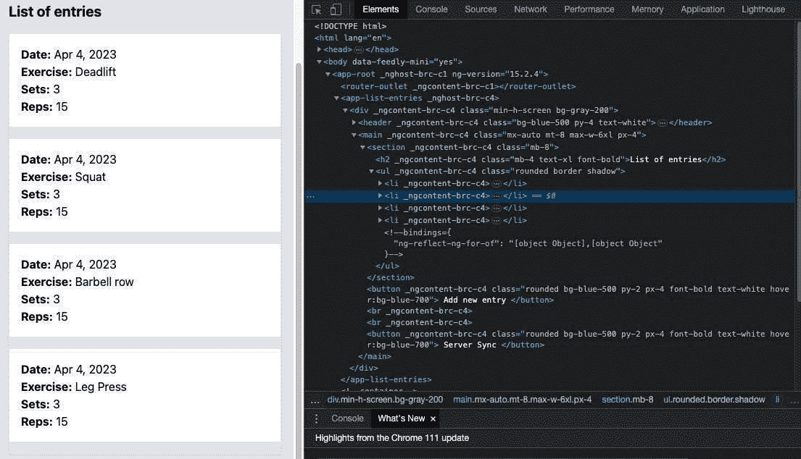
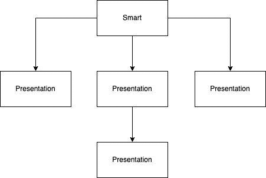

# 4

# 组件和页面

Angular 应用程序的主要构建块是 **组件**。正是通过使用它们，我们组装用户界面并定义体验的流程。在 Angular 架构中，组件将应用程序组织成可重用的部分，使其易于维护和扩展。

在本章中，我们将探讨组件之间的通信，并使用组件组合来组装我们的页面，避免创建单体界面的反模式。

在本章中，我们将涵盖以下主题：

+   创建组件

+   组件之间的通信 – 输入和输出

+   最佳实践 – 使用 `TrackBy` 属性

+   分离责任 – 智能组件和展示组件

+   子组件之间的通信 – 使用 `@Output`

到本章结束时，你将能够创建可重用且易于维护的组件和页面，从而简化项目开发并提高你和你团队的生产力。

# 技术要求

要遵循本章中的说明，你需要以下内容：

+   Visual Studio Code ([`code.visualstudio.com/Download`](https://code.visualstudio.com/Download))

+   Node.js 18 或更高版本 ([`nodejs.org/en/download/`](https://nodejs.org/en/download/))

本章的代码文件可在 [`github.com/PacktPublishing/Angular-Design-Patterns-and-Best-Practices/tree/main/ch4`](https://github.com/PacktPublishing/Angular-Design-Patterns-and-Best-Practices/tree/main/ch4) 找到。

# 创建组件

使用 Angular 创建的每个接口都是框架架构中的一个组件；因此，从理论上讲，我们可以在单个组件中拥有我们的整个应用程序。

正如我们在 *第二章* 中所研究的，*组织你的应用程序*，最好将你的应用程序分成模块，并且通过组件，我们通过将我们的接口分成不同的组件并使用不同的组件来组合它们，来使用相同的推理，以最大化重用性和可维护性。

在本章中，我们将通过以下健身日记应用程序来展示这一点，如图所示 – 为了专注于 Angular，我们不会使用 Angular Material，只使用 HTML、CSS（在这种情况下，Tailwind CSS）和 TypeScript。



图 4.1 – 健身日记应用程序 UI

在这个初始示例中，我们创建了一个仅包含 HTML 模板、CSS 和 TypeScript 文件的组件。以下是页面的顶部内容：

```js
<div class="min-h-screen bg-gray-200">
  <header class="bg-blue-500 py-4 text-white">
    <div class="mx-auto max-w-6xl px-4">
      <h1 class="text-2xl font-bold">Workout diary</h1>
    </div>
  </header>
```

使用良好的 HTML 语义实践，让我们创建一个 `main` 部分：

```js
 <main class="mx-auto mt-8 max-w-6xl px-4">
   <section class="mb-8">
     <h2 class="mb-4 text-xl font-bold">List of entries</h2>
     <ul class="rounded border shadow">
       <li class="mb-4 border-b bg-white p-4">
         <span class="font-bold">Date:</span> 2023-03-20<br />
         <span class="font-bold">Exercise:</span> Bench press<br />
         <span class="font-bold">Sets:</span> 3<br />
         <span class="font-bold">Reps:</span> 10
       </li>
         <!-- more entries here -->
     </ul>
   </section>
   <button
     class="rounded bg-blue-500 py-2 px-4 font-bold text-white hover:bg-blue-700"
   >
     Add new entry
   </button>
 </main>
</div>
```

我们可以看到，在前面的示例中，界面已经设计和样式化，但它不是功能性的，因为日记条目固定在 HTML 中，在我们的应用程序中，用户应该能够添加他们想要的任意数量的条目。

我们可以识别出，这个日记条目的这部分可能是一个页面可以使用的组件，所以让我们创建一个名为`entry`的组件。正如我们在*第一章*，“正确开始项目”中学到的，我们将使用 Angular CLI 在所需的模块中创建这个新组件：

```js
ng g c diary/entry-item
```

使用这个命令，Angular CLI 将创建一个包含以下四个文件的新文件夹，并更新`diary`模块以包含新组件。

+   `entry-item.component.css`: 此文件将包含组件的样式表。Angular 成功地解决了 Web 应用的一个大痛点，即每个组件的 CSS 作用域。有了这个特性，我们可以在不担心是否会影响到应用程序的 CSS（即使使用相同的属性或选择器名称）的情况下指定组件的样式。

+   `entry-item.component.html`: 此文件包含组件的 HTML 模板，尽管扩展名似乎表明我们只能使用 HTML 标签，但在模板文件中，我们可以使用 Angular 指令，正如我们将在本章学习的。

+   `entry-item.component.spec.ts`: 此文件包含组件的单元测试，我们将在*第十章*“为测试而设计：最佳实践”中详细说明。

+   `entry-item.component.ts`: 这是代表组件本身的 TypeScript 文件。所有其他文件都是可选的，这使得你可以只使用这个文件来创建一个组件，尽管这并不是在 Angular 项目中广泛应用的实践，并且仅推荐用于非常小的组件。

在`entry-item.component.ts`文件中，Angular CLI 创建了以下结构：

```js
import { Component } from '@angular/core';
@Component({
 selector: 'app-entry-item',
 templateUrl: './entry-item.component.html',
 styleUrls: ['./entry-item.component.css']
})
export class EntryItemComponent {
}
```

通过这个示例，我们强化了组件是一个 TypeScript 类的定义，并通过使用`@Component`装饰器，我们向 Angular 指示了组装组件的部分在哪里。

主要属性如下：

+   `selector`: 这是一个可选属性，定义了如果组件在另一个组件的模板中使用时，其选择器将是什么。代表页面的组件不需要定义选择器，因为它们是从路由中实例化的。Angular CLI 根据在`angular.json`文件的`prefix`属性中定义的应用程序前缀以及你在`ng` `g`命令中定义的名称来建议选择器。

+   `templateUrl`: 这定义了包含组件模板的 HTML 文件的路径。或者，我们可以使用`template`属性来定义一个包含所有组件 HTML 的字符串。

+   `styleUrls`: 这定义了包含组件样式的 CSS 文件的路径。这个属性的细节是它是一个数组，因此可以链接多个 CSS 文件到组件。或者，我们可以使用`style`属性来定义一个包含组件 CSS 的字符串。

在`entry-item.component.html`文件中，我们将放置代表我们健身房日记中练习列表中一个条目的片段：

```js
<div class="mb-4 border-b bg-white p-4">
  <span class="font-bold">Date:</span> 2023-03-20<br />
  <span class="font-bold">Exercise:</span> Bench press<br />
  <span class="font-bold">Sets:</span> 3<br />
  <span class="font-bold">Reps:</span> 10
</div>
```

在这里，我们有了一个条目的表示，区别在于我们使用 `<div>` 元素而不是 `<li>`，因为我们希望我们的组件尽可能可重用——它可能不一定在列表和 `<ul>` 元素中使用。

让我们把我们的组件用起来。在 `diary.component` 组件中，让我们按照以下方式重构 `diary.component.html` 文件：

```js
<div class="min-h-screen bg-gray-200">
  <header class="bg-blue-500 py-4 text-white">
    <div class="mx-auto max-w-6xl px-4">
      <h1 class="text-2xl font-bold">Workout diary</h1>
    </div>
  </header>
  <main class="mx-auto mt-8 max-w-6xl px-4">
    <section class="mb-8">
      <h2 class="mb-4 text-xl font-bold">List of entries</h2>
      <ul class="rounded border shadow">
        <li>
          <app-entry-item />
        </li>
        <li>
          <app-entry-item />
        </li>
        <!-- more entries here -->
      </ul>
   </section>
   <button
     class="rounded bg-blue-500 py-2 px-4 font-bold text-white hover:bg-blue-700"
   >
     Add new entry
   </button>
 </main>
</div>
```

使用 `app-entry-item` 选择器，我们在页面上使用了我们的新组件。从 Angular 的第 15 版开始，我们可以为组件使用自闭合标签，所以我们在这里使用了 `<app-entry-item />`，但如果你更喜欢以前的方式，`<app-entry-item>` `<app-entry-item>` 仍然有效。

运行我们的项目，我们可以看到它仍然在正常工作。然而，两个条目中的数据是相同的。我们现在需要一种在组件之间传递信息的方法，我们将在下一节中看到如何做到这一点。

# 组件之间的通信 – 输入和输出

在我们的健身房日记应用程序中，我们现在需要一个锻炼列表页面组件 `DiaryComponent` 与列表项组件 `EntryItemComponent` 进行通信。

实现这种通信的最简单方式是使用 Angular 的属性绑定概念。尽管名字听起来复杂，但实际上，我们通过在组件对象的属性上添加 `@Input` 注解来标注，这样 Angular 就会在组件上创建一个自定义的 HTML 属性。

让我们看看这个概念在实际中的应用；首先，让我们创建一个接口来表示我们日记中的一个条目：

```js
ng g interface diary/interfaces/exercise-set
```

使用前面的命令，我们创建了文件，并且作为一个有组织的实践，我们创建了一个文件夹来存储模块的接口。在生成的文件中，我们将定义我们想要通信的对象：

```js
export interface ExerciseSet {
  id?: string;
  date: Date;
  exercise: string;
  sets: number;
  reps: number;
}
export type ExerciseSetList = Array<ExerciseSet>;
```

我们创建了一个接口来定义对象，并定义了一个类型来定义一系列锻炼，这提高了我们实现的可读性。

现在，在 `entry-item.component.ts` 文件中，让我们添加新的属性：

```js
import { Component, Input } from '@angular/core';
import { ExerciseSet } from '../interfaces/exercise-set';
@Component({
 selector: 'app-entry-item',
 templateUrl: './entry-item.component.html',
 styleUrls: ['./entry-item.component.css']
})
export class EntryItemComponent {
  @Input('exercise-set') exerciseSet!:ExerciseSet;
}
```

在这里，我们创建了一个名为 `exerciseSet` 的属性，其类型为 `ExerciseSet`，这是我们刚刚定义的。我们在类型定义中使用 `!` 符号，因为我们将在运行时定义其值。

`@Input` 注解接收 `exercise-set` 字符串作为参数。有了这个参数，我们定义了在模板中使用的自定义 HTML 属性的名称。这个参数是可选的；如果不使用它，属性名称将与属性名称相同。在这里，它将是 `exerciseSet`。

现在，让我们更改我们的模板以使用这个属性：

```js
<div class="mb-4 border-b bg-white p-4">
  <span class="font-bold">Date:</span> {{ exerciseSet.date | date }}<br />
  <span class="font-bold">Exercise:</span> {{ exerciseSet.exercise }}<br />
  <span class="font-bold">Sets:</span> {{ exerciseSet.sets }}<br />
  <span class="font-bold">Reps:</span> {{ exerciseSet.reps }}
</div>
```

要在模板中使用组件的属性，我们使用 `{{ }}` 语法。在这里，我们可以看到启用 Angular 语言服务扩展的 VS Code 的一个优点，因为我们可以在 HTML 模板中进行类型检查，避免例如拼写错误等问题。

在这个例子中需要强调的是 `Date` 属性。在这里，我们使用了一个名为 `pipe` 的 Angular 功能，它允许格式化模板元素。在这种情况下，我们正在格式化日期。

现在，让我们在 `diary.component.ts` 文件中配置一个锻炼列表：

```js
import { Component } from '@angular/core';
import { ExerciseSetList } from '../interfaces/exercise-set';
@Component({
 templateUrl: './diary.component.html',
 styleUrls: ['./diary.component.css'],
})
export class DiaryComponent {
  exerciseList: ExerciseSetList = [
    { id: '1', date: new Date(), exercise: 'Deadlift', reps: 15, sets: 3 },
    { id: '2', date: new Date(), exercise: 'Squat', reps: 15, sets: 3 },
    { id: '3', date: new Date(), exercise: 'Barbell row', reps: 15, sets: 3 },
 ];
}
```

对于这个例子，我们创建一个名为 `exerciseListExample` 的属性，并用来自 `ExerciseSet` 接口的对象填充它。现在，让我们在 `diary.component.html` 文件中更改列表模板：

```js
. . .
  <section class="mb-8">
    <h2 class="mb-4 text-xl font-bold">List of entries</h2>
      <ul class="rounded border shadow">
        <li *ngFor="let item of exerciseList">
          <app-entry-item [exercise-set]="item" />
        </li>
      </ul>
  </section>
. . .
```

在模板中，我们使用 `ngFor` 指令，它具有遍历列表并渲染我们在模板中想要定义的元素的功能。对于每个列表项，我们将创建一个新的 `app-entry-item` 组件，现在我们想要将它分配给它。

要做到这一点，我们使用 `[exercise-set]` 属性来传递 `ngFor` 提供的项目。当我们运行我们的项目时，我们会看到以下图所示的列表：



图 4.2 – 重构后的健身房日记应用程序 UI

通过这种方式，我们了解了如何从一个组件传递信息到另一个组件，但我们可以通过引入良好的性能实践，即 `TrackBy` 属性来改进这个项目。

# 最佳实践 – 使用 TrackBy 属性

在 `*ngIf` 指令之后，`ngFor` 指令很可能是你将在你的 Angular 项目中最常使用的指令。尽管简单，但这个指令可以隐藏前端可能发生的性能和感知问题，这些问题将影响你的用户。

为了演示这一点，让我们添加一个新的列表按钮，模拟来自后端的一个列表更新。

在 `diary.component.ts` 文件中，添加以下方法：

```js
 newList() {
   this.exerciseList = [
     { id: '1', date: new Date(), exercise: 'Deadlift', reps: 15, sets: 3 },
     { id: '2', date: new Date(), exercise: 'Squat', reps: 15, sets: 3 },
     { id: '3', date: new Date(), exercise: 'Barbell row', reps: 15, sets: 3 },
     { id: '4', date: new Date(), exercise: 'Leg Press', reps: 15, sets: 3 },
   ];
 }
```

此方法用这个新数组替换数组，该数组包含相同的元素，但多了一个项目。

让我们在列表模板中添加按钮：

```js
<br>
<br>
  <button
    class="rounded bg-blue-500 py-2 px-4 font-bold text-white hover:bg-blue-700"
    (click)="newList()"
   >
     Server Sync
  </button>
```

当我们点击 **服务器同步** 按钮时，整个项目列表都会被渲染，尽管新的列表与原始列表除了新增一个项目外完全相同。



图 4.3 – Chrome 开发者工具

对于少量项目，这可能不一定是问题，但对于较长的列表，这种不必要的渲染可能会冒犯用户对我们应用程序性能的感知。

为了改进这类情况，`ngFor` 指令有 `TrackBy` 选项。让我们重构我们的代码来展示这个选项；首先，让我们为练习列表组件创建一个方法：

```js
 itemTrackBy(index: number, item: ExerciseSet) {
   return item.id;
 }
```

这种方法告诉 Angular 如何识别它将遍历 `*ngFor` 指令的集合中的单个元素。把它想象成集合的 *主键*。

在组件的模板中，让我们更改 `ngFor` 配置：

```js
<section class="mb-8">
  <h2 class="mb-4 text-xl font-bold">List of entries</h2>
  <ul class="rounded border shadow">
    <li *ngFor="let item of exerciseList; index as i; trackBy: itemTrackBy">
      <app-entry-item [exercise-set]="item" />
    </li>
  </ul>
</section>
```

在这里，我们告诉 `ngFor` 根据对象的 `id` 属性进行渲染。再次在浏览器中使用 Chrome DevTools 运行它，我们看到现在只有具有 `id` 属性的项目在页面上被渲染。

`TrackBy` 属性除了避免不必要的渲染外，还有以下优点：

+   在从集合中添加和删除项目时启用动画

+   当集合发生变化时，保留任何与 DOM 特定的 UI 状态，例如焦点和文本选择。

现在我们已经了解了`ngFor`属性的使用，让我们研究如何构建我们组件和页面的架构。

# 分离责任 – 智能和展示组件

单页应用（**SPA**）的信息流可能相当复杂，如果你在设计之初没有考虑这种流程，它可能会随着时间的推移影响你项目的生产力和质量。

简单为佳；因此，在 Angular 应用中以及一般单页应用中，一个非常常见的模式是使用智能组件和展示组件来组合接口。在文献和社区中，你也会找到这个模式被称为**智能**和**愚笨**组件或**容器**和**展示**组件。

智能组件具有 UI 业务规则；这是我们注入将与后端通信的服务的地方，以及与展示组件的接口将被组合的地方。

展示组件是一个仅用于展示智能组件通过输入传递的数据的组件。展示组件反过来可以包含一个或多个展示类型的组件。

为了说明这个模式，我们将使用以下图表：



图 4.4 – 智能和展示组件

注意，我们有一个真相来源，即智能组件，通信只在一个方向上发生，这就是我们所说的单向数据流。这个模式的目的是将组件内的所有状态隔离开来，从而简化状态管理。

让我们重构我们的项目以适应这个设计模式。让我们使用 Angular CLI 创建一个新的展示组件：

```js
ng g c diary/list-entries
```

在这个新组件中，我们将把渲染日记条目列表的部分移动到模板中。在`list-entries.component.html`文件中，添加以下代码：

```js
<section class="mb-8">
  <h2 class="mb-4 text-xl font-bold">List of entries</h2>
  <ul class="rounded border shadow">
    <li *ngFor="let item of exerciseList; index as i; trackBy: itemTrackBy">
      <app-entry-item [exercise-set]="item" />
    </li>
  </ul>
</section>
```

将要显示的列表将直接从`DiaryComponent`组件中准备好，因此，在`list-entries.component.ts`文件中，我们将添加以下代码：

```js
import { Component, Input } from '@angular/core';
import { ExerciseSet, ExerciseSetList } from '../interfaces/exercise-set';
@Component({
 selector: 'app-list-entries',
 templateUrl: './list-entries.component.html',
 styleUrls: ['./list-entries.component.css'],
})
export class ListEntriesComponent {
  @Input() exerciseList!: ExerciseSetList;
  itemTrackBy(index: number, item: ExerciseSet) {
    return item.id;
 }
}
```

在这里，我们将`itemTrackBy`函数移动到组件中，因为这将是其显示列表的功能，并且我们包含带有`@Input`装饰器的`exerciseList`属性。在这个例子中，我们没有指定任何参数，所以模板属性的名称将与`exerciseList`类的属性名称相同。

让我们在`diary.component.html`文件中更改`Diary`模板以使用我们创建的新展示组件：

```js
<main class="mx-auto mt-8 max-w-6xl px-4">
  <app-list-entries [exerciseList]="exerciseList" />
  <button
    class="rounded bg-blue-500 py-2 px-4 font-bold text-white hover:bg-blue-700"
  >
    Add new entry
  </button>
  <br />
  <br />
  <button
    class="rounded bg-blue-500 py-2 px-4 font-bold text-white hover:bg-blue-700"
    (click)="newList()"
  >
     erver Sync
  </button>
 </main>
```

`DiaryComponent`智能组件只是将列表传递给`ListEntriesComponent`展示组件，该组件通过调用`EntryItemComponent`展示组件来遍历列表。在这种结构下，只有`DiaryComponent`组件需要担心练习列表，遵循 SOLID 的单一职责概念。

我们已经学习了如何构建我们的页面和组件，但子组件如何与父组件通信呢？让我们接下来学习 Angular 组件的输出属性。

# 子组件的通信 - 使用@Output

我们学习了父组件，无论是智能组件还是展示组件，可以通过使用带有`@Input`装饰器的属性与子组件通信。

然而，当我们需要相反的情况时，子组件将一些信息传递给父组件。正如我们在上一节中看到的，业务规则处理理想情况下应该在智能组件中完成。对于这种类型的通信，我们使用`@Output`装饰器标记属性。

让我们为我们的日记创建一个添加条目的按钮。我们将在*第六章*中看到表单的使用，*处理用户输入：表单*，但在这里我们想要关注组件之间的交互。

使用 Angular CLI，我们将使用以下命令创建新组件：

```js
ng g c diary/new-item-button
```

在新组件的模板中，让我们将日记按钮模板移动到组件中：

```js
<button
  class="rounded bg-blue-500 py-2 px-4 font-bold text-white hover:bg-blue-700"
>
  Add new entry
</button>
```

在`new-item-button.component.ts`文件中，我们将添加一个新的属性：

```js
import { Component, EventEmitter, Output } from '@angular/core';
import { ExerciseSet } from '../interfaces/exercise-set';
@Component({
 selector: 'app-new-item-button',
 templateUrl: './new-item-button.component.html',
 styleUrls: ['./new-item-button.component.css'],
})
export class NewItemButtonComponent {
  @Output() newExerciseEvent = new EventEmitter<ExerciseSet>();
  addNewExercise() {
    const id = Date.now().toString();
    const date = new Date();
    const reps = 10;
    const sets = 4;
    const exercise = 'Leg Press';
    const newExerciseSet: ExerciseSet = { id, date, reps, sets, exercise };
    this.newExerciseEvent.emit(newExerciseSet);
  }
}
```

在这里，我们首先创建`newExerciseEvent`属性，并添加`@Output`装饰器来定义它将在组件的模板中作为一个属性存在。

在这里，与`@Input`属性有所不同；在这种情况下，我们已经在变量中分配了一个`EventEmitter`类的对象。这个 Angular 类旨在在发生某些操作时发出事件。

这是因为，与`@Input`不同，其值在组件结构化和渲染时分配，`@Output`通信可以在任何时间发生，取决于用户的操作。

`EventEmitter`类利用 TypeScript 的类型检查功能，使我们能够确定我们将要向父组件发出的对象类型。

在`addNewExercise`方法中，我们创建一个`ExerciseSet`类型的对象，并使用`EventEmitter`类的`emit`方法将此对象传递给父组件。

回到模板 - 让我们在按钮的`click`动作中添加方法调用：

```js
<button
  class="rounded bg-blue-500 py-2 px-4 font-bold text-white hover:bg-blue-700"
  (click)="addNewExercise()"
>
  Add new entry
</button>
```

现在，让我们重构`DiaryComponent`以使用新的按钮：

```js
. . .
<main class="mx-auto mt-8 max-w-6xl px-4">
  <app-list-entries [exerciseList]="exerciseList" />
  <app-new-item-button (newExerciseEvent)="addExercise($event)" />
  <br />
  <br />
  <button
    class="rounded bg-blue-500 py-2 px-4 font-bold text-white hover:bg-blue-700"
    (click)="newList()"
  >
    Server Sync
  </button>
 </main>
. . .
```

在模板中，我们使用`app-new-item-button`组件将`addExercise`函数传递给`newExerciseEvent`属性。

在这里，我们可以强调，`@Output`属性的绑定必须使用括号——`( )`——并且这个`$event`参数代表子组件将要发出的对象。如果你在 VS Code 中突出显示此参数，我们可以验证它属于`ExerciseSet`类型。

最后，让我们在组件中创建`addExercise`方法：

```js
. . .
addExercise(newSet: ExerciseSet) {
   this.exerciseList.push(newSet);
 }
. . .
```

我们的方法接收发出的值并将其添加到`exercises`数组中。运行我们的项目，我们可以看到项目已成功添加。

在这个例子中，我们可以看到设计模式中智能和展示组件的整个流程的实际应用。当点击`Diary`智能组件时，它会从`NewItemButtonComponent`展示组件接收新的练习。

通过更新列表，列表会自动传递到`ListEntriesComponent`组件，该组件在屏幕上渲染列表。现在我们将实现列表中练习项的动作——我们将看到如何发出这些项的事件以及如何识别这些元素。

# 从嵌套组件传播事件

我们将在日记中添加删除列表项和增加重复次数的选项。首先，让我们向列表项模板中添加按钮。在`entry-item.component.html`文件中，我们将编辑模板：

```js
<div class="mb-4 flex items-center justify-between border-b bg-white p-4">
  <div>
    <span class="font-bold">Date:</span> {{ exerciseSet.date | date }}<br />
    <span class="font-bold">Exercise:</span> {{ exerciseSet.exercise }}<br />
    <span class="font-bold">Sets:</span> {{ exerciseSet.sets }}<br />
    <span class="font-bold">Reps:</span> {{ exerciseSet.reps }}
  </div>
  <div class="flex items-center">
    <button
      class="mr-2 rounded bg-red-500 py-2 px-4 font-bold text-white hover:bg-red-700"
    >
      Delete
    </button>
    <button
      class="rounded bg-blue-500 py-2 px-4 font-bold text-white hover:bg-blue-700"
    >
      New Rep
    </button>
  </div>
</div>
```

这里的挑战是确保正确识别列表中每个项目的动作，以便正确应用——也就是说，处理列表的`Diary`智能组件将找到相应的项目并更改它。

为了做到这一点，我们将应用 Angular 输出功能到项目组件：

```js
 @Output() newRepEvent = new EventEmitter<ExerciseSet>();
 @Output() deleteEvent = new EventEmitter<string>();
 delete() {
   this.deleteEvent.emit(this.exerciseSet.id);
 }
 newRep() {
   const reps = ++this.exerciseSet.reps;
   const newItem: ExerciseSet = {
     ...this.exerciseSet,
     reps,
   };
   this.newRepEvent.emit(newItem);
 }
```

我们创建两个输出，每个输出对应我们想要发出的不同事件，并且我们输入它们，因为我们需要不同的动作。

然后我们创建`delete`方法，该方法将发出我们想要删除的项目`id`值，以及`newRep`方法，我们将使用它为将要执行的运动项目添加重复次数并发出该项目。

我们将回到模板，将方法与创建的按钮关联：

```js
   <button
     class="mr-2 rounded bg-red-500 py-2 px-4 font-bold text-white hover:bg-red-700"
     (click)="delete()"
   >
     Delete
   </button>
   <button
     class="rounded bg-blue-500 py-2 px-4 font-bold text-white hover:bg-blue-700"
     (click)="newRep()"
   >
     New Rep
   </button>
```

现在，让我们更改`list-entries.component`展示组件以创建输出，这里为了简单起见，它将具有与项目输出相同的名称：

```js
export class ListEntriesComponent {
 @Input() exerciseList!: ExerciseSetList;
 @Output() newRepEvent = new EventEmitter<ExerciseSet>();
 @Output() deleteEvent = new EventEmitter<string>();
. . .
}
```

为了传播项目事件，我们将更改列表模板：

```js
  <li *ngFor="let item of exerciseList; index as i; trackBy: itemTrackBy">
    <app-entry-item
      [exercise-set]="item"
      (deleteEvent)="deleteEvent.emit($event)"
      (newRepEvent)="newRepEvent.emit($event)"
    />
  </li>
```

我们可以看到我们只使用输出的`emit`方法发出项目事件。

最后，我们将重构`DiaryComponent`智能组件以响应项目事件。首先，让我们看看模板：

```js
<main class="mx-auto mt-8 max-w-6xl px-4">
  <app-list-entries
    [exerciseList]="exerciseList"
    (deleteEvent)="deleteItem($event)"
    (newRepEvent)="newRep($event)"
  />
 . . .
 </main>
```

如前例所示，我们使用括号将其与一个方法关联，该方法将处理事件并使用`$event`变量接收该方法参数发出的元素。

我们现在将通过创建两个新方法来重构组件——一个用于删除日记条目，另一个用于为练习创建新的重复项：

```js
. . .
deleteItem(id: string) {
  this.exerciseList = this.exerciseList.filter((item) => item.id !== id);
}
 newRep(exerciseSet: ExerciseSet) {
   const id = exerciseSet.id;
   const i = this.exerciseList.findIndex((item) => item.id === id);
   if (i >= 0) {
     this.exerciseList[i] = { ...exerciseSet };
   }
 }
. . .
```

我们使用 TypeScript 数组方法来模拟删除和更改项目数组。我们可以看到，由于 Angular 的事件发射机制，该方法已经自动接收删除项或 id。

我们在这里利用智能和展示组件模式，以适应稍微复杂一些的需求。

# 摘要

在本章中，我们研究了负责渲染我们项目界面的元素，即组件。我们看到了如何以细粒度创建和组织组件，从而使我们的项目更具可维护性。

我们还研究了如何使用`@Input`和`@Output`属性在组件之间进行通信，利用 Angular 提供的促进这种通信的能力。

我们看到了使用`TrackBy`在模板中通过`ngFor`指令迭代列表的良好实践，这特别提高了具有许多项目的列表的性能。

最后，我们研究了智能和展示组件的设计模式，这是一种组织组件及其交互的方式，以便通过单向信息流简化这种编排。

在下一章中，我们将研究 Angular 中负责业务规则和与后端交互的元素——服务。
