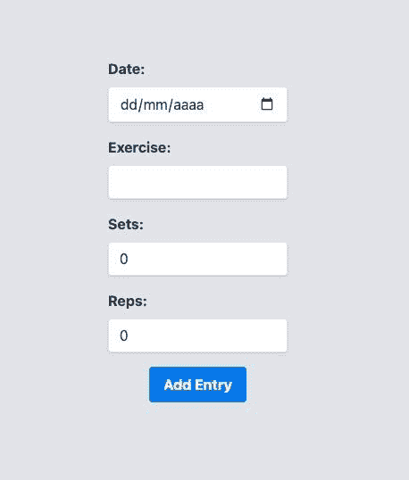
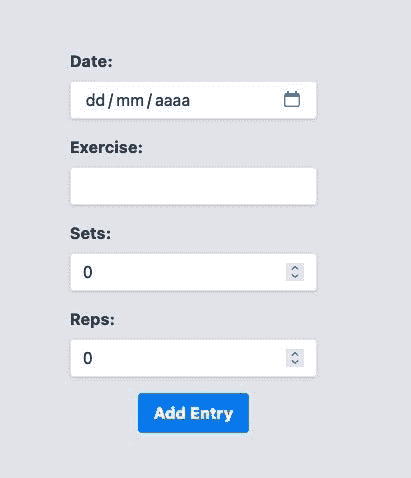
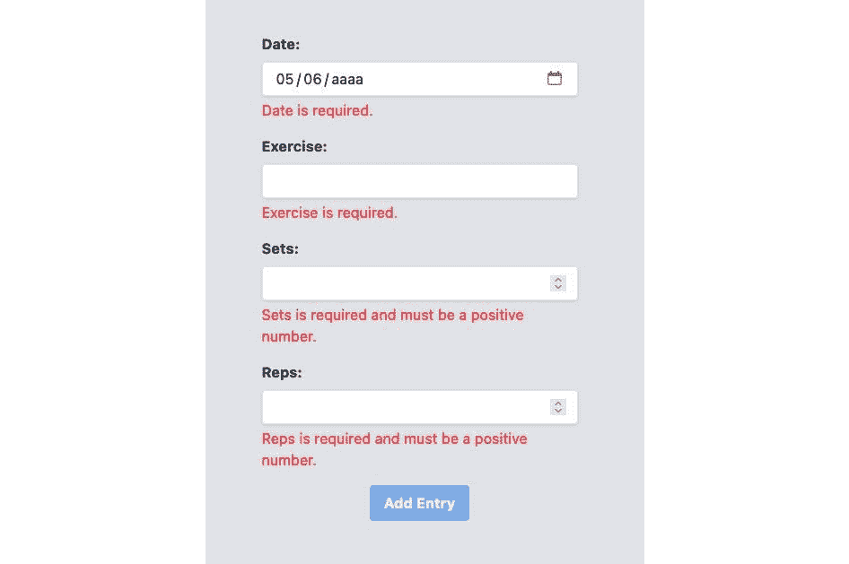
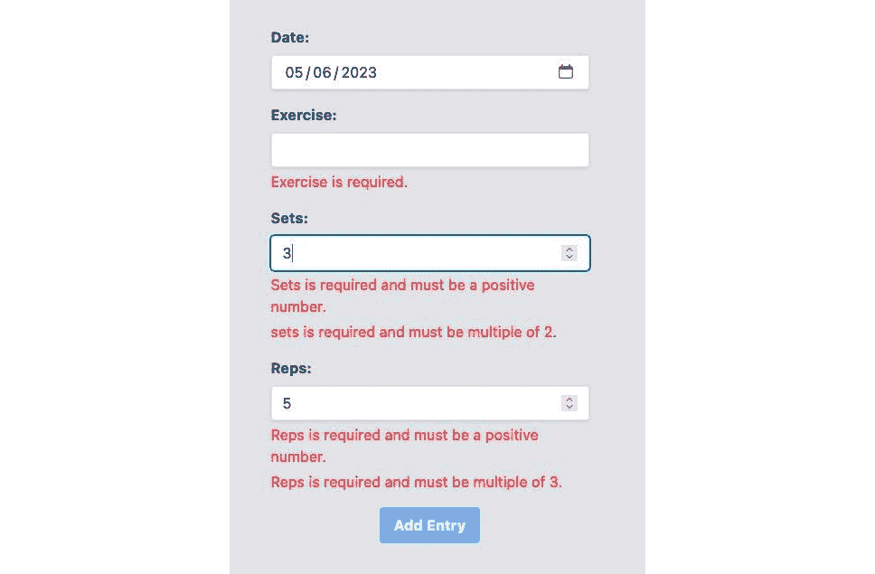

# 第六章：处理用户输入：表单

自从 Web 应用程序的早期以来，在`<form>`标签的概念被用来创建、组织和将表单发送到后端之前。

在常见的应用程序中，例如银行系统和健康应用程序，我们使用表单来组织用户需要在我们的系统中执行的操作。由于 Web 应用程序中这样一个常见的元素，Angular 这样的框架，其哲学是“内置电池”，自然为开发者提供了这一功能。

在本章中，我们将深入探讨 Angular 中的以下表单功能：

+   模板驱动表单

+   响应式表单

+   数据验证

+   自定义验证

+   打字响应式表单

到本章结束时，您将能够为您的用户创建可维护且流畅的表单，同时通过此类任务提高您的生产力。

# 技术要求

要遵循本章中的说明，您需要以下内容：

+   Visual Studio Code ([`code.visualstudio.com/Download`](https://code.visualstudio.com/Download))

+   Node.js 18 或更高版本([`nodejs.org/en/download/`](https://nodejs.org/en/download/))

本章的代码文件可在[`github.com/PacktPublishing/Angular-Design-Patterns-and-Best-Practices/tree/main/ch6`](https://github.com/PacktPublishing/Angular-Design-Patterns-and-Best-Practices/tree/main/ch6)找到。

在学习本章内容时，请记住使用`npm start`命令运行位于`gym-diary-backend`文件夹中的应用程序的后端。

# 模板驱动表单

Angular 有两种不同的方式处理表单：**模板驱动**和**响应式**。首先，让我们探索模板驱动表单。正如其名所示，我们最大限度地利用 HTML 模板的能力来创建和管理与表单关联的数据模型。

我们将演进我们的健身日记应用程序，以更好地说明这一概念。在以下命令行中，我们使用 Angular CLI 创建新的页面组件：

```js
ng g c diary/new-entry-form-template
```

要访问新的分配表单，我们将重构日记页面组件，使**添加新条目**按钮将用户带到我们创建的组件。

让我们在`DiaryModule`模块中添加对负责管理应用程序路由的框架模块的导入：

```js
. . .
import { RouterModule } from '@angular/router';
@NgModule({
 declarations: [
   DiaryComponent,
   EntryItemComponent,
   ListEntriesComponent,
   NewItemButtonComponent,
   NewEntryFormTemplateComponent,
 ],
 imports: [CommonModule, DiaryRoutingModule, RouterModule],
})
export class DiaryModule {}
```

导入`RouterModule`模块后，我们将能够使用 Angular 的路由服务。有关路由的更多详细信息，请参阅*第七章*，*路由和路由器*。我们将在`DiaryRoutingModule`模块中添加新组件到路由：

```js
. . .
import { NewEntryFormTemplateComponent } from './new-entry-form-template/new-entry-form-template.component';
const routes: Routes = [
  {
    path: '',
    component: DiaryComponent,
  },
  {
    path: 'new-template',
    component: NewEntryFormTemplateComponent,
  },
];
@NgModule({
  imports: [RouterModule.forChild(routes)],
  exports: [RouterModule],
})
export class DiaryRoutingModule {}
```

为了能够比较两种表单创建方法，我们将为将要创建的每个示例组件创建一个路由。在这里，URL `/home/new-template`将引导我们到模板驱动表单路由。

现在，我们将重构`DiaryComponent`以修改**添加新条目**按钮的行为：

```js
. . .
import { Router } from '@angular/router';
@Component({
  templateUrl: './diary.component.html',
  styleUrls: ['./diary.component.css'],
})
export class DiaryComponent implements OnInit {
  private exerciseSetsService = inject(ExerciseSetsService);
  private router = inject(Router)
. . .
  addExercise(newSet: ExerciseSet) {
    this.router.navigate(['/home/new-template'])
  }
. . .
}
```

首先，我们需要注入 Angular 的路由服务。我们将`addExercise`方法改为使用该服务，并使用`navigate`方法导航到页面。

我们可以继续在 `new-entry-form-template.component.html` 文件中的表单 HTML 模板，并仅放置表单的元素：

```js
<div class="flex h-screen items-center justify-center bg-gray-200">
  <form class="mx-auto max-w-sm rounded bg-gray-200 p-4">
      . . .
      <input
        type="date"
        id="date"
         name="date"
     />
. . .
      <input
        type="text"
        id="exercise"
        name="exercise"
      />
. . .
      <input
        type="number"
        id="sets"
        name="sets"
      />
  </div>
  <input
    type="number"
    id="reps"
    name="reps"
  />
   </div>
   <div class="flex items-center justify-center">
     <button
       type="submit"
     >
     Add Entry
     </button>
...
```

Angular 使用 HTML 最佳实践，因此我们现在将在 HTML `<form>` 标签下创建表单字段。在输入字段中，我们尊重 HTML 语义，并创建与客户端所需信息类型正确的 `<input>` 字段。

让我们使用 `ng serve` 命令运行我们的应用程序。通过点击 **新条目** 按钮，我们将能够注意到我们的日记条目添加表单。



图 6.1 – 健身日记表单 UI

这里，我们有表单的结构和模板。现在，我们将准备让 Angular 通过模板中的用户输入来管理字段的状态。要使用模板驱动表单，我们需要将 `FormModule` 模块导入到我们的功能模块 `DiaryModule` 中：

```js
import { FormsModule } from '@angular/forms';
@NgModule({
  declarations: [
    DiaryComponent,
    EntryItemComponent,
    ListEntriesComponent,
    NewItemButtonComponent,
    NewEntryFormTemplateComponent,
  ],
  imports: [CommonModule, DiaryRoutingModule, RouterModule, FormsModule],
})
export class DiaryModule {}
```

在我们的表单模板中，我们将添加创建和链接表单信息到其数据模型的指令：

```js
. . .
<form
  (ngSubmit)="newEntry()"
  class="mx-auto max-w-sm rounded bg-gray-200 p-4">
    <div class="mb-4">
      . . .
      <input type="date" id="date" name="date"
      . . .
        [(ngModel)]="entry.date"
      />
    </div>
    <div class="mb-4">
      . . .
      <input type="text" id="exercise" name="exercise"
[(ngModel)]="entry.exercise"
      . . . />
    </div>
    <div class="mb-4">
. . .
      <input type="number" id="sets" name="sets"  [(ngModel)]="entry.sets"
. . ./>
    </div>
    <div class="mb-4">
. . .
      <input type="number" id="reps" name="reps" [(ngModel)]="entry.reps"
 . . ./>
. . .
</form>
</div>
ngSubmit parameter to state which method will be called by Angular when the user submits the form. Then, we link the HTML input elements with the data model that will represent the form. We do this through the [(ngModel)] directive.
`ngModel` is an object managed by the `FormModule` module that represents the form’s data model. The use of square brackets and parentheses signals to Angular that we are performing a two-way data binding on the property.
This means that the `ngModel` property will both receive the `form` property and emit events. Finally, for development and debugging purposes, we are placing the content of the entry object in the footer and formatting it with the JSON pipe.
Let’s finish the form by changing the component’s TypeScript file:

```

export class NewEntryFormTemplateComponent {

private exerciseSetsService = inject(ExerciseSetsService);

private router = inject(Router);

entry: ExerciseSet = { date: new Date(), exercise: '', reps: 0, sets: 0 };

newEntry() {

const newEntry = { ...this.entry };

this.exerciseSetsService

.addNewItem(newEntry)

.subscribe((entry) => this.router.navigate(['/home']));

}

}

```js

 First, we inject the `ExerciseSetsService` service for the backend communication and the router service because we want to return to the diary as soon as the user creates a new entry.
Soon after we create the entry object that represents the form’s data model, it is important that we start it with an empty object because Angular makes the binding as soon as the form is loaded. Finally, we create the `newEntry` method, which will send the form data to the backend through the `ExerciseSetsService` service.
For more details about Angular services, see *Chapter 5*, *Angular Services and the Singleton Pattern*. If we run our project and fill in the data, we can see that we are back to the diary screen with the new entry in it.
Notice that at no point did we need to interact with the entry object, as Angular’s form template engine took care of that for us! This type of form can be used for simpler situations, but now we will see the way recommended by the Angular team to create all types of forms: reactive forms!
Reactive forms
Reactive forms use a declarative and explicit approach to creating and manipulating form data. Let’s put this concept into practice by creating a new form for our project.
First, on the command line, let’s use the Angular CLI to generate the new component:

```

ng g c diary/new-entry-form-reactive

```js

 In the same way as we did with the template-driven form, let’s add this new component to the `DiaryRoutingModule` routing module:

```

import { NewEntryFormReactiveComponent } from './new-entry-form-reactive/new-entry-form-reactive.component';

const routes: Routes = [

{

path: '',

component: DiaryComponent,

},

{

path: 'new-template',

component: NewEntryFormTemplateComponent,

},

{

path: 'new-reactive',

component: NewEntryFormReactiveComponent,

},

];

```js

 In the `DiaryModule` module, we need to add the `ReactiveFormsModule` module responsible for all the functionality that Angular makes available to us for this type of form:

```

@NgModule({

declarations: [

. . .

],

imports: [

. . .

ReactiveFormsModule,

],

})

```js

 To finalize the component’s route, let’s change the main screen of our application, replacing the route that the **New Entry** button will call:

```

addExercise(newSet: ExerciseSet) {

this.router.navigate(['/home/new-reactive']);

}

```js

 We will now start creating the reactive form. First, let’s configure the component elements in the `new-entry-form-reactive.component.ts` TypeScript file:

```

export class NewEntryFormReactiveComponent implements OnInit {

public entryForm!: FormGroup;

private formBuilder = inject(FormBuilder);

ngOnInit() {

this.entryForm = this.formBuilder.group({

date: [''],

exercise: [''],

sets: [''],

reps: [''],

});

}

}

```js

 Note that the first attribute is `entryForm` of type `FormGroup`. It will represent our form—not just the data model, but the whole form—as validations, field structure, and so on.
Then, we inject the `FormBuilder` service responsible for assembling the `entryForm` object. Note the name of the service that Angular uses from the `Builder` design pattern, which has the objective of creating complex objects, such as a reactive form.
To initialize the `entryForm` attribute, we’ll use the `onInit` component lifecycle hook. Here, we’ll use the `group` method to define the form’s data model. This method receives the object, and each attribute receives an array that contains the characteristics of that attribute in the form. The first element of the array is the initial value of the attribute.
In the component’s template, we will create the structure of the form, which, in relation to the template-driven form example, is very similar:

```

<div class="flex h-screen items-center justify-center bg-gray-200">

<form

[formGroup]="entryForm"

<input

type="date"

id="date"

name="date"

formControlName="date"

/>

<input

type="text"

id="exercise"

name="exercise"

formControlName="exercise"

/>

<input

type="number"

id="sets"

name="sets"

formControlName="sets"

/>

<input

type="number"

id="reps"

name="reps"

formControlName="reps"

/>

<button type="submit">

添加条目

</button>

将 formGroup 属性与之前创建的对象关联。要将每个模板字段关联到 FormGroup 属性，我们使用 formControlName 元素。

为了调试数据模型，我们也在使用 JSON 管道，但请注意，为了获取用户填写的数据模型，我们使用 `entryForm` 对象的 `value` 属性。最后，我们将使用项目的 API 功能和记录输入来完善表单。

下一步是更改组件：

```js
export class NewEntryFormReactiveComponent implements OnInit {
  . . .
  private exerciseSetsService = inject(ExerciseSetsService);
  private router = inject(Router);
  . . .
  newEntry() {
    const newEntry = { ...this.entryForm.value };
    this.exerciseSetsService
      .addNewItem(newEntry)
      .subscribe((entry) => this.router.navigate(['/home']));
  }
}
```

在这里，我们注入了 `ExerciseSetsService` API 的消费者服务和 Angular 路由服务路由。

在 `newEntry` 方法中，就像前面的例子一样，我们捕获用户输入的数据。然而，在响应式表单中，它位于 `value` 属性中，我们通过服务将此属性发送到 API。

运行项目后，我们可以看到界面工作得像为模板驱动表单编写的对应界面一样。



图 6.2 – 使用响应式表单的健身房日记表单 UI

你可能想知道，使用响应式表单的优势是什么？为什么 Angular 社区和团队推荐使用它？接下来，我们将看到如何使用表单的内置验证以及如何将它们集成到我们的响应式表单中。

数据验证

一个好的用户体验实践是在用户离开填写字段时立即验证用户在表单中输入的信息。这可以最小化用户的挫败感，同时提高将发送到后端的信息。

使用响应式表单，我们可以使用 Angular 团队创建的实用类来添加在表单中常用到的验证。让我们改进我们的项目，首先在 `NewEntryFormReactiveComponent` 组件中：

```js
. . .
import { FormBuilder, FormGroup, Validators } from '@angular/forms';
. . .
export class NewEntryFormReactiveComponent implements OnInit {
. . .
 ngOnInit() {
   this.entryForm = this.formBuilder.group({
     date: ['', Validators.required],
     exercise: ['', Validators.required],
     sets: ['', [Validators.required, Validators.min(0)]],
     reps: ['', [Validators.required, Validators.min(0)]],
   });
 }
newEntry() {
   if (this.entryForm.valid) {
     const newEntry = { ...this.entryForm.value };
     this.exerciseSetsService
       .addNewItem(newEntry)
       .subscribe((entry) => this.router.navigate(['/home']));
   }
 }
}
```

在前面的例子中，我们正在从 Angular 导入 `Validators` 包，该包将为我们的报告的基本验证提供 `utility` 类。在创建响应式表单对象的 `ngOnInit` 方法中，验证位于定义表单字段的数组中的第二个位置。

我们在表单的所有字段中使用必填验证，并在 `sets` 和 `reps` 字段中添加另一个验证以确保数字是正数。要添加多个验证，我们可以添加另一个包含验证的数组。

我们对组件所做的另一个更改是，现在它在开始与后端交互之前检查表单是否有效。我们通过检查对象的 `valid` 属性来完成此操作。Angular 会自动根据用户输入更新此字段。

在模板文件中，让我们为用户添加错误信息：

```js
  <div
    *ngIf="entryForm.get('date')?.invalid && entryForm.get('date')?.touched"
    class="mt-1 text-red-500"
  >
    Date is required.
  </div>
  <div
    *ngIf="
      entryForm.get('exercise')?.invalid &&
      entryForm.get('exercise')?.touched
      "
    class="mt-1 text-red-500"
  >
    Exercise is required.
  </div>
   . . .
  <div
    *ngIf="entryForm.get('sets')?.invalid && entryForm.get('sets')?.touched"
    class="mt-1 text-red-500"
  >
    Sets is required and must be a positive number.
  </div>
  <div
    *ngIf="entryForm.get('reps')?.invalid && entryForm.get('reps')?.touched"
    class="mt-1 text-red-500"
  >
    Reps is required and must be a positive number.
  </div>
  <button
    type="submit"
    [disabled]="entryForm.invalid"
    [class.opacity-50]="entryForm.invalid"
  >
    Add Entry
  </button>
```

要在模板中显示验证，我们使用包含我们想要的消息的 `div` 元素。为了决定消息是否显示，我们使用 `ngIf` 指令，检查字段的状况。

为了做到这一点，我们首先使用 `GET` 方法获取字段并检查以下两个属性：

+   `invalid` 属性检查字段是否根据组件中配置的规则无效。

+   `touched`属性检查用户是否访问了字段。建议在界面加载时不要显示所有验证。

除了每个字段的验证之外，为了提高可用性，我们通过在表单无效时禁用**提交**按钮并应用 CSS 来使其对用户清晰可见。

运行项目，我们可以看到验证访问了所有字段，而没有任何字段被填写。



图 6.3 – 健身日记表单 UI 验证

我们已经学习了如何使用 Angular 的实用类进行验证，所以让我们探索如何创建我们自己的自定义验证。

自定义验证

我们可以扩展验证的使用，并创建可以接收参数的自定义函数，以最大化在项目中的重用。为了说明这一点，让我们创建一个自定义验证来评估重复次数或组数是否分别是 2 和 3 的倍数。

让我们创建一个名为`custom-validation.ts`的新文件，并添加以下函数：

```js
import { AbstractControl, ValidationErrors, ValidatorFn } from '@angular/forms';
export function multipleValidator(multiple: number): ValidatorFn {
  return (control: AbstractControl): ValidationErrors | null => {
    const isNotMultiple = control.value % multiple !== 0;
    return isNotMultiple ? { isNotMultiple: { value: control.value } } : null;
  };
}
```

为了让 Angular 识别表单验证函数，它必须返回一个具有`ValidatorFn`接口中描述的签名的函数。这个签名定义了它将接收`AbstractControl`，并且必须返回一个类型为`ValidationErrors`的对象，允许模板解释新的验证类型。

在这里，我们使用`control.value`获取输入值，如果它不是 3 的倍数，我们将返回`error`对象。否则，我们将返回`null`，这将向 Angular 指示值是正确的。

要使用这个函数，我们将按照以下方式重构我们的表单组件：

```js
. . .
ngOnInit() {
  this.entryForm = this.formBuilder.group({
    date: ['', Validators.required],
    exercise: ['', Validators.required],
    sets: [
      '',
      [Validators.required, Validators.min(0), multipleValidator(2)],
    ],
    reps: [
      '',
      [Validators.required, Validators.min(0), multipleValidator(3)],
    ],
  });
}
. . .
```

要使用我们的自定义函数，我们需要从新创建的文件中导入它，并在构建表单对象时将其用于验证数组中，就像标准 Angular 验证一样。

最后，让我们更改表单模板以添加错误信息：

```js
. . .
    <div
      *ngIf="
        entryForm.get('sets')?.errors?.['isNotMultiple'] &&
        entryForm.get('sets')?.touched
      "
      class="mt-1 text-red-500"
    >
      sets is required and must be multiple of 2.
    </div>
. . .
    <div
      *ngIf="
        entryForm.get('reps')?.errors?.['isNotMultiple'] &&
        entryForm.get('reps')?.touched
      "
      class="mt-1 text-red-500"
    >
      Reps is required and must be multiple of 3.
    </div>
. . .
```

我们包括新的`div`元素，但为了特别验证输入的倍数错误，我们使用`error`属性，并在其中使用我们自定义函数的新`isNotMultiple`属性。

我们使用这个参数是因为它在运行时定义的，Angular 将在编译时警告它不存在。

运行我们的项目，我们可以看到新的验证：



图 6.4 – 健身日记表单 UI 自定义验证

除了验证之外，从 Angular 14 版本开始，响应式表单可以更好地进行类型化，以确保在项目开发中提高生产力和安全性。我们将在下一节中介绍这个功能。

类型化响应式表单

在我们的项目中，如果我们查看对象和值的类型，我们可以看到它们都是`any`类型。虽然功能性强，但通过更好地使用 TypeScript 的类型检查，我们可以改善这种开发体验。

让我们按照以下方式重构组件中的代码：

```js
export class NewEntryFormReactiveComponent {
  private formBuilder = inject(FormBuilder);
  private exerciseSetsService = inject(ExerciseSetsService);
  private router = inject(Router);
  public entryForm = this.formBuilder.group({
    date: [new Date(), Validators.required],
    exercise: ['', Validators.required],
    sets: [0, [Validators.required, Validators.min(0), multipleValidator(2)]],
    reps: [0, [Validators.required, Validators.min(0), multipleValidator(3)]],
  });
  newEntry() {
    if (this.entryForm.valid) {
      const newEntry = { ...this.entryForm.value };
      this.exerciseSetsService
        .addNewItem(newEntry)
        .subscribe((entry) => this.router.navigate(['/home']));
    }
  }
}
```

我们将表单对象的创建移动到了组件的构造函数中，并使用 API 将接受的类型初始化字段。使用 Visual Studio Code 的 IntelliSense，我们可以看到 Angular 推断出类型，现在我们有一个非常接近 `ExerciseSet` 类型的对象。

然而，随着这个更改，`addNewItem` 方法抛出了一个错误，这实际上是个好事，因为它意味着我们现在正在使用 TypeScript 的类型检查来发现那些只能在运行时出现的潜在错误。为了解决这个问题，我们首先需要将服务修改为接收一个可以包含 `ExerciseSet` 的一些属性的对象。

在服务中更改 `addNewItem` 方法：

```js
addNewItem(item: Partial<ExerciseSet>): Observable<ExerciseSet> {
  return this.httpClient.post<ExerciseSet>(this.url, item);
}
```

在这里，我们使用 TypeScript 的 `Partial` 类型来告知函数它可以接收一个包含部分接口属性的对象。回到我们的组件中，我们可以看到它仍然有一个错误。这是因为它可以接收表单属性中的 `null` 值。

为了解决这个问题，让我们将 `FormBuilder` 服务更改为 `NonNullableFormBuilder` 类型，如下所示：

```js
export class NewEntryFormReactiveComponent {
. . .
  private formBuilder = inject(NonNullableFormBuilder);
. . .
}
```

通过这个更改，Angular 本身执行了这个验证。唯一的要求是所有表单字段都已初始化，这在我们这里已经完成了。

这样，我们的响应式表单就正常工作了，现在我们可以更有效地使用 TypeScript 的类型检查了！

摘要

在本章中，我们探讨了 Angular 表单以及如何使用它们来提升我们的用户体验和团队的生产力。我们学习了如何使用模板表单来满足更简单的需求，并探讨了 Angular 如何使用 `ngModel` 对象在 HTML 和数据模型之间执行绑定。

我们还使用响应式表单，这为创建和操作表单提供了许多可能性。关于响应式表单，我们研究了如何对字段应用验证以及如何创建我们自己的自定义验证函数。最后，我们重构了我们的响应式表单，使用带类型的表单来利用 TypeScript 类型检查。

在下一章中，我们将探讨 Angular 的路由机制以及它为我们的应用带来的可能性。

```js

```
