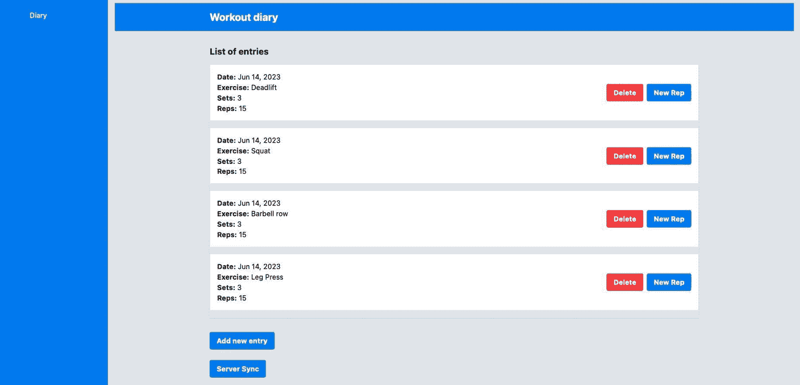
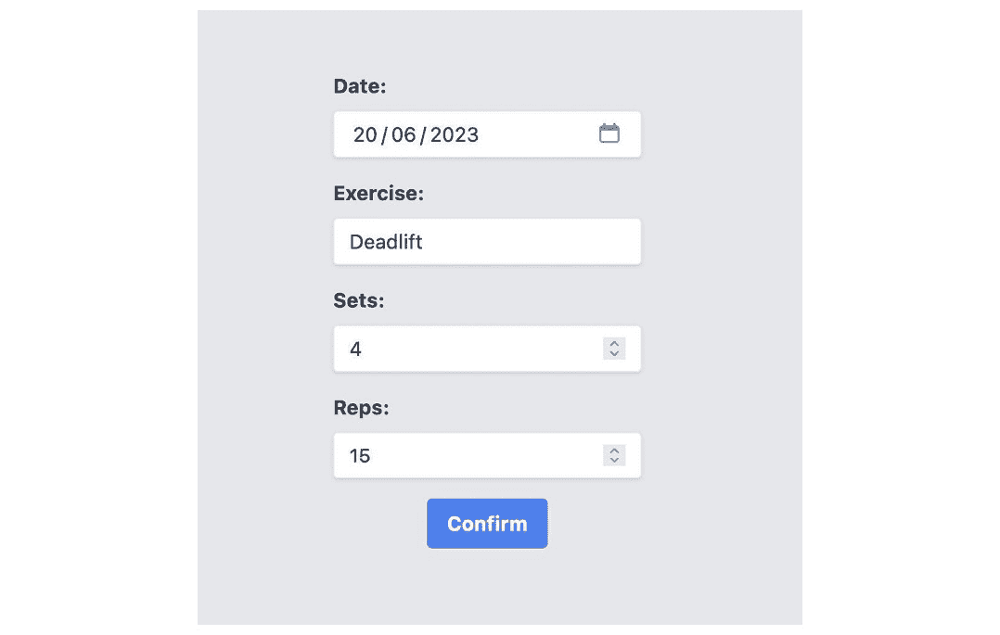
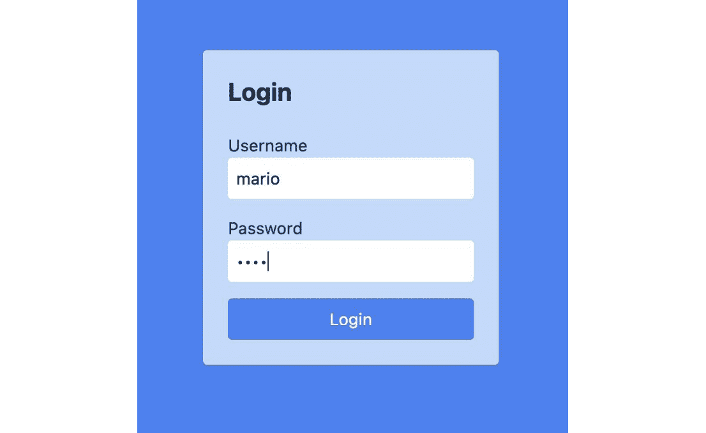

# 第七章：路由和路由器

一个 `index.html` 页面，并且从那里，所有 Web 应用程序的内容都使用 JavaScript 渲染。

然而，从用户的角度来看，他们正在与登录屏幕、主页和购买表单等不同界面（或页面）进行交互。技术上，它们都在 `index.html` 页面上渲染，但对于用户来说，它们是不同的体验。

负责这种客户端在单页应用（SPA）中与界面交互流程的机制是路由引擎。Angular 框架自带此功能，在本章中，我们将详细探讨它。

本章我们将涵盖以下主题：

+   路由和导航

+   定义错误页面和标题

+   动态路由 – 通配符和参数

+   保护路由 – 守卫

+   优化体验 – 解析

到本章结束时，您将能够使用 Angular 的路由机制创建改进用户体验的导航流程。

# 技术要求

要遵循本章的说明，您需要以下内容：

+   Visual Studio Code ([`code.visualstudio.com/Download`](https://code.visualstudio.com/Download))

+   Node.js 18 或更高版本 ([`nodejs.org/en/download/`](https://nodejs.org/en/download/))

本章的代码文件可在 [`github.com/PacktPublishing/Angular-Design-Patterns-and-Best-Practices/tree/main/ch7`](https://github.com/PacktPublishing/Angular-Design-Patterns-and-Best-Practices/tree/main/ch7) 找到。

在遵循本章内容时，请记得使用 `npm start` 命令运行位于 `gym-diary-backend` 文件夹中的应用程序的后端。

# 路由和导航

让我们通过创建一个具有简化菜单的用户界面主页来改进我们的项目，从而探索我们可以使用 Angular 路由实现的可能。在命令行中，我们将使用 Angular CLI 创建一个新的模块和组件页面：

```js
ng g m home --routing
```

在前面的代码片段中，我们首先创建了一个新的模块，并通过使用 `--routing` 参数，我们指示 Angular CLI 创建模块及其路由文件。以下命令创建了我们在工作的组件：

```js
ng g c home
```

更多关于 Angular CLI 和模块的详细信息，您可以参考 *第二章*，*组织* *您的应用程序*。

首先，让我们在我们刚刚创建的组件的 HTML 文件中创建模板：

```js
<div class="flex h-screen">
  <aside class="w-1/6 bg-blue-500 text-white">
    <nav class="mt-8">
      <ul class="flex flex-col items-center space-y-4">
        <li>
          <a class="flex items-center space-x-2 text-white">
            <span>Diary</span>
          </a>
        </li>
        <li>
          <a class="flex items-center space-x-2 text-white">
            <span>New Entry</span>
          </a>
        </li>
      </ul>
    </nav>
  </aside>
  <main class="flex-1 bg-gray-200 p-4">
    <router-outlet></router-outlet>
  </main>
</div>
```

在这个模板示例中，我们使用 `<aside>` 和 `<main>` HTML 元素来创建菜单和将要投影所选页面的区域。为此，我们使用 `<router-outlet>` 指令来指示 Angular 正确的区域。

要使主页成为主页面，我们需要修改我们的应用程序在 `app-routing.module.ts` 文件中的主要路由模块：

```js
. . .
const routes: Routes = [
  { path: '', pathMatch: 'full', redirectTo: 'home' },
  {
    path: 'home',
    loadChildren: () =>
      import('./home/home.module').then((file) => file.HomeModule),
  },
];
. . .
export class AppRoutingModule {}
```

`routes` 数组是 Angular 路由机制的主要元素。我们在其中定义对象，这些对象对应于用户将能够访问的路由。在这个例子中，我们定义了应用程序的根路由（`"/"`）将通过 `redirectTo` 属性重定向用户到 `home` 路由。

在这里，我们应该使用 `pathMatch` 属性，并设置为 `"full"` 值。这是因为它决定了 Angular 路由引擎是否会匹配第一个与模式匹配的路由（默认行为，即 `"prefix"`），或者是否会匹配整个路由。

在第二个对象中，我们正在定义 `home` 路由并懒加载 `Home` 模块。有关懒加载的更多详细信息，您可以参考 *第二章*，*组织* *您的应用程序*。

当运行我们的应用程序时，我们有菜单和显示我们的锻炼日记页面的区域。

要在主页上包含锻炼日记，我们需要修改 `HomeRoutingModule` 模块：

```js
import { NgModule } from '@angular/core';
import { RouterModule, Routes } from '@angular/router';
import { HomeComponent } from './home.component';
const routes: Routes = [
  {
    path: '',
    component: HomeComponent,
    children: [
      {
        path: 'diary',
        loadChildren: () =>
          import('../diary/diary.module').then((file) => file.DiaryModule),
      },
      {
        path: '',
        redirectTo: 'diary',
        pathMatch: 'full',
      },
    ],
  },
];
@NgModule({
  imports: [RouterModule.forChild(routes)],
  exports: [RouterModule],
})
export class HomeRoutingModule {}
```

在这个路由文件中，类似于上一个文件，我们定义了主路由将导向 `HomeComponent` 组件。然而，在这里，我们希望路由和模块在组件的 *router outlet* 中渲染，而不是 `AppModule`。

在这里，`children` 属性发挥作用，我们将定义该模块的嵌套路由。由于我们想使用 `DiaryComponent`，我们正在对该模块进行懒加载。这遵循了 Angular 在应用程序中分离功能模块的最佳实践。

现在，当我们再次运行应用程序时，我们又有了日记页面。



图 7.1 – 带有日记的健身房日记主页

为了结束这个环节，让我们在 `Home` 模板中添加新的锻炼条目链接。进行以下修改：

```js
<li>
  <a routerLink="./diary" class="flex items-center space-x-2 text-white">
    <span>Diary</span>
  </a>
</li>
<li>
  <a routerLink="./diary/new-reactive" class="flex items-center space-x-2 text-white">
    <span>New Entry</span>
  </a>
</li>
```

我们正在使用 Angular 的 `routerLink` 指令在模板中创建链接，指定它应该导航到的 URL。

一个需要注意的重要细节是，我们正在使用项目的相对路径来创建链接，使用 `./`。因为条目表单路由位于日记模块中，Angular 解释为该模块已经被加载，并允许链接，无需在 `HomeRoutingModule` 组件中声明额外的声明。

在下一节中，让我们探讨如何处理用户输入一个不存在的日期的场景。

# 定义错误页面和标题

在我们的当前项目中，如果用户输入一个没有映射路由的路径，他们将面临一个空白屏幕。这不是一个好的 **用户体验**（**UX**）实践；理想情况下，我们需要通过显示错误页面来处理这个错误，以便将其重定向到正确的页面。

首先，让我们使用 Angular CLI 创建组件：

```js
ng generate component ErrorPage
```

在这里，我们直接在 `AppModule` 中创建组件，因为我们想将这种处理应用于整个系统，而不是特定的功能模块。

让我们为这个组件创建一个带有错误信息的模板：

```js
<div class="flex h-screen flex-col items-center justify-center">
  <h1 class="mb-4 text-6xl font-bold text-red-500">Oops!</h1>
  <h2 class="mb-2 text-3xl font-bold text-gray-800">Looks like you're lost!</h2>
  <p class="mb-6 text-gray-600">
    We couldn't find the page you're looking for.
  </p>
  <p class="text-gray-600">
    But don't worry! Go back to the Gym Diary and continue your progress!
  </p>
  <a
    routerLink="/home"
    class="mt-4 rounded bg-blue-500 px-4 py-2 font-bold text-white hover:bg-blue-600"
  >
    Go back to the Gym Diary
  </a>
</div>
```

注意，我们有一个链接到主页的号召性用语，让用户返回主页。

下一步是更新`AppRoutingModule`路由文件：

```js
. . .
import { ErrorPageComponent } from './error-page/error-page.component';
const routes: Routes = [
  { path: '', pathMatch: 'full', redirectTo: 'home' },
  {
    path: 'home',
    loadChildren: () =>
      import('./home/home.module').then((file) => file.HomeModule),
  },
  { path: 'error', component: ErrorPageComponent },
  { path: '**', redirectTo: '/error' },
];
. . .
```

到这一点，Angular 将完成其工作。只需定义错误页面路由并在数组中创建另一个条目，我们就已经定义了`'**'`路径并将其重定向到错误路由。

当我们运行项目时，如果用户输入了错误的页面，将会显示以下信息：


图 7.2 - 错误路由错误页面

我们还可以在我们的应用程序中改进的另一个点是**浏览器**标签页中的页面标题。

为了做到这一点，我们还可以再次使用 Angular 的路由机制。在`DiaryRoutingModule`中，我们需要更改以下代码片段：

```js
. . .
const routes: Routes = [
  {
    path: '',
    component: DiaryComponent,
    title: 'Diary',
  },
  {
    path: 'new-template',
    component: NewEntryFormTemplateComponent,
  },
  {
    path: 'new-reactive',
    component: NewEntryFormReactiveComponent,
    title: 'Entry Form',
  },
];
. . .
```

要更改标题，我们只需在路由定义中通知`title`属性。另一种可能的方法（但更长）是使用 Angular 的`Title`服务。

让我们在`NewEntryFormTemplateComponent`组件中举例说明：

```js
import { Title } from '@angular/platform-browser';
. . .
export class NewEntryFormTemplateComponent implements OnInit {
. . .
  private titleService = inject(Title);
. . .
  ngOnInit(): void {
    this.titleService.setTitle('Template Form');
  }
. . .
}
```

注入`Title`服务后，我们在`OnInit`生命周期钩子中使用它。虽然路由方法更简单、更直观，但如果标题可以动态更改，则可以使用`Title`服务。

我们将在下一节学习如何从一个路由传递信息到另一个路由。

# 动态路由 - 通配符和参数

我们希望更改**新重复**按钮的功能，使其不再是向条目添加重复，而是用户实际上可以编辑条目，打开填写了数据的表单。

首先，让我们向`ExerciseSetsService`服务中添加一个新方法：

```js
export class ExerciseSetsService {
 . . .
  updateItem(id: string, item: Partial<ExerciseSet>): Observable<ExerciseSet> {
    return this.httpClient.put<ExerciseSet>(`${this.url}/${id}`, item);
  }
  getItem(id: string): Observable<ExerciseSet> {
    return this.httpClient.get<ExerciseSet>(`${this.url}/${id}`);
  }
}
```

除了通过获取特定项创建新方法外，我们还准备了`update`方法来接受`ExerciseSet`对象的`Partial`。

编辑日记条目的表单将与添加新条目时的表单相同，不同之处在于它将被填写，并将调用`update`方法。因此，让我们重用`NewEntryFormReactiveComponent`组件来完成这项工作。

我们将首先编辑`DiaryRoutingModule`路由文件：

```js
const routes: Routes = [
. . .
. . .
  {
    path: 'entry',
    component: NewEntryFormReactiveComponent,
    title: 'Entry Form',
  },
  {
    path: 'entry/:id',
    component: NewEntryFormReactiveComponent,
    title: 'Edit Entry',
  },
];
```

在`route`数组中，我们将新表单的路由更改为`entry`并创建`entry/:id`路由。

此路由指向相同的组件，但请注意`:id`告诉 Angular 这是一个动态路由——也就是说，它将接收一个变量值，必须指向该路由。

随着这一变化，我们需要重构我们应用程序的一些部分。在`HomeComponent`菜单中，让我们调整应用程序路由：

```js
<li>
  <a
    routerLink="./diary/entry"
    class="flex items-center space-x-2 text-white"
  >
    <span>New Entry</span>
  </a>
</li>
```

我们还需要调整日记和输入组件以调用新路由而不是增加重复次数。在`EntryItemComponent`组件中，我们将调整组件的方法和`Output`实例：

```js
export class EntryItemComponent {
  @Input('exercise-set') exerciseSet!: ExerciseSet;
  @Output() editEvent = new EventEmitter<ExerciseSet>();
  @Output() deleteEvent = new EventEmitter<string>();
  delete() {
    this.deleteEvent.emit(this.exerciseSet.id);
  }
  editEntry() {
    this.editEvent.emit(this.exerciseSet);
  }
}
```

在这里，我们移除了处理并仅发出事件。在模板中，我们将调整 HTML 内容：

```js
. . .
<button
  class="rounded bg-blue-500 px-4 py-2 font-bold text-white hover:bg-blue-700"
  (click)="editEntry()"
>
  Edit
</button>
. . .
```

我们还将调整 `ListEntriesComponent` 组件以正确传播 `editEvent`：

```js
export class ListEntriesComponent {
  @Input() exerciseList!: ExerciseSetList;
  @Output() editEvent = new EventEmitter<ExerciseSet>();
  @Output() deleteEvent = new EventEmitter<string>();
. . .
}
<app-entry-item
  [exercise-set]="item"
  (deleteEvent)="deleteEvent.emit($event)"
  (editEvent)="editEvent.emit($event)"
/>
```

我们将对日记进行一些小的更改以反映新路由。我们首先在模板中这样做：

```js
<app-list-entries
  [exerciseList]="exerciseList"
  (deleteEvent)="deleteItem($event)"
  (editEvent)="editEntry($event)"
/>
```

在组件中，我们将更改 `newRep` 方法，除了名称更改外，它还将重定向到新路由：

```js
addExercise(newSet: ExerciseSet) {
  this.router.navigate(['/home/diary/entry']);
}
deleteItem(id: string) {
  this.exerciseSetsService.deleteItem(id).subscribe();
}
editEntry(updateSet: ExerciseSet) {
  const id = updateSet.id ?? '';
  this.router.navigate([`/home/diary/entry/${id}`]);
}
```

为了重定向到新路由，我们正在进行字符串插值以包含由列表项输出发出的 `id`。最后，让我们将注意力集中在表单上。在 `NewEntryFormReactiveComponent` 组件中，让我们调整模板中的 `button` 标签：

```js
<button
  type="submit"
  [disabled]="entryForm.invalid"
  [class.opacity-50]="entryForm.invalid"
  class="rounded bg-blue-500 px-4 py-2 font-bold text-white hover:bg-blue-700"
>
  Add Entry
</button>
```

在 `NewEntryFormReactiveComponent` 组件中，我们将对其进行调整，使其现在成为创建和编辑条目的表单：

```js
. . .
export class NewEntryFormReactiveComponent implements OnInit {
. . .
  private route = inject(ActivatedRoute);
  private entryId?: string | null;
. . .
  ngOnInit(): void {
    this.entryId = this.route.snapshot.paramMap.get('id');
    if (this.entryId) {
      this.exerciseSetsService
        .getItem(this.entryId)
        .subscribe((entry) => this.updateForm(entry));
    }
  }
  updateForm(entry: ExerciseSet): void {
    let { id: _, ...entryForm } = entry;
    this.entryForm.setValue(entryForm);
  }
. . .
}
```

在示例中，我们使用 `OnInit` 生命周期钩子根据被调用的路由配置表单。为此，Angular 有一个名为 `ActivatedRoute` 的服务。

在 `ngOnInit` 方法中，我们捕获调用我们应用程序的路由参数，如果组件接收到 ID，它将从后端获取条目并根据返回值更新表单。

这里的一个细节是，我们正在使用解构赋值来从对象中移除 `id` 字段，因为它在表单的数据模型中不存在。

在相同的组件中，我们需要更改日记条目的记录：

```js
newEntry() {
  if (this.entryForm.valid) {
    const newEntry = { ...this.entryForm.value };
    if (this.entryId) {
      this.exerciseSetsService
        .updateItem(this.entryId, newEntry)
        .subscribe((entry) => this.router.navigate(['/home']));
    } else {
      this.exerciseSetsService
        .addNewItem(newEntry)
        .subscribe((entry) => this.router.navigate(['/home']));
    }
  }
}
```

在 `newEntry` 方法中，如果组件通过路由接收到了对象的 `id`，它将表现为编辑并调用 `exerciseSetsService` 服务的相应方法。

当我们运行项目时，我们现在有了输入编辑表单。



图 7.3 – 健身日记编辑条目表单

从 Angular 的第 16 版开始，我们在路由参数的使用上有了改进。除了 `ActivatedRoute` 服务外，我们还可以直接将页面组件的输入映射到我们应用程序的路由变量中。

让我们重构我们的示例，首先更改主路由模块 `AppRoutingModule`：

```js
. . .
@NgModule({
  imports: [
    RouterModule.forRoot(routes, {
      bindToComponentInputs: true,
    }),
  ],
  exports: [RouterModule],
})
export class AppRoutingModule {}
```

要使用此资源，我们需要在应用程序路由的一般配置中添加 `bindToComponentInputs` 属性。

在我们的表单页面中，我们将进行如下重构：

```js
export class NewEntryFormReactiveComponent implements OnInit {
  @Input('id') entryId?: string;
. . .
  ngOnInit(): void {
    if (this.entryId) {
      this.exerciseSetsService
        .getItem(this.entryId)
        .subscribe((entry) => this.updateForm(entry));
    }
  }
. . .
}
```

我们为 `entryId` 属性创建 `Input` 并定义路由的通配符变量将是 `id`。我们这样做是为了防止需要重构组件的其余部分，但我们也可以将属性名称更改为 `id`，如下例所示：

```js
 @Input() id?: string;
```

这里重要的是 Angular 自动将来自路由的信息绑定到属性中，从而进一步简化通过 URL 将参数传递到组件的过程。

在下一节中，我们将通过学习路由守卫来了解如何保护路由免受错误访问。

# 保护路由 – 守卫

到目前为止，我们已经看到了如何通过路由获取数据来确定`page`组件的行为。然而，Angular 创建的路由非常灵活，还允许您通过基于业务规则的条件资源来塑造客户的旅程。

为了说明这个功能，我们将创建一个具有简化认证机制的登录屏幕。为了创建组件，我们将使用 Angular CLI。

在您操作系统的命令提示符下，使用以下命令：

```js
ng g m login --routing
ng g c login
ng g s login/auth
```

第一个命令创建了一个带有`routes`文件的`Login`模块。第二个命令创建了`login`页面组件，最后，我们有了将管理后端认证交互的服务。

在`Login`模块中，我们将配置新模块的依赖项：

```js
. . .
@NgModule({
  declarations: [
    LoginComponent
  ],
  imports: [
    CommonModule,
    LoginRoutingModule,
    ReactiveFormsModule
  ]
})
export class LoginModule { }
```

接下来，让我们将新模块添加到`AppRoutingModule`：

```js
const routes: Routes = [
  { path: '', pathMatch: 'full', redirectTo: 'home' },
  {
    path: 'home',
    loadChildren: () =>
      import('./home/home.module').then((file) => file.HomeModule),
  },
  {
    path: 'login',
    loadChildren: () =>
      import('./login/login.module').then((file) => file.LoginModule),
  },
  { path: 'error', component: ErrorPageComponent },
  { path: '**', redirectTo: '/error' },
];
```

在`LoginRoutingModule`模块中，我们将配置我们创建的组件：

```js
const routes: Routes = [
  { path: '', component: LoginComponent },
];
@NgModule({
  imports: [RouterModule.forChild(routes)],
  exports: [RouterModule]
})
export class LoginRoutingModule { }
```

为了简化处理认证服务的请求和响应有效负载，让我们使用新的类型创建一个接口：

```js
export interface LoginForm {
  username: string;
  password: string;
}
export interface Token {
  access_token: string;
}
```

`LoginForm`接口对应我们要发送的数据，而`Token`接口是 API 返回的，基本上是应用将发送给客户端的 JWT 访问令牌。

创建了接口后，让我们创建一个将协调与后端交互的服务：

```js
export class AuthService {
  private httpClient = inject(HttpClient);
  private url = 'http://localhost:3000/auth/login';
  private token?: Token;
  login(loginForm: Partial<LoginForm>): Observable<Token> {
    return this.httpClient
      .post<Token>(this.url, loginForm)
      .pipe(tap((token) => (this.token = token)));
  }
  get isLogged() {
    return this.token ? true : false;
  }
  logout() {
    this.token = undefined;
  }
}
```

在这个服务中，我们使用`HttpClient`服务向后端发送请求（更多详情，请参阅*第五章*，*Angular 服务和单例模式*)。我们使用 RxJS 的 tap 操作符，以便在请求成功后立即将令牌保存到`service`变量中。

正是通过这个变量，我们创建了`isLogged`属性，这对于控制路由非常重要。创建了服务后，我们可以开发`Login`页面模板：

```js
<div class="flex justify-center items-center h-screen bg-blue-500">
  <div class="bg-blue-200 rounded shadow p-6">
    <h2 class="text-2xl font-bold text-gray-800 mb-6">Login</h2>
    <form class="space-y-4"
    [formGroup]="loginForm"
    (ngSubmit)="login()"
    >
    <div>
      <label for="username" class="text-gray-700">Username</label>
      <input type="text" id="username" class="block w-full rounded border-gray-300 p-2 focus:border-blue-500 focus:outline-none" formControlName="username">
    </div>
    <div>
      <label for="password" class="text-gray-700">Password</label>
      <input type="password" id="password" class="block w-full rounded border-gray-300 p-2 focus:border-blue-500 focus:outline-none" formControlName="password">
    </div>
    <div>
      <button
        type="submit"
        class="bg-blue-500 text-white rounded px-4 py-2 w-full"
        [disabled]="loginForm.invalid"
        [class.opacity-50]="loginForm.invalid"
        >Login</button>
    </div>
    </form>
  </div>
</div>
```

在创建`Login`页面时，一个重要点是正确使用 HTML `input`字段类型以正确处理 UX 和可访问性。

完成模板后，让我们开发组件：

```js
export class LoginComponent {
  private formBuilder = inject(NonNullableFormBuilder);
  private loginService = inject(AuthService);
  private router = inject(Router);
  public loginForm = this.formBuilder.group({
    username: ['', [Validators.required]],
    password: ['', [Validators.required]],
  });
  login() {
    const loginValue = { ...this.loginForm.value };
    this.loginService.login(loginValue).subscribe({
      next: (_) => {
        this.router.navigate(['/home']);
      },
      error: (e) => alert('User not Found'),
    });
  }
}
```

在这个例子中，我们正在创建响应式表单，并在`login`方法中使用`AuthService`服务。运行项目后，在`url /login`，我们将有我们的登录屏幕。要使用该屏幕，我们有用户名`mario`和密码`1234`：



图 7.4 – 登录页面

要创建注销处理，我们将在`HomeComponent`组件菜单中创建一个链接，并在其中创建`logout`方法，将其重定向到登录页面：

```js
<li>
  <a
    (click)="logout()"
    class="flex items-center space-x-2 text-white"
  >
    <span>Logout</span>
  </a>
</li>
export class HomeComponent {
  private authService = inject(AuthService);
  private router = inject(Router);
  logout() {
    this.authService.logout();
    this.router.navigate(['./login']);
  }
}
```

页面创建后，现在我们需要一种方式来确保只有用户登录时才能访问日记。对于这种类型的路由检查，我们应该使用 Angular 的**路由****守卫**功能。

要创建它，我们可以依靠 Angular CLI 的帮助；在命令行中，使用以下命令：

```js
ng g guard login/auth
```

将会显示一个选择列表；选择**CanActivate**。在新文件中，让我们创建以下函数：

```js
export const authGuard: CanActivateFn = (route, state) => {
  const authService = inject(AuthService);
  const router = inject(Router);
  if (authService.isLogged) {
    return true;
  } else {
    return router.parseUrl('/login');
  }
};
```

从版本 14 开始，创建路由守卫的推荐方式是通过函数而不是类。

我们正在创建一个具有`CanActivateFn`接口的`authGuard`函数，这是一个期望返回布尔值或`UrlTree`类对象的函数，用于将用户重定向到指定的路由。

在函数中，我们首先注入`AuthService`和`Router`服务；注意在这个上下文中`inject`函数是强制性的，因为在函数中我们没有构造函数来注入服务。

配置好服务后，我们做一个评估`isLogged`服务属性的`if`语句。如果用户已登录，我们返回`true`，允许导航到该路由。否则，我们返回一个包含登录页面路由的`UrlTree`类的对象。

要使用守卫，让我们改变`DiaryRoutingModule`：

```js
const routes: Routes = [
  {
    path: '',
    component: DiaryComponent,
    title: 'Diary',
    canActivate: [authGuard],
  },
  {
    path: 'new-template',
    component: NewEntryFormTemplateComponent,
  },
  {
    path: 'entry',
    component: NewEntryFormReactiveComponent,
    title: 'Entry Form',
  },
  {
    path: 'entry/:id',
    component: NewEntryFormReactiveComponent,
    title: 'Edit Entry',
  },
];
```

通过使用`canActivate`属性，我们可以传递一个或多个路由守卫。

运行应用程序后，我们可以看到我们被导向登录页面。但如果我们直接调用`/home/diary/entry`路由，我们会发现它并没有被保护。这是因为我们只在`/diary`路由上设置了`guard`。

为了解决这个问题，我们可以在所有路由上设置`canActivate`属性，但更有效的方法是将路由的类型改为`CanActivateChild`。

回到`route`函数，让我们改变它的类型：

```js
export const authGuard: CanActivateChildFn = (route, state) => {
. . .
};
```

我们现在需要重构`DiaryRoutingModule`：

```js
const routes: Routes = [
  {
    path: '',
    children: [
      {
        path: '',
        component: DiaryComponent,
        title: 'Diary',
      },
      {
        path: 'new-template',
        component: NewEntryFormTemplateComponent,
      },
      {
        path: 'entry',
        component: NewEntryFormReactiveComponent,
        title: 'Entry Form',
      },
      {
        path: 'entry/:id',
        component: NewEntryFormReactiveComponent,
        title: 'Edit Entry',
      },
    ],
    canActivateChild: [authGuard],
  },
];
```

这里，我们使用了一个无组件的路由模式；基本上，我们创建了一个没有组件的路由，并将所有路由作为它的子路由。

然后，我们使用`canActivateChild`属性来调用路由的守卫，这样我们就不需要在这个模块中重复所有路由。

路由守卫功能可以为您的应用程序做更多的事情，而不仅仅是流程控制；我们可以提高它的感知性能，就像我们将在下一节中看到的那样。

# 优化体验 – 解析

性能是影响用户体验和满意度最大的变量之一；因此，最佳性能应该是网络开发者的一个持续目标。

感知感知是我们想要赢得的游戏，在 Angular 生态系统中我们有丰富的选择。我们可以在页面渲染之前加载页面所需的信息，为此我们将使用 Resolveroute 保存资源。

与我们之前研究的守卫不同，它的目的是返回由路由导向的页面所需的信息。

我们将使用 Angular CLI 创建这个守卫。在您的命令提示符中，使用以下命令：

```js
ng g resolver diary/diary
```

在新创建的文件中，让我们改变 Angular CLI 生成的函数：

```js
export const diaryResolver: ResolveFn<ExerciseSetListAPI> = (route, state) => {
  const exerciseSetsService = inject(ExerciseSetsService);
  return exerciseSetsService.getInitialList();
};
```

函数注入了`ExerciseSetsService`服务，并返回`getInitialList`方法返回的 Observable。

我们将使用这个新解析器配置`DiaryRoutingModule`：

```js
{
  path: '',
  component: DiaryComponent,
  title: 'Diary',
  resolve: { diaryApi: diaryResolver },
},
```

我们使用`resolve`属性，就像配置路由指南一样，不同之处在于我们将一个对象与函数关联起来，这对于组件消耗由它生成数据将非常重要。

在`DiaryComponent`组件中，我们将对该组件进行重构，使其从解析器中获取数据，而不是直接从服务中获取信息：

```js
. . .
private route = inject(ActivatedRoute);
. . .
  ngOnInit(): void {
    this.route.data.subscribe(({ diaryApi }) => {
      this.exerciseList = diaryApi.items;
    });
  }
. . .
```

组件现在正在消耗路由的`data`属性。它返回一个包含`diaryApi`属性的对象的可观察对象——这是我们之前在`routes`模块中配置的。

当我们再次运行我们的项目时，我们会看到屏幕的行为在外部没有改变；然而，在内部，我们在组件加载之前从健身房日记中获取信息。在我们这个例子中的这种变化可能不易察觉，但在一个更大、更复杂的应用中，这可能是你和你的团队所寻找的差异。

重要的是要记住，这不会加快对后端请求的速度。它将花费与之前一样的时间，但你的用户可能会感受到的性能可能会受到影响。

我们将对加载日记条目编辑页面进行相同的处理；在同一个`resolve`文件中，我们将创建一个新的函数：

```js
export const entryResolver: ResolveFn<ExerciseSet> = (route, state) => {
  const entryId = route.paramMap.get('id')!;
  const exerciseSetsService = inject(ExerciseSetsService);
  return exerciseSetsService.getItem(entryId);
};
```

函数注入了服务，但这次我们使用`route`参数来提取条目的`id`以加载它。这个参数由 Angular 提供，以便你可以从你将配置解析器的路由中提取任何属性。

在`route`模块中，我们将`resolve`函数添加到编辑路由：

```js
{
  path: 'entry/:id',
  component: NewEntryFormReactiveComponent,
  title: 'Edit Entry',
  resolve: { entry: entryResolver },
},
```

现在，我们需要重构组件以使用路由守卫信息：

```js
  private route = inject(ActivatedRoute);
. . .
  ngOnInit(): void {
    if (this.entryId) {
      this.route.data.subscribe(({ entry }) => {
        this.updateForm(entry);
      });
    }
  }
```

就像我们在日记页面中所做的那样，这里我们用路由的消耗来替换服务的消耗。

# 摘要

在本章中，我们与路由及其资源一起工作，以引导和组织我们应用中的用户流程。我们了解了 Angular 框架中的路由器概念，并为用户使用了不存在路由的情况创建了一个错误页面。我们通过重用表单创建了编辑日记条目页面，并利用动态路由功能学习了如何捕获页面设置所需的路由数据。

最后，我们了解了路由守卫功能，创建了简化的登录流程，并看到了如何通过在页面加载之前使用守卫解析功能来加载后端信息来优化用户体验。

在下一章中，我们将学习如何使用资源通过拦截器设计模式来简化我们对后端的请求。
