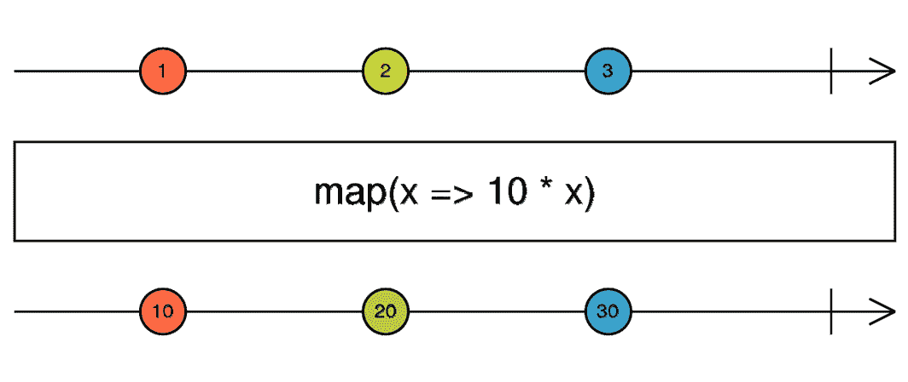

# 9

# 使用 RxJS 探索反应性

在一个网络应用程序中，最具挑战性的任务之一是处理网络的异步性。应用程序无法预测诸如对后端请求、更改路由和简单的用户交互等事件何时会发生。在这些情况下，命令式编程更复杂且容易出错。

构成 Angular 生态系统的 RxJS 库旨在通过声明性和响应式编程使控制异步流程变得更加简单。

在本章中，我们将涵盖以下主题：

+   可观察对象和操作符

+   处理数据 – 转换操作符

+   另一种订阅方式 – 异步管道

+   连接信息流 – 高阶操作符

+   优化数据消费 – 过滤操作符

+   如何选择正确的操作符

到本章结束时，你将通过将它们与后端请求集成来为你的用户提供更好的体验。

# 技术要求

要遵循本章的说明，你需要以下内容：

+   Visual Studio Code ([`code.visualstudio.com/Download`](https://code.visualstudio.com/Download))

+   Node.js 18 或更高版本 ([`nodejs.org/en/download/`](https://nodejs.org/en/download/))

本章的代码文件可在以下位置找到。

在本章中，请记住使用 `npm start` 命令运行位于 `gym-diary-backend` 文件夹中的应用程序的后端。

# 可观察对象和操作符

到目前为止，我们使用可观察对象作为通过 `subscribe` 方法捕获来自后端 API 的数据的方式，但让我们退一步，问一下什么是可观察对象，以及为什么我们不直接使用 JavaScript 承诺。

让我们使用表格来组织我们的解释：

|  | **单** | **多** |
| --- | --- | --- |
| 同步 | 函数 | Iterator |
| 异步 | Promise | Observable |

表 9.1 – 根据需求的对象类型

当我们需要执行同步处理并期望返回值时，我们使用函数。如果我们需要一个同步值的集合，我们使用 `Iterator` 类型的对象。当我们需要函数的返回值但其处理是异步的时候，我们使用承诺。

但对于异步处理，我们能够使用什么来不返回一个值，而是一个可以随时间作为事件分发的值集合呢？对这个需求的答案是 **可观察对象**！使用这种数据结构，我们可以捕获一系列事件并在声明性上使我们的应用程序对这些事件做出反应。

关于使用承诺进行 HTTP 请求的使用，我们可以使用它们，但使用承诺执行冗长且复杂的任务可以改用可观察对象和 RxJS 来完成。我们可以这样说，承诺能做的，可观察对象也能做，反之亦然，这会变得复杂。

在 Angular 中，大多数异步事件都是通过可观察对象映射和控制的。除了 HTTP 请求、用户输入、应用程序之间的路由交换，甚至组件的生命周期都是通过可观察对象控制的，因为它们是随时间发生的事件。

我们可以将这些事件视为信息流，RxJS 和可观察的概念可以操纵这些流，并使我们的应用程序能够对其做出反应。操纵此流的主要资源是 RxJS 操作符，这些是接收并返回数据到该流的函数。

在下一节中，我们将从将转换流数据的操作符开始。

# 处理数据 – 转换操作符

在我们的`DiaryComponent`应用程序组件中，它渲染日记条目的列表，我们可以注意到我们的组件需要知道从 API 返回的值的详细信息，在这种情况下，详细信息是在一个名为`item`的属性中返回的。

让我们重构服务，使其仅返回组件需要的已格式化的内容，抽象 API 的结构。

在`ExerciseSetsService`服务中，我们将重构以下方法：

```js
import { Observable, map } from 'rxjs';
. . .
export class ExerciseSetsService {
. . .
  getInitialList(): Observable<ExerciseSetList> {
    const headers = new HttpHeaders().set('X-TELEMETRY', 'true');
    return this.httpClient
      .get<ExerciseSetListAPI>(this.url, { headers })
      .pipe(map((api) => api?.items));
  }
  refreshList(): Observable<ExerciseSetList> {
    return this.httpClient
      .get<ExerciseSetListAPI>(this.url)
      .pipe(map((api) => api?.items));
  }
. . .
}
```

在服务的`getInitialList`和`refreshList`方法中，我们调用`Observable`对象的`pipe`方法。这是理解 RxJS 的基本方法，因为通过它，我们可以定义哪些操作符将在可观察对象封装的信息流中起作用。

`pipe`方法也返回一个可观察对象，当组件调用`subscribe`方法时，其结果将通过所有操作符并传递结果。针对我们的需求，我们使用`map`操作符，它接收可观察对象正在处理的数据，并返回将被`next`操作符或最终由订阅该组件使用的其他数据。

在这种情况下，操作符接收一个`ExerciseSetListAPI`类型的对象，我们将返回其中包含的项元素到组件，该组件是`ExerciseSetList`类型。通过这个更改，VS Code 以及 Angular 的 Language Server（有关如何配置的更多详细信息，请参阅*第一章*，*正确开始项目*）将在`diary.resolver.ts`文件中指出错误。我们将按以下方式更正它：

```js
export const diaryResolver: ResolveFn<ExerciseSetList> = (route, state) => {
  const exerciseSetsService = inject(ExerciseSetsService);
  return exerciseSetsService.getInitialList();
};
```

由于服务现在返回的是期刊条目而不是整个 API 返回的结构，我们更改了函数返回的类型。请注意，RxJS 使用 TypeScript 来提高开发者的体验。

在`DiaryRoutingModule`模块中，让我们重构我们修复的解析器的使用：

```js
const routes: Routes = [
  {
    path: '',
    children: [
      {
        path: '',
        component: DiaryComponent,
        title: 'Diary',
        resolve: { exerciseList: diaryResolver },
      },
. . .
  },
];
```

重要的是尽可能清晰地命名项目变量；在这种情况下，我们将`route`属性更改为`exerciseList`。为了完成这个任务，我们需要重构`DiaryComponent`组件：

```js
export class DiaryComponent implements OnInit {
 . . .
 ngOnInit(): void {
   this.route.data.subscribe(({ exerciseList }) => {
     this.exerciseList = exerciseList;
   });
 }
 newList() {
   this.exerciseSetsService
     .refreshList()
     .subscribe((exerciseList) => (this.exerciseList = exerciseList));
 }
. . .
}
```

使用服务中的 `map` 操作符，现在，在组件中，我们只传递练习列表，因此组件不需要知道实现和 API 的细节。

在下一节中，我们将看到另一种订阅方式。

# 另一种订阅方式 – 异步管道

为了展示 RxJS 在 Angular 应用中的多功能性，我们将执行在后台添加搜索练习的任务到日记条目包含表单中。

按照 Angular 应用的良好实践，我们将创建一个表示练习的接口。从操作系统的命令行，我们将使用 Angular CLI：

```js
ng g interface diary/interfaces/exercise
```

在由 Angular CLI 生成的文件中，我们定义了 API 返回的结构：

```js
export interface Exercise {
  id?: string;
  description: string;
}
export type ExerciseList = Array<Exercise>;
export interface ExerciseListAPI {
  hasNext: boolean;
  items: ExerciseList;
}
```

我们使用接口来定义 API 的返回值，并使用类型来定义练习列表。下一步是创建一个将获取这些信息的服务，再次使用 Angular CLI：

```js
ng g service diary/services/exercises
```

使用由 Angular CLI 创建的服务结构，我们将完成服务的逻辑：

```js
export class ExercisesService {
  private httpClient = inject(HttpClient);
  private url = 'exercises';
  getExercises(filter?: string): Observable<ExerciseList> {
    const headers = new HttpHeaders().set('X-LOADING', 'false');
    filter = filter ? `?filter=${filter}` : '';
    return this.httpClient
      .get<ExerciseListAPI>(`${this.url}${filter}`, { headers })
      .pipe(map((api) => api?.items));
  }
}
```

在服务中，我们使用 `HttpClient` Angular 服务，因为我们将要查询一个 API，并且我们在请求中添加了 `X-LOADING` 头部，值为 `false`，因为我们在这里不希望加载屏幕搜索练习。

如果组件传递了一个过滤器，我们将添加 `get` URL。最后，我们使用之前章节中看到的 `map` 操作符，因为我们不希望组件担心了解 API 的结构。

服务创建后，我们可以更改 `NewEntryFormReactiveComponent` 表单：

```js
export class NewEntryFormReactiveComponent implements OnInit {
. . .
  private exerciseService = inject(ExercisesService);
  public showSuggestions: boolean = false;
  public exercises$ = this.exerciseService.getExercises();
  selectExercise(suggestion: string) {
    this.entryForm.get('exercise')?.setValue(suggestion);
    this.toggleSuggestions(false);
  }
  toggleSuggestions(turnOn: boolean) {
    this.showSuggestions = turnOn;
  }
}
```

在这里，我们首先注入我们创建的服务，并创建一个属性来控制是否显示练习列表。

`exercises$` 属性将包含服务将返回的可观察对象。你可能已经注意到这里的 `$` 符号。在变量和属性中使用这个后缀是社区惯例。这不是强制性的，但你经常会在使用 RxJS 的代码库中看到这个符号。

我们还创建了两个方法，当用户从列表中选择一个练习时将被触发。让我们更改表单模板：

```js
. . .
    <input
      type="text"
      id="exercise"
      name="exercise"
      class="w-full appearance-none rounded border px-3 py-2 leading-tight text-gray-700 shadow"
      formControlName="exercise"
      (focus)="toggleSuggestions(true)"
    />
    <ul
      class="absolute z-10 mt-2 w-auto rounded border border-gray-300 bg-white"
      *ngIf="showSuggestions"
    >
      <li
        *ngFor="let suggestion of exercises$ | async"
        class="cursor-pointer px-3 py-2 hover:bg-blue-500 hover:text-white"
        (click)="selectExercise(suggestion.description)"
      >
        {{ suggestion.description }}
      </li>
    </ul>
. . .
```

在 `exercise` 字段中，我们添加了一个由 `ul` HTML 元素组成的列表，并且这个列表将通过 `showSuggestions` 属性来展示。字段的焦点事件将触发这个变量，点击元素将调用 `selectExercise` 方法。

这段代码的注意力将集中在以下指令上：

```js
*ngFor="let suggestion of exercises$ | async"
```

使用 `*ngFor` 指令，我们想要遍历一个列表，但在这里，我们没有列表，而是一个可观察对象。这是怎么做到的？

这是异步管道的责任！这个管道在模板中执行的操作是在可观察对象上执行订阅，获取其结果，即练习列表，并将 `*ngFor` 指令提供给迭代。

注意，我们之所以得到了这样简洁的代码，是因为在服务中，我们使用`map`操作符来准备返回的观察者，使其正好满足组件的需求。异步管道提供的另一个优点是框架控制了观察者的生命周期；也就是说，当组件被销毁时，Angular 会自动触发`unsubscribe`方法。

我们在本书中尚未进行这种处理，因为 HTTP 请求生成的观察者在请求完成后不会打开，但在这里我们将使用观察者来处理其他可能使观察者流仍然打开的情况。

控制我们使用的观察者的生命周期非常重要；否则，我们可能会生成由内存泄漏引起的错误和性能下降。使用异步管道，这种订阅管理是由 Angular 本身完成的！

在下一节中，我们将使用 RxJS 和异步管道连接不同的流。

# 连接信息流 - 高阶操作符

正如我们在本章开头所看到的，除了 HTTP 请求之外，还有许多用途可以使用观察者。在我们的任务中，我们将举例说明这种用途。在响应式表单中，用户在字段中输入被视为一个观察者。

在我们的例子中，让我们改变`NewEntryFormReactiveComponent`组件：

```js
ngOnInit(): void {
  this.entryForm.valueChanges.subscribe((model) => console.log(model));
  . . .
}
```

运行我们的应用程序，我们可以在浏览器控制台中看到，在任意表单字段中输入会触发由`subscribe`方法捕获的事件。

知道我们可以对用户输入事件做出反应，我们如何将此事件连接到 API 中的练习信息搜索？我们使用一个操作符！

在我们的组件中，我们将重构代码：

```js
public exercises$ = this.entryForm.valueChanges.pipe(
  switchMap((model) => this.exerciseService.getExercises(model?.exercise))
);
```

我们从组件中移除`ngOnInit`方法的订阅，并将`exercises$`观察者的赋值放入其中。然而，如果我们这样做，TypeScript 和 Angular 类型验证会显示一个错误，因为模板正在等待一个列表来执行迭代。

进入`switchMap`操作符。我们用表单中输入的练习请求流替换第一个事件流，将表单模型的`exercise`字段作为`exerciseService`服务的过滤器。

结果是，`exercises$`观察者继续接收一系列练习。执行我们的项目，我们会注意到我们有一个列表，当我们在字段中填写时，会进行搜索请求，如图所示。


图 9.1 – 练习选择

`switchMap`操作符是一个高阶观察者，因为它接受一个观察者作为输入并返回一个观察者作为输出。这与`map`操作符形成对比，后者接受一个观察者作为输入并返回一个值作为输出。

使用命令，我们有了`search`字段，但如果查看浏览器中的**网络**标签页，我们可以看到每次我们键入一个字母都会触发一个请求。我们可以在不影响用户体验的情况下改进应用程序的数据消耗，我们将在下一节中这样做。

# 优化数据消耗 – 过滤操作符

我们创建类型提示类型`search`字段的任务已经完成，但我们可以从消耗 HTTP 请求的角度使这个功能更高效。在这里，在我们的情况下，如果用户只键入一个字母，我们已经开始搜索信息，但一个字母仍然会导致一个非常开放的列表。

对于我们的应用程序来说，从用户键入的第三个字母开始查找练习会更有趣，我们可以为此行为进行以下修改：

```js
public exercises$ = this.entryForm.valueChanges.pipe(
  map((model) => model?.exercise ?? ''),
  filter((exercise) => exercise.length >= 3),
  switchMap((exercise) => this.exerciseService.getExercises(exercise))
);
```

在这里，我们开始使用 RxJS 最灵活的特性之一，即链式操作符以执行特定操作。我们始终需要记住操作符的顺序非常重要，一个操作符的输出是下一个操作符的输入：

1.  我们使用已知的`map`操作符来从`form`模型中提取仅`exercise`字段，并将数据视为字段值未定义。

1.  `filter`操作符与 JavaScript 中`Array`对象的同名方法类似。它接收`exercise`字符串，并验证其长度必须大于或等于三个才能进入下一个操作符。

1.  最后，我们运行`switchMap`高阶操作符，将表单键入的可观察值切换到服务的 HTTP 请求可观察值。

我们还可以使用另一个操作符，为可观察值的流开始添加一个等待时间，如下例所示：

```js
const DEBOUNCE_TIME = 300;
. . .
public exercises$ = this.entryForm.valueChanges.pipe(
  debounceTime(DEBOUNCE_TIME),
  map((model) => model?.exercise ?? ''),
  filter((exercise) => exercise.length >= 3),
  switchMap((exercise) => this.exerciseService.getExercises(exercise))
);
. . .
```

我们添加了`debounceTime`操作符来创建流开始的延迟时间，以毫秒为单位，并使用常量来使代码更清晰，这是良好的实践。

让我们使用一个新的操作符添加最后一个优化：

```js
public exercises$ = this.entryForm.valueChanges.pipe(
  debounceTime(DEBOUNCE_TIME),
  map((model) => model?.exercise ?? ''),
  filter((exercise) => exercise.length >= 3),
  distinctUntilChanged(),
  switchMap((exercise) => this.exerciseService.getExercises(exercise))
);
```

`distinctUntilChanged`操作符检查流的数据，这里指`exercise`，是否从一个迭代到另一个迭代发生了变化，并且只有当值不同时才会触发下一个操作符，从而节省更多不必要的后端调用。

我们已经了解了一些操作符，但库中超过 80 个。在下一节中，我们将学习如何浏览库的文档。

# 如何选择正确的操作符

RxJS 库有大量的操作符可以帮助简化你的代码并处理异步和性能的边缘情况。

你不需要记住所有的操作符，我们之前看到的那些将帮助你处理最常见的情况。

图书馆文档有一个**决策树**页面，我们将学习如何导航该页面。

进入网站([`rxjs.dev/operator-decision-tree`](https://rxjs.dev/operator-decision-tree))，在这里，我们将导航到一个我们已经研究过的操作符，以展示这个工具的使用。


图 9.2 – 操作符决策树

让我们回到我们的表单示例。我们需要从用户的输入中获取练习信息——让我们假设我们不知道选择哪个操作符。

我们已经有一个可观察对象，它是 Angular 表单中的`valueChanges`事件，所以第一个屏幕上，我们将选择`我有一个现有的` `可观察对象` `和`选项。

我们对 API 的请求由一个可观察对象表示，所以在下个屏幕上，我们将选择**我想为每个** **值** **启动一个新的可观察对象**选项。

由于我们希望为用户输入的每个字母都发出新的请求，我们希望将一个流更改为另一个流，所以下一个屏幕上，我们将选择**当新** **值到达时** **取消之前的嵌套可观察对象**。

练习搜索取决于 Angular 表单中的值，所以最终页面上，我们将选择**嵌套可观察对象为每个** **值** **计算**。

确认选择后，决策树指示这种情况的正确操作符是我们正在使用的`switchMap`操作符！

在 RxJS 文档中，我们还需要理解的是宝石图。为此，让我们以我们在本章中研究的另一个操作符为例，即这里的`map`操作符：https://rxjs.dev/api/index/function/map。

除了文本说明外，我们还有以下图示：



图 9.3 – Map 操作符的宝石图（来源：https://rxjs.dev/api/index/function/map，MIT 许可）

正如我们在本章开头所学的，RxJS 在信息流上工作，其中操作符具有处理信息的功能。

说明这个流程的图使用箭头表示时间的流逝，用宝石表示值。

因此，在这份文档中，我们看到`map`操作符接受每个发出的值，并根据一个函数，产生一个由其转换的值流。

这些值一旦发出就依次交换，因此，在图中，我们可以看到宝石的位置相同。

这种理解对于理解库中其他更复杂的操作符是基本的。

# 摘要

在本章中，我们探讨了 RxJS 库及其基本元素，可观察对象。

我们学习了什么是可观察对象以及它与承诺或函数的区别。有了这些知识，我们重构了我们的项目，使用`map`操作符处理数据，抽象出将消费服务的组件的实现细节。我们还了解了 Angular 的异步管道以及它是如何简化对可观察对象的订阅管理的，将这项任务留给了框架本身来管理。

最后，我们使用 RxJS 创建了一个 typeahead 搜索字段，根据用户的输入事件搜索练习，使用操作符来优化前端发出的 HTTP 调用。在下一章中，我们将探讨我们可以在 Angular 应用程序中进行的自动化测试的可能性。

# 第三部分：架构和部署

在本部分中，你将学习如何构建你的 Angular 项目的架构以满足用户面临的挑战和需求。我们将探讨使用框架使用的库进行自动化测试的最佳实践，并安装 Cypress 进行端到端测试。我们将了解微前端架构以及如何使用 Angular 实现它。我们将使用 Azure 云服务执行构建和部署我们的示例应用程序，并最终了解如何更新 Angular 应用程序以及从版本 17 开始使用 Angular Signals 等特性。

本部分包含以下章节：

+   *第十章**，为测试而设计：最佳实践*

+   *第十一章**，使用 Angular Elements 的微前端*

+   *第十二章**，打包一切：部署的最佳实践*

+   *第十三章**，Angular 的文艺复兴*
