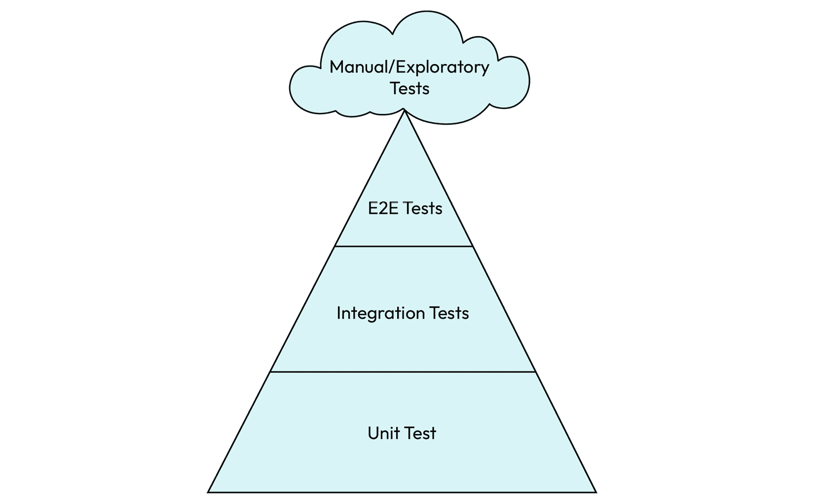
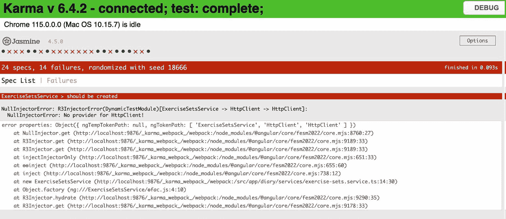
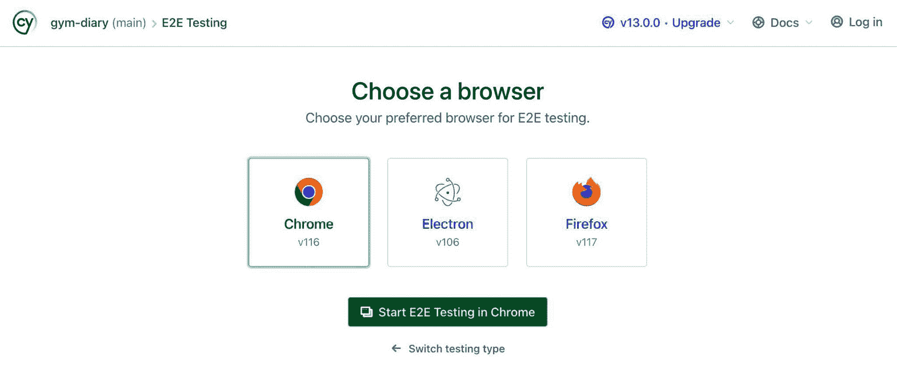
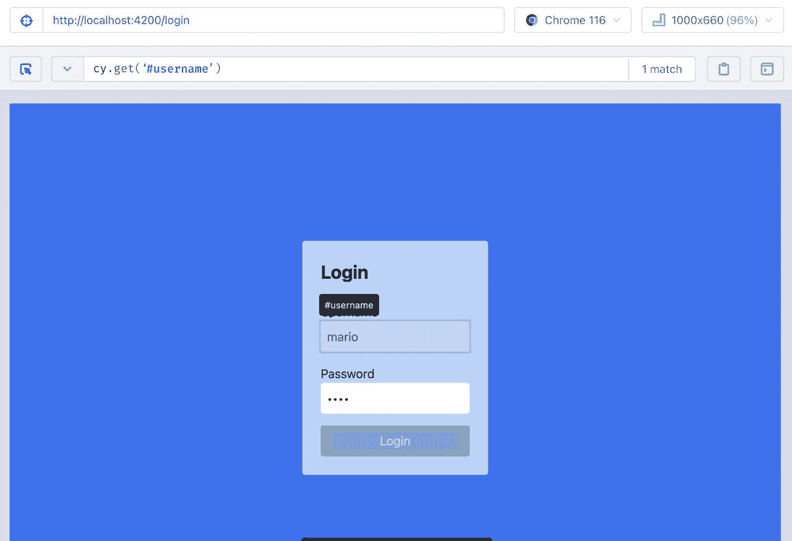

# 10

# 测试设计：最佳实践

在软件项目中，无论是前端还是后端项目，最佳实践之一就是进行测试。毕竟，如果你和你的团队不严格测试你的系统，那么不可避免地测试系统并发现潜在错误的人将是用户，我们不想看到这种情况发生。

因此，Angular 团队自框架的第一版以来就关注于创建和集成自动化测试工具，这并不奇怪。

我们可以通过默认情况下 Angular CLI 总是与组件一起生成测试文件这一事实来注意到这一点，就好像在说，“嘿，朋友，别忘了*单元测试*！”

在本章中，我们将通过以下内容来探讨这个主题：

+   需要测试的内容

+   服务测试

+   理解 `TestBed`

+   组件测试

+   使用 Cypress 进行端到端测试

在本章结束时，你将能够为你的组件和服务创建测试，从而提高你交付的质量和团队的工作效率。

# 技术要求

要遵循本章的说明，你需要以下内容：

+   Visual Studio Code ([`code.visualstudio.com/Download`](https://code.visualstudio.com/Download))

+   Node.js 18 或更高版本 ([`nodejs.org/en/download/`](https://nodejs.org/en/download/))

本章的代码文件可在 [`github.com/PacktPublishing/Angular-Design-Patterns-and-Best-Practices/tree/main/ch10`](https://github.com/PacktPublishing/Angular-Design-Patterns-and-Best-Practices/tree/main/ch10) 找到。

在学习本章的过程中，请记住使用 `npm start` 命令运行位于 `gym-diary-backend` 文件夹中的应用程序的后端。

# 需要测试的内容

在一个软件项目中，我们可以进行多种类型的测试以确保产品的质量。在这个领域，使用金字塔结构对测试进行分类是非常常见的。



图 10.1 – 测试金字塔

在金字塔的底部，我们有单元测试，其目标是验证软件项目中最小元素的质量，例如函数或类的成员方法。由于它们的范围狭窄和原子性，它们可以快速由工具执行，并且理想情况下应该构成应用程序测试的大多数。

在中间层，我们有集成测试，这些测试专注于验证项目组件之间的交互，例如，可以通过 HTTP 请求测试一个 API。因为这些测试使用更多元素并需要一定的环境要求，所以它们的性能较低，执行成本较高，这也是为什么与单元测试相比，我们看到的数量较少的原因。

在金字塔的顶端，我们有 **端到端测试**（**E2E 测试**），这些测试从用户的角度验证系统，模拟他们的动作和行为。这些测试需要一个几乎完整的环境，包括数据库和服务器。此外，它们运行较慢，因此与之前的测试相比，它们的数量更少。

最后，我们有手动和探索性测试，这些是由质量分析师执行的测试。理想情况下，这些测试将作为创建端到端测试的基础，主要针对新功能。由于它们是由人类运行的，因此成本最高，但它们对于发现新功能中的新错误是最好的。

需要强调的是，没有哪个测试比另一个更好或更重要。在这里，我们有根据一段时间内测试执行量进行的分类。你和你的团队必须根据项目可用的能力和资源来确定哪些测试需要优先考虑。这些类型的测试可以应用于任何类型的软件项目，但你可能想知道我们如何将这个概念应用到 Angular 项目中。

手动测试的概念可以不使用工具来应用，因为我们需要的只是一个质量分析师和一个具有完整环境的应用程序，即后端服务对我们的应用程序做出响应。

端到端测试是由模拟用户行为的特定工具执行的。截至版本 14，Angular 已经有一个内置工具叫做 **Protractor**，但 Angular 团队不再推荐它，因为现在有更多现代、更快的替代品。在本章中，我们将使用 **Cypress** 来实现这一目的。

最后，单元测试是对我们的服务和组件的方法进行的，以验证其行为。

在 Angular 工具箱中，我们有两个用于创建和运行这些测试的工具：Jasmine 和 Karma。这些工具在我们启动新项目时默认安装。

Jasmine 是一个具有多个检查功能的测试框架，除了提供使用称为 **spy** 的元素在运行时更改方法或类功能的能力外。对于单元测试的执行，我们使用 Karma 工具，它具有在浏览器中运行测试的特征，这使得团队能够分析应用程序在不同类型环境中的行为。尽管现在很少见，但我们可能有一些依赖于它所运行的浏览器的错误。

要使用这两个工具，我们不需要对我们的项目进行任何配置；我们只需要在我们的操作系统命令行中执行以下命令：

```js
ng test
```

一旦我们执行前面的命令，就会得到一个编译错误。这是因为，在此之前，Angular 只编译了我们的组件文件，而忽略了测试文件，因为它们不会在最终版本中部署给用户。

运行测试时，我们注意到我们在`diary.resolver.spec.ts`测试文件中有一个错误，所以让我们进行修正：

```js
describe('diaryResolver', () => {
  const executeResolver: ResolveFn<ExerciseSetList> = (...resolverParameters) =>
     TestBed.runInInjectionContext(() => diaryResolver(...resolverParameters));
  beforeEach(() => {
    TestBed.configureTestingModule({});
  });
  it('should be created', () => {
    expect(executeResolver).toBeTruthy();
  });
});
```

由 Angular CLI 生成的测试包含所有 Jasmine 的样板代码。在 `describe` 函数中，我们定义我们的测试用例，这是一个我们将创建的测试组。

这个函数的第一个参数是一个字符串，表示测试用例的名称，它甚至会在报告中识别它。

在第二个参数中，我们有准备和测试的函数。在这里，我们进行了一个修正，因为我们想要测试的解析器返回的是 `ExerciseSetList` 类型的对象，而不是之前作为布尔值返回。

在下一行，我们有 `TestBed` 类，这是 Angular 测试中最基本元素。

这个框架类具有为测试运行准备 Angular 执行环境的函数。我们将在以下章节中看到它在不同情况下的使用。

`beforeEach` 函数的目的是在执行测试之前执行一些常见操作。

最后，`it` 函数是我们创建测试的地方。在一个 `describe` 函数内部，我们可以有多个 `it` 类型的函数。

如果我们再次运行 Karma，浏览器将打开，我们可以跟踪测试的执行过程：



图 10.2 – Karma 执行测试

由于我们在创建应用程序元素时，这个项目已经有了测试，因此我们有一些损坏的测试将在下一节中修复，但现在对我们来说重要的是要了解如何运行我们应用程序的单元测试。

在下一节中，我们将学习如何为我们的项目服务创建测试。

# 服务测试

正如我们在 *第五章* 中详细研究的，*Angular 服务和单例模式*，Angular 应用程序中作为业务规则存储库工作的服务。因此，对我们来说，为这些服务开发单元测试至关重要。在本节中，我们将专注于 `ExerciseSetsService` 服务，以展示我们在项目中使用的 Angular 单元测试技术。让我们开始吧。

在 `exercise-sets.service.spec.ts` 测试文件中，让我们首先修复由 Angular CLI 自动创建但运行不正确的测试：

```js
import { TestBed } from '@angular/core/testing';
import { ExerciseSetsService } from './exercise-sets.service';
import { HttpClientTestingModule } from '@angular/common/http/testing';
  fdescribe('ExerciseSetsService', () => {
    let service: ExerciseSetsService;
    let httpMock: HttpTestingController;
  beforeEach(() => {
    TestBed.configureTestingModule({ imports: [HttpClientTestingModule] });
    service = TestBed.inject(ExerciseSetsService);
    httpMock = TestBed.inject(HttpTestingController);
  });
  it('should be created', () => {
    expect(service).toBeTruthy();
  });
});
```

由于我们想要进行服务测试，因此在此阶段，我们将 `describe` 函数替换为 `fdescribe` 函数，这样 Karma 测试运行器将只执行这个测试用例。`fdescribe` 功能也可以用于隔离特定的测试，在这种情况下，将 `it` 函数替换为 `fit` 函数。为了修复 Angular 编译器识别出的错误，我们在 `TestBed` 组件中导入 `'HttpClientTestingModule'` 模块。

我们需要了解 Karma、Jasmine 和 Angular 如何协同工作以运行测试。在`it`函数中定义每个测试案例之前，Angular 为测试设置一个隔离的环境。最初，这个环境几乎没有模块配置，就像您的真实应用程序一样，`TestBed`组件开始发挥作用，在那里我们配置测试运行所需的最小必要依赖项。

在这个服务中，因为它依赖于`HttpClient`来执行 HTTP 请求，所以我们需要导入`HttpClientModule`模块来拥有这个依赖项。您可能会想，“但在这里您正在使用`HttpClientTestingModule`。这是正确的吗？”正如我们将在下面的代码中看到的那样，我们不仅想要使用`HttpClient`，我们还需要模拟 HTTP 调用，为了使这项任务更容易，Angular 团队已经为这种类型的测试准备了一个特定的模块。

在我们的基本“应该被创建”测试案例就绪后，让我们测试类的这些方法：

```js
it('should use the method getInitialList to return the list of entries', fakeAsync(() => {
  const fakeBody: ExerciseSetListAPI = {
    hasNext: false,
    items: [
      {
        id: '1',
        date: new Date(),
        exercise: 'Deadlift',
        reps: 15,
        sets: 4,
      },
    ],
  };
  service.getInitialList().subscribe((response) => {
    expect(response).toEqual(fakeBody.items);
  });
  const request = httpMock.expectOne((req) => {
    return req.method === 'GET';
  });
  request.flush(fakeBody);
  tick();
}));
```

如您从前面的代码中可以看到，此服务旨在处理与健身日记条目相关的请求。在初始方法`getInitialList`中，我们的目标是验证服务是否准确使用`GET`方法向后端发起 HTTP 请求。通过在第一个参数中使用`it`函数创建一个新的案例，我们放置了一个在测试执行期间将重要的测试案例描述。与“应该被创建”的测试案例不同，测试函数包含在 Angular 团队创建的`fakeAsync`函数中，以方便测试异步方法，如 HTTP 请求。在函数内部，我们开始组装我们的测试。在这里，我们需要定义单元测试的结构看起来是什么样子。

单元测试由三个部分组成：

+   测试设置，其中我们准备所有测试所需的元素

+   执行要执行的方法

+   测试断言，其中我们比较执行结果与预期的返回值

在这个测试案例中，部分设置是在`beforeEach`函数中完成的，但请注意，相反，我们必须放置所有将要执行的测试案例的共同设置，以避免测试案例中的减速。在所讨论的测试中，我们定义了一个来自服务器的模拟返回值，因为单元测试必须独立于后端服务执行。在执行阶段，我们使用`getInitialList`方法调用服务。

我们调用服务返回的可观察对象的`subscribe`方法，并在其中，我们做出预期的返回值等于`fakeBody`对象的`item`元素的断言。在这里，断言阶段可能很棘手，因为为了检查这个可观察对象的返回值，我们需要模拟项目的后端处理。

进入 Angular 的 `HttpTestingController` 服务，我们可以用它来模拟后端服务的响应。在这里，我们还创建了一个断言来确保我们的方法正在使用 `GET` HTTP 动词调用 API。为了模拟 HTTP 请求，我们使用服务的 `flush` 方法以及我们想要发送的内容——在这种情况下，是 `fakebody` 对象。但我们需要记住，HTTP 操作是异步的，所以我们使用 `fakeAsync` 函数上下文中的 `tick` 函数来模拟异步执行所需的时间。

我们将为同一服务创建一个测试来模拟创建新条目的过程：

```js
it('should use the method addNewItem to add a new Entry', fakeAsync(() => {
  const fakeBody: ExerciseSet = {
    id: '1',
    date: new Date(),
    exercise: 'Deadlift',
    reps: 15,
    sets: 4,
  };
  service.addNewItem(fakeBody).subscribe((response) => {
    expect(response).toEqual(fakeBody);
  });
  const request = httpMock.expectOne((req) => {
    return req.method === 'POST';
  });
  request.flush(fakeBody);
  tick();
}));
```

我们首先定义将在 Karma 中出现的新测试，然后我们在 `fakeAsync` 函数的上下文中创建测试函数。

在测试设置中，我们定义了一个名为 `fakeBody` 的对象，其中包含我们想要发送的有效负载，并进行断言。在我们要测试的方法的执行阶段，我们调用 `addNewItem` 方法，并在 `subscribe` 函数内放置断言。我们执行 `POST` 动词的断言，最后，我们使用 `flush` 和 `tick` 函数模拟请求。

为了结束这次会议，让我们将 `fdescribe` 函数切换到 `describe` 函数。在 `ExercisesService`、`AuthInterceptor` 和 `AuthService` 服务的测试文件中，让我们进行以下更改：

```js
beforeEach(() => {
  TestBed.configureTestingModule({ imports: [HttpClientTestingModule] });
  . . .
});
```

正如我们在本节中看到的，我们需要通知 Angular 测试的依赖项，即在 `TestBed` 组件的配置中声明 `HttpClientTestingModule`。

我们仍然需要纠正 `NotificationInterceptor` 服务的测试，该服务使用外部库作为依赖项。我们将按照以下方式重构 `notification.interceptor.spec.ts` 文件：

```js
describe('NotificationInterceptor', () => {
  beforeEach(() =>
    TestBed.configureTestingModule({
      providers: [
        NotificationInterceptor,
        {
          provide: ToastrService,
          useValue: jasmine.createSpyObj('ToastrService', ['success']),
        },
      ],
    })
  );
. . .
});
```

在我们需要在测试中模拟的一般依赖项的情况下，我们可以在 `TestBed` 类定义中的 `providers` 属性中定义该服务。但不是提供原始的 `ToastrService` 类，我们声明一个对象，并使用 `useValue` 属性告诉 Angular 为测试提供哪个类。

在这里，我们可以创建一个具有相同原始方法但更好的类，但更好的是，我们正在使用 Jasmine 测试框架的一个特性，即间谍对象。通过它们，我们可以为我们的测试模拟整个类，从而成功地模拟单元测试依赖项。

在下一节中，我们将修复所有测试并了解 Angular 的 `TestBed` 组件是如何工作的。

# 修复测试和了解 TestBed

为了更好地理解 `TestBed` 的使用，我们将通过向测试文件添加依赖项来修复我们项目的其余测试。我们将从 `app.component.spec.ts` 文件开始，并按照以下方式进行修复：

```js
describe('AppComponent', () => {
  beforeEach(async () => {
    await TestBed.configureTestingModule({
     declarations: [AppComponent],
     imports: [RouterTestingModule],
   }).compileComponents();
  });
  it('should create the app', () => {
    const fixture = TestBed.createComponent(AppComponent);
    const app = fixture.componentInstance;
    expect(app).toBeTruthy();
  });
});
```

在这个测试中，我们清理了 Angular CLI 在项目启动时已经创建的测试用例。它有`router-outlet`组件，因此我们需要模拟 Angular 的路由服务。像`HttpClient`服务一样，Angular 团队也为测试准备了一个特定的模块，因此我们在这里导入`RouterTestingModule`模块。

接下来，我们将修改`login.component.spec.ts`文件中的测试：

```js
beforeEach(() => {
  TestBed.configureTestingModule({
    declarations: [LoginComponent],
    imports: [ReactiveFormsModule],
    providers: [
      AuthService,
      {
        provide: AuthService,
        useValue: jasmine.createSpyObj('AuthService', ['login']),
      },
    ],
  });
  fixture = TestBed.createComponent(LoginComponent);
  component = fixture.componentInstance;
  fixture.detectChanges();
});
```

由于`Login`组件依赖于`ReactiveFormsModule`模块，我们还需要将其导入到我们的测试中。此外，该组件使用了`AuthService`服务，并且为了我们的模拟目的，我们使用了前面演示的`useValue`属性。在单元测试中，集中关注组件本身至关重要，我们通过模拟其依赖项来实现这一点。

下一个需要调整的测试是针对`home.component.spec.ts`文件：

```js
beforeEach(() => {
  TestBed.configureTestingModule({
    declarations: [HomeComponent],
    imports: [RouterTestingModule],
    providers: [
      AuthService,
      {
        provide: AuthService,
        useValue: jasmine.createSpyObj('AuthService', ['logout']),
      },
    ],
  });
  fixture = TestBed.createComponent(HomeComponent);
  component = fixture.componentInstance;
  fixture.detectChanges();
});
```

当测试`Home`组件时，我们需要包含`'RouterTestingModule'`依赖项，因为我们正在使用路由服务，并且由于应用程序的注销操作，我们正在模拟`'AuthService'`服务。

接下来，让我们修复`new-entry-form-template.component.spec.ts`文件的测试：

```js
beforeEach(() => {
  TestBed.configureTestingModule({
    declarations: [NewEntryFormTemplateComponent],
    imports: [FormsModule],
    providers: [
      ExerciseSetsService,
      {
        provide: ExerciseSetsService,
        useValue: jasmine.createSpyObj('ExerciseSetsService', ['addNewItem']),
      },
    ],
  });
  fixture = TestBed.createComponent(NewEntryFormTemplateComponent);
  component = fixture.componentInstance;
  fixture.detectChanges();
});
```

这个页面使用了模板驱动的表单技术，因此在测试运行时，我们通过导入它来包含`'FormsModule'`模块。因为它只使用了`'ExerciseSetsService'`服务，所以我们用 Jasmine 框架帮助模拟它。

我们将开始测试`new-entry-form-reactive.component.spec`页面：

```js
beforeEach(() => {
  TestBed.configureTestingModule({
    declarations: [NewEntryFormReactiveComponent],
    imports: [ReactiveFormsModule, RouterTestingModule],
    providers: [
      ExerciseSetsService,
      {
        provide: ExerciseSetsService,
        useValue: jasmine.createSpyObj('ExerciseSetsService', [
          'addNewItem',
          'updateItem',
        ]),
      },
      ExercisesService,
      {
        provide: ExercisesService,
        useValue: jasmine.createSpyObj('ExercisesService', ['getExercises']),
      },
    ],
  });
  fixture = TestBed.createComponent(NewEntryFormReactiveComponent);
  component = fixture.componentInstance;
  fixture.detectChanges();
});
```

在*第九章*《使用 RxJS 探索响应性》中，我们将搜索练习纳入了表单，因此在这个测试用例中，我们需要导入`'ReactiveFormsModule'`和`'RouterTestingModule'`模块。此外，我们还需要模拟`'ExerciseSetsService'`和`'ExercisesService'`服务。

使用这个测试集，让我们转到最后一个组件`diary.component.spec.ts`：

```js
describe('DiaryComponent', () => {
. . .
  beforeEach(async () => {
    await TestBed.configureTestingModule({
      declarations: [
        DiaryComponent,
        ListEntriesComponent,
        NewItemButtonComponent,
      ],
      imports: [RouterTestingModule],
      providers: [
        ExerciseSetsService,
        {
          provide: ExerciseSetsService,
          useValue: jasmine.createSpyObj('ExerciseSetsService', [
            'deleteItem'
          ]),
        },
      ],
    }).compileComponents();
    fixture = TestBed.createComponent(DiaryComponent);
    component = fixture.componentInstance;
    fixture.detectChanges();
  });
});
```

这个组件，作为我们建议架构中的智能组件，需要在测试中声明它所组成的组件。在这里，它们是`DiaryComponent`、`ListEntriesComponent`和`NewItemButtonComponent`。最后，我们将`RouterTestingModule`模块导入到测试设置中，并模拟了`ExerciseSetsService`服务，从而纠正了我们项目中所有的测试。

为了理解`TestBed`是如何工作的，让我们为我们的组件创建一个测试用例。

# 组件测试

Angular 组件单元测试不仅检查逻辑，还评估将在屏幕上呈现的值。

如果你的应用程序遵循 Angular 团队推荐的组件架构（更多详情见*第四章*《组件和页面》），你可能不会在组件中有太多业务逻辑，而是将其委托给服务。

为了举例说明，在本节中，我们将为`DiaryComponent`组件的一些方法创建测试。

我们将为健身房日记条目删除操作创建测试用例，并检查服务是否调用了`delete`方法：

```js
describe('DiaryComponent', () => {
  . . .
  let exerciseSetsService: ExerciseSetsService;
  beforeEach(async () => {
  await TestBed.configureTestingModule({
   . . .
  }).compileComponents();
   . . .
    exerciseSetsService = TestBed.inject(ExerciseSetsService);
  });
  it('should call delete method when the button delete is clicked', fakeAsync(() => {
    exerciseSetsService.deleteItem = jasmine.createSpy().and.returnValue(of());
    component.deleteItem('1');
    tick();
    expect(exerciseSetsService.deleteItem).toHaveBeenCalledOnceWith('1');
  }));
});
```

在前面的代码块中，我们正在测试`DiaryComponent`组件，因此我们使用`TestBed`模拟它所依赖的服务。但在这个测试中，我们需要这个服务的引用，为此，我们声明一个名为`exerciseSetsService`的变量。使用`TestBed.inject`方法，我们将值分配给这个变量。

在测试设置中，我们需要使用`createSpy`函数来分配服务的`deleteItem`方法，因为 Jasmine 框架生成的模拟没有服务的完整实现，因此不会返回组件期望的可观察对象。

在执行阶段，我们调用组件的`deleteItem`方法。

由于此操作是异步的，我们使用`tick`函数来模拟时间的流逝。

在断言阶段，我们检查`exerciseSetsService`服务方法是否被调用一次，并且使用了预期的参数。

接下来，让我们测试`editEntry`方法：

```js
import { Location } from '@angular/common';
describe('DiaryComponent', () => {
  let location: Location;
  beforeEach(async () => {
    await TestBed.configureTestingModule({
. . .
      imports: [
        RouterTestingModule.withRoutes([
          {
            path: 'home/diary/entry/:id',
            component: NewEntryFormReactiveComponent, },
        ]),
      ]
     }).compileComponents();
    location = TestBed.inject(Location);
  });
  it('should direct to diary entry edit route', fakeAsync(() => {
    const set: ExerciseSet = { date: new Date(), exercise: 'test', reps: 6, sets: 6, id: '1' };
    component.editEntry(set);
    tick();
    expect(location.path()).toBe('/home/diary/entry/1');
  }));
});
```

为了执行路由的断言，我们将使用一个`Location`类型的对象——这就是为什么我们在测试开始时声明它并使用`TestBed`组件来分配它。请注意，我们想要的是`@angular/common`库对象，而不是浏览器的默认`Location`对象。此外，在`TestBed`中，我们需要声明一个路由，因为我们处于单元测试的上下文中，Angular 不知道可用的路由。

在测试用例中，我们首先创建一个虚拟的`ExerciseSet`对象并调用`editEntry`方法。再次使用`tick`函数来模拟时间的流逝。最后，在断言中，我们验证路径是否正确。请注意，在这里，我们不需要为路由器创建任何模拟，因为`RouterTestingModule`模块为我们创建了它。

在下一节中，我们将探索使用 Cypress 框架的端到端（E2E）测试。

# Cypress 的端到端（E2E）测试

**E2E**测试旨在从用户的角度评估系统，模拟在字段中输入、点击按钮、执行断言和评估屏幕上的消息等操作，就像用户评估操作是否成功一样。

在 Angular 生态系统中，过去有一个名为**Protractor**的工具来帮助进行此类测试，但 Angular 团队已经停止了它，转而支持其他更专注的开源工具。

在这些新工具中，我们将使用最受欢迎的一个，称为 Cypress。

Cypress 框架是一个旨在帮助开发者创建和运行测试金字塔中所有类型测试的工具，从单元测试到端到端测试。

让我们在我们的项目中看看它的实际应用。为此，我们需要安装和配置它。按照以下步骤安装和配置 Cypress：

1.  我们将使用 Angular CLI 来安装和配置 Cypress。在你的操作系统命令行中运行以下命令：

    ```js
    angular.json with the settings it needs.
    ```

1.  要运行此工具，请在操作系统提示符中运行以下命令：

    ```js
    ng serve command and open the tool’s interface.
    ```



图 10.3 – Cypress 执行测试

1.  选择所需的浏览器并点击 **开始端到端测试**，我们将获得测试执行界面。

注意，我们已经有了一个名为 `spec.cy.ts` 的文件。它是 Cypress 生成的，以示例化测试脚本的创建。让我们回到 Visual Studio Code 并检查此文件：

```js
describe('My First Test', () => {
  it('Visits the initial project page', () => {
    cy.visit('/')
    cy.contains('app is running!')
  })
})
```

与 Angular 不同，Cypress 使用 Mocha ([`mochajs.org/`](https://mochajs.org/)) 作为测试框架。然而，在实践中，正如前一个示例所示，它与 Jasmine 框架非常相似。

我们有 `describe` 函数来创建测试套件，以及 `it` 函数来创建测试用例。这里的区别在于 `cy` 对象，它代表浏览器界面，并且通过这个对象，我们可以从用户的角度执行操作并评估页面状态。在这里，我们使用 `visit` 方法访问初始端点，并使用 `contains` 方法评估文本应用是否运行出现在页面上。我们将删除此文件，因为我们将要为我们的应用程序创建脚本。

在前一个文件所在的同一文件夹中，我们将创建 `login.cy.ts` 文件并添加以下代码：

```js
describe('Login Page:', () => {
  it('should login to the diary with the correct credentials.', () => {
    cy.visit('/');
    cy.get('#username').type('mario');
    cy.get('#password').type('1234');
    cy.get(':nth-child(3) > .w-full').click();
    cy.contains('Workout diary');
  });
});
```

在这个测试中，我们使用了 `get` 方法通过 CSS 查询获取页面元素，以便对其执行操作。首先，我们获取 `username` 和 `password` 字段，并使用 `type` 方法模拟用户在这些字段中输入。然后我们定位到 `click` 方法来模拟鼠标点击动作。

为了断言测试，我们使用了 `contains` 方法来评估日记屏幕是否显示。

创建此脚本棘手的部分是需要进行 CSS 查询以获取所需的元素。但在此阶段，Cypress 为我们提供了大量帮助。

通过运行测试，我们可以看到屏幕顶部有一个目标图标。通过点击它并选择我们想要的元素，Cypress 将生成必要的命令，以便我们可以将其复制并粘贴到脚本中。



图 10.4 – Cypress 帮助进行 CSS 查询

然而，在这个脚本中，在选择按钮时存在问题，而且查询对于阅读测试脚本的其他人来说不够清晰。如果团队需要更改布局，测试可能会不当地中断。

为了避免这个错误，让我们更改 `login` 组件模板：

```js
<button
  type="submit"
  class="w-full rounded bg-blue-500 px-4 py-2 text-white"
  [disabled]="loginForm.invalid"
  [class.opacity-50]="loginForm.invalid"
  data-cy="submit"
>
  Login
</button>
```

使用这个自定义 HTML 元素，我们可以使用带有 `data-cy` 属性标记的元素进行测试：

```js
describe('Login Page:', () => {
  it('should login to the diary with the correct credentials.', () => {
    cy.visit('/');
    cy.get('#username').type('mario');
    cy.get('#password').type('1234');
    cy.get('[data-cy="submit"]').click();
    cy.contains('Workout diary');
  });
});
```

我们将之前的 CSS 查询替换为一个更简单的查询，该查询不依赖于布局元素。在您的项目模板中使用此良好实践，以方便端到端测试，并使测试更不容易出错。

我们将为新的日记条目表单创建一个端到端测试，但首先，让我们将最佳实践应用到我们将在这个测试中使用的模板上。在`Home`组件模板中，我们将按照以下方式重构：

```js
<li>
  <a
    routerLink="./diary"
    class="flex items-center space-x-2 text-white"
    data-cy="home-menu"
  >
    <span>Diary</span>
  </a>
</li>
<li>
  <a
    routerLink="./diary/entry"
    class="flex items-center space-x-2 text-white"
    data-cy="new-entry-menu"
  >
    <span>New Entry</span>
  </a>
</li>
<li>
  <a
    (click)="logout()"
    class="flex items-center space-x-2 text-white"
    data-cy="logout-menu"
  >
    <span>Logout</span>
  </a>
</li>
```

在模板中，我们在菜单项中添加`data-cy` HTML 元素。请注意，由于测试是从用户的角度进行的，我们需要模拟他们如何到达表单。

在`new-entry-form-reactive.component.html`模板中，我们将按如下方式更改提交按钮：

```js
<button
  type="submit"
  [disabled]="entryForm.invalid"
  [class.opacity-50]="entryForm.invalid"
  class="rounded bg-blue-500 px-4 py-2 font-bold text-white hover:bg-blue-700"
  data-cy="submit"
>
  Confirm
</button>
```

与登录屏幕一样，我们使用`data-cy`元素标记按钮，以方便端到端测试的开发。

在我们的应用程序更适合测试后，我们将在工作区的`cypress/e2e`文件夹中创建`new-entry-form.cy.ts`文件，并添加以下代码：

```js
describe('New Entry Form:', () => {
  beforeEach(() => {
    cy.visit('/');
    cy.get('#username').type('mario');
    cy.get('#password').type('1234');
    cy.get('[data-cy="submit"]').click();
  });
  it('Should register a new entry in the workout diary', () => {
    cy.get('[data-cy="new-entry-menu"]').click();
    cy.contains('Date');
    cy.get('#date').type('2023-08-08');
    cy.get('#exercise').type('Front Squat');
    cy.get('#sets').type('4');
    cy.get('#reps').type('6');
    cy.get('[data-cy="submit"]').click();
    cy.contains('Item Created!');
  });
});
```

与 Jasmine 一样，Mocha.js 框架也有`beforeEach`函数，但在这里，我们不是使用`TestBed`设置环境，而是使用该函数执行登录，因为我们在模拟用户的地方进行每个测试时都需要这个动作。

在表单测试用例中，由于我们已登录，我们点击输入表单的菜单并检查是否有**日期**标签。从那时起，我们用数据填写表单字段并点击按钮。在断言阶段，我们检查屏幕上是否出现**项目已创建**的消息。

有一个需要注意的事项是，我们从未告诉脚本等待后端响应的时间有多长，这可能会变化。这是因为 Cypress 框架为我们做了这项工作，并使这个等待过程对我们来说变得透明。

我们将创建一个测试用例来评估表单验证：

```js
it('should validate field information and show the validation message', () => {
    cy.get('[data-cy="new-entry-menu"]').click();
    cy.contains('Date');
    cy.get('#date').type('2023-08-08');
    cy.get('#exercise').type('Front Squat');
    cy.get('#sets').type('3');
    cy.get('#reps').type('6');
    cy.contains('Sets is required and must be a positive number.');
    cy.contains('sets is required and must be multiple of 2.');
  });
```

在这个测试用例中，我们不需要担心登录，因为`beforeEach`函数执行这个功能，我们直接在表单上工作。我们填写字段，但这次，用不正确的信息。在断言阶段，我们使用`contains`方法检查验证消息是否正确出现。

通过这样，你已经了解了在 Angular 应用程序中使用 Cypress 和端到端测试，所以让我们总结一下本章我们看到了什么。

# 概述

在本章中，我们学习了如何在 Angular 项目中执行测试。我们研究了有哪些类型的测试，它们的重要性，以及如何在我们的日常生活中应用它们。我们通过首先为服务创建测试并查看如何为单元测试隔离依赖项来工作在我们的项目上。此外，我们还探讨了使用`HttpClientTestingModule`模块测试 HTTP 请求。我们了解了`TestBed`组件及其为每个单元测试运行设置环境的重要任务。我们还研究了组件测试以及如何断言使用路由的组件。最后，我们使用 Cypress 工具探索了端到端测试，该工具简化了从客户端视角模拟我们应用程序行为的脚本的创建。

在下一章中，我们将使用 Angular 框架来探讨微前端的概念。
