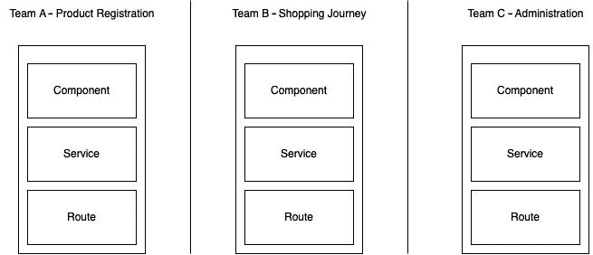
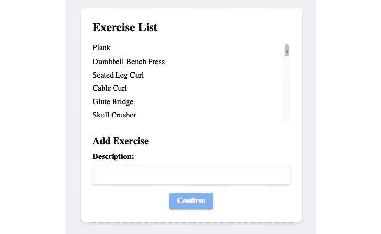
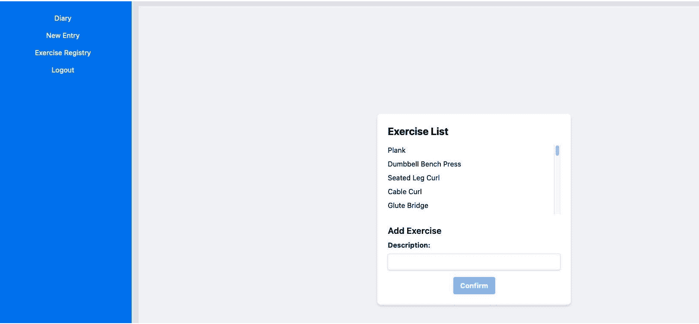

# 第十一章：使用 Angular Elements 的微前端

随着应用程序的增长和复杂化，仅一个团队不足以维持增长速度，需要新的人来处理出现的新应用程序部分。在这个时候，你的项目架构需要进化，一个可能的方法是将你的应用程序分解成几个项目，这些项目作为一个整体集成。这种做法起源于后端服务领域，在前端领域以**微前端**的名字出现。在本章中，我们将学习如何在 Angular 项目中应用这一原则。

本章将涵盖以下主题：

+   微前端 – 概念和应用

+   在微前端中切割你的应用程序

+   使用独立组件创建微前端应用程序

+   准备一个将被基础应用程序加载的页面

+   动态加载微前端

到本章结束时，你将能够评估何时需要使用微前端，如何组织你的 Angular 项目，以及如何将其整合成一个统一的应用程序。

# 技术要求

要遵循本章中的说明，你需要以下内容：

+   Visual Studio Code([`code.visualstudio.com/Download`](https://code.visualstudio.com/Download))

+   Node.js 18 或更高版本([`nodejs.org/en/download/`](https://nodejs.org/en/download/))

本章的代码文件可在[`github.com/PacktPublishing/Angular-Design-Patterns-and-Best-Practices/tree/main/ch11`](https://github.com/PacktPublishing/Angular-Design-Patterns-and-Best-Practices/tree/main/ch11)找到。

在开始阅读本章之前，请记住使用`npm` `start`命令运行`gym-diary-backend`文件夹中的应用程序的后端。

# 微前端 – 概念和应用

2014 年，Martin Fowler 和 James Lewis 的一篇文章([`martinfowler.com/articles/microservices.html`](https://martinfowler.com/articles/microservices.html))通过正式化微服务的概念，震撼了开发界。该文章专注于后端服务的开发，将一个大的系统（称为单体）分解成专注于业务单一方面的独立小服务，无疑是系统架构的一个里程碑。

不久之后，这个概念被应用于前端领域，其中一篇主要文章由 Cam Jackson 撰写([`martinfowler.com/articles/micro-frontends.html`](https://martinfowler.com/articles/micro-frontends.html))。*微前端*的基本思想与其兄弟概念*微服务*相同，即把一个大的前端项目（单体）分解成专注于业务某一方面的独立小项目。然而，关注点当然不同。在微服务中，我们担心的是数据库和通信协议，而在前端，我们需要关注的是数据包大小、可访问性和用户体验。

让我们先分析一下你是否需要为你的项目使用这种类型的架构。

## 何时使用微前端

在系统架构中有一个大但非常真实的陈词滥调，那就是没有银弹——也就是说，没有一种适合所有问题的万能解决方案——微前端也无法摆脱这个陈词滥调。这种架构的主要优势，在技术方面之前，是其组织方面的优势。

当我们使用微前端时，我们正在分离一个专注于业务某一方面的独立部分，这部分将由专注于该方面的团队处理。通过这种方式，你的项目可以跨不同团队扩展，这些团队处理特定主题，并将它们整合成用户的体验。每个团队在这个项目的交付周期中都有自主权，与构建、部署和测试独立。独立性可以达到一个水平，即团队可以与不同的 Angular 版本甚至不同的框架（如 React 和 Vue）一起工作，尽管这并不高度推荐，我们将在下一节讨论这一点。

## 何时不使用微前端项目

另一个软件工程陈词滥调是没有免费的午餐，选择使用微前端有其成本和挑战。

第一个挑战是前端性能问题。正如我们在*第一章*，“正确开始项目”中看到的，在**单页应用**（**SPA**）中，用户的浏览器下载包含 Angular 框架代码的应用程序包，以及你的团队生产的代码。在这之后，浏览器解释这个包并为用户渲染页面。这个整个过程必须尽可能快和高效，因为在这个过程中，用户无法与屏幕交互，这会导致挫败感。

现在想象这个过程发生在你系统的每一个部分，因为为了保证版本和甚至框架的独立性，每个微前端都携带其特定版本的框架引擎。有像 webpack 的模块联邦（[`webpack.js.org/concepts/module-federation/`](https://webpack.js.org/concepts/module-federation/））这样的技术和工具，但你和你的团队必须评估这个挑战。

我们还必须关注的另一个问题是关于用户体验和屏幕上组件的设计，因为对于它们来说，界面之间的组件必须本质上相同，以保证他们在体验中的连贯性。

通过实施设计系统——即你公司组件的单个设计指南，最好有一个支持它的库——可以克服这个挑战。设计系统的一个例子是谷歌的 Material Design。

既然我们已经对微前端有了基本的了解，让我们继续到下一节，我们将探讨如何将我们的应用程序拆分为微前端。

# 将你的应用程序拆分为微前端

为了最大限度地从微前端架构中获得收益并最小化前一部分定义的风险，我们需要创建尽可能独立且对团队组织有意义的微服务。

最常见的项目组织类型是功能垂直化 – 也就是说，对于一个项目，你可能有一个完整的用户旅程，例如产品购买屏幕，另一个项目用于产品注册，另一个用于应用的管理模块。



图 11.1 – 微前端划分

此图使用 Angular 应用程序展示了划分的概念。在每一个项目中，我们都有用户体验的所有组件。

你可能会想，“*我能否使用 Angular 模块实现这种相同的分离？*”答案是肯定的，你可以。如果一个团队负责你公司组织的所有模块，或者团队可以组织成只有一个项目，那么你可以（甚至应该）这样做。

我们需要记住，将你的项目划分为微前端的原因是为了满足项目的一个组织需求，并且团队希望拥有部署和开发的独立性。

在心中牢记基本概念后，我们将展示如何在我们的健身日记项目中实现它们。

# 使用独立组件创建微前端应用程序

为了在我们的健身日记中展示微前端架构的使用，我们将创建一个表单来定义用户的新练习。让我们创建另一个 Angular 项目，模拟一个专门负责这个功能的团队。在你的操作系统命令行中，使用以下命令：

```js
ng new gym_exercises --skip-git --standalone --routing false --style css
```

我们在*第一章*，“正确开始项目”，学习了`ng new`命令，但在这里我们使用了一些之前没有见过的参数。我们使用`skip-git`参数是因为，在这个例子中，我们是在同一个 Git 项目中创建的（该项目中已经包含了`gym-diary`和`gym-backend`项目）。`routing`参数设置为`false`，因为我们的项目将在日记应用的路由中加载，`style`参数设置为`CSS`，这样 Angular CLI 就不需要询问我们的项目将有什么类型的样式。

这个命令中最大的区别是`standalone`参数，它将我们的项目参数化，默认创建所有组件为独立组件。但你可能想知道什么是`standalone`组件。从 Angular 的 15 版本开始创建，这个特性允许你创建一个组件而不使用 Angular 模块（`NgModule`）。尽管模块非常重要，正如我们在*第二章*中看到的，*组织你的应用程序*，但在某些情况下它们并不非常有用，并且会使项目变得不必要地复杂。一个很好的例子是范围有限的小项目，例如这个微前端，我们将不会有多个路由或懒加载。

在我们开始创建练习表单之前，让我们添加并配置 Tailwind CSS 框架，因为我们希望有一个与我们的主应用程序兼容的样式。在创建的项目文件夹中，从你的操作系统的命令行运行以下命令：

```js
npm install -D tailwindcss postcss autoprefixer
npx tailwindcss init
```

此命令将向项目添加开发依赖项，并在 Tailwind CSS 框架中创建配置文件。

在`tailwind.config.js`文件中，进行以下更改：

```js
/** @type {import('tailwindcss').Config} */
module.exports = {
  content: [
    "./src/**/*.{html,ts}",
  ],
  theme: {
    extend: {},
  },
  plugins: [],
}
```

在此文件中，我们正在告诉 Angular 将 Tailwind CSS 框架应用于`src`文件夹中的所有 HTML 文件。

最后，将以下代码行添加到`app.component.css`文件中：

```js
@tailwind base;
@tailwind components;
@tailwind utilities;
```

使用这些 CSS 变量，组件将能够访问`tailwindcss`类。

然后，我们将创建一个服务，该服务将负责与我们的后端练习 API 交互。在命令行中，我们将使用以下命令：

```js
ng g service service/Exercises
ng g interface exercise
```

注意我们架构的一个细节：我们已经在主项目中有一个查询练习 API 的服务，但在这里我们不能重用它，因为它们是独立的项目，并且某些代码重复是这个架构的成本。

按照最佳实践，我们将创建我们的 API 如下：

```js
Export interface Exercise {
  id?: string;
  description: string;
}
export type ExerciseList = Array<Exercise>;
export interface ExerciseListAPI {
  hasNext: boolean;
  items: ExerciseList;
};
```

在这里，我们正在重新创建表示 API 数据的类型。有关 TypeScript 接口的更多详细信息，你可以查阅*第三章*，*TypeScript 模式* *for Angular*。

在创建的服务中，我们将添加与后端的交互：

```js
@Injectable({
  providedIn: 'root',
})
export class ExercisesService {
  private httpClient = inject(HttpClient);
  private url = 'http://localhost:3000/exercises';
  getExercises(): Observable<ExerciseList> {
    return this.httpClient
      .get<ExerciseListAPI>(`${this.url}`)
      .pipe(map((api) => api?.items));
  }
  addExercises(exercises: Partial<Exercise>): Observable<Exercise> {
    return this.httpClient.post<Exercise>(this.url, exercises);
  }
}
```

在服务中，我们正在通过 HTTP 请求查询练习并添加新的练习。有关 Angular 服务的更多详细信息，你可以查阅*第五章*，*Angular 服务和 Singleton 模式*，以及*第九章*，*使用 RxJS 探索响应性*。

然而，我们遇到了一个错误，因为我们没有导入`HttpClientModule`模块。但如果没有模块在独立组件中，我们如何导入它呢？

在没有模块的项目中，导入发生在组件本身中；对于服务，我们有`app.config.ts`文件，我们将将其添加到其中：

```js
import { ApplicationConfig } from '@angular/core';
import { provideHttpClient } from '@angular/common/http';
export const appConfig: ApplicationConfig = {
  providers: [provideHttpClient()],
};
```

注意，我们导入的是`provideHttpClient`提供者而不是模块。这是因为这个提供者是由 Angular 团队创建的，用于处理这些独立应用程序的情况。

在应用程序的主要组件中，我们将按照以下方式编写其行为：

```js
@Component({
  selector: 'app-root',
  standalone: true,
  imports: [CommonModule, ReactiveFormsModule],
  templateUrl: './app.component.html',
  styleUrls: ['./app.component.css'],
})
export class AppComponent {
  private formBuilder = inject(NonNullableFormBuilder);
  private exerciseService = inject(ExercisesService);
  exerciseList$ = this.exerciseService.getExercises();
  public entryForm = this.formBuilder.group({
    description: ['', Validators.required],
  });
  newExercise() {
    if (this.entryForm.valid) {
      const newExercise = { ...this.entryForm.value };
      this.exerciseService
        .addExercises(newExercise)
        .subscribe(
          (_) => (this.exerciseList$ = this.exerciseService.getExercises())
        );
    }
  }
}
```

让我们先强调`@Component`装饰器元数据中的组件配置。`standalone`属性表示该组件可以直接使用，而无需在任何模块中声明。在`imports`属性中，我们声明其依赖项，这些依赖项是`CommonModule`，它是任何 Angular 组件的基础，以及`ReactiveFormsModule`，因为我们将会开发一个响应式表单（更多关于表单的详情，请参阅*第六章*，*处理用户输入：表单*）。在组件中，我们注入`NonNullableFormBuilder`和`ExercisesService`，并将初始列表分配给`exerciseList$`属性。我们使用`formBuilder`服务创建表单对象，并最终创建负责**提交**按钮的`newExercise`方法。

由于我们将有相同的表单中的练习列表，在`subscribe`方法中，我们再次将`exerciseList$`属性分配给刷新列表。

为了完成组件，让我们创建其模板如下：

```js
<div class="bg-gray-100 flex justify-center items-center min-h-screen">
  <div class="max-w-md w-full p-6 bg-white rounded-lg shadow-md">
    <h1 class="text-2xl font-bold mb-4">Exercise List</h1>
    <div class="max-h-40 overflow-y-auto mb-4">
      <ul>
        <li class="mb-2" *ngFor="let exercise of exerciseList$ | async">
          {{ exercise.description }}
        </li>
      </ul>
    </div>
  </div>
</div>
```

在第一部分，我们有练习列表，这里我们使用 Angular 的`async`管道来订阅和搜索列表（更多详情，请参阅*第九章*，*使用 RxJS 探索反应性*）。

在相同的模板文件中，我们将添加表单：

```js
<h2 class="text-xl font-semibold mt-6 mb-2">Add Exercise</h2>
  <form [formGroup]="entryForm" (ngSubmit)="newExercise()" class="space-y-2">
    <div class="mb-4">
      <label for="description" class="mb-2 block font-bold text-gray-700">Description:</label>
      <input type="text" id="description" name="description" class="w-full appearance-none rounded border px-3 py-2 leading-tight text-gray-700 shadow" formControlName="description"/>
      <div *ngIf="entryForm.get('exercise')?.invalid && entryForm.get('exercise')?.touched" class="mt-1 text-red-500">
        Exercise is required.
      </div>
    </div>
    <div class="flex items-center justify-center">
      <button type="submit" [disabled]="entryForm.invalid" [class.opacity-50]="entryForm.invalid" class="rounded bg-blue-500 px-4 py-2 font-bold text-white hover:bg-blue-700" >
        Confirm
      </button>
    </div>
  </form>
```

我们仅使用**描述**字段创建了一个响应式表单，并添加了简单的验证。

通过使用`ng serve`命令运行我们的应用程序，我们将拥有以下界面：



图 11.2 – 练习表单

当我们的微前端项目准备就绪后，我们可以准备它以便被我们的主应用程序消费。

# 准备一个页面以便由基础应用程序加载

当我们的微前端项目准备就绪后，我们需要准备它以便被另一个应用程序消费。共享微前端有多种方式，从最简单（且已过时）的通过使用 iframe，到更现代但复杂的解决方案，如模块联邦。

在本节中，我们将使用市场上广泛使用的方法，即使用 Web Components。Web Components 是一个旨在将不同框架创建的组件标准化为可以在它们之间消费的模型的规范。换句话说，通过遵循此规范创建一个 Angular 组件，React 或 Vue 创建的应用程序可以消费此组件。尽管 Web Components 并非专为微前端项目而创建，但我们可以看到其定义完美地符合我们的需求。

就像 Angular 框架中的几乎所有内容一样，为了创建这种类型的组件，我们不需要手动操作，因为 Angular 团队为此创建了一个工具：Angular elements。一个 Angular 元素组件是一个通用组件，但被*转换*为 Web Components 标准，不仅打包我们的代码，还打包 Angular 渲染引擎，使其框架无关。

让我们在操作系统的命令行上使用以下命令将其添加到我们的`gym_exercises`项目中：

```js
npm i @angular/elements
```

使用前面的命令，我们将`angular/elements`依赖项添加到我们的项目中，并且为了使用它，我们将对`angular.json`文件进行修改：

```js
{
  "type": "anyComponentStyle",
  "maximumWarning": "50kb",
  "maximumError": "50kb"
}
```

由 Angular elements 生成的组件将封装 Tailwind CSS 框架，因此我们需要稍微增加组件大小预算，以避免在构建项目时出现错误。

我们必须进行的下一个更改是项目的`main.ts`文件：

```js
import {
  bootstrapApplication,
  createApplication,
} from '@angular/platform-browser';
import { appConfig } from './app/app.config';
import { AppComponent } from './app/app.component';
import { createCustomElement } from '@angular/elements';
(async () => {
  const app = await createApplication(appConfig);
  const element = createCustomElement(AppComponent, {
    injector: app.injector,
  });
  customElements.define('exercise-form', element);
})();
```

此文件负责配置 Angular 项目的初始化，我们通常不会更改它，因为我们想要标准的 SPA 构建和执行行为。然而，在这里，我们需要将其更改以通知 Angular，此项目的结果是 Angular elements 包生成的 Web 组件。在这里，我们正在配置项目，以便应用程序生成一个标签名为`exercise-form`的 Web 组件。

现在，我们需要修改`index.html`文件来理解这个新标签，这样我们就可以渲染我们的微前端进行测试：

```js
<!DOCTYPE html>
<html lang="en">
  <head>
    <meta charset="utf-8" />
    <title>GymExercises</title>
    <base href="/" />
    <meta name="viewport" content="width=device-width, initial-scale=1" />
    <link rel="icon" type="image/x-icon" href="favicon.ico" />
  </head>
  <body>
    <exercise-form></exercise-form>
  </body>
</html>
```

在这里，我们将默认的`<app-root>`Angular 组件替换为 Web Components 的`<exercise-form>`标签。我们的主要应用程序将是我们的微前端 JavaScript，但修改`index.html`将允许你和你的团队在不加载主项目的情况下维护微前端。

我们现在面临一个挑战，尽管我们创建了一个 Web 组件，但项目构建却在三个文件和哈希中创建它，如果我们的应用程序不是微前端，这是正确的，但就我们而言，我们希望所有代码都在一个文件中，并且没有哈希。我们可以手动完成这项工作，但社区有一个包可以自动化这种处理：`ngx-build-plus`包。

让我们借助 Angular CLI 将其添加到命令行：

```js
ng add ngx-build-plus
```

为了提供这个微前端，我们将使用`http-server`包，并在命令行上使用`npm`添加它：

```js
npm i http-server
```

最后，让我们创建一些`npm`脚本来使运行`mfe`更加容易。在`package.json`文件中，我们将进行以下修改：

```js
"scripts": {
  "ng": "ng",
  "start": "ng serve",
  "build": "ng build --single-bundle  --bundle-styles  --keep-styles  --output-hashing=none",
  "serve-mfe": "http-server dist/gym_exercises",
}
```

在`build`脚本中，我们指定了运行它的意图，从而生成一个单独的文件（`--single-bundle`）。我们还指示它保留并封装 CSS（`--bundle-styles --keep-styles`），同时确保生成的文件名不包含任何类型的哈希（`--output-hashing=none`）。

`serve-mfe`脚本使用`http-server`服务发布包含编译后的微前端的`dist`文件夹的内容。

让我们使用以下命令运行我们的项目并检查我们创建的微前端：

```js
npm run build
npm run serve-mfe
```

通过访问`http://127.0.0.1:8080`，我们可以看到我们的微前端应用程序正在成功生成。

我们的微前端准备就绪，可以供消费，在下一节中，我们将在主应用程序中消费它。

# 动态加载微前端

让我们准备我们的主应用程序健身日记以消费我们之前准备的微前端。为此，让我们首先在应用程序中创建一个新的模块。在命令行中，我们将使用以下 Angular CLI 命令：

```js
ng g m exercise --routing
ng g c exercise/exercise
```

使用前面的命令，我们创建了一个包含生成的路由文件和负责加载`mfe`的组件的模块。

让我们调整`exercise-routing.module.ts`文件以指向组件：

```js
import { NgModule } from '@angular/core';
import { RouterModule, Routes } from '@angular/router';
import { ExerciseComponent } from './exercise/exercise.component';
const routes: Routes = [
  {
    path: '',
    component: ExerciseComponent,
    title: 'Exercise Registry',
  },
];
@NgModule({
  imports: [RouterModule.forChild(routes)],
  exports: [RouterModule],
})
export class ExerciseRoutingModule {}
```

在`routes`数组中，我们定义了一个基础路由，用于练习注册组件，因为它将通过懒加载加载。

接下来，我们将重构`home-routing.module.ts`文件如下：

```js
. . .
const routes: Routes = [
  {
    path: '',
    component: HomeComponent,
    children: [
      {
        path: 'diary',
        loadChildren: () =>
          import('../diary/diary.module').then((file) => file.DiaryModule),
      },
      {
        path: 'exercise',
        loadChildren: () =>
          import('../exercise/exercise.module').then(
            (file) => file.ExerciseModule
          ),
      },
      {
        path: '',
        redirectTo: 'diary',
        pathMatch: 'full',
      },
    ],
  },
];
. . .
```

我们的`HomePage`模块包含菜单，在本节中，我们正在将新模块添加到界面的正确区域。

要完成添加此新模块，让我们更改`home.component.html`文件：

```js
. . .
  <li>
    <a
      routerLink="./exercise"
      class="flex items-center space-x-2 text-white"
    >
      <span>Exercise Registry</span>
    </a>
  </li>
. . .
```

在`home`模板中添加了新的菜单项后，我们现在有任务将其他项目中生成的微前端包含到我们的界面中。

为了做到这一点，我们有一个名为`@angular-extensions`的社区包，它允许我们通过指令简单地加载我们的微前端，正如我们稍后将会看到的。但首先，让我们使用以下命令在我们的项目中安装这个依赖项：

```js
npm i @angular-extensions/elements
```

安装完成后，我们可以更改`ExerciseModule`模块：

```js
import { CUSTOM_ELEMENTS_SCHEMA, NgModule } from '@angular/core';
import { CommonModule } from '@angular/common';
import { ExerciseRoutingModule } from './exercise-routing.module';
import { ExerciseComponent } from './exercise/exercise.component';
import { LazyElementsModule } from '@angular-extensions/elements';
@NgModule({
  declarations: [ExerciseComponent],
  imports: [CommonModule, LazyElementsModule, ExerciseRoutingModule],
  schemas: [CUSTOM_ELEMENTS_SCHEMA],
})
export class ExerciseModule {}
```

在此文件中，我们首先添加了一个名为`LazyElementsModule`的库模块，以便访问我们将在组件中使用的指令。此外，我们在元数据中有一个新的属性`schemas`。在其中，我们通过`CUSTOM_ELEMENTS_SCHEMA`令牌通知 Angular，此模块将接收来自项目外部的元素。默认情况下，Angular 会检查模板中使用的标签是否存在于项目中或在 HTML 标准中，例如`input`标签。

由于我们在这里将导入由我们的微前端定义的`exercise-form`标签，此属性将防止 Angular 在项目编译时执行此检查。

在`exercise.component.ts`文件中，我们将添加一个新属性：

```js
import { Component } from '@angular/core';
@Component({
  selector: 'app-exercise',
  templateUrl: './exercise.component.html',
  styleUrls: ['./exercise.component.css'],
})
export class ExerciseComponent {
  elementUrl = 'http://localhost:8080/main.js';
}
```

在这里，我们定义了微前端主文件将被提供的服务地址。

最后，让我们更改组件模板：

```js
<exercise-form *axLazyElement="elementUrl"> </exercise-form >
```

在这里，我们声明了新的`exercise-form`元素，为了加载它，我们使用`axLazyElement`指令分配微前端地址。

要运行我们的项目，请确保微前端正在使用`npm run serve-mfe`命令提供服务。一切配置完成后，我们可以看到我们工作的结果：



图 11.3 – 动态加载到主应用程序中的练习表单

# 摘要

在本章中，我们探讨了微前端架构以及如何将其应用于 Angular 项目。

我们了解了架构的概念、其优势及其权衡。我们探讨了选择这种架构的主要原因是其与每个团队组织结构的灵活性，因为几个团队可以独立地工作在前端项目的不同部分。

我们还学习了如何理想地将我们的应用程序划分为微前端。

在所有这些概念的基础上，我们通过创建一个小型应用程序并利用 Angular 的独立组件功能，以及准备使用 Angular 元素库加载它，来应用我们的项目。

最后，我们在主应用程序中借助`@angular-extensions/elements`库实现了动态加载。

在下一章中，我们将探讨部署 Angular 应用程序的最佳实践。
