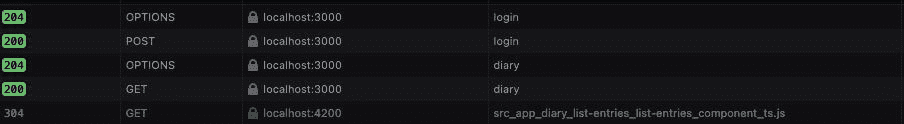
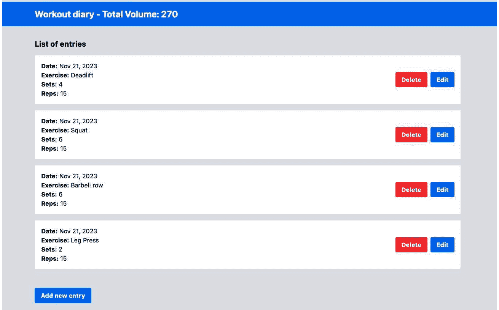

# 13

# Angular 的文艺复兴

我们的应用程序需要不断地进化，为了满足这一需求，Angular 框架及其生态系统也在不断进化。

在本章中，我们将了解 Angular 的最新功能。虽然其中许多功能仍处于开发者预览阶段，但对我们来说，了解这个令人难以置信的框架的未来前景非常重要。

本章我们将涵盖以下主题：

+   使用 Angular CLI 更新你的项目

+   使用一种新的创建模板的方式——控制流

+   使用 `defer` 命令改进用户体验

+   在页面之间创建过渡——视图事务

+   简化应用程序状态——Angular 信号

到本章结束时，你将学会如何跟上框架的未来版本，以及如何更新你的项目。

# 技术要求

要遵循本章的说明，你需要以下内容：

+   Visual Studio Code ([`code.visualstudio.com/Download`](https://code.visualstudio.com/Download))

+   Node.js 18 或更高版本 ([`nodejs.org/en/download/`](https://nodejs.org/en/download/))

本章的代码文件可在 [`github.com/PacktPublishing/Angular-Design-Patterns-and-Best-Practices/tree/main/ch13`](https://github.com/PacktPublishing/Angular-Design-Patterns-and-Best-Practices/tree/main/ch13) 获取。

在本章的学习过程中，请记住使用 `npm start` 命令运行 `gym-diary-backend` 文件夹中的应用程序的后端。

# 使用 Angular CLI 更新你的项目

Angular 框架在不断地进化，带来新的功能和优化，但为了帮助社区和开发者保持有序，并确保他们的应用程序保持最新，Angular 团队使用语义化版本号来编号他们的发布。

语义化版本号由三个部分组成，每个部分具有以下表示形式：

+   **大版本**：每当框架发生变化时，这个数字都会增加，这反过来又要求我们在应用程序中做出一些更改，以便它能够继续工作，也称为**破坏性变更**

+   **小版本**：当新版本有我们可以使用的新功能时，这个数字会增加，但如果我们不使用它，我们不需要更改我们的应用程序

+   **补丁版本**：当框架有修正时，我们不需要更改我们的代码；这通常用于有安全修正的版本

在本书中，我们使用的是 Angular 的 16.2.0 版本，下一个版本将是 17.0.0，它将带来新的功能，同时也可能有一些破坏性变更。虽然使用了“破坏性变更”这个术语，但我们应注意的是，Angular 团队对这些变更越来越谨慎，目前，它们只影响非常特定的案例，而绝大多数应用程序不会受到影响。

除了严格的版本控制之外，Angular 团队还注意每隔六个月发布主要版本，这使得团队能够规划应用程序的更新。你可能会问，我是否应该总是更新我的应用程序的 Angular 版本？答案是肯定的，以下是一些原因：

+   每个新版本都会为框架带来内部改进，这可以改善渲染引擎，使你的应用程序更快，构建时间和包大小更小，更优化。

+   新功能为你提供了更多可能性，以创造更好的用户体验

+   它提供安全更新和框架漏洞修复

需要强调的是，Angular 团队致力于在当前版本之前为最多两个主要版本提供修正（长期支持），这意味着使用旧版本的 Angular 可能会使你的应用程序容易受到新的安全漏洞的攻击。然而，更新应用程序的 Angular 版本的任务并不复杂，因为 Angular CLI 有助于自动化整个过程。让我们将我们的项目更新到 Angular 的第 17 版，以使用本章中的新功能。

在你的操作系统命令行中，在 `gym-diary` 项目文件夹中，使用以下命令：

```js
ng update @angular/core@17 @angular/cli@17
```

使用此命令，Angular CLI 将从 `package.json` 文件更新所有 Angular 包。此外，它将分析你的所有代码，寻找由于破坏性更改而需要更改的情况。如果可能，它将为你更新代码。如果不可能，它将指示应进行何种类型的更正，但这种情况仅发生在非常特定的角落案例中。

更新完成后，为确保应用程序在处理过程中继续工作，我们可以运行单元测试和端到端测试。有关测试的更多详细信息，请参阅*第十章*，“为测试而设计：最佳实践”。

使用我们更新的项目，我们可以探索 HTML 模板的新的语法，我们将在下一节中看到。

# 使用创建模板的新方法——控制流

自框架的第二个版本以来，HTML 模板语法相对稳定，没有太多变化。通过使用自定义属性，我们可以在组件中评估条件并遍历列表和其他形式的流程控制，以创建可视化逻辑。`*ngIf`、`*ngFor` 和 `*ngSwitch` 指令用于提高开发者体验，内部生成 HTML 中的元素。你可以在*第四章*、“组件”和“页面”中了解更多信息。

从版本 17 开始，Angular 团队引入了 HTML 中的新形式的控制流。这个版本的语法处于开发者预览状态，这意味着它对生产是稳定的，但未来版本可能会有所变化。让我们重构我们的代码以使用这种语法，并看看实际中的差异。

在 `app.component.html` 文件中，我们将更改以下内容：

```js
@if (loadService.isLoading) {
  <app-loading-overlay />
}
<router-outlet></router-outlet>
```

在这里，我们可以注意到新的控制流结构中的第一个新结构，即 `if`。使用 HTML 模板中的命令并带有 `@` 符号，我们应用了与 TypeScript 中的条件语句相同的条件语句，评估函数或变量是否为真或假。

语法的新颖之处在于，我们现在有了 `@else` 指令，它简化了条件语句的链式操作，无需使用 `ng-template` 指令来完成此目的。

我们将按照以下方式重构 `list-entries.component.html` 文件：

```js
<section class="mb-8">
  <h2 class="mb-4 text-xl font-bold">List of entries</h2>
  <ul class="rounded border shadow">
    @for (item of exerciseList; track item.id) {
    <li>
      <app-entry-item
        [exercise-set]="item"
        (deleteEvent)="deleteEvent.emit($event)"
        (editEvent)="editEvent.emit($event)"
      />
    </li>
    } @empty {
      <div>
        No Items!
      </div>
    }
  </ul>
</section>
```

在这个例子中，我们使用 `@for` 指令来替换 `*ngFor` 指令。我们提供了将要接收列表迭代的变量名称，在这个例子中是 `item`，以及列表本身，在这个组件中命名为 `exerciseList`。

在 *第四章* *组件和页面* 中，我们学习了使用 `*ngFor` 指令的 `trackBy` 属性来提高列表渲染性能的良好实践。现在，这种良好实践在新 `@for` 语法中是强制性的，并且在这种情况下，它甚至更简单，因为我们只需简单地传递 Angular 应该检查的属性。

新的元素是 `@empty` 指令，它指示如果相关的列表为空时应该显示什么。

新的 `@for` 指令，除了提高开发体验外，根据 Angular 团队的说法，在渲染列表时比之前的解决方案快 90%，这是因为控制语句不仅仅是指令的糖语法；模板引擎已经被重新设计，指令操作 Angular 的内部 DOM 渲染元素。

最后，让我们按照以下方式重构 `new-entry-form-reactive.component.html` 文件：

```js
. . .
@if (entryForm.get('date')?.invalid && entryForm.get('date')?.touched) {
    <div class="mt-1 text-red-500">Date is required.</div>
    }
. . .
@if (showSuggestions) {
    <ul
      class="absolute z-10 mt-2 w-auto rounded border border-gray-300 bg-white"
    >
      @for (suggestion of exercises$ | async; track suggestion.id) {
      <li
        class="cursor-pointer px-3 py-2 hover:bg-blue-500 hover:text-white"
        (click)="selectExercise(suggestion.description)"
      >
        {{ suggestion.description }}
      </li>
      }
    </ul>
    } @if (entryForm.get('exercise')?.invalid &&
    entryForm.get('exercise')?.touched) {
    <div class="mt-1 text-red-500">Exercise is required.</div>
    }
. . .
@if (entryForm.get('reps')?.invalid && entryForm.get('reps')?.touched) {
    <div class="mt-1 text-red-500">
      Reps is required and must be a positive number.
    </div>
    }@else if ( entryForm.get('reps')?.errors?.['isNotMultiple'] &&
    entryForm.get('reps')?.touched) {
    <div class="mt-1 text-red-500">
      Reps is required and must be multiple of 3.
    </div>
    }
```

在这个文件中，我们正在用 `@if` 语句替换评估表单错误的条件语句。对于我们用来渲染练习列表的 `@for` 指令，我们可以注意到，使用 `async` 管道与 `*ngFor` 指令非常相似，并且我们添加了 `track` 以进一步提高列表的渲染。最后，我们使用 `@else if` 命令来链式操作两个条件语句。

我们可以注意到，我们不需要进行任何额外的配置来使用流程控制语法，因为这项功能与之前的机制完全兼容，它们可以在同一个项目中，甚至在同一个文件中共存。

Angular 团队甚至在 Angular CLI 中创建了一个迁移命令，如下所示：

```js
ng g @angular/core:control-flow
```

在下一节中，我们将看到这种模板重构为我们应用程序提供的新可能性，即在 HTML 模板中懒加载组件的选项。

# 使用 defer 命令改进用户体验

新的 HTML 模板流程控制语法的背后主要意图是提供一个新基础，用于在框架的模板中构建新的可能性。通过这种语法，第一个新的功能是 `defer` 指令，它使得直接从 HTML 模板中懒加载组件成为可能。

我们在*第二章*中学习了*组织你的应用程序*，最佳实践是将你的应用程序分为功能模块，并配置 Angular 以懒加载这些模块。这意味着只有当用户访问某个路由时，模块及其组件才会被加载，从而实现更小的包和更好的应用程序性能，特别是如果你的用户没有良好的互联网连接（如 3G）。

`defer`命令具有相同的目的，但它不是为模块工作，而是为`standalone`组件工作。我们在*第十一章*中学习了*使用 Angular Elements 的微前端*中的`standalone`组件。

我们将开始重构，将练习列表组件转换为`standalone`组件。在`diary.component.ts`文件中，进行以下更改：

```js
@Component({
  standalone: true,
  templateUrl: './diary.component.html',
  styleUrls: ['./diary.component.css'],
  imports: [ListEntriesComponent, NewItemButtonComponent],
})
```

在前面的代码中，我们包括了将`standalone`属性设置为`true`，并直接使用`imports`属性添加了它所依赖的组件。

我们将在`EntryItemComponent`组件中执行相同的步骤：

```js
@Component({
  selector: 'app-entry-item',
  standalone: true,
  templateUrl: './entry-item.component.html',
  styleUrls: ['./entry-item.component.css'],
  imports: [DatePipe],
})
```

在此组件中，除了`standalone`属性外，我们还需要添加依赖项，以便日期管道能够工作。需要注意的是，`standalone`组件需要在`imports`属性中声明式地包含其依赖项，因为它没有链接到任何 Angular 模块。

为了懒加载模板，我们还将`NewItemButtonComponent`组件转换为`standalone`组件：

```js
@Component({
  selector: 'app-new-item-button',
  templateUrl: './new-item-button.component.html',
  styleUrls: ['./new-item-button.component.css'],
  standalone: true,
})
```

最后一个要转换为`standalone`组件的是`ListEntriesComponent`，更改如下：

```js
@Component({
  selector: 'app-list-entries',
  standalone: true,
  templateUrl: './list-entries.component.html',
  styleUrls: ['./list-entries.component.css'],
  imports: [EntryItemComponent],
})
```

在这个例子中，我们将`EntryItemComponent`依赖项添加到了`import`属性中。

重要提示

单元测试也进行了调整，以考虑`TestBed`定义中的组件依赖项，并且你可以在这个章节的 GitHub 仓库中找到测试代码。

最后的调整必须在`DiaryModule`模块中进行：

```js
@NgModule({
  declarations: [
    NewEntryFormTemplateComponent,
    NewEntryFormReactiveComponent,
  ],
  imports: [
    CommonModule,
    DiaryRoutingModule,
    RouterModule,
    FormsModule,
    ReactiveFormsModule,
  ],
})
export class DiaryModule {}
```

由于我们将动态加载已转换为`standalone`的组件，我们必须从模块的`declarations`属性中删除这些组件。

在此准备之后，我们可以在`diary.component.html`文件中使用`defer`命令：

```js
@defer {
  <app-list-entries
    [exerciseList]="exerciseList"
    (deleteEvent)="deleteItem($event)"
    (editEvent)="editEntry($event)"
  />
}
```

要使用`defer`命令，我们必须创建一个包含我们想要懒加载的组件的块。

如果我们运行我们的应用程序并分析**网络**选项卡，我们会注意到当屏幕渲染时，会加载特定的包：



图 12.1 – 懒加载包

我们可以看到，效果类似于路由模块的懒加载，但`defer`有其他有趣的选择。让我们通过更改我们的代码来实际看看：

```js
. . .
@defer (on hover(trigger)){
  <app-list-entries
    [exerciseList]="exerciseList"
    (deleteEvent)="deleteItem($event)"
    (editEvent)="editEntry($event)"
  />
}
. . .
  <button
    #trigger
    class="rounded bg-blue-500 px-4 py-2 font-bold text-white hover:bg-blue-700"
    (click)="newList()"
  >
    Server Sync
  </button>
. . .
```

通过`on hover(trigger)`条件，当我们将鼠标悬停在`defer`命令上时，列表会被加载，这为微调用户体验打开了一系列机会。`defer`命令有以下条件：

+   `on immediate`: 组件将在屏幕渲染的瞬间被加载。

+   `on idle`: 组件将在浏览器`requestIdleCallback` API 的第一次调用时被加载。这个 API 允许浏览器中的非阻塞处理，并且是`defer`命令的默认行为。

+   `on hover(target)`: 我们可以定义另一个界面组件，当用户悬停在组件上时将发生加载。

+   `on timer(time)`: 允许我们在界面渲染后以毫秒为单位定义组件将被加载的时间。

+   `on viewport(target)`: 当目标组件位于浏览器视口中时，子组件将被加载。这种行为非常适合在用户滚动到页面底部后加载位于其后的组件。

+   `on interaction(target)`: 它与`on hover`有类似的行为，但它将由某些交互触发，例如点击。

+   `when (condition)`: 允许我们通过布尔属性或返回布尔值的函数强制控制组件的加载。

补充`defer`命令，我们还有其他可以使用的命令。回到我们的代码，我们将按以下方式更改它：

```js
@defer {
  <app-list-entries
    [exerciseList]="exerciseList"
    (deleteEvent)="deleteItem($event)"
    (editEvent)="editEntry($event)"
  />
  } @loading {
  <div>Loading</div>
  } @placeholder {
  <div>PlaceHolder</div>
  } @error {
  <div>Error</div>
  }
```

这些补充命令具有以下功能：

+   `@loading`: 在加载`defer`块的组件时，显示该块的内容

+   `@placeholder`: 在`defer`块的组件未开始加载时显示该块的内容，例如，如果用户没有悬停在指定的目标上

+   `@error`: 如果在加载`defer`块的组件时发生错误，将显示该块的内容

在我们的模板中，使用这个`defer`命令有许多可能性，我们应该探索它们以提高用户体验。但请注意，我们不应该懒加载屏幕上的所有组件。我们需要在大型组件或对我们正在构建的页面不是必需的组件上使用`defer`命令。

在下一节中，我们将探讨如何改善我们应用程序中路由之间转换的体验。

# 创建页面之间的转换 – 视图事务

作为前端开发者，我们需要关注我们应用程序的技术性能。一些小的 UI 细节，例如我们在*第八章*“改进后端集成：拦截器模式”中创建的加载屏幕，可以提高用户对我们应用程序性能的认识。这些 UI 细节之一是我们应用程序页面之间的转换。我们可以在从一个路由到另一个路由的干燥加载之间创建一个平滑转换的动画，使用户体验更加愉快。

在 Angular 版本 17 之前，可以使用我们之前在书中使用的标准 Angular 动画包来创建此动画，在 *第八章* 中创建的 toaster 动画，*改进后端集成：拦截器模式*。创建此动画的方法是特定于 Angular 的，并且对于专注于 CSS 的设计师来说并不简单。

截至 Angular 版本 17，对 `app-routing.module.ts` 文件有支持：

```js
@NgModule({
  imports: [
    RouterModule.forRoot(routes, {
      bindToComponentInputs: true,
      enableViewTransitions: true,
    }),
  ],
  exports: [RouterModule],
})
export class AppRoutingModule {}
```

我们正在配置 Angular，以便路由机制将使用带有 `enableViewTransitions` 属性编写的 CSS 视图过渡。仅通过这一变化，我们就可以在我们的应用程序中注意到页面之间的过渡具有令人愉悦的淡入和淡出动画。这个默认动画是由 Angular 团队创建的，旨在让开发者的生活更轻松。但我们可以用一点 CSS 来自定义这个动画。在 `styles.css` 文件中，我们将创建以下类：

```js
@keyframes slide-right {
  from {
    transform: translateX(40px);
  }
}
@keyframes slide-left {
  to {
    transform: translateX(-40px);
  }
}
@keyframes fade-in {
  from {
    opacity: 0;
  }
}
@keyframes fade-out {
  to {
    opacity: 0;
  }
}
```

对于 CSS 动画，我们需要定义一个初始状态和最终状态，我们希望元素处于该状态，在这种情况下，整个屏幕。在我们的示例中，我们定义了一个状态，其中屏幕在 `slide-right` 关键帧中向右移动，在 `slide-left` 关键帧中向左移动。最后，我们定义了淡入和淡出效果的关键帧。

注意，当我们定义过渡动画时，我们完全替换了 Angular 的默认过渡动画，因此我们在这里定义了淡入和淡出关键帧。

要设置动画，让我们将以下内容添加到 `styles.css` 文件中：

```js
::view-transition-old(root) {
  animation: 100ms cubic-bezier(0.4, 0, 1, 1) both fade-out,
  400ms cubic-bezier(0.4, 0, 0.2, 1) both slide-left;
}
::view-transition-new(root) {
  animation: 250ms cubic-bezier(0, 0, 0.2, 1) 90ms both fade-in,
  400ms cubic-bezier(0.4, 0, 0.2, 1) both slide-right;
}
```

视图过渡 API 在 CSS 中创建伪元素，其中我们定义了旧页面的退出动画（`::view-transition-old`）和新页面的进入动画（`::view-transition-old`）。在这种情况下，我们定义旧屏幕将淡出并向左移动，而新页面将淡入并从右侧滑入。

重要提示

视图过渡 API 于 2023 年创建，并正在逐渐被浏览器采用。请访问 [`caniuse.com/`](https://caniuse.com/) 检查您的用户将使用的浏览器是否支持此 API。

在下一节中，我们将探讨 Angular 信号以及我们如何使用它来简化应用程序中的状态控制。

# 简化应用程序状态 - Angular 信号

控制前端应用程序的状态是开发者的一个重大挑战，因为从本质上讲，界面是动态的，需要响应用户的各种操作。Angular 以其“包含堆栈”的哲学，已经拥有了适合这项任务的工具，我们在第五章、*Angular 服务和单例模式*和*第九章*、*使用 RxJS 探索响应性*中研究了如何使用这些工具。然而，尽管有效，Angular 社区和团队认识到，对于新开发者以及前端项目中简单的响应性情况来说，它们可能有点复杂。为了填补这一空白，Angular 团队从版本 17 开始，向框架中引入了一个新元素，称为信号。

根据 Angular 文档，信号是一个围绕值的包装器，当该值发生变化时，它会通知消费者。您可以将其与电子表格中的一个单元格相关联的类比。它可以包含一个值，我们可以在其他单元格中创建公式，使用其值来创建其他值。

在重构我们的应用程序之前，让我们用一个更简单的例子来说明这一点：

```js
let a = signal<number>(2);
let b = signal<number>(3);
let sum = computed(() => a() + b());
console.log(sum());
```

要创建一个信号，我们使用 `signal` 函数，其中我们定义它将存储的值的类型，并声明它的初始值。信号可以是可写的或只读的；在这种情况下，变量 `a` 和 `b` 是可写的。变量 `c` 也是一个信号，但类型特定，称为计算信号。计算类型在我们的电子表格类比中，是一个包含公式的单元格，您可以通过读取其他单元格的值来确定其值。最后，我们通过简单地像调用函数一样调用信号来读取信号值。此代码片段的结果是值 `5`。

我们现在将更改示例：

```js
let a = signal<number>(2);
let b = signal<number>(3);
let sum = computed(() => a() + b());
console.log(sum());
a.set(9);
console.log(sum());
```

在这次更改中，我们正在使用 `set` 方法更新信号 `a` 的值。当读取 `sum` 信号时，我们可以注意到值已更新为 `12`。请注意，计算会实时反应，就像在电子表格中一样。

更新可写信号的值的另一种方法是使用 `update` 方法：

```js
let a = signal<number>(2);
let b = signal<number>(3);
let sum = computed(() => a() + b());
console.log(sum());
a.set(9);
console.log(sum());
b.update((oldValue) => oldValue * 2);
console.log(sum());
```

`update` 方法允许您根据信号中包含的最后一个值来更新信号。

尽管简单，`signal` 允许许多可能性，因为它可以包含任何类型的值，从原始的数值、字符串和布尔值到复杂对象。

我们将重构我们的项目以使用信号，从 `LoadService` 服务开始：

```js
export class LoadService {
  isLoading = signal<Boolean>(false);
  showLoader() {
    this.isLoading.set(true);
  }
  hideLoader() {
    this.isLoading.set(false);
  }
}
```

在这里，我们正在将 `isLoading` 属性替换为 `isLoading` 信号，简化了服务。我们将更改 `AppComponent` 组件模板如下：

```js
@if (loadService.isLoading()) {
  <app-loading-overlay />
}
<router-outlet></router-outlet>
```

要读取信号的内容，我们就像调用一个函数一样调用它。通常，在模板中调用函数不是一种好做法，因为它会导致不必要的处理。然而，信号被创建和优化为在模板中读取，所以在这种情况下，没有问题。

下一个任务将是重构日记条目列表，以便我们不再管理列表，而是将一切留给`ExerciseSetsService`服务。我们将首先按照以下方式更改`ExerciseSetsService`服务：

```js
export class ExerciseSetsService {
. . .
  exerciseList = signal<ExerciseSetList>([] as ExerciseSetList);
  getInitialList() {
    const headers = new HttpHeaders().set('X-TELEMETRY', 'true');
    this.httpClient
      .get<ExerciseSetListAPI>(this.url, { headers })
      .pipe(map((api) => api?.items))
      .subscribe((list) => this.exerciseList.set(list));
  }
  deleteItem(id: string) {
    this.httpClient.delete<boolean>(`${this.url}/${id}`).subscribe(() => {
    this.exerciseList.update((list) =>
      list.filter((exerciseSet) => exerciseSet.id !== id)
    );
    });
  }
. . .
}
```

在前面的代码块中，我们通过声明它包含`ExerciseSetList`并使用空列表初始化它来创建`exerciseList`信号。然后，我们将`getInitialList`方法更改为根据 API 返回值更新`exerciseList`信号。我们还更改了`delete`方法，在删除日记条目后更新信号。

由于我们正在更改函数的行为，我们还需要排除`diaryResolver`函数，因为现在服务将管理 API 中的查询，而组件将消费创建的信号。

在`ListEntriesComponent`组件中，我们将重构以消费我们创建的信号列表：

```js
export class ListEntriesComponent {
  @Output() editEvent = new EventEmitter<ExerciseSet>();
  @Output() deleteEvent = new EventEmitter<string>();
  private exerciseSetsService = inject(ExerciseSetsService);
  exerciseList = this.exerciseSetsService.exerciseList;
}
```

在前面的代码块中，我们将组件的`input`替换为`ExerciseSetsService`服务，并从中接收`exerciseList`信号。

我们将按照以下方式更改`ListEntriesComponent`组件模板：

```js
<section class="mb-8">
  <h2 class="mb-4 text-xl font-bold">List of entries</h2>
  <ul class="rounded border shadow">
  @for (item of exerciseList(); track item.id) {
    <li>
      <app-entry-item
        [exercise-set]="item"
        (deleteEvent)="deleteEvent.emit($event)"
        (editEvent)="editEvent.emit($event)"
      />
    </li>
    } @empty {
      <div>
        No Items!
      </div>
    }
  </ul>
</section>
```

`@for`命令已准备好读取信号的内容，包括检查其中包含的值的类型。

要完成此重构，我们将更改`'DiaryComponent'`组件的模板：

```js
<app-list-entries
  (deleteEvent)="deleteItem($event)"
  (editEvent)="editEntry($event)"
/>
```

我们已从`app-list-entries`组件中删除了练习列表，因为它将自行管理状态。

在更改模板后，我们可以更改`DiaryComponent`组件：

```js
ngOnInit(): void {
  this.exerciseSetsService.getInitialList();
}
deleteItem(id: string) {
  this.exerciseSetsService.deleteItem(id);
}
```

由于状态现在由`ExerciseSetsService`服务管理，我们通过仅调用服务的方法来简化组件，无需管理可观察对象的订阅。

通过信号管理状态，我们可以在该屏幕上添加一个新功能。假设我们需要在日记中通知总训练量，即执行的总练习量。

要获取此信息并对诸如条目的删除或包含等事件做出反应，我们可以使用 Angular Signals！

在`DiaryComponent`组件中，我们将进行以下更改：

```js
volume = computed<number>(() =>
  this.exerciseSetsService
    .exerciseList()
    .reduce(
      (volume, exerciseSet) => volume + exerciseSet.reps * exerciseSet.sets,
      0
    )
);
```

我们创建了一个新的计算信号，称为`'volume'`，并在其中根据`'exerciseList'`信号中的值进行计算。

要使用这个新信号，让我们更改模板：

```js
<header class="bg-blue-500 py-4 text-white">
  <div class="mx-auto max-w-6xl px-4">
    <h1 class="text-2xl font-bold">Workout diary - Total Volume: {{volume()}} </h1>
  </div>
</header>
```

我们通过在模板中直接调用信号来消费`volume`信号。通过运行我们的项目，我们可以注意到这个`volume`信号会响应我们在练习列表中做出的更改。



图 12.2 – 懒加载包

信号是 Angular 团队将不断改进的元素，这将使我们能够更好地控制应用程序的反应性。我们需要注意的一个重要点是，信号不会取代 RxJS；实际上，它们是互补的，因为我们仍然需要可观察者来控制异步流程和更复杂的流程，正如我们在*第九章*，“使用 RxJS 探索反应性”中学习的那样。

# 摘要

在本章中，我们探讨了 Angular 框架未来可以为我们提供的可能性。我们学习了如何将我们的项目更新到 Angular 的新版本，这是一个持续的活动，因为框架仍在不断发展。我们了解了 Angular 版本的工作原理以及持续更新我们的项目的重要性，从安全、性能和新功能的角度来看。然后，我们将我们的应用程序更改为使用新的模板表达式，这不仅简化了操作，而且在某些情况下，还可以提高我们应用程序的性能。随着模板表达式的这一改进，我们研究了`defer`表达式，它允许在模板中延迟加载组件，为我们提供了优化具有复杂组件的界面的新选项。我们还学习了如何使用视图事务 API 来改善用户在页面变化之间的动画体验。最后，我们探索了 Angular 信号，并使用这个补充 RxJs 的新元素简化了我们的应用程序的状态管理。Angular 是一个不断进化的框架，正如我们的用户不断要求新功能一样。在本章中，我们学习了如何保持 Angular 的更新。
