# 第一章：Angular 的架构和概念

Angular 是一个流行的**单页应用**（SPA）框架，用于构建 Web 应用。它通常在企业应用开发中更受欢迎，因为它是一个有观点、包含电池的框架，支持使用 TypeScript 进行类型检查，以及像**依赖注入**（DI）这样的概念，允许大型团队通过这些概念构建可扩展的解决方案。相比之下，React 是一个灵活且无观点的库，而不是一个完整的框架，需要开发者从社区中选择他们喜欢的风味来构建功能齐全的应用。

React 无疑是两者中更受欢迎的选择。数据不会说谎。React 更容易的学习曲线和看似小巧简单的起点吸引了众多开发者的注意。你无疑在网上遇到了许多“Angular vs React”的文章，这些文章增加了混乱。这些文章通常过于肤浅，经常包含关于 Angular 的误导性信息，并且缺乏对 Angular 光明的未来的洞察。

本章旨在帮助你更深入地理解为什么 Angular 存在，你可以利用哪些模式和范式来解决复杂问题，以及，在本书的后期，在扩展你的解决方案时需要避免的陷阱。花时间阅读这些材料很重要，因为每一次旅程都是从选择开始的。你今天的选择的真实故事只能在项目进行几年后才能写出来，那时切换技术已经太晚且成本高昂。

本章涵盖了以下主题：

+   两个 Angular

+   Web 框架的简要历史

+   Angular 及其背后的哲学

+   组件架构

+   响应式编程

+   模块化架构

+   独立架构

+   Angular 路由器

+   状态管理

+   React.js 架构

+   Angular 的未来

*第二章*，*表单、可观察者、信号和主题*，涵盖了 Angular 的基本概念和构建块。*第三章*，*构建企业应用*，涵盖了交付大型应用的技术、架构和工具问题。通过*第四章*，*创建以路由器为第一线的业务应用*，我们深入探讨创建适用于企业的可扩展 Angular 应用。

每一章都介绍新的概念，并逐步构建在最佳实践之上，同时涵盖使用流行的开源工具的最优工作方法。在这个过程中，提示和信息框提供了额外的背景和历史，编号步骤和项目符号，描述了你需要采取的行动。

本书提供的代码示例是使用 Angular 17 开发的。自第二版以来，JavaScript 和 Angular 生态系统发生了重大变化。转向 Angular 的 Ivy 引擎意味着一些第三方工具停止工作。ESLint 取代了 TSLint。Karma 和 Jasmine 已经过时，被 Jest 或更现代的 Vitest 所取代。在用**ES 模块**（**ESM**）替换`commonjs`模块方面取得了重大进展。这些变化的总体影响是，第二版的大部分辅助工具都无法修复。作为经验教训，现在的示例项目使用了最少的工具，以便在安装尽可能少的 npm 包的情况下实现最佳可能的开发体验。本书的核心示例有意避免了第三方库，最初是为 Angular 5 编写的，并经受了时间的考验。本书采用 Angular Evergreen 的口号，并鼓励逐步、主动和及时地升级你的依赖项，以保持项目和团队的健康。

本书由配套网站[`AngularForEnterprise.com`](https://AngularForEnterprise.com)支持。访问该网站获取最新新闻和更新。

JavaScript、TypeScript 和 Angular 的世界不断变化。为了保持读者的连贯性，我发布了一系列开源项目，以支持本书的内容：

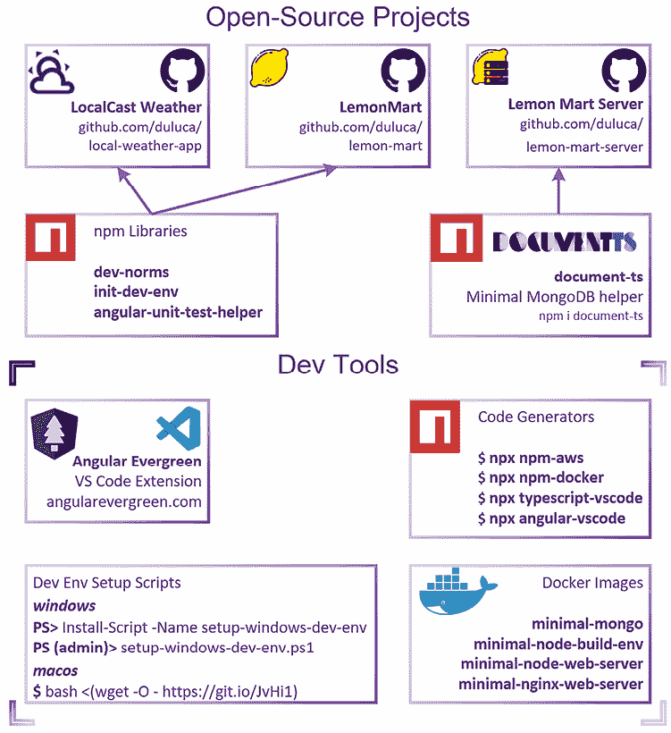

图 1.1：支持本书的代码

上面的图表显示了构成支持本书的技术内容的各个组成部分。每个组件将在接下来的章节中详细介绍。代码示例包含逐章快照和代码的最终状态。本书的样本代码的最新版本可在以下链接的 GitHub 仓库中找到：

+   对于**第二章**和**第九章**，LocalCast 天气：[`github.com/duluca/local-weather-app`](https://github.com/duluca/local-weather-app)

+   对于**第四章**到**第十章**，柠檬市场：[`github.com/duluca/lemon-mart`](https://github.com/duluca/lemon-mart)

+   对于**第五章**，柠檬市场服务器：[`github.com/duluca/lemon-mart-server`](https://github.com/duluca/lemon-mart-server)

你可以在补充阅读材料《保持 Angular 和工具常青》中了解更多关于更新 Angular 的信息，该材料可在[`angularforenterprise.com/evergreen`](https://angularforenterprise.com/evergreen)找到。

现在你已经熟悉了本书的结构和辅助内容，在我们深入探讨网络的漫长历史之前，让我们首先区分 Angular 的两大主要架构以及推动 2016 年框架大幅重写的潜在主题。

# 两个 Angular

在其原始版本 Angular.js（即 1.x），开创了单页应用（SPA）时代，这是一种欺骗浏览器认为单个 `index.html` 包含一个包含多个页面的交互式应用的技术。Angular.js 还普及了双向绑定在网页开发中的概念，它自动将视图更新以匹配 ViewModel 的状态。为了实现这一功能，Angular.js 使用 **变更检测** 来跟踪浏览器中的 **文档对象模型**（**DOM**）元素和应用程序的 ViewModel 状态。

变更检测依赖于一个复杂的渲染循环来检测用户交互和其他事件，以确定应用程序是否需要响应变化。每当涉及渲染循环时，如在游戏中，性能可以测量为每秒帧数，即 **每秒帧数**（**FPS**）。缓慢的变更检测过程会导致低 FPS 数，转化为不流畅的 **用户体验**（**UX**）。随着对更多交互性和复杂网络应用的需求增加，很明显，Angular.js 的内部架构无法通过提高以保持一致的 FPS 输出来进行改进。然而，用户体验和性能只是体验故事的一方面。随着应用程序变得更加复杂，需要更好的工具来支持优秀的 **开发者体验**（**DevEx**）——有时称为 **DevX** 或 **DX**），这对于开发者的福祉至关重要。

Angular 2 重写，现在简称为 Angular，旨在解决问题的两个方面。在 React、Angular 和 Vue 等框架和库出现之前，我们遭受着未管理的复杂性和“每周 JavaScript 框架”综合症的困扰。这些框架通过承诺解决所有问题、带来通用可重用网络组件以及使学习、开发和扩展网络应用变得更加容易而取得成功——至少在一段时间内，某些框架在不同时期表现得比其他框架更好。随着对越来越复杂的网络体验的需求增加，以及解决这些问题的工具变得越来越复杂，早期单页应用（SPA）所面临的相同问题正在回归。要掌握 Angular 或任何其他现代框架，了解网络开发的过去、现在和未来至关重要。网络发展的青少年历史教会了我们几个重要的教训。首先，变化是不可避免的，其次，开发者的幸福是一种宝贵的商品，它可以使整个公司兴衰。

正如你所见，Angular 的发展深受性能、用户体验（UX）和开发者体验（DevEx）等因素的影响。但这并非仅影响 Angular 的独特问题。让我们将时钟倒退至过去二十五年左右，回顾一下网络开发的历史，以便你能将现代框架如 Angular、React 和 Vue 放置在正确的背景中进行理解。

# 网络框架简史

理解为什么我们最初使用像 Angular、React 或 Vue 这样的框架至关重要，这样才能真正体会到它们带来的价值。随着网络的不断发展，你可能会发现，在某些情况下，框架不再是必需的，应该被舍弃；而在其他情况下，框架对你的业务至关重要，必须保留。随着 JavaScript 在浏览器中的普及和强大，Web 框架应运而生。在 2004 年，**异步 JavaScript 和 XML**（**AJAX**）技术变得非常流行，用于创建不需要依赖完整页面刷新来创建动态体验的网站，利用了标准化的 Web 技术，如 HTML、JavaScript/ECMAScript 和 CSS。浏览器供应商应该按照**万维网联盟**（**W3C**）的定义来实现这些技术。

**Internet Explorer**（**IE**）是当时大多数互联网用户依赖的浏览器。微软利用其市场主导地位来推广专有技术和 API，以确保 IE 作为首选浏览器的优势。当 Mozilla 的 Firefox 挑战 IE 的主导地位，随后是 Google 的 Chrome 浏览器出现时，事情开始变得有趣。随着这两个浏览器成功获得显著的市场份额，Web 开发领域变得混乱。新的浏览器版本以惊人的速度出现。竞争的厂商和技术利益导致了 Web 标准实现的分歧。

这种碎片化环境使得开发者难以在网络上提供一致的用户体验。各种标准的实现质量、版本和名称的差异创造了一个巨大的挑战：成功编写能够一致操作浏览器 DOM 的代码。即使是浏览器 API 和功能的最微小差异也足以破坏一个网站。

## jQuery 时代

在 2006 年，jQuery 被开发出来以平滑 API 和浏览器能力之间的差异。因此，你不必反复编写代码来检查浏览器版本，你可以使用 jQuery，一切就绪。它隐藏了供应商特定实现的复杂性，并在功能缺失时优雅地填补了空白。在近十年里，jQuery 成为了 Web 开发框架。没有使用 jQuery 就无法编写交互式网站的想法是不可想象的。

然而，为了创建充满活力的用户体验，仅使用 jQuery 是不够的。原生 Web 应用程序在浏览器中运行所有代码，这需要快速的计算机来运行动态解释的 JavaScript 并使用复杂的对象图来渲染网页。在 2000 年代，许多用户在相对较慢的计算机上运行过时的浏览器，因此用户体验并不理想。

结合 AJAX，jQuery 使任何 Web 开发者都能够创建在任何浏览器上运行的交互式和动态网站，而无需运行昂贵的服务器硬件和软件。为了对客户端和服务器上运行的代码的架构细微差别有一个坚实的理解，可以考虑传统的三层软件架构。每个层级由三个主要层组成，如下面的图所示：

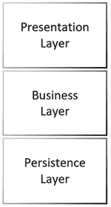

图 1.2：三层软件架构

表示层包含与**用户界面**（**UI**）相关的代码。这主要是运行在客户端的代码，被称为**胖客户端**。然而，表示逻辑可以驻留在服务器上。在这些情况下，客户端变成**瘦客户端**。业务层包含业务逻辑，通常位于服务器端。无序的实现可能导致业务逻辑跨越所有三层。这意味着一个错误或逻辑的变化需要在许多位置实现。实际上，没有人能够定位到这种逻辑的所有发生位置，只能部分修复代码。这当然会导致更复杂的错误产生。持久层包含与数据存储相关的代码。

为了编写易于维护且无错误的代码，我们的整体设计目标是追求架构组件之间的低耦合和高内聚。低耦合意味着这些层之间的代码片段不应相互依赖，并且应该是可独立替换的。高内聚意味着相关的代码片段，如特定业务逻辑领域的代码，应保持在一起。例如，当构建一个用于管理餐厅的应用程序时，预订系统的代码应在一起，而不是分散在其他系统，如库存跟踪或用户管理。

使用 jQuery 和 AJAX，编写 Web 的胖客户端成为可能，这使得编写难以维护的代码变得比以往任何时候都容易。现代 Web 应用程序比基本的三层应用程序有更多的移动部件。下面的图显示了适合表示层、业务层和持久层的额外层：

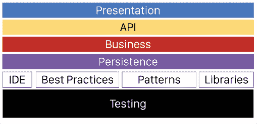

图 1.3：现代 Web 架构

您可以在扩展的架构图中观察到现代 Web 开发的必要组件，该图包括一个通常在表示层和业务层之间转换和传输数据的 API 层。除了操作环境中的代码之外，工具和最佳实践层定义并强制执行用于开发软件的模式。最后，测试层定义了一系列自动化测试，以确保代码的正确性，这在当今的迭代和快速发展的开发周期中至关重要。

虽然有很多人希望用厚客户端民主化 Web 开发，主要消耗客户端计算资源，但工具还没有准备好执行适当的架构实践并交付可维护的软件。这意味着企业继续投资于服务器端渲染技术。

## 服务器端 MVC 时代

在 2000 年代后期，许多企业仍然依赖于服务器端渲染的网页。服务器动态创建渲染页面所需的全部 HTML、CSS 和数据。浏览器充当了一个被美化的查看器，用于显示结果。以下是一个展示 ASP.NET MVC 堆栈中服务器端渲染的 Web 应用程序示例架构概述的图表：

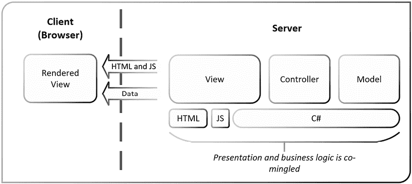

图 1.4：服务器端渲染的 MVC 架构

**模型-视图-控制器**（**MVC**）是一种典型的代码模式，其中模型包含数据操作逻辑，控制器包含业务逻辑，视图包含展示逻辑。在 ASP.NET MVC 的情况下，控制器和模型使用 C#编写，视图使用 HTML、JavaScript 和 C#的模板版本创建。结果是浏览器接收 HTML、JavaScript 和所需数据，通过 jQuery 和 AJAX 魔法，网页看起来是交互式的。服务器端渲染和 MVC 模式至今仍然流行并在使用中。有一些合理的利基用途，例如[Facebook.com](http://Facebook.com)。Facebook 服务于从非常慢到非常快的数十亿设备。没有服务器端渲染，Facebook 无法保证其用户群的一致 UX。

服务器端渲染和 MVC 的组合是一个复杂的执行模式；在展示和业务逻辑混合方面有很多机会。为了确保组件的低耦合，工程团队中的每一位成员都必须非常经验丰富。高比例资深开发者的团队很难找到，这还是一种轻描淡写。

更进一步的是，C#（或任何其他服务器端语言）不能在浏览器中本地运行。因此，从事服务器端渲染应用程序的开发者必须同样擅长使用前端和后端技术。在这样实现中，缺乏经验的开发者很容易无意中将展示和业务逻辑混合在一起。当这种情况发生时，原本运行良好的系统的必然 UI 现代化变得不可能。换句话说，要更换厨房中的水槽，你必须翻新整个厨房。由于架构不足，组织每十年都要花费数百万美元来编写和重写相同的应用程序。

## 丰富客户端时代

在 2000 年代，使用 Java Applets、Flash 或 Silverlight 等技术可以构建与服务器 API 解耦的丰富 Web 应用程序。然而，这些技术依赖于浏览器插件，需要单独安装。通常，这些插件已经过时，创建了关键的安全漏洞，并且在移动计算机上消耗了过多的电力。在 2008 年 iPhone 革命之后，很明显，即使 Android 操作系统做出了最好的努力，这样的插件也无法在手机上运行。此外，苹果公司 CEO 史蒂夫·乔布斯对这种不优雅的解决方案的厌恶标志着在浏览器中对这种技术支持结束的开始。

在 2010 年代初，像 Backbone 和 AngularJS 这样的框架开始出现，展示了如何以原生感觉和速度构建丰富的 Web 应用程序，并且似乎以成本效益的方式做到这一点。以下图表展示了一个**模型-视图-视图模型**（**MVVM**）客户端和一个**表示状态转换**（**REST**）API。当我们通过 API 将客户端从服务器解耦时，我们可以在架构上强制实施将表示和业务逻辑分开实现。从理论上讲，这种 RESTful Web 服务模式将允许我们尽可能多地替换厨房用具，而无需重新装修整个厨房。

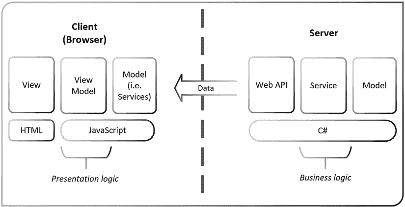

图 1.5：富客户端解耦 MVVM 架构

上述 MVVM 架构与服务器端 MVC 架构相比，箱子的数量几乎翻了一番。这意味着我们需要编写两倍多的代码吗？是的，也不完全是。是的，我们需要编写更多的代码来维护一个有纪律的架构；然而，随着时间的推移，我们将因为解决方案的整体可维护性而编写更少的代码。围绕表示逻辑的架构确实变得更加复杂。客户端和服务器必须实现它们的表示/API、业务和持久化层。

不幸的是，许多利用 Backbone 和 AngularJS 等框架的早期开发工作因为未能正确实现客户端架构而失败。

这些早期的开发工作也受到了设计不良的 RESTful Web API 的困扰。大多数 API 没有对其 URI 进行版本控制，这使得在支持现有客户端的同时引入新功能变得非常困难。此外，API 经常返回复杂的数据模型，将它们的内部关系数据模型暴露给 Web 应用程序。这种设计缺陷在用 HTML 编写的看似无关的组件/视图和用 SQL 创建的模型之间创建了一个紧密的耦合。如果你不实现额外的代码层来转换或映射数据结构，那么你将在层之间创建一个无意和不受控制的耦合。随着时间的推移，处理这种耦合变得非常昂贵，在大多数情况下需要重大的重写。

今天，我们在将数据模型发送到客户端之前，使用 API 层将其扁平化，以避免出现此类问题。像 GraphQL 这样的新技术更进一步，通过暴露一个定义良好的数据模型，并允许消费者查询所需的确切数据。使用 GraphQL，HTTP 请求的数量和通过网络传输的数据量是最优的，而无需开发者创建许多专门的 API。

Backbone 和 AngularJS 证明了在浏览器中本地运行 Web 应用程序是可行的。当时所有的 SPA 框架都依赖于 jQuery 进行 DOM 操作。同时，网络标准持续发展，支持新标准的永续浏览器变得司空见惯。然而，变化是永恒的，网络技术的发展使得第一代 SPA 框架的优雅演进变得不可持续，正如我在“两个 Angular”部分所暗示的。

新一代 Web 框架需要解决许多问题；它们需要强制实施良好的架构，设计用于与网络标准同步发展，并且要稳定且可扩展以满足企业需求，而不会崩溃。此外，这些新框架需要获得开发者的认可，因为开发者已经厌倦了生态系统中太多的快速变化。记住，不快乐的开发者不会创造成功的业务。实现这些目标需要与过去彻底决裂，因此 Angular 和 React 作为平台以不同的方式解决了过去的问题。正如你将在接下来的章节中发现的那样，Angular 提供了构建可扩展企业级应用程序的最佳工具和架构。

# Angular 及其背后的哲学

Angular 是由 Google 和一群开发者维护的开源项目。新的 Angular 平台与您可能使用过的传统框架大相径庭。在与微软合作的过程中，Google 将 TypeScript 设为 Angular 的默认语言。TypeScript 是 JavaScript 的超集，它使开发者能够针对旧版浏览器，如 Internet Explorer 11，同时允许他们编写在现代浏览器（如 Chrome、Firefox 和 Edge）中运行的现代 JavaScript 代码。Angular 1.x 范围内的传统版本，称为 AngularJS，是一个单体 JavaScript SPA 框架。现代版本，Angular 2+，是一个能够针对浏览器、混合移动框架、桌面应用程序和服务器端渲染视图的平台。

在上一代中，升级到 AngularJS 的新版本是风险和成本高昂的，因为即使是微小的更新也引入了新的编码模式和实验性功能。每次更新都会引入弃用或重构 API 表面，需要重写大量代码。此外，更新以不确定的间隔交付，使得团队无法计划资源以升级到新版本。发布方法最终导致了一个不可预测、不断演变的框架，似乎没有任何指导之手来推动代码库向前发展。如果你使用 AngularJS，你很可能会卡在特定版本上，因为你的代码库的特定架构使得迁移到新版本非常困难。2018 年，Angular 团队发布了 AngularJS 的最后一个主要更新，版本为 1.7。这次发布标志着旧框架的终结，其生命周期的结束定于 2022 年 1 月。

## 确定性发布

Angular 在各个方面都优于 AngularJS。该平台遵循[`semver.org/`](https://semver.org/)中定义的**semver**，其中次要版本增量表示新功能添加和下一个主要版本的潜在弃用通知，但没有破坏性更改。此外，谷歌的 Angular 团队承诺了一个确定性的发布计划，每 6 个月发布一个主要版本。在此 6 个月的开发窗口之后，从 Angular 4 开始，所有主要版本都收到 LTS 支持，包括额外的 12 个月的错误修复和安全补丁。从发布到生命周期的结束，每个主要版本都会收到 18 个月的更新。请参考以下图表，了解 Angular 的预期发布和支持计划：


图 1.6：活跃支持版本

这对你意味着什么？你可以确信，即使你对 Angular 代码没有任何改动，你的 Angular 代码大约在 24 个月内都将得到支持和向后兼容。例如，如果你在 2023 年 11 月使用版本 17 编写了一个 Angular 应用，并且你没有使用任何弃用功能，你的代码将与 Angular 18 运行时兼容，并且支持到 2025 年 5 月。要将你的 Angular 17 代码升级到 Angular 19，你必须确保你没有使用 Angular 18 中收到弃用通知的任何弃用 API。

在实践中，大多数弃用都是微小的，并且重构起来非常直接。除非你使用针对高度专业用户体验的低级 API，否则更新你的代码库所需的时间和精力应该是微不足道的。然而，这是谷歌做出的承诺，而不是合同。Angular 团队有重大动力确保向后兼容性，因为谷歌在组织内部运行着大约 1,000 多个 Angular 应用，任何时候只有一个版本的 Angular 处于活跃状态。因此，在你阅读这段文字的时候，谷歌的所有 1,000 多个应用都将运行在 Angular 的最新版本上。

## 首要升级

您可能认为谷歌有无限的资源来定期更新数千个应用程序。像任何组织一样，谷歌的资源也是有限的。为每个应用程序分配一个专门的团队来维护将过于昂贵。因此，Angular 团队必须通过自动化测试确保兼容性，并尽可能使未来通过主要版本变得无痛。在 Angular 6 中引入了`ng update`，使更新过程成为一流的体验。

Angular 团队通过自动化 CLI 工具不断改进其发布流程，使升级过时的功能成为一个主要自动化的、合理的努力。法国航空和荷兰皇家航空展示了这种策略的好处，将他们的升级时间从 Angular 2 的 30 天减少到 Angular 7 的 1 天。

可预测且得到良好支持的升级过程对开发者和组织来说是个好消息。您不必永远停留在 Angular 的旧版本上，您可以计划和分配必要的资源，以保持您的应用程序不断向未来迈进，而无需昂贵的重写。正如我在 2017 年的博客文章《Angular 4 的最佳新功能》中写道，[`bit.ly/NgBestFeature`](https://bit.ly/NgBestFeature)，信息很明确：

> **对于开发者和管理者：**Angular 将长期存在，因此您应该投资时间、注意力和金钱来学习它——即使您目前对某些其他框架情有独钟。
> 
> **对于决策者（CIOs、CTOs 等）：**计划在接下来的 6 个月内开始您的 Angular 迁移。这将是一项您可以向有商业头脑的人解释的投资，您的投资将在未来多年内带来回报，远远超过初始 LTS 窗口到期，并且有优雅的升级路径到 Angular vNext 以及更远。

那么为什么谷歌（Angular）和微软（TypeScript 和 Visual Studio Code）会免费提供这样的技术？有多个原因：

+   一个复杂的框架使得开发 Web 应用程序变得容易，这展示了技术实力，可以保留和吸引开发者人才。

+   一个开源框架使得数百万开发者可以大规模地验证和调试新想法和工具。

+   允许开发者创造出色的 Web 体验，为谷歌和微软带来更多商业机会。

我在这里看不到任何恶意意图，并欢迎开放、成熟和高品质的工具，如果需要，我可以对其进行调整以适应我的意愿。不必为专有技术的支持合同付费是一个受欢迎的额外好处。

警惕 - 在网上寻找 Angular 帮助可能会很棘手。您需要区分 AngularJS 或 Angular，它们可能被称为 Angular2，但也要意识到，关于版本 13 或以下的一些建议可能不适用于 14+，因为渲染引擎已更改为 Ivy。我总是建议在学习时阅读官方文档。Angular 的文档在[`angular.dev`](https://angular.dev)。这不应与[angularjs.org](https://angularjs.org)混淆，后者是关于遗留的 AngularJS 框架或已退役的[angular.io](http://angular.io)网站。

要查看即将发布的 Angular 版本的最新更新，请查看官方发布时间表[`angular.dev/reference/releases`](https://angular.dev/reference/releases)。

## 可维护性

您的时间宝贵，您的幸福至关重要，因此您必须仔细选择投入时间的科技。考虑到这一点，我们必须回答为什么 Angular 是您应该学习超过 React、Vue 或其他技术的工具。Angular 是一个伟大的框架，适合开始学习。该框架和工具可以帮助您快速起步并持续成功，拥有充满活力的社区和高质量的 UI 库，您可以使用它们来交付卓越的 Web 应用程序。React 和 Vue 是具有其优势和劣势的伟大库。每个工具都有其位置和目的。

在某些情况下，React 是项目的正确选择，而在其他情况下，Vue 才是正确的选择。在某种程度上精通其他 Web 框架只能帮助您进一步理解 Angular，并使您成为一名更好的开发者。在 2012 年，当我意识到解耦前端和后端关注点的重要性时，Backbone 和 AngularJS 这样的 SPA（单页应用程序）完全吸引了我的注意力。服务器端渲染的模板几乎无法维护，并且是许多昂贵的软件系统重写的根本原因。如果您关心创建可维护的软件，您必须遵守首要指令：保持 API 背后的业务逻辑与在 UI 中实现的展示逻辑解耦。

Angular 完美符合帕累托原则或 80-20 法则。它已成为一个成熟且不断发展的平台，让您可以用 20%的努力完成 80%的任务。如前所述，每个主要版本都支持 18 个月，创造了一个学习的连续性，保持最新，并弃用旧功能。从全栈开发者的角度来看，这种连续性是无价的，因为您的技能和培训将在未来许多年里保持相关和新鲜。

Angular 的哲学是在配置和惯例之间倾向于配置。尽管基于惯例的框架在外观上可能看起来很优雅，但它们让新来者难以掌握框架。基于配置的框架旨在通过显式的配置和钩子来揭示其内部工作原理，你可以在这些钩子中附加你的自定义行为到框架中。本质上，AngularJS 有很多魔法，这些魔法可能会让人困惑、不可预测，并且难以调试，而 Angular 则试图避免这些魔法。

配置优于惯例导致代码冗长。冗长是好事。简洁的代码是可维护性的敌人，只对原始作者有利。正如 Andy Hunt 和 David Thomas 在 *《实用程序员》* 中所说：

> 记住，你（以及你之后的人）将多次阅读代码，但只编写几次。

此外，Andy Hunt 的 *设计法则* 规定：

> 如果你不能轻易地移除每一部分，那么设计就是失败的。

详尽、解耦、一致和封装的代码是确保你的代码面向未来的关键。通过其各种机制，Angular 使这些概念得到适当的执行。它消除了 AngularJS 中许多自定义惯例，如 `ng-click`，并引入了一种更自然的语言，它建立在现有的 HTML 元素和属性之上。因此，`ng-click` 变成了 `(click)`，它扩展了 HTML 而不是取代它。

接下来，我们将回顾 Angular 的持续更新心态和响应式编程范式，这是 Angular 初始哲学的最新扩展。

## Angular Evergreen

当你在学习 Angular 时，你不仅仅是在学习 Angular 的一个特定版本，而是在学习一个不断发展的平台。自从最初的草案以来，我设计这本书时就是为了淡化你所使用的 Angular 的特定版本。Angular 团队支持这一理念。多年来，我与 Angular 团队以及社区中的思想领袖进行了许多对话，并聆听了许多演讲。因此，你可以依赖 Angular 作为成熟的 Web 开发平台。Angular 经常会进行更新，并且非常注重向后兼容性。此外，任何因新版本而变得不兼容的代码，都可以通过自动化工具的帮助或通过在 [`angular.dev/update`](https://angular.dev/update) 上定位 **Angular 更新指南** 来获得明确的指导来更新你的代码，这样你就永远不会感到困惑或在网上寻找答案。Angular 团队致力于确保你——开发者——拥有最佳的 Web 开发体验。

为了将这个理念清晰地传达给开发者，我和几位同事一起开发并发布了一个名为 Angular Evergreen 的 Visual Studio Code 扩展，如下面的图像所示：

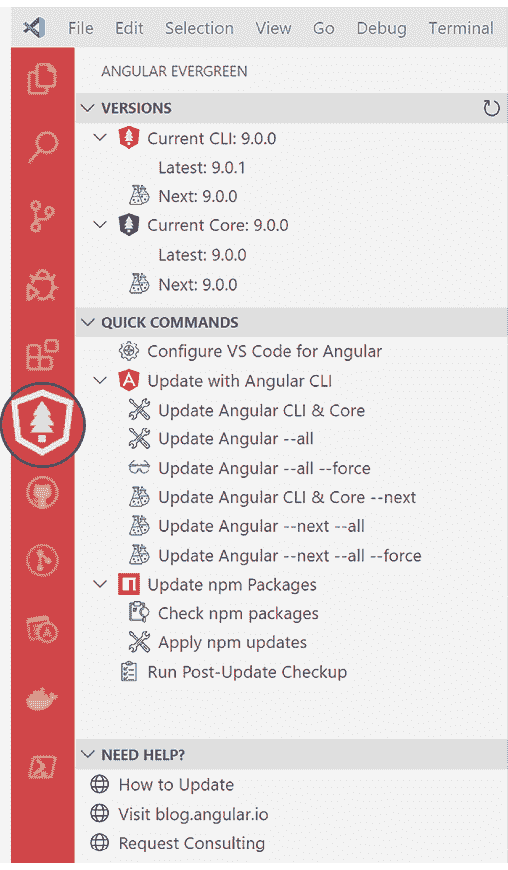

图 1.7：Angular Evergreen VS Code 扩展

此扩展检测您当前的 Angular 版本，并将其与 Angular 的最新和下一个版本进行比较。标记为“下一个”的版本是为早期采用者和测试您的代码与即将推出的 Angular 版本的兼容性而设计的。不要在生产部署中使用标记为“下一个”的版本。

您可以在[Angular Evergreen 扩展](https://AngularEvergreen.com)的网站上找到更多信息、功能请求和错误报告。

Angular 的一个关键组件是 TypeScript，它使平台能够保持始终如一。TypeScript 允许高效地实现新功能，同时支持旧浏览器，因此您的代码可以触及尽可能广泛的受众。

## TypeScript

Angular 使用 TypeScript 编码。微软的安德斯·海尔斯伯格创建了 TypeScript，以解决在大型企业规模上应用 JavaScript 的几个主要问题。

安德斯·海尔斯伯格是 Turbo Pascal 和 C# 的创造者，以及 Delphi 的首席架构师。安德斯设计了 C# 以成为一个对开发者友好的语言，它建立在 C 和 C++ 的熟悉语法之上。因此，C# 成为微软流行的 .NET 框架背后的语言。TypeScript 与 Turbo Pascal 和 C# 以及它们的理念有着相似的血统，这使它们取得了巨大的成功。

JavaScript 是一种动态解释语言，浏览器在运行时解析和理解您编写的代码。像 Java 或 C# 这样的静态类型语言有一个额外的编译步骤，编译器可以在编译时捕获编程和逻辑错误。在编译时与运行时检测和修复错误要便宜得多。TypeScript 通过引入类型和泛型将静态类型语言的优点带到了 JavaScript。然而，TypeScript 并不是传统意义上的编译器。它是一个转译器。编译器使用 C/C++ 将代码编译成机器语言，或者使用 Java 或 C# 的**中间语言**（**IL**）。然而，转译器将代码从一种方言转换成另一种方言。因此，当 TypeScript 代码被构建、编译或转译时，结果是纯 JavaScript。

JavaScript 的官方名称是 ECMAScript。该语言的特性和语法由 ECMA 技术委员会 39，简称 TC39 维护。

转译还有另一个显著的好处。将 TypeScript 转换为 JavaScript 的相同工具也可以用来将 JavaScript 重新编写为旧语法，以便旧浏览器可以解析和执行。在 1999 年到 2009 年间，JavaScript 语言没有看到任何新特性。由于各种技术和政治原因，ECMAScript 放弃了版本 4。浏览器供应商在他们的浏览器中实施新的 JavaScript 特性时遇到了困难，从 ES5 的引入开始，然后是 ES2015（也称为 ES6）。

因此，用户对这些新特性的采用率一直很低。然而，这些新特性意味着开发者可以更高效地编写代码。这产生了一个被称为 JavaScript 特性差距的差距，如下面的图形所示：

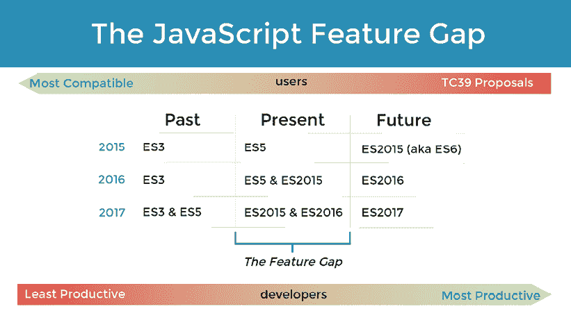

图 1.8：JavaScript 特性差距

JavaScript 特性差距正在缩小，因为 TC39 承诺每年更新 JavaScript。因此，TypeScript 代表了 JavaScript 的过去、现在和未来。你可以使用 JavaScript 的未来特性，同时仍然能够针对过去的浏览器，以最大化你能够触及的受众。到 2023 年，这个差距比以往任何时候都要小，ES2022 是一种成熟的语言，得到了每个主要浏览器的广泛支持。

现在，让我们来了解一下 Angular 的底层架构。

# 组件架构

Angular 遵循 MV* 模式，这是 MVC 和 MVVM 模式的混合体。之前，我们讨论了 MVC 模式。从高层次来看，这两种模式的架构相对相似，如下面的图所示：

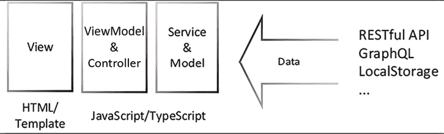

图 1.9：MV* 架构

这里的新概念是 ViewModel，它代表连接你的视图到你的模型或服务的粘合代码。在 Angular 中，这种粘合被称为绑定。与像 Backbone 或 React 这样的 MVC 框架必须调用 `render` 方法来处理它们的 HTML 模板不同，在 Angular 中，这个过程对开发者来说是无缝且透明的。绑定是区分 MVC 应用程序和 MVVM 应用程序的关键。

Angular 应用程序中最基本的单元是一个组件。组件将一个 TypeScript 编写的 JavaScript 类和一个 Angular 模板（由 HTML、CSS 和 TypeScript 编写）结合成一个元素。通过绑定，类和模板就像拼图一样契合在一起，以便它们可以相互通信，如下面的图所示：

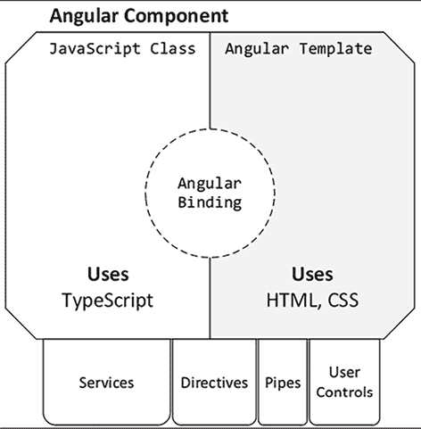

图 1.10：组件解剖结构

类是面向对象编程（**OOP**）的结构。如果你投入时间深入研究 OOP 范式，你会大大提高你对 Angular 的工作原理的理解。OOP 范式允许在组件中注入依赖服务，这样你就可以进行 HTTP 调用或触发显示给用户的 toast 消息，而无需将这种逻辑拉入你的组件或复制你的代码。依赖注入使得开发者能够轻松地使用许多相互依赖的服务，而无需担心这些对象从内存中实例化、初始化或销毁的顺序。

Angular 模板允许通过指令、管道、用户控件和其他组件进行类似的代码重用。这些是封装高度交互式最终用户代码的代码片段。这种交互式代码通常很复杂且错综复杂，必须将其与业务逻辑或展示逻辑隔离，以保持代码的可维护性。

Angular 17 引入了一种新的 **控制流语法**（处于预览状态），它用 `@if` 替换了 `*ngIf`，用 `@for` 替换了 `*ngFor`，用 `@switch` 替换了 `*ngSwitch`，并引入了 `@empty`、`@defer`、上下文变量和条件语句。新的语法使得模板更容易阅读，并避免了在独立项目中将遗留指令导入到每个组件中。本书将专门使用控制流语法。

您可以使用 `npx ng generate @angular/core:control-flow` 命令将现有的模板转换为新的语法。

Angular 应用程序可以通过两种不同的方式创建：

+   NgModule 项目

+   独立项目

截至 Angular 17，默认的方式是将您的应用程序作为独立项目启动。这种方法有很多好处，如以下 *Angular 路由* 部分进一步解释。有许多新的术语需要学习，但模块作为一个概念并不会消失。只是它们不再需要了。

无论您的应用程序是从 `bootstrapApplication` 还是 `bootstrapModule` 开始，在应用程序的根级别，Angular 组件、服务、指令、管道和用户控件都提供给 `bootstrapApplication` 函数或组织在模块下。根级别的配置渲染您的第一个组件，注入任何服务，并准备它可能需要的任何依赖项。在独立应用程序中，您可以懒加载单个组件。

您还可以引入 **功能模块** 来懒加载服务组和组件。所有这些功能都有助于初始应用程序快速加载，提高首次内容绘制时间，因为框架不需要在浏览器中同时下载和加载所有网络应用程序组件。例如，向没有管理员权限的用户发送管理仪表板的代码是无用的。

能够创建独立组件使我们能够放弃人为的模块。以前，您被迫将共享组件放在共享模块中，这导致在减少应用程序大小方面效率低下，因为开发者不一定想为每个共享组件创建一个模块。例如，LocalCast Weather 应用程序是一个简单的应用程序，它不受益于模块的概念，但 LemonMart 应用程序通过在不同模块中实现不同的业务功能，自然地反映了模块化架构。关于这一点，本章的 *模块化架构* 部分将进行更多介绍。

独立组件不应与 Angular 元素混淆，Angular 元素是网络标准的实现，自定义元素，也称为 Web Components。以这种方式实现组件将需要将 Angular 框架的大小减少到只有几 KB，而当前框架的大小约为 150 KB。如果这成功了，您将能够在任何网络应用程序中使用您开发的 Angular 组件。这是一件令人兴奋的事情，但也是一个艰巨的任务。您可以在 [`angular.dev/guide/elements`](https://angular.dev/guide/elements) 上了解更多关于 Angular 元素的信息。

Angular 大量使用 RxJS 库，它将响应式开发模式引入 Angular，而不是更传统的命令式开发模式。

# 响应式编程

Angular 支持多种编程风格。Angular 内部编程风格的多样性是它对具有不同背景的程序员友好的一部分原因。无论你是来自面向对象编程的背景，还是坚定地相信函数式编程，你都可以使用 Angular 构建可行的应用程序。在*第二章*，*表单、观察者、信号和主题*中，你将开始利用响应式编程概念构建 LocalCast 天气应用程序。

作为程序员，你很可能习惯于命令式编程。命令式编程是指你作为程序员编写顺序代码，描述必须按你定义的顺序执行的所有操作以及应用程序的状态，这取决于正确设置的一组变量以正确运行。你编写循环、条件语句并调用函数；你触发事件并期望它们被处理。命令式和顺序逻辑是你习惯的编码方式。

响应式编程是函数式编程的一个子集。在函数式编程中，你不能依赖于之前设置的变量。你写的每个函数都必须独立存在，接收它自己的输入集，并返回一个结果，而不受外部函数或类的状态的影响。函数式编程很好地支持**测试驱动开发**（**TDD**），因为每个函数都是一个可以独立测试的单元。因此，你写的每个函数都变得可组合。所以你可以混合、匹配和组合你写的任何函数，构建一系列调用，以产生你预期的结果。

响应式编程给函数式编程增添了一个转折。你不再处理纯逻辑，而是一个异步数据流，你可以使用一组可组合的函数将其塑造成你需要的任何形状。所以当你订阅响应式流中的事件时，你正在将你的编码范式从响应式编程转变为命令式编程。

在本书后面的部分，当实现 LocalCast 天气应用程序时，你将在`CurrentWeatherComponent`和`CitySearchComponent`中利用`subscribe`的实际操作。

考虑以下例子，由 Mike Pearson 在他的演示文稿*思考响应式：最难*中恰如其分地提出，提供从水龙头获取热水的指令，以帮助理解命令式编程和响应式编程之间的差异：

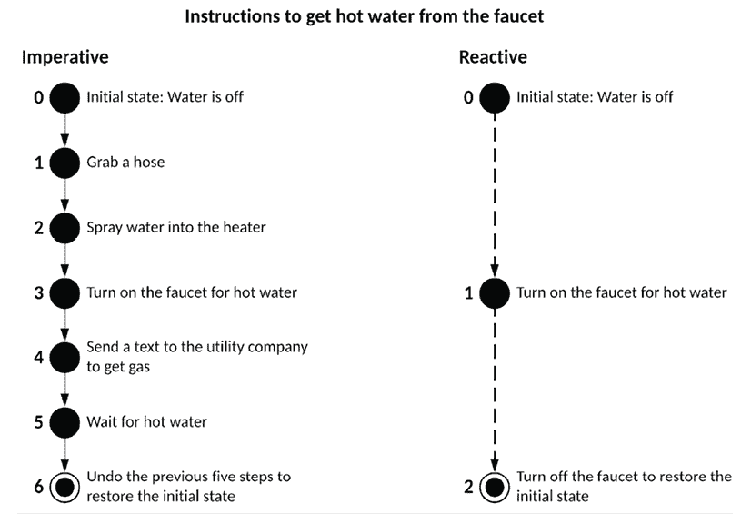

图 1.11：命令式与响应式方法

如你所见，在使用命令式编程时，你必须定义代码执行的每一步。总共有六个步骤。每个步骤都依赖于前一个步骤，这意味着你必须考虑环境的状态以确保操作成功。在这样的环境中，很容易忘记一个步骤，并且很难测试每个步骤的正确性。在函数式响应式编程中，你与异步数据流一起工作，这导致了一个无状态的流程，它很容易与其他动作组合。总共有两个步骤，但**步骤 2**不需要任何新的逻辑。它只是断开**步骤 1**中的代码。

RxJS 是允许你在响应式范式下实现代码的库。

Angular 16 在开发者预览中引入了信号，作为一种新的范式，以在 Angular 中实现细粒度的响应性。在**第二章**，**表单、可观察者、信号和主题**中，你将在你的 Angular 应用程序中实现信号。请参考本章后面的**Angular 的未来**部分以获取更多信息。

## RxJS

**RxJS**代表**响应式扩展**，这是一个模块化库，它使得响应式编程成为可能。它是一种异步编程范式，允许通过转换、过滤和控制函数来操作数据流。你可以将响应式编程视为基于事件编程的进化。

## 响应式数据流

在事件驱动编程中，你会定义一个事件处理程序并将其附加到事件源。更具体地说，如果你有一个**保存**按钮，它暴露了一个`onClick`事件，你会实现一个`confirmSave`函数，当触发时，会显示一个弹出窗口询问用户“**你确定吗？**”。查看以下图表以了解此过程的可视化：

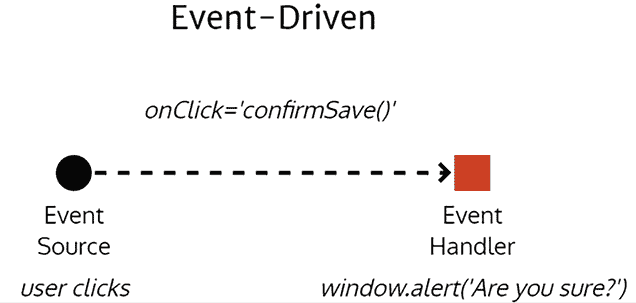

图 1.12：事件驱动实现

简而言之，你会有一个事件在每次用户操作时触发一次。如果用户多次点击**保存**按钮，这个模式会乐意渲染与点击次数一样多的弹出窗口，这并没有太多意义。

**发布-订阅**（**pub/sub**）模式是另一种类型的事件驱动编程。在这种情况下，我们可以为给定事件的结果编写多个处理程序，以便它们可以同时作用于。假设你的应用程序刚刚接收了一些更新数据。发布者会遍历其订阅者列表，并将更新数据传递给每个订阅者。

参考以下图表了解更新数据事件如何触发多个函数：

+   `updateCache`函数使用新数据更新你的本地缓存

+   `fetchDetails`函数从服务器检索有关数据的更多详细信息

+   `showToastMessage`函数通知用户应用程序刚刚接收到了新数据

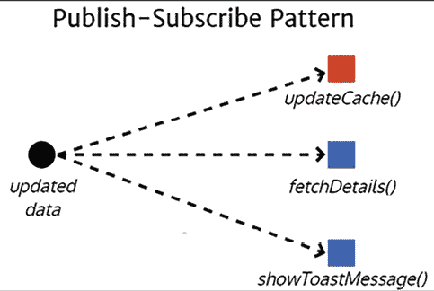

图 1.13：发布/订阅模式实现

所有这些事件都可以异步发生；然而，`fetchDetails` 和 `showToastMessage` 函数将接收到比它们所需更多的数据，尝试以不同的方式组合这些事件来修改应用程序的行为可能会变得复杂。

在响应式编程中，一切都是被视为流。一个流将包含随时间发生的事件，这些事件可能包含一些或没有数据。以下图表可视化了一个场景，其中你的应用程序正在监听用户的鼠标点击。未经控制的用户点击流是没有意义的。你通过应用 `throttle` 函数来控制这个流，这样你每 250 毫秒只得到更新。如果你订阅这个新的事件流，每 250 毫秒，你将收到一个点击事件的列表。你可能试图从每个点击事件中提取一些数据，但在这个情况下，你只对发生的点击事件数量感兴趣。使用 `map` 函数，我们可以将原始事件数据塑造成所有点击的总和。

在数据流进一步向下时，我们可能只对监听两个或更多点击的事件感兴趣，因此我们可以使用 `filter` 函数仅对本质上为双击事件进行操作。每次我们的过滤器事件触发时，都意味着用户有意进行双击，你可以通过弹出警告来利用这个信息。

流的真正力量来自于你可以选择在任何时候对事件进行操作，当它通过各种控制、转换和过滤器函数时。你可以选择使用 `@for` 和 Angular 的 `async` 管道在 HTML 列表中显示点击数据，以便用户可以监控每 250 毫秒被捕获的点击数据类型。

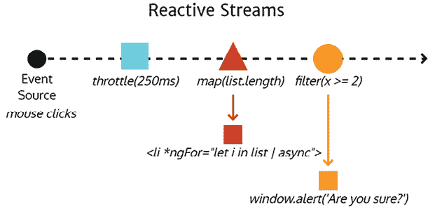

图 1.14：响应式数据流实现

现在，让我们考虑一些更高级的 Angular 架构模式。

# 模块化架构

如前文在 *组件架构部分* 中提到的，如果你创建一个 `NgModule` 项目，Angular 组件、服务和依赖项将组织到模块中。Angular 应用程序通过其根模块进行引导，如下面的图表所示：

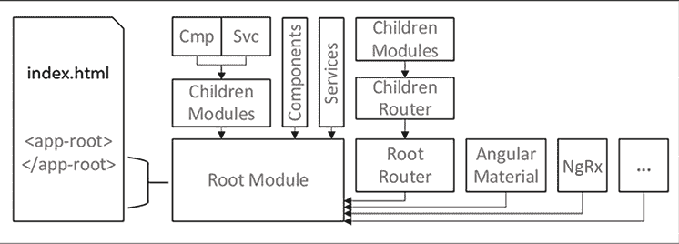

图 1.15：显示主要架构元素的 Angular 引导过程

根模块可以导入其他模块，声明组件，并提供服务。随着你的应用程序增长，你必须创建包含其组件和服务的子模块。以这种方式组织你的应用程序允许你实现懒加载，这样你可以控制哪些应用程序的部分被发送到浏览器以及何时发送。当你向应用程序添加更多功能时，你会从其他库（如 Angular Material 或 NgRx）导入模块。你实现路由器以在组件之间启用丰富的导航体验，允许你的路由配置编排组件的创建。

*第四章*，*创建一个 Router-First 业务应用*，介绍了 router-first 架构，我鼓励你通过提前创建所有路由来开始开发你的应用程序。

在 Angular 中，服务默认以单例形式提供给模块。你会很快习惯这种行为。然而，你必须记住，如果你在多个模块中提供相同的服务，每个模块都有其提供的服务的独立实例。在认证服务的情况下，我们希望在整个应用程序中只有一个实例，你必须小心只在该根模块级别提供认证服务的实例。任何在应用程序根级别提供的服务、组件或模块都将在功能模块中可用。

# 独立架构

如果你创建一个独立项目，你的依赖项将在根级别的 `bootstrapApplication` 函数中提供。第一方和第三方库被更新为暴露提供者函数而不是模块。这些提供者函数本质上是可摇树的，这意味着框架可以在最终包中删除未使用的它们。提供者函数可以使用“with”函数进行自定义，其中名为 `withFeature()` 的函数可以启用某个特定功能。

在独立项目和通常使用独立组件的情况下，我们必须明确导入它们使用的、不包括在提供者中的功能。这意味着管道、指令（包括像 `*ngIf` 这样的基本指令——当然，除非你使用 `@if`），以及子组件必须被提供。这可能会比 NgModule 项目更冗长和限制性，但长期的好处超过了短期的不便。我们向框架提供关于我们项目的更多信息，框架就能更好地优化我们的代码并提高性能。

你可以使用以下命令将现有的 NgModule 项目迁移到独立项目：

```js
$ npx ng g @angular/core:standalone 
```

警惕——这并不是一个万无一失或完全自动化的过程。更多关于此的信息请参阅 [`angular.dev/reference/migrations/standalone`](https://angular.dev/roadmap)。

路由器是你在 Angular 中必须掌握的下一个最强大的技术。

# Angular 路由器

Angular 路由器，包含在 `@angular/router` 包中，是构建类似常规网站且易于导航的 SPAs 的核心和关键部分，它使用浏览器控件或缩放或微缩控件进行操作。

Angular 路由器具有高级功能，如懒加载、路由出口、辅助路由、智能活动链接跟踪，以及能够以 `href` 的形式表达，这使能够利用无状态数据驱动组件的灵活的 Router-first 应用架构，使用 RxJS `BehaviorSubject` 或一个 `signal`。

如果一个类（在 Angular 中是一个组件或服务）在执行其任何行为（通过函数或属性获取器/设置器）时不依赖于实例变量，则该类是无状态的。当类用于管理数据访问时，它是数据驱动的。一个无状态的数据驱动组件可以持有数据对象的引用并允许访问它们（包括通过函数进行的突变），但不会在变量中存储任何账簿或状态信息。

大型团队可以在单个代码库上协同工作，每个团队负责一个模块的开发，同时避免相互干扰，并实现轻松的持续集成。谷歌拥有数亿行代码，之所以选择在单个代码库上工作，有一个非常好的原因：事后的集成成本非常高。

小型团队可以即时混搭他们的 UI 布局以快速响应变化，而无需重新架构他们的代码。很容易低估由于布局或导航的后期变化而浪费的时间。对于大型团队来说，这些变化更容易吸收，但对于小型团队来说则成本高昂。

考虑以下图示；首先，根据引导配置，应用程序将要么是一个独立的，要么是`NgModule`项目。无论如何，你将在应用程序的根目录中定义一个`rootRouter`；组件`a`、`master`和`detail`；服务；管道；指令；以及其他模块将被提供。当用户首次导航到你的应用程序时，所有这些组件都将被浏览器解析和预加载。

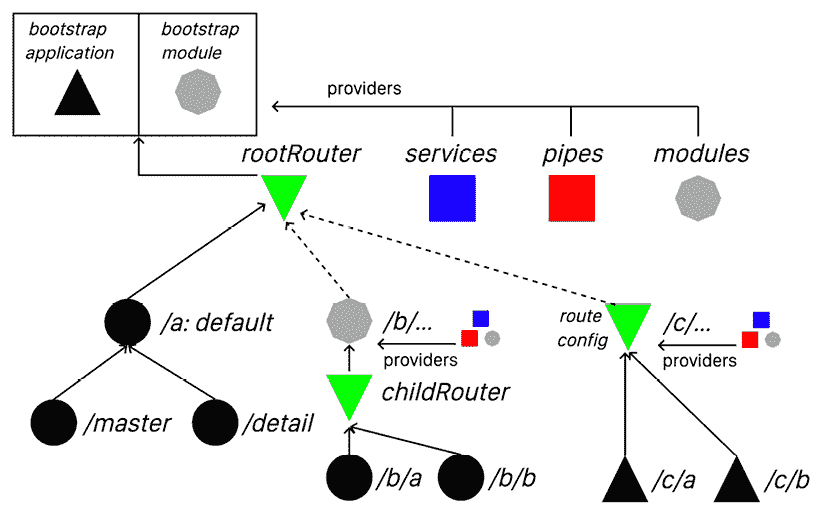

图 1.16：Angular 架构

如果你打算实现一个懒加载的路由`/b`，你需要创建一个名为`b`的功能模块，它将拥有其`childRouter`；组件`/b/a`和`/b/b`；服务；管道；指令；以及其他为它提供的模块。在转换过程中，Angular 会将这些组件打包到一个单独的文件或包中，并且这个包只有在用户导航到`/b`下的路径时才会被下载、解析和加载。

在一个独立项目中，你可以懒加载由三角形表示的其他独立组件。你可以在路由配置文件中组织组件。`/c/a` 和 `/c/b` 组件将能够访问根级别的提供者。你可以在路由配置文件中为特定组件提供一个 **环境注入器**。实际上，这只有在你想只为该组件或具有特定范围（例如，仅由该组件使用的状态）提供服务时才有用。与 `NgModule` 应用程序相比，你必须在每个组件中细粒度地声明你正在使用的模块。然而，与 `NgModule` 应用程序不同，任何未由组件使用的根级别提供者都是可摇的。这两个属性的组合导致应用程序包体积小，并且由于每个模块都可以单独懒加载，每个包的大小也会更小，从而带来更好的整体性能。

让我们更详细地研究懒加载。

## 懒加载

连接 `/b/...` 到 `rootRouter` 的虚线展示了懒加载的工作原理。懒加载允许开发者快速实现亚秒级的首次有意义的绘制。通过延迟加载额外的模块，我们可以将发送到浏览器的包大小保持在最小。模块的大小会负面影响下载和加载速度，因为浏览器需要做的工作越多，用户看到应用第一个屏幕的时间就越长。通过定义懒加载的模块，每个模块都作为单独的文件打包，可以单独下载和按需加载。

Angular 路由器提供了智能的活跃链接跟踪，这导致了卓越的开发者和用户体验，使得实现高亮功能以指示用户当前标签或当前活动应用的某个部分变得非常容易。辅助路由最大化了组件的重用，并有助于轻松完成复杂的状态转换。使用辅助路由，你可以仅使用单个外部模板渲染多个主视图和详细视图。你还可以控制路由在浏览器 URL 栏中的显示方式，并在模板中使用 `routerLink` 和在组件类中使用 `Router.navigate` 来组合路由，处理复杂场景。

在 *第四章*，*创建以路由为第一线的业务应用*，我介绍了实现路由基础，高级食谱在第 *第八章*，*食谱 – 可重用性、表单和缓存* 中介绍。

除了路由之外，如果你想要构建复杂的 Angular 应用程序，掌握状态管理是另一个至关重要的概念。

# 状态管理

每个 Angular 组件和服务都有一个 `EcmaScript` 类作为后盾。当实例化时，类在内存中成为对象。当你与对象一起工作时，如果你在对象属性中存储值，你就在你的 Angular 应用程序中引入了状态。如果未管理，状态就会成为你应用程序成功和可维护性的重大负担。

我既喜欢后端也喜欢前端的无状态设计。从我的角度来看，状态是邪恶的，你应该仔细注意不要将状态引入到你的代码中。早些时候，我们讨论了 Angular 中的服务默认是单例的。这是一个引入状态到应用程序的糟糕机会。你必须避免在服务中存储信息。在 *第四章*，*创建以路由为第一线的业务应用程序* 中，我向你介绍了 `readonly` `BehaviorSubject`，它作为应用程序的数据锚点。在这种情况下，我们将这些锚点存储在服务中以在组件之间共享，以同步数据。数据锚点是数据的引用而不是副本。服务不存储任何元数据或进行任何账目管理。

在 Angular 组件中，类是一个 ViewModel，充当你的代码和模板之间的粘合代码。与服务相比，组件的生存周期相对较短，在这种情况下使用对象属性是可以的。

然而，除了设计之外，还有特定的用例需要引入强大的机制来维护应用程序状态中的复杂数据模型。**渐进式 Web 应用程序**（**PWA**）和移动应用程序就是其中之一，在这些情况下，连接性无法保证。在这些情况下，能够保存和恢复应用程序的整个状态是必须的，以提供出色的用户体验。

Angular 的 NgRx 库利用 Flux 模式为你的应用程序提供复杂的状态管理。在 *第二章*，*表单、可观察对象、信号和主题* 和 *第九章*，*食谱 – 主/详细信息、数据表和 NgRx* 中，我提供了使用 NgRx 的各种功能的替代实现，以展示与更轻量级方法之间的实现差异。

## Flux 模式

Flux 是 Facebook 创建的应用架构，旨在协助构建客户端 Web 应用程序。Flux 模式定义了一系列组件，这些组件通过触发/处理动作和从存储中读取值的视图函数来管理存储应用程序状态。使用 Flux 模式，你将应用程序的状态保存在存储中，存储的访问只能通过定义良好且解耦的函数进行，从而实现良好的架构扩展性，因为解耦的函数在独立情况下易于推理和编写单元测试。

考虑以下图表，以了解这些组件之间信息流的流向：

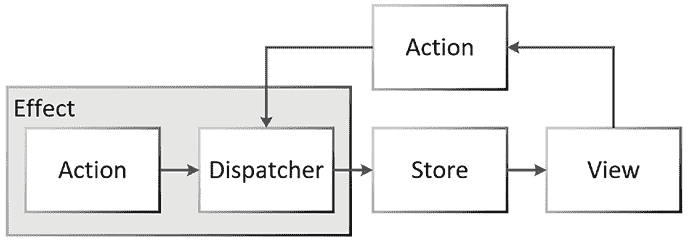

图 1.17：NgRx 数据流

NgRx 使用 RxJS 在 Angular 中实现了 Flux 模式。

## NgRx

NgRx 库将基于 RxJS 的类似 Redux（一个流行的 React.js 库）的响应式状态管理引入 Angular。使用 NgRx 进行状态管理允许开发者编写原子、自包含和可组合的代码片段，创建动作、减少器和选择器。这种响应式编程允许在状态变化中隔离副作用，并且与 React.js 的一般编码模式感觉非常自然。NgRx 在已经复杂和高级的工具（如 RxJS）之上创建了一个抽象层。

使用 NgRx 有许多优秀的理由，例如如果你在应用程序中处理 3+ 个输入流。在这种情况下，处理这么多事件的额外开销使得引入新的编码范式到你的项目中变得值得。然而，大多数应用程序只有两个输入流：REST API 和用户输入。对于可能需要持久化和恢复复杂状态信息（或具有类似需求的利基企业应用程序）的离线优先 **渐进式 Web 应用程序**（**PWAs**），NgRx 可能是有意义的。

这里是 NgRx 的架构概述：

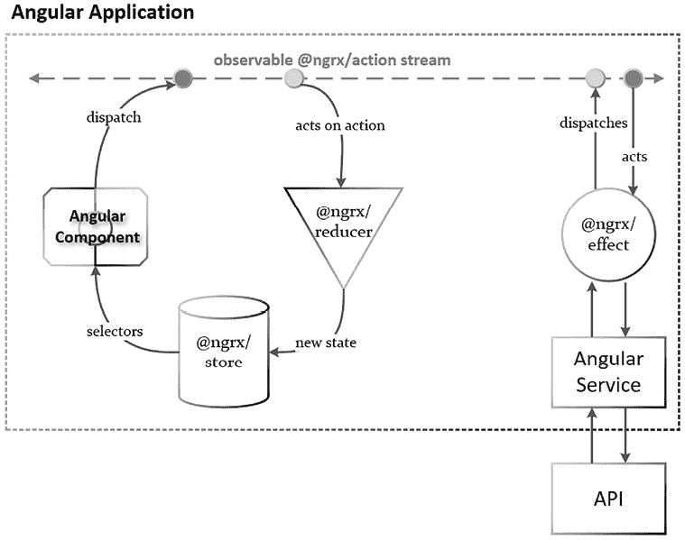

图 1.18：NgRx 架构概述

将图的最顶部视为可观察的动作流，动作可以像圆圈所示那样被分发和执行。效果和组件可以分发动作。减少器和效果可以对这些动作进行操作，要么将值存储在存储中，要么触发与服务器的交互。组件利用选择器从存储中读取值。

由于我对最小工具的态度积极，并且没有明确的必要性需要 NgRx 之外的利基受众，我不建议将 NgRx 作为默认选择。`RxJS/BehaviorSubject` 强大且足够强大，可以解锁复杂和可扩展的模式，帮助你构建出色的 Angular 应用程序，正如在 *第九章*，*食谱 - 主/详细，数据表和 NgRx* 章节中所展示的那样。

你可以在 [`ngrx.io`](https://ngrx.io) 上了解更多关于 NgRx 的信息。

## NgRx 组件存储

NgRx 组件存储，包名为 `@ngrx/component-store`，是一个旨在通过针对本地/组件状态来简化状态管理的库。它是一种替代基于服务的响应式推送主题的方法。对于组件状态仅由组件自身或一小组组件更改的场景，你可以通过使用这个库来提高你代码的可测试性、复杂性和性能。

与像 NgRx 这样的全局状态解决方案相比，NgRx 组件存储由于其有限的范围，可以在其关联视图从组件树中分离时自动清除自己。与单例服务不同，你可以有多个组件存储的实例，为不同的组件提供不同的状态。此外，组件存储的概念模型很简单。只需要掌握 select、updater 和 effect 概念，所有这些都在一个受限的范围内操作。因此，对于那些正在构建独立的 Angular 应用或寻求特定组件存储的人来说，NgRx 组件存储提供了一种可持续且易于测试的方法。

你可以在[`ngrx.io/guide/component-store`](https://ngrx.io/guide/component-store)了解更多关于 NgRx 组件存储的信息。

# React.js 架构

与 Angular 相比，React.js 全面实现了 Flux 模式。以下是一个以路由为中心的 React 应用程序视图，其中组件/容器和提供者以严格的树状方式表示。

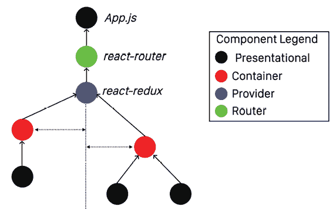

图 1.19：React.js 架构概述

在 React 的最初版本中，即使是最基本的功能，也需要费力地将值在组件的继承树中传递上/下。后来，引入了`react-redux`，因此每个组件都可以直接将值读写到存储中，而无需遍历树。

这个基本的概述应该能让你对 Angular 和 React 之间的重要架构差异有一个感觉。然而，请记住，就像 Angular 一样，React 的社区、模式和最佳实践也在不断演变，并且随着时间的推移而变得更好。

如果你追求简洁，可以看看 Vue。它真的很简单：[`vuejs.org`](https://vuejs.org)。

你可以在[`reactjs.org`](https://reactjs.org)了解更多关于 React 的信息。

# Angular 的未来

Angular 最大的好处之一是你每 6 个月可以期待一次重大发布。然而，随着定期发布的节奏，每次重大发布都要推出有意义的、引人注目的更新所带来的压力也随之而来。我们可能要怪谷歌创造了这种压力。如果你不是持续产出，你就不在行了。这有一个不幸的副作用，即新功能可能会以预览或未完成的状态发布。虽然可以说，提前发布即将推出的功能可以让开发者社区收集反馈，但并不能保证不会引入性能回归。

如果你的团队没有消费掉定期发布的每一份 Angular 新闻，你可能会错过这些细微差别，并将代码部署到生产环境中，这可能会对你的业务产生负面影响，甚至可能影响收入。例如，一些用户已经注意到 Angular 16 中的性能回归，Angular 团队知道这一点并在 Angular 17 中修复了它，但这种立场使采用新版本的企业的业务处于风险之中。

野心勃勃的 Angular Elements 功能最好地体现了这一方面的另一个方面。大约在 Angular 9 发布时，宣布了对 Angular 的 Web 组件支持引起了很大的关注。承诺是你可以使用你喜欢的框架创建通用可重用组件。团队强调了将 Angular 的精简版与组件一起发布的巨大挑战——将框架大小从 150 KB 减少到只有几个 KB。团队并没有专注于最终确定这一功能，尽管取得了巨大的增量进展，但团队发现这项任务过于艰巨。因此，团队转向了不同的想法来解决这个问题。但即使是这些新想法也被匆忙推出，处于预览状态，例如，Angular signals 增加了生产软件中未完成工作的堆积。在 Angular 17 中，signals 部分退出预览，并有可能通过实现基于信号的组件来改变未来 Angular 应用程序构建的方式。与 RxJS 的泄漏订阅概念相比，signals 不易泄漏内存。Signals 还可以与 async/await 调用一起工作，避免了使用 RxJS 进行许多不自然的响应式编程。所有这些功能的稳定交付可能要到 Angular 19。

查找有关即将推出和预览中的功能的最新信息，请访问[`angular.dev/roadmap`](https://angular.dev/roadmap)。

一个大型 Angular 应用程序会遭受与 Angular.js 类似的性能问题，只是关于“大型”的定义已经发生了显著变化。这里的主要问题是，无法解决这些性能问题，至少不是没有进行重大工程投资，否则你将不得不深入 Angular 渲染引擎的内部。

此外，到 2023 年，通过利用 ES2022 功能，可以使用纯 JavaScript 构建响应式和交互式 Web 应用程序。Angular signals 通过用原生 JavaScript 替换 Zone.js 来暴露这些 ES2022 功能，从而实现细粒度响应性。这意味着只有需要更新的 DOM 部分才会被更新，显著减少了渲染时间。这是我在*第三章*，*构建企业应用程序架构*中进一步探讨的主题。结合这些变化，结果是一个更优化的变更检测周期，从而实现更平滑的 FPS。

每次 Angular 的发布都旨在提高现代浏览器的**首次交互时间**（**TTI**）。在过去，这意味着改进包大小，引入模块的懒加载，而现在则是单个组件。Angular 现在支持**服务器端渲染**（**SSR**）的非破坏性水合。这意味着服务器可以计算视图的 DOM 并将其传输到客户端，客户端可以更新显示给用户的 DOM，而无需完全替换它。

Angular 也正在从 Jasmine 转向 Jest。Jasmine 一直是一个出色的单元测试框架。然而，在 Web 应用程序环境中使其工作总是需要大量的配置和额外的工具，如 Karma 来执行测试和获取覆盖率报告。Jest 包含了所有这些功能。目前的支持是实验性的，还不清楚 Vitest 是否会比 Jest 更好。Angular 正在从 webpack 转向 esbuild，其速度比 webpack 快约 40 倍。同样，它目前仅作为（开发者）预览版提供。

如您所见，Angular 中一些最激动人心的事情发生在预览功能中。事实是，团队正在全力以赴，为他们的项目交付功能，并尽力跟上所有最新的变化。不断更新依赖项已经足够困难；框架在心理模型上的重大变化，加上性能问题，可能会失去开发者和企业的信心。信任难以建立，却容易失去。

事实上，Angular 团队正在做出色的工作，该框架正在做出必要的改变以适应不断增长的需求。谷歌强制要求他们拥有的 2,000 多个 Angular 项目都必须使用相同的 Angular 版本。这意味着每个新的 Angular 更新都经过了良好的测试，并且没有向后不兼容的惊喜。

Angular 仍然是一个令人兴奋、敏捷且功能强大的框架。我的目的是让您了解潜在的地雷在哪里。我希望您和我一样对现代网络开发的状态以及它解锁的未来可能性感到兴奋。系好您的安全带，多萝西，因为堪萨斯州即将消失。

# 摘要

总结来说，网络技术已经发展到可以创建丰富、快速和本地的网络应用的程度，这些应用可以在今天部署的大多数桌面和移动浏览器上良好运行。Angular 已经成为一个成熟且稳定的平台，应用了从过去学到的经验。它使开发者能够使用 TypeScript、RxJS 和 NgRx 启用的模式（来自面向对象编程、响应式编程、Flux 模式和独立组件）等技术开发可维护、交互式和快速的应用程序，以及 NgRx 组件存储。

Angular 旨在以持续更新的方式使用，因此始终保持 Angular 的最新状态是个好主意。访问 [`AngularForEnterprise.com`](https://AngularForEnterprise.com) 获取最新更新和新闻。

Angular 被设计成从头到尾都是响应式的；因此，你必须调整你的编程风格以适应这种模式。有了信号，Angular 甚至获得了细粒度的响应性。然而，表示层响应性并不等同于响应式编程。当基于信号的组件在 Angular 19 左右出现时，Angular 将不再需要响应式编程来实现响应式的表示层。在*第九章*，*食谱 – 主/详细，数据表和 NgRx*中，我提供了一个使用信号和 NgRx SignalStore 的几乎可观察和无订阅的应用程序示例，以展示 Angular 17 所能实现的可能性。在此之前，官方文档应该是你的圣经，可在[`angular.dev`](https://angular.dev)找到。

在下一章中，我们将回顾 LocalCast 天气应用作为一个独立应用；你将学习如何使用响应式表单捕获用户输入，保持组件解耦，使用`BehaviorSubject`在它们之间启用数据交换，以及 NgRx 组件存储和 Angular 信号与这些概念的区别。在接下来的章节中，你将学习关于创建可扩展应用程序的高级架构模式，以及你的 Angular 前端如何在最小 MEAN 的全栈 TypeScript 应用程序的上下文中工作。本书最后介绍了 DevOps 和持续集成技术，以发布你的应用程序。

# 进一步阅读

+   *设计模式：可重用面向对象软件的元素*，Erich Gamma，Richard Helm，Ralph Johnson，John Vlissides，1994，Addison Wesley，ISBN 0-201-63361-2.

+   *人类 JavaScript*，Henrik Joreteg，2013，[`read.humanjavascript.com`](http://read.humanjavascript.com).

+   *TypeScript x MS Build 2017 的新特性*，Anders Hejlsberg，2017，[`www.youtube.com/watch?v=0sMZJ02rs2c`](https://www.youtube.com/watch?v=0sMZJ02rs2c).

+   *《实用程序员》，20 周年纪念版*，David Thomas 和 Andrew Hunt，2019，Addison Wesley，ISBN 978-0135957059.

+   *思考响应式：最难的部分*，Mike Pearson，2019，[`www.youtube.com/watch?v=-4cwkHNguXE`](https://www.youtube.com/watch?v=-4cwkHNguXE).

+   *使用 RxJS 进行数据组合，Deborah Kurata*，2019，[`www.youtube.com/watch?v=Z76QlSpYcck`](https://www.youtube.com/watch?v=Z76QlSpYcck).

+   *Flux 模式深入概述*, Facebook, 2019, [`facebook.github.io/flux/docs/in-depth-overview`](https://facebook.github.io/flux/docs/in-depth-overview).

+   *开发者体验：它是什么，为什么你应该关心？*，GitHub，2023，[`github.blog/2023-06-08-developer-experience-what-is-it-and-why-should-you-care`](https://github.blog/2023-06-08-developer-experience-what-is-it-and-why-should-you-care).

+   *独立组件*, Google，2023，[`angular.dev/reference/migrations/standalone`](https://angular.dev/reference/migrations/standalone).

+   *内置控制流*, Google, 2023, [`angular.dev/guide/templates/control-flow`](https://angular.dev/guide/templates/control-flow).

# 提问

尽可能好地回答以下问题，以确保你已理解本章的关键概念，无需使用 Google 搜索。你知道你是否回答了所有问题吗？访问 [`angularforenterprise.com/self-assessment`](https://angularforenterprise.com/self-assessment) 获取更多信息：

1.  独立项目与 NgModule 项目之间有什么区别？

1.  Angular Evergreen 的概念是什么？

1.  使用双击示例实现反应式流，使用 RxJS 实现以下步骤：使用 `fromEvent` 函数监听 HTML 目标的点击事件。使用 `throttleTime`、`asyncScheduler`、`buffer` 和 `filter` 操作符确定鼠标是否在 250 毫秒内双击。如果检测到双击，则在浏览器中显示一个警告。提示：使用 [`stackblitz.com`](https://stackblitz.com) 或实现你的代码并使用 [`rxjs.dev/`](https://rxjs.dev/) 获取帮助。

1.  NgRx 是什么，它在 Angular 应用中扮演什么角色？

1.  在 Angular 中，模块、组件和服务之间有什么区别？

# 加入我们的 Discord 社区

加入我们社区的 Discord 空间，与作者和其他读者进行讨论：

[`packt.link/AngularEnterpise3e`](https://packt.link/AngularEnterpise3e)


