# 2

# 表单、可观察对象、信号和主题

在本章中，我们将使用 Angular 和来自 [OpenWeatherMap.org](https://www.geonames.org/postal-codes) 的第三方 Web API，开发一个简单的天气应用 **LocalCast Weather**。该项目的源代码可在 GitHub 上找到，网址为 [`github.com/duluca/local-weather-app`](https://github.com/duluca/local-weather-app)，包括在 `projects` 文件夹中的各个开发阶段。

如果您之前从未使用过 Angular，并且需要了解 Angular 的基础知识，我建议您查看 Angular.dev 上的 *什么是 Angular？* [`angular.dev/overview`](https://angular.dev/overview)，并学习 *Angular 教程* [`angular.dev/tutorials/learn-angular`](https://angular.dev/tutorials/learn-angular)。

感觉勇敢吗？只需在您的终端中输入以下内容：

```js
$ npm create @angular 
```

LocalCast Weather 是一个简单的应用，展示了构成 Angular 应用程序的基本元素，例如组件、独立组件、模块、提供者、管道、服务、RxJS、单元测试、使用 Cypress 的端到端测试、环境变量、Angular Material 以及利用 CircleCI 的 **持续集成** 和 **持续交付** （**CI/CD**） 管道。

我已经在 GitHub 上为这个项目创建了一个看板板。您可以通过以下链接访问它，以了解更多关于项目的背景信息：

[`github.com/users/duluca/projects/1`](https://github.com/duluca/local-weather-app).

看板板是一个很好的方式来记录您构建应用的计划。我在 *第三章*，*构建企业应用架构* 中提到了制定路线图和创建项目状态信息发射器的必要性。

信息发射器是一种物理或虚拟显示，易于可见或访问，传达有关项目或过程的关键信息。它通常包括指标、进度图表或状态指示器，旨在提供一目了然的认识，而无需观众寻求信息。信息发射器的目标是促进透明度，促进团队成员之间的沟通，并使利益相关者能够在不打扰团队工作流程的情况下获取更新。

作为额外奖励，我在我的仓库 [`github.com/duluca/local-weather-app/wiki`](https://github.com/duluca/local-weather-app/wiki) 上创建了一个基本的维基页面。请注意，您无法在 `README.md` 或维基页面上上传图片。为了克服这一限制，您可以创建一个新的问题，在评论中上传一张图片，并将图片的 URL 复制粘贴到 `README.md` 或维基页面上以嵌入图片。在示例维基中，我使用了这种方法将线框设计嵌入到页面中。

书中示例项目的源代码被分为 **阶段** 以捕捉开发的各种状态快照。在本章中，我们从 `stage5` 开始应用开发，并演进到 `stage6`。在 `stage5` 中，应用已经完善，但它只能拉取一个城市的天气信息，该信息被硬编码到应用中。因此，它不是一个非常有用的应用。

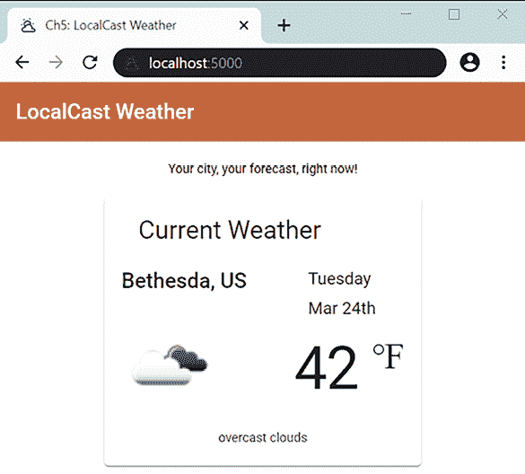

图 2.1：LocalCast 天气应用，如 projects/stage5 中的项目

您将继承一个尚未交互的项目。为了构建交互式应用，我们需要能够处理用户输入。在您的应用程序中启用用户输入可以打开创建优秀用户体验的可能性。

在本章中，我们将涵盖以下主要主题：

+   优秀的用户体验应驱动实现

+   响应式表单与模板驱动表单的比较

+   组件与可观察对象和 RxJS/BehaviorSubject 的交互

+   管理订阅和内存泄漏

+   在响应式范式中进行编码

+   链接 API 调用

+   使用 Angular 信号

+   使用 ChatGPT 生成应用

# 技术要求

书籍的示例代码的最新版本可在 GitHub 上找到，链接将在稍后提供。该存储库包含代码的最终和完成状态。您可以在本章末尾通过查找 `projects` 文件夹下的章节末尾代码快照来验证您的进度。

对于 **第二章**：

1.  克隆 [`github.com/duluca/local-weather-app`](https://github.com/duluca/local-weather-app) 存储库。

1.  在根文件夹中执行 `npm install` 以安装依赖项。

1.  项目的初始状态反映在：

    ```js
    projects/stage5 
    ```

1.  项目的最终状态反映在：

    ```js
    projects/stage6 
    ```

1.  将阶段名称添加到任何 `ng` 命令中，以仅对该阶段执行操作：

    ```js
    npx ng build stage6 
    ```

注意，存储库根目录下的 `dist/stage6` 文件夹将包含编译结果。

请注意，书中提供的源代码和 GitHub 上的版本可能不同。这些项目周围的生态系统一直在不断发展。由于 Angular CLI 生成新代码的方式的变化、错误修复、库的新版本以及多种技术的并行实现，存在许多难以计数的差异。如果您发现错误或有问题，请在 GitHub 上创建问题或提交拉取请求。

到本章结束时，您应该能够熟练地利用可观察对象和信号构建提供优秀用户体验的应用。作为额外奖励，我将简要介绍您如何利用 **生成式 AI**（**GenAI**）工具，如 ChatGPT ([`chat.openai.com/`](https://chat.openai.com/)) 来构建快速原型。但首先，让我们回到用户体验，因为无论您如何奔跑、爬行或扩展城市城墙，如果您的用户体验做得好，您的应用将受到喜爱；但如果您没有达到目标，您的应用将一文不值。

# 优秀的用户体验应驱动实现

创建一个易于使用且丰富的**用户体验**（**UX**）应该是你的主要目标。你不应该仅仅因为最容易实现而选择一个设计。然而，通常你会发现一个伟大的 UX，在应用的前端实现起来很简单，但在后端却要困难得多。考虑一下 google.com 的登录页面：


图 2.2：谷歌的登录页面

在这种情况下，谷歌搜索只是一个简单的输入字段，带有两个按钮。容易构建，**对吧**？这个简单的输入字段解锁了世界上一些最复杂和最先进的软件技术，这些技术背后是全球基础设施中的定制数据中心和**人工智能**（**AI**）。这是一种欺骗性的简单且疯狂强大的与用户互动的方式。你可以通过利用现代网络 API，如`GeoLocation`来增强用户输入，并为从用户输入中推导出新的含义添加关键上下文。因此，当用户输入`巴黎`时，你不必猜测他们是指法国的巴黎，还是指德克萨斯州的巴黎，或者你是否应该显示摄氏度或华氏度的当前温度。使用`LocalStorage`，你可以缓存用户凭据并记住用户偏好，以在您的应用中启用深色模式。

在这本书中，我们不会实现一个由人工智能驱动的超级应用，但我们将允许用户通过城市名称或邮政编码（在美国通常称为“邮编”）来搜索他们的城市。一旦你意识到实现看似简单的邮政编码搜索可能有多么复杂，你可能会对精心设计的网络应用产生新的赞赏。

为了实现用户体验目标，我们需要构建一个以输入字段为中心的用户界面。为此，我们需要利用 Angular 表单和验证消息来创建具有“边打边搜”功能的引人入胜的搜索体验。

在幕后，`RxJS`/`BehaviorSubject`或`信号`使我们能够构建解耦的组件，它们可以相互通信，并且一个响应式数据流允许我们在不增加我们应用复杂性的情况下合并来自多个网络 API 的数据。此外，你将了解 Angular 信号，并了解它与 RxJS 的区别。

接下来，让我们看看如何使用表单实现输入字段。表单是我们捕获用户输入的主要机制。在 Angular 中，有两种类型的表单：**响应式**和**模板驱动**。我们需要涵盖这两种技术，以便你熟悉 Angular 中表单的工作方式。

# 响应式表单与模板驱动表单

现在，我们将实现搜索栏在应用程序的主屏幕上。下一个用户故事是**显示当前位置的预报信息**，这可能意味着固有的地理定位功能。然而，正如你可能注意到的，地理定位是一个单独的任务。挑战在于，使用原生平台功能，如地理定位，你永远不能保证收到实际的位置信息。这可能是由于移动设备上的信号丢失问题，或者用户可能简单地拒绝分享他们的位置信息。

首先，我们必须提供一个良好的基线用户体验，然后才实现诸如地理定位等增值功能。在 `阶段 5`，项目状态在看板（Kanban board）上表示，如下快照所示：

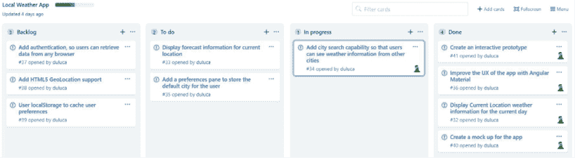

图 2.3：GitHub 项目看板

我们将实现**添加城市搜索功能**卡片（它捕获了一个用户故事），如图**进行中**列所示。作为这个故事的一部分，我们将实现一个即搜即显的功能，并在服务无法检索预期数据时向用户提供反馈。

初始时，实现一个类型搜索机制可能看起来很直观；然而，`OpenWeatherMap` API 并不提供这样的端点。相反，它们提供批量数据下载，这些下载成本高昂，且数据量在兆字节级别。

我们需要实现我们的应用程序服务器以暴露这样的端点，以便我们的应用程序在尽可能少用数据的情况下有效地查询。

`OpenWeatherMap` 的免费端点确实提出了一个有趣的挑战，即两位数的国家代码可能伴随城市名称或邮政编码，以获得最准确的结果。这是一个为用户提供反馈机制的绝佳机会，如果针对特定查询返回多个结果。

我们希望应用程序的每一次迭代都是一个可能发布的增量，并避免在任何给定时间内做太多事情。

在开始编写故事之前，将故事分解成技术任务是件好事。以下是本故事的分解任务：

1.  添加一个 Angular 表单控件，以便我们可以捕获用户输入事件。

1.  使用在[`material.angular.io/components/input`](https://material.angular.io/components/input)上记录的 Angular Material 输入来提高输入字段的用户体验。

1.  将搜索栏作为一个单独的组件创建，以强制执行关注点的分离和解耦的组件架构。

1.  在 `weather.service.ts` 中扩展现有端点以接受邮政编码，并使国家代码在可选，以便使最终用户与我们的应用程序交互更加直观。

1.  限制请求频率，这样我们就不需要在每次按键时查询 API，而是在用户仍然能够立即获得反馈而不需要点击单独按钮的间隔内进行查询。

让我们在接下来的几节中处理这些任务。

## 添加 Angular 响应式表单

你可能会想知道为什么我们要添加 Angular 表单，因为我们只有一个输入字段，而不是一个包含多个输入字段的表单。作为一个一般规则，每次添加输入字段时，都应该将其包裹在 `<form>` 标签中。`Forms` 模块包含 `FormControl`，它允许你编写输入字段背后的代码以响应用户输入并提供适当的数据或验证或消息。

Angular 中有两种类型的表单：

+   **模板驱动表单**：这些表单类似于你可能熟悉的 AngularJS 中的情况，其中表单逻辑主要在 HTML 模板内部。我不是这种方法的粉丝，因为它更难测试这些行为，而且庞大的 HTML 模板难以快速维护。

+   **响应式表单**：响应式表单的行为由控制器中的 TypeScript 代码驱动。这意味着你的验证逻辑可以进行单元测试，并且更好的是，可以在你的应用程序中重用。响应式表单是核心技术，在未来将使 Angular Material 团队能够编写自动化工具，这些工具可以根据 TypeScript 接口自动生成输入表单。

在 [`angular.dev/guide/forms/reactive-forms`](https://angular.dev/guide/forms/reactive-forms) 了解更多关于响应式表单的信息。

在 Angular 中，依赖项被封装在框架提供的模块中。用户创建的模块不再是强制性的，并且我们的代码示例配置为一个独立的应用程序。对于下一节中定义的组件，你必须导入 `FormsModule` 和 `ReactiveFormsModule` 才能在模板中使用这些功能。

在纯响应式表单实现中，你只需要 `ReactiveFormsModule`。请注意，`FormsModule` 支持模板驱动表单和其他你可能只想声明 `FormControl` 而不是 `FormGroup` 的场景。这是我们实现此应用程序输入字段的这种方式。`FormGroup` 将在下一节中定义。

注意，响应式表单允许你在响应式范式中进行编码，这在使用可观察者时是一个净正面。接下来，让我们向我们的应用程序添加一个城市搜索组件。

## 添加和验证组件

我们将使用 Angular Material 表单和输入模块创建一个 `citySearch` 组件：

1.  创建新的 `citySearch` 组件：

    ```js
    $ npx ng g c citySearch 
    ```

1.  从上一节导入表单依赖项和材料依赖项，`MatFormFieldModule` 和 `MatInputModule`：

    ```js
    **src/app/city-search/city-search.****component****.****ts**
    import { FormsModule, ReactiveFormsModule } from '@angular/forms'
    import { MatButtonModule } from '@angular/material/button'
    import { MatFormFieldModule } from '@angular/material/form-field'
    import { MatIconModule } from '@angular/material/icon'
    import { MatInputModule } from '@angular/material/input'
    ...
    @Component({
      ...
      standalone: true,
      imports: [
        FormsModule,
        ReactiveFormsModule,
        MatFormFieldModule,
        MatInputModule,
      ],
    })
    export class CitySearchComponent
    ... 
    ```

    我们添加 `MatFormFieldModule` 是因为每个输入字段都应该包裹在 `<mat-form-field>` 标签中，以充分利用 Angular Material 的功能。

    在高层次上，`<form>` 封装了针对键盘、屏幕阅读器和浏览器扩展用户的众多默认行为；`<mat-form-field>` 使双向数据绑定变得简单，这是一种应该适度使用的技巧，同时也允许优雅地显示标签、验证和错误消息。

1.  创建一个基本模板，替换现有内容：

    ```js
    **src/app/city-search/city-search.component.html**
    <form>
      <mat-form-field appearance="outline">
        <mat-label>City Name or Postal Code</mat-label>
        <mat-icon matPrefix>search</mat-icon>
        <input matInput aria-label="City or Zip" [formControl]="search">
      </mat-form-field>
    </form> 
    ```

1.  声明一个名为 `search` 的属性，并将其实例化为 `FormControl` 的一个实例：

    ```js
    **src/app/city-search/city-search.****component****.****ts**
    import { FormControl } from '@angular/forms'
    ...
    export class CitySearchComponent implements 
      OnInit { 

      search = new FormControl()
      ... 
    ```

    响应式表单有三个级别的控制：

    +   `FormControl` 是与输入字段一对一关系的最基本元素。

    +   `FormArray` 表示表示对象集合的重复输入字段。

    +   `FormGroup` 在你向表单添加更多输入字段时，将单个 `FormControl` 或 `FormArray` 对象注册为对象。

    最后，`FormBuilder` 对象用于更轻松地编排和维护 `FormGroup` 对象的操作。`FormBuilder` 和 `FormGroup` 首次在第六章“实现基于角色的导航”中使用，所有控件，包括 `FormArray`，在第八章“食谱 - 可重用性、表单和缓存”中进行了深入介绍。

1.  在 `app.component.ts` 中导入 `CitySearchComponent`，然后在包含应用标语和包含 `mat-card` 的行的中间添加 `<app-city-search>` 作为新的 `div`：

    ```js
    **src/app/app.****component****.****ts**
    template: `
      ...
        </div>
        **<div fxLayoutAlign="center">**
          **<app-city-search></app-city-search>**
        **</div>**
        <div fxLayout="row">
      ...
    `,
      standalone: true,
      imports: [
        FlexModule,
        CitySearchComponent,
        ...
      ],
    })
    export class AppComponent { 
    ```

1.  从你的终端启动你的应用：

    ```js
    $ npm start 
    ```

1.  通过在浏览器中查看应用来测试组件的集成，如下所示：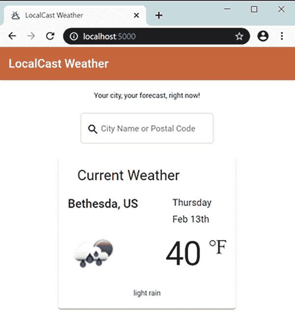

    图 2.4：带有搜索字段的 LocalCast 天气应用

如果没有发生错误，我们可以开始添加 `FormControl` 元素并将它们连接到搜索端点。

## 向天气服务添加搜索选项

到目前为止，我们通过传递参数使用城市名称和国家代码来获取天气。通过允许用户输入邮政编码，我们必须使我们的服务在接受这两种类型的输入时更加灵活。

OpenWeatherMap 的 API 接受 URI 参数，因此我们可以使用 TypeScript 的 **联合类型** 和 **类型守卫** 重构现有的 `getCurrentWeather` 函数。

这意味着我们可以在保留类型检查的同时提供不同的参数：

1.  在 `weather.service.ts` 中重构 `getCurrentWeather` 函数以处理 `zip` 和 `city` 输入：

    ```js
    **src/app/weather/weather.****service****.****ts**
      getCurrentWeather(
        search: string | number, 
        country?: string
      ): Observable<ICurrentWeather> { 
        let uriParams = new HttpParams()
        if (typeof search === 'string') { 
          uriParams = uriParams.set('q',
            country ? `${search},${country}` : search
          )
        } else {
          uriParams = uriParams.set('zip', 'search')
        }

        uriParams = uriParams.set('appid', environment.appId)
        return this.httpClient
          .get<ICurrentWeatherData>(
            `${environment.baseUrl}api.openweathermap.org/data/2.5/
              weather`,
            { params: uriParams } 
        )
        .pipe(map(
          data => this.transformToICurrentWeather(data)))
      } 
    ```

    我们将 `city` 参数重命名为 `search`，因为它可以是城市名称或邮政编码。然后我们允许其类型为 `string` 或 `number`，并且根据运行时类型，我们将使用 `q` 或 `zip`。我们还使 `country` 可选，并且仅在它存在时将其附加到查询中。

    `getCurrentWeather` 现在已经嵌入业务逻辑，因此是单元测试的良好目标。遵循 SOLID 原则中的单一职责原则，我们将重构 HTTP 调用到其自己的函数 `getCurrentWeatherHelper`。

    如果你对 SOLID 原则不熟悉，我在第三章“构建企业应用”的敏捷工程最佳实践部分进行了介绍。如果你想现在了解更多关于它的信息，请参阅维基百科条目：[`en.wikipedia.org/wiki/SOLID`](https://en.wikipedia.org/wiki/SOLID)。

1.  将 HTTP 调用重构为 `getCurrentWeatherHelper`。

    在下一个示例中，请注意使用反引号字符 `` ` `` 而不是单引号字符 `'`，这利用了模板字面量的功能，允许在 JavaScript 中嵌入表达式：

    ```js
    **src/app/weather/weather.****service****.****ts**
      getCurrentWeather(
        search: string | number, 
        country?: string
      ): Observable<ICurrentWeather> { 
        let uriParams = new HttpParams()
        if (typeof search === 'string') { 
          uriParams = uriParams.set('q',
            country ? `${search},${country}` : search
          )
        } else {
          uriParams = uriParams.set('zip', 'search')
        }

        **return****this****.****getCurrentWeatherHelper****(uriParams)**
      }
      private getCurrentWeatherHelper(uriParams: HttpParams):
        Observable<ICurrentWeather> { 
        uriParams = uriParams.set('appid', environment.appId)
        return this.httpClient
          .get<ICurrentWeatherData>(
            `${environment.baseUrl}api.openweathermap.org/data/2.5/
              weather`,
            { params: uriParams } 
          )
          .pipe(map(
            data => this.transformToICurrentWeather(data)))
        } 
    ```

    作为积极的副作用，`getCurrentWeatherHelper` 遵循 SOLID 的开闭原则。毕竟，它可以通过提供不同的 `uriParams` 来扩展函数的行为，并且由于它不需要经常更改，因此它是封闭的。

    为了演示这一点，让我们实现一个新的函数来通过纬度和经度获取当前天气。

1.  实现 `getCurrentWeatherByCoords`：

    ```js
    **src/app/weather/weather.****service****.****ts**
    getCurrentWeatherByCoords(coords: Coordinates): Observable<ICurrentWeather> {
      const uriParams = new HttpParams()
          .set('lat', coords.latitude.toString())
          .set('lon', coords.longitude.toString())
      return this.getCurrentWeatherHelper(uriParams)
    } 
    ```

    如您所见，`getCurrentWeatherHelper` 的功能是可扩展的，而无需修改其代码。

1.  确保您更新 `IWeatherService` 以包含之前所做的更改：

    ```js
    **src/app/weather/weather.****service****.****ts**
    export interface IWeatherService {
      getCurrentWeather(
        search: string | number, country?: string
      ): Observable<ICurrentWeather>
      getCurrentWeatherByCoords(coords: Coordinates): Observable<ICurrentWeather>
    } 
    ```

由于遵循 SOLID 设计原则，我们使得对流程控制逻辑进行健壮的单元测试更加容易，并最终编写出对错误更具有弹性和更易于维护的代码。

## 实现搜索

现在，让我们将新的服务方法连接到输入字段：

1.  将 `citySearch` 更新为注入 `weatherService` 并订阅输入变化：

    ```js
    **src/app/city-search/city-search.****component****.****ts**
    import { WeatherService } from '../weather/weather.service'
    ...
    export class CitySearchComponent implements OnInit { 
      search = new FormControl()

      constructor(**private****weatherService****:** **WeatherService**) {}
      ...
      ngOnInit(): void { 
        **this****.****search****.****valueChanges****.****subscribe****()**
      } 
    ```

    目前我们正在将所有输入视为 `string`。用户输入可以是城市和邮编、城市和国家代码，或者邮编和国家代码，由逗号分隔。虽然城市或邮编是必需的，但国家代码是可选的。我们可以使用 `String.split` 函数来解析任何潜在的逗号分隔输入，然后使用 `String.trim` 从字符串的开始和结束处去除任何空白。然后我们通过迭代它们确保我们修剪字符串的所有部分。

    我们然后使用三元运算符 `?:` 处理可选参数，只有当它存在时才传递值，否则将其留为未定义。

1.  实现搜索处理程序：

    ```js
    **src/app/city-search/city-search.****component****.****ts**
    this.search.valueChanges
      .subscribe(
        (searchValue: string) => { 
        if (searchValue) {
          const userInput = searchValue.split(',').map(s => s.trim())
          this.weatherService.getCurrentWeather(
            userInput[0],
            userInput.length > 1 ? userInput[1] : undefined
          ).subscribe(data => (console.log(data)))
      }
    }) 
    ```

1.  在输入字段下方为用户添加提示，告知他们关于可选的国家功能：

    ```js
    **src/app/city-search/city-search.component.html**
    ...
      <mat-form-field appearance="outline">
        ...
        **<****mat-hint****>****Specify country code like 'Paris, US'****</****mat-hint****>**
      </mat-form-field>
    ... 
    ```

在这一点上，订阅处理程序将调用服务器并将输出记录到控制台。

使用 Chrome DevTools 观察这个工作原理。注意 `search` 函数运行的频率，并且我们没有处理服务错误。

## 使用节流/防抖限制用户输入

我们目前在每个按键敲击时都会向服务器提交一个请求。这不是理想的行为，因为它可能导致糟糕的用户体验和电池寿命消耗，从而在客户端和服务器端都造成网络请求浪费和性能问题。用户会犯拼写错误；他们可能会改变他们输入的内容，而且信息输入的前几个字符很少能产生有用的结果。

我们仍然可以监听每个按键敲击，但不必对每个敲击做出反应。通过利用 `throttle`/`debounce`，我们可以限制生成的事件数量到一个预定的间隔，并保持按搜索功能。

注意，`throttle` 和 `debounce` 并不是功能等效的，它们的行为会因框架而异。除了节流之外，我们还期望捕获用户最后输入的内容。在 `lodash` 框架中，`throttle` 函数满足这一要求，而在 `RxJS` 中，`debounce` 函数满足这一要求。

使用 `RxJS/debounceTime` 很容易将节流注入到可观察流中。使用 `pipe` 实现 `debounceTime`：

```js
**src/app/city-search/city-search.****component****.****ts**
import { debounceTime } from 'rxjs/operators'
  this.search.valueChanges
    .pipe(debounceTime(1000))
    .subscribe(...) 
```

`debounceTime` 最多每秒运行一次搜索，但用户停止输入后也会运行另一个搜索。相比之下，`RxJS/throttleTime` 只会在每秒的第二次运行搜索，并且不一定捕获用户可能输入的最后几个字符。

RxJS 还提供了 `throttle` 和 `debounce` 函数，你可以使用这些函数来实现自定义逻辑，以限制非基于时间的输入。

由于这是一个基于时间和事件的函数，断点调试不可行。你可以在 **Chrome Dev Tools | Network** 选项卡中监控网络调用，但要更实时地了解你的搜索处理程序被调用的频率，可以添加一个 `console.log` 语句。

在代码中检查时，不要使用带有活动 `console.log` 语句。这些调试语句使得实际代码难以阅读，从而增加了维护成本。即使调试语句被注释掉了，也不要检查它们。

## 输入验证和错误消息

`FormControl` 非常可定制。它允许你设置默认的初始值，添加验证器，或者监听 `blur`、`change` 和 `submit` 事件，如下所示：

```js
**example**
new FormControl('Bethesda', { updateOn: 'submit' }) 
```

我们不会用值初始化 `FormControl`，但我们需要实现一个验证器来禁止单字符输入：

1.  从 `@angular/forms` 中导入 `Validators`：

    ```js
    **src/app/city-search/city-search.****component****.****ts**
    import { FormControl, Validators } from '@angular/forms' 
    ```

1.  修改 `FormControl` 以添加最小长度验证器：

    ```js
    **src/app/city-search/city-search.****component****.****ts**
    search = new FormControl('', [Validators.minLength(2)]) 
    ```

1.  修改模板以在提示文本下方显示验证错误消息：

    ```js
    **src/app/city-search/city-search.component.html**
    ...
    <form **style****=****"margin-bottom: 32px"**>
      <mat-form-field appearance="outline">
        ...
        @if (search.invalid) {
          **<****mat-error****>**
            **Type more than one character to search**
          **</****mat-error****>**
        }
      </mat-form-field>
    </form>
    ... 
    ```

    注意添加了一些额外的边距，以便为长错误消息腾出空间。

    如果你正在处理不同类型的错误，模板中的 `hasError` 语法可能会变得重复。你可能想实现一个更可扩展的解决方案，可以通过代码进行定制，如下所示：

    ```js
    **example**
    @if (search.invalid) {
      <mat-error>
        {{getErrorMessage()}}
      </mat-error>
    }
    getErrorMessage() {
      return this.search.hasError('minLength') ?
        'Type more than one character to search' : '';
    } 
    ```

1.  修改 `search` 函数，使其在输入无效时不执行搜索，替换现有 `if` 语句中的条件：

    ```js
    **src/app/city-search/city-search.****component****.****ts**
    this.search.valueChanges
      .pipe(debounceTime(1000))
      .subscribe((search Value: string) => {
        if (**!****this****.****search****.****invalid**) {
          ... 
    ```

我们可以调用 `this.search.invalid` 来利用验证引擎进行更健壮的检查，而不是简单地检查 `searchValue` 是否已定义且不是空字符串。

目前，我们已经完成了 `search` 功能的实现。接下来，让我们探讨一个假设场景，看看模板驱动的表单实现会是什么样子。

### 带有双向绑定的模板驱动表单

与响应式表单相比，另一种选择是模板驱动表单。如果你熟悉 AngularJS 中的 `ng-model`，你会发现新的 `ngModel` 指令是与它兼容的 API 替代品。

在幕后，`ngModel`实现了`FormControl`，它会自动附加到`FormGroup`。`ngModel`可以在`<form>`级别或单个`<input>`级别使用。你可以在[`angular.dev/api/forms/NgModel`](https://angular.dev/api/forms/NgModel)了解更多关于`ngModel`的信息。

在 GitHub 上 LocalCast Weather 应用程序仓库的`stage6`示例代码中，我已在`app.component.ts`中包含了一个名为`<app-city-search-tpldriven>`的模板驱动组件，它被渲染在`<div class="example">`下。你可以尝试这个组件，看看替代的模板实现是什么样的：

```js
**projects/stage6/src/app/city-search-tpldriven/city-search-tpldriven.component.html**
  ...
    <input matInput aria-label="City or Zip"
      [(ngModel)]="model.search"
      (ngModelChange)="doSearch($event)" minlength="2" 
      name="search" #search="ngModel">
  ...
    @if(search.invalid) {
      <mat-error>
        Type more than one character to search
      </mat-error>
    }
  ... 
```

注意使用`ngModel`时使用的`[()]`“香蕉箱”双向绑定语法。

组件之间的差异是这样实现的：

```js
**projects/stage6/src/app/city-search-tpldriven/city-search-tpldriven.****component****.****ts**
import { WeatherService } from '../weather/weather.service'
export class CitySearchTpldrivenComponent { 
  model = {
    search: '',
  }
  constructor(private weatherService: WeatherService) {}

  doSearch(searchValue) {
    const userInput = searchValue.split(',').map(s => s.trim())
    this.weatherService
      .getCurrentWeather(userInput[0], userInput.length > 1 ?
        userInput[1] : undefined
      )
      .subscribe(data => console.log(data))
  }
} 
```

如你所见，大部分逻辑都是在模板中实现的；因此，你需要保持对模板和控制器的一个活跃的心理模型。任何对事件处理程序和验证逻辑的更改都需要你在两个文件之间来回切换。

此外，我们失去了输入限制和防止在输入无效时调用服务的能力。虽然仍然可以实施这些功能，但它们需要复杂的解决方案，并且无法很好地适应新的 Angular 语法和概念。

总体来说，我不推荐使用模板驱动的表单。可能有一些情况下使用“香蕉箱”语法非常方便。然而，这为其他团队成员复制相同的模式在应用程序中设定了一个不好的先例。

# 使用 BehaviorSubject 与组件进行交互

为了更新当前的天气信息，我们需要`citySearch`组件与`currentWeather`组件进行交互。在 Angular 中，有四种主要的技术来实现组件间的交互：

+   全局事件

+   父组件监听从子组件冒泡上来的信息

+   在一个基于相似数据流的模块中，兄弟、父或子组件

+   父组件向子组件传递信息

让我们在接下来的章节中详细探讨它们。

## 全局事件

这种技术在编程的早期就已经被利用了。在 JavaScript 中，你可能通过全局函数代理或 jQuery 的事件系统实现了这一点。在 AngularJS 中，你可能创建了一个服务并在其中存储变量。

在 Angular 中，你仍然可以创建根级别的服务，在其中存储值，使用 Angular 的`EventEmitter`类（它旨在用于指令），或者使用`RxJS/Subscription`为自己创建一个花哨的消息总线。

作为一种模式，全局事件容易受到滥用，并且它们不仅不能帮助维护解耦的应用架构，反而随着时间的推移导致全局状态。全局状态或控制器级别的本地状态，其中函数在任意给定的类中读写变量，是编写可维护和可单元测试的软件的头号敌人。

最终，如果您在一个服务中存储所有应用程序数据或路由所有事件以启用组件交互，那么您只是在发明一个更好的捕鼠器。随着时间的推移，单个服务会变得庞大而复杂。这会导致不可预见的错误、由于无意中修改了无关数据而产生的副作用、由于先前视图中的数据无法丢弃而持续增加的内存使用，以及由于存储了应用程序中无关组件的数据而导致的低内聚。过度使用服务是一种应该不惜一切代价避免的反模式。在后面的章节中，您会发现，本质上，我们仍然会使用服务来启用组件交互；然而，我想指出，在允许解耦的灵活架构和全球或集中式解耦方法之间存在着一条细线，后者扩展性不佳。

## 使用事件发射器的子父关系

您的子组件应该完全不知道其父组件。这是创建可重用组件的关键。

我们可以通过利用`AppComponent`作为父元素，让`AppComponent`控制器协调数据来实现`CitySearchComponent`和`CurrentWeatherComponent`之间的通信。

*立即提交您的代码!* 在接下来的两节中，您将进行代码更改，这些更改您将需要丢弃。

让我们看看这个实现将如何呈现：

1.  `CitySearchComponent`通过一个`@Output`属性暴露`EventEmitter`：

    ```js
    **src/app/city-search/city-search.****component****.****ts**
    import { Component, OnInit, Output, EventEmitter } from '@angular/core'
    export class CitySearchComponent implements OnInit {
      @Output() searchEvent = new EventEmitter<string>()
      ...
      this.search.valueChanges
        .pipe(debounceTime(1000))
        .subscribe((search Value: string) => {
          if (!this.search.invalid) {
            this.searchEvent.emit(searchValue)
          }
        })
      ...
    } 
    ```

1.  `AppComponent`消费这些数据并调用`weatherService`，设置`currentWeather`变量：

    ```js
    **src/app/app.****component****.****ts**
    import { WeatherService } from './weather/weather.service'
    import { ICurrentWeather } from './interfaces'
    ...
    template: `
      ...
        <app-city-search (searchEvent)="doSearch($event)">
        </app-city-search>
      ...
    `,
    export class AppComponent { 
      currentWeather: ICurrentWeather 
      constructor(private weatherService: WeatherService) { }
      doSearch(searchValue) {
        const userInput = searchValue.split(',').map(
          s => s.trim()) 
        this.weatherService
          .getCurrentWeather(
            userInput[0], userInput.length > 1 ?
            userInput[1] : undefined
        )
        .subscribe(data => this.currentWeather = data)
      }
    } 
    ```

注意，我们使用括号语法绑定到`searchEvent`。`$event`变量自动捕获事件输出并将其传递到`doSearch`方法。

我们成功地将信息冒泡到父组件，但我们也必须能够将其传递到`CurrentWeatherComponent`。

## 使用输入绑定的父子关系

根据定义，父组件将知道它正在与哪些子组件一起工作。由于`currentWeather`属性绑定到`CurrentWeatherComponent`上的`current`属性，结果会向下传递以供显示。这是通过创建一个`@Input`属性来实现的：

```js
**src/app/current-weather/current-weather.****component****.****ts**
import { Component, **Input** } from '@angular/core'
...
export class CurrentWeatherComponent { 
  **@Input****()** current: ICurrentWeather
  ...
} 
```

注意，`CurrentWeatherComponent`的`ngOnInit`函数现在已不再必要，可以删除。

然后，您可以更新`AppComponent`以将数据绑定到当前天气：

```js
**src/app/app.****component****.****ts**
template: `
  ...
  <app-current-weather **[current]="currentWeather"**>
  </app-current-weather>
  ...
` 
```

到目前为止，您的代码应该可以正常工作！尝试搜索一个城市。如果`CurrentWeatherComponent`更新，那么就成功了！

事件发射器到输入绑定的方法适用于您正在创建紧密耦合的组件或用户控件，并且子组件没有消费任何外部数据的情况。一个很好的示例可能是向`CurrentWeatherComponent`添加预测信息，如下所示：


图 2.5：天气预报线框图

每周每一天都可以实现为一个使用`@for`重复的组件，并且对于`CurrentWeatherComponent`来说，检索并将此信息绑定到其子组件是完全合理的：

```js
**example**
@for (dailyForecast of forecastArray; track dailyForecast) {
  <app-mini-forecast [forecast]="dailyForecast">
  </app-mini-forecast>
} 
```

通常，如果你正在处理数据驱动的组件，父-子或子-父通信模式会导致一个不灵活的架构，这使得重用或重新排列你的组件变得困难。一个紧密耦合的好例子是我们将`WeatherService`导入到`app.component.ts`中。请注意，`AppComponent`不应该知道`WeatherService`；它的唯一任务是布局几个组件。鉴于不断变化的企业需求和设计，这是一个需要记住的重要教训。

在继续之前，*丢弃两个部分的更改*。我们将实现一个替代解决方案。

接下来，我们将介绍一种更好的方法，让两个组件在不引入与`subject`额外耦合的情况下相互交互。

## 与`subject`的兄弟交互

组件交互的主要原因是为了发送或接收由用户提供或从服务器接收的数据更新。在 Angular 中，你的服务暴露`RxJS/Observable`端点，这些是组件可以订阅的数据流。`RxJS/Observer`作为`RxJS/Observable`事件的消费者，补充了`RxJS/Observable`。`RxJS/Subject`将这两种功能结合在一个易于使用的包中。

你可以用`subject`来本质上描述属于特定数据集的流，例如正在显示的当前天气数据：

```js
**example**
import { Subject } from 'rxjs'
...
export class WeatherService implements IWeatherService { 
  currentWeather$: Subject<ICurrentWeather>
  ...
} 
```

`currentWeather$`仍然是一个数据流，并不简单地代表一个数据点。你可以使用`subscribe`来订阅`currentWeather$`数据的变化，或者你可以使用`next`来发布对其的变化，如下所示：

```js
**example**
currentWeather$.subscribe(data => (this.current = data))
  currentWeather$.next(newData) 
```

注意`currentWeather$`属性的命名约定，它以`$`结尾。这是可观察属性的命名约定。

`Subject`的默认行为非常类似于通用的发布/订阅机制，例如 jQuery 事件。然而，在一个异步世界中，组件以不可预测的方式加载或卸载，使用默认的`Subject`并不是非常有用。

存在三种高级的`subject`变体：

+   `ReplaySubject`会记住并缓存数据流中发生的数据点，以便订阅者可以在任何给定时间回放旧事件。

+   `BehaviorSubject`在监听新数据点时只记住最后一个数据点。

+   `AsyncSubject`用于一次性事件，这些事件预计不会再次发生。

`ReplaySubject` 可能会对你的应用程序的内存和性能产生严重影响，因此应谨慎使用。在 `CurrentWeatherComponent` 的情况下，我们只对显示接收到的最新天气数据感兴趣，但通过用户输入或其他事件，我们愿意接收新数据以保持 `CurrentWeatherComponent` 的更新。`BehaviorSubject` 将是满足这些需求适当的机制：

1.  将 `currentWeather$` 作为只读属性添加到 `IWeatherService`：

    ```js
    **src/app/weather/weather.****service****.****ts**
    import { BehaviorSubject, Observable } from 'rxjs'
    export interface IWeatherService {
      **readonly****currentWeather$****:** **BehaviorSubject****<****ICurrentWeather****>**
      ...
    } 
    ```

    `currentWeather$` 被声明为只读，因为其 `BehaviorSubject` 不应重新分配。它是我们的数据锚点或引用，而不是数据本身的副本。任何对值的更新都应该通过在属性上调用 `next` 函数来发送。

1.  在 `WeatherService` 中定义 `BehaviorSubject` 并设置默认值：

    ```js
    **src/app/weather/weather.****service****.****ts**
    ...
    export class WeatherService implements IWeatherService {
      readonly currentWeather$ =
        new BehaviorSubject<ICurrentWeather>({ 
        city: '--',
        country: '--',
        date: Date.now(),
        image: '',
        temperature: 0,
        description: '',
      })
    ...
    } 
    ```

1.  添加一个名为 `updateCurrentWeather` 的新函数，该函数将触发 `getCurrentWeather` 并更新 `currentWeather$` 的值：

    ```js
    **src/app/weather/weather.****service****.****ts**
    ...
    updateCurrentWeather(search: string | number, 
      country?: string): void { 
      this.getCurrentWeather(search, country)
        .subscribe(weather => 
          this.currentWeather$.next(weather)
        )
    }
    ... 
    ```

1.  使用新函数更新 `IWeatherService` 以使其如下所示：

    ```js
    **src/app/weather/weather.****service****.****ts**
    ...
    export interface IWeatherService {
      readonly currentWeather$: BehaviorSubject<ICurrentWeather> 
      getCurrentWeather(city: string | number, country?: string):
        Observable<ICurrentWeather>
      getCurrentWeatherByCoords(coords: Coordinates):
        Observable<ICurrentWeather>
        **updateCurrentWeather****(**
          **search****:** **string** **|** **number****, country?:** **string **    **):** **void**
    } 
    ```

1.  更新 `CurrentWeatherComponent` 以订阅新的 `BehaviorSubject`：

    ```js
    **src/app/current-weather/current-weather.****component****.****ts**
    ...
      ngOnInit() { 
        this.weatherService.currentWeather$
          .subscribe(data => (this.current = data))
      }
    ... 
    ```

1.  在 `CitySearchComponent` 中，更新 `getCurrentWeather` 函数调用以利用新的 `updateCurrentWeather` 函数：

    ```js
    **src/app/city-search/city-search.****component****.****ts**
    ...
      this.weatherService.**updateCurrentWeather**( 
        userInput[0],
        userInput.length > 1 ? userInput[1] : undefined
      )
    ... 
    ```

1.  在浏览器中测试你的应用程序；它应该如下所示：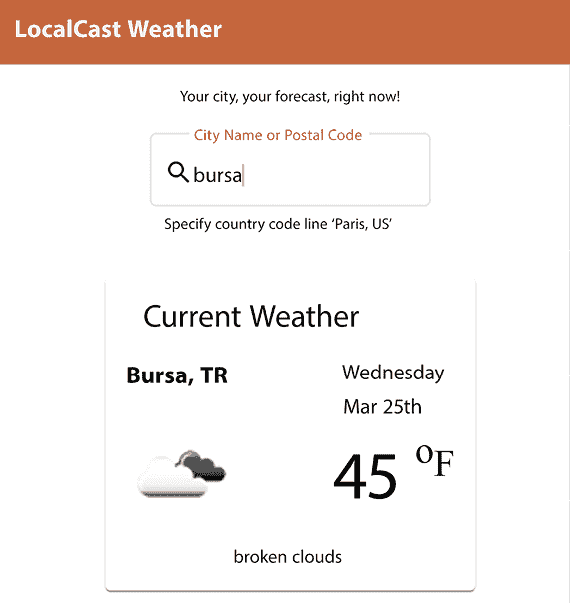

    图 2.6：土耳其布尔萨的天气信息

当你输入一个新城市时，组件应该更新以包含该城市的当前天气信息。我们可以将 **添加城市搜索功能...** 任务移动到 **完成** 列，如图所示在我们的看板板上：

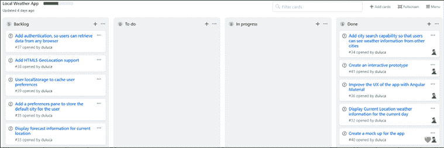

图 2.7：GitHub 项目看板板状态

我们有一个功能齐全的应用程序。然而，我们在处理 `currentWeather$` 订阅的方式中引入了内存泄漏。在下一节中，我们将回顾内存泄漏是如何发生的，以及如何通过使用 `first` 和 `takeUntilDestroyed` 操作来完全避免它们。

# 管理订阅

订阅是读取数据流中值以供应用程序逻辑使用的一种便捷方式。如果未管理，它们可以在你的应用程序中创建内存泄漏。一个泄漏的应用程序将消耗越来越多的 RAM，最终导致浏览器标签页无响应，导致对你的应用产生负面印象，甚至更糟的是，可能的数据丢失，这可能会让最终用户感到沮丧。

内存泄漏的源头可能不明显。在 `CurrentWeatherComponent` 中，我们注入 `WeatherSevice` 以访问 `BehaviorSubject` 的 `currentWeather$` 值。如果我们管理不当 `currentWeather$` 订阅，我们可能会在组件或服务中产生泄漏。

## 服务的生命周期

默认情况下，Angular 服务是自动注册到**根提供者**的**共享实例服务**或单例。这意味着一旦在内存中创建，只要它们所属的应用程序或功能模块仍然在内存中，它们就会被保留。请参见以下共享实例服务的示例：

```js
@Injectable({
  **providedIn****: 'root'**
})
export class WeatherService implements IWeatherService
... 
```

从实际的角度来看，这意味着你应用程序中的大多数服务将存在于应用程序的生命周期内。然而，组件的生命周期可能要短得多，或者可能会有多个相同组件的实例被反复创建。

此外，还有一些用例需要组件自己的实例或服务的副本（例如，缓存表单输入的值或同时显示不同城市的天气）。要创建**多个实例服务**，请参见下面的示例：

```js
@Injectable()
export class WeatherService implements IWeatherService
... 
```

然后，您将为该服务提供一个**组件提供者**：

```js
@Component({
  selector: 'app-current-weather',
  standalone: true,
  **providers****: [****WeatherService****]**
})
export class CurrentWeatherComponent {
... 
```

在这种情况下，当组件被销毁时，服务也会被销毁。但这并不是防止内存泄漏的保护措施。如果我们没有仔细管理长生命期和短生命期对象之间的交互，我们可能会在对象之间留下悬挂引用，从而导致内存泄漏。

## 内存泄漏的揭露

当我们订阅`currentWeather$`时，我们将其附加到一个事件处理器上，以便`CurrentWeatherComponent`可以响应推送到`BehaviorSubject`的值变化。当组件需要被销毁时，这会带来问题。

在像 JavaScript 这样的管理语言中，内存由垃圾回收器（GC）管理，而不是像在 C 或 C++这样的非管理语言中那样手动分配和释放内存。在非常高的层面上，GC 定期扫描堆栈中其他对象未引用的对象。

如果发现某个对象被取消引用，那么它占用的堆栈空间可以被释放。然而，如果一个未使用的对象仍然引用另一个仍在使用的对象，它就不能被垃圾回收。GC 不是魔法，不能读我们的心思。当一个对象未使用且无法被解除分配时，只要你的应用程序在运行，该对象占用的内存就永远不能用于其他目的。这被认为是内存泄漏。

我的同事 Brendon Caulkins 提供了一个有用的类比：

> 想象浏览器的内存空间就像一个停车场；每次我们分配一个值或创建一个订阅时，我们就在这个停车场停车。如果我们不小心丢弃了一辆车，我们仍然会留下停车位被占用；其他人无法使用它。如果浏览器中的所有应用程序都这样做，或者我们反复这样做，你可以想象停车场会很快填满，我们永远无法运行我们的应用程序。

接下来，让我们看看我们如何确保我们不把车留在停车场里。

## 取消订阅

订阅或事件处理器会创建对其他对象的引用，例如从短生命周期的组件到长生命周期的服务。诚然，在我们的情况下，`CurrentWeatherComponent`也是一个单例，但如果我们向应用程序添加更多功能，在页面之间导航或同时显示多个城市的天气，这可能会改变。如果我们不取消`currentWeather$`的订阅，那么`CurrentWeatherComponent`的任何实例都会卡在内存中。我们在`ngOnInit`中订阅，所以我们必须在`ngOnDestroy`中取消订阅。`ngOnDestroy`是在 Angular 确定框架不再使用组件时被调用的。

让我们看看以下示例代码中如何取消订阅订阅的例子：

```js
**example**
import { ..., OnDestroy } from '@angular/core'
import { ..., Subscription } from 'rxjs'
export class CurrentWeatherComponent implements OnInit, OnDestroy { 
  currentWeatherSubscription: Subscription
  ...
  ngOnInit() { 
    this.currentWeatherSubscription =
      this.weatherService.currentWeather$
        .subscribe((data) => (this.current = data))
  }
  ngOnDestroy(): void {
    this.currentWeatherSubscription.unsubscribe()
  }
... 
```

首先，我们需要为组件实现`OnDestroy`接口。然后，我们将`ngOnInit`更新为将订阅存储在名为`currentWeatherSubscription`的属性中。最后，在`ngOnDestroy`中，我们可以调用`unsubscribe`方法。

如果我们的组件被销毁，它将不再导致内存泄漏。然而，如果我们在一个组件中有多个订阅，这会导致大量的繁琐编码。

注意，在`CitySearchComponent`中，我们订阅了`FormControl`对象的`valueChanges`事件。我们不需要管理此事件的订阅，因为`FormControl`是我们组件的子对象。当父组件从所有对象中取消引用时，所有其子对象都可以安全地被 GC 收集。

订阅数据流中的值本身可以被认为是一种反模式，因为您将编程模型从响应式切换到命令式。但当然，我们必须至少订阅一次以激活数据流。在下一节中，我们将介绍如何确保在订阅时不会泄漏内存。

## 使用 first 或 takeUntilDestroyed 进行订阅

默认情况下，可观察流不会结束。鉴于 RxJS 在每次 Angular 操作中都根深蒂固，这很少是期望的结果。在订阅资源时，我们可以应用两种常见的策略，以确保流可以可预测地完成，并且不会导致内存泄漏。

第一种策略，嗯，就是第一种方法。观察`WeatherService`中的`updateCurrentWeather`方法：

```js
**src/app/weather/weather.****service****.****ts**
import { map, switchMap, first } from 'rxjs/operators' 
export class WeatherService implements IWeatherService{
  ...
    updateCurrentWeather(searchText: string, country?: string): void {
      this.getCurrentWeather(searchText, country)
        .pipe(first())
        .subscribe((weather) => this.currentWeather$.next(weather))
    }  
  ... 
```

在上面的例子中，我们的目的是获取当前天气并将其显示出来——并且只在每个请求中这样做一次。通过将一个`first()`调用管道输入到可观察流中，我们指示 RxJS 在接收到一个结果后完成流。这样，当正在 GC（垃圾回收）使用此流的资源时，相关的 RxJS 对象不会引起泄漏。

第二种策略是`takeUntilDestroyed`。对于将更新多次的组件，`first()`策略没有意义。例如`CurrentWeatherComponent`可以在用户输入新的搜索文本后更新，因此我们希望在组件存在期间接收更新。请看以下示例：

```js
**src/app/current-weather/current-weather.****component****.****ts**
import { takeUntilDestroyed } from '@angular/core/rxjs-interop'
export class CurrentWeatherComponent implements OnInit {
  private destroyRef = inject(DestroyRef);
  ...
  ngOnInit(): void {
    this.weatherService
      .getCurrentWeather('Bethesda', 'US')
      .pipe(takeUntilDestroyed(this.destroyRef))
      .subscribe((data) => (this.current = data))
  }
  ... 
```

`takeUntilDestroyed`只能在注入器上下文中使用，即构造函数中。当在生命周期钩子调用（如`ngOnInit`）中使用它时，我们必须注入`DestroyRef`并将其传递到函数中。它会自动注册自己，因此当组件被销毁时，它会完成流。这样，组件可以在需要时接收消息，但没有任何内存泄漏的风险。

通过应用这些方法与`subscribe`方法一起，我们不必依赖于难以追踪的取消订阅方法，并且我们可以通过快速搜索单词`subscribe`来轻松验证它们的实现。

最好的部分是完全没有。接下来，让我们看看我们如何在不订阅的情况下消费一个可观察组件。

# 在响应式范式下编码

如在*第一章*，*Angular 的架构和概念*中所述，我们应仅订阅可观察流以激活它。如果我们将`subscribe`函数视为事件处理器，我们就以命令式的方式实现我们的代码。

在你的代码库中看到除了空的`subscribe()`调用以外的任何内容都应该被视为一个红旗，因为它偏离了响应式范式。

在响应式编程中，当你在一个响应式流中订阅一个事件时，你将你的编码范式从响应式编程转换为命令式编程。在我们的应用程序中有两个地方我们进行了订阅，一个在`CurrentWeatherComponent`中，另一个在`CitySearchComponent`中。

让我们从修复`CurrentWeatherComponent`开始，这样我们就不会混淆范式。

## 使用异步管道绑定到可观察值

从一开始设计，Angular 就被设计成一个异步框架。你可以通过保持响应式范式来充分利用 Angular。一开始这样做可能会感觉不自然，但 Angular 提供了你需要的所有工具，让你无需切换到命令式编程就能将应用程序的当前状态反映给用户。

你可以在模板中使用`async`管道来反映可观察值的当前值。让我们更新`CurrentWeatherComponent`以使用`async`管道：

1.  首先，将`current: ICurrentWeather`替换为一个可观察属性：

    ```js
    current$: Observable<ICurrentWeather> 
    ```

1.  在构造函数中，将`weatherService.currentWeather$`分配给`current$`：

    ```js
    **src/app/current-weather/current-weather.****component****.****ts**
    import { Observable } from 'rxjs'
    export class CurrentWeatherComponent {
      current$: Observable<ICurrentWeather>
      constructor(private weatherService: WeatherService) {
        this.current$ = this.weatherService.currentWeather$
      }
      ... 
    ```

1.  删除所有与`SubSink`、`ngOnInit`和`ngOnDestroy`相关的代码。

1.  更新模板以便你可以绑定到`current$`：

    ```js
    **src/app/current-weather/current-weather.****component****.****html**
    @if (current$ | async; as current) {
      <div> ... </div>
    } 
    ```

    `async`管道会自动订阅`current$`的当前值，并将其作为`current`变量提供给模板以进行命令式使用。这种方法的优点是`async`管道隐式地管理订阅，因此你不必担心取消订阅。

1.  删除不再需要的`@else { <div>no data</div> }`块，因为`BehaviorSubject`总是初始化的。

到目前为止，响应式范式已经使我们能够简化并清理我们的代码。

异步管道允许您使用简单的`if-else`逻辑显示加载消息。要显示在您的可观察对象解析时的消息，请参阅以下技术：

```js
`example`
@if (current$ | async; as current) {
  <div>{{current}}</div>
} @else {
  <div>Loading…</div>
} 
```

接下来，让我们进一步改进我们的代码。

## 捕获可观察的数据流

当触发`search`函数时，`CitySearchComponent`在`subscribe`语句中实现了一个回调。这导致了一种命令式编程风格和思维模式。切换编程范式时的危险在于，您可以通过更容易地存储状态或创建错误来无意中引入代码库中的副作用。

让我们将`CitySearchComponent`重构为响应式函数式编程风格，如下例所示：

```js
**src/app/city-search/city-search.****component****.****ts**
import { debounceTime, **filter, tap** } from 'rxjs/operators'
import { **takeUntilDestroyed** } from '@angular/core/rxjs-interop'
export class CitySearchComponent {
  search = new FormControl('', 
    [**Validators****.****required**, Validators.minLength(2)])
  constructor(private weatherService: WeatherService) { 
    **this****.****search****.****valueChanges**
      **.****pipe****(**
        **takeUntilDestroyed****(),**
        **filter****(****() =>****this****.****search****.****valid****),**
        **debounceTime****(****1000****),**
        **tap****(****(****searchValue****:** **string****) =>****this****.****doSearch****(searchValue))**
        **takeUntilDestroyed()**
      **).****subscribe****()**
}
doSearch(searchValue: string) {
  const userInput = searchValue.split(',').map(s => s.trim())
  const searchText = userInput[0]
  const country = userInput.length > 1 ? userInput[1] : undefined
  this.weatherService.updateCurrentWeather(searchText, country)
}
} 
```

在前面的代码中，我们移除了`OnInit`实现并实现了我们的响应式过滤逻辑。`tap`操作符只有在`this.search`有效时才会被触发。

`constructor`仅应在处理类上下文内的属性和事件时使用。在这种情况下，搜索在定义时初始化，并且`valueChanges`只能由用户与组件的交互触发。因此，在`constructor`中设置订阅逻辑是可行的。

然而，如果您在模板中引用任何属性、`@Input`变量或注册外部服务调用，则必须使用`ngOnInit`。否则，您将遇到渲染错误或不可预测的行为。这是因为模板属性，包括`@Input`变量，直到`ngOnInit`被调用才可用。此外，外部服务调用可能在组件初始化之前返回响应，导致检测错误。

简而言之，99%的时间您应该使用`ngOnInit`。

此外，`doSearch`在函数式上下文中被调用，这使得在函数内部引用任何其他类属性变得非常困难。这减少了类状态影响我们函数结果的可能性。因此，`doSearch`是一个可组合的且可单元测试的函数，而在先前的实现中，以直接方式单元测试`ngOnInit`将非常具有挑战性。

注意，必须在对`valueChanges`调用`subscribe()`来激活可观察数据流。否则，不会触发任何事件。

我们不需要实现`ngOnInit`的事实反映了我们代码的真实异步性，它与应用程序的生命周期或状态无关。然而，您应该坚持使用`ngOnInit`作为一般最佳实践。

我们的重构完成后，应用程序应该与之前相同，但具有更少的样板代码。现在，让我们看看如何增强我们的应用程序以处理来自任何国家的邮政编码。

# 链接 API 调用

目前，我们的应用程序只能处理来自美国的 5 位数字邮政或邮编。例如，邮编 `22201` 可以通过简单的条件 `typeof search === 'string'` 与城市名称区分开来。然而，邮编在不同国家之间差异很大，英国就是一个很好的例子，其邮编如 `EC2R 6AB`。即使我们对每个国家的邮编格式有完美的理解，我们仍然不能确保用户没有输入一个轻微错误的邮编。今天的复杂用户期望网络应用程序对这类错误具有弹性。然而，作为网络开发者，我们不能期望手动编写一个通用的邮编验证服务。相反，在我们向 OpenWeatherMap API 发送请求之前，我们需要利用外部服务。让我们探索如何串联依赖彼此的连续 API 调用。

在本书的第一版出版后，我收到了一些热情的读者反馈，他们对示例应用程序只能支持美国邮编表示失望。我已经实现了这个功能，因为它展示了简单的请求如何引入您应用程序中的未计划复杂性。作为额外的好处，应用程序现在可以在全球范围内使用。

让我们添加一个新项目，**支持国际邮编**，并将其移动到**进行中**：

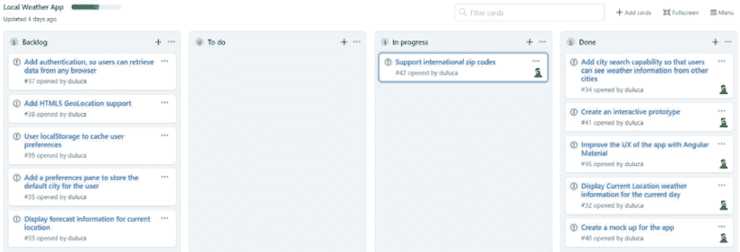

图 2.8：添加国际邮编故事

## 实现邮编服务

为了正确理解用户输入的是有效的邮编还是城市名称，我们必须依赖 [geonames.org](http://geonames.org) 提供的第三方 API 调用。让我们看看我们如何将二级 API 调用注入到我们应用程序的搜索逻辑中。

您需要在 [geonames.org](http://geonames.org) 上注册一个免费账户。之后，将用户名作为新参数存储在 `environment.ts` 和 `environment.prod.ts` 文件中。

您可以在 [`www.geonames.org/postal-codes`](https://www.geonames.org/postal-codes) 交互式地实验邮政编码 API。

我们需要实现一个符合以下接口的服务：

```js
interface IPostalCodeService {
  resolvePostalCode(postalCode: string): Observable<IPostalCode>
} 
```

在您最初设计应用程序时，声明服务接口是一种有用的实践。您和您的团队成员可以专注于提供正确的交互模型，而不会被实现细节所困扰。一旦您的接口定义完成，您就可以快速创建功能原型，并放置应用程序的行走骨架版本。原型化的函数有助于验证设计选择并鼓励组件之间的早期集成。一旦实施，团队成员就不再需要猜测他们是否在正确的位置编码。您应该始终导出接口，这样您就可以使用类型信息编写单元测试，创建测试替身或模拟。

接口是实践**测试驱动开发**（**TDD**）的关键。

现在按照以下示例实现 `PostalCodeService`：

你可以通过执行 `npx ng generate service postalCode --project=local-weather-app --no-flat` 来生成服务。

```js
**src/app/postal-code/postal-code.****service****.****ts**
import { HttpClient, HttpParams } from '@angular/common/http'
import { Injectable } from '@angular/core'
import { Observable } from 'rxjs'
import { defaultIfEmpty, flatMap } from 'rxjs/operators'
import { environment } from '../../environments/environment'
export interface IPostalCode {
  countryCode: string
  postalCode: string
  placeName: string
  lng: number
  lat: number
}
export interface IPostalCodeData { 
  postalCodes: [IPostalCode]
}
export interface IPostalCodeService {
  resolvePostalCode(postalCode: string): Observable<IPostalCode>
}
@Injectable({
  providedIn: 'root',
}) 
export class PostalCodeService implements IPostalCodeService {
  constructor(private httpClient: HttpClient) {}
  resolvePostalCode(postalCode: string): Observable<IPostalCode> {
    const uriParams = new HttpParams()
      .set('maxRows', '1')
      .set('username', environment.username)
      .set('postalcode', postalCode)
    return this.httpClient
      .get<IPostalCodeData>(
        `${environment.baseUrl}${environment.geonamesApi}.geonames.org/
          postalCodeSearchJSON`,
      { params: uriParams }
    )
    .pipe(
      flatMap(data => data.postalCodes), 
      defaultIfEmpty(null)
    )
  }
} 
```

注意新的环境变量 `environment.geonamesApi`。在 `environment.ts` 中将其值设置为 `api`，在 `environment.prod.ts` 中设置为 `secure`，这样 HTTPS 调用就可以正确工作，避免混合内容错误，如第十章 *使用 CI/CD 发布到生产* 中所述。

在前面的代码段中，我们实现了一个 `resolvePostalCode` 函数，该函数调用一个配置为接收 API 返回的第一个有效结果的 API。然后结果被展平并传递给订阅者。使用 `defaultIfEmpty`，我们确保如果没有从 API 收到结果，将提供一个 null 值。如果调用成功，我们将得到 `IpostalCode` 中定义的所有信息，这使得可以使用坐标调用 `getCurrentWeatherByCoords`。

## 使用 `switchMap` 进行可观察的序列化

让我们更新天气服务，使其能够调用 `postalCode` 服务以确定用户输入是否为有效的邮政编码：

1.  首先，更新接口，这样我们只处理字符串：

    ```js
    **src/app/weather/weather.****service****.****ts**
    …
    export interface IWeatherService {
    ...
      getCurrentWeather(search: **string**, country?: string): 
        Observable<ICurrentWeather>
      updateCurrentWeather(search: **string**, country?: string)
    } 
    ```

1.  将 `PostalCodeService` 注入到天气服务作为私有属性：

    ```js
    **src/app/weather/weather.****service****.****ts**
    import {
      PostalCodeService
    } from '../postal-code/postal-code.service'
    ...
    constructor(
      private httpClient: HttpClient,
      private postalCodeService: PostalCodeService
    ) {} 
    ```

1.  更新 `updateCurrentWeather` 方法的签名。

1.  更新 `getCurrentWeather` 以尝试将 `searchText` 解析为邮政编码：

    ```js
    **src/app/weather/weather.****service****.****ts**
    import { map, **switchMap** } from 'rxjs/operators'
    ... 
    getCurrentWeather(
      searchText: string,
      country?: string
    ): Observable<ICurrentWeather> {
      return this.postalCodeService.
        resolvePostalCode(searchText)
        .pipe(
          switchMap((postalCode) => {
            if (postalCode) {
              return this.getCurrentWeatherByCoords({
                latitude: postalCode.lat,
                longitude: postalCode.lng,
              } as Coordinates)
            } else {
              const uriParams = new HttpParams().set(
                'q',
                country ? `${searchText},${country}` : searchText
              )
              return this.getCurrentWeatherHelper(uriParams)
            }
         })
       )
    } 
    ```

如果你在将纬度和经度传递给 `getCurrentWeatherByCoords` 时遇到 TypeScript 问题，你可能需要使用 `as` 操作符来强制转换对象。因此，你的代码看起来会是这样：

```js
 return this.getCurrentWeatherByCoords({
   latitude: postalCode.lat,
   longitude: postalCode.lng,
 } as Coordinates) 
```

在前面的代码段中，我们的第一次调用是到 `postalCode` 服务。然后我们使用 `switchMap` 对数据流上发布的邮政编码做出反应。在 `switchMap` 内部，我们可以观察 `postalCode` 是否为 null，并做出适当的后续调用，要么通过坐标获取当前天气，要么通过城市名称获取。

现在，LocalCast 天气应该可以与全球邮政编码一起工作，如下面的截图所示：

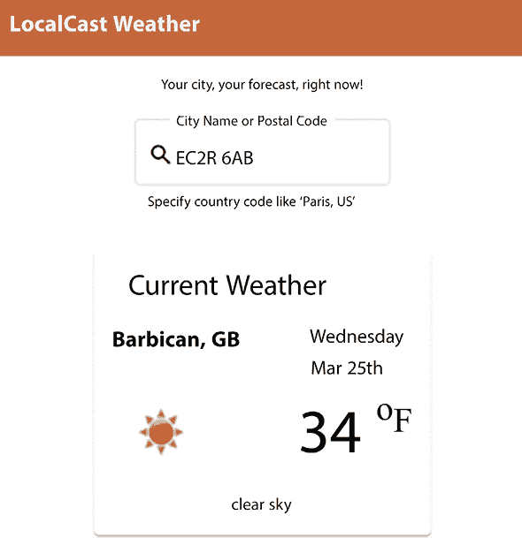

图 2.9：带有全球邮政编码的 LocalCast 天气

我们已经完成了国际邮政编码支持的实施。将其移动到你的看板上的 **完成** 列：

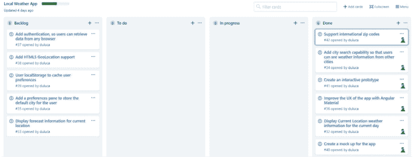

图 2.10：国际邮政编码支持完成

随着我们完成 LocalCast 天气应用程序的实现，仍有改进的空间。最初，由于显示的破折号和空字段，应用程序看起来损坏。至少有两种不同的方法来处理这个问题。第一种是在没有数据显示时，在 `AppComponent` 级别隐藏整个组件。为了使这可行，我们必须将 `WeatherService` 注入到 `AppComponent` 中，这最终导致了一个灵活性较低的解决方案。另一种方法是增强 `CurrentWeatherComponent`，使其能够更好地处理缺失的数据。

通过实现地理位置功能，您可以在启动应用程序时获取用户的当前位置的天气。您还可以利用 `window.localStorage` 在应用程序初始启动时存储最后显示的城市或从 `window.geolocation` 获取的最后位置。

我们完成了 LocalCast 天气应用程序的本地化，直到 *第九章*，*食谱 – 主/详细页面，数据表和 NgRx*，在那里我展示了像 NgRx 这样的状态存储与使用 `RxJS/BehaviorSubject` 相比的情况。

# 使用 Angular 信号

信号是一种反应原语，它跟踪其值随时间的变化。Angular 信号实现了这种原语，以细粒度同步应用程序状态与 DOM。通过关注状态中的细粒度变化以及仅相关的 DOM 节点，可以显著减少变更检测操作的数量和严重程度。如 *第一章*，*Angular 的架构和概念* 中所述，变更检测是 Angular 框架执行的最昂贵的操作之一。随着应用程序复杂性的增加，变更检测操作可能被迫遍历或更新 DOM 树的更大部分。随着应用程序中交互元素的数量的增加，变更检测事件发生的频率也会更高。应用程序的复杂性与事件频率的结合可能会引入重大的性能问题，导致应用程序渲染缓慢或断断续续。通常，对于这类问题没有快速的解决方案。因此，了解信号的工作原理并在您的应用程序中实现它们以避免昂贵的性能问题是至关重要的。

截至本次发布，Angular 信号处于预览阶段。这意味着功能集的功能和性能特征可能会发生变化。有关最新信息，请参阅以下指南：[`angular.dev/guide/signals`](https://angular.dev/guide/signals)。

Angular 信号提供了一些简单的函数来与之交互：

+   `signal`：一个值的包装器。它就像类中的值获取器或设置器一样工作，在概念上类似于 `BehaviorSubject` 的工作方式：

    ```js
    const mySignal = signal('Hello')
    console.log(mySignal()) // outputs: Hello (only once)
    mySignal.set('Goodbye') // updates the value. Update and mutate methods have subtle differences in setting a new value.
    // To display the new value, you must call console.log again. 
    ```

+   `computed`：一个计算信号。它利用一个或多个信号来修改结果：

    ```js
    const someSignal = computed(() => `${mySignal()}, World`)
    console.log(someSignal()) // outputs: Hello, World. If needed, it lazily updates when mySignal is set to a new value. 
    ```

+   `effect`：当信号发生变化时触发的事件：

    ```js
    effect(() => {
      console.log(`A robot says: ${someSignal}`) 
    })  
    // console.log will be called any time mySignal changes. 
    ```

信号是一个新的基础概念，它们改变了我们对可观察对象、数据绑定和组件之间状态同步的看法。它们性能出色，性质上具有手术性，而且最好，它们是内存安全的。这里没有订阅需要担心。

让我们从使用信号的一个简单示例开始。

## 实现深色模式

为了让我们的应用程序在技术人员眼中看起来很酷，我们必须为它实现一个深色模式。让我们使用信号来实现这个功能，并进一步通过在 `localStorage` 中记住用户的选择来更进一步：

```js
**src/app/app.****component****.****ts**
const darkClassName = 'dark-theme'
@Component({
  selector: 'app-root',
  standalone: true,
  imports: [...],
  template: `
    <mat-toolbar color="primary">
      <span data-testid="title">LocalCast Weather</span>
      <div fxFlex></div>
      <mat-icon>brightness_5</mat-icon>
      <mat-slide-toggle
        color="warn"
        data-testid="darkmode-toggle"
        [checked]="toggleState()"
        (change)="toggleState.set($event.checked)"></mat-slide-toggle>
      <mat-icon>bedtime</mat-icon>
    </mat-toolbar>
    <div fxLayoutAlign="center">
      <div class="mat-caption vertical-margin">
        Your city, your forecast, right now!
      </div>
    </div>
    <div fxLayoutAlign="center">
      <app-city-search></app-city-search>
    </div>
    <div fxLayout="row">
      <div fxFlex></div>
      <mat-card appearance="outlined" fxFlex="300px">
        <mat-card-header>
          <mat-card-title>
            <div class="mat-headline-5">Current Weather</div>
          </mat-card-title>
        </mat-card-header>
        <mat-card-content>
          <app-current-weather></app-current-weather>
        </mat-card-content>
      </mat-card>
      <div fxFlex></div>
    </div>
  `,
})
export class AppComponent {
  readonly toggleState = signal(localStorage.getItem(darkClassName) === 'true')
  constructor() {
    effect(() => {
      localStorage.setItem(darkClassName, this.toggleState().toString())
      document.documentElement.classList.toggle(
        darkClassName, this.toggleState()
      )
    })
  }
} 
```

如果这是生产代码，我不会使用这样简短的代码行：

```js
document.documentElement.classList.toggle(darkClassName, this. toggleState()) 
```

在这里，我希望将代码行数保持在最低，并且 DOM API 提供的切换函数包含了使这正确工作的逻辑。这一行应该重构以符合单一责任原则。

观察名为 `toggleState` 的 `readonly` 属性。这是我们信号。它包含一个布尔值。我们可以通过从 `localStorage` 读取值来初始化它；如果它不存在，它将默认为 `false`。

在工具栏中，我们定义 `mat-slide-toggle` 并将其 `checked` 状态分配给 `toggleState()`。这会将信号值绑定到组件上。通过分配 `(change)="toggleState.set($event.checked)"`，我们确保当用户翻转开关时，其值将被写回到信号中。

最后，我们实现 `effect` 方法来响应信号值的变化。在构造函数中，我们可以在 `effect` 函数内定义我们想要的操作行为。首先，我们使用 `toggleState` 的当前值更新 `localStorage`，其次，我们将 `dark-theme` 类设置在 DOM 上以切换深色模式状态。

我们利用 Angular Material 内置的深色主题功能来定义一个深色主题，并将其附加到名为 `dark-theme` 的 CSS 类。请参阅 `styles.scss` 以了解如何配置。

我们本可以实现这一功能至少六种不同的方式，但信号确实提供了一种非常经济的方式来实现。

我们可以在此基础上构建，并在整个应用程序中替换 `BehaviorSubject` 和 `[ngModel]` 的使用。这样做极大地简化了我们的 Angular 应用程序的工作方式，同时减少了包的大小和复杂性。

## 用信号替换 `BehaviorSubject`

现在，让我们看看使用信号而不是 `BehaviorSubject` 的样子。实现一个信号意味着我们必须改变值检索和显示的端到端管道。信号是一个同步管道，而 RxJS 是异步的。

你可能会想，异步不是比同步更好吗？是的，但并不是当同步代码可以以非阻塞方式运行时。异步是昂贵的，而且由于底层所利用的基本技术，信号要便宜得多，速度快得多。这得益于 JavaScript 中现在内置的出色功能。参见 Justin Schroeder 的[`www.arrow-js.com`](https://www.arrow-js.com)作为例子。某些类型和规模的项目不再需要像 Angular、React 或 Vue 这样的完整框架。

我们需要更新`WeatherService`、`CitySearchComponent`和`CurrentWeatherComponent`：

1.  首先将`WeatherService`中的`currentWeather$`替换为`currentWeatherSignal`：

    ```js
    **src/app/weather/weather.****service****.****ts**
    import { signal } from '@angular/core'
    export class WeatherService implements IWeatherService{
      ...
      readonly currentWeatherSignal = signal(defaultWeather)  
      ... 
    ```

1.  实现一个新的`getCurrentWeatherAsPromise`函数，将可观察对象转换为`Promise`，以及一个新的`updateCurrentWeatherSignal`函数，以等待调用结果并将结果分配给信号：

    ```js
    **src/app/weather/weather.****service****.****ts**
    **import** **{ ..., firstValueFrom }** **from****'****rxjs'**
      getCurrentWeatherAsPromise(
        searchText: string,
        country?: string
      ): Promise<ICurrentWeather> {
        return firstValueFrom(
          this.getCurrentWeather(searchText, country)
        )
      }
      async updateCurrentWeatherSignal(searchText: string,
        country?: string): Promise<void> {
        this.currentWeatherSignal.set(
          await this.getCurrentWeatherAsPromise(
            searchText, country
          )
        )
      } 
    ```

    注意，我们使用`firstValueFrom`以确保流按预期完成。

1.  接下来，在`CurrentWeatherComponent`中将`current$`属性替换为`currentSignal`：

    ```js
    **src/app/current-weather/current-weather.****component****.****ts**
    export class CurrentWeatherComponent {
      readonly currentSignal: WritableSignal<ICurrentWeather>
      constructor(private weatherService: WeatherService) {
        this.currentSignal = this.weatherService.currentWeatherSignal
    ... 
    ```

1.  更新模板以使用信号：

    ```js
    **src/app/current-weather/current-weather.****component****.****html**
    @if (currentSignal(); as current) {
      ...
    } 
    ```

1.  最后，更新`CitySearchComponent`以触发新的服务调用：

    ```js
    **src/app/city-search/city-search.****component****.****ts**
    export class CitySearchComponent {
      ...
      this.weatherService.updateCurrentWeatherSignal(
        searchText, country
      )
      ... 
    ```

我们已经将应用转换为使用信号在组件之间进行通信。信号比`BehaviorSubject`简单，但大多数时候，额外的功能并没有被使用。信号是内存安全的、轻量级的，并且通过利用计算信号（如本章前面讨论的 RxJS 合并技术）允许新颖的应用。

最终，RxJS 和信号是互补的技术。例如，我们不会考虑在 RxJS 之外替换搜索输入中的防抖逻辑。Angular 还提供了`toSignal`和`fromSignal`互操作性函数；然而，我警告不要混合范式。为了充分利用信号，始终优先考虑端到端的重构，正如本节所涵盖的。

在如此多的选项、范式、技术和陷阱中，你可能想知道是否可以使用 AI 生成此代码。我正是这样做的。请继续阅读。

# 使用 ChatGPT 生成应用

让我们看看如果让 ChatGPT 生成一个天气应用，我们会得到什么结果。在 2023 年 8 月，我让 ChatGPT 使用 GPT-4 和`CodeInterpreter`插件生成一个天气应用。我给了它以下提示：

> 编写一个 Angular 应用，使用 Angular Material 显示来自 openweathermap.org API 的实时天气数据，用户输入可以接受城市名、国家或邮政编码作为输入。

在进行几处小的修正后，这是我得到的结果：

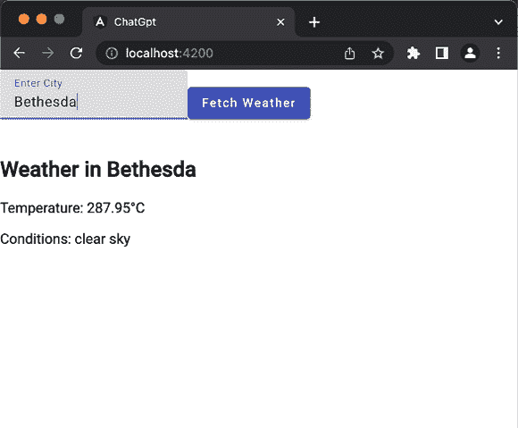

图 2.11：ChatGPT 天气应用 – 2023 年 8 月

ChatGPT 为我创建了一个非常简单直接的应用程序，其中包含一个使用双向绑定的输入字段的天气显示组件。服务调用在“获取天气”按钮触发的专用天气服务中正确实现。为了达到与我们构建的`LocalCast`应用程序相似的结果，我们必须提供一个包含更多技术细节的提示。非技术人员不知道要求具体的实现细节，而开发者可能觉得迭代开发他们的解决方案更容易。尽管如此，结果仍然令人印象深刻。

四个月后，我对上面段落中的前提产生了疑问。

*如果开发者可以接受提供一两个额外的提示会怎样？*

在 2023 年 12 月，我使用 GPT-4，没有使用任何插件，向 ChatGPT 提供了上述相同的提示，并在它生成代码后，我提供了额外的提示：

> 你能重写 weather.component.html 并将其样式设计得在桌面和移动设备上看起来都像专业设计吗？

然后，我得到了一个看起来好得多的结果！

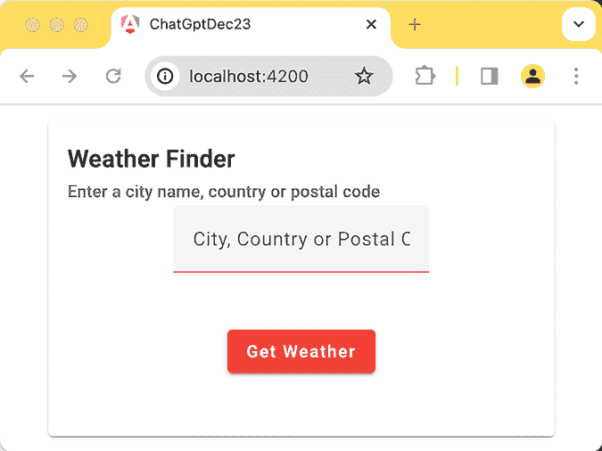

图 2.12：ChatGPT 天气应用初始版本 – 2023 年 12 月

然而，这个输出并不像我设计的。当然，ChatGPT 不知道我的设计是什么，而且详细地用文字描述它也太繁琐了。然后我想起了我有一个为 2018 年第一版创建的天气应用程序的手绘原型。

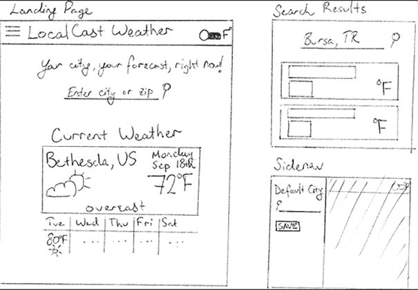

图 2.13：LocalCast 的手绘线框图

是的，我确实使用了尺子！

在 2023 年 8 月，ChatGPT 无法看到，但从那时起，它已经获得了计算机视觉。我上传了原型，并说，“根据这个原型重新设计 UI。”记住，我的原型有三个屏幕，并且有难以阅读的手写文字。

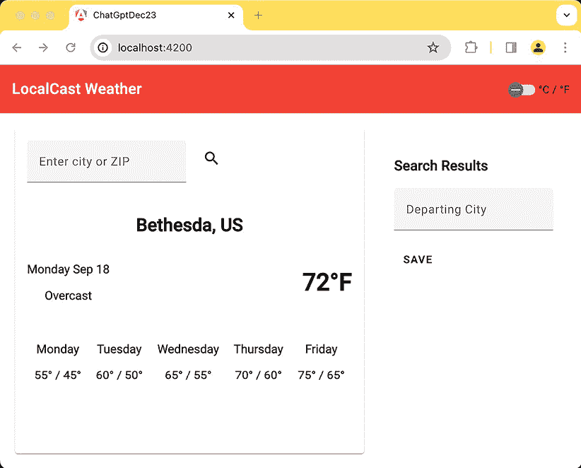

图 2.14：ChatGPT 天气应用第二版 – 2023 年 12 月

我震惊的是它注意到了`SideNav`并将其使用适当的 Material 组件和`FlexLayout`媒体查询来使其响应式地整合 – 就算我的手写被误解了。

我更新了生成的 UI 代码，使其具有交互性，并将其作为一个名为`chat-get-dec23`的项目包含在仓库中。这是结果：

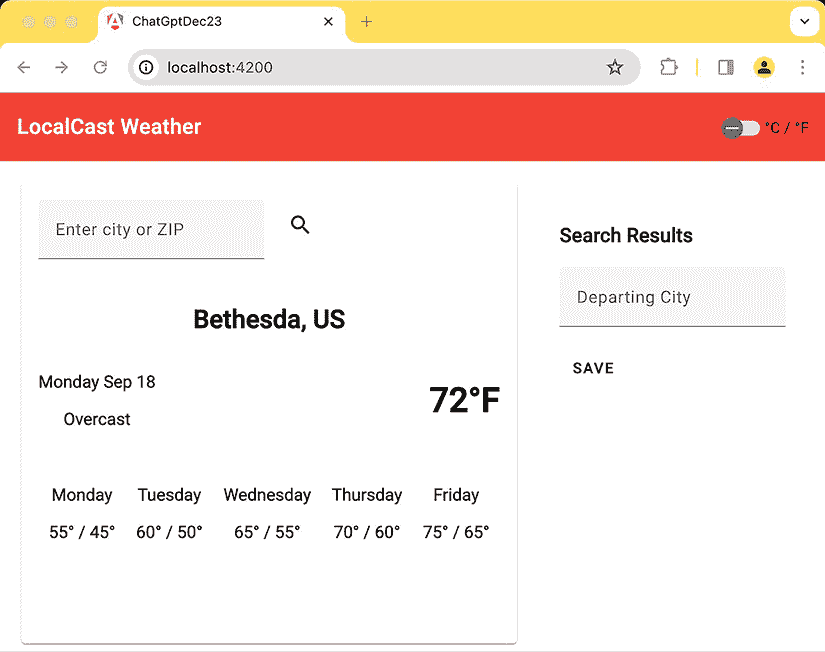

图 2.15：ChatGPT 天气应用最终版本 – 2023 年 12 月

这已经超出了令人印象深刻。到这本书的下一版出版时，这一章可能只有几页长，充满了提示，强调了在绘制原型时使用尺子的关键需求。

# 摘要

在本章中，你学习了如何使用`MatInput`、验证器、响应式表单和数据流驱动的处理程序创建搜索即输入的功能。你意识到了双向绑定和模板驱动的表单。你还学习了不同的策略来启用组件间的交互和数据共享。你深入了解了内存泄漏是如何产生的，以及管理你的订阅的重要性。

你现在可以区分命令式和响应式编程范式，并理解在可能的情况下坚持使用响应式编程的重要性。最后，你学习了如何通过链式调用多个 API 来实现复杂的功能。你了解了信号原语以及如何使用它来构建更简单、性能更优的应用程序。

LocalCast Weather 是一个简单的应用程序，我们用它来介绍 Angular 的基本概念。正如你所见，Angular 非常适合构建这样小型且动态的应用程序，同时向最终用户交付最少的框架代码。你应该考虑利用 Angular 进行快速且简单的项目，这对于构建更大的应用程序来说总是一个很好的实践。你还了解到，你可以使用像 ChatGPT 这样的 GenAI 工具，在开始一个新项目时给自己一个快速启动。

在下一章中，我们将深入探讨在企业应用程序中构建 Web 应用程序的考虑因素，并了解所有怪物隐藏的地方。我们将介绍如何使用以路由器为首要方法的设计和架构，构建具有一流身份验证和授权、用户体验以及覆盖大多数 LOB 应用程序需求的众多菜谱的可扩展 Angular 应用程序的**业务线**（**LOB**）应用程序。

# 练习

在完成**支持国际邮编**功能后，我们是否在这里切换了编程范式？我们的实现是命令式、响应式，还是两者的组合？如果我们的实现不是完全响应式的，你将如何以响应式的方式实现这个函数？我将把这个作为读者的练习。

在继续之前，不要忘记执行`npm test`、`npm run e2e`和`npm run test:a11y`。将修复单元测试和端到端测试的任务留给读者作为练习。

访问 GitHub 查看我为本章实现的单元测试，链接为[`github.com/duluca/local-weather-app/tree/master/projects/stage6`](https://github.com/duluca/local-weather-app/tree/master/projects/stage6)。

# 问题

尽可能好地回答以下问题，以确保你已理解本章的关键概念，而无需搜索任何内容。你知道你是否回答了所有问题吗？访问[`angularforenterprise.com/self-assessment`](https://angularforenterprise.com/self-assessment)获取更多信息：

1.  `async`管道是什么？

1.  解释响应式和命令式编程有何不同，以及我们应该优先选择哪种技术。

1.  `BehaviorSubject` 的好处是什么，它用于什么？

1.  什么是内存泄漏，为什么应该避免它们？

1.  管理订阅的最佳方法是什么？

1.  Angular signals 与 RxJS streams 有何不同？

1.  你可以使用 Angular Signals 的哪些方法来简化你的应用程序？
