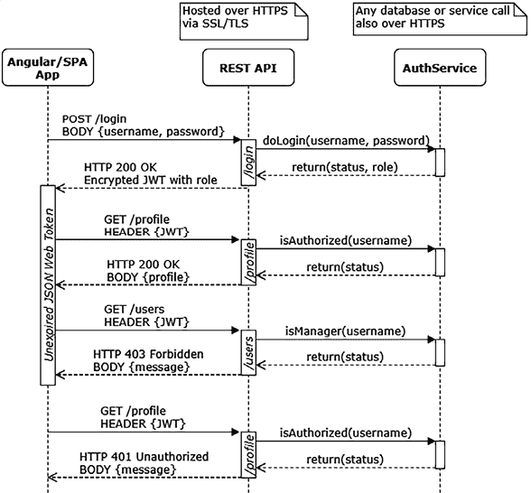
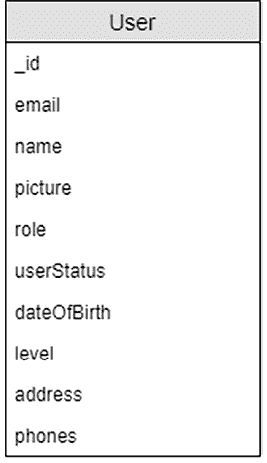
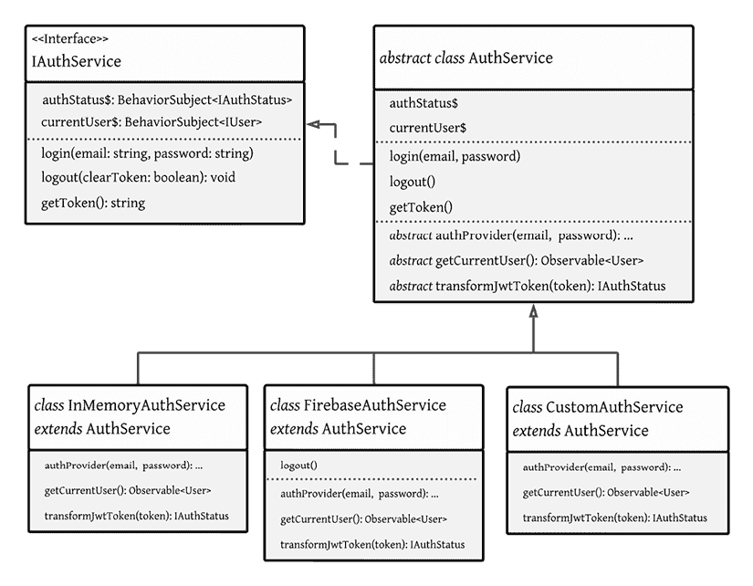
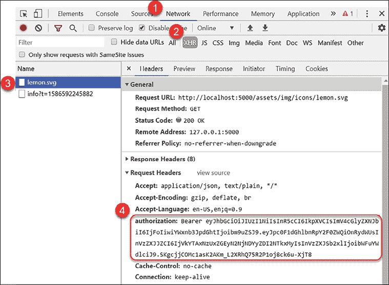

# 5

# 设计认证和授权

设计一个高质量且不会让最终用户感到沮丧的 **认证** 和 **授权** 系统是一个难以解决的问题。认证是验证用户身份的行为，授权指定用户必须拥有的访问资源的权限。这两个过程，简称 **auth**，必须无缝协同工作，以满足具有不同角色、需求和职能的用户的需求。

在今天的网络中，用户对任何通过浏览器遇到的认证系统都有很高的基线期望，因此这是您应用程序中一个重要的部分，需要第一次就做对。用户应该始终知道他们可以在您的应用程序中做什么以及不能做什么。如果有错误、失败或错误，用户应该被告知它们发生的原因。随着您的应用程序的增长，很容易错过错误条件可能被触发的机制。您的实现应该易于扩展或维护。否则，您应用程序的基本骨架将需要大量的维护。在本章中，我们将探讨创建出色的认证用户体验和实现坚实基础体验的挑战。

在本章中，我们将围绕上一章定义的用户实体实现基于令牌的认证方案。为了实现健壮且易于维护的实现，我们将深入探讨面向对象编程（**OOP**），包括抽象、继承和工厂，同时实现一个缓存服务、一个 UI 服务和一个内存中的模拟认证服务，用于测试和教育目的。

在本章中，我们将介绍以下主题：

+   设计认证工作流程

+   TypeScript 的安全数据处理运算符

+   实现数据实体

+   利用面向对象编程（OOP）概念的可重用服务

+   创建认证服务

+   使用 localStorage 的缓存服务

+   一个内存中的认证服务

+   登出

+   一个 HTTP 拦截器

# 技术要求

书籍的示例代码的最新版本可以在以下链接的 GitHub 仓库中找到。[`github.com/duluca/lemon-mart`](https://github.com/duluca/lemon-mart)。该仓库包含代码的最终和完成状态。您可以在本章末尾通过查找 `projects` 文件夹下的章节末尾代码快照来验证您的进度。

对于 *第五章*：

1.  克隆 [`github.com/duluca/lemon-mart`](https://github.com/duluca/lemon-mart) 仓库。

1.  在根目录下执行 `npm install` 以安装依赖项。

1.  项目的初始状态反映在：

    ```js
    projects/stage7 
    ```

1.  项目的最终状态反映在：

    ```js
    projects/stage8 
    ```

1.  将阶段名称添加到任何 `ng` 命令中，使其仅对该阶段生效：

    ```js
    npx ng build stage8 
    ```

    注意，存储库根目录下的 `dist/stage8` 文件夹将包含编译结果。

请注意，书中提供的源代码和 GitHub 上的版本可能不同。围绕这些项目的生态系统一直在不断演变。由于 Angular CLI 生成新代码的方式的变化、错误修复、库的新版本以及多种技术的并行实现，存在许多难以预料的差异。如果您发现错误或有疑问，请创建一个 GitHub 上的问题或提交一个 pull request。

让我们先了解一下基于令牌的认证工作流程是如何工作的。

# 设计认证工作流程

一个精心设计的认证工作流程是无状态的，因此没有会话过期的概念。用户可以从他们想要的任何设备和标签页中与您的无状态 REST API 交互，同时或分时进行。**JSON Web Token**（JWT）实现了基于声明的分布式认证，可以使用**消息认证码**（MAC）进行数字签名或信息保护以及/或加密。这意味着一旦用户的身份得到验证（即在登录表单上的密码挑战），他们就会收到一个编码的声明的票据或令牌，然后可以使用它来向系统发出未来的请求，而无需重新验证用户的身份。

服务器可以独立验证这个声明的有效性，并处理请求，而无需事先知道是否与该用户交互过。因此，我们不需要存储有关用户的会话信息，这使得我们的解决方案是无状态的，易于扩展。每个令牌在预定义的期限后会过期，由于它们的分布式特性，它们不能远程或单独撤销；然而，我们可以通过插入自定义账户和用户角色状态检查来增强实时安全性，以确保认证用户有权访问服务器端资源。

JWT 实现了位于[`tools.ietf.org/html/rfc7519`](https://tools.ietf.org/html/rfc7519)的**互联网工程任务组**（IETF）行业标准 RFC 7519。

一个好的授权工作流程允许根据用户的角色进行条件导航，这样用户就会被自动带到最佳的着陆页面；不适合他们角色的路由和 UI 元素不应显示，如果他们不小心尝试访问受限路径，应阻止他们这样做。您必须记住，任何客户端基于角色的导航仅仅是一种便利，并不用于安全。

这意味着每个发送到服务器的调用都应该包含必要的头信息，包括安全的令牌，以便服务器可以重新认证用户并独立验证其角色。只有在这种情况下，他们才能被允许检索受保护的数据。由于客户端认证的本质，它不能被信任。所有认证逻辑都必须在服务器端实现。安全地实现密码重置屏幕可能特别具有挑战性，因为它们可以在您的 Web 应用程序内部触发或通过嵌入到电子邮件/通知中的链接触发。当交互模式增加时，攻击面也随之增长。因此，我建议使用服务器端渲染来构建重置屏幕，以便用户和服务器都可以验证预期的用户正在与系统交互。如果您在客户端实现此功能，您必须确保服务器生成一个时间有限的、一次性的令牌，以便与新的密码一起传递，这样您可以合理地确信请求是合法的。接下来，让我们深入了解如何生成安全的令牌。

## JWT 生命周期

JWTs 补充了无状态 REST API 架构，通过加密令牌机制，使得客户端请求的认证和授权变得方便、分布式且高性能。基于令牌的认证方案有三个主要组成部分：

+   **客户端**：捕获登录信息并隐藏不允许的操作，以提供良好的用户体验。

+   **服务器端**：验证每个请求是否已认证并且具有适当的授权。

+   **认证服务**：生成和验证加密令牌，并独立验证用户请求的认证状态，这些请求来自数据存储。

一个安全的系统假定客户端（应用程序和浏览器）、系统（服务器和服务）以及数据库之间发送/接收的数据都使用 **传输层安全性**（**TLS**）进行加密，这本质上是一个 **安全套接字层**（**SSL**）的新版本。您的 REST API 必须使用正确配置的 SSL 证书托管，通过 HTTPS 提供所有 API 调用，以确保用户凭证在客户端和服务器之间不会被暴露。同样，任何数据库或第三方服务调用也应通过 TLS 进行。这确保了传输中数据的安全性。

在静止状态（数据存储在数据库中时），应使用安全的单向哈希算法和良好的盐值实践来存储密码。

所有的哈希和盐值讨论让你想起了早餐吗？不幸的是，它们是密码学相关的术语。如果你想了解更多，可以查看这篇文章：[`crackstation.net/hashing-security.htm`](https://crackstation.net/hashing-security.htm)。

对于敏感用户信息，如 **个人身份信息**（**PII**），应使用安全的双向加密算法在静止状态下加密，与密码不同。密码是经过散列的，因此我们验证用户提供的密码是否与系统所知的密码相同。对于 PII，我们必须能够解密数据以将其显示给用户。然而，由于数据在静止状态下加密，如果数据库被破坏，那么被黑客窃取的数据将毫无价值。

采取分层的安全方法至关重要，因为攻击者需要完成同时破坏你安全所有层的不太可能的事情，以对你的业务造成实质性伤害。

**有趣的事实**：当你听到来自大型公司的重大数据泄露事件时，其根本原因往往是缺乏对传输中或静止状态安全性的适当实施。有时，这是因为持续加密/解密数据计算成本过高，因此工程师依赖于防火墙的保护。在这种情况下，一旦外围被突破，正如他们所说，狐狸就进入了鸡舍。

考虑以下序列图，它突出了基于 JWT 的认证生命周期：



图 5.1：基于 JWT 的认证生命周期

初始时，用户通过提供用户名和密码进行登录。一旦验证通过，用户的认证状态和角色将被加密在一个带有过期日期和时间的 JWT 中，并将其发送回浏览器。

我们的应用程序（Angular 或其他）可以安全地将此令牌缓存到本地或会话存储中，这样用户就不必在每次请求时都强制登录。这样，我们就不必采取像在 cookies 中存储用户凭据这样的不安全做法，以提供良好的用户体验。

我们的技术审稿人 Jurgen Van de Moere 指出，cookies 并不一定是不可靠的。

请参阅 [`www.youtube.com/watch?v=9ZOpUtQ_4Uk`](https://www.youtube.com/watch?v=9ZOpUtQ_4Uk) 由 Philippe De Ryck 撰写的视频，解释在特定情况下 cookies 可以是一个有效的机制来存储 JWT 令牌。

当你在本章后面实现自己的认证服务时，你会更好地理解 JWT 生命周期。在接下来的几节中，我们将围绕 **用户** 数据实体设计一个功能齐全的认证工作流程，如下所示：



图 5.2：用户实体

描述的 **用户** 实体与我们最初的实体模型略有不同。实体模型反映了数据在数据库中的存储方式。

实体是用户记录的扁平化（或简化）表示。即使是一个扁平化的实体也包含复杂对象，如 **姓名**，具有首字母、中间名和姓氏等属性。此外，并非所有属性都是必需的。此外，在与认证系统和其他 API 交互时，我们可能会收到不完整、错误或恶意构造的数据，因此我们的代码必须有效地处理 `null` 和 `undefined` 变量。

接下来，让我们看看如何利用 TypeScript 运算符有效地处理意外数据。

# TypeScript 的安全数据处理运算符

JavaScript 是一种动态类型语言。在运行时，执行我们代码的 JavaScript 引擎，如 Chrome 的 V8，不知道我们使用的变量的类型。因此，引擎必须推断类型。我们可以有基本类型，如 `boolean`、`number`、`array` 或 `string`，或者我们可以有复杂类型，这本质上是一个 JSON 对象。此外，变量可以是 `null` 或 `undefined`。从广义上讲，`undefined` 表示尚未声明或初始化的某物，而 `null` 表示已声明变量值的故意缺失。

在强类型语言中，`undefined` 的概念不存在。基本类型有默认值，如 `number` 是零或 `string` 是空字符串。然而，复杂类型可以是 `null`。`null` 引用意味着变量已定义，但后面没有值。

`null` 引用的发明者 Tony Hoare 称其为他的“十亿美元的错误”。

TypeScript 将强类型语言的观念引入 JavaScript，因此它必须在两个世界之间架起桥梁。因此，TypeScript 定义了 `null`、`undefined`、`any` 和 `never` 等类型，以理解 JavaScript 的类型语义。我在 *进一步阅读* 部分添加了相关 TypeScript 文档的链接，以便更深入地了解 TypeScript 类型。

如 TypeScript 文档所述，TypeScript 将 `null` 和 `undefined` 区分开来，以匹配 JavaScript 的语义。例如，联合类型 `string | null` 与 `string | undefined` 和 `string | undefined | null` 是不同的类型。

另一个细微差别是：使用 `==` 和 `===` 来检查一个值是否等于 `null`。使用双等号运算符，检查 `foo != null` 表示 `foo` 已定义且不是 `null`。然而，使用三等号运算符，`foo !== null` 表示 `foo` 不是 `null` 但可能是 `undefined`。然而，这两个运算符并没有考虑变量的真值，这包括空字符串的情况。

这些细微差别对编写代码的方式有很大影响，尤其是在使用 `--strict` 选项创建 Angular 应用程序时应用严格的 TypeScript 规则。重要的是要记住，TypeScript 是一个编译时工具，而不是运行时工具。在运行时，我们仍在处理动态类型语言的现实。仅仅因为我们声明了一个类型是字符串，并不意味着我们会收到一个字符串。

接下来，让我们看看如何处理与处理意外值相关的问题。

## `null` 和 `undefined` 检查

当与其他库一起工作或处理来自应用程序外部发送或接收的信息时，你必须处理接收到的变量可能是 `null` 或 `undefined` 的现实。

在您的应用程序之外意味着处理用户输入，从 cookie 或 `localStorage` 读取，从路由器获取 URL 参数，或通过 HTTP 进行 API 调用，仅举几个例子。

在我们的代码中，我们主要关注变量的真值。这意味着变量已被定义，不为空，如果它是一个基本类型，它具有非默认值。给定一个 `string`，我们可以通过简单的 `if` 语句来检查 `string` 是否为真值：

```js
**example**
const foo: string = undefined
if(foo) {
  console.log('truthy')
} else {
  console.log('falsy')
} 
```

如果 `foo` 是 `null`、`undefined` 或一个空字符串，变量将被视为假值。对于某些情况，我们可以使用条件或三元运算符而不是 `if-else`。

## 条件或三元运算符

条件或三元运算符具有 `?:` 语法。在问号的左侧，运算符接受一个条件表达式。在冒号的右侧，我们提供真值和假值的输出：`conditional ? true-outcome : false-outcome`。条件或三元运算符是表示 `if-else` 条件的紧凑方式，并且可以非常有助于提高代码库的可读性。这个运算符不是 `if-else` 块的替代品，但在使用 `if-else` 条件的输出时非常有用。

考虑以下示例：

```js
**example**
const foo: string = undefined
let result = ''
if(foo) {
  result = 'truthy'
} else {
  result = 'falsy'
}
console.log(result) 
```

可以将前面的 `if-else` 块重写为：

```js
**example**
const foo: string = undefined
console.log(foo ? 'truthy' : 'falsy') 
```

在这种情况下，条件或三元运算符使代码更加紧凑且易于理解。另一个常见场景是返回一个默认值，其中变量为假值。

接下来，我们考虑空合并运算符。

## 空合并运算符

空合并运算符是 `||`。这个运算符在条件表达式的真值与条件表达式本身相同时，可以避免重复。

考虑以下示例，如果 `foo` 被定义，我们希望使用 `foo` 的值，但如果它是 `undefined`，我们需要一个默认值 `'bar'`：

```js
**example**
const foo: string = undefined
console.log(foo ? foo : 'bar') 
```

如您所见，`foo` 被重复了两次。我们可以通过使用空合并运算符来避免重复：

```js
**example**
const foo: string = undefined
console.log(foo || 'bar') 
```

因此，如果 `foo` 是 `undefined`、`null` 或一个空字符串，将输出 `bar`。否则，将使用 `foo` 的值。但在某些情况下，我们只需要在值是 `undefined` 或 `null` 时使用默认值。

让我们来看看空合并运算符。

## 空合并运算符

空合并运算符是 `??`。这个运算符与空合并运算符类似，但有一个关键的区别。当处理来自 API 或用户输入的数据时，检查变量的真值可能不足以确定一个空字符串是否为有效值。正如我们在本节前面所讨论的，检查 `null` 和 `undefined` 并不像看起来那么简单。然而，我们知道通过使用双等号运算符，我们可以确保 `foo` 被定义且不为空：

```js
**example**
const foo: string = undefined
console.log(foo != null ? foo : 'bar') 
```

在前面的例子中，如果`foo`是一个空字符串或另一个值，我们将得到`foo`输出的值。如果是`null`或`undefined`，我们将得到`'bar'`。通过使用空值合并运算符，我们可以以更紧凑的方式完成这项工作：

```js
**example**
const foo: string = undefined
console.log(foo ?? 'bar') 
```

前面的代码将产生与上一个例子相同的结果。然而，当处理复杂对象时，我们需要考虑它们的属性是否是`null`或`undefined`。为此，我们将考虑使用可选链运算符。

## 可选链

可选链运算符是`?`。它类似于 Angular 的安全导航运算符。可选链确保在尝试访问子属性或调用函数之前，变量或属性已被定义且不是`null`。因此，`foo?.bar?.callMe()`这个语句在没有抛出错误的情况下执行，即使`foo`或`bar`是`null`或`undefined`。

考虑一下`user`实体，它有一个`name`对象，包含`first`、`middle`和`last`属性。让我们看看如何使用空值合并运算符安全地为中间名提供一个空字符串的默认值：

```js
**example**
const user = {
  name: {
    first: 'Doguhan',
    middle: null,
    last: 'Uluca'
  } 
}
console.log((user && user.name && user.name.middle) ?? '') 
```

如你所见，在访问子属性之前，我们需要检查父对象是否是`truthy`。如果`middle`是`null`，则输出一个空字符串。可选链使这项任务变得更简单：

```js
**example**
console.log(user?.name?.middle ?? '') 
```

通过结合使用可选链和空值合并运算符，我们可以消除重复，并交付出健壮的代码，能够有效地处理 JavaScript 动态运行时的现实。

因此，在设计你的代码时，你必须决定是否在你的逻辑中引入 null 的概念，或者使用像空字符串这样的默认值。在下一节中，当我们实现用户实体时，你将看到这些选择是如何发挥作用的。到目前为止，我们只使用了接口来定义我们数据的形式。接下来，让我们构建用户实体，利用面向对象编程的概念，如类、枚举和抽象来实现它，以及一个认证服务。

让我们从简单开始，看看这些模式如何在 JavaScript 类和 TypeScript 基础知识的环境中实现。

# 实现数据实体和接口

在本节中，我将演示你如何在你的代码设计中使用类来定义和封装你的模型的行为，例如`User`类。在本章的后面部分，你将看到使用抽象基类的类继承的例子，这允许我们标准化我们的实现，并以干净、易于维护的方式重用基本功能。

我必须指出，面向对象编程（OOP）具有非常实用的模式，这些模式可以提高你代码的质量；然而，如果你过度使用它，那么你将开始失去 JavaScript 动态、灵活和功能性的好处。

有时候，你只需要一个文件中的几个函数，你会在整本书中看到这样的例子。

展示类价值的一个好方法就是标准化创建默认`User`对象的过程。我们需要这样做，因为`BehaviorSubject`对象需要用默认对象初始化。最好在一个地方完成这个操作，而不是在多个地方复制粘贴相同的实现。让`User`对象拥有这个功能而不是由 Angular 服务创建默认`User`对象是非常有意义的。所以，让我们实现一个`User`类来实现这个目标。

## 类、接口和枚举

如前所述，我们只使用接口来表示数据。我们仍然希望在传递数据到各个组件和服务时继续使用接口。接口非常适合描述实现具有哪些属性或函数，但它们对这些属性或函数的行为没有任何暗示。

在 ES2015（ES6）中，JavaScript 获得了对类的原生支持，这是面向对象编程范式的一个关键概念。类是行为的实际实现。与文件中只包含函数集合相比，类可以正确地封装行为。然后可以使用 new 关键字将类实例化为对象。

TypeScript 采用了 ES2015（及以后）的类实现，并引入了必要的概念，如抽象类、私有、受保护和公共属性，以及接口，以便能够实现面向对象编程模式。

我们将首先定义所需数据实体的枚举和接口，利用 TypeScript 的两大最佳特性。

接口帮助我们实践 SOLID 设计原则中的依赖倒置原则：依赖于抽象，而不是具体实现。这意味着在组件或服务之间，传递对象的接口（一个实例化的类）而不是对象本身会更好。这就是为什么我们定义的每个类都将实现一个接口。此外，接口通常是你在新项目中开始编码的第一件事，使用它们来实现你的原型和 API 集成。

枚举有助于确保另一个重要规则：永远不要使用字符串字面量。枚举功能强大且出色。

让我们直接进入并定义所需的接口和枚举：

1.  在`src/app/auth/auth.enum.ts`位置定义用户角色为`enum`：

    ```js
    **src/app/auth/auth.****enum****.****ts**
    export enum Role {
      None = 'none',
      Clerk = 'clerk',
      Cashier = 'cashier',
      Manager = 'manager',
    } 
    ```

1.  在`src/app/user/user`文件夹下创建一个`user.ts`文件。

1.  在`user.ts`文件中定义一个名为`IUser`的新接口：

    ```js
    **src/app/user/user/user.****ts**
    import { Role } from '../../auth/auth.enum'
    export interface IUser {
      _id: string
      email: string
      name: IName
      picture: string
      role: Role | string
      userStatus: boolean
      dateOfBirth: Date | null | string
      level: number
      address: {
        line1: string
        line2?: string
        city: string
        state: string
        zip: string
      }
      phones: IPhone[]
    } 
    ```

    注意，接口上定义的每个复杂属性也可以表示为`string`。在传输过程中，所有对象都使用`JSON.stringify()`转换为字符串。不包含任何类型信息。我们还利用接口在内存中表示`Class`对象，这些对象可以具有复杂类型。因此，我们的接口属性必须使用联合类型反映这两种情况。例如，`role`可以是`Role`类型或`string`。同样，`dateOfBirth`可以是`Date`或`string`。

    我们将`address`定义为内联类型，因为我们在这个类之外不使用地址的概念。相比之下，我们将`IName`定义为其自己的接口，因为在第八章“食谱 - 可重用性、表单和缓存”中，我们将实现一个单独的组件来处理名称。我们还定义了一个单独的接口来处理电话，因为它们被表示为数组。在开发表单时，我们需要能够在模板代码中引用数组的单个元素，例如`IPhone`。

    通常，在接口名称前加上大写的`I`，以便于识别。不用担心；在 Android 手机上使用`IPhone`接口没有兼容性问题！

1.  在`user.ts`中定义`IName`和`IPhone`接口，并实现`PhoneType`枚举：

    ```js
    **src/app/user/user/user.****ts**
    export interface IName {
      first: string
      middle?: string
      last: string
    }
    export enum PhoneType {
      None = 'none',
      Mobile = 'mobile',
      Home = 'home',
      Work = 'work',
    }
    export interface IPhone {
      type: PhoneType
      digits: string
      id: number
    } 
    ```

    注意，在`PhoneType`枚举中，我们明确地定义了`string`值。默认情况下，`enum`值在键入时会转换为字符串，这可能导致数据库中存储的值与开发者选择拼写变量名的方式不同步，从而导致问题。通过明确和全部小写的值，我们降低了出现错误的风险。

1.  接下来，定义实现`IUser`接口的`User`类：

    ```js
    **src/app/user/user/user.****ts**
    export class User implements IUser {
      constructor(
        // tslint:disable-next-line: variable-name
        public _id = '',
        public email = '',
        public name = { first: '', middle: '', last: '' } as IName,
        public picture = '',
        public role = Role.None,
        public dateOfBirth: Date | null = null,
        public userStatus = false,
        public level = 0,
        public address = {
          line1: '',
          city: '',
          state: '',
          zip: '',
        },
        public phones: IPhone[] = []
      ) {}
      static Build(user: IUser) {
        if (!user) {
          return new User()
        }
        return new User(
          user._id,
          user.email,
          user.name,
          user.picture,
          user.role as Role,
          typeof user.dateOfBirth === 'string'
            ? new Date(user.dateOfBirth)
            : user.dateOfBirth, 
          user.userStatus,
          user.level,
          user.address,
          user.phones
        )
      }
    } 
    ```

    注意，通过在构造函数中将所有属性定义为`public`属性并赋予默认值，我们一举两得；否则，我们需要分别定义属性并单独初始化它们。这样，我们实现了简洁的实现。

    使用静态的`Build`函数，我们可以快速用从服务器接收到的数据填充对象。我们还可以实现`toJSON()`函数来定制对象在发送到服务器前的序列化行为。但在那之前，让我们添加一个计算属性。

    我们可以在模板或通知消息中使用计算属性方便地显示由多个部分组成的值。一个很好的例子是从`name`对象中提取全名作为`User`类中的一个属性。

    用于组装全名的计算属性封装了组合首名、中名和姓氏的逻辑，这样你就不必在多个地方重写这个逻辑，遵循 DRY 原则！

1.  在`User`类中实现`fullName`属性的 getter：

    ```js
    **src/app/user/user/user.****ts**
    export class User implements IUser {
      ...
      **public****get****fullName****():** **string** **{**
        **if** **(!****this****.****name****) {**
          **return****''**
        **}**
        **if** **(****this****.****name****.****middle****) {**
          **return**
            **`****${****this****.name.first}****${****this****.name.middle}****${****this****.name.last}****`**
        **}**
        **return****`****${****this****.name.first}****${****this****.name.last}****`**
      **}**
    } 
    ```

1.  将`fullName`添加到`IUser`中作为一个可选的`readonly`属性：

    ```js
    **src/app/user/user/user.****ts**
    export interface IUser {
      ...
      readonly fullName?: string
    } 
    ```

    你现在可以通过`IUser`接口使用`fullName`属性。

1.  实现序列化函数：

    ```js
    **src/app/user/user/user.****ts**
    export class User implements IUser {
      ...

    **toJSON****():** **object** **{**
        **const** **serialized =** **Object****.****assign****(****this****)**
        **delete** **serialized.****_id**
        **delete** **serialized.****fullName**
        **return** **serialized**
      **}**
    } 
    ```

注意，在序列化对象时，我们删除了`_id`和`fullName`字段。这些是我们不希望存储在数据库中的值。`fullName`字段是一个计算属性，因此不需要存储。`_id`通常在`GET`或`PUT`调用中作为参数传递，以定位记录。这避免了可能导致的错误，这些错误可能会导致覆盖现有对象的`id`字段。

现在我们已经实现了`User data`实体，接下来让我们实现认证服务。

# 利用面向对象概念的可重用服务

与 RxJS 所支持的响应式编程风格相比，OOP（面向对象编程）是一种命令式编程风格。类是 OOP 的基础，而使用 RxJS 的观察者（observables）在响应式编程中扮演着同样的角色。

我鼓励你熟悉 OOP 术语。请参阅*进一步阅读*部分，了解一些有用的资源。你应该熟悉：

+   类与对象

+   组合（接口）

+   封装（私有、受保护、公共属性，以及属性获取器和设置器）

+   多态（继承、抽象类和方法重写）

如你所知，Angular 使用 OOP 模式来实现组件和服务。例如，接口实现了生命周期钩子，如`OnInit`。我们的目标是设计一个灵活的认证服务，它可以实现多个认证提供者。在*第六章*，*实现基于角色的导航*中，我们将实现一个内存提供者和一个 Google Firebase 提供者。在*第七章*，*与 REST 和 GraphQL API 交互*中，我们将实现两个自定义提供者以与我们的后端交互，并了解**基于角色的访问控制**（**RBAC**）是如何实现的。

通过声明一个抽象基类，我们可以描述我们应用程序的常见登录和注销行为，因此当我们实现另一个认证提供者时，我们不需要重新设计我们的应用程序。

此外，我们可以声明抽象函数，我们的基类的实现者必须实现这些函数，以强制我们的设计。任何实现基类的类都将获得基类中实现代码的好处，因此我们不需要在两个不同的地方重复相同的逻辑。

以下类图反映了我们抽象的`AuthService`的架构和继承层次结构：



图 5.3：AuthService 继承结构

`AuthService`实现了`IAuthService`接口，如下所示：

```js
export interface IAuthService {
  readonly authStatus$: BehaviorSubject<IAuthStatus>
  readonly currentUser$: BehaviorSubject<IUser>
  login(email: string, password: string): Observable<void>
  logout(clearToken?: boolean): void
  getToken(): string
} 
```

接口反映了服务公开的属性。服务提供认证状态作为`authStatus$`观察者，当前用户作为`currentUser$`，并提供三个函数，`login`、`logout`和`getToken`。

`AuthService`需要从另一个名为`CacheService`的服务中获取缓存功能。我们不是通过继承来整合缓存功能，而是将其注入到基类中。由于`AuthService`是一个抽象类，它不能独立使用，因此我们将实现三个认证提供者，即图示下方的`InMemoryAuthService`、`FirebaseAuthService`和`CustomAuthService`。

组合优于继承，因此你必须确保你正确地使用了继承。继承描述了一个 is-a 关系，而组合描述了一个 has-a 关系。在这种情况下，我们使用了正确的继承和组合的混合，因为`FirebaseAuthService`是`AuthService`，而`AuthService`有一个`CacheService`。

注意，所有三个认证服务都实现了所有抽象函数。此外，`FirebaseAuthService` 覆盖了基类的 `logout` 函数以实现其自己的行为。所有三个类都继承自同一个抽象类并公开相同的公共接口。所有三个都将执行相同的认证工作流程，针对不同的认证服务器。

内存中的认证服务不与服务器通信。此服务仅用于演示目的。它实现了假的 JWT 编码，因此我们可以演示 JWT 生命周期的工作方式。

让我们从创建认证服务开始。

# 创建一个认证服务

我们将首先创建抽象的认证服务和内存中的服务：

1.  添加一个认证服务：

    ```js
    $ npx ng g s auth --flat false
    $ npx ng g s auth/inMemoryAuth --skip-tests 
    ```

1.  将 `in-memory-auth.service.ts` 重命名为 `auth.in-memory.service.ts`，以便在文件资源管理器中将不同的认证提供者视觉上分组在一起。

1.  移除 `auth.service.ts` 中的 `@Injectable()` 装饰器，但保留在 `auth.in-memory.service.ts` 上。

1.  确保在 `app.module.ts` 中提供了 `authService`，并且使用 `InMemoryAuthService` 而不是抽象类：

    ```js
    **src/app/app.****module****.****ts**
    **import** **{** **AuthService** **}** **from****'./auth/auth.service'**
    **import** **{** **InMemoryAuthService** **}** **from****'./auth/auth.in-memory.service'**
    ...
      providers: [
        **{**
          **provide****:** **AuthService****,**
          **useClass****:** **InMemoryAuthService**
        **},**
        ...
    ] 
    ```

为服务创建一个单独的文件夹，可以组织与认证相关的各种组件，例如用户角色的 `enum` 定义。此外，我们还将能够将 `authService` 模拟器添加到同一个文件夹中，以进行自动化测试。

## 实现一个抽象的认证服务

现在，让我们构建一个抽象的认证服务，该服务将协调登录和注销，同时封装管理 JWT、认证状态和有关当前用户的信息的逻辑。通过利用抽象类，我们应该能够针对任何认证提供者实现自己的认证服务，而无需修改应用程序的内部行为。

我们将要演示的抽象认证服务可以实现丰富和复杂的流程。这是一个可以无缝集成到您的应用程序中的解决方案，无需修改内部逻辑。因此，它是一个复杂的解决方案。

此认证服务将使我们能够演示使用电子邮件和密码进行登录、缓存以及基于认证状态和用户角色的条件导航概念：

1.  首先安装一个 JWT 解码库，以及为了模拟认证的 JWT 编码库：

    ```js
    $ npm install jwt-decode 
    $ npm install -D @types/jwt-decode 
    ```

1.  实现一个 `IAuthStatus` 接口以存储解码后的用户信息，一个辅助接口，以及默认安全的 `defaultAuthStatus`：

    ```js
    **src/app/auth/auth.****service****.****ts**
    import { Role } from './auth.enum'
    ...
    export interface IAuthStatus {
      isAuthenticated: boolean
      userRole: Role
      userId: string
    }
    export interface IServerAuthResponse {
      accessToken: string
    }
    export const defaultAuthStatus: IAuthStatus = {
      isAuthenticated: false,
      userRole: Role.None,
      userId: '',
    }
    ... 
    ```

    `IAuthStatus` 是一个接口，它代表了从认证服务接收到的典型 JWT 的结构。它包含有关用户及其角色的最小信息。认证状态对象可以附加到每个 API 调用的头部，以验证用户的身份。认证状态可以可选地缓存在 `localStorage` 中以记住用户的登录状态；否则，他们每次刷新页面时都需要重新输入密码。

    在前面的实现中，我们假设默认角色为 `None`，如 `Role` 枚举中定义。通过默认不给用户分配任何角色，我们遵循最小权限访问模型。用户正确的角色将在他们使用从 auth API 收到的信息成功登录后设置。

1.  在 `auth.service.ts` 中定义 `IAuthService` 接口：

    ```js
    **src/app/auth/auth.service.ts**
    export interface IAuthService {
      readonly authStatus$: BehaviorSubject<IAuthStatus>
      readonly currentUser$: BehaviorSubject<IUser>
      login(email: string, password: string): Observable<void>
      logout(clearToken?: boolean): void
      getToken(): string
    } 
    ```

1.  将 `AuthService` 实现为 `abstract` 类，如下所示：

    ```js
    export abstract class AuthService 
    ```

1.  使用 VS Code 的快速修复功能实现接口 `IAuthService`：

    ```js
    **src/app/auth/auth.****service****.****ts**
    export abstract class AuthService **implements****IAuthService** {
      authStatus$: BehaviorSubject<IAuthStatus>
      currentUser$: BehaviorSubject<IUser>

      **constructor****() {}**

      login(email: string, password: string): Observable<void> {
        throw new Error('Method not implemented.')
      }
      logout(clearToken?: boolean): void {
        throw new Error('Method not implemented.')
      }
      getToken(): string {
        throw new Error('Method not implemented.')
      }
    } 
    ```

1.  将 `authStatus$` 和 `currentUser$` 属性实现为 `readonly` 并用它们的默认值初始化我们的数据锚点：

    ```js
    **src/app/auth/auth.****service****.****ts**
    import { IUser, **User** } from '../user/user/user'
    ...
    export abstract class AuthService implements IAuthService {
      **readonly** authStatus$ = 
        **new****BehaviorSubject****<****IAuthStatus****>(defaultAuthStatus)** 
      **readonly** currentUser$ = 
        **new****BehaviorSubject****<****IUser****>(****new****User****())**
      ...
    } 
    ```

注意，我们移除了属性的类型定义。相反，我们让 TypeScript 从初始化中推断类型。

你必须始终将你的数据锚点声明为 `readonly`，这样你就不会意外地通过将数据锚点重新初始化为新的 `BehaviorSubject` 来覆盖数据流，这样做会使任何先前的订阅者成为孤儿，导致内存泄漏，这会有许多意想不到的后果。

所有实现 `IAuthService` 的实现者必须能够登录用户，转换从服务器返回的令牌，以便我们可以读取和存储它，支持访问当前用户和认证状态，并提供一种注销用户的方式。我们已经成功添加了公共方法的函数，并为我们的数据锚点实现了默认值，为我们的应用程序的其他部分创建了钩子。但到目前为止，我们只定义了我们的服务可以做什么，而没有定义它是如何做到的。

总是细节决定成败，难点在于“如何”。抽象函数可以帮助我们在应用程序的服务中完成工作流程的实现，同时将必须实现外部 API 的服务部分留空。

## 抽象函数

实现抽象类的认证服务应该能够支持任何类型的认证提供者和任何类型的令牌转换，同时能够修改行为，如用户检索逻辑。我们必须能够实现登录、注销、令牌和认证状态管理，而不需要实现对特定服务的调用。

通过定义抽象函数，我们可以声明一系列必须实现一组给定输入和输出的方法——一个没有实现的签名。然后我们可以使用这些抽象函数来编排我们的认证工作流程的实现。

开放/封闭原则推动了我们的设计目标。`AuthService` 将通过其能够扩展以与任何基于令牌的认证提供者一起工作的能力而开放，但它对修改是封闭的。一旦我们完成了 `AuthService` 的实现，我们就不会需要修改其代码来添加额外的认证提供者。

现在，我们需要定义我们的认证提供者必须实现的抽象函数，如本章前面 *图 5.3* 所示：

+   `authProvider(email, password)`: `Observable<IServerAuthResponse>` 可以通过提供者登录并返回标准化的 `IServerAuthResponse`

+   `transformJwtToken(token)`: `IAuthStatus` 可以将提供者返回的令牌标准化为 `IAuthStatus` 接口

+   `getCurrentUser()`: `Observable<User>` 可以检索已登录用户的用户资料

然后，我们可以在 `login`、`logout` 和 `getToken` 方法中使用这些函数来实现身份验证工作流程：

1.  将派生类应该实现的抽象方法定义为受保护的属性，以便在派生类中可访问，但不是公开的：

    ```js
    **src/app/auth/auth.****service****.****ts**
    ...
    **export****abstract****class****AuthService****implements****IAuthService** **{**
         **protected****abstract****authProvider****(**
           **email****:** **string****,**
           **password****:** **string**
         **):** **Observable****<****IServerAuthResponse****>**
         **protected****abstract****transformJwtToken****(****token****:** **unknown****):**
           **IAuthStatus**
         **protected****abstract****getCurrentUser****():** **Observable****<****User****>**
         ...
    } 
    ```

    利用这些模拟的方法，我们现在可以实现一个登录方法来登录用户并检索当前登录用户，更新 `authStatus$` 和 `currentUser$` 数据流。

1.  在我们继续之前，实现一个 `transformError` 函数来处理不同类型的错误，如 `HttpErrorResponse` 和 `string`，并将它们提供在可观察的流中。在 `src/app/common` 下的新文件 `common.ts` 中创建 `transformError` 函数：

    ```js
    **src/app/common/common.****ts**
    import { HttpErrorResponse } from '@angular/common/http'
    import { throwError } from 'rxjs'
    export function transformError(error: HttpErrorResponse | string) {
      let errorMessage = 'An unknown error has occurred'
      if (typeof error === 'string') {
        errorMessage = error
      } else if (error.error instanceof ErrorEvent) {
        errorMessage = `Error! ${error.error.message}`
      } else if (error.status) {
        errorMessage = 
          `Request failed with ${error.status} ${error.statusText}`
      } else if (error instanceof Error) {
        errorMessage = error.message
      }
      return throwError(errorMessage)
    } 
    ```

1.  在 `auth.service.ts` 中实现 `login` 方法：

    ```js
    **src/app/auth/auth.****service****.****ts**
    import * **as** decode from 'jwt-decode'
    import { transformError } from '../common/common'
    ...
      login(email: string, password: string): Observable<void> {
        const loginResponse$ = this.authProvider(email, password)
          .pipe(
            map((value) => {
              const token = decode(value.accessToken)
              return this.transformJwtToken(token)
            }),
            tap((status) => this.authStatus$.next(status)),
            filter((status: IAuthStatus) => status.isAuthenticated),
            flatMap(() => this.getCurrentUser()),
            map(user => this.currentUser$.next(user)),
            catchError(transformError)
          )
        loginResponse$.subscribe({
          error: err => {
            this.logout()
            return throwError(err)
          },
        })
        return loginResponse$
      } 
    ```

    `login` 方法通过调用 `authProvider` 并传入 `email` 和 `password` 信息来封装正确的操作顺序，然后解码接收到的 JWT，进行转换，并更新 `authStatus$`。接着，只有当 `status.isAuthenticated` 为 `true` 时，才会调用 `getCurrentUser()`。之后，更新 `currentUser$`，最后，我们使用自定义的 `transformError` 函数来捕获任何错误。

    我们通过在它上面调用 `subscribe` 来激活可观察的流。在出现错误的情况下，我们调用 `logout()` 以保持应用程序的正确状态，并通过使用 `throwError` 重新抛出错误，将错误冒泡到 `login` 的消费者。

    现在，需要实现相应的 `logout` 函数。在登录尝试失败的情况下，或者在检测到未经授权的访问尝试时，都会触发退出。我们可以通过使用路由器身份验证守卫来检测未经授权的访问尝试，当用户在应用程序中导航时，这是本章后面将要讨论的一个主题。

1.  实现退出方法：

    ```js
    **src/app/auth/auth.****service****.****ts**
      ...
      logout(clearToken?: boolean): void {
        setTimeout(() => this.authStatus$.next(defaultAuthStatus), 0)
      } 
    ```

我们通过在 `authStatus$` 流中推送 `defaultAuthStatus` 作为下一个值来注销。注意 `setTimeout` 的使用，它允许我们在应用程序的核心元素同时更改状态时避免时序问题。

考虑一下 `login` 方法是如何遵循开放/封闭原则的。该方法通过抽象函数 `authProvider`、`transformJwtToken` 和 `getCurrentUser` 对扩展开放。通过在派生类中实现这些函数，我们可以外部提供不同的身份验证提供者，而不需要修改 `login` 方法。因此，方法的实现保持对修改的封闭，从而遵循开放/封闭原则。

创建抽象类真正的价值在于能够以可扩展的方式封装通用功能。

目前您可以忽略`getToken`函数，因为我们还没有缓存我们的 JWT。没有缓存，用户每次刷新页面时都需要登录。让我们接下来实现缓存。

# 使用 localStorage 的缓存服务

我们必须能够缓存已登录用户的认证状态。如前所述，否则，每次刷新页面时，用户都必须通过登录流程。我们需要更新`AuthService`以持久化认证状态。

存储数据主要有三种方式：

+   `cookie`

+   `localStorage`

+   `sessionStorage`

虽然 cookies 有其用例，但不应该用来存储安全数据，因为它们可以被恶意行为者嗅探或窃取。此外，cookies 只能存储 4KB 的数据，并且可以设置过期时间。

`localStorage`和`sessionStorage`相似。它们是受保护和隔离的浏览器端存储，允许为您的应用程序存储更多的数据。与 cookies 不同，您不能为存储在任一存储中的值设置过期日期和时间。存储在任一存储中的值在页面重新加载和恢复时仍然存在，这使得它们比 cookies 更适合缓存信息。

`localStorage`和`sessionStorage`之间的主要区别在于值如何在浏览器标签页之间持久化。使用`sessionStorage`，存储的值在浏览器标签页或窗口关闭时被删除。然而，`localStorage`在重启后仍然存在。在大多数情况下，用户登录的缓存可以从几分钟到一个月或更长时间，具体取决于您的业务，因此依赖于用户是否关闭浏览器窗口并不是很有用。通过这个过程排除，我更喜欢`localStorage`，因为它具有隔离性和长期存储能力。

JWT 可以被加密并包含过期时间的戳。从理论上讲，这抵消了 cookies 和`localStorage`的弱点。如果正确实现，任一选项都应安全用于 JWT，但`localStorage`仍然更受欢迎。

让我们先实现一个缓存服务，它可以为我们应用程序提供一个集中的缓存方法。然后我们可以从这个服务中派生出我们的认证信息缓存：

1.  首先创建一个抽象的`cacheService`，它封装了缓存的方法：

    ```js
    **src/app/common/cache.****service****.****ts**
    @Injectable({ providedIn: 'root' })
    export class CacheService {
      protected getItem<T>(key: string): T | null {
        const data = localStorage.getItem(key)
        if (data != null) {
          try {
            return JSON.parse(data)
          } catch (error) {
            console.error('Parsing error:', error)
            return null
          }     
        }
        return null
      }
      protected setItem(key: string, data: object | string) {
        if (typeof data === 'string') {
          localStorage.setItem(key, data)
        }
        localStorage.setItem(key, JSON.stringify(data))
      }
      protected removeItem(key: string) {
        localStorage.removeItem(key)
      }
      protected clear() {
        localStorage.clear()
      }
    } 
    ```

    这个缓存服务类可以为任何服务提供缓存能力。虽然它创建了一个可以注入到另一个服务中的集中式缓存方法，但它并不是一个集中式值存储。您永远不应该用它来同步状态，这样我们就可以避免在服务和组件之间引入副作用和耦合。

1.  更新`AuthService`以注入`CacheService`，这将使我们能够在下一节中实现 JWT 的缓存：

    ```js
    **src/app/auth/auth.****service****.****ts**
    ...
    export abstract class AuthService implements IAuthService { 
      protected readonly cache = inject(CacheService)
      ... 
    } 
    ```

让我们通过一个示例来了解如何通过缓存`authStatus`对象的值来使用基类的功能：

```js
**example**
authStatus$ = new BehaviorSubject<IAuthStatus>(
  this.getItem('authStatus') ?? defaultAuthStatus
)
constructor() {
  this.authStatus$.pipe(
    tap(authStatus => this.cache.setItem('authStatus', authStatus))
  )
} 
```

示例中展示的技术利用了 RxJS 的可观察流，在`authStatus$`的值发生变化时更新缓存。你可以使用这种模式持久化任何类型的数据，而不会让你的业务逻辑被缓存代码所杂乱。在这种情况下，我们不需要更新`login`函数来调用`setItem`，因为它已经调用了`this.authStatus.next`，我们只需接入数据流。这有助于保持无状态并避免副作用，通过解耦函数来实现。

注意，我们还在初始化`BehaviorSubject`时使用了`getItem`函数。使用空值合并运算符，我们只有在缓存的数据不是`undefined`或`null`时才使用它。否则，我们提供默认值。

你可以在`setItem`和`getItem`函数中实现自己的自定义缓存过期方案，或者利用第三方创建的服务。

然而，为了额外的安全层，我们不会缓存`authStatus`对象。相反，我们只会缓存编码后的 JWT，它只包含足够的信息，以便我们可以验证发送到服务器的请求。

在第七章的“实现 JWT 身份验证”部分，我们在“与 REST 和 GraphQL API 一起工作”中讨论了您应该如何加密和验证 JWT 令牌的有效性，以避免基于令牌的攻击。

理解基于令牌的认证工作方式对于避免泄露敏感信息至关重要。回顾本章早些时候的 JWT 生命周期，以加深你的理解。

接下来，让我们缓存令牌。

## 缓存 JWT

让我们更新身份验证服务，使其能够缓存令牌：

1.  更新`AuthService`以能够设置、获取和清除令牌，如下所示：

    ```js
    **src/app/auth/auth.****service****.****ts**
    ...
      protected setToken(jwt: string) {
        this.cache.setItem('jwt', jwt)
      }
      getToken(): string {
        return this.cache.getItem('jwt') ?? ''
      }
      protected clearToken() {
        this.cache.removeItem('jwt')
      } 
    ```

1.  在`login`期间调用`clearToken`和`setToken`，在`logout`期间调用`clearToken`，如下所示：

    ```js
    **src/app/auth/auth.****service****.****ts**
    ...
      login(email: string, password: string): Observable<void> {
        **this****.****clearToken****()**
        const loginResponse$ = this.authProvider(email, password)
          .pipe(
            map(value => {
              **this****.****setToken****(value.****accessToken****)**
              const token = decode(value.accessToken)
              return this.transformJwtToken(token)
            }),
            tap((status) => this.authStatus$.next(status)),
            ...
      }
      logout(clearToken?: boolean) {
        **if** **(clearToken) {**
          **this****.****clearToken****()**
        **}**
        setTimeout(() => this.authStatus$.next(defaultAuthStatus), 0)
      } 
    ```

每个后续请求都将包含在请求头中的 JWT。你应该确保每个 API 都检查并验证收到的令牌。例如，如果用户想要访问他们的个人资料，`AuthService`将验证令牌以检查用户是否经过身份验证；然而，还需要进一步的数据库调用来检查用户是否有权查看数据。这确保了对用户访问系统的独立确认，并防止了对未过期令牌的滥用。

如果一个经过身份验证的用户调用了一个他们没有适当授权的 API（比如说，如果一名职员想要获取所有用户的列表），那么`AuthService`将返回一个`falsy`状态，客户端将收到一个`403 禁止`的响应，这将被显示为用户的一个错误消息。

用户可以使用过期的令牌进行请求；当这种情况发生时，会向客户端发送一个`401 未授权`的响应。作为一个好的用户体验实践，我们应该自动提示用户重新登录，并允许他们在不丢失任何数据的情况下继续他们的工作流程。

总结来说，真正的安全性是通过强大的服务器端实现来实现的。任何客户端实现主要是为了在良好的安全实践周围提供良好的用户体验。

# 内存中的身份验证服务

现在，让我们实现一个具体版本的身份验证服务，我们可以使用它：

1.  首先安装一个 JWT 解码库，以及为了模拟身份验证，一个 JWT 编码库：

    ```js
    $ npm install fake-jwt-sign 
    ```

1.  扩展 `AuthService` 抽象类：

    ```js
    **src/app/auth/auth.****in****-memory.****service****.****ts**
    import { AuthService } from './auth.service'
    @Injectable({ providedIn: 'root' })
    export class InMemoryAuthService **extends****AuthService** {
      constructor() {
        super()
        **console****.****warn****(**
          **'You're using the InMemoryAuthService. Do not use this service in production.'**
        **)**
      }
      …
    } 
    ```

1.  实现一个模拟的 `authProvider` 函数，模拟身份验证过程，包括动态创建一个模拟 JWT：

    ```js
    **src/app/auth/auth.****in****-memory.****service****.****ts**
      import { sign } from 'fake-jwt-sign'//For InMemoryAuthService only
    ...
      protected authProvider(
        email: string,
        password: string
      ): Observable<IServerAuthResponse> {
        email = email.toLowerCase()
        if (!email.endsWith('@test.com')) {
          return throwError(
            'Failed to login! Email needs to end with @test.com.'
          )
        }
        const authStatus = {
          isAuthenticated: true,
          userId: this.defaultUser._id,
          userRole: email.includes('cashier')
            ? Role.Cashier
            : email.includes('clerk')
            ? Role.Clerk
            : email.includes('manager')
            ? Role.Manager
            : Role.None,
        } as IAuthStatus
        this.defaultUser.role = authStatus.userRole
        const authResponse = {
          accessToken: sign(authStatus, 'secret', {
            expiresIn: '1h',
            algorithm: 'none',
          }),
        } as IServerAuthResponse
        return of(authResponse)
      }
    ... 
    ```

    `authProvider` 在服务中实现了原本应该在服务器端实现的方法，这样我们就可以方便地在微调身份验证工作流程的同时实验代码。提供者使用临时的 `fake-jwt-sign` 库创建并签名 JWT，这样我也可以演示如何处理一个正确形成的 JWT。

    不要将 `fake-jwt-sign` 依赖项打包到你的 Angular 应用程序中，因为它意味着是服务器端代码。

    相比之下，一个真实的身份验证提供者将包括一个发送到服务器的 `POST` 调用。请参阅以下示例代码：

    ```js
    **example**
    private exampleAuthProvider(
      email: string,
      password: string
    ): Observable<IServerAuthResponse> { return this.httpClient.post<IServerAuthResponse>(
        `${environment.baseUrl}/v1/login`, 
        { email: email, password: password }
      )
    } 
    ```

    这相当直接，因为困难的工作已经在服务器端完成。这个调用也可以发送给第三方身份验证提供者，我将在本章后面的 Firebase 身份验证食谱中介绍。

    注意，URL 路径中的 API 版本 `v1` 是在服务中定义的，而不是作为 `baseUrl` 的一部分。这是因为每个 API 可以独立更改版本。登录可能长时间保持为 `v1`，而其他 API 可能升级到 `v2`、`v3` 等等。

1.  实现 `transformJwtToken` 将是微不足道的，因为登录函数为我们提供了一个符合 `IAuthStatus` 的令牌：

    ```js
    **src/app/auth/auth.****in****-memory.****service****.****ts**
    protected transformJwtToken(token: IAuthStatus): 
      IauthStatus {
        return token
      } 
    ```

1.  最后，实现 `getCurrentUser`，它应该返回一些默认用户：

    ```js
    **src/app/auth/auth.****in****-memory.****service****.****ts**
    protected getCurrentUser(): Observable<User> {
      return of(this.defaultUser)
    } 
    ```

    接下来，将 `defaultUser` 作为私有属性提供给类；以下是我创建的一个示例。

1.  在 `InMemoryAuthService` 类中添加一个私有的 `defaultUser` 属性：

    ```js
    **src/app/auth/auth.****in****-memory.****service****.****ts**
    import { PhoneType, User } from '../user/user/user'
    ...
    private defaultUser = User.Build({
      _id: '5da01751da27cc462d265913',
      email: 'duluca@gmail.com',
      name: { first: 'Doguhan', last: 'Uluca' },
      picture: 'https://secure.gravatar.com/
        avatar/7cbaa9afb5ca78d97f3c689f8ce6c985',
      role: Role.Manager,
      dateOfBirth: new Date(1980, 1, 1),
      userStatus: true,
      address: {
        line1: '101 Sesame St.',
        city: 'Bethesda',
        state: 'Maryland',
        zip: '20810',
      },
      level: 2,
      phones: [
        {
          id: 0,
          type: PhoneType.Mobile,
          digits: '5555550717',
        },
      ],
    }) 
    ```

恭喜！你已经实现了一个具体但仍然模拟的身份验证服务。现在你已经有了一个内存中的身份验证服务，确保运行你的 Angular 应用程序并且没有错误出现。

让我们通过实现一个简单的登录和注销功能来测试我们的身份验证服务，这些功能可以通过 UI 访问。

## 简单登录

在我们实现一个功能齐全的 `login` 组件之前，让我们将预制的登录行为连接到 `HomeComponent` 中的“登录为管理员”按钮。在我们深入了解交付丰富 UI 组件的细节之前，我们可以测试我们的身份验证服务的功能。

我们的目标是模拟登录为管理员。为了实现这一点，我们需要硬编码一个电子邮件地址和密码进行登录，并在登录成功后，保持导航到 `/manager` 路由的功能。

注意，在 GitHub 上，本节代码示例位于`projects/stage8`文件夹结构下的`home.component.simple.ts`文件中。另一个文件仅用于参考目的，因为本章后面的代码将对此部分进行重大更改。忽略文件名差异，因为它不会影响本节编码。

让我们实现一个简单的登录机制：

1.  在`HomeComponent`中实现一个使用`AuthService`的`login`函数：

    ```js
    **src/app/home/home.****component****.****ts**
    import { AuthService } from '../auth/auth.service'
    export class HomeComponent implements OnInit {
      constructor(private authService: AuthService) {}
      ngOnInit(): void {}
      login() {
        this.authService.login('manager@test.com', '12345678')
      }
    } 
    ```

1.  更新模板以删除`routerLink`，而不是调用`login`函数：

    ```js
    **src/app/home/home.****component****.****ts**
    template: `
        <div fxLayout="column" fxLayoutAlign="center center">
          <span class="mat-display-2">Hello, Limoncu!</span>
          <button mat-raised-button color="primary" **(click)="login()"**>
            Login as Manager
          </button>
        </div>
      `, 
    ```

    在成功登录后，我们需要导航到`/manager`路由。我们可以通过监听`AuthService`公开的`authStatus$`和`currentUser$`可观察对象来验证我们是否成功登录。如果`authStatus$.isAuthenticated`为`true`且`currentUser$._id`是一个非空字符串，则表示有效的登录。我们可以通过使用 RxJS 的`combineLatest`运算符来监听这两个可观察对象。在有效的登录条件下，然后我们可以使用`filter`运算符来响应式地导航到`/manager`路由。

1.  更新`login()`函数以实现登录条件，并在成功后导航到`/manager`路由：

    ```js
    **src/app/home/home.****component****.****ts**
    constructor(
      private authService: AuthService,
      **private****router****:** **Router**
    ) {}

    login() {
      this.authService.login('manager@test.com', '12345678')
    **combineLatest****([**
      **this****.****authService****.****authStatus$****,** **this****.****authService****.****currentUser$**
    **])** 
      **.****pipe****(**
        **filter****(****(****[authStatus, user]****) =>**
          **authStatus.****isAuthenticated** **&& user?.****_id** **!==** **''**
        **),**
        **tap****(****(****[authStatus, user]****) =>** **{**
          **this****.****router****.****navigate****([****'/manager'****])**
        **})**
      **)**
      **.****subscribe****()**
    } 
    ```

    注意，我们在最后订阅了`combineLatest`运算符，这在激活可观察流中是至关重要的。否则，除非其他组件订阅了流，我们的登录操作将保持休眠状态。你只需要激活一次流。

1.  现在，测试新的`login`功能。验证 JWT 是否已创建并存储在`localStorage`中，如这里所示：![img/B20960_05_04.png]

    图 5.4：DevTools 显示应用程序 | 本地存储

你可以在**应用程序**选项卡下查看**本地存储**。确保你的应用程序 URL 被突出显示。在*步骤 3*中，你可以看到我们有一个名为`jwt`的键，它包含一个看起来有效的令牌。

注意*步骤 4*和*步骤 5*，突出显示两个警告，分别建议我们不要在生产代码中使用`InMemoryAuthService`和`fake-jwt-sign`包。

使用断点进行调试并逐步执行代码，以更具体地了解`HomeComponent`、`InMemoryAuthService`和`AuthService`如何协同工作以登录用户。

当你刷新页面时，请注意你仍然处于登录状态，因为我们正在本地存储中缓存令牌。

由于我们正在缓存登录状态，我们必须实现一个登出体验来完成认证工作流程。

# 登出

应用程序工具栏上的登出按钮已经连接到我们之前创建的`logout`组件。让我们更新这个组件，以便在导航到时能够登出用户：

1.  实现登录组件：

    ```js
    **src/app/user/logout/logout.****component****.****ts**
    import { Component, OnInit } from '@angular/core' 
    import { Router } from '@angular/router'
    import { AuthService } from '../../auth/auth.service'
    @Component({
      selector: 'app-logout', 
      template: `<p>Logging out...</p>`,
    })
    export class LogoutComponent implements OnInit { 
      constructor(private router: Router, private authService: AuthService) {}
      ngOnInit() { 
        this.authService.logout(true)
        this.router.navigate(['/'])
      }
    } 
    ```

    注意，我们通过将`true`传递给`logout`函数来显式清除 JWT。在调用`logout`之后，我们将用户导航回主页。

1.  测试`logout`按钮。

1.  验证在登出后本地存储已被清除。

我们已经实现了稳固的登录和注销功能。然而，我们还没有完成我们认证流程的基础。

接下来，我们需要考虑我们的 JWT 的过期状态。

## 恢复 JWT 会话

如果你每次访问网站时都必须登录 Gmail 或 Amazon，那么用户体验将不会很好。这就是为什么我们缓存 JWT，但如果你永远保持登录状态，用户体验同样糟糕。JWT 有一个过期日期策略，提供商可以选择几分钟甚至几个月来允许你的令牌有效，这取决于安全需求。内存服务创建的令牌在一小时内过期，所以如果用户在那一时间段内刷新浏览器窗口，我们应该尊重有效的令牌，并允许用户继续使用应用程序，而无需要求他们重新登录。

另一方面，如果令牌已过期，我们应该自动将用户导航到登录屏幕，以实现流畅的用户体验。

让我们开始吧：

1.  更新 `AuthService` 类以实现一个名为 `hasExpiredToken` 的函数来检查令牌是否过期，以及一个名为 `getAuthStatusFromToken` 的辅助函数来解码令牌，如下所示：

    ```js
    **src/app/auth/auth.****service****.****ts**
    ...
      protected hasExpiredToken(): boolean {
        const jwt = this.getToken()
        if (jwt) {
          const payload = decode(jwt) as any
          return Date.now() >= payload.exp * 1000
        }
        return true
      }
      protected getAuthStatusFromToken(): IAuthStatus {
        return this.transformJwtToken(decode(this.getToken()))
      } 
    ```

    保持你的代码 DRY！将 `login()` 函数更新为使用 `getAuthStatusFromToken()`。

1.  更新 `AuthService` 的构造函数以检查令牌的状态：

    ```js
    **src/app/auth/auth.****service****.****ts**
    ...
    constructor() {
      super()
      if (this.hasExpiredToken()) {
        this.logout(true)
      } else {
        this.authStatus$.next(this.getAuthStatusFromToken())
      }
    } 
    ```

    如果令牌已过期，我们注销用户并从 `localStorage` 中清除令牌。否则，我们解码令牌并将认证状态推送到数据流中。

    在这里需要考虑的一个特殊情况是，在恢复会话时也要触发当前用户的重新加载。我们可以通过实现一个新的管道来实现这一点，如果激活，则重新加载当前用户。

1.  首先，让我们将 `login()` 函数中现有的用户更新逻辑重构为一个名为 `getAndUpdateUserIfAuthenticated` 的私有属性，以便我们可以重用它：

    ```js
    **src/app/auth/auth.****service****.****ts**
    ...
    export abstract class AuthService implements IAuthService {
      **private** **getAndUpdateUserIfAuthenticated =** **pipe****(**
        **filter****(****(****status****:** **IAuthStatus****) =>** **status.****isAuthenticated****),**
        **flatMap****(****() =>****this****.****getCurrentUser****()),**
        **map****(****(****user****:** **IUser****) =>****this****.****currentUser$****.****next****(user)),**
        **catchError****(transformError)**
      **)**
      ...
      login(email: string, password: string): Observable<void> {
        this.clearToken()
        const loginResponse$ = this.authProvider(email, password)
          .pipe(
            map((value) => {
              this.setToken(value.accessToken)
              const token = decode(value.accessToken)
              return this.transformJwtToken(token)
            }),
            tap((status) => this.authStatus$.next(status)),
            **this****.****getAndUpdateUserIfAuthenticated**
          )
        ...
      }
      ...
    } 
    ```

1.  在 `AuthService` 中，定义一个名为 `resumeCurrentUser$` 的可观察属性，作为 `authStatus$` 的分支，并使用 `getAndUpdateUserIfAuthenticated` 逻辑：

    ```js
    **src/app/auth/auth.****service****.****ts**
    ...
      protected readonly resumeCurrentUser$ = this.authStatus$.pipe(
        this.getAndUpdateUserIfAuthenticated 
      ) 
    ```

    一旦 `resumeCurrentUser$` 被激活且 `status.isAuthenticated` 为 `true`，则 `this.getCurrentUser()` 将被调用，并且 `currentUser$` 将被更新。

1.  更新 `AuthService` 的构造函数，如果令牌未过期则激活管道：

    ```js
    **src/app/auth/auth.****service****.****ts**
    ...
    constructor() {
      if (this.hasExpiredToken()) {
        this.logout(true)
      } else {
        this.authStatus$.next(this.getAuthStatusFromToken())
        // To load user on browser refresh,
        // resume pipeline must activate on the next cycle
        // Which allows for all services to constructed properly
        setTimeout(() => this.resumeCurrentUser$.subscribe(), 0)
      }
    } 
    ```

使用前面的技术，我们可以检索最新的用户配置文件数据，而无需处理缓存问题。

要实验令牌过期，我建议在 `InMemoryAuthService` 中创建一个更快过期的令牌。

如缓存部分之前所演示的，可以使用`this.cache.setItem`和缓存中的配置文件数据在首次启动时缓存用户配置文件数据。这将提供更快的用户体验，并覆盖用户可能离线的情况。应用启动后，您可以异步获取新鲜的用户数据，并在新数据到来时更新`currentUser$`。您需要添加额外的缓存并调整`getCurrentUser()`逻辑以使此功能正常工作。哦，您还需要进行大量的测试！创建高质量的认证体验需要大量的测试。

恭喜！我们已经完成了健壮的认证工作流程的实现！接下来，我们需要将认证与 Angular 的 HTTP 客户端集成，以便将令牌附加到每个请求的 HTTP 头中。

# 一个 HTTP 拦截器

实现一个 HTTP 拦截器，将 JWT 注入到发送到 API 的每个请求的头部中，并通过提示用户重新登录来优雅地处理认证失败：

1.  在`auth`下创建一个`AuthHttpInterceptor`：

    ```js
    **src/app/auth/auth.****http****.****interceptor****.****ts**
    import { HttpHandlerFn, HttpRequest } from '@angular/common/http'
    import { inject } from '@angular/core'
    import { Router } from '@angular/router'
    import { throwError } from 'rxjs'
    import { catchError } from 'rxjs/operators'
    import { environment } from 'src/environments/environment'
    import { UiService } from '../common/ui.service'
    import { AuthService } from './auth.service'
    export function AuthHttpInterceptor(
      req: HttpRequest<unknown>, next: HttpHandlerFn
    ) {
      const authService = inject(AuthService)
      const router = inject(Router)
      const uiService = inject(UiService)
      const jwt = authService.getToken()
      const baseUrl = environment.baseUrl
      if (req.url.startsWith(baseUrl)) {
        const authRequest = req.clone({
          setHeaders: {
            authorization: `Bearer ${jwt}`
          }
        })
        return next(authRequest).pipe(
          catchError((err) => {
            uiService.showToast(err.error.message)
            if (err.status === 401) {
              router.navigate(['/login'], {
                queryParams: {
                  redirectUrl: router.routerState.snapshot.url
                },
              })
            }
            return throwError(() => err)
          })
        )
      } else {
        return next(req)
      }
    } 
    ```

    注意到`AuthService`被用来检索令牌，并且在`401`错误后为`login`组件设置了`redirectUrl`。

    注意到 if 语句`if (req.url.startsWith(baseUrl))`过滤掉了所有不是发送到我们 API 的出站请求。这样，我们就不会将 JWT 令牌泄露给外部服务。

1.  更新`app.config.ts`以提供拦截器：

    ```js
    **src/app/app.****config****.****ts**
    export const appConfig: ApplicationConfig = {
      providers: [
        provideAnimations(),
        provideHttpClient(
          **withInterceptors****([****AuthHttpInterceptor****])**
        ),
        ... 
    ```

1.  确保拦截器将令牌添加到请求中。为此，打开**Chrome DevTools | 网络**标签，登录，然后刷新页面：

    图 5.5：lemon.svg 的请求头

在*步骤 4*中，您现在可以观察到拦截器的实际操作。对`lemon.svg`文件的请求在请求头中包含了承载令牌。

现在我们已经实现了认证机制，让我们利用我们编写的所有支持代码，包括动态 UI 组件和条件导航系统，在下一章中创建基于角色的用户体验。

# 摘要

您现在应该对 JWT 的工作原理、如何使用 TypeScript 进行安全数据处理以及如何构建可扩展的服务有一个稳固的理解。在本章中，我们定义了一个`User`对象，我们可以从它中提取或将其序列化为 JSON 对象，应用面向对象类设计和 TypeScript 运算符进行安全数据处理。

我们利用面向对象设计原则，使用继承和抽象类来实现一个基本的认证服务，该服务演示了开放/封闭原则。

我们涵盖了基于令牌的认证和 JWT 的基础知识，这样您就不会泄露任何关键用户信息。您学习了缓存和 HTTP 拦截器是必要的，这样用户就不必在每次请求时输入他们的登录信息。在此之后，我们实现了一个内存中的认证服务，它不需要任何外部依赖，这对于测试来说非常好。

在第六章 *实现基于角色的导航* 中，我们将构建一个动态 UI，使用路由和身份验证守卫，弹性布局媒体查询，Material 组件和服务工厂，以响应应用程序的身份验证状态。我们还将实现 Firebase 身份验证提供者，以便您可以在 Google Firebase 上托管您的应用程序。在第七章 *与 REST 和 GraphQL API 一起工作* 中，我们将使用两个自定义身份验证提供者将所有内容整合在一起，这些提供者可以针对 LemonMart 服务器进行身份验证，使用 Minimal MEAN 堆栈。

# 进一步阅读

+   *盐值密码散列 - 正确的做法，Defuse 安全*，2019；[`crackstation.net/hashing-security.htm`](https://crackstation.net/hashing-security.htm).

+   *面向对象编程*；[`en.wikipedia.org/wiki/Object-oriented_programming`](https://en.wikipedia.org/wiki/Object-oriented_programming).

+   *TypeScript 类*；[`www.typescriptlang.org/docs/handbook/classes.html`](https://www.typescriptlang.org/docs/handbook/classes.html).

+   *TypeScript 基本类型*；[`www.typescriptlang.org/docs/handbook/basic-types.html`](https://www.typescriptlang.org/docs/handbook/basic-types.html).

+   *TypeScript 高级类型*；[`www.typescriptlang.org/docs/handbook/advanced-types.html`](https://www.typescriptlang.org/docs/handbook/advanced-types.html).

+   *TypeScript 3.7 特性*；[`www.typescriptlang.org/docs/handbook/release-notes/typescript-3-7.html`](https://www.typescriptlang.org/docs/handbook/release-notes/typescript-3-7.html).

+   *身份验证通用指南*；[`github.com/OWASP/CheatSheetSeries/blob/master/cheatsheets/Authentication_Cheat_Sheet.md`](https://github.com/OWASP/CheatSheetSeries/blob/master/cheatsheets/Authentication_Cheat_Sheet.md).

+   *即使您的 API 密钥公开可用，如何保护您的 Firebase 项目*；paachu，2019，[`medium.com/@impaachu/how-to-secure-your-firebase-project-even-when-your-api-key-is-publicly-available-a462a2a58843`](https://medium.com/@impaachu/how-to-secure-your-firebase-project-even-when-your-api-key-is-publicly-available-a462a2a58843).

# 问题

尽可能地回答以下问题，以确保您已经理解了本章的关键概念，而无需进行任何谷歌搜索。你知道你是否答对了所有问题吗？访问 [`angularforenterprise.com/self-assessment`](https://angularforenterprise.com/self-assessment) 获取更多信息：

1.  在传输中和静止状态下的安全性是什么？

1.  身份验证和授权之间的区别是什么？

1.  解释继承和多态。

1.  抽象类是什么？

1.  抽象方法是什么？

1.  解释 `AuthService` 如何遵循开放/封闭原则。

1.  JWT 如何验证您的身份？

1.  RxJS 的 `combineLatest` 和 `merge` 操作符之间的区别是什么？

1.  路由守卫是什么？

1.  服务工厂允许您做什么？

# 加入我们的 Discord 社区

加入我们社区的 Discord 空间，与作者和其他读者进行讨论：

`packt.link/AngularEnterpise3e`


