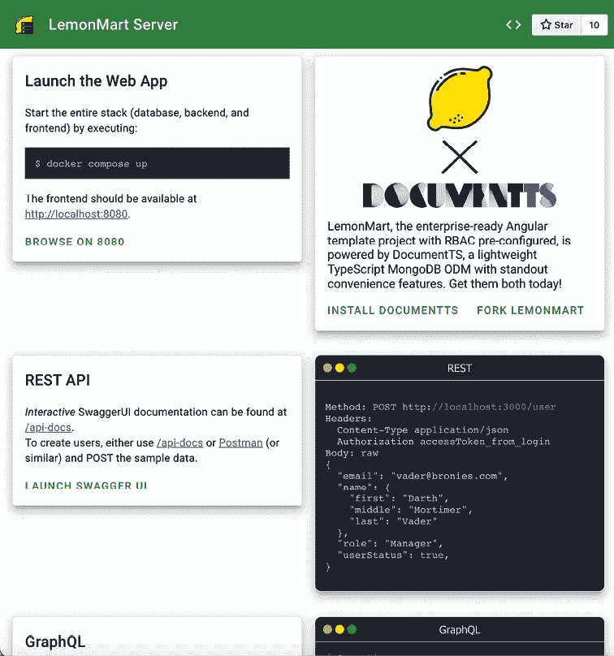
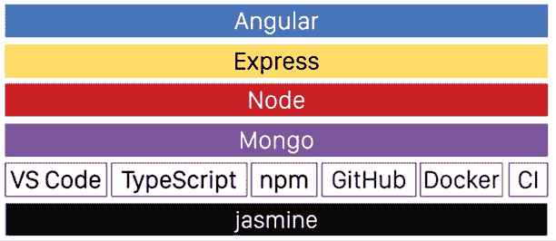
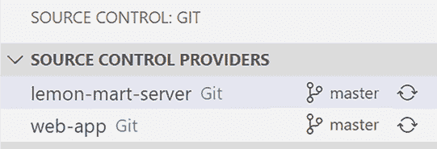
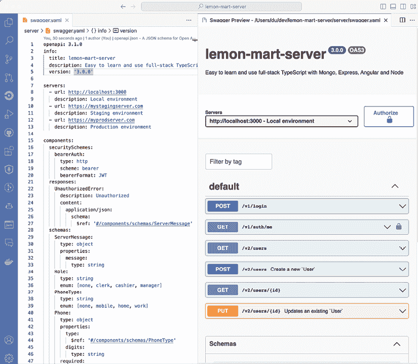
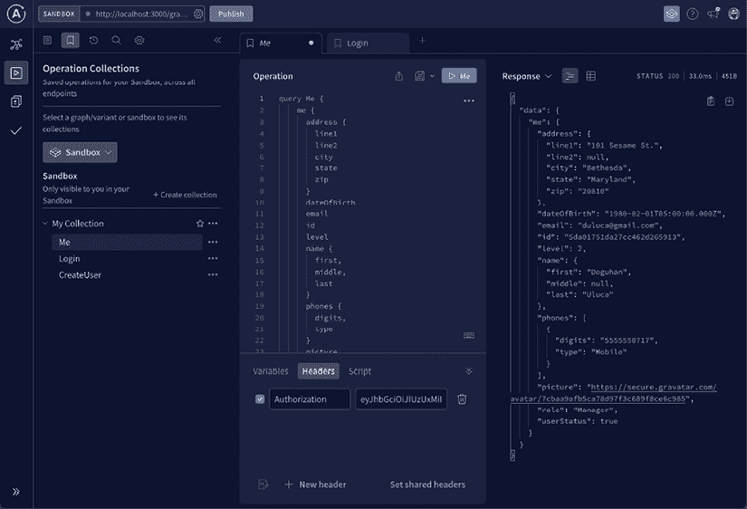
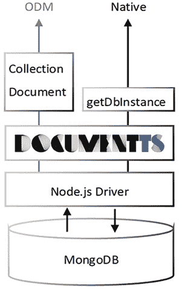

# 7

# 与 REST 和 GraphQL API 一起工作

在*第一章*，*Angular 的架构和概念*中，我向您介绍了网络应用存在的更广泛的架构，而在*第三章*，*构建企业应用*中，我们讨论了可能影响您应用成功的一系列性能瓶颈。然而，您的网络应用的表现只能与您的全栈架构的表现相匹配。如果您正在使用不充分的 API 设计或缓慢的数据库，您将花费时间实施临时解决方案，而不是解决问题的根本原因。当我们摆脱最小化思维并开始修补漏洞时，我们就在构建一个可能崩溃或维护成本极高的脆弱塔楼的道路上。简而言之，全栈架构中做出的选择可以深刻影响网络应用的成功。您和您的团队根本无法忽视 API 的设计方式。通常，实现新功能或修复性能问题的正确方法是通过重新设计 API 端点。使用**MongoDB**、**Express**、**Angular**和**Node.js**的**MEAN**栈是一套围绕类似技术构建的流行技术集合，这些技术应该有助于网络开发者的采用。我对 MEAN 栈的看法是“最小化 MEAN”，它优先考虑易用性、健康和有效性，这些都是构建出色的**DevEx**的主要成分。

在过去两章中，我们为我们的应用设计并实现了一个**基于角色的访问控制**（**RBAC**）机制。在*第五章*，*设计身份验证和授权*中，我们深入探讨了安全考虑因素，介绍了 JWT 身份验证的工作原理，学习了如何使用 TypeScript 安全地处理数据，并利用面向对象编程（**OOP**）的设计，通过继承和抽象来构建一个可扩展的认证服务。在*第六章*，*实现基于角色的导航*中，我们使用我们的认证服务设计了一个条件导航体验，并实现了针对自定义 API 和 Google Firebase 的认证提供者。

在本章中，我将向您介绍 LemonMart 服务器，该服务器实现了 JWT 身份验证、REST 和 GraphQL API。我们将使用这些 API 在 Angular 中实现两个自定义认证提供者。这将允许您对*第八章*，*食谱 – 可重用性、表单和缓存*和*第九章*，*食谱 – 主/详细、数据表和 NgRx*中将要介绍的食谱进行身份验证调用。

本章涵盖了大量的内容。它旨在作为 GitHub 仓库的路线图。[GitHub 仓库](https://github.com/duluca/lemon-mart-server)。我涵盖了架构、设计和实现的主要组件。我强调了一些重要的代码片段来解释解决方案是如何组合在一起的，但避免深入到实现细节。更重要的是，你需要理解我们为什么要实现各种组件，而不是对实现细节有深刻的掌握。对于本章，我建议你阅读并理解服务器代码，而不是试图自己重新创建它。

我们首先介绍全栈架构、LemonMart 服务器的 monorepo 设计以及如何使用 Docker Compose 运行具有 Web 应用、服务器和数据库的三层应用程序。然后，我们将回顾 REST 和 GraphQL API 的设计、实现和文档。对于 REST，我们将利用**OpenAPI**规范和**SwaggerUI**。对于 GraphQL，我们将利用**GraphQL schemas**和**Apollo Studio**。这两个 API 都将使用 Express.js 和 TypeScript 实现。然后，我们将介绍使用 DocumentTS 库实现 MongoDB 的**对象文档映射器（ODM**）以存储具有登录凭证的用户。最后，我们将实现基于令牌的身份验证功能来保护我们的 API 和 Angular 中的相应身份验证提供者。

在本章中，你将学习以下内容：

+   全栈架构

+   与 monorepos 一起工作

+   设计 API

+   使用 Express.js 实现 API

+   使用 DocumentTS 的 MongoDB ODM

+   实现 JWT 身份验证

+   自定义服务器身份验证提供者

# 技术要求

书籍示例代码的最新版本可以在 GitHub 上的以下链接仓库中找到。[链接仓库](https://github.com/duluca/lemon-mart-server)。该仓库包含代码的最终和完成状态。本章需要 Docker Desktop 和 Postman 应用程序。

确保你在开发环境中启动**lemon-mart-server**并且**lemon-mart**能够与之通信至关重要。请参考此处或 GitHub 上的`README`中的说明来启动你的服务器。

对于第七章的服务端实现：

+   使用`--recurse-submodules`选项克隆`lemon-mart-server`仓库：

    ```js
    git clone --recurse-submodules https://github.com/duluca/lemon-mart-server 
    ```

+   在 VS Code 终端中，执行`cd web-app; git checkout master`以确保从[`github.com/duluca/lemon-mart`](https://github.com/duluca/lemon-mart)克隆的子模块位于 master 分支。

    在后面的*Git 子模块*部分，你可以配置`web-app`文件夹以从你的`lemon-mart`服务器拉取。

+   在`root`文件夹中执行`npm install`以安装依赖项。

    注意，在根目录中运行`npm install`命令会触发一个脚本，该脚本还会在`server`和`web-app`文件夹下安装依赖项。

+   在根目录中执行`npm run init:env`以配置`.env`文件中的环境变量。

    此命令将在根目录和 `server` 文件夹下创建两个 `.env` 文件，以包含您的私有配置信息。初始文件基于 `example.env` 文件生成。您可以在以后修改这些文件并设置自己的安全密钥。

+   在根目录中执行 `npm run build` 以构建服务器和网页应用。

    注意，网页应用使用名为 `--configuration=lemon-mart-server` 的新配置构建，该配置使用 `src/environments/environment.lemon-mart-server.ts`。

+   执行 `docker compose up --build` 以运行服务器、网页应用和 MongoDB 数据库的容器化版本。

    注意，网页应用使用名为 `nginx.Dockerfile` 的新文件进行容器化。

+   导航到 `http://localhost:8080` 查看网页应用。

    要登录，单击**填写**按钮以使用默认的演示凭据填写电子邮件和密码字段。

+   导航到 `http://localhost:3000` 查看服务器着陆页面：

    图 7.1：LemonMart 服务器着陆页面

+   导航到 `http://localhost:3000/api-docs` 查看交互式 API 文档。

+   您可以使用 `npm run start:database` 仅启动数据库，并在 `server` 文件夹中使用 `npm start` 进行调试。

+   您可以使用 `npm run start:backend` 仅启动数据库和服务器，并在 `web-app` 文件夹中使用 `npm start` 进行调试。

对于第七章中的客户端实现：

+   克隆仓库：[`github.com/duluca/lemon-mart`](https://github.com/duluca/lemon-mart)。

+   在根目录中执行 `npm install` 以安装依赖项。

+   项目的初始状态反映在：

    ```js
    projects/stage8 
    ```

+   项目的最终状态反映在：

    ```js
    projects/stage10 
    ```

+   将阶段名称添加到任何 `ng` 命令中，以仅对该阶段执行操作：

    ```js
    npx ng build stage10 
    ```

注意，仓库根目录下的 `dist/stage10` 文件夹将包含编译结果。

请注意，书中提供的源代码和 GitHub 上的版本可能不同。这些项目周围的生态系统不断演变。由于 Angular CLI 生成新代码的方式、错误修复、库的新版本以及多种技术的并行实现，存在许多难以计数的变体。如果您发现错误或有疑问，请在 GitHub 上创建问题或提交拉取请求。

当您的 LemonMart 服务器启动并运行时，我们准备探索 MEAN 栈的架构。到本节结束时，您应该有自己的 LemonMart 版本与服务器通信。

# 全栈架构

**全栈**指的是使应用程序工作的整个软件堆栈，从数据库到服务器、API 以及利用它们的 Web 和/或移动应用程序。传说中的全栈开发者无所不知，可以轻松地在职业的各个垂直领域操作。在所有与软件相关的事物上专长并被认为是每个给定主题的专家几乎是不可能的。然而，要被认为是某个主题的专家，你也必须对相关主题有深入的了解。在了解一个新主题时，保持你的工具和语言一致非常有帮助，这样你就可以在没有额外噪音的情况下吸收新信息。

因此，我选择向你介绍 MEAN 堆栈，而不是使用 Java 的 Spring Boot 或使用 C#的 ASP.NET。通过坚持熟悉的工具和语言，如 TypeScript、VS Code、npm、GitHub、Jasmine/Jest、Docker 和 CircleCI，你可以更好地理解全栈实现是如何结合在一起的，并成为一个更好的 Web 开发者。

## 最小化 MEAN

为你的项目选择**理想的堆栈**是困难的。首先，你的技术架构应该足够满足业务需求。例如，如果你试图使用 Node.js 交付一个人工智能项目，你很可能会使用错误的堆栈。我们的重点将是交付 Web 应用程序，但除此之外，我们还有其他参数需要考虑，包括以下内容：

+   易用性

+   幸福

+   效率

如果你的开发团队将长期从事你的应用程序开发，考虑兼容性以外的因素非常重要。如果你的代码库易于使用，让你的开发者保持愉快，或者让他们觉得自己是项目的有效贡献者，你的堆栈、工具选择和编码风格可以产生重大影响。

一个良好配置的堆栈对于优秀的 DevEx 至关重要。这可能是干燥的煎饼堆和美味的小份煎饼之间的区别，适量的黄油和糖浆。

通过引入过多的库和依赖项，你可以减慢你的进度，使你的代码难以维护，并发现自己陷入引入更多库以解决其他库问题的反馈循环。赢得这场游戏的唯一方法就是简单地不参与。

如果你花时间学习如何使用几个基本的库，你可以成为一个更有效的开发者。本质上，你可以用更少的资源做更多的事情。我的建议是：

+   在编写任何一行代码之前**思考**，并应用 80-20 规则。

+   **等待**库和工具成熟，跳过测试版。

+   **快速**通过减少对新包和工具的贪婪，掌握基础知识。

在 YouTube 上观看我 2017 年 Ng 会议的演讲，标题为*用更少的 JavaScript 做更多的事情*，链接为[`www.youtube.com/watch?v=Sd1aM8181kc`](https://www.youtube.com/watch?v=Sd1aM8181kc)。

这种极简主义思维是最小化 MEAN 的设计哲学。您可以在 GitHub 上查看参考实现：[`github.com/duluca/minimal-mean`](https://github.com/duluca/minimal-mean)。请参考以下图表以了解整体架构：



图 7.2：最小化 MEAN 软件栈和工具

让我们回顾一下架构的组件：

+   **Angular**: 您应该知道这个。Angular 是表示层。Angular 构建的输出是一组静态文件，可以使用最小化的 Docker 容器`duluca/minimal-nginx-web-server`或`duluca/minimal-node-web-server`托管。

+   **Express.js**: 这是我们的 API 层。Express 是一个快速、无偏见、极简的 Node.js 网络框架。Express 拥有庞大的插件生态系统，几乎可以满足每一个需求。NestJS 建立在 Express 之上，是成熟团队的不错替代品。在最小化 MEAN 中，我们利用了一些 Express 中间件：

    +   `cors`: 配置跨源资源共享设置

    +   `compression`: 压缩通过网络发送的数据包以降低带宽使用

    +   `morgan`: 记录 HTTP 请求

    +   `express.static:` 用于提供`public`文件夹内容的函数

    +   `graphql:` 用于托管 GraphQL 端点

您可以在[`expressjs.com/`](https://expressjs.com/)了解更多关于 Express.js 的信息

+   **Node.js**: 这是服务器运行时；Express 在 Node 上运行，因此业务层将在 Node 上实现。Node 是一个轻量级且高效的 JavaScript 运行时，它使用事件驱动的、非阻塞的 I/O 模型，适用于高性能和实时应用。您可以通过使用 TypeScript 开发应用程序来提高 Node 应用程序的可靠性。

    Node 可以在任何地方运行，从冰箱到智能手表。请参阅 Frank Rosner 的博客文章，深入了解非阻塞 I/O 主题：[`blog.codecentric.de/en/2019/04/explain-non-blocking-i-o-like-im-five/`](https://blog.codecentric.de/en/2019/04/explain-non-blocking-i-o-like-im-five/)。

+   **MongoDB**: 这是持久化层。MongoDB 是一个具有动态 JSON 类似模式的文档型数据库。有关 MongoDB 的更多信息，请参阅[`www.mongodb.com/`](https://www.mongodb.com/)。

MEAN 堆栈更受欢迎，因为它利用了使用基于 JSON 的数据库的主要好处，这意味着你不需要将数据从一种格式转换到另一种格式，因为它跨越了你的堆栈层——在处理.NET、Java 和 SQL 服务器时这是一个主要痛点。你可以仅使用 JSON 来检索、显示、编辑和更新数据。此外，Node 的 MongoDB 原生驱动程序成熟、性能良好且功能强大。我开发了一个名为`document-ts`的库，旨在通过引入易于编码的丰富文档对象来简化与 MongoDB 的交互。DocumentTS 是一个非常薄的基于 TypeScript 的 MongoDB 助手，具有可选的丰富 ODM 便利功能。更多关于 DocumentTS 的信息请参阅[`github.com/duluca/document-ts`](https://github.com/duluca/document-ts)。

Minimal MEAN 利用了我们用于 Angular 开发的相同工具和语言，这使得开发者可以在前端和后端开发之间进行最小化的上下文切换。

## NestJS

Minimal MEAN 有意坚持基本原理，这样你可以更多地了解底层技术。虽然我使用 Minimal MEAN 为具有不同技能水平的大型团队交付了生产系统，但这种基础的开发体验可能并不合适。在这种情况下，你可能考虑 NestJS，这是一个用于实现全栈 Node.js 应用的流行框架。NestJS 具有丰富的功能集，其架构和编码风格类似于 Angular。

想要冒险吗？通过执行以下命令创建一个 NestJS 应用：

```js
$ npx @nestjs/cli new your-app-name --strict 
```

Nest 建立在 Express 之上，并提供了构建可扩展后端解决方案的语法糖和概念。该框架大量借鉴了 Angular 的思想来实现依赖注入、守卫、拦截器、管道、模块和提供者。内置的资源生成器可以生成实体类、**CRUD**（**创建**、**检索**、**更新**、**删除**）控制器、**数据传输对象**（**DTOs**）和服务。

例如：

```js
$ npx nest g resource users 
```

在创建资源时，你可以选择创建 REST、GraphQL、微服务或 WebSocket 端点：

```js
? What transport layer do you use?
> REST API 
  GraphQL (code first)
  GraphQL (schema first)
  Microservice (non-HTTP)
  WebSockets 
```

Nest 支持 OpenAPI 用于 REST 文档，GraphQL 也支持 GraphQL 的 schema-first 和 code-first 开发。对于具有如此多功能的库，Nest 的显式微服务支持是受欢迎的，快速启动时间和小框架大小对于操作至关重要。所有这些功能都由详细的文档在[`docs.nestjs.com/`](https://docs.nestjs.com/)中支持。

向 Kamil Mysliwiec 和 Mark Pieszak 致敬，他们创建了一个伟大的工具，并在 NestJS 周围培养了一个充满活力的社区。如果你需要，可以在[`trilon.io/`](https://trilon.io/)寻求咨询服务。

如果你访问文档网站，可能会被提供的众多选项所淹没。这就是为什么我在你用最少的 MEAN 掌握了基础知识之后，推荐使用功能丰富的库的原因。

你可以在[`nestjs.com/`](https://nestjs.com/)了解更多关于 NestJS 的信息。

接下来，让我们了解 monorepo、它们的优点和缺点。我将分享如何在 monorepo 中结合 Nx、Nest 和 Angular，然后介绍 LemonMart 服务器如何使用 Git 子模块创建 monorepo。

# 在 VS Code 中使用多根工作区

**monorepo**（**单体仓库**）是一种软件开发策略，用于在单个仓库中托管多个项目的代码。这允许统一版本控制、简化依赖关系管理，以及更容易地在项目之间共享代码。在 monorepo 中，开发者可以在同一个 IDE 窗口中跳转项目，并更容易地在项目之间引用代码，例如在前端和后端之间共享 TypeScript 接口，确保数据对象每次都保持一致。

你可以使用 VS Code 中的多根工作区在同一个 IDE 窗口中启用对多个项目的访问，你可以在*资源管理器*窗口中添加多个项目进行显示。然而，monorepo 在源代码控制级别将项目组合在一起，允许我们在 CI 服务器上一起构建它们。有关多根工作区的更多信息，请参阅[`code.visualstudio.com/docs/editor/multi-root-workspaces`](https://code.visualstudio.com/docs/editor/multi-root-workspaces)。

能够访问多个项目的代码使得提交原子更改成为可能，这意味着跨项目所做的更改可以合并为一个单独的提交。这通过将可能需要在多个仓库、部署和系统中协调的更改集中在一个地方，带来明显的优势。所有围绕维护代码质量和标准的过程也变得简化。只有一个**Pull Request**（**PR**）需要审查，一个部署需要验证，以及一组需要执行的检查。

那么为什么每个项目都不是 monorepo 呢？在大型的应用程序中，项目中的文件过多可能成为一个重大问题。它要求每个开发者都拥有顶级的硬件和 CI/CD 服务器，以便在昂贵的、高性能的硬件上运行。此外，自动部署这样的项目可能成为一个非常复杂的任务。最后，新加入团队的新成员可能会感到不知所措。

虽然 monorepos 至少可以追溯到 2000 年代初，但对于大多数公司来说，除了全球顶尖的科技公司外，它们并不实用。2019 年，当谷歌发布了开源的 Bazel 构建工具，该工具基于 2015 年的内部项目 Blaze 时，这个想法对于小规模项目来说变得可行。在 JavaScript、TypeScript 和 Web 应用程序开发领域，由前谷歌员工开发的 Nx 已经崭露头角。在管理、构建和发布包方面，Lerna 是 Nx 的近亲。

## Nx monorepo

如同在*第三章*中提到的，*构建企业级应用架构*，Nx 是一个下一代构建系统，具有一流的单一代码仓库支持和强大的集成功能。Nx 提供了一种有见地的架构，这对于大型团队和企业来说是非常受欢迎的。Nx 还提供云服务，它将利用分布式缓存和并行化来优化构建，而无需你的团队投资复杂的底层基础设施工作。

你可以通过执行以下命令来设置一个新的 Nx 工作空间：

```js
$ npx create-nx-workspace@latest 
```

或者，你可以在项目文件夹中执行以下命令来迁移现有项目：

```js
$ npx nx@latest init 
```

默认情况下，这将为你提供一个包含一个应用的单一代码仓库配置。你可以使用 Nx 生成器添加可以在组件和其他模块之间共享的库。通过将代码分离到不同的库中，同时参与项目工作的多个人不太可能遇到合并冲突。然而，如果你遵循先路由架构并在功能模块之间划分职责，你也能得到类似的结果。更多内容请参阅[`nx.dev/getting-started`](https://nx.dev/getting-started)。

问题是，这值得吗？许多专家将其用作标准工具；然而，在我追求简约的过程中，我不喜欢在刀战中带来坦克。引入这样复杂的技术对团队来说是有成本的。采用这样的工具需要克服陡峭的学习曲线。

当你在 JavaScript、TypeScript、Git、Nx、Angular、库、Node、npm 和其他服务器端技术之上层层叠加时，导航这些工具所需的认知负荷会急剧增加。此外，这些工具中的每一个都需要专业知识来正确配置、维护和随着时间的推移进行升级。

在现代硬件上（至少不是被企业级*慢速一切以便我们可以额外确保你没有病毒*软件搞砸的硬件），拥有数百个组件的 Angular 应用构建速度足够快。随着 esbuild 和 Vite 的采用，这应该会进一步改善。Nx 的分布式缓存和集中式依赖管理功能可能会对你产生决定性影响。在开始一个新项目之前，务必仔细评估你的需求；自动运行时，很容易低估或高估你的需求。

我要明确一点。如果你正在处理数千个组件，那么 Nx 是必需的。

大多数 Angular 单一代码仓库只包含前端代码。要在现有的 Angular 工作空间中使用 NestJS 配置一个全栈单一代码仓库，请安装 Nest 脚本并在 Nx 工作空间内生成一个新项目：

```js
$ npm i -D @nrwl/nest
$ npx nx g @nrwl/nest:application apps/your-api 
```

你可以在此处了解更多信息[`www.thisdot.co/blog/nx-workspace-with-angular-and-nest/`](https://www.thisdot.co/blog/nx-workspace-with-angular-and-nest/)。

接下来，让我们看看 LemonMart 服务器的单一代码仓库是如何配置的。

## Git 子模块

Git 子模块帮助您在多个仓库之间共享代码，同时保持提交的分离。前端开发者可能选择仅使用前端仓库进行工作，而全栈开发者将更喜欢访问所有代码。Git 子模块还为现有项目的合并提供了一个方便的方法。

观察一下`lemon-mart-server`项目的整体结构，您将拥有三个主要文件夹，如图所示：

```js
lemon-mart-server
├───bin
├───web-app (snapshot of lemon-mart)
├───server
│   package.json
│   README.md 
```

`bin`文件夹包含辅助脚本或工具，`web-app`文件夹代表您的前端，而`server`包含后端源代码。在我们的案例中，`web-app`文件夹是`lemon-mart`项目。我们不是复制粘贴现有项目的代码，而是利用 Git 子模块将两个仓库链接在一起。`package.json`文件包含帮助初始化、更新和清理 Git 子模块的脚本，如`modules:update`用于获取 web 应用的最新版本。

我建议您在从 GitHub 克隆的`lemon-mart-server`版本上执行以下操作。否则，您将需要创建一个新的项目并执行`npm init -y`以开始操作。

要使用您的项目初始化 web-app 文件夹：

1.  将`webAppGitUrl`更新为您自己的项目的 URL。

1.  执行`webapp:clean`以删除现有的`web-app`文件夹。

1.  最后，执行`webapp:init`命令以初始化`web-app`文件夹中的项目：

    ```js
    $ npm run webapp:init 
    ```

在继续前进时，执行`modules:update`命令以更新子模块中的代码。在另一个环境中克隆仓库后，要拉取子模块，请执行`npm modules:init`。如果您需要重置环境并重新启动，请执行`webapp:clean`以清理 Git 的缓存并删除文件夹。

注意，您可以在您的仓库中拥有多个子模块。`modules:update`命令将更新所有子模块。

您的 Web 应用程序代码现在可在名为`web-app`的文件夹中找到。此外，您应该能够在 VS Code 的**源代码控制**面板下看到这两个项目，如图所示：



图 7.3：VS Code 源代码控制提供者

使用 VS Code 的源代码控制，您可以对任一仓库独立执行 Git 操作。

如果您的子模块变得混乱，只需`cd`到子模块目录，执行`git pull`，然后`git checkout main`以恢复主分支。使用此技术，您可以从项目中的任何分支检出并提交 PR。

现在子模块已经准备好了，让我们看看服务器项目是如何配置的，这样我们就可以配置我们的 CI 服务器。

## CircleCI 配置

使用 Git 子模块的一个好处是我们可以验证我们的前端和后端是否在同一个 CI 管道中工作。`config.yml`文件实现了两个作业，这是这里显示的工作流程的一部分：

```js
**.circleci/config.yml**
...
workflows:
  build-and-test-compose:
    jobs:
      - build_server
      - build_webapp 
```

管道检出代码，使用 `audit-ci` 验证我们使用的包的安全性，安装依赖项，检查样式和 linting 错误，运行测试，并检查代码覆盖率水平。

测试命令隐式构建服务器代码，这些代码存储在 `dist` 文件夹下。在最后一步，我们将 `dist` 文件夹移动到工作区，以便我们可以在以后阶段使用它。

CI 管道将并行构建服务器和 Web 应用程序，如果主分支上的作业成功，可以选择运行 `deploy` 作业。关于 CI/CD 的更多细节可以在 *第十章，使用 CI/CD 发布到生产* 中找到。

接下来，让我们看看 RESTful 和 GraphQL API 之间的区别。

# 设计 API

在 *第三章，构建企业应用程序架构* 中，我讨论了无状态、数据驱动设计作为 Router-first 架构的一部分的重要性。作为这一目标的一部分，我强调识别应用程序将围绕其操作的主要数据实体作为一项重要活动。API 设计通过围绕主要数据实体进行设计也能带来极大的好处。

在全栈开发中，尽早确定 API 设计非常重要。如果前端和后端团队能够就主要数据实体及其形状达成一致，那么两个团队就可以就一个合同达成一致，去构建他们各自的软件组件。在 Router-first 架构中，我强调了利用 TypeScript 接口快速构建应用程序架构的重要性。后端团队也可以进行类似的活动。

一点早期的设计工作和协议确保了这些组件之间的集成可以非常早地建立，并且通过 CI/CD 管道，我们可以确保它不会分解。

CI 对于成功至关重要。最臭名昭著的案例之一是，团队直到太晚才整合关键系统，那就是 2013 年 HealthCare.gov 的灾难性发布。尽管有 300 人参与其中，并且在这个项目上花费了 3 亿美元，但它失败了。总共花费了 17 亿美元来拯救该项目并使其成功。美国政府可以承担这样的费用。您的企业可能不会这么宽容。

在设计您的 API 时，还有一些进一步的考虑因素，如果前端和后端开发者紧密合作以实现共同的设计目标，那么项目成功的几率将大大提高。

列出以下高级目标：

+   最小化客户端和服务器之间传输的数据。

+   坚持使用成熟的设计模式（例如，分页 API 设计）。

+   设计以减少客户端上的业务逻辑实现。

+   围绕主要数据实体进行设计。

+   在跨越边界时简化数据结构。

+   不要暴露数据库密钥或外键关系。

+   从一开始就版本化端点。

你应该旨在实现 API 表面背后的所有业务逻辑。前端应仅包含展示逻辑。任何由前端实现的`if`语句也应由后端验证。

如在第一章*Angular 的架构和概念*中讨论的那样，在后台和前端实现无状态设计至关重要。每个请求都应该利用非阻塞 I/O 方法，并且不依赖于现有的会话。这是在云平台上无缝扩展你的 Web 应用程序代码的关键。会话因其扩展和占用大量内存而臭名昭著。

无论何时你在实施一个项目，限制，如果可能的话，消除实验是非常重要的。这在全栈项目中尤其如此。一旦你的应用程序上线，API 设计中的失误可能会产生深远的影响，并且难以纠正。概念验证是实验和验证想法以及新技术理想的地方。它们的一个显著特点是它们的可丢弃性。

接下来，让我们来讨论围绕主要数据实体设计 REST 和 GraphQL API。在这种情况下，我们将回顾围绕用户和认证的 API 实现。在两种情况下，我们将依赖 API 规范语言。对于 REST，我们将使用 OpenAPI 规范，对于 GraphQL，我们将使用模式规范，以记录设计，以便我们可以具体地向团队成员传达 API 的意图。稍后，这些规范将成为交互式工具，反映我们 API 的能力。

## REST API

**REST**（**表示状态转移**）通常用于创建利用 HTTP 方法（动词）如**GET**、**POST**、**PUT**和**DELETE**的无状态、可靠的 Web 应用程序。REST API 定义良好且静态。像任何公开 API 一样，一旦发布，就很难，如果不是不可能的，改变它们的接口。总是可以扩展，但很难针对新兴用例进行优化，例如需要以不同方式使用 API 的移动或专用应用程序。这通常会导致 API 表面的巨大扩展，因为团队实施特定的 API 来满足新的需求。如果有多个独立的代码库需要访问相同的数据，这可能会导致可维护性挑战。

从前端开发者的角度来看，使用他们没有编写过的 API 可能是一种令人困惑的经历。大多数公开 API 和发布 API 的企业通常通过发布高质量的文档和示例来解决这个问题。这需要时间和金钱。然而，在企业环境中，一个快速发展的团队无法等待这样的文档被手动创建。

进入 OpenAPI，也称为 Swagger。OpenAPI 规范可以记录 API 名称、路由、输入和返回参数类型、编码、身份验证、请求头和预期的 HTTP 状态码。这种详细程度为 API 应如何使用留下了很少的解释空间，减少了摩擦和有缺陷的代码——所有这些都是避免后期集成挑战的关键因素。

OpenAPI 规范可以用 YAML 或 JSON 格式定义。使用此规范文件，您可以为您 API 渲染一个交互式用户界面。安装 Swagger Viewer VS Code 扩展，并在 `server` 文件夹下预览 `swagger.yaml` 文件：

此外，还有 OpenAPI (Swagger) 编辑器扩展，这是一个功能丰富的替代品。在发布时，此扩展不支持 OpenAPI 版本 3.1.0。



图 7.4：Swagger.yaml 预览

使用 Swagger UI 视图，您可以在实现后尝试命令并对其服务器环境执行它们。

### OpenAPI 规范

我们使用 OpenAPI 规范版本 `openapi: 3.1.0`。OpenAPI 规范可以记录关于您的服务器、API 的各种组件（如安全方案、响应、数据模式、输入参数）以及定义您的 HTTP 端点的路径的元数据。

让我们回顾一下位于 `server` 文件夹下的 `swagger.yaml` 文件的主要组件：

1.  YAML 文件以一般信息和目标服务器开始：

    ```js
    **server/swagger.yaml**
    openapi: 3.1.0
    info:
      title: lemon-mart-server
      description: LemonMart API
      version: "3.0.0**"**
    **servers**:
      - url: http://localhost:3000
        description: Local environment
      - url: https://mystagingserver.com
        description: Staging environment
      - url: https://myprodserver.com
        description: Production environment 
    ```

1.  在 `components` 下，我们定义常见的 `securitySchemes` 和响应，这些定义了我们打算实施的认证方案以及我们的错误消息响应的外观：

    ```js
    **server/swagger.yaml**
    **...**
    **components:**
      **securitySchemes:**
        bearerAuth:
          type: http
          scheme: bearer
          bearerFormat: JWT
      **responses:**
        UnauthorizedError:
          description: Unauthorized
          content:
            application/json:
              schema:
                $ref: "#/components/schemas/ServerMessage"
              type: string 
    ```

    注意 `$ref` 的使用，它可以重复使用重复的元素。您可以看到在这里定义了 `ServerMessage`。

1.  在 `components` 下，我们定义共享的数据 `schemas`，这些声明了我们作为输入接受的或返回给客户端的数据实体：

    ```js
    **server/swagger.yaml**
    ...
      **schemas:**
        ServerMessage:
          type: object
          properties:
            message:
              type: string
        Role:
          type: string
          enum: [none, clerk, cashier, manager]
        ... 
    ```

1.  在 `components` 下，我们定义共享的 `parameters`，这使得重用如分页端点等常见模式变得容易：

    ```js
    **server/swagger.yaml**
    ...
      **parameters:**
        filterParam:
          in: query
          name: filter
          required: false
          schema:
            type: string
          description: Search text to filter the result set by
    ... 
    ```

1.  在 `paths` 下，我们定义 REST 端点，例如 `/login` 路径的 `post` 端点：

    ```js
    **server/swagger.yaml**
    ...
    **paths:**
      /v1/login:
        post:
          description: |
            Generates a JWT, given the correct credentials.
          requestBody:
            required: true
            content:
              application/json:
                schema:
                  type: object
                  properties:
                    email:
                      type: string
                    password:
                      type: string
                  required:
                    - email
                    - password
          responses:
            '200': # Response
              description: OK
              content:
                application/json:
                  schema:
                    type: object
                    properties:
                      accessToken:
                        type: string
                    description: JWT token that contains userId as subject, email and role as data payload.
            '401':
              $ref: '#/components/responses/UnauthorizedError' 
    ```

    注意 `requestBody` 定义了类型为 `string` 的必需输入变量。在 `responses` 下，我们可以定义对请求的 `200` 成功响应和 `401` 不成功响应的外观。在前者的情况下，我们返回 `accessToken`，而在后者的情况下，我们返回在 *步骤 2* 中定义的 `UnauthorizedError`。

1.  在 `paths` 下，我们定义剩余的路径：

    ```js
    **server/swagger.yaml**
    ...
    **paths:**
      /v1/auth/me:
        get: ...
      /v2/users:
        get: ...
        post: ...
      /v2/users/{id}:
        get: ...
        put: ... 
    ```

OpenAPI 规范功能强大，允许您定义复杂的用户如何与您的 API 交互的要求。OpenAPI 规范可在 [`spec.openapis.org/oas/latest.html`](https://spec.openapis.org/oas/latest.html) 找到。在开发自己的 API 定义时，这是一个无价的资源。

我们的总体目标是集成此交互式文档与我们的 Express.js API。现在，让我们看看您如何实现这样的 API。

### OpenAPI 规范与 Express

使用 Express 配置 Swagger 是一个手动过程。但这是一件好事。强迫自己手动记录端点有积极的影响。通过放慢速度，你将有机会从 API 消费者的角度考虑你的实现。这种视角将帮助你解决开发过程中端点可能存在的潜在问题，避免令人烦恼的，如果不是昂贵的，返工。

让我们看看如何将 OpenAPI 规范直接嵌入到代码中的示例：

```js
**server/src/v1/routes/authRouter.****ts**
/**
 * @openapi
 * /v1/auth/me:
 *   get:
 *     description: Gets the `User` object of the logged in user
 *     responses:
 *       '200':
 *         description: OK
 *         content:
 *           application/json:
 *             schema:
 *               $ref: '#/components/schemas/User'
 *       '401':
 *         $ref: '#/components/responses/UnauthorizedError'
 */
router.get('/me', authenticate(), async (_req: Request, res: Response) => {
  if (res.locals.currentUser) {
    return res.send(res.locals.currentUser)
  }
  return res.status(401).send({ message: AuthenticationRequiredMessage })
}) 
```

在本例中，我们使用以 `/**` 开头的 `JSDoc` 文档语法，然后在 `@openapi` 标识符之后直接定义 OpenAPI 规范的相关部分。我们仍然可以引用其他地方定义的组件，如通过 `$ref` 语句引用 `User` 和 `UnauthorizedError` 对象所示。

将规范集成到代码旁边的最大好处是，开发者确切地知道服务器应该如何响应 `/me GET` 请求。如果存在用户，我们返回一个 `User` 对象；如果没有，我们抛出一个符合 `UnauthorizedError` 对象形状的 `401` 错误。使用一些自动化工具，我们仍然可以生成之前提到的相同的交互式 Swagger UI，因此测试人员和开发者可以直接从 Web 界面发现或测试 API。

随着 API 实现的演变，这种设置使开发者能够轻松地保持规范更新。通过使其变得容易，我们激励所有相关人员都有保持 Swagger UI 运作的动力，因为所有团队成员都从中受益。通过创建一个良性循环，我们实现了**活文档**的理想。通常，随着其变得过时，初始设计变得无用，但相反，我们可以有一个自动化和交互式的解决方案，提供持续的价值。

我们将使用两个辅助库来帮助我们集成内联规范到代码库中：

+   `swagger-jsdoc`：这允许我们通过在 `JSDoc` 注释块中使用 `@openapi` 标识符，在相关代码上方实现 OpenAPI 规范，输出一个 `swagger.json` 文件。

+   `swagger-ui-express`：这个库消耗 `swagger.json` 文件以显示交互式的 Swagger UI Web 界面。

让我们探索 Swagger 如何配置与 Express.js 一起工作：

1.  TypeScript 的依赖和类型信息如下所示：

    ```js
    $ npm i swagger-jsdoc swagger-ui-express
    $ npm i -D @types/swagger-jsdoc @types/swagger-ui-express 
    ```

1.  让我们探索 `docs-config.ts` 文件，它配置了基本的 OpenAPI 定义：

    ```js
    **server/src/docs-config.****ts**
    import * as swaggerJsdoc from 'swagger-jsdoc'
    import { Options } from 'swagger-jsdoc'
    import * as packageJson from '../package.json'
    const options: Options = {
      swaggerDefinition: {
        openapi: '3.1.0',
        components: {},
        info: {
          title: packageJson.name,
          version: packageJson.version,
          description: packageJson.description,
        },
        servers: [
          {
            url: 'http://localhost:3000',
            description: 'Local environment',
          },
          {
            url: 'https://mystagingserver.com',
            description: 'Staging environment',
          },
          {
            url: 'https://myprodserver.com',
            description: 'Production environment',
          },
        ],
      },
      apis: [
        '**/models/*.js', 
        '**/v1/routes/*.js', 
        '**/v2/routes/*. js'
      ],
    }
    export const specs = swaggerJsdoc(options) 
    ```

    修改 `servers` 属性以包含你的测试、预发布或生产环境的位置。这允许 API 的消费者使用 Web 界面测试 API，而无需额外的工具。请注意，`apis` 属性通知代码文件 `swaggerJsdoc` 在构建 `swagger.json` 文件时应解析的文件。这个程序在服务器引导过程中运行，这就是为什么我们引用了转译的 `.js` 文件而不是 `.ts` 文件。

1.  在 `app.ts` 中引导 `swagger` 配置：

    ```js
    **server/src/app.****ts**
    import * as swaggerUi from 'swagger-ui-express'
    import { specs } from './docs-config'
    const app = express()
    app.use(cors())
    ...
    **app.****use****(****'/api-docs'****, swaggerUi.****serve****, swaggerUi.****setup****(specs))**
    **app.****get****(****'/swagger'****,** **function** **(****_req, res****) {**
     **res.****json****(specs)**
    **})**
    ...
    export default app 
    ```

规范包含`swagger.json`文件的内容，然后传递给`swaggerUi`。然后，使用`server`中间件，我们可以配置`swaggerUi`在`/api-docs`上托管 Web 界面。我们还可以从端点提供 JSON 文件，以便在其他工具中使用，如上所示。

即使在将规范文件与代码集成之后，开发者也必须手动确保规范和代码的一致性。这个过程可以自动化，包括生成基于 TypeScript 的 API 处理程序以防止编码错误。

可以在[`openapi.tools/`](https://openapi.tools/)找到由社区驱动的 OpenAPI 高质量和现代工具列表。

现在你已经了解了我们如何设计 REST API 并在其周围创建活文档，现在是时候学习 GraphQL 了，它将这些想法融入其核心设计。

## GraphQL API

**GraphQL**（**图查询语言**），由 Facebook 发明，是一种现代的 API 查询语言，它提供了一种比传统 REST API 更灵活、更健壮、更高效的替代方案。在 GraphQL 中，你不需要使用 HTTP 动词，而是编写一个查询来获取数据，一个突变来 POST、PUT 或 DELETE 数据，以及订阅以 WebSocket 风格推送数据。与 REST 不同，REST 为每个资源暴露一组固定的端点，而 GraphQL 允许客户端请求他们确切需要的数据，不多也不少。这意味着客户端可以根据他们的需求来塑造响应，从而减少过度获取和不足获取的问题。我们不再需要设计完美的 API 表面来获得最佳结果。

在全栈开发领域，正如在*设计 API*部分中提到的，围绕主要数据实体进行设计的重要性不容忽视。GraphQL 在这方面表现出色。其类型系统确保 API 围绕这些主要数据实体进行塑造，为前端和后端团队提供了一个清晰的合同。这个类型系统，定义在 GraphQL 模式中，作为合同，指定可以获取的数据类型和可用的操作集。

对于前端开发者来说，深入探索 GraphQL API 可以是一种令人耳目一新的体验。GraphQL 的反思性意味着可以查询其自身的模式以获取详细信息。

这种自文档特性确保开发者始终拥有最新的参考，消除了需要单独手动维护文档的需求。这对于企业环境中的敏捷团队特别有益，在这些环境中，等待文档并不总是可行的。

进入 GraphQL Playground 或 GraphiQL 交互式环境，开发者可以实时测试和探索 GraphQL 查询。这些工具与 OpenAPI 的 Swagger UI 类似，提供即时反馈，使开发者能够理解 API 的结构、类型和操作。这种动手方法降低了学习曲线，并促进了开发者对 API 功能的更深入理解。

接下来，让我们探索如何围绕主要数据实体设计 GraphQL API，确保它们与我们在 Router-first 架构和其他最佳实践中概述的原则保持一致。

### GraphQL 模式

GraphQL 模式是任何 GraphQL API 的核心，作为客户端和服务器之间的合约。它通过定义类型和类型之间的关系来描述 API 的结构和能力。这些类型模拟了 API 操作的主要数据实体。

让我们从探索位于 `server/graphql` 下的 `graphql.schema` 文件开始：

1.  使用 `type` 关键字，我们可以定义数据对象：

    ```js
    **server/graphql/graphql.schema**
    type User {
      address: Address
      dateOfBirth: String
      email: String!
      id: ID!
      level: Float
      name: Name!
      phones: [Phone]
      picture: String
      role: Role!
      userStatus: Boolean!
      fullName: String
    } 
    ```

    这个 `User` 类型具有标量字段，如 `id` 和 `email` 字段，代表原始值类型如 `ID`、`String`、`Int`、`Float` 和 `Boolean`。感叹号 `!` 表示这些字段是必需的。我们还可以定义类型之间的关系，例如 `Name` 或 `Phone`。方括号 `[]` 表示 `phones` 是 `Phone` 对象的数组。

1.  我们还可以定义枚举并像标量类型一样使用它们：

    ```js
    **server****/****graphql****/****graphql.schema**
    enum Role {
      None
      Clerk
      Cashier
      Manager
    } 
    ```

1.  使用保留类型 `Query`，我们可以定义如何检索数据：

    ```js
    **server****/****graphql****/****graphql.schema**
    type Query {
      # Gets a `User` object by id
      # Equivalent to GET /v2/users/{id}
      user(id: ID!): User 
    } 
    ```

    我们可以定义可接受的参数和返回类型。

1.  使用保留类型 `Mutation`，我们可以定义如何修改状态：

    ```js
    **server/graphql/graphql.schema**
    type Mutation {
      # Generates a JWT, given correct credentials.
      # Equivalent to POST /v1/auth/login
      login(email: String!, password: String!): JWT
      # Create a new `User`
      # Equivalent to POST /v2/users
      createUser(userInput: UserInput!): User
    } 
    ```

    我们可以定义一个登录或 `createUser` 方法。注意，`createUser` 接受一个输入对象，如果我们想传递整个对象作为参数，则该对象是必需的。

1.  输入对象使用 `input` 关键字声明：

    ```js
    **server/graphql/graphql.schema**
    input UserInput {
      address: AddressInput
      dateOfBirth: String
      email: String!
      level: Float
      name: NameInput!
      phones: [PhoneInput]
      picture: String
      role: Role!
      userStatus: Boolean!
    } 
    ```

注意，任何相关对象也必须使用输入声明。输出类型和输入数据不能混合。

如您可能已经注意到的，我们还可以使用 # 符号或可选的三重引号 `"""` 语法添加描述来记录我们的 API。

模式使用 GraphQL **模式定义语言**（**SDL**）定义。您可以在 [`graphql.org/`](https://graphql.org/) 访问 SDL 规范。它是任何构建良好定义的 GraphQL API 的人的必备资源。

总体而言，该模式在客户端和服务器之间提供了一个严格的合约。它明确提供了可用的数据形状和能力。前端和后端团队可以针对此合约并行构建功能，并且像 GraphQL Playground 这样的工具使得模式交互式。

我们将使用 Apollo GraphQL 库来帮助在我们的 Express 服务器中以编程方式构建模式。

### Apollo 与 Express

Apollo GraphQL 是一套全面且广泛采用的工具和服务套件，旨在帮助开发者轻松构建、管理和扩展 GraphQL 应用程序。由 Meteor 开发组开发，Apollo 由于其强大的功能和开发者友好的方法，已成为许多开发者进行 GraphQL 开发的同义词。以下是 Apollo GraphQL 的概述：

+   **Apollo Client**：一个先进的 GraphQL 客户端，用于管理本地和远程数据。它可以无缝集成到任何 JavaScript 前端框架中，如 React、Vue 或 Angular。Apollo Client 提供了缓存、乐观 UI 更新和实时订阅等功能，使得获取、缓存和修改应用程序数据变得更加容易。

+   **Apollo Server**：一个由社区驱动的开源 GraphQL 服务器，可以与任何 GraphQL 模式一起工作。Apollo Server 提供性能跟踪和错误跟踪，并支持模式拼接，允许将多个 GraphQL API 合并成一个统一的 API。

+   **Apollo Client 开发者工具**：提供丰富的浏览器内开发体验的浏览器扩展。开发者可以查看他们的 GraphQL 存储，检查活动查询，并使用内置的 GraphiQL IDE 与他们的 GraphQL 服务器进行交互。

Apollo 作为其云服务的一部分提供了更高级的开发工具，即 Apollo Studio。Apollo Federation 允许组织将他们的单体 GraphQL API 划分为更小、更易于维护的微服务。它提供了一种将多个 GraphQL 服务组合成单个数据图的方法。Apollo Link 允许开发者创建可链式的“链接”来处理日志记录、请求重试甚至离线缓存等任务。

从本质上讲，Apollo GraphQL 提供了一种全面的 GraphQL 开发方法，为初学者和高级用户提供工具和服务。无论您是构建小型应用程序还是扩展大型企业系统，Apollo 的工具都能确保出色的开发体验。

GraphQL 模式和 GraphQL 库是不可分割的，因此我们不需要采取额外步骤来配置模式定义以与代码库一起工作，就像我们与 OpenAPI 一起做的那样。

要从 GraphQL 模式生成类型，请遵循 [`www.apollographql.com/docs/apollo-server/workflow/generate-types/`](https://www.apollographql.com/docs/apollo-server/workflow/generate-types/) 提供的指南。

接下来，让我们看看如何使用 Express.js 配置您的模式和 Apollo：

1.  安装 Apollo 服务器：

    ```js
    $ @apollo/server 
    ```

1.  打开 `api.graphql.ts` 文件，该文件配置了 Apollo 服务器：

    ```js
    **server/src/graphql/api.****graphql****.****ts**
    ...
    import { resolvers } from './resolvers'
    const typeDefs = readFileSync('./src/graphql/schema.graphql', 
    ...
    export async function useGraphQL(app: Express) {
      const server = new ApolloServer<AuthContext>({
        typeDefs,
        resolvers,
      })
      await server.start()
      ...
      )
    } 
    ```

1.  使用 `node:fs`，我们将模式文件读取到 `typeDefs` 对象中，并将其传递给一个新的 `ApolloServer` 实例，同时传递一个对解析器的引用。最后，我们调用 `server.start()` 并导出 `useGraphQL` 函数。

1.  在 `index.ts` 中启动 Apollo 服务器：

    ```js
    **server/src/index.****ts**
    import app from './app'
    ...
    **async****function****start****() {**
      **...**
      **Instance** **= http.****createServer****(app)**
      **await****useGraphQL****(app)**
            ...
          }
          start() 
    ```

在 `index.ts` 中，在我们创建由 app 变量定义的 Express 服务器实例之后，我们调用 `useGraphQL` 函数来启动它。这种配置允许我们同时实现 REST 和 GraphQL API。如以下所示，GraphQL API 和交互式探索工具可以通过 `/graphql` 访问：



图 7.5：GraphQL 探索器

现在您已经了解了 REST 和 GraphQL API 之间的区别以及我们如何使用 Express.js 等效地配置它们，让我们看一下服务器的整体架构。

# 使用 Express.js 实现 API

让我们回顾一下我们后端的结构和文件结构，以便我们了解服务器是如何启动的，API 端点的路由是如何配置的，公共资源是如何提供的，以及服务是如何配置的。

查看我们的 Express 服务器文件结构：

```js
server/src
├── api.ts
├── app.ts
├── config.ts
├── docs-config.ts
├── graphql
│   ├── api.graphql.ts
│   ├── helpers.ts
│   └── resolvers.ts
├── index.ts
├── models
│   ├── enums.ts
│   ├── phone.ts
│   └── user.ts
├── public
├── services
│   ├── authService.ts
│   └── userService.ts
├── v1
│   ├── index.ts
│   └── routes
│       └── authRouter.ts
└── v2
    ├── index.ts
    └── routes
        └── userRouter.ts 
```

接下来，我们将通过查看组件图来回顾这些文件的目的和交互，从而获得架构和依赖树的概览：


图 7.6：Express 服务器架构

`index.ts` 包含一个 `start` 函数，该函数启动应用程序，利用四个主要助手：

+   `config.ts`：管理环境变量和设置。

+   `app.ts`：配置 Express.js 并定义所有 API 路径，然后路由实现路径并利用包含业务逻辑的服务。服务使用模型，如 `user.ts`，来访问数据库。

+   `api.graphql.ts`：配置 GraphQL，解析器实现查询，并使用相同的解析器和突变器利用相同的服务来访问数据库。

+   `document-ts`：建立与数据库的连接，配置它，并在启动期间利用 `user.ts` 配置种子用户。

您可以看到，图顶部的组件负责启动和配置任务，包括配置 API 路径，这代表了 **API** 层。**业务**层应该包含应用程序的大部分业务逻辑，而数据访问则在 **持久层** 处理。

参考以下 `index.ts` 的实现，它展示了所有主要组件按顺序的简化版本：

```js
**server/src/index.****ts**
...
export let server: http.Server
async function start() {
  await document.connect(config.MongoUri, config.IsProd)
  server = http.createServer(app)
  await useGraphQL(app)
  server.listen(config.Port, async () => {
    console.log(`Server listening on port ${config.Port}...`)
  })
}
start() 
```

注意，显示的最后一行代码 `start()` 是触发服务器初始化的功能调用。

现在，让我们来调查一下 Express 服务器是如何设置的。

## 服务器启动

`app.ts` 配置 Express.js，包括提供静态资源、路由和版本控制。Express.js 利用中间件函数与库或您的代码集成。中间件是在对 Express 服务器请求的生命周期中执行的函数。中间件函数可以访问请求和响应对象以及应用程序请求-响应周期中的下一个中间件函数。这种访问允许它们执行任何代码，进行更改，结束请求-响应周期，并调用堆栈中的下一个中间件。在下面的代码中，cors、logger 和 compression 是库函数，在章节的后面，我们将介绍自定义认证中间件的实现：

```js
**server/src/app.****ts**
import api from './api'
const app = express()
app.use(cors())
app.use(express.json())
app.use(express.urlencoded({ extended: true }))
app.use(logger('dev'))
app.use(compression())
app.use('/', express.static(path.join(__dirname, '../public'), { redirect: false }))
app.use(api)
export default app 
```

在前面的代码中，请注意，使用`use()`方法配置 Express 非常简单。首先，我们配置`cors`，然后是`express`解析器、`logger`和`compression`。

接下来，使用`express.static`函数，我们在根路由`/`上提供`public`文件夹，这样我们就可以显示有关我们服务器的一些有用信息，如本章开头所示的*图 7.1*。

最后，我们配置路由器，该路由器在`api.ts`中定义。

## REST 路由和版本控制

`api.ts`配置 Express 路由器。请参考以下实现：

```js
**server/src/api.****ts**
import { Router } from 'express'
import api_v1 from './v1'
import api_v2 from './v2'
const api = Router()
// Configure all routes here
api.use('/v1', api_v1)
api.use('/v2', api_v2)
export default api 
```

在这种情况下，我们有`v1`和`v2`两个子路由。始终对实现的 API 进行版本控制是至关重要的。一旦 API 公开，简单地淘汰一个 API 以支持新版本可能会变得很棘手，有时甚至不可能。即使是微小的代码更改或 API 的细微差异也可能导致客户端崩溃。你必须仔细注意，只对你的 API 进行向后兼容的更改。

在某个时候，你可能需要完全重写端点以满足新的要求、性能和业务需求，此时，你可以简单地实现端点的`v2`版本，同时保持`v1`实现不变。这允许你以你需要的速度进行创新，同时保持你的应用程序的旧版消费者功能正常。

简而言之，你应该为创建的每个 API 进行版本控制。通过这样做，你迫使你的消费者对你的 API 的 HTTP 调用进行版本控制。随着时间的推移，你可以在不同的版本下过渡、复制和退役 API。消费者随后可以选择调用对他们有用的 API 版本。

配置路由很简单。让我们看看`v2`的配置，如下所示：

```js
**server/src/v2/index.****ts**
import { Router } from 'express'
import userRouter from './routes/userRouter'
const router = Router()
// Configure all v2 routers here
router.use('/users?', userRouter)
export default router 
```

`/users?`结尾的问号意味着`/user`和`/users`都将针对`userRouter`中实现的操作工作。这是一种避免拼写错误的同时允许开发者选择对操作有意义的复数形式的好方法。

在`userRouter`中，你可以实现 GET、POST、PUT 和 DELETE 操作。请参考以下实现：

```js
**server/src/v2/routes/userRouter.****ts**
const router = Router()
router.get('/', async (req: Request, res: Response) => {})
router.post('/', async (req: Request, res: Response) => {})
router.get('/:userId', async (req: Request, res: Response) => {})
router.put('/:userId', async (req: Request, res: Response) => {})
export default router 
```

在前面的代码中，你可以观察到路由参数的使用。你可以通过请求对象，如`req.params.userId`，来消费路由参数。

注意，示例代码中的所有路由都被标记为`async`，因为它们都会进行数据库调用，我们将等待这些调用。如果你的路由是同步的，那么你不需要`async`关键字。

接下来，让我们调查 GraphQL 解析器。

## GraphQL 解析器

GraphQL 解析器在`resolvers.ts`中实现。GraphQL 服务器对查询进行广度优先遍历，并递归调用解析器以生成响应。

让我详细说明一下——当一个 GraphQL 服务器接收到一个查询时，它会逐层处理请求，从顶层字段开始，水平地穿过结构，就像在树的每一层移动之前先进行搜索，这被称为广度优先遍历。对于它遇到的每个字段，服务器将调用一个特定的函数，称为解析器，用于获取该字段的数据。如果一个字段复杂且包含嵌套子字段，该字段的解析器将依次调用其他解析器来获取每个子字段的数据。这个过程会重复进行，根据需要进入查询的层次结构，直到检索到查询的所有数据，并将其组装成与原始查询布局相匹配的结构化响应。

参考以下实现：

```js
**server/src/graphql/resolvers.****ts**
export const resolvers = {
  Query: {
    me: () => ...,
    user: () => ...,
    users: () => ...,
  },
  Mutation: {
    login: () => ...,
    },
    createUser: () => ...,
    updateUser: () => ...,
  }, 
 a resolver function for each query and mutation implemented in the scheme. Each resolver takes in four arguments (parent, args, contextValue, info): parent can be used to access a parent resolver, args contains any input arguments passed in, contextValue stores session data useful for auth, and info contains metadata about the query itself. Next, let’s look at the type resolvers:
```

```js
**server/src/graphql/resolvers.****ts**
  User: {
    id: (obj: User) => obj._id.toString(),
    role: (obj: User) => EnumValues.getNameFromValue(Role, obj.role),
    phones: (obj: User) => (obj.phones ? wrapAsArray(obj.phones) : []),
    dateOfBirth: (obj: User) => obj.dateOfBirth?.toISOString(),
  },
  Phone: {
    type: (obj: { type: string }) =>
      EnumValues.getNameFromValue(PhoneType, obj.type),
  },
  Users: {
    data: (obj: Users) => (obj.data ? wrapAsArray(obj.data) : []),
  },
} 
```

对于非标量类型、数组或枚举，我们可能需要提供转换，以便 GraphQL 可以适当地解包从数据库检索到的数据。好处是我们只需要为需要此类操作的对象的特定属性提供解析器。

解析器可能看起来很简单，但它们可以满足非常复杂的需求，例如，一个简单的客户端请求可能涉及多次调用服务和数据库，并将结果汇总成一个高效的响应，以便客户端可以显示它。

解析器的原子性质意味着我们只需要实现一次。接下来，让我们探索如何配置服务。

## 服务

我们不希望在表示我们的 API 层的路由器文件中实现我们的业务逻辑。API 层应主要包含转换数据和调用业务逻辑层。

您可以使用 Node.js 和 TypeScript 功能来实现服务。不需要复杂的依赖注入。示例应用程序实现了两个服务 - `authService`和`userService`。

例如，在`userService.ts`中，您可以实现一个名为`createNewUser`的函数：

```js
**server/src/services/userService.****ts**
import { IUser, User } from '../models/user'
export async function createNewUser(userData: IUser):
  Promise<User | boolean> {
  // create user
} 
```

`createNewUser`接受`userData`，其形状为`IUser`，当它完成用户创建后，返回一个`User`实例。然后我们可以在我们的路由器中如下使用此函数：

```js
**server/src/v2/routes/userRouter.****ts**
import { createNewUser } from '../../services/userService'
router.post('/', async (req: Request, res: Response) => {
  const userData = req.body as IUser
  const success = await createNewUser(userData)
  if (success instanceof User) {
    res.send(success)
  } else {
    res.status(400).send({ message: 'Failed to create user.' })
  }
}) 
```

我们可以等待`createNewUser`的结果，如果成功，将创建的对象作为对 POST 请求的响应返回。

注意，尽管我们将`req.body`转换为`IUser`，但这只是一个开发时的便利功能。在运行时，消费者可能将任意数量的属性传递到主体中。粗心处理请求参数是您的代码可能被恶意利用的主要方式之一。

恭喜！现在，您已经很好地理解了我们的 Express 服务器是如何工作的。接下来，让我们看看如何连接到 MongoDB。

# MongoDB ODM with DocumentTS

DocumentTS 充当一个**ODM**，实现了一层模型，以实现与数据库对象的丰富和可定制的交互。ODM 是关系数据库中**对象关系映射器**（ORM）的文档数据库等价物。想想 Hibernate 或 Entity Framework。如果您不熟悉这些概念，我建议您在继续之前进行进一步的研究。

要开始，您可以查看以下文章，*MongoDB ORMs，ODMs 和库*，在[`www.mongodb.com/developer/products/mongodb/mongodb-orms-odms-libraries`](https://www.mongodb.com/developer/products/mongodb/mongodb-orms-odms-libraries)。

在其核心，DocumentTS 利用 MongoDB 的 Node.js 驱动程序。MongoDB 的制作者实现了这个驱动程序。它保证了最佳性能和与新 MongoDB 版本的功能一致性，而第三方库通常在支持新功能方面落后。通过使用`database.getDbInstance`方法，您可以直接访问原生驱动程序。否则，您将通过您实现的模型访问 Mongo。参考以下图表以获取概述：



图 7.7：DocumentTS 概述

您可以在[`mongodb.github.io/node-mongodb-native/`](https://mongodb.github.io/node-mongodb-native/)上了解更多关于 MongoDB 的 Node.js 驱动程序的信息。

有关 DocumentTS 的工作方式和配置细节的更多详细信息，请参阅 GitHub 上的项目 Wiki [`github.com/duluca/document-ts/wiki`](https://github.com/duluca/document-ts/wiki)。Wiki 涵盖了连接到数据库、定义实现`IDocument`的模型以及配置数据的序列化和反序列化。模型允许包含计算属性，如`fullName`，在客户端响应中，同时排除如密码等字段。密码也被防止以明文形式保存到数据库中。

概述继续通过演示如何创建索引和使用聚合查询数据库。它为电子邮件创建了一个唯一索引，因此不能注册重复的电子邮件。一个加权文本索引有助于过滤查询结果。DocumentTS 旨在在原生 MongoDB 驱动程序之上提供一个方便且可选的层，以帮助构建完全异步的 Web 应用程序。开发者直接接触到 MongoDB 驱动程序，因此他们学习如何与数据库而不是仅仅与库一起工作。

让我们看看如何使用新的用户模型来获取数据。

# 实现 JWT 认证

在*第五章*，*设计认证和授权*中，我们讨论了实现基于 JWT 的认证机制。在 LemonMart 中，您实现了一个基础认证服务，它可以扩展为自定义认证服务。

我们将利用三个包来实现我们的实现：

+   `jsonwebtoken`: 用于创建和编码 JWT

+   `bcryptjs`: 用于在数据库中保存用户密码之前对其进行哈希和加盐，因此我们永远不会以明文形式存储用户的密码

+   `uuid`：一个生成的全局唯一标识符，当需要将用户的密码重置为随机值时非常有用

散列函数是一种一致可重复的单向加密方法，这意味着每次提供相同的输入时都会得到相同的输出，即使您有权访问散列值，也无法轻易地找出它存储的信息。然而，我们可以通过散列用户的输入并将其与存储的密码散列值进行比较，来验证用户是否输入了正确的密码。

认证服务在存储用户密码之前对其进行散列，并在登录时比较散列密码。`createJwt`函数在成功登录后生成 JWT 访问令牌。认证中间件解码 JWT 并将用户加载到响应流中，以便认证端点可以访问。

注意代码中不正确的电子邮件/密码消息的模糊性。这样做是为了防止恶意行为者利用认证系统。

对于密码散列，`User`模型的`setPassword`方法使用 bcrypt 的`genSalt`和`hash`函数。`comparePassword`方法将存储的散列密码与用户输入的散列密码进行比较。这确保密码永远不会以纯文本形式存储。

登录 API 端点通过电子邮件查找用户，调用`comparePassword`来验证密码，成功后调用`createJwt`生成包含电子邮件、角色等用户详情的已签名 JWT，并将 JWT 作为`accessToken`返回给客户端：

```js
// Example of hashing and salting password
user.setPassword = async (password) => {
  const salt = await bcrypt.genSalt(10);
  return await bcrypt.hash(password, salt); 
} 
```

认证中间件解码 JWT，通过编码的`id`查找用户，并将用户注入到`res.locals.currentUser`中。像`/me`这样的认证端点可以方便地访问用户信息。它还通过检查如`requiredRole`之类的选项来处理基于角色的访问：

```js
// Example of JWT-based login
router.post('/login', async (req, res) => {
  const user = await User.findByEmail(req.body.email);
  if (user && user.comparePassword(req.body.password)) {
    const accessToken = createJwt(user);
    return res.send({accessToken});
  }
  return res.status(401).send('Invalid credentials');
}) 
```

当通过电子邮件检索用户时，请记住电子邮件是不区分大小写的，因此您应该始终将输入转换为小写。您可以通过验证电子邮件并删除任何空白、脚本标签或甚至恶意 Unicode 字符来进一步改进此实现。考虑使用`express-validator`或`express-sanitizer`等库。

## 认证中间件

`authenticate`函数是我们可以在 API 实现中使用的中间件，以确保只有具有适当权限的认证用户可以访问端点。请记住，真正的安全性是在您的后端实现中实现的，而这个`authenticate`函数是您的守门人。

`authenticate`接受一个可空的`options`对象，使用`requiredRole`属性验证当前用户的角色，因此如果 API 配置如下，则只有经理可以访问该 API：

```js
authenticate(**{** **requiredRole****:** **Role****.****Manager** **}**) 
```

在某些情况下，我们希望用户能够更新自己的记录，同时也允许经理更新其他所有人的记录。在这种情况下，我们利用`permitIfSelf`属性，如下所示：

```js
authenticate({
    requiredRole: Role.Manager,
    **permitIfSelf****: {**
      **idGetter****:** **(****req: Request****) =>** **req.****body****.****_id****,**
      **requiredRoleCanOverride****:** **true****,**
    **},**
  }), 
```

在这种情况下，如果更新记录的 `_id` 与当前用户 `_id` 匹配，则用户可以更新自己的记录。由于 `requiredRoleCanOverride` 设置为 `true`，经理可以更新任何记录。如果设置为 `false`，则不允许这样做。通过混合和匹配这些属性，你可以覆盖大多数门控需求。

注意，`idGetter` 是一个函数委托，这样你就可以指定在 `authenticate` 中间件执行时 `_id` 属性应该如何访问。

查看以下简化版 `authenticate` 中间件及其使用的示例实现：

完整实现可以在 `server/src/services/auth.service.ts` 中找到。

```js
// Authenticate middleware
function authenticate(options) {
  return async (req, res, next) => {
    const user = await decodeAndFindUser(req.headers.authorization);
    if (user) {
      // Check role if required
      if (options.requiredRole && user.role !== options.requiredRole) {
        return res.status(403).send("Forbidden");
      }

      // Attach user to response 
      res.locals.user = user;

      return next();
    } else {
      return res.status(401).send('Unauthenticated');
    }
  }
}
// Usage in RESTful route
router.get('/me', authenticate(), (req, res) 
  => res.send(res.locals.user)
) 
```

`authenticate` 方法作为 Express.js 中间件实现。它可以读取请求头中的授权令牌，验证提供的 JWT 的有效性，加载当前用户，并将其注入到响应流中，以便认证的 API 端点可以方便地访问当前用户的信息。这在上面的 `me` API 中显示。如果成功，中间件调用 `next()` 函数将控制权交还给 Express。如果失败，则无法调用 API。

注意，`authenticateHelper` 返回有用的错误消息，所以如果用户尝试执行他们无权执行的操作，他们不会感到困惑。

在 GraphQL 中，认证和授权是分开处理的。在 Express.js 层级上，我们将 `authenticate` 中间件应用于 `/graphql` 路由。然而，为了使探索、内省和登录函数正常工作，我们必须对规则进行例外处理。请参阅下面的代码，它实现了这种逻辑：

```js
// GraphQL authentication
app.use('/graphql', authenticate({ 
    authOverridingOperations: ['Login'] 
  })
)
// Usage in GraphQL resolver
me: (parent, args, contextValue) => authorize(contextValue), 
```

查看 `server/src/graphql/resolvers.ts` 以了解认证实现的完整示例。

`authOverridingOperations` 属性通知 `authenticate` 允许调用内省和 `Login` 函数。现在对其他 GraphQL 函数的所有调用都将使用在解析器中可用的认证上下文进行认证。在解析器中，我们可以使用 `authorize` 方法（位于 `server/src/graphql/helpers.ts`）来检查请求者是否可以查看他们试图访问的资源。`contextValue` 存储会话上下文，类似于 Express 中的 `res.local`。

接下来，让我们实现两个自定义认证提供者，一个用于 REST，另一个用于 GraphQL。

# 自定义服务器认证提供者

现在你已经理解了我们服务器中的认证实现，我们可以在 LemonMart 中实现一个自定义认证提供者，如第六章*实现基于角色的导航*所述：

你必须在你的 Angular 应用中实现这个自定义认证提供者。

本节的代码示例位于 `lemon-mart-app` 的 `app` 或 `web-app` 文件夹中的 `projects/stage10` 文件夹。

1.  首先，在 `environment.ts` 中创建一个 `baseUrl` 变量，以便我们可以连接到你的服务器。

1.  在 `environment.ts` 和 `environment.prod.ts` 中实现一个 `baseUrl` 变量。

1.  此外，选择 `authMode` 为 `AuthMode.CustomServer`：

    ```js
    **web-app/src/environments/environment.****ts**
    **web-app/src/environments/environment.****prod****.****ts**
    export const environment = {
      ...
      baseUrl: 'http://localhost:3000',
      authMode: AuthMode.CustomServer, 
    ```

1.  安装一个辅助库以编程方式访问 TypeScript 枚举值：

    ```js
    $ npm i ts-enum-util 
    ```

1.  如下所示，使用 `HttpClient` 实现基于 RESTful 的自定义身份验证提供者：

    ```js
    **web-app/src/app/auth/auth.****custom****.****service****.****ts**
    import { $enum } from 'ts-enum-util'
    ...
    @Injectable(@Injectable({ providedIn: 'root' }))
    export class CustomAuthService extends AuthService {
      private httpClient: HttpClient = inject(HttpClient)
      protected authProvider(
        email: string,
        password: string
      ): Observable<IServerAuthResponse> {
        return this.httpClient.post<IServerAuthResponse>
          (`${environment.baseUrl}/v1/auth/login`, {
            email,
            password,
          })
          .pipe(first())
      }
      protected transformJwtToken(token: IJwtToken): IAuthStatus {
        return {
          isAuthenticated: token.email ? true : false,
          userId: token.sub,
          userRole: $enum(Role)
            .asValueOrDefault(token.role, Role.None),
          userEmail: token.email,
          userPicture: token.picture,
        } as IAuthStatus
      }
      protected getCurrentUser(): Observable<User> {
        return this.httpClient
          .get<IUser>(`${environment.baseUrl}/v1/auth/me`)
            .pipe(
            first(),
            map((user) => User.Build(user)),
              catchError(transformError)
            )
      }
    } 
    ```

1.  `authProvider` 方法调用我们的 `/v1/auth/login` 方法，而 `getCurrentUser` 调用 `/v1/auth/me` 来检索当前用户。

    确保对 `login` 方法的调用始终发生在 HTTPS 上。否则，你将在开放的互联网上发送用户凭据。这很容易让公共 Wi-Fi 网络上的窃听者窃取用户凭据。

1.  如下所示，使用 Apollo Client 实现基于 GraphQL 的自定义身份验证提供者：

    ```js
    **web-app/src/app/auth/auth.****graphql****.****custom****.****service****.****ts**
    import { GET_ME, LOGIN } from './auth.graphql.queries'
    ...
    @Injectable({ providedIn: 'root' })
    export class CustomGraphQLAuthService extends AuthService {
      private apollo: Apollo = inject(Apollo)
      protected authProvider(
        email: string,
        password: string
      ): Observable<IServerAuthResponse> {
        return this.apollo
          .mutate<{ login: IServerAuthResponse }>({
            mutation: LOGIN,
            variables: {
              email,
              password,
            },
          })
          .pipe(
            first(),
            map((result) => 
              result.data?.login as IServerAuthResponse
            )
          )
        }
      protected transformJwtToken(token: IJwtToken): IAuthStatus {
        return {
          isAuthenticated: token.email ? true : false,
          userId: token.sub,
          userRole: $enum(Role).asValueOrDefault(
            token.role,
            Role.None
          ),
          userEmail: token.email,
          userPicture: token.picture,
        } as IAuthStatus
      }
      protected getCurrentUser(): Observable<User> {
        return this.apollo
          .watchQuery<{ me: IUser }>({
            query: GET_ME,
          })
          .valueChanges.pipe(
            first(),
            map((result) => User.Build(result.data.me))
          )
      }
    } 
    ```

    注意，`LOGIN` 变异和 `Me` 查询是在 `auth.graphql.queries.ts` 中实现的。否则，它们会占用太多空间，使得服务代码难以阅读。

1.  更新 `authFactory` 以返回 `AuthMode.CustomServer` 选项的新提供者：

    ```js
    **web-app/src/app/auth/auth.****factory****.****ts**
    export function authFactory() {
      ...
      case AuthMode.CustomServer:
        return new CustomAuthService()
      case AuthMode.CustomGraphQL:
        return new CustomGraphQLAuthService()
    } 
    ```

1.  启动你的 Web 应用程序以确保一切正常工作。

恭喜！你现在已经掌握了代码在整个软件栈中的工作方式，从数据库到前端和后端。

# 摘要

在本章中，我们介绍了全栈架构。你学习了如何构建最小化的 MEAN 栈。你现在知道如何为全栈应用程序创建 monorepo 并配置 TypeScript 的 Node.js 服务器。你学习了 monorepos、容器化 Node.js 服务器以及使用 Docker Compose 声明性地定义基础设施。通过使用 Docker Compose 与 CircleCI，我们看到了如何在 CI 环境中验证你的基础设施。

你学习了如何使用 Apollo 和 OpenAPI 以及 GraphQL 设计 RESTful API，设置 Express.js 应用程序，并配置它以便为你的 API 生成交互式文档。你了解了使用 DocumentTS 与 MongoDB 一起使用的优势。

然后，你实现了一个基于 JWT 的身份验证服务，使用 `authenticate` 中间件来保护 API 端点并允许 RBAC。最后，你在 Angular 中实现了两个自定义身份验证提供者。对于 REST，我们使用了 `HttpClient`，而对于 GraphQL，我们使用了 Apollo Client。

接下来的两章将探索 Angular 的配方来创建表单和数据表。在第八章 *配方 – 可重用性、表单和缓存* 和第九章 *配方 – 主/详细信息、数据表和 NgRx* 中，我们将通过坚持解耦组件架构、明智地选择创建用户控件和组件以及最大化代码重用，结合各种 TypeScript、RxJS、NgRx 和 Angular 编码技术来整合一切。

在本书的剩余部分，你将需要确保你的 LemonMart 服务器和 MongoDB 实例运行正常，以便在实现表单和表格时验证它们的功能是否正确。

# 练习

你使用`authenticate`中间件来保护你的端点。你配置了 Postman 发送有效的令牌，以便你可以与受保护的端点通信。作为一个练习，尝试移除`authenticate`中间件，并使用有效的令牌和无令牌调用相同的端点。重新添加中间件，然后再次尝试相同的事情。观察服务器返回的不同响应。

# 进一步阅读

+   *什么是 DX？（开发者体验）*，Albert Cavalcante，2019，[`medium.com/@albertcavalcante/what-is-dx-developer-experience-401a0e44a9d9`](https://medium.com/@albertcavalcante/what-is-dx-developer-experience-401a0e44a9d9)

+   *阻塞与非阻塞概述*，2023，[`nodejs.org/en/docs/guides/blocking-vs-non-blocking/`](https://nodejs.org/en/docs/guides/blocking-vs-non-blocking/)

+   *像五岁孩子解释非阻塞 I/O，Frank Rosner*，2019，[`blog.codecentric.de/en/2019/04/explain-non-blocking-i-o-like-im-five/`](https://blog.codecentric.de/en/2019/04/explain-non-blocking-i-o-like-im-five/)

+   *OpenAPI 规范*，2023，[`swagger.io/docs/specification`](https://swagger.io/docs/specification)

+   *序列化*，2023，[`en.wikipedia.org/wiki/Serialization`](https://en.wikipedia.org/wiki/Serialization)

+   *JSON*，2023，[`en.wikipedia.org/wiki/JSON`](https://en.wikipedia.org/wiki/JSON)

+   *MongoDB 中的聚合*，2023，[`docs.mongodb.com/manual/aggregation`](https://docs.mongodb.com/manual/aggregation)

+   *Apollo 认证*，2023，[`www.apollographql.com/docs/react/networking/authentication`](https://www.apollographql.com/docs/react/networking/authentication)

+   *设置 Apollo Federation 的认证和授权*，2023，[`www.apollographql.com/blog/backend/auth/setting-up-authentication-and-authorization-apollo-federation/`](https://www.apollographql.com/blog/backend/auth/setting-up-authentication-and-authorization-apollo-federation/)

+   *Apollo 内置错误代码*，2023，[`www.apollographql.com/docs/apollo-server/data/errors#built-in-error-codes`](https://www.apollographql.com/docs/apollo-server/data/errors#built-in-error-codes)

+   *Apollo Router & Gateway 架构*，2023，[`www.apollographql.com/docs/federation/building-supergraphs/router`](https://www.apollographql.com/docs/federation/building-supergraphs/router)

# 问题

回答以下问题以确保你已理解本章的关键概念，无需使用谷歌搜索。你知道你是否答对了所有问题吗？访问[`angularforenterprise.com/self-assessment`](https://angularforenterprise.com/self-assessment)获取更多信息：

1.  构成优秀开发者体验的主要组件有哪些？

1.  `.env`文件有什么用途？

1.  `authenticate`中间件的目的是什么？

1.  Docker Compose 与使用 Dockerfile 有何不同？

1.  ODM 是什么？它与 ORM 有何不同？

1.  中间件是什么？

1.  OpenAPI 规范有哪些用途？

1.  你会如何重构`userRouter.ts`中的`/v2/users/{id} PUT`端点的代码，以便代码可重用？

1.  REST 和 GraphQL 之间有哪些主要区别？

1.  OpenAPI 和 GraphQL 模式之间有哪些相似之处？

# 加入我们的 Discord 社区

加入我们的社区 Discord 空间，与作者和其他读者进行讨论：

`packt.link/AngularEnterpise3e`


