# 8

# 菜谱 – 可重用性、表单和缓存

在接下来的两个章节中，我们将完成 LemonMart 的大部分实现，并完善我们对路由优先方法的覆盖。在本章中，我将通过创建一个**可重用**和**可路由**的组件来支持数据绑定来强化解耦组件架构的概念。我们将使用**Angular 指令**来减少样板代码，并利用类、接口、枚举、验证器和管道，通过 TypeScript 和 ES 功能最大化代码重用。

此外，我们还将创建一个**多步骤表单**，它在架构上具有良好的扩展性，并支持响应式设计。然后，我们将通过引入一个**柠檬评分器**和一个封装了名称对象的可重用表单部分来区分用户控件和组件。

本章涵盖了大量的内容。它以菜谱格式组织，因此你可以在处理项目时快速参考特定的实现。我将涵盖实现架构、设计和主要组件。我将突出显示重要的代码片段来解释解决方案是如何组合在一起的。利用你迄今为止所学到的知识，我期望你填写常规实现和配置细节。然而，如果你遇到困难，你始终可以参考 GitHub 项目。

在本章中，你将学习以下主题：

+   使用缓存实现 CRUD 服务

+   多步骤响应式表单

+   使用指令重用重复模板行为

+   计算属性和 DatePicker

+   自动完成支持

+   动态表单数组

+   创建共享组件

+   审查和保存表单数据

+   具有可重用部分的可扩展表单架构

+   输入掩码

+   使用`ControlValueAccessor`的自定义控件

+   使用网格列表布局

+   恢复缓存数据

# 技术要求

书籍的示例代码的最新版本可在以下步骤中链接的 GitHub 仓库中找到。该仓库包含代码的最终和完成状态。你可以在本章末尾通过查看`projects`文件夹下的代码末尾快照来验证你的进度。

对于*第八章*：

确保服务端**lemon-mart-server**正在运行。请参阅*第七章*，*与 REST 和 GraphQL API 一起工作*。

1.  在[`github.com/duluca/lemon-mart`](https://github.com/duluca/lemon-mart)克隆仓库。

1.  在根目录中执行`npm install`以安装依赖项。

1.  项目的初始状态反映在：

    ```js
    projects/stage10 
    ```

1.  项目的最终状态反映在：

    ```js
    projects/stage11 
    ```

1.  将阶段名称添加到任何`ng`命令中，以仅对该阶段执行操作：

    ```js
    npx ng build stage11 
    ```

注意，仓库根目录下的`dist/stage11`文件夹将包含编译结果。

请注意，书中提供的源代码和 GitHub 上的版本可能会有所不同。这些项目周围的生态系统一直在不断发展。在 Angular CLI 生成新代码的方式、错误修复、库的新版本或多种技术的并行实现之间，有很多变化是无法预料的。如果您发现错误或有疑问，请创建一个 issue 或在 GitHub 上提交一个 pull request。

让我们从实现一个用户服务来检索数据并构建一个用于显示和编辑个人资料信息的表单开始。稍后，我们将重构这个表单，以抽象出其可重用部分。

# 实现具有缓存的 CRUD 服务

我们需要一个能够对用户执行 CRUD 操作的服务，以便我们可以实现用户资料。然而，该服务必须足够健壮，以承受常见的错误。毕竟，当用户无意中丢失他们输入的数据时，用户体验非常糟糕。表单数据可能会因为超出用户控制的情况而重置，比如网络或验证错误，或者用户错误，比如不小心点击了后退或刷新按钮。我们将创建一个利用我们在 *第五章* 中构建的 `CacheService` 的用户服务，在服务器处理数据的同时，将用户数据保存在 `localStorage` 中。该服务将实现以下接口，并且，像往常一样，引用抽象的 `IUser` 接口而不是具体的用户实现：

```js
export interface IUserService {
  getUser(id: string): Observable<IUser>
  updateUser(id: string, user: IUser): Observable<IUser>
  getUsers(
    pageSize: number,
    searchText: string,
    pagesToSkip: number
  ): Observable<IUsers>
} 
```

在创建服务之前，启动 **lemon-mart-server** 并将您的应用程序的 `AuthMode` 设置为 `CustomServer`。

您可以使用 `npm run start:backend` 来启动数据库和服务器。

在本节中，我们将实现 `getUser` 和 `updateUser` 函数。我们将在 *第九章* 中实现 `getUsers`，*食谱 – 主/详细信息、数据表和 NgRx*，以支持数据表分页。

首先创建用户服务：

1.  在 `src/app/user/user` 下创建一个 `UserService`。

1.  从前面的代码片段中声明 `IUserService` 接口，不包括 `getUsers` 函数。

1.  确保 `UserService` 类实现了 `IUserService`。

1.  将 `CacheService`、`HttpClient` 和 `AuthService` 注入，如下所示：

    ```js
    **src/app/user/user/user.****service****.****ts**
    export interface IUserService {
      getUser(id: string): Observable<Iuser>
      updateUser(id: string, user: Iuser): Observable<Iuser>
    }
    @Injectable({
      providedIn: 'root',
    })
    export class UserService implements IUserService {
      private readonly cache = inject(CacheService)
      private readonly httpClient = inject(HttpClient)
      private readonly authService = inject(AuthService)
      getUser(id: string): Observable<IUser> {
        throw new Error('Method not implemented.')
      }
      updateUser(id: string, user: IUser): Observable<IUser> {
        throw new Error('Method not implemented.')
      }
    } 
    ```

1.  实现如下的 `getUser` 函数：

    ```js
    **src/app/user/user/user.****service****.****ts**
    getUser(id: string | null): Observable<IUser> {
      if (id === null) {
        return throwError('User id is not set')
      }
      return this.httpClient.get<IUser>(
        `${environment.baseUrl}/v2/user/${id}`
      )
    } 
    ```

我们提供了一个可以加载任何用户个人资料信息的 `getUser` 函数。请注意，此函数的安全性由服务器实现中的 authenticate 中间件提供。请求者可以获取他们的个人资料，或者需要是管理员。我们将在本章后面使用 `getUser` 与 resolve 守卫一起使用。

## 更新缓存

实现 `updateUser`，它接受一个实现 `IUser` 接口的对象，以便可以将数据发送到 PUT 端点：

```js
**src/app/user/user/user.****service****.****ts**
  updateUser(id: string, user: IUser): Observable<IUser> {
    if (id === '') {
      return throwError('User id is not set')
    }
    // cache user data in case of errors
    this.cache.setItem('draft-user', Object.assign(user, { _id: id }))
    const updateResponse$ = this.httpClient
      .put<IUser>(`${environment.baseUrl}/v2/user/${id}`, user)
      .pipe(map(User.Build), catchError(transformError))
    updateResponse$.subscribe(
      (res) => {
        this.authService.currentUser$.next(res)
        this.cache.removeItem('draft-user')
      },
      (err) => throwError(err)
    )
    return updateResponse$
  } 
```

注意缓存服务是如何使用 `setItem` 来保存用户输入的数据，如果 `put` 调用失败。当调用成功时，我们使用 `removeItem` 删除缓存数据。此外，注意我们是如何使用 `map(User.Build)` 将从服务器返回的用户作为 `User` 对象进行填充，这调用的是 `class User` 的构造函数。

填充是用于从数据库或网络请求中填充对象数据的常用术语。例如，我们在组件之间传递或从服务器接收的 `User` JSON 对象符合 `IUser` 接口，但不是 `class User` 类型。我们使用 `toJSON` 方法将对象序列化为 JSON。当我们填充并从 JSON 实例化一个新对象时，我们会反转并反序列化数据。

需要强调的是，在传递数据时，你应该始终坚持使用接口，而不是像 `User` 这样的具体实现。这是 **SOLID** 原则中的 **D**（依赖倒置原则）。引用像 `User` 这样的具体实现会带来很多风险，因为它们经常变化，而像 `IUser` 这样的抽象则很少变化。毕竟，你不会直接将灯泡焊接在墙上的电线中。相反，你会将灯泡焊接在插头上，然后使用插头获取所需的电力。

代码完成后，`UserService` 现在可以用于基本的 CRUD 操作。

# 多步骤响应式表单

总体而言，表单与你的应用程序的其他部分不同，它们需要特殊的架构考虑。我不建议使用动态模板或启用路由的组件过度设计你的表单解决方案。根据定义，表单的不同部分是紧密耦合的。从可维护性和易于实现的角度来看，创建一个巨大的组件比使用上述一些策略和过度设计更好。

我们将实现一个多步骤输入表单，在单个组件中捕获用户配置文件信息。我将在本章的“可重用表单部分和可扩展性”部分介绍我推荐的将表单拆分为多个组件的技术。

由于表单的实现在这部分和章节后面的部分之间发生了巨大变化，你可以在 GitHub 上的 `projects/stage11/src/app/user/profile/profile.initial.component.ts` 和 `projects/stage11/src/app/user/profile/profile.initial.component.html` 找到初始版本的代码。

我们还将使用媒体查询使这个多步骤表单对移动设备做出响应：

1.  让我们先添加一些辅助数据，这将帮助我们显示带有选项的输入表单：

    ```js
    **src/app/user/profile/data.****ts**
    export interface IUSState {
      code: string
      name: string
    }
    export function USStateFilter(value: string): IUSState[] {
      return USStates.filter((state) => {
        return (
          (state.code.length === 2 && 
           state.code.toLowerCase() === value.toLowerCase()) ||
           state.name.toLowerCase().indexOf(value.toLowerCase()) === 0
        )
      })
    }
    const USStates = [
      { code: 'AK', name: 'Alaska' },
      { code: 'AL', name: 'Alabama' },
      ...
      { code: 'WY', name: 'Wyoming' },
    ] 
    ```

1.  在 `common/validations.ts` 中添加新的验证规则：

    ```js
    **src/app/common/validations.****ts**
    ...
    export const OptionalTextValidation = [
      Validators.minLength(2), 
      Validators.maxLength(50)
    ]
    export const RequiredTextValidation = 
      OptionalTextValidation.concat([Validators.required])
    export const OneCharValidation = [
      Validators.minLength(1), 
      Validators.maxLength(1)
    ] 
    export const USAZipCodeValidation = [ 
      Validators.required, 
      Validators.pattern(/^\d{5}(?:[-\s]\d{4})?$/),
    ]
    export const USAPhoneNumberValidation = [ 
      Validators.required, 
      Validators.pattern(/^\D?(\d{3})\D?\D?(\d{3})\D?(\d{4})$/), 
    ] 
    ```

1.  现在，按照以下方式实现 `profile.component.ts`：

    ```js
    **src/app/user/profile/profile.****component****.****ts**
    import { Role } from '../../auth/auth.enum' 
    import { $enum } from 'ts-enum-util'
    import { IName, IPhone, IUser, PhoneType } from '../user/user'
    ...
    @Component({ 
      selector: 'app-profile', 
      templateUrl: './profile.component.html', 
      styleUrls: ['./profile.component.css'],
    })
    export class ProfileComponent implements OnInit { 
      Role = Role 
      PhoneType = PhoneType 
      PhoneTypes = $enum(PhoneType).getKeys() 
      formGroup: FormGroup 
      states$: Observable<IUSState[]> 
      userError = '' 
      currentUserId: string 
      constructor( 
        private formBuilder: FormBuilder, 
        private uiService: UiService, 
        private userService: UserService, 
        private authService: AuthService
      ) {}
      private destroyRef = inject(DestroyRef)
      ngOnInit() { 
        this.buildForm() 
        this.authService.currentUser$.pipe(
          filter((user) => user !== null), 
          tap((user) => { 
            this.currentUserId = user._id 
            this.buildForm(user) 
          }),
          takeUntilDestroyed(this.destroyRef) 
        ).subscribe()
      }
      private get currentUserRole() { 
        return this.authService.authStatus$.value.userRole 
      }
      buildForm(user?: IUser) {}
      ...
    } 
    ```

在加载时，我们从`authService`请求当前用户，但这可能需要一些时间，所以我们首先使用`this.buildForm()`作为第一条语句构建一个空表单。我们还将在`currentUserId`属性中存储用户的 ID，我们将在实现`save`功能时需要它。

注意，我们过滤掉`null`或`undefined`用户，以避免尝试在无效状态下构建表单。

上述实现中，如果从 API 获取`authService.currentUser$`时，会引入一个 UX 问题。如果 API 需要超过半秒钟（实际上，340 毫秒）来返回数据，表单上会出现明显的新信息弹出。这将覆盖用户可能已经输入的任何文本。

为了防止这种情况，我们可以在收到信息后禁用和重新启用表单。然而，该组件并不知道信息来自何处；它只是订阅了`authService.currentUser$`，它可能永远不会返回值。即使我们能够可靠地判断我们正在从 API 接收数据，我们也必须在每个组件中实现一个定制的解决方案。

使用`HttpInterceptor`，我们可以全局检测 API 调用何时被触发和完成；我们可以暴露一个`signal`，让组件可以单独订阅以显示加载指示器，或者我们可以利用`UiService`来启动全局加载指示器，在从服务器获取数据时阻塞 UI。在*第九章*，*食谱 – 主/详情，数据表和 NgRx*中，我介绍了如何实现全局加载指示器。

全局加载指示器是 80-20 的终极解决方案。然而，您可能会发现，在具有数十个组件持续检索数据的大型应用程序中，全局加载指示器可能不可行。复杂的 UI 需要昂贵的 UX 解决方案。在这种情况下，您确实需要实现一个组件级别的加载指示器。这在第九章的*数据表分页*部分进行了演示，*食谱 – 主/详情，数据表和 NgRx*。

在本章的后面部分，我们将实现一个基于路由提供的`userId`来加载用户的解析守卫，以提高该组件的可重用性。

## 表单控件和表单组

如您所忆，`FormControl`对象是表单的最基本部分，通常代表单个输入字段。我们可以使用`FormGroup`将一组相关的`FormControl`对象组合在一起，例如一个人的名字的单独的姓、名和姓。`FormGroup`对象也可以将`FormControl`、`FormGroup`和`FormArray`对象的混合组合在一起。后者允许我们拥有动态重复的元素。`FormArray`将在本章的*动态表单数组*部分进行介绍。

我们的表单有许多输入字段，因此我们将使用由`this.formBuilder.group`创建的`FormGroup`来存放我们的各种`FormControl`对象。此外，子`FormGroup`对象将允许我们保持数据结构的正确形状。

由于表单的实现在这部分和章节后面的部分之间有显著变化，你可以在 GitHub 上找到初始版本的代码，地址为`projects/stage11/src/app/user/profile/profile.initial.component.ts`和`projects/stage11/src/app/user/profile/profile.initial.component.html`。

开始构建`buildForm`函数，如下所示：

```js
**src/app/user/profile/profile.****component****.****ts**
...
  buildForm(user?: IUser) { 
    this.formGroup =
    this.formBuilder.group({
      email: [
        {
          value: user?.email || '',
          disabled: this.currentUserRole !== Role.Manager,
        },
        EmailValidation,
      ],
      name: this.formBuilder.group({
        first: [user?.name?.first || '', RequiredTextValidation],
        middle: [user?.name?.middle || '', OneCharValidation],
        last: [user?.name?.last || '', RequiredTextValidation],
      }),
      role: [
        {
          value: user?.role || '',
          disabled: this.currentUserRole !== Role.Manager,
        },
        [Validators.required],
      ],
      dateOfBirth: [user?.dateOfBirth || '', Validators.required], 
      address: this.formBuilder.group({
        line1: [user?.address?.line1 || '', RequiredTextValidation],
        line2: [user?.address?.line2 || '', OptionalTextValidation],
        city: [user?.address?.city || '', RequiredTextValidation],
        state: [user?.address?.state || '', RequiredTextValidation],
        zip: [user?.address?.zip || '', USAZipCodeValidation],
      }),
    })
  } 
```

`buildForm`可以接受一个`IUser`来预填充表单。否则，所有字段都设置为它们的默认值。`formGroup`属性本身是顶级`FormGroup`。根据需要，向其中添加各种`FormControls`，例如`email`，并附加必要的验证器。

注意`name`和`address`是它们自己的`FormGroup`对象。这种父子关系确保了表单数据序列化到 JSON 时的正确结构，以适应`IUser`的结构，这样我们的应用程序和服务器端代码就可以利用它。

你将通过遵循本章提供的示例代码独立完成`formGroup`的实现。在接下来的几节中，我将逐段审查代码，解释某些关键功能。

## 步进器和响应式布局

Angular Material 的步进器自带`MatStepperModule`。步进器允许将表单输入分成多个步骤，这样用户就不会同时处理数十个输入字段而感到不知所措。用户仍然可以跟踪他们在过程中的位置，作为副作用，作为开发者，我们可以将我们的`<form>`实现拆分，并逐步实施验证规则，或者创建可选的工作流程，其中某些步骤可以跳过或为必填项。与所有 Material 用户控件一样，步进器已经设计为具有响应式 UX。在接下来的几节中，我们将实现三个步骤，涵盖过程中的不同表单输入技术：

1.  账户信息：

    +   输入验证

    +   响应式布局与媒体查询

    +   计算属性

    +   `DatePicker`

1.  联系信息：

    +   自动完成支持

    +   动态表单数组

1.  复习：

    +   只读视图

    +   保存和清除数据

让我们先添加 Angular material 依赖项：

1.  在`profile.component.ts`中导入以下 Material 模块：

    ```js
    MatAutocompleteModule,
    MatButtonModule,
    MatDatepickerModule,
    MatFormFieldModule,
    MatIconModule,
    MatInputModule,
    MatListModule,
    MatNativeDateModule,
    MatOptionModule,
    MatRadioModule,
    MatSelectModule,
    MatStepperModule,
    MatToolbarModule, 
    ```

1.  导入其他支持模块：

    ```js
    FlexModule,
    ReactiveFormsModule,
    ... 
    ```

1.  实现包含第一步的横向步进器表单：

    ```js
    **src/app/user/profile/profile.component.html**
    <mat-toolbar color="accent">
    <h5>User Profile</h5>
    </mat-toolbar>
    <mat-horizontal-stepper #stepper="matHorizontalStepper">
      <mat-step [stepControl]="formGroup">
        <form [formGroup]="formGroup">
          <ng-template matStepLabel>Account Information</ng-template>
          <div class="stepContent">
            ...
          </div>
        </form>
      </mat-step>
    </mat-horizontal-stepper> 
    ```

1.  现在，开始实现上一步骤中省略号的`Account Information`步骤的`name`行：

    ```js
    **src/app/user/profile/profile.component.html**
    <div fxLayout="row" fxLayout.lt-sm="column"   
         [formGroup]="formGroup.get('name')" fxLayoutGap="10px">
      <mat-form-field appearance="outline" fxFlex="40%">
        <input matInput placeholder="First Name"
               aria-label="First Name" formControlName="first">
          @if (formGroup.get('name.first')?.hasError('required'))
          {
             <mat-error>First Name is required</mat-error>
          }
          @if (formGroup.get('name.first')?.hasError('minLength'))
          {
            <mat-error>Must be at least 2 characters</mat-error>
          }
          @if (formGroup.get('name.first')?.hasError('maxLength'))
          {
            <mat-error>Can't exceed 50 characters</mat-error>
          }
      </mat-form-field>
      <mat-form-field appearance="outline" fxFlex="20%">
        <input matInput placeholder="MI" 
          aria-label="Middle Initial" formControlName="middle">
          @if (formGroup.get('name.middle')?.hasError('invalid'))
          {
            <mat-error>Only initial</mat-error>
          }
      </mat-form-field>
      <mat-form-field appearance="outline" fxFlex="40%">
        <input matInput placeholder="Last Name" 
          aria-label="Last Name" formControlName="last">
          @if (formGroup.get('name.last')?.hasError('required'))
          {
            <mat-error>Last Name is required</mat-error>
          }
          @if (formGroup.get('name.last')?.hasError('minLength'))
          {
            <mat-error>Must be at least 2 characters</mat-error>
          }
          @if (formGroup.get('name.last')?.hasError('maxLength'))
          {
            <mat-error>Can't exceed 50 characters</mat-error>
          }  
      </mat-form-field>
    </div> 
    ```

1.  仔细理解到目前为止的步进器和表单配置工作原理。你应该能看到第一行渲染，从**lemon-mart-server**获取数据：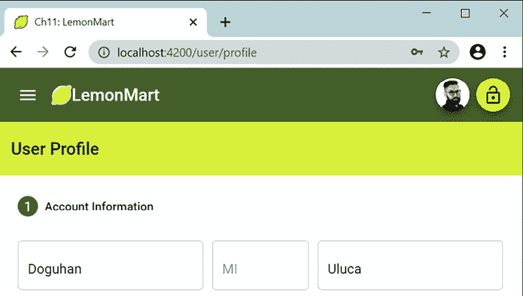

    图 8.1：多步表单 – 第一步

注意，将`fxLayout.lt-sm="column"`添加到具有`fxLayout="row"`的行中，可以为表单启用响应式布局，如下所示：

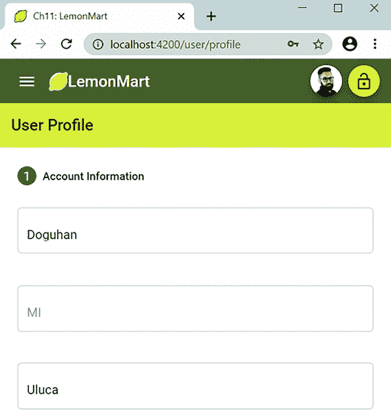

图 8.2：移动端多步表单

在我们继续介绍如何实现**出生日期**字段之前，让我们通过实现错误消息来重新评估我们的策略。

# 使用指令重用重复的模板行为

在上一节中，我们为 `name` 对象的每个字段部分的每个验证错误都实现了一个 `mat-error` 元素。对于三个字段，这会迅速增加到七个元素。在 *第五章*，*设计身份验证和授权* 中，我们实现了 `common/validations.ts` 以重用验证规则。我们可以使用属性指令重用我们在 `mat-error` 中实现的行为，或者任何其他 `div`。

## 属性指令

在 *第一章*，*Angular 的架构和概念* 中，我提到 Angular 组件代表 Angular 应用中最基本的单元。通过组件，我们定义可以重用模板和一些 TypeScript 代码所表示的功能和特性的自定义 HTML 元素。相反，指令增强了现有元素或组件的功能。从某种意义上说，组件是一个增强基本 HTML 功能的超指令。

基于这个观点，我们可以定义三种类型的指令：

+   组件

+   结构性指令

+   属性指令

基本上，组件是带有模板的指令；这是你将最常使用的指令类型。结构性指令通过添加或删除元素来修改 DOM，`*ngIf` 和 `*ngFor` 是典型的例子。

截至 Angular 17，你可以使用 `@`-语法来实现控制流和可延迟视图，分别用 `@if` 或 `@for` 替代 `*ngIf` 和 `*ngFor`。下面是一个示例代码片段：

```js
@if (user.isHuman) {
  <human-profile [data]="user" />
} @else if (user.isRobot) {
  <!-- robot users are rare, so load their profiles lazily -->
  @defer {
    <robot-profile [data]="user" />
  }
} @else {
  <p>The profile is unknown!
} 
```

最后，属性指令允许你定义可以添加到 HTML 元素或组件中的新属性，添加新的行为。

让我们实现一个可以封装字段级错误行为的属性指令。

## 字段错误属性指令

想象一下使用指令来减少显示字段错误时的重复元素。以下是一个使用姓名字段作为示例的例子：

```js
**example**
<mat-form-field appearance="outline" fxFlex="40%">
  <mat-label>First Name</mat-label>
  <input matInput aria-label="First Name" formControlName="first" #name />
  <mat-error **[****input****]=****"name"** **[****group****]=****"formGroup.get('name')"**
    **[****appFieldError****]=****"ErrorSets.RequiredText"****>**
  </mat-error>
</mat-form-field> 
```

我们有 Material 表单字段的常规布局结构，但只有一个 `mat-error` 元素。`mat-error` 上有三个新属性：

+   `input` 绑定到被标记为 `#name` 的 HTML 输入元素，使用模板引用变量，这样我们就可以监听输入元素的 blur 事件并读取 `placeholder`、`aria-label` 和 `formControlName` 属性。

+   `group` 绑定到包含表单控件的父 `FormGroup` 对象，因此通过使用输入的 `formControlName` 属性，我们可以检索 `formControl` 对象，同时避免额外的代码。

+   `appFieldError` 绑定到一个数组，该数组包含必须与 `formControl` 对象（如 `required`、`minlength`、`maxlength` 和 `invalid`）进行校验的验证错误。

使用前面的信息，我们可以创建一个指令，可以在 `mat-error` 元素内渲染一行或多行错误信息，有效地复制我们在上一节中使用的方法。

让我们继续创建一个名为 `FieldErrorDirective` 的属性指令：

1.  在`src/app/user-controls`下创建`FieldErrorDirective`。

1.  将指令的选择器定义为名为`appFieldError`的可绑定属性：

    ```js
    **src/app/user-controls/field-error/field-error.****directive****.****ts**
    @Directive({
      selector: **'[appFieldError]'**,
    }) 
    ```

1.  在指令之外，定义两个新类型`ValidationError`和`ValidationErrorTuple`，它们定义我们将要处理的错误条件类型以及允许我们将自定义错误消息附加到错误类型上的结构：

    ```js
    **src/app/user-controls/field-error/field-error.****directive****.****ts**
    export type ValidationError = 
       'required' | 'minlength' | 'maxlength' | 'invalid'
    export type ValidationErrorTuple = {
      error: ValidationError;
      message: string
    } 
    ```

1.  就像我们分组验证一样，让我们定义两组常见的错误条件，这样我们就不必一遍又一遍地输入它们：

    ```js
    **src/app/user-controls/field-error/field-error.****directive****.****ts**
    export const ErrorSets: { [key: string]: ValidationError[] } = {
      OptionalText: ['minlength', 'maxlength'],
      RequiredText: ['minlength', 'maxlength', 'required'],
    } 
    ```

1.  接下来，让我们定义指令的`@Input`目标：

    ```js
    **src/app/user-controls/field-error/field-error.****directive****.****ts**
    export class FieldErrorDirective implements OnDestroy, OnChanges {
      @Input() appFieldError:
        | ValidationError
        | ValidationError[]
        | ValidationErrorTuple
        | ValidationErrorTuple[]
      @Input() input: HTMLInputElement | undefined
      @Input() group: FormGroup
      @Input() fieldControl: AbstractControl | null
      @Input() fieldLabel: string | undefined 
    ```

    注意，我们已经讨论了前三个属性的目的。`fieldControl`和`fieldLabel`是可选属性。如果指定了`input`和`group`，则可选属性可以自动填充。由于它们是类级变量，如果用户想要覆盖指令的默认行为，则公开它们是有意义的。这是一个容易的胜利，可以创建灵活且可重用的控件。

1.  在`constructor`中导入元素引用，这可以在稍后由`renderErrors`函数用于在`mat-error`元素的内部 HTML 中显示错误：

    ```js
    **src/app/user-controls/field-error/field-error.****directive****.****ts**
      private readonly nativeElement: HTMLElement
      constructor(private el: ElementRef) {
        this.nativeElement = this.el.nativeElement
      }
      renderErrors(errors: string) {
        this.nativeElement.innerText = errors
      } 
    ```

1.  实现一个函数，该函数可以根据错误类型返回预定义的错误消息：

    ```js
    **src/app/user-controls/field-error/field-error.****directive****.****ts**
      getStandardErrorMessage(error: ValidationError): string {
        const label = this.fieldLabel || 'Input'
        switch (error) {
          case 'required':
            return `${label} is required`
          case 'minlength':
            return `${label} must be at least ${
              this.fieldControl?.getError(error)?.requiredLength ?? 2
            } characters`
          case 'maxlength':
            return `${label} can\'t exceed ${
              this.fieldControl?.getError(error)?.requiredLength ?? 50
            } characters`
          case 'invalid':
            return `A valid ${label} is required`
        }
      } 
    ```

    注意，我们可以从`fieldControl`动态提取所需的`minlength`或`maxlength`，这大大减少了我们需要生成的自定义消息的数量。

1.  实现一个算法，该算法可以使用`getStandardErrorMessage`方法遍历`appFieldError`中的所有元素和需要显示的错误：

    ```js
    **src/app/user-controls/field-error/field-error.****directive****.****ts**
    updateErrorMessage() {
        const errorsToDisplay: string[] = []
        const errors = Array.isArray(this.appFieldError)
          ? this.appFieldError
          : [this.appFieldError]
        errors.forEach(
          (error: ValidationError 
                | { error: ValidationError; message: string }) => {
            const errorCode = 
              typeof error === 'object' ? error.error : error 
            const message =
              typeof error === 'object'
                ? () => error.message
                : () => this.getStandardErrorMessage(errorCode)
            const errorChecker =
              errorCode === 'invalid'
                ? () => this.fieldControl?.invalid
                : () => this.fieldControl?.hasError(errorCode)
            if (errorChecker()) {
              errorsToDisplay.push(message())
            }
          }
        )
        this.renderErrors(errorsToDisplay.join('<br>'))
      } 
    ```

    最终，我们可以使用`renderErrors`方法显示错误信息。

    注意函数委托的使用，这是一种允许函数被传递并用作变量的技术。由于此代码每分钟将执行数百次，因此避免不必要的调用很重要。函数委托有助于更好地组织我们的代码，并在绝对必要时才延迟其逻辑的执行。这种编码模式允许使用记忆技术进一步提高性能。有关更多详细信息，请参阅*进一步阅读*部分。

1.  现在，初始化`fieldControl`属性，它代表一个`formControl`。我们将监听控制的`valueChanges`事件，如果验证状态无效，则执行我们的自定义`updateErrorMessage`逻辑来显示错误信息：

    ```js
    **src/app/user-controls/field-error/field-error.****directive****.****ts**
    private controlSubscription: Subscription | undefined
    ngOnDestroy(): void {
      this.unsubscribe()
    }
    unsubscribe(): void {
      this.controlSubscription?.unsubscribe()
    }
    initFieldControl() {
        if (this.input && this.group) {
          const controlName = this.input.
            getAttribute('formControlName') ?? ''
          this.fieldControl =
            this.fieldControl || this.group.get(controlName)
          if (!this.fieldControl) {
            throw new Error( 
              `[appFieldError] couldn't bind to control ${controlName}`
            )
          }
          this.unsubscribe()
          this.controlSubscription = this.fieldControl?.valueChanges
            .pipe(
              filter(() => this.fieldControl?.status === 'INVALID'),
              tap(() => this.updateErrorMessage())
            )
            .subscribe()
        }
      } 
    ```

    注意，由于我们正在订阅`valueChanges`，我们也必须取消订阅。我们使用`ngOnDestroy`取消订阅一次，然后在再次订阅之前再次取消订阅。这是因为`initFieldControl`可能会被多次调用。如果我们不清除之前的订阅，将导致内存泄漏和相关性能问题。

    此外，如果我们无法绑定到`fieldControl`，我们会抛出一个错误信息，这通常指向一个编码错误。

1.  最后，我们使用 `ngOnChanges` 事件来配置所有主要属性，该事件在 `@Input` 属性更新时触发。这确保了，在表单元素可能动态添加或删除的情况下，我们始终考虑最新的值。我们调用 `initFieldControl` 来开始监听值的变化，实现一个触发 `updateErrorMessage()` 的 `onblur` 事件处理器，并为 HTML 输入元素分配 `fieldLabel` 的值：

    ```js
    **src/app/user-controls/field-error/field-error.****directive****.****ts**
      ngOnChanges(changes: SimpleChanges): void {
        this.initFieldControl()
        if (changes.input.firstChange) {
          if (this.input) {
            this.input.onblur = () => this.updateErrorMessage()
            this.fieldLabel =
              this.fieldLabel ||
              this.input.placeholder ||
              this.input.getAttribute('aria-label') ||
              ''
          } else {
            throw new Error(
              `appFieldError.[input] couldn't bind to any input element`
            )
          }
        }
      } 
    ```

注意，如果我们无法绑定到 HTML `input` 元素，这通常意味着开发者忘记正确连接这些元素。在这种情况下，我们抛出一个新的 `Error` 对象，这在控制台中生成一个有用的堆栈跟踪，以便你可以确定模板中错误发生的位置。

这完成了指令的实现。现在，我们需要将指令打包到一个名为 `field-error.module.ts` 的模块中：

```js
**src/app/user-controls/field-error/field-error.****directive****.****ts**
  @NgModule({
  imports: [CommonModule, ReactiveFormsModule],
  declarations: [FieldErrorDirective],
  exports: [FieldErrorDirective],
})
export class FieldErrorModule {} 
```

现在，继续在我们的现有表单中使用这个指令：

1.  在 `app.module.ts` 和 `user.module.ts` 中导入该模块。

1.  使用新指令更新 `profile.component.html`。

1.  使用新指令更新 `login.component.html`。

确保在 `component` 类中将 `ErrorSets` 定义为一个公共属性变量，以便你可以在模板中使用它。

测试你的表单，以确保我们的验证消息按预期显示，并且没有控制台错误。

恭喜！你已经学会了如何使用指令将新行为注入到其他元素和组件中。通过这样做，我们可以避免大量的重复代码，并在我们的应用程序中标准化错误消息。

在继续之前，通过查看 GitHub 上的实现来完成表单的实现。你可以在 `projects/stage11/src/app/user/profile/profile.initial.component.html` 中找到表单模板的代码，以及在 `projects/stage11/src/app/user/profile/profile.initial.component.ts` 中找到 `component` 类。

不要包含 `app-lemon-rater` 和 `app-view-user` 元素，并从电话号码中移除 `mask` 属性，我们将在本章后面实现它。

在这里，你可以看到在 LemonMart 上显示的用户资料：

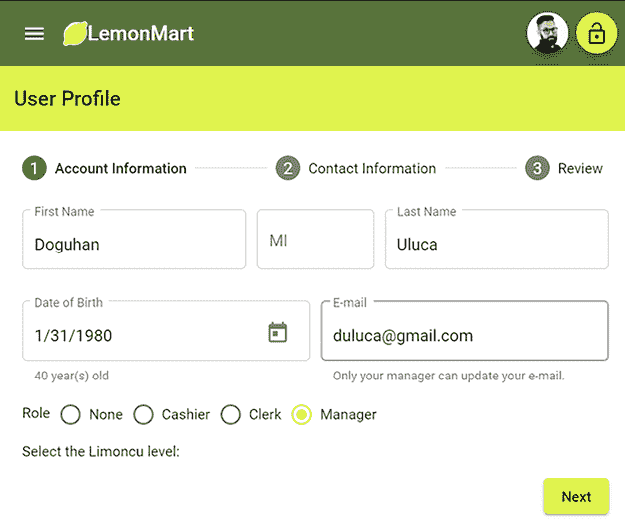

图 8.3：基本完成的资料组件

接下来，我们将回顾 `profile` 组件，看看 **出生日期** 字段是如何工作的。

# 计算属性和日期选择器

我们可以根据用户输入显示计算属性。例如，为了显示一个人的年龄，基于他们的出生日期，引入计算年龄的类属性，并如下显示：

```js
**src/app/user/profile/profile.****component****.****ts**
now = new Date()
get dateOfBirth() {
  return this.formGroup.get('dateOfBirth')?.value || this.now
}
get age() {
  return this.now.getFullYear() - this.dateOfBirth.getFullYear()
} 
```

`age`属性获取器的实现并不是最有效率的选项。为了计算年龄，我们调用`this.now`和`this.dateOfBirth`的`getFullYear()`函数。作为一个在模板中引用的属性，Angular 的变更检测算法将每秒调用`age`多达 60 次，与其他屏幕上的元素混合，这可能导致严重的性能问题。你可以通过创建一个**纯自定义管道**来解决这个问题，这样 Angular 只会在其依赖值之一发生变化时检查`age`属性。

你可以在[`angular.dev/guide/pipes/change-detection`](https://angular.dev/guide/pipes/change-detection)了解更多关于纯管道的信息。

另一个选项是使用**计算信号**。与计算属性类似，计算信号是只读信号，其值来自其他信号。

我们可以将上面的代码重写如下：

```js
 now = new Date()
  dateOfBirth = 
    signal(
     this.formGroup.get('dateOfBirth')?.value || this.now
    )
  age = computed(() => 
    this.now.getFullYear() - this.dateOfBirth().getFullYear()) 
```

我们将`dateOfBirth`创建为一个**信号**，将`age`创建为一个**计算信号**。使用这种设置，只有当`dateOfBirth`发生变化时，`age`才会更新。正如你所看到的，实现很简单，Angular 的变更检测算法将默认做正确的事情。

除了一个小问题！由于缺少**基于信号的组件**和必需的`FormGroup`支持，我们无法直接在响应式表单中使用`dateOfBirth`或`age`。

这有助于你理解对于 Angular 来说，信号变化有多大。更多内容请参阅[`angular.dev/guide/signals#computed-signals`](https://angular.dev/guide/signals#computed-signals)。

要验证过去一百年内的日期，实现一个`minDate`类属性：

```js
**src/app/user/profile/profile.****component****.****ts**
  minDate = new Date(
    this.now.getFullYear() - 100,
    this.now.getMonth(),
    this.now.getDate()
  ) 
```

模板中计算属性的用法如下：

```js
**src/app/user/profile/profile.component.html**
<mat-form-field appearance="outline" fxFlex="50%">
  <mat-label>Date of Birth</mat-label>
  <input matInput aria-label="Date of Birth" formControlName="dateOfBirth"
    **[****min****]=****"minDate"** **[****max****]=****"now"** [matDatepicker]="dateOfBirthPicker" #dob />
  @if (formGroup.get('dateOfBirth')?.value) {
    <mat-hint> {{ age }} year(s) old </mat-hint>
  }
  <mat-datepicker-toggle matSuffix [for]="dateOfBirthPicker">
  </mat-datepicker-toggle>
  <mat-datepicker #dateOfBirthPicker></mat-datepicker>
  <mat-error [input]="dob" [group]="formGroup"
    [appFieldError]=
      "{error: 'invalid', message: 'Date must be within the last 100 years'}">
  </mat-error>
</mat-form-field> 
```

参考前面代码片段中突出显示的`[min]`和`[max]`属性，以应用一百年的日期范围。

`DatePicker`的实际使用效果如下：

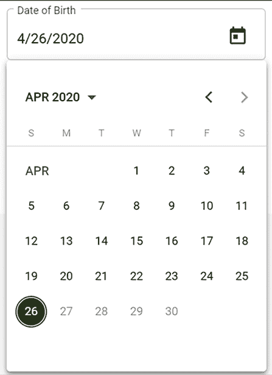

图 8.4：使用 DatePicker 选择日期

注意，4 月 26 日之后的日期变灰。选择日期后，计算出的年龄将显示如下：

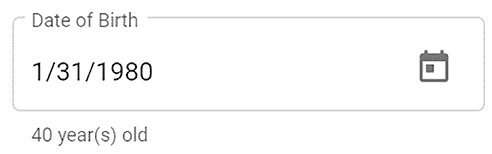

图 8.5：计算年龄属性

现在，让我们继续下一步，**联系信息**，看看我们如何能够方便地显示和输入地址字段的状态部分。

# 类型提示支持

在`buildForm`中，我们为`address.state`设置一个监听器，以支持类型提示过滤下拉体验：

```js
**src/app/user/profile/profile.****component****.****ts**
const state = this.formGroup.get('address.state')
if (state != null) {
  this.states$ = state.valueChanges.pipe(
    startWith(''),
    map((value) => USStateFilter(value))
  )
} 
```

在模板中，实现`mat-autocomplete`，通过`async`管道绑定到过滤后的状态数组：

```js
**src/app/user/profile/profile.component.html**
...
<mat-form-field appearance="outline" fxFlex="30%">
  <mat-label>State</mat-label>
  <input type="text" aria-label="State" matInput formControlName="state"
    [matAutocomplete]="stateAuto" #state />
  <mat-autocomplete #stateAuto="matAutocomplete">
    @for (state of states$ | async; track state) {
      <mat-option [value]="state.name">
        {{ state.name }}
      </mat-option>
    }
  </mat-autocomplete>
  <mat-error [input]="state" [group]="formGroup.get('address')"
    appFieldError="required">
  </mat-error>
</mat-form-field> 
... 
```

当用户输入字符`V`时，它看起来是这样的：

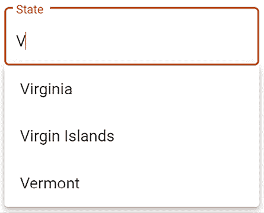

图 8.6：具有类型提示支持的下拉菜单

在下一节中，让我们启用多个电话号码的输入。

# 动态表单数组

注意，`phones` 属性是一个数组，可能允许有多个输入。我们可以通过使用 `this.formBuilder.array` 函数构建 `FormArray` 来实现这一点。我们还定义了几个辅助函数，以使构建 `FormArray` 更加容易：

+   `buildPhoneFormControl` 有助于构建单个条目的 `FormGroup` 对象。

+   `buildPhoneArray` 会创建所需数量的 `FormGroup` 对象，或者如果表单为空，则创建一个空条目。

+   `addPhone` 向 `FormArray` 添加一个新的空 `FormGroup` 对象。

+   `get phonesArray()` 是一个方便的属性，用于从表单中获取 `phones` 控件。

让我们看看实现是如何结合在一起的：

```js
**src/app/user/profile/profile.****component****.****ts**
...
phones: this.formBuilder.array(this.buildPhoneArray(user?.phones || [])),
...
  private buildPhoneArray(phones: IPhone[]) {
    const groups = []
    if (phones?.length === 0) {
      groups.push(this.buildPhoneFormControl(1))
    } else {
      phones.forEach((p) => {
        groups.push(
          this.buildPhoneFormControl(p.id, p.type, p.digits)
        )
      })
    }
    return groups
      } 
  private buildPhoneFormControl(
    id: number, type?: string, phoneNumber?: string
  ) {
    return this.formBuilder.group({
      id: [id],
      type: [type || '', Validators.required],
      digits: [phoneNumber || '', USAPhoneNumberValidation],
  })
} 
... 
```

`buildPhoneArray` 支持使用单个电话输入初始化表单，或者通过填充现有数据来实现，与 `buildPhoneFormControl` 一起工作。当用户点击 **Add** 按钮创建新行时，后者非常有用：

```js
**src/app/user/profile/profile.****component****.****ts**
...
addPhone() { this.phonesArray.push(
this.buildPhoneFormControl(
  this.formGroup.get('phones').value.length + 1)
)
}
get phonesArray(): FormArray {
  return this.formGroup.get('phones') as FormArray
}
... 
```

`phonesArray` 属性的获取器是一个常见的模式，它使得访问某些表单属性变得更加容易。然而，在这种情况下，它也是必要的，因为 `get('phones')` 必须转换为 `FormArray` 类型，这样我们才能在模板上访问其 `length` 属性：

```js
**src/app/user/profile/profile.component.html**
...
<mat-list formArrayName="phones">
  <h2 mat-subheader>Phone Number(s)
    <button mat-button (click)="addPhone()">
      <mat-icon>add</mat-icon>
      Add Phone
    </button>
  </h2>
  @for (position of phonesArray.controls; track position; let i = $index) 
  {
    <mat-list-item [formGroupName]="i"> 
      <mat-form-field appearance="outline" fxFlex="100px">
        <mat-label>Type</mat-label>
        <mat-select formControlName="type">
          @for (type of PhoneTypes; track type) {
            <mat-option [value]="convertTypeToPhoneType(type)">
              {{ type }}
            </mat-option>
          }      
       </mat-select>
    </mat-form-field>
    <mat-form-field appearance="outline" fxFlex fxFlexOffset="10px">
      <mat-label>Number</mat-label>
      <input matInput type="text" formControlName="digits"
        aria-label="Phone number" prefix="+1" />
        @if (phonesArray.controls[i].invalid && 
             phonesArray.controls[i].touched) {
          <mat-error>A valid phone number is required</mat-error>
        }     
    </mat-form-field>
    <button fxFlex="33px" mat-icon-button
      (click)="**phonesArray.removeAt(i)**"> 
      <mat-icon>delete</mat-icon>
    </button>
  </mat-list-item>
  }
</mat-list> 
... 
```

注意突出显示的 `convertTypeToPhoneType` 函数，它将 `string` 转换为 `enum PhoneType`。

在前面的代码块中，还突出了 `remove` 函数是如何在模板中内联实现的，这使得它更容易阅读和维护。

让我们看看动态数组应该如何工作：


图 8.7：使用 FormArray 的多个输入

现在我们已经完成了数据输入，我们可以继续到步骤器的最后一步 **Review**。然而，如前所述，**Review** 步骤使用 `<app-view-user>` 指令来显示其数据。让我们首先构建这个视图。

# 创建共享组件

这里是 `<app-view-user>` 指令的最小实现，这是 **Review** 步骤的先决条件。

在 `user` 文件夹结构下创建一个新的 `viewUser` 组件，如下所示：

```js
**src/app/user/view-user/view-user.****component****.****ts**
import { AsyncPipe, DatePipe } from '@angular/common'
import {
  Component, inject, Input, OnChanges, SimpleChanges
} from '@angular/core'
import { MatButtonModule } from '@angular/material/button'
import { MatCardModule } from '@angular/material/card'
import { MatIconModule } from '@angular/material/icon'
import { Router } from '@angular/router'
import { IUser, User } from '../user/user'
@Component({
  selector: 'app-view-user',
  template: `
    @if (currentUser) {
      <div>
        <mat-card appearance="outlined">
          <mat-card-header>
            <div mat-card-avatar>
              <mat-icon>account_circle</mat-icon>
            </div>
            <mat-card-title>{{ currentUser.fullName }}</mat-card-title>
            <mat-card-subtitle>{{ currentUser.role }}</mat-card-subtitle>
          </mat-card-header>
          <mat-card-content>
            <p><span class="mat-input bold">E-mail</span></p>
            <p>{{ currentUser.email }}</p>
            <p><span class="mat-input bold">Date of Birth</span></p>
            <p>{{ currentUser.dateOfBirth | date: 'mediumDate' }}</p>
          </mat-card-content>
          @if (editMode) {
            <mat-card-actions>
              <button mat-button mat-raised-button (click)="editUser(currentUser._id)">
                Edit
              </button>
            </mat-card-actions>
          }
        </mat-card>
      </div>
    }
  `,
  styles: `
    .bold {
      font-weight: bold;
    }
`,
  standalone: true,
  imports: [MatCardModule, MatIconModule, MatButtonModule, AsyncPipe, DatePipe],
})
export class ViewUserComponent implements OnChanges {
  private readonly router = inject(Router)
  @Input() user!: IUser
  currentUser = new User()
  get editMode() {
    return !this.user
  }
  ngOnChanges(changes: SimpleChanges): void {
    this.currentUser = User.Build(changes['user'].currentValue)
  }
  editUser(id: string) {
    this.router.navigate(['/user/profile', id])
  }
} 
```

前面的组件使用 `@Input` 输入绑定来从外部组件获取符合 `IUser` 接口的用户数据。我们实现了 `ngOnChanges` 生命周期钩子，它在绑定数据更改时触发。在这个事件中，我们使用 `User.Build` 将存储在 `user` 属性中的简单 JSON 对象作为 `User` 类的实例进行填充。

然后，我们将 `User` 对象分配给属性 `this.currentUser`。即使我们想直接绑定到用户属性，也是不可能的，因为像 `fullName` 这样的计算属性只能在数据被注入到 `User` 类的实例中时才能工作。Angular 17.1 在开发者预览中引入了基于信号的输入。我们可以定义用户为 `user = input<IUser>()` 并利用效果和计算信号来简化我们的实现。在我们的代码当前状态下，由于我们绑定的属性数量众多，我们承受着沉重的变更检测惩罚。然而，在基于信号的组件中则不会有这样的惩罚。我期待着在基于信号的组件发布时重构这个组件。

现在，我们准备完成多步骤表单。

# 审查和保存表单数据

在多步骤表单的最后一步，用户应该能够审查并保存表单数据。作为一个好的实践，成功的 `POST` 请求将返回保存的数据，并将其返回到浏览器。然后我们可以用从服务器接收到的信息重新加载表单：

```js
**src/app/user/profile/profile.****component****.****ts**
...
async save(form: FormGroup) {
    this.userService
      .updateUser(this.currentUserId, form.value)
      .pipe(first())
      .subscribe({
        next: (res: IUser) => {
          this.patchUser(res)
          **this****.****formGroup****.****patchValue****(res)**
          this.uiService.showToast('Updated user')
        },
        error: (err: string) => (this.userError = err),
      })
  }
... 
```

注意，`updateUser` 返回用户的保存值。数据库可能返回与之前不同的 `user` 版本，因此我们使用 `formGroup.patchValue` 来更新表单背后的数据。表单会自动更新以反映任何更改。

如果在保存数据时出现错误，它们将被设置为 `userError` 以在表单上显示。在保存数据之前，我们使用可重用的 `app-view-user` 组件以紧凑的格式展示数据，我们可以将表单数据绑定到该组件：

```js
**src/app/user/profile/profile.component.html**
...
<mat-step [stepControl]="formGroup">
  <form [formGroup]="formGroup" (ngSubmit)="save(formGroup)">
    <ng-template matStepLabel>Review</ng-template>
    <div class="stepContent">
      Review and update your user profile.
      **<****app-view-user** **[****user****]=****"formGroup.getRawValue()"****></****app-view-user****>**
    </div>
    <div fxLayout="row" class="margin-top">
      <button mat-button matStepperPrevious>Back</button>
      <div class="flex-spacer"></div>
      @if (userError) {
        <div class="mat-caption error">{{ **userError** }}</div>
      } 
      <button mat-button color="warn" (click)="**stepper.reset()**">
        Reset
      </button>
      <button mat-raised-button matStepperNext color="primary" 
        type="submit" [disabled]="formGroup.invalid">
        Update
      </button>
    </div>
  </form>
</mat-step>
... 
```

注意，我们使用 `formGroup.getRawValue()` 来提取表单数据的 JSON。看看我们是如何将 `userError` 绑定到显示错误消息的。此外，**重置**按钮使用 `stepper.reset()`，可以方便地重置所有用户输入。

这就是最终产品应该呈现的样子：

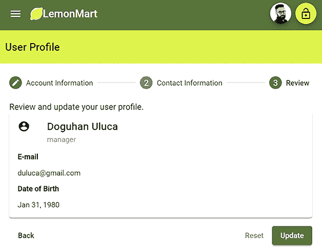

图 8.8：审查步骤

现在用户资料输入已完成，我们离最终目标——创建一个主/详细视图还有一半的路要走，在这个视图中，**经理**可以点击用户并查看其资料详情。我们还有更多的代码要添加，并且在过程中，我们陷入了添加大量样板代码以加载组件所需数据的模式。

接下来，让我们重构我们的表单，使其代码可重用和可扩展，这样即使我们的表单有数十个字段，代码仍然是可维护的，并且我们不会引入指数级成本增加来做出更改。

# 具有可重用部分的可扩展表单架构

如在 *多步骤响应式表单* 部分的介绍中提到的，表单是紧密耦合的怪物，可能会变得很大，使用错误的架构模式来扩展你的实现，在实现新功能或维护现有功能时可能会引起重大问题。

为了展示如何将你的表单拆分成多个部分，我们将重构它，提取以下截图中的突出部分，即名称`FormGroup`，作为一个单独的组件。完成这一点的技术与你想要将表单的每一步放入单独组件时使用的技术相同：

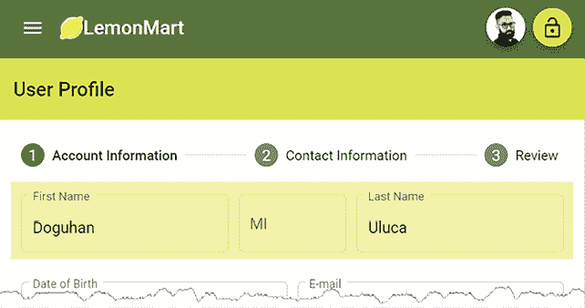

图 8.9：用户个人资料名称部分被突出显示

通过使`FormGroup`名称可重用，你还将了解如何将你构建到`FormGroup`中的业务逻辑在其他表单中重用。我们将把`FormGroup`逻辑提取到一个名为`NameInputComponent`的新组件中。在这个过程中，我们也有机会将一些可重用的表单功能提取到`BaseFormComponent`作为一个`抽象`类。

这里将会有几个组件协同工作，包括`ProfileComponent`、`ViewUserComponent`和`NameInputComponent`。我们需要这三个组件中的所有值在用户输入时保持最新。

`ProfileComponent`将拥有主表单，我们需要将任何子表单注册到这个主表单上。一旦完成注册，你之前学到的所有表单验证技术仍然适用。

这是一种关键的方法，可以使你的表单能够在许多组件之间扩展，并且继续易于操作，同时不会引入不必要的验证开销。因此，回顾这些对象之间的不同交互对于巩固你对它们行为异步和解耦性质的理解是有用的：

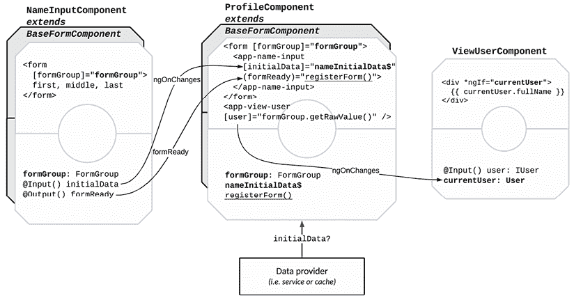

图 8.10：表单组件交互

在本节中，我们将结合你在本书中学到的许多概念。利用前面的图来理解各种表单组件之间的交互。

在前面的图中，粗体属性表示数据绑定。下划线函数元素表示事件注册。箭头显示了组件之间的连接点。

工作流程从`ProfileComponent`的实例化开始。组件的`OnInit`事件开始构建`formGroup`对象，同时异步加载可能需要修补到表单中的任何潜在`initialData`。参考前面的图来查看从服务或缓存中进入的`initialData`的视觉表示。

`NameInputComponent`在`ProfileComponent`表单中作为`<app-name-input>`使用。为了将`initialData`与`NameInputComponent`同步，我们使用`async`管道绑定一个`nameInitialData$`主题，因为`initialData`是异步到达的。

`NameInputComponent`实现了`OnChanges`生命周期钩子，所以每当`nameInitialData$`更新时，其值就会被修补到`NameInputComponent`表单中。

与`ProfileComponent`一样，`NameInputComponent`也实现了`OnInit`事件来构建其`formGroup`对象。由于这是一个异步事件，`NameInputComponent`需要公开一个`formReady`事件，`ProfileComponent`可以订阅它。一旦`formGroup`对象就绪，我们发出事件，`ProfileComponent`上的`registerForm`函数触发。`registerForm`将`NameInputComponent`的`formGroup`对象作为子元素添加到父`formGroup`上。

`ViewUserComponent`在`ProfileComponent`表单中作为`<app-view-user>`使用。当父表单中的值发生变化时，我们需要`<app-view-user>`保持最新状态。我们绑定到`ViewUserComponent`上的`user`属性，该组件实现了`OnChanges`以接收更新。每次更新时，`User`对象都会从`IUser`对象中恢复，因此计算字段如`fullName`可以继续工作。然后，更新的`User`被分配给`currentUser`，绑定到模板上。

我们将首先构建`BaseFormComponent`，然后`NameInputComponent`和`ProfileComponent`将实现它。

## 抽象表单组件

我们可以通过实现一个基抽象类来共享通用功能并标准化实现所有实现表单的组件。一个抽象类不能单独实例化，因为它这样做没有意义，因为它将没有模板，使其单独使用变得无用。

注意，`BaseFormComponent`只是一个`class`，而不是 Angular 组件。

`BaseFormComponent`将标准化以下内容：

+   `@Input initialData`和`disable`作为绑定目标

+   `@Output formReady`事件

+   `formGroup`，以及要在模板的`buildForm`函数中使用的`FormGroup`来构建`formGroup`。

在前面的假设下，基类可以提供一些通用功能：

+   `patchUpdatedData`可以在不重建的情况下更新`formGroup`中的数据（部分或全部）。

+   `registerForm`和`deregisterForm`可以注册或注销子表单。

+   `deregisterAllForms`可以自动注销任何已注册的子表单。

+   `hasChanged`可以根据由`ngOnChange`事件处理器提供的`SimpleChange`对象确定`initialData`是否已更改。

+   `patchUpdatedDataIfChanged`利用`hasChanged`并使用`patchUpdatedData`在`initialData`和`formGroup`已初始化的情况下更新数据，仅当`initialData`有更新时。

在`src/common`下创建一个新的类，`BaseFormComponent`，如下所示：

```js
**src/app/common/base-form.****class****.****ts**
import { EventEmitter, Input, Output, SimpleChange, SimpleChanges } 
   from '@angular/core'
import { AbstractControl, FormGroup } from '@angular/forms'
export abstract class BaseFormComponent<TFormData extends object> {
  @Input() initialData: TFormData
  @Input() disable: boolean
  @Output() formReady: EventEmitter<AbstractControl>
  formGroup: FormGroup
  private registeredForms: string[] = []
  constructor() {
    this.formReady = new EventEmitter<AbstractControl>(true)
  }
  abstract buildForm(initialData?: TFormData): FormGroup
  patchUpdatedData(data: object) {
    this.formGroup.patchValue(data, { onlySelf: false })
  }
  patchUpdatedDataIfChanged(changes: SimpleChanges) {
    if (this.formGroup && this.hasChanged(changes.initialData)) {
      this.patchUpdatedData(this.initialData)
    }
  }
  emitFormReady(control: AbstractControl | null = null) {
    this.formReady.emit(control || this.formGroup)
  }
  registerForm(name: string, control: AbstractControl) {
    this.formGroup.setControl(name, control)
    this.registeredForms.push(name)
  }
  deregisterForm(name: string) {
    if (this.formGroup.contains(name)) {
      this.formGroup.removeControl(name)
    }
  }
  protected deregisterAllForms() {
    this.registeredForms.forEach(() => this.deregisterForm(name))
  }
  protected hasChanged(change: SimpleChange): boolean {
    return change?.previousValue !== change?.currentValue
  }
} 
```

让我们使用`BaseFormComponent`来实现`NameInputComponent`。

## 实现可重用的表单部分

首先在`profile`组件代码和模板文件中识别名称`FormGroup`：

1.  以下是对`FormGroup`名称的实现：

    ```js
    **src/app/user/profile/profile.****component****.****ts**
    ...
    name: this.formBuilder.group({
      first: [user?.name?.first || '', RequiredTextValidation],
      middle: [user?.name?.middle || '', OneCharValidation],
      last: [user?.name?.last || '', RequiredTextValidation],
    }),
    ... 
    ```

注意，当我们将这些验证规则移动到新的组件时，我们仍然希望它们在确定父表单的整体验证状态时仍然有效。我们通过使用上一节中实现的`registerForm`函数来实现这一点。一旦我们的新`FormGroup`与现有的一个注册，它们的工作方式与重构之前相同。

1.  接下来是`FormGroup`模板：

    ```js
    **src/app/user/profile/profile.component.html**
    ...
    <div fxLayout="row" fxLayout.lt-sm="column"
      [formGroup]="formGroup.get('name')" fxLayoutGap="10px">
      <mat-form-field appearance="outline" fxFlex="40%">
        <mat-label>First Name</mat-label>
        <input matInput aria-label="First Name" 
               formControlName="first" #name />
        ...
    </div>
    ... 
    ```

你将把大部分代码移动到新的组件中。

1.  在`user`文件夹下创建一个新的`NameInputComponent`。

1.  从`BaseFormComponent`扩展类。

1.  在`constructor`中注入`FormBuilder`：

对于具有小型或有限功能的功能组件，我更喜欢使用内联模板和样式来创建它们，这样更容易从一处更改代码。

```js
**src/app/user/name-input/name-input.****component****.****ts**
export class NameInputComponent extends BaseFormComponent<IName> {
  constructor(private formBuilder: FormBuilder) {
    super()
  }
  buildForm(initialData?: IName): FormGroup {
    throw new Error("Method not implemented.");
  }
  ...
} 
```

记住，基类已经实现了`formGroup`、`initialData`、`disable`和`formReady`属性，因此你不需要重新定义它们。

注意，我们必须实现`buildForm`函数，因为它被定义为抽象的。这是强制开发者之间统一标准的好方法。此外，注意实现类可以通过使用`override`关键字重新定义函数来覆盖任何由基类提供的函数。当我们在重构`ProfileComponent`时，你会看到这个功能的具体实现。

1.  实现函数`buildForm`。

1.  将`ProfileComponent`中的`formGroup`的`name`属性设置为`null`：

    ```js
    **src/app/user/name-input/name-input.****component****.****ts**
    export class NameInputComponent implements OnInit {
      ...
      buildForm(initialData?: IName): FormGroup {
        const name = initialData
        return this.formBuilder.group({
          first: [name?.first : '', RequiredTextValidation],
          middle: [name?.middle : '', OneCharValidation], 
          last: [name?.last : '', RequiredTextValidation],
        })
      } 
    ```

1.  通过将`ProfileComponent`中的内容迁移过来来实现模板：

    ```js
    **src/app/user/name-input/name-input.****component****.****ts**
    template: `
        <form [formGroup]="formGroup">
          <div fxLayout="row" fxLayout.lt-sm="column"
            fxLayoutGap="10px">
            ...
          </div>
        </form>
      `, 
    ```

1.  实现事件处理器`ngOnInit`：

    ```js
    **src/app/user/name-input/name-input.****component****.****ts**
    ngOnInit() {
      this.formGroup = this.buildForm(this.initialData)
      this.formReady.emit(this.formGroup)
    } 
    ```

在每个`BaseFormComponent`实现中正确实现`ngOnInit`事件处理器至关重要。前面的示例是任何你可能实现的`child`组件的标准行为。

注意，`ProfileComponent`中的实现将会有所不同。

1.  实现事件处理器`ngOnChanges`，利用基类的`patchUpdatedDataIfChanged`行为：

    ```js
    **src/app/user/name-input/name-input.****component****.****ts**
    ngOnChanges(changes: SimpleChanges) {
      this.disable ?
        this.formGroup?.disable() : this.formGroup?.enable()
      this.patchUpdatedDataIfChanged(changes)
    } 
    ```

注意，在`patchUpdatedDataIfChanged`中，将`onlySelf`设置为`false`将导致父表单也更新。如果你想要优化此行为，可以覆盖该函数。

现在，你已经有一个完全实现的`NameInputComponent`，可以将其集成到`ProfileComponent`中。

为了验证你未来的`ProfileComponent`代码，请参考`projects/stage11/src/app/user/profile/profile.component.ts`和`projects/stage11/src/app/user/profile/profile.component.html`。

在开始使用`NameInputComponent`之前，执行以下重构。

1.  将`ProfileComponent`重构为扩展`BaseFormComponent`，并根据需要符合其默认值。

1.  定义一个只读的`nameInitialData$`属性，其类型为`BehaviorSubject<IName>`，并用空字符串初始化它。

1.  将`ProfileComponent`中的内容替换为新的`<app-name-input>`组件：

    ```js
    **src/app/user/profile/profile.component.html**
    <mat-horizontal-stepper #stepper="matHorizontalStepper">
      <mat-step [stepControl]="formGroup">
        <form [formGroup]="formGroup">
          <ng-template matStepLabel>Account Information</ng-template>
            <div class="stepContent">
              **<****app-name-input** **[****initialData****]=****"nameInitialData$ | async"**
                **(****formReady****)=****"registerForm('name', $event)"****>**
              </app-name-input>
            </div>
            ...
          </ng-template>
        </form>
      </mat-step>
      ...
    </mat-horizontal-stepper> 
    ```

注意，这里使用了基础表单组件函数`registerForm`。

1.  确保你的`ngOnInit`被正确实现：

注意，在更新的`ProfileComponent`中存在一些额外的重构，例如以下片段中看到的`patchUser`函数。当您更新组件时，不要错过这些更新。

```js
**src/app/user/profile/profile.****component****.****ts**
ngOnInit() {
  this.formGroup = this.buildForm()
  this.authService.currentUser$
    .pipe(
      filter((user) => user != null),
      tap((user) => this.patchUser(user)),
      takeUntilDestroyed(this.destroyRef)
    )
    .subscribe()
} 
```

当`initialData`更新时，重要的是要使用`pathUpdatedData`以及`nameInitialData$`更新当前表单的数据。

1.  确保正确实现了`ngOnDestroy`：

    ```js
    **src/app/user/profile/profile.****component****.****ts**
      ngOnDestroy() {
        this.deregisterAllForms()
      } 
    ```

您可以利用基类功能来自动注销所有子表单。

接下来，让我们学习如何通过屏蔽用户输入来提高我们的数据质量。

# 输入屏蔽

屏蔽用户输入是一种输入 UX 工具，也是一种数据质量工具。我是`ngx-mask`库的粉丝，它使得在 Angular 中实现输入屏蔽变得容易。我们将通过更新电话号码输入字段来演示输入屏蔽，确保用户输入有效的电话号码，如图所示：

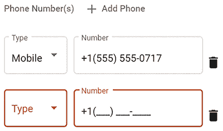

图 8.11：带有输入屏蔽的电话号码字段

按如下方式设置您的输入屏蔽：

1.  使用`npm i ngx-mask`通过 npm 安装库。

1.  要么在`app.config.ts`中使用环境提供者`provideEnvironmentNgxMask()`，要么在您的功能模块`user.module.ts`中使用`provideNgxMask()`。

1.  在`profile.component.html`中导入`NgxMaskDirective`：

1.  按如下方式更新`ProfileComponent`中的`number`字段：

    ```js
    **src/app/user/profile/profile.component.html**
    <mat-form-field appearance="outline" fxFlex fxFlexOffset="10px">
      <mat-label>Number</mat-label>
      <input matInput type="text" formControlName="number"
        prefix="+1" **mask****=****"(000) 000-0000"** **[****showMaskTyped****]=****"true"** />
        @if (phonesArray.controls[i].invalid && 
             phonesArray.controls[i].touched) {
          <mat-error>A valid phone number is required</mat-error>
        } 
    </mat-form-field> 
    ```

简单来说，您可以在 GitHub 上了解更多关于该模块及其功能的信息：[`github.com/JsDaddy/ngx-mask`](https://github.com/JsDaddy/ngx-mask)。

# 使用 ControlValueAccessor 的自定义控件

到目前为止，我们已经学习了使用 Angular Material 提供的标准表单控件和输入控件来使用表单。然而，您也可以创建自定义用户控件。如果您实现了`ControlValueAccessor`接口，那么您的自定义控件将与表单和`ControlValueAccessor`接口的验证引擎很好地协同工作。

我们将创建以下截图所示的定制评分控件，并将其放置在`ProfileComponent`的第一步控件上：

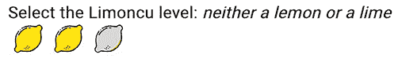

图 8.12：柠檬评分用户控件

用户控件本质上是高度可重用、紧密耦合且定制的组件，以实现丰富的用户交互。让我们来实现一个。

## 实现自定义评分控件

Lemon Rater 将在用户与控件实时交互时动态突出显示所选柠檬的数量。因此，创建高质量的定制控件是一项昂贵的任务。然而，在定义您的品牌和/或构成 UX 核心的应用程序元素上投入精力是完全值得的。

Lemon Rater 是 Jennifer Wadella 在[`github.com/tehfedaykin/galaxy-rating-app`](https://github.com/tehfedaykin/galaxy-rating-app)找到的 Galaxy 评分应用示例的修改版。我强烈推荐观看 Jennifer 在 Ng-Conf 2019 上关于`ControlValueAccessor`的演讲，链接在*进一步阅读*部分。

按照以下方式设置您的自定义评分控件：

1.  在`user-controls`文件夹下生成一个新的组件名为`LemonRater`。

1.  在`LemonRater`中实现`ControlValueAccess`接口：

    ```js
    **src/app/user-controls/lemon-rater/lemon-rater.****component****.****ts**
    export class LemonRaterComponent implements ControlValueAccessor {
      disabled = false
      private internalValue: number
      get value() {
        return this.internalValue
      }
      onChanged: any = () => {}
      onTouched: any = () => {}
      writeValue(obj: any): void {
        this.internalValue = obj
      }
      registerOnChange(fn: any): void {
        this.onChanged = fn
      }
      registerOnTouched(fn: any): void {
        this.onTouched = fn
      }
      setDisabledState?(isDisabled: boolean): void {
        this.disabled = isDisabled
      }
    } 
    ```

1.  添加具有`multi`属性设置为`true`的`NG_VALUE_ACCESSOR`提供者。这将使我们的组件注册到表单的更改事件中，因此当用户与评分器交互时，表单值可以更新：

    ```js
    **src/app/user-controls/lemon-rater/lemon-rater.****component****.****ts**
    @Component({
      selector: 'app-lemon-rater',   
      templateUrl: 'lemon-rater.component.html',
      styleUrls: ['lemon-rater.component.css'],
      providers: [
        {
          provide: NG_VALUE_ACCESSOR,
          useExisting: forwardRef(() => LemonRaterComponent),
          multi: true,
        },
      ],  
      standalone: true,
      imports: [NgClass], 
    ```

    `forwardRef`允许我们引用尚未定义的组件。更多内容请参阅[`angular.dev/api/core/forwardRef`](https://angular.dev/api/core/forwardRef)。

1.  使用函数实现一个自定义评分方案，允许我们根据用户输入设置所选评分：

    ```js
    **src/app/user-controls/lemon-rater/lemon-rater.****component****.****ts**
    export class LemonRaterComponent implements ControlValueAccessor { 
      @ViewChild('displayText', { static: false }) displayTextRef!: ElementRef
      disabled = false
      private internalValue!: number
      get value() {
        return this.internalValue
      }

      ratings = Object.freeze([
        {
          value: 1,
          text: 'no zest',
        },
        {
          value: 2,
          text: 'neither a lemon or a lime ',
        },
        {
          value: 3,
          text: 'a true lemon',
        },
      ])
      ...
      setRating(lemon: any) {
        if (!this.disabled) {
          this.internalValue = lemon.value
          this.ratingText = lemon.text
          this.onChanged(lemon.value)
          this.onTouched()
        }
      }
      setDisplayText() {
        this.setSelectedText(this.internalValue)
      }
      private setSelectedText(value: number) {
        this.displayTextRef.nativeElement.textContent = 
          this.getSelectedText(value)
      }
      private getSelectedText(value: number) {
        let text = ''
        if (value) {
          text = this.ratings
            .find((i) => i.value === value)?.text || ''
        }
        return text
      }
    } 
    ```

    注意，通过使用`@ViewChild`，我们正在获取名为`#displayText`的 HTML 元素（在以下模板中突出显示）。使用`setSelectText`，我们替换元素的`textContent`。

1.  实现模板，参考`svg`标签内容的示例代码：

    ```js
    **src/app/user-controls/lemon-rater/lemon-rater.component.html**
    **<****i** **#****displayText****></****i****>**
    <div class="lemons" [ngClass]="{'disabled': disabled}"> 
      @for (lemon of ratings; track lemon) { 
        <svg width="24px" height="24px" viewBox="0 0 513 513"
             [attr.title]="lemon.text" class="lemon rating"
             [ngClass]="{'selected': lemon.value <= value}"
             (mouseover)=
               "displayText.textContent = !disabled ? lemon.text : ''"
             (mouseout)="setDisplayText()"
             (click)="setRating(lemon)"
         >
         ...
         </svg>
      }
    </div> 
    ```

    模板中最重要的三个属性是`mouseover`、`mouseout`和`click`。`mouseover`属性显示用户当前悬停的评分文本，`mouseout`将显示文本重置为所选值，`click`调用我们实现的`setRating`方法来记录用户的选择。然而，控件可以通过突出显示用户悬停在评分或选择它时柠檬的数量来提供更丰富的用户交互。我们将通过一些 CSS 魔法来实现这一点。

1.  实现用户控件的 CSS：

    ```js
    **src/app/user-controls/lemon-rater/lemon-rater.component.css**
    .lemons {
      cursor: pointer;
    }
    .lemons:hover .lemon #fill-area {
      fill: #ffe200 !important;
    }
    .lemons.disabled:hover {
      cursor: not-allowed;
    }
    .lemons.disabled:hover .lemon #fill-area {
      fill: #d8d8d8 !important;
    }
    .lemons .lemon {
      float: left; margin: 0px 5px;
    }
    .lemons .lemon #fill-area {
      fill: #d8d8d8;
    }
    .lemons .lemon:hover~.lemon #fill-area {
      fill: #d8d8d8 !important;
    }
    .lemons .lemon.selected #fill-area {
      fill: #ffe200 !important;
    }
    .lemons .dad.heart #ada { 
      fill: #6a0dad !important;
    } 
    ```

最有趣的部分是`.lemons .lemon:hover~.lemon #fill-area`。注意操作符`~`，或通用兄弟组合器，选择一系列元素，这样当用户悬停在它们上面时，会有一个动态数量的柠檬被突出显示。

`#fill-area`指的是在柠檬`.svg`内部定义的`<path>`，允许动态调整柠檬的颜色。我不得不手动将此 ID 字段注入到`.svg`文件中。

现在，让我们看看您如何在表单中使用这个新的用户控件。

## 在表单中使用自定义控件

我们将在`profile`组件中使用柠檬评分器来捕捉员工的柠檬等级。

Limoncu 是土耳其语中指种植或出售柠檬的人，也是 LemonMart 的专有员工参与度和绩效测量系统。

让我们集成柠檬评分器：

1.  首先在`profile.component.ts`中导入`LemonRaterComponent`。

1.  确保在`buildForm`中初始化等级表单控件：

    ```js
    **src/app/user/profile/profile.****component****.****ts**
    buildForm(initialData?: IUser): FormGroup {
      ...
      level: [user?.level || 0, Validators.required], 
      ...
    } 
    ```

1.  将柠檬评分器作为第一个`mat-step`中的最后一个元素插入到`form`元素内：

    ```js
    **src/app/user/profile/profile.component.html**
    <div fxLayout="row" fxLayout.lt-sm="column" class="margin-top" fxLayoutGap="10px">
      <mat-label class="mat-body-1">Select the Limoncu level:
        <app-lemon-rater formControlName="level">
        </app-lemon-rater>
      </mat-label>
    </div> 
    ```

我们通过实现`formControlName`像其他控件一样与自定义控件集成。

恭喜！您应该有一个集成了您表单的工作自定义控件。

# 使用网格列表布局

Flex Layout 库非常适合使用 CSS Flexbox 布局内容。Angular Material 提供了另一种布局内容的方法，即使用 CSS Grid 及其网格列表功能。演示这种功能的一个好方法是在`LoginComponent`中实现一个有用的假登录信息列表，如下所示：

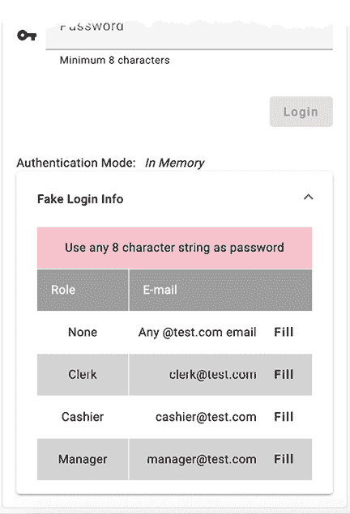

图 8.13：带有网格列表的登录助手

按照以下方式实现你的列表：

1.  首先定义一个`roles`属性，它是一个包含所有角色的数组：

    ```js
    **src/app/login/login.****component****.****ts**
    roles = Object.keys(Role) 
    ```

1.  在`login.component.ts`中导入`MatExpansionModule`和`MatGridListModule`。

1.  在现有的`mat-card-content`下方实现一个新的`mat-card-content`：

    ```js
    **src/app/login/login.component.html**
    <div fxLayout="row" fxLayoutAlign="center">
      <mat-card fxFlex="400px">
        <mat-card-header>
          <mat-card-title>
            <div class="mat-headline">Hello, Limoncu!</div>
          </mat-card-title>
        </mat-card-header>
        <mat-card-content>
          ...
        </mat-card-content>
        **<****mat-card-content****>**
        **</****mat-card-content****>**
      </mat-card>
    </div> 
    ```

1.  在新的`mat-card-content`内部，放入一个标签来显示认证模式：

    ```js
    **src/app/login/login.component.html**
    <div fxLayout="row" fxLayoutAlign="start center" fxLayoutGap="10px">
      <span>Authentication Mode: </span><i>{{ authMode }}</i>
    </div> 
    ```

1.  在标签下方实现一个展开列表：

    ```js
    **src/app/login/login.component.html**
    <mat-accordion>
      <mat-expansion-panel>
        <mat-expansion-panel-header>
            <mat-panel-title>
              Fake Login Info
            </mat-panel-title>
        </mat-expansion-panel-header>
        ...
      </mat-expansion-panel>
    </mat-accordion> 
    ```

1.  在`mat-expansion-panel-header`之后，在上一步中用省略号标记的区域，实现一个包含角色和电子邮件地址的表格，以及一些关于密码长度的提示文本，使用`mat-grid-list`，如下面的代码块所示：

    ```js
    **src/app/login/login.component.html**
    <mat-grid-list cols="3" rowHeight="48px" role="list">
      <mat-grid-tile [**colspan**]="3" role="listitem"
      style="background: pink">
        Use any 8 character string as password
      </mat-grid-tile>
      <mat-grid-tile>
        <mat-grid-tile-header>Role</mat-grid-tile-header>
      </mat-grid-tile>
      <mat-grid-tile [colspan]="2">
        <mat-grid-tile-header>E-mail</mat-grid-tile-header>
      </mat-grid-tile>
      @for (role of roles; track role; let oddRow = $odd) {
        <div>
          <mat-grid-tile
            role="listitem"
            [style.background]="oddRow ? 'lightGray' : 'white'">
            {{ role }}
          </mat-grid-tile>
          <mat-grid-tile
            [colspan]="2"
            role="listitem"
            [style.background]="oddRow ? 'lightGray' : 'white'">
            <div fxFlex fxLayoutAlign="end center">
              @if (role.toLowerCase() === 'none') {
                <div>Any &#64;test.com email</div>
              } @else {
                {{ role.toLowerCase() }}&#64;test.com
              }
              <button
                mat-button
                (click)="
                  this.loginForm.patchValue({
                    email: role.toLowerCase() + '@test.com',
                    password: 'whatever'
                  })
                ">
                Fill
              </button>
            </div>
          </mat-grid-tile>
        </div>
      }
    </mat-grid-list> 
    ```

我们使用`colspan`来控制每行和每个单元格的宽度。我们利用`fxLayoutAlign`将**电子邮件**列的内容右对齐。我们使用`@if; @else`控制流运算符来选择性地显示内容。最后，一个**填充**按钮帮助我们用假登录信息填充登录表单。

在你的应用程序中，你可以使用展开面板来向用户传达密码复杂性的要求。

你可以在[`material.angular.io/components/expansion`](https://material.angular.io/components/expansion)了解更多关于展开面板的信息，以及在[`material.angular.io/components/grid-list/overview`](https://material.angular.io/components/grid-list/overview)了解更多关于网格列表的信息。

# 恢复缓存数据

在本章的开始，当在`UserService`中实现`updateUser`方法时，我们缓存了`user`对象，以防任何可能清除用户提供的数据的错误：

```js
**src/app/user/user/user.****service****.****ts**
updateUser(id: string, user: IUser): Observable<IUser> {
  ...
  This.cache.setItem('draft-user', user)
  ...
} 
```

考虑一个场景，当用户尝试保存数据时，他们可能暂时离线。在这种情况下，我们的`updateUser`函数将保存数据。

让我们看看如何在加载用户资料时在`ProfileComponent`中恢复这些数据：

1.  首先向`ProfileComponent`类中添加名为`loadFromCache`和`clearCache`的函数：

    ```js
    **src/app/user/profile.****component****.****ts**
    private loadFromCache(): Observable<User | null> {
      let user = null
      try {
        const draftUser = this.cache.getItem('draft-user')
        if (draftUser != null) {
          user = User.Build(JSON.parse(draftUser))
        }
        if (user) {
          this.uiService.showToast('Loaded data from cache')
        }
      } catch (err) {
        this.clearCache()
      }
      return of(user)
    } 
    clearCache() {
      this.cache.removeItem('draft-user')
    } 
    ```

    加载数据后，我们使用`JSON.parse`将数据解析为 JSON 对象，然后使用`User.Build`将`User`对象填充。

1.  更新模板以调用`clearCache`函数，以便当用户重置表单时，我们也清除缓存：

    ```js
    **src/app/user/profile.component.html**
    <button mat-button color="warn"
        (click)="stepper.reset(); **clearCache()**">
      Reset
    </button> 
    ```

1.  更新`ngOnInit`以有条件地从缓存或`authService`的最新`currentUser$`加载数据：

    ```js
    **src/app/user/profile.****component****.****ts**
    ngOnInit() {
      this.formGroup = this.buildForm()
      combineLatest([
            this.loadFromCache(),
            this.authService.currentUser$,
          ])
            .pipe(
            takeUntilDestroyed(this.destroyRef),
              filter(
                ([cachedUser, me]) => 
                  cachedUser != null || me != null
              ),
              tap(
                ([cachedUser, me]) => 
                  this.patchUser(cachedUser || me)
              )
            )
            .subscribe()
    } 
    ```

我们利用`combineLatest`运算符将`loadFromCache`和`currentUser$`的输出组合起来。我们检查其中一个流返回一个非空值。如果存在缓存用户，它将先于从`currentUser$`接收到的值。

你可以通过将浏览器网络状态设置为离线来测试你的缓存，如下所示：

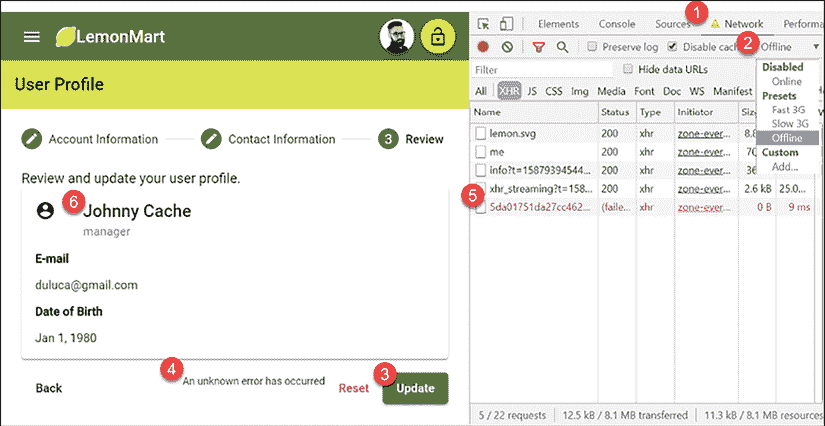

图 8.14：离线网络状态

将浏览器网络状态设置为离线，方法如下：

1.  在 Chrome DevTools 中，导航到**网络**标签页。

1.  在前一张截图标记为**2**的下拉菜单中选择**离线**。

1.  更新表单数据，例如名称，然后点击**更新**。

1.  你会在表单底部看到错误信息**发生未知错误**。

1.  你会在**网络**标签页中看到你的 PUT 请求失败。

1.  现在，刷新你的浏览器窗口，观察你输入的新名称仍然存在。

参考以下截图，它显示了从缓存加载数据后你收到的吐司通知：

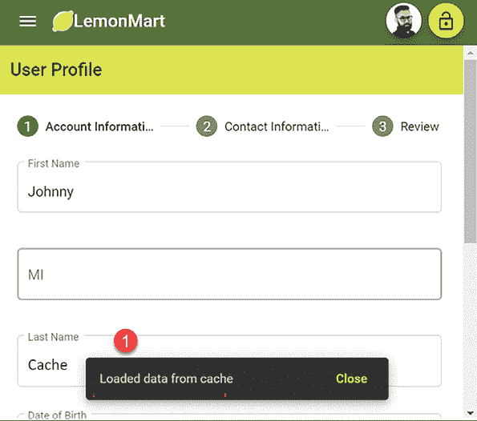

图 8.15：从缓存加载数据

实现一个优秀的缓存用户体验极具挑战性。我提供了一个基本的方法来展示什么是可能的。然而，许多边缘情况可能会影响你的应用程序中缓存的工作方式。

在我的情况下，缓存固执地存在，直到我们成功将数据保存到服务器。这可能会让一些用户感到沮丧。

恭喜！你已经成功实现了一个复杂的表单来从你的用户那里捕获数据！

# 练习

通过更新`UserService`和多步骤的`ProfileComponent`表单来练习 Angular 中的新概念，如信号和`@defer`：

+   更新`UserService`及其相关组件，使用`signal`而不是`BehaviorSubject`。

+   使用`@defer`来延迟条件视图的渲染。

+   在`LoginComponent`中实现一个展开面板，以向用户传达密码复杂性的要求。

# 摘要

本章介绍了 LemonMart 的表单、指令和用户控制相关功能。我们使用数据绑定创建了可重用的组件，这些组件可以嵌入到另一个组件中。我们展示了你可以使用 PUT 向服务器发送数据并缓存用户输入的数据。我们还创建了一个多步骤输入表单，它可以适应屏幕大小的变化。我们通过利用可重用表单部分、基类表单以存放公共功能以及属性指令来封装字段级别的错误行为和消息，从我们的组件中移除了样板代码。

我们使用日期选择器、自动完成支持和表单数组创建了动态表单元素。我们通过输入掩码和柠檬评分器实现了交互式控件。使用`ControlValueAccessor`接口，我们将柠檬评分器无缝集成到我们的表单中。我们展示了我们可以通过提取名称作为其表单部分来线性扩展表单的大小和复杂性。此外，我们还介绍了使用网格列表构建布局。

在下一章中，我们将进一步增强我们的组件，使用路由器来编排它们。我们还将实现主/详细视图和数据表，并探索 NgRx 作为 RxJS/BehaviorSubject 的替代方案。

# 进一步阅读

+   *响应式表单*，2024：[`angular.dev/guide/forms/reactive-forms`](https://angular.dev/guide/forms/reactive-forms)

+   *属性指令*，2024：[`angular.dev/guide/directives/attribute-directives`](https://angular.dev/guide/directives/attribute-directives)

+   *认识 Angular 的新控制流*，2023：[`blog.angular.io/meet-angulars-new-control-flow-a02c6eee7843`](https://blog.angular.io/meet-angulars-new-control-flow-a02c6eee7843)

+   *rxweb：在 Angular Reactive Forms 中显示错误消息的好方法*，Ajay Ojha，2019：[`medium.com/@oojhaajay/rxweb-good-way-to-show-the-error-messages-in-angular-reactive-forms-c27429f51278`](https://medium.com/@oojhaajay/rxweb-good-way-to-show-the-error-messages-in-angular-reactive-forms-c27429f51278)

+   *控制值访问器*，Jennifer Wadella，2019：[`www.youtube.com/watch?v=kVbLSN0AW-Y`](https://www.youtube.com/watch?v=kVbLSN0AW-Y)

+   *CSS 组合器*，2020：[`developer.mozilla.org/en-US/docs/Web/CSS/CSS_Selectors#Combinators`](https://developer.mozilla.org/en-US/docs/Web/CSS/CSS_Selectors#Combinators)

+   *JavaScript 中的记忆化*，Sumit Kumar Singh，2023：[`designtechworld.medium.com/memoization-in-javascript-282d5fad29c8`](https://designtechworld.medium.com/memoization-in-javascript-282d5fad29c8)

+   *为什么你永远不应该在 Angular 模板表达式中使用函数调用*，Jurgen Van de Moere，2019：[`medium.com/showpad-engineering/why-you-should-never-use-function-calls-in-angular-template-expressions-e1a50f9c0496`](https://medium.com/showpad-engineering/why-you-should-never-use-function-calls-in-angular-template-expressions-e1a50f9c0496)

# 问题

尽可能好地回答以下问题，以确保你已理解本章的关键概念，而无需使用 Google。你知道你是否答对了所有问题吗？请访问 [`angularforenterprise.com/self-assessment`](https://angularforenterprise.com/self-assessment) 获取更多信息：

1.  组件和用户控件之间的区别是什么？

1.  属性指令是什么？

1.  `@`-语法的含义是什么？

1.  `ControlValueAccessor` 接口的目的是什么？

1.  序列化、反序列化和活化是什么？

1.  在表单上修补值意味着什么？

1.  如何将两个独立的 `FormGroup` 对象相互关联？
