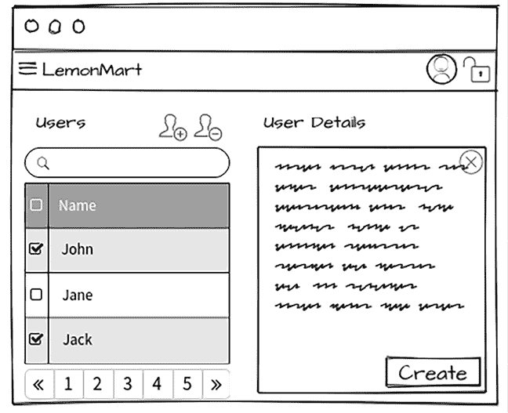

# 9

# 食谱 – 主/详细信息，数据表，和 NgRx

在本章中，我们通过实现 LemonMart 中的前三个在业务应用程序中最常用的功能（主/详细信息视图，数据表和状态管理）来完成以路由器为首要的架构实现。我将使用 LemonMart 和 LemonMart Server 展示具有服务器端分页的数据表，突出前端和后端的集成。

我们将利用路由编排概念来编排我们的组件如何加载数据或渲染。然后，我们将使用解析守卫在导航到组件之前减少加载数据时的样板代码。我们将使用辅助路由通过路由配置来布局组件，并在多个上下文中重用相同的组件。

然后，我们将使用 LocalCast 天气应用程序深入探讨 NgRx，并使用 LemonMart 探索 NgRx Signal Store，这样你就可以熟悉 Angular 中更高级的应用程序架构概念。到本章结束时，我们将触及 Angular 和 Angular Material 提供的主要功能 – 如果你愿意，就是好的部分。

本章涵盖了大量的内容。它以食谱格式组织，因此你可以在项目工作时快速参考特定的实现。我涵盖了实现架构、设计和主要组件，并突出显示重要的代码片段来解释解决方案是如何组合在一起的。利用你所学到的知识，我期望读者能够填补常规实现和配置细节。然而，如果你遇到困难，可以始终参考 GitHub 仓库。

在本章中，你将学习以下主题：

+   使用解析守卫加载数据

+   使用绑定和路由数据重用组件

+   使用辅助路由的主/详细信息视图

+   带分页的数据表

+   NgRx 存储 和 影响

+   NgRx 生态系统

+   实现全局旋转器

+   使用 Angular CLI 配置服务器代理

# 技术要求

书籍的样本代码的最新版本可以在以下列表中链接的 GitHub 仓库中找到。该仓库包含代码的最终和完成状态。你可以在本章结束时通过查找`projects`文件夹下的代码章节末尾快照来验证你的进度。

对于*第九章*：

确保**lemon-mart-server**正在运行。请参阅*第七章*，*与 REST 和 GraphQL API 一起工作*。

1.  克隆以下仓库：[`github.com/duluca/local-weather-app`](https://github.com/duluca/local-weather-app) 和 [`github.com/duluca/lemon-mart`](https://github.com/duluca/lemon-mart)。

1.  在根目录下执行`npm install`以安装依赖。

1.  项目的初始状态反映在：

    ```js
    projects/stage11 
    ```

1.  项目的最终状态反映在：

    ```js
    projects/stage12 
    ```

1.  将阶段名称添加到任何`ng`命令中，以仅对该阶段执行操作：

    ```js
    npx ng build stage12 
    ```

注意，存储库根目录中的`dist/stage12`文件夹将包含编译结果。

在*第八章*，*食谱 - 可重用性、表单和缓存*中，我们创建了一个带有`editUser`函数的`ViewUserComponent`。在章节后面实现系统中的主/详细视图时，我们需要这个功能，其中经理可以看到系统中的所有用户并编辑他们。在启用`editUser`功能之前，我们需要确保`ViewUserComponent`组件和`ProfileComponent`组件可以加载任何用户，给定他们的 ID。

在接下来的几节中，我们将学习关于解析保护器的内容，以简化我们的代码并减少样板代码的数量。让我们首先实现一个我们可以用于两个组件的解析保护器。

# 使用解析保护器加载数据

解析保护器是一种不同类型的路由保护器，如*第六章*，*基于角色的导航实现*中提到的。解析保护器可以通过从`route`参数中读取记录 ID，异步加载数据，并在组件激活和初始化时准备好数据来为组件加载数据。

解析保护器的主要优势包括加载逻辑的可重用性、减少了样板代码，以及减少了依赖性，因为组件可以在不导入任何服务的情况下接收所需的数据：

1.  在`user/user`下创建一个新的`user.resolve.ts`类：

    ```js
    **src/app/user/user/user.****resolve****.****ts**
    import { inject } from '@angular/core'
    import { ActivatedRouteSnapshot, ResolveFn } from '@angular/router'
    import { catchError, map } from 'rxjs/operators'
    import { transformError } from '../../common/common'
    import { User } from './user'
    import { UserService } from './user.service'
    export const userResolver: ResolveFn<User> = (route: ActivatedRouteSnapshot) => {
      return inject(UserService)
        .getUser(route.paramMap.get('userId'))
        .pipe(map(User.Build), catchError(transformError))
    } 
    ```

    与`UserService`中的`updateUser`方法类似，我们使用`map(User.Build)`来填充`user`对象，使其在组件从`route`快照加载数据时准备好使用，正如我们接下来将看到的。

1.  修改`user-routing.module.ts`以添加一个新的路径`profile/:userId`，带有路由解析器和`canActivate authGuard`：

    ```js
    **src/app/user/user-routing.****module****.****ts**
    ...
    {
        path: 'profile/:userId',
        component: ProfileComponent,
        resolve: {
          user: userResolver,
        },
        canActivate: [authGuard],
      },
      ... 
    ```

    当与身份验证保护器结合使用时，`resolve`函数只有在保护器成功后才会执行。

1.  更新`profile`组件，如果存在，则从`route`加载数据：

    ```js
    **src/app/user/profile/profile.****component****.****ts**
    ...
      constructor(
        ...
        **private****route****:** **ActivatedRoute**
      ) {
        super()
      }
      **private****readonly** **destroyRef =** **inject****(****DestroyRef****)**

      ngOnInit() {
        this.formGroup = this.buildForm()
        if (**this****.****route****.****snapshot****.****data****[**'**user**'**]**) {
          **this****.****patchUser****(****this****.****route****.****snapshot****.****data****[**'**user**'**]**)
        } else {
           combineLatest(
            [this.loadFromCache(), 
             this.authService.currentUser$]
           )
          .pipe(
            takeUntilDestroyed(this.destroyRef),
            filter(
              ([cachedUser, me]) => 
                cachedUser != null || me != null
            ),
            tap(
              ([cachedUser, me]) => 
               this.patchUser(cachedUser || me)
            )
          )
          .subscribe()
        }
      } 
    ```

我们首先检查用户是否存在于`route`快照中。如果是，我们调用`patchUser`来加载此用户。否则，我们回退到我们的条件缓存加载逻辑。

注意，`patchUser`方法还设置了`currentUserId`和`nameInitialDate$`可观察对象，并调用`patchUpdateData`基类来更新表单数据。

您可以通过导航到带有您用户 ID 的配置文件来验证解析器是否正常工作。使用出厂设置，此 URL 将类似于`http://localhost:4200/user/profile/5da01751da27cc462d265913`。

# 使用绑定和路由数据重用组件

现在，让我们重构`viewUser`组件，以便我们可以在多个上下文中重用它。根据创建的模拟图，应用程序中显示用户信息的地方有两个。

第一个地方是我们之前章节中实现的用户资料**审查**步骤。第二个地方是在`/manager/users`路由的用户管理屏幕上，如下所示：



图 9.1：经理用户管理模拟图

为了最大化代码重用，我们必须确保我们的共享 `ViewUser` 组件可以在两种上下文中使用。

在第一个用例中，我们将当前用户绑定到多步输入表单的 **Review** 步骤。在第二个用例中，组件需要使用 resolve 守卫加载数据，因此我们不需要实现额外的逻辑来实现我们的目标：

1.  更新 `viewUser` 组件以注入 `Router` 和 `ActivatedRoute`。在 `ngOnInit` 中，我们需要从路由中设置 `currentUser` 并订阅未来的路由更改事件，以使用辅助函数 `assignUserFromRoute` 更新用户，并在 `ngOnDestroy` 中取消订阅事件：

    ```js
    **src/app/user/view-user/view-user.****component****.****ts**
    ...
    export class ViewUserComponent 
      implements OnInit, OnChanges, OnDestroy {
      private readonly route = inject(ActivatedRoute)
      private readonly router = inject(Router)
      private routerEventsSubscription?: Subscription
      ...
      ngOnInit() {
        // assignment on initial render
        this.assignUserFromRoute()
        this.routerEventsSubscription = 
          this.router.events.subscribe((event) => {
          // assignment on subsequent renders
          if (event instanceof NavigationEnd) {
            this.assignUserFromRoute()
          }
        })
      }
      private assignUserFromRoute() {
        if (this.route.snapshot.data['user']) {
          this.currentUser = this.route.snapshot.data['user']
        }
      }
      ngOnDestroy(): void {
        this.routerEventsSubscription?.unsubscribe()
      }
      ...
    }} 
    ```

`ngOnInit` 只会在组件在另一个组件内部初始化或在路由器上下文中加载时触发一次。如果已经解析了路由的任何数据，我们将更新 `currentUser`。当用户想要查看另一个用户时，将发生一个新的导航事件，带有不同的用户 ID。由于 Angular 会重用组件，我们必须订阅路由事件以对后续的用户更改做出反应。在这种情况下，如果发生 `NavigationEnd` 事件，并且已解析了用户数据，我们将再次更新 `currentUser`。

我们现在有三个独立的事件来更新和处理数据。在父组件上下文中，`ngOnChanges` 处理 `@Input` 值的更新，如果 `this.user` 已经绑定，则更新 `currentUser`。我们上面添加的代码处理了第一次导航和后续导航事件中的剩余两个情况。

由于 LemonMart 是作为一个独立的应用程序自举的，并且 `viewUser` 是一个独立的组件，因此我们可以在多个懒加载的模块中使用这个组件，而无需额外的编排。

如果你没有使用独立组件，你必须在这个组件内部包装一个 `SharedComponentsModule`，并在你的懒加载模块中导入该模块。你可以在项目的 GitHub 历史记录中找到一个示例实现。

在关键组件就绪后，让我们开始实现 master/detail 视图。

# 使用辅助路由的 master/detail 视图

路由器优先架构的真正力量在辅助路由中得以实现，我们可以通过路由配置单独影响组件的布局，从而允许我们混合现有的组件到不同的布局中。辅助路由是相互独立的路由，它们可以在标记中定义的命名出口中渲染内容，例如 `<router-outlet name="master">` 或 `<router-outlet name="detail">`。此外，辅助路由可以有它们的参数、浏览器历史、子路由和嵌套辅助路由。

在下面的示例中，我们将实现一个基本的 master/detail 视图，使用辅助路由：

1.  实现一个简单的组件，其中定义了两个命名的出口：

    ```js
    **src/app/manager/user-management/user-management.****component****.****ts**
      template: `
        <div class="h-pad">
          <router-outlet name="master"></router-outlet>
          <div style="min-height: 10px"></div>
          <router-outlet name="detail"></router-outlet>
        </div>
      ` 
    ```

1.  在 `manager` 下添加一个新的 `userTable` 组件。

1.  更新 `manager-routing.module.ts` 以定义辅助路由：

    ```js
    **src/app/manager/manager-routing.****module****.****ts**
      ...
        {
          path: 'users',
          component: UserManagementComponent,
          children: [
            { 
              path: '', component: UserTableComponent, 
               outlet: 'master' 
            },
            {
              path: 'user',
              component: ViewUserComponent,
              outlet: 'detail',
              resolve: {
                user: userResolver,
              },
            },
          ],
          canActivate: [authGuard],
          canActivateChild: [authGuard],
          data: {
            expectedRole: Role.Manager,
          },
        },
    ... 
    ```

    这意味着当用户导航到`/manager/users`时，他们将看到`UserTableComponent`，因为它使用的是默认路径。

1.  在`manager.module.ts`中提供`UserResolve`，因为`viewUser`依赖于它。

1.  在`userTable`中实现一个临时按钮：

    ```js
    **src/app/manager/user-table/user-table.component.html**
    <button
      mat-icon-button
      [routerLink]="[
        '../users',
        { outlets: { detail: ['user', { userId: row._id }] } }
      ]"
      [skipLocationChange]="true">
      <mat-icon>visibility</mat-icon>
    </button> 
    ```

    `skipLocationChange`指令在不将新记录推入历史记录的情况下进行导航。因此，如果用户查看多个记录并点击**后退**按钮，他们将被带回到上一个屏幕，而不是必须滚动查看他们首先查看的记录。

    想象一下，一个用户点击了一个类似于之前定义的**查看详情**按钮——然后，`ViewUserComponent`将为用户渲染带有给定`userId`的组件。在下一张截图中，你可以看到在下一节实现数据表后，**查看详情**按钮将看起来如何：

    

    图 9.2：查看详情按钮

    你可以尽可能多地组合，并为主视图和详情视图定义替代组件，从而允许动态布局的无限可能性。然而，设置`routerLink`可能是一个令人沮丧的经历。根据具体条件，你必须提供或不需要提供链接中的所有或部分出口。

    例如，在先前的场景中，考虑以下替代实现，其中主出口被明确定义：

    ```js
    ['../users', { 
       outlets: { 
         master: [''], detail: ['user', {userId: row.id}] 
       } 
    }], 
    ```

    路由器将无法正确解析此路由，并且会静默失败加载。如果它是`master: []`，则可以正常工作。这取决于空路由上的模式匹配方式；虽然这在框架代码中逻辑上是合理的，但对于使用 API 的开发者来说并不直观。

    现在我们已经完成了`ViewUserComponent`的 resolve guard 实现，你可以使用 Chrome DevTools 来查看正确加载的数据。

    在调试之前，确保我们在*第七章*，*使用 REST 和 GraphQL API*中创建的**lemon-mart-server**正在运行。

1.  在**Chrome DevTools**中，在`this.currentUser`分配后立即设置一个断点，如图所示：

    图 9.3：Dev Tools 调试 ViewUserComponent

你将观察到`this.currentUser`被正确设置，而无需在`ngOnInit`函数内部加载数据的任何样板代码，这显示了 resolve guard 的真正好处。"ViewUserComponent"是详情视图；现在，让我们实现主视图，作为一个带有分页的数据表。

# 带有分页的数据表

我们已经创建了脚手架来布局我们的主/详细视图。在主出口处，我们将有一个用户分页数据表，所以让我们实现 `UserTableComponent`，它将包含一个名为 `dataSource` 的 `MatTableDataSource` 属性。我们需要能够使用标准分页控件（如 `pageSize` 和 `pagesToSkip`）批量获取用户数据，并使用用户提供的搜索文本进一步缩小选择范围。

让我们从向 `UserService` 添加必要的功能开始：

1.  实现一个新的 `IUsers` 接口来描述分页数据的结构：

    ```js
    **src/app/user/user/user.****service****.****ts**
    ...
    export interface IUsers {
      data: IUser[]
      total: number
    } 
    ```

1.  使用 `getUsers` 函数更新 `UserService` 的接口：

    ```js
    **src/app/user/user/user.****service****.****ts**
    ...
    export interface IUserService {
      getUser(id: string): Observable<IUser>
      updateUser(id: string, user: IUser): Observable<IUser>
      **getUsers****(****pageSize****:** **number****,** **searchText****:** **string****,** 
        **pagesToSkip****:** **number****):** **Observable****<****IUsers****>**
    }
    export class UserService implements IUserService {
    ... 
    ```

1.  将 `getUsers` 添加到 `UserService`：

    ```js
    **src/app/user/user/user.****service****.****ts**
    ...
    getUsers(
        pageSize: number,
        searchText = '',
        pagesToSkip = 0,
        sortColumn = '',
        sortDirection: '' | 'asc' | 'desc' = 'asc'
      ): Observable<IUsers> {
        const recordsToSkip = pageSize * pagesToSkip
        if (sortColumn) {
          sortColumn =
            sortDirection === 'desc' ? `-${sortColumn}` : sortColumn
        }
        return this.httpClient.get<IUsers>(
          `${environment.baseUrl}/v2/users`, { 
            params: {
              filter: searchText,
              skip: recordsToSkip.toString(),
              limit: pageSize.toString(),
              sortKey: sortColumn,
            },
          })
        }
    ... 
    ```

    注意，`sort` 方向由关键字 `asc`（升序）和 `desc`（降序）表示。在升序排序列时，我们将列名作为参数传递给服务器。为了降序排序列，我们在列名前加上负号。

1.  使用分页、排序和过滤设置 `UserTable`：

    ```js
    **src/app/manager/user-table/user-table.****component****.****ts**
    ...
    @Component({
      selector: 'app-user-table',
      templateUrl: './user-table.component.html',
      styleUrls: ['./user-table.component.css'],
    })
    export class UserTableComponent implements AfterViewInit {
      @ViewChild(MatPaginator) paginator!: MatPaginator
      @ViewChild(MatSort) sort!: MatSort
      private skipLoading = false
      private readonly userService = inject(UserService)
      private readonly router = inject(Router)
      private readonly activatedRoute = inject(ActivatedRoute)
      private readonly destroyRef = inject(DestroyRef)
      readonly refresh$ = new Subject<void>()
      readonly demoViewDetailsColumn = signal(false)
      items$!: Observable<Iuser[]>
      displayedColumns = computed(() => [
        'name',
        'email',
        'role',
        ...(this.demoViewDetailsColumn() ? ['_id'] : []),
      ])
      isLoading = true
      resultsLength = 0
      hasError = false
      errorText = ''
      selectedRow?: Iuser
      search = new FormControl<string>('', OptionalTextValidation)
      resetPage(stayOnPage = false) {
        if (!stayOnPage) {
          this.paginator.firstPage()
        }
        **// this.outletCloser.closeOutlet('detail')**
        this.router.navigate([
          '../users',
          { outlets: { detail: null } }
        ], {
          skipLocationChange: true,
          relativeTo: this.activatedRoute,
        })
        this.selectedRow = undefined
      }
      showDetail(userId: string) {
        this.router.navigate([
          '../users',
          { outlets: { detail: ['user', { userId: userId }] }
        }],
          {
            skipLocationChange: true,
            relativeTo: this.activatedRoute,
          }
        )
      }  
      ngAfterViewInit() {
        this.sort.sortChange
          .pipe(
            tap(() => this.resetPage()),
            takeUntilDestroyed(this.destroyRef)
          )
          .subscribe()
        this.paginator.page
          .pipe(
            tap(() => this.resetPage(true)),
            takeUntilDestroyed(this.destroyRef)
          )
          .subscribe()
        if (this.skipLoading) {
          return
        }     
        setTimeout(() => {
          **this****.****items$** **=** **merge****(**
            **this****.****refresh$****,**
            **this****.****sort****.****sortChange****,**
            **this****.****paginator****.****page****,**
            **this****.****search****.****valueChanges****.****pipe****(**
              **debounceTime****(****1000****),**
              **tap****(****() =>****this****.****resetPage****())**
            **)**
          **).****pipe****(**
            **startWith****({}),**
            **switchMap****(****() =>** **{**
              **this****.****isLoading** **=** **true**
              **return****this****.****userService****.****getUsers****(**
                **this****.****paginator****.****pageSize****,**
                **this****.****search****.****value****as****string****,**
                **this****.****paginator****.****pageIndex****,**
                **this****.****sort****.****active****,**
                **this****.****sort****.****direction**
              **)**
            **}),**
            **map****(****(****results****: { total:** **number****; data: IUser[] }****) =>** **{**
              **this****.****isLoading** **=** **false**
              **this****.****hasError** **=** **false**
              **this****.****resultsLength** **= results.****total**
              **return** **results.****data**
            **}),**
            **catchError****(****(****err****) =>** **{**
              **this****.****isLoading** **=** **false**
              **this****.****hasError** **=** **true**
              **this****.****errorText** **= err**
              **return****of****([])**
            **}),**
            **takeUntilDestroyed****(****this****.****destroyRef****),**
          **)**
        **})**
      }
    } 
    ```

    我们定义并初始化各种属性以支持加载分页数据。`items$` 存储定义在数据表上显示的数据的可观察流。`displayedColumns`，一个计算信号，定义了表格的列。为了动态显示或隐藏列，我们可以使用一个信号定义一个切换器，例如 `demoViewDetailsColumn`。由于这个信号在计算信号中被引用，当它更新时，计算信号也会更新，这将在表格上得到反映。`paginator` 和 `sort` 提供分页和排序首选项，`.search` 提供我们用于通过文本过滤结果的文本。

    `resetPage` 帮助将分页重置到第一页并隐藏详细视图。这在搜索、分页或排序事件之后很有用，否则将显示随机记录的详细视图。

    `showDetail` 使用路由器在名为 `detail` 的出口处显示所选记录的详细视图。在本节稍后，我们将介绍在模板中实现相同链接的版本。我故意包含了这两个选项，这样你可以看到它们是如何实现的。

    我故意在代码库中以下代码被注释掉：

    ```js
    // this.outletCloser.closeOutlet('detail') 
    ```

    我发现，在某些情况下，路由器可能无法优雅地关闭出口。位于 `common` 文件夹中的 `OutletCloserService` 可以从任何上下文中无麻烦地关闭任何出口。

    关于安德鲁·斯科特原始版本的引用，请参阅 [`stackblitz.com/edit/close-outlet-from-anywhere`](https://stackblitz.com/edit/close-outlet-from-anywhere)。

    魔法发生在`ngAfterViewInit`中。我们首先订阅`sort`和`paginator`变化事件，以便我们可以正确地重置表格。接下来，我们使用`setTimeout`调用内的`merge`方法，如前一个片段中突出显示的，来监听影响需要显示的数据的分页、排序和筛选属性的变化。如果某个属性发生变化，整个管道就会被触发。

    为什么`setTimeout`是必要的？因为我们使用从模板中提取的 paginator 和 sort 的引用，我们必须使用`ngAfterViewInit`生命周期钩子。然而，在这个时候，Angular 已经为 Material 数据表组件设置了`dataSource`属性。如果我们使用`merge`操作符重新分配它，我们将得到 NG0100 `ExpressionChangedAfterItHasBeenCheckedError`。使用`setTimeout`将重新分配推入下一个变化检测周期，从而避免错误。

    这与我们在`AuthService`中实现登录例程的方式类似。该管道包含对`this.userService.getUsers`的调用，该调用将根据传入的分页、排序和筛选偏好检索用户。然后结果被管道传输到`this.items$` Observable，数据表通过`async`管道订阅它以显示数据。

    没有必要订阅`this.items$`，因为 Material 数据表已经内部订阅了它。如果你订阅，每次对服务器的调用都将执行两次。

    然而，你必须注意将`takeUntilDestroyed`调用放在管道中的最后一个元素。否则，你可能会在调用之后泄漏合并后的订阅。

    在[`cartant.medium.com/rxjs-avoiding-takeuntil-leaks-fb5182d047ef`](https://cartant.medium.com/rxjs-avoiding-takeuntil-leaks-fb5182d047ef)了解更多相关信息。

1.  导入以下模块：

    ```js
    **src/app/manager/user-table/user-table.****component****.****ts**
    imports: [
      AsyncPipe,
      FlexModule,
      FormsModule,
      MatButtonModule,
      MatFormFieldModule,
      MatIconModule,
      MatInputModule,
      MatPaginatorModule,
      MatProgressSpinnerModule,
      MatSlideToggleModule,
      MatSortModule,
      MatTableModule,
      MatToolbarModule,
      ReactiveFormsModule,
      RouterLink,
    ], 
    ```

1.  实现`userTable`的 CSS：

    ```js
    **src****/app/manager/user-****table****/user-****table****.component.scss**
    .loading-shade {
      position: absolute;
      top: 0;
      left: 0;
      bottom: 56px;
      right: 0;
      background: rgba(0, 0, 0, 0.15);
      z-index: 1;
      display: flex;
      align-items: center;
      justify-content: center;
    }
    .filter-row {
      min-height: 64px;
      padding: 8px 24px 0;
    }
    .full-width {
      width: 100%;
    }
    .mat-mdc-paginator {
      background: transparent;
    }
    /* row selection styles */
    .mat-mdc-row .mat-mdc-cell {
      border-bottom: 1px solid transparent;
      border-top: 1px solid transparent;
      cursor: pointer;
    }
    .mat-mdc-row:hover .mat-mdc-cell {
      border-color: currentColor;
      background-color: #efefef;
    }
    .selected {
      font-weight: 500;
      background-color: #efefef;
    } 
    ```

    在注释`/* 行选择样式 */`下面的样式有助于在点击单个行时辅助材料涟漪效果。

1.  最后，实现`userTable`模板：

    ```js
    **src/app/manager/user-table/user-table.component.html**
    <div fxLayout="row" fxLayoutAlign="end">
      <mat-slide-toggle
        [checked]="demoViewDetailsColumn()"
        (change)="demoViewDetailsColumn.set($event.checked)">
        Demo 'View Details' Column
      </mat-slide-toggle>
    </div>
    <div class="filter-row">
      <form style="margin-bottom: 32px">
        <div fxLayout="row">
          <mat-form-field class="full-width">
            <mat-icon matPrefix>search</mat-icon>
            <input matInput placeholder="Search" 
                   aria-label="Search" [formControl]="search" />
            <mat-hint>Search by e-mail or name</mat-hint>
            @if (search.invalid) {
              <mat-error>
                Type more than one character to search
              </mat-error>
            }
          </mat-form-field>
        </div>
      </form>
    </div>
    <div class="mat-elevation-z8">
      **@if (isLoading) {**
        **<****div****class****=****"loading-shade"****>**
          **<****mat-spinner****></****mat-spinner****>**
        **</****div****>**
      **}**
      @if (hasError) {
        <div class="error">
          {{ errorText }}
        </div>
      }
      <mat-table
        class="full-width"
        **[****dataSource****]=****"items$"**
        matSort
        matSortActive="name"
        matSortDirection="asc"
        matSortDisableClear>
        <ng-container matColumnDef="name">
          <mat-header-cell *matHeaderCellDef mat-sort-header>
            Name
          </mat-header-cell>
          <mat-cell *matCellDef="let row">
            {{ row.fullName }}
          </mat-cell>
        </ng-container>
        <ng-container matColumnDef="email">
          <mat-header-cell *matHeaderCellDef mat-sort-header>
            E-mail
          </mat-header-cell>
          <mat-cell *matCellDef="let row">
            {{ row.email }}
          </mat-cell>
        </ng-container>
        <ng-container matColumnDef="role">
          <mat-header-cell *matHeaderCellDef mat-sort-header>
            Role
          </mat-header-cell>
          <mat-cell *matCellDef="let row">
            {{ row.role }}
          </mat-cell>
        </ng-container>
        <ng-container matColumnDef="_id">
          <mat-header-cell *matHeaderCellDef>
            View Details
          </mat-header-cell>
          <mat-cell *matCellDef="let row" 
                    style="margin-right: 8px">
            **<****button**
              **mat-icon-button**
              **[****routerLink****]=****"[**
                **'../users',**
                **{** 
                  **outlets: { detail: ['user', { userId: row._id }]** 
                **}** 
              **}]"**
              **[****skipLocationChange****]=****"true"****>**
              <mat-icon>visibility</mat-icon>
            </button>
          </mat-cell>
        </ng-container>
        <mat-header-row *matHeaderRowDef="displayedColumns()">
        </mat-header-row>
        <mat-row
          **matRipple**
          **(****click****)=****"selectedRow = row;** 
            **demoViewDetailsColumn() ? 'noop' : showDetail(row._id)"**
          [class.selected]="selectedRow === row"
          *matRowDef="let row; columns: displayedColumns()">
        </mat-row>
      </mat-table>
      <mat-toolbar>
        <mat-toolbar-row>
          <button mat-icon-button **(****click****)=****"refresh$.next()**">
            <mat-icon title="Refresh">refresh</mat-icon>
          </button>
          <span class="flex-spacer"></span>
          <mat-paginator [pageSizeOptions]="[5, 10, 25, 100]" 
                         [length]="resultsLength">
          </mat-paginator>
        </mat-toolbar-row>
      </mat-toolbar>
    </div> 
    ```

    注意`loading-shade`样式的实现，它在加载数据时在表格上放置一个旋转器。这是一个本地化旋转器的示例。在*实现 NgRx/SignalState 的全局旋转器*部分，我将介绍我们如何实现全局版本。大多数非常大的应用程序将需要一个本地化旋转器，以避免全局旋转器造成的过度全屏中断。

    我们将`items$`绑定到`dataSource`以激活 Observable。下面，带有`[routerLink]="['../users', { outlets: { detail: ['user', { userId: row._id }] } }]"`的`mat-icon-button`使用上下文行变量来分配一个 URL，该 URL 将在`detail`出口中显示`ViewUserComponent`。`skipLocationChange`确保浏览器中的 URL 不会更新为出口信息。

    注意，在`routerLink`中使用相对 URL`'../users'`，如上所示，允许`UserTableComponent`从管理功能模块的上下文中解耦。这样，组件可以在其他上下文中重用，例如`/owner/users`或`/ceo/users`，而不是硬编码为`/manager/users`。

    在延迟加载的模块和命名出口中设置路由器可能会出错。

    您可以通过修改`app.config.ts`中的根提供者来启用路由器的调试模式，如下所示添加`withDebugTracing`函数：

    ```js
    provideRouter(routes, withDebugTracing()), 
    ```

    进一步来说，`matRipple`指令在行被点击时启用 Material Design 涟漪效果。紧接着，我们实现点击处理程序。默认情况下，点击行将使用`showDetail`函数显示详细视图；否则，用户将在最右侧列的视图按钮上点击。

    最后，观察刷新按钮的点击，这会导致`refresh$`可观察对象更新。这将由我们在组件中实现的合并管道捕获。

    仅放置主视图，表格如下所示（确保您已更新到 Angular 的最新版本）：

    

    图 9.4：用户表

    如果您点击行，`ViewUserComponent`将使用`showDetails`函数在详细出口中渲染，如下所示：

    

    图 9.5：行点击的主/详细视图

    注意行是如何被突出显示以表示选择的。如果您在右上角翻转**演示“查看详情”列**选项，您将取消隐藏**查看详情**列。

    如果您点击**查看**图标，`ViewUserComponent`将使用模板中的`routerLink`在详细出口中渲染，如下所示：

    

    图 9.6：主/详细视图图标点击

    在上一章中，我们实现了**编辑**按钮，由右上角的铅笔图标表示，将`userId`传递给`UserProfile`以编辑和更新数据。

1.  点击**编辑**按钮，将被带到`ProfileComponent`，编辑用户记录，并验证您是否可以更新其他用户的记录。

1.  确认您可以在数据表中查看更新的用户记录。

这本书中 LemonMart 的数据表分页演示完成了主要功能。在继续之前，请确保所有测试都已通过。

对于单元测试，我导入`NameInputComponent`或`ViewUserComponent`的具体实现，而不是使用`angular-unit-test-helper`中的`createComponentMock`函数。这是因为`createComponentMock`不足以将数据绑定到子组件。在**进一步阅读**部分，我包括了一篇由 Aiko Klostermann 撰写的博客文章，该文章涵盖了使用`@Input()`属性测试 Angular 组件。

实现的重任完成后，我们现在可以探索替代的架构、工具和库，以更好地理解针对各种需求构建 Angular 应用的最好方式。接下来，让我们探索 NgRx。

# NgRx 存储和效果

如*第一章*，*Angular 的架构和概念*所述，NgRx 库基于 RxJS 将响应式状态管理引入 Angular。使用 NgRx 进行状态管理允许开发者编写原子化、自包含和可组合的代码片段，创建动作、还原器和选择器。这种响应式编程将副作用隔离在状态变化中。NgRx 是 RxJS 之上的抽象层，以适应**Flux 模式**。

NgRx 有四个主要元素：

+   **存储**：状态信息持久化的中心位置。您在存储中实现一个还原器以存储状态转换，并实现一个选择器以从存储中读取数据。这些都是原子化和可组合的代码片段。

    视图（或用户界面）通过使用选择器显示存储中的数据。

+   **动作**：在整个应用中发生的独特事件。

    动作从视图触发，目的是将它们派发到存储中。

+   **派发器**：这是一个向存储发送动作的方法。

    存储中的还原器监听派发的动作。

+   **效果**：这是动作和派发器的组合。效果通常用于不是从视图中触发的动作。

让我们回顾以下 Flux 模式图，现在突出显示了一个**效果**：


图 9.7：通量模式图

让我们通过一个具体的例子来演示 NgRx 是如何工作的。为了保持简单，我们将利用 LocalCast 天气应用。

## 实现 LocalCast 天气应用的 NgRx

我们将在 LocalCast 天气应用中实现 NgRx 以执行搜索功能。考虑以下架构图：


图 9.8：LocalCast 天气架构

我们将使用 NgRx 存储和效果库来实现我们的实现。NgRx 存储动作在图中以浅灰色表示，包括`WeatherLoaded`还原器和应用状态。在顶部，动作表示为各种数据对象流，要么派发动作，要么对派发的动作进行操作，使我们能够实现*第一章*，*Angular 的架构和概念*中引入的**Flux 模式**。NgRx 效果库通过在其模型中隔离副作用来扩展 Flux 模式，而不会在存储中留下临时数据。

在*图 9.8*中以深灰色表示的效果工作流程从*步骤 1*开始：

1.  `CitySearchComponent`派发`search`动作。

1.  `search`动作出现在`@ngrx/action`可观察流（或数据流）中。

1.  `CurrentWeatherEffects`对`search`动作进行操作以执行搜索。

1.  `WeatherService` 执行搜索以从 **OpenWeather API** 获取当前天气信息。

存储动作，以浅灰色表示，以 *step A*（大写 A）开头：

1.  `CurrentWeatherEffects` 分派 `weatherLoaded` 动作。

1.  `weatherLoaded` 动作出现在 Observable 数据流上，标记为 `@ngrx/action` 流。

1.  `weatherLoaded` 约束对 `weatherLoaded` 动作进行操作。

1.  `weatherLoaded` 约束将天气信息转换为要存储的新状态。

1.  新状态是一个持久化的 `search` 状态，是 `appStore` 状态的一部分。

注意，有一个包含子 `search` 状态的父级 `appStore` 状态。我故意保留了这种设置，以展示父级状态如何随着你在存储库中添加不同类型的数据元素而扩展。

最后，一个视图（一个 Angular 组件）从存储中读取，以 *step a*（小写 a）开始：

1.  `CurrentWeather` 组件使用 `async` 管道订阅 `selectCurrentWeather` 选择器。

1.  `selectCurrentWeather` 选择器监听 `appStore` 状态中 `store.search.current` 属性的变化。

1.  `appStore` 状态检索持久化的数据。

使用 NgRx 选择器就像编写查询来读取存储在数据库中的数据。在这种情况下，数据库是存储库。

使用 NgRx，当用户搜索城市时，检索、持久化和在 `CurrentWeatherComponent` 上显示该信息的动作将自动通过单个可组合和不可变元素发生。

## 比较 BehaviorSubject 和 NgRx

我们将实现 NgRx 与 `BehaviorSubject` 一起，以便你可以看到实现相同功能的差异。为此，我们需要一个滑动开关来在两种策略之间切换：

本节使用 **local-weather-app** 仓库。你可以在 `projects/stage12` 文件夹下找到本章的代码示例。

注意，位于 `src` 文件夹下的主应用程序使用按钮切换在 `Signals`、`BehaviorSubject` 和 `NgRx` 之间切换。

1.  首先，在 `CitySearchComponent` 上实现一个 `<mat-slide-toggle>` 元素，如下面的截图所示：

    图 9.9：LocalCast 天气滑动切换

    确保字段由组件上的名为 `useNgRx` 的属性支持。

1.  重构 `doSearch` 方法，将 `BehaviorSubject` 代码提取到名为 `behaviorSubjectBasedSearch` 的单独函数中。

1.  创建一个名为 `ngRxBasedSearch` 的函数原型：

    ```js
    **src/app/city-search/city-search.****component****.****ts**
    doSearch(searchValue: string) {
      const userInput = searchValue.split(',').map((s) => s.trim())
      const searchText = userInput[0]
      const country = userInput.length > 1 ? userInput[1] : undefined
      **if** **(****this****.****useNgRx****) {**
        **this****.****ngRxBasedSearch****(searchText, country)**
      **}** **else** **{**
        **this****.****behaviorSubjectBasedSearch****(searchText, country)**
      **}**
    } 
    ```

我们将从你刚刚创建的 `ngRxBasedSearch` 函数中分派一个动作。

## 设置 NgRx

你可以使用以下命令添加 NgRx Store 包：

```js
$ npx ng add @ngrx/store 
```

这将创建一个包含 `index.ts` 文件的 `reducers` 文件夹。现在添加 NgRx 的 `effects` 包：

```js
$ npx ng add @ngrx/effects --minimal 
```

我们在这里使用 `--minimal` 选项以避免创建不必要的样板代码。

接下来，安装 NgRx 规范库，这样你就可以利用生成器为你创建样板代码：

```js
$ npm i -D @ngrx/schematics 
```

由于 NgRx 的高度解耦特性，实现 NgRx 可能会令人困惑，这可能需要了解库的内部工作原理。

在`projects/stage12`下的示例项目配置了`@ngrx/store-devtools`进行调试。

如果你希望在运行时能够`console.log` NgRx 动作进行调试或监控，可以使用 NgRx 文档中描述的 MetaReducer，[`ngrx.io/guide/store/metareducers`](https://ngrx.io/guide/store/metareducers)。

## 定义 NgRx 动作

在我们能够实现影响或还原器之前，我们首先需要定义我们的应用程序将能够执行的动作。对于 LocalCast Weather，有两种类型的动作：

+   `search`：获取正在搜索的城市或邮编的当前天气

+   `weatherLoaded`：表示已获取新的当前天气信息

通过运行以下命令创建名为`search`的动作：

```js
$ npx ng generate @ngrx/schematics:action search --group --creators 
```

在提示时选择默认选项。

`--group`选项将动作分组在名为`action`的文件夹下。`--creators`选项使用创建函数来实现动作和还原器，这是一种更熟悉且直接的方式来实现这些组件。

现在，让我们使用`createAction`函数实现这两个动作，提供名称和预期的输入参数列表：

```js
**src/app/action/search.****actions****.****ts**
import { createAction, props, union } from '@ngrx/store'
import { ICurrentWeather } from '../interfaces'
export const SearchActions = {
  search: createAction(
    '[Search] Search',
    props<{ searchText: string; country?: string }>()
  ),
  weatherLoaded: createAction( 
    '[Search] CurrentWeather loaded',
    props<{ current: ICurrentWeather }>()
  ),
}
const all = union(SearchActions)
export type SearchActions = typeof all 
```

搜索操作名为`'[Search] Search'`，输入参数包括`searchText`和一个可选的`country`参数。`weatherLoaded`操作遵循类似的模式。在文件末尾，我们创建了一个动作的联合类型，这样我们就可以将它们分组在单个父类型下，以便在应用程序的其余部分中使用。

注意，动作名称前缀为`[Search]`。这个约定有助于开发者在调试期间视觉上分组相关的动作。

现在我们已经定义了动作，我们可以实现影响来处理搜索动作并分发一个`weatherLoaded`动作。

## 实现 NgRx 影响

如前所述，影响允许我们更改存储的状态，而无需存储导致更改的事件数据。例如，我们希望我们的状态只有天气数据，而不是搜索文本本身。影响允许我们一步完成此操作，而不是强迫我们使用中间存储来存储`searchText`，以及一个更复杂的链式事件来将其转换为天气数据。

否则，我们可能需要在中间实现一个还原器。我们首先需要将此值存储在 NgRx 存储中，然后从服务中检索它，最后分发一个`weatherLoaded`动作。影响将使从服务中检索数据变得更加简单。

现在，让我们将`CurrentWeatherEffects`添加到我们的应用程序中：

```js
$ npx ng generate @ngrx/schematics:effect currentWeather --module=app.module.ts --root --group --creators 
```

在提示时选择默认选项。

你将在`effects`文件夹下创建一个新的`current-weather.effects.ts`文件。

再次强调，`--group`用于将影响分组在同名文件夹下。`--root`将影响注册到`app.module.ts`中，我们使用带有`--creators`选项的创建函数。

在`CurrentWeatherEffects`文件中，首先实现一个私有的`doSearch`方法：

```js
**src/app/effects/current-weather.****effects****.****ts**
private doSearch(action: { searchText: string; country?: string }) {
  return this.weatherService.getCurrentWeather(
    action.searchText,
    action.country
  ).pipe(
    map((weather) =>
      SearchActions.weatherLoaded({ current: weather })
    ),
    catchError(() => EMPTY)
  )
} 
```

注意，我们选择忽略由`EMPTY`函数抛出的错误。您可以使用类似于为 LemonMart 实现的`UiService`将这些错误暴露给用户。

这个函数接受一个带有搜索参数的操作，调用`getCurrentWeather`，并在收到响应后，派发`weatherLoaded`操作，传递当前天气属性。

现在，让我们创建效果本身，这样我们就可以触发`doSearch`函数：

```js
**src/app/effects/current-weather.****effects****.****ts**
getCurrentWeather$ = createEffect(() =>
  this.actions$.pipe(
    ofType(SearchActions.search), 
    exhaustMap((action) => this.doSearch(action))
  )
) 
```

这是我们利用 Observable 操作流`this.actions$`并监听`SearchAction.search`类型操作的地方。然后我们使用`exhaustMap`操作符来注册发射的事件。

由于其独特的性质，`exhaustMap`不会允许在`doSearch`函数完成派发`weatherLoaded`操作之前处理另一个搜索操作。

## RxJS 操作符对操作的影响

在前面的例子中，我使用了`exhaustMap`操作符。这并不一定是这个用例的正确 RxJS 操作符，`switchMap`才是。我选择`exhaustMap`的明确目的是为了限制对免费资源生成的 API 调用数量，这样可以积极限制请求的速率。

让我们探索我们可以选择的四个 RxJS 操作符：

1.  `mergeMap`：允许并行处理多个操作，适用于每个操作的效果是独立且不需要同步的场景。

1.  `concatMap`：按顺序处理操作，只有在前一个操作完成之后才开始下一个操作，确保操作按它们被派发的顺序处理，这对于在状态更新中保持一致性很有用。

1.  `switchMap`：在接收到新操作时，取消之前的操作并切换到新的操作，这对于搜索栏输入等用例非常合适，在这些用例中，只有最新的操作（例如，用户输入）是相关的。

1.  `exhaustMap`：如果已有操作正在处理，则忽略新操作，这使得它对于避免重复或冲突请求很有用，例如，多次提交相同的表单。

使用`exhaustMap`，如果`doSearch`函数在创建操作之前快速创建，则尚未处理的操作将被丢弃。所以，如果创建了操作*a*、*b*、*c*、*d*和*e*，但`doSearch`在*c*和*d*创建之间完成，那么操作*b*、*c*和*e*将永远不会被处理，但操作*d*将会被处理。对于*b*、*c*和*e*的 API 调用永远不会发生。只有为*d*发出的`weatherLoaded`操作。虽然我们避免了为用户永远不会看到的成果进行不必要的 API 调用，但最终状态可能会让用户感到困惑。

使用`mergeMap`，所有搜索操作都是并行处理的，进行 API 调用，并派发`weatherLoaded`操作。所以，如果快速创建了操作*a*、*b*、*c*、*d*和*e*，用户可能会看到所有操作的闪烁结果，但最后显示的是*e*。

使用`concatMap`，动作按顺序处理。考虑到动作*a*、*b*、*c*、*d*和*e*，对于*b*的 API 调用不会在为*a*分发了`weatherLoaded`动作并渲染结果之后进行。这将为每个动作发生，直到显示*e*的天气。

使用`switchMap`，每个动作都会进行 API 调用。然而，只有最后一个动作会被分发，所以用户只会看到最后一个动作显示。

因此，从 UX 的角度来看，`switchMap`在功能上是正确的实现。您还可以在数据处理时实现加载指示器或禁用用户输入，以防止昂贵的 API 调用。

最终，根据您的用例和 UX 需求，考虑使用不同的 RxJS 操作符。并非所有分发的动作都会导致需要渲染的屏幕。如果您想保留所有数据输入，您可以在服务工作者后台线程中处理动作，并更新应用中的通知面板或徽章计数器。

## 实现 reducers

当触发`weatherLoaded`动作时，我们需要一种方法来摄取当前天气信息并将其存储在我们的`appStore`状态中。Reducer 将帮助我们处理特定动作，创建一个隔离且不可变的管道以可预测地存储我们的数据。

让我们创建一个`search`reducer：

```js
$ npx ng generate @ngrx/schematics:reducer search 
    --reducers=reducers/index.ts --group --creators 
```

使用默认选项。在这里，我们使用`--group`来保持文件在`reducers`文件夹下组织，并使用`--creators`来利用创建 NgRx 代码的创建者风格。我们还使用`--reducers`指定我们的父`appStore`状态的位置在`reducers/index.ts`，以便我们的新 reducer 可以与之注册。

您可能会注意到`reducers.index.ts`已更新以注册新的`search.reducer.ts`。让我们一步一步实现它。

在`search`状态中，我们将存储当前天气，因此实现接口以反映这一点：

```js
**src/app/reducers/search.****reducer****.****ts**
export interface State {
  current: ICurrentWeather
} 
```

现在让我们指定`initialState`。这类似于我们需要定义`signal`或`BehaviorSubject`的默认值。重构`WeatherService`以导出`const defaultWeather: ICurrentWeather`对象，您可以使用它来初始化`BehaviorSubject`和`initialState`：

```js
**src/app/reducers/search.****reducer****.****ts**
export const initialState: 
  State = { 
      current: defaultWeather,
  } 
```

最后，使用`on`操作符实现`searchReducer`来处理`weatherLoaded`动作：

```js
**src/app/reducers/search.****reducer****.****ts**
const searchReducer = createReducer(
  initialState,
  on(SearchActions.weatherLoaded, (state, action) => {
    return {
      ...state,
      current: action.current,
    }
  })
) 
```

我们注册了`weatherLoaded`动作，解包存储的数据，并将其传递到`search`状态。

当然，这是一个非常简单的例子。然而，很容易想象一个更复杂的场景，我们可能需要扁平化或处理接收到的数据并将其以易于消费的方式存储。以不可变的方式隔离这种逻辑是利用像 NgRx 这样的库的关键价值主张。

## 使用选择器在 Store 中注册

我们需要`CurrentWeatherComponent`注册到`appStore`状态以获取更新的当前天气数据。

首先，依赖注入`appStore`状态并注册选择器以从`State`对象中提取当前天气：

```js
**src/app/current-weather/current-weather.****component****.****ts**
**import** ***** **as** **appStore** **from****'../reducers'**
export class CurrentWeatherComponent {
  current$: Observable<ICurrentWeather>
  constructor(**private****store****:** **Store****<appStore.****State****>**) {
    this.current$ =
      **this****.****store****.****pipe****(****select****(****(****state****:** **State****) =>** **state.****search****.****current****))**
  } 
  ...
} 
```

我们监听通过存储流动的状态变化事件。使用`select`函数，我们可以实现内联选择以获取所需的数据。

我们可以稍作重构，通过使用`createSelector`在`reducers/index.ts`上创建`selectCurrentWeather`属性来使我们的选择器可重用：

```js
**src/app/reducers/index.****ts**
export const selectCurrentWeather = createSelector(
  (state: State) => state.search.current,
  current => current
) 
```

随着 TypeScript 接口和 NgRx 选择器的数量增加，您应该将它们拆分为单独的文件，并更好地组织您的代码。

此外，由于我们希望保持`BehaviorSubject`的持续操作，我们可以在`CurrentWeatherComponent`中实现一个`merge`运算符来监听`WeatherService`更新和`appStore`状态更新：

```js
**src/app/current-weather/current-weather.****component****.****ts**
import * as appStore from '../reducers'
  constructor(
    private weatherService: WeatherService,
    private store: Store<appStore.State>
  ) {
    this.current$ = merge(
      **this****.****store****.****pipe****(****select****(appStore.****selectCurrentWeather****)),**
      this.weatherService.currentWeather$
    )
  } 
```

现在我们能够监听存储更新，让我们实现最终的拼图碎片：分发搜索动作。

## 分发存储动作

我们需要分发搜索动作，以便我们的搜索效果可以获取当前天气数据并更新存储。在本章的早期，您在`CitySearchComponent`中实现了一个名为`ngRxBasedSearch`的存根函数。

让我们实现`ngRxBasedSearch`：

```js
**src/app/city-search/city-search.****component****.****ts**
ngRxBasedSearch(searchText: string, country?: string) {
  this.store.dispatch(SearchActions.search({ searchText, country }))
} 
```

不要忘记将`appState`存储注入到组件中！

就这样！现在您应该能够运行您的代码并测试是否一切正常。

如您所见，NgRx 带来了许多复杂的技巧来创建使数据转换不可变、定义良好和可预测的方法。然而，这伴随着相当大的实现开销。

使用您的最佳判断来决定您是否需要在您的 Angular 应用程序中使用 Flux 模式。前端应用程序代码可以通过实现返回平面数据对象的 RESTful API 而变得简单得多，复杂的数据操作由服务器端处理，从而减少，如果不是消除，对像 NgRx 这样的工具的需求。

## 单元测试 reducer 和选择器

您可以在`search.reducer.spec.ts`中对`weatherLoaded`reducer 和`selectCurrentWeather`选择器实现单元测试：

```js
**src/app/reducers/search.****reducer****.****spec****.****ts**
import { SearchActions } from '../actions/search.actions'
import { defaultWeather } from '../weather/weather.service'
import { fakeWeather } from '../weather/weather.service.fake'
import { selectCurrentWeather } from './index'
import { initialState, reducer } from './search.reducer'
describe('Search Reducer', () => {
  describe('weatherLoaded', () => {
    it('should return current weather', () => {
      const action = SearchActions.weatherLoaded({ current: fakeWeather })
      const result = reducer(initialState, action)
      expect(result).toEqual({ current: fakeWeather })
    })
  })
})
describe('Search Selectors', () => { 
  it('should selectCurrentWeather', () => {
    const expectedWeather = defaultWeather
    expect(selectCurrentWeather({
      search: { current: defaultWeather }
    })).toEqual(
      expectedWeather
    )
  })
}) 
```

这些单元测试很简单，将确保在存储中不会发生对数据结构的意外更改。

## 使用 MockStore 单元测试组件

您需要更新`CurrentWeatherComponent`的测试，以便我们可以将模拟的`Store`注入到组件中以测试`current$`属性的值。

让我们看看需要添加到`spec`文件中的 delta，以配置模拟存储：

```js
**src/app/current-weather/current-weather.****component****.****spec****.****ts**
import { MockStore, provideMockStore } from '@ngrx/store/testing'
describe('CurrentWeatherComponent', () => {
  ...
  let store: MockStore<{ search: { current: ICurrentWeather } }>
  const initialState = { search: { current: defaultWeather } }
  beforeEach(async(() => {
    ...
    TestBed.configureTestingModule({
      imports: [AppMaterialModule],
      providers: [
        ...
        **provideMockStore****({ initialState }),**
      ],
    }).compileComponents()
    ...
    **store =** **TestBed****.****inject****(****Store****)** **as****any**
  }))
...
}) 
```

我们现在可以更新`'should get currentWeather from weatherService'`测试，以查看`CurrentWeatherComponent`是否与模拟存储一起工作：

```js
**src/app/current-weather/current-weather.****component****.****spec****.****ts**
it('should get currentWeather from weatherService', (done) => {
  // Arrange
  store.setState({ search: { current: fakeWeather } })
  weatherServiceMock.currentWeather$.next(fakeWeather)
  // Act
  fixture.detectChanges() // triggers ngOnInit()
  // Assert
  expect(component.current$).toBeDefined()
  component.current$.subscribe(current => { 
    expect(current.city).toEqual('Bethesda')
    expect(current.temperature).toEqual(280.32)
    // Assert on DOM
    const debugEl = fixture.debugElement
    const titleEl: HTMLElement =
      debugEl.query(By.css('.mat-title')).nativeElement
    expect(titleEl.textContent).toContain('Bethesda')
    done()
  })
}) 
```

模拟存储允许我们设置存储的当前状态，这反过来又允许选择器在构造函数中调用以触发并获取提供的虚假天气数据。

`TestBed` 并非在 Angular 中编写单元测试的硬性要求，关于这个话题在 [`angular.dev/guide/testing`](https://angular.dev/guide/testing) 有很好的介绍。我的同事和第二版的审稿人布伦登·考林斯为这一章贡献了一个无床的 `spec` 文件，名为 `current-weather.component.nobed.spec.ts`。他提到在运行测试时，由于减少了导入和维护，性能有显著提升，但需要更高水平和专业知识来实现测试。如果你在一个大型项目中，考虑跳过 `TestBed`。

GitHub 上的示例代码位于 `projects/stage12` 文件夹下。

继续更新你剩余的测试，直到它们全部通过后再继续。

# NgRx 生态系统

现在你对 NgRx 的理解已经超越了理论层面，让我们来检查生态系统中的不同可用选项。

这里有一些社区中流行的选项，包括 NgRx 的兄弟包：

+   **NgRx/Data**，一个简化实体管理的 NgRx 入门

+   **NgRx/ComponentStore**，NgRx/Store 的组件范围版本，减少了样板代码

+   **NgRx/SignalStore**，Angular 中下一代状态管理

+   **Akita**，为 JS 应用量身定制的响应式状态管理解决方案

+   **Elf**，一个具有神奇力量的响应式存储

让我们探索这些选项。

## NgRx/Data

如果 NgRx 是基于配置的框架，那么 NgRx Data 就是 NgRx 的基于约定的兄弟。NgRx Data 自动创建存储、效果、动作、还原器、分发和选择器。如果你的应用程序的大部分动作是 **CRUD**（**创建**、**检索**、**更新**和**删除**）操作，那么 NgRx Data 可以用更少的代码实现与 NgRx 相同的结果。

`@ngrx/data` 与 `@ngrx/entity` 库协同工作。它们共同提供了一套丰富的功能，包括事务性数据管理。

NgRx Data 可能是你和你的团队更好地了解 Flux 模式的一个很好的入门，它允许轻松地过渡到完整的 NgRx 框架。不幸的是，NgRx Data 已不再推荐用于新项目。

截至 17 版本，NgRx Data 正式进入维护模式，不推荐用于新项目或添加到现有项目中。

你可以在 [`ngrx.io/guide/data`](https://ngrx.io/guide/data) 上了解更多相关信息。

你可以通过执行以下命令将 NgRx Data 添加到你的项目中：

```js
$ npx ng add @ngrx/store –minimal
$ npx ng add @ngrx/effects –minimal
$ npx ng add @ngrx/entity
$ npx ng add @ngrx/data 
```

那么，你应在你的下一个应用中实现 NgRx Data 吗？这取决于情况，但鉴于其维护模式的状态，可能不太适合。由于这个库是 NgRx 之上的抽象层，如果你没有很好地理解 NgRx 的内部结构，你可能会感到迷茫和受限。然而，这个库在减少实体数据管理和 CRUD 操作的样板代码方面有很大的潜力。

如果你正在应用程序中执行大量 CRUD 操作，你可能可以节省时间，但请注意将实现范围限制在需要它的区域。正如 NgRx 文档所强调的，NgRx Data 缺乏许多功能齐全的实体管理系统功能，如深度实体克隆、服务器端查询、关系、键生成和非规范化服务器响应。

对于一个功能齐全的实体管理库，可以考虑 BreezeJS [`www.getbreezenow.com/breezejs`](https://www.getbreezenow.com/breezejs)。然而，请注意 Breeze 并不遵循 NgRx 所采用的响应式、不可变和 Redux 原则。

接下来，让我们调查 ComponentStore 在 Flux 模式更不具挑战性和更专注的应用。

## NgRx/ComponentStore

NgRx ComponentStore 提供了一种轻量级、响应式的状态管理解决方案，非常适合组件或模块内的本地状态。

它旨在在不需要全局存储的情况下管理本地状态，保持关注点的清晰分离，并使组件简单易维护。这种方法对于具有许多本地状态和交互的复杂组件尤其有用，因为它允许基于推的服务管理此状态，支持可重用性和独立实例。

你可以使用`ComponentStore`实现分页数据表的 dataSource，类似于使用 Elf 的方式。查看 Pierre Bouillon 这篇出色的两篇博客文章：[`dev.to/this-is-angular/handling-pagination-with-ngrx-component-stores-1j1p`](https://dev.to/this-is-angular/handling-pagination-with-ngrx-component-stores-1j1p)。

相比之下，NgRx Store 管理全局共享状态，对需要可扩展性、多个效果和 DevTools 集成的较大应用程序有益。虽然 ComponentStore 的可扩展性较低，并且有许多更新器和效果，但它确保了类型安全、性能和易于测试，从而允许更封装和组件特定的状态管理。

在`ComponentStore`和`Store`之间的选择取决于应用程序的大小、组件依赖、状态持久性和业务需求等因素。

在[`ngrx.io/guide/component-store`](https://ngrx.io/guide/component-store)了解更多关于 ComponentStore 的信息。

你可以通过执行以下操作将 ComponentStore 添加到你的项目中：

```js
$ npx ng add @ngrx/component-store 
```

简而言之，`ComponentStore`是本书中提到的“带有 Subject 的服务”方法的替代方案。然而，随着 Angular 架构向信号转变，你可能想要跳过`ComponentStore`并实现`SignalStore`。

## NgRx/Signals

在第二章“表单、可观察者、信号和主题”的“使用 Angular 信号”部分，我向您介绍了信号。NgRx/Signals 是一个自包含的库，它提供了一个反应式状态管理解决方案，并附带了一套用于处理 Angular 信号的实用工具。它旨在简单易用，为开发者提供了一个直观的 API。其轻量级特性确保了应用程序负载最小，同时保持高性能。

该库推崇声明式编程，培养简洁的代码。它促进了自主组件的构建，这些组件易于集成，促进了可扩展和灵活的应用程序。此外，它强制执行类型安全，在开发周期的早期阶段减少错误。

该库包括以下内容：

+   SignalStore 是一个强大的状态管理系统，它从 NgRx/Store 和 NgRx/ComponentStore 中汲取了最佳之处。

+   SignalState 是一个简化的实用工具，用于在 Angular 组件和服务中管理状态，它取代了服务中任何需要自行管理的信号属性。

+   `rxMethod` 提供了可选的使用方式来与 Observables 交互。这对于与现有代码交互非常有用。

+   `withEntities` 是一个实体管理插件，提供了一种高效的方法来促进 CRUD 操作，以管理实体。

我们将在接下来的章节中深入探讨 SignalState 和 SignalStore。

您可以在 [`ngrx.io/guide/signals`](https://ngrx.io/guide/signals) 上了解更多关于 NgRx Signals 的信息。

您可以通过执行以下命令将 SignalStore 添加到您的项目中：

```js
$ npx ng add @ngrx/signals 
```

让我们通过一些流行的非 NgRx 选项，如 Akita 和 Elf，来结束我们的状态管理生态系统之旅。

## Akita

Akita 是一个将 Flux、Redux 和 RxJS 概念结合到可观察数据存储模型中的状态管理解决方案，它倾向于不可变性和流式数据。它强调简单性，减少了样板代码，由于其适中的学习曲线，使得所有级别的开发者都能轻松上手。Akita 采用面向对象原则，对于那些熟悉面向对象编程的人来说，它使代码更加直观，并强制执行一致的结构来指导和标准化团队的开发实践。

Akita 围绕 RxJS 的 `BehaviorSubject` 构建，并为状态管理提供了专门的类，如 `Store`、`Query` 和 `EntityStore`。与 NgRx 类似，Akita 将状态变化暴露为 RxJS Observables，并使用更新方法进行状态突变，从而实现面向对象的状态管理风格。

如果您正在寻找一个具有内置实体管理、状态历史记录插件、服务器端分页、更多面向对象而非函数式，以及总体上更少的样板代码的简单解决方案，那么尝试 Akita 是值得的。

您可以在 [`opensource.salesforce.com/akita/`](https://opensource.salesforce.com/akita/) 上了解更多关于 Akita 的信息。

## Elf

Elf 是众多选项中最神奇的一个。它是一个针对 Angular 的新状态管理库，旨在通过最小化 API 简化反应性和状态突变，专注于人体工程学和易用性。它使用现代 RxJS 模式进行状态管理，使您能够对状态变化和反应性进行精细控制。Elf 设计得轻量级且直观，为更全面的 NgRx 套件提供了一个更简单的替代方案。

Elf 是模块化的，完全可摇树（tree-shakable），并提供了一级支持以下功能：

+   **请求缓存**，以防止冗余的 API 调用。

+   **实体**，如 NgRx/Data 或 Akita。

+   **状态持久化**，适用于离线优先的应用程序。

+   **状态历史**，便于实现撤销/重做功能。

+   **高级分页**，以优化分页数据的获取和缓存。

+   Elf 集成了构建具有状态管理和声明式 Web 应用的功能和最佳实践，并使其变得简单。虽然可以使用 NgRx/ComponentStore 实现像分页支持这样的功能，但内置的分页缓存支持令人印象深刻。此外，Elf 还有一个插件，可以同步浏览器标签页之间的状态，从而实现真正的高级状态管理。

+   考虑到 Elf 内置的众多高质量功能，它是一个突出的解决方案，可能是你下一个项目的正确选择。你可以在 [`ngneat.github.io/elf/`](https://ngneat.github.io/elf/) 上了解更多关于 Elf 的信息。

我们已经涵盖了 NgRx 生态系统的细微差别。让我们学习如何使用 Angular 配置代理，以处理期望以特定方式访问服务器端数据的基于约定的状态管理库。

# 使用 Angular CLI 配置服务器代理

一些状态管理库，尤其是基于约定的实体存储库如 NgRx Data，对访问服务器端数据做出了假设。在 NgRx Data 的情况下，库希望通过与你 Angular 应用在同一端口上运行的 `/api` 路径来访问 REST API。我们必须利用 Angular CLI 的代理功能来实现这一目标，在开发过程中完成。

通常，HTTP 请求会发送到我们的 web 服务器，并且我们的 API 服务器应该有相同的 URL。然而，在开发过程中，我们通常在 `http://localhost` 的两个不同端口上托管这两个应用程序。某些库，包括 NgRx Data，要求 HTTP 调用在同一个端口上。这为创建无摩擦的开发体验带来了挑战。因此，Angular CLI 随带了一个代理功能，你可以用它将 `/api` 路径指向 localhost 上的不同端点。这样，你可以使用一个端口来服务你的 web 应用和 API 请求：

1.  在 `src` 下创建一个 `proxy.conf.json` 文件，如下所示：

如果你正在使用 **lemon-mart-server** 单一仓库，这将位于 `web-app/src`。

```js
**proxy.conf.json**
{
  "/api": {
    "target": "http://localhost:3000",
    "secure": false,
    "pathRewrite": {
       "^/api": ""
    }
  }
} 
```

1.  使用 `angular.json` 注册代理：

    ```js
    **angular.json**
    ...
    "serve": {
      "builder": "@angular-devkit/build-angular:dev-server",
      "options": {
        "browserTarget": "lemon-mart:build",
        "proxyConfig": "proxy.conf.json"
      },
      ...
    } 
    ```

现在当您运行`npm start`或`ng serve`时启动的服务可以重写对`/api`路由的任何调用 URL 为`http://localhost:3000`。这是**lemon-mart-server**默认运行的端口。

如果您的 API 在不同的端口上运行，请使用正确的端口号和子路由。

# 使用 NgRx/SignalState 实现全局加载指示器

在第八章的“*多步骤响应式表单*”部分，以及本章前面的“*数据表格与分页*”部分，我讨论了本地化加载指示器和全局加载指示器之间的区别。全局加载指示器是解决 UI 元素在数据加载时未准备好交互而产生的 UX 问题的 80-20 解决方案。然而，这将在具有多个屏幕组件或后台服务工作者加载数据的大型应用程序中引起过多的全屏中断。在这种情况下，大多数组件将需要本地加载指示器。

考虑到这一点，让我们追求 80-20 解决方案。我们可以使用`HttpInterceptor`来检测应用程序内是否进行了 API 调用。这允许我们显示或隐藏全局加载指示器。然而，如果有多个并发调用，我们必须跟踪这一点，否则全局加载指示器可能会行为异常。使用 NgRx/SignalState，我们可以跟踪调用次数，而无需在服务中引入本地状态。

## NgRx/SignalState

SignalState 是`@ngrx/signals`提供的一个轻量级实用工具，用于以简洁和极简的方式在 Angular 组件和服务中管理基于信号的状态。它用于在组件类、服务或独立函数中直接创建和操作状态的小部分。您可以提供一个对象属性的深层嵌套信号。

SignalState 应在组件或服务中使用来管理简单的状态。该库提供了以下函数：

+   `signalState`是一个实用函数，它接受存储的初始状态并定义状态的结构。

+   `patchState`更新存储的值。

在[`ngrx.io/guide/signals/signal-state`](https://ngrx.io/guide/signals/signal-state)中了解更多关于 NgRx SignalState 的信息。

我们首先将`signalState`、`computed` `signal`、`showLoader`和`hideLoader`函数添加到`UiService`中：

1.  按照以下方式修改`UiService`：

    ```js
    **src/app/common/ui.****service****.****ts**
    @Injectable({ providedIn: 'root' })
    export class UiService {
      ...
      private readonly loadState = **signalState**({ 
        count: 0, 
        isLoading: false 
      })
      isLoading = **computed**(() => this.loadState.isLoading())
      showLoader() {
        if (this.loadState.count() === 0) {
          **patchState**(this.loadState, () => ({ isLoading: true }))
        }
        **patchState**(this.loadState, (state) => ({ 
          count: state.count++ 
        }))}
      hideLoader() {
        **patchState**(this.loadState, (state) => ({ 
          count: state.count—
        }))
        if (this.loadState.count() === 0) {
          **patchState**(this.loadState, () => ({ isLoading: false }))
        }
      }  
      ...
    } 
    ```

    我们首先定义一个私有的`signalState`并初始化`count`和`isLoading`属性。状态应该始终封装在使用它的边界内，以避免不可控的副作用。正如我们在下一节中将要讨论的，SignalStore 是管理副作用的一个更健壮的解决方案。然而，我们希望`isLoading`是公开可用的，以便 UI 组件可以将其绑定以隐藏或显示加载指示器。因此，我们实现了一个`computed`信号，它作为一个选择器以只读方式返回`isLoading`的当前值。

    `patchState` 是一个实用函数，它提供了一种类型安全的方式来对状态片段进行不可变更新。我们使用它来更新 `count` 和 `isLoading` 的值，每当调用 `show` 或 `hide` 函数时。

1.  接下来，在 `src/common` 下实现 `LoadingHttpInterceptor` 以调用 `show` 和 `hide` 方法：

    ```js
    **src/common/loading.****http****.****interceptor****.****ts**
    export function LoadingHttpInterceptor(
      req: HttpRequest<unknown>, next: HttpHandlerFn) {
      const uiService = inject(UiService)
      uiService.showLoader()
      return next(req).pipe(finalize(() => 
                            uiService.hideLoader()))
    } 
    ```

    我们注入 `UiService` 并调用 `showLoader` 以将计数加一。然后设置最终操作符，以便 API 调用完成后调用 `hideLoader` 以将计数减一。因此，每当调用加载器函数且计数等于零时，我们知道我们需要显示或隐藏旋转器。

    不要忘记在 `app.config.ts` 中提供新的拦截器。

1.  现在，在 common 下创建一个 `LoadingOverlayComponent` 并使用 `isLoading` 来显示或隐藏一个旋转器：

    ```js
    **src/common/loading-overlay.****component****.****ts**
    @Component({
      selector: 'app-loading-overlay',
      template: `
        **@if (uiService.isLoading()) {**
          <div class="overlay">
            <div class="center">
              
            </div>
          </div>
        **}**
      `,
      styles: `
        .overlay {
          position: fixed;
          width: 100%;
          height: 100%;
          left: 0;
          top: 0;
          background-color: rgba(255, 255, 255, 0.65);
          z-index: 9999;
        }
        .spinner {
          display: block;
          width: 48px;
          height: 48px;
          animation-name: spin;
          animation-duration: 1.00s;
          animation-iteration-count: infinite;
          animation-timing-function: ease-in-out;
        }
        @keyframes spin {
          0% { transform: rotate(0deg); }
          100% { transform: rotate(360deg); }
        }
        .center {
            position: absolute;
            top: 50%;
            left: 50%;
            transform: translate(-50%, -50%);
          }
      `,
      standalone: true,
      **encapsulation****:** **ViewEncapsulation****.****ShadowDom**,
    })
    export class LoadingOverlayComponent {
      readonly uiService = inject(UiService)
    } 
    ```

    我们注入并使用来自 `UiService` 的计算 `isLoading` 信号。通过 `@if` 流程控制，旋转器将根据 `isLoading` 是否设置为 true 或 false 来显示或隐藏。

    Angular 中的 `ViewEncapsulation.ShadowDom` 使用允许组件样式在 Shadow DOM 内封装。默认情况下，Angular 使用模拟模式将样式范围限定在组件内。然而，Shadow DOM 封装为动态 CSS 功能提供了更稳健的支持。

1.  最后，更新 `app.component.ts` 以导入并将在模板顶部放置新组件：

    ```js
    **src/app/app.****component****.****ts**
    template: `
        **<app-loading-overlay></app-loading-overlay>**
        <div class="app-container">
        ... 
    ```

1.  尝试一下。每当进行 API 调用时，一个辉煌的柠檬旋转器将接管屏幕。

    图 9.10：LemonMart 的柠檬旋转器

1.  这解决了第八章，*食谱 - 可重用性、表单和缓存*中提到的用户资料表单中的数据弹出问题。

    你的 API 调用是否太快以至于无法欣赏旋转器？

    在 **lemon-mart-server** 中，你可以添加两秒的延迟：

    ```js
    `server/src/v1/routes/authRouter.ts`
    router.get('/me', authenticate(), async (_req, res) => {
      `await setTimeout(2000)`
    ... 
    ```

    或者，你可以在浏览器 DevTools 的 **网络** 选项卡中将 **无节流** 下拉菜单更改为 **Fast 3G** 或 **Slow 3G**。

## 使用 HTML 和 CSS 预加载屏幕

如果你遵循上一节的提示，并将浏览器网络速度减慢到 **Slow 3G** 并禁用缓存，你会注意到任何东西在屏幕上显示都需要很长时间。在第三章，*构建企业级应用*中，我介绍了如何实现 **服务器端渲染**（**SSR**）来克服此类问题。然而，这并不总是可行的，或者可能过于复杂。使用简单的 HTML 和 CSS，我们可以实现一个简单的方法来展示一个吸引人且动态的加载屏幕，以娱乐在慢速网络下盯着你的应用的用户。

让我们从添加 LemonMart 的 CSS 开始：

1.  在 `src/assets/styles` 下创建 `spinner.css`。从 LemonMart 的 GitHub 仓库复制内容至 [`github.com/duluca/lemon-mart/blob/main/src/assets/styles/spinner.css`](https://github.com/duluca/lemon-mart/blob/main/src/assets/styles/spinner.css)。

1.  更新 `index.html` 以导入样式表，并将必要的 HTML 放在 `<app-root>` 元素内部：

    ```js
    **src/index.html** 
    <head>
      ...
      **<****link****href****=****"assets/styles/spinner.css"****rel****=****"stylesheet"** **/>**
    </head>
    <body class="mat-typography mat-app-background">
        <app-root>
          **<****div****class****=****"spinner-background"****>**
            **<****div****class****=****"spinner-container"****>**
              **<****svg****class****=****"spinner"****width****=****"****65px"****height****=****"65px"**
                **viewBox****=****"0 0 66 66"****>**
                **<****circle****class****=****"path"****fill****=****"none"****stroke-width****=****"6"**
                  **stroke-linecap****=****"round"****cx****=****"33"****cy****=****"33"****r****=****"30"****>**
                **</****circle****>**
              **</****svg****>**
              **<****h2****class****=****"animate-text"****>****Loading****</****h2****>**
            **</****div****>**
          **</****div****>**
        </app-root>
    </body> 
    ```

    当 Angular 启动时，`<app-root>` 的内容将被您的应用程序内容替换。

    注意，这个预加载屏幕被设计成最小化，应该会立即出现在屏幕上。然而，您会发现它仍然可能需要长达 6 秒钟才能显示。这是因为 Angular 优先加载全局的 `styles.scss` 文件。如果您使用 Angular Material，这将增加 165 KB 的内容，在 **慢速 3G** 网络中几乎需要 6 秒钟才能加载。然而，在 50 秒的总加载时间背景下，这仍然要好得多。

1.  重新启动您的 Angular 应用程序，您应该会看到预加载屏幕：


图 9.11：慢速网络上的预加载屏幕

现在您已经了解了如何使用 NgRx/SignalState 处理状态切片，让我们接下来深入了解出色的 NgRx/SignalStore 库。事实上，它如此之好，以至于它激发了我重写 LocalCast 天气应用程序，使其几乎完全依赖于 Observable 和 RxJS 操作符，并且没有订阅调用或异步管道。

# 使用 NgRx/SignalStore 重写 Angular 应用程序

使用 Observables，最好的订阅是你不需要做的。在这本书中，我们使用了 `async pipe`、`take(1)`、`takeUntilDestroyed` 和 `ngOnDestroy` 中的 `unsubscribe` 来尝试管理它们。这本书的示例代码在六年的时间里经过了各种实践者和专家的多次审查。每次审查都突出了 RxJS 代码中的一些疏忽或错误。

书的第三版提供了一个 99%无错误的实现。由于 RxJS 生态系统的疯狂复杂性，我永远无法声称 100%。

我引以为傲的是不选择容易的道路。我尽力为您提供真实和完整的示例，而不仅仅是计数器和待办事项列表。然而，与现实生活中发生的事情相比，这些项目仍然是非常受控制和规模较小的。你很少有时间回头重新评估整个项目。错误随着时间的推移而累积。这是使用 RxJS 的工作中的一个令人悲伤的现实。它在所做的事情上很棒，但 95%以上的代码并不需要这个工具带来的灵活性和反应性。大多数代码都是关于从 API 中检索一些数据一次并显示出来。由 async/await 驱动的承诺的信号使这种代码的编写变得简单。

## RxJS 和信号辅助工具

几个重要的函数将帮助您从 Observables 和 RxJS 转移：

+   **JavaScript 承诺**是一种允许异步操作的结构，提供了一种处理最终成功值或失败原因的方法。

+   **JavaScript async/await** 是 JavaScript 中的语法糖，它允许您以同步的方式编写异步代码，建立在承诺之上。

+   **RxJS Interop** 的 `toSignal` 创建一个跟踪 Observable 值的信号，类似于模板中的异步管道，但更灵活。类似于异步管道，`toSignal` 也为我们管理订阅，因此不需要使用 `subscribe`、`takeUntil` 或取消订阅。还有一个 `toObservable`，这在过渡期间非常有用。

+   `ChangeDetectionStrategy.OnPush` 是一个策略，告诉 Angular 仅当组件的输入属性更改时才运行变更检测，通过减少检查次数来提高性能。你需要在你的组件中将 `changeDetection` 属性设置为这个值，直到基于 Signal 的组件到来。

+   `lastValueFrom` 是一个实用函数，它将 Observable 转换为承诺，该承诺解析为 Observable 发出的最后一个值。此操作符还为我们管理订阅。还有 `firstValueFrom`，但你可能不需要它。这个对话将有必要进行，直到 Angular 为 `HttpClient`、`Router`、`FormControl` 等模块实现基于承诺的 API。

    RxJS 互操作功能目前处于开发者预览阶段。

    你可以在 [`angular.dev/guide/signals/rxjs-interop`](https://angular.dev/guide/signals/rxjs-interop) 上了解更多相关信息。

状态管理仍然是管理大型应用程序复杂性的关键。让我们看看 NgRx SignalStore 如何帮助过渡。

## NgRx/SignalStore

SignalStore 是一个围绕声明式编程构建的完整功能状态管理解决方案，确保代码干净简洁。SignalStore 用于管理具有复杂状态的较大存储，而 SignalState 则是为在单个组件或服务中包含简单状态而设计的。

更多关于 NgRx SignalStore 的信息，请参阅 [`ngrx.io/guide/signals/signal-store`](https://ngrx.io/guide/signals/signal-store)。

SignalStore 可以在根级别或组件级别提供。该库提供了以下函数：

+   `signalStore` 是一个用于管理应用程序中更大和更复杂状态片段的实用函数。

+   `withState` 接收存储的初始状态并定义状态的结构。

+   `withComputed` 从存储中现有的状态片段推导出计算属性。

+   `withMethods` 包含自定义函数（存储方法），这些函数公开暴露以通过一个定义良好的 API 操作存储。`withMethods` 可以使用 `patchState` 和注入的服务来更新存储。

+   `withHooks` 在存储创建或销毁时被调用，允许获取数据以初始化存储或更新状态。

+   `withEntities` 是一个扩展，用于简化实体管理中的 CRUD 操作。它类似于 `@ngrx/entity`，但并不相同。

    更多关于 NgRx SignalStore 实体的信息，请参阅 [`ngrx.io/guide/signals/signal-store/entity-management`](https://ngrx.io/guide/signals/signal-store/entity-management)。

    此外，还可以在 [`ngrx.io/guide/signals/signal-store/custom-store-features`](https://ngrx.io/guide/signals/signal-store/custom-store-features) 查看带有自定义存储功能的先进用例。

让我们看看如何将 SignalStore 应用于 LocalCast 天气。下面的图表是本章前面 *实现 NgRx for LocalCast 天气* 部分中的图表的重现。


图 9.12：LocalCast 天气架构

初步检查时，SignalStore 似乎比 NgRx Store 的实现更简单。这是因为信号的内生反应性已经内置到 Angular 中。你必须记住这条看不见的线索，它使得这个实现背后的魔法得以工作。

工作流程，如 *图 9.12* 中用深灰色表示，从 *步骤 1* 开始：

1.  `CitySearchComponent` 触发 `doSearch` 方法，该方法反过来调用 `store.updateWeather`。

1.  `withMethods` 激活 `updateWeather` 函数，该函数注入了对 `WeatherService` 的引用，并从中调用 `getCurrentWeather`。

1.  `updateWeather` 等待 `getCurrentWeather` 的结果，该结果从 **OpenWeather** 获取当前天气信息，并使用 `patchState` 更新 `store.current`。

1.  `CurrentWeatherComponent` 绑定到 `store.current`，因此当值更新时，模板会自动更新。

现在我们已经理解了 SignalStore 的概念运作方式，让我们来浏览一下新的代码库。

## 重构 RxJS 和 NgRx 代码

我们将回顾重构后的 LocalCast 天气应用，以检查代码是如何使用信号和 SignalStore 重写以变得更加简单和简洁。

本节源代码位于 `local-weather-app` 仓库的 `projects/signal-store` 目录下 [`github.com/duluca/local-weather-app/tree/main/projects/signal-store`](https://github.com/duluca/local-weather-app/tree/main/projects/signal-store)。

你可以通过执行以下命令来运行项目：

```js
$ npx ng serve --project signal-store 
```

使用以下命令运行 Cypress 测试：

```js
$ npx ng run signal-store:cypress-run --spec "cypress/e2e/app.cy.ts,cypress/e2e/simple-search.cy.ts" 
```

### NgRx Store 到 SignalStore

让我们从 `projects/signal-store/src/app/store` 下的 Store 实现开始：

```js
**projects/signal-store/src/app/store/weather.****store****.****ts**
export const WeatherStore = signalStore(
  {
    providedIn: 'root',
  },
  withState({
    current: defaultWeather,
  }),
  withMethods((store, weatherService = inject(WeatherService)) => ({
    async updateWeather(searchText: string, country?: string) {
      patchState(store, {
        current: await weatherService.getCurrentWeather(
          searchText,
          country
        ),
      })
    },
  }))
) 
```

`withState` 定义并初始化了存储。`withMethods` 实现了 `updateWeather` 函数，该函数封装了更新当前天气的行为。这个函数原本在 `WeatherService` 中，但现在已经被移动到存储中。可以说，对于 NgRx Store 的实现来说，这应该是最佳做法；然而，由于整体架构更加简单，更容易看出任何潜在的副作用最好在存储中实现。

### 从 Observables 到 Signals 的服务

我们必须更新 API 调用来返回 Promise 而不是 Observable。我首先更新了 `PostalCodeService`：

```js
**projects/signal-store/src/app/postal-code/postal-code.****service****.****ts**
export class PostalCodeService implements IPostalCodeService {
  private readonly httpClient = inject(HttpClient)
  resolvePostalCode(postalCode: string): Promise<IPostalCode> {
    const uriParams = new HttpParams()
      .set('maxRows', '1')
      .set('username', environment.username)
      .set('postalcode', postalCode)
    const httpCall$ = this.httpClient.get<IPostalCodeData>(
      `${environment.baseUrl}${environment.geonamesApi}.geonames.org/postalCodeSearchJSON`,
      { params: uriParams }
    )
    return lastValueFrom(httpCall$).then((data) =>
      data.postalCodes?.length > 0 ? 
        data.postalCodes[0] : defaultPostalCode
    )
  }
} 
```

`resolvePostalCode`现在返回`Promise<IPostalCode>`。我们将`httpClient.get`返回的 Observable 存储为本地变量`httpCall$`，然后通过`lastValueFrom`进行包装。在这个过程中，我们还移除了实现`mergeMap`和`defaultIfEmpty`以清理接收数据的管道。我们必须在`then`函数中实现类似的功能。如前所述，`then`的行为类似于一个`tap`函数。

接下来，让我们看看`WeatherService`：

```js
**projects/signal-store/src/app/weather/weather.****service****.****ts**
export class WeatherService implements IWeatherService {
  private readonly httpClient = inject(HttpClient)
  private readonly postalCodeService = inject(PostalCodeService)
  async getCurrentWeather(
    searchText: string, country?: string): Promise<ICurrentWeather> {
    const postalCode = await   
       this.postalCodeService.resolvePostalCode(searchText)
    if (postalCode && postalCode !== defaultPostalCode) {
      return this.getCurrentWeatherByCoords({
        latitude: postalCode.lat,
        longitude: postalCode.lng,
      })
    } else {
      const uriParams = new HttpParams().set(
        'q',
        country ? `${searchText},${country}` : searchText
      )
      return this.getCurrentWeatherHelper(uriParams)
    }
  }
  private getCurrentWeatherHelper(
    uriParams: HttpParams): Promise<ICurrentWeather> {
    uriParams = uriParams.set('appid', environment.appId)
    const httpCall$ = this.httpClient.get<ICurrentWeatherData>(
      `${environment.baseUrl}api.openweathermap.org/data/2.5/weather`,
      { params: uriParams }
    )
    return lastValueFrom(httpCall$).then(
           (data) => this.transformToICurrentWeather(data))
  } 
```

`getCurrentWeather`现在是一个异步函数，用于等待`postalCodeService.resolvePostalCode`的结果。处理`resolvePostalCode`响应的逻辑现在是一个简单的 if-else 语句，嵌套较少。`getCurrentWeatherHelper`已经被重构，类似于我们重构`resolvePostalCode`的方式。

最重要的是，不再有`BehaviorSubject`、`signal`或任何保留在服务中用于更新`currentWeather`值的代码。

### 从 Observables 到 Signals 的组件

更新服务后，我们现在可以完成重构并更新组件以使用信号。

让我们从`CitySearchComponent`开始：

```js
**projects/signal-store/src/app/city-search/city-search.****component****.****ts**
@Component({
  selector: 'app-city-search',
  ...
  **changeDetection****:** **ChangeDetectionStrategy****.****OnPush****,**
})
export class CitySearchComponent {
  private readonly store = inject(WeatherStore)
  search = new FormControl(
    '', 
    [Validators.required, Validators.minLength(2)]
  )
  readonly searchSignal = **toSignal**(
    this.search.valueChanges.pipe(
      filter(() => this.search.valid),
      debounceTime(1000)
    )
  )
  constructor() {
    effect(() => {
      this.doSearch(this.searchSignal())
    })
  }
  doSearch(searchValue?: string | null) {
    if (typeof searchValue !== 'string') return
    const userInput = searchValue.split(',').map((s) => s.trim())
    const searchText = userInput[0]
    const country = userInput.length > 1 ? userInput[1] : undefined
    this.store.updateWeather(searchText, country)
  }
} 
```

我们首先将`changeDetection`策略设置为`OnPush`。接下来，我们将`search.valueChanges`包装在一个`toSignal`函数中，以将 Observable 转换为信号。这是应用程序中剩下的唯一管道。主要原因是因为`debounceTime`操作符。更多信息请见提示框。然后我们使用`effect`函数来响应推送到`searchSignal`的变化，这会触发`doSearch`，进而调用`store.updateWeather`。如我们之前所述，`store.updateWeather`最终会更新`store.current`信号。值得注意的是，我们不再从这个组件中引用`WeatherService`，并且不需要对模板进行任何更改。

过滤和去抖动是 LocalCast Weather 中剩下的唯一 RxJS 操作符。目前还没有信号的操作符。你可以查看 Stack Overflow 上的这个答案，了解去抖动信号函数可能的工作方式[`stackoverflow.com/a/76597576/178620`](https://stackoverflow.com/a/76597576/178620)。然而，正如作者 An Nguyen 所指出的，这是一段复杂的代码，目前最好使用经过良好测试的库。

接下来，让我们看看`CurrentWeatherComponent`：

```js
**projects/signal-store/src/app/current-weather/**
**current-weather.****component****.****ts**
@Component({
  selector: 'app-current-weather',
  ...
  changeDetection: ChangeDetectionStrategy.OnPush,
})
export class CurrentWeatherComponent {
  readonly store = inject(WeatherStore)  
  ...
} 
```

最显著的变化发生在`CurrentWeatherComponent`内部。我们设置了`changeDetection`策略，但现在已经只需要注入`WeatherStore`。就是这样：

```js
**projects/signal-store/src/app/current-weather/**
**current-weather.component.html**
<**div** **fxLayout**=**"row"**>
  <div fxFlex="66%" class="mat-headline-6 no-margin" data-testid="city">
    {{ store.current().city }},
    {{ store.current().country }}
  </div>
  ... 
```

在模板中，我们可以移除 null 保护，因为信号总是初始化的。然后我们只需绑定到`store.current()`信号。当然，这需要对模板进行相当繁琐的重构。我们必须更新所有对`current`的引用，使用`store.current()`。这可以通过引入一个名为`current`的局部变量并使用`effect`来监听`store.current()`的更新来避免。然而，使用这种配置，你将无法获得`signal`和`OnPush`提供的细粒度变更检测的好处。

我预计当基于信号的组件到来时，我们将能够编写类似于异步管道工作的代码：

```js
@if (store.current() as current) 
```

这将极大地帮助避免令人烦恼的模板重写。

组件更新完成后，应用重构就完成了。在应用代码周围还有一些细微的变化。你会注意到导入和提供者大大减少。

在我看来，仅使用信号的代码更容易理解和维护；远优于 RxJS 的替代方案。我希望你喜欢这个对 Angular 未来的预览。

# 摘要

在本章中，我们使用路由优先架构以及我们的食谱，完成了对所有主要 Angular 应用设计考虑的回顾，从而轻松实现业务线应用。我们回顾了如何编辑现有用户，利用 resolve 守卫来加载数据，以及在不同的上下文中激活和重用组件。

我们使用辅助路由实现了主/详细视图，并展示了如何构建具有分页的数据表。然后我们学习了如何使用 **local-weather-app** 实现 NgRx/Store 和 NgRx/SignalStore。我们涵盖了 NgRx 生态系统中的可用选项，包括 NgRx/Data、NgRx/ComponentStore、Akita 和 Elf，以及这些选项之间的差异，以便你可以在项目中做出明智的决定。

我们还实现了一个预加载动画，以便在慢速连接时你的应用看起来响应灵敏。我们还实现了应用内的全局旋转器，以处理数据弹出相关的用户体验问题。最后，我们通过参观使用 SignalStore 和开发者预览功能的 **local-weather-app** 的全面重构，一瞥 Angular 的基于信号的未来。

采用路由优先的设计、架构和实现方法，我们以对目标成果的高层次理解来处理应用的设计。通过展示路由出口的使用和在同一组件中重用不同上下文，我们见证了路由编排的力量。通过早期识别代码重用机会，我们优化了实现策略，提前实现可重用组件，避免了过度工程化解决方案的风险。

在下一章中，我们将学习使用 Docker 进行容器化以及将你的应用到云端部署。Docker 允许强大的工作流程，可以极大地提高开发体验，同时允许你将服务器配置作为代码实现，为开发者最喜欢的借口敲响了最后的丧钟：“但是在我的机器上它运行正常！”

# 练习

1.  在 **lemon-mart** 中更新 `UserTableComponent` 和相关服务，以利用 Elf 实体和分页功能，实现请求的优化处理。

1.  按照以下指南操作：[`ngneat.github.io/elf/docs/features/pagination`](https://ngneat.github.io/elf/docs/features/pagination)。

1.  使用 NgRx/SignalStore 重写你的 Angular 应用，使其几乎成为可观察的，并且没有 RxJS 操作符，无需任何订阅调用或异步管道。

1.  如果你认为这只是一个在书末添加的滑稽练习，请在我的 GitHub 个人资料上给我留言，链接为[`github.com/duluca`](https://github.com/duluca)。

# 进一步阅读

+   *使用@Input()测试 Angular 组件*，Aiko Klostermann，2017，可在[`medium.com/better-programming/testing-angular-components-with-input-3bd6c07cfaf6`](https://medium.com/better-programming/testing-angular-components-with-input-3bd6c07cfaf6)找到

+   *什么是 NgRx？*，2020，可在[`ngrx.io/docs`](https://ngrx.io/docs)找到

+   *NgRx 测试*，2020，可在[`ngrx.io/guide/store/testing`](https://ngrx.io/guide/store/testing)找到

+   *@ngrx/data*，2020，可在[`ngrx.io/guide/data`](https://ngrx.io/guide/data)找到

+   *NgRx：重新设计动作创建者*，Alex Okrushko，2019，可在[`medium.com/angular-in-depth/ngrx-action-creators-redesigned-d396960e46da`](https://medium.com/angular-in-depth/ngrx-action-creators-redesigned-d396960e46da)找到

+   *简化前端状态管理：使用 Observable Store*，Dan Wahlin，2019，可在[`blog.codewithdan.com/simplifying-front-end-state-management-with-observable-store/`](https://blog.codewithdan.com/simplifying-front-end-state-management-with-observable-store/)找到

+   *使用 NgRx 组件存储处理分页*，Pierre Bouillon，2023，[`dev.to/this-is-angular/handling-pagination-with-ngrx-component-stores-1j1p`](https://dev.to/this-is-angular/handling-pagination-with-ngrx-component-stores-1j1p)

+   *在 Angular 中导航 toSignal 的细微差别：你需要知道什么*，Netanel Basal，2023，[`netbasal.com/navigating-the-nuances-of-tosignal-in-angular-what-to-know-e4d6a4b5dfaf`](https://netbasal.com/navigating-the-nuances-of-tosignal-in-angular-what-to-know-e4d6a4b5dfaf)

+   *Angular 信号指南：实际用例*，Arman Murzabulatov，2023，[`hackernoon.com/a-guide-to-angular-signals-with-practical-use-cases-part-1`](https://hackernoon.com/a-guide-to-angular-signals-with-practical-use-cases-part-1)

+   *@ngrx/signalstore 的力量：深入任务管理*，Peter Eijgermans，2024，[`dzone.com/articles/the-power-of-ngrxsignalstore-a-deep-dive-into-task`](https://dzone.com/articles/the-power-of-ngrxsignalstore-a-deep-dive-into-task)

+   *如何在 Angular 中实现全局加载器*，Faizan Shaikh，2023，[`blog.bitsrc.io/how-to-implement-a-global-loader-in-angular-df111a2c43d9`](https://blog.bitsrc.io/how-to-implement-a-global-loader-in-angular-df111a2c43d9)

+   *RxJS：避免 takeUntil 泄漏*，Nicholas Jamieson，2018，[`cartant.medium.com/rxjs-avoiding-takeuntil-leaks-fb5182d047ef`](https://cartant.medium.com/rxjs-avoiding-takeuntil-leaks-fb5182d047ef)

+   *高级 RxJS 映射操作符全面指南：switchMap、mergeMap、concatMap（以及 exhaustMap）*，Angular University，2023，[`blog.angular-university.io/rxjs-higher-order-mapping`](https://blog.angular-university.io/rxjs-higher-order-mapping)

# 问题

尽可能地回答以下问题，以确保你已理解本章的关键概念，而无需查阅任何资料。你知道你是否答对了所有问题吗？访问 [`angularforenterprise.com/self-assessment`](https://angularforenterprise.com/self-assessment) 获取更多信息：

1.  解析守卫是什么？

1.  路由编排的好处是什么？

1.  辅助路由是什么？

1.  NgRx 与使用 RxJS/Subject 有何不同？

1.  NgRx 数据的价值是什么？

1.  在 `UserTableComponent` 中，为什么我们使用 `readonly` `isLoadingResults$: BehaviorSubject<Boolean>` 而不是简单的 Boolean 来驱动加载指示器？

# 加入我们的 Discord 社区

加入我们社区的 Discord 空间，与作者和其他读者进行讨论：

`packt.link/AngularEnterpise3e`


