# 10

# 使用 CI/CD 发布到生产环境

发布它，否则它从未发生！如果你不发布你的代码，你创造的价值为零。这种将你的工作发布的动力在许多行业中都很普遍。然而，将一份工作交付给他人或将其公之于众可能会令人恐惧。在软件工程中，交付任何事物都是困难的；将事物部署到生产环境则更加困难。

查看我的 2018 年演讲，*发布它，否则它从未发生：Docker、Heroku 和 CircleCI 的力量*，[`bit.ly/ship-it-or-it-never-happened`](https://bit.ly/ship-it-or-it-never-happened)。

我们生活在一个快速行动和破坏事物的时代。然而，这个说法的后半部分在企业中很少适用。你可以生活在边缘，采用 YOLO 生活方式，但这并不符合良好的商业逻辑。


图 10.1：一个工具的创意 CLI 选项

在企业项目中，代码在合并之前必须通过多个质量关卡。在本章中，我们将介绍利用 GitHub 流和 CircleCI 的 **持续集成**（**CI**）管道，这些管道有助于团队实现频繁、可靠、高质量和灵活的发布。

如果我们有一套可以快速验证我们代码正确性的自动化测试，那么频繁且可靠的发布才成为可能。自动化测试对于确保你的更改不会引入回归至关重要。因此，我们将讨论编写单元测试和 Cypress 的 **端到端**（**e2e**）测试的重要性。

为了快速推进而不破坏事物，我们需要通过 DevOps 最佳实践，如 **基础设施即代码**（**IaC**）来实现 **持续部署**（**CD**），这样我们就可以更频繁地验证我们运行中的代码的正确性。

在本章中，我们将介绍使用 CLI 工具部署 Angular 应用，然后讨论基于 Docker 的方法来实现 IaC，该方法可以在大多数 CI 服务和云提供商上运行，允许你从任何 CI 环境到任何云提供商实现可重复的构建和部署。使用灵活的工具，你可以避免在单一服务上过度专业化，并保持你的配置管理技能在不同 CI 服务中相关。

本书使用 CircleCI 作为 CI 服务器。其他值得注意的 CI 服务器包括 Jenkins、Azure DevOps 以及 GitLab 和 GitHub 内置的机制。

本章涵盖：

+   自动化测试

+   持续集成

+   部署到云端

+   DevOps

+   使用 Docker 容器化 Web 应用

+   在云端使用容器

+   持续部署

+   代码覆盖率报告

# 技术要求

为了跟随本章内容，以下软件是必需的：

+   Docker Desktop 社区版 4+

+   Docker 引擎 CE 版本 24+

+   CircleCI 账户

+   Vercel 账户

+   Firebase 账户

+   Coveralls 账户

书中示例代码的最新版本可以在以下链接的 GitHub 仓库中找到：链接列表。该仓库包含代码的最终和完成状态。按照以下说明进行操作，以了解如何在阅读本章各节时验证您的进度。

对于**第十章**：

1.  克隆以下仓库：[`github.com/duluca/local-weather-app`](https://github.com/duluca/local-weather-app) 和 [`github.com/duluca/lemon-mart`](https://github.com/duluca/lemon-mart)。

1.  在根目录下执行`npm install`以安装依赖项。

`package.json`包含构建脚本。

注意到`.circleci`文件夹包含额外的 YAML 文件。

对于**local-weather-app**：

1.  `.circleci/config.stage4.yml`代表一个简单的 CI 管道。

1.  `.circleci/config.stage9.yml`添加了 CD，目标部署到 Vercel。

1.  `.circleci/config.yml`显示了一个具有并行构建和自动化 Cypress 测试的高级管道。

对于**lemon-mart**：

1.  `.circleci/config.stage9.yml`添加了 CD，目标部署到 Vercel。

1.  `.circleci/config.docker-integration.yml`演示了使用多阶段 Dockerfile 和 AWS ECS Fargate 部署的容器内容器设置。

1.  `.circleci/config.yml`显示了一个具有并行构建和自动化 Cypress 测试的高级管道。

请注意，书中提供的源代码和 GitHub 上的版本可能会不同。云服务一直在不断发展和变化。如果您发现错误或有疑问，请创建 GitHub 上的问题或提交拉取请求。

首先，让我们了解为什么自动化测试对于通过 CI/CD 管道交付高质量解决方案至关重要。

# 自动化测试

作为开发者，我们将来自各种来源的代码集成到我们的解决方案中。这可能是来自充满咖啡、漫长且疲惫的编码会话，StackOverflow 上的复制粘贴答案，博客文章的片段，npm 包，或者像 Angular 这样的主要库。我们被期望在估算的时间内交付高质量的结果。在这些条件下，错误不可避免地会出现在我们的代码中。当截止日期、雄心壮志或不幸的架构决策与常规的编码节奏相交时，事情只会变得更糟。

自动化测试确保我们编写的代码是正确的，并且保持正确。我们依赖于 CI/CD 管道进行可重复的过程，这些过程不易受到人为错误的影响，但管道的质量取决于我们编写的自动化测试的质量。

Angular 有两个主要的测试类别，单元测试和端到端测试。单元测试旨在快速创建和执行，而端到端测试则较慢且成本更高。然而，存在一个问题：Angular 的单元测试并不是真正的单元测试。

要了解原因，我们需要深入了解单元测试基础知识，以便您熟悉测试驱动开发的好处，并涵盖像 FIRST 和 SOLID 这样的原则。

## 单元测试

单元测试对于确保你的应用程序的行为不会无意中随时间改变至关重要。单元测试将使你和你的团队能够继续对你的应用程序进行更改，而不会引入先前已验证的功能的改变。开发者编写单元测试，其中每个测试的范围仅限于测试**待测试函数**（**FUT**）或**待测试类**（**CUT**）中的代码。单元测试应该很多，自动化，并且快速。你应该与原始代码一起编写单元测试。如果它们与实现分离，即使是一两天，你也会开始忘记代码的细节。正因为如此，你可能会忘记为潜在的边缘情况编写测试。

单元测试应遵循 FIRST 原则：

+   **快速**

+   **隔离**

+   **可重复**

+   **自我验证**

+   **及时**

单元测试应该是快速的，只需毫秒即可运行，这样我们就可以在几分钟内运行数千个测试。为了实现快速测试，单元测试应该是隔离的。它不应该与数据库通信，通过网络进行请求，或与 DOM 交互。隔离的测试将是可重复的，这样每次测试运行都会返回相同的结果。可预测性意味着我们可以断言测试的正确性，而不依赖于任何外部环境，这使得我们的测试可以自我验证。如前所述，你应该及时编写单元测试；否则，你会失去编写单元测试的好处。

如果你的测试只关注单个 FUT/CUT，那么你可以坚持 FIRST 原则。但其他类、服务或我们必须传递给 FUT/CUT 的参数怎么办？单元测试可以通过利用测试替代表示 FUT/CUT 的行为。测试替代表示允许我们控制外部依赖，所以你可能会向你的组件注入一个假的或模拟的`HttpService`。使用测试替代表示，我们可以控制外部依赖的影响，并创建快速且可重复的测试。

多少测试才算足够？你应该至少有与生产代码一样多的测试代码。如果没有，那么你离编写足够的测试还远着呢。

请参阅*进一步阅读*部分，了解 20 多年前的文献。

单元测试不是你可以创建的唯一类型的测试，但它们是你应该创建最多的类型。考虑你可以创建的三种测试类型：单元、集成和 UI。

正如我们所说的，单元测试一次只关注一个 FUT/CUT。集成测试测试各种组件的集成，以便它们可以包括数据库调用、网络请求以及与 DOM 的交互。由于它们的性质，集成测试运行速度较慢，并且必须经常维护。运行时间和维护的增加意味着随着时间的推移，集成测试比单元测试更昂贵。UI 测试就像用户在使用应用程序一样测试应用程序，填写字段、点击按钮并观察预期的结果。

你可能会想象这些测试是最慢且最脆弱的测试类型。应用程序的 UI 经常变化，使用 UI 测试创建可重复的测试非常困难。

我们可以利用集成和 UI 测试来创建验收测试。验收测试是为了自动化我们的功能接受而编写的。Angular 的 e2e 测试是创建验收测试的一种方式。

我们可以用 Mike Cohn 的测试金字塔来可视化自动化测试的三大类别的优缺点，如下所示：

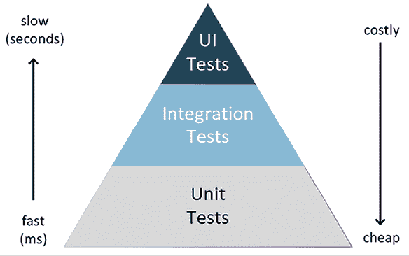

图 10.2：Mike Cohn 的测试金字塔

测试金字塔有效地总结了在考虑速度和成本的情况下，我们应该为我们的应用程序创建的每种类型的测试的相对数量。

根据单元测试的描述和预期，你现在可以开始理解为什么**Angular 单元测试实际上并不是真正的单元测试**。正如我在第一章“组件架构”部分中解释的，“Angular 的架构和概念”，一个 Angular 组件由一个组件类和一个模板组成。要真正测试一个组件，我们必须与 DOM 交互。这就是为什么 Angular 测试必须利用 `TestBed` 来执行。此外，依赖注入的配置和模拟可能会非常繁琐。最终，与真正的单元测试相比，`TestBed` 比较慢且脆弱。

考虑使用 Spectator 来简化你的 Angular 测试。Spectator 旨在帮助你摆脱所有样板式的繁琐工作，专注于可读性和流畅的单元测试。

更多信息请参阅 [`github.com/ngneat/spectator`](https://github.com/ngneat/spectator)。

独立组件配置起来要容易得多，因为它们定义了自己的依赖关系，我们不再需要向 `TestBed` 引入模块。

这对 Angular 意味着什么？在这个现实情况下，对组件进行单元测试是浪费时间。你应该将所有业务逻辑提取到服务和函数中，并彻底测试它们。希望 Angular 单元测试设置的将来更新能改变这种情况。

Cypress 组件测试是集成测试单个组件功能的好方法。按照下一节的说明设置 Cypress 以适应你的项目。

关于组件测试的更多信息请参阅 [`docs.cypress.io/guides/component-testing/angular/overview`](https://docs.cypress.io/guides/component-testing/angular/overview)。

从 Angular 17.1 开始，你可以用现代的**Web Test Runner**替换 Karma 测试运行器。你可以按照以下说明进行设置：

```js
$ npm i -D @web/test-runner 
```

使用以下命令更新 `angular.json`：

```js
"test": {
  "builder": "@angular-devkit/build-angular:web-test-runner"
} 
```

你可以阅读更多内容 [`modern-web.dev/docs/test-runner/overview`](https://modern-web.dev/docs/test-runner/overview)。

要测试 UI 和模板逻辑，Angular e2e 测试将提供最佳性价比，现在你可以将 Cypress 配置为应用程序的默认 e2e 提供者。

## Cypress 端到端测试

当单元测试专注于隔离 CUT 时，端到端测试则是关于集成测试。我强烈建议你通过执行以下命令将 Cypress 配置为你的端到端提供者：

```js
$ npx ng add @cypress/schematic 
```

你可以在[`www.npmjs.com/package/@cypress/schematic`](https://www.npmjs.com/package/@cypress/schematic)了解更多关于 Cypress 集成的信息。

Cypress 允许你轻松创建现代 Web 应用程序的测试，可视化调试它们，并在 CI 构建中自动运行它们。你可以在[`www.cypress.io/`](https://www.cypress.io/)了解更多关于 Cypress 的信息。

端到端测试允许你从用户在浏览器中与应用程序交互的角度编写**自动化验收测试**（**AAT**）。Cypress 测试易于创建和运行。通过在 HTML 组件上使用`data-testid`属性，你可以使它们更稳定。

你可以在`cypress`文件夹下找到**local-weather-app**和**lemon-mart**的示例 Cypress 测试。

你可以通过执行以下命令在开发中运行测试：

```js
$ npx ng e2e 
```

对于 CI，你可以使用以下命令：

```js
$ npx ng run local-weather-app:cypress-run
$ npx ng run lemon-mart:cypress-run 
```

在`local-weather-app`中，查看`cypress/e2e/app.cy.ts`文件：

```js
**cypress/e2e/app.****cy****.****ts**
import '../support/commands'
describe('LocalCast Weather', () => {
  beforeEach(() => {
    cy.visit('/')
  })
  it('has the correct title', () => {
    cy.byTestId('title').should('have.text', 'LocalCast Weather')
  })
}) 
```

在`cypress/support/commands.ts` `文件`中，我实现了一个名为`byTestId`的辅助函数，该函数可以找到具有给定名称的`data-testid`属性的 HTML 元素。在这种情况下，`cy.byTestId("title")`将找到以下元素：

```js
**src/app/app.****component****.****ts**
<span data-testid="title">LocalCast Weather</span> 
```

即使元素在页面上移动，测试也能正常工作。使用测试 ID 可以轻松方便地编写更可靠的测试。

构建健壮且可维护的端到端代码需要一些额外的概念，如页面对象。你可以在[`docs.cypress.io/guides/end-to-end-testing/protractor-to-cypress#Using-Page-Objects`](https://docs.cypress.io/guides/end-to-end-testing/protractor-to-cypress#Using-Page-Objects)和其他最佳实践[`docs.cypress.io/guides/references/best-practices`](https://docs.cypress.io/guides/references/best-practices)中了解更多关于页面对象的信息。

接下来，让我们设置 CI 以确保在将应用程序部署到生产之前，我们的测试总是运行。

# 持续集成

在将代码推送到生产之前，你应该启用 CI。这个简单的工具帮助我们确保在每次更改代码时执行自动化任务，包括测试执行，从而确保我们不将损坏的代码推送到生产。

## CircleCI

**CircleCI**使入门变得容易，提供免费层和针对初学者和专业人士的优秀文档。如果你有独特的企业需求，CircleCI 可以部署在企业内部，在防火墙后面，或在云中作为私有部署。

CircleCI 为免费设置提供了预配置的构建环境，但它也可以使用 Docker 容器运行构建，使其成为一个可以扩展到用户技能和需求解决方案：

1.  在[`circleci.com/`](https://circleci.com/)创建一个 CircleCI 账户。

1.  导航到**项目**以添加新项目。

1.  搜索`local-weather-app`并点击**设置项目**。

1.  按照屏幕提示创建一个示例 `.yml` 文件。Hello World 或 Node.js 都可以，但您最终会替换内容。

    本节使用 **local-weather-app** 仓库。本节的 `config.yml` 文件命名为 `.circleci/config.stage4.yml`。

1.  将以下 `.yml` 内容复制到文件中：

    ```js
    **.circleci/config.yml**
    version: 2.1
    orbs:
      browser-tools: circleci/browser-tools@1
      cypress: cypress-io/cypress@3
    commands:
      install:
        description: 'Install project dependencies'
        steps:
          - checkout
          - restore_cache:
              keys:
                - node_modules-{{ checksum "package-lock.json" }}
          - run: npm install
          - save_cache:
              key: node_modules-{{ checksum "package-lock.json" }}
              paths:
                - node_modules
      lint:
        description: 'Check for code style and linting errors'
        steps:
          - run: npm run style
          - run: npm run lint
      build_and_test:
        description: 'Builds and tests Angular project'
        steps:
          - run: npx ng build --configuration production
          - attach_workspace:
              at: ~/
          - browser-tools/install-chrome
          - browser-tools/install-chromedriver
          - run: npx ng test --watch=false --code-coverage
      store:
        description: 'Stores build_and_test artifacts'
        steps:
          - store_test_results:
              path: ./test_results
          - store_artifacts:
              path: ./coverage
    jobs:
      run_build_and_test:
        docker:
          - image: cimg/node:lts-browsers
        working_directory: ~/repo
        steps:
          - install
          - cypress/install
          - lint
          - build_and_test
          - run: npx ng run local-weather-app:cypress-run
          - store
    workflows:
      build-and-test:
        jobs:
          - run_build_and_test 
    ```

1.  选择**提交**和**运行**。

1.  CircleCI 应该在新的分支上运行。

如果一切顺利，您应该有一个通过，*绿色*的构建。如果不顺利，您将看到一个失败的，*红色*的构建。

当您有一个绿色构建时，您可以使用 CircleCI 来强制执行每次代码推送时自动管道的执行。GitHub 流程允许我们控制代码如何流入我们的仓库。

## GitHub 流

我们开发软件的主要原因是为了交付价值。在自动化我们交付软件的方式时，我们正在创建一个价值交付流。交付有缺陷的软件很容易；然而，为了可靠地交付价值，代码库的每个更改都应该通过一系列的检查和平衡。

使用控制门，我们可以强制执行标准，使我们的质量控制流程对每个团队成员都是可重复的，并且能够隔离更改。如果出现问题或工作不符合您的标准，您可以轻松地丢弃提议的更改并重新开始。

GitHub 流程是定义价值交付流和实施控制门的关键部分。正如 GitHub 所说，“*GitHub 流是一个轻量级、基于分支的工作流程，支持定期进行部署的团队和项目*。”

GitHub 流程包括六个步骤，如下所示，这是来自 GitHub 的以下图形：

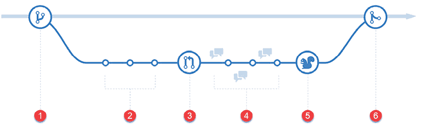

图 10.3：GitHub 流程图

1.  **分支** – 总是在新分支中添加用于修复错误或添加新功能的代码

1.  **提交** – 对您的分支进行多次提交

1.  **创建拉取请求** – 向团队成员发出工作准备就绪的信号，并在拉取请求中查看 CI 结果

1.  **讨论和审查** – 请求对您的代码更改进行审查，处理一般性或行级评论，并进行必要的修改

1.  **部署** – 可选地在测试服务器或预发布服务器上测试您的代码，并具有回滚到主分支的能力

1.  **合并** – 将您的更改应用到主分支

您可以使用 GitHub 流程来确保只有高质量的代码最终进入主分支。坚实的基础为其他团队成员在做出更改时提供了成功的基础。您必须限制对主分支的推送访问，以强制执行 GitHub 流程。

让我们为主分支启用分支保护：

1.  导航到您项目的 GitHub **设置**标签页。

1.  从左侧导航窗格中选择**分支**。

1.  如果主分支存在规则，请点击**编辑**或**添加规则**按钮。

1.  将分支名称模式输入为`main`。

1.  启用以下选项：

    1.  在合并前要求拉取请求。

    1.  至少需要一位同事的批准。

    1.  撤销过时的拉取请求批准。

    1.  在合并之前需要确保状态检查通过。

    1.  在合并之前需要确保分支是最新的。

    1.  需要线性历史记录。

1.  搜索`CircleCI`并选择必须成功的 CI 作业，在本例中为：`run_build_and_test`

1.  保存你的更改后，你应该能在**分支**页面上看到你的新规则，如下所示：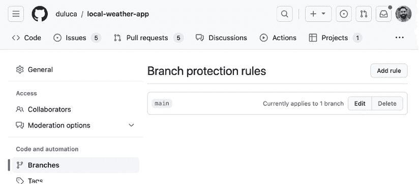

    图 10.4：GitHub 分支

你现在无法直接向主分支提交代码。要提交代码，你首先需要从主分支创建一个分支，将你的更改提交到新分支，并在准备好时使用新分支创建一个拉取请求。如果你不熟悉`git`命令，可以使用 GitHub Desktop 来帮助你进行这些操作。请参考 GitHub Desktop 中的便捷**分支**菜单：

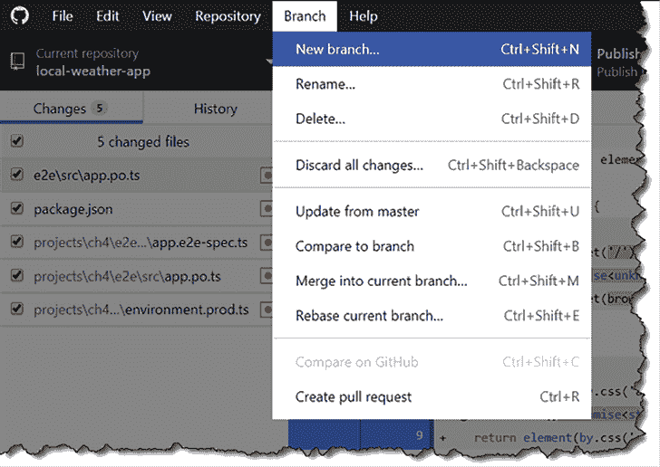

图 10.5：GitHub Desktop 分支菜单

创建拉取请求后，你现在可以观察针对你的分支运行的检查。现在我们已经配置了 CircleCI，如果一切顺利，你应该能够合并拉取请求，如下所示：

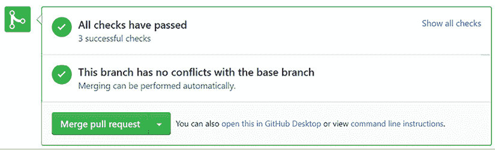

图 10.6：GitHub.com 状态检查通过

当检查失败时，你必须修复任何问题后才能合并新的代码。此外，如果你在处理你的分支时团队成员合并到了主分支，你可能会遇到合并冲突。在这种情况下，你可以使用 GitHub Desktop 的**从主分支更新**功能来更新你的分支，以赶上最新的主分支。

观察以下图像中失败的拉取请求的状态：

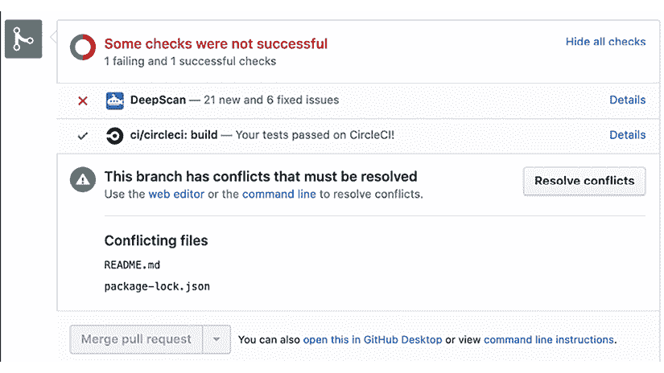

图 10.7：GitHub.com 状态检查失败

注意，我还有一个额外的检查，DeepScan，它会对我的代码库运行额外的测试。你可以在[`deepscan.io`](https://deepscan.io)上注册你的仓库。在章节的后面部分，我将演示如何使用 Coveralls 强制执行单元测试覆盖率。

更多信息，请参阅[`guides.github.com/introduction/flow`](https://guides.github.com/introduction/flow)。

现在我们已经确保了我们的自动化检查正在被强制执行，我们可以合理地确信我们不会推送一个损坏的应用到生产环境。接下来，让我们学习如何将我们的应用部署到云端。

# 部署到云端

如果从编码角度来看交付到生产环境有困难，那么从基础设施角度来看正确地完成它将非常复杂。在 Azure、AWS 和 Google Cloud 的完整版本中部署解决方案是复杂的。为了快速得到结果，我们可以利用可以在几分钟内为我们 Angular 应用的`dist`文件夹提供服务的云服务。

其中一项服务是 Vercel，另一项是 Firebase，可以利用`ng deploy`命令。

## Vercel

Vercel，[`vercel.com`](https://vercel.com)，是一个多云服务，它使您能够从 CLI 直接进行应用的实时全球部署。Vercel 与静态文件、Node.js、PHP、Go 应用以及您愿意为其编写自定义构建器的任何自定义软件栈协同工作，使其非常简单。Vercel 有一个免费层，您可以使用它快速部署 Angular 应用的`dist`文件夹。

将`vercel`包安装到您的项目中，并运行`login`命令：

```js
$ npm i -D vercel
$ npx vercel login 
```

按照屏幕上的提示完成登录过程。现在，让我们配置`publish`脚本。

## 部署静态文件

在您构建 Angular 项目后，构建输出将驻留在`dist`文件夹中。这个文件夹中的文件被认为是静态文件；Web 服务器需要做的只是将这些文件未修改地传递给客户端浏览器，然后浏览器动态执行您的代码。

这意味着任何 Web 服务器都可以提供您的 Angular 项目。然而，`vercel`使得这一过程变得极其简单且免费。

本节使用**local-weather-app**仓库。

让我们开始使用 Vercel 的静态文件托管能力部署您的 Angular 应用：

1.  在`package.json`中添加两个新的脚本，如下所示：

    ```js
    **package.json**
    ...
    "prevercel:publish": "npm run build:prod",
    "vercel:publish": 
      "vercel deploy --prod dist/local-weather-app --yes" 
    ```

1.  执行`npm run vercel:publish`。

1.  按照屏幕上的命令接受首次使用设置。

    在终端窗口中，观察 Angular 项目首先构建然后上传到`vercel`：

    ```js
    $ npm run vercel:publish 
    ...
    Build at: 2023-11-07T03:51:23.229Z - Hash: d6b1388088df7136 - Time: 5403ms
    ...
      Production: https://local-weather-hhk9xi3wz-duluca.vercel.app [1s] to clipboard] [4s] 
    ```

1.  按照屏幕上显示的 URL 查看，您的应用已成功部署。

完成了！恭喜，您的 Angular 应用已上线互联网！

## Firebase

Firebase，[`firebase.google.com/`](https://firebase.google.com/)，是一个帮助您构建和增长用户喜爱的应用和游戏的平台。它由谷歌支持，并被全球数百万家企业所信赖。

在第六章“实现基于角色的导航”的 Firebase 身份验证配方部分，您为 LemonMart 创建了一个 Firebase 应用，并使用**firebase deploy**部署了您的应用。我们将利用您创建的账户，使用新的`ng` `deploy`命令将 LemonMart 部署到 Firebase 托管。

## ng deploy

`ng` `deploy`是一个新的 CLI 命令，它帮助云服务提供与 Angular 的无缝集成，因此您可以轻松地将应用部署到云端。

现在，让我们使用`@angular/fire`配置 LemonMart 项目。

本节使用**lemon-mart**仓库。

执行以下命令，并确保选择`ng` `deploy` -- `hosting`：

```js
$ npx ng add @angular/fire
 ng deploy -- hosting 
```

这将在`angular.json`中创建一个`deploy`配置，并添加或更新现有的 Firebase 配置文件。

对于 LemonMart，我修改了`angular.json`，使其能够自动使用 Firebase 身份验证模式构建：

```js
**angular.json**
...
"deploy": {
  "builder": "@angular/fire:deploy",
  "options": {
    "version": 2,
    "browserTarget": "lemon-mart:build:firebase"
  }
} 
```

Firebase 配置定义在**配置**选项下，并使用`environment.firebase.ts`构建应用。

我还修改了 `firebase.json` 以部署 `dist/lemon-mart`，因为该存储库被配置为多项目 Angular 应用。然而，您不需要修改自动生成的文件。

执行以下命令进行部署：

```js
$ npx ng deploy
...
Build at: 2023-11-07T04:27:36.842Z - Hash: ad999f95a270f4e6 - Time: 14141ms
=== Deploying to 'lemon-mart-007'...
...
  Deploy complete!
Project Console: https://console.firebase.google.com/project/lemon-mart-007/overview
Hosting URL: https://lemon-mart-007.web.app 
```

按照屏幕上的 URL 查看，以确认您的应用已成功部署。

`ng` `deploy` 提供了比使用特定平台 CLI 命令更好的集成和更简单的选项。使用 CLI 命令很棒，但一条在某一台机器上工作的命令很容易在另一台机器上失败。IaC（基础设施即代码）是高性能企业团队能够快速交付高质量代码的唯一途径。然而，要达到这一点，我们首先需要了解 DevOps 是什么。

# DevOps

DevOps 是开发和运维的结合。对于开发来说，像 Git 这样的代码仓库跟踪每个代码更改是众所周知的事实。在运维方面，长期以来一直存在各种技术来跟踪环境的更改，包括脚本和各种旨在自动化操作系统和服务器预配的工具。

您有多少次听说过这样的话，“在我的机器上它运行正常”？开发者经常用这句话作为笑话。然而，软件在测试服务器上运行得很好，但由于配置的细微差异，最终在生产服务器上遇到问题的情形也屡见不鲜。

之前，我们讨论了 GitHub flow 如何使我们能够创建价值交付流。我们在做出更改之前总是从主分支创建分支，强制更改通过我们的 CI 管道，一旦我们合理确信代码可以工作，就将其合并回主分支。请参阅以下图表：

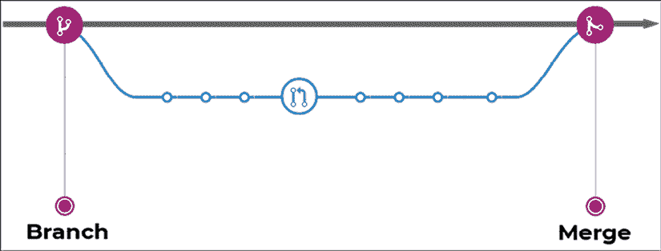

图 10.8：分支和合并

记住，您的主分支应该始终可部署，并且您应该经常将您的工作与主分支合并。

Docker 允许我们通过名为 Dockerfile 的特殊文件以声明式的方式定义我们的代码所依赖的软件和特定配置参数。同样，CircleCI 允许我们在 `config.yml` 文件中定义我们的 CI 环境配置。通过将配置存储在文件中，我们可以将文件与代码一起检查。我们可以使用 Git 跟踪更改，并强制它们通过我们的 CI 管道进行验证。

通过将我们的基础设施定义存储在代码中，我们实现了 IaC（基础设施即代码），我们还实现了可重复的集成，因此无论我们在什么环境中运行我们的基础设施，我们都应该能够通过一条命令启动我们的全栈应用。

您可能还记得，在 *第一章*，*Angular 的架构和概念* 中，我们介绍了 TypeScript 如何覆盖 JavaScript 功能差距。像 TypeScript 一样，Docker 覆盖了配置差距，如下面的图表所示：

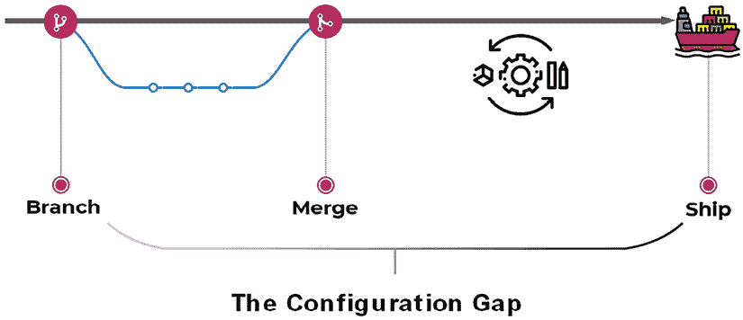

图 10.9：覆盖配置差距

通过使用 Docker，我们可以合理地确信，在测试期间在我们机器上工作的代码，在发布时将以相同的方式工作。

总结来说，DevOps 将运维与开发更紧密地结合在一起，在这里进行更改和解决问题成本更低。因此，DevOps 主要是开发者的责任，但也是一种思维方式，运维团队必须愿意支持。让我们更深入地了解 Docker。

# 使用 Docker 容器化 Web 应用

Docker，可在[`docker.io`](https://docker.io)找到，是一个用于开发、发布和运行应用程序的开源平台。Docker 结合了一个轻量级的容器虚拟化平台以及帮助管理和部署应用程序的工作流程和工具。**虚拟机**（**VMs**）和 Docker 容器之间最明显的区别是，VMs 通常大小为数十个吉字节，需要数吉字节内存，而容器在磁盘和内存大小需求方面仅占用兆字节。此外，Docker 平台抽象化了主机**操作系统**（**OS**）级别的配置设置，因此成功运行应用程序所需的所有配置都编码在人类可读的格式中。

## Dockerfile 的解剖结构

Dockerfile 由四个主要部分组成：

+   **FROM** – 这里我们可以从 Docker 的最小“scratch”镜像或现有的镜像中继承

+   **SETUP** – 这里我们根据需求配置软件依赖项

+   **COPY** – 这里我们将构建好的代码复制到操作环境中

+   **CMD** – 这里我们指定启动操作环境的命令

引导（Bootstrap）指的是一组初始指令，描述了程序如何加载或启动。

考虑以下 Dockerfile 解剖结构的可视化：

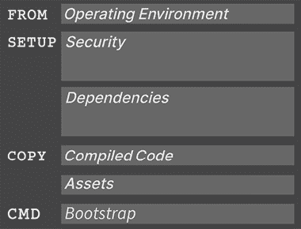

图 10.10：Dockerfile 的解剖结构

以下代码展示了 Dockerfile 的具体表示：

```js
**Dockerfile**
FROM duluca/minimal-nginx-web-server:1-alpine
COPY /dist/local-weather-app /var/www
CMD 'nginx' 
```

你可以将脚本中的`FROM`、`COPY`和`CMD`部分映射到可视化中。我们使用`FROM`命令从`duluca/minimal-nginx-web-server`镜像中继承。然后，我们使用`COPY`（或者，也可以使用`ADD`）命令将我们的应用编译结果从我们的开发机器或构建环境复制到镜像中。最后，我们指示容器使用`CMD`（或者，也可以使用`ENTRYPOINT`）命令执行 nginx web 服务器。

注意，前面的`Dockerfile`没有独立的`SETUP`部分。`SETUP`不映射到实际的`Dockerfile`命令，但代表了一组你可以执行的命令来设置你的容器。在这种情况下，所有必要的设置都由基础镜像完成，因此没有额外的命令要运行。

常见的 `Dockerfile` 命令有 `FROM`, `COPY`, `ADD`, `RUN`, `CMD`, `ENTRYPOINT`, `ENV`, 和 `EXPOSE`。关于完整的 `Dockerfile` 参考，请参阅 [`docs.docker.com/engine/reference/builder/`](https://docs.docker.com/engine/reference/builder/)。

`Dockerfile` 描述了一个新的容器，它从名为 `duluca/minimal-nginx-web-server` 的容器继承。这是一个我在 Docker Hub 上发布的容器，它从 `nginx:alpine` 镜像继承，而 `nginx:alpine` 镜像本身又从 `alpine` 镜像继承。`alpine` 镜像是一个最小化的 Linux 操作环境，大小仅为 5 MB。`alpine` 镜像本身又从 `scratch` 镜像继承，而 `scratch` 镜像是一个空镜像。以下图表展示了继承层次结构：

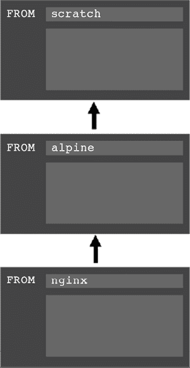

图 10.11：Docker 继承

`Dockerfile` 然后将开发环境中的 `dist` 文件夹内容复制到容器的 `www` 文件夹中，如下所示：

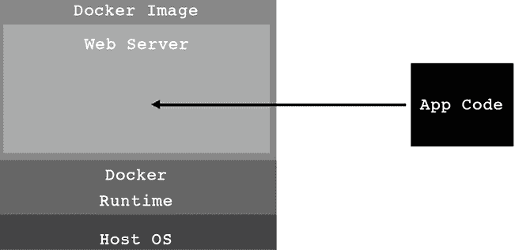

图 10.12：将代码复制到容器化的 Web 服务器

在这种情况下，父镜像配置了一个 `nginx` 服务器作为 Web 服务器来服务 `www` 文件夹内的内容。到这一点，我们的源代码可以从互联网上访问，但生活在安全环境的多层中。即使我们的应用程序存在某种漏洞，攻击者也很难伤害我们正在运行的系统。以下图表展示了 Docker 提供的安全层：

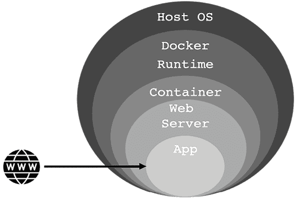

图 10.13：Docker 安全

总结来说，在基础层，我们的宿主操作系统，例如 Windows 或 macOS，运行 Docker 运行时，这将在下一节中安装。Docker 运行时可以运行自包含的 Docker 镜像，这些镜像由上述 Dockerfile 定义。`duluca/minimal-nginx-web-server`基于轻量级的 Linux 操作系统 Alpine。Alpine 是 Linux 的一个完全精简的版本，不包含任何 GUI、驱动程序，甚至大多数您可能从 Linux 系统中期望的 CLI 工具。因此，该操作系统的大小仅为约 5 MB。然后，我们从`nginx`镜像继承，该镜像安装了网络服务器，其自身大小约为几 MB。最后，我们的自定义`nginx`配置覆盖了默认镜像，结果生成一个微小的约 7 MB 镜像。`nginx`服务器被配置为服务`/var/www`文件夹的内容。在`Dockerfile`中，我们仅复制我们开发环境中`/dist`文件夹的内容，并将其放置到`/var/www`文件夹中。我们稍后将构建并执行此镜像，该镜像将运行包含我们`dist`文件夹输出的`nginx`网络服务器。我已经发布了一个类似的镜像，名为`duluca/minimal-node-web-server`，其大小约为 15 MB。

`duluca/minimal-node-web-server`可以更直接地使用，尤其是如果您不熟悉`nginx`。它依赖于一个`Express.js`服务器来服务静态内容。大多数云提供商都提供了使用 Node 和 Express 的具体示例，这可以帮助您缩小任何错误的范围。此外，`duluca/minimal-node-web-server`内置了 HTTPS 重定向支持。您可能会花费大量时间尝试设置一个`nginx`代理来完成相同的事情，而您只需在您的`Dockerfile`中设置`ENFORCE_HTTPS`环境变量即可。请参阅以下示例 Dockerfile：

```js
**Dockerfile**
FROM duluca/minimal-node-web-server:lts-alpine
WORKDIR /usr/src/app
COPY dist/local-weather-app public
ENTRYPOINT [ "npm", "start" ]
ENV ENFORCE_HTTPS=xProto 
```

您可以在`https://github.com/duluca/minimal-node-web-server`了解更多关于`minimal-node-web-server`提供的选项。

正如我们现在所看到的，Docker 的美丽之处在于您可以直接导航到[`hub.docker.com`](https://hub.docker.com)，搜索`duluca/minimal-nginx-web-server`或`duluca/minimal-node-web-server`，阅读其`Dockerfile`，并追溯其起源，直至原始的基础镜像，这是网络服务器的基础。我鼓励您以这种方式检查您使用的每个 Docker 镜像，以了解它究竟为您带来了哪些需求。

您可能会觉得它过于强大，或者它具有您从未知晓的功能，这些功能可以使您的生活变得更加轻松。

注意，父镜像应该拉取 `duluca/minimal-nginx-web-server` 的特定标签，即 `1-alpine`。同样，`duluca/minimal-node-web-server` 从 `lts-alpine` 拉取。这些常绿基础包始终包含 `nginx` 的最新版本 1 和 Alpine 或 Node 的 LTS 版本。在 Docker Hub 上，我设置了管道，当发布新的基础镜像时自动更新这两个镜像。因此，每次您拉取这些镜像时，您都会获得最新的错误修复和安全补丁。

拥有一个常绿依赖树可以减轻您作为开发者的负担，不必寻找 Docker 镜像的最新版本。或者，如果您指定了版本号，您的镜像将不会受到任何潜在的重大更改的影响。然而，记住在新的构建后测试您的镜像比永远不更新镜像、可能部署受损害的软件要好。毕竟，网络是不断变化的，不会因为您更新镜像而放慢速度。

就像 npm 包一样，Docker 可以带来极大的便利和价值，但您必须注意了解您正在使用的工具。

## 安装 Docker

要能够构建和运行容器，您必须首先在您的计算机上安装 Docker 执行环境。您可以在 [`www.docker.com/products/docker-desktop/`](https://www.docker.com/products/docker-desktop/) 下载 Docker Desktop。按照屏幕上的说明完成安装。

## 设置 npm 脚本 for Docker

现在，让我们为您的 Angular 应用程序配置一些 Docker 脚本，您可以使用这些脚本来自动化容器的构建、测试和发布。我开发了一套名为 **npm 脚本 for Docker** 的脚本，这些脚本在 Windows 10 和 macOS 上运行。您可以通过执行以下命令获取这些脚本的最新版本，并在您的项目中自动配置它们。

现在在 **local-weather-app** 和 **lemon-mart** 两个项目中运行以下命令！

安装 npm 脚本 for Docker 任务：

```js
$ npx mrm npm-docker 
```

执行 `mrm` 脚本后，我们就准备好使用本地天气应用程序作为示例，深入挖掘配置设置。

## 构建 Docker Hub 上的镜像并发布

接下来，让我们确保您的项目配置正确，这样我们就可以将其容器化，构建可执行镜像，并将其发布到 Docker Hub，这样我们就可以在任何构建环境中访问它。

本节使用 **local-weather-app** 仓库。

您需要采取以下步骤：

1.  在 [`hub.docker.com/`](https://hub.docker.com/) 上注册 Docker Hub 账户。

1.  为您的应用程序创建一个公共（免费）仓库。

1.  在 `package.json` 中，添加或更新 `config` 属性，使用以下配置属性：

    ```js
    **package.json**
      ...
      "config": {
        "imageRepo": "[namespace]/[repository]",
        "imageName": "custom_app_name",
        "imagePort": "0000",
        "internalContainerPort": "3000"
      },
      ... 
    ```

    `namespace` 将是你的 Docker Hub 用户名。你将在创建时定义你的仓库名称。一个示例的 `repository` 变量应类似于 `duluca/localcast-weather`。镜像名称用于在使用 Docker 命令（如 `docker ps`）时方便识别你的容器。我将我的命名为 `localcast-weather`。`imagePort` 属性将定义用于从容器内部暴露应用程序的端口。由于我们使用端口 `4200` 进行开发，请选择不同的端口，例如 `8080`。`internalContainerPort` 定义了你的 Web 服务器映射到的端口。这通常对于 Node 服务器是端口 `3000`，对于 `nginx` 服务器是端口 `80`。请参考你使用的基容器的文档。

1.  让我们回顾一下之前由 `mrm` 任务添加到 `package.json` 中的 Docker 脚本。以下部分展示了添加的脚本的注释版本，解释了每个条目。

    注意，使用 `npm` 脚本时，`pre` 和 `post` 关键字用于在执行给定脚本之前或之后执行辅助脚本。脚本被有意地分成更小的部分，以便更容易阅读和维护。

    +   `build` 脚本如下：

        ```js
        **package.json**
        ...
          "scripts": {
            ...
            "predocker:build": "npm run build",
            "docker:build": "cross-conf-env docker image build --platform linux/amd64,linux/arm64 . -t $npm_package_config_imageRepo:$npm_package_version",
            "postdocker:build": "npm run docker:tag",
            ... 
        ```

    注意，以下 `cross-conf-env` 命令确保脚本在 macOS、Linux 和 Windows 环境中都能同样良好地执行。

    +   `npm run docker:build` 将在 `pre` 脚本中构建你的 Angular 应用程序，然后使用 `docker image build` 命令构建 Docker 镜像，并在 `post` 脚本中使用版本号标记镜像。

    在我的项目中，`pre` 命令以 `prod` 模式构建我的 Angular 应用程序，并运行测试以确保我有一个优化后的构建，没有失败的测试。

    我的 `pre` 命令如下：

    ```js
    "predocker:build": "npm run build:prod && npm test -- --watch=false" 
    ```

    +   `tag` 脚本如下：

        ```js
        **package.json**
            ...
            "docker:tag": " cross-conf-env docker image tag $npm_package_config_imageRepo:$npm_package_version $npm_package_config_imageRepo:latest",
            ... 
        ```

    +   `npm run docker:tag` 将使用 `package.json` 中的 `version` 属性和最新标签标记已构建的 Docker 镜像。

    +   `stop` 脚本如下：

        ```js
        **package.json**
            ...
            "docker:stop": "cross-conf-env docker stop $npm_package_config_imageName || true",
            ... 
        ```

    +   `npm run docker:stop` 如果镜像当前正在运行，则会停止它，这样 `run` 脚本就可以无错误地执行。

    +   `run` 脚本如下：

        ```js
        **package.json**
            ...
            "docker:run": "run-s -c docker:stop docker:runHelper",
            "docker:runHelper": "cross-conf-env docker run -e NODE_ENV=local --rm --name $npm_package_config_imageName -d -p $npm_package_config_imagePort:$npm_package_config_internalContainerPort $npm_package_config_imageRepo",
            ... 
        ```

    注意，`run-s` 和 `run-p` 命令是 `npm-run-all` 包的一部分，用于同步或并行化 npm 脚本的执行。

    +   `npm run docker:run` 如果镜像已经在运行，则会停止它，然后使用 `docker run` 命令运行新构建的镜像版本。请注意，`imagePort` 属性用作 Docker 镜像的外部端口，它映射到 Node.js 服务器监听的内部端口 `3000`。

    +   `publish` 脚本如下：

        ```js
        **package.json**
            ...
            "predocker:publish": "echo Attention! Ensure `docker login` is correct.",
            "docker:publish": "cross-conf-env docker image push $npm_package_config_imageRepo:$npm_package_version",
            "postdocker:publish": "cross-conf-env docker image push $npm_package_config_imageRepo:latest",
            ... 
        ```

    注意，`docker:tag` 在容器上添加了最新版本标签。当我们推送最新标签时，两个标签会同时推送。

    +   `npm run docker:publish` 将使用 `docker image push` 命令将构建的镜像发布到配置的仓库，在这种情况下是 Docker Hub。

    +   首先，发布带有版本号的镜像，然后在 `post` 中标记一个 `latest`。`taillogs` 脚本如下：

        ```js
        **package.json**
            ...
            "docker:taillogs": "cross-conf-env docker logs -f $npm_package_config_imageName",
            ... 
        ```

    +   `npm run docker:taillogs` 将使用 `docker log -f` 命令显示正在运行的 Docker 实例的内部控制台日志，这是一个用于调试您的 Docker 实例的有用工具。

    +   `open` 脚本如下：

        ```js
        **package.json**
            ...
            "docker:open": "sleep 2 && cross-conf-env open-cli http://localhost:$npm_package_config_imagePort",
            ... 
        ```

    +   `npm run docker:open` 将等待 2 秒，以考虑延迟，然后使用 `imagePort` 属性启动浏览器，并使用正确的 URL 打开您的应用程序。

    +   `debug` 脚本如下：

        ```js
        **package.json**
            ...
            "predocker:debug": "run-s docker:build docker:run",
            "docker:debug": "run-s -cs docker:open:win docker:open:mac docker:taillogs"
          },
        ... 
        ```

    +   `npm run docker:debug` 将构建您的镜像并在 `pre` 中运行其实例，打开浏览器，然后开始显示容器的内部日志。

1.  自定义预构建脚本以在生产模式下构建您的 Angular 应用程序，并在构建镜像之前执行单元测试：

    ```js
    **package.json**
        "build": "ng build",
        "build:prod": "ng build --prod",
        "predocker:build": "npm run build:prod && npm test -- --watch=false", 
    ```

    注意，`ng build` 使用了 `--prod` 参数，这实现了两个目的：通过**即时编译**（**AOT**）优化应用程序的大小，使其显著减小，从而提高运行时性能，并使用 `src/environments/environment.prod.ts` 中定义的配置项。

1.  更新 `src/environments/environment.prod.ts` 以便看起来您正在使用自己的 `appId` 从 `OpenWeather`：

    ```js
    export const environment = {   
      production: true,
      appId: '01ff1xxxxxxxxxxxxxxxxxxxxx',
      username: 'localcast',
      baseUrl: 'https://',
      geonamesApi: 'secure',
    } 
    ```

    我们正在修改 `npm test` 的执行方式，因此测试只会运行一次，并且工具会停止执行。提供 `--watch=false` 选项来实现此行为，而不是开发友好的默认连续执行行为。

1.  在项目根目录下创建一个名为 `Dockerfile` 的无扩展名的新文件。

1.  实现或替换 `Dockerfile` 的内容，如下所示：

    ```js
    **Dockerfile**
    FROM duluca/minimal-node-web-server:lts-alpine 
    WORKDIR /usr/src/app
    COPY dist/local-weather-app public 
    ```

    请务必检查您的 `dist` 文件夹的内容，以确保您正在复制正确的文件夹，该文件夹在其根目录中包含 `index.html` 文件。

1.  执行 `npm run predocker:build` 并在终端中查看它是否无错误运行，以确保您的应用程序更改已成功。

1.  执行 `npm run docker:build` 并在终端中查看它是否无错误运行，以确保您的镜像构建成功。

    +   虽然您可以单独运行提供的任何脚本，但您实际上只需要记住其中的两个脚本即可：

    +   `npm run docker:debug` 将测试、构建、标记、运行、跟踪并在新的浏览器窗口中启动您的容器化应用程序进行测试。

    +   `npm run docker:publish` 将您刚刚构建和测试的镜像发布到在线 Docker 仓库。

1.  在您的终端中执行 `docker:debug`：

    ```js
    $ npm run docker:debug 
    ```

    +   成功的 `docker:debug` 运行应该导致一个新的聚焦浏览器窗口打开，其中包含您的应用程序和终端中正在跟踪的服务器日志，如下所示：

        ```js
        Current Environment: local.
        Server listening on port 3000 inside the container
        Attention: To access server, use http://localhost:EXTERNAL_PORT
        EXTERNAL_PORT is specified with 'docker run -p EXTERNAL_PORT:3000'. See 'package.json->imagePort' for the default port.      
        GET / 304 2.194 ms - -
        GET /runtime-es2015.js 304 0.371 ms - -
        GET /polyfills-es2015.js 304 0.359 ms - -
        GET /styles-es2015.js 304 0.839 ms - -
        GET /vendor-es2015.js 304 0.789 ms - -
        GET /main-es2015.js 304 0.331 ms - - 
        ```

    您应该始终运行 `docker ps` 来检查您的镜像是否正在运行，它上次更新是什么时候，以及它是否与任何声称相同端口的现有镜像冲突。

1.  在您的终端中执行 `docker:publish`：

    ```js
    $ npm run docker:publish 
    ```

    +   您应该在终端窗口中观察到如下成功的运行：

        ```js
        The push refers to a repository [docker.io/duluca/localcast- weather]
        60f66aaaaa50: Pushed
        ...
        latest: digest: sha256:b680970d76769cf12cc48f37391d8a542fe226b66d9a6f8a7ac81ad77be4 f58b size: 2827 
        ```

随着时间的推移，您的本地 Docker 缓存可能会显著增长；例如，在我的笔记本电脑上，两年内已达到大约 40 GB。您可以使用`docker image prune`和`docker container prune`命令来减小缓存大小。有关更详细的信息，请参阅[`docs.docker.com/config/pruning`](https://docs.docker.com/config/pruning)中的文档。

通过定义`Dockerfile`并编写使用它的脚本，我们在代码库中创建了活生生的文档。我们实现了 DevOps 并关闭了配置差距。

确保像处理**local-weather-app**一样将**lemon-mart**容器化，并通过执行`npm run docker:debug`来验证您的工作。

VS Code 提供了一种视觉方式来与 npm 脚本交互。让我们接下来看看 VS Code 的 npm 脚本支持。

## VS Code 中的 npm 脚本

VS Code 默认提供对 npm 脚本的支持。要启用 npm 脚本探索器，请打开 VS Code 设置并确保存在`"npm.enableScriptExplorer": true`属性。一旦这样做，您将在**资源管理器**窗格中看到一个可展开的标题**NPM 脚本**，如下面的截图所示，用箭头突出显示：

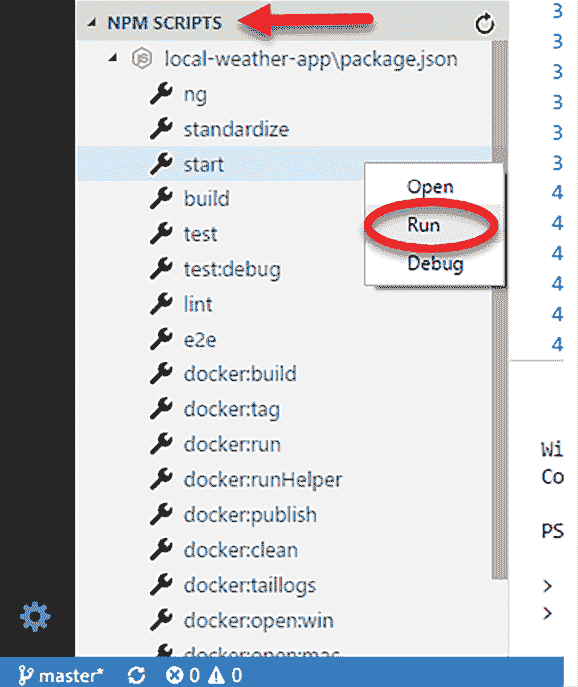

图 10.14：VS Code 中的 NPM 脚本

您可以点击任何脚本以启动`package.json`中包含该脚本的行，或者右键单击并选择**运行**来执行该脚本。

让我们看看与 Docker 交互的更简单的方法。

## VS Code 中的 Docker 扩展

与 Docker 镜像和容器交互的另一种方式是通过 VS Code。如果您已按照*第二章*中建议的，安装了来自 Microsoft 的`ms-azuretools.vscode-docker` Docker 扩展，您可以通过 VS Code 左侧导航菜单中的 Docker 标志来识别该扩展，如下面的截图所示，用白色圆圈标出：

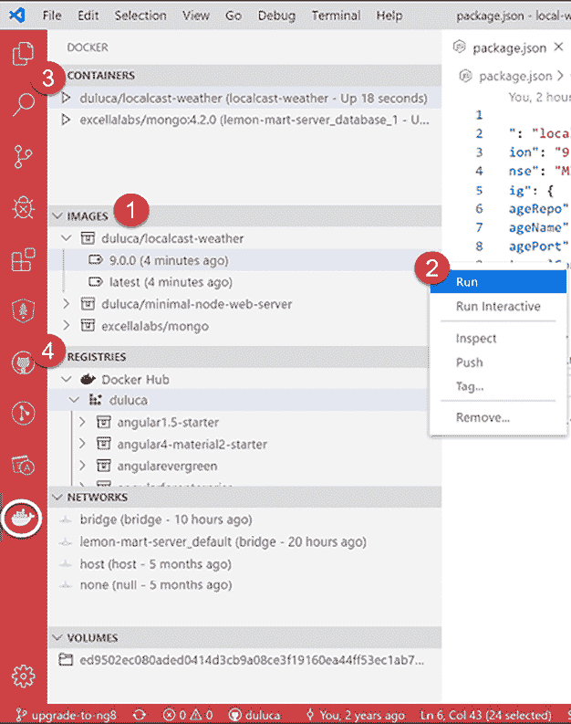

图 10.15：VS Code 中的 Docker 扩展

让我们浏览一下扩展提供的一些功能。请参考前面的截图和以下列表中的编号步骤，以获得快速说明：

1.  **镜像**包含您系统上所有容器快照的列表。

1.  右键单击 Docker 镜像将创建一个上下文菜单，以运行各种操作，如**运行**、**推送**和**标记**。

1.  **容器**列出了您系统上所有可执行的 Docker 容器，您可以启动、停止或附加到它们。

1.  **注册表**显示您配置的连接到的注册表，例如 Docker Hub 或**AWS Elastic Container Registry**（**AWS ECR**）。

虽然该扩展使与 Docker 的交互变得更容易，但**Docker 的 npm 脚本**（您使用`mrm`任务配置的）自动化了许多与构建、标记和测试镜像相关的任务。它们都是跨平台的，在 CI 环境中也能同样良好地工作。

`npm run docker:debug` 脚本自动化了许多任务，以验证您有一个良好的镜像构建！

现在让我们学习如何将我们的容器部署到云中，并最终实现持续交付（CD）。

# 云中的容器工作

使用 Docker 的一个优点是我们可以在任何数量的操作系统环境中部署它，从个人电脑到服务器和云服务提供商。无论如何，我们期望我们的容器在所有环境中都能正常工作。

在本章的早期，我提到与像 Azure、AWS 和 Google Cloud 这样的全面云服务提供商合作是复杂的。为了在云中部署您的容器，您可能需要使用这些提供商之一。不时地，会出现提供简单无缝容器托管的提供商，但多年来，这些选项已经消失了。

云服务提供了从托管到非托管解决方案的广泛方法来运行容器。托管和非托管之间的关键区别在于用户和云服务提供商之间共享的控制和责任水平。这被称为共享责任模型。在托管配置中，您将更多的基础设施控制和责任让给云服务提供商。这随之带来了更高的安全性和通常更便宜的云账单。

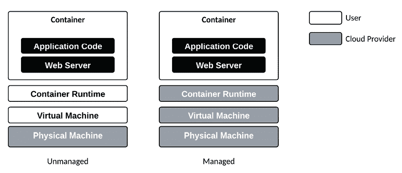

图 10.16：共享责任模型

上面的图示展示了在云中运行容器的共享责任模型。在非托管模式下，云服务提供商为您提供了访问虚拟机的权限。云服务提供商管理和维护物理机器，对用户完全抽象。现在，您需要配置**操作系统**（**OS**）并确保其安全。在操作系统之上，您可以设置容器运行时或涉及多个虚拟机的集群。

阅读关于 ECS Fargate 威胁模型的黄开智的优秀文章，链接为[`sysdig.com/blog/ecs-fargate-threat-modeling`](https://sysdig.com/blog/ecs-fargate-threat-modeling)。

容器集群是一组用于运行容器化工作负载的主机。像 Kubernetes 这样的容器编排软件自动化并管理集群基础设施中的容器。这允许您根据负载变化扩展容器实例。集群还提供了丰富的功能，如服务发现。您可以在[`kubernetes.io`](https://kubernetes.io)了解更多关于 Kubernetes 的信息。

在托管模式下，云服务提供商为您提供了具有类似集群功能的容器运行时环境，包括对 Kubernetes 的支持。云服务提供商确保运行时安全，用户只需负责容器。这些服务提供的是**无服务器**的。在这个领域，每个云服务提供商都提供各种服务，这些服务在功能上存在显著差异。

这里有一些流行的选项列表：

+   **AWS Fargate**是一个无服务器计算引擎，可以在不管理服务器或集群的情况下运行容器。与**弹性容器服务**（**ECS**）和**弹性 Kubernetes 服务**（**EKS**）集成。

+   **Google Cloud Run**是一个完全管理的无服务器平台，用于无状态容器化应用程序。自动扩展并按请求计费。

+   **Azure 容器实例**可以在不采用高级编排服务的情况下运行单个容器。按秒计费。

+   **Amazon ECS**提供在弹性计算云（**EC2**）实例集群上高度可扩展的 Docker 容器管理。与其他 AWS 服务紧密集成。AWS EKS 是 AWS ECS 的 Kubernetes 版本。

+   **Google Kubernetes Engine**（**GKE**）是运行在 Google Cloud 上的托管 Kubernetes 环境。利用原生 Google Cloud 集成轻松部署容器。

+   **Azure Kubernetes Service**（**AKS**）是托管在 Azure 上的完全管理的 Kubernetes 集群服务。具有自动扩展功能的容器化部署简化流程。

无服务器选项（AWS Fargate、Google Cloud Run、Azure 容器实例）的主要优势是它们完全托管、自动扩展，并且具有按使用付费的定价模式。然而，与预配置的 Kubernetes 相比，它们的定制性有限。预配置的 Kubernetes 选项（Amazon ECS、Google GKE、Azure AKS）提供更多控制、定制以及运行有状态应用程序的能力。然而，它们需要手动扩展和管理基础设施。

总体而言，无服务器选项更容易使用但灵活性较低，而预配置的 Kubernetes 提供更多定制，但需要 DevOps 知识来管理基础设施。您的选择取决于工作负载是否适合无服务器约束以及您更倾向于多少控制与多少简单。

到目前为止，您已经将代码部署到云端，掌握了与 Docker 容器一起工作的基础知识，并了解了在云端部署容器的细微差别。**持续部署**（**CD**）是我座右铭的体现：“发布它，否则它从未发生”。接下来，我们将介绍如何将部署集成到您的 CI 管道中，以实现 CD。

`npm run docker:debug`脚本自动化了许多任务，以验证您是否有一个良好的镜像构建！

# 持续部署

CD 是这样一个理念：成功通过您的管道的代码更改可以自动部署到目标环境。尽管存在持续部署到生产环境的例子，但大多数企业更喜欢将目标环境定位在开发环境中。采用门控方法将更改通过开发环境的各个阶段，包括测试、预发布，最终到生产。CircleCI 可以通过审批工作流程促进门控部署，这在本节后面将进行介绍。

在 CircleCI 中，您需要实现一个部署作业来部署您的镜像。您可以在该作业中部署到许多目标，例如 Google Cloud Run、Docker Hub、Heroku、Azure 或 AWS ECS。与这些目标的集成将涉及多个步骤。从高层次来看，这些步骤如下：

1.  为您的目标环境配置一个 orb，它提供了部署您的软件所需的 CLI 工具。

1.  将针对目标环境的登录凭证或访问密钥作为 CircleCI 环境变量存储。

1.  如果不使用特定平台的`build`命令，则在 CI 管道中构建容器。然后使用`docker push`将生成的 Docker 镜像提交到目标平台的注册表。

1.  执行特定平台的`deploy`命令，指示目标运行刚刚推送的 Docker 镜像。

通过使用基于 Docker 的工作流程，我们在系统和目标环境方面实现了极大的灵活性。以下图表通过突出我们可用的可能选择排列来阐述这一点：

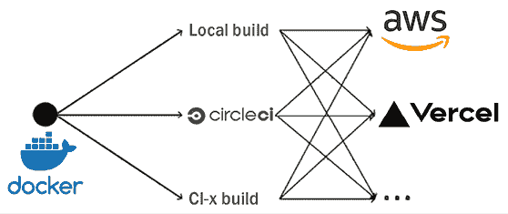

图 10.17：n-to-n 部署

如您所见，在容器化的世界中，可能性是无限的。我们将使用本章后面添加的与部署相关的 npm 脚本来在我们的 CI 管道中实现部署作业。

在基于 Docker 的工作流程之外，您可以使用专门设计的 CLI 工具快速部署您的应用程序。接下来，让我们看看如何使用 CircleCI 将应用程序部署到 Vercel。

## 使用 CircleCI 将应用程序部署到 Vercel

之前，我们配置了 LocalCast Weather 应用程序使用 CircleCI 进行构建。我们可以增强我们的 CI 管道，以使用构建输出，并可选择将其部署到 Vercel。

本节使用**local-weather-app**仓库。本节的`config.yml`文件名为`.circleci/config.stage9.yml`。

让我们更新`config.yml`文件，添加一个名为`deploy`的新作业。在即将到来的*工作流程*部分，我们将使用此作业在批准时部署管道：

1.  从您的 Vercel 账户创建一个令牌。

1.  在您的 CircleCI 项目中添加一个名为`VERCEL_TOKEN`的环境变量，并将您的 Vercel 令牌作为值存储。

1.  在`config.yml`中，更新`build`作业以包含新步骤，并添加一个名为`deploy`的新作业：

    ```js
    **.circleci/config.yml**
    ...
    jobs:
      build_and_test:
        ...       
        - run:
            name: Move compiled app to workspace
            command: |
              set -exu
              mkdir -p /tmp/workspace/dist
              mv dist/local-weather-app /tmp/workspace/dist/
        - persist_to_workspace:
            root: /tmp/workspace
            paths:
              - dist/local-weather-app
      deploy:
        docker:
          - image: circleci/node:lts
        working_directory: ~/repo
        steps:
          - attach_workspace:
              at: /tmp/workspace
          - run: npx vercel deploy --token $VERCEL_TOKEN --prod /tmp/
                 workspace/dist/<< parameters.project >> --yes 
    ```

    在`build`作业中，构建完成后，我们添加两个新步骤。首先，我们将`dist`文件夹中的编译应用程序移动到工作区，并持久化该工作区，以便我们可以在另一个作业中使用它。在名为`deploy`的新作业中，我们附加工作区并使用`npx`运行`vercel`命令来部署`dist`文件夹。这是一个简单的过程。

    注意，`$VERCEL_TOKEN`是我们存储在 CircleCI 项目中的环境变量。

1.  实现一个简单的 CircleCI 工作流程，以持续部署`build`作业的结果：

    ```js
    **.circleci/config.yml**
    ...
    workflows:
      version: 2
      build-test-and-deploy:
        jobs:
          - build_and_test
          - deploy:
             requires:
               - build_and_test 
    ```

    注意，`deploy`作业在执行之前会等待`build`作业完成。

1.  通过检查测试结果来确保您的 CI 管道成功执行：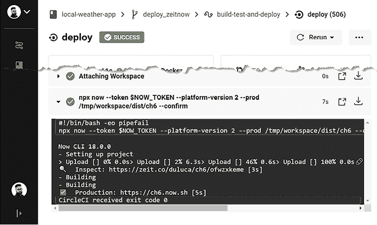

    图 10.18：本地天气应用的 Vercel 成功部署

大多数云服务提供商的 CLI 命令需要在您的管道中安装才能使用。由于 Vercel 有一个 npm 包，这很容易做到。AWS、Google Cloud 或 Microsoft Azure 的 CLI 工具需要使用`brew`或`choco`等工具安装。CircleCI 提供 orbs，这些是可重用的代码片段，有助于自动化重复过程，加快项目设置，并便于与第三方工具集成。

您可以在[`circleci.com/orbs`](https://circleci.com/orbs)上了解更多关于 orbs 的信息。

查看 Orb 注册表以获取有关如何使用这些 orbs 的更多信息[`circleci.com/orbs/registry`](https://circleci.com/orbs/registry)。

CD 命令在开发和测试环境中效果很好。然而，通常希望有门控部署，即部署在到达生产环境之前必须有人批准。接下来，让我们看看如何使用 CircleCI 来实现这一点。

## 门控 CI 工作流程

在 CircleCI 中，您可以定义一个工作流程来控制作业的执行方式和时间。考虑以下配置，给定作业`build`和`deploy`：

```js
**.circleci/config.yml**
workflows:
  version: 2
  build-and-deploy:
    jobs:
      - build
      - hold:
          type: approval
          requires:
            - build
      - deploy:
          requires:
            - hold 
```

首先，执行`build`作业。然后，我们引入一个名为`hold`的特殊作业，其类型为`approval`，它要求`build`作业成功完成。一旦这样，管道就会被挂起。如果或当决策者批准`hold`，则`deploy`步骤可以执行。参考以下屏幕截图以查看**hold**的外观：

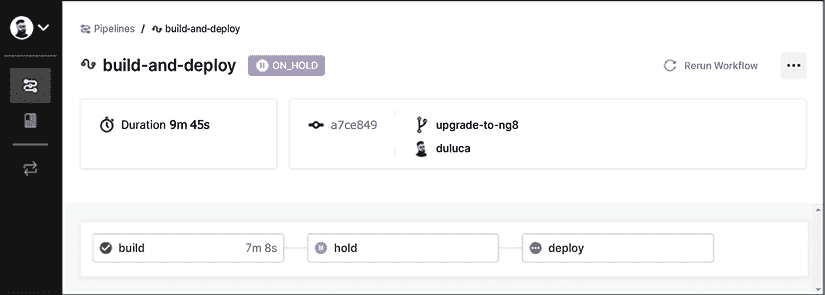

图 10.19：管道中的中断

```js
build and test steps are broken out into two separate jobs:
```

```js
workflows:
  version: 2
    build-test-and-approval-deploy:
      jobs:
      - build 
      - test
      - hold:
         type: approval
         requires:
           - build
           - test
         filters:
           branches:
             only: main
      - deploy:
        requires:
          - hold 
```

在这种情况下，`build`和`test`作业是并行执行的。如果我们在一个分支上，管道就会在这里停止。一旦分支与`main`合并，管道就会被挂起，决策者有选择部署构建或不部署的选项。这种类型的分支过滤确保只有合并到`main`的代码可以被部署，这与 GitHub 流程一致。

接下来，我们将介绍如何将代码覆盖率报告与我们的 CI 运行集成，以更好地了解我们的测试覆盖率，并可选地使未达到一定阈值的构建失败。

# 代码覆盖率报告

代码覆盖率报告是了解您的 Angular 项目单元测试覆盖量和趋势的好方法。

要生成您应用的报告，请从您的`项目`文件夹中执行以下命令：

```js
$ npx ng test --watch=false --code-coverage 
```

生成的报告将作为一个名为`coverage`的文件夹下的 HTML 文件创建；执行以下命令以在浏览器中查看它：

```js
$ npx http-server -c-1 -o -p 9875 ./coverage 
```

您可能需要为`ng test`命令指定`--project`。同样，覆盖率报告可能生成在`coverage`下的子文件夹中。您可以选择文件夹来查看它。

这是`istanbul`为 LemonMart 生成的文件夹级样本覆盖率报告：

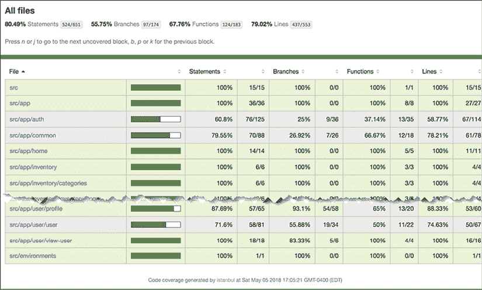

图 10.20：LemonMart 的 Istanbul 代码覆盖率报告

您可以针对特定文件夹（如`src/app/auth`）进行深入分析，并获得文件级报告，如下所示：

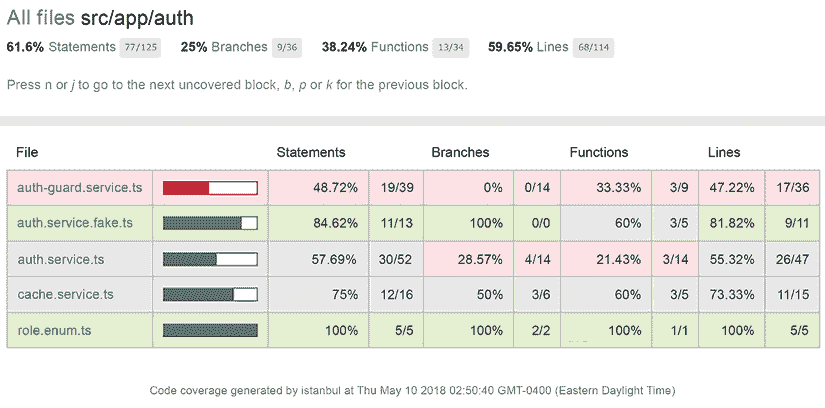

图 10.21：src/app/auth 的 Istanbul 代码覆盖率报告

您可以进一步深入到特定文件（如`cache.service.ts`）的行级覆盖率，如下所示：

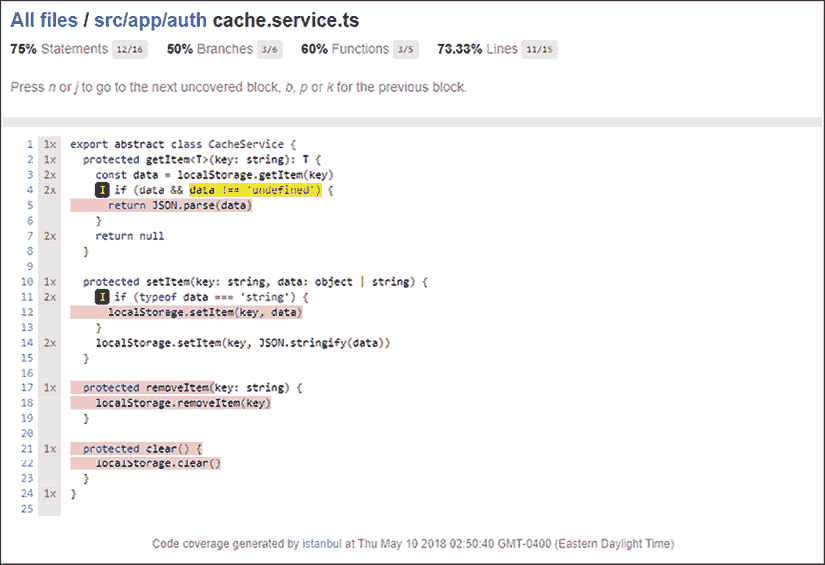

图 10.22：cache.service.ts 的 Istanbul 代码覆盖率报告

在前面的截图中，您可以看到行**5**、**12**、**17**–**18**和**21**–**22**没有被任何测试覆盖。**I**图标表示`if`路径没有被采取。我们可以通过实现单元测试来增加代码覆盖率，这些单元测试将测试`CacheService`中包含的函数。作为一个练习，您应该尝试至少用一个新的单元测试覆盖这些函数中的一个，并观察代码覆盖率报告的变化。

## CI 中的代码覆盖率

理想情况下，您的 CI 服务器配置应该在每次测试运行时生成和托管代码覆盖率报告。然后您可以使用代码覆盖率作为另一个代码质量关卡，防止降低整体代码覆盖率百分比的代码被合并。这是一种加强**测试驱动开发**（**TDD**）思维的好方法。

您可以使用 Coveralls 等服务（位于[`coveralls.io`](https://coveralls.io)）来实现代码覆盖率检查，这些服务可以直接在 GitHub 拉取请求中嵌入您的代码覆盖率级别。

让我们为 LemonMart 配置 Coveralls：

在**lemon-mart**仓库中，本节`config.yml`文件的名称为`.circleci/config.stage9.yml`。

1.  在您的 CircleCI 账户设置中，在**安全**部分确保您允许执行未经认证/未签名的插件。

1.  在[`coveralls.io/`](https://coveralls.io/)注册您的 GitHub 项目。

1.  复制仓库令牌并将其存储为 CircleCI 中的环境变量，变量名为`COVERALLS_REPO_TOKEN`。

1.  在进行任何代码更改之前创建一个新的分支。

1.  使用以下方式更新`.circleci/config.yml`文件，添加 Coveralls 插件：

    ```js
    **.circleci/config.yml**
    version: 2.1
    orbs:
    **coveralls:****coveralls/coveralls@2** 
    ```

1.  更新`build`作业以存储代码覆盖率结果并将其上传到 Coveralls：

    ```js
    **.circleci/config.yml**
    jobs:
      build_and_test:
        ...
          - run: npm test -- --watch=false --code-coverage
          - store_test_results:
              path: ./test_results
          **-****store_artifacts:**
              **path:****./coverage**
          **-****coveralls/upload**
          - run:
              name: Tar & Gzip compiled app
              command: tar zcf dist.tar.gz dist/lemon-mart
          - store_artifacts:
              path: dist.tar.gz 
    ```

    `store_test_results`和`store_artifacts`将存储测试结果和代码覆盖率数据，以便在其他作业或插件中进行分析。CircleCI 可以在其 Web UI 中显示 XML 格式的覆盖率报告。`The` `coveralls/upload` `command`上传我们刚刚存储的用于分析的代码覆盖率数据。

    注意，插件会自动为您配置 Coveralls 账户，因此`coveralls`/`upload`命令可以上传您的代码覆盖率结果。

1.  将您的更改提交到分支并发布。

1.  使用分支在 GitHub 上创建一个拉取请求。

1.  在拉取请求上，验证你能否看到 Coveralls 正在报告你的项目代码覆盖率，如下所示：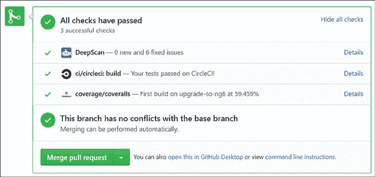

    图 10.23：Coveralls 报告代码覆盖率

1.  将拉取请求合并到主分支。

恭喜！现在，你可以修改你的分支保护规则，要求在合并请求合并到主分支之前，代码覆盖率必须高于一定百分比。

你可以在[`coveralls.io`](https://coveralls.io)设置覆盖率阈值。

LemonMart 项目在[`github.com/duluca/lemon-mart`](https://github.com/duluca/lemon-mart)中实现了一个功能齐全的`config.yml`文件。此文件还实现了[Cypress.io](http://Cypress.io)，覆盖了 Angular 的默认 e2e 工具。Cypress orb 可以记录测试结果，并允许你从 CircleCI 管道中查看它们。

利用本章所学，你可以将 LocalCast Weather 的`deploy`脚本集成到 LemonMart 中，并实施门控部署工作流程。

良好的工程实践和 DevOps 实践对于交付成功项目和建立令人满意的职业生涯至关重要。感谢阅读这本书！

# 摘要

在本章中，你学习了如何使用 CI/CD 管道创建价值交付流。我们讨论了在企业环境中，自动化单元测试对于快速交付高质量代码的重要性。你使用 CircleCI 配置了一个 CI 管道。你学习了使用 GitHub flow 进行基于主干的开发以及实施质量门。你将一个 Web 应用程序部署到 Vercel，并利用`ng` `deploy`进行 Firebase 部署。

接下来，我们介绍了使用 Docker 和 npm 脚本的 DevOps 和 IaC 技术。你将你的 Web 应用程序容器化，学习了在云中与容器一起工作的方法，并学习了如何实施门控 CI 工作流程。此外，你还熟悉了 orbs、工作流程和代码覆盖率工具。

我们利用 CircleCI 作为基于云的 CI 服务，并强调你可以将构建结果部署到所有主要的云托管提供商。你看到了如何实现 CD。我们通过 CircleCI 演示了如何通过 Vercel 进行示例部署，展示了如何实现持续部署。

通过一个健壮的 CI/CD 管道，你可以与客户和团队成员共享每个应用程序构建，并快速向最终用户交付错误修复或新功能。

恭喜！你已经完成了你的*企业级应用程序的 Angular*之旅。我希望你学到了一些新东西。学习和成长的最佳方式是通过教学和分享，所以我希望你能将这本书作为参考资料保留，并与朋友、家人和同事分享。

> 如果你已经读到这儿，请发给我一张你与（电子）书的照片或关于内容对你影响的笔记，我将与你分享一个专属的数字徽章以表彰你的成就。
> 
> 继续您的旅程，请访问 [`AngularForEnterprise.com`](https://AngularForEnterprise.com)。

# 练习

1.  将 CircleCI 和 Coveralls 徽章添加到您的代码仓库的 `README.md` 文件中。

1.  实现 Cypress 进行端到端测试，并使用 `Cypress orb` 在您的 CircleCI 管道中运行它。

1.  实现 LemonMart 应用的 Vercel 部署和条件工作流程。生成的 `config.yml` 文件位于 `lemon-mart` 仓库中，命名为 `.circleci/config.stage9.yml`。

# 进一步阅读

+   *与遗留代码有效工作*，Michael Feathers，2004

+   *《TDD 的三条法则》*，Robert “Uncle Bob” Martin，2005，[`butunclebob.com/ArticleS.UncleBob.TheThreeRulesOfTdd`](http://butunclebob.com/ArticleS.UncleBob.TheThreeRulesOfTdd)

+   *《成功采用敏捷：使用 Scrum 进行软件开发》*，Mike Cohn，2009

+   *测试金字塔*，Martin Fowler，2012，[`martinfowler.com/bliki/TestPyramid.html`](https://martinfowler.com/bliki/TestPyramid.html)

+   *Jasmine 2 间谍速查表*，Dave Ceddia，2015，[`daveceddia.com/jasmine-2-spy-cheat-sheet`](https://daveceddia.com/jasmine-2-spy-cheat-sheet)

+   *《实用的测试金字塔》*，Ham Vocke，2018，[`martinfowler.com/articles/practical-test-pyramid.html`](https://martinfowler.com/articles/practical-test-pyramid.html)

+   *SOLID 原则*，维基百科，2019，[`en.wikipedia.org/wiki/SOLID`](https://en.wikipedia.org/wiki/SOLID)

+   *Dockerfile 参考*，2020，[`docs.docker.com/engine/reference/builder/`](https://docs.docker.com/engine/reference/builder/)

+   *CircleCI orbs*，2020，[`circleci.com/orbs/`](https://circleci.com/orbs/)

+   *部署容器镜像*，2020，[`cloud.google.com/run/docs/deploying`](https://cloud.google.com/run/docs/deploying )

+   *ECS Fargate 威胁建模*，Kaizhe Huang，2019，[`sysdig.com/blog/ecs-fargate-threat-modeling/`](https://sysdig.com/blog/ecs-fargate-threat-modeling/ )

# 问题

尽可能地回答以下问题，以确保您已经理解了本章的关键概念，而无需使用 Google 搜索。你知道你是否回答了所有正确的问题吗？请访问 [`angularforenterprise.com/self-assessment`](https://angularforenterprise.com/self-assessment) 获取更多信息：

1.  测试金字塔是什么？

1.  固定装置和匹配器是什么？

1.  模拟、间谍和存根之间的区别是什么？

1.  在生产模式下构建 Angular 的好处是什么？

1.  GitHub 流是如何工作的？

1.  为什么我们应该保护主分支？

1.  解释 Docker 镜像和 Docker 容器之间的区别。

1.  为什么你更喜欢在云中使用托管容器运行时而不是非托管运行时？

1.  CD 管道的目的是什么？

1.  CD 的好处是什么？

1.  我们如何填补配置差距？

1.  CircleCI orb 做什么？

1.  使用多阶段 Dockerfile 的好处是什么？

1.  代码覆盖率报告如何帮助维护您应用程序的质量？
