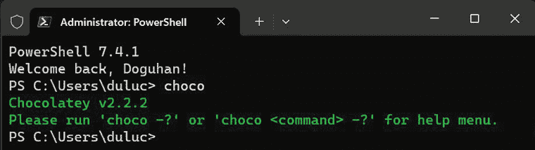

# 附录 A

# 设置您的开发环境

在您和团队成员之间共享一致的开发环境非常重要。一致性有助于避免许多与 IT 相关的问题，包括持续维护、许可和升级成本。此外，您还希望确保整个团队拥有相同的开发体验。这样，如果团队成员遇到配置问题，其他团队成员可以协助解决问题。为新团队成员创建一个无烦恼且高效的入职体验也是至关重要的。

简单且文档齐全的入职流程确保新团队成员可以快速变得高效并融入团队。在持续的过程中，保持一致且最小化的开发环境对团队来说仍然是一个挑战。自动化可以帮助在开发机器上提供和维护一致的环境。

推荐的操作系统是 Windows 10 或 Windows 11 Pro，并启用 PowerShell v7+ 和开发者模式，或者 macOS Ventura 或 Sonoma，并安装了终端和 XCode 开发者工具。建议使用基于 Chromium 的 Google Chrome 或 Microsoft Edge 作为网络浏览器，因为它们提供了几乎相同的开发者体验。

本书建议的大多数软件都是跨平台工具，因此它们也适用于 Linux 系统。然而，您在使用这些系统时的体验可能会有所不同。

本附录涵盖：

+   推荐的 Web 开发工具

+   命令行包管理器

+   为 Windows 和 macOS 安装自动化

+   使用 Angular CLI 进行项目设置

+   优化 VS Code 以支持 Angular

让我们从回顾推荐的 Web 开发工具以及如何通过自动化脚本来快速安装这些工具开始。在附录的后面部分，我们将介绍如何创建这样的脚本。

# 推荐的 Web 开发工具

本节涵盖了推荐用于开发 Web 应用程序的工具，如下所示：

| **工具** | **描述** | **URL** |
| --- | --- | --- |
| Git | 版本控制系统 | [`git-scm.com`](https://git-scm.com) |
| GitHub Desktop | 运行 Git 命令并与 GitHub 交互的**图形用户界面**（**GUI**） | [`desktop.github.com`](https://desktop.github.com) |
| Node.js | 跨平台 JavaScript 运行时环境 | [`nodejs.org`](https://nodejs.org) |
| Visual Studio Code | 跨平台**集成开发环境**（**IDE**） | [`code.visualstudio.com`](https://code.visualstudio.com) |
| Docker Desktop | 轻量级容器虚拟化平台 | [`www.docker.com/products/docker-desktop`](https://www.docker.com/products/docker-desktop) |

表 A.1：Web 开发所需的工具

要自动安装本书所需的全部 Web 开发工具，请在您的操作系统上执行以下命令以配置您的环境。

在 Windows PowerShell 中执行：

```js
PS> Install-Script -Name setup-windows-dev-env
PS> setup-windows-dev-env.ps1 
```

在 macOS 终端中执行：

```js
$> bash <(wget -O - https://git.io/JvHi1) 
```

更多信息，请参阅 [`github.com/duluca/web-dev-environment-setup`](https://github.com/duluca/web-dev-environment-setup)。

macOS 脚本安装了 Node 版本 20，这是发布时的 **长期支持**（**LTS**）版本。为了确保您始终安装了最新的 LTS 版本，脚本安装了 `n`，一个 Node 版本管理器。使用 `n`，您可以轻松地在不同的 Node 版本之间切换。

一旦您安装了您的 IDE，您就可以开始开发了。在下一节中，您将了解基于 CLI 的包管理器。您会发现使用 CLI 工具比处理单个安装程序要好。自动化 CLI 工具要容易得多，使得设置和维护任务可重复且快速。

# CLI 包管理器

通过 **图形用户界面**（**GUI**）安装软件速度慢且难以自动化。作为一名全栈开发者，无论是 Windows 还是 Mac 用户，您必须依赖 **命令行界面**（**CLI**）包管理器来高效地安装和配置您依赖的软件。

任何可以用 CLI 命令表达的内容也可以自动化。

# 安装 Windows 的 Chocolatey

Chocolatey 是一个基于 CLI 的 Windows 包管理器，可用于自动化软件安装。要在 Windows 上安装 Chocolatey，您需要运行提升的命令壳：

1.  打开 **开始** 菜单。

1.  在 **PowerShell** 中开始输入。

1.  您应该看到 **Windows PowerShell 桌面应用** 作为搜索结果。

1.  右键单击 **Windows PowerShell** 并选择 **以管理员身份运行**。

1.  这会触发一个 **用户账户控制**（**UAC**）警告；选择 **是** 以继续。

1.  在 **PowerShell** 中执行 [`chocolatey.org/install`](https://chocolatey.org/install) 中的安装命令以安装 Chocolatey 包管理器：

    ```js
    PS> Set-ExecutionPolicy Bypass -Scope Process -Force; [System.Net. ServicePointManager]::SecurityProtocol = [System.Net.ServicePointM anager]::SecurityProtocol -bor 3072; iex ((New-Object System.Net. WebClient).DownloadString('https://chocolatey.org/install.ps1')) 
    ```

1.  通过执行 `choco` 验证您的 Chocolatey 安装。

1.  您应该看到以下截图所示的类似输出：

    图 A.1：Chocolatey 成功安装

所有后续的 Chocolatey 命令也必须从提升的命令壳中执行。或者，您可以在不需要提升命令壳的非管理员设置中安装 Chocolatey。然而，这会导致一个非标准且不太安全的开发环境，并且通过此工具安装的某些应用程序可能仍然需要提升权限。

WinGet 是由 Microsoft 提供的 Windows 包管理器。您可以在 [`github.com/microsoft/winget-cli/`](https://github.com/microsoft/winget-cli/) 或 Microsoft Store 中了解更多关于 WinGet 的信息。

我更喜欢 Chocolatey 而不是 WinGet，因为当脚本遇到意外的配置时，它提供了更好的弹性。有关 Chocolatey 的更多信息，请参阅 [`chocolatey.org/install`](https://chocolatey.org/install)。

## 安装 macOS 的 Homebrew

Homebrew 是一个基于 CLI 的 macOS 软件包管理器，可用于自动化软件安装。要在 macOS 上安装 Homebrew，您需要运行一个命令行：

1.  使用  + *Space* 启动 **Spotlight 搜索**。

1.  输入 `终端`。

1.  在终端中执行以下命令以安装 Homebrew 软件包管理器：

    ```js
    $ /bin/bash -c "$(curl -fsSL https://raw.githubusercontent.com/Homebrew/install/HEAD/install.sh)" 
    ```

1.  通过执行 `brew` 验证您的 Homebrew 安装。

1.  您应该看到以下类似的输出！[](img/B20960_11_02.png)

    图 A.2：Homebrew 成功安装

1.  要启用对额外软件的访问，请执行以下命令：

    ```js
    $ brew tap caskroom/cask 
    ```

Homebrew Cask 扩展了 Homebrew，将它的优雅、简洁和速度带到了 GUI macOS 应用程序的安装和管理中，如 Visual Studio Code 和 Google Chrome。更多关于它的信息请查看 [`github.com/Homebrew/homebrew-cask`](https://github.com/Homebrew/homebrew-cask)。在 macOS 上，如果您在安装与 chown’ing `/usr/local` 相关的 brew 软件包时遇到权限问题，您需要执行 `sudo chown -R $(whoami)`。

`$(brew --prefix)/*` 命令。此命令将用户级别的所有权重新分配给 `brew` 软件包，这比广泛的超级用户 `/su` 级别访问更安全。

更多信息，请查看 [`brew.sh/`](https://brew.sh/)。

## 安装 Windows 和 macOS 的自动化

记住，*任何可以用 CLI 命令表达的内容都可以自动化*。在整个设置过程中，我们确保每个正在使用的工具都已设置好，并且可以通过 CLI 命令验证其功能。这意味着我们可以轻松地创建一个 PowerShell 或 Bash 脚本来将这些命令串联起来，并简化设置和验证新环境的过程。

让我们实现一些基本但有效的脚本，以帮助设置您的开发环境。

## PowerShell 脚本

对于基于 Windows 的开发环境，您需要创建一个 PowerShell 脚本：

1.  创建一个名为 `setup-windows-dev-env.ps1` 的文件。

1.  在文件中插入以下文本，该文本也可在 [`github.com/duluca/web-dev-environment-setup`](https://github.com/duluca/web-dev-environment-setup) 找到：

    ```js
    setup-windows-dev-env.ps1
    # This script is intentionally kept simple to demonstrate basic automation techniques.
    Write-Output "You must run this script in an elevated command shell, using 'Run as Administator'"
    $title = "Setup Web Development Environment"
    $message = "Select the appropriate option to continue (Absolutely NO WARRANTIES or GUARANTEES are provided):"
    $yes = New-Object System.Management.Automation.Host.ChoiceDescription "&Install Software using Chocolatey", `
      "Setup development environment."
    $no = New-Object System.Management.Automation.Host.ChoiceDescription "&Exit", `
      "Do not execute script."
    $options = [System.Management.Automation.Host.ChoiceDescription[]]($yes, $no)
    $result = $host.ui.PromptForChoice($title, $message, $options, 1)
    switch ($result) {
      0 {
        Write-Output "Installing chocolatey"
        Set-ExecutionPolicy Bypass -Scope Process -Force; Invoke-Expression ((New-Object System.Net.WebClient).DownloadString('https://chocolatey.org/install.ps1'))
        Write-Output "Refreshing environment variables. If rest of the script fails, restart elevated shell and rerun script."
        $env:Path = [System.Environment]::GetEnvironmentVariable("Path", "Machine") + ";" + [System.Environment]::GetEnvironmentVariable("Path", "User")
        Write-Output "Assuming chocolatey is already installed"
        Write-Output "Installing Git & GitHub Desktop"
        choco.exe upgrade git github-desktop -y
        Write-Output "Installing NodeJS and NVS"
        choco.exe upgrade nodejs-lts nvs -y
        Write-Output "Installing Docker"
        choco.exe upgrade docker-cli docker-for-windows -y
        Write-Output "Installing AWS"
        choco.exe upgrade awscli -y
        Write-Output "Installing VS Code"
        choco.exe upgrade VisualStudioCode -y
        RefreshEnv.cmd
        Write-Output "Results:"
        Write-Output "Verify installation of GitHub Desktop and VS Code manually."
        $awsVersion = aws.exe --version
        Write-Output "aws: $awsVersion"
        $dockerVersion = docker.exe --version
        Write-Output "docker: $dockerVersion"
        $gitVersion = git.exe --version
        Write-Output "git: $gitVersion"
        $nodeVersion = node.exe -v
        Write-Output "Node: $nodeVersion"
        $npmVersion = npm.cmd -v
        Write-Output "npm: $npmVersion"
      }
      1 { "Aborted." }
    } 
    ```

1.  要执行脚本，请运行：

    ```js
    PS> Set-ExecutionPolicy Unrestricted; .\setup-windows-dev-env.ps1 
    ```

或者，您可以直接从 PowerShell Gallery 安装并执行脚本，PowerShell Gallery 的网址为 [`www.powershellgallery.com`](https://www.powershellgallery.com)，通过执行以下命令：

```js
PS> Install-Script -Name setup-windows-dev-env PS> setup-windows-dev-env.ps1 
```

通过执行此脚本，您已成功在 Windows 上设置开发环境。

如果您有兴趣将您自己的脚本发布到 PowerShell Gallery 或对提高 PowerShell 技能感兴趣，我建议您从 [`github.com/PowerShell/PowerShell`](https://github.com/PowerShell/PowerShell) 安装 PowerShell Core，这是一个跨平台的 PowerShell 版本。

现在，让我们调查您如何在 Mac 上实现类似的设置。

## Bash 脚本

对于基于 Mac 的开发环境，您需要创建一个 Bash 脚本：

1.  创建一个名为 `setup-mac-dev-env.sh` 的文件。

1.  运行`chmod a+x setup-mac-dev-env.sh`以使文件可执行。

1.  将以下文本（也可在[`github.com/duluca/web-dev-environment-setup`](https://github.com/duluca/web-dev-environment-setup)找到）插入到`setup-mac-dev-env.sh`文件中：

    ```js
     #!/bin/bash

          # In order to be able to execute this script, run 'chmod a+x setup-mac-dev-env.sh' to make the file executable

          echo "Execute Installation Script"
          read -r -p "Absolutely NO WARRANTIES or GUARANTEES are provided. Are you sure you want to continue? [y/N] " response
          if [[ "$response" =~ ^([yY][eE][sS]|[yY])+$ ]]
          then
              echo "Installing brew"
              /bin/bash -c "$(curl -fsSL https://raw.githubusercontent.com/Homebrew/install/HEAD/install.sh)"

              echo "Installing git"
              brew install git
              brew upgrade git

              echo "Installing GitHub Desktop"
              brew install github
              brew upgrade github

              echo "Installing NodeJS"
              brew install node@20
              brew upgrade node@20

              echo "Installing Docker"
              brew install docker
              brew upgrade docker

              echo "Installing AWS"
              brew install awscli
              brew upgrade awscli

              echo "Installing VS Code"
              brew install visual-studio-code
              brew upgrade visual-studio-code

              echo "Results:"
              echo "Verify installation of AWS, Docker, GitHub Desktop and VS Code manually."
              gitVersion=$(git --version)
              echo "git: $gitVersion"
              nodeVersion=$(node -v)
              echo "Node: $nodeVersion"
              npmVersion=$(npm -v)
              echo "npm: $npmVersion"

              echo "Ensuring Node LTS is installed"
              npm i -g n@latest
              n lts
          else
              echo "Aborted."
          fi 
    ```

1.  要执行脚本，请运行：

    ```js
    $ ./setup-mac-dev-env.sh 
    ```

通过执行此脚本，你已经在 Mac 上成功设置了你的开发环境。以下是一个更复杂的安装和验证例程的示例，你可以在尝试安装之前检查是否已经安装了特定的程序，如`brew`或`node`：

```js
echo "Checking if brew is installed" which -s brew
if [[ $? != 0 ]] ; then echo "Installing brew"
/usr/bin/ruby -e "$(curl -fsSL https://raw.githubusercontent.com/ Homebrew/install/master/install)" < /dev/null
else
echo "Found brew"
fi
echo "Checking for Node version ${NODE_VERSION}" node -v | grep ${NODE_VERSION}
if [[ $? != 0 ]] ; then
echo "Installing Node version ${NODE_VERSION}" brew install nodejs
else
echo "Found Node version ${NODE_VERSION}"
fi 
```

到现在为止，你应该对自动化执行你的脚本的样子有了很好的了解。然而，残酷的现实是，这些脚本并不代表一个高度能干或具有弹性的解决方案。它们不能远程执行或管理，也不能快速从错误中恢复或从机器启动周期中生存下来。此外，你的 IT 需求可能超出了这里涵盖的范围。

如果你正在处理大型团队并且经常有员工流动，自动化工具可以非常有用。相反，如果你是单独工作或者是一个更小、更稳定的团队的一部分，这样的工具可能就是过度配置了。我鼓励你探索像 Puppet、Chef、Ansible 和 Vagrant 这样的工具，以帮助你决定哪个最适合你的需求，或者确定一个简单的脚本是否足够。

# 使用 Angular CLI 进行项目设置

Angular CLI 工具`ng`是 Angular 官方项目，旨在确保新创建的 Angular 应用程序具有统一的架构，遵循社区经过时间检验的最佳实践。这意味着你将来遇到的任何 Angular 应用程序都应该具有相同的一般形状。

Nx 工具在企业级应用开发领域非常流行，用于构建、生成和维护 Angular 应用程序。你可以在[`nx.dev`](https://nx.dev)了解更多关于 Nx 的信息。

## 设置你的开发目录

设置一个专门的`dev`目录可以救命。因为这个目录下的所有数据都使用 GitHub 进行备份，所以你可以安全地配置你的防病毒软件、云同步或备份软件来忽略它。这可以显著减少 CPU、磁盘和网络的使用率。作为一个全栈开发者，你很可能会进行很多多任务处理，所以避免不必要的活动对性能、电力和数据消耗的净正面影响很大，尤其是如果你的开发环境是资源匮乏的笔记本电脑，或者你希望在移动时尽可能延长电池寿命。

在 Windows 中，直接在`c:\`驱动器下创建一个`dev`文件夹非常重要。早期的 Windows 版本，或者说 NTFS，无法处理超过 260 个字符的文件路径。一开始这看起来可能足够，但当你在一个已经非常深的目录结构中安装`npm`包时，`node_modules`文件夹结构可能会变得足够深，以至于很容易达到这个限制。

使用 `npm 3+`，引入了一种新的、更扁平的包安装策略，这有助于解决与 npm 相关的问题，但尽可能接近根文件夹对任何工具都非常有帮助。

使用以下命令创建你的 `dev` 文件夹。对于 Windows：

```js
PS> mkdir c:\dev
PS> cd c:\dev 
```

对于 macOS：

```js
$ mkdir ~/dev
$ cd ~/dev 
```

在基于 Unix 的操作系统上，`~`（发音为 tilde）是当前用户主目录的快捷方式，该目录位于 `/Users/你的用户名` 下。

现在开发目录已经准备好了，让我们开始生成你的 Angular 应用程序。

## 生成你的 Angular 应用程序

我们将使用 npm create 命令来生成你的 Angular 应用程序，该命令使用 Angular CLI 生成代码。Angular CLI 不仅仅局限于初始代码生成；你将频繁地使用它来创建新的组件、指令、管道、服务、模块等。Angular CLI 还在开发过程中提供实时重新加载功能，以便你可以快速看到你更改的结果。Angular CLI 还可以测试、检查和构建用于生产发布的代码优化版本。此外，随着新的 Angular 版本的发布，Angular CLI 帮助你通过自动重写部分代码以保持与潜在破坏性更改的兼容性来升级你的代码。

### 安装 Angular CLI

[`angular.dev/tools/cli`](https://angular.dev/tools/cli) 上的文档指导你如何将 `@angular/cli` 作为全局 npm 包进行安装。然而，我建议不要这样做。随着时间的推移，随着 Angular CLI 的升级，保持全局和在项目中的版本同步成为一个持续的烦恼。如果它们不一致，工具往往会无休止地抱怨。此外，如果你在多个项目上工作，随着时间的推移，你将拥有 Angular CLI 的不同版本。结果，你的命令可能不会返回你预期的结果，或者你的团队成员得到的结果。

下一个部分中详细介绍的策略为你的 Angular 项目的初始配置增加了一些复杂性。然而，如果你几个月或甚至一年后必须返回项目，你将完全弥补这种痛苦。在这种情况下，你可以使用你在项目上最后使用的工具版本，而不是可能需要升级而你不愿意执行的未来版本。在下一个部分中，你将使用这个最佳实践来初始化你的 Angular 应用程序。

### 初始化你的 Angular 应用程序

初始化你的应用程序的主要方式是使用 Angular CLI。让我们为开发初始化应用程序：

1.  在你的 `dev` 文件夹下，执行以下命令：

    ```js
    npm create @angular 
    ```

    Angular 使用独立项目配置创建所有新的项目。

1.  按照屏幕上的说明，并将你的应用程序命名为 `my-test-app`；否则，通过按 **Enter** 键接受默认选项。

1.  在你的终端上，你应该会看到一个成功消息。

你的项目文件夹 `my-test-app` 已初始化为 Git 仓库，并使用初始文件和文件夹结构进行了脚手架搭建。

`@angular/cli`的别名是`ng`。如果你要全局安装 Angular CLI，你会执行`ng new my-test-app`，但我们没有这样做。要使用 Angular CLI，你必须以`npx @angular/cli`的方式运行它。然而，我们只是在你应用的`node_modules/.bin`目录下安装了 Angular CLI，即`my-test-app`目录。这意味着你可以在`apps`目录中使用与你的项目关联的版本运行`ng`命令，例如`npx ng generate component` `my-new-component`，并继续高效地工作。

## 优化 VS Code 以适应 Angular

优化你的**集成开发环境（IDE**）以获得良好的开发体验至关重要。如果你利用本节中我提供的自动化工具，你可以快速配置你的 IDE 和 Angular 项目，使用数十个可以良好协同工作的设置。

## 自动配置你的项目

要快速配置你的 Angular 应用程序和 VS Code 工作区，请运行以下命令：

1.  应用 Angular VS Code 配置：

    ```js
    npx mrm angular-vscode 
    ```

1.  应用 Docker 配置的`npm`脚本：

    ```js
    npx mrm npm-docker 
    ```

    这些设置不断调整以适应扩展、插件、Angular 和 VS Code 不断变化的格局。始终确保通过重新运行`install`命令来安装任务的最新版本。

1.  执行`npm run style:fix`。

1.  执行`npm run lint:fix`。

有关`mrm`任务的更多信息，请参阅：

+   [`github.com/expertly-simple/mrm-task-angular-vscode`](https://github.com/expertly-simple/mrm-task-angular-vscode)

+   [`github.com/expertly-simple/mrm-task-npm-docker`](https://github.com/expertly-simple/mrm-task-npm-docker)

你可以将你的配置与 GitHub 上的示例项目进行验证。然而，请注意，配置组件将应用于存储库的根目录，而不是`projects`文件夹下。

恭喜你 – 你已经完成了开发环境的设置！

# 摘要

在本附录中，你掌握了使用基于命令行界面（CLI）的包管理器来加速和自动化为你和你的同事设置开发环境的方法。你还创建了你的第一个 Angular 项目，并使用 Visual Studio Code 对其配置进行了优化。然后，你实现了自动化的样式检查器和修复器，以强制执行团队中的编码标准和样式。你实现的检查器和修复器将自动捕获潜在的编码错误和维护性问题。

你创建的自动化脚本将你的团队规范编码化，并为新成员和现有成员记录下来。通过减少不同开发者环境之间的差异，你的团队能够更有效地克服任何个人配置问题，并专注于手头的任务。通过共同理解一个共同的环境，团队中的任何个人都不需要承担帮助解决其他人的问题的负担。同样的想法也适用于你的代码文件的结构和风格。

当团队成员查看另一位团队成员的代码时，其风格看起来完全相同，这使得调试和解决问题更加容易。因此，你的团队会更加高效。通过利用更复杂和健壮的工具，中大型组织可以在其 IT 预算中实现相当大的节省。

# 进一步阅读

维什瓦什·帕拉梅什瓦拉帕的《自动化本地开发者机器的设置》一文是使用 Vagrant 的绝佳起点，可以在[`www.vagrantup.com`](https://www.vagrantup.com)找到。你可以在[`Red-gate.com/simple-talk/sysadmin/general/automating-setup-local-developer-machine`](https://Red-gate.com/simple-talk/sysadmin/general/automating-setup-local-developer-machine)找到这篇文章。

其他工具包括位于[`www.chef.io`](https://www.chef.io)的 Chef 和位于[`puppet.com`](https://puppet.com)的 Puppet。一些开发者更喜欢在[`www.docker.com`](https://www.docker.com)的 Docker 容器内进行编码。这样做是为了隔离不同版本的 SDK。特定的开发工具不能局限于特定的文件夹，必须全局或操作系统范围内安装，这使得同时处理多个项目变得困难。如果你能避免这种设置，我建议你这样做。我预计随着 CPU 核心数量的增加和虚拟化技术获得更好的硬件加速，IDEs 将在未来自动化此类任务。

# 问题

尽可能好地回答以下问题，以确保你已经理解了本章的关键概念。你知道你是否已经正确回答了所有问题？请访问[`angularforenterprise.com/self-assessment`](https://angularforenterprise.com/self-assessment)获取更多信息：

1.  与 GUI 相比，使用 CLI 工具的动机是什么？

1.  对于你的特定操作系统，建议使用哪个包管理器？

1.  使用包管理器的一些好处是什么？

1.  保持你的开发团队成员的开发环境尽可能相似有什么好处？

# 加入我们的 Discord 社区

加入我们的 Discord 空间，与作者和其他读者进行讨论：

`packt.link/AngularEnterpise3e`


