# 1

# Angular 及其概念的介绍

最初，有 HTML，然后是 DHTML。技术人员发明了新的技术，如 Java、JavaScript、PHP 等，以在浏览器上提供交互式体验。编程的圣杯是编写一次程序，在任何地方运行。一瞬间，**单页应用**（**SPAs**）的时代诞生了。SPAs 欺骗浏览器认为单个`index.html`可以容纳包含许多页面的整个应用程序。Backbone.js、Knockout.js 和 Angular.js 都来了又去。所有人都在未管理的复杂性和每周 JavaScript 框架综合症中挣扎，寻找救世主。然后出现了 React、Angular 和 Vue。它们承诺解决所有问题，带来通用可重用 Web 组件，并使学习、开发和扩展 Web 应用变得更加容易。而且，它们确实做到了！有的比其他的好。网络发展的青少年历史教会了我们几个基本教训。首先，变化是不可避免的，其次，开发者的幸福是一种宝贵的商品，它可以成就或摧毁整个公司。

本章涵盖：

+   Web 框架的历史

+   Angular 及其背后的哲学

+   反应式开发范式

+   高级 Angular 特性，包括状态管理

+   主要 Angular 版本和特性

这第一章旨在为你提供本书其余部分的理论和历史背景。在阅读本书的其余部分时，请随时将其用作参考。*第二章*，*设置您的开发环境*，介绍了如何配置您的开发环境以获得出色的开发体验。在*第三章*，*创建一个基本的 Angular 应用*中，你开始实现您的第一个 Angular 应用程序。如果您已经熟悉 Angular，您可以从*第七章*，*创建一个以路由为第一线的业务应用*开始，深入创建适合企业的可扩展应用程序。

本书中的每一章都向您介绍新的概念，同时强化最佳实践，并涵盖使用广泛使用的开源工具的最佳工作方式。在这个过程中，提示和信息框涵盖了关于 Web 和现代 JavaScript 开发基础知识可能存在的任何知识差距。在您阅读内容时，请注意编号步骤或项目符号，因为它们描述了您需要采取的行动。如果您跳过某个部分或章节，您可能会错过配置或技术上的微妙变化，这可能会在以后让您感到困惑。

本书提供的代码示例是使用 Angular 9 开发的，该版本计划在 2021 年 8 月之前提供**长期支持**（**LTS**）。您可能是在 Angular 9 之后的新版本发布后阅读这本书的。但是，请放心。本书采用了 Angular 的 evergreen 口号，即始终将 Angular 的版本与最新版本保持同步。通过坚持平台基础并避免不必要的第三方库，可以保持更新。本书的示例项目最初是为 Angular 5 编写的，随着时间的推移，通过遵循积极的增量 Angular 升级计划，没有进行重大重写而进行了更新。我预计这些项目在未来几年中只需进行少量修改即可生存。这种可靠性是对 Angular 团队所做优秀兼容性工作的证明。

JavaScript、TypeScript 和 Angular 的世界一直在不断变化。书中代码示例与您使用工具生成的代码之间存在一些差异是正常的。因此，本书推荐的大多数最佳实践和配置项都是使用我创建的工具应用的，以便它们可以更新。以下是支持本书内容的库、扩展和开源项目集合的高级概述：

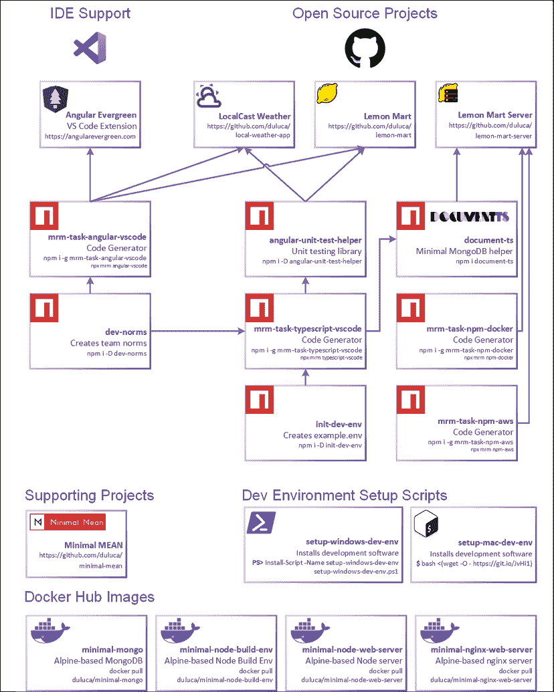

图 1.1：支持本书开发的代码

上述图表是为了让您快速了解一些动态部分。每个组件将在接下来的章节中详细介绍。本书示例代码的最新版本可在 GitHub 上找到，位于以下链接的仓库中。这些仓库包含代码的最终和完成状态。为了使您在章节结束时更容易验证进度，每个仓库中的`projects`文件夹包含反映代码当前状态的逐章快照：

+   对于**第二章**到**第六章**，以及**第十二章**，LocalCast Weather: `github.com/duluca/local-weather-app`

+   对于**第七章**到**第十四章**，Lemon Mart: `github.com/duluca/lemon-mart`

+   对于**第十章**，Lemon Mart Server: `github.com/duluca/lemon-mart-server`

    您可以在**附录 C**、“保持 Angular 和工具 evergreen”中了解更多关于更新 Angular 的信息。您可以从`static.packt-cdn.com/downloads/9781838648800_Appendix_C_Keeping_Angular_and_Tools_Evergreen.pdf`或`expertlysimple.io/stay-evergreen`在线找到此附录。

让我们回顾一下过去 20 年左右的 Web 开发历史，这样您就可以了解 Angular 是如何产生并演变的。

# Web 框架简史

考虑到我们最初为什么要使用像 Angular、React 或 Vue 这样的框架，这是非常重要的。随着 JavaScript 在浏览器中变得更加流行和强大，网络框架开始兴起。在 2004 年，**异步 JavaScript 和 XML（AJAX**）技术在创建不需要依赖完整页面刷新来创建动态体验的网站中变得非常流行，这些体验利用了标准化的网络技术，如 HTML、JavaScript/ECMAScript 和 CSS。浏览器供应商应该按照**万维网联盟（W3C**）的定义来实现这些技术。

**互联网浏览器（IE**）是当时绝大多数互联网用户依赖的浏览器。微软利用其市场主导地位来推广专有技术和 API，以确保 IE 作为首选浏览器的优势。当 Mozilla 的 Firefox 挑战 IE 的主导地位，随后是 Google 的 Chrome 浏览器出现时，事情开始变得有趣。随着这两个浏览器成功获得显著的市场份额，网络开发领域变得混乱。新的浏览器版本以惊人的速度出现。竞争的厂商和技术利益导致了网络标准的分歧实施。

这种碎片化为开发者创造了一个不可持续的环境，让他们在网络上提供一致的用户体验。各种标准的实现质量、版本和名称的差异创造了一个巨大的挑战，即成功编写能够一致操作浏览器**文档对象模型（DOM**）的代码。即使是浏览器 API 和功能的最微小差异也足以破坏一个网站。

在 2006 年，jQuery 被开发出来以平滑浏览器 API 和功能之间的差异。因此，你不必反复编写代码来检查浏览器版本，你可以使用 jQuery，然后就可以顺利开始了。它隐藏了所有特定供应商实现的复杂性，并在缺少功能时优雅地填补了空白。在接下来的 5 到 6 年里，jQuery 成为了网络开发框架。没有使用 jQuery 编写交互式网站是不可想象的。

然而，为了创建充满活力的用户体验，仅使用 jQuery 是不够的。原生网络应用程序在其浏览器中运行所有代码，这需要快速的计算机来运行动态解释的 JavaScript 并使用复杂的对象图渲染网页。在 2000 年代，许多用户在相对较慢的计算机上运行过时的浏览器，因此用户体验并不好。

传统上，软件架构被描述为三个主要层，如下面的图所示：

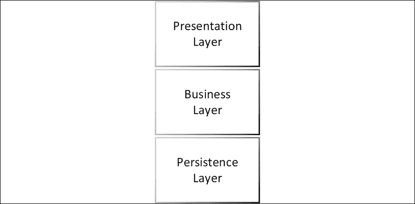

图 1.2：三层软件架构

表示层包含与用户界面（UI）相关的代码，业务层包含业务逻辑，持久层包含与数据存储相关的代码。我们的整体设计目标是追求架构组件之间的低耦合和高内聚。低耦合意味着这些层之间的代码片段不应相互依赖，并且应该是可以独立替换的。高内聚意味着相互关联的代码片段，如特定业务逻辑领域的代码，应该保持在一起。例如，当构建一个用于管理餐厅的应用程序时，预订系统的代码应该在一起，而不是分散在其他系统如库存跟踪或用户管理中。现代网络开发比基本的三层应用有更多的组成部分。下面的图显示了围绕表示层、业务层和持久层的附加层：

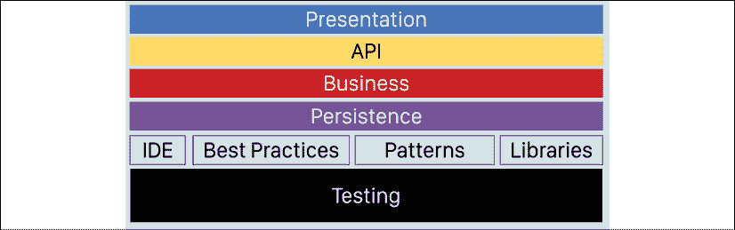

图 1.3：现代网络架构

在前面的图中，你可以看到一个扩展的架构图，它包括了现代网络开发的基本组件，这些组件包括一个通常在表示层和业务层之间转换数据的 API 层，一个定义了用于开发软件的各种方法的工具和最佳实践层，以及一个在当今迭代和快速发展的开发周期中至关重要的自动化测试层。

在 2000 年代，许多互联网公司依赖于服务器端渲染的网页。服务器动态创建渲染页面所需的全部 HTML、CSS 和数据。浏览器充当了一个被美化的查看器，用于显示结果。以下是一个显示 ASP.NET MVC 堆栈中服务器端渲染的 Web 应用程序的样本架构概述的图：

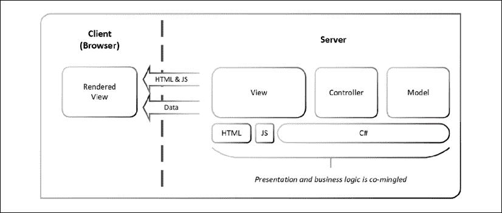

图 1.4：服务器端渲染的 MVC 架构

**模型-视图-控制器**（**MVC**）是一种典型的代码模式，其中模型包含数据操作逻辑，控制器包含业务逻辑，视图包含表示逻辑。在 ASP.NET MVC 的情况下，控制器和模型使用 C#编写，视图使用 HTML、JavaScript 和 C#的模板版本创建。结果是浏览器接收到了所需的 HTML、JavaScript 和数据，通过 jQuery 和 AJAX 的魔法，网页看起来像是交互式的。服务器端渲染和 MVC 模式至今仍然流行并被使用。有一些合理的利基用途，例如 Facebook.com。Facebook 服务于从非常慢到非常快的数十亿设备。没有服务器端渲染，Facebook 无法保证其用户群的一致的**用户体验**（**UX**）。我发现服务器端渲染和 MVC 的结合是一个复杂的模式来实现。为了确保组件的低耦合，工程团队中的每个成员都必须非常经验丰富。高比例高级开发者的团队很难找到，这还是一种轻描淡写。

进一步复杂化问题的是，C#（或任何其他服务器端语言）不能在浏览器中本地运行。因此，从事服务器端渲染应用开发的开发者必须同样擅长使用前端和后端技术。在不经意间，缺乏经验的开发者很容易在实现中将表示层和业务逻辑混合在一起。当这种情况发生时，原本运行良好的系统的必然的 UI 现代化变得不可能。用另一种说法，如果你想更换厨房里的水槽，你必须翻新整个厨房。由于架构不足，组织通常每隔十年就要花费数百万美元来编写和重写相同的应用程序。

在 2000 年代，使用 Java Applets、Flash 或 Silverlight 可以构建与服务器 API 解耦的丰富 Web 应用程序。然而，这些技术依赖于需要单独安装的浏览器插件。通常，这些插件过时了，创造了关键的安全漏洞，并且在移动计算机上消耗了过多的电力。2008 年 iPhone 革命之后，很清楚这样的插件不会在手机上运行，尽管 Android 操作系统做出了最好的努力。此外，苹果公司 CEO 史蒂夫·乔布斯对这种不优雅的解决方案的厌恶标志着在浏览器中支持此类技术的终结的开始。

在 2010 年代初，像 Backbone 和 AngularJS 这样的框架开始出现，展示了如何以原生感觉和速度构建丰富的 Web 应用程序，并以看似成本效益的方式实现。下述图展示了具有 **模型-视图-视图模型**（**MVVM**）客户端和 **表示状态转换**（**REST**）API 的图。当我们通过 API 将客户端从服务器解耦时，我们可以在架构上强制实施展示逻辑和业务逻辑的分离实现。从理论上讲，这种 RESTful Web 服务模式应该允许我们频繁地替换水槽，而无需重新设计整个厨房。

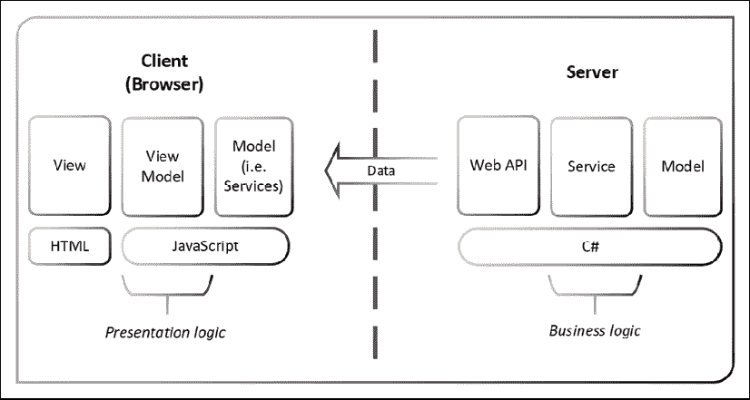

图 1.5：富客户端解耦 MVVM 架构

观察前一个图中的框的数量几乎翻倍。仅仅因为我们把客户端和服务器分离开来，并不意味着我们最终简化了架构。实际上，围绕展示逻辑的架构变得更加复杂。客户端和服务器都必须实现它们的展示/API、业务和持久化层。

不幸的是，许多利用 Backbone 和 AngularJS 等框架的早期开发工作因为未能正确实现客户端架构而失败。

这些早期的开发工作也受到了设计不良的 RESTful Web API 的影响。大多数 API 没有对它们的 URI 进行版本控制，这使得在支持现有客户端的同时引入新功能变得非常困难。此外，API 通常返回复杂的数据模型，将它们的内部关系数据模型暴露给 Web 应用程序。这种设计缺陷在用 HTML 编写的看似无关的组件/视图和用 SQL 创建的模型之间创建了一个紧密的耦合。如果你不实现额外的代码层来转换或映射数据结构，那么你将在无意中创建一个层与层之间的非故意和不受控制的耦合。随着时间的推移，处理这种耦合会变得非常昂贵，在大多数情况下需要重大的重写。

今天，我们使用 API 层在将其发送到客户端之前简化数据模型，以避免这些问题。像 GraphQL 这样的新技术更进一步，通过暴露一个定义良好的数据模型并让消费者查询所需的确切数据，从而优化了 HTTP 请求的数量和通过线缆传输的数据量。使用 GraphQL，开发者无需创建许多专门的 API，就能实现最优的 HTTP 请求数量和数据传输量。

Backbone 和 AngularJS 证明了在浏览器中创建原生运行的 Web 应用程序是可行的。当时所有的 SPA 框架都依赖于 jQuery 进行 DOM 操作。同时，Web 标准也在不断演进，支持新标准的永续浏览器开始变得普遍。然而，变化是永恒的，Web 技术的演进使得第一代 SPA 框架的优雅演进变得不可持续。

新一代的 Web 框架需要解决许多问题；它们需要强制实施良好的架构；设计为与 Web 标准一起演进；并且稳定且可扩展以满足企业需求，而不会崩溃。此外，这些新框架需要获得开发者的认可，因为开发者对生态系统中的太多快速变化感到疲惫。记住，不快乐的开发者不会创造成功的业务。实现这些目标需要与过去彻底决裂，因此 Angular 和 React 作为平台以不同的方式解决了过去的问题。

# Angular 简介

Angular 是由 Google 和一群开发者维护的开源项目。新的 Angular 平台与您过去可能使用过的传统框架大相径庭。在与微软合作的过程中，Google 将 TypeScript 定为 Angular 的默认语言。TypeScript 是 JavaScript 的超集，它使开发者能够针对旧版浏览器，如 Internet Explorer 11，同时允许他们编写在现代浏览器（如 Chrome、Firefox 和 Edge）上运行的现代 JavaScript 代码。Angular 的旧版本，版本号在 1.x.x 范围内，被称为 AngularJS。2.0.0 版本及更高版本被称为 Angular。AngularJS 是一个单体 JavaScript 单页应用（SPA）框架，而 Angular 是一个能够针对浏览器、混合移动框架、桌面应用程序和服务器端渲染视图的平台。

升级到新的 AngularJS 是有风险且昂贵的，因为即使是微小的更新也引入了新的编码模式和实验性功能。每次更新都引入了弃用或旧功能的重构，这需要重写大量代码。此外，更新以不确定的间隔交付，使得团队无法规划资源以升级到新版本。发布方法最终导致了一个不可预测、不断演变的框架，似乎没有任何指导之手来推动代码库的发展。如果您使用了 AngularJS，您可能被困在特定版本上，因为您的代码库的特定架构使得迁移到新版本非常困难。2018 年，Angular 团队发布了 AngularJS 的最后一个主要更新，版本号为 1.7。这次发布标志着旧框架的终结的开始，预计在 2021 年 7 月停止使用。

Angular 在各个方面都优于 AngularJS。该平台遵循`semver.org/`中定义的 semver 规范，其中次要版本的增加表示新功能添加和为下一个主要版本的潜在弃用通知，但没有破坏性变更。此外，谷歌的 Angular 团队承诺采用确定性的发布计划，每 6 个月发布一个主要版本。在此 6 个月的开发窗口之后，从 Angular 4 开始，所有主要版本都将获得 LTS 支持，包括额外的 12 个月的错误修复和安全补丁。从发布到生命周期的结束，每个主要版本都将接收为期 18 个月的更新。请参考以下图表，了解 AngularJS 和 Angular 的预期发布和支持计划：

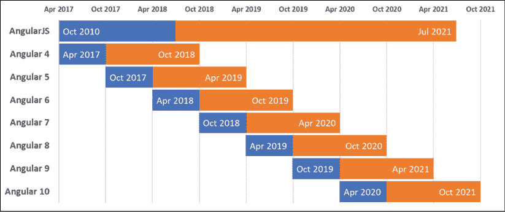

图 1.6：Angular 的预期发布和支持计划

那么，这对你们意味着什么呢？你可以确信，即使你不对它做出任何更改，你的 Angular 代码在约 24 个月的时间内也将得到支持和向后兼容。所以，如果你在 2020 年 2 月编写了一个版本 9 的 Angular 应用，你的代码与 Angular 10 具有运行时兼容性，并将得到支持直到 2021 年 10 月。要将你的 Angular 9 代码升级到 Angular 11，你需要确保你没有使用 Angular 10 中收到弃用通知的任何弃用 API。

在实践中，大多数弃用都是微小的，并且重构起来很简单。除非你正在使用为高度专业化的用户体验的低级 API，否则更新你的代码库所需的时间和精力应该是微不足道的。然而，这是谷歌做出的承诺，而不是合同。Angular 团队有重大动力确保向后兼容性，因为谷歌在组织内部运行着大约 1,000 多个 Angular 应用，任何时候只有一个版本的 Angular 处于活跃状态。因此，在你阅读这篇文章的时候，谷歌的所有 1,000 多个应用都将运行在 Angular 的最新版本上。

你可能会认为谷歌有无限的资源来定期更新数千个应用。像任何组织一样，谷歌的资源也是有限的，并不是每个应用都有专门的团队进行积极维护。因此，Angular 团队必须通过自动化测试确保兼容性，并尽可能使未来的主要版本升级过程变得无痛。在 Angular 6 中，通过引入`ng update`，更新过程变得更加简单。

Angular 团队通过引入自动化的 CLI 工具不断改进其发布流程，使得弃用功能的升级基本上是自动化的、合理的努力。这种策略的好处由法国航空和荷兰皇家航空所证明，他们能够将 Angular 2 中的升级时间从 30 天减少到 Angular 7 中的 1 天。

可预测且得到良好支持的升级过程对开发者和组织来说都是好消息。你不必永远停留在 Angular 的遗留版本上，你可以计划和分配必要的资源，以保持你的应用程序向未来迁移，而无需昂贵的重写。正如我在 2017 年的一篇博客文章中写的，《Angular 4 的最佳新特性》在 `bit.ly/NgBestFeature`，信息很明确：

> **对于开发者和管理者**：Angular 将会持续存在，因此你应该投入你的时间、注意力和金钱来学习它——即使你现在可能对其他框架情有独钟。
> 
> **对于决策者（CIO、CTO 等等）**：计划在接下来的 6 个月内开始过渡到 Angular。这将是一项你可以向商业人士解释的投资，你的投资将在未来多年带来回报，即使是在初始 LTS 窗口到期后，也有优雅的升级路径到 Angular vNext 以及更远。

那么，为什么 Google（Angular）和 Microsoft（TypeScript 和 Visual Studio Code）会免费提供这样的技术？有多个原因：

+   一个使开发 Web 应用程序变得容易的复杂框架，是技术实力的展示，它保留并吸引开发者人才。

+   开源框架能够以规模的方式验证和调试新想法和工具，拥有数百万的开发者。

+   允许开发者更快地创建出色的 Web 体验，最终为 Google 和 Microsoft 带来更多商业机会。

我在这里看不到任何恶意意图，并欢迎开放、成熟和高品质的工具，如果需要，我可以对其进行调整以满足我的意愿。不必为专有技术的支持合同付费是一个受欢迎的额外好处。

小心，在网上寻找 Angular 帮助可能会很棘手。你会注意到，有时 Angular 被称为 Angular 2 或 Angular 4。有时，Angular 和 AngularJS 都被称为 AngularJS。这是不正确的。Angular 的文档位于 [angular.io](https://angular.io/guide/releases) 上。如果你访问了 [angularjs.org](https://angularjs.org)，你将阅读关于遗留的 AngularJS 框架的内容。

要了解即将发布的 Angular 版本的最新更新，请查看官方发布计划 [`angular.io/guide/releases`](https://angular.io/guide/releases)。

## Angular 的理念

你的时间是宝贵的，你的幸福至关重要，因此你必须谨慎选择投入时间的科技。考虑到这一点，我们需要回答为什么学习 Angular，而不是 React、Vue 或其他框架？Angular 是一个很好的框架开始学习。该框架和工具可以帮助你快速起步，并凭借充满活力的社区和高质量的 UI 库继续成功，这些库可以帮助你交付卓越的 Web 应用程序。React 和 Vue 也是很好的框架，各有其优势和劣势。每个工具都有其位置和目的。

在某些情况下，React 是项目的正确选择，而在其他情况下，Vue 才是正确的选择。无论如何，对其他 Web 框架的熟练掌握只能有助于进一步加深你对 Angular 的理解，并使你成为一个更好的开发者。像 Backbone 和 AngularJS 这样的单页应用（SPAs）在 2012 年引起了我的极大关注，当时我意识到解耦前端和后端关注点的重要性。服务器端渲染的模板几乎无法维护，并且是许多昂贵的软件系统重写的根本原因。如果你关心创建可维护的软件，那么你必须遵守首要指令；将业务逻辑实现保持在 API 解耦于 UI 中实现的表现逻辑之后。

Angular 优雅地符合帕累托原则或 80-20 规则。它已经成为一个成熟且不断发展的平台，让你只需付出 20% 的努力就能完成 80% 的工作。正如前文所述，每个主要版本都支持 18 个月，创造了一个持续的学习、保持更新和废弃旧特性的连续体。从全栈开发者的角度来看，这个连续体是无价的，因为你的技能和培训将在未来许多年里保持相关和新鲜。

Angular 的哲学是在配置和惯例之间偏向配置。基于惯例的框架，尽管从外表上看可能很优雅，但对于新手来说，学习框架会变得困难。然而，基于配置的框架旨在通过显式配置和钩子来揭示其内部工作原理，你可以将自定义行为附加到框架上。本质上，AngularJS 有很多魔法，可能会让人困惑、不可预测，且难以调试，而 Angular 则试图避免这些魔法。

配置优于惯例导致代码冗长。冗长是好事。简洁的代码是可维护性的敌人，只对原始作者有利。正如 Andy Hunt 和 David Thomas 在《实用程序员》一书中所说：

> 记住，你（以及你之后的人）将多次阅读代码，但只编写它几次。

此外，Andy Hunt 的“设计法则”规定：

> 如果你不能轻松地移除每一部分，那么设计就是失败的。

冗长、解耦、凝聚和封装的代码是确保代码未来兼容性的关键。Angular 通过其各种机制，使这些概念得到适当的执行。它摒弃了许多 AngularJS 中发明的自定义惯例，如 `ng-click`，并引入了一种更自然的语言，它建立在现有的 HTML 元素和属性之上。因此，`ng-click` 变成了 `(click)`，扩展了 HTML 而不是取代它。

接下来，我们将介绍 Angular 的持续更新心态和响应式编程范式，这些都是 Angular 初始哲学的最新扩展。

## Angular 持续更新

当你在学习 Angular 时，你不仅仅是在学习 Angular 的一个特定版本，而是在学习一个不断发展的平台。自从最初的草案以来，我设计这本书时，就有一个想法，那就是淡化你所使用的 Angular 的具体版本。Angular 团队支持这个想法。多年来，我与 Angular 团队和社区内的思想领袖进行了许多对话，并听了许多演讲。因此，我可以肯定地说，你可以依赖 Angular 作为一个成熟的 Web 开发平台。Angular 经常更新，并非常关注向后兼容性。此外，任何由于新版本而变得不兼容的代码，都会在自动化工具的帮助下或通过 update.angular.io 上的明确指导来更新代码，这样你就不会感到困惑或在网上寻找答案。Angular 团队致力于确保你——开发者——拥有最佳的 Web 开发体验。

为了将这个想法突出给开发者，我和几位同事一起开发和发布了名为 Angular Evergreen 的 Visual Studio Code 扩展。

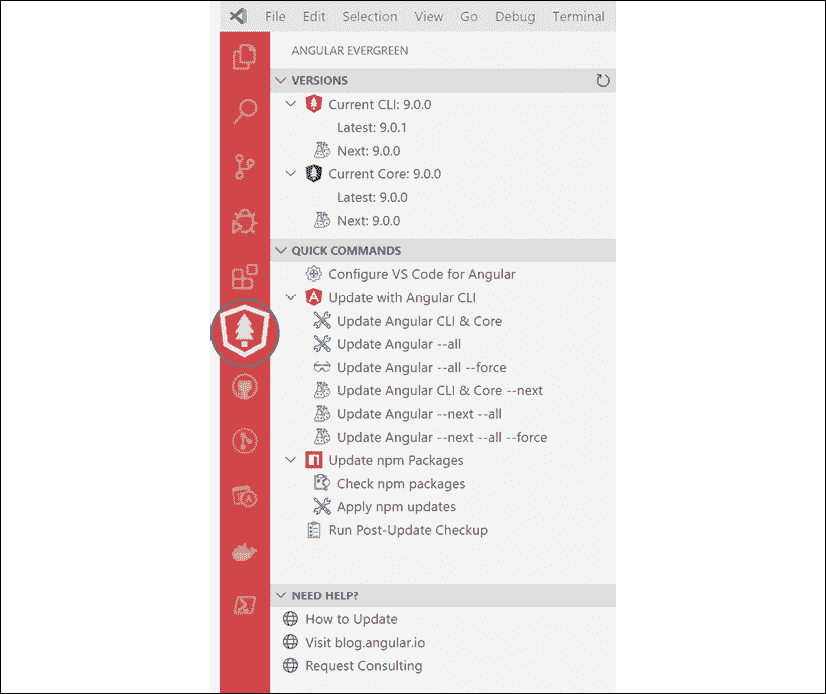

图 1.7：Angular Evergreen VS Code 扩展

此扩展检测您当前的 Angular 版本，并将其与 Angular 的最新和下一个版本进行比较。标记为“下一个”的版本是为早期采用者和测试代码与即将推出的 Angular 版本兼容性而设计的。请不要在生产部署中使用标记为“下一个”的版本。

在 Angular Evergreen 扩展中查找更多信息、功能请求和错误报告，请访问`AngularEvergreen.com`。

Angular 的一个关键组件是 TypeScript，它允许平台保持始终如一。TypeScript 允许高效地实现新功能，同时为旧浏览器提供支持，这样你的代码就可以触及尽可能广泛的受众。

## TypeScript

Angular 使用 TypeScript 进行编码。TypeScript 是由微软的 Anders Hejlsberg 创建的，旨在解决在企业规模上应用 JavaScript 时遇到的一些主要问题。

Anders Hejlsberg 是 Turbo Pascal 和 C#的创造者，同时也是 Delphi 的首席架构师。Anders 设计了 C#，使其成为一个开发者友好的语言，它建立在 C 和 C++熟悉的语法之上。因此，C#成为了微软流行的.NET Framework 背后的语言。TypeScript 与 Turbo Pascal 和 C#有着相似的血统和理念，这使得它们取得了巨大的成功。

JavaScript 是一种动态解释语言，你编写的代码在运行时被浏览器解析和理解。像 Java 或 C#这样的静态类型语言有一个额外的编译步骤，编译器可以在编译时捕获编程和逻辑错误。与运行时相比，在编译时检测和修复错误要便宜得多。TypeScript 通过向语言引入类型和泛型，将静态类型语言的优点带到了 JavaScript。然而，TypeScript 不包括编译步骤，而是包括转译步骤。编译器将代码编译成机器语言（使用 C/C++）或 Java 或 C#的**中间语言**（**IL**）。然而，转译器只是将代码从一种方言翻译成另一种方言。因此，当 TypeScript 代码被构建、编译或转译时，结果是纯 JavaScript。

JavaScript 的官方名称是 ECMAScript。该语言的功能集和语法由 ECMA 技术委员会 39 或简称 TC39 维护。

转译还有一个重要的好处。将 TypeScript 转换为 JavaScript 的同一种工具可以用来用新的语法重写 JavaScript，以便旧版浏览器可以解析和执行。在 1999 年至 2009 年之间，JavaScript 语言没有看到任何新特性。由于各种技术和政治原因，ECMAScript 放弃了版本 4。从 ES5 的引入开始，然后是 ES2015（也称为 ES6），浏览器供应商一直在努力在其浏览器中实现新的 JavaScript 特性。因此，这些新特性的用户采用率一直很低。然而，这些新特性意味着开发者可以更高效地编写代码。这创造了一个被称为 JavaScript 特性差距的差距，如下面的图形所示：

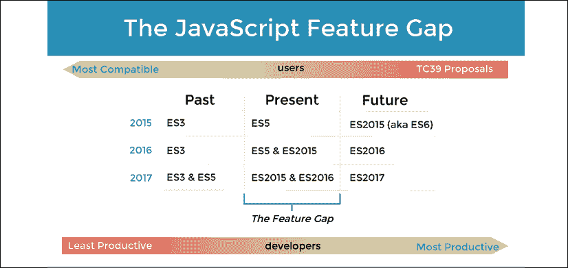

图 1.8：JavaScript 特性差距

JavaScript 特性差距是一个滑动差距，因为 TC39 已经承诺每年更新 JavaScript。因此，TypeScript 代表了 JavaScript 的过去、现在和未来。你可以使用今天的 JavaScript 的未来特性，同时仍然能够针对旧版浏览器，以最大化你能够触及的受众。

现在，让我们来探讨 Angular 的底层架构。

## 基本 Angular 架构

Angular 遵循 MV*模式，这是 MVC 和 MVVM 模式的混合体。之前，我们讨论了 MVC 模式。从高层次来看，这两种模式的架构相对相似，如下面的图所示：

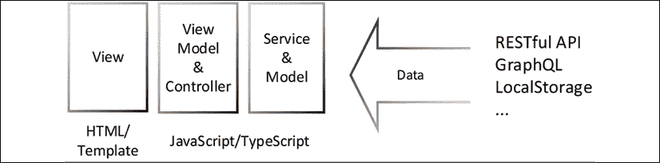

图 1.9：MV*架构

这里的新概念是 ViewModel，它代表了连接你的视图到你的模型或服务的粘合代码。在 Angular 中，这种粘合被称为绑定。与像 Backbone 或 React 这样的 MVC 框架必须调用`render`方法来处理它们的 HTML 模板不同，在 Angular 中，这个过程对开发者来说是无缝且透明的。绑定是区分 MVC 应用程序和 MVVM 应用程序的关键。

Angular 应用的最基本单元是一个组件。组件是由 TypeScript 编写的 JavaScript 类和由 HTML、CSS 和 TypeScript 编写的 Angular 模板的组合。通过绑定，类和模板就像拼图一样相互匹配，从而可以相互通信，如下面的图所示：

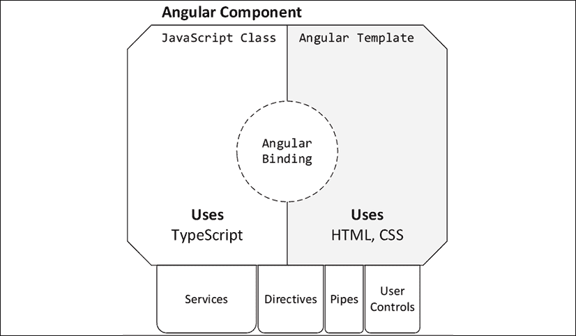

图 1.10：组件的解剖结构

类是面向对象编程（**OOP**）的结构。如果你投入时间去深入挖掘 OOP 范式，你将大大提高你对 Angular 工作原理的理解。OOP 范式允许在组件中**依赖注入**（**DI**）依赖的服务，这样你就可以进行 HTTP 调用或触发显示给用户的提示消息，而无需将这种逻辑拉入你的组件或复制你的代码。DI 使得开发者能够非常容易地使用许多相互依赖的服务，而无需担心这些对象从内存中实例化、初始化或销毁的顺序。

Angular 模板还允许通过指令、管道、用户控件和其他组件实现类似的代码重用。这些代码片段封装了高度交互的最终用户代码。这类交互代码通常很复杂且错综复杂，必须与业务逻辑或展示逻辑保持隔离，以保持代码的可维护性。

所有 Angular 组件、服务、指令、管道和用户控件都组织在模块下。每个 Angular 应用都通过一个根模块启动，该模块渲染你的第一个组件，并注入任何所需的服务，准备依赖项。你可以引入子模块以启用诸如懒加载等能力，这样你就不必一次性将你的 Web 应用的所有组件交付给浏览器。例如，没有管理员权限的用户发送管理员仪表板的代码是没有用的。

Angular 大量使用了 RxJS 库，这为 Angular 引入了响应式开发模式，而不是更传统的命令式开发模式。

# 响应式开发范式

Angular 支持多种编程风格。多种编程风格是它对具有不同背景的程序员友好的一大原因。无论你是来自面向对象编程的背景，还是你是一个坚定的函数式编程信徒，你都可以使用 Angular 构建可行的应用。在*第三章*，*创建基本的 Angular 应用*中，你将开始利用响应式编程概念来构建 LocalCast 天气应用。

作为程序员，你很可能习惯于命令式编程。命令式编程是指作为程序员的你编写顺序代码，描述必须按你定义的顺序执行的所有操作，以及你的应用程序的状态取决于正确设置的变量以确保正确运行。你编写循环、条件语句并调用函数；你触发事件并期望它们被处理。命令式和顺序逻辑是你习惯的编码方式。

反应式编程是函数式编程的一个子集。在函数式编程中，你不能依赖你之前设置的变量。你写的每个函数都必须独立站立，接收它自己的输入集并返回一个结果，而不受外部函数或类状态的任何影响。函数式编程很好地支持**测试驱动开发**（**TDD**），因为每个函数都是一个可以独立测试的单元。因此，你写的每个函数都变得可组合。所以，你可以混合、匹配和组合你写的任何函数，构建一系列调用，以产生你期望的结果。

反应式编程给函数式编程增添了新意。你不再处理纯逻辑，而是处理一个异步数据流，你可以使用一组可组合的函数将其塑造成你需要的任何形状。因此，当你订阅反应流中的事件时，你将你的编码范式从反应式编程转变为命令式编程。

在本书的后期，当实现 LocalCast 天气应用时，你将在`CurrentWeather`和`CitySearch`组件中利用`subscribe`的实际操作。

考虑以下例子，由迈克·皮尔逊在他的演示中恰如其分地提出

*思考反应式编程：最难的部分*，提供从水龙头获取热水的指令，以帮助理解命令式编程和反应式编程之间的区别：

| **从水龙头获取热水的指令** |
| --- |
|  | **命令式** | **反应式** |
| 0 | 初始状态：水是关闭的 | 初始状态：水是关闭的 |
| 1 | 拿起水管 | 打开热水龙头 |
| 2 | 将水喷入加热器 |  |
| 3 | 打开热水龙头 |  |
| 4 | 向公用事业公司发送短信以获取燃气 |  |
| 5 | 等待热水 |  |
| 6 | 撤销你的步骤以恢复初始状态 | 撤销你的步骤以恢复初始状态 |

如您所见，在命令式编程中，您必须定义代码执行的每一步。每一步都依赖于前一步，这意味着您必须考虑环境的状态以确保操作成功。在这样的环境中，很容易忘记一个步骤，而且很难测试每个单独步骤的正确性。在函数式反应式编程中，您与异步数据流一起工作，从而产生一个无状态的流程，易于与其他操作组合。

RxJS 是使您能够在响应式范式下实现代码的库。

## RxJS

RxJS 代表响应式扩展，这是一个模块化库，它使响应式编程成为可能，响应式编程本身是一种异步编程范式，允许通过转换、过滤和控制函数来操作数据流。您可以将响应式编程视为基于事件编程的进化。

## 响应式数据流

在事件驱动编程中，您会定义一个事件处理程序并将其附加到事件源。更具体地说，如果您有一个**保存**按钮，它公开了一个`onClick`事件，您将实现一个`confirmSave`函数，当它被触发时，会显示一个弹出窗口询问用户**您确定吗**？查看以下图表以了解此过程的可视化。

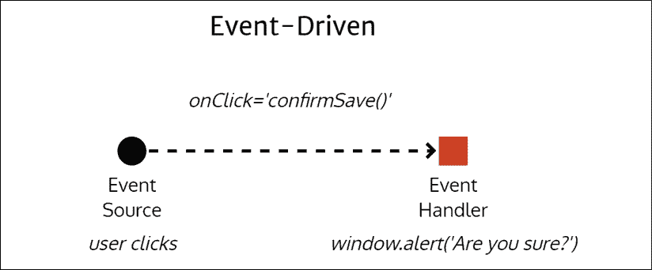

图 1.11：事件驱动实现

简而言之，您会有一个事件在每次用户操作时触发。如果用户多次点击**保存**按钮，这个模式将乐意渲染与点击次数一样多的弹出窗口，这并没有太多意义。

发布/订阅（pub/sub）模式是另一种类型的事件驱动编程。在这种情况下，我们可以为给定事件的每个结果编写多个处理程序，同时对其执行操作。假设您的应用程序刚刚接收了一些更新数据。发布者会遍历其订阅者列表，并将更新数据传递给每个订阅者。

参考以下图表了解更新数据事件如何触发多个函数：

+   一个`updateCache`函数使用新数据更新您的本地缓存

+   一个`fetchDetails`函数从服务器检索有关数据的更多详细信息

+   一个`showToastMessage`函数通知用户应用程序刚刚接收了新数据

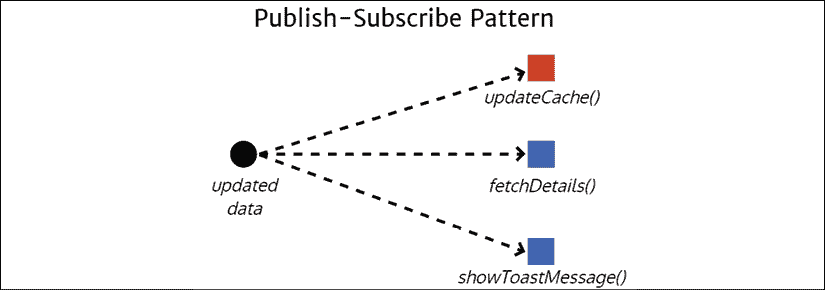

图 1.12：发布/订阅模式实现

所有这些事件都可以异步发生；然而，`fetchDetails`和`showToastMessage`函数将接收比它们所需更多的数据，尝试以不同的方式组合这些事件来修改应用程序行为可能会变得复杂。

在响应式编程中，一切都被视为流。一个流将包含随时间发生的事件，这些事件可以包含一些数据或没有数据。以下图表展示了您的应用程序正在监听用户鼠标点击的场景。未经控制的用户点击流是没有意义的。您可以通过应用`throttle`函数来对此流施加一些控制，这样您每 250 毫秒（**ms**）才收到一次更新。如果您订阅这个新事件，每 250 毫秒，您将收到一个点击事件的列表。您可能试图从每个点击事件中提取一些数据，但在这个情况下，您只对发生的点击事件数量感兴趣。我们可以使用`map`函数将原始事件数据塑造成点击次数。

在流进一步下游的地方，我们可能只对监听包含两个或更多点击的事件感兴趣，因此我们可以使用 `filter` 函数只对本质上是一个双击事件进行操作。每次我们的过滤事件触发时，都意味着用户意图进行双击，你可以通过弹出警告来对此信息采取行动。

流的真正力量在于你可以选择在任何时候对事件进行操作，当它通过各种控制、转换和过滤函数时。你可以选择使用 `*ngFor` 和 Angular 的 `async` 管道在 HTML 列表中显示点击数据，这样用户就可以每 250 毫秒监控被捕获的点击数据类型。

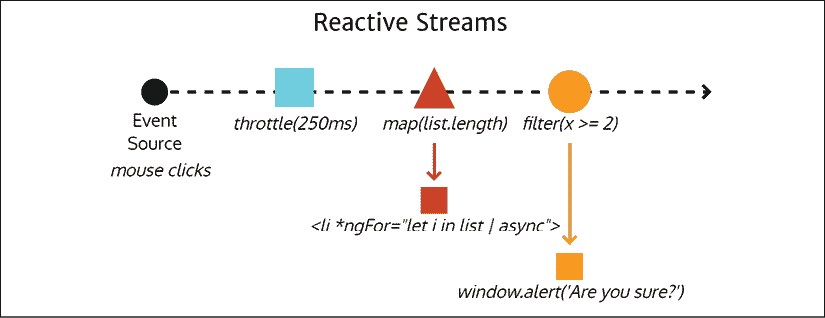

图 1.13：响应式数据流实现

现在，让我们考虑一些更高级的 Angular 架构模式。

# 高级 Angular 架构

如前所述，在 *基本 Angular 架构* 部分，Angular 组件、服务和依赖项被组织到模块中。Angular 应用程序通过其根模块启动，如下面的图所示：

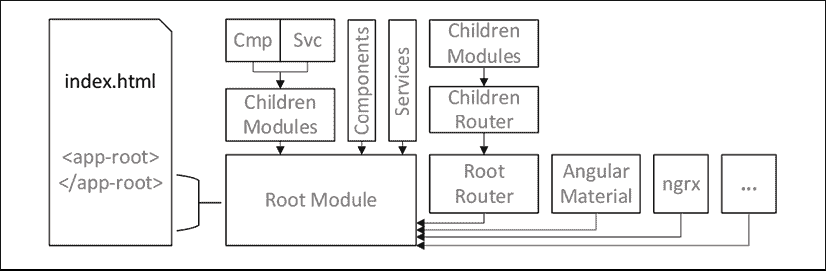

图 1.14：显示主要架构元素的 Angular 启动过程

根模块可以导入其他模块，并声明组件和提供服务。随着你的应用程序增长，你需要创建包含其组件和服务的子模块。以这种方式组织你的应用程序允许你实现懒加载，这样你可以控制应用程序的哪些部分被发送到浏览器以及何时发送。随着你向应用程序添加更多功能，你会从其他库（如 Angular Material 或 NgRx）导入模块。你实现路由器以在组件之间提供丰富的导航体验，允许你的路由配置编排组件的创建。

*第七章*，*创建以路由器为第一线的业务应用程序*，介绍了以路由器为第一线的架构，我鼓励你通过提前创建所有路由来开始你的应用程序开发。

在 Angular 中，服务默认以单例的形式提供给模块。你会很快习惯这种行为。然而，你必须记住，如果你在多个模块中提供相同的服务，那么每个模块都有自己的服务实例。在认证服务的情况下，我们希望在整个应用程序中只有一个实例，你必须小心只在该根模块级别提供认证服务的实例。你应用程序根级别提供的任何服务、组件或模块都将在功能模块中可用。

除了模块之外，路由器是你在 Angular 中必须掌握的下一个最强大的技术。

## Angular 路由器

`@angular/router` 包中提供的 Angular Router 是构建**单页应用**（**SPAs**）的核心和关键部分，这些应用的行为和表现就像易于使用浏览器控件或缩放或微缩控件导航的常规网站。

Angular Router 具有诸如懒加载、路由出口、辅助路由、智能活动链接跟踪以及能够以 `href` 的形式表达等高级功能，这使能够利用无状态的、数据驱动的组件的 Router-first 应用架构变得高度灵活，这些组件使用 RxJS 的 `BehaviorSubject`。

大型团队可以在单个代码库上工作，每个团队负责一个模块的开发，而不会相互干扰，同时实现易于的持续集成。谷歌拥有数亿行代码，之所以在单个代码库上工作，是因为事后集成成本非常高。

小型团队可以即时混搭他们的 UI 布局以快速响应变化，而无需重构他们的代码。很容易低估由于布局或导航的后期更改而浪费的时间。对于大型团队来说，这些变化更容易吸收，但对于小型团队来说，这是一项代价高昂的努力。

考虑以下图表，其中 `app.ts` 包含模块。它有一个 `rootRouter`；组件 `a`、`master`、`detail` 和 `c`；`services`；`pipes`；以及为其提供和声明的 `directives`。当用户首次导航到您的应用时，所有这些组件都将被浏览器解析和急切加载。

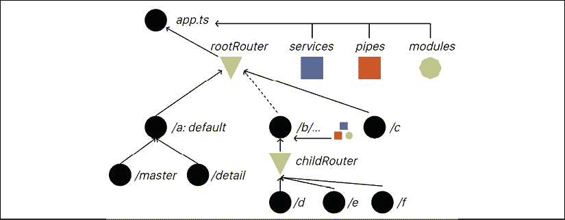

图 1.15：Angular 架构

如果您要实现一个懒加载的路由 `/b`，您需要创建一个名为 `b` 的功能模块，它将有自己的 `childRouter`；组件 `d`、`e` 和 `f`；`services`；`pipes`；以及为其提供和声明的 `directives`。在编译时，Angular 将将这些组件打包到单独的文件或包中，并且这个包只有在用户导航到 `/b` 下的路径时才会被下载、解析和加载。

让我们更详细地了解一下懒加载。

## 懒加载

连接 `/b/...` 到 `rootRouter` 的虚线线表示了懒加载的工作原理。懒加载允许开发者快速实现亚秒级的首次有意义的绘制。通过延迟加载额外的模块，我们可以将发送到浏览器的包大小保持在最小。模块的大小影响下载和加载速度，因为浏览器需要执行的操作越多，用户看到应用首屏的时间就越长。通过定义懒加载的模块，每个模块都作为单独的文件打包，可以单独下载和按需加载。

Angular Router 提供了智能活动链接跟踪，这导致了更优越的开发者和用户体验，使得实现高亮功能以指示用户当前活动标签或应用程序部分变得非常容易。辅助路由最大化了组件的重用，并有助于轻松完成复杂的状态转换。使用辅助路由，您可以使用单个外部模板渲染多个主视图和详细视图。您还可以控制路由在浏览器 URL 栏中的显示方式，并在模板中使用`routerLink`，在代码中使用`Router.navigate`来驱动复杂的场景。

在*第七章*，*创建以路由为第一线的业务应用程序*中，我介绍了实现路由基础，而高级食谱则在*第十一章*，*食谱 – 可重用性、路由和缓存*中介绍。

除了路由之外，如果你想要构建复杂的 Angular 应用程序，掌握状态管理是另一个关键概念。

## 状态管理

每个 Angular 组件和服务都有一个类作为后盾。当实例化时，类成为内存中的对象。当你与对象一起工作时，如果你在对象属性中存储值，那么你就在你的 Angular 应用程序中引入了状态。如果未管理，状态就会成为应用程序成功和可维护性的重大负担。

我既喜欢后端也喜欢前端的无状态设计。从我的角度来看，状态是邪恶的，你应该仔细注意不要将状态引入你的代码中。之前，我们讨论了 Angular 中的服务默认是单例的。这是一个引入状态到应用程序的糟糕机会。你必须避免在服务中存储信息。在*第七章*，*创建以路由为第一线的业务应用程序*中，我向您介绍了 BehaviorSubjects，它们作为应用程序的数据锚点。在这种情况下，我们将这些锚点存储在服务中，以便它们可以在组件之间共享以同步数据。

在 Angular 组件中，类是一个 ViewModel，充当你的代码和模板之间的粘合代码。与服务相比，组件相对较短命，在这种情况下使用对象属性是可以的。

然而，除了设计之外，还有特定的用例需要引入鲁棒机制来维护应用程序中的复杂数据模型状态。渐进式 Web 应用程序和移动应用程序就是其中一种用例，在这些用例中，连接性无法保证。在这些情况下，能够保存和恢复应用程序的整个状态是提供出色的**用户体验**（UX）的必要条件。

Angular 的 NgRx 库利用 Flux 模式来实现应用的高级状态管理。在 *第六章*，*表单、可观察对象和主题* 和 *第十二章*，*食谱 – 主/详细、数据表和 NgRx* 中，我提供了使用 NgRx 的各种功能的替代实现，以展示与更轻量级方法之间的实现差异。

### Flux 模式

Flux 是由 Facebook 创建的应用架构，用于帮助构建客户端 Web 应用。Flux 模式定义了一系列组件，这些组件通过触发/处理动作的派发器和从存储中读取值的视图函数来管理存储应用程序的状态。使用 Flux 模式，你将应用程序的状态保存在存储中，存储的访问只能通过定义良好且解耦的函数进行，从而实现了一种可扩展的架构，因为解耦的函数在隔离状态下易于推理和编写自动单元测试。

考虑以下图表来理解这些组件之间的信息流：

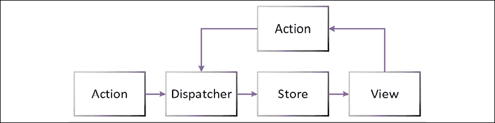

图 1.16：NgRx 数据流

NgRx 使用 RxJS 在 Angular 中实现 Flux 模式。

### NgRx

NgRx 库将基于 RxJS 的类似 Redux（一个流行的 React.js 库）的响应式状态管理引入 Angular。使用 NgRx 进行状态管理允许开发者编写原子化、自包含且可组合的代码片段，创建动作、还原器和选择器。这种响应式编程允许在状态变化中隔离副作用，并且与 React.js 的一般编码模式感觉非常契合。NgRx 最终在 RxJS 等复杂和高级工具之上创建了一个抽象层。

有许多使用 NgRx 的优秀理由，例如，如果你处理应用中的 3+ 个输入流。在这种情况下，处理这么多事件的负担使得引入新的编码范式到你的项目中变得值得。然而，大多数应用只有两个输入流：REST API 和用户输入。在更小的程度上，如果你正在编写离线优先的 **渐进式 Web 应用**（**PWAs**），你可能需要持久化复杂的状态信息，或者设计具有类似需求的专业企业应用，那么 NgRx 可能是有意义的。

这里是 NgRx 的架构概述：

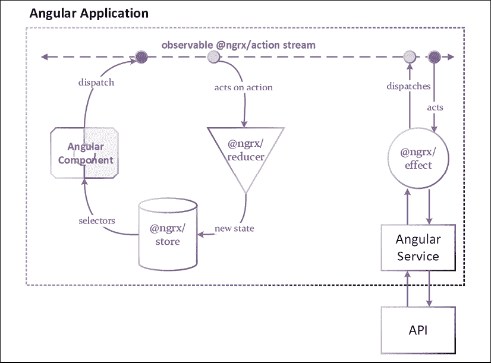

将图表的顶部视为可观察的动作流，动作可以像圆圈所示那样被分发和执行。效果和组件可以分发动作。还原器和效果可以对这些动作进行操作，要么将值存储在存储中，要么触发与服务器的交互。选择器被组件用来从存储中读取值。

考虑到我对于最小化工具的积极态度，以及对 NgRx 在之前提到的利基受众之外没有明确必要性的看法，我不建议将 NgRx 作为默认选择。RxJS/BehaviorSubjects 功能强大且足够，可以解锁复杂和可扩展的模式，帮助你构建出色的 Angular 应用程序，正如在通向*第十二章*、*食谱 – 主/详细、数据表和 NgRx*的章节中所展示的那样。

你可以在`ngrx.io`了解更多关于 NgRx 的信息。

## React.js 架构

与 Angular 不同，React.js 作为一个整体实现了 Flux 模式。以下是一个以路由为中心的 React 应用程序视图，其中组件/容器和提供者以严格的树状结构表示。

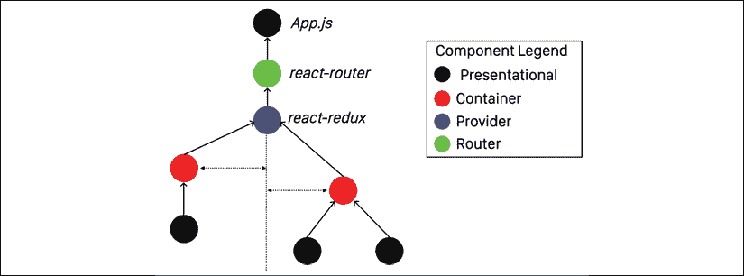

图 1.18：React.js 架构概述

在 React 的早期版本中，为了使最基本的功能正常工作，必须费力地将值在组件的继承树中上下传递。后来，引入了 react-redux，因此每个组件都可以直接读取/写入值到存储中，而无需遍历整个树。

这个基本的概述应该能让你对 Angular 和 React 之间的重要架构差异有一个大致的了解。然而，请记住，就像 Angular 一样，React、其社区、模式和最佳实践都在不断发展和完善。

你可以在`reactjs.org`了解更多关于 React 的信息。

# 重要的 Angular 特性

特定的 Angular 版本引入了值得注意的变更，以推进平台的哲学思想，使其更加无缝和全面。我建议查看这些开创性发布所引入的独特变更。

## Angular 6

本书中的大部分内容、模式和最佳实践都与 Angular 4 及以上版本兼容。然而，Angular 6 是 Angular 的一个开创性发布，为平台带来了许多底层改进，以及整个生态系统在稳定性和凝聚力方面的提升。开发体验得到了极大的改善，额外的 CLI 工具使得更新包版本和加快构建时间变得更容易，从而改善了代码-构建-视图反馈周期。在 Angular 6 中，所有平台工具的版本都同步到 6.0，这使得理解生态系统变得更加容易。在下表中，你可以看到这如何使工具兼容性沟通变得更加容易：

|  | **之前** | **v6 版本** |
| --- | --- | --- |
| CLI | 1.7 | 6.0 |
| Angular | 5.2.10 | 6.0 |
| Material | 5.2.4 | 6.0 |

Angular CLI 6.0 带来了许多重大新功能，例如 `ng update` 和 `ng add` 命令；`ng update` 使得更新你的 Angular 版本、npm 依赖、RxJS 和 Angular Material 变得更加容易，包括一些确定性的代码重写能力，以将名称更改应用于 API 或函数。关于更新 Angular 版本的内容在 *附录 C*，*保持 Angular 和工具常青* 中进行了深入探讨。您可以从 `static.packt-cdn.com/downloads/9781838648800_Appendix_C_Keeping_Angular_and_Tools_Evergreen.pdf` 或 `expertlysimple.io/stay-evergreen` 在线找到这个附录。`ng add` 将方案支持引入到 Angular CLI 中。有了方案，你可以编写自定义代码来向 Angular 应用添加新功能，包括添加任何依赖项、样板配置代码或脚手架。一个很好的例子是通过执行 `ng add @angular/material` 来将 Angular Material 添加到你的项目中。关于将 Angular Material 添加到你的项目的内容在 *第五章*，*使用 Material 提供高质量 UX* 中进行了深入探讨。一个独立的 Material 更新工具旨在使 Angular Material 更新不那么痛苦，可以在 Github.com/angular/material-update-tool 找到，但请期待这个功能将合并到 `ng update` 中。进一步的方案可以为自己的 CLI 带来自己的 `generate` 命令，使你的生活更轻松，随着时间的推移，你的代码库更加一致。此外，webpack 的第 4 版被配置为将你的 Angular 应用程序构建成具有范围托管的小模块，缩短了应用程序的首次绘制时间。

Angular 6 的主要主题是底层的性能改进和自定义元素支持。第 6 版在基础包大小方面比 v5 版本提高了 12%，达到 65 KB，从快速的 3G 连接到光纤连接，将加载时间提高了惊人的 21-40%。随着你的应用程序的增长，Angular 利用更好的摇树技术进一步修剪最终交付物中的未使用代码。速度是 Angular 6 的一个 UX 特性。这是通过更好的 Angular **组件开发工具包**（**CDK**）、Angular Material、动画和 i18n 的支持来实现的。Angular Universal 允许服务器端辅助快速启动时间，Angular PWA 支持利用本地平台功能，如缓存和离线存储，因此，在后续访问中，你的应用程序保持快速。RxJS 6 的支持允许可摇动的管道命令，更频繁地减少包大小，并修复了我在 *第六章*，*表单、可观察对象和主题* 中警告你的 `throttle` 的行为，以及众多错误修复和性能改进。TypeScript 2.7 带来了更好的 JavaScript 包类型导入支持，以及在构建时捕获编码错误的更高级功能。

Angular Material 6 添加了新的用户控件，如树形控件和徽章，同时通过一系列错误修复、功能完整性和现有组件的主题化，使库变得更加稳定。Angular Flex Layout 6 引入了 polyfills，使 Internet Explorer 11 能够支持 CSS Flexbox。这使得使用 Material 和 Flex Layout 的 Angular 应用程序完全兼容最后一个主要遗留浏览器技术，尽管它在 2018 年 1 月与 Windows 8.1 一起停止了主流支持，并被 Microsoft Edge 取代了 18 次。Angular 6 本身可以通过 polyfills 配置为向下兼容到 IE9。这对于必须支持此类遗留浏览器并且仍然能够使用现代技术构建解决方案的开发者来说是个好消息。

一些令人兴奋的新辅助工具也被发布，以支持高频、高性能或大型企业用例。Angular 生态系统欢迎 NgRx 库的加入，它基于 RxJS 将 Redux-like 的响应式状态管理引入 Angular。由前 Angular 团队成员开发的 Nx CLI 工具为 Angular 带来了有观点的开发环境设置，适合需要确保环境一致性的顾问和大型组织。本书遵循类似的模式，旨在教育您建立一致的建筑和设计模式，以便应用于您的应用程序。Google 的 Bazel 构建工具支持增量构建，因此您的应用程序中未更改的部分不需要重新构建，大大提高了大型项目的构建时间，并允许 Angular 应用程序之间共享库的打包。

## Angular 8

如本书**前言**中所述，本书旨在与任何新的 Angular 版本有效。这是 Angular 团队所倡导的理念，他们希望淡化您当前使用的 Angular 特定版本，而不是专注于并投资于持续保持 Angular 每个小版本和主要版本的更新。Angular 团队投入了大量的精力和努力，以确保您编写的尽可能多的代码在 Angular 的性能和功能集随时间改进后仍然兼容。任何破坏性变更都由自动化工具支持，帮助您重写代码的部分，或者计划弃用，给您充足的时间逐步淘汰不受支持的代码。

Angular 7 为 TypeScript、RxJS 和 Node 带来了性能、可访问性和依赖性更新，以及 Angular Material 控件的重大更新和扩展；Angular 8 延续了这一趋势。Angular 8 引入了差异加载和对于 evergreen 浏览器的最小 polyfills 支持，节省了发送到客户端的负载的 7-20%。

## Angular 9

Angular 9 及其随后的 9.1 更新通过提供 Ivy 渲染引擎和 TypeScript 3.8 支持，为框架带来了迄今为止最重要的更新。这次更新解决了大量技术债务，带来了 100 个错误修复和功能，并大大扩展了框架的自动化测试覆盖率。Ivy 渲染引擎使得应用程序的包大小更小，加载速度更快。此外，Angular 9.1 带来了 40% 的更快构建时间，40-50% 的改进单元测试运行时间，以及更好的调试能力，具有更简单的堆栈跟踪和模板绑定。TypeScript 3.8 带来了新的语法优势，如可选链和空值合并运算符，这使得在 Angular 的严格模式下处理 null 或 undefined 值变得更加容易。

Ivy 渲染引擎的全部优势将在未来的更新中体现出来。Ivy 将允许创建小巧且精简的 Angular 应用程序。在 Ivy 之前，描述 Angular 组件所需的元数据存储在模块中。使用 Ivy，组件实现了局部性原则，因此可以自我描述。这允许 Ivy 惰性加载单个组件和创建独立组件。想象一下，一个 Angular 库可以通过单次函数调用渲染组件，并且其大小只有几千字节。这种小型化使得使用自定义元素（Custom Elements）实现 Angular Elements 成为可能，这是 Web Components 规范的一部分。

在版本 6 中引入的 Angular Elements 允许你编写一个 Angular 组件，并在任何其他使用任何 Web 技术的 Web 应用程序中重用该组件，本质上是在声明你自己的自定义 HTML 元素。这些自定义元素与任何基于 HTML 的工具链兼容，包括其他 Web 应用程序库或框架。为了使这一切工作，整个 Angular 框架需要与你的新自定义元素一起打包。在 Angular 6 中，这并不可行，因为这意味着每次创建新的用户控件时，至少需要附加 65 KB。

到 2020 年初，Chrome、Edge 和 Firefox 原生支持自定义元素，这与 2018 年初的现状相比是一个重大变化。Angular 9 默认启用 Ivy 渲染引擎，并且 Angular 的未来更新应将基本包的大小降至 2.7 KB，因此基于 Angular 的自定义元素的大规模使用很快将成为现实。在 2020 年，所有主要浏览器都原生支持自定义元素，只剩下 Safari 是最后一个实现该标准的浏览器。

在对新的 Web 技术过于兴奋之前，请始终检查 `caniuse.com`，以确保你确实能够在必须支持的浏览器中使用该功能。

Angular.io 利用自定义元素来展示该技术的可行性。该文档网站每月吸引超过 100 万独立访客，因此随着其成熟，它应该有助于解决一些问题。自定义元素非常适合在静态内容旁边托管交互式代码示例。例如，在 2018 年初，Angular.io 开始使用 StackBlitz.io 来托管交互式代码示例。

StackBlitz.io 是一个惊人的工具，一个直接在浏览器中的丰富 IDE，因此你可以实验不同的想法或运行 GitHub 仓库，而无需在本地拉取或执行任何代码。

其他重要更新包括对 JavaScript 包的按需加载，以改善加载时间和现代浏览器的**首次交互时间**（TTI）。Angular Router 添加了向后兼容性，使得对遗留的 AngularJS 项目进行分阶段升级成为可能。

谷歌要求他们拥有的 2000 多个 Angular 项目都必须使用 Angular 的同一版本。这意味着 Angular 的每个新更新都经过了良好的测试，并且没有向后兼容性的惊喜。

在版本 9 中打下了所有基础后，我们可以期待 Angular 10 将带来更加敏捷和强大的框架。我希望你对 Angular 和它解锁的未来可能性和我一样兴奋。系好你的安全带，多萝西，因为堪萨斯州即将离你而去。

# 摘要

总结来说，网络技术已经发展到可以创建丰富、快速和本地的网络应用程序，这些应用程序可以在今天部署的大多数桌面和移动浏览器上良好运行。Angular 已经发展到成为一个成熟和稳定的平台，应用了从过去学到的经验教训。它使开发者能够采用复杂的方法论，从而创建可维护、交互式和快速的应用程序。像 TypeScript、RxJS 和 NgRx 这样的技术使得面向对象编程、响应式编程和 Flux 模式中的模式成为可能。

Angular 从头到尾都是设计成响应式的，因此你必须调整你的编程风格以适应这种模式。此外，Angular 意在以持续更新的方式被消费，因此始终保持 Angular 的最新状态是个好主意。

在 Angular 应用中利用承诺（promises），而不是观察者（observables）和异步管道（async pipe），等同于忽视了 Angular 团队和社区中的思想领袖所传达的所有建议和文档。很容易因为从自我帮助网站或以实验心态撰写的博客文章中汲取的浅显或极端脱离上下文的建议而陷入不良的实践和习惯。官方文档应该是你的圣经，可以在 `angular.io/docs` 找到。

在下一章中，你将配置你的开发环境，以优化 macOS 和 Windows 操作系统上的出色且一致的 Angular 开发体验。在接下来的章节中，你将学习如何创建一个基本的 Angular 应用，将其部署到互联网上，然后了解如何创建可扩展的应用程序的高级架构模式，学习如何使用 Minimal MEAN 创建全栈 TypeScript 应用程序，并利用高级 DevOps 和持续集成技术。本书通过介绍 Amazon Web Services 和 Google Analytics 来结束。

# 进一步阅读

+   *设计模式：可重用面向对象软件的元素，Erich Gamma、Richard Helm、Ralph Johnson、John Vlissides*，1994，Addison Wesley，ISBN 0-201-63361-2。

+   人类 JavaScript，Henrik Joreteg，2013，`read.humanjavascript.com`。

+   TypeScript x MS Build 2017 的新功能，Anders Hejlsberg，2017，`www.youtube.com/watch?v=0sMZJ02rs2c`。

+   *实用程序员，20 周年纪念版，David Thomas 和 Andrew Hunt*，2019，Addison Wesley，ISBN 978-0135957059。

+   *反应式思维：最困难的部分，Mike Pearson*，2019，`www.youtube.com/watch?v=-4cwkHNguXE`。

+   *使用 RxJS 进行数据组合，Deborah Kurata*，2019，`www.youtube.com/watch?v=Z76QlSpYcck`。

+   Flux 模式深入概述，Facebook，2019，`facebook.github.io/flux/docs/in-depth-overview`。

# 问题

尽可能好地回答以下问题，以确保你已理解本章的关键概念，而无需使用 Google。你需要帮助回答这些问题吗？请参阅 *附录 D*，*自我评估答案*，在线位于 `static.packt-cdn.com/downloads/9781838648800_Appendix_D_Self-Assessment_Answers.pdf` 或访问 `expertlysimple.io/angular-self-assessment`。

1.  Angular Evergreen 的概念是什么？

1.  使用双击示例实现反应式流，使用 RxJS 执行以下步骤：使用 `fromEvent` 函数监听 HTML 目标的点击事件。使用 `throttleTime`、`asyncScheduler`、`buffer` 和 `filter` 操作符确定鼠标是否在 250ms 时间内双击。如果检测到双击，则在浏览器中显示一个警告。提示：使用 `stackblitz.com` 或实现你的代码并使用 `rxjs.dev/` 获取帮助。

1.  NgRx 是什么，它在 Angular 应用中扮演什么角色？

1.  在 Angular 中，模块、组件和服务之间的区别是什么？
