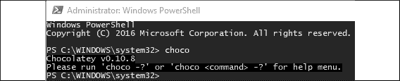
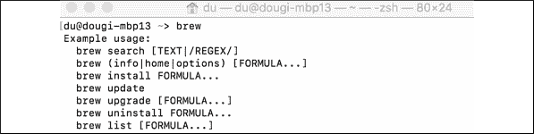
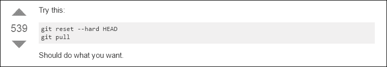
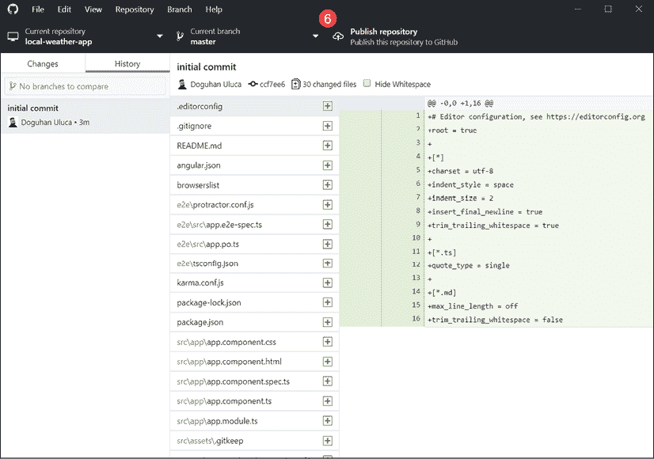
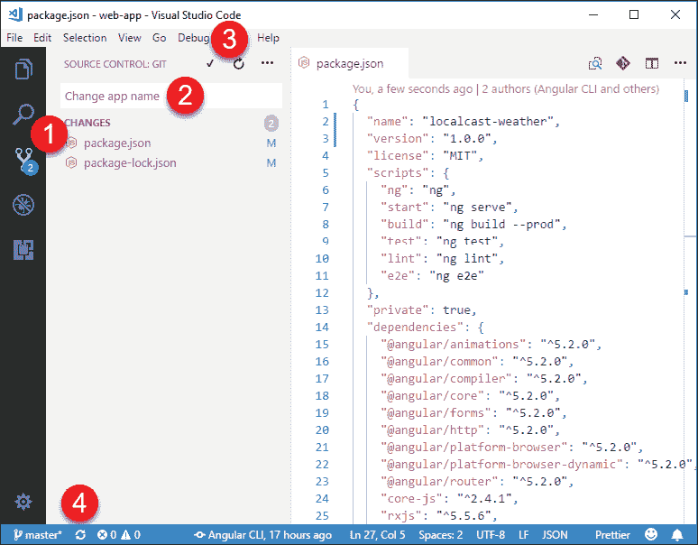
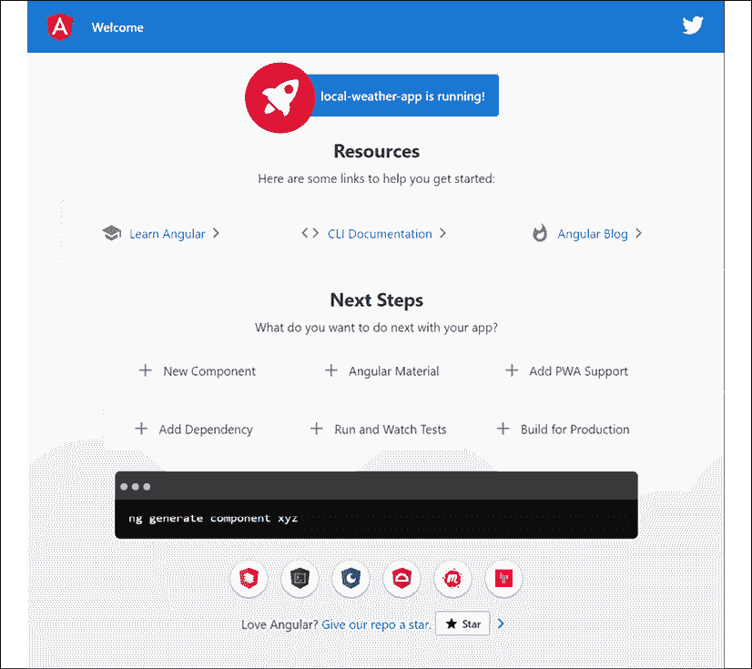
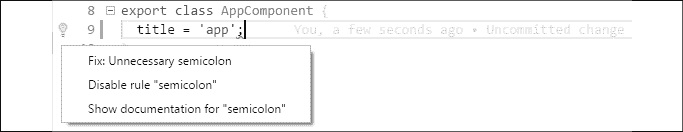

# 2

# 设置您的开发环境

本章展示了您和您的团队成员如何创建一个一致的开发生态环境，以便整个团队都能拥有相同的优秀 Web 开发体验——这一点在本书的序言中得到了强调。对于初学者来说，创建正确的发展环境可能很困难，这对于无烦恼的开发体验至关重要。对于经验丰富的开发者和团队来说，实现一致且最小化的开发环境仍然是一个挑战。一旦实现，这样的开发环境有助于避免许多 IT 相关问题，包括持续维护、许可和升级成本。

安装 GitHub Desktop、Node.js、Angular CLI 和 Docker 的说明对于从初学者到经验丰富的团队都是一份有用的参考，其中包括如何自动化以及确保开发环境配置正确和一致的策略。

如果您已经设置了一个强大的开发环境，可以自由跳过这一章；然而，请注意，本章中声明的某些环境假设可能会导致后续章节中的某些说明对您不起作用。如果您遇到问题或需要帮助同事、学生或朋友设置开发环境，请将此章节作为参考。设置您开发环境的自动化安装脚本可以在 [`github.com/duluca/web-dev-environment-setup`](https://github.com/duluca/web-dev-environment-setup) 找到。

为了充分利用本书，您应该熟悉 JavaScript ES2015+、前端开发基础和 RESTful API。

推荐的操作系统是 Windows 10 Pro v1903+ 配合 PowerShell v7+，或者 macOS Sierra v10.15+ 配合 Terminal（Bash 或 Oh My Zsh）。本书中建议的大多数软件也适用于 Linux 系统，但您的体验可能会根据您的特定配置而有所不同。

开发者在开发 Web 应用程序时通常使用 Google Chrome 80+。然而，您也可以使用基于 Chromium 的 Microsoft Edge 浏览器 80+。您绝对应该从 [`github.com/PowerShell/PowerShell/releases`](https://github.com/PowerShell/PowerShell/releases) 安装跨平台的 PowerShell，这将为您提供访问链式操作符 `&&` 和 `||` 的权限。此外，您可以从 Microsoft Store 获取新的 Windows Terminal，以获得在 Windows 上更优越的命令行体验。

在本章中，您将学习以下内容：

+   使用 CLI 包管理器 Chocolatey 和 Homebrew 安装和更新软件

+   使用那些包管理器来安装 GitHub、Node.js 和其他必需的程序

+   使用脚本通过 PowerShell 或 Bash 自动化安装

+   使用 Angular CLI 生成 Angular 应用程序

+   使用自动化工具实现一致且跨平台的开发生态环境

让我们从了解您可以使用来安装开发工具的基于 CLI 的包管理器开始。在下一节中，您将看到使用 CLI 工具是一种优于处理单个安装程序的方法。自动化 CLI 工具要容易得多，这使得设置和维护任务可重复且快速。

# CLI 包管理器

通过 **图形用户界面**（**GUI**）安装软件速度慢，且难以自动化。作为一名全栈开发者，无论您是 Windows 还是 Mac 用户，都必须依赖 **命令行界面**（**CLI**）包管理器来高效地安装和配置您所依赖的软件。

记住，任何可以用 CLI 命令表达的内容也可以自动化。

## 为 Windows 安装 Chocolatey

Chocolatey 是一个基于 CLI 的 Windows 包管理器，可用于自动化软件安装。要在 Windows 上安装 Chocolatey，您需要运行提升的命令行 shell：

1.  启动 **开始** 菜单

1.  开始在 `PowerShell` 中键入

1.  您应该看到 **Windows PowerShell 桌面应用** 作为搜索结果

1.  右键点击 **Windows PowerShell** 并选择 **以管理员身份运行**

1.  这将触发 **用户账户控制**（**UAC**）警告；选择 **是** 以继续

1.  在 **PowerShell** 中执行位于 [`chocolatey.org/install`](https://chocolatey.org/install) 的安装命令以安装 Chocolatey 包管理器：

    ```js
    PS> Set-ExecutionPolicy Bypass -Scope Process -Force; [System.Net.ServicePointManager]::SecurityProtocol = [System.Net.ServicePointManager]::SecurityProtocol -bor 3072; iex ((New-Object System.Net.WebClient).DownloadString('https://chocolatey.org/install.ps1')) 
    ```

1.  通过执行 `choco` 验证您的 Chocolatey 安装

1.  您应该看到以下截图所示的类似输出：



图 2.1：Chocolatey 成功安装

所有后续的 Chocolatey 命令都必须从提升的命令行 shell 中执行。或者，您可以在不需要提升的命令行 shell 的非管理员设置中安装 Chocolatey。然而，这会导致一个非标准且不太安全的开发环境，并且通过该工具安装的某些应用程序可能仍然需要提升权限。

Scoop 是 Chocolatey 的替代品，它提供了更类似 Unix 的体验。如果您更喜欢 Unix 风格的工具和命令，您可以在 [`scoop.sh/`](https://scoop.sh/) 或通过执行以下命令来安装 Scoop：

```js
$ iwr -useb get.scoop.sh | iex 
```

有关 Chocolatey 的更多信息，请参阅 [`chocolatey.org/install`](https://chocolatey.org/install)。

## 为 macOS 安装 Homebrew

Homebrew 是一个基于 CLI 的 macOS 包管理器，可用于自动化软件安装。要在 macOS 上安装 Homebrew，您需要运行一个命令行 shell：

1.  使用  + `Space` 启动 Spotlight 搜索

1.  输入 `terminal`

1.  在终端中执行以下命令以安装 Homebrew 包管理器：

    ```js
    $ /usr/bin/ruby -e "$(curl -fsSL https://raw.githubusercontent.com/Homebrew/install/master/install)" 
    ```

1.  通过执行 `brew` 验证您的 Homebrew 安装

1.  您应该看到以下类似的输出：



图 2.2：Homebrew 成功安装

1.  要启用对额外软件的访问，请执行以下命令：

    ```js
    $ brew tap caskroom/cask 
    ```

在 macOS 上，如果您在安装 brew 包时遇到与 chown `/usr/local`相关的权限问题，您需要执行`sudo chown -R $(whoami) $(brew --prefix)/*`命令。此命令将用户级别的所有权重新分配给 brew 包，这比广泛的超级用户/`su`级别访问更安全。

更多信息，请查看[`brew.sh/`](https://brew.sh/)。

# 安装开发工具

在本节中，您将安装所有开始开发网络应用所需的开发工具。Git 和 GitHub Desktop 在您的机器上建立源代码仓库，并允许您将代码与远程仓库同步。Node.js 是适用于您的 PC 的 JavaScript 运行时，它附带**Node 包管理器**或**npm**。Npm 管理第三方源代码，包括 Angular。Visual Studio Code 是一个**集成开发环境**或**IDE**。

要自动安装本书所需的全部网络开发工具，请在您的操作系统上执行以下命令以配置您的环境。

在 Windows PowerShell 上执行：

```js
PS> Install-Script -Name setup-windows-dev-env
PS> setup-windows-dev-env.ps1 
```

在 MacOS 终端上执行：

```js
$> bash <(wget -O - https://git.io/JvHi1) 
```

更多信息请参阅[`github.com/duluca/web-dev-environment-setup`](https://github.com/duluca/web-dev-environment-setup)。

一旦您安装了您的集成开发环境（IDE），您就可以开始开发了。本节还包含了安装 Docker（一个轻量级容器化平台）和配置各种云服务的说明。这些工具将在后面的章节中变得相关。如果您想更快地开始 Angular 之旅，现在可以跳过它们。

## Git 和 GitHub Desktop

本节旨在建立一个适合最广泛受众的最佳实践 Git 配置。为了最大限度地利用本节和本书后续章节，我假设您已经满足了以下先决条件：

+   理解源代码管理和 Git 实际上是什么

+   在[GitHub.com](http://GitHub.com)上创建的免费账户

### 为什么使用 GitHub？

如果您是 Git 用户，那么您很可能也使用在线仓库，例如 GitHub、Bitbucket 或 GitLab。每个仓库都为开源项目提供免费层，并配以功能强大的网站，包括您可以选择付费的本地企业选项。GitHub 在 2016 年托管了 38+百万个仓库，是迄今为止最受欢迎的在线仓库。社区普遍认为，GitHub 是一个始终在线的基准工具。

随着时间的推移，GitHub 添加了许多丰富的功能，使其从单纯的仓库转变为在线平台。在本书的整个过程中，我会参考 GitHub 的功能和特性，以便您可以利用其能力来改变您开发、维护和发布软件的方式。

### 为什么使用 GitHub Desktop？

Git CLI 工具确实很强大，只要你坚持使用它，就没有问题。然而，作为全栈开发者，我们担心各种问题。在匆忙完成任务时，你可能会因为遵循错误或不完整的建议而毁掉自己，有时甚至可能毁掉团队的一天。

以下截图展示了 Stack Overflow 上此类建议的示例（[`stackoverflow.com/questions/1125968/force-git-to-overwrite-local-files-on-pull`](http://stackoverflow.com/questions/1125968/force-git-to-overwrite-local-files-on-pull)）：



图 2.3：不要盲目执行的命令示例

如果你执行上述命令，请准备好丢失未提交的本地更改。不幸的是，新手用户往往倾向于遵循最直接和最简单的指示，这可能导致丢失工作。如果你认为你之前的提交是安全的，请三思！在 Git 方面，如果你能想到的，它就可以通过 CLI 实现。

幸运的是，有了 GitHub，你可以保护分支并实施 GitHub 工作流程，这包括分支、提交、合并、更新和提交拉取请求。这些保护和工作流程有助于防止有害的 Git 命令造成不可逆的更改，并确保团队保持高效的生产力。当存在合并冲突时，通过 CLI 执行所有这些操作可能会变得复杂和繁琐。

注意，Git 附带了一个名为 Git Bash 的 CLI 工具，这是一个基于 Unix 的 shell，你可以用它来执行`git`和其他命令。Bash 在 Linux 和 macOS 计算机上很容易获得。Windows 10 正在快速提高其终端支持，包括**Windows Subsystem for Linux**（**WSL**）和 PowerShell 中的 Unix 命令别名，因此 Windows 上使用 Git Bash 的需求正在迅速消失。如果你想了解更多关于 Git Bash 的信息，请查看 Atlassian 网站上的教程，网址为[`www.atlassian.com/git/tutorials/git-bash`](https://www.atlassian.com/git/tutorials/git-bash)。

为了更深入地了解 Git 和 GitHub 的益处和弊端，您可以阅读我 2016 年关于这个主题的文章，网址为[Bit.ly/InDepthGitHub](http://Bit.ly/InDepthGitHub)。

### 安装 Git 和 GitHub Desktop

GitHub Desktop 提供了一个易于使用的 GUI，可以在 Windows 和 macOS 上以一致的方式执行 GitHub 工作流程。当欢迎新成员或初级团队成员加入，或者你不是代码库的频繁贡献者时，一致性非常有价值。我们建议您安装 GitHub Desktop 2.2+。

1.  执行安装命令：

    对于 Windows：

    ```js
    PS> choco install git github-desktop -y 
    ```

    对于 macOS：

    ```js
    $ brew install git && brew cask install github 
    ```

1.  通过执行`git --version`来验证您的 Git 安装，并观察返回的版本号。

    在安装新的 CLI 工具后，你需要重新启动你的终端。然而，你可以通过刷新或源环境变量来避免重新启动终端，节省一些时间。在 Windows 上，执行 `refreshenv`；在 macOS 上，执行 `source ~/.bashrc` 或 `source ~/.zshrc`。

1.  通过启动应用程序来验证你的 GitHub Desktop 安装。

1.  在 GitHub Desktop 上登录 [`github.com/`](https://github.com/)。

1.  一旦你创建了仓库，你可以通过在终端中执行以下命令来启动应用程序：

    ```js
    $ github path/to/repo 
    ```

1.  如果你已经在正确的文件夹中，你可以输入以下命令代替：

    ```js
    $ github . 
    ```

对于 Windows 系统，在 GitHub Desktop 启动时，如果你卡在登录屏幕，请关闭应用程序，以管理员身份重新启动它，完成设置，然后你可以正常使用，无需再次以管理员身份启动。更多信息请参考：[`desktop.github.com/`](https://desktop.github.com/)。

接下来，我们将介绍几种策略，通过正确注册你的 GitHub 凭据，使 Git 的使用体验更加顺畅。

### 使用你的 GitHub 凭据在 Git 中

当你在 GitHub 上与你的仓库交互时，`git` 命令由你使用的工具（如 IDE）利用来推送或拉取内容。为了有一个顺畅的 Git 使用体验，正确地将你的 GitHub 凭据注册到 Git 中是一个好主意。

完成此任务有三种主要策略：

1.  **配置 SSH** – 这是最佳且最安全的方式与任何远程计算机系统交互，因为不会交换密码。你可以通过 GitHub 的最新指南来配置 SSH：[`help.github.com/articles/connecting-to-github-with-ssh`](https://help.github.com/articles/connecting-to-github-with-ssh)。

1.  **在 Git 中缓存你的 GitHub 密码** – 有时候，你使用的工具可能不支持 SSH，因此你可能需要缓存密码。你可以通过执行以下命令来完成：

    对于 Windows 系统：

    ```js
    PS> git config --global credential.helper wincred 
    ```

    对于 macOS 系统：

    ```js
    $ git credential-osxkeychain
    $ git config --global credential.helper osxkeychain 
    ```

    如需进一步指导，请参考 GitHub 指南：[`help.github.com/articles/caching-your-github-password-in-git`](https://help.github.com/articles/caching-your-github-password-in-git)。

1.  **创建个人访问令牌** – 从安全角度来看，这是一种介于 SSH 和密码使用之间的策略，因为 SSH 密钥和令牌可以从 GitHub 任何时间撤销，但一旦你的密码泄露或受损，你可能会失去对一切的控制。

如果你正在使用两步验证，这是绝对应该的，那么你不需要缓存密码，而是需要在 [`github.com/settings/tokens`](https://github.com/settings/tokens) 创建一个个人访问令牌，并使用令牌代替密码。在 *第三章*，*创建基本的 Angular 应用程序* 中，我们介绍了如何设置令牌以与 Visual Studio Code 配合使用，这是本书首选的 IDE。

查看 TJ Holowaychuk 的 git-extras 工具，它可以在 [`github.com/tj/git-extras`](https://github.com/tj/git-extras) 提供仓库摘要、更改日志填充、作者提交百分比等关于你的仓库的更多信息。

## Node.js

本节旨在建立一个最佳实践 JavaScript 开发环境。我假设你对现代 JavaScript 生态系统和工具有所了解。至少，确保你熟悉以下资源：

+   Node.js 的网站：[`nodejs.org`](https://nodejs.org )

+   Npm 的网站：[`www.npmjs.com`](https://www.npmjs.com )

+   Angular 的网站：[`angular.io`](https://angular.io )

+   旧版 AngularJS 网站：[`angularjs.org/`](https://angularjs.org/ )

+   Yarn 的网站：[`yarnpkg.com`](https://yarnpkg.com )

+   React 的网站：[`facebook.github.io/react`](https://facebook.github.io/react )

Node.js 是在任何地方运行的 JavaScript。它是一个开源项目，旨在在服务器上运行 JavaScript，基于 Google Chrome 的 V8 JavaScript 引擎构建。到 2015 年底，Node.js 稳定下来，并宣布了面向企业的 18 个月 LTS 循环，这为平台带来了可预测性和稳定性，同时与更频繁更新的但更具实验性的最新分支相匹配。

Node 也附带 npm（Node 包管理器），截至 2018 年，npm 是世界上最大的 JavaScript 包库。

要更深入地了解 Node 的历史，请阅读我在 Bit.ly/NodeJSHistory（http://Bit.ly/NodeJSHistory）上发表的两篇文章。

你可能听说过 Yarn，以及它如何比 npm 更快或更好。截至 npm 5，它随 Node 8 一起打包，npm 在功能丰富性、易用性以及性能方面与 Yarn 相当，Yarn 由 Facebook 发布，Facebook 还创建了 React。必须注意的是，Yarn 依赖于 npm 存储库，所以无论你使用哪个工具，你都能访问到相同的包库。

## 现有的 Node.js 安装

如果你之前安装过 Node.js，在用 choco 或 brew 安装 Node.js 的新版本时，请务必仔细阅读命令输出。你的包管理器可能会返回注意事项或额外的说明，以便你成功完成安装。

很可能你的系统或文件夹权限在过去已经被手动编辑过，这可能会干扰 Node 的无烦恼操作。如果以下命令不能解决你的问题，请作为最后的手段使用 Node 网站的 GUI 安装程序。

要查看你的全局安装包列表，请执行 `npm list -g --depth=0`。要卸载全局包，请执行 `npm uninstall -g package-name`。我建议你卸载所有全局安装的包，并从下一节提供的建议重新开始。

无论怎样，你必须注意卸载之前使用`npm -g`安装的所有全局工具。随着每个主要 Node 版本的发布，你的工具和 Node 之间的本地绑定可能会被取消。此外，全局工具会迅速过时，而特定项目的工具会迅速失去同步。因此，现在全局安装工具已经成为一种反模式，已被更好的技术所取代，这些技术将在下一节和*第三章*，*创建基本的 Angular 应用*中介绍。

## 安装 Node.js

本书假设你正在使用 Node 12.13 或更高版本。Node 的奇数版本并不打算长期使用。8.x.x、10.x.x、12.x.x 等版本是可以的，但无论如何都要避免 9.x.x、11.x.x 等版本，因为它们是实验性的。

1.  执行安装命令：

    对于 Windows：

    ```js
    PS> choco install nodejs-lts -y 
    ```

    对于 macOS：

    ```js
    $ brew install node@10 
    ```

1.  通过执行`node -v`来验证 Node 的安装

1.  通过执行`npm -v`来验证 npm

    注意，在 Windows 上，你绝对不应该使用 npm `install -g npm`来升级 npm 版本，正如在*附录 C*，*保持 Angular 和工具始终如一*中强调的那样。你可以从[`static.packt-cdn.com/downloads/9781838648800_Appendix_C_Keeping_Angular_and_Tools_Evergreen.pdf`](https://static.packt-cdn.com/downloads/9781838648800_Appendix_C_Keeping_Angular_and_Tools_Evergreen.)或[`expertlysimple.io/stay-evergreen`](https://expertlysimple.io/stay-evergreen)在线找到这个附录。强烈建议你使用 npm-windows-upgrade npm 包。

对于这本书，请确保你已经安装了 npm v.6.12+。现在，让我们来了解一下你可能想要全局安装的一些实用的 npm 包。

### 全局 npm 包

npm 仓库包含许多有用且成熟的 CLI 命令，这些命令通常是跨平台的。以下是我经常依赖并选择全局安装的命令，出于性能考虑：

+   `npx`：通过按需下载最新版本或项目特定的本地`node_modules`文件夹来执行 CLI 工具。`npx`随 npm 5+一起提供，允许你运行经常更新而不需要全局安装的代码生成器。

+   `rimraf`：Unix 命令`rm -rf`在 Windows 上同样适用。它对于删除`node_modules`文件夹非常有用，尤其是在 Windows 由于嵌套文件夹结构无法执行删除操作时。

+   `npm-check-updates`：分析你的项目文件夹，并报告哪些包有新版本或没有，如果你愿意，可以选择更新所有这些包。简称`ncu`。

+   `n`：一个简单易用的工具，可以快速在 Node 的不同版本之间切换，无需记住具体的版本号，适用于 macOS/Linux。对于 Windows，你可以使用 choco 包`nvs`；`n`和`nvs`都在*附录 C*，*保持 Angular 和工具始终如一*中介绍。

+   `http-server`：一个简单、零配置的命令行 HTTP 服务器，是本地测试静态 HTML/CSS 页面或 Angular 或 React 项目的 `dist` 文件夹的绝佳方式。

+   `npm-windows-upgrade`：在 Windows 上升级 npm 所必需。

+   `npkill`：轻松查找并删除旧的、庞大的 `node_modules` 文件夹，并回收数 GB 的磁盘空间。

    您可以通过执行 `ncu -g` 使用 npm-check-updates 来保持所有全局包的最新状态。

如果您在 macOS 上安装全局包时遇到 EACCES 权限错误，请参阅 npm 的指南，链接为 [`docs.npmjs.com/getting-started/fixing-npm-permissions`](https://docs.npmjs.com/getting-started/fixing-npm-permissions)。

## Visual Studio Code

**Visual Studio Code**（**VS Code**）是市面上最好的代码编辑器/IDE 之一，由微软开发和维护。它是免费的且跨平台。值得注意的是，VS Code 具有代码编辑器的闪电般性能——想想 NotePad++ 或 Sublime Text——但具有昂贵 IDE 的功能集和便利性——想想 Visual Studio 或 WebStorm。对于 JavaScript 开发，这种速度至关重要，并且对于经常在不同项目之间切换的开发者来说，这是一个巨大的生活质量提升。VS Code 集成了终端、易于使用的扩展系统、透明的设置、出色的搜索和替换功能，以及在我看来，目前最好的 Node.js 调试器。

这本书不需要您使用 VS Code。如果您希望使用 WebStorm 等其他 IDE，您也可以这样做。WebStorm 是一款付费产品，开箱即用即可提供出色的开发体验，而 VS Code 则需要大量的自定义。本书提供了自动化脚本来配置 VS Code，以实现最佳的 Angular 开发体验。

您可以在 https://www.jetbrains.com/webstorm 上找到更多关于 WebStorm 的信息。

### 安装 Visual Studio Code

对于 Angular 开发，本书利用 VS Code v1.42+。我强烈建议您也使用 VS Code 的最新版本。

1.  执行安装命令：

    对于 Windows：

    ```js
    PS> choco install VisualStudioCode -y 
    ```

    对于 macOS：

    ```js
    $ brew cask install visual-studio-code 
    ```

    VS Code 最好的特性之一是您还可以从 CLI 启动它。如果您在一个希望编辑的文件夹中，只需执行 `code .` 或特定的文件，通过执行 `code ~/.bashrc` 或 `code readme.md`。

1.  通过启动 VS Code 验证安装

1.  导航到一个文件夹并执行 `code`

1.  这将打开一个新的 VS Code 窗口，**资源管理器**显示当前文件夹的内容

更多信息，请参阅 [`code.visualstudio.com`](https://code.visualstudio.com)。

安装 VS Code 后，您就可以开始开发了。如果您想快速开始 Angular 的冒险，请跳转到 Angular CLI 部分，并在需要 Docker 和各种云服务的工具时回到本节。

## Docker

Docker 是一个轻量级的容器虚拟化平台，具有帮助管理和部署应用程序的工作流程和工具。

### 安装 Docker

要能够构建和运行容器，您必须首先在您的计算机上安装 Docker 执行环境。

Windows 对 Docker 的支持可能具有挑战性。您必须拥有一台支持虚拟化扩展的 CPU 的 PC，这在笔记本电脑上并不保证。您还必须拥有已启用 Hyper-V 的 Windows Pro 版本。另一方面，Windows Server 对 Docker 有原生支持，这是微软对行业采用 Docker 和容器化所展示的前所未有的支持。

1.  通过执行以下命令安装 Docker：

    对于 Windows:

    ```js
    PS> choco install docker docker-for-windows -y 
    ```

    对于 macOS:

    ```js
    $ brew install docker 
    ```

1.  执行 `docker -v` 以验证安装。

## 云服务

在本书中，我们将使用各种云服务提供商来执行您将要构建的应用程序的部署。每个服务都附带一个 CLI 工具，该工具可以方便地从您的终端或云中的 **持续集成**（**CI**）环境中部署您的应用程序。

### Vercel Now

Vercel Now 是一个用于静态网站和无服务器函数的云平台。通过简单的 CLI 命令，您可以即时托管网站和部署网络服务。本书利用了一个免费层的 Vercel Now 账户。

1.  在 [`vercel.com`](https://vercel.com) 创建一个 Vercel Now 账户。

1.  通过执行以下命令安装 CLI 工具：

    ```js
    $ npm i -g now 
    ```

1.  通过执行以下命令验证安装：

    ```js
    $ now login 
    ```

1.  按照说明完成登录过程。您应该会看到一个类似于以下的消息：

    ```js
    > We sent an email to xxxxx@gmail.com. Please follow the steps provided inside it and make sure the security code matches Classical Slow Worm
    √ Email confirmed
    > Congratulations! You are now logged in. In order to deploy something, run `now` 
    ```

如需更多信息，请参阅[`vercel.com`](https://vercel.com)。

### Google Firebase

Firebase 是谷歌专为托管具有身份验证、推送通知、云函数、数据库、机器学习和分析支持的手机和网页应用而定制的云平台。本书利用了一个免费层的 Firebase 账户。

1.  在 [`firebase.google.com/`](https://firebase.google.com/) 创建一个 Firebase 账户。

1.  通过执行以下命令安装 CLI 工具：

    ```js
    $ npm i -g firebase-tools 
    ```

1.  通过执行以下命令验证安装：

    ```js
    $ firebase login 
    ```

1.  按照说明完成登录过程。您应该会看到一个类似于以下的消息：

    ```js
    Waiting for authentication...
    +  Success! Logged in as xxxxxx@gmail.com 
    ```

如需更多信息，请参阅 [`firebase.google.com/`](https://firebase.google.com/)。

### Google Cloud

Google Cloud 是谷歌为企业和组织提供的世界级云基础设施。本书利用 Google Cloud Run 进行管理的容器部署到云中。在您首次注册时，您可能会收到免费额度来使用 Google Cloud。然而，这是一个可选的练习，因为如果您忘记拆除您的部署，使用此服务可能会产生费用。

1.  在 [`cloud.google.com/`](https://cloud.google.com/) 创建一个 Google Cloud 账户。

1.  执行安装命令：

    对于 Windows:

    ```js
    PS> choco install gcloudsdk -y 
    ```

    如果您在 `choco` 中安装 `gcloudsdk` 时遇到问题，那么请尝试之前章节中提到的 `scoop`。执行以下命令：

    ```js
    $ scoop bucket add extras
    $ scoop install gcloud 
    ```

    对于 macOS:

    ```js
    $ brew install google-cloud-sdk 
    ```

1.  通过执行 `gcloud --version` 来验证安装。

1.  通过执行 `gcloud init` 来完成设置。

更多信息，请参阅 [`cloud.google.com/run/`](https://cloud.google.com/run/)。

### 亚马逊网络服务

**亚马逊网络服务**（**AWS**）是由亚马逊提供的全球部署的云基础设施。AWS 是企业和政府广泛使用的工具，对于 IT 专业人员来说，它是一项有利可图的业务。第十三章，“AWS 上的高可用云基础设施”，深入探讨了如何使用 AWS 并执行基于容器的可扩展部署。

1.  执行安装命令：

    对于 Windows：

    ```js
    PS> choco upgrade awscli -y 
    ```

    对于 macOS：

    ```js
    $ brew install awscli
    $ brew upgrade awscli 
    ```

    注意，在 choco 和 brew 上运行升级命令可以确保如果它们之前已安装到您的环境中，您将拥有任何给定工具的最新版本。

1.  通过执行 `aws --version` 验证安装

更多信息，请参阅 [`aws.amazon.com/`](https://aws.amazon.com/)。

# 设置 Windows 和 macOS 的自动化

在本章的开头，我宣称“任何可以用 CLI 命令表达的内容都可以自动化”。在整个设置过程中，我们确保了每个正在使用的工具都已设置，并且可以通过 CLI 命令验证其功能。这意味着我们可以轻松地创建 PowerShell 或 bash 脚本来连接这些命令，并简化设置和验证新环境的工作。

让我们实现一些基本但有效的脚本，以帮助您设置开发环境。

## PowerShell 脚本

对于基于 Windows 的开发环境，您需要创建一个 PowerShell 脚本。

1.  创建一个名为 `setup-windows-dev-env.ps1` 的文件

1.  在文件中插入以下文本，该文本也可在 [`github.com/duluca/web-dev-environment-setup`](https://github.com/duluca/web-dev-environment-setup) 找到：

    ```js
    **setup-windows-dev-env.ps1**
    # This script is intentionally kept simple to demonstrate basic automation techniques.
    Write-Output "You must run this script in an elevated command shell, using 'Run as Administrator'"
    $title = "Setup Web Development Environment"
    $message = "Select the appropriate option to continue (Absolutely NO WARRANTIES or GUARANTEES are provided):"
    $yes = New-Object System.Management.Automation.Host.ChoiceDescription "&Install Software using Chocolatey", `
    "Setup development environment."
    $no = New-Object System.Management.Automation.Host.ChoiceDescription "&Exit", `
    "Do not execute script."
    $options = [System.Management.Automation.Host.ChoiceDescription[]]($yes, $no)
    $result = $host.ui.PromptForChoice($title, $message, $options, 1)
    switch ($result) {
      0 {
        Write-Output "Installing chocolatey"
        Set-ExecutionPolicy Bypass -Scope Process -Force; Invoke-Expression ((New-Object System.Net.WebClient).DownloadString('https://chocolatey.org/install.ps1'))
        Write-Output "Refreshing environment variables. If rest of the script fails, restart elevated shell and rerun script."
        $env:Path = [System.Environment]::GetEnvironmentVariable("Path", "Machine") + ";" + [System.Environment]::GetEnvironmentVariable("Path", "User")
        Write-Output "Assuming chocolatey is already installed"
        Write-Output "Installing Git & GitHub Desktop"
        choco.exe upgrade git github-desktop -y
        Write-Output "Installing NodeJS and NVS"
        choco.exe upgrade nodejs-lts nvs -y
        Write-Output "Installing Docker"
        choco.exe upgrade docker docker-for-windows -y
        Write-Output "Installing AWS"
        choco.exe upgrade awscli -y
        Write-Output "Installing VS Code"
        choco.exe upgrade VisualStudioCode -y
        RefreshEnv.cmd
        Write-Output "Results:"
        Write-Output "Verify installation of AWS, Docker, GitHub Desktop and VS Code manually."
        $gitVersion = git.exe --version
        Write-Output "git: $gitVersion"
        $nodeVersion = node.exe -v
        Write-Output "Node: $nodeVersion"
        $npmVersion = npm.cmd -v
        Write-Output "npm: $npmVersion"
      }
      1 { "Aborted." }
    } 
    ```

1.  要执行脚本，请运行：

    ```js
    PS> Set-ExecutionPolicy Unrestricted; .\setup-windows-dev-env.ps1 
    ```

或者，您可以直接从 PowerShell Gallery 安装并执行脚本，PowerShell Gallery 位于 [`www.powershellgallery.com`](https://www.powershellgallery.com)，通过执行以下命令：

```js
PS> Install-Script -Name setup-windows-dev-env 
PS> setup-windows-dev-env.ps1 
```

通过执行此脚本，您已成功在 Windows 上设置开发环境。

如果您有兴趣将您自己的脚本发布到 PowerShell Gallery 或对提高 PowerShell 技能感兴趣，我建议您安装 PowerShell Core，这是 PowerShell 的多平台版本。请从 [`github.com/PowerShell/PowerShell`](https://github.com/PowerShell/PowerShell) 安装。

现在，让我们看看您如何在 Mac 上实现类似的设置。

## Bash 脚本

对于基于 Mac 的开发环境，您需要创建一个 bash 脚本。

1.  创建一个名为 `setup-mac-dev-env.sh` 的文件

1.  运行 `chmod a+x setup-mac-dev-env.sh` 使文件可执行

1.  在文件中插入以下文本，该文本也可在 [`github.com/duluca/web-dev-environment-setup`](https://github.com/duluca/web-dev-environment-setup) 找到：

    ```js
    **setup-mac-dev-env.sh**
    #!/bin/bash
    echo "Execute Installation Script"
    read -r -p "Absolutely NO WARRANTIES or GUARANTEES are provided. Are you sure you want to continue? [y/N] " response
    if [[ "$response" =~ ^([yY][eE][sS]|[yY])+$ ]]
    then
        echo "Installing brew"

        /usr/bin/ruby -e "$(curl -fsSL https://raw.githubusercontent.com/Homebrew/install/master/install)"

        echo "Installing git"
        brew install git
        brew upgrade git
        echo "Installing GitHub Desktop"
        brew cask install github
        brew cask upgrade github
        echo "Installing NodeJS"
        brew install node@12
        brew upgrade node@12
        echo "Installing Docker"
        brew cask install docker
        brew cask upgrade docker
        echo "Installing AWS"
        brew install awscli
        brew upgrade awscli
        echo "Installing VS Code"
        brew cask install visual-studio-code
        brew cask upgrade visual-studio-code
        echo "Results:"
        echo "Verify installation of AWS, Docker, GitHub Desktop and VS Code manually."
        gitVersion=$(git --version)
        echo "git: $gitVersion"
        nodeVersion=$(node -v)
        echo "Node: $nodeVersion"
        npmVersion=$(npm -v)
        echo "npm: $npmVersion"
    else
        echo "Aborted."
    fi 
    ```

1.  要执行脚本，请运行：

    ```js
    $ ./setup-mac-dev-env.sh 
    ```

通过执行此脚本，您已在 Mac 上成功设置了开发环境。以下是一个更复杂的安装和验证例程的示例，您可以在尝试安装之前检查是否已安装特定程序，如 `brew` 或 `node`：

```js
echo "Checking if brew is installed"
which -s brew
if [[ $? != 0 ]] ; then
    echo "Installing brew"
    /usr/bin/ruby -e "$(curl -fsSL https://raw.githubusercontent.com/Homebrew/install/master/install)" < /dev/null
else
    echo "Found brew"
fi
echo "Checking for Node version ${NODE_VERSION}"
node -v | grep ${NODE_VERSION}
if [[ $? != 0 ]] ; then
    echo "Installing Node version ${NODE_VERSION}"
    brew install nodejs
else
    echo "Found Node version ${NODE_VERSION}"
fi 
```

现在，您对自动化执行脚本的样子有了相当好的了解。残酷的现实是，这些脚本并不代表一个非常强大或弹性的解决方案。脚本不能远程执行或管理，也不能快速从错误中恢复或从机器启动周期中生存。此外，您的 IT 需求可能超出了这里所涵盖的范围。

如果您处理大型团队并且人员流动频繁，自动化工具会带来丰厚的回报，而如果您是独自一人或是一个较小、稳定的团队的一部分，那么这将是过度配置。我鼓励您探索像 Puppet、Chef、Ansible 和 Vagrant 这样的工具，以帮助您决定哪个最适合您的需求，或者一个简单的脚本是否已经足够好。

# Angular CLI

Angular CLI 工具 ng 是一个官方的 Angular 项目，旨在确保新创建的 Angular 应用程序具有统一的架构，遵循社区经过时间检验的最佳实践。这意味着您未来遇到的任何 Angular 应用程序都应该具有相同的一般形状。

## 设置您的开发目录

设置一个专门的 `dev` 目录是救命稻草。由于此目录下的所有数据都使用 GitHub 进行备份，因此您可以安全地配置您的防病毒软件、云同步或备份软件忽略它。这可以显著减少 CPU、磁盘和网络利用率。作为一名全栈开发者，您很可能会进行大量多任务处理，因此避免不必要的活动对性能、电力和数据消耗的每日净正面影响很大，尤其是如果您的开发环境是资源匮乏的笔记本电脑，或者您在移动时希望尽可能多地节省电池寿命。

在 Windows 的 `c:\` 驱动器中直接创建 `dev` 文件夹非常重要。早期版本的 Windows 或 NTFS 无法处理超过 260 个字符的文件路径。起初这似乎是足够的，但当您在已经深入到层次结构的文件夹结构中安装 npm 软件包时，`node_modules` 文件夹结构可能会足够深，以至于很容易达到这个限制。从 npm 3+ 开始，引入了一种新的、更扁平的软件包安装策略，这有助于解决 npm 相关问题，但尽可能接近根文件夹对任何工具都有极大的帮助。

使用以下命令创建您的 `dev` 文件夹：

对于 Windows：

```js
PS> mkdir c:\dev 
PS> cd c:\dev 
```

对于 macOS：

```js
$ mkdir ~/dev
$ cd ~/dev 
```

在基于 Unix 的操作系统上，`~`（发音为 tilde）是当前用户家目录的快捷方式，该目录位于 `/Users/your-user-name` 下。

现在您的开发目录已准备就绪，让我们开始生成您的 Angular 应用程序。

## 生成您的 Angular 应用程序

Angular CLI 是一个官方的 Angular 项目，旨在确保新创建的 Angular 应用程序具有统一的架构，遵循社区经过时间检验的最佳实践。这意味着您今后遇到的任何 Angular 应用程序都应该具有相同的一般形状。Angular CLI 超出了初始代码生成的范畴；您会频繁地使用它来创建新的组件、指令、管道、服务、模块等。Angular CLI 还在开发过程中提供帮助，具有实时重新加载功能，以便您可以快速看到您更改的结果。Angular CLI 还可以测试、检查代码风格并构建用于生产发布的优化版本。此外，随着新的 Angular 版本的发布，Angular CLI 帮助您通过自动重写代码的部分来升级您的代码，以确保它与潜在的破坏性更改保持兼容。

### 安装 Angular CLI

[`angular.io/guide/quickstart`](https://angular.io/guide/quickstart) 上的文档指导您如何将 `@angular/cli` 作为全局 npm 包进行安装。请不要这样做。随着时间的推移，当 Angular CLI 升级时，始终需要保持全局版本和项目版本同步，这会成为一个持续的烦恼。如果您不这样做，工具会不断地抱怨。此外，如果您正在处理多个项目，随着时间的推移，您将拥有不同版本的 Angular CLI。结果，您的命令可能不会返回您期望的结果，或者与团队成员得到的结果不同。

下一个部分中详细说明的策略使得您的 Angular 项目的初始配置比必要的要复杂一些；然而，如果您几个月或一年后需要返回项目，您将能够弥补这种痛苦。在这种情况下，您可以使用在项目上最后使用的工具版本，而不是可能需要升级的某个未来的版本。在下一个部分中，您将使用这一最佳实践来初始化您的 Angular 应用程序。

### 初始化您的 Angular 应用

初始化您的应用的主要方式是使用 Angular CLI。让我们使用 `npx` 初始化开发中的应用程序，`npx` 已经在您安装最新版本的 Node LTS 时安装到您的系统上，从 PowerShell/Terminal 运行：

1.  在您的 `dev` 文件夹下，执行 `npx @angular/cli new local-weather-app`

1.  当被问及“您是否希望添加 Angular 路由？”时，选择**否**。

1.  当被问及“您希望使用哪种样式表格式？”时，选择**CSS**。

1.  在您的终端上，您应该看到一条类似于以下的成功消息：

    ```js
    $ npx @angular/cli new local-weather-app
    ...
    CREATE local-weather-app/src/environments/environment.ts (662 bytes)
    CREATE local-weather-app/src/app/app-routing.module.ts (245 bytes) CREATE local-weather-app/src/app/app.module.ts (393 bytes)
    CREATE local-weather-app/src/app/app.component.html (1152 bytes) CREATE local-weather-app/src/app/app.component.spec.ts (1086 bytes) CREATE local-weather-app/src/app/app.component.ts (207 bytes) CREATE local-weather-app/src/app/app.component.css (0 bytes)
    CREATE local-weather-app/e2e/protractor.conf.js (752 bytes) CREATE local-weather-app/e2e/tsconfig.e2e.json (213 bytes) CREATE local-weather-app/e2e/src/app.e2e-spec.ts (632 bytes) CREATE local-weather-app/e2e/src/app.po.ts (251 bytes)
    added 1076 packages from 1026 contributors and audited 42608 packages in 62.832s
    found 0 vulnerabilities Successfully initialized git.
    Project 'local-weather-app' successfully created. 
    ```

您的项目文件夹——`local-weather-app`——已初始化为 Git 仓库，并使用初始文件和文件夹结构进行了搭建，其结构应如下所示：

```js
local-weather-app
├── .editorconfig
├── .git
├── .gitignore
├── angular.json
├── e2e
│ ├── protractor.conf.js
│ ├── src
│ │ ├── app.e2e-spec.ts
│ │ └── app.po.ts
│ └── tsconfig.e2e.json
├── package.json
├── README.md
├── src
│ ├── app
│ │ ├── app-routing.module.ts
│ │ ├── app.component.css
│ │ ├── app.component.html
│ │ ├── app.component.spec.ts
│ │ ├── app.component.ts
│ │ └── app.module.ts
│ ├── assets
│ │ └── .gitkeep
│ ├── browserslist
│ ├── environments
│ │ ├── environment.prod.ts
│ │ └── environment.ts
│ ├── favicon.ico
│ ├── index.html
│ ├── karma.conf.js
│ ├── main.ts
│ ├── polyfills.ts
│ ├── styles.css
│ ├── test.ts
│ ├── tsconfig.app.json
│ ├── tsconfig.spec.json
│ └── tslint.json
├── tsconfig.json
└── tslint.json 
```

`@angular/cli` 的别名是 `ng`。如果你全局安装 Angular CLI，你会执行 `ng new local-weather-app`，但我们没有这样做。因此，记住，从现在开始，你将执行 `ng` 命令，但这次是在 `local-weather-app` 目录下。Angular CLI 的最新版本已经安装到 `node_modules/.bin` 目录下，这样你就可以运行 `ng` 命令，如 `npx ng generate component my-new-component`，并继续高效地工作。

如果你使用的是 macOS，你可以通过实现 shell 自动回退来进一步改善你的开发体验，这可以消除必须使用 `npx` 命令的必要性。如果发现未知命令，npx 将接管请求。如果该软件包已经在本地 `node_modules/.bin` 下存在，npx 将将你的请求传递给正确的二进制文件。因此，你可以像全局安装一样运行 `ng g c my-new-component` 这样的命令。有关如何设置此功能的说明，请参阅 npx 的自述文件，链接为 [npmjs.com/package/npx#shell-auto-fallback](http://npmjs.com/package/npx#shell-auto-fallback)。

### 使用 GitHub Desktop 发布 Git 仓库

GitHub Desktop 允许你在应用程序内直接创建新的仓库：

1.  打开 GitHub for Desktop

1.  **文件** | **添加本地仓库...**

1.  通过点击 **选择...** 定位 `local-weather-app` 文件夹

1.  点击 **添加仓库**

1.  注意，Angular CLI 已经在 **历史** 选项卡中为你创建了第一个提交

1.  最后，点击 **发布仓库**，在以下截图中被标记为 **6**：



图 2.4：GitHub Desktop

### 检查和更新 package.json

`package.json` 是你应该始终保持警觉的单个最重要的配置文件。你的项目脚本、运行时和开发依赖都存储在这个文件中。

1.  打开 `package.json` 并定位名称和版本属性：

    ```js
    **package.json**
    {
      "name": "local-weather-app", 
      "version": "0.0.0",
      "license": "MIT",
    ... 
    ```

1.  将你的应用程序重命名为你想要的任何名称；我使用了 `localcast-weather`

1.  将你的版本号设置为 `1.0.0`

    `npm` 使用语义化版本控制（semver），其中版本号数字代表主版本号、次版本号和修订号的增量。Semver 对于任何发布的 API，版本号从 `1.0.0` 开始，尽管它并不阻止 `0.x.x` 的版本控制。作为网络应用程序的作者，你的应用程序的版本控制对你来说没有实际影响，除了内部工具、团队或公司沟通目的之外。然而，你的依赖项的版本控制对你的应用程序的可靠性至关重要。总之，修订版本号应该只是修复错误。次版本号添加功能而不破坏现有功能，而主版本号的增量可以自由地进行不兼容的 API 更改。但是，任何更新都可能对你的应用程序的测试行为构成风险。因此，`package-lock.json` 文件存储了你的应用程序的整个依赖项树，以便其他开发人员或 CI 服务器可以复制你的应用程序的确切状态。更多信息，请访问：[`semver.org/`](https://semver.org/).

    在以下代码块中，请注意，`scripts` 属性包含一系列有用的启动脚本，你可以在此基础上进行扩展。`start` 和 `test` 命令是 npm 的默认命令，因此可以通过 `npm start` 或 `npm test` 执行。然而，其他命令是自定义命令，必须以 `run` 关键字开头。例如，为了构建你的应用程序，你必须使用 `npm run build`：

    ```js
    **package.json**
    ...
    "scripts": { 
      "ng": "ng",
      "start": "ng serve",
      "build": "ng build",
      "test": "ng test",
      "lint": "ng lint",
      "e2e": "ng e2e"
    },
    ... 
    ```

    在 npx 引入之前，如果你想在全局安装之外使用 Angular CLI，你必须使用 `npm run ng -- g c my-new-component` 来运行它。双横线是必需的，以便让 npm 知道命令行工具名称的结束和选项的开始。例如，为了在除了默认的 `4200` 之外的其他端口上启动你的 Angular 应用程序，你需要运行 `npm start -- --port 5000`。

1.  更新你的 `package.json` 文件，以便从不太常用的端口 `5000` 运行你的开发版本应用程序，作为新的默认行为：

    ```js
    **package.json**
    ...
      "start": "ng serve --port 5000",
    ... 
    ```

    在依赖项属性下，你可以观察到你的运行时依赖项。这些是与你的代码一起打包并发送到客户端浏览器的库。将此列表保持最小是至关重要的：

    ```js
    **package.json**
    ...
      "dependencies": { 
        "@angular/animations": "~9.0.0",
        "@angular/common": "~9.0.0",
        "@angular/compiler": "~9.0.0",
        "@angular/core": "~9.0.0",
        "@angular/forms": "~9.0.0",
        "@angular/platform-browser": "~9.0.0",
        "@angular/platform-browser-dynamic": "~9.0.0",
        "@angular/router": "~9.0.0",
        "rxjs": "~6.5.3",
        "tslib": "¹.10.0",
        "zone.js": "~0.10.2"
      },
    ... 
    ```

在前面的示例中，所有 Angular 组件都在同一版本上。随着你安装额外的 Angular 组件或升级单个组件，建议保持所有 Angular 包在同一版本上。这特别容易做到，因为 npm 不再需要 `--save` 选项来永久更新包版本。例如，只需执行 `npm install @angular/router` 就足以更新 `package.json` 中的版本。这是一个积极的整体变化，因为你在 `package.json` 中看到的内容与实际安装的内容相匹配。然而，你必须小心，因为 npm 还会自动更新 `package-lock.json`，这会将你的，可能是无意中做出的，更改传播给你的团队成员。

你的开发依赖存储在 `devDependencies` 属性下。当你为你的项目安装新工具时，你必须注意在命令中附加 `--save-dev`，以确保你的依赖被正确分类。开发依赖只在开发期间使用，不会发送到客户端浏览器。你应该熟悉每一个这样的包及其特定的用途。如果你对我们继续展示的包不熟悉，你了解它们最佳的资源是 [`www.npmjs.com/`](https://www.npmjs.com/)：

```js
**package.json**
...
  "devDependencies": {
    "@angular-devkit/build-angular": "~0.900.0",
    "@angular/cli": "~9.0.0",
    "@angular/compiler-cli": "~9.0.0",
    "@angular/language-service": "~9.0.0",
    "@types/node": "¹².11.1",
    "@types/jasmine": "~3.4.0",
    "@types/jasminewd2": "~2.0.3",
    "codelyzer": "⁵.1.2",
    "jasmine-core": "~3.5.0",
    "jasmine-spec-reporter": "~4.2.1",
    "karma": "~4.3.0",
    "karma-chrome-launcher": "~3.1.0",
    "karma-coverage-istanbul-reporter": "~2.1.0",
    "karma-jasmine": "~2.0.1",
    "karma-jasmine-html-reporter": "¹.4.2",
    "protractor": "~5.4.2",
    "ts-node": "~8.3.0",
    "tslint": "~5.18.0",
    "typescript": "~3.6.4"
  }
... 
```

在版本号前面的字符在 semver 中有特定的含义：

+   波浪号 `~` 在版本号的三个数字都定义的情况下启用波浪号范围，允许自动应用补丁版本升级

+   上箭头字符 `^` 启用箭头范围，允许自动应用小版本升级

+   任何字符的缺失都表示 npm 将在你的机器上安装该库的确切版本

你可能会注意到，不允许自动进行主要版本升级。一般来说，更新包可能会有风险。为了确保没有任何包在没有你明确知道的情况下更新，你可以通过使用 npm 的 `--save-exact` 选项来安装精确版本的包。让我们通过安装我发布的一个名为 `dev-norms` 的 npm 包来实验这种行为，这是一个 CLI 工具，可以生成一个包含合理默认规范的 markdown 文件，以便你的团队进行讨论，如下所示：

1.  在 `local-weather-app` 目录下，执行 `npm install dev-norms --save-dev --save-exact`。注意，"`dev-norms`": "`1.7.0`" 或类似的版本已添加到 `package.json` 中，并且 `package-lock.json` 会自动更新以反映相应的更改。

1.  工具安装后，执行 `npx dev-norms create`。已创建一个名为 `dev-norms.md` 的文件，其中包含之前提到的开发者规范。

1.  将你的更改保存到 `package.json`。

与过时的包一起工作有其风险。在 npm 6 中，引入了 `npm audit` 命令，以便让你了解你在使用的包中发现的任何漏洞。在 `npm install` 期间，如果你收到任何漏洞通知，你可以执行 `npm audit` 来了解任何潜在风险的详细信息。

在下一节中，你将提交你已对 Git 做出的更改。

### 使用 VS Code 提交代码

要将你的更改提交到 Git 并然后将提交同步到 GitHub，你可以使用 VS Code：

1.  切换到标记为 **1** 的 **源代码控制** 选项卡:

    图 2.5：Visual Studio Code 源代码控制选项卡

1.  在标记为 **2** 的框中输入提交信息

1.  点击标记为 **3** 的勾号图标，以提交你的更改

1.  最后，通过点击标记为 **4** 的刷新图标，将你的更改与 GitHub 仓库同步

如果你启用了两步验证，你应该这样做，GitHub 可能会要求你的凭据。在这种情况下，你需要创建一个个人访问令牌。按照以下说明操作以完成此操作：

1.  前往页面 [`github.com/settings/tokens`](https://github.com/settings/tokens)

1.  生成一个新的令牌并将其复制

1.  尝试在 VS Code 中重新同步你的更改

1.  忽略 GitHub 身份验证窗口，该窗口会显示 VS Code 的凭据输入栏

1.  输入你的 GitHub 用户名，而不是你的电子邮件

1.  将令牌粘贴为你的密码

1.  同步应该成功，后续同步不应提示密码

在本章前面的 Git 和 Github Desktop 部分查看更广泛的讨论，了解你可以使用的各种方法将你的 Git 客户端连接到 GitHub。

从现在开始，你可以在 VS Code 中执行大多数 Git 操作。

## 运行你的 Angular 应用程序

运行你的 Angular 应用程序以检查它是否工作。在开发过程中，你可以通过`ng serve`命令执行`npm start`；此操作将代码编译、打包并在 localhost 上提供，启用实时重新加载：

1.  执行`npm start`

1.  导航到`http://localhost:5000`

1.  你应该看到一个渲染的页面，类似于这个！

    图 2.6：默认 Angular CLI 登录页面

1.  通过在集成终端中按`Ctrl` + `C`来停止你的应用程序

恭喜！你准备好开始开发你的 Web 应用程序了。如果在设置过程中遇到任何问题，请查看下一节，了解如何验证你的代码与 GitHub 上的示例项目。

## 验证你的代码

书中示例代码的最新版本在 GitHub 上，链接如下。该存储库包含代码的最终和完成状态。你可以在章节结束时通过查找`projects`文件夹下的章节结束代码快照来验证你的进度。

对于*第二章*：

1.  克隆 repo [`github.com/duluca/local-weather-app`](https://github.com/duluca/local-weather-app)

1.  在根目录下执行`npm install`以安装依赖项

1.  本章的代码示例位于子文件夹中：

    ```js
    projects/ch2 
    ```

1.  要运行本章的 Angular 应用程序，请执行：

    ```js
    npx ng serve ch2 
    ```

1.  要运行本章的 Angular 单元测试，请执行：

    ```js
    npx ng test ch2 --watch=false 
    ```

注意，书中或 GitHub 上的源代码可能并不总是与 Angular CLI 生成的代码相匹配。由于生态系统不断演变，书中代码与 GitHub 上代码之间的实现也可能存在细微差异。随着时间的推移，示例代码发生变化是自然的。在 GitHub 上，你可能会找到更正、修复以支持库的新版本，或者为读者观察而并排实现多种技术的示例。读者只需实现书中推荐的理想解决方案即可。如果你发现错误或有疑问，请为所有读者创建一个 issue 或提交一个 pull request 到 GitHub。

在下一节中，我将介绍如何优化 VS Code 以获得最佳的 Angular 开发体验。

# 优化 VS Code 以适用于 Angular

优化您的 IDE 以获得出色的开发体验至关重要。如果您利用本节中提供的自动化工具，您可以快速配置您的 IDE 和 Angular 项目，并使用数十个协同工作的设置。

## 自动配置您的项目

要快速应用即将在章节中涵盖的配置步骤，请运行以下命令：

1.  安装 Angular VS Code 任务：

    ```js
    npm i -g mrm-task-angular-vscode 
    ```

1.  应用 Angular VS Code 配置：

    ```js
    npx mrm angular-vscode 
    ```

1.  为 Docker 任务安装 npm 脚本：

    ```js
    npm i -g mrm-task-npm-docker 
    ```

1.  应用 Docker 的 npm 脚本配置：

    ```js
    npx mrm npm-docker 
    ```

    这些设置不断调整以适应扩展、插件、Angular 和 VS Code 的不断变化的环境。请始终确保通过重新运行安装命令来安装任务的最新版本。

1.  执行 `npm run style:fix`

1.  执行 `npm run lint:fix`

有关 mrm 任务更多信息，请参阅：

+   [`github.com/expertly-simple/mrm-task-angular-vscode`](https://github.com/expertly-simple/mrm-task-angular-vscode)

+   [`github.com/expertly-simple/mrm-task-npm-docker`](https://github.com/expertly-simple/mrm-task-npm-docker)

+   [`github.com/expertly-simple/mrm-task-npm-aws`](https://github.com/expertly-simple/mrm-task-npm-aws)

注意，`mrm-task-npm-aws` 为 AWS ECS 设置 npm 脚本，这在 *第十三章*，*AWS 上的高可用云基础设施* 中使用。

您可以将配置与 GitHub 上的示例项目进行验证。请注意，配置组件将在仓库的根目录下应用，而不是在 `projects` 文件夹下。

下面的三个部分涵盖了之前自动应用的设置。如果您有问题，请随时跳过并查阅。

### VS Code 自动保存

持续保存文件可能会变得繁琐。您可以通过以下步骤启用自动保存：

1.  打开 VS Code

1.  在 **文件** | **自动保存** 下切换设置

您可以通过启动 **首选项** 来进一步自定义 VS Code 的许多行为。在 Windows 上，启动 **首选项** 的快捷键是 `Ctrl` + `,`，在 macOS 上是 `![ + `,`]。

### IDE 设置

您可以通过在项目目录的根目录下创建一个 `.vscode` 文件夹并将一个 `settings.json` 文件放入其中来与同事共享此类设置。如果您将此文件提交到仓库，每个人都将共享相同的 IDE 体验。不幸的是，个人无法通过本地首选项覆盖这些设置，因此请确保共享设置最小化，并作为团队规范达成一致。

这里是我用于获得最佳、电池寿命意识的 Angular 开发体验的定制设置：

```js
**.vscode/settings.json**
{
  "debug.openExplorerOnEnd": true,
  "editor.tabSize": 2,
  "editor.rulers": [90],
  "editor.autoIndent": "full",
  "editor.cursorBlinking": "solid",
  "editor.formatOnType": false,       // Adjust the intensity of
  "editor.formatOnPaste": false,         auto-formatting to taste
  "editor.formatOnSave": true,
  "editor.minimap.enabled": false,
  "editor.codeActionsOnSave": {
    "source.organizeImports": false,
    "source.fixAll.tslint": true,
  },
  "explorer.openEditors.visible": 0,
  "files.trimTrailingWhitespace": true,
  "files.autoSave": "onFocusChange",
  "git.confirmSync": false,
  "git.enableSmartCommit": true,
  "npm.enableScriptExplorer": true,
  "typescript.tsdk": "node_modules/typescript/lib",
  "workbench.iconTheme": "material-icon-theme",     // Requires 
                                                  Material Icon 
                                                Theme Extension 
  "auto-close-tag.SublimeText3Mode": true,          // Requires Auto 
                                              Close Tag Extension 
  "html.autoClosingTags": false, 
  "peacock.affectActivityBar": true,               // Requires Peacock 
  "peacock.affectStatusBar": true,                           Extension
  "peacock.affectTitleBar": false,
  "workbench.colorCustomizations": {
    "activityBar.background": "#d04649",
    "activityBar.activeBorder": "#37cb34",
    "activityBar.foreground": "#e7e7e7",
    "activityBar.inactiveForeground": "#e7e7e799",
    "activityBarBadge.background": "#37cb34",
    "activityBarBadge.foreground": "#15202b",
    "statusBar.background": "#b52e31",
    "statusBarItem.hoverBackground": "#d04649",
    "statusBar.foreground": "#e7e7e7"
  },
  "peacock.color": "#b52e31",
  "gitlens.menus": {                              // Requires GitLens 
    "editorGroup": false                               Extension 
  }, 
  "ng-evergreen.upgradeChannel": "Latest"            // Requires Angular 
                                                  Evergreen Extension 
} 
```

在后面的部分中，当我们添加强制执行我们编码风格的工具时，请注意不要引入相互重叠或相互矛盾的新设置。

### IDE 扩展

为了在 VS Code 和 Angular 之间获得神奇的开发体验，你应该安装由 John Papa 创建和精选的 Angular Essentials 扩展包。John Papa 是 Angular 社区中领先的倡导者和思想领袖之一。他不断不懈地寻求最佳的开发体验，以便你作为开发者更加高效和快乐。要了解更多关于 Angular Essentials 的信息，请参阅这篇博客文章[`johnpapa.net/rec-ng-extensions`](https://johnpapa.net/rec-ng-extensions)和 GitHub 仓库[`github.com/johnpapa/vscode-angular-essentials`](https://github.com/johnpapa/vscode-angular-essentials)。

我强烈建议你关注 Twitter 上的 John Papa，用户名是 `@john_papa`。

与设置类似，你也可以通过 JSON 文件共享推荐的扩展。这些是我用于 Angular 开发的扩展：

```js
**.vscode/extensions.json**
{
  "recommendations":[
    "johnpapa.angular-essentials",
    "PKief.material-icon-theme",
    "formulahendry.auto-close-tag",
    "ms-azuretools.vscode-docker",
    "eamodio.gitlens",
    "WallabyJs.quokka-vscode",
    "amatiasq.sort-imports",
    "DSKWRK.vscode-generate-getter-setter",
    "esbenp.prettier-vscode",
    "HookyQR.beautify",
    "expertly-simple.ng-evergreen",
    "msjsdiag.debugger-for-edge"
  ]
} 
```

VS Code 也推荐了一些扩展供你安装。我警告你，不要安装太多扩展，因为这些扩展会明显降低 VS Code 的启动性能和最佳运行状态。

VS Code 生态系统是一个不断演变、动态且丰富的生态系统。因此，某些扩展或设置可能会消失、停止工作或存在错误。如果你遇到任何问题或只是好奇，你可以在 GitHub 上找到我首选的 VS Code 配置文件的最新版本，链接为[`bit.ly/ngCodeSettings`](http://bit.ly/ngCodeSettings)。

## 脚本代码风格和 linting

你可以在 VS Code 和 Angular CLI 中自定义代码风格强制执行和代码生成行为。自动化强制执行代码风格和 linting 规则的最关键目标是让开发者达成共识。如果团队无法就遵循哪种风格达成一致，那么抛硬币也比没有协议要好。开发团队应该专注于代码质量，让自动化工具去关心代码的缩进、括号的定位和括号之间的空格。在大团队中，任何风格上的偏差都可能导致合并冲突带来重大麻烦。强烈建议你实施强制执行标准的机制。

我更喜欢 StandardJS 的 JavaScript 设置，它将编写代码的最小化方法与高可读性相结合。这意味着制表符为两个空格，不使用分号。除了减少按键次数外，StandardJS 还占用更少的横向空间，这在你的 IDE 只能利用屏幕一半的情况下，另一半被浏览器占用时尤其有价值。你可以在[`standardjs.com/`](https://standardjs.com/)上了解更多关于 StandardJS 的信息。

使用默认设置，你的代码看起来像：

```js
import { AppComponent } from "./app.component"; 
```

使用 StandardJS 设置，你的代码看起来像：

```js
import { AppComponent } from './app.component' 
```

如果你不喜欢这种风格，那也行。虽然接下来我会分享我的首选设置，但你可以随意调整到自己喜欢的样子。我们实施的强制执行规则机制保持不变。

要应用和强制执行代码风格规则，我们使用一些提供 CLI 工具和 VS Code 扩展的工具：

+   Prettier – 用于格式化 `.ts` 文件

+   ImportSort/SortImports – 用于组织 TypeScript 导入语句

+   Beautify – 用于格式化 `.html` 文件，

+   TSLint – 作为静态代码分析工具，用于检查代码可读性、可维护性和功能错误

我们的目标是最终拥有四个脚本：

1.  `style` – 检查我们的代码是否遵循样式规则

1.  `style:fix` – 自动根据样式规则格式化代码文件

1.  `lint` – 检查我们的代码是否有任何代码风格错误

1.  `lint:fix` – 自动修复可自动修复的代码风格错误

样式和代码风格命令将由我们的 CI 服务器使用，以确保每位团队成员都遵循相同的编码标准。`style:fix` 和 `lint:fix` 命令将帮助开发者以尽可能少的努力遵守编码标准。

这些工具不断更新。这些工具的行为可能会随时间而变化，所以请密切关注，并且不要犹豫，尝试添加/删除这些工具以实现适合您的配置。

在我们设置依赖项和配置文件之前，请确保已安装 IDE 扩展部分中推荐的所有扩展。

### 配置工具

您可以通过以下步骤开始进行配置更改：

1.  确保已安装 **Prettier – 代码格式化器**、**TSLint**、**sort-imports** 和 **Beautify** 扩展（已包含在前一节的 `extensions.json` 中）

1.  通过执行以下命令安装 CLI 工具：

    ```js
     npm i -D prettier tslint-config-prettier tslint-plugin-prettier
      npm i -D js-beautify
      npm i -D import-sort import-sort-cli import-sort-parser-typescript import-sort-style-module
      npm i -D tslint tslint-etc 
    ```

    使用 npm，您可以使用 `i` 作为 `install` 的别名，而不是更冗长的 `--save-dev` 选项。然而，如果您将 `-D` 错误地输入为 `-d`，您最终会将包保存为生产依赖项。

1.  通过在文件末尾添加 `importSort` 属性来编辑 `package.json`：

    ```js
    **package.json**
    ...
      "importSort": {
        ".ts, .tsx": {
          "parser": "typescript",
          "style": "module",
          "options": {}
        }
      }
    ... 
    ```

1.  更新 `tslint.json` 规则以与 Prettier 和 `tslint-etc` 集成：

    ```js
    **tslint.json**
    **{**
     **"extends": [**
     **"tslint:recommended",**
     **"tslint-config-prettier",**
     **"tslint-plugin-prettier",**
     **"tslint-etc"**
     **],**
     **"rules": {**
     **"prettier": true,**
     **"no-unused-declaration": true,**
    **...**
    "quotemark": [true, "single", "avoid-escape"],
    ...
    "semicolon": [ true, "never"],
    ...
    "max-line-length": [ true,90],
    ...
    } 
    ```

1.  在项目的根目录下添加一个新文件，命名为 `.jsbeautifyrc`：

    ```js
    **.jsbeautifyrc**
    {
      "indent_size": 2,
      "wrap_line_length": 90,
      "language": {
        "html": [
          "html"
        ]
      }
    } 
    ```

1.  在项目的根目录下添加一个新文件，命名为 `.prettierrc`：

    ```js
    **. prettierrc**
    {
      "tabWidth": 2,
      "useTabs": false,
      "printWidth": 90,
      "semi": false,
      "singleQuote": true,
      "trailingComma": "es5",
      "jsxBracketSameLine": true
    } 
    ```

1.  在项目的根目录下添加一个新文件，命名为 `.prettierignore`。注意，此文件没有花括号：

    ```js
    **. prettierignore**
    **/*.html 
    ```

现在我们已经配置好了所有必要的工具来实现我们的样式和代码风格脚本。

### 实现样式检查器和修复器

让我们实现 npm 脚本以用于样式和 `style:fix` 命令。Npm 脚本是一种很好的方式来记录您的团队需要在不同平台和 CI 服务器上执行 CLI 脚本。

现在，让我们添加第一个脚本：

1.  编辑 `package.json` 中的脚本属性，添加 `style` 和 `style:fix` 命令：

    ```js
    **package.json**
    ...
      "scripts": {
        "style:fix": "import-sort --write \"**/{src,tests,e2e}/*.ts\" && prettier --write \"**/{src,tests,e2e}/*.{*css,ts}\" && js-beautify \"src/**/*.html\"",
        "style": "import-sort -l \"**/{src,tests,e2e}/*.ts\" && prettier --check \"**/{src,tests,e2e}/*.{*css,ts}\"",  ...
      }
    ... 
    ```

1.  执行 `npm run style` 来查看不遵循样式规则的文件

1.  执行 `npm run style:fix` 来更新所有文件到新样式

1.  在 GitHub Desktop 中观察所有文件更改

1.  提交您的更改

当你在 Angular 中使用内联模板时，内联的 HTML 部分由 Prettier 而不是 Beautify 格式化。在这些情况的大多数中，你的代码看起来会很好，但如果你的 HTML 元素有太多属性，你的代码将以非常冗长的方式格式化。为了防止这种情况发生，你可以选择相关的 HTML 代码，并在 VS Code 中运行 **美化选择** 命令。如果你在模板属性上方添加 `// prettier-ignore`，Prettier 将停止干扰你的美化 HTML。

现在，让我们配置我们的 linting 脚本。

### 实现一个 lint 检查器和修复器

`package.json` 中已经存在一个 `lint` 命令。我们用我们自己的命令覆盖现有的 `lint` 命令并实现一个额外的 `lint:fix` 命令。

添加新的脚本：

1.  编辑 `package.json` 脚本属性以替换 `lint` 并添加 `lint:fix` 命令：

    ```js
    **package.json**
    ...
      "scripts": {
      ...
        "lint": "tslint --config tslint.json --project . -e \"**/{test,polyfills}.ts\"",
        "lint:fix": "tslint --config tslint.json --fix --project . -e \"**/{test,polyfills}.ts\"",  ...
      }
    ... 
    ```

    注意，与样式脚本不同，我们排除了 `test.ts` 和 `polyfills.ts` 的 lint 检查。这些文件带有 linting 错误；它们不太可能经常被编辑，并且由于它们对我们的代码质量没有影响，我们可以安全地忽略它们。

1.  执行 `npm run lint` 以查看有 linting 错误的文件

1.  执行 `npm run lint:fix` 以修复任何可自动修复的错误

1.  如果还有进一步的错误，请按 `Ctrl`/`cmd` + `click` 点击文件并手动修复错误

1.  在 GitHub Desktop 中观察所有文件更改

1.  提交你的更改

1.  不要忘记将你的更改推送到你的仓库！

有时，当你使用 Angular CLI 输入新代码或生成新组件时，可能会遇到双引号或分号被红色波浪线划下，以表示存在问题。我们已经配置了 VS Code 在保存文件时自动格式化文件，这会在窗口失去焦点时自动发生。当自动格式化被触发时，文件会更新，与格式化相关的错误会消失。

当我们在 *第四章* 中介绍 CI（持续集成）时，*自动化测试、CI 和发布到生产*，我们将运行我们的样式和 lint 检查器作为我们管道的一部分。

接下来，配置 ng 工具以在终端中获得自动完成功能。

## 配置 Angular CLI 自动完成

当使用 Angular CLI 时，你可以在终端中获得自动完成体验。执行适用于你的 `*nix` 环境的相应命令：

+   对于 bash shell：

    ```js
    $ ng completion --bash >> ~/.bashrc
    $ source ~/.bashrc 
    ```

+   对于 zsh shell：

    ```js
    $ ng completion --zsh >> ~/.zshrc
    $ source ~/.zshrc 
    ```

+   对于使用 Git bash shell 的 Windows 用户：

    ```js
    $ ng completion --bash >> ~/.bash_profile
    $ source ~/.bash_profile 
    ```

接下来，让我们了解 VS Code 自动修复器。

## VS Code 自动修复器

有时，一个黄色灯泡图标会出现在代码行旁边。这可能是由于你输入了一些违反 `tslint.json` 中定义的规则的代码。如果你点击灯泡，你会看到一个标记为 **修复** 的操作。你可以利用这些自动修复器让 VS Code 自动修复你的代码。下面的截图显示了 **不必要的分号** 问题的示例：



图 2.7：VS Code 自动修复器

恭喜你 – 你已经完成了开发环境的设置！

# 摘要

在本章中，你掌握了使用基于 CLI 的包管理器在 Windows 和 macOS 上的使用方法，以加快并自动化你和你同事的开发环境设置。你还创建了你的第一个 Angular 项目，并使用 Visual Studio Code 对其配置进行了优化，以用于开发。然后，你实现了自动化的样式检查器和修复器，以强制执行团队中的编码标准和样式。你实现的 lint 检查器和修复器将自动捕获潜在的编码错误和维护性问题。

你创建的自动化脚本将规范你的团队规范，并为新成员和现有成员提供文档。通过减少一个开发者的环境与另一个开发者环境之间的差异，你的团队可以更有效地克服任何个人配置问题，并专注于手头的任务执行。有了对共同环境的集体理解，团队中的任何个人都不必承担帮助解决其他人的问题的负担。同样的想法也适用于你的代码文件的结构和样式。

当团队成员查看另一位团队成员的代码时，它们在风格上看起来完全相同，这使得调试和解决问题变得更加容易。因此，你的团队将更加高效。通过利用更复杂和有弹性的工具，中大型组织可以在其 IT 预算中实现相当大的节省。

在下一章中，你将学习更多关于 Angular 平台的知识，利用 GitHub 项目和使用 GitHub 问题进行 Kanban，学习 Angular 基础知识以构建具有全栈架构的简单 Web 应用，并了解使用 RxJS 的响应式编程。

# 进一步阅读

关于通过 Vishwas Parameshwarappa 撰写的自动化本地开发者机器设置的文章是一个很好的起点，使用 Vagrant，位于[`www.vagrantup.com`](https://www.vagrantup.com)。你可以在这里找到文章[`Red-gate.com/simple-talk/sysadmin/general/automating-setup-local-developer-machine`](https://Red-gate.com/simple-talk/sysadmin/general/automating-setup-local-developer-machine)。

其他工具包括位于[`www.chef.io/`](https://www.chef.io/)的 Chef 和位于[`puppet.com`](https://puppet.com)的 Puppet。一些开发者更喜欢在编码时使用 Docker 容器，位于[`www.docker.com`](https://www.docker.com)。这样做是为了隔离不同的 SDK 版本。特定的开发工具不能限定在给定的文件夹中，必须全局或跨操作系统安装，这使得同时处理多个项目变得非常困难。如果你能避免这种设置，我建议远离这种设置。在未来，我预计随着 CPU 核心数量的增加和虚拟化技术的硬件加速，这类任务将由 IDE 自动化。

我们将在本书稍后使用 Docker，但我们将用它来隔离我们的生产软件依赖项，使其与周围元素（如我们的本地开发环境或云服务器）隔离开。

# 问题

尽可能地回答以下问题，以确保您已经理解了本章的关键概念，而无需使用 Google。您需要帮助回答这些问题吗？请参阅*附录 D*，*自我评估答案*，在线位于[`static.packt-cdn.com/downloads/9781838648800_Appendix_D_Self-Assessment_Answers.pdf`](https://static.packt-cdn.com/downloads/9781838648800_Appendix_D_Self-Assessment_Answers.pdf)或访问[`expertlysimple.io/angular-self-assessment`](https://expertlysimple.io/angular-self-assessment)。

1.  与 GUI 相比，使用 CLI 工具的动机是什么？

1.  对于您的特定操作系统，建议使用哪个包管理器？

1.  使用包管理器有哪些好处？

1.  尽可能使您的开发团队成员的开发环境彼此相似有哪些好处？
