# 3

# 创建基本的 Angular 应用

在本章中，我们将使用 Angular 和第三方 Web API 以及迭代开发方法设计并构建一个简单的本地天气应用。我们将专注于首先交付价值，同时了解 Angular、TypeScript、Visual Studio (VS) Code、响应式编程和 RxJS 的细微差别和最佳使用方式。在我们开始编码之前，我们需要构建一个功能路线图，创建我们打算构建的应用的 mock-up，并绘制我们应用的高级架构图。

您将了解 Angular 基础知识以构建一个简单的 Web 应用，并熟悉新的 Angular 平台和全栈架构。

在本章中，您将学习以下内容：

+   使用 GitHub 项目规划您的路线图

+   使用看板板来启用协作和无缝的信息辐射

+   使用 Angular 组件和 TypeScript 接口制作一个新的 UI 元素来显示当前天气信息

+   使用 Angular 服务和 `HttpClient` 从 `OpenWeatherMap` API 获取数据

+   利用可观察流使用 RxJS 转换数据

+   Angular 中的空值保护

书中样本代码的最新版本可在以下链接的 GitHub 仓库中找到。该仓库包含代码的最终和完成状态。您可以在本章末尾通过查找 `projects` 文件夹下的章节末尾代码快照来验证您的进度。

对于 *第三章*：

1.  克隆仓库 [`github.com/duluca/local-weather-app`](https://github.com/duluca/local-weather-app)。

1.  在根文件夹中执行 `npm install` 以安装依赖项。

1.  本章的代码示例位于子文件夹：

    ```js
    projects/ch3 
    ```

1.  要运行本章的 Angular 应用，请执行：

    ```js
    npx ng serve ch3 
    ```

注意，书中或 GitHub 上的源代码可能并不总是与 Angular CLI 生成的代码相匹配。由于生态系统不断演变，书中代码和 GitHub 上的代码在实现上可能也存在细微差异。样本代码随时间变化是自然的。在 GitHub 上，您可能会找到更正、修复以支持库的新版本，或者为读者观察而并排实现多种技术的示例。读者只需实现书中推荐的理想解决方案即可。如果您发现错误或有疑问，请创建一个 issue 或在 GitHub 上提交一个 pull request，以惠及所有读者。

您可以在 *附录 C* 中了解更多关于更新 Angular 的信息，即 *保持 Angular 和工具始终如一*。您可以从 [`static.packt-cdn.com/downloads/9781838648800_Appendix_C_Keeping_Angular_and_Tools_Evergreen.pdf`](https://static.packt-cdn.com/downloads/9781838648800_Appendix_C_Keeping_Angular_and_Tools_Evergreen.) 或 [`expertlysimple.io/stay-evergreen`](https://expertlysimple.io/stay-evergreen) 在线找到此附录。

让我们首先制定一个高级计划，以便在您开始编码之前了解要实现的内容。

# 使用看板和 GitHub 项目进行规划

在上路之前有一个路线图对于确保你达到目的地至关重要。同样，在开始编码之前制定一个粗略的行动计划对于确保项目成功非常重要。尽早制定计划可以让你的同事或客户了解你打算完成什么。然而，任何初始计划都注定会随着时间的推移而改变。

敏捷软件开发旨在随着时间的推移考虑优先级和功能的变更。看板和 Scrum 是你可以使用来管理项目的两种最流行的方法。每种方法都有一个待办事项的概念，并列出计划、进行中和已完成的工作。包含优先级任务列表的待办事项建立了一个关于接下来需要做什么的共享理解。捕获每个任务状态的列表充当信息辐射器，利益相关者可以在不打扰你的工作流程的情况下获取更新。无论你是为自己还是为他人构建应用程序，保持待办事项的实时状态并跟踪任务的进度都会带来回报，并保持对你要实现的目标的关注。

在实现本地天气应用时，我们将利用 GitHub 项目作为看板。在企业中，你可以使用票据系统或能够保持待办事项、实施敏捷方法学和显示看板工具。在 GitHub 中，问题代表你的待办事项。你可以利用内置的**项目**标签页来定义一个代表发布或迭代的范围，从而建立看板。GitHub 项目直接集成到你的 GitHub 仓库的问题中，并通过标签跟踪问题的状态。这样，你就可以继续使用你选择的工具与你的仓库交互，并且毫不费力地传播信息。在下一节中，你将设置一个项目来实现这一目标。

## 设置 GitHub 项目

让我们设置一个 GitHub 项目：

1.  在浏览器中导航到你的 GitHub 仓库。

1.  切换到**项目**标签页。

1.  点击**创建新项目**，如下面的截图所示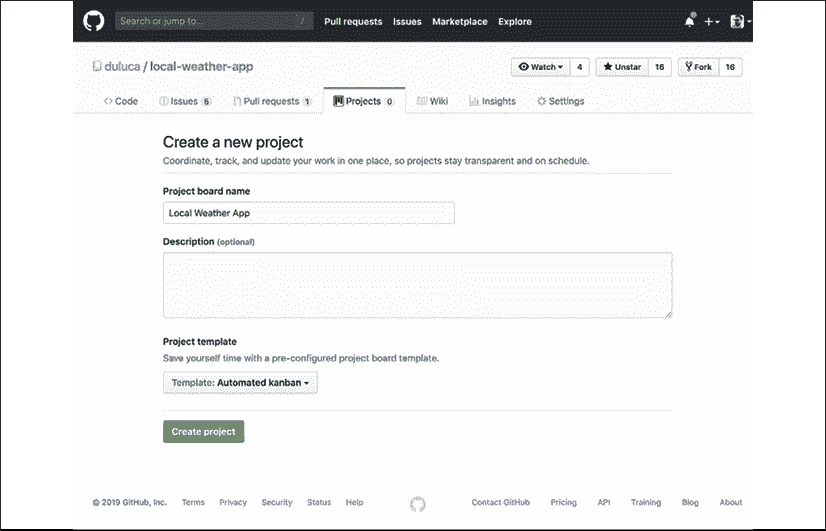

    图 3.1：在 GitHub 中创建新项目

1.  在**项目看板名称**框中提供名称。

1.  选择一个**项目模板**，例如**自动化看板**。

1.  在本书的后面部分，我们将为你的 GitHub 项目启用 GitHub 流程。使用 GitHub 流程，你的仓库更改将通过**拉取请求**（**PR**）进行处理。在未来，你可能想选择**带有审查的自动化看板**模板，该模板自动跟踪 PR 的状态，传播更多关于软件开发过程内部运作的详细信息。

1.  点击**创建项目**。

观察你的看板，它应该如下所示：

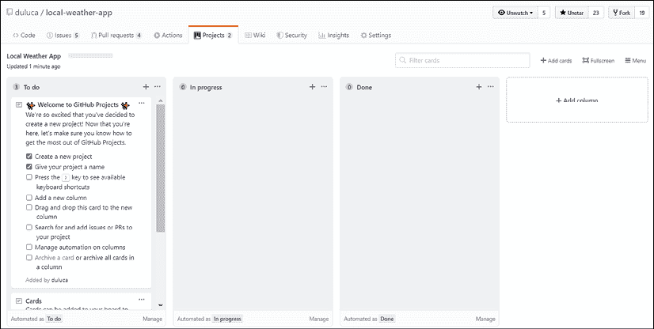

图 3.2：你的项目看板

如果您的仓库中已有现有问题，您可能会被提示将卡片添加到您的看板。现在您可以安全地忽略它，稍后再用 **+ 添加卡片** 按钮返回。您还会看到几个 **待办** 卡片。您可以自由地审查并删除这些卡片以清理您的看板。

如果您想跟踪每个发布或冲刺，可以为每个创建一个新的项目。创建新项目有助于跟踪特定发布或冲刺的完成百分比，但这会引入额外的管理开销。

接下来，我们将配置项目为看板板而不是 GitHub 项目，这是一种轻量级的方法，可以组织您的工作，您可能会选择它而不是其他方法，如 Scrum。

## 配置看板板

看板不定义您工作的正式迭代或发布。如果您想有一个低开销的过程，只与一个项目工作，可以通过向项目中引入待办事项列来实现。

现在，让我们添加一个待办事项列：

1.  点击 **+ 添加列**。

1.  在 **列名称** 中输入 `Backlog`。

1.  对于 **预设** 选择 **待办**。

1.  在 **当以下条件满足时移动问题到这里** 下，选择 **新添加的**，如图所示：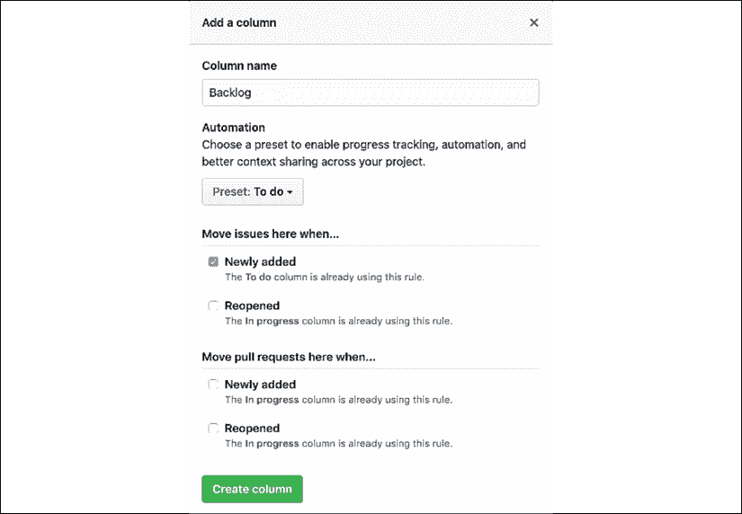

    图 3.3：选择“新添加”的位置

1.  点击 **创建列**。

1.  将列拖动到最左侧的位置。

使用此设置，新问题被添加到 **待办事项** 中，允许您手动维护您打算在 **待办** 列表中工作的项目。

## 为本地天气应用程序创建待办事项列表

让我们创建一个待办事项列表，以便在实现应用程序设计的过程中跟踪您的进度。在创建问题时，您应该专注于交付具有用户价值的功能性迭代。

您必须克服的技术障碍对您的用户或客户没有兴趣。

以下是我们在首次发布中计划构建的功能：

+   显示当天的当前位置天气信息

+   显示当前位置的预报信息

+   添加城市搜索功能，以便用户可以看到其他城市的天气信息

+   添加一个偏好设置面板以存储用户的默认城市

+   使用 Angular Material 改进应用程序的 UX

让我们再添加一些我们不会在本书中实现的功能，以此展示待办事项如何捕捉您的想法：

+   添加身份验证，以便用户可以从任何浏览器检索数据

+   添加 HTML5 地理位置支持

+   使用 `localStorage` 缓存用户偏好设置

您可以自由地向待办事项添加您能想到的其他功能。

首先，将前面的功能作为 GitHub 上的问题创建。确保将每个新问题分配给本章早期创建的项目。一旦创建，将前面定义的功能移动到**待办**列。当您开始处理一个任务时，将卡片移动到**进行中**列，当它完成时，将其移动到**完成**列。以下是我们计划开始工作的第一个功能——*显示当前日期当前位置的天气信息*的板子样子：

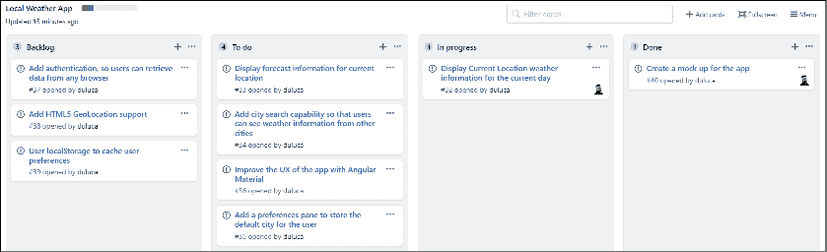

图 3.4：GitHub 上板子初始状态的一张快照

注意，我还添加了一个创建应用原型的问题，并将其移动到**完成**状态，这将在下一节中介绍。此外，GitHub 可能会在您打开和关闭它们时自动将卡片从一个状态移动到另一个状态。

最终，GitHub 项目提供了一个易于使用的图形用户界面，以便非技术人员可以轻松地与 GitHub 问题进行交互。通过允许非技术人员参与 GitHub 上的开发过程，您可以解锁 GitHub 成为您整个项目单一信息源的好处。关于功能和问题的疑问、答案和讨论都被跟踪为 GitHub 问题的组成部分，而不是在电子邮件中丢失。您还可以在 GitHub 上存储类似维基的文档。因此，通过在 GitHub 上集中所有项目相关的信息、数据、对话和工件，您极大地简化了需要持续维护且成本高昂的多个系统的复杂交互。对于私有仓库和本地企业安装，GitHub 的成本非常合理。如果您坚持开源，就像我们在本章中所做的那样，所有这些工具都是免费的。

作为额外的好处，我在我的仓库[`github.com/duluca/local-weather-app/wiki`](https://github.com/duluca/local-weather-app/wiki)上创建了一个基本的维基页面。请注意，您不能上传图片到`README.md`或维基页面。为了克服这一限制，您可以创建一个新的问题，在评论中上传一张图片，并将它的 URL 复制粘贴到`README.md`或维基页面上以嵌入图片。在示例维基中，我遵循了这种技术将线框设计嵌入到页面中。

在有了路线图之后，您现在可以开始创建您应用程序的原型了。

## 线框设计

现在有很多优秀的工具可以制作看起来粗糙的模型，用丰富的功能来展示你的想法。如果你有一个专门的 UX 设计师，这些工具对于创建准原型来说非常棒。然而，作为一个全栈开发者，我发现最好的工具还是笔和纸。这样，你不必学习**另一个工具**（**YAT**），而且这比完全没有设计要好得多。将事物放在纸上可以避免未来昂贵的编码错误，如果你能在用户验证你的线框设计之前就进行验证，那就更好了。我的应用叫做 LocalCast Weather，但请发挥创意，选择你自己的名字。看看，这是你的天气应用的线框设计：

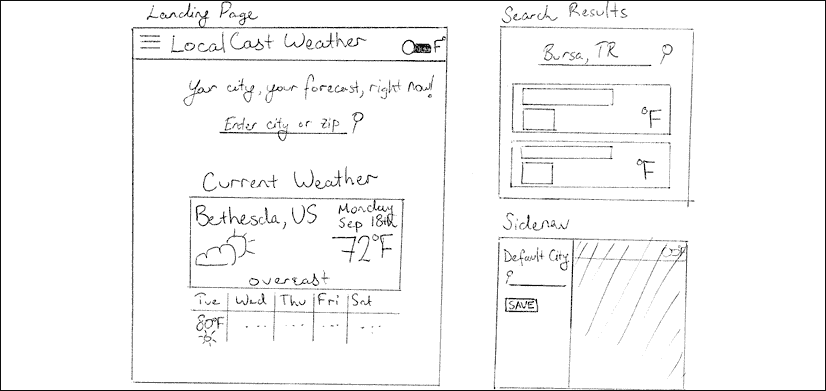

图 3.5：LocalCast 的手绘线框图。（提示：我确实使用了尺子！）

线框不需要太花哨。我建议从手绘设计开始，这非常快，而且能有效地传达粗略的轮廓。

现在有很多优秀的线框工具。我在这本书中建议并使用其中几个，然而，在你项目的最初几天，每一小时都很重要。

当然，这种粗略的设计可能永远不会超出你团队的边界，但请知道，没有什么能比将你的想法写在纸上或白板上更快地获得即时反馈和协作。

## 高级架构

无论你的项目大小如何，开始时有一个可以扩展的坚实基础架构至关重要。大多数时候，你无法提前准确预测项目的大小。坚持在*第一章*，*Angular 及其概念简介*中讨论的架构基础，可以导致一个不会过于繁重的架构，这样你可以快速执行一个简单的应用想法。关键是从一开始就确保适当的解耦。

在我看来，解耦有两种类型。一种叫做软解耦，这里指的是通过“绅士协议”来避免混合关注点，并尽量不破坏代码库。这可以应用到你所编写的代码，甚至到基础设施级别的交互。如果你让你的前端代码与后端代码保持相同的代码结构，并且如果你的 REST 服务器提供前端应用服务，那么你只是在实践软解耦。

你应该练习严格的解耦，这意味着前端代码位于一个独立的仓库中，永远不会直接调用数据库，并且完全托管在其自己的 Web 服务器上。这样，你可以确保在任何时候，你的 REST API 或前端代码都是完全可替换的，并且独立于其他代码。练习严格的解耦也有货币和安全方面的好处。你前端应用程序的托管和扩展需求肯定与后端不同，因此你可以相应地优化你的主机环境并节省资金。如果你只允许来自你的前端服务器的调用访问你的 REST API，你将大大提高你的安全性。考虑以下我们 LocalCast 天气应用的高级架构图：

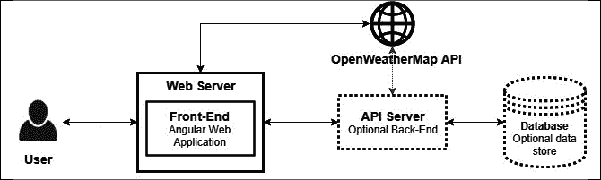

图 3.6：LocalCast 高级架构

高级架构显示，我们的 Angular Web 应用完全解耦于任何后端。它托管在其自己的 Web 服务器上，可以与 Web API（如**OpenWeatherMap**）通信，或者可选地与后端基础设施配对，以解锁 Web API 单独无法提供的丰富和定制化功能，例如存储每个用户的偏好或用我们自己的数据集补充 OpenWeatherMap API 的数据集。

无论你的后端技术是什么，我建议你的前端始终位于其仓库中，并使用不依赖于你的 API 服务器的 Web 服务器进行托管。

在第十章“RESTful API 和全栈实现”中，你将深入了解如何将 MongoDB、Express、Angular 和 Node 组成的 MEAN 栈应用在实践中结合起来。

现在我们已经有了我们的功能、线框设计和高级架构，我们可以开始实现我们的应用。

# 使用组件和接口制作 UI 元素

在第二章“设置你的开发环境”中，你应该已经创建了一个 Angular 应用。我们将以此作为起点。如果你还没有这样做，请回到第二章“设置你的开发环境”，并创建你的项目。

在本节中，你将利用 Angular 组件、接口和服务以解耦、一致和封装的方式构建当前天气功能。

默认情况下，Angular 应用的着陆页位于`app.component.html`。因此，首先通过基本的 HTML 编辑`AppComponent`的模板，为应用布局初始着陆体验。

我们现在开始开发功能 1：**显示当前日期的当前位置天气信息**，这样你就可以将 GitHub 项目中的卡片移动到**进行中**列。

1.  删除模板文件`app.component.html`中任何现有的代码

1.  添加一个`h1`标签作为标题，然后是我们的应用标语作为`div`标签，以及我们可能想要显示当前天气的占位符，如下面的代码块所示：

    ```js
    **src/app/app.component.html**
    <div style="text-align:center">
      <h1>
        LocalCast Weather
      </h1>
      <div>Your city, your forecast, right now!</div>
      <h2>Current Weather</h2>
      <div>current weather</div>
    </div> 
    ```

1.  从`component`类中移除未使用的`title`属性，使其为空

    ```js
    **src/app/app.component.ts**
    import { Component } from '@angular/core'
    @Component({
      selector: 'app-root',
      templateUrl: './app.component.html',
      styleUrls: ['./app.component.css'],
    })
    export class AppComponent {} 
    ```

1.  在终端中执行`npm start`

1.  在你的浏览器中导航到`http://localhost:5000`

现在，你应该能够在浏览器中实时观察你所做的更改。

注意，你应该使用 VS Code 中的集成终端来运行命令，这样你就不必在不同的窗口之间跳转。在 Windows 上使用`[CTRL] + `` ` ```，在 Mac 上使用`[^] + `` ` ```来打开终端。如果你不熟悉，`` ` ``是一个反引号，通常与`~`（波浪号）在同一键上。

## 添加 Angular 组件

我们需要显示当前的天气信息，其中`<div>current weather</div>`所在的位置。为了实现这一点，我们需要构建一个负责显示天气数据的组件。

创建独立组件的原因是编码在**模型-视图-视图模型**（**MVVM**）设计模式中的架构最佳实践。你可能之前听说过**模型-视图-控制器**（**MVC**）模式。大约在 2005-2015 年间编写的绝大多数基于 Web 的代码都是按照 MVC 模式编写的。MVVM 模式与 MVC 模式在有意义的方式上有所不同，正如我在 2013 年 DevPro 上的文章中解释的那样：

> MVVM 的有效实现内在地强制执行适当的关注点分离。业务逻辑与表示逻辑明显分离。因此，当开发视图时，它将保持开发状态，因为修复一个视图功能中的错误不会影响其他视图。另一方面，如果你有效地使用视觉继承并创建可重用的用户控件，修复一个地方中的错误可以修复整个应用程序中的问题。

Angular 提供了 MVVM 的实用实现：

> 视图模型优雅地封装了任何表示逻辑，并通过充当模型的专用版本来允许更简单的视图代码。视图和视图模型之间的关系简单明了，允许更自然地将 UI 行为封装在可重用的用户控件中。

你可以在[`bit.ly/MVVMvsMVC`](http://bit.ly/MVVMvsMVC)上阅读更多关于架构细微差别和插图的信息。

接下来，你使用 Angular CLI 的`ng generate`命令创建你的第一个 Angular 组件，该组件包括视图和视图模型：

1.  在终端中执行`npx ng generate component current-weather`

    确保你是在`local-weather-app`文件夹下执行`ng`命令，而不是在初始化项目的父文件夹下。此外，请注意`npx ng generate component current-weather`可以重写为`ng g c current-weather`。本书将使用简写格式并期望你在必要时添加`npx`。

1.  观察在`app`文件夹中创建的新文件：

    ```js
    **src/app**
    ├── app.component.css
    ├── app.component.html
    ├── app.component.spec.ts
    ├── app.component.ts
    ├── app.module.ts
    ├── current-weather
      ├── current-weather.component.css
      ├── current-weather.component.html
      ├── current-weather.component.spec.ts
      └── current-weather.component.ts 
    ```

    生成的组件有四个部分：

    +   `current-weather.component.css`包含任何特定于组件的 CSS，这是一个可选文件。

    +   `current-weather.component.html` 包含定义组件外观和绑定渲染的 HTML 模板，可以被认为是 View，结合任何使用的 CSS 样式。

    +   `current-weather.component.spec.ts` 包含基于 Jasmine 的单元测试，你可以扩展这些测试来测试你的组件功能。

    +   `current-weather.component.ts` 包含在类定义之上的 `@Component` 装饰器，并且是连接 CSS、HTML 和 JavaScript 代码的粘合剂。这个类本身可以被视为 ViewModel，从服务中获取数据并执行任何必要的转换，以便为 View 提供合理的绑定，如下所示：

    ```js
    **src/app/current-weather/current-weather.component.ts**
    import { Component, OnInit } from '@angular/core'
    @Component({
      selector: 'app-current-weather',
      templateUrl: './current-weather.component.html',
      styleUrls: ['./current-weather.component.css'],
    })
    export class CurrentWeatherComponent implements OnInit {
      constructor() {}
      ngOnInit() {}
    } 
    ```

    如果你计划编写的组件很简单，你可以使用内联样式和内联模板来简化你的代码结构。如果我们使用内联模板和样式重写上面的组件，它将看起来像以下示例：

    ```js
    **example**
    import { Component, OnInit } from '@angular/core'
    @Component({
      selector: 'app-current-weather', 
      template: `
      <p>
        current-weather works!
      </p>
      `,
      styles: []
    })
    export class CurrentWeatherComponent implements OnInit {
      constructor() {}
      ngOnInit() {}
    } 
    ```

    然而，我们不会内联这个模板。所以，保持你的生成代码不变。

    注意，模板被反引号字符 `` ` `` 包围，而不是单引号字符。反引号字符定义了一个模板字面量，允许定义换行而不必使用加号运算符连接字符串。你可以在 [`developer.mozilla.org/en-US/docs/Web/JavaScript/Reference/Template_literals`](https://developer.mozilla.org/en-US/docs/Web/JavaScript/Reference/Template_literals) 上了解更多关于模板字面量的信息。

    当你执行 `generate` 命令时，除了创建组件外，该命令还将在应用程序的根模块 `app.module.ts` 中添加你创建的新组件，从而避免了将组件连接在一起的繁琐任务：

    ```js
    **src/app/app.module.ts**
    ...
    import { 
      CurrentWeatherComponent 
    } from './current-weather/ current-weather.component'
    ...
    @NgModule({
    declarations: [
        AppComponent, 
        CurrentWeatherComponent
      ],
    ... 
    ```

    Angular 的引导过程确实有些复杂。这正是 Angular CLI 存在的主要原因。`index.html` 包含一个名为 `<app-root>` 的元素。当 Angular 开始执行时，它首先加载 `main.ts`，该文件配置了框架以供浏览器使用并加载应用程序模块。然后应用程序模块加载所有其依赖项，并在上述 `<app-root>` 元素内渲染。在 *第七章*，*创建以路由为第一线的业务应用* 中，当我们构建业务应用时，我们创建功能模块以利用 Angular 的可伸缩性功能。

    现在，我们需要在初始的 `AppComponent` 模板中显示我们的新组件，以便最终用户可以看到。

1.  通过将 `<div>current weather</div>` 替换为 `<app-current-weather></app-current-weather>` 来将 `CurrentWeatherComponent` 添加到 `AppComponent`：

    ```js
    **src/app/app.component.html**
    <div style="text-align:center">
      <h1>
        LocalCast Weather
      </h1>
      <div>Your city, your forecast, right now!</div>
      <h2>Current Weather</h2>
      <app-current-weather></app-current-weather>
    </div> 
    ```

1.  如果一切正常，你应该会看到以下内容：

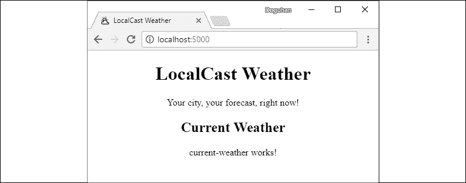

图 3.7：本地天气应用的初始渲染

注意浏览器窗口标签页中的图标和名称。作为网络开发的标准，在`index.html`文件中，更新`<title>`标签和`favicon.ico`文件以包含应用程序的名称和图标，以自定义浏览器标签页信息。如果你的 favicon 没有更新，请将`href`属性附加一个唯一的版本号，例如`href="favicon.ico?v=2"`。结果，你的应用程序将开始看起来像一个真正的网络应用程序，而不是 CLI 生成的启动项目。

既然你已经看到了 Angular 组件的实际应用，让我们来了解一下其背后的基础知识。

## 揭秘 Angular 组件

如同在*第一章*，*Angular 及其概念简介*中所述，Angular 组件是以 ES2015 类的方式实现的，这使得我们能够利用面向对象编程（OOP）的概念。类在强类型语言中是传统存在的，因此 JavaScript 作为动态类型语言实现类是非常出色的。类允许我们将功能和行为封装在自包含的单元（对象）中。我们可以用非常通用和抽象的方式定义行为，并实现继承层次结构以共享和将行为转化为不同的实现。

考虑到下面的`CurrentWeatherComponent`类，我可以强调一些类的优点：

```js
@Component(...)
export class CurrentWeatherComponent implements OnInit {
  constructor() {}
  ngOnInit() {}
} 
```

与函数不同，你无法直接在类中使用代码。它必须使用 new 关键字实例化为一个对象。这意味着我们可以有任意给定类的多个实例，每个对象都可以保持其内部状态。在这种情况下，Angular 在幕后为我们实例化组件。类的`constructor`在其实例化时执行。你可以在构造函数中放置任何初始化其他类或变量的代码。然而，你不应该在构造函数中进行 HTTP 调用或尝试访问 DOM 元素。这就是`OnInit`生命周期钩子发挥作用的地方。

当 Angular 初始化`CurrentWeatherComponent`为对象时，它也在遍历整个模块、组件、服务和其它依赖关系的图，以确保所有相互依赖的代码都被加载到内存中。在此期间，Angular 还不能保证 HTTP 或 DOM 访问的可用性。所有类实例化完成后，Angular 会遍历带有`@Component`装饰器的类，实现`OnInit`接口，并在我们的类中调用`ngOnInit`函数。这就是为什么我们需要将需要在组件首次加载时进行 HTTP 或 DOM 访问的任何代码放入`ngOnInit`中。

类可以有属性、变量和函数。从 Angular 模板中，你可以访问表达式中的任何属性、变量或函数。表达式的语法看起来像`{{ expression }}`，`[target]="expression"`，`(event)="expression"`或`*ngIf="expression"`。

现在你已经很好地理解了代码，或者模板背后的视图模型（ViewModel）是如何实例化的，以及你如何从模板中访问这段代码。在下一节中，我们将构建一个接口，这是一个定义对象形状的合约。

## 使用接口定义你的模型

现在你的视图（View）和视图模型（ViewModel）已经就绪，你需要定义你的模型。如果你回顾一下设计，你会看到该组件需要显示：

+   城市和国家

+   当前日期

+   当前图像

+   当前温度

+   当前天气描述

首先，你需要创建一个表示这种数据结构的接口。我们创建接口而不是类，因为接口是一种不包含任何实现的抽象。在创建触摸点或在不同组件之间传递数据时，如果我们依赖于抽象定义而不是可能实现不可预测的自定义行为的对象，我们可以确保一个解耦的设计，这可能导致错误。

首先创建接口：

1.  在终端中执行`npx ng generate interface ICurrentWeather`

1.  观察一个新创建的名为`icurrent-weather.ts`的文件，其中包含一个空接口定义，如下所示：

    ```js
    **src/app/icurrent-weather.ts**
    export interface ICurrentWeather {
    } 
    ```

    这不是一个理想的环境，因为我们可能会向我们的应用程序添加许多接口，跟踪各种接口可能会变得繁琐。随着时间的推移，当你将这些接口的具体实现作为类添加时，将类及其接口放在它们的文件中是有意义的。

    为什么不直接将接口命名为`CurrentWeather`呢？这是因为，稍后我们可能会创建一个类来实现`CurrentWeather`的一些有趣行为。接口建立了一个合约，为任何实现或扩展该接口的类或接口上的可用属性建立列表。始终意识到你是在使用类还是接口非常重要。如果你遵循最佳实践，始终以大写`I`开始你的接口名称，你将始终意识到你正在传递的对象类型。因此，接口被命名为`ICurrentWeather`。

1.  将`icurrent-weather.ts`重命名为`interfaces.ts`

1.  此外，按照以下方式实现接口：

    ```js
    **src/app/interfaces.ts**
    export interface ICurrentWeather {
      city: string
      country: string 
      date: Date 
      image: string
      temperature: number 
      description: string
    } 
    ```

    这个接口及其最终作为类的具体表示是 MVVM 中的模型。到目前为止，我已经强调了 Angular 的各个部分如何符合 MVVM 模式；接下来，我将按照它们的实际名称来引用这些部分。

    现在，我们可以将接口导入组件中，并开始在`CurrentWeatherComponent`的模板中设置绑定。

1.  导入`ICurrentWeather`

1.  切换回`templateUrl`和`styleUrls`

1.  定义一个名为`current`的局部变量，其类型为`ICurrentWeather`：

    ```js
    **src/app/current-weather/current-weather.component.ts**
    import { Component, OnInit } from '@angular/core' 
    import { ICurrentWeather } from '../interfaces'
    @Component({
      selector: 'app-current-weather',
      templateUrl: './current-weather.component.html',
      styleUrls: ['./current-weather.component.css'],
    })
    export class CurrentWeatherComponent implements OnInit {
      current: ICurrentWeather
      constructor() {}
      ngOnInit() {}
    } 
    ```

    如果你只输入`current:ICurrentWeather`，你可以使用 VS Code 中的自动修复功能来自动插入`import`语句。

    在构造函数中，你需要暂时用占位符数据填充`current`属性以测试你的绑定。

1.  将模拟数据实现为一个 JSON 对象，并使用`as`运算符声明其遵循`ICurrentWeather`：

    ```js
    **src/app/current-weather/current-weather.component.ts**
    ...
    constructor() { 
      this.current = {
        city: 'Bethesda', 
        country: 'US', 
        date: new Date(),
        image: 'assets/img/sunny.svg', 
        temperature: 72,
        description: 'sunny',
      } as ICurrentWeather
    }
    ... 
    ```

    在`src/assets`文件夹中，创建一个名为`img`的子文件夹，并将你选择的图片放置在那里以供你的模拟数据引用。

    你可能会忘记你创建的界面中的确切属性。你可以通过按住`Ctrl`并用鼠标悬停在界面名称上快速查看它们，如图所示：

    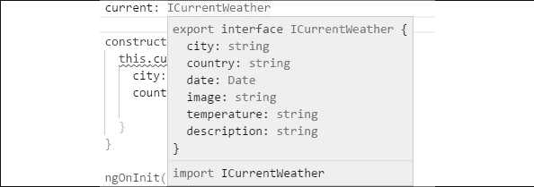

    图 3.8：`Ctrl` + 悬停在界面上

    现在，更新模板以将绑定与基本的 HTML 布局连接起来。

1.  开始实现模板：

    ```js
    **src/app/current-weather/current-weather.component.html**
    <div>
      ...
    </div> 
    ```

1.  在父`div`内部，定义另一个`div`来使用绑定显示城市和国家信息：

    ```js
    <div>
      <span>{{current.city}}, {{current.country}}</span>
      ...
    </div> 
    ```

    注意，在`span`内部，你可以使用静态文本来定位两个属性。在这种情况下，`city`和`country`由逗号分隔，后面跟着一个空格。

1.  在`city`和`country`下方，使用绑定和`DatePipe`定义属性显示格式来显示`date`：

    ```js
    <span>{{current.date | date:'fullDate'}}</span> 
    ```

    要更改`current.date`的显示格式，我们使用了上面的`DatePipe`，传入`'fullDate'`作为格式选项。在 Angular 中，可以使用各种内置和自定义的`|`操作符来更改数据的显示外观，而实际上并不改变底层数据。这是一个非常强大、方便且灵活的系统，可以共享这样的用户界面逻辑，而无需编写重复的模板代码。

    在前面的例子中，如果我们想以更紧凑的形式表示当前日期，我们可以传入`'shortDate'`。有关`DatePipe`的各种选项的更多信息，请参阅[`angular.io/api/common/DatePipe`](https://angular.io/api/common/DatePipe)文档。

1.  定义另一个`div`来显示温度信息，使用`DecimalPipe`格式化值，并将当前天气的图像绑定到一个`img`标签：

    ```js
    <div>
      
      <span>{{current.temperature | number:'1.0-0'}}˚F</span>
    </div> 
    ```

    我们使用方括号语法将图像属性绑定到`img`标签的`src`属性。接下来，我们使用`DecimalPipe`格式化`current.temperature`，以确保不显示小数值。文档在[`angular.io/api/common/DecimalPipe`](https://angular.io/api/common/DecimalPipe)。

    注意，你可以使用各自的 HTML 代码来渲染˚C 和˚F：`&#8451;`用于˚C，`&#8457;`用于˚F。

1.  创建一个最终的`div`来显示描述属性：

    ```js
    <div>
      {{current.description}}
    </div> 
    ```

1.  你的最终模板应该如下所示：

    ```js
    **src/app/current-weather/current-weather.component.html**
    <div>
      <div>
        <span>{{current.city}}, {{current.country}}</span>
        <span>{{current.date | date:'fullDate'}}</span>
      </div>
      <div>
        
        <span>{{current.temperature | number:'1.0-0'}}˚F</span>
      </div>
      <div>
        {{current.description}}
      </div>
    </div> 
    ```

1.  如果一切正常工作，你的应用应该看起来与这个截图相似：

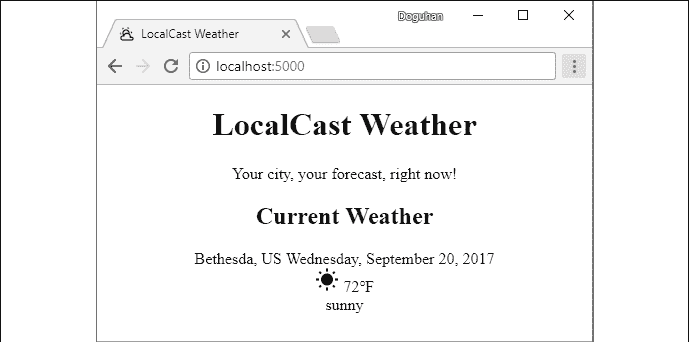

图 3.9：连接了模拟数据的 App

恭喜你 – 你已经成功连接了你的第一个组件！

现在让我们更新应用，以便可以从 Web API 中拉取实时天气数据。

# 使用 Angular 服务和 HttpClient 检索数据

现在您需要将您的 `CurrentWeather` 组件连接到 `OpenWeatherMap` API 以获取实时天气数据。然而，我们不想直接将此代码插入到我们的组件中。如果我们这样做，如果 API 发生变化，我们就必须更新组件。现在想象一个拥有数十或数百个视图的应用程序，想象这将如何创建一个重大的可维护性挑战。

相反，我们将利用一个 Angular 服务，一个单例类，它可以为我们组件提供当前的天气信息，并抽象出数据源。这种抽象将 UI 与 Web API 解耦。利用这种关注点的分离，在未来，我们可以增强我们的服务以从多个 API 或本地缓存中获取天气信息，而无需更改 UI 代码。

在接下来的章节中，我们将介绍以下步骤以实现这一目标：

1.  创建一个新的 Angular 服务

1.  导入 `HttpClientModule` 并将其注入到服务中

1.  发现 `OpenWeatherMap` API

1.  创建一个符合 API 形状的新的接口

1.  编写一个 `get` 请求

1.  将新服务注入到 `CurrentWeather` 组件中

1.  从 `CurrentWeather` 组件的 `ngOnInit` 函数中调用服务

1.  最后，使用 RxJS 函数将 API 数据映射到本地的 `ICurrentWeather` 类型，以便您的组件可以消费它

## 创建一个新的 Angular 服务

任何超出组件边界之外的代码都应该存在于服务中；这包括组件间的通信（除非存在父子关系）、任何类型的 API 调用，以及任何从 cookie 或浏览器的 `localStorage` 中缓存或检索数据的代码。这是一个关键的建筑模式，可以确保您的应用程序在长期内可维护。我在我的 DevPro MVVM 文章中扩展了这个想法，链接为 [`www.itprotoday.com/microsoft-visualstudio/mvvm-and-net-great-combo-web-application-development`](https://www.itprotoday.com/microsoft-visualstudio/mvvm-and-net-great-combo-web-application-developme)。

要创建一个 Angular 服务，请使用 Angular CLI：

1.  在终端中，执行 `npx ng g s weather --flat false`

1.  观察新创建的 `weather` 文件夹：

    ```js
    **src/app**
    ...
    └── weather
    ├── weather.service.spec.ts
    └── weather.service.ts 
    ```

CLI 生成的服务有两个部分：

+   `weather.service.spec.ts` 包含基于 Jasmine 的单元测试，您可以扩展以测试服务功能。

+   `weather.service.ts` 包含在类定义之上的 `@Injectable` 装饰器，这使得可以将此服务注入到其他组件中，利用 Angular 的提供者系统。这确保了我们的服务是单例的，意味着它只实例化一次，无论它在其他地方被注入多少次。

服务生成如下所示：

```js
**src/app/weather/weather.service.ts**
import { Injectable } from '@angular/core'
@Injectable({
  providedIn: 'root',
})
export class WeatherService {
  constructor() {}
} 
```

注意，`providedIn` 属性确保根模块在 `app.module.ts` 中提供天气服务。

接下来，让我们看看 Angular 中的依赖注入机制，它允许服务、组件或模块之间使用其他服务、组件或模块，而无需开发者管理共享对象的实例化。

## 依赖注入

要进行 API 调用，你需要利用 Angular 中的`HttpClient`模块。官方文档([`angular.io/guide/http`](https://angular.io/guide/http))简洁地解释了此模块的优点：

> "使用 HttpClient，@angular/common/http 为 Angular 应用程序提供了一个简化的 HTTP 功能 API，它建立在浏览器暴露的 XMLHttpRequest 接口之上。HttpClient 的其他优点包括测试支持、请求和响应对象的强类型、请求和响应拦截器支持，以及基于 Observables 的 API 提供的更好的错误处理。"

让我们从将`HttpClientModule`导入我们的应用程序开始，这样我们就可以将模块提供的`HttpClient`注入到`WeatherService`中：

1.  将`HttpClientModule`添加到`app.module.ts`中，如下所示：

    ```js
    **src/app/app.module.ts**
    ... 
    import { HttpClientModule } from '@angular/common/http' 
    ... 
    @NgModule({ 
      ... 
      imports: [..., HttpClientModule]
      ...
    }) 
    ```

1.  将`HttpClient`注入到`WeatherService`中，如下所示：

    ```js
    **src/app/weather/weather.service.ts**
    import { HttpClient } from '@angular/common/http'
    import { Injectable } from '@angular/core'
    @Injectable()
    export class WeatherService {
      constructor(private httpClient: HttpClient) {}
    } 
    ```

现在，`httpClient`已准备好在你的服务中使用。

## 发现 OpenWeatherMap API

由于`httpClient`是强类型的，我们需要创建一个新的接口，该接口符合我们将要调用的 API 的形状。为了能够做到这一点，你需要熟悉当前天气数据 API：

1.  通过导航到[`openweathermap.org/current`](http://openweathermap.org/current)阅读文档：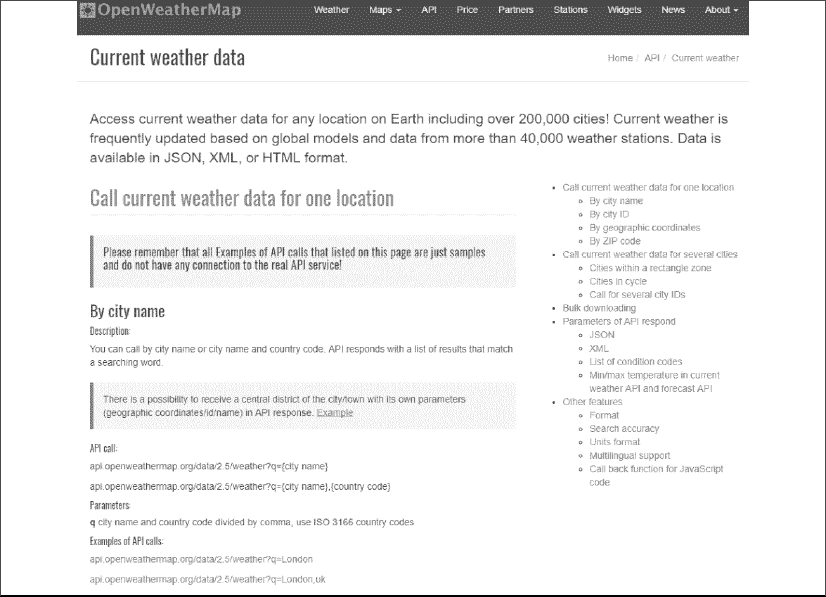

    图 3.10：OpenWeatherMap 当前天气数据 API 文档

    你需要使用名为**按城市名称**的 API，它允许你通过提供城市名称作为参数来获取当前天气数据，这样我们的网络请求看起来如下所示：

    ```js
    api.openweathermap.org/data/2.5/weather?q={city name},{country code} 
    ```

1.  在文档页面上，点击**API 调用示例**下的链接，你将看到如下所示的示例响应：

    ```js
    **http://samples.openweathermap.org/data/2.5/weather?q=London,uk&appid=b1b15e88fa797225412429c1c50c122a1**
    {
      "coord": { 
        "lon": -0.13,
        "lat": 51.51
      },
      "weather": [
        {
          "id": 300,
          "main": "Drizzle",
          "description": "light intensity drizzle",
          "icon": "09d"
        }
      ],
      "base": "stations",
      "main": {
        "temp": 280.32,
        "pressure": 1012,
        "humidity": 81,
        "temp_min": 279.15,
        "temp_max": 281.15
      },
      "visibility": 10000,
      "wind": {
        "speed": 4.1,
        "deg": 80
      },
      "clouds": {
      "all": 90
      },
      "dt": 1485789600,
      "sys": {
        "type": 1,
        "id": 5091,
        "message": 0.0103,
        "country": "GB",
        "sunrise": 1485762037,
        "sunset": 1485794875
      },
      "id": 2643743,
      "name": "London",
      "cod": 200
    } 
    ```

    给定你已创建的现有`ICurrentWeather`接口，此响应包含的信息比你需要的多。你需要编写一个新的接口，该接口符合此响应的形状，但仅指定你打算使用的数据部分。此接口仅存在于`WeatherService`中，我们不会将其导出，因为应用程序的其他部分不需要了解此类型。

1.  在`weather.service.ts`中的`import`和`@Injectable`语句之间创建一个名为`ICurrentWeatherData`的新接口

1.  新接口应该如下所示：

    ```js
    **src/app/weather/weather.service.ts**
    interface ICurrentWeatherData { 
      weather: [{
        description: string,
        icon: string
      }],
      main: {
        temp: number
      },
      sys: {
        country: string
      },
      dt: number,
      name: string
    } 
    ```

使用`ICurrentWeatherData`接口，我们通过向接口添加具有不同结构的子对象来定义新的匿名类型。这些对象中的每一个都可以单独提取出来并定义为自己的命名接口。特别注意的是，`weather`是一个具有`description`和`icon`属性的匿名类型的数组。

接下来，让我们学习如何将环境变量引入到你的 Angular 应用程序中，以便你的应用程序的测试和产品版本可以依赖不同的值。

## 存储环境变量

容易被忽略的是，前几节中的示例 URL——`http://samples.openweathermap.org/data/2.5/weather?q=London,uk&appid=b1b15e88fa797225412429c1c50c122a1`——包含一个必需的`appid`参数。你必须将此密钥存储在你的 Angular 应用程序中。你可以将其存储在天气服务中，但现实中，应用程序需要能够在从开发到测试、预生产和生产环境迁移时针对不同的资源集。默认情况下，Angular 提供了两个环境：一个是`prod`，另一个是默认环境。

在你继续之前，你需要注册一个免费的`OpenWeatherMap`账户并获取你的`appid`。你可以在[`openweathermap.org/appid`](http://openweathermap.org/appid)上阅读有关`appid`的文档以获取更多信息。

1.  复制你的`appid`，它是一串由字符和数字组成的长字符串

1.  在`environment.ts`中存储你的`appid`

1.  为后续使用配置`baseUrl`：

    ```js
    **src/environments/environment.ts**
    export const environment = {
      production: false,
      appId: 'xxxxxxxxxxxxxxxxxxxxxxxxxxxxxxxx',
      baseUrl: 'http://',
    } 
    ```

在代码中，我们使用驼峰式`appId`来保持我们的编码风格一致。

由于 URL 参数不区分大小写，`appId`和`appid`都可以使用。

接下来，让我们实现一个 HTTP GET 来获取当前的天气数据。

## 实现 HTTP GET 操作

现在，我们可以在`WeatherService`类中实现 GET 调用：

1.  向`WeatherService`类中添加一个名为`getCurrentWeather`的新函数

1.  导入`environment`对象

1.  实现 HTTP GET 函数

1.  返回 HTTP 调用的结果：

    ```js
    **src/app/weather/weather.service.ts**
    import { HttpClient } from '@angular/common/http'
    import { environment } from '../../environments/environment'
    ...
    export class WeatherService {
      constructor(
        private httpClient: HttpClient
      ) { }
    getCurrentWeather(city: string, country: string) { 
      return this.httpClient
        .get<ICurrentWeatherData>(
        `${environment.baseUrl}api.openweathermap.org/data/2.5/weather?` +
            `q=${city},${country}&appid=${environment.appId}`
        )
      }
    } 
    ```

    注意 ES2015 的字符串插值功能的使用。你不需要像`environment.baseUrl + 'api.openweathermap.org/data/2.5/weather?q=' + city + ',' + country + '&appid=' + environment.appId`那样通过将变量一个接一个地附加来构建你的字符串，你可以使用反引号语法来包裹` ``your string`` ``。在反引号内部，你可以使用换行符，并通过使用`${dollarbracket}`语法直接在字符串流中嵌入变量。然而，当你代码中引入换行符时，它被解释为一个字面换行符`\n`。为了在代码中分割字符串，你可以添加一个反斜杠`\`，但这样你的代码的下一行就不能有缩进。正如前面的代码示例所示，直接连接多个模板会更简单。

    使用长而复杂的字符串是一个容易出错的流程。相反，我们可以使用`HttpParams`对象来程序化地构建 URL。

1.  利用`HttpParams`简化 URL：

    ```js
    **src/app/weather/weather.service.ts**
    import { HttpClient, HttpParams } from '@angular/common/http'
    import { environment } from '../../environments/environment'
    ...
    export class WeatherService {
      constructor(private httpClient: HttpClient) { }
      getCurrentWeather(city: string, country: string) {
        const uriParams = new HttpParams()
          .set('q', `${city},${country}`)
          .set('appid', environment.appId)
        return this.httpClient
          .get<ICurrentWeatherData>(
        `${environment.baseUrl}api.openweathermap.org/data/2.5/weather`,
            { params: uriParams }
          )
      }
    } 
    ```

现在，让我们连接这些点，以便我们可以通过利用天气服务从`CurrentWeather`组件中获取当前的天气数据。

## 从组件中检索服务数据

要能在`CurrentWeather`组件中使用`getCurrentWeather`函数，你需要将该服务注入到组件中：

1.  将`WeatherService`注入到`CurrentWeatherComponent`类的构造函数中

1.  在构造函数中移除创建模拟数据的现有代码：

    ```js
    **src/app/current-weather/current-weather.component.ts**
    constructor(private weatherService: WeatherService) { } 
    ```

    注意使用 TypeScript 泛型与`get`函数的尖号语法，如`<TypeName>`。使用泛型是一个开发时提高生活质量的特性。通过向函数提供类型信息，输入和/或返回变量的类型会在你编写代码时显示，并在开发和编译时进行验证。

1.  在`ngOnInit`函数内部调用`getCurrentWeather`函数：

    ```js
    **src/app/current-weather/current-weather.component.ts**
    ngOnInit() { 
      this.weatherService.getCurrentWeather('Bethesda', 'US')
        .subscribe((data) => this.current = data)
    } 
    ```

提醒一下：不要期望这段代码立即就能工作，因为`data`的类型是`ICurrentWeatherData`，而`current`的类型是`ICurrentWeather`。你可以观察错误，它应该会提示"`error TS2322: 类型 'Observable<ICurrentWeatherData>' 无法分配给类型 'Observable<ICurrentWeather>'`。"让我们看看下一部分的内容。

Angular 组件拥有丰富的生命周期钩子，允许你在组件渲染、刷新或销毁时注入自定义行为。`ngOnInit()`是你将最常使用的生命周期钩子。它只调用一次，当组件首次实例化或访问时。这就是你想要执行服务调用的地方。要深入了解组件生命周期钩子，请查看[`angular.io/guide/lifecycle-hooks`](https://angular.io/guide/lifecycle-hooks)中的文档。

注意，你传递给`subscribe`的匿名函数是一个 ES2015 箭头函数。如果你不熟悉箭头函数，一开始可能会感到困惑。箭头函数非常优雅且简单。考虑以下箭头函数：

```js
(data) => { this.current = data } 
```

你可以简单地将其重写为：

```js
function(data) { this.current = data } 
```

有一个特殊条件——当你编写一个转换数据的箭头函数时，例如：

```js
(data) => { data.main.temp } 
```

此函数有效地将`ICurrentWeatherData`作为输入，并返回`temp`属性。返回语句是隐式的。如果你将其重写为一个普通函数，它看起来如下所示：

```js
function(data) { return data.main.temp } 
```

当`CurrentWeather`组件加载时，`ngOnInit`会触发一次，调用`getCurrentWeather`函数，该函数返回一个类型为`Observable<ICurrentWeatherData>`的对象。

可观察对象*是 RxJS 中最基本的构建块*，它代表了一个事件发射器，它会在一段时间内发射任何接收到的数据，其类型如官方文档中所述的`ICurrentWeatherData`。

可观察对象本身是良性的，除非被监听，否则不会通过网络发送请求。你可以在[`reactivex.io/rxjs/class/es6/Observable.js~Observable.html`](https://reactivex.io/rxjs/class/es6/Observable.js~Observable.html)了解更多关于可观察对象的信息。

通过在 Observable 上调用 `.subscribe`，你实际上是在将一个监听器附加到发射器上。你在 `subscribe` 方法中实现了一个匿名函数，该函数在接收到新数据并发出事件时执行。匿名函数接受一个数据对象作为参数，在这种情况下，具体的实现将数据块分配给名为 `current` 的局部变量。每当 `current` 更新时，你之前实现的模板绑定会拉入新数据并在视图中渲染它。即使 `ngOnInit` 只执行一次，对 Observable 的订阅仍然存在。因此，每当有新数据时，`current` 变量就会更新，视图会重新渲染以显示最新数据。

当前错误的根本原因是正在发出的数据类型为 `ICurrentWeatherData`；然而，我们的组件只能理解按照 `ICurrentWeather` 接口描述的形状的数据。在下一节中，你需要更深入地了解 RxJS，以了解如何最好地完成这项任务。

注意，VS Code 和 CLI 有时会出现停止工作的情况。如前所述，当你编码时，`npm start` 命令正在 VS Code 的集成终端中运行。Angular CLI 与 Angular 语言服务插件结合使用，持续监视代码更改并将你的 TypeScript 代码转换为 JavaScript，以便你可以在浏览器中使用实时重新加载来观察你的更改。好事是，当你犯编码错误时，除了 VS Code 中的红色下划线外，你还会在终端或浏览器中看到一些红色文本，因为转换失败了。在大多数情况下，当你纠正错误时，红色下划线会消失，Angular CLI 会自动重新转换你的代码，一切都会正常工作。然而，在特定场景中，请注意 VS Code 无法在 IDE 中识别类型更改，因此你将不会获得自动完成帮助，或者 CLI 工具可能会因为显示 **webpack:** **Failed to compile** 的消息而卡住。

你有两种主要策略来从这种状态中恢复：

+   点击终端并按 `Ctrl` + `C` 停止运行 CLI 任务，然后通过执行 `npm start` 重新启动。

+   如果这不起作用，请使用 `Alt` + `F4`（Windows）或 `` + `Q`（macOS）退出 VS Code，并重新启动它。鉴于 Angular 和 VS Code 的月度发布周期，我坚信随着时间的推移，工具将只会变得更好。

让我们通过转换数据形状来解决类型不匹配问题。

# 使用 RxJS 转换数据

我们将使用 RxJS 的响应式管道（或数据流）来重塑来自外部 API 的数据结构，以适应我们 Angular 应用中预期的数据形状。如果我们不这样做，那么我们的代码将因类型不匹配错误而失败。

参考第一章，*Angular 及其概念简介*，以深入了解 RxJS 和响应式编程。

## 实现响应式转换

为了避免未来出现从你的服务中返回不期望的数据类型等错误，你需要更新 `getCurrentWeather` 函数，将其返回类型定义为 `Observable<ICurrentWeather>` 并导入 `Observable` 类型，如下所示：

```js
**src/app/weather/weather.service.ts**
import { Observable } from 'rxjs'
import { ICurrentWeather } from '../interfaces'
...
export class WeatherService {
  ...
  getCurrentWeather(city: string, country: string): 
    Observable<ICurrentWeather> {
  }
  ...
} 
```

现在，VS Code 告诉你，类型 `Observable<ICurrentWeatherData>` 不能赋值给类型 `Observable<ICurrentWeather>`:

1.  编写一个名为 `transformToICurrentWeather` 的转换函数，该函数可以将 `ICurrentWeatherData` 转换为 `ICurrentWeather`

1.  此外，编写一个名为 `convertKelvinToFahrenheit` 的辅助函数，该函数可以将 API 提供的开尔文温度转换为华氏温度：

    ```js
    **src/app/weather/weather.service.ts**
    export class WeatherService {
    ...
      private transformToICurrentWeather(data: ICurrentWeatherData): ICurrentWeather {
        return {
          city: data.name,
          country: data.sys.country,
          date: data.dt * 1000,
          image:
    `http://openweathermap.org/img/w/${data.weather[0].icon}.png`, 
          temperature: this.convertKelvinToFahrenheit(data.main.temp), 
          description: data.weather[0].description,
        }
      }
      private convertKelvinToFahrenheit(kelvin: number): number
      { 
        return kelvin * 9 / 5 - 459.67
      }
    } 
    ```

    注意，你需要在当前阶段将图标属性转换为图像 URL。在服务中这样做有助于保持封装；在视图模板中将图标值绑定到 URL 上会破坏**关注点分离**（**SoC**）原则。如果你希望创建真正模块化、可重用和可维护的组件，你必须保持警惕并严格执行 SoC。有关天气图标和如何形成 URL 的详细说明，包括所有可用的图标，可以在[`openweathermap.org/weather-conditions`](http://openweathermap.org/weather-conditions)找到。

    另一方面，可以说开尔文到华氏的转换是视图关注点，但我们已经在服务中实现了它。这个论点站得住脚，特别是考虑到我们有一个计划中的功能，可以切换摄氏度和华氏度。反论点是，目前我们只需要显示华氏温度，并且将单位转换为天气服务的一部分工作。这个论点也有道理。最终的实现是编写一个自定义的 Angular 管道并将其应用于模板。管道可以轻松地与计划中的切换按钮绑定。

    然而，目前我们只需要显示华氏温度，我会选择*不*过度设计解决方案。

1.  将 `ICurrentWeather.date` 更改为 `number` 类型

    在编写转换函数时，请注意 API 以数字形式返回日期。这个数字代表自 Unix 纪元（时间戳）以来的秒数，即 1970 年 1 月 1 日 00:00:00 UTC。然而，`ICurrentWeather`期望一个`Date`对象。通过将其传递给`Date`对象的构造函数，如`new Date(data.dt)`，转换时间戳是很容易的。这是可以的，但也是不必要的，因为 Angular 的`DatePipe`可以直接处理时间戳。为了追求极致的简洁性和最大限度地利用我们使用的框架的功能，我们将`ICurrentWeather`更新为使用数字。如果你正在转换大量数据，这种方法还有性能和内存上的好处，但在这里这个顾虑不适用。有一个注意事项——JavaScript 的时间戳是以毫秒为单位的，但服务器值是以秒为单位的，所以在转换过程中仍然需要进行简单的乘法。

1.  在其他`import`语句下方导入 RxJS 的`map`操作符：

    ```js
    **src/app/weather/weather.service.ts**
    import { map } from 'rxjs/operators' 
    ```

    不得不手动导入`map`操作符可能看起来有些奇怪。RxJS 是一个功能强大的框架，具有广泛的 API 表面。一个`Observable`本身就有超过 200 个方法附加到它上。默认包含所有这些方法会导致开发时间问题，因为有很多函数可供选择，同时也对最终交付物的尺寸产生负面影响，包括应用性能和内存使用。你必须单独添加你打算使用的每个操作符。

1.  通过`pipe`将`httpClient.get`方法返回的数据流应用`map`函数

1.  将数据对象传递给`transformToICurrentWeather`函数：

    ```js
    **src/app/weather/weather.service.ts**
    ...
    return this.httpClient
      .get<ICurrentWeatherData>(
        `${environment.baseUrl}api.openweathermap.org/data/2.5/weather`,
        { params: uriParams }
      )
      .pipe(map(data => this.transformToICurrentWeather(data)))
    ... 
    ```

    现在，数据可以在流通过时进行转换，确保`OpenWeatherMap`当前天气 API 数据处于正确的形状，以便`CurrentWeather`组件可以消费它。

1.  确保你的应用编译成功

1.  在浏览器中检查结果：

    图 3.11：显示来自 OpenWeatherMap 的实时数据

    你应该看到你的应用能够从`OpenWeatherMap`拉取实时数据，并且能够正确地将服务器数据转换为预期的格式。

    你已经完成了功能 1 的开发：**显示当前日期的当前位置天气信息**。提交你的代码！

1.  最后，我们可以将这个任务移动到**完成**列：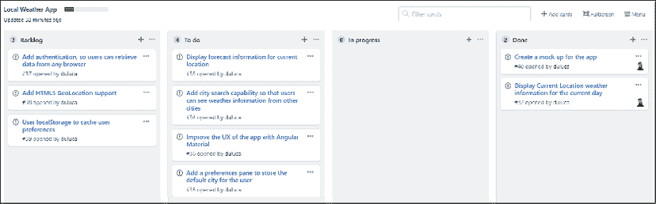

    图 3.12：GitHub 项目看板状态

干得好！你现在熟悉了 Angular 的基本架构。你通过利用 RxJS 开始以响应式范式编写代码。

现在让我们通过防范 null 或 undefined 值来提高我们应用的健壮性，这些值可能会破坏你的应用程序代码。

# Angular 中的 null 防护

在 JavaScript 中，`undefined` 和 `null` 值是一个持续存在的问题，必须在每个步骤中积极处理。这在与外部 API 和其他库打交道时尤其关键。如果我们不处理 `undefined` 和 `null` 值，那么你的应用程序可能会呈现渲染不良的视图、控制台错误、业务逻辑问题，甚至可能导致整个应用程序崩溃。

在 Angular 中，有多种策略可以防止空值：

+   属性初始化

+   安全导航操作符 `?.`

+   使用 `*ngIf` 进行空值保护

您可以使用这些策略中的一个或多个。然而，在接下来的几节中，我将演示为什么 `*ngIf` 策略是最佳选择。

为了模拟从服务器获取空响应的场景，请先在 `CurrentWeatherComponent` 的 `ngOnInit` 中注释掉 `getCurrentWeather` 调用：

```js
**src/app/current-weather/current-weather.component.ts**
ngOnInit(): void {
    // this.weatherService
    //   .getCurrentWeather('Bethesda', 'US')
    //   .subscribe(data => (this.current = data))
} 
```

让我们从实现属性初始化策略来防止空值开始。

## 属性初始化

在静态类型语言（如 Java）中，你被灌输的是适当的变量初始化/实例化是错误无操作的关键。因此，让我们在 `CurrentWeatherComponent` 中通过用默认值初始化 `current` 来尝试一下：

```js
**src/app/current-weather/current-weather.component.ts**
constructor(private weatherService: WeatherService) { 
  this.current = {
    city: '',
    country: '', 
    date: 0, 
    image: '',
    temperature: 0, 
    description: '',
  }
} 
```

这些更改的结果将控制台错误的数量从两个减少到零。然而，应用程序本身仍然没有达到可展示的状态，如下所示：


图 3.13：属性初始化的结果

为了使这个视图对用户友好，我们必须在模板上的每个属性上编写默认值。因此，通过初始化来解决空值保护问题，我们创建了一个默认值处理问题。初始化和默认值处理都是对开发者来说的 *O(n)* 规模的任务。在最理想的情况下，这种策略的实现令人烦恼，在最糟糕的情况下，效率极低且容易出错，每个属性至少需要 *O(2n)* 的努力。

接下来，让我们了解 Angular 的安全导航操作符，当处理我们无法控制哪些属性可能为 null 或 undefined 的外部对象时，这个操作符非常有用。

## 安全导航操作符

Angular 实现了安全导航操作符 `?.`，以防止意外遍历未定义的对象。因此，我们不必编写初始化代码并处理模板值，我们只需更新模板。

从构造函数中删除属性初始化代码，而是按照以下方式更新模板：

```js
**src/app/current-weather/current-weather.component.html**
<div>
  <div>
    <span>{{current?.city}}, {{current?.country}}</span>
    <span>{{current?.date | date:'fullDate'}}</span>
  </div>
  <div>
    
    <span>{{current?.temperature}}℉</span>
  </div>
  <div>
    {{current?.description}}
  </div>
</div> 
```

这次，我们不必创建默认值，而是让 Angular 处理显示未定义绑定。应用程序本身处于某种更好的状态。不再显示令人困惑的数据；然而，它仍然没有达到可展示的状态，如下所示：


你可能可以想象出安全导航操作符在更复杂场景中可能很有用的方式。然而，当大规模部署时，这种类型的编码仍然至少需要*O(n)*级别的努力来实现。

当向用户展示数据时，我们不想展示空值。清理 UI 的最简单方法就是利用`ngIf`指令来隐藏整个`div`。

## 使用*ngIf 进行空值保护

理想策略是使用`*ngIf`，这是一个结构化指令，意味着 Angular 会在遇到假值时停止遍历 DOM 树元素。

在`CurrentWeather`组件中，我们可以在尝试渲染模板之前轻松检查`current`变量是否为 null 或 undefined：

1.  撤销上一节中安全导航操作符的实现

1.  使用`*ngIf`更新最顶层的`div`元素，以检查`current`是否是一个对象，如下所示：

    ```js
    **src/app/current-weather/current-weather.component.html**
    <div *ngIf="!current">
      no data
    </div>
    <div *ngIf="current">
    ...
    </div> 
    ```

    现在观察控制台日志，没有错误被报告。你应该始终确保你的 Angular 应用程序报告零控制台错误。如果你在控制台日志中仍然看到错误，请确保你已经正确地将`OpenWeather` URL 恢复到其正确状态，或者终止并重新启动你的`npm start`进程。我强烈建议你在继续之前解决任何控制台错误。

1.  注意到 UI 现在会显示没有数据！

    图 3.15：使用*ngIf 进行空值保护的结果

1.  在`CurrentWeatherComponent`的`ngOnInit`中重新启用`getCurrentWeather`调用：

    ```js
    **src/app/current-weather/current-weather.component.ts**
    ngOnInit(): void {
      this.weatherService
          .getCurrentWeather('Bethesda', 'US')
          .subscribe(data => (this.current = data))
    } 
    ```

1.  提交你的更改。

使用空值保护，你可以确保你的 UI 始终看起来专业。

# 摘要

恭喜！在本章中，你创建了一个具有灵活架构的 Angular 应用程序，同时避免了过度设计。这是可能的，因为我们首先制定了一个路线图，并在一个对同事可见的看板中将其编码化。我们专注于实现我们首先放入进行中的第一个功能，并始终没有偏离计划。

你学习了如何通过积极声明函数的输入和返回类型以及使用泛型函数来避免编码错误。你使用了日期和小数管道来确保数据以所需的方式格式化，同时将格式化相关的问题主要保留在模板中，这种逻辑属于模板。

最后，你使用了接口在组件和服务之间进行通信，而没有将外部数据结构泄露给内部组件。通过结合应用所有这些技术，Angular、RxJS 和 TypeScript 允许我们这样做，你确保了适当的关注点分离和封装。因此，`CurrentWeather`组件现在真正是可重用和可组合的；这不是一件容易的事情。

如果你没有发布，那就从未发生过。在下一章中，我们将通过排除应用错误、确保自动化单元和端到端测试通过，以及使用 Docker 容器化 Angular 应用，为生产发布准备这个 Angular 应用，以便可以在网络上发布。

# 进一步阅读

+   *《便签背面：用图片解决问题和推销想法*》，丹·罗姆，2008 年。

+   *视觉思维：通过视觉协作赋予人们和组织力量*，威尔米恩·布兰德，2017 年。

+   *项目卡通*，[`projectcartoon.com`](http://projectcartoon.com)。

+   *项目管理，简单化*，GitHub，[`github.com/features/project-management`](https://github.com/features/project-management)。

+   *创建项目板*，GitHub，[`help.github.com/en/articles/creating-a-project-board`](https://help.github.com/en/articles/creating-a-project-board)。

# 问题

尽可能地回答以下问题，以确保你在不使用 Google 的情况下理解了本章的关键概念。你需要帮助回答这些问题吗？请参阅*附录 D*，*自我评估答案*，在线位于[`static.packt-cdn.com/downloads/9781838648800_Appendix_D_Self-Assessment_Answers.pdf`](https://static.packt-cdn.com/downloads/9781838648800_Appendix_D_Self-Assessment_Answers.pdf)或访问[`expertlysimple.io/angular-self-assessment`](https://expertlysimple.io/angular-self-assessment)。

1.  我介绍了看板的概念。它是什么，看板在我们的软件应用开发中扮演什么角色？

1.  我们使用 Angular CLI 工具创建 Local Weather 应用后，生成了哪些不同的 Angular 组件，以及每个组件的功能和角色是什么？

1.  在 Angular 中绑定数据的不同方式有哪些？

1.  为什么我们需要在 Angular 中使用服务？

1.  在 RxJS 中，可观察者是什么？

1.  如果你的模板背后的数据是假的，最容易的方式展示一个干净的 UI 是什么？
