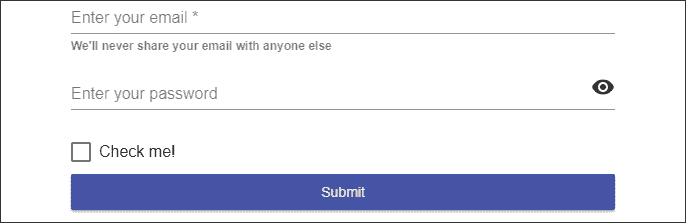

# 5

# 使用 Material 提供高质量 UX

在**第四章**，“自动化测试、CI 和发布到生产”中，我们提到了交付高质量应用程序的需求。目前，应用程序的外观和感觉非常糟糕，只适合 20 世纪 90 年代末创建的网站。用户或客户对你产品或工作的第一印象非常重要，因此我们必须能够创建一个外观出色且在移动和桌面浏览器上提供出色用户体验的应用程序。

作为全栈开发者，专注于应用程序的打磨是件困难的事情。当应用程序的功能集迅速增长时，这种情况往往会变得更糟。编写支持视图的出色模块化代码固然有趣，但随后又匆忙地使用 CSS 技巧和内联样式来改善应用程序的外观和感觉，这并不愉快。

在与 Angular 紧密协调下开发的 Angular Material 非常出色。如果你学会了如何有效地利用 Angular Material，你创建的功能将从一开始就看起来和运行得很好，无论你是在开发小型还是大型应用程序。

Angular Material 将使你成为一个更有效的 Web 开发者，因为它提供了一系列你可以利用的用户控件，你不必担心浏览器兼容性。作为额外的奖励，编写自定义 CSS 将变得罕见。

虽然本章介绍了如何创建一个吸引人的**用户界面**（UI），并利用 Angular Material 实现开箱即用的**用户体验**（UX），但了解不应该做什么也同样重要。有一个名为 User Interface 的网站，展示了 UI/UX 的糟糕实践，网址为[`userinyerface.com`](https://userinyerface.com)。

在本章中，你将学习以下内容：

+   区分 Angular Material 作为 UI/UX 库的特点

+   如何配置 Angular Material

+   使用 Angular Flex Layout 进行响应式设计

+   使用 Angular Material 提升 UX

+   通过**命令行界面**（CLI）工具强制执行可访问性合规性

+   构建交互式原型

书籍的样本代码的最新版本可在以下 GitHub 仓库链接中找到。该仓库包含代码的最终和完成状态。你可以在本章结束时通过查找`projects`文件夹下的代码章节快照来验证你的进度。

对于**第五章**：

1.  克隆以下仓库[`github.com/duluca/local-weather-app`](https://github.com/duluca/local-weather-app)

1.  在根目录下执行`npm install`以安装依赖项

1.  本章的代码示例位于以下子文件夹中：

    ```js
    projects/ch5 
    ```

1.  要运行本章的 Angular 应用程序，请执行：

    ```js
    npx ng serve ch5 
    ```

1.  要运行本章的 Angular 单元测试，请执行：

    ```js
    npx ng test ch5 --watch=false 
    ```

1.  要运行本章的 Angular e2e 测试，请执行：

    ```js
    npx ng e2e ch5 
    ```

1.  要构建本章的生产就绪型 Angular 应用程序，请执行：

    ```js
    npx ng build ch5 --prod 
    ```

注意，存储库根目录下的`dist/ch5`文件夹将包含编译结果。

请注意，书中或 GitHub 上的源代码可能并不总是与 Angular CLI 生成的代码相匹配。由于生态系统不断演变，书中代码与 GitHub 上代码之间的实现也可能存在细微差异。随着时间的推移，示例代码发生变化是自然的。在 GitHub 上，您可能会找到更正、修复以支持库的新版本，或者观察多种技术并行的实现。您只需实现书中推荐的理想解决方案即可。如果您发现错误或有问题，请创建一个 issue 或提交一个 pull request 到 GitHub，以供所有读者受益。

让我们先了解是什么让 Angular Material 成为 UI/UX 库的一个优秀选择。

# Angular Material

Angular Material 项目的目标是提供一组有用且具有标准设置的高质量 UI 组件。该库实现了谷歌的 Material Design 规范，该规范在谷歌的移动应用、网络属性和 Android 操作系统中无处不在。Material Design 具有特定的数字和方盒式外观和感觉，但它不仅仅是一个像 Bootstrap 一样的 CSS 库。考虑这里使用 Bootstrap 编写的登录体验：


图 5.1：Bootstrap 登录体验

注意，输入字段及其标签位于单独的行上，复选框是一个小目标，错误信息以临时吐司通知的形式显示，而**提交**按钮则静静地坐在角落里。现在，考虑以下 Angular Material 示例：



图 5.2：Angular Material 登录体验

输入字段及其标签最初是合并的，以紧凑的形态因素吸引用户的注意力。复选框触感友好，**提交**按钮默认拉伸以占用可用空间，从而提供更响应式的用户体验。一旦用户点击一个字段，标签就会折叠到输入字段的左上角，如下所示：


图 5.3：Angular Material 动画和错误

此外，验证错误信息以行内形式显示，与标签的颜色变化相结合，保持用户的注意力在输入字段上。

Material Design 帮助您设计具有自己品牌和样式的模块化 UI，同时定义动画，使用户在使用您的应用程序时拥有更好的用户体验。人类大脑无意识地跟踪对象及其位置。任何有助于过渡或对人类输入产生的变化做出反应的动画都能减少用户的认知负荷，因此使用户能够专注于处理内容，而不是试图弄清楚您特定应用程序的怪癖。

模块化 UI 设计和流畅运动的结合创造了一个出色的用户体验。看看 Angular Material 如何实现一个简单的按钮：


图 5.4：Angular Material 按钮动画

在前面的屏幕截图中，请注意按钮上的点击动画是从用户实际点击的位置开始的。虽然这种效果很微妙，但它创造了一种连续的运动，从而对用户的行为产生适当的屏幕反应。当按钮在移动设备上使用时，这种效果更为明显，从而带来更自然的人机交互。大多数用户无法明确表达出什么使得直观的用户体验真正直观，而这些微妙但至关重要的设计经验和设计中的提示，可以帮助你在为用户设计这种体验方面取得巨大进步。

Angular Material 还旨在成为 Angular 高质量 UI 组件的参考实现。如果您打算开发自己的自定义控件，Angular Material 的源代码应该是您首要的资源。术语“高质量”经常被使用，而且真正重要的是要量化它的含义。Angular Material 团队在他们的网站上表达得很好：

> **我们所说的“高质量”是什么意思？**
> 
> 国际化和可访问性，确保所有用户都能使用它们。直观的 API 不会让开发者感到困惑，并且能够在各种用例中按预期工作，而不会出现错误。行为经过单元和集成测试的充分测试。在 Material 设计规范范围内可定制。性能成本降至最低。代码整洁且文档完善，可作为 Angular 开发者的示例。支持浏览器和屏幕阅读器。
> 
> Angular Material 支持所有主流浏览器的最新两个版本：Chrome（包括 Android）、Firefox、Safari（包括 iOS）和 IE11/Edge。

构建网络应用程序，尤其是那些也兼容移动设备的，是非常困难的。有很多细微之处你必须注意。Angular Material 抽象掉了这些细微之处，包括支持所有主流浏览器，这样你就可以专注于创建你的应用程序。Angular Material 不是一种时尚，也不应该被轻视。如果使用得当，你可以大大提高你的生产力和工作的感知质量。

并非总是可以在项目中使用 Angular Material。我建议使用 PrimeNG，可在 [`www.primefaces.org/primeng`](https://www.primefaces.org/primeng) 找到，或者使用 Clarity，可在 [`vmware.github.io/clarity`](https://vmware.github.io/clarity) 找到，作为可以满足您大部分甚至所有用户控件需求的组件工具包。这里要避免的一件事是从不同的来源拉取数十个用户控件，最终得到一个包含数百个怪癖和错误的混乱库，这些怪癖和错误需要学习、维护或绕过。

在使用 UI 组件时，最显著的挑战之一是它们可以添加到您的应用程序包大小中的大量内容。接下来，让我们看看如何使用一致的组件库来帮助保持您应用程序的性能处于最佳状态，并为您的应用程序配置 Angular Material。

# Angular Material 设置和性能

默认情况下，Angular Material 配置为优化最终交付物的包大小。在 Angular JS 和 Angular Material 1.x 中，整个依赖库都会被加载。然而，现在使用 Angular Material，我们能够指定我们打算使用的组件，从而实现显著的性能提升。

在以下表格中，您可以看到典型 Angular 1.x + Angular Material 1.x 应用程序与 Angular 6 + Material 6 应用程序在高速低延迟光纤连接下的性能特性改进：

| **光纤网络** | **Angular 6 + Material 6** | **Angular 1.5 + Material 1.1.5** | **% 差异** |
| --- | --- | --- | --- |
| 首次绘制（DOMContentLoaded）* | 0.61 秒 | 1.69 秒** | 大约 2.8 倍更快 |
| JS 包大小* | 113 KB | 1,425 KB | 12.6 倍更小 |

*为了公平比较，结果中未包含图像或其他媒体内容*

**平均值：较差的基础设施导致渲染时间从 0.9 秒到 2.5 秒不等**

在高速低延迟的理想条件下，Angular 6 + Material 6 应用程序在 1 秒内加载完成。然而，当我们切换到更常见的普通速度和高延迟的快速 3G 移动网络时，差异变得更加明显，如下表所示：

| **快速 3G 移动网络** | **Angular 6 + Material 6** | **Angular 1.5 + Material 1.1.5** | **% 差异** |
| --- | --- | --- | --- |
| 首次绘制* | 1.94 秒 | 11.02 秒 | 5.7 倍更快 |
| JS 包大小* | 113 KB | 1,425 KB | 12.6 倍更小 |

*为了公平比较，结果中未包含图像或其他媒体内容*

尽管应用程序的大小差异保持一致，但您可以看到，由移动网络引入的额外延迟导致传统 Angular 应用程序的运行速度急剧下降，达到了不可接受的水平。

将所有组件添加到 Material 中会导致大约~1.3 MB 的额外负载需要发送给用户。正如您从之前的比较中看到的，这必须不惜一切代价避免。为了提供尽可能小的应用程序，这在移动和销售相关场景中至关重要，因为每次加载时间增加 100 毫秒都会影响用户保留率，您可以单独加载和包含模块。Webpack 的 tree-shaking 过程将模块分割成不同的文件，从而减少初始下载大小。

作为现实世界的例子，当您完成 LocalCast Weather 应用程序的最终版本构建后，您的应用程序包大小将约为 800 KB，在快速 3G 连接上使用 Angular 9 + Material 9 时，首次绘制时间仅为 2 秒多。一个功能齐全的多页面应用程序，利用懒加载，仅加载大约~300 KB 的依赖项，同时保持首次绘制时间低于 2 秒。

注意，示例应用程序包含可以裁剪掉的示例代码，这使得应用程序的体积更小。这证明了 Angular 生态系统如何提供丰富和优化的用户体验。

接下来，让我们设置 Angular Material。

## 安装 Angular Material

你有几种方法可以为你的 Angular 应用配置 Angular Material：

+   使用 Angular CLI 自动安装

+   使用 npm 手动安装

让我们开始这个任务，并使用 Angular Material 提升天气应用的 UX。将 **提升应用的 UX** 任务移动到我们 GitHub 项目的 **进行中** 状态。在这里，你可以看到我的看板状态：


图 5.5：GitHub 项目看板

### 自动安装

从 Angular 6 开始，你可以自动将 Angular Material 添加到你的项目中，从而在过程中节省大量时间：

1.  执行 `add` 命令，如下所示：

    ```js
    $ npx ng add @angular/material 
    ```

1.  选择名为 `indigo-pink` 的预构建主题

1.  当你得到提示 “`Set up global Angular Material typography styles?`” 时，输入 “`no`”

1.  当你得到提示 “`Set up browser animations for Angular Material?`” 时，输入 “`yes`”

1.  输出应类似于以下示例：

    ```js
    Installing packages for tooling via npm.
    Installed packages for tooling via npm.
    ? Choose a prebuilt theme name, or "custom" for a custom theme: Indigo/Pink        [ Preview: https://material.angular.io?theme=indigo-pink ]
    ? Set up global Angular Material typography styles? No
    ? Set up browser animations for Angular Material? Yes
    UPDATE package.json (1348 bytes)
    √ Packages installed successfully.
    UPDATE src/app/app.module.ts (423 bytes)
    UPDATE angular.json (3740 bytes)
    UPDATE src/index.html (487 bytes)
    UPDATE src/styles.css (181 bytes) 
    ```

    注意，`index.html` 文件已被修改，以添加图标库和默认字体，如下所示：

    ```js
    **src/index.html**
    <head>
      ...
      <link href="https://fonts.googleapis.com/css?family=Roboto:300,400,500&display=swap" rel="stylesheet">
      <link href="https://fonts.googleapis.com/icon?family=Material+Icons" rel="stylesheet">
    </head> 
    ```

    `angular.json` 文件已被更新以设置默认主题：

    ```js
    **angular.json**
    ...
    "styles": [
      "./node_modules/@angular/material/prebuilt-themes/indigo-pink.css",
      "src/styles.css"
    ],
    ... 
    ```

    `styles.css` 已被更新为默认的全局 CSS 样式：

    ```js
    **src/styles.css**
    html, 
    body { 
      height: 100%; 
    }
    body { 
      margin: 0; 
      font-family: Roboto, "Helvetica Neue", sans-serif; 
    } 
    ```

    还请注意，`app.module.ts` 已被更新以导入 `BrowserAnimationsModule`，如下所示：

    ```js
    **src/app/app.module.ts**
    import { BrowserAnimationsModule } from '@angular/platform- browser/animations';
    @NgModule({ 
      declarations: [
        AppComponent
      ],
      imports: [
        ...
        BrowserAnimationsModule
      ], 
    ```

1.  启动你的应用并确保它正常工作：

    ```js
    $ npm start 
    ```

到此为止，你已经完成了。你的应用应该已经配置了 Angular Material。你现在可以跳转到 *导入模块* 部分，看看如何以稳健的方式导入 Material 模块。

我强烈建议快速浏览所有手动安装和配置步骤。知道的越多越好！

仍然重要的是要理解构成 Angular Material 的所有各种组件，或者你可能不喜欢自动化的东西；在接下来的章节中，我们将介绍手动安装和配置步骤。

### 手动安装

我们将首先安装所有必需的库。截至 Angular 5，Angular Material 的主版本应与你的 Angular 安装版本相匹配，并且从 Angular 6 开始，版本应同步：

1.  在终端中执行 `npm install @angular/material @angular/cdk`

1.  观察到 `package.json` 版本：

    ```js
    **package.json**
     "dependencies": { 
        "@angular/cdk": "9.0.0",
        "@angular/material": "9.0.0", 
        ... 
    ```

在这种情况下，所有库都有相同的主版本和次版本。如果你的主版本和次版本不匹配，你可以重新运行 `npm install` 命令来安装特定版本，或者选择通过将包的服务器版本附加到 `install` 命令来升级你的 Angular 版本：

```js
$ npm install @angular/material@9.0.0 @angular/cdk@9.0.0 
```

如果你在一个类似 Bash 的 shell 中工作，你可以通过使用方括号语法来节省一些输入，避免重复命令的部分，形式为 `npm install @angular/{material,cdk}@9.0.0`。

如果你需要更新你的 Angular 版本，请参考附录 C 中的*更新 Angular*部分，*保持 Angular 和工具始终如一*。您可以从[`static.packt-cdn.com/downloads/9781838648800_Appendix_C_Keeping_Angular_and_Tools_Evergreen.pdf`](https://static.packt-cdn.com/downloads/9781838648800_Appendix_C_Keeping_Angular_and_Tools_Evergreen.)或[`expertlysimple.io/stay-evergreen`](https://expertlysimple.io/stay-evergreen)在线找到此附录。

## 理解 Material 的组件

让我们看看我们到底在安装什么：

+   `@angular/material`是官方的 Material 库。

+   `@angular/cdk`是一个同级依赖项，除非你打算构建自己的组件，否则你不会直接使用它。

+   `@angular/animations`为某些 Material 模块启用了一些动画。可以省略以保持应用大小最小。你可以使用`NoopAnimationsModule`来禁用需要此依赖项的模块中的动画。结果，你将失去 Angular Material 的一些 UX 优势。

## 手动配置 Angular Material

现在依赖项已安装，让我们在 Angular 应用中配置 Angular Material。请注意，如果你使用`ng add @angular/material`安装 Angular Material，其中一些工作将为你完成。

### 导入模块

我们将首先创建一个单独的模块文件来存放所有的 Material 模块导入：

1.  在终端中执行以下命令以生成`material.module.ts`：

    ```js
    $ npx ng g m material --flat -m app 
    ```

    注意使用`--flat`标志，它表示不应为`material.module.ts`创建额外的目录。另外，注意`-m`是`--module`的别名，这样我们的新模块就会自动导入到`app.module.ts`中。

1.  观察新创建的文件`material.module.ts`并移除`CommonModule`：

    ```js
    **src/app/material.module.ts**
    import { NgModule } from '@angular/core' 
    @NgModule({
      imports: [], 
      declarations: [],
    })
    export class MaterialModule {} 
    ```

1.  确保模块已被导入到`app.module.ts`中：

    ```js
    **src/app/app.module.ts**
    import { MaterialModule } from './material.module'
    ...
    @NgModule({
      ...
      imports: [..., MaterialModule],
    } 
    ```

1.  添加动画和手势支持（如果尚未自动添加）：

    ```js
    **src/app/app.module.ts**
    import { BrowserAnimationsModule } from '@angular/platform-browser/animations'
    @NgModule({
      ...
      imports: [..., MaterialModule, BrowserAnimationsModule],
    } 
    ```

1.  修改`material.module.ts`以导入和导出`MatButton`、`MatToolbar`和`MatIcon`的基本组件：

    ```js
    **src/app/material.module.ts**
    import { NgModule } from '@angular/core'
    import { MatButtonModule } from '@angular/material/button'
    import { MatIconModule } from '@angular/material/icon'
    import { MatToolbarModule } from '@angular/material/toolbar'
    @NgModule({
      imports: [
        MatButtonModule, MatToolbarModule, MatIconModule
      ], 
      exports: [
        MatButtonModule, MatToolbarModule, MatIconModule
      ],
    })
    export class MaterialModule {} 
    ```

    `imports`和`exports`数组有时会变得很长且重复。如果你在其中一个数组中遗漏了一个元素，你可能会花费数小时来追踪错误。考虑实现一个单一的数组作为常量，你可以将其分配给`imports`和`exports`属性以获得更可靠的配置。感谢 Brendon Caulkins 提供的提示。

1.  优化你的代码，将你的模块存储在数组中，并重复使用它来导入和导出：

    ```js
    **src/app/material.module.ts**
    ...
    const modules = 
      [MatButtonModule, MatToolbarModule, MatIconModule]
    @NgModule({
      declarations: [],
      imports: modules,
      exports: modules,
    })
    export class MaterialModule {} 
    ```

现在 Material 已被导入到应用中；现在让我们配置一个主题并向我们的应用添加必要的 CSS。

### 导入主题

为了使用 Material 组件，需要一个基本主题。我们在安装 Angular Material 时已经选择了一个默认主题。我们可以在`angular.json`中定义或更改默认主题：

```js
**angular.json**
...
"styles": [
  {
    "input":
      "node_modules/@angular/material/prebuilt-themes/indigo-pink.css"
  },
  "src/styles.css"
],
... 
```

从这里选择一个新的选项：

+   `deeppurple-amber.css`

+   `indigo-pink.css`

+   `pink-bluegrey.css`

+   `purple-green.css`

更新`angular.json`以使用新的 Material 主题。

你也可以创建自己的主题，这在本章的*自定义主题*部分有介绍。更多信息，请访问[`material.angular.io/guide/theming`](https://material.angular.io/guide/theming)。

注意，在`styles.css`中实现的任何 CSS 都将全局可用。话虽如此，请不要在此文件中包含特定视图的 CSS。每个组件都有自己的 CSS 文件用于此目的。

### 添加 Material 图标字体

你可以通过将 Material Icon 网络字体添加到你的应用程序中，来获取一个很好的默认图标集。这个库的大小为 48 KB，是一个非常轻量级的库。

为了支持图标，请在`index.html`中导入字体：

```js
**src/index.html**
<head>
  ...
  <link href="https://fonts.googleapis.com/icon?family=Material+Icons" rel="stylesheet">
</head> 
```

在[`material.io/resources/icons`](https://material.io/resources/icons)上发现和搜索图标。

为了获取更丰富的图标集，请访问[MaterialDesignIcons.com](http://MaterialDesignIcons.com)。这个图标集包含了 Material 图标的基础集合，以及一个丰富的第三方图标集，其中包含来自社交媒体网站的有用图像，涵盖了众多丰富的操作，覆盖了广泛的领域。这个字体大小为 118 KB。

我们为 Angular Material 配置了 UI/UX 库。我们还需要一个布局库，以便在页面上放置组件时使生活更加轻松。

接下来，让我们了解不同的布局技术，从 Bootstrap 到 Flexbox CSS，以及为什么 Angular Flex Layout 是管理布局的绝佳工具。在为我们的应用程序配置 Angular Flex Layout 之后，我们将准备好在我们的应用程序中实现 Material UI 组件。

# Angular Flex Layout

在你能够有效使用 Material 之前，你必须了解其布局引擎。如果你已经从事了一段时间的 Web 开发，你可能已经遇到过 Bootstrap 的 12 列布局系统。我发现这非常令人烦恼，因为它在我的大脑中遇到了一个数学障碍，我的大脑习惯于将事物分成 100%的部分。Bootstrap 还要求严格遵循`div`列和行的层次结构，这必须从你的顶级 HTML 精确管理到最底层。这可能会使开发体验非常令人沮丧。

在下面的屏幕截图中，你可以看到 Bootstrap 的 12 列方案看起来如何：


图 5.6：Bootstrap 的 12 列布局方案

Bootstrap 的定制网格布局系统在当时是革命性的，但随后 CSS3 Flexbox 出现了。结合媒体查询，这两种技术允许创建响应式 UI。然而，有效地利用这些技术是非常费力的。截至 Angular v4.1，Angular 团队引入了其 Flex Layout 系统，它只需简单设置即可工作。

GitHub 上的 Angular Flex Layout 文档很好地解释了以下内容：

> Angular Flex Layout 使用 FlexBox CSS 和 mediaQuery 提供了一个复杂的布局 API。此模块为 Angular（v4.1 及以上）开发者提供了使用自定义 Layout API、mediaQuery 可观察对象和注入 DOM flexbox-2016 CSS 样式的组件布局功能。

Angular 的出色实现使得使用 Flexbox 变得非常容易。正如文档进一步解释的那样：

> 布局引擎智能地自动化了将适当的 FlexBox CSS 应用于浏览器视图层次结构的过程。这种自动化还解决了使用传统的、仅 CSS 的手动应用 FlexBox CSS 时遇到的大多数复杂性和解决方案。

该库功能强大，可以适应您能想象到的任何类型的网格布局，包括与您期望的所有 CSS 功能集成，例如`calc()`函数。在下一幅插图，您可以看到如何使用 CSS Flexbox 描述列：


图 5.7：Angular Flex Layout 方案

好消息是，Angular Flex Layout 与 Angular Material 没有任何耦合，可以独立使用。这是一个非常重要的解耦，解决了使用 AngularJS 与 Material v1 时的一个主要痛点，即 Material 的版本更新经常会引起布局中的错误。

更多详情，请查看[`github.com/angular/flex-layout/wiki`](https://github.com/angular/flex-layout/wiki)。

您会注意到`@angular/flex-layout`安装时带有 beta 标签。这个状态已经持续了很长时间。由于库无法覆盖回 Internet Explorer 11 的所有边缘情况，这阻止了它退出 beta。然而，在持续更新的浏览器中，我发现该库的行为是可靠和一致的。此外，CSS Grid 有取代 CSS Flexbox 的趋势，因此，该库使用的底层技术可能会改变。我的愿望是，这个库作为布局引擎下方的抽象层。

## 响应式布局

所有您设计和构建的用户界面（UI）都应该是以移动端优先的 UI。这不仅仅是为了服务于手机浏览器，还包括笔记本电脑用户可能在一侧并排使用您的应用程序的情况。正确实现以移动端优先的设计有很多细微之处。

以下是*Mozilla Holy Grail 布局*，它展示了“动态改变不同屏幕分辨率的布局”的能力，同时优化移动设备上的显示内容。

您可以在[`mzl.la/2vvxj25`](https://mzl.la/2vvxj25)了解更多关于 Flexbox 基本概念的信息。

这表示了 UI 在大屏幕上的外观：


图 5.8：大屏幕上的 Mozilla Holy Grail 布局

如下所示，相同的布局在小屏幕上表示：


图 5.9：小屏幕上的 Mozilla Holy Grail 布局

Mozilla 的参考实现需要 85 行代码来完成这种响应式 UI。Angular Flex Layout 只需一半的代码就能完成同样的任务。

## 安装 Angular Flex Layout

让我们安装并将 Angular Flex Layout 添加到我们的项目中：

1.  在终端中执行 `npm i @angular/flex-layout`

    要解决依赖错误，执行 `npm i @angular/flex-layout@next` 或 `npm i @angular/flex-layout --force`，如 *附录 C* 中所述，*保持 Angular 和工具始终如一*。您可以从 [`static.packt-cdn.com/downloads/9781838648800_Appendix_C_Keeping_Angular_and_Tools_Evergreen.pdf`](https://static.packt-cdn.com/downloads/9781838648800_Appendix_C_Keeping_Angular_and_Tools_Evergreen.) 或 [`expertlysimple.io/stay-evergreen`](https://expertlysimple.io/stay-evergreen) 在线找到此附录。

1.  更新 `app.module.ts`，如下所示：

    ```js
    **src/app.module.ts**
    import { FlexLayoutModule } from '@angular/flex-layout'
    imports: [..., **FlexLayoutModule** ], 
    ```

安装 Flex Layout 后，让我们来了解一下库的基本工作原理。

## 布局基础

Bootstrap 和 CSS Flexbox 与 Angular Flex Layout 不同。如果你学习 Angular Flex Layout，你会发现你将使用更少的布局代码，因为 Angular Material 大多数时候会自动做正确的事情，但一旦你意识到一旦离开 Angular Flex Layout 的保护壳，你需要编写更多的代码才能使事物工作，你可能会感到失望。然而，你的技能仍然可以迁移，因为概念大多相同。

让我们在以下章节中回顾 Flex Layout API。

如果你是 CSS 或 Flexbox 的初学者，一些使用的缩写可能没有意义。我建议你尝试在文档中提供的实时演示应用程序中实验，以更好地了解库在更直观的层面的功能。更多信息及访问实时演示的链接请访问 [`github.com/angular/flex-layout/wiki/Declarative-API-Overview`](https://github.com/angular/flex-layout/wiki/Declarative-API-Overview)。

### Flex Layout API 用于 DOM 容器

这些指令可以用于 DOM 容器，如 `<div>` 或 `<span>`，以操纵它们的布局方向、对齐或元素之间的间隙。

考虑以下示例：

```js
<div fxLayout="row" fxLayoutAlign="start center" fxLayoutGap="15px">...</div> 
```

`div` 被布局为行，因此多个 `div` 将会堆叠在一起，而不是列布局，它们会并排渲染。

`div` 在其父容器内水平左对齐且垂直居中。

`div` 与其周围元素之间有 15-px 的间隙。

考虑以下图表来在空间上映射 `fxLayout` 术语：


图 5.10：Angular Flex Layout 术语的空间映射

选项的完整列表如下表所示：

| **HTML API** | **允许的值** |
| --- | --- |
| `fxLayout` | `<direction>` &#124; `<direction> <wrap>`使用：row &#124; column &#124; row-reverse &#124; column-reverse |
| `fxLayoutAlign` | `<main-axis> <cross-axis>` `main-axis`: start | center | end | space-around | space-between `cross-axis`: start | center | end | stretch |
| `fxLayoutGap` | % | px | vw | vh |

### DOM 元素的 Flex 布局 API

这些指令影响 DOM 元素在其容器内的行为。

考虑以下示例：

```js
<div fxLayout="column">
  <input fxFlex />
</div> 
```

`input` 元素会扩展以填充父 `div` 提供的所有可用空间。如果 `fxFlex` 被设置为 `fxFlex="50%"`，它将只填充可用空间的一半。在这种情况下，可以使用 `fxFlexAlign` 属性在 `div` 内部左对齐、右对齐或居中对齐元素。

以下表格展示了完整的选项列表：

| **HTML API** | **允许的值** |
| --- | --- |
| `fxFlex` | "" | px | % | vw | vh | `<grow> <shrink> <basis>` |
| `fxFlexOrder` | `int` |
| `fxFlexOffset` | % | px | vw | vh |
| `fxFlexAlign` | start | baseline | center | end |
| `fxFlexFill` | none |

### 任何元素的 Flex 布局 API

以下指令可以应用于任何 HTML 元素，以显示、隐藏或更改这些元素的样式和外观。

考虑以下示例：

```js
<div fxShow fxHide.lt-sm></div> 
```

默认设置为 `true` 的 `fxShow` 将显示 `div` 元素。除非 `lt-sm` 条件变为 `true`，这发生在浏览器窗口缩小到 *small* 的阈值以下。*Small* 被定义为 468 像素的像素值。因此，如果浏览器窗口的宽度缩小到 467 像素或更少，`fxHide` 将隐藏 `div` 元素。

以下表格展示了完整的选项列表：

| **HTML API** | **允许的值** |
| --- | --- |
| `fxHide` | TRUE | FALSE | 0 | "" |
| `fxShow` | TRUE | FALSE | 0 | "" |
| `ngClass` | `@extends ngClass core` |
| `ngStyle` | `@extends ngStyle core` |

本节涵盖了静态布局的基础知识。您可以在[`github.com/angular/flex-layout/wiki/Declarative-API-Overview`](https://github.com/angular/flex-layout/wiki/Declarative-API-Overview)了解更多关于静态 API 的信息。我们将在第十一章“食谱 - 可重用性、路由和缓存”中介绍响应式 API。您可以在[`github.com/angular/flex-layout/wiki/Responsive-API`](https://github.com/angular/flex-layout/wiki/Responsive-API)了解更多关于响应式 API 的信息。

现在我们已经配置了布局引擎，并且你对它的工作原理有了基本的了解，我们可以开始构建我们应用的屏幕。

# 使用 Material 组件

现在我们已经安装了所有各种依赖项，我们可以开始修改我们的 Angular 应用以添加 Material 组件。我们将添加一个工具栏和一个 Material Design 卡元素，并介绍可访问性和排版问题，同时涵盖基本的布局技术。

## Angular Material 规划图

自从 Angular 6 和脚图引入以来，像 Material 这样的库可以提供自己的代码生成器。在出版时，Angular Material 随带三个基本的生成器，用于创建具有侧导航、仪表板布局或数据表的 Angular 组件。你可以在 [`material.angular.io/guide/schematics`](https://material.angular.io/guide/schematics) 上了解更多关于生成器脚图的信息。

例如，你可以通过执行以下命令创建一个侧导航布局：

```js
$ ng generate @angular/material:material-nav --name=side-nav
CREATE src/app/side-nav/side-nav.component.css (110 bytes) CREATE src/app/side-nav/side-nav.component.html (945 bytes) CREATE src/app/side-nav/side-nav.component.spec.ts (619 bytes) CREATE src/app/side-nav/side-nav.component.ts (489 bytes) UPDATE src/app/app.module.ts (882 bytes) 
```

此命令更新 `app.module.ts`，直接将该文件中的 Material 模块导入，破坏了之前建议的 `material.module.ts` 模式。此外，一个新的 `SideNavComponent` 作为单独的组件添加到应用中，但如第八章 *设计身份验证和授权* 中的 *侧导航* 节所述，这种导航体验需要在应用的根目录中实现。

简而言之，Angular Material Schematics 使得向你的 Angular 应用添加各种 Material 模块和组件变得更加简单；然而，正如提供的，这些脚图并不适合创建一个灵活、可扩展且结构良好的代码库，这正是本书追求的目标。

目前，我建议将这些脚图用于快速原型设计或实验目的。

现在，让我们开始手动向我们的 LocalCast Weather 应用添加一些组件。

## 使用 Material 工具栏修改登录页面

在我们开始对 `app.component.ts` 进行进一步修改之前，让我们将组件切换到使用内联模板和内联样式，这样我们就不必在文件之间来回切换，因为这是一个相对简单的组件：

1.  将 `app.component.ts` 更新为使用内联模板。将 `app.component.html` 的内容剪切并粘贴到 `app.component.ts` 中，并移除如下所示的 `styleUrls` 属性：

    ```js
    **src/app/app.component.ts**
    import { Component } from '@angular/core'
    @Component({
      selector: 'app-root', 
     **template: `**
        <div style="text-align:center">
          <h1>
            LocalCast Weather
          </h1>
          <div>Your city, your forecast, right now!</div>
          <h2>Current Weather</h2>
          <app-current-weather></app-current-weather>
        </div>
      **`,**
    })
    export class AppComponent {} 
    ```

1.  删除文件 `app.component.html` 和 `app.component.css`。

1.  让我们从实现一个全局工具栏开始改进我们的应用。观察 `app.component.ts` 中的 `h1` 标签：

    ```js
    **src/app/app.component.ts**
    <h1>
      LocalCast Weather
    </h1> 
    ```

1.  更新 `h1` 标签为 `mat-toolbar`:

    ```js
    **src/app/app.component.ts**
    **<mat-toolbar>**
      <span>LocalCast Weather</span>
    **</mat-toolbar>** 
    ```

1.  将 `mat-toolbar` 更新为更具吸引力的颜色：

    ```js
    **src/app/app.component.ts**
    <mat-toolbar **color="primary"**> 
    ```

注意，如果你的应用未能按照前面章节 *导入模块* 中所述导入 `MatToolbarModule`，则应用将无法编译。

注意，Material 会添加以下全局样式：

```js
**src/styles.css**
body {
  margin: 0;
} 
```

`0` 外边距提供了原生应用的感觉，其中工具栏触及浏览器的边缘。这在大屏幕和小屏幕格式上都很好用。当你将汉堡菜单或帮助按钮等可点击元素放置在工具栏的左侧或右侧时，你会避免用户点击空白区域的可能性。这就是为什么 Material 按钮实际上比视觉上表示的点击区域更大。这为制作无烦恼的用户体验做出了很大的贡献。

类似地，如果你正在构建一个信息密集型的应用程序，请注意，你的内容将延伸到应用程序的边缘，这使得内容更难以阅读，这不是一个理想的结果。在这些情况下，你应该在内容区域包裹一个`div`，并使用 CSS 应用适当的边距，如下所示：

```js
**example**
.content-margin { 
  margin-left: 8px; 
  margin-right: 8px;
} 
```

在下一个屏幕截图中，你可以看到边缘到边缘的工具栏，并应用了主要颜色：


图 5.11：改进后的工具栏的 LocalCast 天气

现在我们已经配置了工具栏，让我们继续制作天气信息的容器。

## 材料卡片

材料卡片是一个很好的容器，可以表示当前的天气信息。卡片元素周围有一个阴影，将内容与其周围环境区分开来：

1.  在`material.module`中导入`MatCardModule`：

    ```js
    **src/app/material.module.ts**
    import { MatCardModule } from '@angular/material/card'
    ...
    const modules = […, MatCardModule] 
    ```

1.  在`AppComponent`的模板中，将`<app-current-weather>`包围在`<mat-card>`中：

    ```js
    **src/app/app.component.ts**
    ...
      template: `
      ...
      <div style="text-align:center">
        <mat-toolbar color="primary">
          <span>LocalCast Weather</span>
        </mat-toolbar>
        <div>Your city, your forecast, right now!</div>
        **<mat-card>**
          <h2>Current Weather</h2>
          <app-current-weather></app-current-weather>
        **</mat-card>**
      </div>
      ...
      `,
    ... 
    ```

1.  观察屏幕底部附近的几乎无法区分的卡片元素及其阴影：

    图 5.12：LocalCast 天气与难以区分的卡片元素

    为了更好地布局屏幕，我们需要切换到 Flex 布局引擎。我们将从移除组件模板中的训练轮开始。

1.  从最外层的`<div>`元素中移除`style="text-align:center"`。

1.  使用以下 HTML 将`<mat-card>`包围起来，其中`<mat-card>`的内容替换了代码中间的省略号：

    要在页面上居中一个元素，我们需要创建一个行，为居中元素分配一个宽度，并在两侧创建两个额外的列，这些列可以伸缩以填充空余空间，如下所示：

    ```js
    **src/app/app.component.ts**
    ...
    <div fxLayout="row">
      <div fxFlex></div>
      <div fxFlex="300px">
          **...**
      </div>
      <div fxFlex></div>
    </div>
    ... 
    ```

1.  注意到`mat-card`元素被正确地居中，如下所示：


图 5.13：LocalCast 天气与居中的卡片

通过阅读卡片文档并查看 Material 文档站点[`material.angular.io/components/card/overview`](https://material.angular.io/components/card/overview)上的示例，你会注意到`mat-card`提供了容纳标题和内容的元素。我们将在接下来的部分中实现这一点。

在`material.angular.io`上，你可以通过点击括号图标查看任何示例的源代码，或者通过点击箭头图标在[StackBlitz.io](http://StackBlitz.io)上启动一个工作示例。

### 卡片标题和内容

现在，让我们使用`mat-card-header`和`mat-card-content`来实现`mat-card`的标题和内容元素，如下所示：

```js
**src/app/app.component.ts**
...
<mat-toolbar color="primary">
  <span>LocalCast Weather</span>
</mat-toolbar>
<div>Your city, your forecast, right now!</div>
<div fxLayout="row">
  <div fxFlex></div>
  <div fxFlex="300px">
    <mat-card>
      **<mat-card-header>**
 **<mat-card-title>Current Weather</mat-card-title>**
 **</mat-card-header>**
 **<mat-card-content>**
 **<app-current-weather></app-current-weather>**
 **</mat-card-content>**
    </mat-card>
  </div>
  <div fxFlex></div>
</div>
... 
```

所有 Material 元素都原生支持 Flex 布局引擎。这允许我们优化我们的 HTML，将`<div fxFlex="300px">`与`<mat-card>`合并并简化代码：

```js
**src/app/app.component.ts**
...
<div fxLayout="row">
  <div fxFlex></div>
  **<mat-card fxFlex="300px">**
    ...
  </mat-card>
  <div fxFlex></div>
</div>
... 
```

这对复杂 UI 的可维护性有巨大的积极影响。

**不要忘记**：使用 Material，少即是多。

在我们应用`mat-card-header`和`mat-card-content`之后，你可以看到这个结果：


图 5.14：LocalCast 天气卡片，带有标题和内容

注意，卡片内的字体现在与材料的 Roboto 字体相匹配。然而，**当前天气**不再像以前那样引人注目。如果你在`mat-card-title`内的`h2`标签中添加回来，**当前天气**在视觉上看起来会更大；然而，字体不会与你的应用程序的其他部分匹配。要解决这个问题，你必须了解材料的排印功能。

## 材料排印

材料文档恰如其分地表述如下：

> 排印是排列文本以使其在显示时易于阅读、可读且吸引人的方式。

材料提供了一种不同的排印级别，它具有不同的`font-size`、`line-height`和`font-weight`特性，你可以将这些特性应用于任何 HTML 元素，而不仅仅是那些开箱即用的组件。

下表列出了你可以用来应用材料排印的 CSS 类：

考虑以下示例：

```js
<div class="mat-display-4">Hello, Material world!</div> 
```

`display-4`排印通过在`div`前添加"`mat-"`来应用于`div`。

查看下表以获取完整的排印样式列表：

| **类名** | **用途** |
| --- | --- |
| `display-4`, `display-3`, `display-2`, 和 `display-1` | 大型一次性标题，通常位于页面顶部（例如，英雄标题） |
| `h1`, `headline` | 与`<h1>`标签对应的章节标题 |
| `h2`, `title` | 与`<h2>`标签对应的章节标题 |
| `h3`, `subheading-2` | 与`<h3>`标签对应的章节标题 |
| `h4`, `subheading-1` | 与`<h4>`标签对应的章节标题 |
| `body-1` | 基础正文文本 |
| `body-2` | 更粗的正文文本 |
| `Caption` | 较小的正文和提示文本 |
| `Button` | 按钮 |

你可以在[`material.angular.io/guide/typography`](https://material.angular.io/guide/typography)了解更多关于材料排印的信息。

### 应用排印

应用排印的方式有多种。一种方式是利用`mat-typography`类并使用相应的 HTML 标签，例如`<h2>`：

```js
**example**
<mat-card-header class="mat-typography">
<mat-card-title><h2>Current Weather</h2></mat-card-title>
</mat-card-header> 
```

另一种方式是将特定的排印直接应用于一个元素上，例如`class="mat-title"`：

```js
**example**
<mat-card-title>
  <div class="mat-title">Current Weather</div>
</mat-card-title> 
```

注意，`class="mat-title"`可以应用于`div`、`span`或具有相同结果的`h2`。

作为一条经验法则，通常实施更具体和本地化的选项会更好，这里就是第二种实现。

在接下来的章节中实现材料排印时，我们需要确保卡片标题在屏幕上的其他元素中脱颖而出。在这种情况下，我更喜欢`mat-headline`排印的外观来实现这一目标，因此你的实现应该看起来像：

```js
**src/app/app.component.ts**
<mat-card-title>
  <div **class="mat-headline"**>Current Weather</div>
</mat-card-title> 
```

接下来，让我们看看如何对屏幕上的其他元素进行对齐。

## 弹性布局对齐

我们可以使用`fxLayoutAlign`来居中对齐应用程序的标语，并使用`mat-caption`排印给它一种低调的外观：

1.  使用`fxLayoutAlign`居中对齐包含标语标签的`div`：

    ```js
    **src/app/app.component.ts**
    **<div fxLayoutAlign="center">**
      <div>
        Your city, your forecast, right now!
      </div>
    **</div>** 
    ```

1.  将`mat-caption`排印应用于标语：

    ```js
    **src/app/app.component.ts**
    <div **class="mat-caption"**>
      Your city, your forecast, right now!
    </div> 
    ```

1.  观察以下结果，如图所示：


图 5.15：带有居中标语标签的 LocalCast 天气

接下来，我们需要对齐和样式化元素以匹配设计。

## Flex 布局

为了使 UI 看起来像设计，还需要做更多的工作。观察以下当前天气卡的以下设计：


图 5.16：当前天气的 Lo-fi 设计

为了设计布局，我们将利用 Angular Flex。

你将编辑 `current-weather.component.html`，它使用 `<div>` 和 `<span>` 标签来建立分别位于单独行或同一行的元素。随着切换到 Angular Flex，我们需要将所有元素切换到 `<div>`，并使用 `fxLayout` 指定行和列。 

### 实施布局脚手架

我们需要首先实现初步的脚手架。考虑模板的当前状态：

```js
**src/app/current-weather/current-weather.component.html**
 **1**  <div *ngIf="!current">
 **2**    no data
 **3**  </div>
 **4**  <div *ngIf="current">
 **5**    <div>
 **6**      <span>{{current.city}}, {{current.country}}</span>
 **7**      <span>{{current.date | date:'fullDate'}}</span>
 **8**    </div>
 **9**    <div>
**10**      
**11**      <span>{{current.temperature | number:'1.0-0'}}˚F</span>
**12**    </div>
**13**    <div>
**14**      {{current.description}}
**15**    </div>
**16**  </div> 
```

让我们一步一步地通过文件并更新它。首先，让我们进行结构更改以支持 Flex 布局：

1.  在第 6、7 和 11 行，将 `<span>` 元素更新为 `<div>` 元素。

1.  在第 10 行，将 `` 元素包裹在一个 `<div>` 元素中。

1.  在第 5 和 9 行，向具有多个子元素的父 `<div>` 元素添加 `fxLayout="row"` 属性。

接下来，将 `fxFlex` 属性应用到 `div` 元素上，以确定元素应占用多少水平空间：

1.  在第 6 行，城市和国家列应占据屏幕的大约 ²⁄³，因此向 `<div>` 元素添加 `fxFlex="66%"`。

1.  在第 7 行，向 `<div>` 元素添加 `fxFlex` 以确保它填满剩余的水平空间。

1.  在第 10 行，向包围 `` 元素的新 `<div>` 元素添加 `fxFlex="66%"`。

1.  在第 11 行，向 `<div>` 元素添加 `fxFlex`。

模板的最终状态应如下所示：

```js
**src/app/current-weather/current-weather.component.html**
 **5**    <div fxLayout="row">
 **6**      **<div fxFlex="66%">**{{current.city}}, ...**</div>**
 **7**      **<div fxFlex>**{{current.date | date:'fullDate'}}**</div>**
 **8**    </div>
 **9**    <div **fxLayout="row"**>
**10**      **<div fxFlex="66%">****</div>**
**11**      **<div fxFlex>**{{current.temperature | number:'1.0-0'}}˚F**</div>**
**12**    </div>
**13**    <div>
**14**      {{current.description}}
**15**    </div> 
```

你可以在添加 Angular Flex 属性时更加详细；然而，你写的代码越多，你需要维护的也就越多，这会使未来的更改更加困难。例如，在第 13 行，`<div>` 元素不需要 `fxLayout="row"`，因为 `<div>` 隐式地得到一个新行。同样，在第 7 和 11 行，右侧列不需要显式的 `fxFlex` 属性，因为左侧元素会自动压缩它。但是，我们将保留那些 `fxFlex` 属性。

从网格放置的角度来看，所有元素现在都位于正确的 *单元格* 中，如图所示：


图 5.17：带有布局脚手架的 LocalCast 天气

实现响应式设计后，接下来让我们处理主要元素的对齐。

## 使用 CSS 对齐元素

现在，我们需要对齐和样式化每个单元格以匹配设计。为此，我们依赖于 CSS 而不是 `fxLayoutAlign`。日期和温度需要右对齐，而描述需要居中：

1.  要使日期和温度右对齐，请在 `current-weather.component.css` 中创建一个新的 CSS 类 `.right`：

    ```js
    **src/app/current-weather/current-weather.component.css**
    .right {
      text-align: right
    } 
    ```

1.  在第 7 和 11 行的 `<div>` 元素上添加 `class="right"`。

1.  以与本章早期中心对齐应用标语相同的方式，将描述的 `<div>` 元素居中。使用具有 `fxLayoutAlign="center"` 属性的周围 `div`。

1.  观察到元素对齐正确，如下所示：


图 5.18：LocalCast 天气正确对齐

在对主要元素进行对齐后，让我们为每个元素应用第一层样式以匹配设计。

### 单独设置元素样式

完成元素样式通常是前端开发中最耗时的部分。我建议先进行多次迭代，以最小的努力实现设计的一个足够接近的版本，然后让你的客户或团队决定是否值得投入额外资源来进一步润色设计：

1.  添加一个新的 CSS 属性：

    ```js
    **src/app/current-weather/current-weather.component.css**
    .no-margin { 
      margin-bottom: 0
    } 
    ```

1.  对于城市名称，添加 `class="mat-title no-margin"`。

1.  对于日期，将 `class="right"` 修改为添加 `"mat-h3 no-margin"`。

1.  将日期的显示格式从 `'fullDate'` 更改为 `'EEEE MMM d'` 以匹配设计。

1.  将 `` 修改为添加 `style="zoom: 175%"`。

1.  对于温度，将 `class="right"` 修改为添加 `"mat-display-3 no-margin"`。

1.  对于描述，添加 `class="mat-caption"`。

    这是模板的最终状态：

    ```js
    **src/app/current-weather/current-weather.component.html**
    <div *ngIf="!current">
      no data
    </div>
    <div *ngIf="current">
      <div fxLayout="row">
        <div fxFlex="66%" class="mat-title no-margin">
          {{current.city}}, {{current.country}}
        </div>
        <div fxFlex class="right mat-h3 no-margin">
          {{current.date | date:'EEEE MMM d'}}
        </div>
      </div>
      <div fxLayout="row">
        <div fxFlex="66%">
          
        </div>
        <div fxFlex class="right mat-display-3 no-margin">
        {{current.temperature | number:'1.0-0'}}˚F
      </div>
    </div>
      <div fxLayoutAlign="center">
        <div class="mat-caption">
          {{current.description}}
        </div>
      </div>
    </div> 
    ```

1.  观察到代码的样式输出发生了变化，如图所示：

    图 5.19：LocalCast 天气样式

我们已经完成了设计的第一层样式添加。接下来，让我们微调元素之间的间距和对齐。

### 微调样式

标语可以从一些顶部和底部边距中受益。这是我们可能会在整个应用中使用的常见 CSS，所以让我们将其放入 `styles.css`：

1.  在全局 `styles.css` 中实现 `vertical-margin`：

    ```js
    **src/styles.css**
    .vertical-margin { 
      margin-top: 16px; 
      margin-bottom: 16px;
    } 
    ```

1.  在 `app.component.ts` 中，为应用的标语应用 `vertical-margin`：

    ```js
    **src/app/app.component.ts**
    <div class="mat-caption **vertical-margin**">
      Your city, your forecast, right now!
    </div> 
    ```

1.  在 `current-weather.component.html` 中，图片和温度没有居中，所以将这些元素的外围 `div` 添加 `fxLayoutAlign="center center"`：

    ```js
    **src/app/current-weather/current-weather.component.html**
    <div fxLayout="row" **fxLayoutAlign="center center**">
      ...
    </div> 
    ```

1.  观察你应用最终布局，它应该看起来像这样：

    图 5.20：LocalCast 天气最终布局

最后，让我们通过紧缩我们的设计来增加一些视觉亮点，比如修复日期和月份之间缺失的换行符，并添加一些锦上添花的特性。

### 调整以匹配设计

这是你可能会花费大量时间的地方。如果我们遵循 80-20 原则，像素级的调整通常会是最后的 20%，而这需要 80% 的时间来完成。让我们比较前一个图中的实现和以下图中的原始设计，以及弥合差距需要做什么：


图 5.21：LocalCast 天气原始设计

日期需要进一步定制。在我们的实现中缺少数字序数*th*；为了完成这个任务，我们需要引入第三方库，如`moment`，或者实现我们自己的解决方案并将其绑定到模板上的日期旁边：

1.  在`CurrentWeatherComponent`中实现一个`getOrdinal`函数：

    ```js
    **src/app/current-weather/current-weather.component.ts**
    export class CurrentWeatherComponent implements OnInit {
      ...
      getOrdinal(date: number) {
        const n = new Date(date).getDate()
        return n > 0
          ? ['th', 'st', 'nd', 'rd'][(n > 3 && n < 21) || 
                                      n % 10 > 3 ? 0 : n % 10]
          : ''
      }
      ...
    } 
    ```

1.  在模板中，更新`current.date`以向其添加一个序数：

    ```js
    **src/app/current-weather/current-weather.component.html**
    <div fxFlex class="right mat-h3 no-margin">
      {{current.date | 
        date:'EEEE MMM d'}}**{{getOrdinal(current.date)}}**
    </div> 
    ```

    注意，`getOrdinal`的实现归结为一个复杂的一行代码，可读性差，且难以维护。如果这些函数对你的业务逻辑至关重要，应该对它们进行大量的单元测试。

    接下来，让我们修复星期和月份之间缺失的换行符。在某些日子，比如 3 月 23 日（星期一），星期一和三月将位于第一行，而 23 日（星期一）则单独位于第二行。然而，在 3 月 24 日（星期二），这个问题并不存在，三月和 24 日（星期二）都位于同一行。在发布时，Angular 不支持日期模板中的新行断开；理想情况下，我们应该能够指定日期格式为“EEEE\nMMM d”，以确保行断开始终一致。然而，我们可以对问题进行一些低效的代码处理，并强制执行我们想要的操作。

1.  将当前日期分成两部分，并用换行标签`<br>`分隔它们，然后从外部的`div`中移除类：

    ```js
    **src/app/current-weather/current-weather.component.html**
    <div fxFlex class="mat-h3 no-margin">
      {{current.date | date:'EEEE'}}<br>
      {{current.date | date:'MMM d'}}{{getOrdinal(current.date)}}
    </div> 
    ```

    不要为了布局目的使用`<br>`。在这个有限的例子中，这是可以接受的，因为我们正在将内容拆分在`div`或`p`标签内。

    现在，让我们添加一些视觉亮点，当显示温度单位时。为了实现这一点，温度实现需要使用`<span>`元素将数字与单位分开，并用`<p>`元素包围，这样就可以在单位上应用上标样式，例如`<span class="unit">``˚``F</span>`，其中`unit`是一个 CSS 类，使其内容看起来像上标元素。

1.  实现一个`unit` CSS 类：

    ```js
    **src/app/current-weather/current-weather.component.css**
    .unit {
    vertical-align: super;
    } 
    ```

1.  将图像的弹性设置为 55%，将温度和单位用`p`标签包裹，并在`p`标签上应用`mat-display-3`。然后，在温度单位周围实现一个`span`，并用`p`标签应用`unit`和`mat-display-1`类：

    ```js
    **src/app/current-weather/current-weather.component.html**
    <div fxFlex=**"55%"**>
      
    </div>
    <div fxFlex class="right no-margin">
      **<p class="mat-display-3">**
        {{current.temperature | number:'1.0-0'}}
        **<span class="mat-display-1 unit">**˚F**</span>**
      **</p>**
    </div> 
    ```

你通常需要通过调整前一行上的`fxFlex`值来实验预测图像应该有多少空间。如果它占用了太多空间，温度就会溢出到下一行。你的设置还可以受到浏览器窗口大小的影响。60%似乎效果不错，但当我编写这个示例时，当前天气是 55˚F，所以出于完全诗意的理由，我决定选择 55%。在这里查看我们应用的精炼版本：


图 5.22：调整后的 LocalCast 天气

和往常一样，您可以进一步调整边距和填充来进一步自定义设计。然而，任何与库的偏差都可能在后续的维护中产生后果。除非您真正围绕显示天气数据来构建业务，否则您应该将任何进一步的优化推迟到项目末尾，如果时间允许，并且如果经验是任何指导，您可能不会进行这种优化。

使用两个负边距下边距的技巧，您可以获得一个相当接近原始设计的样式，但在这里我不会包括这些技巧，将其作为读者在 GitHub 仓库中发现的练习。这样的技巧有时是必要的恶，但通常它们指向设计和实现现实之间的脱节。调整部分之前的解决方案是最佳点，在那里 Angular Material 最为繁荣。超出这一点，您可能是在浪费时间。我提前浪费了我的时间，以下是我的结果：


图 5.23：调整和技巧后的 LocalCast 天气

现在我们已经完成了布局和设计，让我们来看看如何使用 Angular Material 创建一个自定义主题。

## 自定义主题

正如我们之前讨论的，Material 随带一些默认主题，包括 `deeppurple-amber`、`indigo-pink`、`pink-blue-grey` 和 `purple-green`。然而，您的公司或产品可能有它自己的配色方案。为此，您可以创建一个自定义主题来改变您应用程序的外观。

为了创建一个新的主题，您必须实现一个新的 SCSS 文件：

1.  从 `angular.json` 中移除您默认主题的所有定义。

1.  重新运行命令 `npx ng add @angular/material`。

1.  这次选择 `Custom` 作为主题。

1.  运行命令后，请确保您的 `index.html` 和 `styles.css` 文件没有被修改。如果被修改了，请撤销更改。

1.  这将在 `src` 目录下创建一个名为 `custom-theme.scss` 的新文件。将其重命名为 `localcast-theme.scss`，如下所示：

    ```js
    **src/localcast-theme.scss**
    // Custom Theming for Angular Material
    // For more information: https://material.angular.io/guide/theming
    @import '~@angular/material/theming';
    // Plus imports for other components in your app.
    // Include the common styles for Angular Material.
    // We include this here so that you only have to
    // load a single css file for Angular Material in your app.
    // Be sure that you only ever include this mixin once!
    @include mat-core();
    // Define the palettes for your theme using
    // the Material Design palettes available in palette.scss
    // (imported above). For each palette, you can optionally
    // specify a default, lighter, and darker hue.
    // Available color palettes: https://material.io/design/color/
    $local-weather-app-primary: mat-palette($mat-indigo);
    $local-weather-app-accent: mat-palette(
      $mat-pink,
      A200, A100, A400
    );
    // The warn palette is optional (defaults to red).
    $local-weather-app-warn: mat-palette($mat-red);
    // Create the theme object (a Sass map containing
    // all of the palettes).
    $local-weather-app-theme: mat-light-theme(
      $local-weather-app-primary,
      $local-weather-app-accent,
      $local-weather-app-warn
    );
    // Custom Theming for Angular Material
    // For more information: https://material.angular.io/guide/theming
    @import '~@angular/material/theming';
    // Plus imports for other components in your app.
    // Include the common styles for Angular Material.
    // We include this here so that you only have to
    // load a single css file for Angular Material in your app.
    // Be sure that you only ever include this mixin once!
    @include mat-core();
    // Define the palettes for your theme using
    // the Material Design palettes available in palette.scss
    // (imported above). For each palette, you can optionally
    // specify a default, lighter, and darker hue.
    // Available color palettes: https://material.io/design/color/
    $local-weather-app-primary: mat-palette($mat-indigo);
    $local-weather-app-accent: mat-palette($mat-pink, A200, A100, A400);
    // The warn palette is optional (defaults to red).
    $local-weather-app-warn: mat-palette($mat-red);
    // Create the theme object (a Sass map containing
    // all of the palettes).
    $local-weather-app-theme: mat-light-theme(
      $local-weather-app-primary,
      $local-weather-app-accent,
      $local-weather-app-warn
    );
    // Include theme styles for core and each component used in
    // your app. Alternatively, you can import and @include the
    // theme mixins for each component that you are using.
    @include angular-material-theme($local-weather-app-theme); 
    ```

    您可以在 [`material.angular.io/guide/theming`](https://material.angular.io/guide/theming) 找到 Material 主题指南，获取更详细的信息。

    注意，`mat-core()` 应该只包含在您的应用程序中一次；否则，您将在应用程序中引入不必要的和重复的 CSS 负载。

    `mat-core()` 包含将自定义颜色注入 Material 所必需的 SCSS 函数，例如 `mat-palette`、`mat-light-theme` 和 `mat-dark-theme`。

    至少，我们必须定义一个新的主色调和一个强调色。然而，定义新的颜色并不是一个简单的过程。Material 需要通过 `mat-palette` 定义调色板，这需要一个复杂的颜色对象来初始化，不能简单地通过如 `#BFB900` 这样的十六进制值来覆盖。

    要选择您的颜色，您可以使用位于 [`material.io/resources/color`](https://material.io/resources/color) 的 Material Design 颜色工具。以下是工具的截图：

    

    图 5.24：Material.io 色彩工具

1.  使用**Material 调色板**选择**主色**和**辅助色**：

    +   我的主色选择是带有色调值`500`的红色。

    +   我的次要选择是带有色调值`A400`的靛蓝色。

1.  通过浏览页面左侧的六个预建屏幕，观察您的选择如何应用于 Material Design 应用。

1.  评估您选择的可访问性影响，如图所示：

    图 5.25：Material.io 色彩工具的可访问性选项卡

    工具警告我们，当在主色上使用白色文本时，我们的选择会导致文本难以辨认。您应该注意避免在主色上显示白色文本，或者更改您的选择。

    如果您想创建自己的调色板，那么`mat-palette`的界面看起来是这样的：

    ```js
    mat-palette($base-palette, $default: 500, $lighter: 100, $darker: 700) 
    ```

1.  使用默认色调定义主色和辅助色的`mat-palette`对象：

    ```js
    **src/localcast-theme.scss**
    $local-weather-app-primary: mat-palette($mat-red, 500);
    $local-weather-app-accent: mat-palette($mat-indigo, A400); 
    ```

即使您的主题在 SCSS 中，您也可以继续在应用程序的其他部分使用 CSS。Angular CLI 支持编译 SCSS 和 CSS。如果您想更改默认行为，您可以通过将`angular.json`文件中的`defaults.styleExt`属性从 CSS 更改为 SCSS 来完全切换到 SCSS。

您还可以选择删除`styles.css`并将其内容合并到`localcast-theme.scss`中，或者通过简单地将其重命名为`styles.scss`将`styles.css`转换为 SASS 文件。如果您这样做，别忘了更新`angular.json`。

恭喜！您的应用程序现在应该具有您自己的商标色彩方案：


图 5.26：使用自定义主题的 LocalCast 天气

将您的代码推送到 GitHub 并检查您的 CircleCI 流水线。

## 使用 Material 进行单元测试

一旦您提交代码，您会注意到由于测试失败，您的流水线现在失败了。为了保持您的单元测试运行，您需要将`MaterialModule`导入到任何使用 Angular Material 的组件的`spec`文件中：

```js
***.component.spec.ts**
...
  beforeEach(async(() => {
    TestBed.configureTestingModule({
      ...
      imports: [..., MaterialModule],
    }).compileComponents()
  })
) 
```

您还需要更新任何搜索特定 HTML 元素的测试，包括端到端测试。

例如，由于应用程序的标题 LocalCast Weather 不再位于`h1`标签中，您必须更新`spec`文件以在`span`元素中查找它：

```js
**src/app/app.component.spec.ts**
expect(compiled.querySelector('**span**').textContent).toContain('LocalCast Weather') 
```

另一个例子是在`CurrentWeather`组件中，`city`周围的元素不再是`span`，因此您可以使用`mat-title` CSS 类：

```js
**src/app/current-weather/current-weather.component.spec.ts**
import { By } from '@angular/platform-browser'
// Assert on DOM
const debugEl = fixture.debugElement
const titleEl: HTMLElement =
  debugEl.query(By.css('**.mat-title**')).nativeElement
expect(titleEl.textContent).toContain('Bethesda') 
```

类似地，在端到端测试中，您需要更新您的页面对象函数以从正确的位置检索文本：

```js
**src/e2e/app.po.ts**
getParagraphText() {
  return element(by.css('app-root mat-toolbar span'))
    .getText() as Promise<string>
} 
```

一旦您的测试通过，再次将您的代码推送到 GitHub。当您的 CircleCI 流水线成功时，使用 Vercel Now 发布您的应用程序。记住，如果您不发布它，它就从未发生过！

我们现在可以将 UX 任务移动到**完成**列：


图 5.27：GitHub 项目看板板状态

在 **第七章**，**创建一个以路由器为第一线的业务应用** 中，你将了解更多高级的工具，以便进一步自定义你的 Material 主题的外观和感觉，从而创建一个真正独特的体验，适合你所代表的品牌。

# 可访问性

了解你的应用中可能存在的潜在可访问性问题非常重要。你可以通过访问 A11Y 项目网站 [`a11yproject.com`](https://a11yproject.com) 来熟悉可访问性方面的考虑。Material 本身也提供了额外的工具来帮助你提高可访问性；你可以在 [`material.angular.io/cdk/a11y/overview`](https://material.angular.io/cdk/a11y/overview) 上了解更多信息。

利用这样的 Material 功能可能感觉不必要；然而，在设计你的应用时，你必须考虑响应性、样式、间距和可访问性方面的考虑。Material 团队投入了大量努力，以确保你的代码在大多数情况下都能正确运行，并且能够为最大可能的用户群体提供高质量的 UX。这可能包括视觉障碍者或以键盘为主的用户，他们必须依赖专门的软件或键盘功能，如标签，来导航你的应用。利用 Material 元素为这些用户提供关键的元数据，使他们能够导航你的应用。

Material 声称支持以下屏幕阅读软件：

+   在 Windows 上的 Internet Explorer/Firefox/Chrome 中使用 NVDA 和 JAWS

+   在 iOS 上的 Safari 和 macOS X 上的 Safari/Chrome 中使用 VoiceOver

+   在 Android 上的 Chrome 中使用 TalkBack

除了 Material 之外，你可能需要或希望支持特定的可访问性标准，如基于美国的第 508 条或 W3C 定义的 **Web 内容可访问性指南**（**WCAG**）。声称对这样的标准提供官方支持需要昂贵的认证和合格的测试人员来确保合规性。

考虑 pa11y，这是一个自动化可访问性测试的命令行工具。由于它是一个 CLI 工具，你可以轻松地将它集成到你的 CI 管道中。能够在开发周期的早期自动捕捉到可访问性问题，可以显著降低在应用中实现可访问性功能的成本。

**A11y** 是 **accessibility** 的缩写，因为在单词 accessibility 中，字母 *a* 和 *y* 之间有 11 个字符。你可以在 [`a11yproject.com/`](https://a11yproject.com/) 上了解更多关于为什么支持可访问性很重要。

你可以在 [`pa11y.org/`](https://pa11y.org/) 上了解更多关于 pa11y 的信息。接下来，让我们在我们的项目中配置 pa11y CLI 工具。

## 配置自动 pa11y 测试

pa11y 是一个可以从命令行执行的自动化可访问性工具，你可以用它来检查你的 Web 应用是否符合各种可访问性规则集，如第 508 条或 WCAG 2 AAA。你可以配置 pa11y 在你的项目本地或 CI 服务器上运行。在两种情况下，你必须对已部署的应用版本进行测试。

让我们从为本地运行配置 pa11y 开始：

1.  使用以下命令安装 pa11y 和 pa11y-ci 包：

    ```js
    npm i -D pa11y pa11y-ci http-server 
    ```

1.  添加`npm`脚本以执行 pa11y 进行本地运行，检查第五百零八部分合规性问题：

    ```js
    **package.json**
    ...
    "scripts": {
      ...
      "test:a11y": "pa11y --standard Section508 http://localhost:5000"
    } 
    ```

1.  通过执行`npm start`确保应用正在运行。

1.  在一个新的终端窗口中，执行`npm run test:a11y`。输出应该如下所示：

    ```js
    Welcome to Pa11y
     > Running Pa11y on URL http://localhost:5000
    Results for URL: http://localhost:5000/
     • Error: Img element missing an alt attribute. Use the alt attribute to specify a short text alternative.
       ├── Section508.A.Img.MissingAlt
       ├── html > body > app-root > div:nth-child(4) > mat-card > mat-card-content > app-current-weather > div > div:nth-child(2) > div:nth-child(1) > img
       └──         
    1 Errors 
    ```

    注意，我们有一个错误。错误信息表明，在`app-current-weather`下，我们在`mat-card-content`内部显示的图片缺少一个`alt`属性。观察以下导致错误的代码行：

    ```js
    **src/app/current-weather/current-weather.component.html**
    ...
     
    ```

    上述代码指的是我们从 OpenWeatherMap API 获取的图片。一个视觉障碍用户，依赖屏幕阅读器，如果没有`alt`属性，将无法确定图片的用途。由于这是一个动态图片，一个静态的`alt`属性，如**当前天气图标**，将不利于我们的用户。然而，将当前天气描述值绑定为属性是合适的。我们可以像下面这样修复可访问性问题：

    ```js
    **src/app/current-weather/current-weather.component.html**
    ...
     
    ```

1.  重新运行 pa11y 以确认问题已修复。

现在，依赖屏幕阅读器的用户可以快速了解页面上的图片反映了当前天气。在这种情况下，我们已经在页面上有了描述。这是一个非常重要的问题，需要修复，因为避免在我们的页面上出现整个用户群体都无法解读的神秘元素至关重要。

现在，让我们为我们的 CI 管道配置 pa11y。

1.  在项目的根目录下创建一个`.pa11yci`配置文件：

    ```js
    **.pa11yci**
    {
      "default": {
        "timeout": 1000,
        "page": {
          "viewport": {
            "width": 320,
            "height": 480
          }
        }
      },
      "urls": [
        "https://localcast-weather.duluca.now.sh/"
      ]
    } 
    ```

1.  添加`npm`脚本以执行 pa11y 进行本地运行，检查第五百零八部分合规性问题：

    ```js
    **package.json**
    ...
    "scripts": {
      ...
      "test:a11y:ci": "pa11y-ci"
    } 
    ```

现在，我们可以将命令`npm run test:a11y:ci`添加到`.circleci/config.yml`中。然而，如您所注意到的，我们将对已经部署的应用版本进行测试。为了克服这个挑战，您必须创建一个替代的`now:publish`命令，将我们的分支部署到不同的 URL，更新`.pa11yci`以检查新的 URL，并在您的管道中执行部署。由于这里涉及的所有操作都是 CLI 命令，您可以按顺序执行它们。我将这个作为练习留给用户来完成。

CircleCI 的更多高级用法在*第九章*，*使用 Docker 的 DevOps*中有所介绍。接下来，我们将讲解如何构建一个交互式原型，以便在开发早期发现 UI/UX 问题，从而降低开发成本。

# 构建交互式原型

外观很重要。无论您是在开发团队中工作还是作为自由职业者，您的同事、老板或客户都会更加重视一个精心准备好的演示。在*第三章*，*创建基本的 Angular 应用*中，我提到了全栈开发者面临的时间和信息管理挑战。我们必须选择一个可以以最少的劳动量实现最佳结果的工具。这通常意味着走付费工具的道路，但 UI/UX 设计工具很少是免费或便宜的。

一个原型工具将帮助你创建一个更好、更专业的应用原型。无论你选择什么工具，它也应该支持你选择的 UI 框架，在这种情况下，是 Material。

如果一张图片值一千个字，那么你应用的交互式原型就值一千行代码。一个交互式原型将帮助你在你写第一行代码之前检验想法，并节省你大量的代码编写。

## MockFlow WireframePro

我选择了 MockFlow WireframePro，可在[`mockflow.com`](https://mockflow.com)获取，作为一个易于使用、功能强大的在线工具，它支持 Material Design UI 元素，并允许你创建多个页面，然后可以将它们链接在一起，以创建一个工作应用的错觉。

最重要的是，在发布时，MockFlow 允许永久免费使用一个完整功能集和能力的项目。这将给你一个真正检验工具有用性的机会，而不受人工限制或总是比你预期的更快过去的试用期。

Balsamiq（可在[`balsamiq.com`](https://balsamiq.com)获取）是一个更知名的线框工具；然而，它不提供任何免费使用。如果你在寻找一个没有月费的工具，我强烈推荐 Balsamiq 的桌面应用程序 Mockups，它有一个一次性购买成本。

## 构建原型

我们首先添加一个新任务来创建一个交互式原型，并在任务结束时，我将把所有工件附加到这个任务上，以便它们存储在 GitHub 上，所有团队成员都可以访问，并且也可以从维基页面上链接，以实现持久的文档。

让我们把这项新任务拖到**进行中**列，并查看我们从 Waffle.io 的看板状态：


图 5.28：当前看板板状态

WireframePro 作为一个拖放式设计界面非常直观，所以我不将深入探讨工具的工作原理，但我将突出一些技巧：

1.  创建你的项目

1.  选择一个组件包，无论是**手绘 UI**还是**Material Design**

1.  按照以下截图所示，将每个屏幕作为新页面添加：


图 5.29：MockFlow.com WireFrame Pro

我建议坚持使用手绘 UI 的外观和感觉，因为这为你的观众设定了正确的期望。如果你在与客户的第一次会面中展示一个非常高质量的样稿，你的第一次演示将会是保守的。你最多只能满足期望，最坏的情况是令观众感到失望。

### 主屏幕

这是刚刚创建的主屏幕的新原型：


图 5.30：LocalCast 天气主屏幕线框

你会注意到一些差异，例如应用工具栏与浏览器栏合并，以及重复元素的故意模糊。我做出了这些选择，以减少我需要在每个屏幕上花费的设计时间。我只是简单地使用了水平和垂直线对象来创建网格。

### 搜索结果

搜索屏幕同样故意保持模糊，以避免维护任何详细的信息。令人惊讶的是，你的观众更有可能关注你的测试数据，而不是关注设计元素。

通过模糊处理，我们故意将观众的注意力集中在重要的事情上。以下是搜索屏幕的原型图：


图 5.31：LocalCast 天气搜索屏幕线框图

### 设置面板

**设置**面板是一个独立的屏幕，它将主页面的元素复制过来，并应用了 85%的不透明度以创建类似模型的体验。**设置**面板本身只是一个带有黑色边框和纯白色背景的矩形。

看看下面的原型图：


图 5.32：LocalCast 天气设置线框图

## 添加交互性

能够点击原型并了解导航工作流程是一种不可或缺的工具，可以让你在早期获得用户反馈。这将为你和你的客户节省大量的挫败感、时间和金钱。

要将元素链接在一起，请按照以下步骤操作：

1.  选择一个可点击的元素，例如主页面的*齿轮*图标

1.  在**链接**子标题下，点击**选择页面**

1.  在弹出窗口中，选择**设置**

1.  点击**创建链接**，如图所示：


图 5.33：在 Wireframe Pro 中添加链接

现在，当你点击*齿轮*图标时，工具将显示**设置**页面，这将创建侧边栏实际上在同一页面上显示的效果。要返回主页，你可以将*齿轮*图标和侧边栏外的部分链接回该页面，以便用户可以来回导航。

### 导出功能原型

一旦你的原型完成，你可以将其导出为各种格式：

1.  在**项目**菜单下，选择**导出线框**按钮，如图所示

    图 5.34：Wireframe Pro 的导出线框菜单选项

1.  现在选择你的文件格式，如下所示

    图 5.35：Wireframe Pro 中的文件格式

    我更喜欢 HTML 格式，因为它具有灵活性；然而，你的工作流程和需求可能会有所不同。

1.  如果你选择了 HTML，你将下载一个包含所有资产的 ZIP 压缩包。

1.  解压包并使用浏览器导航到它；你应该会得到一个交互式的线框图版本，如图所示

    图 5.36：Wireframe Pro 中的交互式线框图

交互元素在截图中被突出显示为黄色（打印为浅灰色），并由前一个截图中的粗箭头指出。你可以通过屏幕左下角的 **Reveal Links** 选项启用或禁用此行为。

现在将所有资产添加到 GitHub 问题的评论中，包括 ZIP 压缩包，我们就完成了。

你还可以使用 *第四章* 中讨论的 Vercel Now 发布你的原型 HTML 项目。

# 摘要

在本章中，你学习了 Angular Material 是什么，如何使用 Angular Flex Layout 引擎，UI 库对性能的影响，以及如何将特定的 Angular Material 组件应用到你的应用程序中。你意识到了过度优化的 UI 设计中 CSS 微调的陷阱，以及如何为你的应用程序添加自定义主题。

我们还介绍了如何提高你应用程序的可访问性，并在实现之前验证你的设计。

在下一章中，我们将更新天气应用程序以响应用户输入的响应式表单，并保持我们的组件解耦，同时使用 `BehaviorSubject` 在它们之间启用数据交换。在下一章之后，我们将完成天气应用程序，并将我们的重点转移到构建更大的业务线应用程序。

查看 *附录 C*，*保持 Angular 和工具常青*，了解如何升级 Angular Material。你可以从 [`static.packt-cdn.com/downloads/9781838648800_Appendix_C_Keeping_Angular_and_Tools_Evergreen.pdf`](https://static.packt-cdn.com/downloads/9781838648800_Appendix_C_Keeping_Angular_and_Tools_Evergreen.) 或 [`expertlysimple.io/stay-evergreen`](https://expertlysimple.io/stay-evergreen) 在线找到此附录。

# 进一步阅读

+   *《疯狂简单：推动苹果成功的执着，肯·塞格尔》，2013*

+   *《Material Design，谷歌》，2020，位于 [`material.io`](https://material.io)*

+   *Pa11y，Team Pa11y*，2020，位于 [`pa11y.org`](https://pa11y.org)

# 练习

通过实现替代的 Now 部署在你的 CI 流程中实施 pa11y，以便你可以测试你分支中的更改。

# 问题

尽可能好地回答以下问题，以确保你在没有使用 Google 的情况下理解了本章的关键概念。你需要帮助回答这些问题吗？请参阅 *附录 D*，*自我评估答案*，在线位于 [`static.packt-cdn.com/downloads/9781838648800_Appendix_D_Self-Assessment_Answers.pdf`](https://static.packt-cdn.com/downloads/9781838648800_Appendix_D_Self-Assessment_Answers.pdf) 或访问 [`expertlysimple.io/angular-self-assessment`](https://expertlysimple.io/angular-self-assessment)。

1.  使用 Angular Material 的好处是什么？

1.  Angular Flex Layout 依赖于哪种底层 CSS 技术？

1.  为什么测试可访问性很重要？

1.  为什么你应该构建交互式原型？
