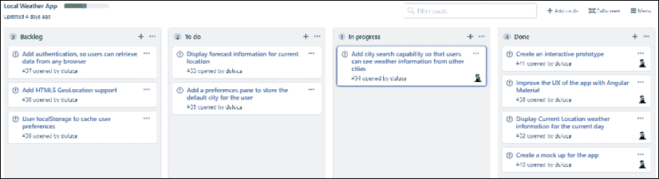
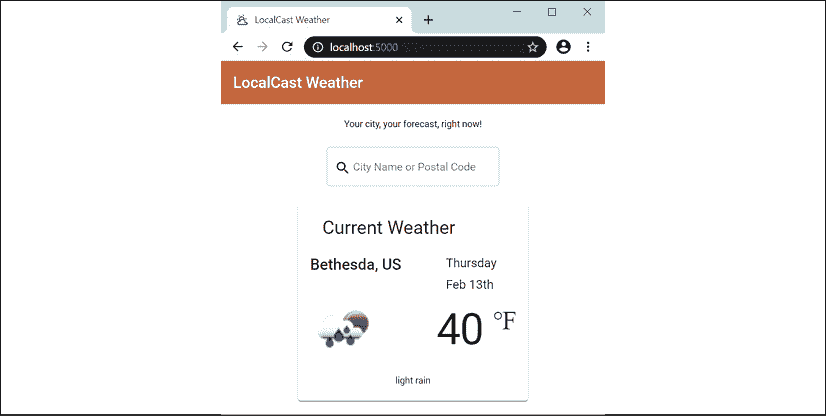
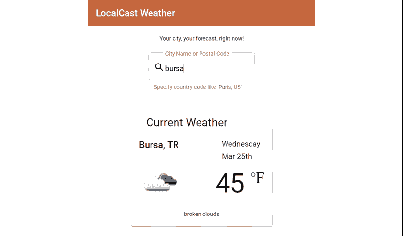
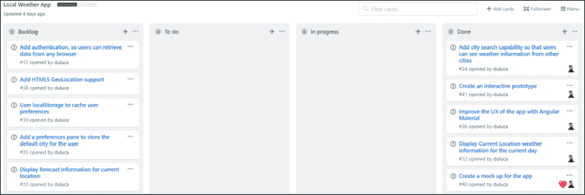
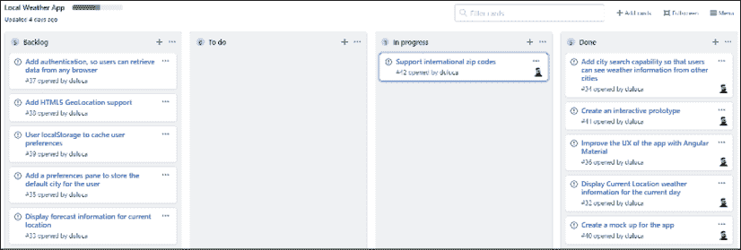
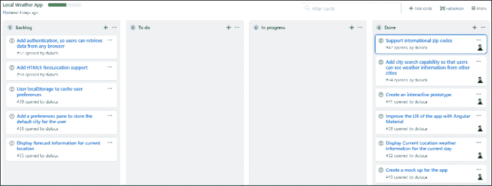

# 6

# 表单、Observables 和 Subjects

到目前为止，你已经一直在构建构成 Angular 应用程序的基本元素，例如模块、组件、管道、服务、RxJS、单元测试和环境变量，甚至更进一步，学习如何使用 Docker 交付你的网络应用，并用 Angular Material 给它一个光鲜的外观。

到目前为止，我们的应用还不是交互式的。它只能为单个城市获取天气信息。因此，它不是一个非常有用的应用。为了构建一个交互式应用，我们需要能够处理用户输入。在你的应用程序中启用用户输入可以打开创建出色用户体验的可能性。考虑一下 google.com 的登录页面：


图 6.1：谷歌的登录页面

在这个背景下，除了一个简单的带有两个按钮的输入字段之外，谷歌搜索是什么？那个简单的输入字段解锁了世界上一些最复杂和最先进的软件技术。这是一种欺骗性的简单且疯狂强大的与用户互动的方式。你可以通过利用现代网络功能，如`GeoLocation`来增强用户输入，并从用户输入中获得新的意义。因此，当用户输入`巴黎`时，你不必猜测他们是指法国的巴黎，还是德克萨斯州的巴黎，或者你是否应该显示摄氏度或华氏度的当前温度。使用`LocalStorage`，你可以缓存用户凭据并记住用户偏好，这样你就可以在你的应用中启用暗黑模式。

到本章结束时，我们不会实现谷歌、地理位置或暗黑模式，而是将允许用户通过城市名称或邮政编码（在美国通常被称为“邮编”）来搜索他们的城市。一旦你意识到实现看似简单的按邮政编码搜索功能可能会多么复杂，你可能会对精心设计的网络应用产生新的敬意。

要构建一个由输入字段驱动的 UX，我们需要利用 Angular 表单和验证消息，这样我们就可以创建具有搜索即输入功能的引人入胜的搜索体验。在幕后，RxJS/BehaviorSubject 使我们能够构建解耦的组件，它们可以相互通信，而响应式数据流允许我们合并来自多个网络 API 的数据，而不会增加我们应用程序的复杂性。

在本章中，你将要学习以下内容：

+   模板驱动和响应式表单，包括双向绑定和输入字段验证

+   组件之间的交互

+   Observables 和 RxJS/BehaviorSubject

+   管理订阅，以及如何处理内存泄漏和取消订阅

+   使用 async pipe 处理多个 API 调用，包括链式多个 API 调用

本书样本代码的最新版本可在 GitHub 上找到，链接如下。该存储库包含代码的最终和完成状态。你可以在本章末尾通过查找`projects`文件夹下的代码末尾快照来验证你的进度。

对于**第六章**：

1.  克隆仓库[`github.com/duluca/local-weather-app`](https://github.com/duluca/local-weather-app)

1.  在根目录下执行`npm install`以安装依赖项

1.  本章的代码示例位于子文件夹中：

    ```js
    projects/ch6 
    ```

1.  要运行本章的 Angular 应用，请执行：

    ```js
    npx ng serve ch6 
    ```

1.  要运行本章的 Angular 单元测试，请执行：

    ```js
    npx ng test ch6 --watch=false 
    ```

1.  要运行本章的 Angular 端到端测试，请执行：

    ```js
    npx ng e2e ch6 
    ```

1.  要构建本章的生产级 Angular 应用，请执行：

    ```js
    npx ng build ch6 --prod 
    ```

注意，存储库根目录下的`dist/ch6`文件夹将包含编译结果。

请注意，书中或 GitHub 上的源代码可能并不总是与 Angular CLI 生成的代码匹配。书中和 GitHub 上的实现之间也可能存在细微的差异，因为生态系统是不断演变的。随着时间的推移，示例代码发生变化是自然的。在 GitHub 上，你可能会找到更正、修复以支持库的新版本，或者为读者观察而并排实现多种技术的示例。读者只需实现书中推荐的理想解决方案即可。如果你发现错误或有疑问，请创建一个 issue 或提交一个 pull request 到 GitHub，以供所有读者受益。

接下来，让我们看看我们如何使用表单实现一个输入字段。表单是我们捕获用户输入的主要机制。在 Angular 中，有两种类型的表单：响应式和模板驱动。我们需要涵盖这两种技术，以便你熟悉 Angular 中表单的工作方式。

# 响应式表单与模板驱动表单

现在，我们将实现在应用程序主屏幕上的搜索栏。下一个用户故事是**显示当前位置的预报信息**，这可能意味着固有的地理位置功能。然而，正如你可能注意到的，地理位置被列为一个单独的任务。挑战在于，使用原生的平台功能，如地理位置，你永远不能保证收到实际的位置信息。这可能是由于移动设备上的信号丢失问题，或者用户可能简单地拒绝分享他们的位置信息。

首先最重要的是，我们必须提供一个良好的基线用户体验，并在之后仅实现增值功能，如地理位置。相反，让我们将**添加城市搜索功能 ...**移动到**进行中**，如图我们在看板上的所示：



图 6.2：GitHub 项目看板

作为这个故事的一部分，我们将实现一个边打字边搜索的功能，并在服务无法检索到预期数据时向用户提供反馈。

初始时，实现一个类型搜索机制可能看起来很直观；然而，`OpenWeatherMap` API 没有提供这样的端点。相反，它们提供批量数据下载，这些数据成本高昂，且在兆字节级别。

我们需要实现我们的应用程序服务器以公开这样的端点，这样我们的应用程序就可以在尽可能少的数据使用情况下有效地查询。

`OpenWeatherMap` 的免费端点确实提出了一个有趣的挑战，即两位数字的国家代码可能伴随城市名称或邮政编码，以获得最准确的结果。这是实现用户反馈机制的一个绝佳机会，如果针对给定查询返回多个结果。

我们希望应用程序的每个迭代都成为一个可能发布的增量，并避免在任何给定时间内做太多。

在开始处理一个故事之前，将故事分解为技术任务是一个好主意。以下是这个故事的分解任务：

1.  添加 Angular 表单控件，以便我们可以捕获用户输入事件。

1.  使用在 [`material.angular.io/components/input`](https://material.angular.io/components/input) 上记录的 Angular Material 输入来改进输入字段的用户体验。

1.  将搜索栏作为一个独立的组件来强制实施关注点分离和松耦合的组件架构。

1.  在 `weather.service.ts` 中扩展现有端点以接受邮政编码，并将国家代码作为可选项，以便使最终用户与我们的应用程序交互更加直观。

1.  节流请求，这样我们就不需要在每次按键时查询 API，而是在用户仍然能够立即获得反馈而不必点击单独按钮的间隔内进行查询。

让我们在接下来的几节中解决这些任务。

## 添加 Angular 响应式表单

您可能会想知道为什么我们要添加 Angular 表单，因为我们只添加了一个输入字段，而不是一个包含多个输入字段的表单。作为一个一般规则，每次您添加一个输入字段时，它都应该被 `<form>` 标签包裹。`Forms` 模块包含 `FormControl`，它使您能够编写输入字段背后的支持代码以响应用户输入，并提供适当的数据或验证或消息作为响应。

Angular 中有两种类型的表单：

+   **模板驱动的表单**：这些表单与您可能在 AngularJS 的情况下所熟悉的内容相似，其中表单逻辑主要在 HTML 模板内部。我个人并不喜欢这种方法，因为它更难测试这些行为，而且庞大的 HTML 模板难以快速维护。

+   **响应式表单**：响应式表单的行为由控制器中编写的 TypeScript 代码驱动。这意味着您的验证逻辑可以进行单元测试，并且更好的是，可以在您的应用程序中重用。响应式表单是未来将使 Angular Material 团队能够编写自动化工具的核心技术，这些工具可以根据 TypeScript 接口自动生成输入表单。

在 [`angular.io/guide/reactive-forms`](https://angular.io/guide/reactive-forms) 上了解更多关于响应式表单的信息。

让我们首先将 `FormsModule` 和 `ReactiveFormsModule` 导入到我们的应用程序中：

```js
**src/app/app.module.ts**
...
import { FormsModule, ReactiveFormsModule } from '@angular/forms'
...
@NgModule({
  ...
  imports: [
    ...
    **FormsModule,** 
 **ReactiveFormsModule,**
  ] 
```

注意，在纯响应式表单实现中，你只需要`ReactiveFormsModule`。`FormsModule`支持模板驱动表单和其他场景，在这些场景中，你可能只想声明一个没有`FormGroup`的`FormControl`。这就是我们实现应用程序输入字段的办法。`FormGroup`将在下一节中定义。

此外，响应式表单还允许你以响应式范式编写代码，这是一个净正面的结果。接下来，让我们将城市搜索组件添加到我们的应用程序中。

## 添加和验证组件

我们将使用 Material 表单和输入模块创建一个`citySearch`组件：

1.  将`MatFormFieldModule`和`MatInputModule`添加到`material.module.ts`中，使其在应用程序中可用：

    ```js
    **src/app/material.module.ts**
    import { MatFormFieldModule } from '@angular/material/form-field'
    import { MatInputModule } from '@angular/material/input'
    const modules = [..., **MatFormFieldModule, MatInputModule**] 
    ```

    我们添加`MatFormFieldModule`是因为每个输入字段都应该被`<mat-form-field>`标签包裹，以充分利用 Angular Material 的功能。

    从高层次来看，`<form>`封装了键盘、屏幕阅读器和浏览器扩展用户的大量默认行为；`<mat-form-field>`使双向数据绑定变得简单，这是一种应该适度使用的技巧，同时也允许优雅地显示标签、验证和错误消息。

1.  创建新的`citySearch`组件：

    ```js
    $ npx ng g c citySearch --module=app.module 
    ```

    由于我们添加了`material.module.ts`文件，`ng`无法猜测应该将`citySearch`添加到哪个功能模块中，导致出现“多个模块匹配”等错误。因此，我们需要使用`--module`选项提供我们希望`citySearch`添加到的模块。使用`--skip-import`选项跳过将组件导入任何模块。

1.  创建一个基本模板，替换现有内容：

    ```js
    **src/app/city-search/city-search.component.html**
    <form>
      <mat-form-field appearance="outline">
        <mat-label>City Name or Postal Code</mat-label>
        <mat-icon matPrefix>search</mat-icon>
        <input matInput aria-label="City or Zip" [formControl]="search">
      </mat-form-field>
    </form> 
    ```

1.  声明一个名为`search`的属性，并将其实例化为`FormControl`的一个实例：

    ```js
    **src/app/city-search/city-search.component.ts**
    import { FormControl } from '@angular/forms'
    ...
    export class CitySearchComponent implements 
      OnInit { 

      search = new FormControl()
      ... 
    ```

    响应式表单有三个级别的控制：

    +   `FormControl`是最基本的元素，它与输入字段有一个一对一的关系。

    +   `FormArray`表示重复的输入字段，这些字段代表一组对象。

    +   `FormGroup`用于在添加更多输入字段到表单时注册单个`FormControl`或`FormArray`对象。

    最后，使用`FormBuilder`对象可以更轻松地编排和维护`FormGroup`对象的操作。`FormBuilder`和`FormGroup`首次在*第八章*，*设计身份验证和授权*中介绍，所有控件，包括`FormArray`，在第十一章*，*食谱 - 可重用性、路由和缓存*中都有深入介绍。

1.  将`app-city-search`添加到`app.component.ts`中，作为包含应用程序标语和包含`mat-card`的行的中间新的`div`：

    ```js
    **src/app/app.component.ts**
    template: `
      ...
        </div>
     **<div fxLayoutAlign="center">**
     **<app-city-search></app-city-search>**
     **</div>**
        <div fxLayout="row">
      ...
    `, 
    ```

1.  通过在浏览器中查看应用程序来测试组件的集成，如图所示：

    图 6.3：带有搜索字段的 LocalCast 天气应用程序

如果没有发生错误，现在我们可以开始添加`FormControl`元素并将它们连接到搜索端点。

## 向天气服务添加搜索选项

到目前为止，我们一直通过使用城市名称和国家代码来传递参数以获取城市的天气。通过允许用户输入邮编，我们必须使我们的服务在接受这两种类型的输入时更加灵活。

OpenWeatherMap 的 API 接受 URI 参数，因此我们可以使用 TypeScript 联合类型和类型守卫重构现有的`getCurrentWeather`函数（在*第三章*，*创建一个基本的 Angular 应用*中介绍）。这意味着我们可以提供不同的参数，同时保留类型检查：

1.  将`weather.service.ts`中的`getCurrentWeather`函数重构以处理`zip`和`city`输入：

    ```js
    **src/app/weather/weather.service.ts**
      getCurrentWeather(
        search: string | number, 
        country?: string
      ): Observable<ICurrentWeather> { 
        let uriParams = new HttpParams()
        if (typeof search === 'string') { 
          uriParams = uriParams.set('q',
            country ? `${search},${country}` : search
          )
        } else {
          uriParams = uriParams.set('zip', 'search')
        }

        uriParams = uriParams.set('appid', environment.appId)
        return this.httpClient
          .get<ICurrentWeatherData>(
            `${environment.baseUrl}api.openweathermap.org/data/2.5/weather`,
            { params: uriParams } 
        )
        .pipe(map(data => this.transformToICurrentWeather(data)))
      } 
    ```

    我们将`city`参数重命名为`search`，因为它可以是城市名称或邮编。然后我们允许其类型为`string`或`number`，并且根据运行时类型，我们将使用`q`或`zip`。我们还使`country`成为可选的，并且只有在它存在时才将其附加到查询中。

    `getCurrentWeather`现在具有嵌入的业务逻辑，因此它是单元测试的良好目标。遵循 SOLID 原则中的单一职责原则，我们将 HTTP 调用重构为其自己的函数，称为`getCurrentWeatherHelper`。

1.  将 HTTP 调用重构为`getCurrentWeatherHelper`。

    在下一个示例中，请注意使用反引号字符`` ` ``而不是单引号字符`'`，这利用了模板字面量的功能，允许在 JavaScript 中嵌入表达式：

    ```js
    **src/app/weather/weather.service.ts**
      getCurrentWeather(
        search: string | number, 
        country?: string
      ): Observable<ICurrentWeather> { 
        let uriParams = new HttpParams()
        if (typeof search === 'string') { 
          uriParams = uriParams.set('q',
            country ? `${search},${country}` : search
          )
        } else {
          uriParams = uriParams.set('zip', 'search')
        }

        **return this.getCurrentWeatherHelper(uriParams)**
      }
      private getCurrentWeatherHelper(uriParams: HttpParams):
        Observable<ICurrentWeather> { 
        uriParams = uriParams.set('appid', environment.appId)
        return this.httpClient
          .get<ICurrentWeatherData>(
            `${environment.baseUrl}api.openweathermap.org/data/2.5/weather`,
            { params: uriParams } 
          )
          .pipe(map(data => this.transformToICurrentWeather(data)))
        } 
    ```

    作为积极的副作用，`getCurrentWeatherHelper`遵循开闭原则。毕竟，它可以通过提供不同的`uriParams`来扩展我们的函数行为，并且由于它不需要经常更改，因此它是封闭的，不会进行修改。

    为了说明这一点，让我们实现一个新函数，通过纬度和经度获取当前天气。

1.  实现`getCurrentWeatherByCoords`：

    ```js
    **src/app/weather/weather.service.ts**
    getCurrentWeatherByCoords(coords: Coordinates): Observable<ICurrentWeather> {
      const uriParams = new HttpParams()
          .set('lat', coords.latitude.toString())
          .set('lon', coords.longitude.toString())
        return this.getCurrentWeatherHelper(uriParams)
    } 
    ```

    如您所见，`getCurrentWeatherHelper`可以很容易地扩展而无需任何修改。

1.  确保您更新`IWeatherService`以包含之前所做的更改：

    ```js
    **src/app/weather/weather.service.ts** 
    export interface IWeatherService {
      getCurrentWeather(
        search: string | number,
        country?: string
      ): Observable<ICurrentWeather>
      getCurrentWeatherByCoords(coords: Coordinates): Observable<ICurrentWeather>
    } 
    ```

由于坚持 SOLID 设计原则，我们使得对流程控制逻辑进行健壮的单元测试变得更容易，最终写出的代码对错误的抵抗力更强，且维护成本更低。

## 实现搜索

现在，让我们将新的服务方法连接到输入字段：

1.  将`citySearch`更新为注入`weatherService`并订阅输入变化：

    ```js
    **src/app/city-search/city-search.component.ts**
    import { WeatherService } from '../weather/weather.service'
    ...
    export class CitySearchComponent implements OnInit { 
      search = new FormControl()

      constructor(**private weatherService: WeatherService**) {}
      ...
      ngOnInit(): void { 
        **this.search.valueChanges**
     **.subscribe()**
      } 
    ```

    目前我们将所有输入视为`string`。用户输入可以是城市、邮编，或者城市和国家的代码，或者邮编和国家的代码，用逗号分隔。虽然城市或邮编是必需的，但国家代码是可选的。我们可以使用`String.split`函数来解析任何潜在的逗号分隔输入，然后使用`String.trim`从字符串的开始和结束处去除任何空白字符。然后，我们通过使用`Array.map`遍历它们来确保去除字符串的所有部分。

    我们使用三元运算符 `?:` 来处理可选参数，只有当它存在时才传递值，否则将其定义为未定义。

1.  实现搜索处理程序：

    ```js
    **src/app/city-search/city-search.component.ts**
    this.search.valueChanges
      .subscribe(
        (searchValue: string) => { 
        if (searchValue) {
          const userInput = searchValue.split(',').map(s => s.trim())
        this.weatherService.getCurrentWeather(
          userInput[0],
          userInput.length > 1 ? userInput[1] : undefined
        ).subscribe(data => (console.log(data)))
      }
    }) 
    ```

1.  在输入字段下方为用户提供一个提示，告知他们有关可选的国家功能：

    ```js
    **src/app/city-search/city-search.component.html**
    ...
      <mat-form-field appearance="outline">
        ...
        **<mat-hint>Specify country code like 'Paris, US'</mat-hint>**
      </mat-form-field>
    ... 
    ```

到这一点，订阅处理程序将调用服务器并记录其输出到控制台。

使用 Chrome DevTools 观察这是如何工作的。注意 `search` 函数运行的频率，以及我们没有处理服务错误。

## 使用 throttle/debounce 限制用户输入

目前，我们每次按键都会向服务器提交一个请求。这种行为并不可取，因为它可能导致不良的用户体验和电池寿命的消耗，从而在客户端和服务器端都造成网络请求的浪费和性能问题。用户会犯拼写错误；他们可能会改变他们输入的内容，而且很少会有信息输入的前几个字符就能产生有用的结果。

我们仍然可以监听每个按键，但不必对每个按键做出反应。通过利用 `throttle`/`debounce`，我们可以将生成的事件数量限制在预定的间隔内，同时仍然保持按搜索输入的功能。

注意，`throttle` 和 `debounce` 不是功能等效的，它们的行为会因框架而异。除了节流之外，我们还期望捕获用户最后输入的内容。在 `lodash` 框架中，`throttle` 函数满足这一要求，而在 `RxJS` 中，`debounce` 满足这一要求。请注意，这种差异可能在未来的框架更新中得以解决。

使用 `RxJS/debounceTime` 非常容易将节流注入可观察流中。使用 `pipe` 实现 `debounceTime`：

```js
**src/app/city-search/city-search.component.ts**
import { debounceTime } from 'rxjs/operators'
  this.search.valueChanges
    `.pipe(debounceTime(1000))`
    .subscribe(...) 
```

`debounceTime` 最多每秒运行一次搜索，但用户停止输入后也会运行另一个搜索。相比之下，`RxJS/throttleTime` 只会在每秒的第二秒运行一次搜索，并且不一定能捕获用户可能输入的最后几个字符。

RxJS 还提供了 `throttle` 和 `debounce` 函数，您可以使用这些函数来实现自定义逻辑，以限制非基于时间的输入。

由于这是一个基于时间和事件的功能，因此断点调试不可行。您可以在 **Chrome Dev Tools | Network** 选项卡中监控网络调用，但要更实时地了解您的搜索处理程序实际被调用的频率，请添加一个 `console.log` 语句。

在代码中检查带有活动 `console.log` 语句的做法并不好。如 *第三章* 中所述，*创建基本的 Angular 应用程序*，`console.log` 是一种穷人的调试方法。这些语句使得阅读实际代码变得困难，而代码本身具有很高的维护成本。因此，无论是否注释掉，都不要检查带有 `console.log` 语句的代码。

## 输入验证和错误消息

`FormControl` 具有高度的自定义性。它允许您设置默认的初始值，添加验证器，或监听 `blur`、`change` 和 `submit` 事件，如下所示：

```js
**example**
new FormControl('Bethesda', { updateOn: 'submit' }) 
```

我们不会用值初始化 `FormControl`，但我们需要实现一个验证器来禁止单字符输入：

1.  从 `@angular/forms` 中导入 `Validators`：

    ```js
    **src/app/city-search/city-search.component.ts**
    import { FormControl, Validators } from '@angular/forms' 
    ```

1.  修改 `FormControl` 以添加最小长度验证器：

    ```js
    **src/app/city-search/city-search.component.ts**
    search = new FormControl('', [Validators.minLength(2)]) 
    ```

1.  修改模板以在提示文本下方显示验证错误信息：

    ```js
    **src/app/city-search/city-search.component.html**
    ...
    <form **style="margin-bottom: 32px"**>
      <mat-form-field appearance="outline">
        ...
        **<mat-error *ngIf="search.invalid">**
     **Type more than one character to search**
     **</mat-error>**
      </mat-form-field>
    </form>
    ... 
    ```

    注意添加了一些额外的边距，为长错误信息腾出空间。

    如果您正在处理不同类型的错误，模板中的 `hasError` 语法可能会变得重复。您可能希望实现一个更可扩展的解决方案，可以通过代码进行定制，如下所示：

    ```js
    **example**
    <mat-error *ngIf="search.invalid">
      {{getErrorMessage()}}
    </mat-error>
    getErrorMessage() {
      return this.search.hasError('minLength') ?
        'Type more than one character to search' : '';
    } 
    ```

1.  修改 `search` 函数，使其在无效输入的情况下不执行搜索，替换现有 `if` 语句中的条件：

    ```js
    **src/app/city-search/city-search.component.ts** 
    this.search.valueChanges
      .pipe(debounceTime(1000))
      .subscribe((search Value: string) => {
        if (**!this.search.invalid**) {
          ... 
    ```

而不是简单地检查 `searchValue` 是否已定义且不为空字符串，我们可以通过调用 `this.search.invalid` 来利用验证引擎进行更健壮的检查。

目前，我们已经完成了 `search` 功能的实现。接下来，让我们回顾一个假设场景，看看模板驱动的表单实现会是什么样子。

### 带有双向绑定的模板驱动表单

反应式表单的替代方案是模板驱动表单。如果您熟悉 AngularJS 中的 `ng-model`，您会发现新的 `ngModel` 指令是它的 API 兼容替代品。

在幕后，`ngModel` 实现了一个可以自动附加到 `FormGroup` 的 `FormControl`。`ngModel` 可以在 `<form>` 级别或单个 `<input>` 级别使用。您可以在 [`angular.io/api/forms/NgModel`](https://angular.io/api/forms/NgModel) 上了解更多关于 `ngModel` 的信息。

在 GitHub 上 Local Weather 应用程序的存储库的 *第六章* 示例代码中，我在 `app.component.ts` 中包含了一个名为 `app-city-search-tpldriven` 的模板驱动组件，该组件在 `<div class="example">` 下渲染。您可以尝试这个组件，看看替代的模板实现是什么样的：

```js
**projects/ch6/src/app/city-search-tpldriven/city-search-tpldriven.component.html**
  ...
    <input matInput aria-label="City or Zip"
      [(ngModel)]="model.search"
      (ngModelChange)="doSearch($event)" minlength="2" 
      name="search" #search="ngModel">
  ...
    <mat-error *ngIf="search.invalid">
      Type more than one character to search
    </mat-error>
  ... 
```

注意使用 `ngModel` 时使用的 `[()]` “香蕉箱”双向绑定语法。

组件中的差异如下实现：

```js
**projects/ch6/src/app/city-search-tpldriven/city-search-tpldriven.component.ts**
import { WeatherService } from '../weather/weather.service'
export class CitySearchTpldrivenComponent { 
  model = {
    search: '',
  }
  constructor(private weatherService: WeatherService) {}

  doSearch(searchValue) {
    const userInput = searchValue.split(',').map(s => s.trim())
    this.weatherService
      .getCurrentWeather(userInput[0], userInput.length > 1 ?
        userInput[1] : undefined
      )
      .subscribe(data => console.log(data))
  }
} 
```

如您所见，大部分逻辑都是在模板中实现的；因此，您需要保持对模板和控制器的一个活跃的心理模型。任何对事件处理程序和验证逻辑的更改都需要您在这两个文件之间来回切换。

此外，我们已经失去了输入限制和防止在输入处于无效状态时调用服务的能力。尽管如此，仍然可以实施这些功能，但它们需要复杂的解决方案，并且无法很好地适应新的 Angular 语法和概念。

总体来说，我不推荐使用模板驱动的表单。可能有一些情况下使用香蕉盒语法会非常方便。然而，这为其他团队成员复制相同的模式在应用程序周围设定了一个不良的先例。

# 使用`BehaviorSubject`进行组件交互

要更新当前天气信息，我们需要`city-search`组件与`current-weather`组件交互。在 Angular 中，有四种主要技术可以启用组件交互：

+   全局事件

+   监听从子组件向上冒泡信息的父组件

+   在一个基于相似数据流工作的模块中，兄弟、父或子组件

+   父组件向子组件传递信息

## 全局事件

这是一种从编程早期就一直在使用的技巧。在 JavaScript 中，你可能通过全局函数委托或 jQuery 的事件系统实现了这一点。在 AngularJS 中，你可能创建了一个服务并在其中存储了值。

在 Angular 中，你仍然可以创建一个根级服务，在其中存储值，使用 Angular 的`EventEmitter`类（它实际上是为指令设计的），或者使用`rxjs/Subscription`为自己创建一个花哨的消息总线。

作为一种模式，全局事件容易受到滥用，而不是帮助维护解耦的应用程序架构，它随着时间的推移会导致全局状态。全局状态或甚至在控制器级别的本地化状态，其中函数在任意给定的类中读取和写入变量，是编写可维护和可单元测试的软件的头号敌人。

最终，如果你在一个服务中存储所有应用程序数据或路由所有事件以实现组件交互，你只是在发明一个更好的捕鼠器。这是一个应该不惜一切代价避免的反模式。在后面的章节中，你会发现，本质上，我们仍然会使用服务来实现组件交互；然而，我想指出，在允许解耦的灵活架构和全局或集中式解耦方法之间存在着一条细线，后者扩展性不佳。

## 基于事件发射器的亲子关系

你的子组件应该完全不知道它的父组件。这是创建可重用组件的关键。

我们可以通过利用`AppComponent`作为父元素，让`app`模块控制器协调数据来实现城市搜索组件和当前天气组件之间的通信。

现在提交你的代码！在接下来的两个部分中，你将需要丢弃所做的代码更改。

让我们看看这个实现将如何看起来：

1.  `city-search`组件通过`@Output`属性公开一个`EventEmitter`：

    ```js
    **src/app/city-search/city-search.component.ts**
    import { Component, OnInit, Output, EventEmitter } from '@angular/core'
    export class CitySearchComponent implements OnInit {
      @Output() searchEvent = new EventEmitter<string>()
      ...
      this.search.valueChanges
        .pipe(debounceTime(1000))
        .subscribe((search Value: string) => {
          if (!this.search.invalid) {
            this.searchEvent.emit(searchValue)
          }
        })
      ...
    } 
    ```

1.  `app`组件消费它并调用`weatherService`，设置`currentWeather`变量：

    ```js
    **src/app/app.component.ts**
    import { WeatherService } from './weather/weather.service'
    import { ICurrentWeather } from './interfaces'
    ...
    template: `
      ...
        <app-city-search **(searchEvent)="doSearch($event)"**>
        </app-city-search>
      ...
    `,
    export class AppComponent { 
      currentWeather: ICurrentWeather 
      constructor(private weatherService: WeatherService) { }
      doSearch(searchValue) {
        const userInput = searchValue.split(',').map(s => s.trim()) 
        this.weatherService
          .getCurrentWeather(userInput[0], userInput.length > 1 ?
            userInput[1] : undefined
        )
        .subscribe(data => this.currentWeather = data)
      }
    } 
    ```

    注意，我们使用括号语法将 `searchEvent` 绑定。`$event` 变量会自动捕获事件输出并将其传递给 `doSearch` 方法。

我们已成功将信息冒泡到父组件，但我们还必须能够将其传递到 `current-weather` 组件。

## 输入绑定下的父子关系

根据定义，父组件将知道它正在与哪些子组件一起工作。由于 `currentWeather` 属性绑定到 `current-weather` 组件上的 `current` 属性，结果会向下传递以进行显示。这是通过创建一个 `@Input` 属性来实现的：

```js
**src/app/current-weather/current-weather.component.ts**
import { Component, **Input** } from '@angular/core'
...
export class CurrentWeatherComponent implements OnInit { 
  **@Input()** current: ICurrentWeather
  ...
} 
```

注意，`CurrentWeatherComponent` 的 `ngOnInit` 函数现在已不再必要，可以删除。

然后，您可以更新 `app` 组件以将数据绑定到 `current` 天气：

```js
**src/app/app.component.ts**
template: `
  ...
  <app-current-weather **[current]="currentWeather"**>
  </app-current-weather>
  ...
` 
```

到目前为止，您的代码应该可以正常工作！尝试搜索一个城市。如果 `current-weather` 组件更新，则表示成功！

事件发射器和输入绑定方法适用于创建紧密耦合的组件或用户控件，且没有外部数据被消费的情况。一个很好的例子是将预报信息添加到 `current-weather` 组件中，如下所示：


图 6.4：天气预报线框图

每周每一天都可以实现为一个使用 `*ngFor` 重复的组件，并且对于 `current-weather` 来说，检索和绑定此信息到其子组件是完全合理的：

```js
**example**
<app-mini-forecast
  *ngFor="let dailyForecast of forecastArray
  [forecast]="dailyForecast"
>
</app-mini-forecast> 
```

通常，如果您正在处理数据驱动的组件，父子或子父通信模式会导致架构不够灵活，这使得组件的重用或重新排列变得非常困难。一个紧密耦合的好例子是我们将天气服务导入到 `app.component.ts` 中。`AppComponent` 应该不知道天气服务；它的唯一任务是布局几个组件。鉴于不断变化的企业需求和设计，这是一个需要记住的重要教训。

在继续之前，请丢弃您在前两节中做出的更改。我们将实现一个替代方案。

接下来，我们将介绍一种更好的方法，让两个组件在不引入额外的主题耦合的情况下相互交互。

## 与主题的兄弟交互

组件交互的主要原因是为了发送或接收数据更新，这些数据可能是由用户提供的，也可能是由服务器接收的。在 Angular 中，你的服务公开 `RxJS.Observable` 端点，这些是组件可以订阅的数据流。`RxJS.Observer` 作为 `RxJS.Observable` 事件发射器的消费者，与 `RxJS.Observable` 相辅相成。`RxJS.Subject` 将这两组功能结合到一个易于操作的对象中。

您可以使用主题基本上描述属于特定数据集的流，例如正在显示的当前天气数据：

```js
**example**
import { Subject } from 'rxjs'
...
export class WeatherService implements IWeatherService { 
  currentWeather$: Subject<ICurrentWeather>
  ...
} 
```

`currentWeather$` 仍然是一个数据流，并不简单地代表一个数据点。您可以使用 `subscribe` 订阅 `currentWeather$` 数据的变化，或者使用 `next` 发布对其的变化，如下所示：

```js
**example**
currentWeather$.subscribe(data => (this.current = data)) currentWeather$.next(newData) 
```

注意 `currentWeather$` 属性的命名约定，它以 `$` 结尾。这是可观察属性命名约定。

`Subject` 的默认行为非常类似于通用的 pub/sub 机制，例如 jQuery 事件。然而，在一个组件以不可预测的方式加载或卸载的异步世界中，使用默认的 `Subject` 并不是非常有用。

主题有三种高级变体：

+   `ReplaySubject` 会记住并缓存数据流中发生的数据点，以便订阅者可以在任何给定时间回放旧事件。

+   `BehaviorSubject` 只记住最后一个数据点，同时继续监听新的数据点。

+   `AsyncSubject` 用于一次性事件，这些事件预计不会再次发生。

`ReplaySubject` 可能会对您的应用程序的内存和性能产生严重影响，因此应谨慎使用。在 `current-weather` 的情况下，我们只对显示接收到的最新天气数据感兴趣，但通过用户输入或其他事件，我们愿意接收新数据，以便保持 `current-weather` 组件的更新。`BehaviorSubject` 将是满足这些需求适当的机制：

1.  将 `currentWeather$` 作为只读属性添加到 `IWeatherService`：

    ```js
    **src/app/weather/weather.service.ts**
    import { **BehaviorSubject**, Observable } from 'rxjs'
    export interface IWeatherService {
      **readonly currentWeather$: BehaviorSubject<ICurrentWeather>**
      ...
    } 
    ```

    `currentWeather$` 被声明为只读，因为其 `BehaviorSubject` 不应重新分配。任何对值的更新都应通过在属性上调用 `.next` 函数来发送。

1.  在 `WeatherService` 中定义 `BehaviorSubject` 并设置默认值：

    ```js
    **src/app/weather/weather.service.ts**
    ...
    export class WeatherService implements IWeatherService {
      readonly currentWeather$ =
        new BehaviorSubject<ICurrentWeather>({ 
        city: '--',
        country: '--',
        date: Date.now(),
        image: '',
        temperature: 0,
        description: '',
      })
    ...
    } 
    ```

1.  添加一个名为 `updateCurrentWeather` 的新函数，它将触发 `getCurrentWeather` 并更新 `currentWeather$` 的值：

    ```js
    **src/app/weather/weather.service.ts**
    ...
    updateCurrentWeather(search: string | number, 
      country?: string): void { 
      this.getCurrentWeather(search, country)
        .subscribe(weather => 
          this.currentWeather$.next(weather)
        )
    }
    ... 
    ```

1.  使用新功能更新 `IWeatherService` 以使其如下所示：

    ```js
    **src/app/weather/weather.service.ts**
    ...
    export interface IWeatherService {
      readonly currentWeather$: BehaviorSubject<ICurrentWeather> 
      getCurrentWeather(city: string | number, country?: string):
        Observable<ICurrentWeather>
      getCurrentWeatherByCoords(coords: Coordinates):
        Observable<ICurrentWeather>
      **updateCurrentWeather(**
        **search: string | number,**
        **country?: string**
      **): void**
    } 
    ```

1.  更新 `current-weather` 组件以订阅新的 `BehaviorSubject`：

    ```js
    **src/app/current-weather/current-weather.component.ts**
    ...
      ngOnInit() { 
        this.weatherService.currentWeather$
          .subscribe(data => (this.current = data))
      }
    ... 
    ```

1.  在 `city-search` 组件中，更新 `getCurrentWeather` 函数调用以利用新的 `updateCurrentWeather` 函数：

    ```js
    **src/app/city-search/city-search.component.ts**
    ...
      this.weatherService.**updateCurrentWeather**( 
        userInput[0],
        userInput.length > 1 ? userInput[1] : undefined
      )
    ... 
    ```

1.  在浏览器中测试您的应用程序；它应该如下所示：

    图 6.5：土耳其布尔萨的天气信息

当您输入一个新城市时，组件应更新以包含该城市的当前天气信息。我们可以将 **添加城市搜索功能...** 任务移动到 **完成** 列，如图所示在我们的看板板上：



图 6.6：GitHub 项目看板板状态

我们有一个功能性的应用程序。然而，我们引入了内存泄漏，所以让我们在下一节中修复它。

# 管理订阅

订阅是一种方便的方式，可以从数据流中读取值以用于您的应用程序逻辑。如果未管理，它们可能会在您的应用程序中创建内存泄漏。一个泄漏的应用程序最终会消耗越来越多的 RAM，最终导致浏览器标签页无响应，导致对您的应用产生负面印象，甚至更糟，可能导致数据丢失，这可能会让最终用户感到沮丧。

在`current-weather`组件中，我们注入`weatherSevice`以便我们可以访问`BehaviorSubject`的`currentWeather$`组件。在 Angular 中，服务是单例的，这意味着当它们首次在内存中创建时，只要它们所属的模块在内存中，它们就会被保留。从实际的角度来看，这意味着您应用程序中的大多数服务将存在于应用程序的生命周期内。然而，组件的生命周期可能要短得多，并且可能反复创建相同组件的多个实例。如果我们不仔细管理长生命期和短生命期对象之间的交互，我们可能会在对象之间产生悬挂引用，从而导致内存泄漏。

## 内存泄漏的揭露

当我们订阅`currentWeather$`时，我们将其附加一个事件处理器，以便我们的组件可以响应推送到`BehaviorSubject`的值变化。当`current-weather`组件需要被销毁时，这会引发问题。

在像 JavaScript 这样的托管语言中，内存由垃圾回收器管理，简称 GC，而不是像在 C 或 C++这样的非托管语言中手动分配和释放内存。在非常高的层面上，GC 通过定期扫描栈中未由其他对象引用的对象来工作。

如果发现一个对象被取消引用，那么它占用的栈空间可以被释放。然而，如果一个未使用的对象仍然引用另一个仍在使用的对象，它就不能被垃圾回收。垃圾回收器并不是神奇的，不能读取我们的思想。当一个对象未使用且无法释放时，该对象占用的内存将无法在您的应用程序运行期间用于其他目的，这被认为是内存泄漏。

我的同事布伦登·考林斯提供了一个有用的类比：

> 想象浏览器的内存空间就像一个停车场；每次我们分配一个值或创建一个订阅时，我们就在那个停车场停车。如果我们偶然遗弃了一辆车，我们仍然留下停车位被占用；没有人可以使用它。如果浏览器中的所有应用程序都这样做，或者我们反复这样做，你可以想象停车场会很快被填满，我们永远无法运行我们的应用程序。

接下来，让我们看看我们如何确保我们不把车遗弃在停车场。

## 取消订阅

订阅或事件处理器会创建对其他对象的引用，例如从短生命周期的组件到长生命周期的服务。诚然，在我们的案例中，`current-weather`组件也是一个单例，但如果我们给应用添加更多功能，比如页面间的导航或同时显示多个城市的天气，这可能会改变。如果我们不取消对`currentWeather$`的订阅，那么任何`current-weather`的实例都会卡在内存中。我们在`ngOnInit`中进行了订阅，所以我们必须在`ngOnDestroy`中取消订阅。`ngOnDestroy`是在 Angular 确定框架不再使用组件时被调用的。

让我们看看以下示例代码中如何取消订阅一个订阅的例子：

```js
**example**
import { ..., OnDestroy } from '@angular/core'
import { ..., Subscription } from 'rxjs'
export class CurrentWeatherComponent implements OnInit, OnDestroy { 
  currentWeatherSubscription: Subscription
  ...
  ngOnInit() { 
    this.currentWeatherSubscription =
      this.weatherService.currentWeather$
        .subscribe((data) => (this.current = data))
  }
  ngOnDestroy(): void {
    this.currentWeatherSubscription.unsubscribe()
  }
... 
```

首先，我们需要为组件实现`OnDestroy`接口。然后，我们更新`ngOnInit`以将订阅的引用存储在名为`currentWeatherSubscription`的属性中。最后，在`ngOnDestroy`中，我们可以调用`unsubscribe`方法。

如果我们的组件被销毁，将不会导致内存泄漏。然而，如果给定组件中有多个订阅，这可能会导致大量的编码工作。

注意在`city-search`中，我们订阅了`FormControl`对象的`valueChanges`事件。我们不需要管理这个事件的订阅，因为`FormControl`是我们组件的一个子对象。当父组件从所有对象中解除引用时，所有子对象都可以安全地被 GC（垃圾回收器）收集。

现在我们来看一种更好地管理多个订阅的方法。

## 使用 SubSink 取消订阅

由 Ward Bell 发布的 SubSink 是一个简单的库，可以跟踪给定类中的所有订阅，无论是组件还是服务。

将 SubSink 包添加到你的 Angular 项目中：

```js
$ npm i subsink 
```

接下来，更新`current-weather`以使用 SubSink，替换`currentWeatherSubscription`：

```js
**src/app/current-weather/current-weather.component.ts**
import { ..., OnDestroy } from '@angular/core'
import { SubSink } from 'subsink'
export class CurrentWeatherComponent implements OnInit, OnDestroy {
  private subscriptions = new SubSink()
  ...
  ngOnInit(): void {
    this.subscriptions.add(
      this.weatherService.currentWeather$
        .subscribe((data) => (this.current = data))
    )
  }
  ngOnDestroy(): void {
 this.subscriptions.unsubscribe()
  }
... 
```

在前面的代码示例中，我们实例化了一个私有的`subscriptions`对象，它将作为汇入点来包含所有的订阅。然后，在`ngOnInit`中，我们简单地将`currentWeather$`的订阅添加到汇入点。在`ngOnDestroy`中，我们调用汇入点的`unsubscribe`方法，而不是单个订阅。

这是一个可扩展的方法，因为我们必须编写的样板代码量保持一致，你可以在不额外编码的情况下向汇入点添加许多订阅。

订阅数据流中的值本身可以被认为是一种反模式，因为它将你的编程模型从响应式切换到命令式。此外，你还可以避免一开始就需要管理订阅。我们将在下一节中讨论这个话题。

# 实现响应式风格

如同在*第一章*，*Angular 及其概念简介*中所述，我们应当只为激活它而订阅一个可观察的流。如果我们把`subscribe`函数当作一个事件处理器，那么我们就是在命令式地实现代码。

在你的代码库中看到除空 `.subscribe()` 调用之外的内容，应被视为放弃响应式编程的迹象。

在响应式编程中，当你在一个响应式流中订阅一个事件时，你就是在将你的编程范式从响应式编程切换到命令式编程。在我们的应用程序中有两个地方我们进行了订阅，一次在 `current-weather` 中，另一次在 `city-search` 组件中。

让我们先从修复 `current-weather` 开始，这样我们就不会回到命令式编程。

## 使用异步管道绑定到可观察对象

从一开始，Angular 就被设计成一个异步框架。通过保持在响应式编程领域，你可以最大限度地发挥 Angular 的作用。这样做可能一开始感觉不自然，但 Angular 提供了你需要的所有工具，以便将应用程序的当前状态反映给用户，而无需切换到命令式编程。

你可以在模板中使用 `async` 管道来反映可观察对象当前值。让我们更新 `current-weather` 组件以使用 `async` 管道：

1.  首先，将 `current: ICurrentWeather` 替换为可观察属性：`current$: Observable<ICurrentWeather>`。

1.  在构造函数中，将 `weatherService.currentWeather$` 赋值给 `current$:`

    ```js
    **src/app/current-weather/current-weather.component.ts**
    import { Observable } from 'rxjs'
    export class CurrentWeatherComponent {
      current$: Observable<ICurrentWeather>
      constructor(private weatherService: WeatherService) {
        this.current$ = this.weatherService.currentWeather$
      }
      ... 
    ```

1.  移除所有与 `SubSink`、`ngOnInit` 和 `ngOnDestroy` 相关的代码。

1.  更新模板，以便你可以绑定到 `current$`：

    ```js
    **src/app/current-weather/current-weather.component.html**
    <div *ngIf="current$ | async as current">
    ...
    </div> 
    ```

    `async` 管道自动订阅 `current$` 的当前值，并将其作为变量 `current` 以命令式方式提供给模板使用。这种方法的美妙之处在于，`async` 管道隐式管理订阅，因此你不必担心取消订阅。

1.  移除 `<div *ngIf="!current">`。这不再需要，因为 `BehaviorSubject` 总是初始化的。

到目前为止，响应式风格使我们能够简化并清理我们的代码。

异步管道允许你实现 `if-else` 逻辑。如果你想在你的可观察对象解析时显示一个加载消息，你可以通过以下技术来实现：

```js
**example**
<div *ngIf="current$ | async as current;
  else loading"
>
  ...
</div>
<ng-template #loading>
  Loading...
</ng-template> 
```

接下来，让我们进一步改进我们的代码。

## 捕获可观察流

`city-search` 组件在触发 `search` 函数时，在 `subscribe` 语句中实现了一个回调。这导致了一种命令式编程风格和思维模式。切换编程范式的一个危险是，你可能会无意中在你的代码中引入副作用，这使得引入错误或状态到你的应用程序中变得更加容易。

让我们将 `city-search.component.ts` 重构为响应式函数式编程风格，如下例所示：

```js
**src/app/city-search/city-search.component.ts**
import { debounceTime, **filter, tap** } from 'rxjs/operators'
export class CitySearchComponent {
  search = new FormControl('', 
    [**Validators.required**, Validators.minLength(2)])
  constructor(private weatherService: WeatherService) { 
    **this.search.valueChanges**
 **.pipe(**
 **debounceTime(1000),**
 **filter(() => !this.search.invalid),**
 **tap((searchValue: string) => this.doSearch(searchValue))**
 **)**
 **.subscribe()**
}
doSearch(searchValue: string) {
  const userInput = searchValue.split(',').map(s => s.trim())
  const searchText = userInput[0]
  const country = userInput.length > 1 ? userInput[1] : undefined
  this.weatherService.updateCurrentWeather(searchText, country)
}
} 
```

在前面的代码中，我们移除了 `OnInit` 实现，并实现了我们的过滤逻辑响应式。`tap` 操作符只有在 `this.search` 有效时才会被触发。此外，`doSearch` 在函数式上下文中被调用，这使得在函数内部引用任何其他类属性变得非常困难。

这减少了类的状态影响我们函数结果的可能性。因此，`doSearch`是一个可组合的、可单元测试的函数，而在之前的实现中，以简单的方式单元测试`ngOnInit`将非常具有挑战性。

注意，必须在对`valueChanges`调用`.subscribe()`来激活可观察的数据流，否则不会触发任何事件。

我们没有实现`ngOnInit`的事实反映了我们代码的真实异步性，它与应用程序的生命周期或状态无关。

在我们的重构完成后，应用应该与之前一样运行，但具有更少的样板代码。现在，让我们看看如何增强我们的应用，使其能够处理来自任何国家的邮政编码。

# 多次 API 调用

目前，我们的应用只能处理来自美国的 5 位数字邮政编码。例如，邮政编码`22201`可以通过简单的条件`typeof search === 'string'`与城市名称区分开来。然而，邮政编码在不同国家之间差异很大，英国就是一个很好的例子，其邮政编码如`EC2R 6AB`。即使我们对地球上每个国家的邮政编码格式有完美的理解，我们仍然不能确保用户没有输入一个轻微错误的邮政编码。今天的用户期望网络应用对这类错误具有弹性。

在本书的第一版出版后，我收到了一些热情的读者反馈，他们对示例应用只能支持美国邮政编码表示失望。我决定实现这个功能，因为它展示了看似简单的请求如何给您的应用引入未计划的复杂性。作为额外的好处，应用现在可以在全球范围内工作！[](img/B14094_06_001.png)

让我们在待办事项中添加一个新的项目，**支持国际邮政编码**，并将其移动到**进行中**：



图 6.7：添加国际邮政编码故事

## 实现邮政编码服务

要正确理解用户输入的是有效的邮政编码还是城市名称，我们必须依赖由[geonames.org](http://geonames.org)提供的第三方 API 调用。让我们看看如何将一个次要的 API 调用注入到我们应用的搜索逻辑中。

您需要在[geonames.org](http://geonames.org)上注册一个免费账户。之后，将您的`username`作为新参数存储在`environment.ts`和`environment.prod.ts`中。

您可以在本页面上尝试邮政编码 API：[`www.geonames.org/postal-codes`](https://www.geonames.org/postal-codes)。

首先，实现一个`PostalCodeService`，如下所示：

您可以通过执行`npx ng generate service postalCode --project=local-weather-app --no-flat --lintFix`来生成服务。

```js
**src/app/postal-code/postal-code.service.ts**
import { HttpClient, HttpParams } from '@angular/common/http'
import { Injectable } from '@angular/core'
import { Observable } from 'rxjs'
import { defaultIfEmpty, flatMap } from 'rxjs/operators'
import { environment } from '../../environments/environment'
export interface IPostalCode {
  countryCode: string
  postalCode: string
  placeName: string
  lng: number
  lat: number
}
export interface IPostalCodeData { 
  postalCodes: [IPostalCode]
}
export interface IPostalCodeService {
  resolvePostalCode(postalCode: string): Observable<IPostalCode>
}
@Injectable({
  providedIn: 'root',
}) 
export class PostalCodeService implements IPostalCodeService {
  constructor(private httpClient: HttpClient) {}
  resolvePostalCode(postalCode: string): Observable<IPostalCode> {
    const uriParams = new HttpParams()
      .set('maxRows', '1')
      .set('username', environment.username)
      .set('postalcode', postalCode)
    return this.httpClient
      .get<IPostalCodeData>(
        `${environment.baseUrl}${environment.geonamesApi}.geonames.org/postalCodeSearchJSON`,
      { params: uriParams }
    )
    .pipe(
      flatMap(data => data.postalCodes), 
      defaultIfEmpty(null)
    )
  }
} 
```

注意新的环境变量`environment.geonamesApi`。在`environment.ts`中将其值设置为`api`，在`environment.prod.ts`中设置为`secure`，这样 https 调用就可以正确工作，避免混合内容错误，如第四章中所述的*自动化测试、持续集成和发布到生产*。

在前面的代码段中，我们实现了一个`resolvePostalCode`函数，该函数调用一个 API，该 API 配置为接收 API 返回的第一个有效结果。然后，结果会被展平并通过管道输出给订阅者。使用`defaultIfEmpty`，我们确保如果没有从 API 收到结果，将提供一个 null 值。如果调用成功，我们将得到在`IPostalCode`中定义的所有信息，这使得使用坐标调用`getCurrentWeatherByCoords`成为可能。

## 链接 API 调用

让我们更新天气服务，使其能够调用`postalCode`服务以确定用户输入是否为有效的邮政编码：

1.  首先更新接口，这样我们只处理字符串：

    ```js
    **src/app/weather/weather.service.ts**
    ...
    export interface IWeatherService {
    ...
      getCurrentWeather(search: **string**, country?: string): 
        Observable<ICurrentWeather>
      updateCurrentWeather(search: **string**, country?: string)
    } 
    ```

1.  将`PostalCodeService`注入到天气服务作为私有属性：

    ```js
    **src/app/weather/weather.service.ts**
    import {
      PostalCodeService
    } from '../postal-code/postal-code.service'
    ...
    constructor(
      private httpClient: HttpClient,
      private postalCodeService: PostalCodeService
    ) {} 
    ```

1.  更新`updateCurrentWeather`的方法签名

1.  更新`getCurrentWeather`以尝试将`searchText`解析为邮政编码：

    ```js
    **src/app/weather/weather.service.ts**
    import { map, **switchMap** } from 'rxjs/operators'
    ... 
    getCurrentWeather(
      searchText: string,
      country?: string
    ): Observable<ICurrentWeather> {
      return this.postalCodeService.
        resolvePostalCode(searchText)
        .pipe(
          switchMap((postalCode) => {
            if (postalCode) {
              return this.getCurrentWeatherByCoords({
                latitude: postalCode.lat,
                longitude: postalCode.lng,
              } as Coordinates)
            } else {
              const uriParams = new HttpParams().set(
                'q',
                country ? `${searchText},${country}` : searchText
              )
              return this.getCurrentWeatherHelper(uriParams) 
            }
         })
       )
    } 
    ```

如果你将经纬度传递到`getCurrentWeatherByCoords`时遇到 TypeScript 问题，那么你可能必须使用`as`运算符来强制转换对象。因此，你的代码看起来可能如下所示：

```js
 return this.getCurrentWeatherByCoords({
    latitude: postalCode.lat,
    longitude: postalCode.lng,
  } as Coordinates) 
```

在前面的代码段中，我们的第一次调用是到`postalCode`服务。然后我们使用`switchMap`对数据流上发布的邮政编码做出反应。在`switchMap`内部，我们可以观察`postalCode`是否为 null，并做出适当的后续调用，要么通过坐标获取当前天气，要么通过城市名称获取。

现在，LocalCast 天气应该可以与全球邮政编码一起工作，如下面的截图所示：


图 6.8：带有全球邮政编码的 LocalCast 天气

我们已经完成了国际邮政编码支持的实施。将其移动到你的看板上的**完成**列：



图 6.9：国际邮政编码支持完成

随着我们完成 LocalCast 天气的实现，仍有改进的空间。最初，当应用首次加载时看起来是损坏的，因为显示了破折号和空字段。至少有两种不同的方法来处理这个问题。第一种是在没有数据显示时，在`app`组件级别隐藏整个组件。为了使这可行，我们必须将`weatherService`注入到`app`组件中，这最终导致了一个更不灵活的解决方案。另一种方法是通过增强`current-weather`组件，使其能够更好地处理缺失的数据。

您可以通过实现地理位置功能来进一步改进应用，在应用启动时获取用户的当前位置天气。您还可以利用 `window.localStorage` 来存储上次显示的城市或初始启动时从 `window.geolocation` 获取的最后位置。

我们完成了本地天气应用的开发，直到**第十二章**，**食谱 — 主/详情，数据表和 NgRx**，在那里我展示了 NgRx 与使用 RxJS/BehaviorSubject 的比较。

# 摘要

在本章中，您学习了如何使用 `MatInput`、验证器、响应式表单和数据流驱动的处理程序创建搜索即输入的功能。您意识到了双向绑定和模板驱动表单。您还了解了不同的策略来启用组件间的交互和数据共享。您深入了解了内存泄漏是如何产生的，以及管理您的订阅的重要性。

您现在能够更好地区分命令式和响应式编程风格，以及在可能的情况下坚持使用响应式编程的重要性。最后，您学习了如何通过链式调用多个 API 调用来实现复杂的功能。

LocalCast Weather 是一个简单的应用，我们用它来介绍 Angular 的基本概念。正如您所看到的，Angular 构建这样的小型和动态应用非常出色，同时向最终用户交付的框架代码量最少。您应该考虑在快速和简单的项目中使用 Angular，这在构建大型应用时也是一个很好的实践。在下一章中，您将创建一个更复杂的**业务线**（**LOB**）应用，使用以路由为首要方法的架构和设计可扩展的 Angular 应用，包括一流的认证和授权、用户体验以及覆盖大多数您可能在 LOB 应用中找到的需求的众多食谱。

# 练习

在完成**支持国际邮政编码**的功能后，我们是否在这里切换了编程范式？我们的实现是命令式、响应式，还是两者的结合？如果我们的实现不是完全响应式的，您会如何实现这个功能以响应式的方式？我将这个问题留作读者的练习。

在继续之前，不要忘记执行 `npm test`、`npm run e2e` 和 `npm run test:a11y`。修复单元测试和端到端测试的问题留作读者的练习。

访问 GitHub 查看我为本章实现的单元测试，链接为 [`github.com/duluca/local-weather-app/tree/master/projects/ch6`](https://github.com/duluca/local-weather-app/tree/master/projects/ch6)。

# 问题

尽可能地回答以下问题，以确保你已理解本章的关键概念，无需使用 Google。你需要帮助回答这些问题吗？请参阅*附录 D*，*自我评估答案*，可在[`static.packt-cdn.com/downloads/9781838648800_Appendix_D_Self-Assessment_Answers.pdf`](https://static.packt-cdn.com/downloads/9781838648800_Appendix_D_Self-Assessment_Answers.pdf)在线查看，或访问[`expertlysimple.io/angular-self-assessment`](https://expertlysimple.io/angular-self-assessment)。

1.  `async`管道是什么？

1.  解释反应式和命令式编程有何不同，我们应该优先选择哪种技术？

1.  BehaviorSubject 的好处是什么，它用于什么？

1.  内存泄漏是什么，为什么应该避免它们？
