# 7

# 创建以路由器为第一线的业务应用

**业务线应用**（**LOB**）是软件开发世界的核心。如维基百科所定义，LOB 是一个通用术语，指的是一个或一系列相关产品，它们服务于特定的客户交易或业务需求。LOB 应用提供了展示各种功能和特性的绝佳机会，而无需涉及大型企业应用通常需要解决的扭曲或专业场景。

帕累托原则，也称为 80-20 法则，表明我们可以用总体努力的 20%完成 80%的目标。我们将把 80-20 法则应用于我们的业务应用的设计和架构。鉴于业务应用覆盖的常见用例，它们在某种程度上非常适合 80-20 的学习体验。只需付出 20%的努力，你就可以了解 80%你需要知道的事情，以便为用户提供高质量的用户体验。

业务应用有一个奇特的特点。如果你最终构建了一个半有用的应用，对其的需求将不受控制地增长，你很快就会成为你成功的受害者。平衡项目的架构需求是一项挑战；你想要避免潜在的毁灭性低工程，同时，在另一方面，也避免为永远不会需要它的应用进行昂贵的过度工程。

在本章中，我将向你介绍路由器优先架构，80-20 设计解决方案，以增量迭代的方式解决交付现代 Web 应用所面临的挑战。

如你在*第一章*，*Angular 及其概念简介*中阅读的那样，软件架构不会保持静止。通过使用编码练习、概念验证应用和参考项目来实验新想法，对于提高创建更灵活架构的能力是至关重要的。

在本章和本书剩余的章节中，我们将设置一个具有丰富功能的新应用，它可以满足具有可扩展架构和工程最佳实践的业务应用需求。这将帮助你从小规模开始，并在有需求时能够快速扩展你的解决方案。我们将遵循路由器优先的设计模式，依靠可重用组件来创建一个名为 LemonMart 的杂货店业务应用。我们将讨论围绕主要数据实体进行设计的理念，以及在开始实现各种条件导航元素之前完成高级原型的重要性，这些元素在设计阶段可能会发生重大变化。

在本章中，你将学习以下内容：

+   将 80-20 解决方案应用于软件开发

+   学习如何构建路由器优先的应用

+   开始创建你将在本书剩余部分扩展的 LemonMart 应用

+   创建有效的品牌，以及定制和材料图标

+   使用懒加载实现亚秒级首次绘制

+   创建一个行走骨架

+   使用公共测试模块减少重复

+   围绕主要数据实体进行设计

+   认识到高级用户体验设计的重要性

本书样本代码的最新版本可在以下链接的 GitHub 存储库中找到。该存储库包含代码的最终和完成状态。您可以在本章结束时通过查找 `projects` 文件夹下的代码章节快照来验证您的进度。

*第七章*：

1.  克隆存储库 [`github.com/duluca/lemon-mart`](https://github.com/duluca/lemon-mart)

1.  在根目录下执行 `npm install` 以安装依赖项

1.  该章节的代码示例位于子文件夹：

    ```js
    projects/ch7 
    ```

1.  要运行本章的 Angular 应用程序，请执行以下操作：

    ```js
    npx ng serve ch7 
    ```

1.  要运行本章的 Angular 单元测试，请执行以下操作：

    ```js
    npx ng test ch7 --watch=false 
    ```

1.  要运行本章的 Angular e2e 测试，请执行以下操作：

    ```js
    npx ng e2e ch7 
    ```

1.  要为本章构建一个生产就绪的 Angular 应用程序，请执行以下操作：

    ```js
    npx ng build ch7 --prod 
    ```

注意，存储库根目录下的 `dist/ch7` 文件夹将包含编译结果。

注意，书中或 GitHub 上的源代码可能并不总是与 Angular CLI 生成的代码相匹配。由于生态系统不断演变，书中代码与 GitHub 上的代码在实现上可能存在细微差异。随着时间的推移，样本代码发生变化是自然的。

此外，在 GitHub 上，您可以期待找到更正、修复以支持库的新版本，或者观察多种技术的并行实现。您只需实现书中推荐的理想解决方案。如果您发现错误或有疑问，请为所有读者创建一个 GitHub 上的问题或提交一个拉取请求。

您可以在 *附录 C* 中了解更多关于更新 Angular 的信息，即 *保持 Angular 和工具常青*。您可以从 [`static.packt-cdn.com/downloads/9781838648800_Appendix_C_Keeping_Angular_and_Tools_Evergreen.pdf`](https://static.packt-cdn.com/downloads/9781838648800_Appendix_C_Keeping_Angular_and_Tools_Evergreen.) 或 [`expertlysimple.io/stay-evergreen`](https://expertlysimple.io/stay-evergreen) 在线找到此附录。

让我们从了解我们应用程序设计和架构背后的哲学开始。

# 80-20 解决方案

无论我们是在家开发应用程序、出于激情项目，还是在办公室工作，我们都必须保持清醒的头脑：我们的目的是提供价值。如果我们不能通过我们的激情项目提供价值，那么我们不会感到满足或快乐。如果我们无法在工作场所提供价值，我们可能得不到报酬。

提供现代网络应用程序是困难的。我们需要克服许多挑战才能成功：

+   逐步迭代交付

+   具有可扩展性

+   支持数十种屏幕和输入类型

+   易于使用

+   易于访问

+   管理一个团队

+   整理优先级较高的待办事项列表

+   确保验收标准清晰、简洁、具体

如果你曾经领导过一个项目或者尝试过独立实施并交付一个项目，你就会意识到在任何特定项目中，时间和资源总是不足以覆盖广泛的利益相关者、团队和技术需求。记住帕累托法则，也称为 80-20 法则，它意味着我们可以用总体努力的 20%完成 80%的目标。

如果我们将 80-20 法则应用于我们的工作，我们可以最大化我们的产出、质量和幸福感。业务线应用是我们行业的核心。应用 80-20 法则，我们可以推断出我们中的大多数人很可能通过交付这样的应用来赚取大部分收入。因此，我们应该将我们的工程开销保持在最低，并减少项目的交付风险。通过限制生产代码中的实验，我们为团队成员创造了一个可预测的环境，并且只引入我们在概念验证或小型应用中有机会审查过的变化。

我们的 80-20 策略，结合纪律，可以帮助我们在相同的时间内交付相同的项目，拥有更多功能和更好的质量。将我们的职业生涯视为马拉松而不是一系列冲刺，你可以发现自己处于一个不断交付高质量解决方案、项目接项目的位置，而不会感到疲惫不堪。

## 理解业务线应用

根据维基百科，业务线应用是一组“被认为对运营企业至关重要的关键计算机应用。”业务线应用是大多数开发者最终会开发的应用，即使我们可能认为我们开发的是小型应用或大型企业应用。考虑以下插图，它展示了我们可能开发的应用类型，这些应用根据其规模和范围放置在轴上：

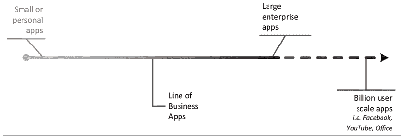

图 7.1：四种类型应用的大小和范围相对关系

从我的角度来看，当我们开始开发软件时，我们会考虑四种类型的应用：

+   小型应用

+   业务线应用

+   大型企业应用

+   亿级用户规模的应用

亿级用户规模的应用是完全的细分市场实现，很少需要与大量现有应用的需求相匹配。因此，我们必须将这些应用归类为异常值。

小型应用从小开始。在架构上，它们很可能是最初设计不足的。随着你向小型应用添加功能和团队成员，在某个时候，你将会遇到麻烦。随着你的团队规模和功能集的增长，或者应用的总体复杂性增加，应用的架构需求呈指数增长。

一旦你超过了你的架构能够承受的复杂性的拐点，你就只剩下了一个昂贵的重构努力来回到正轨。参见以下图表，说明了这个概念：

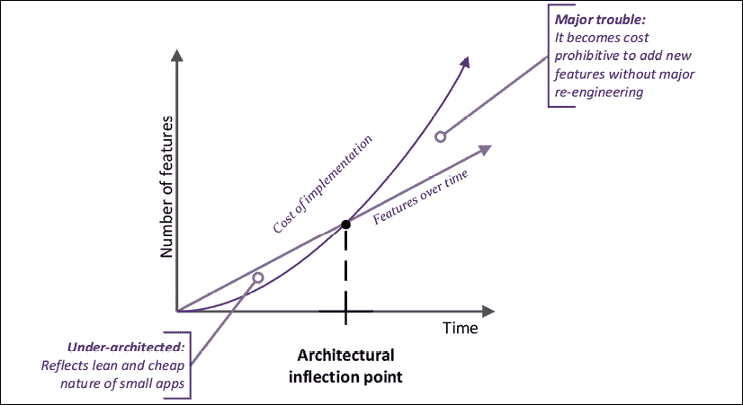

图 7.2：小型应用的架构之旅

特性线下的区域代表过度简化，这会给你的项目带来风险。特性线上的区域显示了支持所需功能所需的工程开销。相比之下，大型企业应用从大规模的过度工程努力开始，如下面的图所示：

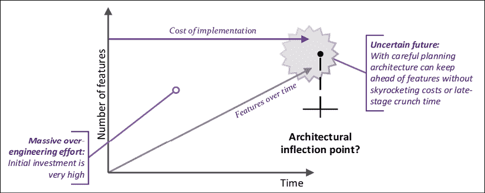

图 7.3：大型企业应用的架构之旅

随着时间的推移和系统整体复杂性的增加，大型企业应用也可能面临一个类似的转折点，此时原始架构可能变得不足。通过仔细规划和管理工作，你可以避免麻烦并保护所做出的重大初始投资。这类大型企业应用需要数百名开发者，以及多个级别的经理和架构师来成功执行。与亿级用户规模的应用类似，这些应用也可能有特定的架构需求。在我们开发的小型应用和大型企业应用之间，存在着 LOB 应用。

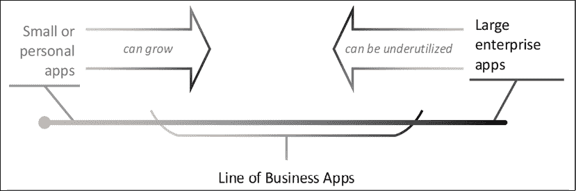

图 7.4：软件演变的动态性

如前图所示，小型应用可以增长并转变为 LOB 应用，而大型企业应用可能会因为用户忽视他们从未需要的功能而未被充分利用，但仍然作为 LOB 应用服务于单一目的。在任何情况下，尽管我们尽了最大努力，但我们最终可能为解决我们的问题提供了一个低效的解决方案。我们都没有水晶球来预见未来，规划和工程在不可预测的商业环境中只能为我们做这么多；我们需要依靠 80-20 规则来制定一个灵活且能够满足大多数商业需求的架构。

以路由器为首要架构的目标是保持最佳架构开销，以便在匆忙交付所有必需功能时，可以避免昂贵的重新工程或后期冲刺。让我们看看如何做到这一点。

## 严谨和平衡的方法

我们已经涵盖了软件开发中的“是什么”，但我们必须考虑“为什么”、“何时”、“何地”和“谁”，然后我们才能到达“如何”。当我们为学习或激情项目开发应用时，我们通常会过度简化我们的项目。如果你的激情项目意外地一夜成名，那么维护或继续添加应用功能可能会变得成本高昂。在这种情况下，你可能会面临一个选择，即承担持续维护的成本，或者重写你的应用程序。

当我们为工作开发应用时，我们往往更加保守，我们可能会过度工程我们的解决方案。然而，如果你只为工作编码，那么你可能会在生产代码中进行实验。在与其他团队成员共享的代码库中进行实验是危险的。你可能会引入一种新的模式，而你的团队可能不了解你选择的结果。你也不太可能意识到你引入的技术在中等或长期风险或收益。 

草率实验也可能对您的团队成员产生严重的负面影响。在一个由资深和经验丰富的软件工程师组成的团队中，您可能在移动车辆中进行实验。然而，我们团队中可能有着不同背景和学习风格的成员。我们中的一些人有计算机科学学位，一些人是独行侠，一些人对 Stack Overflow 过于依赖。我们中的一些人在支持职业发展的公司工作，但一些人在不会给您一天时间学习新东西的地方工作。因此，当我们进行实验时，我们必须考虑我们的环境；否则，我们可能会让我们的同事加班或感到无助和沮丧。

采用有纪律和平衡的方法，我们可以减少交付的缺陷数量，避免昂贵的返工，并与所有朝同一方向前进的人一起工作。我们还需要正确的架构、工具和模式/实践来成功交付。总之，我们的方法必须考虑：

+   我们应用的大小

+   我们开发应用的原因

+   开发者的技能水平

+   迭代和增量交付

+   特性的持续向前流动

+   所有云相关事物

理想情况下，我们需要保持最佳工程开销。我们的架构应该支持我们的短期需求，同时具有可扩展性，这样我们就可以在长期或中期需求发生变化时，无需重写大量代码，而在不同方向上进行调整。考虑以下图表，与上一节中关于小型和大型企业应用的图表进行对比：

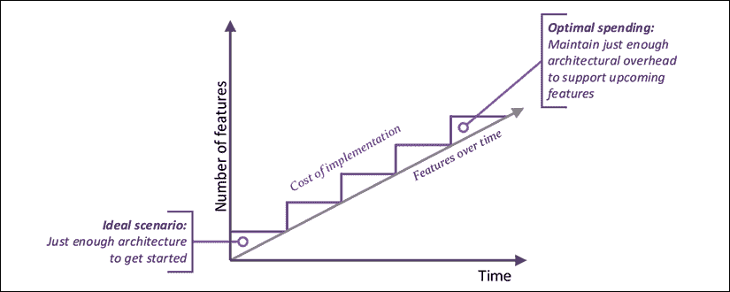

图 7.5：LOB 应用的理想架构之旅

以路由器优先的架构旨在帮助您在工程开销、功能交付和代码库的灵活性之间找到平衡。然而，你必须自己带来纪律。

 或 Shu Ha Ri 是一个可以帮助您在工作中建立纪律的概念。这是一种思维方式，指导您首先掌握基础知识，而不必担心底层理论，然后掌握理论，最后能够根据您的需求调整您所掌握的内容。然而，如果您跳过步骤 1 或 2，您可能会发现自己以错误的方式调整了错误的内容。

在讨论了*什么*、*为什么*、*何时*、*何地*和*谁*之后，让我们在下一节中跳入*如何*。

# 路由器优先架构

路由器优先架构是一种方法：

+   **强制**进行高级思维

+   **确保**在开始编码之前就功能达成共识

+   **规划**您的代码库/团队的增长

+   **引入**小的工程开销

实施路由器优先架构的七个步骤：

1.  制定路线图和范围（*第七章*）

1.  考虑懒加载进行设计（*第七章*）

1.  实施步行骨架导航体验（*第七章*）

1.  实现无状态、数据驱动的架构（*第七章*和*第十章*）

1.  强制采用解耦的组件架构（*第八章*、*第十一章*和*第十二章*）

1.  区分用户控件和组件（*第十一章*）

1.  利用 TypeScript 和 ES 功能最大化代码复用（*第八章*、*第十章*、*第十一章*和*第十二章*）

如前所述，每个步骤将在本章和后续章节中更详细地介绍。在我们从高层次概述这些步骤之前，让我们首先介绍 Angular 中的功能模块，这是一个重要的基本技术概念。

## 功能模块

在*第一章*，*Angular 及其概念简介*中，我们以高层次介绍了 Angular 的架构，并介绍了懒加载和路由的概念。功能模块是实现懒加载的关键组件。有两种类型的模块：根模块和功能模块。模块通过`NgModule`类实现。`NgModule`包含渲染组件和注入服务所需的所有必要元数据。没有模块的组件几乎不起作用。

一个 Angular 应用程序由一个位于应用程序根部的`NgModule`定义。这被称为根模块。根模块负责渲染`index.html`文件中的`<app-root>`元素中显示的内容。在以下图中定位根模块：

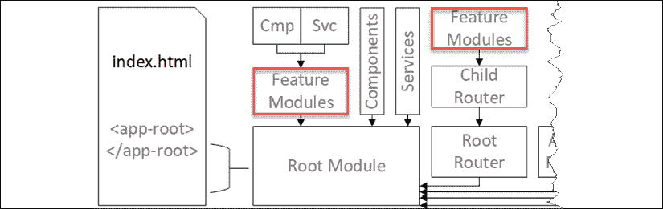

图 7.6：Angular 的主要架构组件

一个 NgModule 可以包含许多其他 NgModules。Angular 应用程序只有一个根模块，因此根据定义，每个其他 NgModule 都成为功能模块。在前面的图中，你可以看到可以将一组组件（**Cmp**）和服务（**Svc**）组织到功能模块中。将功能分组到模块中允许我们将代码组织成块，这些块可以与应用程序的初始负载分离。

根模块和功能模块的概念代表了父/子关系，这是一个扩展到其他功能和框架的概念。例如，注意前面的图中将根路由注入到根模块中。根路由可以有子路由。子路由可以配置为加载功能模块。同样，NgRx 有根模块和功能模块级别的存储来组织应用程序的状态数据。

就本书而言，任何提及的子模块、子模块或功能模块都指的是同一件事：不是根模块的模块。

功能模块和子路由允许将应用程序的主要组件之间的关注点分离。两个团队可以同时工作在不同的模块上，而不会相互干扰。这种分离意味着任何功能模块所需的依赖项都必须明确添加到该模块的导入、声明或提供者中。当在模块之间共享代码时，这可能会显得重复且令人烦恼，但这是必要的恶行。

在 Angular 中，默认情况下，服务是单例的——每个模块一个实例。在将已导入根模块的服务导入功能模块之前，考虑这是否真的是期望的行为。在根模块中提供的服务可以在功能模块中导入，而无需再次提供。在根模块和功能模块中提供服务会导致内存中有多个该服务的实例，这打破了默认情况下服务是单例的预期。在*第八章*，*设计身份验证和授权*中，当我们实现`AuthService`时，你将看到这一行为的具体实现。

随着 Angular 9 中 Ivy 渲染引擎的引入，创建自描述组件的道路已经铺平。自描述组件不需要 NgModule 就能发挥作用。随着 Angular 未来版本的推出，将能够实现无需整个仪式（即：样板代码）的简单应用。

现在，让我们从高层次上概述一下路由优先架构的七个步骤。

## 制定路线图和确定范围

在项目早期就制定路线图和确定项目范围对于确保高级架构的正确性至关重要。创建待办事项列表、线框图、原型和交互式原型将帮助你确定路线图，在开始之前捕捉到具体愿景。重要的是要记住，只有在必要时才携带工具。不要一开始就使用 Photoshop，一张纸和一支铅笔就足够了。如果利益相关者和团队成员了解正在开发的内容，那么就有可能迭代和逐步交付你的解决方案。然而，不要陷入完美的陷阱。在基本要素到位并获得一致同意之后，再进行微调和家具调整。

记录你创建的每一个工件。在本章的后面部分，我们将介绍如何利用 GitHub Wikis 来存储你的工件。

在本章的后面部分，我们将介绍如何制定路线图和定义范围的技术，这些技术是在*第三章*，*创建基本的 Angular 应用*中介绍的路线图构建技术的基础上进行的。

## 以懒加载为设计理念

首次绘制非常重要！根据 Angular 团队在 2018 年收集的 Google Analytics 数据，53%的移动用户在加载时间超过 3 秒时放弃了网站。在同一时间段内，大多数网站都是在移动设备上被消费的，在美国约为 70%以上，在中国约为 90%以上。正如我们在*第五章*，*使用 Material 提供高质量 UX*中所述，UI 库和静态资产可以显著增加你的应用程序的大小。鉴于大多数内容都是在移动设备上被消费的，延迟加载非关键资产非常重要。

我们通过将我们的 Angular 应用程序的部分划分为功能模块来延迟加载资源。这样，Angular 只能加载渲染当前屏幕所需的资源，并在需要时动态下载进一步的资源。将你的应用程序划分为功能模块的一个好方法是通过定义应用程序可能使用的各种用户角色。用户角色通常表示用户的职能，例如经理或数据录入专员。从技术角度来说，它们可以被视为一组特定类别的用户被允许执行的操作。毕竟，数据录入专员永远不会看到经理可以看到的大多数屏幕，那么为什么要把这些资源提供给这些用户并减慢他们的体验呢？

懒加载对于创建可扩展的应用程序架构至关重要，它允许你交付高质量和高效的产品。懒加载是一个低垂的果实，我们将将其作为基本设计目标来处理。在事后实现懒加载可能会很昂贵。

从 Angular 9 开始，可以懒加载单个组件。Angular 9 的 Ivy 渲染引擎使得组件具有自描述性和独立性。那些不需要 Angular 应用程序所需的所有引导的组件有可能彻底改变并简化我们设计应用程序的方式。然而，目前还无法以这种方式设计应用程序。期待 Angular 的未来版本引入公共 API，使其能够轻松使用新功能，减少早期精心设计功能模块的需求。

在本章的后面部分，你将学习如何使用功能模块实现懒加载。

## 实现一个行走骨架

配置懒加载可能很棘手，这就是为什么在早期就确定行走骨架导航体验至关重要。实现一个可点击的应用程序版本将帮助你尽早收集用户反馈。这样，你将能够快速解决基本的工作流程和集成问题。此外，你将能够确立当前开发工作的具体范围。开发人员和利益相关者都将能够更好地可视化最终产品的外观。

行走骨架也为多个团队协同工作奠定了基础。多个人可以同时开始开发不同的功能模块或组件，而不必担心这些拼图碎片将来如何拼合在一起。到本章结束时，你将完成实现示例应用程序 LemonMart 的行走骨架。

## 实现无状态、数据驱动的架构

如第十章“RESTful API 和全栈实现”中强调的那样，在全栈架构中实现无状态设计对于构建可维护的应用程序至关重要。如第一章“Angular 简介及其概念”和第十二章“食谱 - 主/详细、数据表和 NgRx”中所述，Flux 模式和 NgRx 使得为应用程序实现不可变状态成为可能。然而，Flux 模式对于大多数应用程序来说可能过于复杂。NgRx 本身利用了 RxJS 中许多核心技术。

我们将使用 RxJS 和响应式编程范式来实现一个最小化、无状态和以数据驱动的模式来构建我们的应用程序。识别用户将要操作的主要数据实体，例如发票或人员，将帮助您避免过度设计应用程序。围绕主要数据实体进行设计将在早期就指导 API 设计，并帮助定义您将用于实现无状态、数据驱动设计的 `BehaviorSubject` 数据锚点。这种设计反过来将确保一个解耦的组件架构，如第六章“表单、Observables 和 Subjects”中详细所述。

通过定义可观察的数据锚点，您可以确保各个组件之间的数据保持同步。通过编写功能响应式代码，利用 RxJS 功能，并在组件中不存储状态，我们可以实现不可变的数据流。

我们将在第十章“RESTful API 和全栈实现”中介绍如何设计应用程序的数据模型，并在接下来的章节中继续使用这些模型。

## 强制实施解耦的组件架构

如我们在第一章“Angular 简介及其概念”中讨论的那样，解耦架构中的组件对于确保代码库的可维护性至关重要。在 Angular 中，您可以通过利用 `@Input` 和 `@Output` 绑定以及路由编排来实现组件的解耦。

绑定将帮助您维护一个简单的组件层次结构，并在静态设计更有效的情况下避免使用动态模板，例如创建多页表单。

路由出口和辅助路径允许您使用路由来组合视图。解析器可以通过消耗路由参数来帮助加载数据。身份验证守卫可以帮助控制对各种模块和组件的访问。使用路由链接，您可以以动态和可预测的方式定制用户将看到的元素，类似于我们在上一步中设计和开发数据锚点的方式。

如果您确保每个组件都负责加载自己的数据，那么您可以通过 URL 来组合组件。然而，过度使用路由本身可能成为一种反模式。如果一个父组件在逻辑上拥有一个子组件，那么解耦它们的努力将是徒劳的。

在第六章“表单、可观察对象和主题”中，你学习了如何使用 `BehaviorSubject` 启用组件交互。在第十一章“食谱 - 可重用性、路由和缓存”中，你将学习如何实现 `@Input` 和 `@Output` 绑定，在接下来的章节中，你将学习如何实现路由功能。

## 区分用户控件和组件。

另一个重要的观点是区分用户控件和组件。用户控件就像自定义日期输入或自定义星级评分器。它通常是高度交互性和动态的代码，最终会变成高度耦合、复杂和复杂的代码。这样的控件可能会使用到之前没有人听说过的 Angular 特性，这些特性很可能在本书中没有涉及。

组件更像是带有字段的表单，可能包含简单的日期输入或星级评分器。因为表单封装了业务功能，所以其代码必须易于阅读和理解。你的代码应遵循 Angular 基础，这样代码就稳定且易于维护，就像本书中展示的大多数代码一样。

通过区分用户控件和组件，你可以在决定想要创建哪种可重用代码时做出更好的决策。创建可重用代码是有成本的。如果你创建了正确的可重用代码，你可以节省时间和资源。如果你创建了错误的可重用代码，那么你可能会浪费大量的时间和资源。

原型设计允许你早期识别可重用元素。用户控件将帮助将用户交互代码与业务逻辑分离。精心设计的组件重用将使你能够封装特定领域的行怍，并在以后共享。

识别封装你希望为你的应用程序创建的独特行为的自包含用户控件是很重要的。用户控件很可能会以指令或具有数据绑定属性和紧密耦合的控制器逻辑和模板的组件的形式创建。

另一方面，组件利用路由生命周期事件来解析参数并在数据上执行 CRUD 操作。早期识别这些组件重用将导致创建更多灵活的组件，这些组件可以在多个上下文中重用（由路由器编排），从而最大化代码重用。

我们将在第十一章“食谱 - 可重用性、路由和缓存”中介绍如何创建可重用组件和用户控件。

## 使用 TypeScript 和 ES 最大化代码重用。

在考虑 Angular、RxJS 以及你使用的所有库提供的功能之前，记住你所使用语言的底层特性是至关重要的。你可以利用数十年的软件工程基础来编写可读性和可维护性强的代码。

首先最重要的是 DRY 原则，即不要重复自己。所以，不要复制粘贴代码。不要只是更改一个或两个变量。积极重构你的代码，使你的函数无状态和可重用。简而言之：不要重复自己，不要重复自己，不要重复自己。

利用面向对象设计。将行为移动到类中；如果你的`person`对象有一个`fullName`属性，不要在十几个不同的地方重新实现相同的逻辑，而是在`person`类中实现一次。这意味着你需要熟悉水合（也称为将 JSON 对象注入新实例化的类）以及使用`toJSON`进行序列化。重要的是不要过度使用面向对象编程。你应该通过避免在类参数中存储状态，保持无状态和函数式。

通过利用泛型、继承和抽象类，你可以真正发挥面向对象设计的威力。

TypeScript 将接口的概念引入 JavaScript。接口主要是一个静态类型语言的保留概念。接口代表了一个对象可以做什么的抽象概念，而不指定任何实现细节。此外，接口可以用来记录数据的形状。例如，你可以编写第三方 API 的部分接口来记录你感兴趣消费的字段。当其他开发者阅读你的代码时，他们可以本能地理解他们消费的数据结构，而无需阅读另一个网站上的文档。

接口还允许你以定义良好的方式改变数据结构。因此，你可以编写一个转换函数来将外部数据结构转换为内部数据结构。TypeScript 会捕获你可能犯的任何错误。进一步来说，你也可以使用接口来简化数据。如果你接收到的数据具有多实体关系结构，你可以简化这种关系，从而将数据设计从你的 UI 代码中解耦。

不要过度简化你的数据。对于常见的对象，如姓名对象或常用领域特定对象，数组和简单形状都是可以的。

你还应该避免在代码中使用字符串字面量。在比较 `'apples' !== 'Oranges'` 的业务逻辑中编写代码会导致难以维护的代码。你应该在 TypeScript 中利用枚举（`enums`），这样你的代码就不会受到程序员拼写错误或业务需求变化的影响。所以 `'oranges' === Fruit.Organes`。

除了 TypeScript 和 ECMAScript 之外，Angular 还提供了有用的函数，供你重用逻辑。Angular 验证器、管道、路由解析器和路由守卫都允许你在组件和模板之间共享代码。

以下章节将演示上述概念：

+   *第八章*，*设计身份验证和授权*

+   *第十章*，*RESTful API 和全栈实现*

+   *第十一章*，*食谱 – 可重用性、路由和缓存*

+   *第十二章*，*食谱 – 主/详细、数据表和 NgRx*

接下来，让我们先创建 LemonMart™，这是一个功能齐全的业务线应用，你可以将其用作启动下一个专业项目的模板。LemonMart 是一个强大且现实的项目，可以支持功能增长和不同的后端实现，并且它自带完整且可配置的认证和授权解决方案。

自从 LemonMart 上市以来，它已经为超过 14,000 名开发者提供了超过 160,000 个柠檬。真美味！

你可以随时从 GitHub 克隆完成的项目，[`www.github.com/duluca/lemon-mart`](https://www.github.com/duluca/lemon-mart)，无论何时你需要它。让我们直接进入正题。

# 创建 LemonMart

LemonMart 将是一个中等规模的业务线应用，拥有超过 90 个代码文件。我们将从创建一个新的 Angular 应用程序开始，从一开始就配置了路由和 Angular Material。

假设你已经安装了 *第二章* 中提到的所有必需的软件，*设置你的开发环境*。如果没有，请根据你的操作系统执行以下命令来配置你的环境。

在 Windows PowerShell 中，执行：

```js
PS> Install-Script -Name setup-windows-dev-env
PS> setup-windows-dev-env.ps1 
```

在 macOS 终端上，执行：

```js
$> bash <(wget -O - https://git.io/JvHi1) 
```

更多信息请参考 [`github.com/duluca/web-dev-environment-setup`](https://github.com/duluca/web-dev-environment-setup)。

## 创建一个路由优先的应用

使用路由优先的方法，我们希望在应用早期就启用路由：

1.  你可以通过执行以下命令创建一个新应用，其中已经配置了路由。

    确保没有全局安装 `@angular/cli`，否则你可能会遇到错误：

    ```js
    $ npx @angular/cli new lemon-mart --routing --strict
    (Select CSS as the stylesheet format ) 
    ```

    从 Angular 9 开始，你可以使用 `--strict` 来启用 TypeScript 功能，如 `noImplicitAny`、`noImplicitReturns`、`noFallthroughCasesInSwitch` 和 `strictNullChecks`。这些选项将减少编码错误的机会，但会导致代码更加冗长。在我看来，这是一个好事，并且这个选项非常推荐用于生产环境的应用。

1.  为我们创建了一个新的 `AppRoutingModule` 文件：

    ```js
    **src/app/app-routing.modules.ts**
    import { NgModule } from '@angular/core';
    import { Routes, RouterModule } from '@angular/router'; 
    const routes: Routes = [];
    @NgModule({
      imports: [RouterModule.forRoot(routes)],
      exports: [RouterModule],
    })
    export class AppRoutingModule { } 
    ```

    我们将在路由数组内部定义路由。请注意，路由数组被传递进来以配置为应用的根路由；默认的根路由是 `/`。

    当配置你的 `RouterModule` 时，你可以传递额外的选项来定制 Router 的默认行为，例如当你尝试加载一个你已经处于其中的路由时。通常情况下，如果你尝试导航到的路由与当前路由相同，路由器不会采取任何行动。然而，如果你想让路由器刷新页面，你可以定制路由器的默认行为，例如使用 `RouterModule.forRoot(routes, { onSameUrlNavigation: 'reload' })`。启用此设置后，如果你导航到与当前相同的 URL，你将强制重新加载当前组件。

1.  最后，`AppRoutingModule` 与 `AppModule` 注册，如下所示：

    ```js
    **src/app/app.module.ts**
    ...
    import { AppRoutingModule } from './app-routing.module';
    @NgModule({ 
      ... 
      imports: [ AppRoutingModule, ... ], 
      ...
    }) 
    ```

## 配置 Angular 和 VS Code

要快速应用第 2-6 章中涵盖的配置步骤，请运行以下命令：

以下脚本不需要你使用 VS Code。如果你希望使用其他 IDE，如 WebStorm，配置的 `npm` 脚本同样可以很好地运行。

1.  安装 Angular VS Code 任务：

    ```js
    npm i -g mrm-task-angular-vscode 
    ```

1.  应用 Angular VS Code 配置：

    ```js
    npx mrm angular-vscode 
    ```

1.  安装 Docker 任务的 npm 脚本：

    ```js
    npm i -g mrm-task-npm-docker 
    ```

1.  应用 Docker 配置的 npm 脚本：

    ```js
    npx mrm npm-docker 
    ```

1.  实现一个名为 `build:prod` 的 npm 脚本来在生产模式下构建你的应用。

    ```js
    "scripts": {
      ...,
      "build:prod": "ng build --prod",
    } 
    ```

这些设置不断调整以适应扩展、插件、Angular 和 VS Code 的不断变化。始终确保通过重新运行 `install` 命令来安装任务的最新版本。或者，你可以使用 VS Code 的 Angular Evergreen 扩展来一键运行配置命令。

注意，如果前面的配置脚本执行失败，那么以下 npm 脚本也会失败。在这种情况下，你有两个选择：撤销你的更改并忽略这些脚本，或者手动实现这些脚本，如前几章所述（或如 GitHub 上所示）。

1.  执行 `npm run style:fix`。

1.  执行 `npm run lint:fix`。

1.  执行 `npm start` 并确保你正在运行在 `http://localhost:5000`，而不是默认端口 `4200`。

参考第二章，*设置你的开发环境*，以获取更多配置细节。

你可以选择使用 `mrm-task-npm-aws` 为 AWS ECS 设置 npm 脚本，这在第十三章，*AWS 上的高可用云基础设施*中有所介绍。

关于 mrm 任务更多信息，请参考：

+   [`github.com/expertly-simple/mrm-task-angular-vscode`](https://github.com/expertly-simple/mrm-task-angular-vscode)

+   [`github.com/expertly-simple/mrm-task-npm-docker`](https://github.com/expertly-simple/mrm-task-npm-docker)

+   [`github.com/expertly-simple/mrm-task-npm-aws`](https://github.com/expertly-simple/mrm-task-npm-aws)

## 配置材料和样式。

我们还需要设置 Angular Material 并配置一个要使用的主题，如第五章，*使用 Material 提供高质量 UX* 中所述：

1.  安装 Angular Material：

    ```js
    $ npx ng add @angular/material
    (select Custom, No to global typography, Yes to browser animations)
    $ npm i @angular/flex-layout 
    $ npx ng g m material --flat -m app 
    ```

1.  在 `material.module.ts` 中定义一个 `const` `modules` 数组并导出 `MatButtonModule`、`MatToolbarModule` 和 `MatIconModule`，移除 `CommonModule`。

1.  在 `app.modules.ts` 中导入 `FlexLayoutModule` 以激活 Angular Flex Layout。

1.  按照以下代码将常用 CSS 添加到 `styles.css` 中：

    ```js
    **src/styles.css**
    html,
    body { 
      height: 100%; 
    }
    body { 
      margin: 0;
      font-family: Roboto, "Helvetica Neue", sans-serif; 
    }
    .margin-top { 
      margin-top: 16px;
    }
    .horizontal-padding { 
      margin-left: 16px;
      margin-right: 16px;
    }
    .flex-spacer {
      flex: 1 1 auto;
    } 
    ```

1.  在 `index.html` 中更新你的应用标题。

参考第五章，*使用 Material 提供高质量 UX*，以获取更多配置细节。

我们将在本章的后面部分应用自定义品牌到应用中。接下来，让我们开始设计我们的业务线应用。

## 设计 LemonMart。

在数据库到前端的过程中，构建一个基本的路线图来遵循，同时避免过度设计，这一点非常重要。这个初始设计阶段对你的项目的长期健康和成功至关重要，其中必须打破团队之间现有的隔阂，并确保所有团队成员都充分理解整体技术愿景。这说起来容易做起来难，关于这个话题已经有许多书籍被撰写。

在工程领域，没有一种正确答案可以解决所有问题，因此记住没有人能够拥有所有答案，也没有人能够拥有清晰明确的愿景，这一点非常重要。在文化中，技术和非技术领导者创建一个安全的空间，提供开放讨论和实验的机会，这一点非常重要。作为一个团队，能够共同面对这种不确定性所带来的谦逊和同理心，与任何单个团队成员的技术能力一样重要。每个团队成员都必须舒适地放下他们的自我，因为我们的共同目标是在开发周期中不断增长和演变一个能够满足不断变化需求的应用程序。如果你知道你成功了，那么你创建的软件的各个部分将很容易被任何人替换。

因此，让我们首先开发一个路线图，并确定我们应用程序的范围。为此，我们将定义用户角色，然后构建一个网站图，以形成一个关于我们的应用程序可能如何工作的愿景。

### 确定用户角色

我们设计的第一步将是思考谁在使用这个应用程序以及为什么。

我们设想了 LemonMart 的四种用户状态或角色：

+   认证；任何认证用户都将能够访问其个人资料

+   收银员，其唯一角色是结账客户

+   会计，其唯一角色是执行与库存相关的功能

+   经理，可以执行收银员和会计可以执行的所有操作，同时还可以访问管理功能

考虑到这一点，我们可以开始为我们的应用程序创建一个高级设计。

### 使用网站图确定高级模块

开发一个高级网站图，如下所示：

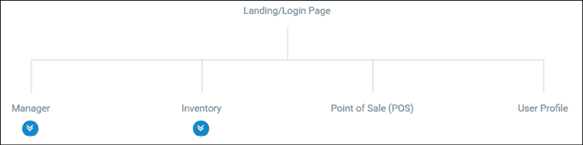

图 7.7：用户登录页面

我使用了 MockFlow.com 的网站图工具创建了显示的网站图：[`sitemap.mockflow.com`](https://sitemap.mockflow.com)。

在初步检查后，有三个高级模块被认为是懒加载的候选者：

1.  **销售点（POS**）

1.  **库存**

1.  **经理**

收银员只能访问**POS**模块和组件。会计只能访问**库存**模块，该模块将包括**库存录入**、**产品**和**类别**管理组件的附加屏幕：

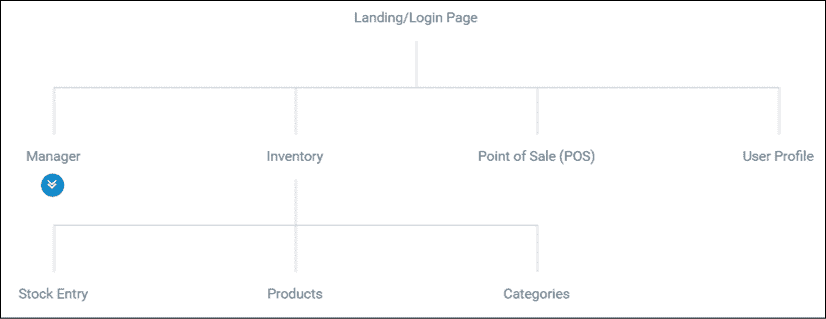

图 7.8：库存页面

最后，**经理**将能够通过**经理**模块访问所有三个模块，包括用户管理和收据查找组件：

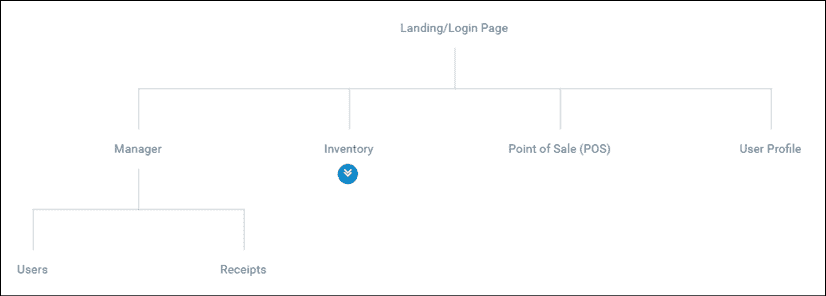

图 7.9：经理页面

启用所有三个模块的懒加载将带来巨大的好处；由于收银员和店员永远不会使用属于其他用户角色的组件，没有必要将这些字节发送到他们的设备上。这意味着随着**Manager**模块获得更多高级报告功能，或者新角色被添加到应用程序中，**POS**模块将不会受到其他增长应用程序带宽和内存影响的冲击。

这意味着更少的支持电话，以及更长时间在同一硬件上的一致性能。

# 生成具有路由功能的模块

现在我们已经将高级组件定义为**Manager**、**Inventory**和**POS**，我们可以将它们定义为模块。这些模块将不同于您迄今为止创建的模块，因为它们用于路由和 Angular Material。我们可以在应用模块上创建用户配置文件作为组件；然而，请注意，用户配置文件将仅用于已认证的用户，因此定义一个仅针对一般认证用户的第四个模块是有意义的。这样，您将确保您的应用的第一批数据尽可能最小化。此外，我们将创建一个主页组件来包含我们应用的着陆体验，这样我们就可以将实现细节从`app.component`中分离出来：

1.  生成`manager`、`inventory`、`pos`和`user`模块，指定它们的目标模块和路由功能：

    ```js
    $ npx ng g m manager -m app --routing
    $ npx ng g m inventory -m app --routing
    $ npx ng g m pos -m app --routing
    $ npx ng g m user -m app --routing 
    ```

    如同在*第二章*，*设置您的开发环境*中讨论的那样，如果您已经配置了`npx`以自动识别`ng`作为命令，那么您可以节省一些按键，因为您不必每次都附加`npx`到您的命令中。不要全局安装`@angular/cli`。

    注意简化的命令结构，其中`ng generate module manager`变为`ng g m manager`，同样，`--module`变为`-m`。

1.  确认您没有 CLI 错误。

    注意，在 Windows 上使用`npx`可能会抛出一个错误，例如`Path must be a string. Received undefined`。这个错误似乎对命令的成功执行没有影响，这就是为什么始终检查 CLI 工具生成的输出是至关重要的。

1.  确认文件夹和文件已被创建：

    ```js
    **/src/app**
    │   app-routing.module.ts
    │   app.component.css
    │   app.component.html
    │   app.component.spec.ts
    │   app.component.ts
    │   app.module.ts
    │   material.module.ts
    ├───inventory
    │      inventory-routing.module.ts
    │      inventory.module.ts
    ├───manager
    │      manager-routing.module.ts
    │      manager.module.ts
    ├───pos
    │      pos-routing.module.ts
    │      pos.module.ts
    └───user
    │      user-routing.module.ts
    │      user.module.ts 
    ```

1.  检查`ManagerModule`是如何连接的。

功能模块实现了一个类似于`app.module`的`@NgModule`。最大的区别是功能模块不实现`bootstrap`属性，这是您的根模块初始化 Angular 应用所必需的：

```js
**src/app/manager/manager.module.ts**
import { NgModule } from '@angular/core'
import { CommonModule } from '@angular/common'
import { ManagerRoutingModule } from './manager-routing.module'
@NgModule({
  imports: [CommonModule, ManagerRoutingModule],
  declarations: [],
})
export class ManagerModule {} 
```

由于我们指定了`-m`选项，模块已经被导入到`app.module`中：

```js
**src/app/app.module.ts**
...
import { ManagerModule } from './manager/manager.module'
...
@NgModule({ 
  ... 
  imports: [..., ManagerModule], 
  ...
}) 
```

此外，因为我们还指定了`--routing`选项，一个路由模块已经被创建并导入到`ManagerModule`中：

```js
**src/app/manager/manager-routing.module.ts**
import { NgModule } from '@angular/core'
import { Routes, RouterModule } from '@angular/router'
const routes: Routes = []
@NgModule({
  imports: [RouterModule.forChild(routes)], 
  exports: [RouterModule],
})
export class ManagerRoutingModule {} 
```

注意，`RouterModule` 正在使用 `forChild` 进行配置，而不是 `forRoot`，这在 `AppRouting` 模块中是案例。这样，路由器可以正确理解不同模块上下文中定义的路由之间的关系，并可以在本例中将 `/manager` 前缀正确地添加到所有子路由。

CLI 不尊重您的 `tslint.json` 设置。如果您已正确配置了 VS Code 环境并使用 Prettier，则您的代码样式首选项将在您处理每个文件时应用，或在运行 `prettier` 命令时全局应用。

在继续之前，请确保运行您的 `style:fix` 和 `lint:fix` 命令。现在，让我们设计 LemonMart 的着陆页的外观和工作方式。

## 设计主页路由

将以下模拟图视为 LemonMart 的着陆体验：

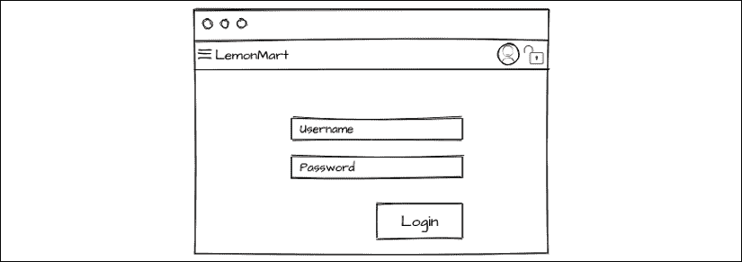

图 7.10：LemonMart 着陆体验

与 `LocalCastWeather` 应用不同，我们不希望所有这些标记都放在 `App` 组件中。`App` 组件是您整个应用的根元素；因此，它应该只包含将在您的应用中持续出现的元素。在以下注释的模拟图中，标记为 **1** 的工具栏将在整个应用中保持不变。

标记为 **2** 的区域将包含 `home` 组件，它本身将包含一个登录用户控件，标记为 **3**：

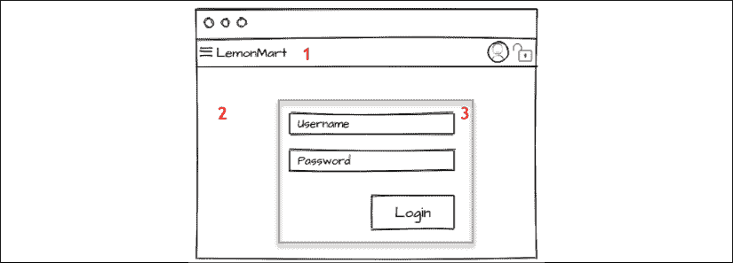

图 7.11：LemonMart 布局结构

在 Angular 中，将默认或着陆组件作为单独的元素创建是最佳实践。这有助于减少必须加载和执行的代码量以及逻辑，但这也使得在利用路由器时具有更灵活的架构。

使用内联模板和样式生成 `home` 组件：

```js
$ npx ng g c home -m app --inline-template --inline-style 
```

注意，具有内联模板和样式的组件也被称为 **单文件组件** 或 **SFC**。

现在，您已经准备好配置路由器。

### 设置默认路由

让我们开始设置 LemonMart 的简单路由。我们需要设置 `/` 路由（也称为空路由）和 `/home` 路由以显示 `HomeComponent`。我们还需要一个通配符路由来捕获所有未定义的路由并显示 `PageNotFoundComponent`，这也需要创建：

1.  配置 `home` 路由：

    ```js
    **src/app/app-routing.module.ts**
    ...
    **import { HomeComponent } from './home/home.component'**
    const routes: Routes = [
     **{ path: '', redirectTo: '/home', pathMatch: 'full' },**
     **{ path: 'home', component: HomeComponent },**
    ]
    ... 
    ```

    我们首先为 `'home'` 定义一个路径，并通过设置 `component` 属性通知路由器渲染 `HomeComponent`。然后，我们将应用的默认路径 `''` 设置为重定向到 `'/home'`。通过设置 `pathMatch` 属性，我们始终确保这个非常具体的 `home` 路由实例将被渲染为着陆体验。

1.  创建一个具有内联模板的 `pageNotFound` 组件

1.  为 `PageNotFoundComponent` 配置通配符路由：

    ```js
    **src/app/app-routing.module.ts**
    **import {** 
     **PageNotFoundComponent** 
    **} from './page-not-found/page-not-found.component'** 
    ...
    const routes: Routes = [
      ...
        **{ path: '**', component: PageNotFoundComponent },**
      ]
    ... 
    ```

这样，任何未匹配的路由都将被重定向到 `PageNotFoundComponent`。

### RouterLink

当用户到达 `PageNotFoundComponent` 时，我们希望他们使用 `routerLink` 指令重定向到 `HomeComponent`：

1.  在 `PageNotFoundComponent` 上，替换内联模板以使用 `routerLink` 链接到 `home`：

    ```js
    **src/app/page-not-found/page-not-found.component.ts**
    ...
      template: `
     **<p>**
     **This page doesn't exist. Go back to**
     **<a routerLink="/home">home</a>.**
     **</p>**
      `,
    ... 
    ```

此导航也可以通过 `<a href>` 标签实现；然而，在更动态和复杂的导航场景中，您将失去诸如自动活动链接跟踪或动态链接生成等特性。

Angular 引导过程将确保 `AppComponent` 在您的 `index.html` 中的 `<app-root>` 元素内。然而，我们必须手动定义我们希望 `HomeComponent` 渲染的位置，以完成路由配置。

### 路由出口

`AppComponent` 被视为在 `app-routing.module` 中定义的根路由的根元素，这允许我们在该根元素内定义出口，以便使用 `<router-outlet>` 元素动态加载我们希望的内容：

1.  配置 `AppComponent` 使用内联模板和样式，删除 html 和 css 文件中任何现有的内容

1.  为您的应用程序添加工具栏

1.  将您应用程序的名称作为按钮链接添加，以便点击时将用户带到主页

1.  为内容渲染添加 `<router-outlet>`：

    ```js
    **src/app/app.component.ts**
    ...
    template: `
      <mat-toolbar color="primary">
        <a mat-button routerLink="/home"><h1>LemonMart</h1></a>
      </mat-toolbar>
      <router-outlet></router-outlet>
    `, 
    ```

现在，`home` 的内容将在 `<router-outlet>` 内渲染。

# 品牌化、定制和 Material 图标

为了构建一个吸引人且直观的工具栏，我们必须向应用程序引入一些图标和品牌，以便用户可以在熟悉图标的帮助下轻松地浏览应用程序。

## 品牌化

在品牌化方面，您应该确保您的网络应用程序有一个自定义的色彩调色板，并与桌面和移动浏览器功能集成，以突出显示您的应用程序名称和图标。

## 色彩调色板

使用第五章*使用 Material 提供高质量 UX*中讨论的 Material Color 工具选择一个色彩调色板。这是我为 LemonMart 选择的一个：

[`material.io/resources/color/#!/?view.left=0&view.right=0&primary.color=2E7D32&secondary.color=C6FF00`](https://material.io/resources/color/#!/?view.left=0&view.right=0&primary.color=2E7D32&secondary.color=C6FF00)。

1.  将 `custom-theme.scss` 重命名为 `lemonmart-theme.scss`

1.  使用新的主题文件名更新 `angular.json`

    ```js
    **angular.json**
    "apps": [ {
      ... 
      "styles": [ 
        "src/lemonmart-theme.scss", 
        "src/styles.css" 
      ],
      ...
    }] 
    ```

1.  使用所选的色彩调色板配置您的自定义主题

您还可以从 GitHub 获取 LemonMart 相关资产：[`github.com/duluca/lemon-mart`](https://github.com/duluca/lemon-mart)。

对于本地天气应用程序，我们替换了 `favicon.ico` 文件以在浏览器中品牌化我们的应用程序。虽然这在十年前就足够了，但今天的设备种类繁多，每个平台都可以利用优化的资产来更好地在其操作系统中代表您的网络应用程序。接下来，让我们实现一个更健壮的 favicon。

## 实现浏览器清单和图标

您需要确保浏览器在**浏览器**标签中显示正确的标题文本和图标。此外，还应创建一个实现各种移动操作系统的特定图标的 manifest 文件，这样如果用户将您的网站固定，就会显示类似于手机上其他应用图标的期望图标。这将确保如果用户在移动设备的首页上收藏或固定您的网络应用，他们将获得原生外观的应用图标：

1.  从设计师或类似[`www.flaticon.com`](https://www.flaticon.com)的网站上创建或获取您网站标志的 SVG 版本

1.  在这个例子中，我将使用 Eureka 柠檬的相似图像：

    图 7.12：LemonMart 的标志性标志

    当使用您在网上找到的图片时，请注意适用的版权。在这种情况下，我已购买许可证以能够发布这个柠檬标志，但您可以在以下 URL 获取您自己的副本，前提是您向图片的作者提供所需的归属：[`www.flaticon.com/free-icon/lemon_605070`](https://www.flaticon.com/free-icon/lemon_605070)。

1.  使用诸如[`realfavicongenerator.net`](https://realfavicongenerator.net)之类的工具生成`favicon.ico`和 manifest 文件

1.  调整 iOS、Android、Windows Metro 和 macOS Safari 的设置以符合您的喜好

1.  确保您设置一个版本号，因为 favicon 可能会因缓存而出名；一个随机的版本号将确保用户总是获得最新版本

1.  下载并解压生成的`favicons.zip`文件到您的`src`文件夹

1.  编辑`angular.json`文件以将新资源包含到您的应用中：

    ```js
    **angular.json**
    "apps": [
      {
      ...
        "assets": [
          "src/assets",
          "src/favicon.ico",
          "src/android-chrome-192x192.png",
          "src/favicon-16x16.png",
          "src/mstile-310x150.png",
          "src/android-chrome-512x512.png",
          "src/favicon-32x32.png",
          "src/mstile-310x310.png",
          "src/apple-touch-icon.png",
          "src/manifest.json",
          "src/mstile-70x70.png",
          "src/browserconfig.xml",
          "src/mstile-144x144.png",
          "src/safari-pinned-tab.svg",
          "src/mstile-150x150.png"
        ] 
    ```

1.  将生成的代码插入到您的`index.html`的`<head>`部分：

    ```js
    **src/index.html**
    <link rel="apple-touch-icon" sizes="180x180" href="/apple-touch- icon.png?v=rMlKOnvxlK">
    <link rel="icon" type="image/png" sizes="32x32" href="/favicon-32x32.png?v=rMlKOnvxlK">
    <link rel="icon" type="image/png" sizes="16x16" href="/favicon-16x16.png?v=rMlKOnvxlK">
    <link rel="manifest" href="/manifest.json?v=rMlKOnvxlK">
    <link rel="mask-icon" href="/safari-pinned-tab.svg?v=rMlKOnvxlK" color="#b3ad2d">
    <link rel="shortcut icon" href="/favicon.ico?v=rMlKOnvxlK">
    <meta name="theme-color" content="#ffffff"> 
    ```

    请在 favicon 声明之后、样式导入之前放置前面的 HTML。顺序很重要。浏览器从上到下加载数据。您希望应用程序的图标在用户等待下载 CSS 文件之前被解析。

1.  确保您的新 favicon 显示正确

一旦您完成基本品牌工作，请考虑是否想通过主题化建立更独特的视觉和感觉

## 自定义主题

您可以通过利用[`material.io/tools`](https://material.io/tools)上列出的工具以及我发现的某些其他工具来进一步自定义 Material 的外观和感觉，以实现您应用独特的体验，这些工具如下列所示：

+   Material Theme Editor（自 2020 年 3 月已停用）是适用于 macOS 上流行的设计应用 Sketch 的插件，用于创建比皮肤更深层次的主题。一个替代工具尚未宣布，但您可以在以下链接的博客文章中找到您可以继续使用的资源：[`material.io/tools/theme-editor`](https://material.io/tools/theme-editor)

+   Material Theme Builder 是构建在 Glitch.com 上工作的自定义主题的替代方案，网址为[`material-theme-builder.glitch.me`](https://material-theme-builder.glitch.me)

+   材料设计主题调色板生成器将在[`mcg.mbitson.com`](http://mcg.mbitson.com)生成定义您自定义颜色调色板的必要代码，以创建真正独特的主题。

+   颜色混合器有助于在两种颜色之间找到中间点，这在定义颜色样本之间的中间颜色时很有用，位于[`meyerweb.com/eric/tools/color-blend`](https://meyerweb.com/eric/tools/color-blend)。

在[`material.io`](https://material.io)上有很多关于 Material 设计背后深入哲学的信息，包括关于色彩系统[`material.io/design/color/the-color-system.html`](https://material.io/design/color/the-color-system.html)的精彩部分，深入探讨了为您的品牌选择正确的调色板以及其他主题，例如为您的应用创建深色主题。

区分您的品牌与其他应用或竞争对手非常重要。创建高质量的定制主题将是一个耗时的过程；然而，给用户留下深刻第一印象的好处是相当可观的。

接下来，我们将向您展示如何将自定义图标添加到您的 Angular 应用中。

## 自定义图标

现在，让我们在您的 Angular 应用中添加您的自定义品牌。您需要用于创建 favicon 的 svg 图标：

1.  将图片放在`src/assets/img/icons`下，命名为`lemon.svg`。

1.  在`app.module.ts`中，将`HttpClientModule`导入到`AppComponent`，以便可以通过 HTTP 请求`.svg`文件。

1.  更新`AppComponent`以注册新的 svg 文件作为图标：

    ```js
    **src/app/app.component.ts**
    **import { MatIconRegistry } from '@angular/material/icon'**
    **import { DomSanitizer } from '@angular/platform-browser'**
    ...
    export class AppComponent {
     **constructor(** 
     **iconRegistry: MatIconRegistry,** 
     **sanitizer: DomSanitizer**
     **) {** 
     **iconRegistry.addSvgIcon(**
     **'lemon',**
     **sanitizer.bypassSecurityTrustResourceUrl(**
     **'assets/img/icons/ lemon.svg'**
     **)** 
     **)**
      } 
    } 
    ```

1.  将图标添加到工具栏：

    ```js
    **src/app/app.component.ts**
    template: ` 
      <mat-toolbar color="primary"> 
     **<mat-icon svgIcon="lemon"></mat-icon>** 
        <a mat-button routerLink="/home"><h1>LemonMart</h1></a> 
      </mat-toolbar> 
      <router-outlet></router-outlet> 
    `, 
    ```

现在，让我们添加剩余的菜单、用户资料和注销图标。

## 材料图标

Angular Material 与 Material Design 图标字体无缝配合，该字体作为网络字体自动导入到您的`index.html`应用中。您可以自托管该字体；然而，如果您选择这条路，当用户的浏览器已经从访问另一个网站时缓存了字体，您将无法获得好处，这可能会在下载 42-56 KB 文件的过程中节省速度和延迟。完整的图标列表可以在[`material.io/icons/`](https://material.io/icons/)找到。

现在，让我们更新工具栏并设置主页，使用最小模板创建一个假登录按钮：

1.  确保 Material 图标`<link>`标签已添加到`index.html`。

    ```js
    **src/index.html**
    <head>
      ...
      <link href="https://fonts.googleapis.com/icon?family=Material+Icons" rel="stylesheet">
    </head> 
    ```

    如何自托管的说明可以在[`google.github.io/material-design-icons/#getting-icons`](http://google.github.io/material-design-icons/#getting-icons)的**自托管**部分找到。

    一旦配置完成，使用 Material 图标就变得简单。

1.  在`AppComponent`上，更新工具栏以将**菜单**按钮放置在标题左侧。

1.  添加`fxFlex`指令，以便剩余的图标右对齐。

1.  添加用户资料和注销图标：

    ```js
    **src/app/app.component.ts**
    template: `
      <mat-toolbar color="primary">
        <**button mat-icon-button><mat-icon>menu</mat-icon></button>**
        <mat-icon svgIcon="lemon"></mat-icon>
        <a mat-button routerLink="/home"><h1>LemonMart</h1></a>
        **<span class="flex-spacer"></span>**
     **<button mat-icon-button>**
     **<mat-icon>account_circle</mat-icon>**
     **</button>**
     **<button mat-icon-button>**
     **<mat-icon>lock_open</mat-icon>**
     **</button>**
      </mat-toolbar>
      <router-outlet></router-outlet>
    `, 
    ```

1.  在`HomeComponent`中，添加一个用于登录体验的最小模板，替换任何现有内容：

    ```js
    **src/app/home/home.component.ts**
      styles: [`
        div[fxLayout] {margin-top: 32px;}
      `],
      template: `
        <div fxLayout="column" fxLayoutAlign="center center">
          <span class="mat-display-2">Hello, Limoncu!</span>
          <button mat-raised-button color="primary">Login</button>
        </div>
      ` 
    ```

你的应用应该看起来与这张截图相似：

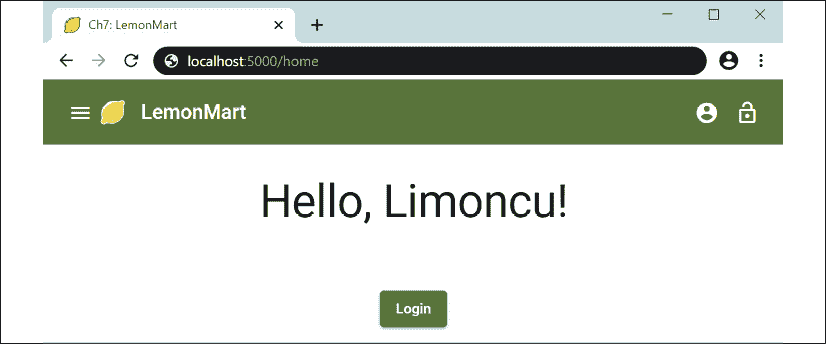

图 7.13：LemonMart 的最小化登录

在实现和显示/隐藏菜单、个人资料和注销图标方面，根据用户的认证状态，还有一些工作要做。我们将在*第八章*，*设计认证和授权*中介绍这一功能。

为了调试路由，获取你的路由的可视化，并使用 Angular Augury 紧密集成 Chrome 调试功能，请参阅*附录 A*，*调试 Angular*。

现在你已经为你的应用设置了基本的路由，我们可以继续设置带有子组件的 lazy 加载模块。如果你不熟悉 Angular 的故障排除和调试，请在继续之前参考*附录 A*，*调试 Angular*。

# 带有 lazy 加载的功能模块

资源有两种加载方式：eager 或 lazy。当浏览器加载你的应用的`index.html`时，它从上到下开始处理。首先处理`<head>`元素，然后是`<body>`。例如，我们在应用的`<head>`中定义的 CSS 资源将在应用渲染之前下载，因为我们的 Angular 应用在 HTML 文件的`<body>`中定义为`<script>`。

当你使用命令`ng build`时，Angular 利用 webpack 模块打包器将所有 JavaScript、HTML 和 CSS 组合成最小化和优化的 JavaScript 包。

如果你不在 Angular 中使用 lazy 加载，你的应用的所有内容都将被 eager 加载。用户将不会看到你的应用的第一屏，直到所有屏幕都下载并加载完成。

Lazy 加载允许 Angular 构建过程与 webpack 协同工作，将你的 Web 应用分离成不同的 JavaScript 文件，称为 chunks。我们可以通过将应用的部分功能分离成功能模块来启用这种 chunking。功能模块及其依赖可以被捆绑到单独的 chunks 中。记住，根模块及其依赖将始终在下载的第一个 chunk 中。因此，通过 chunking 我们应用的 JavaScript 包大小，我们保持初始 chunk 的大小最小。有了最小化的初始 chunk，无论你的应用如何增长，首次有意义的绘制时间保持不变。否则，随着你向应用添加更多功能和功能，你的应用将需要更长的时间来下载和渲染。Lazy 加载对于实现可扩展的应用架构至关重要。

考虑以下图形以确定哪些路由是 eager 加载的，哪些是 lazy 加载的：

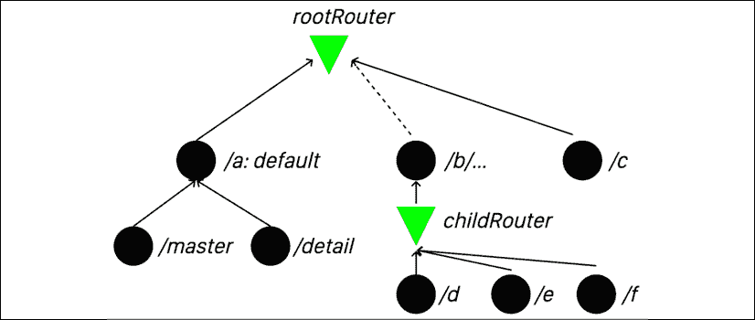

图 7.14：Angular 路由的 eager 加载与 lazy 加载

`rootRouter` 定义了三条路由：`a`、`b` 和 `c`。`/master` 和 `/detail` 代表了命名的路由出口，这在 *第十二章*、*食谱 – 主/详情、数据表和 NgRx* 中有详细说明。路由 `a` 是应用的默认路由。路由 `a` 和 `c` 用实线连接到 `rootRouter`，而路由 `b` 则使用虚线连接。在这种情况下，路由 `b` 被配置为懒加载路由。这意味着路由 `b` 将动态加载一个名为 **BModule** 的功能模块，该模块包含其 `childRouter`。这个 `childRouter` 可以定义任意数量的组件，甚至可以复用其他地方已经复用的路由名称。在这种情况下，`b` 定义了三条额外的路由：`d`、`e` 和 `f`。

考虑 `rootRouter` 的示例路由定义：

```js
**rootRouter example**
const routes: Routes = [
  { path: '', redirectTo: '/a', pathMatch: 'full' },
  {
    path: 'a',
    component: AComponent,
    children: [
      { path: '', component: MasterComponent, outlet: 'master' },
      { path: '', component: DetailComponent, outlet: 'detail' },
    ],
  },
  {
    path: 'b',
    loadChildren: 
      () => import('./b/b.module')
        .then((module) => module.BModule), 
    canLoad: [AuthGuard],
  },
  { path: 'c', component: CComponent },
  { path: '**', component: PageNotFoundComponent },
] 
```

注意，路由 `d`、`e` 和 `f` 的定义在 `rootRouter` 中不存在。请参阅 `childRouter` 的示例路由定义：

```js
**childRouter example**
const routes: Routes = [
  { path: '', redirectTo: '/b/d', pathMatch: 'full' },
  { path: 'd', component: DComponent },
  { path: 'e', component: EComponent },
  { path: 'f', component: FComponent },
] 
```

如您所见，`childRouter` 中定义的路由与 `rootRouter` 中定义的路由是独立的。子路由存在于一个层次结构中，其中 `/b` 是父路径。要导航到 `DComponent`，您必须使用路径 `/b/d`，而要导航到 `CComponent`，您只需使用 `/c` 即可。

给定这个示例配置，`rootRouter` 中定义的每个组件及其依赖项都会在我们的应用的第一块中，因此会预先加载。第一个块将包括组件 `A`、`Master`、`Detail`、`C` 和 `PageNotFound`。第二个块将包含组件 `D`、`E` 和 `F`。这个第二个块将不会在用户导航到以 `/b` 开头的路径之前下载或加载；因此，它是懒加载的。

在书中，我只介绍了已建立的方法，即懒加载功能模块。请查看 John Papa 的博客文章，关于在 [`johnpapa.net/angular-9-lazy-loading-components/`](https://johnpapa.net/angular-9-lazy-loading-components/) 创建懒加载组件。

我们现在将介绍如何设置带有组件和路由的功能模块。我们还将使用 Augury 来观察我们各种路由配置的效果。

## 配置带有组件和路由的功能模块

管理模块需要一个着陆页，如图所示：

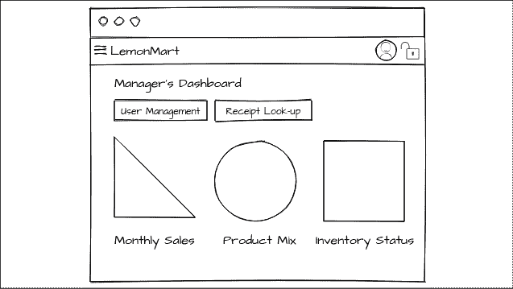

图 7.15：管理员的仪表板

让我们从创建 `ManagerModule` 的主屏幕开始：

1.  创建 `ManagerHome` 组件：

    ```js
    $ npx ng g c manager/managerHome -m manager -s -t 
    ```

    为了在 `manager` 文件夹下创建新的组件，我们必须在组件名称前加上 `manager/` 前缀。此外，我们指定该组件应该用 `ManagerModule` 导入和声明。由于这是一个另一个着陆页，它可能不会复杂到需要单独的 HTML 和 CSS 文件。您可以使用 `--inline-style`（别名 `-s`）和/或 `--inline-template`（别名 `-t`）来避免创建额外的文件。

1.  确认您的文件夹结构如下：

    ```js
    /src
    ├───app
    │ │
    │ ├───manager
    │ │ │ manager-routing.module.ts
    │ │ │ manager.module.ts
    │ │ │
    │ │ └───manager-home
    │ │ │ │ manager-home.component.spec.ts
    │ │ │ │ manager-home.component.ts 
    ```

1.  使用 `manager-routing.module` 配置 `ManagerHome` 组件的路由，类似于我们如何使用 `app-route.module` 配置 `Home` 组件：

    ```js
    **src/app/manager/manager-routing.module.ts**
    import { 
      ManagerHomeComponent 
    } from './manager-home/manager-home.component' 
    const routes: Routes = [ 
      { path: '', redirectTo: '/manager/home', pathMatch: 'full' }, 
      { path: 'home', component: ManagerHomeComponent }, 
    ] 
    ```

注意，`http://localhost:5000/manager` 实际上还没有解析到组件，因为我们的 Angular 应用不知道 `ManagerModule` 的存在。让我们首先尝试强制、急切加载的方法来导入 `ManagerModule` 并将管理路由注册到我们的应用中。

## 急切加载

让我们先急切加载 `ManagerModule`，这样我们可以看到在根模块中导入和注册路由并不会导致可扩展的解决方案：

1.  在 `app.module.ts` 中导入 `ManagerModule`：

    ```js
    **src/app/app.module.ts**
    import { ManagerModule } from './manager/manager.module' 
    ...
    @NgModule({ 
      imports: [..., ManagerModule],
      ...
    }) 
    ```

    你会注意到 `http://localhost:5000/manager` 仍然没有渲染其 `home` 组件。

1.  使用 **Augury** 调试路由状态，如图所示：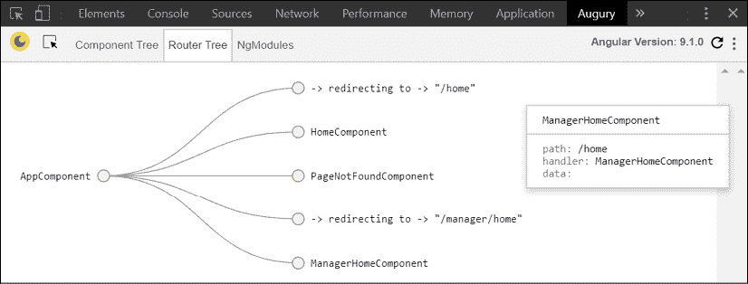

    图 7.16：急切加载的路由树

    注意，在发布时，Augury 对 Ivy 渲染引擎的支持并不好。为了可靠地查看 **路由树** 选项卡，你需要禁用 Ivy。你可以在项目的 `tsconfig.app.json` 文件中添加以下设置：

    ```js
     "angularCompilerOptions": {
        "enableIvy": false
      } 
    ```

    你需要重新启动你的 Angular 应用并重新加载 Augury 以使更改生效。然而，得到一个漂亮的图表并不值得意外地将你的应用与 Ivy 禁用一起发布。请小心处理这个问题！

1.  看起来 `/manager` 路径已正确注册并指向正确的组件，`ManagerHomeComponent`。这里的问题是，在 `app-routing.module` 中配置的 `rootRouter` 并不知道 `/manager` 路径，所以 `**` 路径优先级更高，导致渲染了 `PageNotFoundComponent`。

1.  在 `app-routing.module.ts` 中实现 `'manager'` 路径，并将其分配给 `ManagerHomeComponent`，这样我们就可以看到会发生什么：

    ```js
    **src/app/app-routing.module.ts**
    **import {** 
     **ManagerHomeComponent** 
    **} from './manager/manager-home/ manager-home.component'** 
    ...
    const routes: Routes = [
      ...
      **{ path: 'manager', component: ManagerHomeComponent },**
      { path: '**', component: PageNotFoundComponent },
    ] 
    ```

    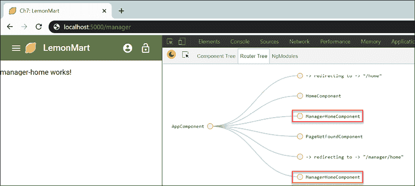

    图 7.17：重复路径注册导致的 Manager 主页渲染

    如上图所示，`http://localhost:5000/manager` 正确渲染，显示 manager-home 正常工作！然而，当你通过 Augury 调试路由状态时，请注意 `ManagerHomeComponent` 被注册了两次。这是因为 `rootRouter` 和 `childRouter` 的注册都被选中了。为了避免这个问题，我们不得不在 `rootRouter` 中集中创建所有路径，并且不使用子路由。

    将所有路径集中到 `rootRouter` 中并不具有良好的可扩展性，因为它强迫所有开发者维护一个单独的主文件来导入和配置每个模块。这很容易导致合并冲突和团队成员之间的挫败感。随着文件变大，引入错误的可能性会呈指数级增加，同一个路由可能会无意中注册多次。

    可以设计一个解决方案，将模块分割成多个文件。你可以在 `ManagerModule` 中实现一个新的路由数组，并将其导入到 `rootRouter` 中。让我们修复重复注册的问题。

1.  在 `manager.module.ts` 中，从导入数组中移除 `ManagerRoutingModule`。

1.  在 `manager.module.ts` 中实现一个 `Routes` 数组，并为组件 `ManagerHomeComponent` 设置一个空路径，如下所示：

    ```js
    **src/app/manager/manager.module.ts**
    import { Routes } from '@angular/router'
    export const managerModuleRoutes: Routes = [
      { path: '', component: ManagerHomeComponent }
    ] 
    ```

1.  在 `app-routing.module.ts` 中，导入你刚刚创建的数组，并将其分配给 `'manager'` 路径的 `children` 属性：

    ```js
    **src/app/app-routing.module.ts**
    import { **managerModuleRoutes** } from './manager/manager.module'
    ...
    { path: 'manager', children: **managerModuleRoutes** }, 
    ```

    不要忘记移除 `component` 属性和 `ManagerHomeModule` 的导入。

让我们在 Augury 再次检查 **Router 树**，看看是否解决了重复注册的问题：

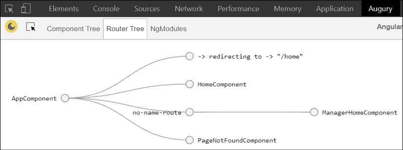

图 7.18：带有子路由的 Router 树

提供的解决方案是有效的。因为没有重复注册，因为我们停止在 `manager-routing.module.ts` 中使用 `childRouters`。此外，我们通过不在 `ManagerModule` 之外导入 `ManagerHomeComponent` 来保持关注点的分离，从而得到一个更可扩展的解决方案。然而，随着应用的成长，我们仍然必须使用 `app.module.ts` 注册所有模块。因此，功能模块仍然以可能不可预测的方式紧密耦合到根模块。此外，这段代码不能被分割，因为功能模块直接在 `app.module.ts` 中导入，所以 TypeScript 编译器将其视为一个必需的依赖项。

接下来，让我们将我们的配置转换成懒加载配置。

## 懒加载

现在你已经了解了模块的急切加载是如何工作的，你将能够更好地理解我们即将编写的代码，否则它可能看起来像是黑魔法，而魔法（也称为误解）代码总是导致意大利面式架构。

我们现在将把急切加载的解决方案演变成懒加载。为了从不同的模块加载路由，我们知道我们不能简单地导入它们，否则它们将被急切加载。答案在于使用 `loadChildren` 属性配置一个路由，并使用内联导入语句通知路由器如何在 `app-routing.module.ts` 中加载功能模块：

1.  确保你打算懒加载的任何模块都没有在 `app.module.ts` 中导入，因此从 `imports` 中移除 `ManagerModule`。

1.  从 `ManagerModule` 中移除添加的 `Routes` 数组。

1.  将 `ManagerRoutingModule` 添加回 `ManagerModule` 中的 `imports`。

1.  在 `app-routing.module.ts` 中，实现或更新 `'manager'` 路径的 `loadChildren` 属性：

    ```js
    **src/app/app-routing.module.ts**
    import { NgModule } from '@angular/core'
    import { RouterModule, Routes } from '@angular/router'
    import { HomeComponent } from './home/home.component'
    import { PageNotFoundComponent } from './page-not-found/page-not-found.component'
    ... 
      const routes: Routes = [ 
        ..., 
        { 
          path: 'manager', 
          loadChildren: 
            () => import('./manager/manager.module')
              . then(m=> m.ManagerModule), 
        }, 
        { path: '**', component: PageNotFoundComponent }, 
      ] 
    ... 
    ```

    通过一个巧妙的技巧实现了懒加载，避免了在文件级别使用导入语句。将一个函数委托设置到 `loadChildren` 属性，该属性包含一个内联导入语句，定义了功能模块文件的路径，例如 `./manager/manager.module`，这样我们就可以以类型安全的方式引用 `ManagerModule`，而无需实际完全加载它。内联导入语句可以在构建过程中被解释，以创建一个单独的 JavaScript 块，只有在需要时才下载。`ManagerModule` 因此表现得像它自己的 Angular 应用，并管理所有子依赖项和路由。

1.  更新`manager-routing.module`路由，考虑到`manager`现在是它们的根路由：

    ```js
    **src/app/manager/manager-routing.module.ts**
    const routes: Routes = [
      { path: '', redirectTo: '/manager/home', pathMatch: 'full' },
      { path: 'home', component: ManagerHomeComponent },
    ] 
    ```

    我们现在可以更新`ManagerHomeComponent`的路由到一个更有意义的`'home'`路径。这个路径不会与`app-routing.module`中找到的路径冲突，因为在这个上下文中，`'home'`解析为`'manager/home'`，同样地，当`path`为空时，URL 将看起来像`http://localhost:5000/manager`。

1.  重新启动`ng serve`或`npm start`命令，以便 Angular 可以正确地分割应用。

1.  导航到`http://localhost:5000/manager`。

1.  通过查看 Augury 来确认懒加载是否正常工作，如下所示：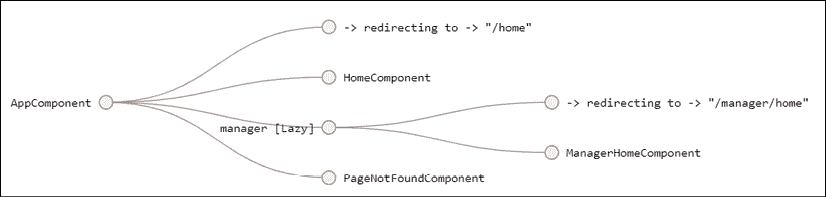

    图 7.19：具有懒加载的路由树

`ManagerHomeComponent`的根节点现在命名为**manager [Lazy]**。

我们已经成功设置了一个具有懒加载的功能模块。接下来，让我们为 LemonMart 实现行走骨架。

# 完成行走骨架

使用我们在本章早期为 LemonMart 创建的网站图，我们需要完成应用的行走骨架导航体验。为了创建这种体验，我们需要创建一些按钮来链接所有模块和组件。我们将按模块逐一进行。

在我们开始之前，更新`HomeComponent`上的登录按钮，使用`routerLink`属性将其导航到`'manager'`路径，并重命名按钮：

```js
**src/app/home/home.component.ts**
  ...
  <button mat-raised-button color="primary" **routerLink="/manager"**>
    **Login as Manager**
  </button>
  ... 
```

现在，我们可以通过点击**登录**按钮来导航到`ManagerHome`组件。

## 管理器模块

由于我们已经在`ManagerModule`中启用了懒加载，让我们继续完成其余的导航元素。

在当前设置中，`ManagerHomeComponent`在`AppComponent`的模板中定义的`<router-outlet>`中渲染，所以当用户从`HomeComponent`导航到`ManagerHomeComponent`时，`AppComponent`中实现的工具栏仍然在位。参见以下**管理器仪表板**的模拟图：

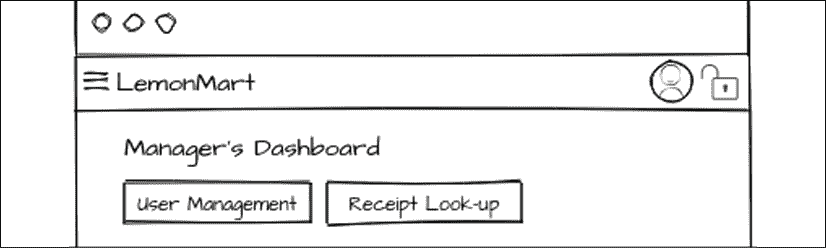

图 7.20：全局和功能模块工具栏

无论我们导航到哪里，全局工具栏都保持不变。你可以想象我们可以为功能模块实现一个类似的工具栏，它在`ManagerModule`中持续存在。因此，导航按钮**用户管理**和**收据查找**将始终可见。这允许我们在模块之间导航子页面时创建一致的 UX。

为了实现一个次要的工具栏，我们需要复制`AppComponent`和`HomeComponent`之间的父子关系，其中父组件实现工具栏和一个`<router-outlet>`，以便子元素可以在这里渲染：

1.  首先创建基本的`manager`组件：

    ```js
    $ npx ng g c manager/manager -m manager --flat -s -t 
    ```

    使用`--flat`选项将跳过目录创建，并将组件直接放置在`manager`文件夹下，就像`app.component`直接位于`app`文件夹下一样。

1.  在`ManagerComponent`中，实现一个带有`activeLink`跟踪的导航工具栏：

    ```js
    **src/app/manager/manager.component.ts**
    styles: [
      `
        div[fxLayout] {
          margin-top: 32px;
        }
      `, 
      `
        .active-link {
          font-weight: bold;
          border-bottom: 2px solid #005005;
        }
      `,
    ],
    template: `
    <mat-toolbar color="accent"> 
      <a mat-button 
        routerLink="/manager/home" 
        routerLinkActive="active-link"
       >
          Manager's Dashboard
      </a> 
      <a mat-button 
        routerLink="/manager/users" 
        routerLinkActive="active-link"
      >
        User Management
      </a> 
      <a mat-button 
         routerLink="/manager/receipts" 
         routerLinkActive="active-link"
       >
         Receipt Lookup
       </a> 
    </mat-toolbar> 
    <router-outlet></router-outlet>
    ` 
    ```

    必须注意，功能模块不会自动访问在父模块中创建的服务或组件。这是一个重要的默认行为，以保持解耦架构。然而，在某些情况下，共享一定量的代码是有益的。在这种情况下，需要重新导入`mat-toolbar`。由于`MatToolbarModule`已经在`src/app/material.module.ts`中加载，我们只需将此模块导入到`manager.module.ts`中，这样就不会有性能或内存的惩罚。

1.  确保在`ManagerModule`中声明了`ManagerComponent`并导入了`MaterialModule`：

    ```js
    **src/app/manager/manager.module.ts**
    import { MaterialModule } from '../material.module' 
    import { ManagerComponent } from './manager.component'
    ...
    declarations: [..., **ManagerComponent**],
    imports: [..., **MaterialModule**], 
    ```

1.  创建子页面的组件：

    ```js
    $ npx ng g c manager/userManagement -m manager
    $ npx ng g c manager/receiptLookup -m manager 
    ```

1.  创建父子路由。我们知道我们需要以下路由来导航到我们的子页面，如下所示：

    ```js
    **example**
    { path: '', redirectTo: '/manager/home', pathMatch: 'full' },
    { path: 'home', component: ManagerHomeComponent },
    { path: 'users', component: UserManagementComponent },
    { path: 'receipts', component: ReceiptLookupComponent }, 
    ```

为了针对在`ManagerComponent`中定义的`<router-outlet>`，我们需要首先创建一个父路由，然后指定子页面的路由：

```js
**src/app/manager/manager-routing.module.ts**
...
import { NgModule } from '@angular/core'
import { RouterModule, Routes } from '@angular/router'
import { ManagerHomeComponent } from './manager-home/manager-home.component'
import { ManagerComponent } from './manager.component'
import { ReceiptLookupComponent } from './receipt-lookup/receipt-lookup.component'
import { UserManagementComponent } from './user-management/user-management.component' 
const routes: Routes = [
  {
    path: '', 
    component: ManagerComponent, 
    children: [
      { path: '', redirectTo: '/manager/home', pathMatch: 'full' },
      { path: 'home', component: ManagerHomeComponent },
      { path: 'users', component: UserManagementComponent },
      { path: 'receipts', component: ReceiptLookupComponent },
    ],
  },
] 
```

现在，你应该能够导航到应用中。当你点击**登录为经理**按钮时，你将被带到这里显示的页面。可点击的目标被突出显示，如下所示：

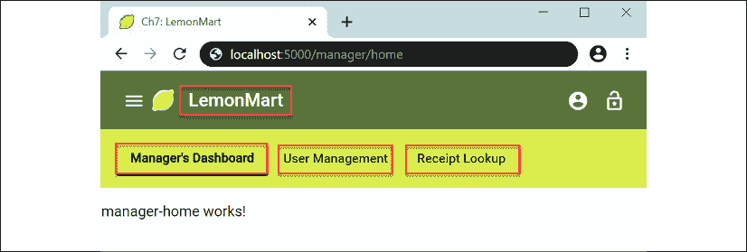

图 7.21：所有路由链接高亮的经理仪表板

如果你点击**LemonMart**，你将被带到主页。如果你点击**经理仪表板**、**用户管理**或**收据查找**，你将被导航到相应的子页面，而活动链接将在工具栏上加粗并下划线。

## 用户模块

登录后，用户将能够访问他们的个人资料，并通过侧边导航菜单查看他们在 LemonMart 应用中可以访问的操作列表。在*第八章*，*设计身份验证和授权*中，当我们实现身份验证和授权时，我们将从服务器接收用户的角色。根据用户的角色，我们将能够自动导航或限制用户可以看到的选项。我们将在这个模块中实现这些组件，以便它们只在用户登录后加载。为了完成行走骨架，我们将忽略与身份验证相关的问题：

1.  创建必要的组件：

    ```js
    $ npx ng g c user/profile -m user
    $ npx ng g c user/logout -m user -t -s
    $ npx ng g c user/navigationMenu -m user -t -s 
    ```

1.  实现路由。

    从在`app-routing.module.ts`中实现懒加载开始：

    ```js
    **src/app/app-routing.module.ts**
    ... 
    { 
      path: 'user', 
      loadChildren: 
        () => import('./user/user.module')
          .then(m => m.UserModule), 
    }, 
    ```

    确保在`app-routing.module`中，`PageNotFoundComponent`路由总是最后一个路由。

    现在在`user-routing.module.ts`中实现子路由：

    ```js
    **src/app/user/user-routing.module.ts**
    ...
    const routes: Routes = [
      { path: 'profile', component: ProfileComponent },
      { path: 'logout', component: LogoutComponent },
    ] 
    ```

    我们正在为`NavigationMenuComponent`实现路由，因为它将被直接用作 HTML 元素。此外，由于`UserModule`没有登录页面，因此没有定义默认路径。

1.  在`AppComponent`中，连接用户和注销图标：

    ```js
    **src/app/app.component.ts**
    ... 
    <mat-toolbar> 
      ... 
      <button 
     **mat-mini-fab routerLink="/user/profile"** 
     **matTooltip="Profile" aria-label="User Profile"**
      > 
        <mat-icon>account_circle</mat-icon> 
      </button> 
      <button 
     **mat-mini-fab routerLink="/user/logout"** 
     **matTooltip="Logout" aria-label="Logout"**
      > 
        <mat-icon>lock_open</mat-icon> 
      </button> 
    </mat-toolbar> 
    ```

    图标按钮可能难以理解，因此为它们添加工具提示是个好主意。为了使工具提示正常工作，从`mat-icon-button`指令切换到`mat-mini-fab`指令，并确保在`material.module.ts`中导入`MatTooltipModule`。此外，确保为仅图标按钮添加`aria-label`，以便依赖屏幕阅读器的残疾用户仍然可以导航你的 Web 应用。

1.  确保应用正常运行。

    你会注意到两个按钮距离太近，如下所示：

    

    图 7.22：带有图标的工具栏

1.  你可以通过向`<mat-toolbar>`添加`fxLayoutGap="8px"`来解决图标布局问题；然而，现在柠檬标志与应用名称的距离太远，如下所示：


图 7.23：带有填充图标的工具栏

1.  通过合并图标和按钮可以解决标志布局问题：

    ```js
    **src/app/app.component.ts**
    ...
    <mat-toolbar>
      ...
      <a mat-icon-button routerLink="/home">
        <mat-icon svgIcon="lemon"></mat-icon>
        <span class="mat-h2">LemonMart</span>
      </a>
      ...
    </mat-toolbar> 
    ```

如以下截图所示，分组解决了布局问题：


图 7.24：带有分组和填充元素的工具栏

从用户体验角度来看，这也是更受欢迎的；现在用户可以通过点击柠檬回到主页。

## POS 和库存模块

我们的行走骨架扮演着管理者的角色。为了能够访问我们即将创建的所有组件，我们需要使管理者能够访问 POS 和库存模块。

在`ManagerComponent`中添加两个新按钮：

```js
**src/app/manager/manager.component.ts**
<mat-toolbar color="accent" **fxLayoutGap="8px"**> 
 **...** 
 **<span class="flex-spacer"></span>** 
 **<button** 
 **mat-mini-fab routerLink="/inventory"** 
 **matTooltip="Inventory" aria-label="Inventory"**
 **>** 
 **<mat-icon>list</mat-icon>** 
 **</button>** 
 **<button** 
 **mat-mini-fab routerLink="/pos"** 
 **matTooltip="POS" aria-label="POS"**
 **>** 
 **<mat-icon>shopping_cart</mat-icon>** 
 **</button>** 
</mat-toolbar> 
```

注意，这些路由链接将带我们离开`ManagerModule`的领域，因此管理者特定的辅助工具栏消失是正常的。

现在，剩下的最后两个模块将由你来实现。对于这两个新模块，我提供了高级步骤，并建议你参考之前的模块来构建新的模块。如果你遇到困难，请参考 GitHub 项目[`github.com/duluca/lemon-mart`](https://github.com/duluca/lemon-mart)中的`projects/ch7`文件夹。

### POS 模块

`PosModule`与`UserModule`非常相似，除了`PosModule`是一个默认路径。`PosComponent`将是默认组件。这可能会是一个复杂的组件，包含一些子组件，因此不要使用内联模板或样式：

1.  创建`PosComponent`

1.  将`PosComponent`注册为默认路径

1.  为`PosModule`配置懒加载

1.  确保应用正常运行

现在我们来实现库存模块。

### 库存模块

`InventoryModule`与`ManagerModule`非常相似，如下所示：

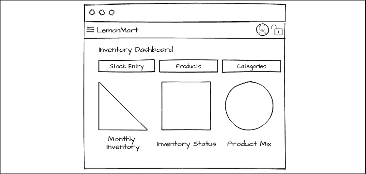

图 7.25：库存仪表板原型

1.  创建一个基本的`Inventory`组件

1.  注册`MaterialModule`

1.  创建**库存主页**、**库存录入**、**产品**和**分类**组件

1.  在`inventory-routing.module.ts`中配置父子路由

1.  为`InventoryModule`配置懒加载

1.  在`InventoryComponent`中实现内部`InventoryModule`导航的辅助工具栏

1.  确保应用如所示正常运行：

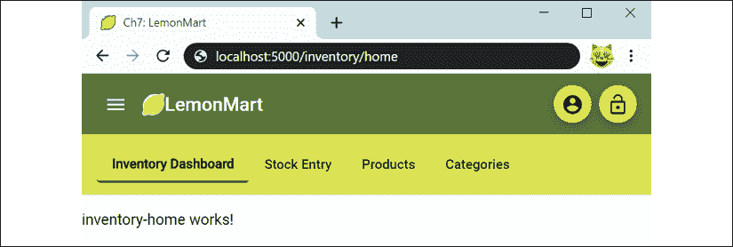

图 7.26：LemonMart 库存仪表板

现在应用的行走骨架已经完成，检查路由树以确保正确配置了懒加载并且模块没有意外地被急切加载是很重要的。

## 检查路由树

导航到应用的基路由，并使用 Augury 检查路由树，如图所示：

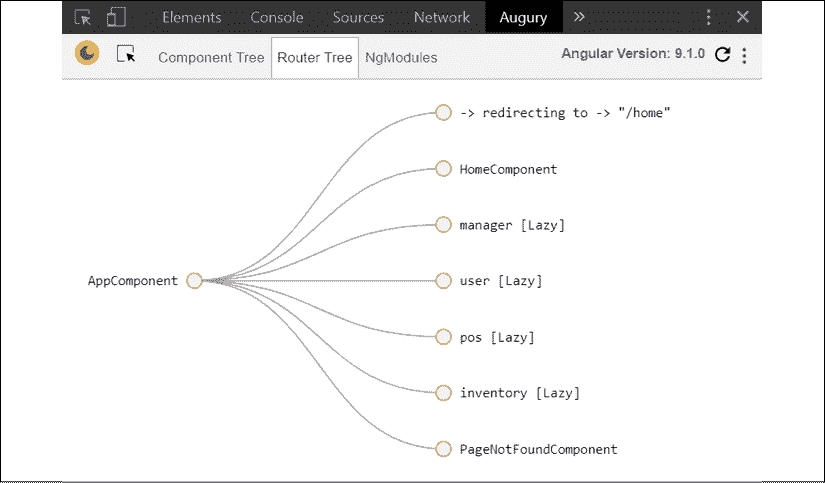

图 7.27：具有懒加载的路由树

除了最初所需的组件之外，所有其他组件都应该用**[Lazy]**属性标记。如果出于某种原因，路由没有用**[Lazy]**标记，那么它们很可能是错误地被导入到`app.module.ts`或其他组件中。

在你的路由树中，你可能注意到`ProfileComponent`和`LogoutComponent`是急切加载的，而`UserModule`被正确标记为**[Lazy]**。即使通过工具和代码库进行多次视觉检查，也可能让你寻找罪魁祸首。然而，如果你全局搜索`UserModule`，你会很快发现它被导入到`app.module.ts`中。在运行 CLI 命令时，你的模块可能会意外地重新导入到`app.module.ts`中，所以请注意这一点！

为了安全起见，检查你的`app.module.ts`文件，并确保删除任何非根级别的模块或组件的导入语句。你的文件应该看起来像以下这样：

```js
**src/app/app.module.ts**
import { HttpClientModule } from '@angular/common/http'
import { NgModule } from '@angular/core'
import { FlexLayoutModule } from '@angular/flex-layout'
import { BrowserModule } from '@angular/platform-browser'
import { 
  BrowserAnimationsModule 
} from '@angular/platform-browser/ animations'
import { AppRoutingModule } from './app-routing.module'
import { AppComponent } from './app.component'
import { HomeComponent } from './home/home.component'
import { MaterialModule } from './material.module'
import { 
  PageNotFoundComponent 
} from './page-not-found/page-not-found.component' 
@NgModule({
  declarations: [AppComponent, HomeComponent, PageNotFoundComponent],
  imports: [
    BrowserModule,
    AppRoutingModule,
    BrowserAnimationsModule,
    MaterialModule,
    HttpClientModule,
    FlexLayoutModule,
  ],
  providers: [],
  bootstrap: [AppComponent],
})
export class AppModule {} 
```

如果你使用 Augury 调试路由时禁用了 Ivy，现在是时候重新启用它了。

预期读者在继续之前解决任何测试错误。确保`npm test`和`npm run e2e`执行时没有错误。

# 公共测试模块

现在我们有很多模块要处理，为每个 spec 文件单独配置导入和提供者变得很繁琐。为此，我建议创建一个公共测试模块来包含通用的配置，你可以在各个地方重用它。

首先创建一个新的`.ts`文件

1.  创建`common/common.testing.ts`。

1.  用常见的测试提供者、模拟和模块填充它。

    我已经提供了`ObservableMedia`、`MatIconRegistry`和`DomSanitizer`的模拟实现，以及`commonTestingProviders`和`commonTestingModules`的数组：

    ```js
    **src/app/common/common.testing.ts**
    import { 
      HttpClientTestingModule 
    } from '@angular/common/http/ testing'
    import { SecurityContext } from '@angular/core'
    import { MediaChange } from '@angular/flex-layout'
    import { ReactiveFormsModule } from '@angular/forms'
    import { 
      SafeResourceUrl, 
      SafeValue 
    } from '@angular/platform-browser' 
    import { 
      NoopAnimationsModule 
    } from '@angular/platform-browser/animations' 
    import { RouterTestingModule } from '@angular/router/testing'
    import { Observable, Subscription, of } from 'rxjs'
    import { MaterialModule } from '../material.module'
    const FAKE_SVGS = {
      lemon: '<svg><path id="lemon" name="lemon"></path></svg>',
    }
    export class MediaObserverFake {
      isActive(query: string): boolean {
        return false
      }
      asObservable(): Observable<MediaChange> {
        return of({} as MediaChange)
      }
      subscribe(
        next?: (value: MediaChange) => void,
        error?: (error: any) => void,
        complete?: () => void
      ): Subscription {
        return new Subscription()
      }
    }
    export class MatIconRegistryFake {
      // tslint:disable-next-line: variable-name
      _document = document
      addSvgIcon(iconName: string, url: SafeResourceUrl): this {
        // this.addSvgIcon('lemon', 'lemon.svg')
        return this
      }
      getNamedSvgIcon(name: string, namespace: string = ''): Observable<SVGElement> {
        return of(this._svgElementFromString(FAKE_SVGS.lemon))
      }
      private _svgElementFromString(str: string): SVGElement {
        const div = (this._document || document)
          . createElement('DIV') 
        div.innerHTML = str
        const svg = div.querySelector('svg') as SVGElement
        if (!svg) {
          throw Error('<svg> tag not found')
        }
        return svg
      }
    }
    export class DomSanitizerFake {
      bypassSecurityTrustResourceUrl(url: string): SafeResourceUrl {
        return {} as SafeResourceUrl
      }
      sanitize(
        context: SecurityContext, 
        value: SafeValue | string | null): 
          string | null 
      { 
        return value?.toString() || null
      }
    }
    export const commonTestingProviders: any[] = [
      // Intentionally Left Blank!!!
    ]
    export const commonTestingModules: any[] = [
      ReactiveFormsModule,
      MaterialModule,
      NoopAnimationsModule,
      HttpClientTestingModule,
      RouterTestingModule,
    ] 
    ```

现在让我们看看这个共享配置文件的一个示例用法：

```js
**src/app/app.component.spec.ts**
import { MediaObserver } from '@angular/flex-layout'
import { MatIconRegistry } from '@angular/material/icon'
import { DomSanitizer } from '@angular/platform-browser'
...
import {
  DomSanitizerFake,
  MatIconRegistryFake,
  MediaObserverFake,
  commonTestingModules,
} from './common/common.testing'
...
  TestBed.configureTestingModule({
    imports: commonTestingModules,
    providers: commonTestingProviders.concat([
      { provide: MediaObserver, useClass: MediaObserverFake },
      { provide: MatIconRegistry, useClass: MatIconRegistryFake },
      { provide: DomSanitizer, useClass: DomSanitizerFake },
    ]),
    declarations: [AppComponent],
... 
```

大多数其他模块只需要导入`commonTestingModules`。

停！你确保了所有单元测试都通过了吗？为了确保你的测试始终通过，在 CircleCI 中实现一个 CI 管道，如*第四章*中所示，*自动化测试、CI 和发布到生产*。

当你的测试运行起来后，LemonMart 的行走骨架就完成了。现在，让我们展望未来，开始思考我们可能会处理哪些数据实体。

# 围绕主要数据实体进行设计

路由优先架构的第四步是实现无状态、数据驱动的设计。为了实现这一点，围绕主要数据组件组织你的 API 非常有帮助。这大致符合你在 Angular 应用程序的各种组件中消耗数据的方式。我们将从定义我们的主要数据组件开始，创建一个粗略的数据**实体关系图**（**ERD**）。在*第十章*，*RESTful API 和全栈实现*中，我们将使用 Swagger.io 和 Express.js 设计和实现用户数据实体的 API。

## 定义实体

让我们先尝试确定你希望存储哪些类型的实体以及这些实体之间可能如何相互关联。

这里是 LemonMart 的一个示例设计，使用[draw.io](http://draw.io)创建的：

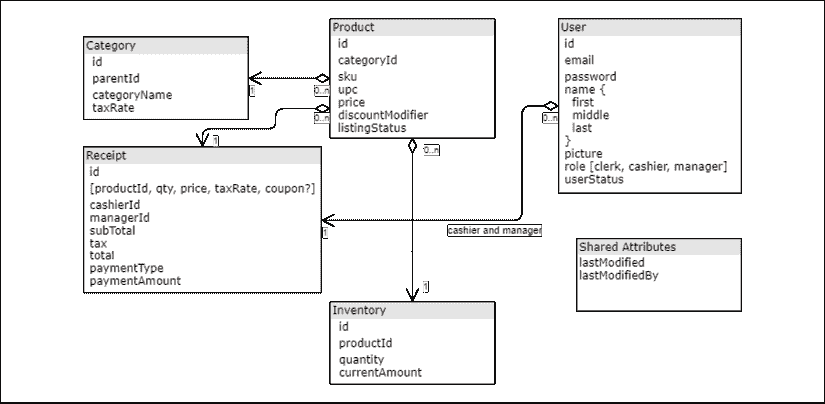

图 7.28：LemonMart 的 ERD

在这个时刻，无论你的实体存储在 SQL 还是 NoSQL 数据库中，这并不重要。我的建议是坚持你所知道的，但如果你是从头开始的，那么像 MongoDB 这样的 NoSQL 数据库将提供最大的灵活性，因为你的实现和需求会不断演变。

一般而言，你将为每个实体需要 CRUD API。考虑到这些数据元素，我们也可以想象围绕这些 CRUD API 的一些用户界面。让我们接下来做这件事。

# 高级用户体验设计

原型对于确定整个应用程序中需要哪些组件和用户控件非常重要。任何将在组件间使用的用户控件或组件都需要在根级别定义，其他则在其自己的模块中定义。

在本章前面，我们确定了子模块并为他们设计了着陆页以完成行走骨架。现在我们已经定义了主要数据组件，我们可以为应用程序的其余部分完成原型设计。在设计高级屏幕时，请记住以下几点：

+   用户能否以尽可能少的导航完成他们角色所需的基本任务？

+   用户能否通过屏幕上的可见元素轻松访问应用程序的所有信息和功能？

+   用户能否轻松搜索他们所需的数据？

+   一旦用户找到了感兴趣的记录，他们能否轻松地深入到详细记录或查看相关记录？

+   那个弹出警告真的有必要吗？你知道用户不会阅读它，对吧？

请记住，没有一种设计用户体验的正确方法，这就是为什么在设计屏幕时，你应该始终考虑模块化和可重用性。

## 创建工件维基

如本章前面所述，记录你创建的每个工件是很重要的。维基提供了一个创建可协作更新或编辑的活文档的方法。虽然 Slack、Teams、电子邮件和白板提供了良好的协作机会，但它们的短暂性质还有很多需要改进的地方。

因此，当你生成各种设计工件，如原型或设计决策时，请确保将它们发布在所有团队成员都能访问的维基上：

1.  在 GitHub 上，切换到**Wiki**标签页

1.  你可以查看我的示例 Wiki，[`github.com/duluca/lemon-mart/wiki`](https://github.com/duluca/lemon-mart/wiki)，如图所示：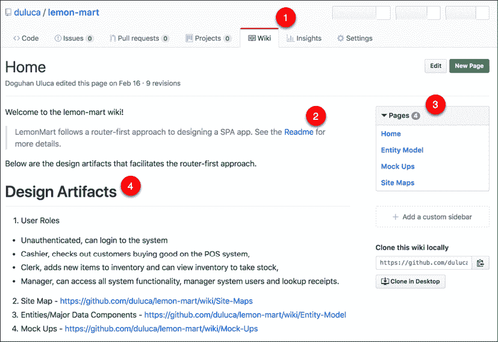

    图 7.29：GitHub.com LemonMart wiki

1.  在创建 Wiki 页面时，确保你在任何其他可用的文档之间进行交叉链接，例如**Readme**

1.  注意，GitHub 在**Pages**下显示 Wiki 的子页面

1.  然而，一个额外的概览也很有帮助，例如**设计工件**部分，因为有些人可能会错过右侧的导航元素

1.  随着你完成原型，将它们发布在 Wiki 上

你可以在这里看到 Wiki 的概览视图：

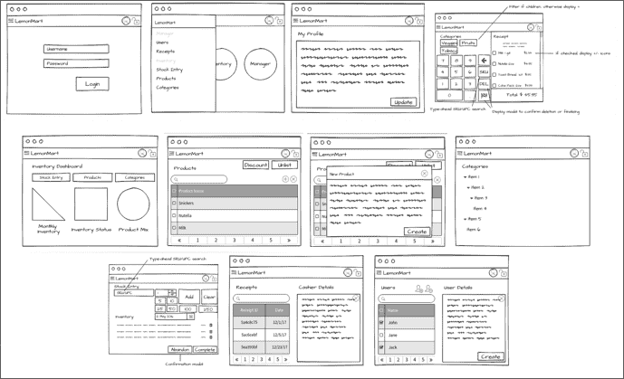

图 7.30：LemonMart 原型的概览视图

现在你的工件集中在一个地方，所有团队成员都可以访问。他们可以添加、编辑、更新或整理内容。这样，你的 Wiki 就变成了团队所需信息的有用、活生生的文档，而不是你感觉被迫创建的文档。如果你曾经发现自己处于那种情况，请举手！


接下来，将你的原型整合到你的应用中，这样你可以收集利益相关者的早期反馈并测试你应用流程。

## 在你的应用中利用原型

将原型放在可步行骨架应用中，以便测试人员可以更好地设想尚未开发的功能。在这里可以看到这个想法的一个示例：

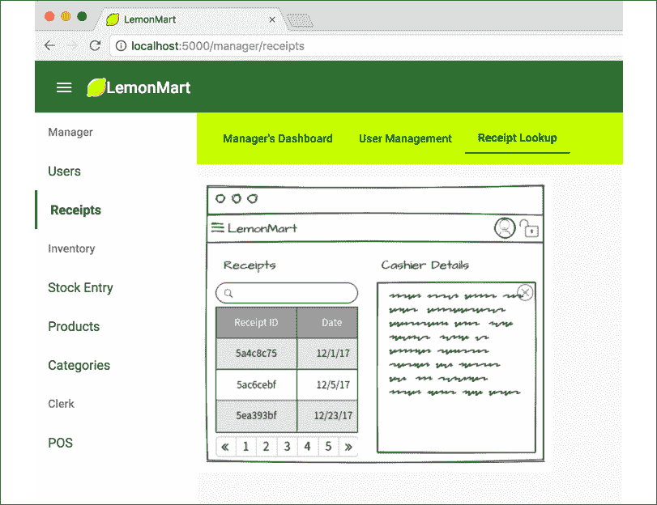

图 7.31：在 UI 中使用原型验证应用流程

这在设计和实施你的身份验证和授权流程时也会很有帮助。原型完成之后，我们现在可以继续在*第八章*，*设计身份验证和授权*中实施 LemonMart 的身份验证和授权流程。

# 摘要

在本章中，你掌握了如何有效地使用 Angular CLI 创建主要的 Angular 组件和脚手架。你熟悉了 80-20 规则。你创建了你的应用品牌，利用自定义和内置的 Material 图标。你学习了如何使用 Augury 调试复杂的路由配置。最后，你开始构建以路由为首要考虑的应用，早期定义用户角色，考虑到懒加载进行设计，并在早期确定一个可步行骨架的导航体验。我们讨论了围绕主要数据实体进行设计。我们还涵盖了完成并记录我们整个应用的高级 UX 设计的重要性，这样我们就可以正确地设计一个出色的条件导航体验。

回顾一下，为了实现以路由为首要考虑的实施，你需要做以下这些：

1.  制定路线图和范围

1.  考虑到懒加载进行设计

1.  实现一个可步行骨架的导航体验

1.  实现无状态、数据驱动的设计

1.  强制实现解耦的组件架构

1.  区分用户控件和组件

1.  使用 TypeScript 和 ES6 最大化代码重用

在本章中，你执行了步骤 1-3；在接下来的四个章节中，你将执行步骤 4-7。在*第八章*，*设计身份验证和授权*中，我们将深入探讨面向对象设计、继承和抽象，以及深入考虑安全性和设计条件导航体验。在*第十章*，*RESTful API 和全栈实现*中，你将看到使用最小 MEAN 栈的具体全栈实现。*第十一章*，*食谱 – 可重用性、路由和缓存*，以及*第十二章*，*食谱 – 主/详细信息、数据表和 NgRx*，我们将通过坚持解耦组件架构、明智地选择创建用户控件和组件，以及使用各种 TypeScript、RxJS 和 Angular 编码技术最大化代码重用来整合一切。

# 进一步阅读

+   *Ha, Not Ready to Ri: The Shu Ha Ri Approach to Agile Development*，Brian Sjoberg，Ken Furlong，2015 年 7 月 29 日，[`www.excella.com/insights/ha-not-ready-to-ri-the-shu-ha-ri-approach-to-agile-development`](https://www.excella.com/insights/ha-not-ready-to-ri-the-shu-ha-ri-approach-to-agile-development).

+   *Angular 9: Lazy Loading Components*，John Papa，2020 年 2 月 16 日，[`johnpapa.net/angular-9-lazy-loading-components/`](https://johnpapa.net/angular-9-lazy-loading-components/).

+   Webpack 模块打包器，[`webpack.js.org/`](https://webpack.js.org/).

# 问题

尽可能好地回答以下问题，以确保你已理解本章的关键概念，而无需使用 Google。你需要帮助回答这些问题吗？请参阅*附录 D*，*自我评估答案*，在线位于[`static.packt-cdn.com/downloads/9781838648800_Appendix_D_Self-Assessment_Answers.pdf`](https://static.packt-cdn.com/downloads/9781838648800_Appendix_D_Self-Assessment_Answers.pdf)或访问[`expertlysimple.io/angular-self-assessment`](https://expertlysimple.io/angular-self-assessment).

1.  什么是帕累托原则？

1.  路由优先架构的主要目标是什么？

1.  根模块和功能模块之间有什么区别？

1.  懒加载有哪些好处？

1.  为什么需要创建应用程序的行走骨架？
