# 第八章：设计身份验证和授权

设计一个高质量的身份验证和授权系统，同时不令最终用户感到沮丧是一个难以解决的问题。身份验证是验证用户身份的行为，授权指定用户必须拥有的权限才能访问资源。这两个过程，简称 auth，必须无缝协同工作，以满足具有不同角色、需求和职能的用户的需求。

在今天的网络中，用户对通过浏览器遇到的任何身份验证系统都有很高的基本期望水平，因此这是你应用中一个非常重要的部分，必须第一次就绝对正确。用户应该始终了解他们在你的应用中可以做什么和不能做什么。如果有错误、失败或错误，用户应该清楚地了解它们发生的原因。随着你的应用增长，很容易错过所有可能触发错误条件的方式。你的实现应该易于扩展或维护，否则你应用的基本骨架将需要大量的维护。在本章中，我们将探讨创建出色的身份验证用户体验的各种挑战，并实现一个坚实的基础体验。

我们将继续采用路由优先的方法来设计单页应用（SPA），通过实现 LemonMart 的身份验证体验。在第七章*创建路由优先的业务应用*中，我们定义了用户角色，完成了所有主要路由的构建，并完成了 LemonMart 的初步导航体验。这意味着我们已经为实施基于角色的条件导航体验做好了充分准备，这种体验能够捕捉无缝身份验证体验的细微差别。

在本章中，我们将围绕我们在上一章中定义的用户实体实现一个基于令牌的身份验证方案。为了实现一个健壮且易于维护的实现，我们将深入探讨面向对象编程（**OOP**），包括抽象、继承和工厂，同时实现缓存服务、UI 服务以及两种不同的身份验证方案：用于教育目的的内存中模拟身份验证服务和可用于实际应用的 Google Firebase 身份验证服务。

在本章中，你将学习以下主题：

+   设计身份验证工作流程

+   TypeScript 操作符用于安全数据处理

+   利用面向对象编程（OOP）概念的可重用服务

+   动态 UI 组件和导航

+   使用守卫进行基于角色的路由

+   Firebase 身份验证配方

+   使用工厂提供服务

书籍的示例代码的最新版本可以在 GitHub 上找到，链接的仓库包含代码的最终和完成状态。你可以在本章末尾通过查找`projects`文件夹下的代码章节快照来验证你的进度。

对于*第八章*：

1.  克隆仓库 [`github.com/duluca/lemon-mart`](https://github.com/duluca/lemon-mart)

1.  在根文件夹上执行`npm install`以安装依赖项

1.  本章的代码示例位于子文件夹

    ```js
    projects/ch8 
    ```

1.  要运行本章的 Angular 应用程序，请执行

    ```js
    npx ng serve ch8 
    ```

1.  要运行本章的 Angular 单元测试，请执行

    ```js
    npx ng test ch8 --watch=false 
    ```

1.  要运行本章的 Angular 端到端测试，请执行

    ```js
    npx ng e2e ch8 
    ```

1.  要构建本章的生产就绪 Angular 应用程序，请执行

    ```js
    npx ng build ch8 --prod 
    ```

注意，存储库根目录下的`dist/ch8`文件夹将包含编译结果。

请注意，书中或 GitHub 上的源代码可能并不总是与 Angular CLI 生成的代码匹配。由于生态系统不断演变，书中代码与 GitHub 上代码之间的实现也可能存在细微差异。随着时间的推移，示例代码发生变化是自然的。此外，在 GitHub 上，您可能会找到更正、支持库新版本的修复或多种技术的并排实现，供您观察。您只需实现书中推荐的理想解决方案即可。如果您发现错误或有问题，请创建一个 issue 或提交一个 pull request 到 GitHub，以供所有读者受益。

让我们从了解基于令牌的认证工作流程如何运作开始。

# 设计认证工作流程

一个设计良好的认证工作流程是无状态的，因此没有会话过期的概念。用户可以自由地从他们想要的任何设备和标签页与您的无状态 REST API 交互，同时或随着时间的推移。**JSON Web Token**（**JWT**）实现了基于声明的分布式认证，可以数字签名或使用**消息认证码**（**MAC**）进行保护/加密。这意味着一旦用户的身份得到认证（即在登录表单上的密码挑战），他们就会收到一个编码的声明票据或令牌，然后可以使用它来向系统发出未来的请求，而无需重新认证用户身份。

服务器可以独立验证此声明的有效性并处理请求，而无需了解之前是否与该用户交互的任何先验知识。因此，我们不需要存储关于用户的会话信息，这使得我们的解决方案无状态且易于扩展。每个令牌在预定义的期限后都会过期，由于它们的分布式特性，它们不能远程或单独撤销；然而，我们可以通过插入自定义账户和用户角色状态检查来增强实时安全性，以确保认证用户有权访问服务器端资源。

JWT 实现了**互联网工程任务组**（**IETF**）行业标准 RFC 7519，可在[`tools.ietf.org/html/rfc7519`](https://tools.ietf.org/html/rfc7519)找到。

一个好的授权工作流程可以根据用户的角色进行条件导航，这样用户就可以自动被带到最优的着陆页面；不会显示不适合他们角色的路径或元素，如果他们不小心尝试访问受限路径，将阻止他们这样做。你必须记住，任何客户端基于角色的导航仅仅是一种便利，并不用于安全。这意味着对服务器的每个调用都应该包含必要的头信息，包括安全令牌，以便服务器可以重新验证用户并独立验证其角色。只有这样，他们才能被允许检索受保护的数据。客户端认证不可信，这就是为什么密码重置屏幕必须使用服务器端渲染技术来构建，以便用户和服务器都可以验证预期的用户正在与系统交互。

## JWT 生命周期

JWTs 通过加密令牌机制补充无状态 REST API 架构，允许方便、分布式和高性能地认证和授权客户端发送的请求。基于令牌的认证方案有三个主要组成部分：

+   **客户端**: 捕获登录信息并隐藏不允许的操作以提供良好的用户体验

+   **服务器端**: 验证每个请求都经过身份验证并且具有适当的授权

+   **认证服务**: 生成和验证加密令牌，并独立验证用户请求的认证状态

一个安全的系统假设客户端（应用程序和浏览器）、系统（服务器和服务）和数据库之间发送/接收的数据使用**传输层安全性**（**TLS**）进行加密，这本质上是一个**安全套接字层**（**SSL**）的新版本。这意味着你的 REST API 必须使用正确配置的 SSL 证书托管，通过 HTTPS 提供所有 API 调用，以确保用户凭据在客户端和服务器之间永远不会暴露。同样，任何数据库或第三方服务调用都应该通过 TLS 进行。这确保了传输中数据的安全性。

在静止状态（数据坐在数据库中时），应该使用安全的单向哈希算法和良好的加盐实践来存储密码。

所有的哈希和加盐的讨论让你想起了早餐吗？不幸的是，它们是密码学相关的术语。如果你有兴趣了解更多，请查看这篇文章：[`crackstation.net/hashing-security.htm`](https://crackstation.net/hashing-security.htm)。

对于敏感的用户信息，如**个人身份信息**（**PII**），应使用安全的双向加密算法在静止状态下进行加密，与密码不同。密码是经过散列的，因此我们验证用户提供的密码是否与系统所知的密码相同。对于 PII，我们必须能够解密数据，以便我们可以将其显示给用户。但由于数据在静止状态下加密，如果数据库被破坏，那么被黑客窃取的数据就毫无价值。

采取分层的安全方法至关重要，因为攻击者需要同时破坏你安全系统的所有层，这是一个不太可能完成的任务，以对你的业务造成实质性伤害。

**有趣的事实**：当你听到来自大型公司的重大数据泄露事件时，大多数情况下，根本原因是对传输中或静止状态下的安全措施实施不当。有时这是因为持续加密/解密数据计算成本过高，因此工程师依赖于防火墙的保护。在这种情况下，一旦外围被突破，正如他们所说，狐狸就进入了鸡舍。

考虑以下序列图，它突出了基于 JWT 的认证生命周期：

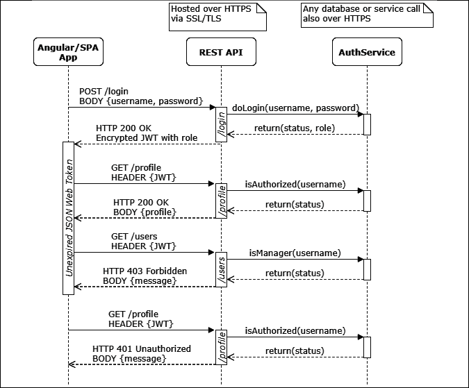

图 8.1：基于 JWT 的认证生命周期

初始时，用户通过提供用户名和密码进行登录。一旦验证通过，用户的认证状态和角色将被加密在一个带有过期日期和时间的 JWT 中，并将其发送回浏览器。

我们的应用程序（Angular 或其他）可以安全地将此令牌缓存到本地或会话存储中，这样用户就不必在每次请求时都强制登录。这样，我们就不会采取像在 cookie 中存储用户凭据这样的不安全做法，以提供良好的用户体验。

当你在本章后面实现自己的认证服务时，你会对 JWT 生命周期有更深入的理解。在接下来的几节中，我们将围绕**用户**数据实体设计一个功能齐全的认证工作流程，如下所示：

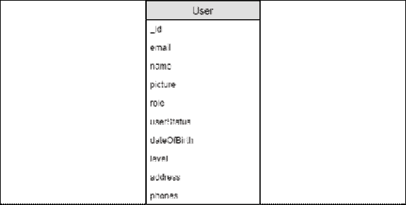

图 8.2：用户实体

描述的用户实体与我们最初的实体模型略有不同。实体模型反映了数据在数据库中的存储方式。实体是用户记录的扁平化（或简化）表示。即使是一个扁平化的实体也有复杂的对象，如**姓名**，它具有首字母、中间名和姓氏等属性。此外，并非所有属性都是必需的。此外，当与认证系统和其他 API 交互时，我们可能会收到不完整、错误或恶意构造的数据，因此我们的代码必须有效地处理`null`和`undefined`变量。

接下来，让我们看看如何利用 TypeScript 运算符有效地处理意外数据。

# TypeScript 的安全数据处理运算符

JavaScript 是一种动态类型语言。在运行时，执行我们代码的 JavaScript 引擎，如 Chrome 的 V8，不知道我们使用的变量的类型。因此，引擎必须推断类型。我们可以有基本类型，如 `boolean`、`number`、`array` 或 `string`，或者我们可以有复杂类型，这本质上是一个 JSON 对象。此外，变量可以是 `null` 或 `undefined`。从广义上讲，`undefined` 表示尚未初始化的东西，而 `null` 表示当前不可用的事物。

在强类型语言中，`undefined` 的概念不存在。基本类型有默认值，例如 `number` 是零或 `string` 是空字符串。然而，复杂类型可以是 `null`。`null` 引用意味着变量已定义，但后面没有值。

`null` 引用的发明者托尼·霍尔（Tony Hoare）称其为他的“十亿美元的错误”。

TypeScript 将强类型语言的概念引入 JavaScript，因此它必须在两个世界之间架起桥梁。因此，TypeScript 定义了 `null`、`undefined`、`any` 和 `never` 等类型，以便理解 JavaScript 的类型语义。我在 *进一步阅读* 部分添加了相关 TypeScript 文档的链接，以便深入了解 TypeScript 类型。

如 TypeScript 文档所述，TypeScript 为了匹配 JavaScript 语义，对 `null` 和 `undefined` 处理不同。例如，联合类型 `string | null` 与 `string | undefined` 和 `string | undefined | null` 是不同的类型。

另一个细微差别是：使用 `==` 和 `===` 来检查一个值是否等于 `null`。使用双等号运算符，检查 `foo != null` 表示 `foo` 已定义且不是 `null`。然而，使用三等号运算符，`foo !== null` 表示 `foo` 不是 `null`，但可能是 `undefined`。然而，这两个运算符并没有考虑变量的真值，这包括空字符串的情况。

这些细微差别对您编写代码的方式有很大影响，尤其是在使用 `--strict` 选项创建 Angular 应用程序时应用的严格 TypeScript 规则。重要的是要记住，TypeScript 是一个开发时工具，而不是运行时工具。在运行时，我们仍在处理动态类型语言的现实。仅仅因为我们声明了一个类型为字符串，并不意味着我们会收到一个字符串。

接下来，让我们看看我们如何处理与处理意外值相关的问题。

## `null` 和 `undefined` 检查

当与其他库一起工作或处理来自或发送到您应用程序之外的信息时，您必须处理接收到的变量可能是 `null` 或 `undefined` 的事实。

在您的应用程序外部意味着处理用户输入、从 cookie 或 `localStorage` 读取、从路由器获取 URL 参数，或者通过 HTTP 进行 API 调用等。

在我们的代码中，我们主要关心变量的真值。这意味着变量已被定义，不是`null`，如果它是一个基本类型，它有一个非默认值。给定一个`string`，我们可以通过简单的`if`语句检查`string`是否为真值：

```js
**example**
const foo: string = undefined
if(foo) {
  console.log('truthy')
} else {
  console.log('falsy')
} 
```

如果`foo`是`null`、`undefined`或空字符串，变量将被评估为`falsy`。在特定情况下，你可能想使用条件运算符或三元运算符而不是`if-else`。

## 条件运算符或三元运算符

条件运算符或三元运算符具有`?:`语法。在问号的左侧，运算符接受一个条件语句。在冒号的右侧，我们提供真值和假值的输出：`conditional ? true-outcome : false-outcome`。条件运算符或三元运算符是表示`if-else`条件的一种紧凑方式，并且对于提高代码库的可读性非常有用。这个运算符不是`if-else`块的替代品，但当你使用`if-else`条件的输出时，它非常出色。

考虑以下示例：

```js
**example**
const foo: string = undefined
let result = ''
if(foo) {
  result = 'truthy'
} else {
  result = 'falsy'
}
console.log(result) 
```

前面的`if-else`块可以重写为：

```js
**example**
const foo: string = undefined
console.log(foo ? 'truthy' : 'falsy') 
```

在这种情况下，条件运算符或三元运算符使代码更加紧凑，并且一眼就能理解。另一个常见场景是当变量是`falsy`时返回默认值。

我们将考虑空值合并运算符。

## 空值合并运算符

空值合并运算符是`||`。这个运算符在条件运算的结果与条件本身相同时，可以避免重复。

考虑以下示例，如果`foo`被定义，我们希望使用`foo`的值，但如果它是`undefined`，我们需要一个默认值`'bar'`：

```js
**example**
const foo: string = undefined
console.log(foo ? foo : 'bar') 
```

如你所见，`foo`被重复了两次。我们可以通过使用空值合并运算符来避免重复：

```js
**example**
const foo: string = undefined
console.log(foo || 'bar') 
```

因此，如果`foo`是`undefined`、`null`或空字符串，将输出`bar`。否则，将使用`foo`的值。但在某些情况下，我们只需要在值是`undefined`或`null`时使用默认值。我们将考虑空值合并运算符。

## 空值合并运算符

空值合并运算符是`??`。这个运算符类似于空值合并运算符，但有一个关键的区别。当处理从 API 或用户输入接收到的数据时，检查变量的真值可能不足以确定，因为空字符串可能是一个有效的值。正如我们在本节前面所讨论的，检查`null`和`undefined`并不像看起来那么简单。但我们知道，通过使用双等号运算符，我们可以确保`foo`被定义且不是`null`：

```js
**example**
const foo: string = undefined
console.log(foo != null ? foo : 'bar') 
```

在前面的例子中，如果`foo`是一个空字符串或其他值，我们将得到`foo`的值输出。如果它是`null`或`undefined`，我们将得到`'bar'`。一个更紧凑的方法是使用空值合并运算符：

```js
**example**
const foo: string = undefined
console.log(foo ?? 'bar') 
```

上述代码将产生与上一个示例相同的结果。然而，在处理复杂对象时，我们还需要考虑它们的属性是否是`null`或`undefined`。为此，我们将考虑使用可选链运算符。

## 可选链

可选链运算符是`?`。它类似于 Angular 的安全导航运算符，这在*第三章*，*创建一个基本的 Angular 应用*中已经介绍过。可选链确保在尝试访问子属性或调用函数之前，变量或属性已被定义且不是`null`。因此，即使`foo`或`bar`是`null`或`undefined`，`foo?.bar?.callMe()`语句也会执行而不会抛出错误。

考虑**用户**实体，它有一个`name`对象，包含`first`、`middle`和`last`属性。让我们看看使用空值合并运算符为中间名提供一个空字符串默认值需要什么：

```js
**example**
const user = {
  name: {
    first: 'Doguhan',
    middle: null,
    last: 'Uluca'
  } 
}
console.log((user && user.name && user.name.middle) ?? '') 
```

如你所见，在访问子属性之前，我们需要检查父对象是否为真值。如果`middle`是`null`，则输出一个空字符串。可选链使这项任务变得简单：

```js
**example**
console.log(user?.name?.middle ?? '') 
```

使用可选链和空值合并运算符一起，我们可以消除重复，并交付出健壮的代码，能够有效地处理 JavaScript 动态运行时的现实情况。

因此，在设计代码时，你必须决定是否在你的逻辑中引入空值的概念，或者使用默认值，如空字符串。在下一节中，当我们实现用户实体时，你会看到这些选择是如何体现的。到目前为止，我们只使用了接口来定义我们数据的结构。接下来，让我们构建用户实体，利用面向对象编程（OOP）的概念，如类、枚举和抽象来实现它，以及一个认证服务。

# 利用 OOP 概念的可重用服务

如前所述，我们只使用接口来表示数据。我们仍然希望在传递数据到各种组件和服务时继续使用接口。接口非常适合描述实现具有哪些属性或函数，但它们对这些属性或函数的行为没有任何暗示。

在 ES2015（ES6）中，JavaScript 获得了对类的本地支持，这是面向对象范式的一个关键概念。类是行为的实际实现。与文件中只包含函数集合相比，类可以正确地封装行为。然后可以使用`new`关键字将类实例化为对象。

TypeScript 采用了 ES2015（及以后）的类实现，并引入了必要的概念，如抽象类、私有、受保护和公共属性，以及接口，使得实现 OOP 模式成为可能。

面向对象编程（OOP）是一种命令式编程风格，与 RxJS 启用的响应式编程风格相比。类是 OOP 的基石，而可观察者（observables）在 RxJS 中为响应式编程提供了同样的作用。

我鼓励你熟悉 OOP 术语。请参阅*进一步阅读*部分，了解一些有用的资源。你应该熟悉：

1.  类与对象

1.  组合（接口）

1.  封装（私有、受保护和公共属性，以及属性获取器和设置器）

1.  多态（继承、抽象类和方法重写）

如你所知，Angular 使用面向对象编程（OOP）模式来实现组件和服务。例如，接口用于实现生命周期钩子，如`OnInit`。让我们看看这些模式如何在 JavaScript 类中实现。

## JavaScript 类

在本节中，我将演示如何在你自己的代码设计中使用类来定义和封装模型的行为，例如`User`类。在本章的后面部分，你将看到使用抽象基类的类继承示例，这允许我们标准化我们的实现，并以干净、易于维护的方式重用基本功能。

我必须指出，OOP 具有非常有用的模式，可以提高你代码的质量；然而，如果你过度使用它，你将开始失去 JavaScript 动态、灵活和功能性的好处。

有时候，你只需要一个文件中的一系列函数，你将在整本书中看到这些例子。

展示类价值的一个好方法是将默认`User`对象的创建标准化。我们需要这样做，因为`BehaviorSubject`对象需要用默认对象初始化。最好在一个地方完成这个操作，而不是在多个地方复制粘贴相同的实现。让`User`对象拥有这个功能而不是由 Angular 服务创建默认`User`对象是非常有意义的。所以，让我们实现一个`User`类来实现这个目标。

让我们从定义我们的接口和枚举开始：

1.  在`src/app/auth/auth.enum.ts`位置定义用户角色为一个`enum`：

    ```js
    **src/app/auth/auth.enum.ts**
    export enum Role {
      None = 'none',
      Clerk = 'clerk',
      Cashier = 'cashier',
      Manager = 'manager',
    } 
    ```

1.  在`src/app/user/user`文件夹下创建一个`user.ts`文件。

1.  在`user.ts`文件中定义一个新的接口`IUser`：

    ```js
    **src/app/user/user/user.ts**
    import { Role } from '../../auth/auth.enum'
    export interface IUser {
      _id: string
      email: string
      name: IName
      picture: string
      role: Role | string
      userStatus: boolean
      dateOfBirth: Date | null | string
      level: number
      address: {
        line1: string
        line2?: string
        city: string
        state: string
        zip: string
      }
      phones: IPhone[]
    } 
    ```

    注意，在接口上定义的每个复杂属性也可以表示为一个`string`。在传输过程中，所有对象都使用`JSON.stringify()`转换为字符串。不包含任何类型信息。我们还利用接口在内存中表示具有复杂类型的`Class`对象。因此，我们的接口属性必须使用联合类型反映这两种情况。例如，`role`可以是`Role`类型或`string`。同样，`dateOfBirth`可以是`Date`或`string`。

    我们将`address`定义为内联类型，因为我们不在这个类之外使用地址的概念。相比之下，我们将`IName`定义为其自己的接口，因为在第十一章“食谱 - 可重用性、路由和缓存”中，我们将实现一个单独的组件来处理名称。我们还为电话定义了一个单独的接口，因为它们被表示为数组。在开发表单时，我们需要能够在模板代码中引用数组中的单个元素，如`IPhone`。

    在接口名称前插入一个大的`I`是规范做法，以便于识别。不用担心，使用`IPhone`接口在 Android 手机上没有兼容性问题！

1.  在`user.ts`中定义`IName`和`IPhone`接口，并实现`PhoneType`枚举：

    ```js
    **src/app/user/user/user.ts**
    export interface IName {
      first: string
      middle?: string
      last: string
    }
    export enum PhoneType {
      None = 'none',
      Mobile = 'mobile',
      Home = 'home',
      Work = 'work',
    }
    export interface IPhone {
      type: PhoneType
      digits: string
      id: number
    } 
    ```

    注意，在`PhoneType`枚举中，我们明确地定义了`string`值。默认情况下，`enum`值在输入时会被转换为字符串，这可能导致数据库中存储的值与开发者选择拼写变量名的方式不一致，从而引发问题。通过明确地使用全部小写值，我们降低了出现错误的风险。

1.  最后，定义`User`类，它实现了`IUser`接口：

    ```js
    **src/app/user/user/user.ts**
    export class User implements IUser {
      constructor(
        // tslint:disable-next-line: variable-name
        public _id = '',
        public email = '',
        public name = { first: '', middle: '', last: '' } as IName,
        public picture = '',
        public role = Role.None,
        public dateOfBirth: Date | null = null,
        public userStatus = false,
        public level = 0,
        public address = {
          line1: '',
          city: '',
          state: '',
          zip: '',
        },
        public phones: IPhone[] = []
      ) {}
      static Build(user: IUser) {
        if (!user) {
          return new User()
        }
        if (typeof user.dateOfBirth === 'string') {
          user.dateOfBirth = new Date(user.dateOfBirth)
        }
        return new User(
          user._id,
          user.email,
          user.name,
          user.picture,
          user.role as Role,
          user.dateOfBirth,
          user.userStatus,
          user.level,
          user.address,
          user.phones
        )
      }
    } 
    ```

    注意，通过在构造函数中将所有属性定义为`public`属性并赋予默认值，我们一举两得；否则，我们需要分别定义属性并初始化它们。这样，我们实现了简洁的实现方式。

    使用一个静态的`Build`函数，我们可以快速用从服务器接收到的数据填充对象。我们还可以实现`toJSON()`函数来定制对象在发送到服务器之前的序列化行为。但在那之前，让我们添加一个计算属性。

    我们可以在模板或吐司消息中使用计算属性方便地显示由多个部分组成的值。一个很好的例子是从`name`对象中提取完整名称作为`User`类中的一个属性。

    一个用于组装完整名称的计算属性封装了合并姓氏、中间名和姓氏的逻辑，这样你就不必在多个地方重写这个逻辑，遵循 DRY 原则！

1.  在`User`类中实现一个`fullName`属性获取器：

    ```js
    **src/app/user/user/user.ts**
    export class User implements IUser {
      ...
      **public get fullName(): string {**
     **if (!this.name) {**
     **return ''**
     **}**
     **if (this.name.middle) {**
     **return `${this.name.first} ${this.name.middle} ${this.name.last}`**
     **}**
     **return `${this.name.first} ${this.name.last}`**
     **}**
    } 
    ```

1.  将`fullName`属性定义为`IUser`的`readonly`和可选属性：

    ```js
    **src/app/user/user/user.ts**
    export interface IUser {
      ...
      readonly fullName?: string
    } 
    ```

    你现在可以通过`IUser`接口使用`fullName`属性。

1.  实现一个`toJSON`函数：

    ```js
    **src/app/user/user/user.ts**
    export class User implements IUser {
      ...

    **toJSON(): object {**
     **const serialized = Object.assign(this)**
     **delete serialized._id**
     **delete serialized.fullName**
     **return serialized**
     **}**
    } 
    ```

注意，在序列化对象时，我们删除了`_id`和`fullName`字段。这些是我们不希望存储在数据库中的值。`fullName`字段是一个计算属性，因此不需要存储。`_id`通常在`GET`或`PUT`调用中作为参数传递，用于定位记录。这避免了可能导致的覆盖现有对象`id`字段错误的错误。

现在我们已经实现了`User data`实体，接下来让我们实现认证服务。

## 抽象和继承

我们的目标是设计一个灵活的认证服务，可以实现多个认证提供者。在本章中，我们将实现内存提供者和 Google Firebase 提供者。在*第十章*，*RESTful API 和全栈实现*中，我们将实现一个自定义提供者以与我们的后端交互。

通过声明一个抽象基类，我们可以描述我们应用程序的常见登录和注销行为，因此当我们实现另一个认证提供者时，我们不需要重新设计我们的应用程序。

此外，我们可以声明抽象函数，我们的基类的实现者必须实现这些函数，强制我们的设计。任何实现基类的类都将获得基类中实现代码的好处，因此我们不需要在两个不同的地方重复相同的逻辑。

以下类图反映了我们的抽象`AuthService`的架构和继承层次结构：

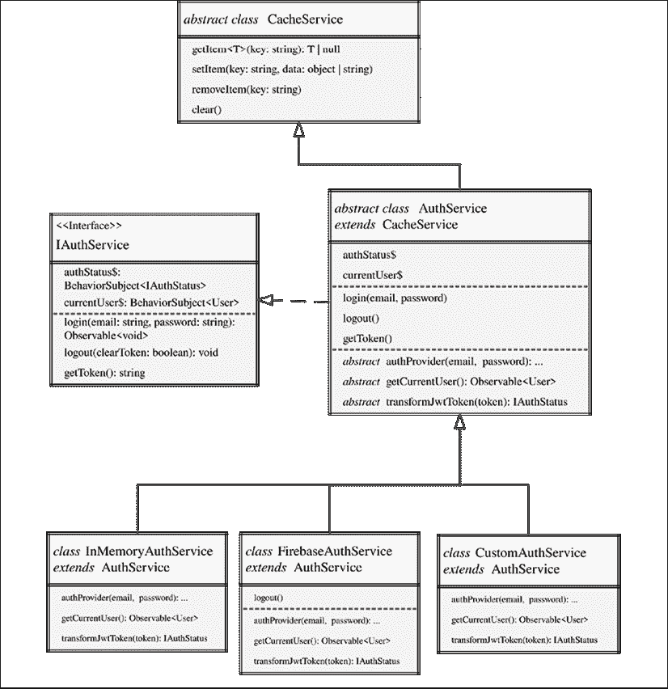

图 8.3：AuthService 继承结构

`AuthService`实现了`IAuthService`接口，如下所示：

```js
export interface IAuthService {
  readonly authStatus$: BehaviorSubject<IAuthStatus>
  readonly currentUser$: BehaviorSubject<IUser>
  login(email: string, password: string): Observable<void>
  logout(clearToken?: boolean): void
  getToken(): string
} 
```

该接口反映了服务公开的属性。服务提供认证状态作为`authStatus$`可观察对象和当前用户作为`currentUser$`，并提供三个函数`login`、`logout`和`getToken`。

`AuthService`从另一个名为`CacheService`的抽象类继承缓存功能。由于`AuthService`是一个抽象类，因此不能单独使用，所以我们实现了三个认证提供者，`InMemoryAuthService`、`FirebaseAuthService`和`CustomAuthService`，如图中底部所示。

注意，所有三个认证服务都实现了所有抽象函数。此外，`FirebaseAuthService`覆盖了基类的`logout`函数以实现其自己的行为。所有三个类从同一个抽象类继承，并公开相同的公共接口。所有三个将执行相同的认证工作流程，针对不同的认证服务器。

内存中的认证服务不与服务器通信。此服务仅用于演示目的。它实现了假的 JWT 编码，因此我们可以演示 JWT 生命周期的工作方式。

让我们先创建认证服务。

### 创建认证服务

我们将首先创建抽象认证服务和内存服务：

1.  添加一个认证服务：

    ```js
    $ npx ng g s auth --flat false --lintFix 
    $ npx ng g s auth/inMemoryAuth --lintFix --skipTests 
    ```

1.  将`in-memory-auth.service.ts`重命名为`auth.inmemory.service.ts`，以便在文件资源管理器中将不同的认证提供者视觉上分组在一起。

1.  从`auth.service.ts`和`auth.inmemory.service.ts`的`@Injectable()`装饰器中移除配置对象`{ providedIn: 'root' }`。

1.  确保在`app.module.ts`中提供`authService`，但实际上使用的是`InMemoryAuthService`而不是抽象类：

    ```js
    **src/app/app.module.ts**
    **import { AuthService } from './auth/auth.service'**
    **import { InMemoryAuthService } from './auth/auth.inmemory.service'**
    ...
      providers: [
        **{**
     **provide: AuthService,**
     **useClass: InMemoryAuthService**
     **},**
        ...
    ] 
    ```

为服务创建一个单独的文件夹，可以组织与认证相关的各种组件，例如用户角色的`enum`定义。此外，我们还将能够将`authService`假对象添加到同一文件夹中，以进行自动化测试。

### 实现一个抽象认证服务

现在，让我们构建一个抽象认证服务，该服务将协调登录和注销，同时封装管理 JWT、认证状态和有关当前用户信息的逻辑。通过利用抽象类，我们应该能够针对任何认证提供者实现我们自己的认证服务，而无需修改我们应用程序的内部行为。

正在演示的抽象认证服务能够实现丰富和复杂的流程。这是一个你可以直接放入你的应用程序中而无需修改内部逻辑的解决方案。因此，它是一个复杂的解决方案。

此认证服务将使我们能够演示使用电子邮件和密码登录、缓存以及基于认证状态和用户角色的条件导航概念：

1.  首先安装一个 JWT 解码库，以及用于模拟认证的 JWT 编码库：

    ```js
    $ npm install jwt-decode 
    $ npm install -D @types/jwt-decode 
    ```

1.  实现一个 `IAuthStatus` 接口以存储解码的用户信息、一个辅助接口和默认安全的 `defaultAuthStatus`：

    ```js
    **src/app/auth/auth.service.ts**
    import { Role } from './auth.enum'
    ...
    export interface IAuthStatus {
      isAuthenticated: boolean
      userRole: Role
      userId: string
    }
    export interface IServerAuthResponse {
      accessToken: string
    }
    export const defaultAuthStatus: IAuthStatus = {
      isAuthenticated: false,
      userRole: Role.None,
      userId: '',
    }
    ... 
    ```

    `IAuthStatus` 是一个接口，表示你可能从认证服务接收到的典型 JWT 的形状。它包含有关用户和用户角色的最小信息。认证状态对象可以附加到每个 API 调用的头部，以验证用户的身份。认证状态可以可选地缓存在 `localStorage` 中以记住用户的登录状态；否则，他们每次刷新页面时都必须重新输入密码。

    在前面的实现中，我们假设默认角色为 `None`，如 `Role` 枚举中定义。通过默认不给用户分配任何角色，我们遵循最小权限访问模型。用户正确的角色将在他们使用从 auth API 收到的信息成功登录后设置。

1.  在 `auth.service.ts` 中定义 `IAuthService` 接口：

    ```js
    **src/app/auth/auth.service.ts**
    export interface IAuthService {
      readonly authStatus$: BehaviorSubject<IAuthStatus>
      readonly currentUser$: BehaviorSubject<IUser>
      login(email: string, password: string): Observable<void>
      logout(clearToken?: boolean): void
      getToken(): string
    } 
    ```

1.  将 `AuthService` 设为 `abstract` 类，如下所示：

    ```js
    export **abstract** class AuthService 
    ```

1.  使用 VS Code 的快速修复功能实现接口，`IAuthService`：

    ```js
    **src/app/auth/auth.service.ts**
    @Injectable()
    export abstract class AuthService **implements IAuthService** {
      authStatus$: BehaviorSubject<IAuthStatus>
      currentUser$: BehaviorSubject<IUser>

      **constructor() {}**

      login(email: string, password: string): Observable<void> {
        throw new Error('Method not implemented.')
      }
      logout(clearToken?: boolean): void {
        throw new Error('Method not implemented.')
      }
      getToken(): string {
        throw new Error('Method not implemented.')
      }
    } 
    ```

1.  实现 `authStatus$` 和 `currentUser$` 属性为 `readonly`，并用它们的默认值初始化我们的数据锚点：

    ```js
    **src/app/auth/auth.service.ts**
    import { IUser, **User** } from '../user/user/user'
    ...
    @Injectable()
    export abstract class AuthService implements IAuthService {
      **readonly** authStatus$ = 
        **new BehaviorSubject<IAuthStatus>(defaultAuthStatus)** 
      **readonly** currentUser$ = 
        **new BehaviorSubject<IUser>(new User())**
      ...
    } 
    ```

注意，我们移除了属性的类型定义。相反，我们让 TypeScript 从初始化中推断类型。

你必须始终将你的数据锚点声明为 `readonly`，这样你就不会意外地通过将数据锚点重新初始化为新的 `BehaviorSubject` 来覆盖数据流。这样做会导致任何先前的订阅者成为孤儿，导致内存泄漏，并产生许多意想不到的后果。

所有实现 `IAuthService` 的类都需要能够登录用户，将我们从服务器获取的令牌进行转换，以便我们可以读取和存储它，支持访问当前用户和认证状态，并提供一种注销用户的方式。我们已经成功地将公共方法的功能放入其中，并为我们的数据锚点实现了默认值，以创建其余应用程序使用的钩子。但到目前为止，我们只定义了我们的服务可以做什么，而没有定义它是如何做到的。

总是如此，魔鬼在于细节，难点在于“如何”。抽象函数可以帮助我们在应用程序中的服务内完成工作流程的实现，同时将必须实现外部 API 的部分服务留空。

### 抽象函数

实现抽象类的认证服务应该能够支持任何类型的认证提供者和任何类型的令牌转换，同时能够修改如用户检索逻辑等行为。我们必须能够实现登录、注销、令牌和认证状态管理，而不需要实现对特定服务的调用。

通过定义抽象函数，我们可以声明一系列必须实现给定输入和输出的方法——一个没有实现的签名。然后我们可以使用这些抽象函数来编排我们的认证工作流程的实现。

我们在这里的设计目标是受 Open/Closed 原则驱动的。`AuthService` 将通过其扩展能力来工作与任何基于令牌的认证提供者，但对其修改是封闭的。一旦我们完成了 `AuthService` 的实现，我们就无需修改其代码来添加额外的认证提供者。

现在我们需要定义我们的认证提供者必须实现的抽象函数，如本章前面 *图 8.3* 所示：

+   `authProvider(email, password)`: `Observable<IServerAuthResponse>` 可以通过提供者登录并返回一个标准化的 `IServerAuthResponse`

+   `transformJwtToken(token)`: `IAuthStatus` 可以将提供者返回给 `IAuthStatus` 接口令牌进行标准化

+   `getCurrentUser()`: `Observable<User>` 可以检索已登录用户的用户资料

然后，我们可以在我们的 `login`、`logout` 和 `getToken` 方法中使用这些函数来实现认证工作流程：

1.  将派生类应实现的方法定义为受保护的属性，这样它们在派生类中可访问，但不是公开的：

    ```js
    **src/app/auth/auth.service.ts**
    ...
    **export abstract class AuthService implements IAuthService {**
     **protected abstract authProvider(**
     **email: string,**
     **password: string**
     **): Observable<IServerAuthResponse>**
     **protected abstract transformJwtToken(token: unknown):**
     **IAuthStatus**
     **protected abstract getCurrentUser(): Observable<User>**
         ...
    } 
    ```

    利用这些已编写的函数，我们现在可以实现一个 `login` 方法，执行登录并检索当前登录用户，确保更新 `authStatus$` 和 `currentUser$` 数据流。

1.  在我们继续之前，实现一个 `transformError` 函数来处理不同类型的错误，如 `HttpErrorResponse` 和 `string`，并将它们提供在可观察流中。在 `src/app/common` 下的一个名为 `common.ts` 的新文件中创建 `transformError` 函数：

    ```js
    **src/app/common/common.ts**
    import { HttpErrorResponse } from '@angular/common/http'
    import { throwError } from 'rxjs'
    export function transformError(error: HttpErrorResponse | string) {
      let errorMessage = 'An unknown error has occurred'
      if (typeof error === 'string') {
        errorMessage = error
      } else if (error.error instanceof ErrorEvent) {
        errorMessage = `Error! ${error.error.message}`
      } else if (error.status) {
        errorMessage = 
          `Request failed with ${error.status} ${error.statusText}`
      } else if (error instanceof Error) {
        errorMessage = error.message
      }
      return throwError(errorMessage)
    } 
    ```

1.  在`auth.service.ts`中实现`login`方法：

    ```js
    **src/app/auth/auth.service.ts**
    **import * as decode from 'jwt-decode'**
    **import { transformError } from '../common/common'**
    ...
      login(email: string, password: string): Observable<void> {
        **const loginResponse$ = this.authProvider(email, password)**
     **.pipe(**
     **map((value) => {**
     **const token = decode(value.accessToken)**
     **return this.transformJwtToken(token)**
     **}),**
     **tap((status) => this.authStatus$.next(status)),**
     **filter((status: IAuthStatus) => status.isAuthenticated),**
     **flatMap(() => this.getCurrentUser()),**
     **map(user => this.currentUser$.next(user)),**
     **catchError(transformError)**
     **)**
     **loginResponse$.subscribe({**
     **error: err => {**
     **this.logout()**
     **return throwError(err)**
     **},**
     **})**
     **return loginResponse$**
      } 
    ```

    `login`方法通过调用带有`email`和`password`信息的`authProvider`来封装正确的操作顺序，然后解码接收到的 JWT，转换它，并更新`authStatus$`。然后只有在`status.isAuthenticated`为`true`时才调用`getCurrentUser()`。之后，更新`currentUser$`，最后，我们使用自定义的`transformError`函数捕获任何错误。

    我们通过在它上面调用`subscribe`来激活可观察流。在出现错误的情况下，我们调用`logout()`以保持应用程序的正确状态，并通过使用`throwError`重新抛出错误，将错误冒泡到`login`的消费者。

    现在，需要实现相应的`logout`函数。在登录尝试失败的情况下，或者在检测到未经授权的访问尝试时，都会触发注销。我们可以通过使用路由认证守卫来检测未经授权的访问尝试，因为用户正在导航应用程序，这是本章后面将要讨论的主题。

1.  实现注销方法：

    ```js
    **src/app/auth/auth.service.ts**
      ...
      logout(clearToken?: boolean): void {
        setTimeout(() => this.authStatus$.next(defaultAuthStatus), 0)
      } 
    ```

我们通过将`defaultAuthStatus`作为`authStatus$`流中的下一个值来注销。注意`setTimeout`的使用，它允许我们在应用程序的核心元素同时更改状态时避免时序问题。

考虑到`login`方法如何遵循开放/封闭原则。该方法通过抽象函数`authProvider`、`transformJwtToken`和`getCurrentUser`进行扩展。通过在派生类中实现这些函数，我们保持了外部提供不同认证提供者的能力，而无需修改`login`方法。因此，方法的实现保持对修改的封闭，从而遵循开放/封闭原则。

创建抽象类的真正价值在于能够以可扩展的方式封装常见功能。

目前您可以忽略`getToken`函数，因为我们还没有缓存 JWT。在没有缓存的情况下，用户每次刷新页面时都必须登录。让我们接下来实现缓存。

### 使用 localStorage 的抽象缓存服务

我们必须能够缓存已登录用户的认证状态。如前所述，否则，每次页面刷新时，用户都必须通过登录流程。我们需要更新`AuthService`以持久化认证状态。

存储数据主要有三种方式：

+   `cookie`

+   `localStorage`

+   `sessionStorage`

应当避免使用 Cookies 来存储安全数据，因为它们可以被恶意行为者嗅探或窃取。此外，Cookies 只能存储 4 KB 的数据，并且可以被设置为过期。

`localStorage`和`sessionStorage`彼此相似。它们是受保护和隔离的浏览器端存储，允许为您的应用程序存储更多的数据。与 cookies 不同，您不能为存储在任一存储中的值设置过期日期和时间。存储在任一存储中的值在页面重新加载和恢复时仍然存在，这使得它们比 cookies 更适合缓存信息。

`localStorage`和`sessionStorage`之间的主要区别在于，当浏览器窗口关闭时，值会被移除。在大多数情况下，用户登录的缓存时间从几分钟到一个月或更长时间，具体取决于您的业务，因此依赖于用户是否关闭浏览器窗口并不是很有用。通过这个过程排除，我更喜欢`localStorage`，因为它提供了隔离性和长期存储能力。

JWT 可以被加密并包含一个过期时间戳。从理论上讲，这抵消了 cookies 和`localStorage`的弱点。如果正确实现，任一选项都应安全用于 JWT，但`localStorage`仍然更受欢迎。

让我们从实现一个可以抽象我们缓存方法的缓存服务开始。然后我们可以从这个服务派生出缓存我们的认证信息：

1.  首先创建一个抽象的`cacheService`，它封装了缓存方法：

    ```js
    **src/app/auth/cache.service.ts**
    export abstract class CacheService {
      protected getItem<T>(key: string): T | null {
        const data = localStorage.getItem(key)
        if (data != null) {
          return JSON.parse(data)
        }
        return null
      }
      protected setItem(key: string, data: object | string) {
        if (typeof data === 'string') {
          localStorage.setItem(key, data)
        }
        localStorage.setItem(key, JSON.stringify(data))
      }
      protected removeItem(key: string) {
        localStorage.removeItem(key)
      }
      protected clear() {
        localStorage.clear()
      }
    } 
    ```

    这个缓存服务基类可以被用来给任何服务提供缓存能力。它不同于创建一个集中式缓存服务并将其注入到另一个服务中。通过避免集中式值存储，我们避免了各种服务之间的相互依赖。

1.  更新`AuthService`以扩展`CacheService`，这将使我们能够在下一节中实现 JWT 的缓存：

    ```js
    **src/app/auth/auth.service.ts**
    ...
    export abstract class AuthService 
      **extends CacheService** implements IAuthService { 
      constructor() {
        **super()**
      }
      ... 
    } 
    ```

注意，我们必须使用`super`方法从派生类的构造函数中调用基类的构造函数。

让我们通过一个例子来了解如何通过缓存`authStatus`对象来使用基类的功能：

```js
**example**
authStatus$ = new BehaviorSubject<IAuthStatus>(
  this.getItem('authStatus') ?? defaultAuthStatus
)
constructor() {
  super()
  this.authStatus$.pipe(
    tap(authStatus => this.setItem('authStatus', authStatus))
  )
} 
```

示例中展示的技术利用 RxJS 可观察流在`authStatus$`的值变化时更新缓存。您可以使用这种模式持久化任何类型的数据，而无需在业务逻辑中散布缓存代码。在这种情况下，我们不需要更新`login`函数来调用`setItem`，因为它已经调用了`this.authStatus.next`，我们只需接入数据流即可。这有助于保持无状态并避免副作用，通过解耦函数来实现。

注意，我们还在`BehaviorSubject`中使用`getItem`函数进行初始化。使用空值合并运算符，我们只在缓存的数据不是`undefined`或`null`时使用它。否则，我们提供默认值。

您可以在`setItem`和`getItem`函数中实现自己的自定义缓存过期方案，或者利用第三方创建的服务。

然而，为了额外的安全层，我们不会缓存`authStatus`对象。相反，我们只缓存编码后的 JWT，它只包含足够的信息，以便我们可以认证发送到服务器的请求。理解基于令牌的认证工作方式对于避免泄露有损的秘密非常重要。回顾本章早些时候的 JWT 生命周期，以提高你的理解。

接下来，让我们缓存令牌。

### 缓存 JWT

让我们更新认证服务，使其能够缓存令牌。

1.  更新`AuthService`以能够设置、获取和清除令牌，如下所示：

    ```js
    **src/app/auth/auth.service.ts**
    ...
      protected setToken(jwt: string) {
        this.setItem('jwt', jwt)
      }
      getToken(): string {
        return this.getItem('jwt') ?? ''
      }
      protected clearToken() {
        this.removeItem('jwt')
      } 
    ```

1.  在`login`期间调用`clearToken`和`setToken`，在`logout`期间调用`clearToken`，如下所示：

    ```js
    **src/app/auth/auth.service.ts**
    ...
      login(email: string, password: string): Observable<void> {
        **this.clearToken()**
        const loginResponse$ = this.authProvider(email, password)
          .pipe(
            map(value => {
              **this.setToken(value.accessToken)**
              const token = decode(value.accessToken)
              return this.transformJwtToken(token)
            }),
            tap((status) => this.authStatus$.next(status)),
            ...
      }
      logout(clearToken?: boolean) {
        **if (clearToken) {**
     **this.clearToken()**
     **}**
        setTimeout(() => this.authStatus$.next(defaultAuthStatus), 0)
      } 
    ```

每个后续请求都将包含请求头中的 JWT。你应该确保每个 API 都检查和验证收到的令牌。例如，如果用户想要访问他们的个人资料，`AuthService`将验证令牌以检查用户是否已认证；然而，还需要进一步的数据库调用以检查用户是否有权查看数据。这确保了对用户系统访问的独立确认，并防止了对未过期令牌的滥用。

如果一个认证用户调用他们没有适当授权的 API，比如说如果一名职员想要获取所有用户的列表，那么`AuthService`将返回一个`falsy`状态，客户端将收到一个**403 禁止**响应，这将被显示为错误消息给用户。

用户可以使用过期的令牌进行请求；当这种情况发生时，客户端将收到一个**401 未授权**响应。作为一个良好的用户体验实践，我们应该自动提示用户重新登录，并让他们在没有数据丢失的情况下继续他们的工作流程。

总结来说，真正的安全是通过强大的服务器端实现来实现的。任何客户端实现主要是为了在良好的安全实践周围提供良好的用户体验。

## 实现一个内存中的认证服务

现在，让我们实现一个具体的认证服务版本，我们可以实际使用：

1.  首先安装 JWT 解码库，以及用于模拟认证的 JWT 编码库：

    ```js
    $ npm install fake-jwt-sign 
    ```

1.  扩展抽象的`AuthService`：

    ```js
    **src/app/auth/auth.inmemory.service.ts**
    import { AuthService } from './auth.service'
    @Injectable()
    export class InMemoryAuthService **extends AuthService** {
      constructor() {
        **super()**
     **console.warn(**
     **"You're using the InMemoryAuthService. Do not use this service in production."**
     **)**
      }
      ...
    } 
    ```

1.  实现一个模拟的`authProvider`函数，模拟认证过程，包括动态创建模拟 JWT：

    ```js
    **src/app/auth/auth.inmemory.service.ts**
      import { sign } from 'fake-jwt-sign'//For InMemoryAuthService only
    ...
      protected authProvider(
        email: string,
        password: string
      ): Observable<IServerAuthResponse> {
        email = email.toLowerCase()
        if (!email.endsWith('@test.com')) {
          return throwError('Failed to login! Email needs to end with @test.com.')
        }
        const authStatus = {
          isAuthenticated: true,
          userId: this.defaultUser._id,
          userRole: email.includes('cashier')
            ? Role.Cashier
            : email.includes('clerk')
            ? Role.Clerk
            : email.includes('manager')
            ? Role.Manager
            : Role.None,
        } as IAuthStatus
        this.defaultUser.role = authStatus.userRole
        const authResponse = {
          accessToken: sign(authStatus, 'secret', {
            expiresIn: '1h',
            algorithm: 'none',
          }),
        } as IServerAuthResponse
        return of(authResponse)
      }
    ... 
    ```

    `authProvider`在服务中实现了原本应该在服务器端实现的方法，这样我们就可以方便地在微调认证工作流程的同时实验代码。提供者使用临时的`fake-jwt-sign`库创建并签名 JWT，以便我可以演示如何处理正确形成的 JWT。

    不要将 Angular 应用程序与`fake-jwt-sign`依赖项一起发货，因为它意味着是服务器端代码。

    相比之下，一个真实的认证提供者会包括一个发送到服务器的`POST`调用。请参阅以下示例代码：

    ```js
    **example**
    private exampleAuthProvider(
      email: string,
      password: string
    ): Observable<IServerAuthResponse> { return this.httpClient.post<IServerAuthResponse>(
        `${environment.baseUrl}/v1/login`, 
        { email: email, password: password }
      )
    } 
    ```

    这相当直接，因为困难的工作是在服务器端完成的。这个调用也可以发送到第三方认证提供者，我将在本章后面的 Firebase 认证食谱中介绍。

    注意，URL 路径中的 API 版本`v1`是在服务中定义的，而不是作为`baseUrl`的一部分。这是因为每个 API 可以独立更改版本。登录可能长时间保持为`v1`，而其他 API 可能升级到`v2`、`v3`等。

1.  实现`transformJwtToken`将是微不足道的，因为登录函数为我们提供了一个符合`IAuthStatus`的令牌：

    ```js
    **src/app/auth/auth.inmemory.service.ts**
    protected transformJwtToken(token: IAuthStatus): 
      IAuthStatus {
        return token
      } 
    ```

1.  最后，实现`getCurrentUser`，它应该返回一个默认用户：

    ```js
    **src/app/auth/auth.inmemory.service.ts**
    protected getCurrentUser(): Observable<User> {
      return of(this.defaultUser)
    } 
    ```

    接下来，将`defaultUser`作为私有属性提供给类；以下是我创建的一个示例。

1.  向`InMemoryAuthService`类添加一个私有的`defaultUser`属性：

    ```js
    **src/app/auth/auth.inmemory.service.ts**
    import { PhoneType, User } from '../user/user/user'
    ...
    private defaultUser = User.Build({
      _id: '5da01751da27cc462d265913',
      email: 'duluca@gmail.com',
      name: { first: 'Doguhan', last: 'Uluca' },
      picture: 'https://secure.gravatar.com/avatar/7cbaa9afb5ca78d97f3c689f8ce6c985',
      role: Role.Manager,
      dateOfBirth: new Date(1980, 1, 1),
      userStatus: true,
      address: {
        line1: '101 Sesame St.',
        city: 'Bethesda',
        state: 'Maryland',
        zip: '20810',
      },
      level: 2,
      phones: [
        {
          id: 0,
          type: PhoneType.Mobile,
          digits: '5555550717',
        },
      ],
    }) 
    ```

恭喜你，你已经实现了一个具体但仍然虚假的认证服务。现在你已经有了一个内存中的认证服务，请确保运行你的 Angular 应用程序，并确保没有错误。

让我们通过实现一个简单的登录和注销功能来测试我们的认证服务，该功能可以通过用户界面访问。

### 简单登录

在我们实现一个功能齐全的`login`组件之前，让我们将预制的登录行为连接到`HomeComponent`中的`登录为管理员**`按钮。在深入了解交付丰富 UI 组件的细节之前，我们可以测试我们的认证服务的功能。

我们的目标是模拟登录为管理员。为了实现这一点，我们需要硬编码一个电子邮件地址和密码来登录，并在成功登录后保持导航到`/manager`路由的功能。

注意，在 GitHub 上，本节代码示例位于`projects/ch8`文件夹结构下的`home.component.simple.ts`文件中。该备用文件仅用于参考目的，因为本章后面的代码将发生重大变化。忽略文件名差异，因为它不会影响本节代码的编写。

让我们实现一个简单的登录机制：

1.  在`HomeComponent`中实现一个`login`函数，该函数使用`AuthService`：

    ```js
    **src/app/home/home.component.ts**
    import { AuthService } from '../auth/auth.service'
    export class HomeComponent implements OnInit {
      constructor(**private authService: AuthService**) {}
      ngOnInit(): void {}
      **login() {**
     **this.authService.login('manager@test.com', '12345678')**
     **}**
    } 
    ```

1.  更新模板以移除`routerLink`，并调用`login`函数：

    ```js
    **src/app/home/home.component.ts**
    template: `
        <div fxLayout="column" fxLayoutAlign="center center">
          <span class="mat-display-2">Hello, Limoncu!</span>
          <button mat-raised-button color="primary" **(click)="login()"**>
            Login as Manager
          </button>
        </div>
      `, 
    ```

    在成功登录后，我们需要导航到`/manager`路由。我们可以通过监听`AuthService`公开的`authStatus$`和`currentUser$`可观察对象来验证我们是否成功登录。如果`authStatus$.isAuthenticated`为`true`且`currentUser$._id`是一个非空字符串，这意味着我们有一个有效的登录。我们可以通过使用 RxJS 的`combineLatest`运算符来监听这两个可观察对象。在有效的登录条件下，然后我们可以使用`filter`运算符来响应式地导航到`/manager`路由。

1.  更新`login()`函数以实现登录条件和成功后导航到`/manager`路由：

    ```js
    **src/app/home/home.component.ts**
    constructor(
      private authService: AuthService,
      **private router: Router**
    ) {}

    login() {
      this.authService.login('manager@test.com', '12345678')
    **combineLatest([**
     **this.authService.authStatus$, this.authService.currentUser$**
    **])** 
     **.pipe(**
     **filter(([authStatus, user]) =>** 
     **authStatus.isAuthenticated && user?._id !== ''**
     **),**
     **tap(([authStatus, user]) => {**
     **this.router.navigate(['/manager'])**
     **})**
     **)**
     **.subscribe()**
    } 
    ```

    注意我们订阅了`combineLatest`操作符，这在激活可观察流中是至关重要的。否则，除非其他组件订阅了流，否则我们的登录操作将保持休眠状态。您只需要激活一次流。

1.  现在测试一下新的`登录`功能。验证 JWT 是否已创建并存储在`localStorage`中，如**Chrome DevTools|应用程序**选项卡中所示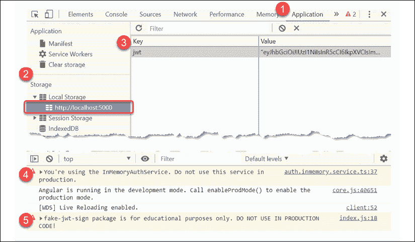

    图 8.4：DevTools 显示应用程序本地存储

您可以在**应用程序**选项卡下查看**本地存储**。确保您的应用程序的 URL 被突出显示。在第 3 步中，您可以看到我们有一个名为`jwt`的有效令牌。

注意步骤 4 和 5 中突出的两个警告，它们建议我们不要在生产代码中使用`InMemoryAuthService`和`fake-jwt-sign`包。

使用断点进行调试，并逐步执行代码，以更具体地了解`HomeComponent`、`InMemoryAuthService`和`AuthService`如何协同工作以登录用户。

当您刷新页面时，请注意您仍然处于登录状态，因为我们已经在本地存储中缓存了令牌。

由于我们正在缓存登录状态，因此我们还需要实现一个注销体验来完成认证工作流程。

### 注销

应用程序工具栏上的注销按钮已经连接到我们之前创建的`注销`组件。让我们更新这个组件，以便在导航到时能够注销用户：

1.  实现注销组件：

    ```js
    **src/app/user/logout/logout.component.ts**
    import { Component, OnInit } from '@angular/core' 
    import { Router } from '@angular/router'
    import { AuthService } from '../../auth/auth.service'
    @Component({
      selector: 'app-logout', 
      template: `<p>Logging out...</p>`,
    })
    export class LogoutComponent implements OnInit { 
      constructor(private router: Router, private authService: AuthService) {}
      ngOnInit() { 
        this.authService.logout(true)
        this.router.navigate(['/'])
      }
    } 
    ```

    注意我们通过将`true`传递给`注销`函数来显式清除 JWT。在调用注销后，我们将用户导航回主页。

1.  测试一下`注销`按钮。

1.  验证注销后本地存储是否已清除。

我们已经实现了稳定的登录和注销。然而，我们还没有完成认证工作流程的基本内容。

接下来，我们需要考虑 JWT 的过期状态。

## 恢复 JWT 会话

如果每次访问网站时都必须登录 Gmail 或 Amazon，那么用户体验就不会很好。这就是我们为什么要缓存 JWT 的原因，但永远保持登录状态同样会带来糟糕的用户体验。JWT 有一个过期日期策略，提供商可以选择几分钟甚至几个月的时间来允许您的令牌根据安全需求有效。内存中的服务创建的令牌在一小时内过期，所以如果用户在那一时间段内刷新浏览器窗口，我们应该尊重有效的令牌，并允许用户继续使用应用程序而无需要求他们重新登录。

另一方面，如果令牌已过期，我们应该自动将用户导航到登录屏幕，以实现流畅的用户体验。

让我们开始吧：

1.  更新`AuthService`类以实现一个名为`hasExpiredToken`的函数来检查令牌是否过期，以及一个名为`getAuthStatusFromToken`的辅助函数来解码令牌，如下所示：

    ```js
    **src/app/auth/auth.service.ts**
    ...
      protected hasExpiredToken(): boolean {
        const jwt = this.getToken()
        if (jwt) {
          const payload = decode(jwt) as any
          return Date.now() >= payload.exp * 1000
        }
        return true
      }
      protected getAuthStatusFromToken(): IAuthStatus {
        return this.transformJwtToken(decode(this.getToken()))
      } 
    ```

    保持你的代码 DRY！更新`login()`函数以使用`getAuthStatusFromToken()`。

1.  更新`AuthService`的构造函数以检查令牌的状态：

    ```js
    **src/app/auth/auth.service.ts**
    ...
    constructor() {
        super()
        if (this.hasExpiredToken()) {
          this.logout(true)
        } else {
          this.authStatus$.next(this.getAuthStatusFromToken())
        }
    } 
    ```

    如果令牌已过期，我们注销用户并从`localStorage`中清除令牌。否则，我们解码令牌并将认证状态推送到数据流。

    在这里需要考虑的一个特殊情况是在恢复时也触发当前用户的重新加载。我们可以通过实现一个新的管道来实现，如果激活，则重新加载当前用户。

1.  首先，让我们将`login()`函数中现有的用户更新逻辑重构为一个名为`getAndUpdateUserIfAuthenticated`的私有属性，这样我们就可以重用它：

    ```js
    **src/app/auth/auth.service.ts**
    ...
      @Injectable()
    export abstract class AuthService extends CacheService implements IAuthService {
      **private getAndUpdateUserIfAuthenticated = pipe(**
     **filter((status: IAuthStatus) => status.isAuthenticated),**
     **flatMap(() => this.getCurrentUser()),**
     **map((user: IUser) => this.currentUser$.next(user)),**
     **catchError(transformError)**
     **)**
      ...
      login(email: string, password: string): Observable<void> {
        this.clearToken()
        const loginResponse$ = this.authProvider(email, password)
          .pipe(
            map((value) => {
              this.setToken(value.accessToken)
              const token = decode(value.accessToken)
              return this.transformJwtToken(token)
            }),
            tap((status) => this.authStatus$.next(status)),
            **this.getAndUpdateUserIfAuthenticated**
          )
        ...
      }
      ...
    } 
    ```

1.  在`AuthService`中定义一个名为`resumeCurrentUser$`的可观察属性，作为`authStatus$`的分支，并使用`getAndUpdateUserIfAuthenticated`逻辑：

    ```js
    **src/app/auth/auth.service.ts**
    ...
      protected readonly resumeCurrentUser$ = this.authStatus$.pipe(
        this.getAndUpdateUserIfAuthenticated 
      ) 
    ```

    一旦`resumeCurrentUser$`被激活并且`status.isAuthenticated`为`true`，那么`this.getCurrentUser()`将被调用，并且`currentUser$`将被更新。

1.  更新`AuthService`的构造函数以在令牌未过期时激活管道：

    ```js
    **src/app/auth/auth.service.ts**
    ...
    constructor() {
      super()
      if (this.hasExpiredToken()) {
        this.logout(true)
      } else {
        this.authStatus$.next(this.getAuthStatusFromToken())
        // To load user on browser refresh,
        // resume pipeline must activate on the next cycle
        // Which allows for all services to constructed properly
        setTimeout(() => this.resumeCurrentUser$.subscribe(), 0)
      }
    } 
    ```

使用前面的技术，我们可以检索最新的用户配置文件数据，而无需处理缓存问题。

为了实验令牌过期，我建议你在`InMemoryAuthService`中创建一个更快过期的令牌。

如在前面缓存部分所示，使用`this.setItem`和首次启动时的缓存配置文件数据，可以缓存用户配置文件数据。这将提供更快的用户体验，并覆盖用户可能离线的情况。在应用程序启动后，您可以异步获取新鲜的用户数据，并在新数据到来时更新`currentUser$`。您需要添加额外的缓存并调整`getCurrentUser()`逻辑以使此功能正常工作。哦，您还需要大量的测试！创建高质量的认证体验需要大量的测试。

恭喜，我们已经完成了健壮的认证工作流的实现！接下来，我们需要将认证与 Angular 的 HTTP 客户端集成，以便我们可以将令牌附加到每个请求的 HTTP 头部。

## HTTP 拦截器

实现一个 HTTP 拦截器，将 JWT 注入到发送给用户的每个请求的头部，并通过要求用户重新登录来优雅地处理认证失败：

1.  在`auth`下创建一个`AuthHttpInterceptor`：

    ```js
    **src/app/auth/auth-http-interceptor.ts**
    import {
      HttpEvent,
      HttpHandler,
      HttpInterceptor,
      HttpRequest,
    } from '@angular/common/http'
    import { Injectable } from '@angular/core'
    import { Router } from '@angular/router'
    import { Observable, throwError } from 'rxjs'
    import { catchError } from 'rxjs/operators'
    import { AuthService } from './auth.service'
    @Injectable()
    export class AuthHttpInterceptor implements HttpInterceptor {
      constructor(private authService: AuthService, private router: Router) {}
      intercept(req: HttpRequest<any>, next: HttpHandler): Observable<HttpEvent<any>> {
        const jwt = this.authService.getToken()
        const authRequest = req.clone({ setHeaders: { authorization: `Bearer ${jwt}` } })
        return next.handle(authRequest).pipe(
          catchError((err, caught) => {
            if (err.status === 401) {
              this.router.navigate(
                ['/login'], { queryParams: {
                  redirectUrl: this.router.routerState.snapshot.url},}
              )
            }
            return throwError(err)
          })
        )
      }
    } 
    ```

    注意，`AuthService`被用来检索令牌，并且在`401`错误后为`login`组件设置了`redirectUrl`。

1.  更新`app.module.ts`以提供拦截器：

    ```js
    **src/app/app.module.ts**
      providers: [
        ...
        {
          provide: HTTP_INTERCEPTORS,
          useClass: AuthHttpInterceptor,
          multi: true,
        },
      ], 
    ```

1.  确保拦截器正在将令牌添加到请求中。为此，打开**Chrome DevTools | 网络**标签，登录，然后刷新页面: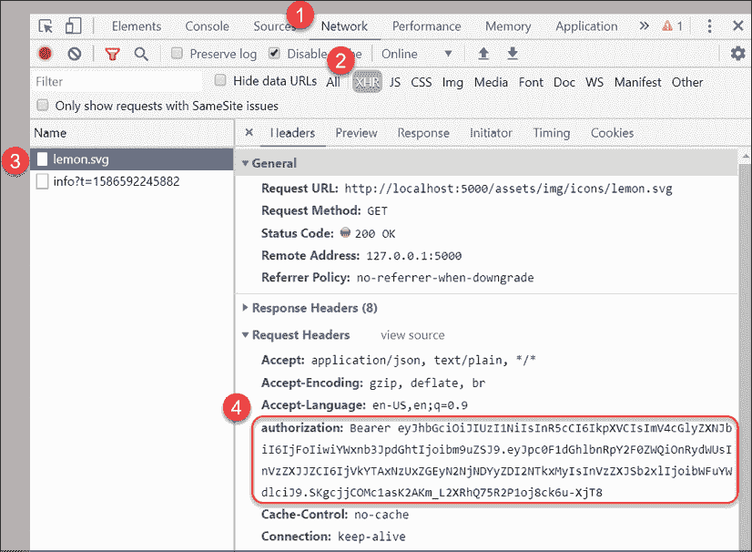

    图 8.5：lemon.svg 的请求头

在步骤**4**中，你现在可以观察拦截器的动作。对`lemon.svg`文件的请求在请求头中包含 bearer 令牌。

现在我们已经设置了认证机制，让我们利用我们编写的所有支持代码，包括动态 UI 组件和基于角色的 UX 的条件导航系统。

# 动态 UI 组件和导航

`AuthService`提供异步的认证状态和用户信息，包括用户的名字和角色。我们可以使用所有这些信息为用户创建一个友好且个性化的体验。在本节中，我们将实现`LoginComponent`，以便用户可以输入他们的用户名和密码信息并尝试登录。

## 实现登录组件

`login`组件利用我们刚刚创建的`AuthService`并使用响应式表单实现验证错误。

记住，在`app.module.ts`中，我们使用`InMemoryAuthService`类提供了`AuthService`。因此，在运行时，当`AuthService`被注入到`login`组件中时，将使用内存服务。

`login`组件应该设计成独立于任何其他组件渲染，因为在路由事件期间，如果我们发现用户没有正确认证或授权，我们将导航他们到这个组件。我们可以捕获这个原始 URL 作为`redirectUrl`，这样一旦用户成功登录，我们就可以将他们导航回它。

让我们开始：

1.  安装`SubSink`包。

1.  在应用程序的根目录中创建一个名为`login`的新组件，并使用内联样式。

1.  让我们从实现导航到`login`组件的路由开始：

    ```js
    **src/app/app-routing.modules.ts**
    ...
      { path: 'login', component: LoginComponent },
      { path: 'login/:redirectUrl', component: LoginComponent },
    ... 
    ```

    记住，`'**'`路径必须是最后定义的。

1.  使用与我们在`HomeComponent`中实现的类似`login`逻辑，现在实现带有一些样式的`LoginComponent`：

    不要忘记为即将进行的步骤将所需的依赖模块导入到您的 Angular 应用程序中。这有意留作练习，让您找到并导入缺失的模块。

    ```js
    **src/app/login/login.component.ts**
    …
    import { AuthService } from '../auth/auth.service'
    import { Role } from '../auth/role.enum'
    @Component({
      selector: 'app-login',
      templateUrl: 'login.component.html',
      styles: [
        `
          .error {
            color: red
          }
        `,
        `
          div[fxLayout] {
            margin-top: 32px;
          }
        `,
      ],
    })
    export class LoginComponent implements OnInit { 
      private subs = new SubSink()
      loginForm: FormGroup
      loginError = ''
      redirectUrl: string
      constructor(
        private formBuilder: FormBuilder,
        private authService: AuthService,
        private router: Router,
        private route: ActivatedRoute
      ) {
        this.subs.sink = route.paramMap.subscribe(
          params => (this.redirectUrl = 
            params.get('redirectUrl') ?? ''
          )
        )
      }
      ngOnInit() {
        this.authService.logout()
        this.buildLoginForm()
      }
      buildLoginForm() {
        this.loginForm = this.formBuilder.group({
          email: ['', [Validators.required, Validators.email]],
          password: ['', [
            Validators.required,
            Validators.minLength(8),
            Validators.maxLength(50),
          ]],
        })
      }
      async login(submittedForm: FormGroup) {
        this.authService
          .login(
            submittedForm.value.email,
            submittedForm.value.password
          )
          .pipe(catchError(err => (this.loginError = err)))
        this.subs.sink = combineLatest([
          this.authService.authStatus$,
          this.authService.currentUser$,
        ])
          .pipe(
            filter(
              ([authStatus, user]) =>
                authStatus.isAuthenticated && user?._id !== ''
            ),
            tap(([authStatus, user]) => {
              this.router.navigate([this.redirectUrl || '/manager'])
            })
          )
          .subscribe()
      } 
    } 
    ```

    我们使用`SubSink`来管理我们的订阅。我们确保在调用`ngOnInit`时注销。我们以标准方式构建响应式表单。最后，`login`方法调用`this.authService.login`以启动登录过程。

    我们使用`combineLatest`同时监听`authStatus$`和`currentUser$`数据流。每当每个流中发生更改时，我们的管道都会执行。我们过滤掉不成功的登录尝试。成功的登录尝试的结果，我们利用路由将认证用户导航到其个人资料。如果服务从服务器发送错误，我们将该错误分配给`loginError`。

1.  这里是一个用于捕获和验证用户`email`和`password`的登录表单的实现，如果存在任何服务器错误，将显示它们：

    不要忘记在`app.modules.ts`中导入`ReactiveFormsModule`。

    ```js
    **src/app/login/login.component.html**
    <div fxLayout="row" fxLayoutAlign="center">
      <mat-card fxFlex="400px">
        <mat-card-header>
          <mat-card-title>
            <div class="mat-headline">Hello, Limoncu!</div>
          </mat-card-title>
        </mat-card-header>
        <mat-card-content>
          <form [formGroup]="loginForm" (ngSubmit)="login(loginForm)" fxLayout="column">
            <div fxLayout="row" fxLayoutAlign="start center" fxLayoutGap="10px">
              <mat-icon>email</mat-icon>
              <mat-form-field fxFlex>
                <input matInput placeholder="E-mail" aria-label="E- mail" formControlName="email">
                <mat-error *ngIf="loginForm.get('email')?.hasError('required')">
                  E-mail is required
                </mat-error>
                <mat-error *ngIf="loginForm.get('email')?.hasError('email')">
                  E-mail is not valid
                </mat-error>
              </mat-form-field>
            </div>
            <div fxLayout="row" fxLayoutAlign="start center" fxLayoutGap="10px">
              <mat-icon matPrefix>vpn_key</mat-icon>
              <mat-form-field fxFlex>
                <input matInput placeholder="Password" aria- label="Password" type="password" formControlName="password">
                <mat-hint>Minimum 8 characters</mat-hint>
                <mat-error *ngIf="loginForm.get('password')?.hasError('required')">
                  Password is required
                </mat-error>
                <mat-error *ngIf="loginForm.get('password')?.hasError('minlength')">
                  Password is at least 8 characters long
                </mat-error>
                <mat-error *ngIf="loginForm.get('password')?.hasError('maxlength')">
                  Password cannot be longer than 50 characters
                </mat-error>
              </mat-form-field>
            </div>
            <div fxLayout="row" class="margin-top">
              <div *ngIf="loginError" class="mat-caption error">{{loginError}}</div>
              <div class="flex-spacer"></div>
              <button mat-raised-button type="submit" color="primary" [disabled]="loginForm.invalid">Login</button>
            </div>
          </form>
        </mat-card-content>
      </mat-card>
    </div> 
    ```

    **登录**按钮在电子邮件和密码满足客户端验证规则之前是禁用的。此外，`<mat-form-field>`一次只会显示一个`mat-error`，除非您为更多错误创建更多空间，所以请确保将错误条件按正确顺序放置。

    实现完`login`组件后，现在可以更新主屏幕以有条件地显示或隐藏我们创建的新组件。

1.  更新`HomeComponent`以清理我们之前添加的代码，这样我们就可以在用户登录应用程序的主页时显示`LoginComponent`：

    ```js
    **src/app/home/home.component.ts**
      ...
      template: `
        <div *ngIf="displayLogin">
          <app-login></app-login>
        </div>
        <div *ngIf="!displayLogin">
          <span class="mat-display-3">You get a lemon, you get a lemon, you get a lemon...</span>
        </div>
      `,
    }) 
    export class HomeComponent {
      displayLogin = true
      constructor() {
      }
    } 
    ```

您的应用程序应该看起来与这个截图相似：

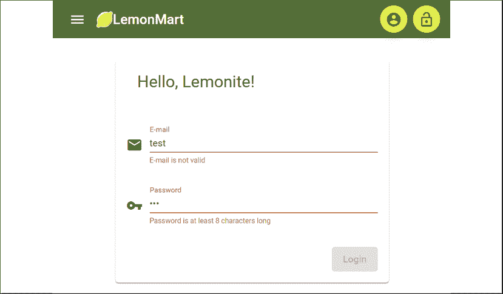

图 8.6：LemonMart 登录界面

根据用户的认证状态，在实现和显示/隐藏`sidenav`菜单、个人资料和注销图标方面还有一些工作要做。

## 条件导航

条件导航对于创建无烦恼的用户体验是必要的。通过选择性地显示用户可以访问的元素并隐藏他们无法访问的元素，我们使用户能够自信地导航应用程序。

让我们从在用户登录应用程序后隐藏`login`组件开始：

1.  在`HomeComponent`中，将`AuthService`注入到构造函数中作为`public`变量：

    ```js
    **src/app/home/home.component.simple.ts**
    ...
    import { AuthService } from '../auth/auth.service'
    ...
    export class HomeComponent { 
      constructor(**public** authService: AuthService) {}
    } 
    ```

1.  删除局部变量`displayLogin`，因为我们可以直接在模板中使用`async`管道访问认证状态。

1.  使用`ngIf; else`语法和`async`管道实现一个新的模板，如下所示：

    ```js
    **src/app/home/home.component.ts**
    ...
      template: `
        <div *ngIf= 
    "(authService.authStatus$ | async)?.isAuthenticated; else doLogin">
          <div class="mat-display-4">
            This is LemonMart! The place where
          </div>
          <div class="mat-display-4">
            You get a lemon, you get a lemon, you get a lemon...
          </div>
          <div class="mat-display-4">
            Everybody gets a lemon.
          </div>
        </div>
        <ng-template #doLogin>
          <app-login></app-login>
        </ng-template>  
      `, 
    ```

    使用`async`管道可以避免像`Error: ExpressionChangedAfterItHasBeenCheckedError: Expression has changed after it was checked`这样的错误。每当您看到这个错误时，请停止使用局部变量，而改用`async`管道。这是反应式编程的正确做法！

1.  在`AppComponent`中，我们将通过将`AuthService`注入为`public`变量来遵循类似的模式：

    ```js
    **src/app/app.component.ts**
    import { Component, OnInit } from '@angular/core'
    import { AuthService } from './auth/auth.service'
    ...
    export class AppComponent implements OnInit { 
      constructor(..., **public authService: AuthService**) {
      }
      ngOnInit(): void {}
      ...
    } 
    ```

1.  在模板中更新`mat-toolbar`，以便我们使用`async`管道监控`authStatus$`和`currentUser$`：

    ```js
     <mat-toolbar ...
            ***ngIf="{**
     **status: authService.authStatus$ | async,**
     **user: authService.currentUser$ | async**
     **} as auth;"**> 
    ```

1.  使用`*ngIf`隐藏所有针对已登录用户的按钮：

    ```js
    **src/app/app.component.ts**
    <button ***ngIf="auth?.status?.isAuthenticated"** ... > 
    ```

    现在，当用户注销时，您的工具栏应该看起来非常干净，没有任何按钮，如下所示：

    

    图 8.7：用户登录前的 LemonMart 工具栏

1.  如果用户有图片，我们还可以将`profile`按钮中的通用`account_circle`图标替换掉：

    ```js
    **src/app/app.component.ts**
    styles: [
    `
      .image-cropper {
        width: 40px;
        height: 40px;
        position: relative;
        overflow: hidden;
        border-radius: 50%;
        margin-top: -8px;
      }
    `],
    template: `
      ...
      <button
        *ngIf="auth?.status?.isAuthenticated"
        mat-mini-fab
        routerLink="/user/profile"
        matTooltip="Profile"
        aria-label="User Profile"
      >
        
        <mat-icon *ngIf="!auth?.user?.picture">account_circle</mat-icon>
      </button> 
    ```

我们现在有一个高度功能化的工具栏，它可以响应应用程序的认证状态，并且能够显示属于已登录用户的信息。

## 表单的常见验证

在我们继续之前，我们需要重构`LoginComponent`的验证。当我们实现第十一章中的更多表单，*食谱 - 可重用性、路由和缓存*时，您会发现反复在模板或响应式表单中键入表单验证很快就会变得很繁琐。响应式表单的吸引力之一是它们由代码驱动，因此我们可以轻松地将验证提取到一个共享类、单元测试中，并重用它们，如下所示：

1.  在`common`文件夹下创建一个`validations.ts`文件。

1.  实现电子邮件和密码验证：

    ```js
    **src/app/common/validations.ts**
    import { Validators } from '@angular/forms'
    export const EmailValidation = [
      Validators.required, Validators.email
    ]
    export const PasswordValidation = [
      Validators.required,
      Validators.minLength(8),
      Validators.maxLength(50),
    ] 
    ```

根据您的密码验证需求，您可以使用`Validations.pattern()`函数配合`RegEx`模式来强制执行密码复杂度规则，或者利用 OWASP npm 包`owasp-password-strength-test`来启用密码短语，以及设置更灵活的密码要求。请参阅*进一步阅读*部分中 OWASP 认证通用指南的链接。

1.  使用新的验证更新`login`组件：

    ```js
    **src/app/login/login.component.ts**
    import { EmailValidation, PasswordValidation } from '../common/validations'
      ...
        this.loginForm = this.formBuilder.group({
          email: ['', EmailValidation],
          password: ['', PasswordValidation],
        }) 
    ```

接下来，让我们将一些常见的 UI 行为封装到一个 Angular 服务中。

## UI 服务

当我们开始处理复杂的流程，如认证流程时，能够以编程方式向用户显示 toast 通知是很重要的。在其他情况下，我们可能希望在执行具有更侵入性弹出通知的破坏性操作之前请求确认。

无论您使用什么组件库，重复编写相同的样板代码来显示快速通知都会变得很繁琐。一个 UI 服务可以整洁地封装一个默认实现，同时也可以根据需要自定义。

在 UI 服务中，我们将实现一个`showToast`和一个`showDialog`函数，可以触发通知或提示用户做出决定，这样我们就可以在实现业务逻辑的代码中使用它。

让我们开始吧：

1.  在`common`目录下创建一个名为`ui`的新服务。

1.  使用`MatSnackBar`实现`showToast`函数：

    查看关于`MatSnackBar`的文档，链接为[`material.angular.io`](https://material.angular.io)。

    不要忘记更新`app.module.ts`和`material.module.ts`，随着各种依赖项的引入，添加相应的依赖。

    ```js
    **src/app/common/ui.service.ts**
    @Injectable({
      providedIn: 'root',
    })
    export class UiService {
      constructor(private snackBar: MatSnackBar, private dialog: MatDialog) {}
      showToast(message: string, action = 'Close', config?: MatSnackBarConfig) {
        this.snackBar.open( message,
        action,
        config || { duration: 7000}
        )
      }
    ...
    } 
    ```

    对于使用`MatDialog`的`showDialog`函数，我们必须实现一个基本的`dialog`组件。

    查看关于`MatDialog`的文档，链接为[`material.angular.io`](https://material.angular.io)。

1.  在`app.module.ts`提供的`common`文件夹下添加一个名为`simpleDialog`的新组件，包含内联模板和样式，跳过测试，并保持扁平的文件夹结构：

    ```js
    **app/common/simple-dialog.component.ts**
    import { Component, Inject } from '@angular/core'
    import { MAT_DIALOG_DATA, MatDialogRef } from '@angular/material/dialog'
    @Component({
      // prettier-ignore
      template: `
        <h2 mat-dialog-title>{{ data.title }}</h2>
        <mat-dialog-content>
          <p>{{ data.content }}</p>
        </mat-dialog-content>
        <mat-dialog-actions>
          <span class="flex-spacer"></span>
          <button mat-button mat-dialog-close *ngIf="data.cancelText">
            {{ data.cancelText }}
          </button>
          <button mat-button mat-button-raised color="primary" [mat-dialog-close]="true"
            cdkFocusInitial>
            {{ data.okText }}
          </button>
        </mat-dialog-actions>
      `
    })
    export class SimpleDialogComponent {
      constructor(
        public dialogRef: MatDialogRef<SimpleDialogComponent, boolean>,
        @Inject(MAT_DIALOG_DATA) public data: any
      ) {}
    } 
    ```

    注意，`SimpleDialogComponent`不应该有一个应用选择器，例如`selector: 'app-simple-dialog'`，因为我们只计划与`UiService`一起使用它。请从您的组件中移除此属性。

1.  然后，使用`MatDialog`实现`showDialog`函数来显示`SimpleDialogComponent`：

    ```js
    **app/common/ui.service.ts**
    ...
    showDialog(
      title: string,
      content: string,
      okText = 'OK',
      cancelText?: string,
      customConfig?: MatDialogConfig
    ): Observable<boolean> {
      const dialogRef = this.dialog.open(
        SimpleDialogComponent,
        customConfig || {
          width: '300px',
          data: { title, content, okText, cancelText },
        }
      )
      return dialogRef.afterClosed()
    } 
    ```

    `ShowDialog` 返回一个 `Observable<boolean>`，因此你可以根据用户所做的选择实现后续操作。点击 **OK** 将返回 `true`，而 **Cancel** 将返回 `false`。

    在 `SimpleDialogComponent` 中，使用 `@Inject`，我们可以使用 `showDialog` 发送的变量来自定义对话框的内容。

1.  在 `app.module.ts` 中，将 `SimpleDialogComponent` 声明为 `entry` 组件：

    ```js
    **src/app/app.module.ts**
    @NgModule({
      ...
      bootstrap: [AppComponent],
      **entryComponents: [SimpleDialogComponent],**
    })
    Export class AppModule {} 
    ```

    注意，在 Ivy 渲染引擎中，`entryComponents` 应该是不必要的，并且在 Angular 9 中已被弃用。然而，在发布时，仍然需要将此组件声明为 `entry` 组件。

1.  更新 `LoginComponent` 中的 `login()` 函数，在登录后显示一个 toast 消息：

    ```js
    **src/app/login/login.component.ts**
    import { UiService } from '../common/ui.service'
    ...
    constructor(... , **private uiService: UiService**)
      ...
      async login(submittedForm: FormGroup) {
        ...
        tap(([authStatus, user]) => {
          **this.uiService.showToast(**
     **`Welcome ${user.fullName}! Role: ${user.role}`**
     **)**
          ...
        })
     ... 
    ```

    现在，用户登录后会出现一个提示消息，如下所示：

    

    图 8.8：Material snackbar

    `snackBar` 将根据浏览器的大小，占据整个屏幕宽度或部分宽度。

1.  尝试显示一个对话框代替：

    ```js
    **src/app/login/login.component.ts**
    this.uiService.showDialog(
      `Welcome ${user.fullName}!`, `Role: ${user.role}`
    ) 
    ```

现在你已经验证了 `showToast` 和 `showDialog` 都能正常工作，你更喜欢哪一个？我的经验法则是，除非用户即将采取不可逆的操作，否则你应该选择 toast 消息而不是对话框，这样就不会打断用户的操作流程。

接下来，让我们实现一个全局的侧导航体验，作为我们已有的基于工具栏导航的替代方案，这样用户可以轻松地在模块之间切换。

## 侧导航

启用以移动端优先的工作流程，并提供一个简单的导航机制，以便快速跳转到所需的功能。使用身份验证服务，根据用户的当前角色，仅显示他们可以访问的功能链接。我们将按照以下方式实现侧导航模拟：

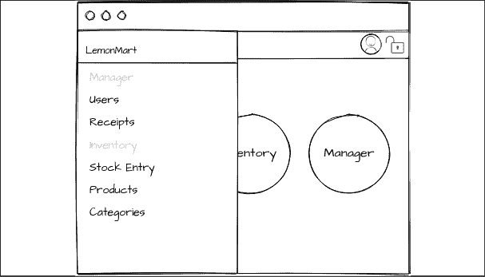

图 8.9：侧导航模拟图

让我们实现一个独立的组件来作为侧导航的代码，这样更容易维护：

1.  在应用程序的根目录下创建一个名为 `NavigationMenu` 的组件，带有内联模板和样式。

    侧导航在技术上不是必需的，直到用户登录后。然而，为了能够从 `AppComponent` 中触发侧导航菜单，我们需要能够从那里触发它。由于这个组件将是简单的，我们将急切地加载它。为了实现这一点，Angular 确实有一个动态组件加载模式，它具有很高的实现开销，只有在节省了数百千字节的情况下才有意义。

    `SideNav` 将从工具栏触发，并附带一个 `<mat-sidenav-container>` 父容器，该容器本身托管 `SideNav` 以及应用程序的内容。因此，我们需要通过将 `<router-outlet>` 放置在 `<mat-sidenav-content>` 中来渲染所有应用程序内容。

1.  在`AppComponent`中定义一些样式，以确保 Web 应用将扩展以填充整个页面，并在桌面和移动场景中保持适当的可滚动性：

    ```js
    **src/app/app.component.ts**
    styles: [
      `
        .app-container {
          display: flex;
          flex-direction: column;
          position: absolute;
          top: 0;
          bottom: 0;
          left: 0;
          right: 0;
        }
        .app-is-mobile .app-toolbar {
          position: fixed;
          z-index: 2;
        }
        .app-sidenav-container {
          flex: 1;
        }
        .app-is-mobile .app-sidenav-container {
          flex: 1 0 auto;
        }
        mat-sidenav {
          width: 200px;
        }
        .image-cropper {
          width: 40px;
          height: 40px;
          position: relative;
          overflow: hidden;
          border-radius: 50%;
          margin-top: -8px;
        }
      `,
    ], 
    ```

1.  在`AppComponent`中注入 Angular Flex Layout 的`MediaObserver`服务。同时实现`OnInit`和`OnDestroy`，初始化`SubSink`，并添加一个名为`opened`的布尔属性：

    ```js
    **src/app/app.component.ts**
    import { MediaObserver } from '@angular/flex-layout'
    export class AppComponent implements **OnInit, OnDestroy** {
      **private subs = new SubSink()**
     **opened: boolean**
      constructor(
        ...
     **public media: MediaObserver**
      ) {
      ...
      }
      ngOnDestroy() {
        this.subs.unsubscribe()
      }
      ngOnInit(): void {
        throw new Error('Method not implemented.')
      }
    } 
    ```

    为了自动确定侧导航的打开/关闭状态，我们需要监控媒体观察器和认证状态。当用户登录时，我们希望显示侧导航，当用户注销时隐藏它。我们可以通过将`opened`设置为`authStatus$.isAuthenticated`的值来实现这一点。然而，如果我们只考虑`isAuthenticated`，并且用户在移动设备上，我们将创建一个不太理想的用户体验。通过监控媒体观察器的`mediaValue`，我们可以检查屏幕尺寸是否设置为超小，或`xs`；如果是这样，我们可以保持侧导航关闭。

1.  更新`ngOnInit`以实现动态侧导航打开/关闭逻辑：

    ```js
    **src/app/app.component.ts**
      ngOnInit() {
        this.subs.sink = combineLatest([
          this.media.asObservable(),
          this.authService.authStatus$,
        ])
          .pipe(
            tap(([mediaValue, authStatus]) => {
              if (!authStatus?.isAuthenticated) {
                this.opened = false
              } else {
                if (mediaValue[0].mqAlias === 'xs') {
                  this.opened = false
                } else {
                  this.opened = true
                }
              }
            })
          )
          .subscribe()
      } 
    ```

    通过监控媒体和`authStatus$`流，我们可以考虑未经认证的场景，即使有足够的屏幕空间，侧导航也不应该打开。

1.  使用响应式的`SideNav`更新模板，在移动场景中滑过内容，在桌面场景中将内容推到一边：

    ```js
    **src/app/app.component.ts**
    ...
    // prettier-ignore
    template: `
      **<div class="app-container">**
      <mat-toolbar color="primary" fxLayoutGap="8px"
        **class="app-toolbar"**
        **[class.app-is-mobile]="media.isActive('xs')"**
        *ngIf="{
          status: authService.authStatus$ | async,
          user: authService.currentUser$ | async
        } as auth;"
      >
        <button *ngIf="auth?.status?.isAuthenticated"
          mat-icon-button **(click)="sidenav.toggle()"**
        >
          <mat-icon>menu</mat-icon>
        </button>
        ...
      </mat-toolbar>
      **<mat-sidenav-container class="app-sidenav-container">**
        **<mat-sidenav #sidenav**
          **[mode]="media.isActive('xs') ? 'over' : 'side'"**
          **[fixedInViewport]="media.isActive('xs')"**
          **fixedTopGap="56" [(opened)]="opened"**
        **>**
          **<app-navigation-menu></app-navigation-menu>**
     **</mat-sidenav>**
     **<mat-sidenav-content>**
          <router-outlet></router-outlet>
        **</mat-sidenav-content>**
     **</mat-sidenav-container>**
     **</div>**
    `, 
    ```

    上述模板利用了之前注入的 Angular Flex Layout 媒体观察器来实现响应式实现。

    你可以在模板上方使用`// prettier-ignore`指令来防止 Prettier 将你的模板拆分成太多行，这在某些条件下可能会损害可读性，类似于这种情况。

    我们将在`NavigationMenuComponent`中实现导航链接。我们的应用程序中的链接数量可能会随着时间的推移而增长，并受到各种基于角色的业务规则的影响。因此，如果我们将这些链接实现为`app.component.ts`，我们可能会使该文件变得过大。此外，我们不希望`app.component.ts`经常更改，因为那里的更改可能会影响整个应用程序。在单独的组件中实现链接是一种良好的做法。

1.  在`NavigationMenuComponent`中实现导航链接：

    ```js
    **src/app/navigation-menu/navigation-menu.component.ts**
    ...
      styles: [
        `
          .active-link {
            font-weight: bold;
            border-left: 3px solid green;
          }
        `,
      ],
      template: `
        <mat-nav-list>
          <h3 matSubheader>Manager</h3>
          <a mat-list-item
            routerLinkActive="active-link"
            routerLink="/manager/users">
              Users
          </a>
          <a mat-list-item
            routerLinkActive="active-link"
            routerLink="/manager/receipts">
              Receipts
          </a>
          <h3 matSubheader>Inventory</h3>
          <a mat-list-item
            routerLinkActive="active-link"
            routerLink="/inventory/stockEntry">
              Stock Entry
          </a>
          <a mat-list-item
            routerLinkActive="active-link"
            routerLink="/inventory/products">
              Products
          </a>
          <a mat-list-item
            routerLinkActive="active-link"
            routerLink="/inventory/categories">
              Categories
          </a>
          <h3 matSubheader>Clerk</h3>
          <a mat-list-item
            routerLinkActive="active-link"
            routerLink="/pos">
              POS
          </a>
        </mat-nav-list>
      `,
    ... 
    ```

`<mat-nav-list>`在功能上等同于`<mat-list>`，因此你可以使用`MatList`的文档来布局。在此观察**经理**、**库存**和**职员**的`subheaders`：

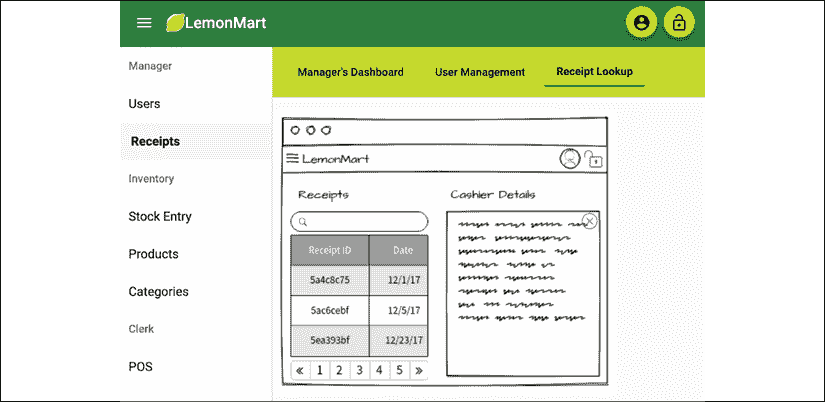

图 8.10：显示桌面设备上收据查找的经理仪表板

`routerLinkActive="active-link"`突出显示所选的**收据**路由，如前述截图所示。

此外，你可以看到在移动设备上的外观和行为差异如下：

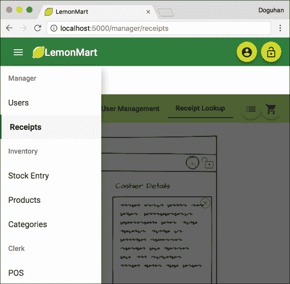

图 8.11：显示移动设备上收据查找的经理仪表板

接下来，让我们实现基于角色的路由。

# 使用守卫实现基于角色的路由

这是您应用程序最基本和最重要的部分。通过懒加载，我们确保只加载最少的资源以使用户能够登录。

一旦用户登录，他们应该根据用户角色被路由到适当的登录屏幕，这样他们就不会猜测如何使用应用程序。例如，收银员只需要访问销售点（POS）来结账客户，所以他们可以自动被路由到该屏幕。

以下是一个 POS 屏幕的模拟图：

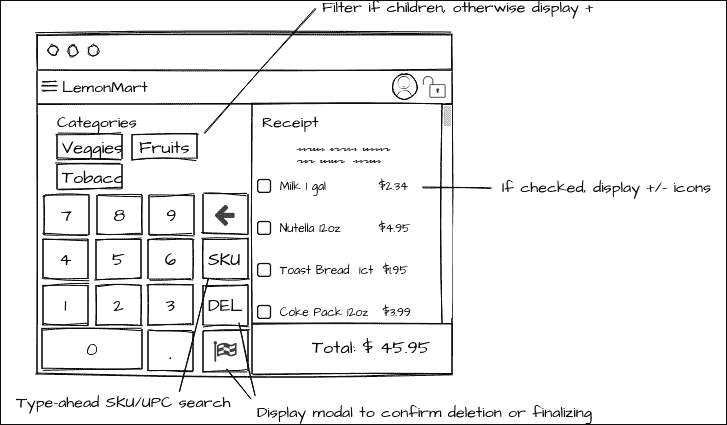

图 8.12：POS 屏幕模拟图

通过更新`LoginComponent`确保用户在登录后能够被路由到适当的页面。

更新`login`逻辑，在名为`homeRoutePerRole`的函数中按角色路由：

```js
**app/src/login/login.component.ts**
async login(submittedForm: FormGroup) {
  ...
    this.router.navigate([
      this.redirectUrl ||
      **this.homeRoutePerRole(user.role as Role)**
    ])
  ...
}
**private homeRoutePerRole(role: Role) {**
 **switch (role) {**
 **case Role.Cashier:**
 **return '/pos'**
 **case Role.Clerk:**
 **return '/inventory'**
 **case Role.Manager:**
 **return '/manager'**
 **default:**
 **return '/user/profile'**
 **}**
**}** 
```

同样，收银员和管理员会被路由到他们的登录屏幕以访问他们完成任务所需的功能，如前所述。由于我们已经实现了默认的管理员角色，相应的登录体验将自动启动。硬币的另一面是有意或无意尝试访问用户不应访问的路由。在下一节中，你将了解可以帮助检查认证甚至在表单渲染之前加载所需数据的路由守卫。

## 路由守卫

路由守卫使逻辑的进一步解耦和重用成为可能，并提供了对组件生命周期的更多控制。

这里是您最可能使用的四个主要守卫：

1.  `CanActivate`和`CanActivateChild`：用于检查路由的认证访问

1.  `CanDeactivate`：用于在离开路由之前请求权限

1.  `Resolve`：允许从路由参数预取数据

1.  `CanLoad`: 允许在加载功能模块资源之前执行自定义逻辑

参考以下章节以了解如何利用`CanActivate`和`CanLoad`。`Resolve`守卫将在第十一章*配方 - 可重用性、路由和缓存*中介绍。

## 认证守卫

认证守卫通过允许或禁止在模块加载之前或在进行任何不适当的数据请求之前意外导航到功能模块或组件，从而实现良好的用户体验。例如，当管理员登录时，他们会被自动路由到`/manager/home`路径。浏览器将缓存此 URL，因此收银员意外导航到相同的 URL 是完全可能的。Angular 不知道特定的路由是否对用户可访问，如果没有`AuthGuard`，它将愉快地渲染管理员的首页并触发会导致失败的服务器请求。

无论您的前端实现多么健壮，您实现的每个 REST API 都应该在服务器端得到适当的保护。

让我们更新路由器，以便在没有经过认证的用户激活`ProfileComponent`之前，`ManagerModule`不会加载，除非管理员使用`AuthGuard`登录：

1.  实现一个 `AuthGuard` 服务：

    ```js
    **src/app/auth/auth-guard.service.ts**
    import { Injectable } from '@angular/core'
    import {
      ActivatedRouteSnapshot,
      CanActivate,
      CanActivateChild,
      CanLoad,
      Route,
      Router,
      RouterStateSnapshot,
    } from '@angular/router'
    import { Observable } from 'rxjs'
    import { map, take } from 'rxjs/operators'
    import { UiService } from '../common/ui.service'
    import { Role } from './auth.enum'
    import { AuthService } from './auth.service'
    @Injectable({
      providedIn: 'root',
    })
    export class AuthGuard implements CanActivate, CanActivateChild, CanLoad {
      constructor(
        protected authService: AuthService,
        protected router: Router,
        private uiService: UiService
      ) {}
      canLoad(route: Route):
        boolean | Observable<boolean> | Promise<boolean> {
          return this.checkLogin()
      }
      canActivate(
        route: ActivatedRouteSnapshot,
        state: RouterStateSnapshot
      ): boolean | Observable<boolean> | Promise<boolean> {
        return this.checkLogin(route)
      }
      canActivateChild(
        childRoute: ActivatedRouteSnapshot,
        state: RouterStateSnapshot
      ): boolean | Observable<boolean> | Promise<boolean> {
        return this.checkLogin(childRoute)
      }
      protected checkLogin(route?: ActivatedRouteSnapshot):
        Observable<boolean> {
        return this.authService.authStatus$.pipe(
          map((authStatus) => {
            const roleMatch = this.checkRoleMatch(
              authStatus.userRole, route
            )
            const allowLogin = authStatus.isAuthenticated && roleMatch
            if (!allowLogin) {
              this.showAlert(authStatus.isAuthenticated, roleMatch)
              this.router.navigate(['login'], {
                queryParams: {
                  redirectUrl: this.getResolvedUrl(route),
                },
              })
            }
            return allowLogin
          }),
          take(1) // complete the observable for the guard to work
        )
      }
      private checkRoleMatch(
        role: Role,
        route?: ActivatedRouteSnapshot
      ) {
        if (!route?.data?.expectedRole) {
          return true
        }
        return role === route.data.expectedRole
      }
      private showAlert(isAuth: boolean, roleMatch: boolean) {
        if (!isAuth) {
          this.uiService.showToast('You must login to continue')
        }
        if (!roleMatch) {
          this.uiService.showToast(
            'You do not have the permissions to view this resource'
          )
        }
      }
      getResolvedUrl(route?: ActivatedRouteSnapshot): string {
        if (!route) {
          return ''
        }
        return route.pathFromRoot
          .map((r) => r.url.map((segment) => segment.toString())
          .join('/'))
          .join('/')
          .replace('//', '/')
      }
    } 
    ```

1.  使用 `CanLoad` 守卫来防止加载懒加载的模块，例如管理员的模块：

    ```js
    **src/app/app-routing.module.ts**
    ...
    {
      path: 'manager',
      loadChildren: () => import('./manager/manager.module')
        .then((m) => m.ManagerModule), 
      **canLoad: [AuthGuard],**
    },
    ... 
    ```

    在这种情况下，当 `ManagerModule` 被加载时，`AuthGuard` 将在 `canLoad` 事件期间被激活，`checkLogin` 函数将验证用户的认证状态。如果守卫返回 `false`，则模块将不会加载。此时，我们没有元数据来检查用户的角色。

1.  使用 `CanActivate` 守卫来防止激活单个组件，例如用户的 `profile`：

    ```js
    **src/app/user/user-routing.module.ts**
    ...
    { 
      path: 'profile', component: ProfileComponent, 
      **canActivate: [AuthGuard]** 
    },
    ... 
    ```

    在 `user-routing.module.ts` 的情况下，`AuthGuard` 在 `canActivate` 事件期间被激活，`checkLogin` 函数控制此路由可以导航到的位置。由于用户正在查看自己的个人资料，因此在这里不需要检查用户的角色。

1.  使用具有 `expectedRole` 属性的 `CanActivate` 或 `CanActivateChild` 来防止其他用户激活组件，例如 `ManagerHomeComponent`：

    ```js
    **src/app/mananger/manager-routing.module.ts**
    ...
      {
        path: 'home',
        component: ManagerHomeComponent,
        **canActivate: [AuthGuard],**
     **data: {**
     **expectedRole: Role.Manager,**
     **},**
      },
      {
        path: 'users',
        component: UserManagementComponent,
        **canActivate: [AuthGuard],**
     **data: {**
     **expectedRole: Role.Manager,**
     **},**
      },
      {
        path: 'receipts',
        component: ReceiptLookupComponent,
        **canActivate: [AuthGuard],**
     **data: {**
     **expectedRole: Role.Manager,**
     **},**
      },
    ... 
    ```

在 `ManagerModule` 内部，我们可以验证用户是否有权访问特定的路由。我们可以通过在路由定义中定义一些元数据来实现，例如 `expectedRole`，它将通过 `canActivate` 事件传递给 `checkLogin` 函数。如果用户已认证但角色不匹配 `Role.Manager`，`AuthGuard` 将返回 `false` 并阻止导航。

接下来，我们将介绍一些使测试通过的技术。

## 身份验证服务模拟和通用测试提供者

我们需要在 `common.testing.ts` 中使用 `commonTestingProviders` 函数提供类似 `commonTestingModules` 中提到的模式的服务模拟，例如 `AuthService` 或 `UiService`。这样，我们就不必反复模拟相同的对象。

让我们使用来自 `angular-unit-test-helper` 的 `autoSpyObj` 函数创建间谍对象，并回顾一些不那么明显的更改，以使测试通过：

1.  更新 `common.testing.ts` 中的 `commonTestingProviders`：

    ```js
    **src/app/common/common.testing.ts**
    import { autoSpyObj } from 'angular-unit-test-helper'
    export const commonTestingProviders: any[] = [
      { provide: AuthService, useValue: autoSpyObj(AuthService) },
      { provide: UiService, useValue: autoSpyObj(UiService) }, 
    ] 
    ```

1.  观察在 `app.component.spec.ts` 中为 `MediaObserver` 提供的模拟，并将其更新为使用 `commonTestingModules`：

    ```js
    **src/app/app.component.spec.ts**
    ...
      TestBed.configureTestingModule({
        **imports: commonTestingModules,**
        providers: commonTestingProviders.concat([
          **{ provide: MediaObserver, useClass: MediaObserverFake },**
    ... 
    ```

    看看 `commonTestingProviders` 数组是如何与针对 `app.component.ts` 的特定模拟进行连接的；我们的新模拟应自动应用。

1.  更新 `LoginComponent` 的规范文件以利用 `commonTestingModules` 和 `commonTestingProviders`：

    ```js
    **src/app/login/login.component.spec.ts**
    ...
      TestBed.configureTestingModule({
        **imports: commonTestingModules,**
     **providers: commonTestingProviders,**
        declarations: [LoginComponent],
      }).compileComponents() 
    ```

1.  将此技术应用于所有依赖于 `AuthService` 和 `UiService` 的规范文件。

1.  值得注意的是，服务除外，例如在 `auth.service.spec.ts` 中，你不想使用测试替身。由于 `AuthService` 是被测试的类，请确保它按以下方式配置：

    ```js
    **src/app/auth/auth.service.spec.ts**
    ...
    TestBed.configureTestingModule({
      **imports: [HttpClientTestingModule],**
     **providers: [AuthService,** 
     **{ provide: UiService, useValue: autoSpyObj(UiService) }],**
    }) 
    ```

1.  使用类似的考虑更新 `ui.service.spec.ts`：

记住，不要继续前进，直到所有测试都通过！

# Firebase 身份验证配方

我们可以利用当前的认证设置并将其与真实的认证服务集成。对于本节，你需要一个免费的 Google 和 Firebase 账户。Firebase 是 Google 的综合移动开发平台：[`firebase.google.com`](https://firebase.google.com)。你可以创建一个免费账户来托管你的应用程序并利用 Firebase 认证系统。

Firebase 控制台，位于 [`console.firebase.google.com`](https://console.firebase.google.com)，允许你管理用户并发送密码重置邮件，而无需为你的应用程序实现后端。稍后，你可以利用 Firebase 函数以无服务器的方式实现 API。

首先，使用 Firebase 控制台将你的项目添加到 Firebase：


图 8.13：Firebase 控制台

1.  点击 **添加项目**

1.  提供你的项目名称

1.  为你的项目启用 Google Analytics

在尝试此操作之前创建一个 Google Analytics 账户可能会有所帮助，但它仍然可以工作。一旦你的项目创建完成，你应该能看到你的项目仪表板：


图 8.14：Firebase 项目概览

在左侧，标记为步骤 **1**，你可以看到一个菜单，其中包含你可以添加到项目中的工具和服务。在顶部，标记为步骤 **2**，你可以快速在项目之间切换。首先，你需要向你的项目添加一个应用程序。

## 添加一个应用程序

你的项目可以包含多个应用程序的发行版本，如网页、iOS 和 Android 版本。在本章中，我们只对添加一个网页应用程序感兴趣。

让我们开始吧：

1.  在你的项目仪表板上，点击网页应用程序按钮以添加一个应用程序，这在 *图 8.14* 中的步骤 **3** 有标记

1.  提供一个应用程序昵称

1.  选择设置 **Firebase Hosting** 的选项

1.  通过点击 **注册应用程序** 按钮继续

1.  跳过 **添加 Firebase SDK** 部分

1.  按照说明安装 Firebase CLI：

    ```js
    $ npm install -g firebase-tools 
    ```

1.  登录：

    ```js
    $ firebase login 
    ```

    确保你的当前目录是项目根文件夹。

1.  初始化你的项目：

    ```js
    $ firebase init 
    ```

1.  选择 **托管** 选项；不用担心，你以后可以添加更多功能

1.  选择你创建的项目作为默认项目，即 **lemon-mart-007**

1.  对于公共目录，输入 `dist/lemon-mart` 或你在 `angular.json` 文件中定义的 `outputPath`。

1.  说 **是** 以将其配置为单页应用程序。

    这将创建两个新的文件：`firebase.json` 和 `.firebaserc`。

1.  为生产构建你的项目：

    ```js
    $ npx ng build --prod 
    ```

    或者

    ```js
    $ npm run build:prod 
    ```

1.  现在，你可以通过执行以下命令来部署你的 Angular 应用程序：

    ```js
    $ firebase deploy 
    ```

你的网站应该可以在类似 [`lemon-mart-007.firebaseapp.com`](https://lemon-mart-007.firebaseapp.com) 的 URL 上访问，如终端所示。

将 `.firebase` 文件夹添加到 `.gitignore` 中，这样你就不需要提交你的缓存文件。其他两个文件，`firebase.json` 和 `.firebaserc`，可以安全提交。

可选地，使用 Firebase 控制台将你拥有的自定义域名连接到账户。

## 配置身份验证

现在，让我们配置身份验证。

在 Firebase 控制台中：

1.  从侧边导航中选择**身份验证**：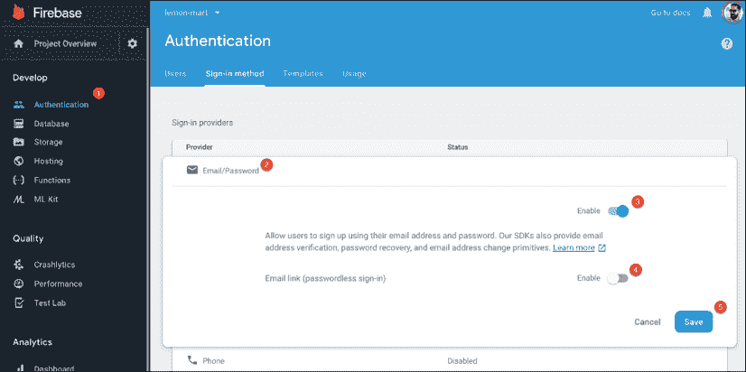

    图 8.15：Firebase 身份验证页面

1.  选择**电子邮件/密码**作为提供者

1.  启用它

1.  不要启用电子邮件链接

1.  保存你的配置

你现在可以看到用户管理控制台：

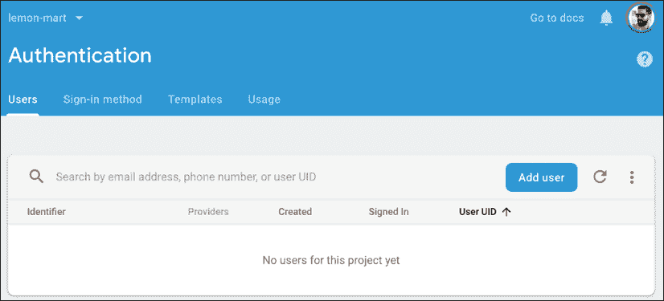

图 8.16：Firebase 用户管理控制台

它的操作相当直接且直观，所以我将把它留给你作为练习。

## 实现 Firebase 身份验证

让我们从向我们的应用程序添加 Angular Fire 开始，这是 Angular 的官方 Firebase 库：

```js
$ npx ng add @angular/fire 
```

按照 Angular Fire 的快速入门指南完成设置库与你的 Angular 项目的配置，你可以从 GitHub 上的 readme 文件中找到链接，链接为[`github.com/angular/angularfire2`](https://github.com/angular/angularfire2)。

1.  确保 Firebase 模块按照文档要求在`app.module.ts`中提供。

1.  确保你的 Firebase 配置对象在所有的`environment.ts`文件中。

    注意，在`environment.ts`文件中提供的任何信息都是公开信息。因此，当你将你的 Firebase API 密钥放在这个文件中时，它将是公开可用的。有很小的可能性，另一个开发者可能会滥用你的 API 密钥并增加你的账单。为了保护自己免受此类攻击，请查看 paachu 的这篇博客文章：*如何在 API 密钥公开可用的同时保护你的 Firebase 项目*，链接为[`medium.com/@impaachu/how-to-secure-your-firebase-project-even-when-your-api-key-is-publicly-available-a462a2a58843`](https://medium.com/@impaachu/how-to-secure-your-firebase-project-even-when-your-api-key-is-publicly-).

1.  创建一个新的`FirebaseAuthService`：

    ```js
    $ npx ng g s auth/firebaseAuth --lintFix 
    ```

1.  将服务文件重命名为`auth.firebase.service.ts`。

1.  一定要删除`{ providedIn: 'root' }`。

1.  通过扩展抽象身份验证服务来实现 Firebase 身份验证：

    ```js
    **src/app/auth/auth.firebase.service.ts**
    import { Injectable } from '@angular/core'
    import { AngularFireAuth } from '@angular/fire/auth'
    import { User as FirebaseUser } from 'firebase'
    import { Observable, Subject } from 'rxjs'
    import { map } from 'rxjs/operators'
    import { IUser, User } from '../user/user/user'
    import { Role } from './auth.enum'
    import {
      AuthService,
      IAuthStatus,
      IServerAuthResponse,
      defaultAuthStatus,
    } from './auth.service'
    interface IJwtToken {
      email: string
      iat: number
      exp: number
      sub: string
    }
    @Injectable()
    export class FirebaseAuthService extends AuthService {
      constructor(private afAuth: AngularFireAuth) {
        super()
      }
      protected authProvider(
        email: string,
        password: string
      ): Observable<IServerAuthResponse> {
        const serverResponse$ = new Subject<IServerAuthResponse>()
        this.afAuth.signInWithEmailAndPassword(email, password).then(
          (res) => {
            const firebaseUser: FirebaseUser | null = res.user
            firebaseUser?.getIdToken().then(
              (token) => serverResponse$.next(
                { accessToken: token } as IServerAuthResponse
              ),
              (err) => serverResponse$.error(err)
            )
          },
          (err) => serverResponse$.error(err)
        )
        return serverResponse$
      }
      protected transformJwtToken(token: IJwtToken): IAuthStatus {
        if (!token) {
          return defaultAuthStatus
        }
        return {
          isAuthenticated: token.email ? true : false,
          userId: token.sub,
          userRole: Role.None,
        }
      }
      protected getCurrentUser(): Observable<User> {
        return this.afAuth.user.pipe(map(this.transformFirebaseUser))
      }
      private transformFirebaseUser(firebaseUser: FirebaseUser): User
      {
        if (!firebaseUser) {
          return new User()
        }
        return User.Build({
          name: {
            first: firebaseUser?.displayName?.split(' ')[0] ||
              'Firebase',
            last: firebaseUser?.displayName?.split(' ')[1] || 'User',
          },
          picture: firebaseUser.photoURL,
          email: firebaseUser.email,
          _id: firebaseUser.uid,
          role: Role.None,
        } as IUser)
      }
      logout() {
        if (this.afAuth) {
          this.afAuth.signOut()
        }
        this.clearToken()
        this.authStatus$.next(defaultAuthStatus)
      }
    } 
    ```

    如你所见，我们只需要实现我们已建立的认证代码和 Firebase 认证方法之间的差异。我们不需要复制任何代码，甚至将 Firebase 的`user`对象转换成了我们应用程序的内部用户对象。

1.  要使用 Firebase 身份验证而不是内存身份验证，更新`app.module.ts`中的`AuthService`提供者：

    ```js
    **src/app/app.module.ts**
      {
        provide: AuthService,
        useClass: **FirebaseAuthService**,
      }, 
    ```

    完成步骤后，从 Firebase 身份验证控制台添加新用户，你应该能够使用真实身份验证登录。

    总是要确保在互联网上传输任何类型的**个人身份信息**（**PII**）或敏感信息（如密码）时使用 HTTPS。否则，你的信息可能会被第三方服务器记录或被恶意行为者捕获。

1.  再次确保在继续之前更新你的单元测试：

    ```js
    **src/app/auth/auth.firebase.service.spec.ts**
    import { AngularFireAuth } from '@angular/fire/auth'
    import { UiService } from '../common/ui.service'
    import { FirebaseAuthService } from './auth.firebase.service'
    TestBed.configureTestingModule({
      imports: [**HttpClientTestingModule**],
      providers: [
        **FirebaseAuthService,**
     **{ provide: UiService, useValue: autoSpyObj(UiService) },**
     **{ provide: AngularFireAuth,** 
     **useValue: autoSpyObj(AngularFireAuth)** 
     **},**
      ],
    }) 
    ```

停止！在部署真实身份验证方法之前，从你的项目中移除`fake-jwt-sign`包。

恭喜，你的应用程序已经集成了 Firebase！接下来，让我们来了解服务工厂，它可以帮助你动态地切换抽象类的提供者。

# 使用工厂提供服务

你可以在加载时动态选择提供者，因此，你不必更改代码来在认证方法之间切换，你可以参数化环境变量，这样不同的构建可以有不同的认证方法。这在编写针对你的应用程序的自动化 UI 测试时特别有用，在测试中，真实的认证可能很难处理，甚至不可能处理。

首先，我们将在`environment.ts`中创建一个`enum`来帮助我们定义我们的选项，然后我们将使用该`enum`在我们的应用程序的引导过程中选择一个认证提供者。

让我们开始吧：

1.  创建一个名为`AuthMode`的新`enum`：

    ```js
    **src/app/auth/auth.enum.ts**
    export enum AuthMode {
      InMemory = 'In Memory',
      CustomServer = 'Custom Server',
      Firebase = 'Firebase',
    } 
    ```

1.  在`environment.ts`中添加一个`authMode`属性：

    ```js
    **src/environments/environment.ts**
    ...
      authMode: AuthMode.**InMemory**,
    ...
    **src/environments/environment.prod.ts**
    ...
      authMode: AuthMode.**Firebase**,
    ... 
    ```

1.  在`auth/auth.factory.ts`的新文件中创建一个`authFactory`函数：

    ```js
    **src/app/auth/auth.factory.ts**
    export function authFactory(afAuth: AngularFireAuth) {
      switch (environment.authMode) {
        case AuthMode.InMemory:
          return new InMemoryAuthService()
        case AuthMode.Firebase:
          return new FirebaseAuthService(afAuth)
        case AuthMode.CustomServer:
          throw new Error('Not yet implemented')
      }
    } 
    ```

    注意，工厂必须导入任何依赖的服务。

1.  在`app.module.ts`中更新`AuthService`提供者以使用工厂：

    ```js
    **src/app/app.module.ts**
      providers: [
        {
          provide: AuthService,
          **useFactory: authFactory,**
     **deps: [AngularFireAuth],**
        }, 
    ```

注意，你可以从`AppModule`中移除`InMemoryAuthService`和`FirebaseAuthService`的导入。

在此配置就绪后，无论何时构建你的应用程序用于本地开发，你都将使用内存中的认证服务，而生产（或 prod）构建将使用 Firebase 认证服务。

# 摘要

现在，你应该熟悉了如何创建高质量的认证体验。在本章中，我们定义了一个用户对象，我们可以从中填充或序列化为 JSON 对象，应用面向对象类设计和 TypeScript 运算符以安全地处理数据。

我们利用面向对象设计原则，使用继承和抽象类来实现一个基类认证服务，展示了开放/封闭原则。

我们已经涵盖了基于令牌的认证和 JWTs 的基础知识，这样你就不会泄露任何关键用户信息。你了解到缓存和 HTTP 拦截器是必要的，这样用户就不必在每次请求时输入他们的登录信息。在此之后，我们实现了两个不同的认证提供者，一个是内存中的，另一个是 Firebase。

然后，我们设计了一个很好的条件导航体验，你可以通过将基本元素复制到你的项目中并实现你自己的认证提供者来在你的应用程序中使用。我们创建了一个可重用的 UI 服务，这样你就可以方便地将警报注入到应用程序的流程控制逻辑中。

最后，我们涵盖了路由守卫，以防止用户误入未经授权使用的屏幕，并重申了你的应用程序的真实安全性应该在实际服务器端实现。你看到了如何使用工厂为不同的环境动态提供不同的认证提供者。

在下一章中，我们将稍微转换一下方向，学习使用 Docker 进行容器化。Docker 允许强大的工作流程，可以极大地提高开发体验，同时允许你将服务器配置作为代码实现，为开发者最喜欢的借口敲响最后的丧钟：当他们软件出错时：“但是在我的机器上它运行正常！”

# 进一步阅读

+   *盐值密码散列 - 正确的做法，Defuse 安全*，2019，[`crackstation.net/hashing-security.htm`](https://crackstation.net/hashing-security.htm)。

+   *面向对象编程*，[`en.wikipedia.org/wiki/Object-oriented_programming`](https://en.wikipedia.org/wiki/Object-oriented_programming)。

+   *TypeScript 类*，[`www.typescriptlang.org/docs/handbook/classes.html`](https://www.typescriptlang.org/docs/handbook/classes.html)。

+   *TypeScript 基本类型*，[`www.typescriptlang.org/docs/handbook/basic-types.html`](https://www.typescriptlang.org/docs/handbook/basic-types.html)。

+   *TypeScript 高级类型*，[`www.typescriptlang.org/docs/handbook/advanced-types.html`](https://www.typescriptlang.org/docs/handbook/advanced-types.html)。

+   *TypeScript 3.7 功能*，[`www.typescriptlang.org/docs/handbook/release-notes/typescript-3-7.html`](https://www.typescriptlang.org/docs/handbook/release-notes/typescript-3-7.html)。

+   *Angular NgIf 指令*，[`angular.io/api/common/NgIf`](https://angular.io/api/common/NgIf)。

+   *认证一般指南*，[`github.com/OWASP/CheatSheetSeries/blob/master/cheatsheets/Authentication_Cheat_Sheet.md`](https://github.com/OWASP/CheatSheetSeries/blob/master/cheatsheets/Authentication_Cheat_Sheet.md)。

+   *即使 API 密钥公开可用，如何保护你的 Firebase 项目*，paachu，2019，[`medium.com/@impaachu/how-to-secure-your-firebase-project-even-when-your-api-key-is-publicly-available-a462a2a58843`](https://medium.com/@impaachu/how-to-secure-your-firebase-project-even-when-your-api-key-is-publicly-available-a462a2a58843)。

# 问题

尽可能地回答以下问题，以确保你已理解本章的关键概念，而无需使用 Google 搜索。你需要帮助回答这些问题吗？请参阅*附录 D*，*自我评估答案*，在线访问[`static.packt-cdn.com/downloads/9781838648800_Appendix_D_Self-Assessment_Answers.pdf`](https://static.packt-cdn.com/downloads/9781838648800_Appendix_D_Self-Assessment_Answers.pdf)或访问[`expertlysimple.io/angular-self-assessment`](https://expertlysimple.io/angular-self-assessment)。

1.  在途和静止状态的安全是什么？

1.  认证和授权之间有什么区别？

1.  解释继承和多态。

1.  抽象类是什么？

1.  抽象方法是什么？

1.  解释`AuthService`如何遵循开放/封闭原则。

1.  JWT 如何验证你的身份？

1.  RxJS 的`combineLatest`和`merge`操作符之间有什么区别？

1.  路由守卫是什么？

1.  服务工厂允许你做什么？
