# 第十一章：配方 – 可重用性、路由和缓存

在接下来的两章中，我们将完成 LemonMart 的主要实现，并完善我们对路由优先方法的覆盖。在本章中，我将通过创建一个可重用且可路由的组件，同时支持数据绑定，来强化解耦组件架构的概念。我们使用 Angular 指令来减少样板代码，并利用类、接口、枚举、验证器和管道，通过 TypeScript 和 ES 特性最大化代码重用。

此外，我们还将创建一个在架构上可扩展且支持响应式设计的多步骤表单。然后，我们将通过引入柠檬评分器和封装名称对象的可重用表单部分来区分用户控件和组件。

确保在实现本章中提到的配方时，你的 **lemon-mart-server** 正在运行。有关更多信息，请参阅 *第十章*，*RESTful API 和全栈实现*。

本章内容丰富。它以配方格式组织，因此当你正在处理项目时，可以快速参考特定的实现。我将涵盖实现的结构、设计和主要组件。我将突出显示重要的代码片段，以解释解决方案是如何组合在一起的。利用你迄今为止所学到的知识，我期望读者能够填写常规实现和配置细节。然而，如果你遇到困难，始终可以参考 GitHub 项目。

在本章中，你将学习以下主题：

+   使用缓存服务响应的 HTTP PUT 请求

+   多步骤响应式表单

+   使用指令重用重复模板行为

+   可扩展的表单架构，具有可重用表单部分

+   输入掩码

+   使用 `ControlValueAccessor` 的自定义控件

+   使用网格列表布局

样本代码的最新版本可在 GitHub 上找到，链接将在稍后提供。该存储库包含代码的最终和完成状态。你可以在本章末尾通过查看 `projects` 文件夹下的代码快照来验证你的进度。

为了准备本章内容，请执行以下操作：

1.  克隆 [`github.com/duluca/lemon-mart`](https://github.com/duluca/lemon-mart) 上的存储库。

1.  在根目录下执行 `npm install` 以安装依赖项。

1.  本章的代码示例位于以下子文件夹下：

    ```js
    projects/ch11 
    ```

1.  要运行本章的 Angular 应用程序，请执行以下命令：

    ```js
    npx ng serve ch11 
    ```

1.  要运行本章的 Angular 单元测试，请执行以下命令：

    ```js
    npx ng test ch11 --watch=false 
    ```

1.  要运行本章的 Angular e2e 测试，请执行以下命令：

    ```js
    npx ng e2e ch11 
    ```

1.  要构建本章的生产就绪 Angular 应用程序，请执行以下命令：

    ```js
    npx ng build ch11 --prod 
    ```

    注意，存储库根目录下的 `dist/ch11` 文件夹将包含编译结果。

请注意，书中或 GitHub 上的源代码可能并不总是与 Angular CLI 生成的代码相匹配。由于生态系统不断演变，书中代码与 GitHub 上代码之间的实现也可能存在细微差异。随着时间的推移，示例代码发生变化是自然的。在 GitHub 上，您可能会找到更正、支持库新版本的修复或多种技术的并排实现，供读者观察。读者只需实现书中推荐的理想解决方案即可。如果您发现错误或有问题，请创建一个 issue 或提交一个 pull request 到 GitHub，以惠及所有读者。

你可以在*附录 C*，*保持 Angular 和工具常青*中了解更多关于更新 Angular 的信息。您可以从[`static.packt-cdn.com/downloads/9781838648800_Appendix_C_Keeping_Angular_and_Tools_Evergreen.pdf`](https://static.packt-cdn.com/downloads/9781838648800_Appendix_C_Keeping_Angular_and_Tools_Evergreen.)或[`expertlysimple.io/stay-evergreen`](https://expertlysimple.io/stay-evergreen)在线找到此附录。

让我们从实现一个用户服务来检索数据开始，这样我们就可以构建一个表单来显示和编辑个人资料信息。稍后，我们将重构此表单以抽象出其可重用部分。

# 使用 GET 实现用户服务

为了实现用户个人资料，我们需要一个可以执行`IUser`上的 CRUD 操作的服务。我们将创建一个实现以下接口的用户服务：

```js
export interface IUserService {
  getUser(id: string): Observable<IUser>
  updateUser(id: string, user: IUser): Observable<IUser>
  getUsers(
    pageSize: number,
    searchText: string,
    pagesToSkip: number
  ): Observable<IUsers>
} 
```

在创建服务之前，请确保启动**lemon-mart-server**并将应用程序的`AuthMode`设置为`CustomServer`。

在本节中，我们将实现`getUser`和`updateUser`函数。我们将在*第十二章*，*食谱 – 主/详细信息，数据表和 NgRx*中实现`getUsers`，以支持数据表分页。

首先创建用户服务：

1.  在`src/app/user/user`下创建一个`UserService`：

1.  从前面的片段中声明`IUserService`接口，不包括`getUsers`函数。

1.  使用`CacheService`扩展`UserService`类并实现`IUserService`。

1.  如下所示在构造函数中注入`HttpClient`：

    ```js
    **src/app/user/user/user.service.ts**
    export interface IUserService {
      getUser(id: string): Observable<IUser>
      updateUser(id: string, user: IUser): Observable<IUser>
    }
    @Injectable({
      providedIn: 'root',
    })
    export class UserService extends CacheService implements IUserService {
      constructor() {
        super()
      }
      getUser(id: string): Observable<IUser> {
        throw new Error('Method not implemented.')
      }
      updateUser(id: string, user: IUser): Observable<IUser> {
        throw new Error('Method not implemented.')
      }
    } 
    ```

1.  如下所示实现`getUser`函数：

    ```js
    src/app/user/user/user.service.ts
    getUser(id: string | null): Observable<IUser> {
      if (id === null) {
        return throwError('User id is not set')
      }
      return this.httpClient.get<IUser>(
        `${environment.baseUrl}/v2/user/${id}`
      )
    } 
    ```

我们提供了一个`getUser`函数，可以加载任何用户的个人资料信息。请注意，此函数的安全性由服务器实现中的认证中间件提供。请求者可以获取自己的个人资料，或者他们需要是管理员。我们将在本章后面使用`getUser`与解析守卫。

## 实现带有缓存的 PUT

实现`updateUser`，它接受一个实现了`IUser`接口的对象，因此数据可以发送到 PUT 端点：

```js
**src/app/user/user/user.service.ts**
  updateUser(id: string, user: IUser): Observable<IUser> {
    if (id === '') {
      return throwError('User id is not set')
    }
    // cache user data in case of errors
    this.setItem('draft-user', Object.assign(user, { _id: id }))
    const updateResponse$ = this.httpClient
      .put<IUser>(`${environment.baseUrl}/v2/user/${id}`, user)
      .pipe(**map(User.Build)**, catchError(transformError))
    updateResponse$.subscribe(
      (res) => {
        this.authService.currentUser$.next(res)
        this.removeItem('draft-user')
      },
      (err) => throwError(err)
    )
    return updateResponse$
  } 
```

注意使用缓存服务中的 `setItem` 来保存用户输入的数据，以防 `put` 调用失败。当调用成功时，我们使用 `removeItem` 删除缓存数据。同时注意我们如何使用 `map(User.Build)` 将来自服务器的用户作为 `User` 对象进行润滑，这调用 `class User` 的构造函数。

“Hydrate”是一个常用术语，指的是用数据库或网络请求中的数据填充一个对象。例如，我们在组件之间传递或从服务器接收的 `User` JSON 对象符合 `IUser` 接口，但它不是 `class User` 类型。我们使用 `toJSON` 方法将对象序列化为 JSON。当我们从 JSON 润滑并实例化一个新对象时，我们执行相反的操作并反序列化数据。

需要强调的是，在传递数据时，你应该始终坚持使用接口，而不是像 `User` 这样的具体实现。这是 **SOLID** 原则中的 **D**（依赖倒置原则）。依赖于具体实现会带来很多风险，因为它们经常变化，而像 `IUser` 这样的抽象很少会变化。毕竟，你不会直接将灯泡焊接在墙上的电线中。相反，你首先将灯泡焊接在插头上，然后使用插头获取所需的电力。

完成此代码后，`UserService` 现在可以用于基本的 CRUD 操作。

# 多步骤响应式表单

总体来说，表单与你的应用程序的其他部分不同，它们需要特殊的架构考虑。我不建议过度设计你的表单解决方案，使用动态模板或启用路由的组件。从可维护性和易于实施的角度来看，创建一个巨大的组件比使用上述一些策略和过度设计更好。

我们将实现一个多步骤输入表单，在单个组件中捕获用户配置文件信息。我将在本章的“可重用表单部分和可扩展性”部分介绍我推荐的将表单拆分为多个组件的技术。

由于表单的实现在这部分和本章后面的内容中变化很大，你可以在 GitHub 上找到初始版本的代码，地址为 `projects/ch11/src/app/user/profile/profile.initial.component.ts` 和 `projects/ch11/src/app/user/profile/profile.initial.component.html`。

我们还将使用媒体查询使这个多步骤表单对移动设备响应：

1.  让我们从添加一些辅助数据开始，这些数据将帮助我们显示带有选项的输入表单：

    ```js
    **src/app/user/profile/data.ts**
    export interface IUSState {
      code: string
      name: string
    }
    export function USStateFilter(value: string): IUSState[] {
      return USStates.filter((state) => {
        return (
          (state.code.length === 2 && 
           state.code.toLowerCase() === value.toLowerCase()) ||
           state.name.toLowerCase().indexOf(value.toLowerCase()) === 0
        )
      })
    }
    const USStates = [
      { code: 'AK', name: 'Alaska' },
      { code: 'AL', name: 'Alabama' },
      ...
      { code: 'WY', name: 'Wyoming' },
    ] 
    ```

1.  将新的验证规则添加到 `common/validations.ts`:

    ```js
    **src/app/common/validations.ts**
    ...
    export const OptionalTextValidation = [Validators.minLength(2), Validators.maxLength(50)]
    export const RequiredTextValidation = OptionalTextValidation.concat([Validators.required])
    export const OneCharValidation = [Validators.minLength(1), Validators.maxLength(1)]
    export const USAZipCodeValidation = [
      Validators.required,
      Validators.pattern(/^\d{5}(?:[-\s]\d{4})?$/),
    ]
    export const USAPhoneNumberValidation = [
      Validators.required,
      Validators.pattern(/^\D?(\d{3})\D?\D?(\d{3})\D?(\d{4})$/),
    ] 
    ```

1.  现在，按照以下方式实现 `profile.component.ts`:

    ```js
    **src/app/user/profile/profile.component.ts**
    import { Role } from '../../auth/auth.enum' 
    import { $enum } from 'ts-enum-util'
    import { IName, IPhone, IUser, PhoneType } 
      from '../user/user'
    ...
    @Component({
      selector: 'app-profile',
      templateUrl: './profile.component.html',
      styleUrls: ['./profile.component.css'],
    })
    export class ProfileComponent implements OnInit {
      Role = Role
      PhoneType = PhoneType
      PhoneTypes = $enum(PhoneType).getKeys()
      formGroup: FormGroup
      states$: Observable<IUSState[]> userError = ''
      currentUserId: string
    constructor(
      private formBuilder: FormBuilder,
      private uiService: UiService,
      private userService: UserService,
      private authService: AuthService
    ) {}
    ngOnInit() { 
      this.buildForm()
      this.authService.currentUser$
              .pipe(
                 filter((user) => user !== null),
                 tap((user) => { 
                  this.currentUserId = user._id
                  this.buildForm(user)
                })
               )
              .subscribe()
    }
      private get currentUserRole() {
        return this.authService.authStatus$.value.userRole
      }
    buildForm(user?: IUser) {}
    ...
    } 
    ```

在加载时，我们从`authService`请求当前用户，但这可能需要一些时间，所以我们首先使用`this.buildForm()`作为第一条语句构建一个空表单。我们还将用户的 ID 存储在`currentUserId`属性中，稍后当我们实现`save`功能时将需要它。

注意，我们过滤掉了`null`或`undefined`的用户。

在本章的后面部分，我们将实现一个解析守卫，根据路由上提供的`userId`加载用户，以提高该组件的可重用性。

## 表单控件和表单组

如您所忆，`FormControl`对象是表单的最基本部分，通常代表单个输入字段。我们可以使用`FormGroup`将一组相关的`FormControl`对象组合在一起，例如一个人的名字的各个部分（首、中、姓）。`FormGroup`对象还可以将`FormControl`、`FormGroup`和`FormArray`对象组合在一起，后者允许我们拥有动态重复的元素。`FormArray`将在本章的“动态表单数组”部分进行介绍。

我们的形式有很多输入字段，因此我们将使用由`this.formBuilder.group`创建的`FormGroup`来容纳我们的各种`FormControl`对象。此外，子`FormGroup`对象将允许我们保持数据结构的正确形状。

由于表单的实现在这部分和本章后面的部分之间发生了巨大变化，您可以在 GitHub 上找到初始版本的代码，位于`projects/ch11/src/app/user/profile/profile.initial.component.ts`和`projects/ch11/src/app/user/profile/profile.initial.component.html`。

开始构建`buildForm`函数，如下所示：

```js
**src/app/user/profile/profile.component.ts**
...
  buildForm(user?: IUser) { 
    this.formGroup =
    this.formBuilder.group({
      email: [
        {
          value: user?.email || '',
          disabled: this.currentUserRole !== Role.Manager,
        },
        EmailValidation,
      ],
      name: this.formBuilder.group({
        first: [user?.name?.first || '', RequiredTextValidation],
        middle: [user?.name?.middle || '', OneCharValidation],
        last: [user?.name?.last || '', RequiredTextValidation],
      }),
      role: [
        {
          value: user?.role || '',
          disabled: this.currentUserRole !== Role.Manager,
        },
        [Validators.required],
      ],
      dateOfBirth: [user?.dateOfBirth || '', Validators.required], 
      address: this.formBuilder.group({
        line1: [user?.address?.line1 || '', RequiredTextValidation],
        line2: [user?.address?.line2 || '', OptionalTextValidation],
        city: [user?.address?.city || '', RequiredTextValidation],
        state: [user?.address?.state || '', RequiredTextValidation],
        zip: [user?.address?.zip || '', USAZipCodeValidation],
      }),
    })
  } 
```

`buildForm`函数可以接受一个`IUser`对象来预填充表单，否则所有字段都将设置为它们的默认值。`formGroup`属性本身是顶级`FormGroup`。根据需要，各种`FormControls`被添加到其中，例如`email`，并附加了相应的验证器。注意`name`和`address`是它们自己的`FormGroup`对象。这种父子关系确保了表单数据在序列化为 JSON 时的正确结构，这样我们的应用程序和服务器端代码就可以以`IUser`的结构来利用它。

您将通过遵循本章提供的示例代码独立完成`formGroup`的实现。我将在接下来的几个部分中逐段解释代码，以解释某些关键功能。

## 步进器和响应式布局

Angular Material 的步进器自带 `MatStepperModule`。步进器允许将表单输入分成多个步骤，这样用户就不会一次性处理数十个输入字段而感到不知所措。用户仍然可以跟踪他们在过程中的位置，作为副作用，作为开发者，我们可以将 `<form>` 实现拆分，并逐步实施验证规则或创建可选的工作流程，其中某些步骤可以跳过或必填。与所有 Material 用户控件一样，步进器是考虑到响应式 UX 而设计的。在接下来的几节中，我们将实现三个步骤，涵盖过程中的不同表单输入技术：

1.  账户信息

    +   输入验证

    +   响应式布局与媒体查询

    +   计算属性

    +   日期选择器

1.  联系信息

    +   自动完成支持

    +   动态表单数组

1.  复习

    +   只读视图

    +   保存和清除数据

让我们为一些新的材料模块准备 `UserModule`：

随着我们开始添加子材料模块，将我们的根 `material.module.ts` 文件重命名为 `app-material.modules.ts`，以符合 `app-routing.module.ts` 的命名方式。从现在开始，我将使用后者的约定。

1.  将 `src/app/material.modules.ts` 文件重命名为 `app-material.module.ts`，然后将 `MaterialModule` 类重命名为 `AppMaterialModule`。

1.  创建一个包含以下材料模块的 `user-material.module.ts` 文件：

    ```js
    MatAutocompleteModule,
    MatDatepickerModule,
    MatDividerModule,
    MatLineModule,
    MatNativeDateModule,
    MatRadioModule,
    MatSelectModule,
    MatStepperModule, 
    ```

1.  确保 `user.module.ts` 正确导入以下内容：

    +   新的 `user-material.module`

    +   基线 `app-material.module`

    +   所需的 `ReactiveFormsModule` 和 `FlexLayoutModule`

1.  实现一个包含第一步的横向步进器表单：

    由于本节和本章后面的表单实现变化很大，你可以在 GitHub 上的 `projects/ch11/src/app/user/profile/profile.initial.component.ts` 和 `projects/ch11/src/app/user/profile/profile.initial.component.html` 找到初始版本的代码。

    ```js
    **src/app/user/profile/profile.component.html**
    <mat-toolbar color="accent">
    <h5>User Profile</h5>
    </mat-toolbar>
    <mat-horizontal-stepper #stepper="matHorizontalStepper">
      <mat-step [stepControl]="formGroup">
        <form [formGroup]="formGroup">
          <ng-template matStepLabel>Account Information</ng-template>
          <div class="stepContent">
            ...
          </div>
        </form>
      </mat-step>
    </mat-horizontal-stepper> 
    ```

1.  现在，开始实现 `Account Information` 步骤中的 `name` 行，以替换前一个步骤中的省略号：

    ```js
    **src/app/user/profile/profile.component.html**
    <div fxLayout="row" fxLayout.lt-sm="column" [formGroup]="formGroup.get('name')"
              fxLayoutGap="10px">
      <mat-form-field appearance="outline" fxFlex="40%">
        <input matInput placeholder="First Name"
          aria-label="First Name" formControlName="first">
        <mat-error 
          *ngIf="formGroup.get('name.first')?.hasError('required')">
          First Name is required
        </mat-error>
        <mat-error 
          *ngIf="formGroup.get('name.first')?.hasError('minLength')">
          Must be at least 2 characters
        </mat-error>
        <mat-error 
          *ngIf="formGroup.get('name.first')?.hasError('maxLength')">
          Can't exceed 50 characters
        </mat-error>
      </mat-form-field>
      <mat-form-field appearance="outline" fxFlex="20%">
        <input matInput placeholder="MI" aria-label="Middle Initial"
               formControlName="middle">
        <mat-error *ngIf="formGroup.get('name.middle')?.invalid">
          Only initial
        </mat-error>
      </mat-form-field>
      <mat-form-field appearance="outline" fxFlex="40%">
        <input matInput placeholder="Last Name" aria-label="Last Name"
               formControlName="last">
        <mat-error   
           *ngIf="formGroup.get('name.last')?.hasError('required')">
           Last Name is required
        </mat-error>
        <mat-error 
           *ngIf="formGroup.get('name.last')?.hasError('minLength')">
           Must be at least 2 characters
        </mat-error>
        <mat-error 
          *ngIf="formGroup.get('name.last')?.hasError('maxLength')">
          Can't exceed 50 characters
        </mat-error>
      </mat-form-field>
    </div> 
    ```

1.  请注意理解到目前为止步进器和表单配置是如何工作的。你应该能看到第一行渲染，从 **lemon-mart-server** 拉取数据：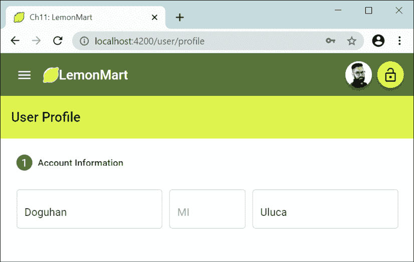

    图 11.1：多步骤表单 – 第 1 步

注意，将 `fxLayout.lt-sm="column"` 添加到具有 `fxLayout="row"` 的行中，可以启用表单的响应式布局，如下所示：

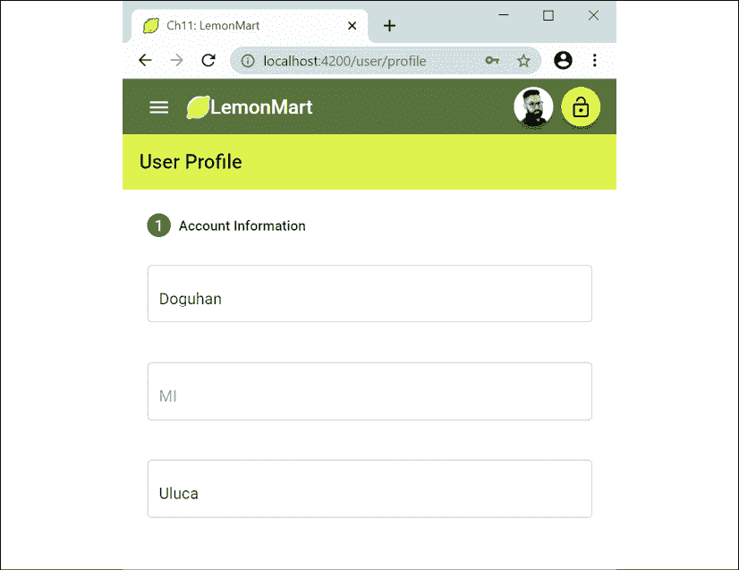

图 11.2：移动端的多步骤表单

在我们继续介绍如何实现 **出生日期** 字段之前，让我们通过实现错误消息来重新评估我们的策略。

## 使用指令重用重复模板行为

在上一节中，我们为 `name` 对象的每个字段部分的每个验证错误实现了一个 `mat-error` 元素。对于三个字段，这会迅速增加到七个元素。在 *第八章*，*设计身份验证和授权* 中，我们实现了 `common/validations.ts` 以重用验证规则。我们可以使用属性指令重用我们在 `mat-error` 中实现的行为，或者任何其他 `div`，使用属性指令。

### 属性指令

在 *第一章*，*Angular 及其概念简介* 中，我提到 Angular 组件代表 Angular 应用程序的最基本单元。通过组件，我们定义自己的 HTML 元素，这些元素可以重用模板和一些 TypeScript 代码所表示的功能和特性。另一方面，指令增强了现有元素或组件的功能。在某种程度上，组件是一个超级指令，它增强了基本的 HTML 功能。

考虑到这个视图，我们可以定义三种类型的指令：

+   组件

+   结构指令

+   属性指令

基本上，组件是带有模板的指令，这是你将最常使用的指令类型。结构指令通过添加或删除元素来修改 DOM，`*ngIf` 和 `*ngFor` 是典型的例子。最后，属性指令允许你定义可以添加到 HTML 元素或组件的新属性，以向它们添加新行为。

让我们实现一个可以封装字段级错误行为的属性指令。

### 字段错误属性指令

想象一下我们如何使用指令来减少重复元素以显示字段错误。以下是一个使用姓名字段作为示例的例子：

```js
**example**
<mat-form-field appearance="outline" fxFlex="40%">
  <mat-label>First Name</mat-label>
  <input matInput aria-label="First Name"
         formControlName="first" #name />
  <mat-error **[input]="name" [group]="formGroup.get('name')"**
 **[appFieldError]="ErrorSets.RequiredText">**
  </mat-error>
</mat-form-field> 
```

我们有一个标准布局结构用于材料表单字段，但只有一个 `mat-error` 元素。`mat-error` 上有三个新属性：

+   `input` 通过模板引用变量绑定到标记为 `#name` 的 HTML 输入元素，这样我们就可以访问输入元素的模糊事件，并能够读取 `placeholder`、`aria-label` 和 `formControlName` 属性。

+   `group` 绑定到包含表单控件的父表单组对象，因此我们可以使用输入的 `formControlName` 属性来检索 `formControl` 对象，同时避免额外的代码。

+   `appFieldError` 绑定到一个数组，该数组包含需要与 `formControl` 对象进行校验的验证错误，例如 `required`、`minlength`、`maxlength` 和 `invalid`。

使用前面的信息，我们可以创建一个指令，可以在 `mat-error` 元素内渲染一行或多行错误消息，有效地复制我们在上一节中使用的冗长方法。

让我们继续创建一个名为 `FieldErrorDirective` 的属性指令：

1.  在 `src/app/user-controls` 下创建 `FieldErrorDirective`。

1.  将指令的选择器定义为名为 `appFieldError` 的可绑定属性：

    ```js
    **src/app/user-controls/field-error/field-error.directive.ts**
    @Directive({
      selector: '**[appFieldError]**',
    }) 
    ```

1.  在指令外部，定义一个新的类型名为`ValidationError`，它定义了我们将要处理的错误条件类型：

    ```js
    **src/app/user-controls/field-error/field-error.directive.ts**
    export type ValidationError = 
       'required' | 'minlength' | 'maxlength' | 'invalid' 
    ```

1.  类似于我们分组验证的方式，让我们定义两组常见的错误条件，这样我们就不必反复输入它们：

    ```js
    **src/app/user-controls/field-error/field-error.directive.ts**
    export const ErrorSets: { [key: string]: ValidationError[] } = {
      OptionalText: ['minlength', 'maxlength'],
      RequiredText: ['minlength', 'maxlength', 'required'],
    } 
    ```

1.  接下来，让我们定义指令的`@Input`目标：

    ```js
    **src/app/user-controls/field-error/field-error.directive.ts**
    export class FieldErrorDirective implements OnDestroy, OnChanges {
      @Input() appFieldError:
        | ValidationError
        | ValidationError[]
        | { error: ValidationError; message: string }
        | { error: ValidationError; message: string }[]
      @Input() input: HTMLInputElement | undefined
      @Input() group: FormGroup
      @Input() fieldControl: AbstractControl | null
      @Input() fieldLabel: string | undefined 
    ```

    注意，我们已经讨论了前三个属性的目的。`fieldControl`和`fieldLabel`是可选属性。如果指定了`input`和`group`，可选属性可以自动填充。由于它们是类级别的变量，因此公开它们是有意义的，以防用户想要覆盖指令的默认行为。这有助于创建灵活且可重用的控件。

1.  在构造函数中导入元素引用，这可以在稍后由`renderErrors`函数用于在`mat-error`元素的内部 HTML 中显示错误：

    ```js
    **src/app/user-controls/field-error/field-error.directive.ts**
      private readonly nativeElement: HTMLElement
      constructor(private el: ElementRef) {
        this.nativeElement = this.el.nativeElement
      }
      renderErrors(errors: string) {
        this.nativeElement.innerHTML = errors
      } 
    ```

1.  实现一个函数，该函数可以根据错误类型返回预定义的错误信息：

    ```js
    **src/app/user-controls/field-error/field-error.directive.ts**
      getStandardErrorMessage(error: ValidationError): string {
        const label = this.fieldLabel || 'Input'
        switch (error) {
          case 'required':
            return `${label} is required`
          case 'minlength':
            return `${label} must be at least ${
              this.fieldControl?.getError(error)?.requiredLength ?? 2
            } characters`
          case 'maxlength':
            return `${label} can\'t exceed ${
              this.fieldControl?.getError(error)?.requiredLength ?? 50
            } characters`
          case 'invalid':
            return `A valid ${label} is required`
        }
      } 
    ```

    注意，我们可以从`fieldControl`动态提取所需的`minlength`或`maxlength`值，这大大减少了我们需要生成的自定义消息的数量。

1.  实现一个算法，该算法可以使用`getStandardErrorMessage`方法遍历`appFieldError`中的所有元素以及需要显示在数组中的错误：

    ```js
    **src/app/user-controls/field-error/field-error.directive.ts**
    updateErrorMessage() {
        const errorsToDisplay: string[] = []
        const errors = Array.isArray(this.appFieldError)
          ? this.appFieldError
          : [this.appFieldError]
        errors.forEach(
          (error: ValidationError 
                | { error: ValidationError; message: string }) => {
            const errorCode = 
              typeof error === 'object' ? error.error : error 
            const message =
              typeof error === 'object'
                ? () => error.message
                : () => this.getStandardErrorMessage(errorCode)
            const errorChecker =
              errorCode === 'invalid'
                ? () => this.fieldControl?.invalid
                : () => this.fieldControl?.hasError(errorCode)
            if (errorChecker()) {
              errorsToDisplay.push(message())
            }
          }
        )
        this.renderErrors(errorsToDisplay.join('<br>'))
      } 
    ```

    最后，我们可以使用`renderErrors`方法来显示错误信息。

    注意函数委托的使用。由于这段代码可能每分钟执行数百次，因此避免不必要的调用非常重要。函数委托有助于更好地组织我们的代码，同时将它们的逻辑执行推迟到绝对必要时。

1.  现在，初始化`fieldControl`属性，它代表一个`formControl`。我们将监听控制的`valueChanges`事件，如果验证状态无效，则执行我们的自定义`updateErrorMessage`逻辑来显示错误信息：

    ```js
    **src/app/user-controls/field-error/field-error.directive.ts**
    private controlSubscription: Subscription | undefined
    ngOnDestroy(): void {
      this.unsubscribe()
    }
    unsubscribe(): void {
      this.controlSubscription?.unsubscribe()
    }
    initFieldControl() {
        if (this.input && this.group) {
          const controlName = this.input.
            getAttribute('formControlName') ?? ''
          this.fieldControl =
            this.fieldControl || this.group.get(controlName)
          if (!this.fieldControl) {
            throw new Error( 
              `[appFieldError] couldn't bind to control ${controlName}`
            )
          }
          this.unsubscribe()
          this.controlSubscription = this.fieldControl?.valueChanges
            .pipe(
              filter(() => this.fieldControl?.status === 'INVALID'),
              tap(() => this.updateErrorMessage())
            )
            .subscribe()
        }
      } 
    ```

    注意，由于我们正在订阅`valueChanges`，我们必须取消订阅。我们使用`ngOnDestroy`取消订阅一次，然后在订阅之前再次取消订阅。这是因为`initFieldControl`可能被多次调用。如果我们不清除之前的订阅，将导致内存泄漏和相关性能问题。

    此外，如果我们无法绑定到`fieldControl`，我们将抛出一个错误信息，因为这通常表明编码错误。

1.  最后，我们使用`ngOnChanges`事件配置所有主要属性，该事件在更新任何`@Input`属性时触发。这确保了在表单元素可能动态添加或删除的情况下，我们始终考虑最新的值。我们调用`initFieldControl`以开始监听值变化，实现一个`onblur`事件处理器，该处理器触发`updateErrorMessage()`为 HTML 输入元素，并分配`fieldLabel`的值：

    ```js
    **src/app/user-controls/field-error/field-error.directive.ts**
      ngOnChanges(changes: SimpleChanges): void {
        **this.initFieldControl()**
        if (changes.input.firstChange) {
          if (this.input) {
            **this.input.onblur = () => this.updateErrorMessage()**
     **this.fieldLabel** =
              this.fieldLabel ||
              this.input.placeholder ||
              this.input.getAttribute('aria-label') ||
              ''
          } else {
            throw new Error(
              `appFieldError.[input] couldn't bind to any input element`
            )
          }
        }
      } 
    ```

    注意，如果我们无法绑定到 HTML `input`元素，这通常意味着开发者忘记正确连接这些元素。在这种情况下，我们抛出一个新的`Error`对象，这在控制台中生成一个有用的堆栈跟踪，以便你可以确定模板中错误发生的位置。

这完成了指令的实现。现在，我们需要将指令打包到一个名为`field-error.module.ts`的模块中：

```js
**src/app/user-controls/field-error/field-error.directive.ts**
  @NgModule({
  imports: [CommonModule, ReactiveFormsModule],
  declarations: [FieldErrorDirective],
  exports: [FieldErrorDirective],
})
export class FieldErrorModule {} 
```

现在继续在我们的现有表单中使用这个指令：

1.  在`app.module.ts`和`user.module.ts`中导入模块。

1.  使用新指令更新`profile.component.html`。

1.  使用新指令更新`login.component.html`。

确保在`component`类中将`ErrorSets`定义为公共属性变量，以便你可以在模板中使用它。

测试你的表单以确保我们的验证消息按预期显示，并且没有控制台错误。

恭喜！你已经学会了如何使用指令将新行为注入其他元素和组件。通过这样做，我们能够避免大量的重复代码，并在我们的应用程序中标准化错误消息。

在继续之前，通过查看 GitHub 上的实现来完成表单的实现。你可以在`projects/ch11/src/app/user/profile/profile.initial.component.html`找到表单模板的代码，在`projects/ch11/src/app/user/profile/profile.initial.component.ts`找到`component`类。

不要包含`app-lemon-rater`和`app-view-user`元素，并从电话号码中移除`mask`属性，我们将在本章后面实现它。

在这里，你可以看到用户资料在 LemonMart 上的显示方式：

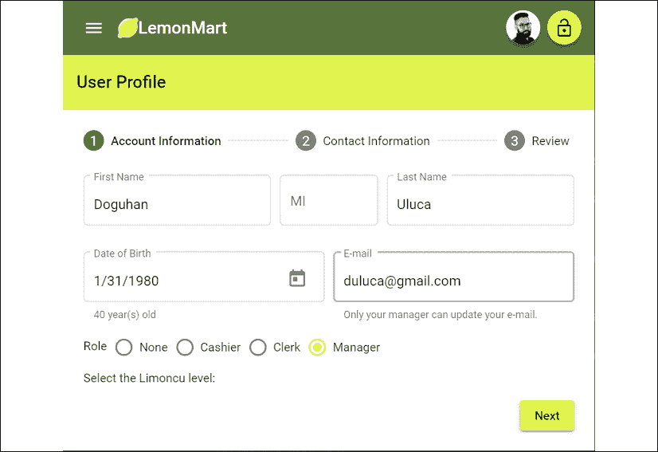

图 11.3：基本完成的配置文件组件

接下来，让我们继续查看`profile`组件，看看**出生日期**字段是如何工作的。

## 计算属性和 DatePicker

我们可以根据用户输入显示基于计算属性的值。例如，为了显示一个人的年龄，基于他们的出生日期，引入计算年龄的类属性，并如下显示它：

```js
**src/app/user/profile/profile.component.ts**
now = new Date()
get dateOfBirth() {
  return this.formGroup.get('dateOfBirth')?.value || this.now
}
get age() {
  return this.now.getFullYear() - this.dateOfBirth.getFullYear()
} 
```

要验证过去一百年内的日期，实现一个`minDate`类属性：

```js
**src/app/user/profile/profile.component.ts**
  minDate = new Date(
    this.now.getFullYear() - 100,
    this.now.getMonth(),
    this.now.getDate()
  ) 
```

模板中计算属性的使用如下所示：

```js
**src/app/user/profile/profile.component.html**
<mat-form-field appearance="outline" fxFlex="50%">
  <mat-label>Date of Birth</mat-label>
  <input matInput aria-label="Date of Birth" formControlName="dateOfBirth"
    **[min]="minDate" [max]="now"** [matDatepicker]="dateOfBirthPicker" #dob />
  <mat-hint *ngIf="formGroup.get('dateOfBirth')?.value">
    {{ age }} year(s) old
  </mat-hint>
  <mat-datepicker-toggle matSuffix [for]="dateOfBirthPicker">
  </mat-datepicker-toggle>
  <mat-datepicker #dateOfBirthPicker></mat-datepicker>
  <mat-error [input]="dob" [group]="formGroup"
    [appFieldError]="{error: 'invalid', message: 'Date must be within the last 100 years'}">
  </mat-error>
</mat-form-field> 
```

参考前面片段中突出显示的`[min]`和`[max]`属性，了解一百年日期范围的适用。

`DatePicker`的实际效果如下所示：

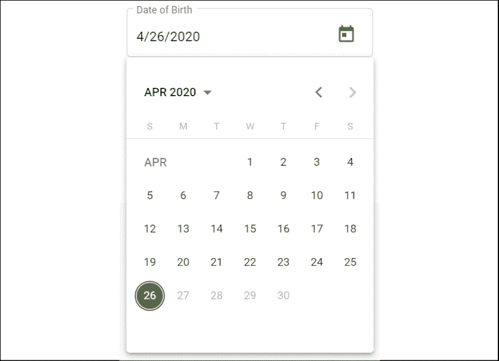

图 11.4：使用 DatePicker 选择日期

注意，2020 年 4 月 26 日之后的日期将以灰色显示。选择日期后，计算出的年龄将如下显示：


图 11.5：计算年龄属性

现在，让我们继续进行下一步，**联系信息**，看看我们如何能够方便地显示和输入地址字段的状态部分。

## 自动完成支持

在 `buildForm` 中，我们监听 `address.state` 以支持类型提示过滤下拉菜单体验：

```js
**src/app/user/profile/profile.component.ts**
const state = this.formGroup.get('address.state')
if (state != null) {
  this.states$ = state.valueChanges.pipe(
    startWith(''),
    map((value) => USStateFilter(value))
  )
} 
```

在模板上实现 `mat-autocomplete`，绑定到过滤后的状态数组，并使用 `async` 管道：

```js
**src/app/user/profile/profile.component.html**
...
<mat-form-field appearance="outline" fxFlex="30%">
  <mat-label>State</mat-label>
  <input type="text" aria-label="State" matInput formControlName="state"
    [matAutocomplete]="stateAuto" #state />
  <mat-autocomplete #stateAuto="matAutocomplete">
    <mat-option *ngFor="let state of (states$ | async)" [value]="state.name">
      {{ state.name }}
    </mat-option>
  </mat-autocomplete>
  <mat-error [input]="state" [group]="formGroup.get('address')"
    appFieldError="required">
  </mat-error>
</mat-form-field> 
... 
```

当用户输入 `V` 字符时，它看起来是这样的：

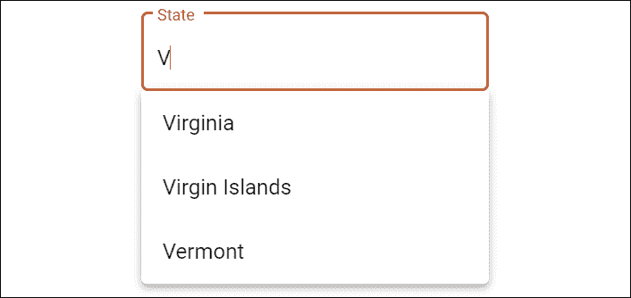

图 11.6：带有自动完成支持的下拉菜单

在下一节中，让我们启用多个电话号码的输入。

## 动态表单数组

注意，`phones` 是一个数组，可能允许许多输入。我们可以通过使用 `this.formBuilder.array` 函数构建 `FormArray` 来实现这一点。我们还定义了几个辅助函数，以使构建 `FormArray` 更容易：

+   `buildPhoneFormControl` 有助于构建单个条目的 `FormGroup` 对象。

+   `buildPhoneArray` 根据需要创建尽可能多的 `FormGroup` 对象，或者如果表单为空，则创建一个空条目。

+   `addPhone` 向 `FormArray` 添加一个新的空 `FormGroup` 对象。

+   `get phonesArray()` 是一个方便的属性，可以从表单中获取 `phones` 控件。

让我们看看实现是如何结合在一起的：

```js
**src/app/user/profile/profile.component.ts**
...
phones: this.formBuilder.array(this.buildPhoneArray(user?.phones || [])),
...
  private buildPhoneArray(phones: IPhone[]) {
    const groups = []
    if (phones?.length === 0) {
      groups.push(this.buildPhoneFormControl(1))
    } else {
      phones.forEach((p) => {
        groups.push(
          this.buildPhoneFormControl(p.id, p.type, p.digits)
        )
      })
    }
    return groups
      } 
private buildPhoneFormControl(
  id: number, type?: string, phoneNumber?: string
) {
    return this.formBuilder.group({
      id: [id],
      type: [type || '', Validators.required],
      digits: [phoneNumber || '', USAPhoneNumberValidation],
  })
} 
... 
```

`buildPhoneArray` 支持使用单个电话输入初始化表单或用现有数据填充它，与 `buildPhoneFormControl` 一起工作。当用户点击 **添加** 按钮创建新行时，后者非常有用：

```js
**src/app/user/profile/profile.component.ts**
...
addPhone() { this.phonesArray.push(
this.buildPhoneFormControl(
  this.formGroup.get('phones').value.length + 1)
)
}
get phonesArray(): FormArray {
  return this.formGroup.get('phones') as FormArray
}
... 
```

`phonesArray` 属性获取器是一个常见的模式，可以使访问某些表单属性更容易。然而，在这种情况下，这也是必要的，因为 `get('phones')` 必须转换为 `FormArray`，这样我们就可以在模板上访问其 `length` 属性：

```js
**src/app/user/profile/profile.component.html**
...
<mat-list formArrayName="phones">
  <h2 mat-subheader>Phone Number(s)
    <button mat-button (click)="addPhone()">
      <mat-icon>add</mat-icon>
      Add Phone
    </button>
  </h2>
  <mat-list-item style="margin-top: 36px;"
    *ngFor="let position of phonesArray.controls; let i = index"
      [formGroupName]="i">
    <mat-form-field appearance="outline" fxFlex="100px">
      <mat-label>Type</mat-label>
      <mat-select formControlName="type">
        <mat-option *ngFor="let type of PhoneTypes"
             [value]="**convertTypeToPhoneType(type)**">
          {{ type }}
        </mat-option>
      </mat-select>
    </mat-form-field>
    <mat-form-field appearance="outline" fxFlex fxFlexOffset="10px">
      <mat-label>Number</mat-label>
      <input matInput type="text" formControlName="digits"
        aria-label="Phone number" prefix="+1" />
      <mat-error
        *ngIf="phonesArray.controls[i].invalid &&  
               phonesArray.controls[i].touched">
        A valid phone number is required
      </mat-error>
    </mat-form-field>
    <button fxFlex="33px" mat-icon-button
      (click)="**phonesArray.removeAt(i)**"> 
      <mat-icon>delete</mat-icon>
    </button>
  </mat-list-item>
</mat-list> 
... 
```

注意突出显示的 `convertTypeToPhoneType` 函数，它将 `string` 转换为 `enum PhoneType`。

在前面的代码块中，也突出显示了 `remove` 函数是如何在模板中内联实现的，这使得它更容易阅读和维护。

让我们看看动态数组应该如何工作：

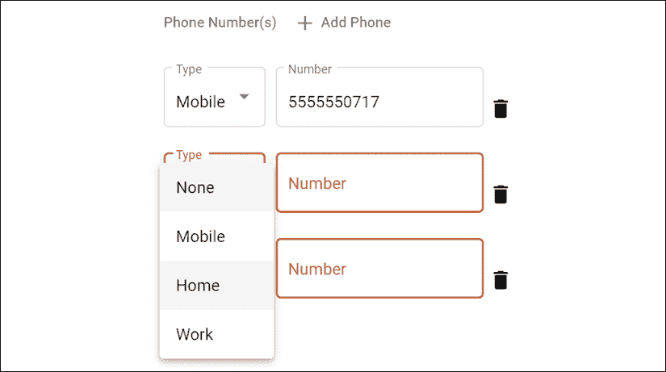

图 11.7：使用 FormArray 的多个输入

现在我们已经完成了数据输入，我们可以继续到步骤器的最后一步，**审查**。然而，如前所述，**审查**步骤使用 `<app-view-user>` 指令来显示其数据。让我们首先构建这个视图。

## 创建共享组件

这里是 `<app-view-user>` 指令的最小实现，它是 **审查** 步骤的先决条件。

在 `user` 模块下创建一个新的 `viewUser` 组件，如下所示：

```js
**src/app/user/view-user/view-user.component.ts**
import { Component, Input, OnChanges, SimpleChanges } from '@angular/core'
import { Router } from '@angular/router'
import { BehaviorSubject } from 'rxjs'
import { IUser, User } from '../user/user'
@Component({
  selector: 'app-view-user',
  template: `
    <div *ngIf="currentUser$ | async as currentUser">
      <mat-card>
        <mat-card-header>
          <div mat-card-avatar>
            <mat-icon>account_circle</mat-icon>
          </div>
          <mat-card-title>
            {{ currentUser.fullName }}
          </mat-card-title>
          <mat-card-subtitle>
            {{ currentUser.role }}
          </mat-card-subtitle>
        </mat-card-header>
        <mat-card-content>
          <p><span class="mat-input bold">E-mail</span></p>
          <p>{{ currentUser.email }}</p>
          <p><span class="mat-input bold">Date of Birth</span></p>
          <p>{{ currentUser.dateOfBirth | date: 'mediumDate' }}</p>
        </mat-card-content>
        <mat-card-actions *ngIf="editMode">
          <button mat-button mat-raised-button
                  (click)="editUser(currentUser._id)">
            Edit
          </button>
        </mat-card-actions>
      </mat-card>
    </div>
  `,
  styles: [
    `
      .bold {
        font-weight: bold;
      }
    `,
  ],
})
export class ViewUserComponent implements OnChanges {
  @Input() user: IUser
  readonly currentUser$ = new BehaviorSubject(new User())
  get editMode() {
    return !this.user
  }
  constructor(private router: Router) {}
  ngOnChanges(changes: SimpleChanges): void {
    this.currentUser$.next(User.Build(changes.user.currentValue))
  }
  editUser(id: string) {
    this.router.navigate(['/user/profile', id])
  }
} 
```

前面的组件使用 `@Input` 输入绑定从外部组件获取用户数据，符合 `IUser` 接口。我们实现了 `ngOnChanges` 事件，该事件在绑定数据更改时触发。在这个事件中，我们使用 `User.Build` 将存储在 `user` 属性中的简单 JSON 对象作为 `User` 类的实例进行填充。

然后，我们定义一个只读的`BehaviorSubject`，命名为`this.currentUser$`，这样我们就可以使用下一个函数异步地将其更新。这种灵活性将在我们稍后使该组件在多个上下文中可重用时派上用场。即使我们想这样做，我们也不能直接绑定到`user`，因为像`fullName`这样的计算属性只有在数据被注入到`User`类的实例中时才会工作。

现在，我们准备好完成多步骤表单。

## 查看并保存表单数据

在多步骤表单的最后一步，用户应该能够查看并保存表单数据。作为一个好的实践，成功的`POST`请求将返回保存的数据回浏览器。然后我们可以用从服务器返回的信息重新加载表单：

```js
**src/app/user/profile/profile.component.ts**
...
  async save(form: FormGroup) {
    this.subs.add(
      this.userService
        .updateUser(this.currentUserId, form.value)
        .subscribe(
          (res: IUser) => {
            **this.formGroup.patchValue(res)**
            this.uiService.showToast('Updated user')
          },
          (err: string) => (this.userError = err)
      )
    )
  }
... 
```

注意，`updateUser`返回用户的保存值。数据库可能返回与之前不同的`user`版本，因此我们使用`formGroup.patchValue`来更新支撑表单的数据。表单会自动更新以反映任何更改。

如果在保存数据时出现错误，它们将被设置为`userError`以在表单上显示。在保存数据之前，我们以紧凑的格式展示数据，使用可重用的`app-view-user`组件，我们可以将其绑定到表单数据：

```js
**src/app/user/profile/profile.component.html**
...
<mat-step [stepControl]="formGroup">
  <form [formGroup]="formGroup" (ngSubmit)="save(formGroup)">
    <ng-template matStepLabel>Review</ng-template>
    <div class="stepContent">
      Review and update your user profile.
      **<app-view-user [user]="formGroup.getRawValue()"></app-view-user>**
    </div>
    <div fxLayout="row" class="margin-top">
      <button mat-button matStepperPrevious>Back</button>
      <div class="flex-spacer"></div>
      <div *ngIf="userError" class="mat-caption error">
        {{ **userError** }}
      </div>
      <button mat-button color="warn" (click)="**stepper.reset()**">
        Reset
      </button>
      <button mat-raised-button matStepperNext color="primary" 
        type="submit" [disabled]="formGroup.invalid">
        Update
      </button>
    </div>
  </form>
</mat-step>
... 
```

注意，我们使用`formGroup.getRawValue()`来提取表单数据的 JSON。看看我们是如何将`userError`绑定以显示错误消息的。此外，**重置**按钮使用`stepper.reset()`，它可以方便地重置所有用户输入。

最终产品应该看起来是这样的：

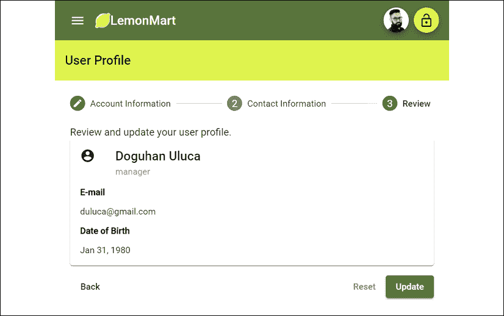

图 11.8：查看步骤

现在用户配置文件输入已完成，我们离最终目标——创建一个主/详细视图还有一半的路要走，在这个视图中，**经理**可以点击用户并查看他们的配置文件详情。我们还有更多的代码要添加，并且在过程中，我们陷入了添加大量样板代码来加载组件所需数据的模式。

接下来，让我们重构我们的表单，使其代码可重用和可扩展，即使我们的表单有数十个字段，代码仍然是可维护的，我们不会引入指数级成本增加来做出更改。

# 使用可重用表单部分扩展架构

如在*多步骤响应式表单*部分的介绍中提到的，表单是紧密耦合的怪物，可能会变得很大，使用错误的架构模式来扩展你的实现可能会在实现新功能或维护现有功能时引起重大问题。

为了展示你如何将表单拆分成多个部分，我们将重构表单，提取以下截图中的突出显示部分，即名字表单组，作为一个单独的组件。完成这一点的技术与你想要将表单的每个步骤放入单独组件时使用的技术相同：

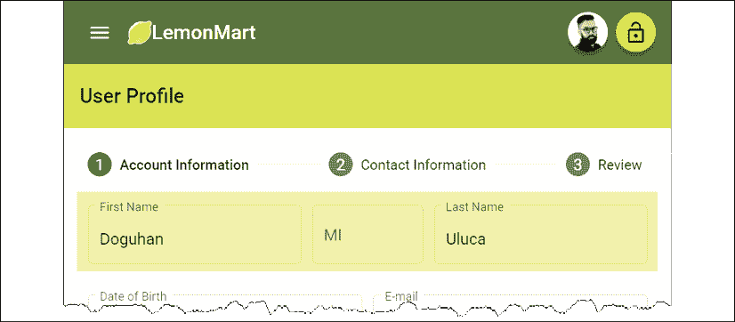

图 11.9：用户配置文件的名字部分被突出显示

通过使名称表单组可重用，你还将了解如何将你构建到该表单组中的业务逻辑在其他表单中重用。我们将名称表单组逻辑提取到一个名为 `NameInputComponent` 的新组件中。在这个过程中，我们也有机会将一些可重用表单功能提取到 `BaseFormComponent` 作为 `抽象类`。

这里将会有几个组件协同工作，包括 `ProfileComponent`、`ViewUserComponent` 和 `NameInputComponent`。我们需要这三个组件中的所有值在用户输入时都保持最新。

`ProfileComponent` 将拥有主表单，我们需要在其中注册任何子表单。一旦我们这样做，你之前学到的所有表单验证技术仍然适用。

这是让你的表单能够在许多组件之间扩展并继续易于使用的关键方式，同时不会引入不必要的验证开销。因此，回顾这些对象之间的不同交互，有助于巩固你对它们异步和解耦行为性质的理解：

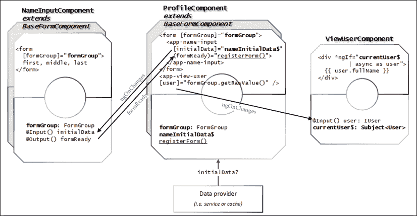

图 11.10：表单组件交互

在本节中，我们将汇集你在本书学习过程中学到的许多不同概念。利用前面的图来理解各种表单组件如何相互交互。

在前面的图中，粗体属性表示数据绑定。下划线函数元素表示事件注册。箭头显示了组件之间的连接点。

工作流程从 `ProfileComponent` 的实例化开始。组件的 `OnInit` 事件开始构建 `formGroup` 对象，同时异步加载可能需要修补到表单中的任何潜在 `initialData`。请参考前面的图来查看 `initialData` 从服务或缓存中到达的视觉表示。

`NameInputComponent` 在 `ProfileComponent` 表单中以 `<app-name-input>` 的形式使用。为了使 `initialData` 与 `NameInputComponent` 同步，我们使用 `async` 管道绑定一个 `nameInitialData$` 主题，因为 `initialData` 是异步到达的。

`NameInputComponent` 实现了 `OnChanges` 生命周期钩子，因此每当 `nameInitialData$` 更新时，其值就会被修补到 `NameInputComponent` 表单中。

与 `ProfileComponent` 类似，`NameInputComponent` 也实现了 `OnInit` 事件来构建其 `formGroup` 对象。由于这是一个异步事件，`NameInputComponent` 需要公开一个 `formReady` 事件，`ProfileComponent` 可以订阅它。一旦 `formGroup` 对象就绪，我们发出事件，`ProfileComponent` 上的 `registerForm` 函数被触发。`registerForm` 将 `NameInputComponent` 的 `formGroup` 对象作为子元素添加到父 `formGroup` 上。

`ViewUserComponent` 在 `ProfileComponent` 表单中用作 `<app-view-user>`。当父表单中的值发生变化时，我们需要 `<app-view-user>` 保持最新状态。我们绑定到 `ViewUserComponent` 上的 `user` 属性，该属性实现了 `OnChanges` 以接收更新。每次更新时，`User` 对象都会从 `IUser` 对象中恢复，以便计算字段如 `fullName` 可以继续工作。更新的 `User` 被推送到 `currentUser$`，该对象通过 `async` 绑定到模板。

我们将首先构建一个 `BaseFormComponent`，然后 `NameInputComponent` 和 `ProfileComponent` 将实现它。

## 基础表单组件作为一个抽象类

通过实现一个基抽象类，我们可以共享通用功能并标准化实现所有实现表单的组件。抽象类不能单独实例化，因为它本身没有模板，单独使用是没有意义的。

注意，`BaseFormComponent` 只是一个 `class`，而不是 Angular 组件。

`BaseFormComponent` 将标准化以下内容：

+   `@Input initialData`，并禁用为绑定目标

+   `@Output formReady` 事件

+   `formGroup`，在模板的 `buildForm` 函数中使用的 `FormGroup` 以构建 `formGroup`

在前面的假设下，基类可以提供一些通用功能：

+   `patchUpdatedData`，可以在不重建的情况下更新 `formGroup` 中的数据（部分或全部）。

+   `registerForm` 和 `deregisterForm` 可以注册或注销子表单。

+   `deregisterAllForms` 可以自动注销任何已注册的子表单。

+   `hasChanged` 可以确定在 `ngOnChange` 事件处理器提供的 `SimpleChange` 对象的情况下，`initialData` 是否已更改。

+   `patchUpdatedDataIfChanged` 利用 `hasChanged` 并使用 `patchUpdatedData` 来更新数据，前提是 `initialData` 和 `formGroup` 已经初始化，并且有更新。

在 `src/common` 下创建一个新的类，`BaseFormComponent`，如下所示：

```js
**src/app/common/base-form.class.ts**
import { EventEmitter, Input, Output, SimpleChange, SimpleChanges } 
   from '@angular/core'
import { AbstractControl, FormGroup } from '@angular/forms'
export abstract class BaseFormComponent<TFormData extends object> {
  @Input() initialData: TFormData
  @Input() disable: boolean
  @Output() formReady: EventEmitter<AbstractControl>
  formGroup: FormGroup
  private registeredForms: string[] = []
  constructor() {
    this.formReady = new EventEmitter<AbstractControl>(true)
  }
  abstract buildForm(initialData?: TFormData): FormGroup
  patchUpdatedData(data: object) {
    this.formGroup.patchValue(data, { onlySelf: false })
  }
  patchUpdatedDataIfChanged(changes: SimpleChanges) {
    if (this.formGroup && this.hasChanged(changes.initialData)) {
      this.patchUpdatedData(this.initialData)
    }
  }
  emitFormReady(control: AbstractControl | null = null) {
    this.formReady.emit(control || this.formGroup)
  }
  registerForm(name: string, control: AbstractControl) {
    this.formGroup.setControl(name, control)
    this.registeredForms.push(name)
  }
  deregisterForm(name: string) {
    if (this.formGroup.contains(name)) {
      this.formGroup.removeControl(name)
    }
  }
  protected deregisterAllForms() {
    this.registeredForms.forEach(() => this.deregisterForm(name))
  }
  protected hasChanged(change: SimpleChange): boolean {
    return change?.previousValue !== change?.currentValue
  }
} 
```

让我们使用 `BaseFormComponent` 实现 `NameInputComponent`。

## 实现可重用的表单部分

从 `profile` 组件代码和模板文件中开始识别名称表单组：

1.  以下为名称表单组实现：

    ```js
    **src/app/user/profile/profile.component.ts**
    ...
    name: this.formBuilder.group({
      first: [user?.name?.first || '', RequiredTextValidation],
      middle: [user?.name?.middle || '', OneCharValidation],
      last: [user?.name?.last || '', RequiredTextValidation],
    }),
    ... 
    ```

    注意，当我们将这些验证规则移动到新组件时，我们仍然希望它们在确定父表单的整体验证状态时仍然有效。我们通过使用上一节中实现的 `registerForm` 函数来实现这一点。一旦我们的新 `FormGroup` 与现有的一个注册，它们的工作方式与重构前完全相同。

1.  接下来是名称表单组的模板：

    ```js
    **src/app/user/profile/profile.component.html**
    ...
    <div fxLayout="row" fxLayout.lt-sm="column" [formGroup]="formGroup.get('name')" fxLayoutGap="10px">
      <mat-form-field appearance="outline" fxFlex="40%">
        <mat-label>First Name</mat-label>
        <input matInput aria-label="First Name" 
               formControlName="first" #name />
        ...
    </div>
    ... 
    ```

    你将把大部分代码移动到新组件中。

1.  在 `user` 文件夹下创建一个新的 `NameInputComponent`。

1.  从 `BaseFormComponent` 扩展类。

1.  在 `constructor` 中注入 `FormBuilder`：

    对于具有小型或有限功能组件，我更喜欢使用内联模板和样式来创建它们，这样就可以更容易地从一处更改代码。

    ```js
    **src/app/user/name-input/name-input.component.ts**
    export class NameInputComponent extends BaseFormComponent<IName> {
      constructor(private formBuilder: FormBuilder) {
        super()
      }
      buildForm(initialData?: IName): FormGroup {
        throw new Error("Method not implemented.");
      }
      ...
    } 
    ```

    记住，基类已经实现了`formGroup`、`initialData`、`disable`和`formReady`属性，因此您不需要重新定义它们。

    注意，我们被迫实现`buildForm`函数，因为它被定义为抽象的。这是强制开发人员遵守标准的好方法。此外，注意任何基函数都可以通过简单地重新定义函数被实现类覆盖。您将在重构`ProfileComponent`时看到这一点。

1.  实现函数`buildForm`。

1.  将`ProfileComponent`中`formGroup`的`name`属性设置为`null`：

    ```js
    **src/app/user/name-input/name-input.component.ts**
    export class NameInputComponent implements OnInit {
      ...
      buildForm(initialData?: IName): FormGroup {
        const name = initialData
        return this.formBuilder.group({
          first: [name?.first : '', RequiredTextValidation],
          middle: [name?.middle : '', OneCharValidation], 
          last: [name?.last : '', RequiredTextValidation],
        })
      } 
    ```

1.  通过将`ProfileComponent`中的内容迁移过来来实现模板：

    ```js
    **src/app/user/name-input/name-input.component.ts**
    template: `
        <form [formGroup]="formGroup">
          <div fxLayout="row" fxLayout.lt-sm="column"
            fxLayoutGap="10px">
            ...
          </div>
        </form>
      `, 
    ```

1.  实现事件处理程序`ngOnInit`：

    ```js
    **src/app/user/name-input/name-input.component.ts**
    ngOnInit() {
      this.formGroup = this.buildForm(this.initialData)
      if (this.disable) {
        this.formGroup.disable()
      }
      this.formReady.emit(this.formGroup)
    } 
    ```

    在每个`BaseFormComponent`的实现中，正确实现`ngOnInit`事件处理程序至关重要。前例是任何您可能实现的`child`组件的相当标准的操作。

    注意，`ProfileComponent`中的实现将略有不同。

1.  实现事件处理程序`ngOnChanges`，利用基类的`patchUpdatedDataIfChanged`行为：

    ```js
    **src/app/user/name-input/name-input.component.ts**
    ngOnChanges(changes: SimpleChanges) {
      this.patchUpdatedDataIfChanged(changes)
    } 
    ```

    注意，在`patchUpdatedDataIfChanged`函数中，将`onlySelf`设置为`false`会导致父表单也会更新。如果您想优化这种行为，您可以重写该函数。

    现在您已经有一个完全实现的`NameInputComponent`，可以将其集成到`ProfileComponent`中。

    为了验证您未来的`ProfileComponent`代码，请参考`projects/ch11/src/app/user/profile/profile.component.ts`和`projects/ch11/src/app/user/profile/profile.component.html`。

    在您开始使用`NameInputComponent`之前，执行以下重构：

1.  将`ProfileComponent`重构为扩展`BaseFormComponent`，并根据需要符合其默认值。

1.  定义一个只读的`nameInitialData$`属性，其类型为`BehaviorSubject<IName>`，并用空字符串初始化它。

1.  将`ProfileComponent`中的内容替换为新的`<app-name-input>`组件：

    ```js
    **src/app/user/profile/profile.component.html**
    <mat-horizontal-stepper #stepper="matHorizontalStepper">
      <mat-step [stepControl]="formGroup">
        <form [formGroup]="formGroup">
          <ng-template matStepLabel>Account Information</ng-template>
            <div class="stepContent">
     **<app-name-input [initialData]="nameInitialData$ | async"**
                **(formReady)="registerForm('name', $event)">**
              </app-name-input>
            </div>
            ...
          </ng-template>
        </form>
      </mat-step>
      ...
    </mat-horizontal-stepper> 
    ```

    注意，这里使用了基础表单组件函数`registerForm`。

1.  确保您的`ngOnInit`被正确实现。

    注意，更新的`ProfileComponent`中还有一些额外的重构，例如以下片段中看到的`patchUser`函数。当您更新组件时，不要错过这些更新。

    ```js
    **src/app/user/profile/profile.component.ts**
    ngOnInit() {
      this.formGroup = this.buildForm()
      this.subs.sink = this.authService.currentUser$
        .pipe(
          filter((user) => user != null),
          tap((user) => this.patchUser(user))
        )
        .subscribe()
    } 
    ```

    当`initialData`更新时，重要的是要使用`pathUpdatedData`以及`nameInitialData$`更新当前表单的数据。

1.  确保正确实现了`ngOnDestroy`：

    ```js
    **src/app/user/profile/profile.component.ts**
      ngOnDestroy() {
        this.subs.unsubscribe()
        this.deregisterAllForms()
      } 
    ```

总是要记得取消订阅，您可以使用`SubSink`包轻松地这样做。您还可以利用基类功能来自动注销所有子表单。

接下来，让我们了解如何对用户输入进行屏蔽以提高数据质量。

# 输入掩码

掩码用户输入是一种输入用户体验工具，同时也是数据质量工具。我是**ngx-mask**库的粉丝，它使得在 Angular 中实现输入掩码变得非常简单。我们将通过更新电话号码输入字段来演示输入掩码，以确保用户输入有效的电话号码，如下面的截图所示：

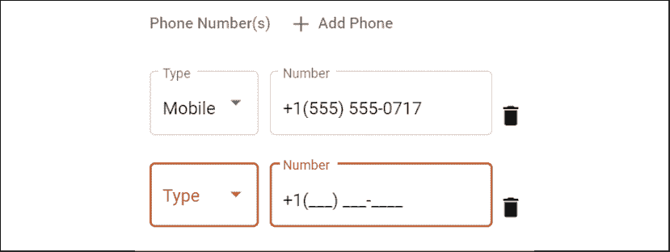

图 11.11：带有输入掩码的电话号码字段

按以下方式设置您的输入掩码：

1.  使用`npm i ngx-mask`通过 npm 安装库。

1.  导入`forRoot`模块：

    ```js
    **src/app/app.module.ts**
    export const options: Partial<IConfig> | (() => Partial<IConfig>) = {
      showMaskTyped: true,
    }
    @NgModule({
      imports: [
        ...
        **NgxMaskModule.forRoot(options),**
      ]
    }) 
    ```

1.  在`user`功能模块中导入模块：

    ```js
    **src/app/user/user.module.ts**
    @NgModule({
      imports: [
        ...
        NgxMaskModule.forChild(),
      ]
    }) 
    ```

1.  按以下方式更新`ProfileComponent`中的`number`字段：

    ```js
    **src/app/user/profile/profile.component.html**
    <mat-form-field appearance="outline" fxFlex fxFlexOffset="10px">
      <mat-label>Number</mat-label>
      <input matInput type="text" formControlName="number"
        prefix="+1" **mask="(000) 000-0000" [showMaskTyped]="true"** />
      <mat-error *ngIf="this.phonesArray.controls[i].invalid">
        A valid phone number is required
      </mat-error>
    </mat-form-field> 
    ```

简单就是这样。您可以在 GitHub 上了解更多关于模块及其功能的信息：[`github.com/JsDaddy/ngx-mask`](https://github.com/JsDaddy/ngx-mask)。

# 带有`ControlValueAccessor`的自定义控件

到目前为止，我们已经学习了使用 Angular Material 提供的标准表单控件和输入控件来使用表单。然而，您也可以创建自定义用户控件。如果您实现了`ControlValueAccessor`接口，那么您的自定义控件将与表单和`ControlValueAccessor`接口的验证引擎很好地协同工作。

我们将创建以下截图所示的定制评分控件，并将其放置在`ProfileComponent`的第一步中：


图 11.12：柠檬评分器用户控件

用户控件本质上是高度可重用、紧密耦合且定制的组件，用于实现丰富的用户交互。让我们来实现一个。

## 实现自定义评分控件

柠檬评分器将根据用户与控件实时交互时选择的柠檬数量动态突出显示。因此，创建高质量的定制控件是一项耗时的任务。

Lemon Rater 是 Jennifer Wadella 在[`github.com/tehfedaykin/galaxy-rating-app`](https://github.com/tehfedaykin/galaxy-rating-app)找到的 Galaxy 评分应用示例的修改版本。我强烈推荐您观看 Jennifer 在 Ng-Conf 2019 上关于`ControlValueAccessor`的演讲，链接在*进一步阅读*部分。

按以下方式设置您的自定义评分控件：

1.  在`user-controls`文件夹下创建一个名为`LemonRater`的新组件。

1.  在同一文件夹中创建一个`LemonRaterModule`。

1.  声明并导出组件。

1.  在`LemonRater`中实现`ControlValueAccess`接口：

    ```js
    **src/app/user-controls/lemon-rater/lemon-rater.component.ts**
    export class LemonRaterComponent implements ControlValueAccessor {
      disabled = false
      private internalValue: number
      get value() {
        return this.internalValue
      }
      onChanged: any = () => {}
      onTouched: any = () => {}
      writeValue(obj: any): void {
        this.internalValue = obj
      }
      registerOnChange(fn: any): void {
        this.onChanged = fn
      }
      registerOnTouched(fn: any): void {
        this.onTouched = fn
      }
      setDisabledState?(isDisabled: boolean): void {
        this.disabled = isDisabled
      }
    } 
    ```

1.  将`NG_VALUE_ACCESSOR`提供者与`multi`属性设置为`true`。这将注册我们的组件到表单的更改事件，以便在用户与评分器交互时更新表单值：

    ```js
    **src/app/user-controls/lemon-rater/lemon-rater.component.ts**
    @Component({
      selector: 'app-lemon-rater',   
      templateUrl: 'lemon-rater.component.html',
      styleUrls: ['lemon-rater.component.css'],
      providers: [
        {
          provide: NG_VALUE_ACCESSOR,
          useExisting: forwardRef(() => LemonRaterComponent),
          multi: true,
        },
      ], 
    ```

1.  实现一个自定义评分方案，该方案包含一个函数，允许根据用户输入设置所选评分：

    ```js
    **src/app/user-controls/lemon-rater/lemon-rater.component.ts**
    export class LemonRaterComponent implements ControlValueAccessor { 
      @ViewChild('displayText', { static: false }) displayTextRef: ElementRef

      ratings = Object.freeze([
        {
          value: 1,
          text: 'no zest',
        },
        {
          value: 2,
          text: 'neither a lemon or a lime ',
        },
        {
          value: 3,
          text: 'a true lemon',
        },
    ])
      setRating(lemon: any) {
        if (!this.disabled) {
          this.internalValue = lemon.value
          this.ratingText = lemon.text
          this.onChanged(lemon.value)
          this.onTouched()
        }
      }
      setDisplayText() {
        this.setSelectedText(this.internalValue)
      }
      private setSelectedText(value: number) {
        this.displayTextRef.nativeElement.textContent = 
          this.getSelectedText(value)
      }
      private getSelectedText(value: number) {
        let text = ''
        if (value) {
          text = this.ratings
            .find((i) => i.value === value)?.text || ''
        }
        return text
      }
    } 
    ```

    注意，通过使用`@ViewChild`，我们获取了名为`#displayText`的 HTML 元素（在下面的模板中已突出显示）。使用`setSelectText`，我们替换了元素的`textContent`。

1.  实现模板，参考`svg`标签内容的示例代码：

    ```js
    **src/app/user-controls/lemon-rater/lemon-rater.component.html**
    **<i #displayText></i>** 
    <div class="lemons" [ngClass]="{'disabled': disabled}"> 
      <ng-container *ngFor="let lemon of ratings"> 
        <svg width="24px" height="24px" viewBox="0 0 513 513"
             [attr.title]="lemon.text" class="lemon rating"
             [ngClass]="{'selected': lemon.value <= value}"
             (mouseover)=
               "displayText.textContent = !disabled ? lemon.text : ''"
             (mouseout)="setDisplayText()"
             (click)="setRating(lemon)"
         >
         ...
         </svg>
      </ng-container>
    </div> 
    ```

    模板中最重要的三个属性是`mouseover`、`mouseout`和`click`。`mouseover`显示用户当前悬停的评分文本，`mouseout`将显示文本重置为所选值，`click`调用我们实现的`setRating`方法来记录用户的选择。然而，控件可以通过突出显示用户悬停在评分或选择它时柠檬的数量来提供更丰富的用户交互。我们将通过一些 CSS 魔法来实现这一点。

1.  实现用户控件的`css`：

    ```js
    **src/app/user-controls/lemon-rater/lemon-rater.component.css**
    .lemons {
      cursor: pointer;
    }
    .lemons:hover .lemon #fill-area {
      fill: #ffe200 !important;
    }
    .lemons.disabled:hover {
      cursor: not-allowed;
    }
    .lemons.disabled:hover .lemon #fill-area {
      fill: #d8d8d8 !important;
    }
    .lemons .lemon {
      float: left; margin: 0px 5px;
    }
    .lemons .lemon #fill-area {
      fill: #d8d8d8;
    }
    .lemons .lemon:hover~.lemon #fill-area {
      fill: #d8d8d8 !important;
    }
    .lemons .lemon.selected #fill-area {
      fill: #ffe200 !important;
    }
    .lemons .dad.heart #ada
        { 
           fill: #6a0dad !important;
    } 
    ```

最有趣的部分是`.lemons .lemon:hover~.lemon #fill-area`。请注意，运算符`~`或通用兄弟组合器用于选择一系列元素，以便在用户悬停在它们上时突出显示动态数量的柠檬。

`#fill-area`指的是在柠檬`svg`内部定义的`<path>`，这允许动态调整柠檬的颜色。我不得不手动将此 ID 字段注入到`svg`文件中。

现在，让我们看看你如何在表单中使用这个新的用户控件。

## 在表单中使用自定义控件

我们将在`profile`组件中使用柠檬评分器来记录员工的 Limoncu 等级。

Limoncu，在土耳其语中意味着种植或出售柠檬的人，是 Lemon Mart 的专有员工参与度和绩效测量系统。

让我们集成柠檬评分器：

1.  首先在`UserModule`中导入`LemonRaterModule`。

1.  确保在`buildForm`中初始化级别表单控件：

    ```js
    **src/app/user/profile/profile.component.ts**
    buildForm(initialData?: IUser): FormGroup {
    ...
      level: [user?.level || 0, Validators.required],
    ...
    } 
    ```

1.  将柠檬评分器作为第一个`mat-step`的最后一个元素插入到`form`元素中：

    ```js
    **src/app/user/profile/profile.component.html**
    <div fxLayout="row" fxLayout.lt-sm="column" class="margin-top" fxLayoutGap="10px">
      <mat-label class="mat-body-1">Select the Limoncu level:
        <app-lemon-rater formControlName="level">
        </app-lemon-rater>
      </mat-label>
    </div> 
    ```

我们只需通过实现`formControlName`与任何其他控件一样的方式，简单地与自定义控件集成。

恭喜！你应该有一个与你的表单集成的可工作的自定义控件。

# 使用网格列表布局

Angular Flex Layout 库非常适合使用 CSS Flexbox 布局内容。Angular Material 通过使用 CSS Grid 及其网格列表功能提供另一种布局内容的机制。演示此功能的一个好方法是在`LoginComponent`中实现一个用于伪造登录信息的帮助列表，如下所示：

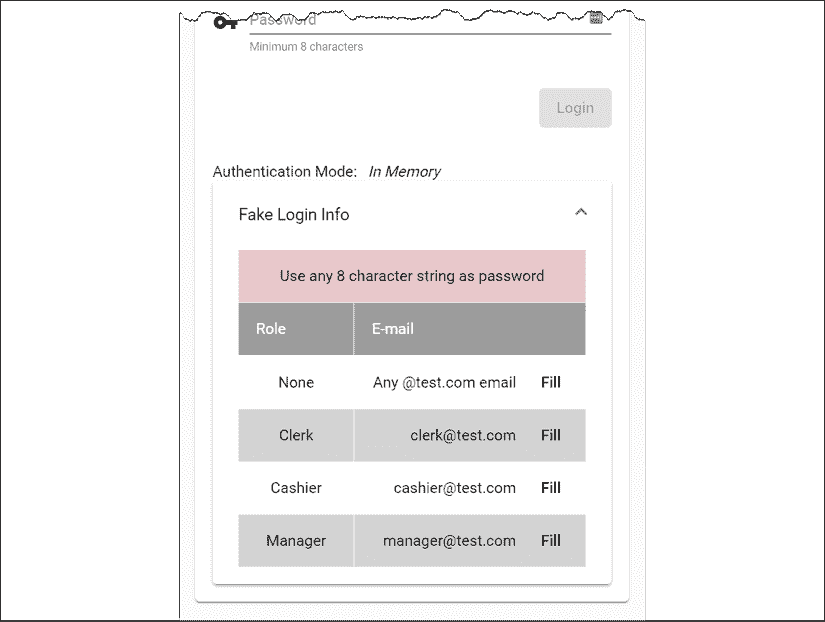

图 11.13：带有网格列表的登录助手

按照以下方式实现你的列表：

1.  首先定义一个`roles`属性，它是一个包含所有角色的数组：

    ```js
    **src/app/login/login.component.ts** 
    roles = Object.keys(Role) 
    ```

1.  将`MatExpansionModule`和`MatGridListModule`导入到`AppMaterialModule`中：

1.  在现有的`mat-card-content`下方实现一个新的`mat-card-content`：

    ```js
    **src/app/login/login.component.html**
    <div fxLayout="row" fxLayoutAlign="center">
      <mat-card fxFlex="400px">
        <mat-card-header>
          <mat-card-title>
            <div class="mat-headline">Hello, Limoncu!</div>
          </mat-card-title>
        </mat-card-header>
        <mat-card-content>
          ...
        </mat-card-content>
        **<mat-card-content>**
     **</mat-card-content>**
      </mat-card>
    </div> 
    ```

1.  在新的`mat-card-content`内部，放入一个标签以显示认证模式：

    ```js
    **src/app/login/login.component.html**
    <div fxLayout="row" fxLayoutAlign="start center" fxLayoutGap="10px">
      <span>Authentication Mode: </span><i>{{ authMode }}</i>
    </div> 
    ```

1.  在标签下方实现一个展开列表：

    ```js
    **src/app/login/login.component.html**
    <mat-accordion>
      <mat-expansion-panel>
        <mat-expansion-panel-header>
            <mat-panel-title>
              Fake Login Info
            </mat-panel-title>
        </mat-expansion-panel-header>
        **...**
      </mat-expansion-panel>
    </mat-accordion> 
    ```

1.  在`mat-expansion-panel-header`之后，在上一个步骤中用省略号标记的区域，实现一个角色和电子邮件地址的表格，以及一些有关密码长度的提示文本，使用`mat-grid-list`，如下面的代码块所示：

    ```js
    **src/app/login/login.component.html**
    <mat-grid-list cols="3" rowHeight="48px" role="list">
      <mat-grid-tile [**colspan**]="3" role="listitem" 
                     style="background: pink">
        Use any 8 character string as password
      </mat-grid-tile>
      <mat-grid-tile>
        <mat-grid-tile-header>Role</mat-grid-tile-header>
      </mat-grid-tile>
      <mat-grid-tile [colspan]="2">
        <mat-grid-tile-header>E-mail</mat-grid-tile-header>
      </mat-grid-tile>
      <div *ngFor="let role of roles; odd as oddRow">
        <mat-grid-tile role="listitem"
                [style.background]="oddRow ? 'lightGray': 'white'">
          {{role}}
        </mat-grid-tile>
        <mat-grid-tile [**colspan**]="2" role="listitem"
                [style.background]="oddRow ? 'lightGray': 'white'">
          <div **fxFlex fxLayoutAlign="end center"**>
            <div
              ***ngIf**="role.toLowerCase() === 'none'**; else otherRoles"**
            >
              Any @test.com email
            </div>
            <ng-template **#otherRoles**>
              {{role.toLowerCase()}}@test.com
            </ng-template>
            <button mat-button (click)="
                this.loginForm.patchValue(
                  { email: role.toLowerCase() + '@test.com', 
                  password: 'whatever' }
                )">
              Fill
            </button>
          </div>
        </mat-grid-tile>
      </div>
    </mat-grid-list> 
    ```

我们使用`colspan`来控制每行和每个单元格的宽度。我们利用`fxLayoutAlign`将**电子邮件**列的内容右对齐。我们使用`*ngIf; else`来选择性地显示内容。最后，一个**填充**按钮帮助我们用假登录信息填充登录表单。

在你的应用程序中，你可以使用展开面板来向用户传达密码复杂性的要求。

你可以在[`material.angular.io/components/expansion`](https://material.angular.io/components/expansion)了解更多关于展开面板的信息，以及在[`material.angular.io/components/grid-list/overview`](https://material.angular.io/components/grid-list/overview)了解更多关于网格列表的信息。

# 恢复缓存数据

在本章开头，当在`UserService`中实现`updateUser`方法时，我们缓存了`user`对象，以防任何可能清除用户提供的数据的错误：

```js
**src/app/user/user/user.service.ts**
updateUser(id: string, user: IUser): Observable<IUser> {
  ...
  **this.setItem('draft-user', user)**
  ...
} 
```

考虑一个场景，当用户尝试保存数据时，他们可能暂时离线。在这种情况下，我们的`updateUser`函数将保存数据。

让我们看看我们如何在`ProfileComponent`中加载用户配置文件时恢复这些数据：

1.  首先向`ProfileComponent`类中添加名为`loadFromCache`和`clearCache`的函数：

    ```js
    **src/app/user/profile.component.ts**
    private loadFromCache(): Observable<User | null> {
      let user = null
      try {
        const draftUser = localStorage.getItem('draft-user')
        if (draftUser != null) {
          user = User.Build(JSON.parse(draftUser))
        }
        if (user) {
          this.uiService.showToast('Loaded data from cache')
        }
      } catch (err) {
        localStorage.removeItem('draft-user')
      }
      return of(user)
    } 
    clearCache() {
      localStorage.removeItem('draft-user')
    } 
    ```

    在加载数据后，我们使用`JSON.parse`将数据解析为 JSON 对象，然后使用`User.Build`来填充`User`对象。

1.  更新模板以调用`clearCache`函数，这样当用户重置表单时，我们也会清除缓存：

    ```js
    **src/app/user/profile.component.html**
    <button mat-button color="warn"
        (click)="stepper.reset(); **clearCache()**">
      Reset
    </button> 
    ```

1.  将`ngOnInit`更新为有条件地从缓存加载数据或从`authService`的最新`currentUser$`：

    ```js
    **src/app/user/profile.component.ts**
    ngOnInit() {
      this.formGroup = this.buildForm()
      this.subs.sink = combineLatest([
            this.loadFromCache(),
            this.authService.currentUser$,
          ])
            .pipe(
              filter(
                ([cachedUser, me]) => 
                  cachedUser != null || me != null
              ),
              tap(
                ([cachedUser, me]) => 
                  this.patchUser(cachedUser || me)
              )
            )
            .subscribe()
    } 
    ```

我们利用`combineLatest`运算符将`loadFromCache`和`currentUser$`的输出合并。我们检查是否有流返回非空值。如果存在缓存的用户，它将优先于从`currentUser$`接收到的值。

你可以通过将浏览器的网络状态设置为离线来测试你的缓存，如下所示：

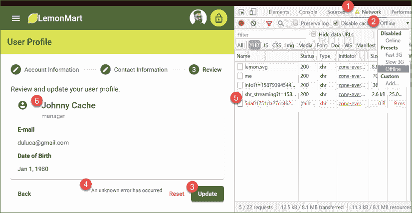

图 11.14：离线网络状态

将浏览器的网络状态设置为离线，如下所示：

1.  在 Chrome DevTools 中，导航到**网络**选项卡。

1.  在前面的截图标记为**2**的下拉菜单中选择**离线**。

1.  修改你的表单，例如名称，然后点击**更新**。

1.  你会在表单底部看到**发生未知错误**的错误信息。

1.  在**网络**选项卡中，你会看到你的 PUT 请求失败了。

1.  现在，刷新你的浏览器窗口，观察你输入的新名称仍然存在。

参考以下截图，它显示了从缓存加载数据后你收到的吐司通知：

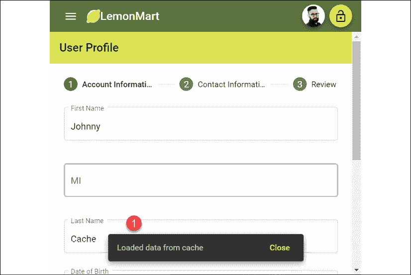

图 11.15：从缓存加载数据

在缓存周围实现一个优秀的用户体验非常具有挑战性。我提供了一个基本的方法来展示什么是可能的。然而，有许多边缘情况可能会影响你的应用程序中缓存的工作方式。

在我的情况下，缓存固执地存在，直到我们成功将数据保存到服务器。这可能会让一些用户感到沮丧。

恭喜！您已成功实现了一个复杂的表单来捕获用户数据！

# 练习

进一步增强`login`组件，以添加`AuthMode.CustomServer`的登录助手。

# 摘要

在本章中，我们涵盖了 LemonMart 的表单、指令和用户控制相关功能。我们创建了可重用的组件，可以使用数据绑定嵌入到另一个组件中。我们展示了您可以使用 PUT 向服务器发送数据并缓存用户输入的数据。我们还创建了一个响应屏幕尺寸变化的分步输入表单。通过利用可重用表单部分、基类表单以容纳常用功能以及属性指令来封装字段级错误行为和消息，我们消除了组件中的样板代码。

我们使用日期选择器、自动完成支持和表单数组创建了动态表单元素。我们实现了具有输入掩码和柠檬评分器的交互式控件。通过使用`ControlValueAccessor`接口，我们将柠檬评分器无缝集成到我们的表单中。我们展示了我们可以通过提取名称作为其自己的表单部分来线性扩展表单的大小和复杂性。此外，我们还介绍了使用网格列表构建布局。

在下一章中，我们将进一步增强我们的组件，以便我们可以使用路由器来编排它们。我们还将实现主/详细视图和数据表，并探索 NgRx 作为使用 RxJS/BehaviorSubject 的替代方案。

# 进一步阅读

+   *响应式表单*，2020 年，可在[`angular.io/guide/reactive-forms`](https://angular.io/guide/reactive-forms)找到

+   *属性指令*，2020 年，可在[`angular.io/guide/attribute-directives`](https://angular.io/guide/attribute-directives)找到

+   *rxweb: 在 Angular Reactive Forms 中显示错误消息的好方法*，Ajay Ojha，2019 年，可在[`medium.com/@oojhaajay/rxweb-good-way-to-show-the-error-messages-in-angular-reactive-forms-c27429f51278`](https://medium.com/@oojhaajay/rxweb-good-way-to-show-the-error-messages-in-angular-reactive-forms-c2)找到

+   *控制值访问器*，Jennifer Wadella，2019 年，可在[`www.youtube.com/watch?v=kVbLSN0AW-Y`](https://www.youtube.com/watch?v=kVbLSN0AW-Y)找到

+   *CSS 组合器*，2020 年，可在[`developer.mozilla.org/en-US/docs/Web/CSS/CSS_Selectors#Combinators`](https://developer.mozilla.org/en-US/docs/Web/CSS/CSS_Selectors#Combinators)找到

# 问题

尽可能地回答以下问题，以确保你在不使用谷歌搜索的情况下理解了本章的关键概念。你需要帮助回答这些问题吗？请参阅*附录 D*，*自我评估答案*，在线访问[`static.packt-cdn.com/downloads/9781838648800_Appendix_D_Self-Assessment_Answers.pdf`](https://static.packt-cdn.com/downloads/9781838648800_Appendix_D_Self-Assessment_Answers.pdf)或访问[`expertlysimple.io/angular-self-assessment`](https://expertlysimple.io/angular-self-assessment)。

1.  组件和用户控件之间的区别是什么？

1.  属性指令是什么？

1.  `ControlValueAccessor`接口的目的是什么？

1.  序列化、反序列化和活化是什么？

1.  在表单上修补值意味着什么？

1.  你如何将两个独立的`FormGroup`对象相互关联？
