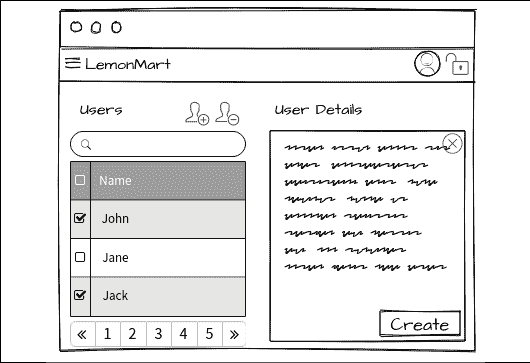
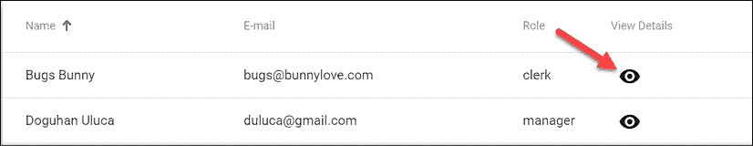
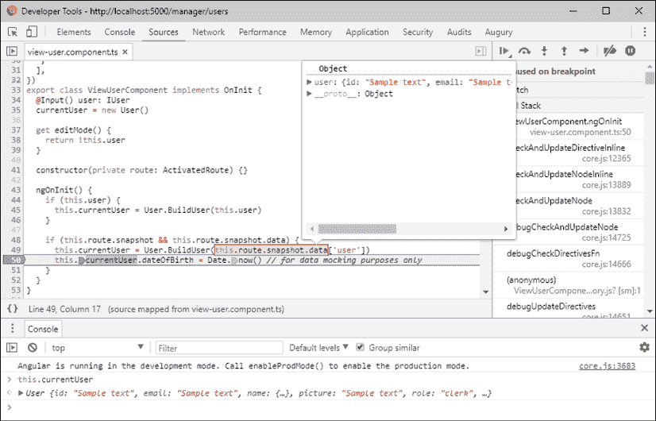
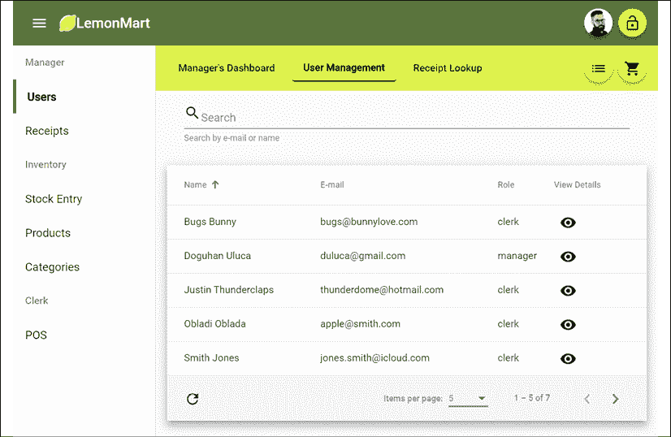
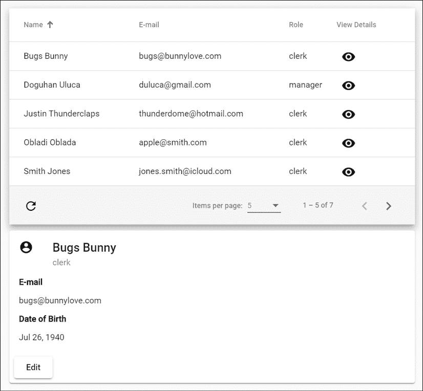
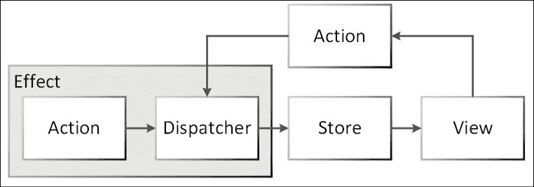
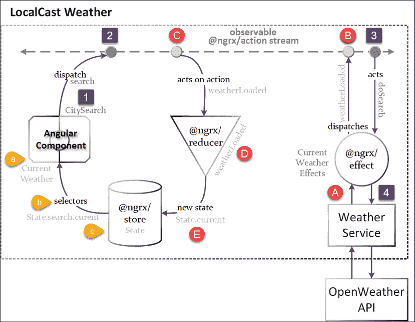
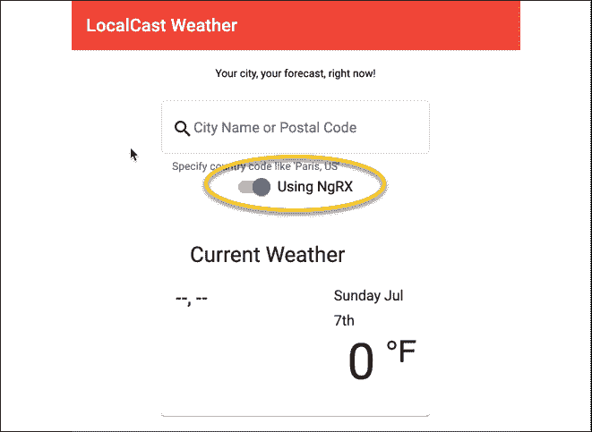
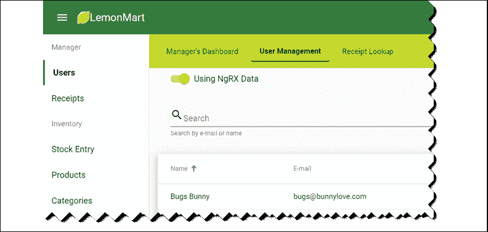
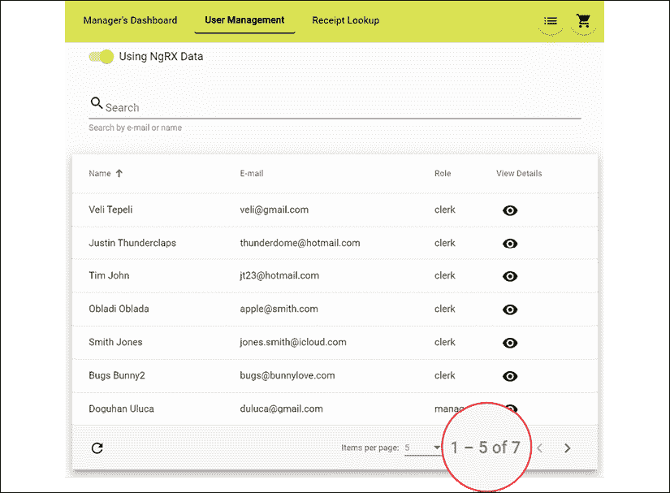

# 12

# 食谱 – 主/详细，数据表和 NgRx

本章，我们在 LemonMart 上通过实现商业应用中最常用的两个功能：主/详细视图和数据表，完成了路由优先架构的实现。我通过 LemonMart 和 LemonMart Server 的服务器端分页演示了数据表，突出了前端和后端的集成。

确保在实现本章概述的食谱时，你的**lemon-mart-server**正在运行。有关更多信息，请参阅*第十章*，*RESTful API 和全栈实现*。

我们利用路由编排的概念来编排组件如何加载数据或渲染。我们使用解析守卫在导航到组件之前加载数据时减少样板代码。我们使用辅助路由通过路由配置来布局组件。我们在多个上下文中复用相同的组件。

然后，我们使用 LocalCast 天气应用程序深入探讨 NgRx，并使用 LemonMart 探索 NgRx 数据，这样你就可以熟悉 Angular 中更高级的应用程序架构概念。到本章结束时，我们将触及 Angular 和 Angular Material 提供的大多数主要功能。

本章涵盖了大量的内容。它以食谱格式组织，因此当你正在处理项目时，可以快速参考特定的实现。我涵盖了实现架构、设计和主要组件。我突出显示重要的代码片段来解释解决方案是如何组合在一起的。利用你迄今为止所学的内容，我期望读者能够填写常规实现和配置细节。然而，如果你遇到困难，你始终可以参考 GitHub 仓库。

本章，你将学习以下主题：

+   使用解析守卫加载数据

+   带有路由数据的可复用组件

+   使用辅助路由的主/详细视图

+   带有分页的数据表

+   NgRx Store 和 Effects

+   NgRx 数据库

书籍样本代码的最新版本可在以下列表中链接的 GitHub 仓库找到。该仓库包含代码的最终和完成状态。你可以在本章末尾通过查找`projects`文件夹下的代码快照来验证你的进度。

为了为本章的基于**lemon-mart**的示例做好准备，请执行以下操作：

1.  在[`github.com/duluca/lemon-mart`](https://github.com/duluca/lemon-mart)克隆仓库

1.  在根文件夹中执行`npm install`以安装依赖项

1.  本章的代码示例位于以下子文件夹中：

    ```js
    projects/ch12 
    ```

1.  要运行本章的 Angular 应用程序，请执行以下命令：

    ```js
    npx ng serve ch12 
    ```

1.  要运行本章的 Angular 单元测试，请执行以下命令：

    ```js
    npx ng test ch12 --watch=false 
    ```

1.  要运行本章的 Angular e2e 测试，请执行以下命令：

    ```js
    npx ng e2e ch12 
    ```

1.  要构建本章的生产就绪 Angular 应用程序，请执行以下命令：

    ```js
    npx ng build ch12 --prod 
    ```

注意，存储库根目录下的 `dist/ch12` 文件夹将包含编译结果。

为了准备本章基于 **local-weather-app** 的示例，请执行以下步骤：

1.  克隆 [`github.com/duluca/local-weather-app`](https://github.com/duluca/local-weather-app) 上的 repo

1.  在根目录下执行 `npm install` 以安装依赖项

1.  本章的代码示例位于以下子文件夹中：

    ```js
    projects/ch12 
    ```

1.  要运行本章的 Angular 应用，请执行以下命令：

    ```js
    npx ng serve ch12 
    ```

1.  要运行本章的 Angular 单元测试，请执行以下命令：

    ```js
    npx ng test ch12 --watch=false 
    ```

1.  要运行本章的 Angular 端到端测试，请执行以下命令：

    ```js
    npx ng e2e ch12 
    ```

1.  要构建本章的生产就绪 Angular 应用，请执行以下命令：

    ```js
    npx ng build ch12 --prod 
    ```

记住，存储库根目录下的 `dist/ch12` 文件夹将包含编译结果。

请注意，书中或 GitHub 上的源代码可能并不总是与 Angular CLI 生成的代码匹配。由于生态系统不断演变，书中代码与 GitHub 上代码之间的实现可能也存在细微差异。随着时间的推移，示例代码发生变化是自然的。在 GitHub 上，您可能会找到更正、修复以支持库的新版本或为读者观察而并排实现多种技术的示例。读者只需实现书中推荐的理想解决方案即可。如果您发现错误或有疑问，请创建一个 GitHub 问题或提交一个拉取请求，以惠及所有读者。

您可以在 *附录 C* 中了解更多关于更新 Angular 的信息，即 *保持 Angular 和工具常青*。您可以从 [`static.packt-cdn.com/downloads/9781838648800_Appendix_C_Keeping_Angular_and_Tools_Evergreen.pdf`](https://static.packt-cdn.com/downloads/9781838648800_Appendix_C_Keeping_Angular_and_Tools_Evergreen.) 或 [`expertlysimple.io/stay-evergreen`](https://expertlysimple.io/stay-evergreen) 在线找到此附录。

在下一节中，我们将学习解析守卫，以便我们可以简化代码并减少样板代码的数量。

# 编辑现有用户

在 *第十一章* 中，我们在 *食谱 – 可重用性、路由和缓存* 中创建了一个具有 `editUser` 函数的 `ViewUserComponent`。在章节后面实现系统中的主/详细视图时，我们需要这个功能，其中经理可以看到系统中的所有用户并具有编辑他们的能力。在我们能够启用 `editUser` 功能之前，我们需要确保 `ViewUserComponent` 组件和 `ProfileComponent` 组件可以加载任何给定其 ID 的用户。

让我们从实现一个可以用于两个组件的解析守卫开始。

## 使用解析守卫加载数据

如同在*第八章*中提到的，resolve guard 是一种路由守卫。resolve guard 可以通过读取`route`参数中的记录 ID 来为组件加载数据，异步加载数据，并在组件激活和初始化时准备好数据。

Resolve guard 的主要优势包括加载逻辑的可重用性、减少了样板代码，以及减少了依赖性，因为组件可以在不导入任何服务的情况下接收所需的数据：

1.  在`user/user`下创建一个新的`user.resolve.ts`类：

    ```js
    **src/app/user/user/user.resolve.ts**
    import { Injectable } from '@angular/core'
    import { ActivatedRouteSnapshot, Resolve } from '@angular/router'
    import { catchError, map } from 'rxjs/operators'
    import { transformError } from '../../common/common'
    import { IUser, User } from './user'
    import { UserService } from './user.service'
    @Injectable()
    export class UserResolve implements Resolve<IUser> { constructor(private userService: UserService) {}
      resolve(route: ActivatedRouteSnapshot) {
        return this.userService
          .getUser(route.paramMap.get('userId'))
          .pipe(map(User.Build), catchError(transformError))
      }
    } 
    ```

    注意，与`UserService`中的`updateUser`方法类似，我们使用`map(User.Build)`来填充`user`对象，以便在组件从`route`快照加载数据时可以使用，正如我们接下来将要看到的。

1.  在`user.module.ts`中提供解析器。

    接下来，让我们配置`router`和`ProfileComponent`，以便能够加载现有用户。

1.  修改`user-routing.module.ts`以添加一个新的路径，`profile/:userId`，带有路由解析器和`canActivate AuthGuard`：

    ```js
    **src/app/user/user-routing.module.ts**
    ...
    {
        path: 'profile/:userId',
        component: ProfileComponent,
        resolve: {
          user: UserResolve,
        },
        canActivate: [AuthGuard],
      },
      ... 
    ```

    记得在`user.module.ts`中提供`UserResolve`和`AuthGuard`。

1.  将`profile`组件更新为从`route`加载数据（如果存在）：

    ```js
    **src/app/user/profile/profile.component.ts**
    ...
      constructor(
        ...
        **private route: ActivatedRoute**
      ) {
        super()
      }
      ngOnInit() {
        this.formGroup = this.buildForm()
        if (**this.route.snapshot.data.user**) {
          **this.patchUser(this.route.snapshot.data.user)**
        } else {
          this.subs.sink = combineLatest(
            [this.loadFromCache(), 
             this.authService.currentUser$]
           )
          .pipe(
            filter(
              ([cachedUser, me]) => 
                cachedUser != null || me != null
            ),
            tap(
              ([cachedUser, me]) => 
               this.patchUser(cachedUser || me)
            )
          )
          .subscribe()
        }
      } 
    ```

我们首先检查`route`快照中是否存在用户。如果存在，我们调用`patchUser`来加载此用户。否则，我们回退到我们的条件缓存加载逻辑。

注意，`patchUser`方法还设置了`currentUserId`和`nameInitialDate$`可观察对象，并调用`patchUpdateData`基类来更新表单数据。

您可以通过导航到具有您用户 ID 的配置文件来验证解析器是否工作。使用默认设置，此 URL 将类似于`http://localhost:5000/user/profile/5da01751da27cc462d265913`。

## 重新使用具有绑定和路由数据的组件

现在，让我们重构`viewUser`组件，以便我们可以在多个上下文中重用它。根据创建的 mock-ups，用户信息在应用程序中的两个地方显示。

第一个地方是我们之前章节中实现的用户配置文件的**Review**步骤。第二个地方是在`/manager/users`路由上的用户管理屏幕，如下所示：



图 12.1：经理用户管理 mock-up

为了最大化代码重用，我们需要确保我们的共享`ViewUser`组件可以在两种上下文中使用。

对于多步输入表单的**Review**步骤，我们只需将当前用户绑定到它。在第二个用例中，组件需要使用 resolve guard 来加载自己的数据，因此我们不需要实现额外的逻辑来实现我们的目标：

1.  更新`viewUser`组件以注入`ActivatedRoute`对象，并在`ngOnInit()`中将`currentUser$`从路由设置：

    ```js
    **src/app/user/view-user/view-user.component.ts**
    ...
    import { ActivatedRoute } from '@angular/router'
    export class ViewUserComponent implements OnChanges, OnInit {
      ...
      constructor(
        private route: ActivatedRoute, private router: Router
        ) {} 
      ngOnInit() {
        if (this.route.snapshot.data.user) { 
          this.currentUser$.next(this.route.snapshot.data.user)
        }
      }
      ...
    } 
    ```

    `ngOnInit`仅在组件首次初始化或被路由到时触发一次。在这种情况下，如果已解析路由的任何数据，则它将通过`next()`函数推送到`this.currentUser$`。

    我们现在有两个独立的事件来更新数据；一个用于`ngOnChanges`，它处理对`@Input`值的更新，并将其推送到`BehaviorSubject currentUser$`，如果`this.user`已被绑定。

    为了能够在多个懒加载的模块中使用此组件，我们必须将其包裹在其自己的模块中：

1.  在`src/app`下创建一个新的`shared-components.module.ts`：

    ```js
    **src/app/shared-components.module.ts**
    import { CommonModule } from '@angular/common'
    import { NgModule } from '@angular/core'
    import { FlexLayoutModule } from '@angular/flex-layout'
    import { ReactiveFormsModule } from '@angular/forms'
    import { AppMaterialModule } from './app-material.module'
    import { 
      ViewUserComponent 
    } from './user/view-user/view-user.component'
    @NgModule({
      imports: [
        CommonModule,
        ReactiveFormsModule,
        FlexLayoutModule,
        AppMaterialModule,
      ],
      declarations: [ViewUserComponent],
      exports: [ViewUserComponent],
    })
    export class SharedComponentsModule {} 
    ```

    确保将`SharedComponentsModule`模块导入到每个你打算使用`ViewUserComponent`的功能模块中。在我们的例子中，这些将是`UserModule`和`ManagerModule`。

1.  从`User`模块声明中移除`ViewUserComponent`

1.  类似地，在`SharedComponentsModule`中声明并导出`NameInputComponent`，然后清理其其他声明

1.  在`SharedComponentsModule`中导入必要的模块以支持`ViewUserComponent`和`NameInputComponent`，例如`FieldErrorModule`

我们现在已经拥有了开始实现主/详细视图的关键部分。让我们继续下一步。

# 主/详细视图辅助路由

路由器首先架构的真正力量在于使用辅助路由的实现，我们可以通过路由配置单独影响组件的布局，允许我们进行丰富的场景，其中我们可以将现有组件重新组合到不同的布局中。辅助路由是彼此独立的路由，它们可以在标记中定义的命名出口中渲染内容，例如`<router-outlet name="master">`或`<router-outlet name="detail">`。此外，辅助路由可以有自己的参数、浏览器历史记录、子路由和嵌套辅助路由。

在以下示例中，我们将使用辅助路由实现基本的主/详细视图：

1.  实现一个具有两个命名出口的简单组件：

    ```js
    **src/app/manager/user-management/user-management.component.ts**
      template: `
        <div class="horizontal-padding">
          <router-outlet name="master"></router-outlet>
          <div style="min-height: 10px"></div>
          <router-outlet name="detail"></router-outlet>
        </div>
      ` 
    ```

1.  在 manager 下添加一个新的`userTable`组件

1.  更新`manager-routing.module.ts`以定义辅助路由：

    ```js
    **src/app/manager/manager-routing.module.ts**
      ...
        {
          path: 'users',
          component: UserManagementComponent,
          children: [
            { 
              path: '', component: UserTableComponent, 
               outlet: 'master' 
            },
            {
              path: 'user',
              component: ViewUserComponent,
              outlet: 'detail',
              resolve: {
                user: UserResolve,
              },
            },
          ],
          canActivate: [AuthGuard],
          canActivateChild: [AuthGuard],
          data: {
            expectedRole: Role.Manager,
          },
        },
    ... 
    ```

    这意味着当用户导航到`/manager/users`时，他们将看到`UserTableComponent`，因为它使用的是默认路径。

1.  在`manager.module.ts`中提供`UserResolve`，因为`viewUser`依赖于它

1.  在`userTable`中实现一个临时按钮：

    ```js
    **src/app/manager/user-table/user-table.component.html**
    <a mat-button mat-icon-button [routerLink]="['/manager/users', 
        { outlets: { detail: ['user', { userId: row._id}] } }]"
        skipLocationChange>
      <mat-icon>visibility</mat-icon>
    </a> 
    ```

    `skipLocationChange`指令在导航时不会将新记录推入历史记录。因此，如果用户查看多个记录并点击**后退**按钮，他们将被带回到上一个屏幕，而不是必须先滚动查看他们查看的记录。

    想象一下，如果用户点击一个类似于之前定义的**查看详情**按钮，那么`ViewUserComponent`将为具有给定`userId`的用户渲染。在下一张截图中，你可以看到在下一节实现数据表后，**查看详情**按钮将看起来是什么样子：

    

    图 12.2：查看详情按钮

    您可以为主视图和详情视图定义任意多的组合和替代组件，从而实现动态布局的无限可能性。然而，设置`routerLink`可能会让人感到沮丧。根据具体条件，您可能需要提供或不需要提供链接中的所有或部分出口。例如，对于前面的场景，如果链接是`['/manager/users', { outlets: { master: [''], detail: ['user', {userId: row.id}] } }]`，则路由将静默失败加载。预计这些怪癖将在未来的 Angular 版本中得到解决。

    现在我们已经完成了`ViewUserComponent`的解析保护器的实现，您可以使用 Chrome DevTools 查看正确加载的数据。

    在调试之前，请确保运行我们在第十章“RESTful APIs 和全栈实现”中创建的**lemon-mart-server**。

1.  在 Chrome DevTools 中，在`this.currentUser`被分配后立即设置一个断点，如图所示：

    图 12.3：Dev Tools 调试 ViewUserComponent

您将观察到`this.currentUser`被正确设置，而无需在`ngOnInit`函数内部加载数据的任何样板代码，这显示了解析保护器的真正好处。"ViewUserComponent"是详情视图；现在让我们实现主视图，作为一个具有分页的数据表。

# 带分页的数据表

我们已经创建了主/详情视图的框架。在主出口中，我们将有一个用户的分页数据表，因此让我们实现`UserTableComponent`，它将包含一个名为`dataSource`的`MatTableDataSource`属性。我们需要能够使用标准的分页控件，如`pageSize`和`pagesToSkip`来批量获取用户数据，并且能够通过用户提供的`searchText`进一步缩小选择范围。

让我们从向`UserService`添加必要的功能开始：

1.  实现一个新的`IUsers`接口来描述分页数据的结构：

    ```js
    **src/app/user/user/user.service.ts**
    ...
    export interface IUsers {
      data: IUser[]
      total: number
    } 
    ```

1.  使用`getUsers`函数更新`UserService`的接口：

    ```js
    **src/app/user/user/user.service.ts**
    ...
    export interface IUserService {
      getUser(id: string): Observable<IUser>
      updateUser(id: string, user: IUser): Observable<IUser>
      **getUsers(pageSize: number, searchText: string,** 
     **pagesToSkip: number): Observable<IUsers>**
    }
    export class UserService extends CacheService implements IUserService {
    ... 
    ```

1.  将`getUsers`添加到`UserService`：

    ```js
    **src/app/user/user/user.service.ts**
    ...
    getUsers(
        pageSize: number,
        searchText = '',
        pagesToSkip = 0,
        sortColumn = '',
        sortDirection: '' | 'asc' | 'desc' = 'asc'
      ): Observable<IUsers> {
        const recordsToSkip = pageSize * pagesToSkip
        if (sortColumn) {
          sortColumn =
            sortDirection === 'desc' ? `-${sortColumn}` : sortColumn
        }
        return this.httpClient.get<IUsers>(
          `${environment.baseUrl}/v2/users`, { 
            params: {
              filter: searchText,
              skip: recordsToSkip.toString(),
              limit: pageSize.toString(),
              sortKey: sortColumn,
            },
          })
        }
    ... 
    ```

    注意，排序方向由关键字`asc`（升序）和`desc`（降序）表示。当我们想按升序排序一列时，我们将列名作为参数传递给服务器。要按降序排序一列，我们在列名前加上一个减号。

1.  设置`UserTable`以支持分页、排序和过滤：

    ```js
    **src/app/manager/user-table/user-table.component.ts**
    ...
    @Component({
      selector: 'app-user-table',
      templateUrl: './user-table.component.html',
      styleUrls: ['./user-table.component.css'],
    })
    export class UserTableComponent implements OnDestroy, AfterViewInit {
      displayedColumns = ['name', 'email', 'role', '_id']
      items$: Observable<IUser[]>
      resultsLength = 0
      hasError = false
      errorText = ''
      private skipLoading = false
      private subs = new SubSink()
      readonly isLoadingResults$ = new BehaviorSubject(true)
      loading$: Observable<boolean>
      refresh$ = new Subject()
      search = new FormControl('', OptionalTextValidation)
      @ViewChild(MatPaginator, { static: false })
        paginator: MatPaginator 
      @ViewChild(MatSort, { static: false }) sort: MatSort
      constructor(
        private userService: UserService
      ) {
        this.loading$ = this.isLoadingResults$
      }
      getUsers(
        pageSize: number,
        searchText: string,
        pagesToSkip: number,
        sortColumn: string,
        sortDirection: SortDirection
      ): Observable<IUsers> {
        return this.userService.getUsers(
          pageSize,
          searchText,
          pagesToSkip,
          sortColumn,
          sortDirection
        )
      }
      ngOnDestroy(): void {
        this.subs.unsubscribe()
      }
      ngAfterViewInit() {
        this.subs.sink = this.sort.sortChange
          .subscribe(() => this.paginator.firstPage()) 
        if (this.skipLoading) {
          return
        }
        **this.items$ = merge(**
     **this.refresh$,**
     **this.sort.sortChange,**
     **this.paginator.page,**
     **this.search.valueChanges.pipe(debounceTime(1000))**
     **).pipe(**
     **startWith({}),**
     **switchMap(() => {**
     **this.isLoadingResults$.next(true)**
     **return this.getUsers(**
     **this.paginator.pageSize,**
     **this.search.value,**
     **this.paginator.pageIndex,**
     **this.sort.active,**
     **this.sort.direction**
     **)**
     **}),**
     **map((results: { total: number; data: IUser[] }) => {**
     **this.isLoadingResults$.next(false)**
     **this.hasError = false**
     **this.resultsLength = results.total**
     **return results.data**
     **}),**
     **catchError((err) => {**
     **this.isLoadingResults$.next(false)**
     **this.hasError = true**
     **this.errorText = err**
     **return of([])**
     **})**
     **)**
     **this.items$.subscribe()**
      }
    } 
    ```

    我们定义并初始化各种属性以支持加载分页数据。"items$"存储用户记录，"displayedColumns"定义了我们打算显示的数据列，"paginator"和"sort"提供分页和排序偏好，而"search"提供了我们用于过滤结果的文本。

    ```js
    in pagination, sorting, and filter properties. If one property changes, the whole pipeline is triggered. This is similar to how we implemented the login routine in AuthService. The pipeline contains a call to this.userService.getUsers, which will retrieve users based on the pagination, sorting, and filter preferences passed in. Results are then piped into the this.items$ observable, which the data table subscribes to with an async pipe, so it can display the data.
    ```

1.  创建包含以下 Material 模块的`ManagerMaterialModule`：

    ```js
    **src/app/manager/manager-material.module.ts**
        MatTableModule,
        MatSortModule,
        MatPaginatorModule,
        MatProgressSpinnerModule,
        MatSlideToggleModule, 
    ```

1.  确保正确导入`manager.module.ts`中的以下内容：

    +   新的`ManageMaterialModule`

    +   基线`AppMaterialModule`

    +   以下必需模块：`FormsModule`、`ReactiveFormsModule`和`FlexLayoutModule`

1.  实现对`userTable`的 CSS：

    ```js
    **src/app/manager/user-table/user-table.component.css**
    .loading-shade {
      position: absolute;
      top: 0;
      left: 0;
      bottom: 56px;
      right: 0;
      background: rgba(0, 0, 0, 0.15);
      z-index: 1;
      display: flex;
      align-items: center;
      justify-content: center;
    }
    .filter-row {
      min-height: 64px;
      padding: 8px 24px 0;
    }
    .full-width {
      width: 100%;
    }
    .mat-paginator {
      background: transparent;
    } 
    ```

1.  最后，实现`userTable`模板：

    ```js
    **src/app/manager/user-table/user-table.component.html**
    <div class="filter-row">
      <form style="margin-bottom: 32px">
        <div fxLayout="row">
          <mat-form-field class="full-width">
            <mat-icon matPrefix>search</mat-icon>
            <input matInput placeholder="Search" aria-label="Search" [formControl]="search" />
            <mat-hint>Search by e-mail or name</mat-hint>
            <mat-error *ngIf="search.invalid">
              Type more than one character to search
            </mat-error>
          </mat-form-field>
        </div>
      </form>
    </div>
    <div class="mat-elevation-z8">
      <div class="loading-shade" *ngIf="loading$ | async as loading">
        <mat-spinner *ngIf="loading"></mat-spinner>
        <div class="error" *ngIf="hasError">
          {{ errorText }}
        </div>
      </div>
      <table mat-table class="full-width" [dataSource]="items$ | async" matSort
        matSortActive="name" matSortDirection="asc" matSortDisableClear>
        <ng-container matColumnDef="name">
          <th mat-header-cell *matHeaderCellDef mat-sort-header> Name </th>
          <td mat-cell *matCellDef="let row">
            {{ row.fullName }}
          </td>
        </ng-container>
        <ng-container matColumnDef="email">
          <th mat-header-cell *matHeaderCellDef mat-sort-header> E-mail </th>
          <td mat-cell *matCellDef="let row"> {{ row.email }} </td>
        </ng-container>
        <ng-container matColumnDef="role">
          <th mat-header-cell *matHeaderCellDef mat-sort-header> Role </th>
          <td mat-cell *matCellDef="let row"> {{ row.role }} </td>
        </ng-container>
        <ng-container matColumnDef="_id">
          <th mat-header-cell *matHeaderCellDef>View Details
          </th>
          <td mat-cell *matCellDef="let row" style="margin-right: 8px">
            <a mat-button mat-icon-button [routerLink]="[
                '/manager/users',
                { outlets: { detail: ['user', { userId: row._id }] } }
              ]" skipLocationChange>
              <mat-icon>visibility</mat-icon>
            </a>
          </td>
        </ng-container>
        <tr mat-header-row *matHeaderRowDef="displayedColumns"></tr>
        <tr mat-row *matRowDef="let row; columns: displayedColumns"> </tr>
      </table>
      <mat-toolbar>
        <mat-toolbar-row>
          <button mat-icon-button (click)="refresh$.next()">
            <mat-icon title="Refresh">refresh</mat-icon>
          </button>
          <span class="flex-spacer"></span>
          <mat-paginator [pageSizeOptions]="[5, 10, 25, 100]"
                         [length]="resultsLength">
          </mat-paginator>
        </mat-toolbar-row>
      </mat-toolbar>
    </div> 
    ```

    仅使用主视图，表格如下截图所示（确保你已经更新到 Angular 的最新版本！）：

    

    图 12.4：用户表

    如果你点击**查看**图标，`ViewUserComponent`将在详情出口中渲染，如下所示：

    

    图 12.5：主/详情视图

    在上一章中，我们实现了**编辑**按钮，将`userId`传递给`UserProfile`，以便可以编辑和更新数据。

1.  点击**编辑**按钮，将被带到`ProfileComponent`，编辑用户记录，并验证你是否可以更新其他用户的记录

1.  确认你可以在数据表中查看更新的用户记录

这个带有分页的数据表演示完成了本书中 LemonMart 的主要功能。现在，在我们继续之前，让我们确保所有测试都通过。

## 更新单元测试

让我们回顾一下`ProfileComponent`和`UserTableComponent`的一些单元测试，看看我们如何利用不同的技术来测试组件：

1.  观察单元测试文件`ProfileComponent`，并识别使用`authServiceMock`对象为组件提供初始数据：

    ```js
    **src/app/user/profile/profile.component.spec.ts**
    describe('ProfileComponent', () => {
      let component: ProfileComponent
      let fixture: ComponentFixture<ProfileComponent>
      let authServiceMock: jasmine.SpyObj<AuthService>
      beforeEach(async(() => {
        const authServiceSpy = autoSpyObj(
          AuthService,
          ['currentUser$', 'authStatus$'],
          ObservablePropertyStrategy.BehaviorSubject
        )
        TestBed.configureTestingModule({
          providers: commonTestingProviders.concat({
            provide: AuthService,
            useValue: authServiceSpy,
          }),
          imports: commonTestingModules.concat([
            UserMaterialModule,
            FieldErrorModule,
            LemonRaterModule,
          ]),
          declarations: [ProfileComponent, NameInputComponent, ViewUserComponent],
        }).compileComponents()
        authServiceMock = injectSpy(AuthService)
        fixture = TestBed.createComponent(ProfileComponent)
        component = fixture.debugElement.componentInstance
      }))
      it('should create', () => {
        authServiceMock.currentUser$.next(new User())
        authServiceMock.authStatus$.next(defaultAuthStatus)
        fixture.detectChanges()
        expect(component).toBeTruthy()
      })
    }) 
    ```

    注意，我并不是使用`angular-unit-test-helper`中的`createComponentMock`函数来导入`NameInputComponent`或`ViewUserComponent`，而是导入它们的实际实现。这是因为`createComponentMock`还不够复杂，无法处理将数据绑定到子组件。在*进一步阅读*部分，我包括了一篇由 Aiko Klostermann 撰写的博客文章，该文章涵盖了使用`@Input()`属性测试 Angular 组件。

1.  打开`UserTableComponent`的规范文件：

    在修复其提供者和导入之后，你会注意到`UserTableComponent`抛出了`ExpressionChangedAfterItHasBeenCheckedError`错误。这是因为组件初始化逻辑需要`dataSource`被定义。如果未定义，则无法创建组件。然而，我们可以在第二个`beforeEach`方法中轻松修改组件属性，该方法在`TestBed`将真实、模拟或伪造的依赖项注入到组件类之后执行。以下片段中突出显示的更改用于测试数据设置：

    ```js
    **src/app/manager/user-table/user-table.component.spec.ts**
    ...
    beforeEach(() => {
        fixture = TestBed.createComponent(UserTableComponent)
        component = fixture.componentInstance
        **component.items$ = of([new User()])**
     **Object.assign(component, { skipLoading: true })**
        fixture.detectChanges()
    })
    ... 
    ```

    到现在为止，你可能已经注意到，仅仅通过更新一些我们的核心配置文件，例如`commonTestingProviders`和`commonTestingModules`，一些测试通过了，其余的测试可以通过应用我们在整本书中使用的各种模式来解决。例如，`user-management.component.spec.ts`使用了我们创建的通用测试模块和提供者：

    ```js
    **src/app/manager/user-management/user-management.component.spec.ts**
    providers: commonTestingProviders,
    imports: commonTestingModules.concat([ManagerMaterialModule]), 
    ```

    当你在模拟提供者时，请记住正在测试的模块、组件、服务或类，并注意只模拟依赖项。

    `ViewUserComponent` 是一个特殊情况，我们无法使用我们常见的测试模块和提供者，否则我们最终会创建一个循环依赖。在这种情况下，手动指定需要导入的模块。

1.  修复单元测试配置，以确保所有测试都通过且不生成警告。

完成实现的重任后，我们现在可以探索替代架构、工具和库，以更好地理解为各种需求构建 Angular 应用程序的最佳方式。接下来，让我们探索 NgRx。

# NgRx Store 和 Effects

如 *第一章* 中所述，*Angular 及其概念简介*，NgRx 库基于 RxJS 将响应式状态管理引入 Angular。使用 NgRx 进行状态管理允许开发者编写原子性、自包含和可组合的代码片段，创建动作、reducer 和选择器。这种响应式编程允许在状态变化中隔离副作用。本质上，NgRx 是 RxJS 之上的一个抽象层，以适应 Flux 模式。

NgRx 有四个主要元素：

+   **Store**：状态信息持久化的中心位置。您在 store 中实现一个 reducer 以存储状态转换，并实现一个选择器以从 store 中读取数据。这些都是原子性和可组合的代码片段。

    一个视图（或用户界面）通过使用选择器显示 store 中的数据。

+   **动作**：在整个应用程序中发生的独特事件。

    动作从视图触发，目的是将它们分发给 store。

+   **分发器**：这是一种将动作发送到 store 的方法。

    Store 上的 reducer 监听已分发的动作。

+   **效果**：这是动作和分发器的组合。效果通常用于不是从视图触发的动作。

让我们重新审视以下 Flux 模式图，现在它突出显示了一个**效果**：



图 12.6：Flux 模式图

让我们通过一个具体的例子来演示 NgRx 的工作原理。为了使其简单，我们将利用 LocalCast 天气应用。

## 为 LocalCast 天气实现 NgRx

我们将在 LocalCast 天气应用中实现 NgRx 以执行搜索功能。考虑以下架构图：



图 12.7：LocalCast 天气架构

为了实现我们的实现，我们将同时使用 NgRx store 和 effects 库。NgRx store 动作在图中以浅灰色显示，包括 `WeatherLoaded` reducer 和应用状态。在顶部，动作被表示为一系列各种数据对象，这些对象要么分发动作，要么对已分发的动作进行操作，使我们能够实现 Flux 模式。NgRx effects 库通过在其自己的模型中隔离副作用，而不在 store 中散布临时数据，从而扩展了 Flux 模式。

以深灰色表示的效果工作流程从**步骤 1**开始：

1.  `CitySearchComponent` 分发 `search` 动作

1.  `search` 动作出现在 `@ngrx/action` 可观察流（或数据流）中

1.  `CurrentWeatherEffects` 对 `search` 动作进行操作以执行搜索

1.  `WeatherService` 执行搜索以从**OpenWeather API**检索当前天气信息

以浅灰色表示的存储动作从**步骤 A**开始：

1.  `CurrentWeatherEffects` 分发 `weatherLoaded` 动作

1.  `weatherLoaded` 动作出现在数据流中

1.  `weatherLoaded` 减法器对 `weatherLoaded` 动作进行操作

1.  `weatherLoaded` 减法器将天气信息转换为要存储的新状态

1.  新状态是持久化的 `search` 状态，是 `appStore` 状态的一部分

注意，存在一个父级 `appStore` 状态，其中包含一个子 `search` 状态。我故意保留这种设置来演示当您向存储中添加不同类型的数据元素时，父级状态是如何扩展的。

最后，一个视图从存储中读取，从**步骤 a**开始：

1.  `CurrentWeather` 组件使用 `async` 管道订阅 `selectCurrentWeather` 选择器

1.  `selectCurrentWeather` 选择器监听 `appStore` 状态中 `store.search.current` 属性的变化

1.  `appStore` 状态检索持久化的数据

使用 NgRx，当用户搜索城市时，检索、持久化和在 `CurrentWeatherComponent` 上显示该信息的动作会通过单个可组合和不可变元素自动发生。

## 比较 BehaviorSubject 和 NgRx

我们将同时实现 NgRx 和 `BehaviorSubjects`，这样您可以看到同一功能的实现差异。为此，我们需要一个滑动切换来在两种策略之间切换：

本节使用 **local-weather-app** 仓库。您可以在 `projects/ch12` 文件夹下找到本章的代码示例。

1.  从在 `CitySearchComponent` 上实现 `<mat-slide-toggle>` 元素开始，如下面的截图所示：

    图 12.8：LocalCast Weather 滑动切换

    确保该字段由组件上的 `useNgRx` 属性支持。

1.  将 `doSearch` 方法重构为提取名为 `behaviorSubjectBasedSearch` 的 `BehaviorSubject` 代码作为其自己的函数

1.  创建一个名为 `ngRxBasedSearch` 的函数原型：

    ```js
    **src/app/city-search/city-search.component.ts**
    doSearch(searchValue: string) {
      const userInput = searchValue.split(',').map((s) => s.trim())
      const searchText = userInput[0]
      const country = userInput.length > 1 ? userInput[1] : undefined
      **if (this.useNgRx) {**
     **this.ngRxBasedSearch(searchText, country)**
     **} else {**
     **this.behaviorSubjectBasedSearch(searchText, country)**
     **}**
    } 
    ```

我们将从您刚刚创建的 `ngRxBasedSearch` 函数中分发一个动作。

## 设置 NgRx

您可以使用以下命令添加 NgRx Store 包：

```js
$ npx ng add @ngrx/store 
```

这将创建一个包含 `index.ts` 文件的 `reducers` 文件夹。现在添加 NgRx effects 包：

```js
$ npx ng add @ngrx/effects --minimal 
```

我们在这里使用 `--minimal` 选项来避免创建不必要的样板代码。

接下来，安装 NgRx 模式库，这样您就可以利用生成器为您创建样板代码：

```js
$ npm i -D @ngrx/schematics 
```

由于 NgRx 高度解耦的特性，实现 NgRx 可能会令人困惑，这需要对其内部工作原理有一定的了解。

在`projects/ch12`下的示例项目配置了`@ngrx/store-devtools`进行调试。

如果你希望在运行时进行调试或仪表化，并能够`console.log` NgRx 动作，请参阅附录 A，*调试 Angular*。

## 定义 NgRx 动作

在我们可以实现效果或还原器之前，我们首先需要定义我们的应用程序将要能够执行的动作。对于 LocalCast Weather，有两种类型的动作：

+   `search`：获取正在搜索的城市或邮编的当前天气

+   `weatherLoaded`：表示已获取新的当前天气信息

通过运行以下命令创建一个名为`search`的动作：

```js
$ npx ng generate @ngrx/schematics:action search --group --creators 
```

按提示选择默认选项。

`--group`选项将动作分组在名为`action`的文件夹下。`--creators`选项使用创建函数来实现动作和还原器，这是一种更熟悉且直接的方法来实现这些组件。

现在，让我们使用`createAction`函数实现两个动作，提供一个名称和预期的输入参数列表：

```js
**src/app/action/search.actions.ts**
import { createAction, props, union } from '@ngrx/store'
import { ICurrentWeather } from '../interfaces'
export const SearchActions = {
  search: createAction(
    '[Search] Search',
    props<{ searchText: string; country?: string }>()
  ),
  weatherLoaded: createAction( 
    '[Search] CurrentWeather loaded',
    props<{ current: ICurrentWeather }>()
  ),
}
const all = union(SearchActions)
export type SearchActions = typeof all 
```

搜索操作名为`'[Search] Search'`，输入参数包括`searchText`和一个可选的`country`参数。`weatherLoaded`操作遵循类似的模式。在文件末尾，我们创建了一个动作的联合类型，这样我们就可以将它们分组在同一个父类型下，以便在应用程序的其余部分使用。

注意，动作名称前缀为`[Search]`。这是一个帮助开发者在调试期间视觉上分组相关动作的约定。

现在我们已经定义了动作，我们可以实现效果来处理搜索动作并分发一个`weatherLoaded`动作。

## 实现 NgRx 效果

如前所述，效果允许我们更改存储的状态，而无需存储导致更改的事件数据。例如，我们希望我们的状态只包含天气数据，而不是搜索文本本身。效果允许我们一步完成这项工作，而不是强迫我们使用中间存储来存储`searchText`，以及一个更为复杂的链式事件来将其转换为天气数据。

否则，我们不得不在中间实现一个还原器，首先将此值存储在存储中，然后稍后从服务中检索它并分发一个`weatherLoaded`动作。效果将使数据检索变得简单。

现在我们将`CurrentWeatherEffects`添加到我们的应用程序中：

```js
$ npx ng generate @ngrx/schematics:effect currentWeather --module=app.module.ts --root --group --creators 
```

按提示选择默认选项。

你将在`effects`文件夹下有一个新的`current-weather.effects.ts`文件。

再次强调，`--group`用于将效果分组在同名文件夹下。`--root`在`app.module.ts`中注册效果，我们使用带有`--creators`选项的创建函数。

在`CurrentWeatherEffects`文件中，首先实现一个私有的`doSearch`方法：

```js
**src/app/effects/current-weather.effects.ts**
private doSearch(action: { searchText: string; country?: string }) {
  return this.weatherService.getCurrentWeather(
    action.searchText,
    action.country
  ).pipe(
    map((weather) =>
      SearchActions.weatherLoaded({ current: weather })
    ),
    catchError(() => EMPTY)
  )
} 
```

注意，我们选择忽略由`EMPTY`函数抛出的错误。你可以使用类似于为 LemonMart 实现的`UiService`将这些错误暴露给用户。

此函数接收一个带有搜索参数的动作，调用`getCurrentWeather`，并在收到响应后，派发`weatherLoaded`动作，传递当前天气属性。

现在让我们创建效果本身，这样我们就可以触发`doSearch`函数：

```js
**src/app/effects/current-weather.effects.ts**
getCurrentWeather$ = createEffect(() =>
  this.actions$.pipe(
    ofType(SearchActions.search), 
    exhaustMap((action) => this.doSearch(action))
  )
) 
```

这是我们接入可观察的动作流`this.actions$`并监听`SearchAction.search`类型动作的地方。然后我们使用`exhaustMap`操作符来注册发射的事件。由于其独特的性质，`exhaustMap`不会允许在`doSearch`函数完成其`weatherLoaded`动作的派发之前处理另一个搜索动作。

对所有不同的 RxJS 操作符感到困惑，担心你永远不会记住它们？请参阅*附录 B*，*Angular Cheat Sheet*，以获取快速参考。

## 实现 reducers

在`weatherLoaded`动作触发后，我们需要一种方法来摄取当前的天气信息并将其存储在我们的`appStore`状态中。reducers 将帮助我们处理特定动作，创建一个隔离且不可变的管道，以可预测的方式存储我们的数据。

让我们创建一个搜索 reducer：

```js
$ npx ng generate @ngrx/schematics:reducer search 
    --reducers=reducers/index.ts --group --creators 
```

采用默认选项。在这里，我们使用`--group`来保持文件在`reducers`文件夹下组织，并使用`--creators`来利用创建 NgRx 组件的创建者风格。我们还使用`--reducers`指定我们的父`appStore`状态的位置在`reducers/index.ts`，这样我们的新 reducer 就可以注册到它。

你可能会注意到`reducers.index.ts`已经更新以注册新的`search.reducer.ts`。让我们一步一步地实现它。

在`search`状态中，我们将存储当前天气，因此实现接口以反映这一点：

```js
**src/app/reducers/search.reducer.ts**
export interface State {
  current: ICurrentWeather
} 
```

现在让我们指定`initialState`。这类似于我们需要定义`BehaviorSubject`的默认值。重构`WeatherService`以导出`const defaultWeather: ICurrentWeather`对象，你可以使用它来初始化`BehaviorSubject`和`initialState`。

```js
**src/app/reducers/search.reducer.ts**
export const initialState: 
  State = { current:
  defaultWeather,
} 
```

最后，使用`on`操作符实现`searchReducer`以处理`weatherLoaded`动作：

```js
**src/app/reducers/search.reducer.ts**
const searchReducer = createReducer(
  initialState,
  on(SearchActions.weatherLoaded, (state, action) => {
    return {
      ...state,
    current: action.current,
    }
  })
) 
```

我们只需注册`weatherLoaded`动作，并解包其中存储的数据，然后将其传递到`search`状态。

这当然是一个非常简单的例子。然而，很容易想象一个更复杂的场景，在那里我们可能需要将接收到的数据展平或处理，并以易于消费的方式存储它。以不可变的方式隔离这种逻辑是使用像 NgRx 这样的库的关键价值主张。

## 使用选择器在 Store 中注册

我们需要`CurrentWeatherComponent`注册到`appStore`状态以更新当前天气数据。

首先，通过依赖注入`appStore`状态并注册选择器来从`State`对象中提取当前天气：

```js
**src/app/current-weather/current-weather.component.ts**
**import * as appStore from '../reducers'**
export class CurrentWeatherComponent {
  current$: Observable<ICurrentWeather>
  constructor(**private store: Store<appStore.State**>) {
    this.current$ =
      **this.store.pipe(select((state: State) => state.search.current))**
  } 
  ...
} 
```

我们简单地监听通过商店流动的状态变化事件。使用`select`函数，我们可以实现一个内联选择，以获取我们所需的数据片段。

我们可以稍微重构一下，通过使用`createSelector`在`reducers/index.ts`上创建一个`selectCurrentWeather`属性，使我们的选择器可重用：

```js
**src/app/reducers/index.ts**
export const selectCurrentWeather = createSelector(
  (state: State) => state.search.current,
  current => current
) 
```

此外，由于我们希望保持`BehaviorSubject`的持续操作，我们可以在`CurrentWeatherComponent`中实现一个`merge`操作符，以监听`WeatherService`更新和`appStore`状态更新：

```js
**src/app/current-weather/current-weather.component.ts**
import * as appStore from '../reducers'
  constructor(
    private weatherService: WeatherService,
    private store: Store<appStore.State>
  ) {
    this.current$ = merge(
      **this.store.pipe(select(appStore.selectCurrentWeather)),**
      this.weatherService.currentWeather$
    )
  } 
```

现在我们能够监听商店更新了，让我们实现拼图的最后一部分：分发搜索动作。

## 分发商店动作

我们需要分发搜索动作，以便我们的搜索效果可以获取当前天气数据并更新商店。在本章的早期部分，您在`CitySearchComponent`中实现了一个名为`ngRxBasedSearch`的存根函数。

让我们实现`ngRxBasedSearch`：

```js
**src/app/city-search/city-search.component.ts**
ngRxBasedSearch(searchText: string, country?: string) {
  this.store.dispatch(SearchActions.search({ searchText, country }))
} 
```

不要忘记将`appState`商店注入到组件中！

就是这样！现在你应该能够运行你的代码并测试是否一切正常工作。

如您所见，NgRx 带来了许多复杂的技巧，以创建使数据转换不可变、定义良好和可预测的方法。然而，这伴随着相当大的实现开销。请使用您的最佳判断来决定您是否真的需要在您的 Angular 应用程序中使用 Flux 模式。通常，前端应用程序代码可以通过实现返回平面数据对象的 RESTful API 来简化，复杂的数据处理在服务器端进行。

## 单元测试 reducer 和选择器

您可以在`search.reducer.spec.ts`中为`weatherLoaded`reducer 和`selectCurrentWeather`选择器实现单元测试：

```js
**src/app/reducers/search.reducer.spec.ts**
import { SearchActions } from '../actions/search.actions'
import { defaultWeather } from '../weather/weather.service'
import { fakeWeather } from '../weather/weather.service.fake'
import { selectCurrentWeather } from './index'
import { initialState, reducer } from './search.reducer'
describe('Search Reducer', () => {
  describe('weatherLoaded', () => {
    it('should return current weather', () => {
      const action = SearchActions.weatherLoaded({ current: fakeWeather })
      const result = reducer(initialState, action)
      expect(result).toEqual({ current: fakeWeather })
    })
  })
})
describe('Search Selectors', () => { 
  it('should selectCurrentWeather', () => {
    const expectedWeather = defaultWeather
    expect(selectCurrentWeather({ search: { current: defaultWeather }
})).toEqual(
      expectedWeather
    )
  })
}) 
```

这些单元测试相当直接，将确保在商店内不会发生对数据结构的意外更改。

## 使用 MockStore 进行单元测试组件

您需要更新`CurrentWeatherComponent`的测试，以便我们可以将模拟的`Store`注入到组件中，以测试`current$`属性的值。

让我们看看需要添加到规范文件中的 delta，以配置模拟商店：

```js
**src/app/current-weather/current-weather.component.spec.ts**
import { MockStore, provideMockStore } from '@ngrx/store/testing'
describe('CurrentWeatherComponent', () => {
  ...
  let store: MockStore<{ search: { current: ICurrentWeather } }>
  const initialState = { search: { current: defaultWeather } }
  beforeEach(async(() => {
    ...
    TestBed.configureTestingModule({
      imports: [AppMaterialModule],
      providers: [
        ...
        **provideMockStore({ initialState }),**
      ],
    }).compileComponents()
    ...
    **store = TestBed.inject(Store) as any**
  }))
...
}) 
```

我们现在可以更新`'should get currentWeather from weatherService'`测试，以查看`CurrentWeatherComponent`是否与模拟商店一起工作：

```js
**src/app/current-weather/current-weather.component.spec.ts**
it('should get currentWeather from weatherService', (done) => {
  // Arrange
  store.setState({ search: { current: fakeWeather } })
  weatherServiceMock.currentWeather$.next(fakeWeather)
  // Act
  fixture.detectChanges() // triggers ngOnInit()
  // Assert
  expect(component.current$).toBeDefined()
  component.current$.subscribe(current => { 
    expect(current.city).toEqual('Bethesda')
    expect(current.temperature).toEqual(280.32)
    // Assert on DOM
    const debugEl = fixture.debugElement
    const titleEl: HTMLElement =
      debugEl.query(By.css('.mat-title')).nativeElement
    expect(titleEl.textContent).toContain('Bethesda')
    done()
  })
}) 
```

模拟商店允许我们设置商店的当前状态，这反过来又允许构造函数中的选择器调用触发并获取提供的假天气数据。

TestBed 不是在 Angular 中编写单元测试的强制要求，这是一个在 [`angular.io/guide/testing`](https://angular.io/guide/testing) 中得到良好阐述的话题。我的同事和本书的审稿人 Brendon Caulkins 为本章提供了一个无床的规范文件，名为 `current-weather.component.nobed.spec.ts`。他提到，在运行测试时，由于导入较少和维护较少，测试性能显著提高，但需要更高水平的关注和专业知识来实现测试。如果你在一个大型项目中，你应该认真考虑跳过 `TestBed`。

你可以在 GitHub 的 `projects/ch12` 文件夹下找到示例代码。

继续更新你剩余的测试，直到它们全部通过后再继续。

# NgRx Data

如果 NgRx 是一个基于配置的框架，那么 NgRx Data 就是 NgRx 的基于约定的兄弟。NgRx Data 自动创建存储、效果、动作、还原器、分发和选择器。如果你的大多数应用程序动作是 **CRUD**（**创建**、**检索**、**更新**和**删除**）操作，那么 NgRx Data 可以用更少的代码实现与 NgRx 相同的结果。

NgRx Data 可能是你和你的团队更好地了解 Flux 模式的入门，然后你可以继续学习 NgRx 本身。

`@ngrx/data` 与 `@ngrx/entity` 库协同工作。它们一起提供了一套丰富的功能，包括事务性数据管理。更多关于它的信息请参阅 [`ngrx.io/guide/data`](https://ngrx.io/guide/data)。

对于这个示例，我们将切换回 LemonMart 项目。

通过执行以下命令将 NgRx Data 添加到你的项目中：

```js
$ npx ng add @ngrx/store --minimal
$ npx ng add @ngrx/effects --minimal
$ npx ng add @ngrx/entity
$ npx ng add @ngrx/data 
```

`projects/ch12` 下的示例项目配置了 `@ngrx/store-devtools` 用于调试。

如果你希望能够在运行时进行调试或仪表化，并使用 `console.log` NgRx 动作，请参阅 *附录 A*，*调试 Angular*。

## 在 LemonMart 中实现 NgRx/Data

在 LemonMart 中，我们有一个很好的用例来使用 `@ngrx/data` 库，特别是 `User` 类和 `UserService`。它巧妙地表示了一个可以支持 CRUD 操作的实体。通过一些修改和最少的努力，你就可以看到库的实际应用。

本节使用 **lemon-mart** 仓库。你可以在 `projects/ch12` 文件夹下找到本章的代码示例。

1.  让我们从在 `entity-metadata.ts` 中定义 `User` 实体开始：

    ```js
    **src/app/entity-metadata.ts**
    import { EntityMetadataMap } from '@ngrx/data'
    const entityMetadata: EntityMetadataMap = {
      User: {},
    }
    export const entityConfig = {
      entityMetadata,
    } 
    ```

1.  确保将 `entityConfig` 对象注册到 `EntityDataModule`：

    ```js
    **src/app/app.module.ts**
    imports: [
      ...
      StoreModule.forRoot({}),
      EffectsModule.forRoot([]),
      EntityDataModule.forRoot(entityConfig),
    ] 
    ```

1.  创建一个 `User` 实体服务：

    ```js
    **src/app/user/user/user.entity.service.ts**
    import { Injectable } from '@angular/core' 
    import {
      EntityCollectionServiceBase,
      EntityCollectionServiceElementsFactory,
    } from '@ngrx/data'
    import { User } from './user'
    @Injectable({ providedIn: 'root' })
    export class UserEntityService
      extends EntityCollectionServiceBase<User> {
      constructor(
        serviceElementsFactory: EntityCollectionServiceElementsFactory
      ) {
        super('User', serviceElementsFactory)
      }
    } 
    ```

现在，你已经拥有了所有基本元素，可以将实体服务与组件集成。从某种意义上说，设置 NgRx Data 如此简单。然而，我们需要对其进行一些定制以适应我们现有的 REST API 结构，这将在下一节中详细说明。如果你遵循 NgRx Data 期望的 API 实现模式，那么不需要进行任何更改。

NgRx Data 想要通过 `/api` 路径访问 REST API，该路径托管在与你的 Angular 应用程序相同的端口上。为了在开发期间完成此操作，我们需要利用 Angular CLI 的代理功能。

## 在 Angular CLI 中配置代理

通常，发送到我们的 web 服务器和 API 服务器的 HTTP 请求应该有完全相同的 URL。然而，在开发过程中，我们通常在 `http://localhost` 的两个不同端口上托管两个应用程序。某些库，包括 NgRx Data，要求 HTTP 调用在同一个端口上。这为创建无摩擦的开发体验带来了挑战。因此，Angular CLI 随带了一个代理功能，你可以将 `/api` 路径指向 localhost 上的不同端点。这样，你可以使用一个端口来提供你的 web 应用程序和 API 请求。

1.  在 `src` 下创建一个 `proxy.conf.json` 文件，如下所示：

    如果你正在 **lemon-mart-server** monorepo 中工作，这将是在 `web-app/src`。

    ```js
    **proxy.conf.json**
    {
      "/api": {
        "target": "http://localhost:3000",
        "secure": false,
        "pathRewrite": {
           "^/api": ""
        }
      }
    } 
    ```

1.  使用 `angular.json` 注册代理：

    ```js
    **angular.json**
    ...
    "serve": {
      "builder": "@angular-devkit/build-angular:dev-server",
      "options": {
        "browserTarget": "lemon-mart:build",
        "proxyConfig": "proxy.conf.json"
      },
      ...
    } 
    ```

现在，当你运行 `npm start` 或 `ng serve` 时启动的服务可以重写对 `/api` 路径的任何调用，使用 `http://localhost:3000`。这是默认运行 **lemon-mart-server** 的端口。

如果你的 API 在不同的端口上运行，那么请使用正确的端口号和子路由。

接下来，让我们使用 `UserEntityService`。

## 使用实体服务

我们将更新用户管理主视图，因此我们可以选择使用 `BehaviorSubject` 或我们刚刚创建的 `UserEntityService`。

1.  首先，在 `user-table.component.ts` 中实现一个切换开关，类似于我们在本章前面为 LocalCast Weather 和 NgRx 所做的那样！

    图 12.9：具有 NgRx 滑动切换的 UserTableComponent

1.  将新服务注入到 `UserTableComponent` 中，并将其加载可观察对象与组件上现有的可观察对象合并：

    ```js
    **src/app/manager/user-table/user-table.component.ts**
    useNgRxData = true
    readonly isLoadingResults$ = new BehaviorSubject(true) loading$: Observable<boolean>
    constructor(
      private userService: UserService,
      **private userEntityService: UserEntityService**
    **) {**
      this.loading$ = merge(
        **this.userEntityService.loading$,** 
        this.isLoadingResults$
      )
    } 
    ```

    由于 `EntityDataModule` 在我们应用程序的根目录 `app.module.ts` 中注册，因此我们还需要在 `app.module.ts` 中提供 `UserService`，这样我们就可以在 `UserEntityService` 中使用它。尽管 `UserEntityService` 在 `UserModule` 中提供，但 NgRx Data 中的操作顺序不适合与功能模块正确工作。这可能在某个时候得到修复。

1.  你可以向组件中添加 CRUD 方法，如下面的代码所示。然而，我们将专注于仅更新 `getUsers` 函数，因此不需要添加其他方法：

    ```js
    **src/app/manager/user-table/user-table.component.ts**
    **getUsers() {**
     **return this.userEntityService.getAll().pipe(**
     **map((value) => {**
     **return { total: value.length, data: value }**
     **})**
     **)**
    **}**
    add(user: User) { 
      this.userEntityService.add(user)
    }
    delete(user: User) { 
      this.userEntityService.delete(user._id)
    }
    update(user: User) { 
      this.userEntityService.update(user)
    } 
    ```

1.  在 `ngAfterViewInit` 中，重构对 `this.userService.getUsers` 的调用，使其从名为 `getUsers` 的方法中调用

1.  然后实现一个对 `this.userEntityService.getAll()` 的条件调用，并映射出返回值以适应 `IUsers` 接口：

    ```js
    **src/app/manager/user-table/user-table.component.ts**
    ...
      getUsers(pageSize: number, searchText = '', pagesToSkip = 0)
        : Observable<IUsers> {
          if (this.useNgRxData) {
            return this.userEntityService.getAll().pipe(   
              map((value) => {
                return { total: value.length, data: value }
              })
            )
          } else {
            return this.userService.getUsers(
              pageSize,
              searchText,
              pagesToSkip,
              sortColumn,
              sortDirection
            )
          } 
    ```

现在，您的组件可以通过切换滑动开关并输入一些新的搜索文本来尝试从任一来源获取数据。然而，我们的端点没有以 NgRx Data 期望的形状提供数据，因此我们需要自定义实体服务来克服这个问题。

## 自定义实体服务

您可以在多个位置自定义 NgRx Data 的行为。我们感兴趣的是覆盖`getAll()`函数的行为，以便我们接收到的数据得到适当的初始化，并且可以从项目的对象中提取数据。

对于这个例子，我们不会尝试使用 NgRx Data 恢复完整的分页功能。为了保持简单，我们只关注将数据数组获取到数据表中。

更新用户实体服务以注入`UserService`并实现一个使用它的`getAll`函数：

```js
**src/app/user/user/user.entity.service.ts**
...
getAll(options?: EntityActionOptions): Observable<User[]> {
  return this.userService
    .getUsers(10)
    .pipe(map((users) => users.data.map(User.Build)))
}
... 
```

如您所见，我们正在遍历项目的对象，并使用我们的构建函数初始化对象，从而将`Observable<IUsers>`扁平化和转换为`Observable<User[]>`。

实施此更改后，您应该能够看到数据如下流入用户表：



图 12.10：NgRx Data 的用户表

注意，所有七个用户同时显示，如图中放大截图所示，分页功能没有正常工作。然而，这个实现足以展示 NgRx Data 带来的好处。

那么，您应该在您的下一个应用中实现 NgRx Data 吗？这取决于。由于该库是 NgRx 之上的抽象层，如果您没有很好地理解 NgRx 的内部结构，您可能会感到迷茫和受限。然而，该库在减少实体数据管理和 CRUD 操作方面的样板代码方面有很大的潜力。如果您在应用中执行大量的 CRUD 操作，您可能会节省时间，但请务必只将实现范围限制在需要它的区域。无论如何，您都应该关注这个伟大库的演变。

# 摘要

在本章中，我们使用路由优先架构和我们的食谱完成了对所有主要 Angular 应用设计考虑因素的回顾，从而轻松实现了一个业务应用。我们回顾了如何编辑现有用户，利用 resolve guard 加载用户数据，以及在不同的上下文中初始化和重用组件。

我们使用辅助路由实现了主/详细视图，并展示了如何构建具有分页的数据表。然后我们学习了 NgRx 和`@ngrx/data`库以及它们对我们代码库的影响，使用了**local-weather-app**和**lemon-mart**项目。

总体来说，通过使用路由优先的设计、架构和实现方法，我们以良好的高级理解来应对我们的应用程序设计，以实现我们想要达到的目标。通过早期识别代码复用机会，我们能够优化我们的实现策略，提前实现可重用组件，而不会冒着过度工程化解决方案的风险。

在下一章中，我们将在 AWS 上设置一个高可用性基础设施来托管 LemonMart。我们将更新项目以添加新脚本，以实现无停机时间的蓝绿部署。最后，在最后一章中，我们将更新 LemonMart 以使用 Google Analytics，并讨论高级云运维问题。

# 进一步阅读

+   *使用 @Input() 测试 Angular 组件*，艾可·克洛斯特曼，2017，可在[`medium.com/better-programming/testing-angular-components-with-input-3bd6c07cfaf6`](https://medium.com/better-programming/testing-angular-components-with-input-3bd6c07cfaf6)找到

+   *什么是 NgRx？*，2020，可在[`ngrx.io/docs`](https://ngrx.io/docs)找到

+   *NgRx 测试*，2020，可在[`ngrx.io/guide/store/testing`](https://ngrx.io/guide/store/testing)找到

+   *@ngrx/data*，2020，可在[`ngrx.io/guide/data`](https://ngrx.io/guide/data)找到

+   *重新设计 NgRx 的动作创建者*，亚历克斯·奥库什科，2019，可在[`medium.com/angular-in-depth/ngrx-action-creators-redesigned-d396960e46da`](https://medium.com/angular-in-depth/ngrx-action-creators-redesigned-d396960e46da)找到

+   *使用 Observable Store 简化前端状态管理*，丹·瓦林，2019，可在[`blog.codewithdan.com/simplifying-front-end-state-management-with-observable-store/`](https://blog.codewithdan.com/simplifying-front-end-state-management-with-observable-store/)找到

# 问题

尽可能地回答以下问题，以确保你已理解本章的关键概念，无需使用 Google。你需要帮助回答这些问题吗？请参阅 *附录 D*，*自我评估答案*，可在[`static.packt-cdn.com/downloads/9781838648800_Appendix_D_Self-Assessment_Answers.pdf`](https://static.packt-cdn.com/downloads/9781838648800_Appendix_D_Self-Assessment_Answers.pdf)在线找到，或访问[`expertlysimple.io/angular-self-assessment`](https://expertlysimple.io/angular-self-assessment)。

1.  什么是解析守卫？

1.  路由编排有什么好处？

1.  什么是辅助路由？

1.  NgRx 与使用 RxJS/Subject 有何不同？

1.  NgRx 数据的价值是什么？

1.  在 `UserTableComponent` 中，为什么我们使用 `readonly isLoadingResults$: BehaviorSubject<Boolean>` 而不是简单的布尔值来驱动加载指示器？
