# 13

# AWS 上的高可用云基础设施

互联网是一个充满敌意的环境。有好的和坏的参与者。坏参与者可能会试图在您的安全中找到漏洞，或者试图通过 **分布式拒绝服务**（**DDoS**）攻击使您的网站崩溃。如果您幸运的话，好的参与者会喜欢您的网站，并且不会停止使用它。他们会对您的网站提出改进建议，但他们也可能遇到错误，并且由于高流量，您的网站可能会因为过于热情而变得缓慢。在互联网上的实际部署需要大量的专业知识才能正确完成。作为一名全栈开发者，您只能了解硬件、软件和网络的一些细微差别。幸运的是，随着云服务提供商的出现，许多这种专业知识已经转化为软件配置，而复杂的硬件和网络问题则由提供商处理。

云服务提供商的最佳特性之一是云的可扩展性，这指的是您的服务器会自动扩展以应对意外的流量高峰，并在流量恢复正常水平时缩减规模以节省成本。**亚马逊网络服务**（**AWS**）不仅超越了基本的云可扩展性，还引入了高可用性和容错概念，允许实现弹性本地和全球部署。我选择向您介绍 AWS，是因为其庞大的功能，这些功能远远超出了我在本书中将要涉及的内容。使用 Route 53，您可以获得免费的 DDoS 保护；使用 API Gateway，您可以创建 API 密钥；使用 AWS Lambda，您每月只需花费几美元就可以处理数百万笔交易；使用 CloudFront，您可以在世界各大城市的秘密边缘位置缓存您的内容。此外，蓝绿部署允许您实现软件的无中断部署。

总体而言，您将在本章中学到的工具和技术适用于任何云服务提供商，并且正迅速成为任何全栈开发者的关键知识。我们将讨论以下主题：

+   创建和保护 AWS 账户

+   合理配置基础设施，包括简单的负载测试以优化实例

+   配置和部署到 AWS

    +   ECS Fargate 脚本化蓝绿部署

    +   账单

本书示例代码的最新版本可在以下 GitHub 仓库链接找到。该仓库包含代码的最终和完整状态。每个部分都包含信息框，以帮助您找到 GitHub 上正确的文件名或分支，以便您可以使用它来验证您的进度。

*第十三章* 的示例代码移除了之前章节中所有可选和替代实现，并且仅启用与 **lemon-mart-server** 的身份验证。这样，读者可以参考 **lemon-mart** 项目的干净实现。

基于 **lemon-mart** 的 *第十三章* 示例：

1.  克隆[`github.com/duluca/lemon-mart`](https://github.com/duluca/lemon-mart)上的仓库。

1.  使用 `config.docker-integration.yml` 验证您的 `config.yml` 实现。

1.  在根目录上执行 `npm install` 以安装依赖项。

1.  要运行 CircleCI Docker 集成配置，请执行 `git checkout deploy_aws`。请参阅[`github.com/duluca/lemon-mart/pull/27`](https://github.com/duluca/lemon-mart/pull/27)的拉取请求。

1.  本章的代码示例位于子文件夹：

    ```js
    projects/ch13 
    ```

1.  要运行本章的 Angular 应用程序，请执行：

    ```js
    npx ng serve ch13 
    ```

1.  要运行本章的 Angular 单元测试，请执行：

    ```js
    npx ng test ch13 --watch=false 
    ```

1.  要运行本章的 Angular e2e 测试，请执行：

    ```js
    npx ng e2e ch13 
    ```

1.  要为本章构建一个生产就绪的 Angular 应用程序，请执行：

    ```js
    npx ng build ch13 --prod 
    ```

注意，存储库根目录下的 `dist/ch13` 文件夹将包含编译结果。

请注意，书中或 GitHub 上的源代码可能并不总是与 Angular CLI 生成的代码相匹配。由于生态系统不断演变，书中代码与 GitHub 上的代码在实现上也可能存在细微差异。随着时间的推移，示例代码发生变化是自然的。在 GitHub 上，您可能会找到更正、修复以支持库的新版本，或者观察多种技术并行的实现。您只需实现书中推荐的理想解决方案即可。如果您发现错误或有疑问，请创建问题或提交 GitHub 上的拉取请求，以惠及所有读者。

您可以在*附录 C*中了解更多关于更新 Angular 的信息，*保持 Angular 和工具始终如一*。您可以从[`static.packt-cdn.com/downloads/9781838648800_Appendix_C_Keeping_Angular_and_Tools_Evergreen.pdf`](https://static.packt-cdn.com/downloads/9781838648800_Appendix_C_Keeping_Angular_and_Tools_Evergreen.)或[`expertlysimple.io/stay-evergreen`](https://expertlysimple.io/stay-evergreen)在线找到此附录。

AWS 是一个非常流行的服务，AWS 账户更是黑客攻击的热门目标。让我们从创建一个安全的 AWS 账户开始。

# 创建安全的 AWS 账户

账户访问和控制在任何云服务中都是至关重要的，包括 AWS。在初始账户创建后，您将拥有您的根凭据，即您的电子邮件和密码组合。

让我们从创建 AWS 账户开始：

1.  首先导航到[`console.aws.amazon.com`](https://console.aws.amazon.com)。

1.  如果您还没有，请创建一个新账户。

1.  如果你刚接触 AWS，你可以在注册页面这里获得各种服务的 12 个月免费层访问权限，如图所示：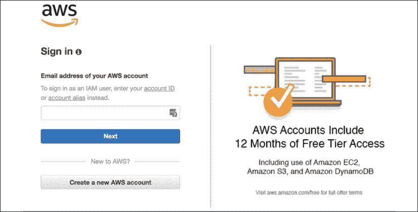

    图 13.1：AWS 账户注册

    您的 AWS 账单与您的根凭据相关联。如果遭到破坏，在您恢复访问之前，您的账户可能会遭受大量损失。

1.  确保您已在您的根凭据上启用了双因素认证。

    为了增加另一层安全性，从现在开始，您需要停止使用根凭证登录您的 AWS 账户。您可以使用 AWS **身份和访问管理**（**IAM**）模块创建用户账户。如果这些账户被泄露，与您的根账户不同，您可以轻松快速地删除或替换它们。

1.  导航到 **IAM 模块**。

1.  创建一个新的具有全局管理员权限的用户账户。

1.  使用这些凭证登录 AWS 控制台。

1.  您还应该为这些凭证启用双因素认证。

1.  一个安全的账户设置如下所示，每个状态都报告为绿色：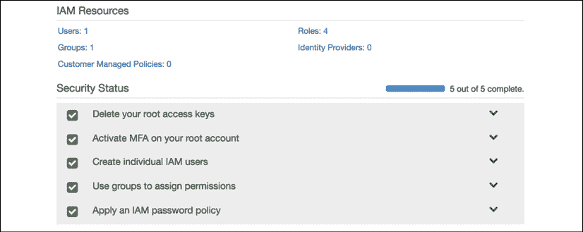

    图 13.2：安全设置后的 AWS IAM 模块

与用户账户合作的主要好处是程序性访问。对于每个用户账户，您都可以创建一个公共访问 ID 和私有访问密钥对。当您与第三方合作，例如托管持续集成服务、自己的应用程序代码或 CLI 工具时，您使用程序性访问密钥来连接到您的 AWS 资源。当不可避免地访问密钥泄露时，禁用旧密钥并创建新密钥既快速又方便。

此外，用户账户访问可以通过非常细粒度的权限进行严格控制。您还可以创建具有一组权限的角色，并进一步控制 AWS 服务与某些外部服务之间的通信。

在创建用户账户和角色时，始终采取最小权限原则。当与不熟悉 AWS 的客户、承包商或同事合作时，这可能是一项令人沮丧的练习；然而，这是一项值得做的练习。

您的安全性和可靠性取决于您最薄弱的环节，因此您必须计划失败，并且最重要的是，定期练习恢复计划。

## 保护机密

密码和私钥泄露的发生频率可能比你想象的要高。您的密钥可能在未加密的公共 Wi-Fi 网络上被泄露；您可能不小心将它们检查到代码仓库中，或者使用像电子邮件这样极其不安全的通信方式。

然而，意外代码检查入是最大的问题，因为大多数初级开发者没有意识到在源代码控制系统中删除不是一种选择。

作为开发者，有一些值得注意的最佳实践需要遵循，以保护您的机密：

1.  在公共 Wi-Fi 上始终使用 VPN 服务，例如[tunnelbear.com](http://tunnelbear.com)。

1.  利用位于您用户主目录下的 `.aws/credentials` 文件来创建配置文件并存储访问密钥。

1.  作为团队规范，在项目的根目录下创建一个`.env`文件，并将其添加到`.gitignore`中，以存储 CI 服务器可能后来注入的任何机密。

1.  在推送之前始终审查提交。

1.  考虑注册一个可以监控您的代码库以查找机密的服务的账户，例如 GitGurdian 在[`gitguardian.com/`](https://gitguardian.com/)，这对于开源项目是免费的。

注意，GitGuardian 将 Firebase 和 OpenWeather API 密钥标记为泄露。这是一个误报，因为所涉及的密钥是公钥，必须发布以使你的应用程序正确运行。

每次都遵循这些惯例将使你养成一个良好的习惯，即永远不要将秘密检查到代码库中。在下一节中，我们将深入探讨云环境中的资源考虑因素。

# 适当规模的基础设施

优化你的基础设施的目的是在保护你公司收入的同时，最大限度地减少运营基础设施的成本。你的目标应该是确保用户不会遇到高延迟，否则称为不良性能，更糟糕的是，未满足或丢弃的请求，同时让你的企业成为一个可持续的事业。

网络应用程序性能的三个支柱如下：

1.  CPU 利用率

1.  内存使用

1.  网络带宽

我故意将磁盘访问排除在关键考虑指标之外，因为只有特定的工作负载在应用程序服务器或数据存储上执行时才会受到影响。只要应用程序资源由**内容分发网络**（**CDN**）提供，磁盘访问很少会影响服务网络应用程序的性能。尽管如此，仍然要注意任何意外的失控磁盘访问，例如频繁创建临时和日志文件。例如，Docker 可能会输出日志，这些日志很容易填满驱动器。

在理想情况下，CPU、内存和网络带宽的使用应该均匀地利用，大约在可用容量的 60-80%左右。如果你遇到由于各种其他因素（如磁盘 I/O、缓慢的第三方服务或低效的代码）引起的性能问题，很可能会出现你的某个指标达到或接近最大容量，而其他两个则处于闲置或严重未充分利用的状态。这是一个机会，可以使用更多的 CPU、内存或带宽来补偿性能问题，并均匀利用可用资源。

目标是 60-80%的利用率背后的原因是，为了给一个新的实例（服务器或容器）的配置和准备就绪以服务用户留出一些时间。在你预定义的阈值被超过后，当一个新的实例正在配置时，你可以继续服务越来越多的用户，从而最小化未满足的请求。

在整本书中，我一直在劝阻过度工程化或完美解决方案。在当今复杂的 IT 环境中，几乎不可能预测你将在哪里遇到性能瓶颈。你的工程可能非常容易地花费超过$100,000 的工程时数，而你的问题的解决方案可能只需要几百美元的新硬件，无论是网络交换机、固态驱动器、CPU 还是更多的内存。

如果您的 CPU 过于繁忙，您可能想在代码中引入更多的账务逻辑，通过索引、哈希表或字典，您可以在内存中缓存它们以加快逻辑的后续或中间步骤。例如，如果您不断运行数组查找操作以定位记录的特定属性，您可以在该记录上执行操作，将记录的 ID 和/或属性保存到您在内存中保持的哈希表中，从而将您的运行时成本从 *O(n)* 降低到 *O(1)*。

在前面的示例之后，您可能会使用过多的内存，特别是使用哈希表。在这种情况下，您可能希望更积极地卸载或转移缓存到较慢但更丰富的数据存储中，例如使用您的备用网络带宽的 Redis 实例。

如果您的网络利用率过高，您可能想调查使用带有过期链接的 CDN、客户端缓存、限制请求以及为滥用配额的客户设置 API 访问限制，或者优化您的实例，使其网络容量与其 CPU 或内存容量不成比例地更多。

## 优化实例

在前面的示例中，我展示了使用我的 `duluca/minimal-node-web-server` Docker 镜像来托管我们的 Angular 应用。尽管 Node.js 是一个非常轻量级的服务器，但它并不是为了仅仅作为 Web 服务器而优化的。此外，Node.js 具有单线程执行环境，这使得它不适合同时为许多并发用户提供服务静态内容。

您可以通过执行 `docker stats` 来观察 Docker 镜像正在使用的资源：

```js
$ docker stats
CONTAINER ID  CPU %  MEM USAGE / LIMIT  MEM %  NET I/O  BLOCK I/O    PIDS
27d431e289c9  0.00%  1.797MiB / 1.9GiB  0.09%  13.7kB / 285kB  0B / 0B  2 
```

这里是 Node 和基于 NGINX 的服务器在空闲时系统资源利用率的比较结果：

| **服务器** | **镜像大小** | **内存使用** |
| --- | --- | --- |
| `duluca/minimal-nginx-web-server` | 16.8 MB | 1.8 MB |
| `duluca/minimal-node-web-server` | 71.8 MB | 37.0 MB |

然而，空闲时的值只能讲述故事的一部分。为了更好地理解，我们必须进行简单的负载测试，以查看负载下的内存和 CPU 利用率。

## 简单负载测试

为了更好地理解我们服务器的性能特性，让我们对它们施加一些负载并对其进行压力测试：

1.  使用 `docker run` 启动您的容器：

    ```js
    $ docker run --name <imageName> -d -p 8080:<internal_port>
    <imageRepo> 
    ```

    如果您使用 npm 脚本来运行 Docker，请执行以下命令以启动您的容器：

    ```js
    $ npm run docker:debug 
    ```

1.  执行以下 bash 脚本来启动负载测试：

    ```js
    $ curl -L http://bit.ly/load-test-bash | bash -s 100 "http://localhost:8080" 
    ```

    此脚本将每秒向服务器发送 `100` 个请求，直到您终止它。

1.  执行 `docker stats` 来观察性能特性。

这里是 CPU 和内存利用率的总体观察：

| ****CPU 利用率统计**** | ****低**** | ****中**** | ****高**** | ****最大内存**** |
| --- | --- | --- | --- | --- |
| `duluca/minimal-nginx-web-server` | 2% | 15% | 60% | 2.4 MB |
| `duluca/minimal-node-web-server` | 20% | 45% | 130% | 75 MB |

如您所见，两个服务器在提供相同内容时存在显著的性能差异。请注意，这种基于每秒请求数的测试对于比较分析很有用，但不一定反映实际使用情况。

很明显，我们的 NGINX 服务器将为我们提供最佳性价比。有了最优解决方案，让我们在 AWS 上部署应用程序。

# 部署到 AWS ECS Fargate

AWS **弹性容器服务**（**ECS**）Fargate 是一种成本效益高且易于配置的云部署容器的方法。

ECS 由四个主要部分组成：

1.  一个容器仓库，**弹性容器注册库**（**ECR**），您可以在其中发布您的 Docker 镜像。

1.  服务、任务和任务定义，其中您定义作为服务运行的容器作为任务定义的运行时参数和端口映射。

1.  一个集群，一组 EC2 实例，其中可以部署和扩展任务。

1.  Fargate，一种管理集群服务，它抽象化了 EC2 实例、负载均衡器和安全组的问题。

在 AWS 控制台右上角，务必选择离您的用户最近的区域。对我来说，这是 us-east-1 区域。

我们的目标是创建一个高度可用的蓝绿部署，这意味着在服务器故障或甚至在部署期间，我们的应用程序至少有一个实例将处于运行状态。这些概念在*第十四章*，*Google Analytics 和高级云操作*，*可扩展环境中的每用户成本*部分中进行了详细探讨。

## 配置 ECS Fargate

您可以在 AWS**服务**菜单下访问 ECS 功能，选择**弹性容器服务**链接。

如果这是您第一次登录，您必须完成一个教程，其中您将被强制创建一个示例应用程序。我建议您完成教程，并在之后删除您的示例应用程序。为了删除服务，您需要将您服务的任务数量更新为 0。此外，删除默认集群以避免任何意外费用。

### 创建 Fargate 集群

让我们先配置一个 Fargate 集群，它作为配置其他 AWS 服务时的锚点。我们的集群最终将运行一个集群服务，我们将在接下来的章节中逐步构建。

AWS Fargate 是实施云中可扩展容器编排解决方案的一个很好的选择。近年来，Kubernetes 作为首选解决方案已经变得非常流行。Kubernetes 是 AWS ECS 的开源替代品，它为容器编排提供了更丰富的功能，适用于本地、云和云混合部署。虽然 AWS 确实提供了 Amazon Elastic Container Service for Kubernetes (Amazon EKS)，但与纯 Kubernetes 相比，RedHat 的开源 OpenShift 平台更容易使用，并且自带电池（即无需额外配置）。

让我们创建集群：

1.  导航到**弹性容器服务**。

1.  点击**集群** | **创建集群**。

1.  选择**仅网络...由 AWS Fargate 提供**模板。

1.  点击**下一步**，您将看到**创建集群**步骤，如图所示：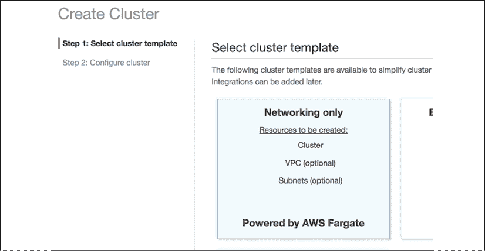

    图 13.3：AWS ECS 创建集群

1.  将**集群名称**输入为`fargate-cluster`。

1.  创建一个**VPC**以隔离您的资源与其他 AWS 资源。

1.  点击**创建集群**以完成设置。

您将看到您的操作摘要，如下所示：

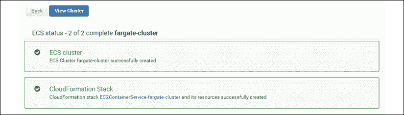

图 13.4：AWS ECS Fargate 集群

现在您已经在自己的**虚拟专用云**（**VPC**）中创建了一个集群，您可以在**弹性容器服务** | **集群**下查看它。

### 创建容器仓库

接下来，我们需要设置一个仓库，我们可以在此处发布我们在本地或 CI 环境中构建的容器镜像：

本节假设您已根据*第九章*，*使用 Docker 的 DevOps*中详细说明的设置 Docker 和 npm 脚本。您可以通过执行`npm i -g mrm-task-npm-docker`并使用`npx mrm npm-docker`应用这些脚本来获取这些脚本的最新版本。

1.  导航到**弹性容器服务**。

1.  点击**仓库** | **创建仓库**。

1.  将仓库名称输入为`lemon-mart`。

1.  复制屏幕上生成的**仓库 URI**。

1.  将 URI 粘贴到您的应用程序的`package.json`文件中作为新的`imageRepo`变量：

    ```js
    **package.json**
    ...
    "config": {
      "imageRepo": "000000000000.dkr.ecr.us-east-1.amazonaws.com/lemon-mart",
      ...
    } 
    ```

1.  点击**创建仓库**。

1.  点击**下一步**，然后点击**完成**以完成设置。

在摘要屏幕上，您将获得有关如何使用 Docker 与您的仓库一起使用的进一步说明。在本章的后面部分，我们将介绍将为我们处理这些任务的脚本：

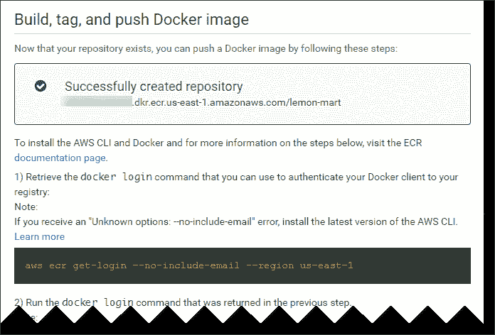

图 13.5：AWS ECS 仓库

您可以在**弹性容器服务** | **仓库**下查看您的新仓库。

我们将在即将到来的*AWS 的 npm 脚本*部分中介绍如何发布您的镜像。

让我们继续设置 ECS。

### 创建任务定义

在我们的仓库中定义了容器目标后，我们可以定义一个任务定义，它包含运行我们的容器所需的所有元数据，例如端口映射、保留 CPU 和内存分配：

1.  导航到**弹性容器服务**。

1.  点击**任务定义** | **创建新的任务定义**。

1.  选择**Fargate**启动类型兼容性。

1.  将**任务定义名称**输入为`lemon-mart-task`。

1.  选择**任务角色**为无（您可以在稍后添加一个以启用对其他 AWS 服务的访问）。

1.  将**任务内存**输入为`0.5 GB`。

1.  将**任务 CPU**输入为`0.25 CPU`。

1.  点击**添加容器**：

    +   将**容器名称**输入为`lemon-mart`。

    +   对于**镜像**，粘贴之前生成的镜像仓库 URI，但向其追加`:latest`标签，以便始终从仓库中拉取最新镜像，例如`000000000000.dkr.ecr.us-east-1.amazonaws.com/lemon-mart:latest`。

    +   为 NGINX 设置**软限制**为`128 MB`，或为 Node.js 设置`256 MB`。

    +   在**端口映射**下，指定**容器端口**为 NGINX 的`80`或 Node.js 的`3000`。

1.  接受剩余的默认设置。

1.  点击**添加**；这是在创建之前您的任务定义将看起来如何：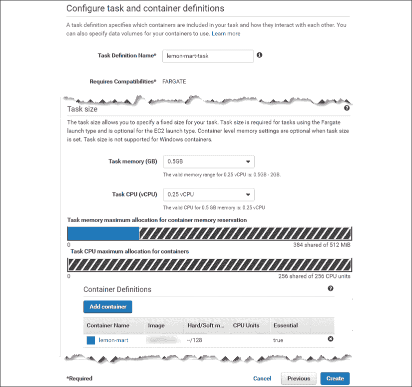

    图 13.6：AWS ECS 任务定义

1.  点击**创建**以完成设置。

在**弹性容器服务** | **任务定义**下查看您的新**任务定义**。

注意，默认设置将启用 AWS CloudWatch 日志记录，这是一种您可以事后访问容器实例控制台日志的方式。在这个例子中，将创建一个名为`/ecs/lemon-mart-task`的 CloudWatch 日志组。

在**云监控** | **日志**下查看您的新日志组。

如果您添加的容器需要持久化数据，任务定义允许您定义一个卷并将文件夹挂载到您的 Docker 容器中。我发布了一个关于如何配置 AWS **弹性文件系统（EFS**）与您的 ECS 容器的指南，请参阅[`bit.ly/mount-aws-efs-ecs-container`](https://bit.ly/mount-aws-efs-ecs-container)。

### 创建一个弹性负载均衡器

在高可用性部署中，您希望运行两个容器实例，正如我们刚才创建的任务定义所定义的，跨越两个不同的**可用区（AZs**）。对于这种动态扩展和缩减，我们需要配置一个**应用程序负载均衡器（ALB**）来处理请求路由和排空：

1.  在另一个选项卡上，导航到**EC2** | **负载均衡器** | **创建负载均衡器**。

1.  创建一个**应用程序负载均衡器**。

1.  将**名称**设置为`lemon-mart-alb`。

    为了在监听器下支持 SSL 流量，您可以在端口`443`上添加一个新的 HTTPS 监听器。通过 AWS 服务和向导，可以方便地实现 SSL 设置。在 ALB 配置过程中，AWS 提供了链接到这些向导的选项，以创建您的证书。然而，这是一个复杂的过程，并且可能因您现有的域名托管和 SSL 证书设置而有所不同。在这本书中，我将跳过与 SSL 相关的配置。您可以在我在[`bit.ly/setupAWSECSCluster`](https://bit.ly/setupAWSECSCluster)发布的指南中找到与 SSL 相关的步骤。

1.  在**可用区**下，选择为您的**fargate-cluster**创建的**VPC**。

1.  选择列出的所有 AZs。

1.  展开**标签**并添加一个键/值对，以便能够识别 ALB，例如`"App": "LemonMart"`。

1.  点击**下一步：配置安全设置**。

    如果您添加了 HTTPS 监听器，您将看到配置证书的选项。

    如果配置证书，请点击**从 ACM 选择证书**（AWS 证书管理器）并选择**默认 ELB 安全策略**。

    如果您从未创建过证书，请点击**从 ACM 请求新的证书**链接来创建一个。如果您之前创建过证书，请转到**证书管理器**创建一个新的。然后，刷新并选择您的证书。

1.  点击**下一步：配置安全组**。

1.  创建一个新的集群特定安全组`lemon-mart-sg`，仅允许端口`80`入站或如果使用 HTTPS 则允许端口`443`入站。

    在下一节创建集群服务时，请确保此处创建的安全组是在服务创建期间选择的。否则，您的 ALB 将无法连接到您的实例。

1.  点击**下一步：配置路由**。

1.  为新的**目标组**命名为`lemon-mart-target-group`。

1.  将协议类型从`instance`更改为`ip`。

1.  在**健康检查**下，如果通过 HTTP 提供服务，请保留默认路由`/`。

    健康检查对于扩展和部署操作至关重要。这是 AWS 可以用来检查实例是否成功创建的机制。

    如果部署 API 和/或重定向所有 HTTP 调用到 HTTPS，请确保您的应用程序定义了一个自定义路由，该路由不会被重定向到 HTTPS。在 HTTP 服务器上，`GET /healthCheck`返回一个简单的 200 消息，表示`I'm healthy`并验证这不会重定向到 HTTPS。否则，您将经历很多痛苦和苦难，试图找出问题所在，因为所有健康检查都会失败，部署也会莫名其妙地失败。`duluca/minimal-node-web-server`提供 HTTPS 重定向，以及一个开箱即用的 HTTP-only `/healthCheck`端点。使用`duluca/minimal-nginx-web-server`，您需要提供自己的配置。

1.  点击**下一步：注册目标**。

1.  **不要**注册任何**目标**或**IP 范围**。ECS Fargate 会神奇地为您管理这些。如果您自己这样做，您将配置一个半损坏的基础设施。

1.  点击**下一步：审查**；您的 ALB 设置应类似于图中所示![img/B14091_13_07.png]

    图 13.7：AWS 应用程序负载均衡器设置

1.  点击**创建**以完成设置。

在下一节创建集群服务时，您将使用`lemon-mart-alb`。

### 创建集群服务

现在，我们将通过在集群中使用任务定义和创建的 ALB 来整合所有内容：

1.  导航到**弹性容器服务**。

1.  点击**集群** | **fargate-cluster**。

1.  在**服务**选项卡下，点击**创建**。

1.  选择**启动类型**为`Fargate`。

1.  选择您之前创建的任务定义。

    注意，任务定义是版本化的，例如`lemon-mart-task:1`。如果您要更改任务定义，AWS 将创建`lemon-mart-task:2`。您需要使用这个新版本更新服务，以便您的更改生效。

1.  将**服务名称**输入为`lemon-mart-service`。

1.  对于**任务数量**，选择`2`。

1.  对于**最小健康百分比**，选择`50`。

1.  对于**最大百分比**，选择`200`。

    保持**滚动更新**部署类型，因为我们将实现自己的蓝绿部署策略。

1.  点击**下一步** **步骤**。

    为了在部署期间实现高可用性，将**最小健康百分比**设置为`100`。Fargate 定价基于每秒的使用量，因此在部署应用程序时，您将为额外的实例支付额外费用，而旧的实例正在被取消配置。

1.  在**配置网络**下，选择与您之前集群相同的`VPC`。

1.  选择所有可用的子网；对于高可用性，至少应该有两个。

1.  选择您在上一节中创建的安全组，命名为`lemon-mart-sg`。（如果您看不到它，请刷新页面。）

1.  选择**负载均衡器**类型为**应用程序负载均衡器**。

1.  选择**lemon-mart-alb**选项。

1.  通过点击**添加到负载均衡器**按钮，将**容器端口**（例如`80`或`3000`）添加到 ALB。

1.  选择您已经定义的**生产监听端口**。

1.  选择您已经定义的**目标组**，`lemon-mart-target-group`。

1.  取消选择**启用服务发现集成**。

1.  点击**下一步**。

1.  如果您希望实例在达到一定容量限制时自动扩展和缩小，请设置**自动扩展**。

    我建议在服务初始设置期间跳过自动扩展的设置，以便更容易地调试任何潜在的配置问题。您可以在稍后回来设置它。自动任务扩展策略依赖于警报，例如 CPU 利用率。在*第十四章*，*Google Analytics 和高级云操作*，*可扩展环境中的每用户成本*部分，您可以了解如何计算您的最佳目标服务器利用率并根据这个数字设置警报。

1.  点击**下一步**并审查您的更改，如图所示：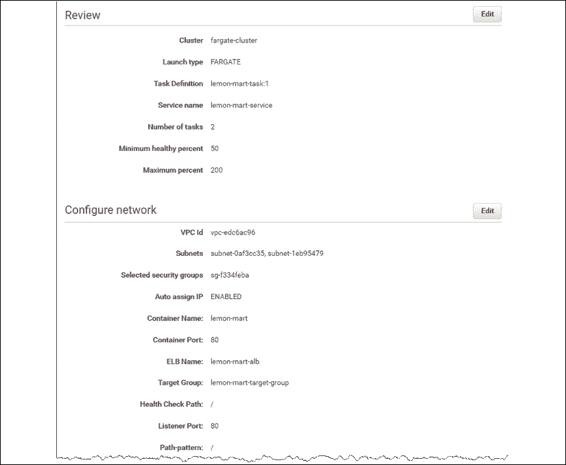

    图 13.8：AWS Fargate 集群服务设置

1.  最后，点击**创建服务**以完成设置。

在**弹性容器服务** | **集群** | **fargate-cluster** | **lemon-mart-service**下观察您的新服务。在您将镜像发布到容器仓库之前，您的 AWS 服务将无法部署实例，因为健康检查将不断失败。发布镜像后，您需要确保在服务的**事件**标签页中没有错误。

AWS 是一个复杂的野兽，有了 Fargate，您可以避免很多复杂性。然而，如果您有兴趣使用自己的 EC2 实例设置自己的 ECS 集群，您可以通过 1-3 年的预留实例获得显著的折扣。我有一个 75+步的设置指南可供参考，链接为[`bit.ly/setupAWSECSCluster`](https://bit.ly/setupAWSECSCluster)。

我们手动执行了许多步骤来创建我们的集群。AWS CloudFormation 通过提供可定制的配置模板来解决这个问题，您可以根据自己的需求进行定制，或者从头开始编写自己的模板。如果您想认真对待 AWS，这种代码即基础设施的设置绝对是您应该采取的方式。

对于生产部署，确保您的配置由 CloudFormation 模板定义，这样它就可以在部署相关的错误发生时轻松重新部署。不是如果，而是当部署相关的错误发生时。

### 配置 DNS

要将域名或子域名连接到您的应用程序，您必须配置您的 DNS 以指向 ALB。AWS 提供 Route 53 服务来管理您的域名。

Route 53 使动态地将域名或子域名分配给 ALB 变得容易：

1.  导航到**Route 53** | **托管区域**。

1.  如果您已经注册了域名，请选择它；否则，使用**创建托管区域**注册它。

    注意，您需要将域名的名称服务器重新分配到 AWS 以使此操作生效。

1.  点击**创建记录集**。

1.  输入**名称**为`lemonmart`。

1.  将**别名**设置为`yes`。

1.  从负载均衡器列表中选择**lemon-mart-alb**。

1.  点击**创建**以完成设置：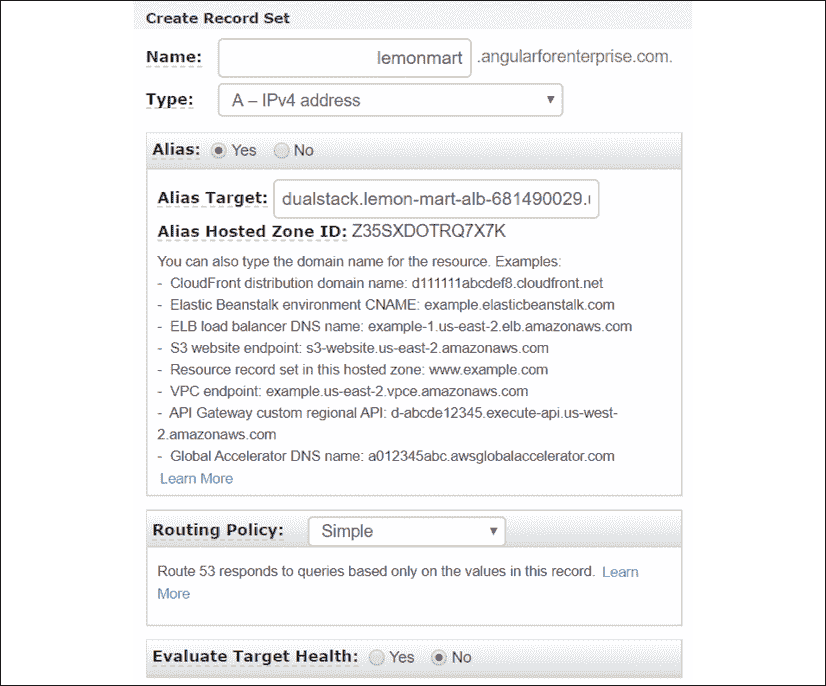

    图 13.9：Route 53 – 创建记录集

现在，您的网站将可以通过您刚刚定义的子域名访问，例如，[`lemonmart.angularforenterprise.com`](http://lemonmart.angularforenterprise.com)。

如果您不使用 Route 53，请不要慌张。在您的域名提供商网站上，编辑`Zone`文件以创建指向 ALB DNS 地址的 A 记录，然后您就完成了。

#### 获取 ALB DNS 名称

为了获取您的负载均衡器的 DNS 地址，执行以下步骤：

1.  导航到**EC2** | **负载均衡器**。

1.  选择**lemon-mart-alb**。

1.  在**描述**选项卡中，注意 DNS 名称；考虑以下示例：

    ```js
    DNS name:
    lemon-mart-alb-1871778644.us-east-1.elb.amazonaws.com (A Record) 
    ```

现在我们已经配置了 AWS ECS Fargate，让我们准备我们的 Angular 应用程序以便部署到 AWS。

## 添加 npm 脚本用于 AWS

就像 Docker 的 npm 脚本一样，我开发了一套名为**npm 脚本用于 AWS**的脚本，这些脚本在 Windows 10 和 macOS 上运行。这些脚本将允许您以壮观、无停机、蓝绿方式上传和发布您的 Docker 镜像。您可以通过执行以下步骤获取这些脚本的最新版本并在项目中自动配置它们：

我们正在**lemon-mart**项目中配置这些设置。

1.  安装 AWS ECS 任务的 npm 脚本：

    ```js
    npm i -g mrm-task-npm-aws 
    ```

1.  应用 npm 脚本用于 Docker 的配置：

    ```js
    npx mrm npm-aws 
    ```

现在，让我们配置脚本：

1.  确保在您的项目中设置了`mrm-task-npm-docker`脚本。

1.  创建一个`.env`文件并设置`AWS_ACCESS_KEY_ID`和`AWS_SECRET_ACCESS_KEY`：

    ```js
    **.env**
    AWS_ACCESS_KEY_ID=your_own_key_id
    AWS_SECRET_ACCESS_KEY=your_own_secret_key 
    ```

1.  确保您的`.env`文件已包含在`.gitignore`文件中，以保护您的机密信息。

1.  安装或升级到最新的 AWS CLI：

    +   在 macOS 上，`brew install awscli`

    +   在 Windows 上，`choco install awscli`

1.  使用您的凭证登录 AWS CLI：

    1.  运行`aws configure`。

    1.  您需要从配置 IAM 账户时获取您的**访问密钥 ID**和**秘密访问密钥**。

    1.  将**默认区域名称**设置为`us-east-1`。

1.  更新`package.json`以添加一个新的`config`属性，包含以下配置属性：

    ```js
    **package.json**
      ...
      "config": {
        ...
        "awsRegion": "us-east-1",
        "awsEcsCluster": "fargate-cluster",
        "awsService": "lemon-mart-service"
      },
    ... 
    ```

    确保您已从配置 npm 脚本用于 Docker 时更新`package.json`，以便`imageRepo`属性具有您的新 ECS 存储库的地址。

1.  确保已将 AWS 脚本添加到`package.json`中，如图所示：

    ```js
    **package.json**
    ...
    "scripts": {
      ...
      "aws:login:win": "cross-conf-env 
         aws ecr get-login --no-include-email --region 
         $npm_package_config_awsRegion > 
         dockerLogin.cmd && call dockerLogin.cmd && 
         del dockerLogin.cmd",
      "aws:login:mac": "eval $(aws ecr get-login 
         --no-include-email --region $npm_package_config_awsRegion)",
        "aws:login": "run-p -cs aws:login:win aws:login:mac", 
    } 
    ```

通过执行`aws --version`来检查您的 AWS CLI 版本。根据您的版本，您的`aws:login`可能需要不同。前面的脚本显示了 AWS CLI v1 的登录脚本。如果您有 v2，您的登录命令将类似于以下脚本：

**在 macOS / Linux 上**：

`aws ecr get-login-password --region $npm_package_config_awsRegion | docker login --username AWS --password-stdin $npm_package_config_imageRepo`

**在 Windows 上**：

(Get-ECRLoginCommand).Password | docker login --username AWS --password-stdin $npm_package_config_imageRepo:latest

`npm run aws:login`调用平台特定的命令，自动执行通常需要多步操作的动作，从 AWS CLI 工具获取`docker login`命令，如下所示：

```js
**example**
$ npm run aws:login 
docker login -u AWS -p eyJwYXl...3ODk1fQ== https://00000000000.dkr.ecr.us-east-1.amazonaws.com
$ docker login -u AWS -p eyJwYXl...3ODk1fQ== https://00000000000.dkr.ecr.us-east-1.amazonaws.com
WARNING! Using --password via the CLI is insecure. Use --password-stdin.
Login Succeeded 
```

您首先执行`aws ecr get-login`，然后复制粘贴生成的`docker login`命令并执行它，以便您的本地 Docker 实例指向 AWS ECR。现在让我们看看我们如何部署构建的容器：

```js
**package.json**
...
"scripts": {
...
"aws:deploy": "cross-conf-env docker run 
   --env-file ./.env silintl/ecs-deploy
   -c $npm_package_config_awsEcsCluster 
   -n $npm_package_config_awsService 
   -i $npm_package_config_imageRepo:latest 
   -r $npm_package_config_awsRegion --timeout 1000", 
}
...
example
$ docker image build . -f nginx.Dockerfile 
   -t 000000000.dkr.ecr.us-east-1.amazonaws.com/lemon-mart:latest
$ npm run docker:publish
$ npm run aws:deploy
Using image name: 0000000.dkr.ecr.us-east-1.amazonaws.com/lemon-mart:latest
Current task definition: arn:aws:ecs:us-east-1: 0000000:task-definition/lemon-mart-task:7
New task definition: arn:aws:ecs:us-east-1: 0000000:task-definition/lemon-mart-task:8
Service updated successfully, new task definition running.
Waiting for service deployment to complete...
Service deployment successful. 
```

我们首先构建我们的 Web 应用的 NGINX 版本 Docker 镜像，因为我们正在 ECS 上监听端口`80`。然后，将容器发布到 ECR，最后执行`npm run aws:deploy`，它使用运行蓝色/绿色部署的`silintl/ecs-deploy` Docker 容器。

使用 ECS 命令如何进行蓝色/绿色部署的详细信息超出了本书的范围。要查看更多使用原生 AWS ECS 命令的示例，请参阅[`github.com/aws-samples/ecs-blue-green-deployment`](https://github.com/aws-samples/ecs-blue-green-deployment)的`aws-samples`存储库。

我们可以将我们的命令组合在一起，作为一个单独的`release`命令来执行，如下所示：

```js
**package.json**
...
"scripts": {
  ...
  "aws:release": "run-s -cs aws:login docker:publish aws:deploy"
}
... 
```

最后，`npm run aws:release`简单地按照正确的顺序从 npm 脚本中运行`aws:login`、`docker:publish`和`aws:deploy`命令。

## 发布

您的项目配置为在 AWS 上部署。您主要需要使用我们创建的两个命令来构建和发布镜像：

1.  执行`docker:debug`来测试、构建、标记、运行、跟踪并在浏览器中启动您的应用程序以测试镜像：

    ```js
    $ npm run docker:debug 
    ```

1.  执行`aws:release`以配置 Docker 登录 AWS，发布最新的镜像构建，并在 ECS 上发布：

    ```js
    $ npm run aws:release 
    ```

    注意，当连续运行多个命令，其中一个命令以状态`1`退出时，npm 将其视为失败。然而，这并不一定意味着您的操作失败。始终滚动查看终端输出，以查看是否抛出了任何真实错误。

1.  验证您的任务在**服务**级别上是否运行和运行：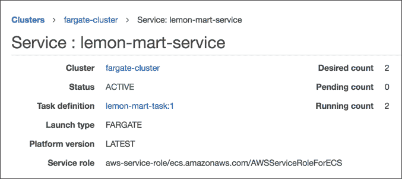

    图 13.10：AWS ECS 服务

    确保运行计数和期望计数相同。不匹配或部署时间非常长通常意味着您的新容器上的健康检查失败。查看**事件**选项卡以获取更多信息。您的容器可能无法启动，或者您可能监听的是错误的端口。

1.  验证您的实例在**任务**级别上是否运行：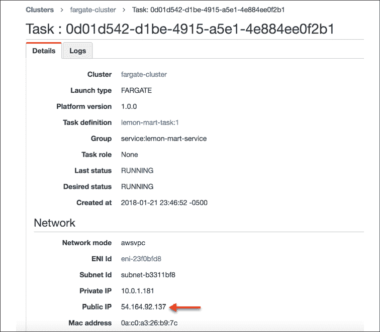

    图 13.11：AWS ECS 任务实例

    注意 **公共 IP** 地址并导航到它；例如，`http://54.164.92.137`，你应该能看到你的应用程序或 LemonMart 正在运行。

1.  验证在 DNS 层面上 **负载均衡器** 设置是否正确。

1.  导航到 **ALB DNS 地址**，例如 [`lemon-mart-alb-681490029.us-east-1.elb.amazonaws.com`](http://lemon-mart-alb-681490029.us-east-1.elb.amazonaws.com)，并确认应用程序渲染如下：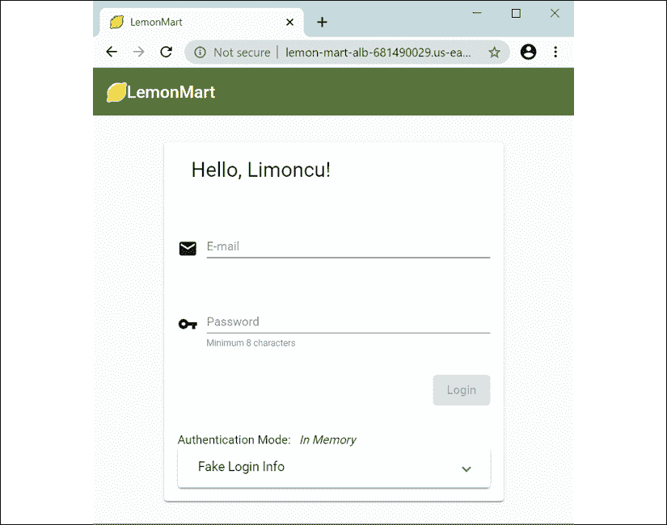

    图 13.12：LemonMart 在 AWS Fargate 上运行

Et voilà！你的网站应该已经上线并运行。

在随后的版本中，在你第一次之后，你将能够观察到蓝绿部署的实际操作，如下所示：

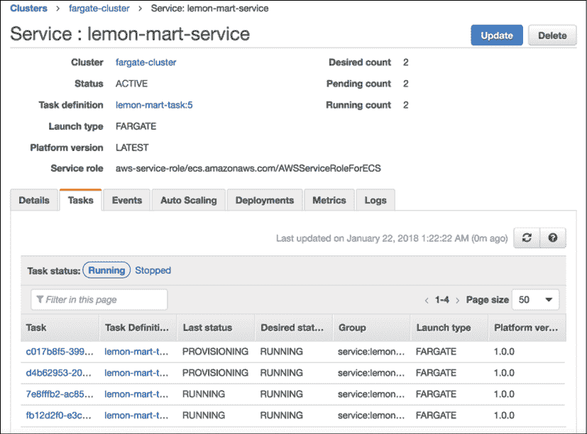

图 13.13：AWS 服务在蓝绿部署期间

有两个任务正在运行，同时还有两个新的任务正在配置。当新的任务正在验证时，**运行计数**将上升到四个任务。在新任务验证并通过旧任务的连接被释放后，**运行计数**将回到两个。

你可以通过配置 CircleCI 并使用安装了 `awscli` 工具的容器以及运行 AWS 的 npm 脚本来自动化你的部署。使用这种技术，你可以实现持续部署到预发布环境或持续交付到生产环境。

## 使用 CircleCI 部署到 AWS

在 *第九章*，*使用 Docker 的 DevOps* 中，我们基于多阶段 `Dockerfile` 实现了一个 CircleCI 管道，这产生了一个 tar 和 gzip 压缩的 Docker 镜像。我们还介绍了如何使用 CircleCI 实现部署步骤。利用本章所学，我们可以结合两种策略，以便使用 CircleCI 部署到 AWS。

对于 AWS 部署，你可以使用 `aws-cli` orb 和一个 `deploy` 作业。`deploy` 作业将包含从缓存中恢复构建的 Docker 镜像、登录 AWS 并将镜像推送到你的 AWS ECS 容器仓库的步骤。

在 **lemon-mart** 仓库中，本节使用的 `config.yml` 文件名为 `.circleci/config.docker-integration.yml`。你还可以在 CircleCI 上找到本章的 YML 文件对应的 pull request，网址为 [`github.com/duluca/lemon-mart/pull/27`](https://github.com/duluca/lemon-mart/pull/27)，使用分支 `deploy_aws`。

为了推送容器，我们通过运行 `npm run aws:deploy` 进行部署。让我们在 `config.yml` 文件中添加一个新的 `deploy` 作业。

在 **CircleCI 账户设置** 或 **组织设置** 下，添加一个名为 `aws` 的新 **上下文**。将 `AWS_ACCOUNT_ID`、`AWS_ACCESS_KEY_ID`、`AWS_SECRET_ACCESS_KEY` 和 `AWS_DEFAULT_REGION` 环境变量作为上下文的一部分设置。

在这里查看配置更改：

```js
**.circleci/config.yml**
version: 2.1
orbs:
  **aws-cli: circleci/aws-cli@1.0.0**
...
jobs:
  ...
  **deploy:**
 **executor: aws-cli/default**
    working_directory: ~/repo
    steps:
      - attach_workspace:
          at: /tmp/workspace
      - checkout
      - setup_remote_docker
      - aws-cli/setup
      - run: npm ci
      - run:
          name: Restore .env files
          command: |
            set +H
            DOT_ENV=AWS_ACCESS_KEY_ID=$AWS_ACCESS_KEY_ID\\nAWS_SECRET_ACCESS_KEY=$AWS_SECRET_ACCESS_KEY
            echo -e $DOT_ENV > .env
      - run:
          name: Sign Docker into AWS ECR
          command: |
            aws ecr get-login-password --region us-east-1 | docker login --username AWS --password-stdin $AWS_ACCOUNT_ID.dkr.ecr.us-east-1.amazonaws.com/lemon-mart
      - run:
          name: Push it to ECR
          command: |
            docker load < /tmp/workspace/built-image.tar.gz
            ECR_URI=$AWS_ACCOUNT_ID.dkr.ecr.us-east-1.amazonaws.com/lemon-mart
            docker image tag lemon-mart:$CIRCLE_BRANCH $ECR_URI:$CIRCLE_BRANCH
            docker image tag $ECR_URI:$CIRCLE_BRANCH $ECR_URI:latest
            docker image push $ECR_URI:$CIRCLE_BRANCH
            docker image push $ECR_URI:latest      
      - run:
          name: Deploy
          **command: npm run aws:deploy** 
```

我们使用 `aws-cli/setup` 作业配置 `aws-cli` orb。然后执行 `npm ci`，这样我们就可以稍后运行我们的 npm 脚本。我们使用 CircleCI 环境变量恢复 `.env` 文件。我们使用 AWS ECR 登录信息配置 Docker，这样我们就可以将其容器推送到它。我们将前一步骤的 `built-image.tar.gz` 存储起来，并使用 `docker load` 命令加载它。我们给镜像打标签并推送到 ECR。最后，我们执行 `npm run aws:deploy`，这触发了我们的蓝绿部署。

最后但同样重要的是，我们更新 `workflows` 以包括 `deploy` 作业并配置我们之前定义的 `aws context`：

```js
**.circleci/config.yml**
...
workflows:
  version: 2
  build-and-deploy:
    jobs:
      - build
      - deploy:
          **context: aws**
          requires:
            - build 
```

在 CircleCI 中正确配置上下文至关重要。如果配置错误，您可能会发现自己陷入一个卡夫卡式的错误迷宫、糟糕的文档和痛苦的境地。不要说我没有警告过你。

请在此处查看成功部署的截图：

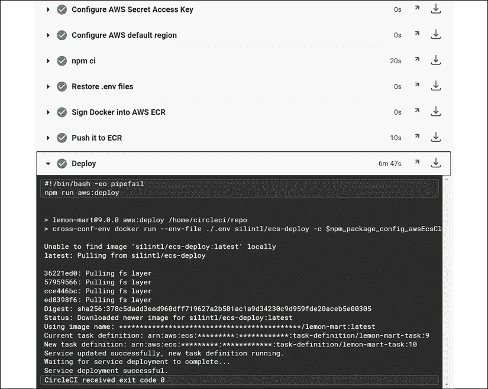

图 13.14：成功部署到 AWS Fargate 集群的 CircleCI

注意，部署步骤需要近 7 分钟。这是因为蓝绿部署确保我们的新部署是健康的，然后它会从现有容器中移除连接到新容器，默认设置下这需要 5 分钟。如果新部署不健康，部署步骤将在 10 分钟后超时并失败。

恭喜！现在我们可以以无停机、蓝绿的方式持续部署到 AWS。这一切都很棒，但一个基本的高度可用配置的成本是多少呢？

为了避免收费，请删除 `lemon-mart-service`。为此，您需要首先将您服务的任务数量更新为 0。此外，删除为您创建的默认集群，以避免任何未预见的费用。

让我们在下一节中检查费用。

# AWS 账单

我在 AWS Fargate 上高度可用的 LemonMart 部署每月大约花费 45 美元。以下是详细费用分解：

| **描述** | **费用** |
| --- | --- |
| 亚马逊简单存储服务 (S3) | $0.01 |
| AWS 数据传输 | $0.02 |
| 亚马逊云监控 | $0.00 |
| 亚马逊 EC2 容器服务 (ECS Fargate) | $27.35 |
| 亚马逊弹性计算云 (EC2 负载均衡器实例) | $16.21 |
| 亚马逊 EC2 容器注册库 (ECR) | $0.01 |
| 亚马逊 Route 53 | $0.50 |
| **总计** | **$44.10** |

注意，账单非常详细，但它确实准确地分解了我们最终使用的所有 AWS 服务。主要成本是运行我们的 Web 服务器在 **EC2 容器服务**（**ECS**）上的两个实例，以及在 **弹性计算云**（**EC2**）上运行负载均衡器。客观地说，每月 45 美元可能看起来很多，用于托管一个 Web 应用程序。如果您愿意设置自己的集群并使用专用的 EC2 服务器，您可以通过 1 年或 3 年的分期付款来节省高达 50% 的成本。在 Heroku 上具有两个实例的类似、高度可用的部署起价为每月 50 美元，您还可以获得其他丰富的功能。同样，Vercel Now 上的两个实例将花费每月 30 美元。请注意，Heroku 和 Vercel Now 都不提供对物理上不同的可用区的访问。另一方面，Digital Ocean 允许您在不同的数据中心中部署服务器；然而，您必须自己编写基础设施代码。对于每月 15 美元，您可以在三个服务器上设置自己的高度可用集群，并能够在其上托管多个网站。

# 摘要

在本章中，您学习了在正确保护您的 AWS 账户时需要注意的细微差别和各种安全考虑。我们讨论了调整基础设施规模的概念。您以隔离的方式进行了简单的负载测试，以找出两个 Web 服务器之间性能的相对差异。拥有优化的 Web 服务器后，您配置了 AWS ECS Fargate 集群，以实现高度可用的云基础设施。使用 npm 脚本进行 AWS，您学习了如何编写可重复且可靠的零停机蓝/绿部署脚本。最后，您了解了在 AWS 和其他云服务提供商（如 Heroku、Vercel Now 和 Digital Ocean）上运行您的基础设施的基本成本。

在下一章和最后一章中，我们将完成对全栈 Web 开发者在将应用程序部署到网络上时应了解的主题范围的覆盖。我们将向 LemonMart 添加 Google Analytics 以衡量用户行为，利用高级负载测试来了解部署良好配置的可扩展基础设施的财务影响，并使用自定义分析事件来衡量重要应用程序功能的实际使用情况。

# 练习

使用 LemonMart 的 `docker-compse.yml` 文件部署其服务器基础设施到 AWS ECS。作为额外奖励，配置 AWS ECS 以使用 AWS **弹性文件系统**（**EFS**）持久化您的 MongoDB 数据：

1.  从 [`docs.aws.amazon.com/AmazonECS/latest/developerguide/ECS_CLI_installation.html`](https://docs.aws.amazon.com/AmazonECS/latest/developerguide/ECS_CLI_installation.html) 安装 ECS CLI。

1.  将 `mrm-task-npm-aws` 脚本添加到 `lemon-mart-server` 的根目录。

1.  在版本 3.0 中创建一个新的 `docker-compose.aws.yml` 文件，并将其更新为引用您已发布的容器版本。

1.  使用 `npm run aws:publish:compose` 命令部署您的应用程序。

你可以使用 Minimal MEAN 项目和相关的 GitHub gists 作为指南，在 [`github.com/duluca/minimal-mean#continuous-integration-and-hosting`](https://github.com/duluca/minimal-mean#continuous-integration-and-hosting)。

# 进一步阅读

+   *《AWS 认证解决方案架构师官方指南》*，作者：Joe Baron, Hisham Baz 等，2016 年，ISBN-13：978-1119138556。

+   *《配置 AWS ECS 以访问 AWS EFS》*，2018 年，作者：Dogan Uluca，[`bit.ly/mount-aws-efs-ecs-container`](https://bit.ly/mount-aws-efs-ecs-container)。

+   *《蓝绿部署》*，作者：Martin Fowler，2010 年，[`martinfowler.com/bliki/BlueGreenDeployment.html`](https://martinfowler.com/bliki/BlueGreenDeployment.html)。

# 问题

尽可能好地回答以下问题，以确保你已理解本章的关键概念，而无需使用 Google。你需要帮助回答这些问题吗？请参阅 *附录 D*，*自我评估答案*，在线位于 [`static.packt-cdn.com/downloads/9781838648800_Appendix_D_Self-Assessment_Answers.pdf`](https://static.packt-cdn.com/downloads/9781838648800_Appendix_D_Self-Assessment_Answers.pdf) 或访问 [`expertlysimple.io/angular-self-assessment`](https://expertlysimple.io/angular-self-assessment)。

1.  适当规模的基础设施有哪些好处？

1.  使用 AWS ECS Fargate 相比 AWS ECS 的好处是什么？

1.  你记得关闭你的 AWS 基础设施以避免额外收费吗？

1.  什么是蓝/绿部署？
