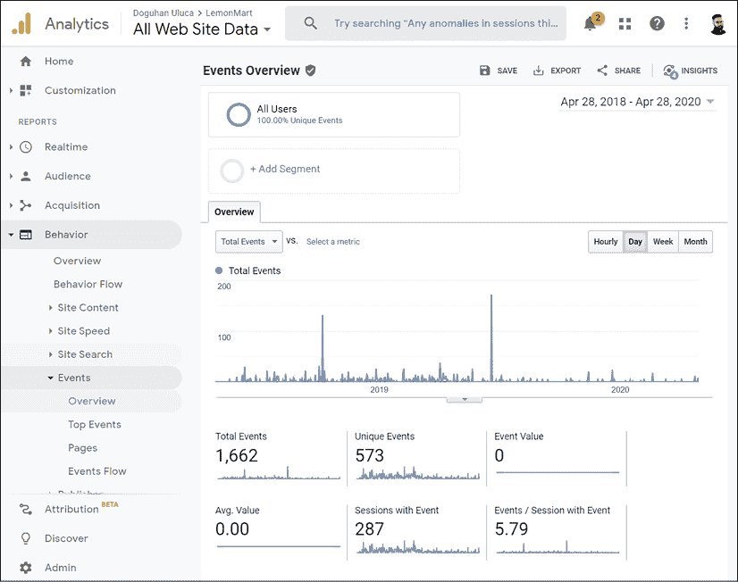
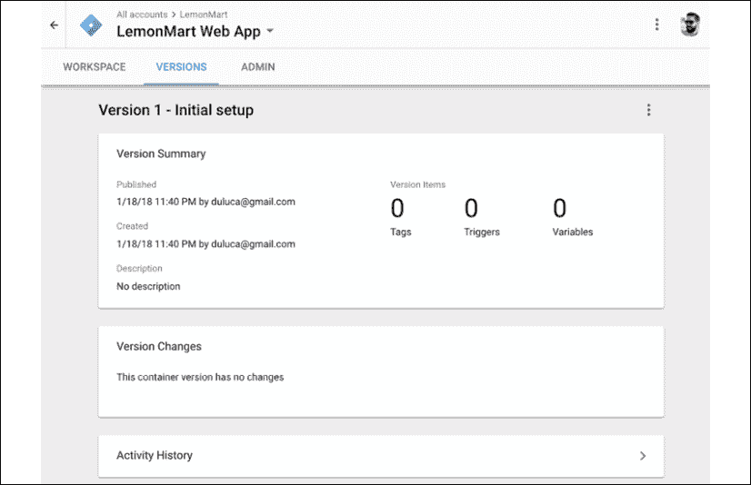
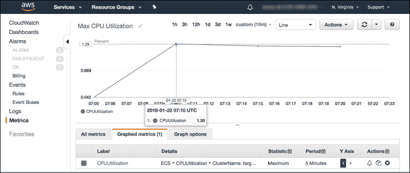

# 14

# Google Analytics 和高级云操作

你已经设计、开发和部署了一个世界级的网络应用程序；然而，这只是你应用程序故事的开端。网络是一个不断演变、充满活力、生机勃勃的环境，需要关注才能继续作为企业取得成功。在*第十三章*，*AWS 上的高可用云基础设施*中，我们讨论了云基础设施的基本概念和拥有成本。

在本章中，我们将深入了解如何真正理解用户实际使用我们的应用程序，我们将使用 Google Analytics 来获取这些信息。然后，我们将利用这些信息创建逼真的负载测试来模拟实际用户行为，以了解我们服务器单个实例的真实容量。了解单个服务器的容量后，我们可以微调我们的基础设施扩展方式，以减少浪费并讨论各种扩展策略的影响。

最后，我们将讨论高级分析概念，例如自定义事件，以获得对用户行为的更精细理解和跟踪。

在本章中，你将学习以下主题：

+   收集分析

+   预算和扩展

+   高级负载测试以预测容量

+   可靠的云扩展

+   使用自定义分析事件测量实际使用情况

在本章中，你将设置 Google Analytics、Google Tag Manager 和 OctoPerf 账户。

本书样本代码的最新版本可以在 GitHub 上的以下存储库链接中找到。该存储库包含代码的最终和完成状态。你可以在本章结束时通过查找`projects`文件夹下的代码末尾快照来验证你的进度。

在*第十四章*的情况下：

1.  克隆仓库：[`github.com/duluca/lemon-mart`](https://github.com/duluca/lemon-mart)。

    在根目录下执行`npm install`以安装依赖项。

1.  本章的代码示例可以在以下子文件夹中找到：

    ```js
    projects/ch14 
    ```

1.  要运行本章的 Angular 应用程序，请执行以下命令：

    ```js
    npx ng serve ch14 
    ```

1.  要运行本章的 Angular 单元测试，请执行以下命令：

    ```js
    npx ng test ch14 --watch=false 
    ```

1.  要运行本章的 Angular e2e 测试，请执行以下命令：

    ```js
    npx ng e2e ch14 
    ```

1.  要构建本章的生产就绪 Angular 应用程序，请执行以下命令：

    ```js
    npx ng build ch14 --prod 
    ```

    注意，存储库根目录下的`dist/ch14`文件夹将包含编译结果。

    请注意，书中或 GitHub 上的源代码可能并不总是与 Angular CLI 生成的代码相匹配。由于生态系统不断演变，书中代码与 GitHub 上代码之间的实现可能也存在细微差异。随着时间的推移，示例代码发生变化是自然的。在 GitHub 上，您可能会找到更正、修复以支持库的新版本，或者为读者提供观察的多种技术的并排实现。读者只需实现书中推荐的理想解决方案即可。如果您发现错误或有问题，请创建一个 GitHub 上的问题或提交一个 pull request，以惠及所有读者。

    您可以在 *附录 C* 中了解更多关于更新 Angular 的信息，*保持 Angular 和工具常青*。您可以从 [`static.packt-cdn.com/downloads/9781838648800_Appendix_C_Keeping_Angular_and_Tools_Evergreen.pdf`](https://static.packt-cdn.com/downloads/9781838648800_Appendix_C_Keeping_Angular_and_Tools_Evergreen.) 或 [`expertlysimple.io/stay-evergreen`](https://expertlysimple.io/stay-evergreen) 在线找到此附录。

让我们从了解网络分析的基本知识开始。

# 收集分析数据

现在我们网站已经上线并运行，我们需要开始收集指标以了解其使用情况。指标对于运营网络应用程序至关重要。

Google Analytics 有许多方面。以下是主要三个方面：

1.  获取，衡量访客如何到达您的网站

1.  行为，衡量访客如何与您的网站互动

1.  转化，衡量访客如何在您的网站上完成各种目标

这是我的网站 [`thejavascriptpromise.com/`](https://thejavascriptpromise.com/) 上的 **行为** | **概览** 页面的一个查看：


图 14.1：Google Analytics 行为概览

[`thejavascriptpromise.com/`](https://thejavascriptpromise.com/) 是一个简单的单页 HTML 网站，因此指标相当简单。让我们回顾一下屏幕上的各种指标：

1.  **页面浏览量**显示访客数量。

1.  **独立页面浏览量**显示独立访客数量。

1.  **平均页面停留时间**显示每位用户在网站上花费的时间。

1.  **跳出率**显示用户在没有导航到子页面或以任何方式与网站互动（如点击带有自定义事件的链接或按钮）的情况下离开网站。

1.  **%退出率**表示用户在查看特定页面或一组页面后离开网站的频率。

在 2017 年，网站大约有 1,090 位独立访客，平均每位访客在网站上花费约 2.5 分钟，即 157 秒。鉴于这是一个单页网站，跳出率和%退出率在任何有意义的层面上都不适用。后来，我们使用独立访客数量来计算每位用户的成本。

作为比较，书中提到的 LemonMart 应用在 2018 年 4 月至 2020 年 4 月之间共服务了 162,396 个柠檬：


图 14.2：LemonMart 行为概览

除了页面浏览量之外，Google Analytics 还可以捕获特定事件，例如点击按钮触发服务器请求。这些事件可以在 **事件** | **概览** 页面上查看，如下所示：



图 14.3：Google Analytics 事件概览

也可以在服务器端捕获指标，但这将提供随时间推移的请求统计。您将需要额外的代码和状态管理来跟踪特定用户的行为，以便您可以计算随时间推移的用户统计。通过在客户端使用 Google Analytics 实现此类跟踪，您可以获得对用户来源、所做行为、是否成功以及何时离开您的应用程序的更详细理解，而无需在您的后端添加不必要的代码复杂性和基础设施负载。

## 将 Google Tag Manager 添加到您的 Angular 应用程序中

让我们在您的 Angular 应用程序中开始捕获分析数据。Google 正在逐步淘汰与 Google Analytics 一起提供的旧版 `ga.js` 和 `analytics.js` 产品，用其新的、更灵活的全局站点标签 `gtag.js` 取代这些产品，该标签与 Google Tag Manager 一起提供。这绝不是 Google Analytics 的终结；相反，它代表了对一个更容易配置和管理分析工具的转变。全局站点标签可以通过 Google Tag Manager 远程配置和管理。标签是发送到客户端的 JavaScript 跟踪代码片段，它们可以启用对新的指标的跟踪以及与多个分析工具的集成，而无需更改已部署的代码。您仍然可以使用 Google Analytics 来分析和查看您的分析数据。Google Tag Manager 的另一个主要优点是它具有版本控制功能，这意味着您可以在各种条件下触发不同类型的标签进行实验，而无需担心对您的分析配置造成不可逆的损害。

### 设置 Google Tag Manager

让我们从为您的应用程序设置一个 Google Tag Manager 账户开始：

1.  在 [`tagmanager.google.com/`](https://tagmanager.google.com/) 登录 Google Tag Manager。

1.  按照以下步骤添加一个带有 **Web** 容器的新的账户：

    图 14.4：Google Tag Manager

1.  按照网站上的说明，将生成的脚本粘贴到 `index.html` 文件的顶部或接近顶部的 `<head>` 和 `<body>` 部分：

    ```js
    **src/index.html**
    <head>
    <!-- Google Tag Manager -->
    <script>(function(w,d,s,l,i){w[l]=w[l]||[];w[l].push({'gtm.start': new Date().getTime(),event:'gtm.js'});var f=d.getElementsByTagName(s)[0], j=d.createElement(s),dl=l!='dataLayer'?'&l='+l:'';j.async=true;j.src='https://www.googletagmanager.com/gtm.js?id='+i+dl;f.parentNode.insertBefore(j,f);
    })(window,document,'script','dataLayer','GTM-56D4F6K');</script>
    <!-- End Google Tag Manager -->
    ...
    </head>
    <body>
    <!-- Google Tag Manager (noscript) -->
    <noscript><iframe src="img/ns.html?id=GTM-56D4F6K" height="0" width="0" style="display:none;visibility:hidden"></iframe></noscript>
    <!-- End Google Tag Manager (noscript) -->
    <app-root></app-root>
    </body> 
    ```

    注意，如果用户在其浏览器中禁用了 JavaScript 执行，则 `<noscript>` 标签才会执行。这样，我们可以收集此类用户的指标，而不是对他们的存在视而不见。

1.  提交并发布您的标签管理器容器。

1.  您应该看到您的标签管理器的初始设置已完成，如下截图所示：

    图 14.5：已发布的标签

1.  验证您的 Angular 应用程序运行时没有错误。

注意，如果你没有发布你的标签管理器容器，你将在开发控制台或**网络**标签加载`gtm.js`时看到`404`错误。

### 设置 Google Analytics

现在，让我们通过 Google Analytics 生成一个跟踪 ID。这是你应用的通用唯一标识符，用于关联你的分析数据：

1.  在[`analytics.google.com`](https://analytics.google.com/)登录 Google Analytics。

1.  打开**管理控制台**，使用屏幕左下角的齿轮图标，如图所示：

    图 14.6：Google Analytics 管理控制台

1.  创建一个新的分析账户。

1.  使用前一张截图中的步骤作为指南，执行以下步骤：

    1.  添加一个新的**属性**，`LemonMart`。

    1.  将属性配置为你的偏好。

    1.  点击**跟踪代码**。

    1.  复制以`UA-xxxxxxxxxx-1`开头的**跟踪 ID**。

    1.  忽略提供的`gtag.js`代码。

拥有你的跟踪 ID 后，我们可以配置 Google Tag Manager，使其能够收集分析数据。

#### 在标签管理器中配置 Google Analytics 标签

现在，让我们将我们的 Google Analytics ID 连接到 Google Tag Manager：

1.  在[`tagmanager.google.com`](https://tagmanager.google.com)，打开**工作区**标签。

1.  点击**添加新标签**。

1.  将其命名为`Google Analytics`。

1.  点击**标签配置**并选择**通用分析**。

1.  在**Google Analytics 设置**下添加一个新变量。

1.  将上一节复制的跟踪 ID 粘贴。

1.  点击**触发器**并添加**所有页面**触发器。

1.  点击**保存**，如图所示：

    图 14.7：创建 Google Analytics 标签

1.  提交并发布你的更改，并观察带有单个标签的版本摘要，如图所示：

    图 14.8：显示一个标签的版本摘要

1.  现在刷新你的 Angular 应用，你将在`/home`路由上。

1.  在一个私有窗口中，打开你的 Angular 应用的新实例并导航到`/manager/home`路由。

1.  在[`analytics.google.com/`](https://analytics.google.com/)，打开**实时** | **概览**面板，如图所示：

    图 14.9：Google Analytics 实时概览

1.  注意，两个活跃用户正在被跟踪。

1.  在**顶部活跃页面**下，你应该能看到用户所在的页面。

通过利用 Google Tag Manager 和 Google Analytics 一起，我们能够在不更改 Angular 应用内部任何代码的情况下完成页面跟踪。

**搜索引擎优化**（**SEO**）是分析的重要组成部分。为了更好地理解爬虫如何感知你的 Angular 网站，请使用位于[`www.google.com/webmasters/tools`](https://www.google.com/webmasters/tools)的 Google Search Console 仪表板来识别优化。此外，考虑使用 Angular Universal 在服务器端渲染某些动态内容，以便爬虫可以索引你的动态数据源，并为你的网站带来更多流量。

# 预算和扩展

在第十三章的*AWS 计费*部分，*AWS 上的高可用云基础设施*中，我们介绍了运营一个 Web 服务器的月度成本，从每月 5 美元到每月 45 美元不等，从单服务器实例场景到高可用基础设施。对于大多数需求，预算讨论将从这一月度数字开始和结束。你可以执行如*高级负载测试*部分所建议的负载测试，以预测每服务器的用户容量，并大致了解你可能需要多少服务器。在一个有数十个服务器全天候运行的动态扩展云环境中，这是一种过于简单化的预算计算方法。

如果你运营的是一个规模较大的网站，事情往往会变得复杂。你将需要在不同的技术栈上运行多个服务器，服务于不同的目的。很难衡量或证明为看似过剩的容量或不必要的高性能服务器预留多少预算。无论如何，你需要能够根据你服务的用户数量来传达你基础设施的效率，并确保你的基础设施经过精细调整，这样你就不会因为一个无响应的应用程序而失去用户，或者因为使用了比你需要的更多容量而过度付费。

因此，我们将采取以用户为中心的方法，将我们的 IT 基础设施成本转换为每用户成本指标，这样业务和营销部门都能理解。

在下一节中，我们将探讨计算你基础设施的每用户成本意味着什么，以及当云扩展介入时，这些计算如何变化。我们将以我的一个网站为例。

## 计算每用户成本

我们将利用 Google Analytics 中的行为指标，目标是计算给定时间段的每用户成本：

每用户成本的计算方法如下：


使用之前从[`thejavascriptpromise.com/`](https://thejavascriptpromise.com/)获取的数据，让我们将数据输入公式来计算*每用户成本/月*。

这个网站部署在 DigitalOcean 上的 Ubuntu 服务器上，因此每月的基础设施成本（包括每周备份）为每月 6 美元。从 Google Analytics 中，我们知道 2017 年有 1,090 位独立访客：


在 2017 年，我每个用户支付了 7 美分。这笔钱花得值吗？每月 6 美元，我并不介意。在 2017 年，[`thejavascriptpromise.com/`](https://thejavascriptpromise.com/) 部署在一个传统的服务器设置上，作为一个静态网站，无法扩展或缩减。这些条件使得使用独立访客指标和找到每个用户的成本变得非常直接。正是这种简单的计算方式，也导致了基础设施的低效。如果我要在相同的基础设施上服务 100 万用户，我的年度成本将达到 70,000 美元。如果我能通过谷歌广告为每 1000 个用户赚取 100 美元，我的网站每年将赚取 100,000 美元。在扣除税费、开发费用以及我们不合理的主机费用后，运营可能会亏损。

如果你想要利用云扩展，即根据当前用户需求动态扩展或缩减实例，那么上述公式很快就会变得毫无用处，因为你必须考虑配置时间和目标服务器利用率。

配置时间是你的云提供商从零开始启动新服务器所需的时间。目标服务器利用率是给定服务器的最大使用指标，其中必须发出扩展警报，以便在当前服务器达到最大容量之前，新服务器已经准备好。为了计算这些变量，我们必须对我们的服务器执行一系列负载测试。

页面浏览量是确定单页应用（如 Angular）中用户行为的过于简单的方法，在这些应用中，页面浏览量不一定与请求相关，或者反之亦然。如果我们仅仅基于页面浏览量执行负载测试，我们就无法得到一个关于你的平台在负载下可能如何表现的现实模拟。

用户行为，或者说用户实际如何使用你的应用，可以极大地影响你的性能预测，并使预算数字大幅波动。你可以使用谷歌分析自定义事件来捕捉由你的平台提供各种类型请求的复杂动作集。在本章的后面部分，我们将探讨如何在“测量实际使用”部分测量实际使用情况。

初始时，你将没有上述任何指标，而且任何你可能拥有的指标，在你对软件或硬件栈进行任何有意义的更改时都会被无效化。因此，定期执行负载测试以模拟真实用户负载是至关重要的。

# 高级负载测试

为了能够预测容量，我们需要运行负载测试。在*第十三章*，“AWS 上的高可用云基础设施”中，我讨论了一种简单的负载测试技术，即向服务器发送大量网络请求。在相对比较场景中，这对于测试原始功率来说效果不错。然而，实际用户在浏览你的网站时会产生数十个不同间隔的请求，这导致了对后端服务器的各种 API 调用。

我们必须能够模拟虚拟用户，并在我们的服务器上释放大量用户以找到服务器的瓶颈。OctoPerf 是一个易于使用的服务，用于执行此类负载测试，位于 [`octoperf.com`](https://octoperf.com)。OctoPerf 提供了一个免费层，允许在无限次测试运行中使用两个负载生成器进行 50 个并发用户/测试。

OctoPerf 是一个理想的工具，可以帮助我们快速开始高级测试功能。让我们创建一个账户，看看它能为我们做什么：

1.  创建一个 OctoPerf 账户。

1.  登录并添加一个新的 LemonMart 项目，如图所示：

    图 14.10：在 OctoPerf 中添加项目

    OctoPerf 允许您创建具有不同使用特性的多个虚拟用户。由于它是一个基于 URL 的设置，任何基于点击的用户操作也可以通过直接调用应用程序服务器 URL 并传递测试参数来模拟。

1.  创建两个虚拟用户，一个作为 `经理`，导航到基于经理的页面，另一个作为 `POS` 用户，坚持使用 POS 功能。

1.  点击 **创建场景**：

    图 14.11：POS 用户场景

1.  将场景命名为 `晚间高峰`。

1.  您可以添加 **经理** 和 **POS 用户** 类型的混合，如图所示：

    图 14.12：晚间高峰场景

1.  点击 **启动 50 VUs** 按钮以开始负载测试。

    您可以观察实时达到的 **用户数** 和 **每秒点击数**，如下面的屏幕截图所示：

    

    图 14.13：晚间高峰负载测试进行中

1.  ECS 服务指标还给我们提供了一个关于实时利用率的总体概念，如下面的屏幕截图所示：

    图 14.14：ECS 实时指标

1.  分析负载测试结果。

您可以通过点击 **ECS 服务指标** 中的 **CPUUtilization** 链接或通过导航到 **CloudWatch** | **指标** 部分来从 ECS 获取更准确的结果，如下所示：



图 14.15：AWS CloudWatch 指标

如前图所示，在 10 分钟的持续用户负载为 50 的情况下，CPU 利用率相当稳定，大约为 1.3%。在此期间，没有请求错误，如 OctoPerf 的统计摘要所示：


图 14.16：OctoPerf 统计摘要

理想情况下，我们会测量每秒最大用户数，直到错误开始产生。然而，鉴于只有 50 个虚拟用户和我们已经拥有的信息，我们可以预测在 100% 利用率下可以处理多少用户：


我们的负载测试结果显示，我们的基础设施可以处理每秒 3,846 个用户。鉴于这一信息，我们可以在下一节计算可扩展环境中的每用户成本。然而，性能和可靠性是相辅相成的。你选择如何架构你的基础设施也将为预算提供重要信息，因为所需的可靠性水平将决定你必须始终保留的最小实例数量。

# 可靠的云扩展

可靠性可以用你组织的**恢复点目标（RPO**）和**恢复时间目标（RTO**）来表示。RPO 代表你愿意丢失多少数据，而 RTO 代表在发生故障的情况下，你可以多快重建你的基础设施。

假设你运营一个电子商务网站。在每周工作日的中午左右，你达到销售高峰。每次用户将商品添加到购物车时，你都会在服务器端缓存中存储这些商品，以便用户可以在家后继续购物。此外，你每分钟处理数百笔交易。生意兴隆，你的基础设施正在扩展，一切都很顺利。与此同时，一只饥饿的老鼠或过度充电的闪电云决定攻击你的数据中心。最初，一个看似无害的电源单元出现故障，但没关系，因为附近的电源单元可以填补空缺。然而，这是午餐高峰期；数据中心上的其他网站也面临着高流量。结果，几个电源单元过热并发生故障。没有足够的电源单元来填补空缺，因此，电源单元一个接一个地过热并开始故障，引发了一系列连锁反应，最终导致整个数据中心崩溃。与此同时，一些用户刚刚点击了**加入购物车**，其他人点击了**支付**按钮，还有一些人正准备到达你的网站。如果你的 RPO 是 1 小时，意味着你每小时持久化一次购物车缓存，那么你将不得不与那些夜间购物者失去宝贵的数据和潜在的销售。如果你的 RTO 是 1 小时，那么你需要 1 小时的时间才能让你的网站重新上线并运行，你可以放心，那些刚刚点击购买按钮或到达无响应网站的大部分客户那天不会在你的网站上购买。

一个周全的 RPO（恢复点目标）和 RTO（恢复时间目标）是关键的商业需求，但它们还必须与正确的基础设施相匹配，这样才能以成本效益的方式实现你的目标。AWS 由全球二十多个地区组成，每个地区至少包含它们的**可用区（AZ**）。每个 AZ 是一个物理上分离的基础设施，不会受到另一个 AZ 故障的影响。

在 AWS 上，高可用配置意味着您的应用程序至少在两个可用区（AZ）上运行，因此如果服务器实例失败，或者整个数据中心失败，您已经在物理上分开的数据中心中有一个实例已经运行，能够无缝地接收传入的请求。

容错架构意味着您的应用程序部署在多个区域。即使整个区域因自然灾害、DDoS 攻击或软件更新不当而完全中断，您的基础设施仍然屹立不倒，并且能够响应用户请求。您的数据通过多层安全措施和备份的备份进行保护。

AWS 提供优质的服务，包括**Shield**服务，用于保护您的网站免受 DDoS 攻击，**Pilot Light**服务以最低的基础设施在另一个区域保持等待休眠状态，如果需要，可以扩展到全容量，同时保持运营成本较低，以及**Glacier**服务，以经济实惠的方式存储大量数据长达数年。

高可用配置始终需要在多 AZ 设置中至少有两个实例。对于容错设置，您需要在至少两个区域中拥有两个高可用配置。大多数 AWS 云服务，如用于数据存储的 DynamoDB 或用于缓存的 Redis，默认都是高可用的，包括无服务器技术如 Lambda。Lambda 按使用量收费，并且可以以成本效益的方式扩展以满足任何需求。如果您可以将重计算任务移动到 Lambda，您可以在过程中显著降低服务器利用率和扩展需求。在规划您的基础设施时，您应该考虑所有这些变量，以设置满足您需求的正确可扩展环境。

## 可扩展环境中的每用户成本

在可扩展环境中，您不能指望 100%的利用率。部署新服务器需要时间。利用率达到 100%的服务器无法及时处理额外的传入请求，这会导致用户看到请求丢失或错误请求。因此，相关的服务器必须在达到 100%利用率之前发送触发信号，以确保不会丢失任何请求。在本章早期，我建议在扩展之前设定 60-80%的目标利用率。确切的数字将很大程度上取决于您选择的特定软件和硬件堆栈。

根据您自定义的利用率目标，我们可以计算出您的基础设施平均每个实例预期要服务的用户数量。利用这些信息，您可以计算出更准确的每用户成本，这应该能够根据您的具体需求正确调整您的 IT 预算。过度支出和不足支出同样糟糕。您可能正在放弃比可接受水平更多的增长、安全、数据、可靠性和弹性。

在下一节中，我们将介绍如何计算最佳目标服务器利用率指标，以便您可以计算更准确的每用户成本。然后，我们将探讨在预先计划的时间框架和软件部署过程中可能发生的扩展。

### 计算目标服务器利用率

首先，计算您自定义的服务器利用率目标，这是您的服务器经历增加流量并触发新服务器配置的时间点，以便原始服务器不会达到 100%的利用率并丢弃请求。考虑以下公式：


让我们通过一个具体的例子来展示公式的应用：

1.  对您的实例进行负载测试以确定每个实例的用户容量：

    *负载测试结果*：每秒 3,846 用户。

    每秒请求数和每秒用户数并不相同，因为一个用户可能需要多次请求来完成一个操作，并且可能每秒执行多个请求。需要像 OctoPerf 这样的高级负载测试工具来执行真实且多样化的工作负载，并测量用户容量相对于请求容量的情况。

1.  测量实例配置速度，从创建/冷启动到首次满足请求：

    *测量的实例配置速度*：60 秒。

    为了测量这个速度，您可以放下秒表。根据您的具体设置，AWS 在 ECS 服务事件标签页、CloudWatch 和 CloudTrail 中提供事件和应用日志，以关联足够的信息来找出何时请求了新实例以及实例准备就绪以处理请求所需的时间。

    例如，在**ECS 服务事件**标签页中，以目标注册事件作为开始时间。一旦任务已启动，点击任务 ID 以查看创建时间。使用任务 ID，检查 CloudWatch 中的任务日志以查看任务首次处理 Web 请求的时间作为结束时间，然后计算持续时间。

1.  测量第 95 百分位数的用户增长率，排除已知的容量增加：

    *第 95 百分位数用户增长率*：每秒 10 用户。

    第 95 百分位数是一个常用的指标来计算整体网络使用情况。这意味着 95%的时间内，使用量将低于所声明的数量，这使得它是一个很好的数字用于规划，正如 Barb Dijker 在她的文章《这个 95 百分位数是什么意思？》中所解释的，该文章可在[`www2.arnes.si/~gljsentvid10/pct.html`](http://www2.arnes.si/~gljsentvid10/pct.html)找到。

    如果您没有先前的指标，最初定义用户增长率将最多是一个有根据的猜测。然而，一旦您开始收集数据，您就可以更新您的假设。此外，不可能运营一个能够以经济有效的方式应对任何可想象到的异常值的基础设施，而不会丢弃请求。根据您的指标，您应该有意识地做出业务决策，确定应该忽略多少百分比的异常值作为可接受的业务风险。

1.  让我们将数字代入公式：


自定义目标利用率率，向下取整，将是 84%。将你的扩展触发器设置为 84%将避免实例过度配置，同时防止用户请求丢失。

在考虑到这个自定义目标利用率的情况下，让我们更新包含扩展的每个用户成本公式：


因此，如果我们的基础设施每月为 150 个用户提供服务，成本为 100 美元，在 100%的利用率下，你计算出的每个用户的成本将是 0.67 美元/用户/月。如果你考虑扩展，成本将如下所示：


不丢失请求的扩展将比原始的 0.67 美元/用户/月多 16%，达到 0.79 美元/用户/月。然而，重要的是要记住，你的基础设施并不总是如此高效。在较低的利用率目标下，或者当这些目标与扩展触发器配置不当时，成本可以轻易地翻倍、三倍或四倍于原始成本。这里的最终目标是找到最佳平衡点，这意味着你将为每个用户支付正确的金额。

没有规定的每个用户成本你应该追求。然而，如果你提供的服务在扣除所有其他运营成本和利润率后，每个用户每月收费 5 美元，并且你仍有剩余预算*并且*你的用户抱怨性能不佳，那么你可能支出不足。然而，如果你正在侵蚀你的利润率，或者更糟糕的是，仅仅收支平衡，那么你可能支出过多，或者你可能需要重新考虑你的商业模式。

有几个其他因素会影响你的每个用户成本，包括我们稍后将讨论的蓝绿部署。你还可以通过利用预定配置来提高扩展的效率。

#### 预定配置

动态扩展和收缩然后再次扩展是定义云计算的关键。然而，目前可用的算法仍然需要一些规划，如果你知道一年中的某些日子、周或月将需要不寻常的高资源容量。面对突然涌入的新流量，你的基础设施将尝试动态扩展，但如果流量的增长速度是对数级的，即使优化了服务器利用率目标也无济于事。服务器将频繁达到并运行在 100%的利用率，导致请求丢失或错误。为了防止这种情况发生，你应该在可预测的高需求期间主动提供额外的容量。

#### 蓝绿部署

在第十三章“AWS 上的高可用云基础设施”中，你配置了无停机时间的蓝绿部署。蓝绿部署是可靠的代码部署，确保你的网站持续在线，同时最大限度地降低不良部署的风险。

假设您有一个高可用性部署，这意味着在任何给定时间都有两个实例处于活动状态。在蓝/绿部署期间，将配置两个额外的实例。一旦这些额外的实例准备好满足请求，它们的健康状态将使用您预定义的健康指标来确定。

如果发现您的新实例是健康的，这意味着它们处于正常工作状态。将有一段时间，比如说 5 分钟，在这段时间内，原始实例中的连接会被耗尽并重新路由到新实例。在这段时间内，原始实例将被取消配置。

如果发现新实例不健康，则这些新实例将被取消配置，导致部署失败。然而，服务将保持不间断的可用性，因为原始实例将保持完整，在整个过程中继续为用户提供服务。

### 使用指标修订估计

压力测试和预测用户增长率可以帮助您了解系统在生产环境中的行为。收集更细粒度的指标和数据对于修订您的估计并确定更准确的 IT 预算至关重要。

# 测量实际使用

如我们之前讨论的，仅跟踪页面浏览量并不能反映用户向服务器发送的请求数量。使用 Google Tag Manager 和 Google Analytics，您可以轻松跟踪页面浏览量以外的更多内容。

到出版时为止，以下是一些您可以在各个类别中配置的默认事件。随着时间的推移，此列表将不断增长：

+   页面浏览：用于跟踪用户在页面资源加载和页面完全渲染时是否停留：

    +   页面浏览；在首次机会触发

    +   DOM 就绪；当 DOM 结构加载完成时

    +   窗口加载完成；当所有元素都加载完成时

+   点击：用于跟踪用户与页面的点击交互：

    +   所有元素

    +   仅链接

+   用户参与度：跟踪用户行为：

    +   元素可见性；元素是否已被显示

    +   表单提交；是否提交了表单

    +   滚动深度；他们滚动了页面多远

    +   YouTube 视频；如果他们播放了嵌入的 YouTube 视频

+   其他事件跟踪：

    +   自定义事件；由程序员定义以跟踪单个或多个步骤的事件，例如用户完成结账流程的步骤

    +   历史更改；用户是否在浏览器的历史记录中导航回

    +   JavaScript 错误；是否生成了 JavaScript 错误

    +   计时器；用于触发或延迟基于时间的分析事件

大多数这些事件不需要任何额外的编码来实现，因此我们将实现一个自定义事件来演示您如何通过自定义编码捕获任何单个事件或一系列事件。通过一系列事件捕获工作流程可以揭示您应该将开发精力集中在哪些方面。

关于 Google Tag Manager 事件、触发器或技巧和窍门，我建议您查看 Simo Ahava 的博客[`www.simoahava.com/`](https://www.simoahava.com/)以获取更多信息。

## 创建自定义事件

在此示例中，我们将捕获客户成功结账并完成销售的事件。我们将实现两个事件，一个用于结账发起，另一个用于交易成功完成：

1.  登录您的 Google Tag Manager 工区[`tagmanager.google.com`](https://tagmanager.google.com)。

1.  在**触发器**菜单下，单击**新建**，如图所示：

    图 14.17：标签管理器工区

1.  为您的触发器命名。

1.  单击空触发器卡以选择事件类型。

1.  选择**自定义事件**。

1.  创建一个名为`checkoutCompleted`的自定义事件，如图所示：

    图 14.18：自定义结账事件

    通过选择**某些自定义事件**选项，您可以限制或控制特定事件的收集，即仅在特定页面或域名上，例如在`lemonmart.com`上。在以下截图中，您可以看到一个自定义规则，该规则会过滤掉在`lemonmart.com`上未发生的任何结账事件，以排除开发或测试数据：

    

    图 14.19：某些自定义事件

1.  **保存**您的新事件。

1.  为名为`Checkout Initiated`的事件重复此过程。

1.  添加两个新的 Google Analytics 事件标签，如下截图所示：

    图 14.20：新的自定义事件标签

1.  配置事件并将其与您创建的相关触发器附加到它，如下截图所示：

    图 14.21：触发器设置

1.  提交并发布您的工区。

我们现在已准备好在我们的分析环境中接收自定义事件。

## 在 Angular 中添加自定义事件

现在，让我们编辑 Angular 代码以触发事件：

1.  考虑带有结账按钮的 POS 模板：

    ```js
    **src/app/pos/pos/pos.component.html**
    <p>
      
    </p>
    <p>
      <button mat-icon-button (click)=”checkout(currentTransaction)”>
        <mat-icon>shopping_cart</mat-icon> Checkout Customer
      </button>
    </p> 
    ```

    以下图中的圆形结账按钮位于左下角：

    

    图 14.22：带有结账按钮的 POS 页面

    可选地，您可以直接在模板中添加一个`onclick`事件处理器，例如在结账按钮上`onclick="dataLayer.push({'event': 'checkoutInitiated'})"`。这会将`checkoutInitiated`事件推送到由`gtm.js`提供的`dataLayer`对象。

1.  定义一个`ITransaction`接口：

    ```js
    **src/app/pos/transaction/transaction.ts**
    ...
    export interface ITransaction {
      paymentType: TransactionType
      paymentAmount: number
      transactionId?: string
    }
    ... 
    ```

1.  定义一个`TransactionType`枚举：

    ```js
    **src/app/pos/transaction/transaction.enum.ts**
    ...
    export enum TransactionType {
      Cash,
      Credit,
      LemonCoin,
    }
    ... 
    ```

1.  实现一个具有`processTransaction`函数的`TransactionService`：

    ```js
    **src/app/pos/transaction/transaction.service.ts**
    ...
    @Injectable({
      providedIn: ‘root’,
    })
    export class TransactionService {
      constructor() {}
      processTransaction(transaction: ITransaction)
          : Observable<string> {
        return new
          BehaviorSubject<string>(‘5a6352c6810c19729de860ea’)
          .asObservable()
      }
    }
    ... 
    ```

    `‘5a6352c6810c19729de860ea’`是一个表示交易 ID 的随机字符串。

    在`PosComponent`中声明一个用于推送`dataLayer`事件的接口：

    ```js
    **src/app/pos/pos/pos.component.ts**
    ...
    interface IEvent {
    event: ‘checkoutCompleted’ | ‘checkoutInitiated’
    }
    declare let dataLayer: IEvent[]
    ... 
    ```

    导入依赖项并初始化`currentTransaction`：

    ```js
    **src/app/pos/pos/pos.component.ts**
    ...
    export class PosComponent implements OnInit, OnDestroy {
      private subs = new SubSink()
      currentTransaction: ITransaction
      constructor(
        private transactionService: TransactionService,
        private uiService: UiService
      ) {}
       ngOnInit() {
        this.currentTransaction = {
          paymentAmount: 25.78,
          paymentType: TransactionType.Credit,
        } as ITransaction
      }
      ngOnDestroy() {
        this.subs.unsubscribe()
      }
    ... 
    ```

    在发起服务调用之前创建`checkout`函数以调用`checkoutInitiated`。

    使用`setTimeout`模拟假交易并在超时结束时调用`checkoutCompleted`事件：

    ```js
    **src/app/pos/pos/pos.component.ts**
    export class PosComponent implements OnInit {
    ...
      checkout(transaction: ITransaction) {
        this.uiService.showToast(‘Checkout initiated’)
        dataLayer.push({
          event: ‘checkoutInitiated’,
        })
        this.subs.sink = this.transactionService
          .processTransaction(transaction)
          .pipe(
            filter((tx) => tx != null || tx !== undefined),
            tap((transactionId) => {
              this.uiService.showToast(‘Checkout completed’)
              dataLayer.push({
                event: ‘checkoutCompleted’,
              })
            })
          )
          .subscribe()
    } 
    ```

为了防止在分析收集过程中丢失任何数据，请考虑覆盖失败情况，例如添加多个`checkoutFailed`事件，以涵盖各种失败情况。

现在，我们已经准备好看到分析的实际应用：

运行您的应用。

在 POS 页面上，点击**结账**按钮。

在 Google Analytics 中，观察**实时** | **事件**标签以查看事件发生的情况。

5-10 分钟后，事件也会在**行为** | **事件**标签下显示，如下所示：


图 14.23：Google Analytics 顶级事件

使用自定义事件，您可以跟踪您网站上发生的各种细微的用户行为。通过收集`checkoutInitiated`和`checkoutCompleted`事件，您可以计算有多少发起的结账被完成，从而计算转化率。在销售点系统中，这个比率应该非常高；否则，这可能意味着您可能存在系统性的问题。

## 高级分析事件

在结账开始时，可以收集与每个事件相关的附加元数据，例如支付金额或类型，或者当结账完成时的`transactionId`。

要使用这些更高级的功能，我建议您查看`angulartics2`，它可以在[`www.npmjs.com/package/angulartics2`](https://www.npmjs.com/package/angulartics2)找到。`angulartics2`是一个对供应商无关的 Angular 分析库，可以使用流行的供应商，如 Google Tag Manager、Google Analytics、Adobe、Facebook、百度等，如工具主页上所强调的，如下所示：


图 14.24：Angulartics2

`angulartics2`与 Angular 路由和 UI 路由集成，能够在每个路由的基础上实现自定义规则和异常。该库使得实现自定义事件和通过数据绑定进行元数据跟踪变得容易。

查看以下示例：

```js
<div angulartics2On="click" angularticsEvent="DownloadClick"
  angularticsCategory="{{ song.name }}"
  [angularticsProperties]="{label: 'Fall Campaign'}">
</div> 
```

我们可以跟踪一个名为`DownloadClick`的`click`事件，该事件将附加一个`category`和一个`label`，以便在 Google Analytics 中进行丰富的事件跟踪。

在掌握高级分析之后，您可以使用实际的使用数据来指导您如何改进或托管您的应用。这个主题结束了一个旅程，这个旅程始于本书开头创建铅笔草图，涵盖了全栈网络开发者必须熟悉的各种工具、技术和技术，以便在今天的网络中取得成功。我们深入研究了 Angular、Angular Material、Docker 和自动化，以使您成为最富有生产力的开发者，交付最高质量的网络应用，同时在这个过程中处理大量的复杂性。祝您好运！

# 摘要

在本章中，你完善了你对开发 Web 应用程序的知识。你学习了如何使用 Google Tag Manager 和 Google Analytics 来捕获你的 Angular 应用程序的页面浏览量。使用高级指标，我们讨论了你可以如何计算每用户的 Infrastructure 成本。然后我们探讨了高可用性和扩展对预算的影响的细微差别。我们涵盖了复杂用户工作流程的负载测试，以估计任何给定服务器可以同时托管多少用户。使用这些信息，我们计算了目标服务器利用率以微调你的扩展设置。

我们的所有预发布计算基本上都是估计和有根据的猜测。我们讨论了你可以用来衡量你应用程序实际使用的各种指标和自定义事件。当你的应用程序上线并开始收集这些指标时，你可以更新你的计算以更好地理解你基础设施的可行性和成本效益。

恭喜！你已经完成了你的旅程。我希望你玩得开心！请随意使用这本书作为参考，包括附录。

关注我的 Twitter `@duluca` 并关注 [`expertlysimple.io`](https://expertlysimple.io) 以获取更新。

# 进一步阅读

+   Google Analytics 和 Google Tag Manager 博客，由 Simo Ahava 提供：[`www.simoahava.com`](https://www.simoahava.com)。

# 问题

尽可能好地回答以下问题，以确保你已理解本章的关键概念，而无需使用 Google。你需要帮助回答这些问题吗？请参阅 *附录 D*，*自我评估答案*，在线位于 [`static.packt-cdn.com/downloads/9781838648800_Appendix_D_Self-Assessment_Answers.pdf`](https://static.packt-cdn.com/downloads/9781838648800_Appendix_D_Self-Assessment_Answers.pdf) 或访问 [`expertlysimple.io/angular-self-assessment`](https://expertlysimple.io/angular-self-assessment)。

1.  负载测试的好处是什么？

1.  关于可靠的云扩展，有哪些考虑因素？

1.  测量用户行为的价值是什么？
