# 1

# 在 Angular 中创建您的第一个 Web 应用程序

**Angular** 是一个流行的现代 **JavaScript** 框架，可以在不同的平台上运行，包括网络、桌面和移动。Angular 应用程序是用 **TypeScript** 编写的，它是 JavaScript 的超集，提供了诸如强类型和面向对象技术之类的语法糖。

Angular 应用程序是使用 Angular 团队制作的命令行工具 **Angular CLI** 创建和开发的。它自动化了许多开发任务，如脚手架、测试和部署 Angular 应用程序，这些任务手动配置将花费大量时间。

Angular 框架的流行度在很大程度上反映了其广泛的工具支持。**Visual Studio Code (VS Code**) 编辑器包含各种扩展，这些扩展在处理 Angular 时可以增强开发体验。

在本章中，我们将涵盖以下主题：

+   Angular CLI 简介

+   探索 VS Code 中丰富的 Angular 工具生态系统

+   创建我们的第一个 Angular 应用程序

+   与 Angular 框架交互

+   使用 **Nx Console** 自动化 Angular CLI 命令

# 必要的背景理论和上下文

Angular 框架是一个跨平台 JavaScript 框架，可以在各种环境中运行，包括网络、服务器、移动和桌面。它由一系列 JavaScript 库组成，我们可以使用这些库来构建高性能和可扩展的 Web 应用程序。Angular 应用程序的架构基于组件的分层表示。组件是 Angular 应用程序的基本构建块。它们代表并控制网页的特定部分，称为 **视图**。以下是一些组件的示例：

+   一系列博客文章

+   一个问题报告表单

+   一个天气显示小部件

Angular 应用程序组件可以按逻辑组织成树状结构：

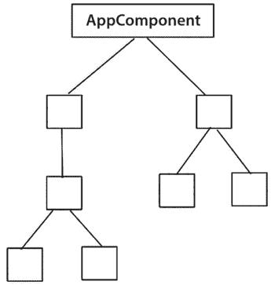

图 1.1 – 组件树

按照惯例，Angular 应用程序通常有一个主组件，称为 `AppComponent`。树中的每个组件都可以通过应用程序编程接口与其兄弟组件进行通信和交互，该接口由每个组件定义。

Angular 应用程序可以有许多被称为 **模块** 的功能。每个模块对应于特定应用程序领域或工作流程的单个功能块。Angular 模块用于将具有相似功能的 Angular 组件分组：

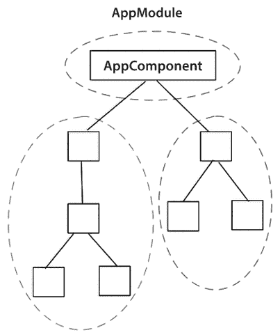

图 1.2 – 模块层次结构

在前面的图中，虚线圆圈代表 Angular 模块。按照惯例，Angular 应用程序通常有一个主模块，称为 `AppModule`。如果模块希望使用其功能的一部分，它们可以导入 Angular 应用程序中的其他模块。

模块的功能可以进一步分析为特性的展示逻辑和业务逻辑。Angular 组件应仅处理展示逻辑，并将业务逻辑任务委托给服务。Angular 框架通过内置的**依赖注入（DI）**机制为组件提供 Angular 服务。

Angular DI 框架使用特殊用途的对象，称为**注入器**，来隐藏向 Angular 应用程序提供依赖项的大部分复杂性。组件不需要知道 Angular 服务的实际实现。它们只需要从注入器请求即可。

一个 Angular 服务应遵循**单一职责原则**，并且不要跨越不同模块之间的边界。以下是一些服务的示例：

+   使用 HTTP 协议从后端 API 访问数据

+   与浏览器本地存储的交互

+   错误日志记录

+   数据转换

在构建 Angular 应用程序时，Angular 开发者不需要记住如何创建组件、模块和服务。幸运的是，Angular CLI 可以通过提供命令行界面来帮助我们完成这些任务。

# Angular CLI 简介

Angular CLI 是 Angular 团队创建的一个工具，它改善了构建 Angular 应用程序的开发者体验。它隐藏了搭建和配置 Angular 应用程序的复杂性，同时允许开发者专注于他们最擅长的事情——编码！在我们开始使用 Angular CLI 之前，我们需要在我们的系统中设置以下先决条件：

+   **Node.js**：建立在 Chrome v8 引擎之上的 JavaScript 运行时。您可以从 [`nodejs.org`](https://nodejs.org) 下载任何**长期支持（LTS）**版本。

+   **npm**：Node.js 运行的包管理器。

然后，我们可以使用命令行中的 `npm` 安装 Angular CLI：

```js
npm install -g @angular/cli 
```

我们使用 `-g` 选项全局安装 Angular CLI，因为我们希望从任何操作系统路径创建 Angular 应用程序。

在某些操作系统中安装 Angular CLI 可能需要管理员权限。

要验证 Angular CLI 是否已正确安装，我们可以在命令行中运行以下命令：

```js
ng version 
```

之前的命令将报告我们系统中安装的 Angular CLI 版本。Angular CLI 通过 `ng` 命令提供命令行界面，这是 Angular CLI 的二进制可执行文件。它可以接受各种选项，包括以下内容：

+   `serve`：构建并服务 Angular 应用程序。

+   `build`：构建 Angular 应用程序。

+   `test`：运行 Angular 应用程序的单元测试。

+   `generate`：生成新的 Angular 实体，例如组件或模块。

+   `add`：安装与 Angular 框架兼容的第三方库。

+   `new`：创建新的 Angular 应用程序。

之前提到的选项是最常见的。如果您想查看所有可用的命令，请在命令行中执行以下命令：

```js
ng help 
```

之前的命令将显示 Angular CLI 支持的所有命令列表。

Angular 工具生态系统充满了扩展和实用工具，可以在我们开发 Angular 应用程序时帮助我们。在下一节中，我们将了解其中一些与 VS Code 一起工作的扩展。

# 探索 VS Code 中 Angular 工具的丰富生态系统

在**VS Code Marketplace**中有许多扩展可用，可以增强 Angular 工具生态系统。在本节中，我们将了解其中最受欢迎的扩展，这些扩展可以显著帮助我们进行 Angular 开发：

+   Nx Console

+   Angular 语言服务

+   Angular Snippets

+   Angular Evergreen

+   Material Icon Theme

前面的列表并不全面；一些扩展已经包含在**Angular Essentials**扩展包中。然而，您可以在[`marketplace.visualstudio.com/search?term=angular&target=VSCode`](https://marketplace.visualstudio.com/search?term=angular&target=VSCode)上浏览更多 VS Code 的 Angular 扩展。

## Nx Console

**Nx Console** 是由 Nrwl 团队开发的一个 VS Code 扩展，它提供了一个图形用户界面，用于覆盖 Angular CLI。它包含大多数 Angular CLI 命令，并使用 Angular CLI 内部执行每个命令。我们将在“使用 Nx Console 构建我们的应用程序”部分了解更多关于这个扩展的信息。

## Angular Language Service

**Angular 语言服务**扩展在编辑 Angular 应用程序中的 HTML 模板时提供了各种增强功能，包括以下内容：

+   代码自动补全

+   编译错误信息

+   跳转到定义技术

代码自动补全是帮助我们找到在输入 HTML 内容时使用正确属性或方法的功能。它通过在我们开始输入时显示建议列表来实现：

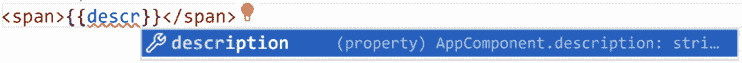

图 1.3 – 代码补全

在前面的屏幕截图中，当我们开始输入单词`descr`时，Angular 语言服务建议使用**description**组件属性。请注意，代码补全仅适用于组件中的公共属性和方法。

在开发 Web 应用程序时，最常见的问题之一是在应用程序达到生产状态之前检测到错误。这个问题可以通过 Angular 编译器部分解决，该编译器在构建用于生产的 Angular 应用程序时启动。此外，Angular 语言服务可以通过在应用程序达到编译过程之前显示编译错误信息来进一步解决这个问题：

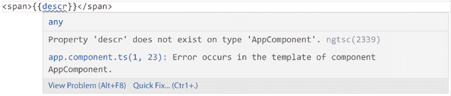

图 1.4 – 编译错误信息

例如，如果我们不小心拼错了组件的属性或方法名称，Angular 语言服务将显示适当的错误信息。

## Angular Snippets

**Angular Snippets**扩展包含了一组 Angular 代码片段，用于 TypeScript 和 HTML。在 TypeScript 中，我们可以使用它在一个空白 TypeScript 文件中创建组件、模块或服务：

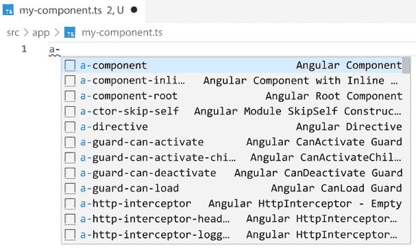

图 1.5 – 新 Angular 组件片段

在 HTML 模板中，我们可以使用此扩展来创建有用的 Angular 元素，例如 ***ngFor** 指令，以在 HTML 中循环列表：

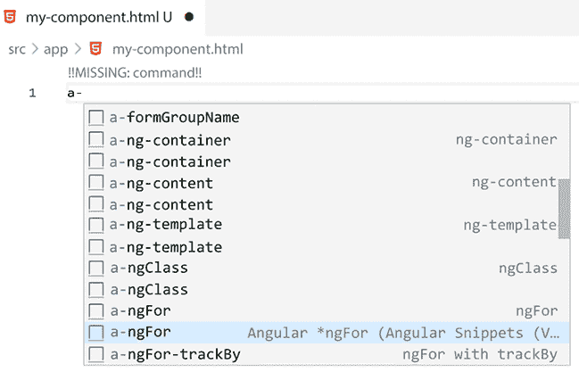

图 1.6 – *ngFor 碎片

由于 Angular CLI 的广泛流行和功能，使用它来在 TypeScript 中生成 Angular 元素看起来更方便。然而，Angular Snippets 在 HTML 部分做得很好，那里有更多需要记住的内容。

## Angular Evergreen

使 Angular 框架如此稳定的一个主要因素是它遵循基于语义版本控制的定期发布周期。如果我们希望我们的 Angular 应用程序充满最新功能和修复，我们必须定期更新它们。但如何最有效地保持更新呢？我们可以使用 **Angular Evergreen** 扩展！

它比较 Angular CLI 项目的 Angular 和 Angular CLI 版本与最新版本，并提醒您是否需要更新：

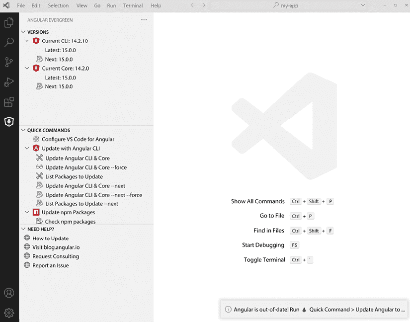

图 1.7 – Angular Evergreen

它提供了一个易于使用的用户界面来执行以下命令：

+   将 Angular 依赖项升级到 *最新* 版本

+   将 Angular 依赖项升级到 *下一个* 版本

+   升级所有 npm 依赖项

Angular Evergreen 是始终与您的 Angular 项目保持更新的完美扩展。

## 材料图标主题

列表中最后一个扩展在提高开发者生产力方面添加的价值很小。相反，它通过修改 VS Code 的图标主题来关注可发现性和美学观点。

**材料图标主题**包含大量基于 **Google 材料设计**的图标。它可以理解项目中每种文件类型并自动显示相关图标。例如，Angular 模块用红色 Angular 图标表示，而组件则用蓝色 Angular 图标表示。

VS Code 有一个默认的文件图标主题，称为 **Seti**。一旦您安装了材料图标主题，它将提示您选择您想要激活的主题：

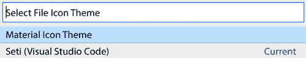

图 1.8 – 选择文件图标主题

选择 **材料图标主题**将自动更新当前 Angular 项目的图标。

材料图标主题已安装并全局应用于 VS Code，因此您无需为每个 Angular CLI 项目单独激活它。

现在，当您打开您的 Angular 项目时，您将一眼就能理解每个文件的类型，即使其名称没有完全显示在屏幕上。

# 项目概述

在这个项目中，我们将使用 Angular CLI 从头开始创建一个新的 Angular 应用程序。然后，我们将与 Angular 框架的核心功能交互，对我们的应用程序进行简单的更改。最后，我们将学习如何使用 Nx Console 扩展来构建和托管我们的应用程序。

构建时间：15 分钟。

# 入门

完成此项目所需的软件工具如下：

+   **Git**：一个免费且开源的分布式版本控制系统。您可以从 [`git-scm.com`](https://git-scm.com) 下载它。

+   **VS Code**：一个您可以从 [`code.visualstudio.com`](https://code.visualstudio.com) 下载的代码编辑器。

+   **Angular CLI**：我们在 *必要背景理论及环境* 部分介绍了 Angular 的命令行界面。

+   **GitHub 资源**：本章的代码，您可以在 [`github.com/PacktPublishing/Angular-Projects-Third-Edition`](https://github.com/PacktPublishing/Angular-Projects-Third-Edition) 的 `Chapter01` 文件夹中找到。

# 创建我们的第一个 Angular 应用程序

要创建一个全新的 Angular 应用程序，我们必须执行 Angular CLI 的 `ng new` 命令，并将应用程序名称作为选项传递：

```js
ng new my-app 
```

`ng new` 命令用于创建新的 Angular 应用程序或新的 Angular 工作空间。Angular 工作空间是一个包含一个或多个 Angular 应用程序的 Angular CLI 项目，其中一些可以是 Angular 库。因此，当我们执行 `ng new` 命令时，我们默认创建一个包含 Angular 应用程序的 Angular 工作空间。

在前面的命令中，我们的 Angular 应用程序名称是 `my-app`。执行命令后，Angular CLI 将提出一些问题，尽可能收集有关我们想要创建的应用程序性质的信息：

1.  初始时，它会询问我们是否想启用 Angular 分析：

    ```js
    Would you like to share pseudonymous usage data about this project with the Angular Team at Google under Google's Privacy Policy at https://policies.google.com/privacy. For more details and how to change this setting, see https://angular.io/analytics. (y/N) 
    ```

    Angular CLI 只会在我们创建第一个 Angular 项目时询问一次前面的问题，并将其全局应用于系统。然而，我们可以在特定的 Angular 工作空间中稍后更改设置。

1.  接下来，它将询问我们是否想在 Angular 应用程序中启用路由：

    ```js
    Would you like to add Angular routing? (y/N) 
    ```

    Angular 中的路由全部关于使用 URL 在 Angular 应用程序组件之间导航。我们在这个项目中不关心路由，所以按 *Enter* 接受默认值。

1.  然后，Angular CLI 会提示我们选择我们想要在 Angular 应用程序中使用的样式格式：

    ```js
    Which stylesheet format would you like to use? (Use arrow keys) 
    ```

从可用的样式表列表中选择一个格式并按 *Enter*。

Angular CLI 启动您的 Angular 应用程序的创建过程，该过程包括以下步骤：

+   为典型的 Angular CLI 项目搭建必要的文件夹结构

+   安装所需的 npm 依赖项和 Angular 包

+   在 Angular CLI 项目中初始化 Git

这个过程可能需要一些时间，具体取决于您的网络速度。一旦完成，您应该在运行`ng new` Angular CLI 命令的路径中看到一个名为`my-app`的新文件夹。

现在，运行我们的 Angular 应用程序并看到它实际运行的时刻终于到来了：

1.  打开一个终端窗口并导航到`my-app`文件夹。

1.  运行以下 Angular CLI 命令：

    ```js
    ng serve 
    ```

    上述命令将构建 Angular 应用程序并启动一个内置的 Web 服务器，我们可以使用它来预览应用程序。Web 服务器以监视模式启动；每当我们的代码发生变化时，它会自动重新构建 Angular 应用程序。第一次构建 Angular 应用程序时，完成需要相当长的时间，因此我们必须有耐心。当我们在终端窗口中看到以下消息时，我们知道过程已经完成且没有错误：

    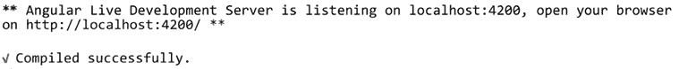

    图 1.9 – Angular 构建输出

1.  启动您喜欢的浏览器并导航到`http://localhost:4200`以预览您全新的 Angular 应用程序：

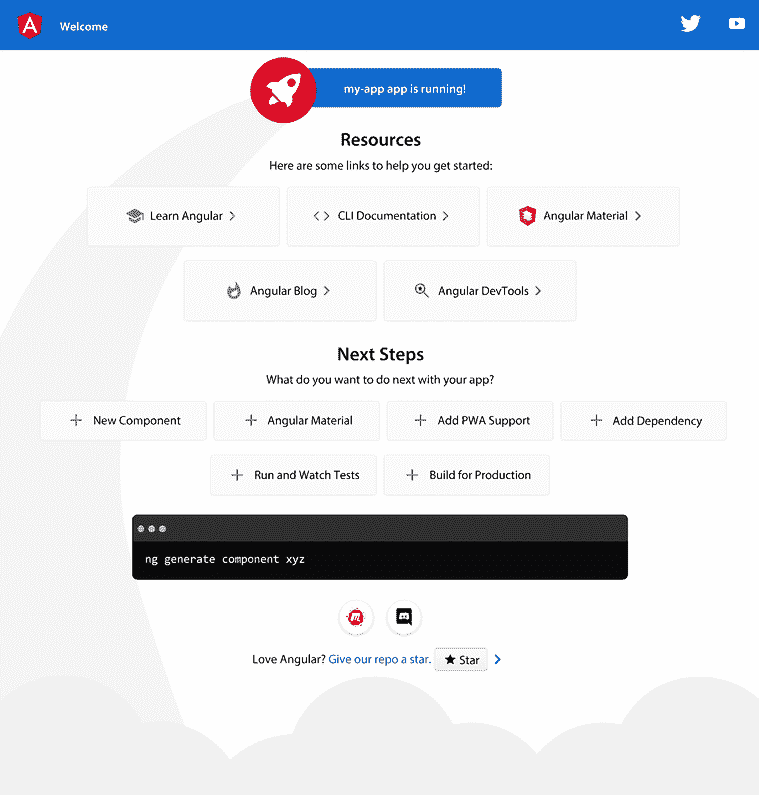

图 1.10 – 最小 Angular 应用程序

Angular CLI 默认创建一个最小的 Angular 应用程序，为我们提供 Angular 项目的起点。它包含一些现成的 CSS 样式和 HTML 内容，我们将在下一节中学习如何根据我们的规格进行更改。

# 与 Angular 框架交互

在使用 Angular 时，真正的乐趣在于我们开始与框架本身打交道。毕竟，理解 Angular 的工作原理和编写应用程序代码才是最重要的。

应用程序源代码位于 Angular CLI 项目的根目录下的`src\app`文件夹中。它包含构建和测试我们的 Angular 应用程序所需的所有文件，包括一个组件和一个模块。组件是 Angular 应用程序的主要组件：

`app.component.ts`

```js
import { Component } from '@angular/core';
@Component({
  selector: 'app-root',
  templateUrl: './app.component.html',
  styleUrls: ['./app.component.css']
})
export class AppComponent {
  title = 'my-app';
} 
```

以下属性描述了 Angular 组件：

+   `selector`：用于在 HTML 内容中标识和声明组件的唯一名称。它是一个 HTML 标签，就像任何原生 HTML 元素一样，例如`<app-root></app-root>`。

    Angular CLI 默认在组件选择器中提供`app-`前缀。在从头创建新的 Angular CLI 应用程序时，我们可以使用`--prefix`选项来使用自定义前缀。自定义前缀可以基于组织名称或特定产品的名称，这有助于避免与其他库或模块冲突。

+   `templateUrl`：指向包含组件 HTML 内容的 HTML 文件的路径，称为组件模板。

+   `styleUrls`：指向包含组件 CSS 样式的样式表文件的路径列表。

前面的属性使用 `@Component` 装饰器定义。它是一个装饰 TypeScript 类的函数，并识别它为 Angular 组件。`AppComponent` 类的 `title` 属性是一个包含字符串值的公共属性，可以在组件模板中使用。

我们的 Angular 应用程序的主模块使用一个类似的装饰器 `@NgModule` 来定义其属性：

`app.module.ts`

```js
import { NgModule } from '@angular/core';
import { BrowserModule } from '@angular/platform-browser';
import { AppComponent } from './app.component';
@NgModule({
  declarations: [
    AppComponent
  ],
  imports: [
    BrowserModule
  ],
  providers: [],
  bootstrap: [AppComponent]
})
export class AppModule { } 
```

Angular 模块的装饰器定义了一组可以用于配置模块的属性。最常见的一些如下：

+   `declarations`：定义属于 Angular 模块的 Angular 组件。Angular 模块中存在的每个组件*必须*添加到 `declarations` 数组中。

+   `imports`：定义包含 Angular 模块所需功能的其他 Angular 模块。

现在，让我们通过修改我们的 Angular 应用程序的代码来试试水。我们将更改以下在应用程序启动时显示的问候信息，使其更有意义：


图 1.11 – 欢迎信息

首先，我们需要找到上一张截图中的消息声明位置。Angular 应用程序的主组件是默认在应用程序启动时加载的组件。

应用程序主模块的 `bootstrap` 属性指示在 Angular 应用程序启动时显示的组件。我们很少需要更改此属性。该组件的选择器默认在 `index.html` 文件中使用。

因此，消息应该在 `app.component.ts` 文件中声明。让我们看一下：

1.  打开 VS Code 编辑器并从主菜单中选择 **文件 | 打开文件夹…**。

1.  找到我们创建的 Angular 应用程序的 `my-app` 文件夹并选择它。

1.  从 **资源管理器** 窗格导航到 `src\app` 文件夹并选择 `app.component.ts` 文件。

1.  在 `AppComponent` 类中找到 `title` 属性并将其值更改为 `Angular Projects`：

    ```js
    title = '**Angular Projects**'; 
    ```

1.  如果应用程序没有运行，请在终端窗口中运行 `ng serve`，然后使用浏览器导航到 `http://localhost:4200`。我们的 Angular 应用程序现在应该显示以下问候信息：


图 1.12 – 欢迎信息

`title` 属性绑定到主组件的模板。如果我们打开 `app.component.html` 文件并转到第 344 行，我们将看到以下 HTML 代码：

```js
<span>{{ title }} app is running!</span> 
```

围绕 `title` 属性的 `{{}}` 语法称为**插值**。在插值过程中，Angular 框架读取包含的组件属性值，将其转换为文本，并在屏幕上打印出来。

Angular CLI 提供了丰富的命令集合，以协助我们在日常开发过程中。然而，许多开发者发现使用命令行很困难，更倾向于图形化方法。在下一节中，我们将学习如何使用 Nx 控制台，它是 Angular CLI 的图形用户界面。

# 使用 Nx Console 自动化 Angular CLI 命令

Angular CLI 是一个具有各种命令的命令行工具。每个命令可以根据我们想要完成的任务接受广泛的各种选项和参数。记住这些命令及其选项是一项艰巨且耗时的工作。在这种情况下，Angular 工具生态系统可以派上用场。VS Code 市场包含许多有用的扩展，我们可以安装它们来帮助我们进行 Angular 开发。其中之一就是 Nx 控制台，它提供了一个 Angular CLI 的用户界面。要在您的环境中安装 Nx 控制台，请按照以下步骤操作：

1.  打开 VS Code 并在侧边栏中点击 **扩展** 菜单：

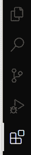

图 1.13 – VS Code 扩展

1.  在出现的 **扩展** 面板中，键入 `Nx Console`。

1.  在第一个项目上点击 **安装** 按钮来安装 Nx Console 扩展。

Nx Console 扩展现在已在全球环境中安装，因此我们可以在任何 Angular 项目中使用它。它是最常见的 Angular CLI 命令的图形表示。目前，它支持以下命令（括号中显示的是相关的 Angular CLI 命令）：

+   **生成**：生成新的 Angular 艺术品，如组件和模块（`ng generate`）。

+   **运行**：运行在 Angular CLI 工作区的 `angular.json` 配置文件中定义的架构目标（`ng run`）。

+   **构建**：构建 Angular 应用程序（`ng build`）。

+   **运行**：构建并运行 Angular 应用程序（`ng serve`）。

+   **测试**：运行 Angular 应用程序的单元测试（`ng test`）。

Nx 控制台几乎可以实现我们使用 Angular CLI 可以做到的所有事情。真正的好处是开发者不需要记住所有 Angular CLI 命令选项，因为它们都在图形界面中得到了表示。让我们看看它是如何做到的：

1.  使用 VS Code 打开 `my-app` 文件夹，并在侧边栏中点击 **Nx 控制台** 菜单：


图 1.14 – Nx 控制台

1.  从 **项目** 面板中选择 **运行** 命令，然后点击 **播放** 按钮来执行它：

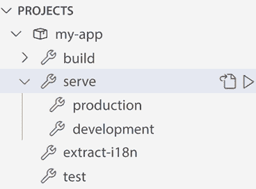

图 1.15 – serve 命令

1.  VS Code 在编辑器底部打开一个集成终端并执行 **ng serve** 命令：

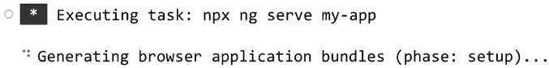

图 1.16 – VS Code 集成终端

这是我们从终端窗口使用 Angular CLI 时运行的相同命令。

Nx 控制台内部使用 **任务** 来运行 Angular CLI 命令。任务是 VS Code 的内置机制，允许我们运行脚本或启动外部进程，而无需直接与命令行交互。

Nx 控制台扩展出色地减轻了记住 Angular CLI 命令的负担。VS Code 市场上有许多针对 Angular 开发者的扩展，这些扩展补充了 Nx 控制台的工作。

# 摘要

在本章中，我们学习了 Angular 框架的基本原则，并简要概述了 Angular 架构。我们看到了一些流行的 VS Code 扩展，我们可以使用这些扩展来增强我们在使用 Angular 进行开发时的体验。

然后，我们学习了如何使用 Angular CLI，这是 Angular 生态系统中的一个强大工具，可以从头开始构建新的 Angular 应用程序。我们还通过修改典型 Angular CLI 应用程序的 Angular 组件，首次与 Angular 代码进行了交互。最后，我们安装了 Nx 控制台扩展，并学习了如何构建我们的应用程序。

在下一章中，我们将探讨 Angular 路由，并学习如何使用它来创建个人博客，使用 Scully 静态网站生成器。

# 实践问题

让我们看看几个实践问题：

1.  Angular 应用程序的基本构建块是什么？

1.  我们如何将功能相似的组件分组？

1.  在 Angular 应用程序中谁处理业务逻辑任务？

1.  我们可以使用哪个 Angular CLI 命令来创建新的 Angular 应用程序？

1.  我们可以使用哪个 Angular CLI 命令来提供 Angular 应用程序？

1.  我们如何在 HTML 中声明 Angular 组件？

1.  我们如何在模块中声明 Angular 组件？

1.  我们在 HTML 模板上绑定文本时使用什么语法？

1.  使用 Nx 控制台有什么好处？

1.  我们在 Angular 代码中用哪个扩展来执行静态分析？

# 进一步阅读

这里有一些链接，可以帮助我们巩固本章所学的内容：

+   基本 Angular 概念简介：[`angular.io/guide/architecture`](https://angular.io/guide/architecture)

+   插值：[`angular.io/guide/interpolation`](https://angular.io/guide/interpolation)

+   Nx 控制台：[`nx.dev/core-features/integrate-with-editors#vscode-plugin:-nx-console`](https://nx.dev/core-features/integrate-with-editors#vscode-plugin:-nx-console)

+   Angular 精要：[`marketplace.visualstudio.com/items?itemName=johnpapa.angular-essentials`](https://marketplace.visualstudio.com/items?itemName=johnpapa.angular-essentials)

+   Angular Evergreen：[`expertlysimple.io/get-evergreen`](https://expertlysimple.io/get-evergreen)
