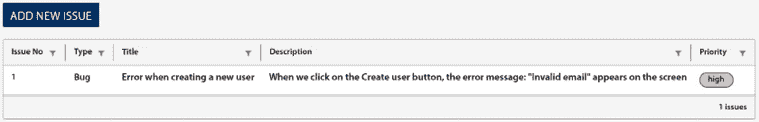

# 3

# 使用反应式表单构建问题跟踪系统

Web 应用程序使用 HTML 表单从用户那里收集数据并进行验证，例如在登录应用程序、执行搜索或完成在线支付时。Angular 框架提供了两种类型的表单，反应式和模板驱动型，我们可以在 Angular 应用程序中使用。

在本章中，我们将构建一个用于管理和跟踪问题的系统。我们将使用 Angular 反应式表单来报告新问题。我们还将使用来自 VMware 的 **Clarity 设计系统**来设计我们的表单和显示我们的问题。

我们将涵盖以下主题：

+   在 Angular 应用程序中安装 Clarity 设计系统

+   显示问题概述

+   报告新问题

+   标记问题为已解决

+   启用新问题建议

# 必要的背景理论和上下文

Angular 框架提供了两种类型的表单，我们可以使用：

+   **模板驱动型**：在 Angular 应用程序中设置它们非常简单。模板驱动的表单扩展性不好，且难以测试，因为它们是在组件模板中定义的。

+   **反应式**：它们基于反应式编程方法。反应式表单在组件的 TypeScript 类中操作，并且比模板驱动型表单更容易测试和扩展。

在本章中，我们将亲身体验反应式表单方法，这是 Angular 社区中最受欢迎的方法。

Angular 组件可以从外部源（如 HTTP 或其他 Angular 组件）获取数据。在后一种情况下，它们通过公共 API 与具有数据的组件交互：

+   `@Input()`：用于向组件传递数据。

+   `@Output()`：用于接收通知或从组件获取数据。

**Clarity** 是一个包含构建 Web 应用程序的一套 UX 和 UI 指南的设计系统。它还包含一个包含这些指南的专有 HTML 和 CSS 框架。幸运的是，我们不需要使用这个框架，因为 Clarity 已经提供了各种基于 Angular 的 UI 组件，我们可以在我们的 Angular 应用程序中使用。

# 项目概述

在此项目中，我们将使用反应式表单和 Clarity 构建 Angular 应用程序来管理和跟踪问题。最初，我们将以表格形式显示问题列表，我们可以对其进行排序和筛选。然后我们将创建一个表单，允许用户报告新问题。最后，我们将创建一个模态对话框来解决问题。我们还将更进一步，在报告问题时启用建议，以帮助用户避免重复输入。以下图表展示了项目的架构概述：


图 3.1 – 项目架构

构建时间：1 小时

# 开始

完成此项目所需的以下软件工具：

+   **Angular CLI**：Angular 的命令行界面，您可以在 [`angular.io/cli`](https://angular.io/cli) 找到

+   **GitHub 材料**：本章的相关代码，您可以在 [`github.com/PacktPublishing/Angular-Projects-Third-Edition`](https://github.com/PacktPublishing/Angular-Projects-Third-Edition) 的 `Chapter03` 文件夹中找到

# 在 Angular 应用程序中安装 Clarity

让我们通过搭建一个新的 Angular 应用程序来开始创建我们的问题跟踪系统：

```js
ng new issue-tracker --defaults 
```

我们使用 Angular CLI 的 `ng new` 命令创建一个具有以下特性的新 Angular 应用程序：

+   `issue-tracker`：Angular 应用程序的名称。

+   `--defaults`：此选项禁用应用程序的 Angular 路由，并将样式表格式设置为 CSS。

现在，我们需要在我们的 Angular 应用程序中安装 Clarity 库：

1.  导航到创建的 `issue-tracker` 文件夹，并运行以下命令来安装它：

    ```js
    npm install @cds/core @clr/angular @clr/ui --save 
    ```

1.  打开 `angular.json` 文件，并在 `styles` 数组中添加 Clarity CSS 样式：

    ```js
    "styles": [
      **"node_modules/@clr/ui/clr-ui.min.css"****,**
      "src/styles.css"
    ] 
    ```

1.  最后，在主应用程序模块 `app.module.ts` 中导入 `ClarityModule` 和 `BrowserAnimationsModule`：

    ```js
    import { NgModule } from '@angular/core';
    import { BrowserModule } from '@angular/platform-browser';
    import { AppComponent } from './app.component';
    **import** **{** **ClarityModule** **}** **from****'@clr/angular'****;**
    **import** **{** **BrowserAnimationsModule** **}** **from**
    **'@angular/platform-browser/animations'****;**
    @NgModule({
      declarations: [
        AppComponent
      ],
      imports: [
        BrowserModule,
    **ClarityModule****,**
    **BrowserAnimationsModule**
      ],
      providers: [],
      bootstrap: [AppComponent]
    })
    export class AppModule { } 
    ```

现在我们已经完成了 Clarity 在我们的应用程序中的安装，我们可以开始使用它构建美观的设计。在接下来的部分，我们将首先创建一个用于显示我们问题的列表。

# 显示问题概述

我们的 Angular 应用程序将负责管理和跟踪问题。当应用程序启动时，我们应该显示系统中所有待处理问题的列表。待处理问题定义为那些尚未解决的问题。我们将遵循的过程可以进一步分析如下：

+   获取待处理问题

+   使用数据网格可视化问题

## 获取待处理问题

首先，我们需要创建一个机制来获取所有待处理问题：

1.  使用 Angular CLI 的 `generate` 命令创建一个名为 `issues` 的 Angular 服务：

    ```js
    ng generate service issues 
    ```

    之前的命令将在我们的 Angular CLI 项目的 `src\app` 文件夹中创建一个 `issues.service.ts` 文件。

1.  每个问题都将具有定义类型的特定属性。我们需要使用以下 Angular CLI 命令创建一个 TypeScript 接口：

    ```js
    ng generate interface issue 
    ```

    之前的命令将在项目的 `src\app` 文件夹中创建一个 `issue.ts` 文件。

1.  打开 `issue.ts` 文件，并在 `Issue` 接口中添加以下属性：

    ```js
    export interface Issue {
      **issueNo****:** **number****;**
    **title****:** **string****;**
    **description****:** **string****;**
    **priority****:** **'low'** **|** **'high'****;**
    **type****:** **'Feature'** **|** **'Bug'** **|** **'Documentation'****;**
     **completed?:** **Date****;**
    } 
    ```

    `completed` 属性是一个问题被解决时的日期。我们将其定义为可选的，因为新问题将不会设置此属性。

1.  打开我们在第一步中创建的 Angular 服务，并添加一个 `issues` 属性来存储我们的数据。同时，创建一个 `getPendingIssues` 方法，它将返回所有未完成的问题：

    ```js
    import { Injectable } from '@angular/core';
    **import** **{** **Issue** **}** **from****'./issue'****;**
    @Injectable({
      providedIn: 'root'
    })
    export class IssuesService {
      **private****issues****:** **Issue****[] = [];**

      constructor() { }

      **getPendingIssues****():** **Issue****[] {**
    **return****this****.****issues****.****filter****(****issue** **=>** **!issue.****completed****);**
     **}**
    } 
    ```

    在前面的代码中，我们将 `issues` 属性初始化为一个空数组。如果您想从示例数据开始，可以使用本章 GitHub 材料中存在的 `src\assets` 文件夹中的 `mock-issues.ts` 文件，并按以下方式导入：

    ```js
    import { issues } from '../assets/mock-issues'; 
    ```

在接下来的部分，我们将创建一个用于显示这些问题的组件。

## 在数据网格中可视化问题

我们将使用 Clarity 库的数据网格 UI 组件以表格格式显示数据。数据网格还提供了开箱即用的过滤和排序机制。首先，让我们创建一个将托管数据网格的 Angular 组件：

1.  使用 Angular CLI 的 `generate` 命令创建组件：

    ```js
    ng generate component issue-list 
    ```

1.  打开我们应用程序的主要组件模板 `app.component.html`，并用以下 HTML 代码替换其内容：

    ```js
    <div class="main-container">
      <div class="content-container">
        <div class="content-area">
          <app-issue-list></app-issue-list>
        </div>
      </div>
    </div> 
    ```

    一旦 Angular 应用程序启动，问题列表将显示在主组件中。

1.  目前，`<app-issue-list>` 组件不显示任何问题数据。我们必须将其与我们在 *获取待处理问题* 部分创建的 Angular 服务连接起来。打开 `issue-list.component.ts` 文件，并在 `IssueListComponent` 类的 `constructor` 中注入 `IssuesService`：

    ```js
    import { Component } from '@angular/core';
    **import** **{** **IssuesService** **}** **from****'../issues.service'****;**
    @Component({
      selector: 'app-issue-list',
      templateUrl: './issue-list.component.html',
      styleUrls: ['./issue-list.component.css']
    })
    export class IssueListComponent {
    **constructor****(****private** **issueService: IssuesService****) { }**
    } 
    ```

1.  创建一个名为 `getIssues` 的方法，该方法将调用注入的服务中的 `getPendingIssues` 方法，并将返回值保存在 `issues` 组件属性中：

    ```js
    import { Component } from '@angular/core';
    **import** **{** **Issue** **}** **from****'../issue'****;**
    import { IssuesService } from '../issues.service';
    @Component({
      selector: 'app-issue-list',
      templateUrl: './issue-list.component.html',
      styleUrls: ['./issue-list.component.css']
    })
    export class IssueListComponent {
      **issues****:** **Issue****[] = [];**
      constructor(private issueService: IssuesService) { }
    **private****getIssues****() {**
    **this****.****issues** **=** **this****.****issueService****.****getPendingIssues****();**
     **}**
    } 
    ```

1.  最后，在 `ngOnInit` 组件方法中调用 `getIssues` 方法，以在组件初始化时获取所有待处理问题：

    ```js
    import { Component, **OnInit** } from '@angular/core';
    import { Issue } from '../issue';
    import { IssuesService } from '../issues.service';
    @Component({
      selector: 'app-issue-list',
      templateUrl: './issue-list.component.html',
      styleUrls: ['./issue-list.component.css']
    })
    export class IssueListComponent **implements****OnInit** {
      issues: Issue[] = [];
      constructor(private issueService: IssuesService) { }
      **ngOnInit****():** **void** **{**
    **this****.****getIssues****();** 
     **}**
      private getIssues() {
        this.issues = this.issueService.getPendingIssues();
      }
    } 
    ```

我们已经在我们的组件中实现了获取问题数据的过程。现在我们只需要在模板中显示它。打开 `issue-list.component.html` 文件，并用以下 HTML 代码替换其内容：

```js
<clr-datagrid>
    <clr-dg-column [clrDgField]="'issueNo'" [clrDgColType]="'number'">Issue No</clr-dg-column>
    <clr-dg-column [clrDgField]="'type'">Type</clr-dg-column>
    <clr-dg-column [clrDgField]="'title'">Title</clr-dg-column>
    <clr-dg-column [clrDgField]="'description'">Description</clr-dg-column>
    <clr-dg-column [clrDgField]="'priority'">Priority</clr-dg-column>
    <clr-dg-row *clrDgItems="let issue of issues">
      <clr-dg-cell>{{issue.issueNo}}</clr-dg-cell>
      <clr-dg-cell>{{issue.type}}</clr-dg-cell>
      <clr-dg-cell>{{issue.title}}</clr-dg-cell>
      <clr-dg-cell>{{issue.description}}</clr-dg-cell>
      <clr-dg-cell>
       <span class="label" [class.label-danger]="issue.priority === 'high'">{{issue.priority}}</span>
      </clr-dg-cell>
    </clr-dg-row>
    <clr-dg-footer>{{issues.length}} issues</clr-dg-footer>
</clr-datagrid> 
```

在前面的代码片段中，我们使用了 Clarity 库的几个 Angular 组件：

+   `<clr-datagrid>`: 定义一个表格。

+   `<clr-dg-column>`: 定义表格的一列。每一列使用 `clrDgField` 指令绑定到该列表示的问题的属性名。`clrDgField` 指令提供了排序和过滤功能，而无需在 TypeScript 类文件中编写任何代码。排序仅适用于基于字符串的内容。如果我们想按不同的原始类型排序，我们必须使用 `clrDgColType` 指令并指定特定的类型。

+   `<clr-dg-row>`: 定义表格的一行。它使用 `*clrDgItems` 指令遍历问题，并为每个问题创建一行。

+   `<clr-dg-cell>`: 每一行包含一组 `<clr-dg-cell>` 组件，用于通过插值显示每列的值。在最后一列中，当问题具有高优先级时，我们添加 `label-danger` 类以表明其重要性。

+   `<clr-dg-footer>`: 定义表格的页脚。在这种情况下，它显示问题的总数。

如果我们使用 `ng serve` 运行我们的 Angular 应用程序，输出将如下所示：


图 3.2 – 待处理问题的概述

在前面的屏幕截图中，应用程序使用 `mock-issues.ts` 文件中的示例数据。

Clarity 库的数据网格组件具有丰富的功能，我们可以在我们的 Angular 应用程序中使用这些功能。在下一节中，我们将学习如何使用响应式表单来报告新问题。

# 报告新问题

我们问题跟踪系统的主要功能之一是能够报告新问题。我们将使用 Angular 反应式表单来创建添加新问题的表单。该功能可以进一步细分为以下任务：

+   在 Angular 应用程序中设置反应式表单

+   创建报告问题表单

+   在列表中显示新问题

+   验证问题细节

让我们从在 Angular 应用程序中介绍反应式表单开始。

## 在 Angular 应用程序中设置反应式表单

反应式表单定义在 Angular 框架的 `@angular/forms` npm 包中。要将它们添加到我们的 Angular 应用程序中：

1.  打开 `app.module.ts` 文件并导入 `ReactiveFormsModule`:

    ```js
    import { ReactiveFormsModule } from '@angular/forms'; 
    ```

1.  将 `ReactiveFormsModule` 添加到 `@NgModule` 装饰器的 `imports` 数组中：

    ```js
    @NgModule({
      declarations: [
        AppComponent,
        IssueListComponent
      ],
      imports: [
        BrowserModule,
        ClarityModule,
        BrowserAnimationsModule,
        **ReactiveFormsModule**
      ],
      providers: [],
      bootstrap: [AppComponent]
    }) 
    ```

`ReactiveFormsModule` 包含了我们与表单一起工作所需的所有必要的 Angular 指令和服务，正如我们将在下一节中看到的。

## 创建报告问题表单

现在我们已经在 Angular 应用程序中介绍了反应式表单，我们可以开始构建我们的表单：

1.  创建一个名为 `issue-report` 的新 Angular 组件：

    ```js
    ng generate component issue-report 
    ```

1.  打开 `issue-report.component.ts` 文件并添加以下 `import` 语句：

    ```js
    import { FormControl, FormGroup } from '@angular/forms'; 
    ```

    在这个语句中，`FormControl` 代表表单的单个控件，而 `FormGroup` 用于将单个控件组合成一个逻辑表单表示。

1.  创建以下接口，它将代表我们表单的结构：

    ```js
    interface IssueForm {
      title: FormControl<string>;
      description: FormControl<string>;
      priority: FormControl<string>;
      type: FormControl<string>;
    } 
    ```

1.  在 TypeScript 类中声明一个 `issueForm` 属性，其类型为 `FormGroup<IssueForm>`：

    ```js
    issueForm = new FormGroup<IssueForm>({
      title: new FormControl('', { nonNullable: true }),
      description: new FormControl('', { nonNullable: true }),
      priority: new FormControl('', { nonNullable: true }),
      type: new FormControl('', { nonNullable: true })
    }); 
    ```

    我们将所有控件初始化为空字符串，因为表单将用于从头创建新问题。我们还通过使用 `nonNullable` 属性明确声明所有控件默认不接受空值。

1.  我们现在必须将我们创建的 `FormGroup` 对象与相应的 HTML 元素关联。打开 `issue-report.component.html` 文件，并用以下 HTML 代码替换其内容：

    ```js
    <h3>Report an issue</h3>
    <form clrForm *ngIf="issueForm" [formGroup]="issueForm">
      <clr-input-container>
        <label>Title</label>
        <input clrInput formControlName="title" />
      </clr-input-container>
      <clr-textarea-container>
        <label>Description</label>
        <textarea clrTextarea
          formControlName="description"></textarea>
      </clr-textarea-container>
      <clr-radio-container clrInline>
        <label>Priority</label>
        <clr-radio-wrapper>
          <input type="radio" value="low" clrRadio
             formControlName="priority" />
          <label>Low</label>
        </clr-radio-wrapper>
        <clr-radio-wrapper>
          <input type="radio" value="high" clrRadio
            formControlName="priority" />
          <label>High</label>
        </clr-radio-wrapper>
      </clr-radio-container>
      <clr-select-container>
        <label>Type</label>
        <select clrSelect formControlName="type">
          <option value="Feature">Feature</option>
          <option value="Bug">Bug</option>
          <option value="Documentation">Documentation
            </option>
        </select>
      </clr-select-container>
    </form> 
    ```

    `formGroup` 和 `clrForm` 指令将 HTML `<form>` 元素与 `issueForm` 属性关联，并将其标识为 Clarity 表单。

    `formControlName` 指令用于通过名称将 HTML 元素与表单控件关联。每个控件也使用 Clarity 容器元素定义。

    例如，`title` 输入控件是一个包含 `<input>` HTML 元素的 `<clr-input-container>` 组件。

    每个原生 HTML 元素都根据其类型附加了一个 Clarity 指令。例如，`<input>` HTML 元素包含一个 `clrInput` 指令。

1.  最后，给我们的 `issue-report.component.css` 文件添加一些样式：

    ```js
    .clr-input, .clr-textarea {
        width: 30%;
    }
    button {
        margin-top: 25px;
    } 
    ```

现在我们已经创建了表单的基本结构，我们将学习如何提交其细节：

1.  在 HTML `<form>` 元素的结束标签之前添加一个 HTML `<button>` 元素：

    ```js
    <button class="btn btn-primary" type="submit">Create</button> 
    ```

    我们将其类型设置为 `submit`，以便在点击按钮时触发表单提交。

1.  打开 `issues.service.ts` 文件并添加一个 `createIssue` 方法，该方法将新问题插入到 `issues` 数组中：

    ```js
    createIssue(issue: Issue) {
      issue.issueNo = this.issues.length + 1;
      this.issues.push(issue);
    } 
    ```

    在将问题添加到 `issues` 数组之前，我们自动为问题分配一个新的 `issueNo` 属性。

    当前 `issueNo` 属性是根据 `issues` 数组的长度来计算的。一个更好的方法是实现一个生成器机制来创建唯一且随机的 `issueNo` 值。

1.  返回到 `issue-report.component.ts` 文件，并添加以下 `import` 语句：

    ```js
    import { Issue } from '../issue';
    import { IssuesService } from '../issues.service'; 
    ```

1.  将 `IssuesService` 类注入到 TypeScript 类的 `constructor` 中：

    ```js
    constructor(private issueService: IssuesService) { } 
    ```

1.  添加一个新的组件方法，该方法将调用注入的服务中的 `createIssue` 方法：

    ```js
    addIssue() {
      this.issueService.createIssue(this.issueForm.getRawValue() as Issue);
    } 
    ```

    我们使用 `issueForm` 对象的 `getRawValue` 属性传递每个表单控件值，该对象将为我们提供对底层表单模型的访问。我们还将其类型转换为 `Issue` 接口，因为我们已经知道其值将代表问题对象的属性。

1.  打开 `issue-report.component.html` 文件，并将表单的 `ngSubmit` 事件绑定到 `addIssue` 组件方法：

    ```js
    <form clrForm *ngIf="issueForm" [formGroup]="issueForm" **(****ngSubmit****)=****"addIssue()"**> 
    ```

当我们点击表单的 `Create` 按钮时，将触发 `ngSubmit` 事件。

我们已经完成了将新问题添加到系统的所有过程。在下一节中，我们将学习如何在待处理问题表中显示新创建的问题。

## 在列表中显示新问题

显示和创建新问题是委托给不同的 Angular 组件的两个任务。当我们使用 `IssueReportComponent` 创建新问题时，我们需要通知 `IssueListComponent` 以在表格中反映这一变化。首先，让我们看看如何配置 `IssueReportComponent` 以实现这种通信：

1.  打开 `issue-report.component.ts` 文件，并使用 `@Output()` 装饰器添加一个 `EventEmitter` 属性：

    ```js
    @Output() formClose = new EventEmitter(); 
    ```

    可以从 `@angular/core` npm 包中导入 `Output` 和 `EventEmitter` 符号。

1.  在创建问题后，立即在 `addIssue` 组件方法中调用 `formClose` 输出属性的 `emit` 方法：

    ```js
    addIssue() {
      this.issueService.createIssue(this.issueForm.getRawValue() as Issue);
    **this****.****formClose****.****emit****();**
    } 
    ```

1.  在组件模板中添加第二个 HTML `<button>` 元素，并在其 `click` 事件上调用 `formClose.emit` 方法：

    ```js
    <button class="btn" type="button" (click)="formClose.emit()">Cancel</button> 
    ```

`IssueListComponent` 现在可以绑定到 `IssueReportComponent` 的 `formClose` 事件，并在任何按钮被点击时收到通知。让我们来看看如何实现：

1.  打开 `issue-list.component.ts` 文件，并在 `IssueListComponent` 类中添加以下属性：

    ```js
    showReportIssue = false; 
    ```

    `showReportIssue` 属性将切换报告问题表单的显示。

1.  添加以下组件方法，当报告问题表单发出 `formClose` 事件时将被调用：

    ```js
    onCloseReport() {
      this.showReportIssue = false;
      this.getIssues();
    } 
    ```

    之前的方法会将 `showReportIssue` 属性设置为 `false`，这样报告问题表单就不再可见，而是显示待处理问题的表格。它还会再次获取问题以刷新表格中的数据。

1.  打开 `issue-list.component.html` 文件，并在模板顶部添加一个 HTML `<button>` 元素。当点击按钮时，将显示报告问题表单：

    ```js
    <button class="btn btn-primary" (click)="showReportIssue = true">Add new issue</button> 
    ```

1.  在 `<ng-container>` 元素内组合按钮和数据网格。如 `*ngIf` Angular 指令所示，当报告问题表单不可见时，`<ng-container>` 元素的 内容将被显示：

    ```js
    **<****ng-container** *******ngIf****=****"showReportIssue === false"****>**
        <button class="btn btn-primary" (click)="showReportIssue = true">Add new issue</button>
        <clr-datagrid>
            <clr-dg-column [clrDgField]="'issueNo'" [clrDgColType]="'number'">Issue No</clr-dg-column>
            <clr-dg-column [clrDgField]="'type'">Type</clr-dg-column>
            <clr-dg-column [clrDgField]="'title'">Title</clr-dg-column>
            <clr-dg-column [clrDgField]="'description'">Description</clr-dg-column>
            <clr-dg-column [clrDgField]="'priority'">Priority</clr-dg-column>
            <clr-dg-row *clrDgItems="let issue of issues">
                <clr-dg-cell>{{issue.issueNo}}</clr-dg-cell>
                <clr-dg-cell>{{issue.type}}</clr-dg-cell>
                <clr-dg-cell>{{issue.title}}</clr-dg-cell>
                <clr-dg-cell>{{issue.description}}</clr-dg-cell>
                <clr-dg-cell>
                    <span class="label" [class.label-danger]="issue.priority === 'high'">{{issue.priority}}</span>
                </clr-dg-cell>
            </clr-dg-row>
            <clr-dg-footer>{{issues.length}} issues</clr-dg-footer>
        </clr-datagrid>
    **</****ng-container****>** 
    ```

    `<ng-container>` 元素是一个 Angular 组件，它不会在屏幕上渲染，用于组合 HTML 元素。

1.  在模板末尾添加 `<app-issue-report>` 组件，并使用 `*ngIf` 指令在 `showReportIssue` 属性为 true 时显示它。同时将其 `formClose` 事件绑定到 `onCloseReport` 组件方法：

    ```js
    <app-issue-report *ngIf="showReportIssue === true" (formClose)="onCloseReport()"></app-issue-report> 
    ```

我们已经成功连接了所有点，完成了报告问题表单与显示问题的表格之间的交互。现在，是时候将它们付诸实践了：

1.  使用 `ng` `serve` 运行 Angular 应用程序。

1.  点击 **添加新问题** 按钮，并输入新问题的详细信息：


图 3.3 – 报告问题表单

1.  点击 **创建** 按钮，新的问题应该会出现在表格中：



图 3.4 – 待处理问题

1.  重复步骤 2 和 3 而不填写任何详细信息，你将注意到表格中添加了一个空的问题。

可以创建一个空的问题，因为我们没有在我们的报告问题表单上定义任何必填字段。在下一节中，我们将学习如何完成这项任务，并添加验证到我们的表单以避免意外的行为。

## 验证问题详情

当我们使用报告问题表单创建问题时，我们可以留空表单控件值，因为我们还没有添加任何验证规则。要在表单控件中添加验证，我们使用来自 `@angular/forms` npm 包的 `Validators` 类。在构建表单时，每个表单控件实例都会添加一个验证器。在这种情况下，我们将使用 **required** 验证器来表示表单控件必须有一个值：

1.  打开 `issue-report.component.ts` 文件，并从 `@angular/forms` npm 包导入 `Validators`：

    ```js
    import { FormControl, FormGroup, **Validators** } from '@angular/forms'; 
    ```

1.  在所有控件（除了问题的 `description`）中设置 `Validators.required` 静态属性：

    ```js
    issueForm = new FormGroup<IssueForm>({
      title: new FormControl('', { nonNullable: true, **validators****:** **Validators****.****required** }),
      description: new FormControl('', { nonNullable: true }),
      priority: new FormControl('', { nonNullable: true, **validators****:** **Validators****.****required** }),
      type: new FormControl('', { nonNullable: true, **validators****:** **Validators****.****required** })
    }); 
    ```

    我们可以为表单控件使用各种验证器，例如 **min**、**max** 和 **email**。如果我们想在表单控件中设置多个验证器，我们可以在一个数组中添加它们。

1.  当我们在表单中使用验证器时，我们需要向用户提供视觉指示。打开 `issue-report.component.html` 文件，并为每个必填表单控件添加 `<clr-control-error>` 组件：

    ```js
    <clr-input-container>
        <label>Title</label>
        <input clrInput formControlName="title" />
        **<****clr-control-error****>****Title is required****</****clr-control-error****>**
    </clr-input-container>
    <clr-textarea-container>
        <label>Description</label>
        <textarea clrTextarea formControlName="description"></textarea>
    </clr-textarea-container>
    <clr-radio-container clrInline>
        <label>Priority</label>
        <clr-radio-wrapper>
          <input type="radio" value="low" clrRadio formControlName="priority" />
          <label>Low</label>
        </clr-radio-wrapper>
        <clr-radio-wrapper>
          <input type="radio" value="high" clrRadio formControlName="priority" />
          <label>High</label>
        </clr-radio-wrapper>
        **<****clr-control-error****>****Priority is required****</****clr-control-error****>**
    </clr-radio-container>
    <clr-select-container>
        <label>Type</label>
        <select clrSelect formControlName="type">
          <option value="Feature">Feature</option>
          <option value="Bug">Bug</option>
          <option value="Documentation">Documentation</option>
        </select>
        **<****clr-control-error****>****Type is required****</****clr-control-error****>**
    </clr-select-container> 
    ```

    `<clr-control-error>` Clarity 组件在表单中提供验证消息。当触摸无效控件时，它会显示。当至少有一个验证规则被违反时，控件是无效的。

1.  用户可能只是偶尔触摸表单控件来查看验证消息。因此，我们需要在表单提交时考虑这一点并相应地操作。为了克服这种情况，我们将在表单提交时将所有表单控件标记为已触摸：

    ```js
    addIssue() {
    **if** **(****this****.****issueForm** **&&** **this****.****issueForm****.****invalid****) {**
    **this****.****issueForm****.****markAllAsTouched****();**
    **return****;**
     **}**
      this.issueService.createIssue(this.issueForm.getRawValue() as Issue);
      this.formClose.emit();
    } 
    markAllAsTouched method of the issueForm property to mark all controls as touched when the form is invalid. Marking controls as touched makes validation messages appear automatically. Additionally, we use a return statement to prevent the creation of the issue when the form is invalid.
    ```

1.  运行`ng serve`以启动应用程序。在**标题**输入框内点击，然后移出表单控件：

    图 3.5 – 标题验证消息

    在**标题**输入框下方应出现一条消息，说明我们尚未输入任何值。Clarity 库中的验证消息由文本和红色感叹号图标在验证的表单控件中表示。

1.  现在，点击**创建**按钮：


图 3.6 – 表单验证消息

所有验证消息将同时出现在屏幕上，表单将不会提交。响应式表单中的验证确保了我们的 Angular 应用程序拥有流畅的用户体验。在下一节中，我们将学习如何使用 Clarity 创建模态对话框，并使用它来解决列表中的问题。

# 解决问题

建立问题跟踪系统的主要思想是问题应该在某个时候得到解决。我们将在我们的应用程序中创建一个用户工作流程来完成这项任务。我们将能够直接从待解决问题列表中解决问题。在解决问题时，应用程序将使用模态对话框向用户请求确认：

1.  创建一个 Angular 组件来托管对话框：

    ```js
    ng generate component confirm-dialog 
    ```

1.  打开`confirm-dialog.component.ts`文件，并按以下方式修改它：

    ```js
    import { Component, **EventEmitter****,** **Input****,** **Output** } from '@angular/core';
    @Component({
      selector: 'app-confirm-dialog',
      templateUrl: './confirm-dialog.component.html',
      styleUrls: ['./confirm-dialog.component.css']
    })
    export class ConfirmDialogComponent {
    **@Input****()** **issueNo****:** **number** **|** **null** **=** **null****;**
    **@Output****() confirm =** **new****EventEmitter****<****boolean****>();**
    } 
    ```

    我们使用`@Input()`装饰器来获取问题编号并在组件模板中显示它。`confirm`事件将发出一个`boolean`值，以指示用户是否确认解决了问题。

1.  创建两个方法，这两个方法将调用`confirm`输出属性的`emit`方法，要么是`true`，要么是`false`：

    ```js
    agree() {
      this.confirm.emit(true);
      this.issueNo = null;
    }
    disagree() {
      this.confirm.emit(false);
      this.issueNo = null;
    } 
    ```

这两个方法都将`issueNo`属性设置为`null`，因为该属性也将控制模态对话框是否打开。所以，我们希望在两种情况下都关闭对话框。

我们已经设置了对话框组件的 TypeScript 类。现在让我们通过其模板将其连接起来。打开`confirm-dialog.component.html`文件，并用以下内容替换其内容：

```js
<clr-modal [clrModalOpen]="issueNo !== null" [clrModalClosable]="false">
    <h3 class="modal-title">
      Resolve Issue #
      {{issueNo}}
    </h3>
    <div class="modal-body">
      <p>Are you sure you want to close the issue?</p>
    </div>
    <div class="modal-footer">
      <button type="button" class="btn btn-outline" (click)="disagree()">Cancel</button>
      <button type="button" class="btn btn-danger" (click)="agree()">Yes, continue</button>
    </div>
</clr-modal> 
```

Clarity 模态对话框由一个`<clr-modal>`组件和一组具有特定类的 HTML 元素组成：

+   `modal-title`：显示当前问题编号的对话框标题。

+   `modal-body`：对话框的主要内容。

+   `modal-footer`：对话框的页脚，通常用于添加该对话框的动作。我们目前添加了两个 HTML `<button>`元素，并将它们的`click`事件分别绑定到`agree`和`disagree`组件方法。

不论是打开还是关闭，对话框的当前状态由绑定到`issueNo`输入属性的`clrModalOpen`指令指示。当该属性为 null 时，对话框是关闭的。`clrModalClosable`指令指示对话框不能通过任何其他方式关闭，只能通过程序化地通过`issueNo`属性关闭。

根据我们的规范，我们希望用户能够直接从列表中解决问题。让我们找出如何将我们创建的对话框与待解决问题列表集成：

1.  打开 `issues.service.ts` 文件并添加一个新方法来设置问题的 `completed` 属性：

    ```js
    completeIssue(issue: Issue) {
      const selectedIssue: Issue = {
        ...issue,
        completed: new Date()
      };
      const index = this.issues.findIndex(i => i === issue);
      this.issues[index] = selectedIssue;
    } 
    ```

    之前的方法首先创建了一个我们想要解决的问题的副本，并将其 `completed` 属性设置为当前日期。然后它在 `issues` 数组中找到初始问题，并用克隆实例替换它。

1.  打开 `issue-list.component.ts` 文件并在 TypeScript 类中添加一个 `selectedIssue` 属性和一个 `onConfirm` 方法：

    ```js
    selectedIssue: Issue | null = null;
    onConfirm(confirmed: boolean) {
      if (confirmed && this.selectedIssue) {
        this.issueService.completeIssue(this.selectedIssue);
        this.getIssues();
      }
      this.selectedIssue = null;
    } 
    ```

    只有当 `confirmed` 参数为真时，`onConfirm` 方法才会调用 `issueService` 属性的 `completeIssue` 方法。在这种情况下，它还会调用 `getIssues` 方法来刷新表格数据。`selectedIssue` 属性持有我们想要解决的问题的 `Issue` 对象，并且每次调用 `onConfirm` 方法时都会重置。

1.  打开 `issue-list.component.html` 文件并在 `<clr-dg-row>` 组件内添加一个操作溢出组件：

    ```js
    <clr-dg-row *clrDgItems="let issue of issues">
        **<****clr-dg-action-overflow****>**
    **<****button****class****=****"action-item"** **(****click****)=****"selectedIssue = issue"****>****Resolve****</****button****>**
    **</****clr-dg-action-overflow****>**
        <clr-dg-cell>{{issue.issueNo}}</clr-dg-cell>
        <clr-dg-cell>{{issue.type}}</clr-dg-cell>
        <clr-dg-cell>{{issue.title}}</clr-dg-cell>
        <clr-dg-cell>{{issue.description}}</clr-dg-cell>
        <clr-dg-cell>
            <span class="label" [class.label-danger]="issue.priority === 'high'">{{issue.priority}}</span>
        </clr-dg-cell>
    </clr-dg-row> 
    ```

    Clarity 组件 `<clr-dg-action-overflow>` 在每一行表格中添加一个下拉菜单。该菜单包含一个按钮，当点击时，将 `selectedIssue` 属性设置为当前问题。

1.  最后，在模板末尾添加 `<app-confirm-dialog>` 组件：

    ```js
    <app-confirm-dialog *ngIf="selectedIssue" [issueNo]="selectedIssue.issueNo" (confirm)="onConfirm($event)"></app-confirm-dialog> 
    ```

    我们将 `selectedIssue` 的 `issueNo` 属性传递给对话框组件的输入绑定。

    我们还将 `onConfirm` 组件方法绑定到 `confirm` 事件，以便我们可以在用户同意或不同意时得到通知。`$event` 参数是 Angular 中的一个保留关键字，包含事件绑定结果，这取决于 HTML 元素类型。在这种情况下，它包括确认的 `boolean` 结果。

我们已经将所有部件放在一起以解决问题。让我们试一试：

1.  运行 `ng serve` 并在 `http://localhost:4200` 打开应用程序。

1.  如果您没有任何问题，请使用 **添加新问题** 按钮创建一个。

1.  点击某一行的操作菜单并选择 **解决**。菜单是位于 **问题编号** 列旁边的三个垂直点图标：


图 3.7 – 操作菜单

1.  在出现的对话框中，点击 **是，继续** 按钮：


图 3.8 – 解决问题对话框

点击按钮后，对话框将关闭，问题不应再在列表中可见。

我们为我们的应用程序用户提供了解决问题的方法。我们的问题跟踪系统现在已完整并准备好投入使用！有时，用户可能因为匆忙而报告了已经报告的问题。在下一节中，我们将学习如何利用高级响应式表单技术来帮助他们。

# 开启新问题建议

响应式表单 API 包含一个机制，用于在特定表单控件值发生变化时接收通知。我们将在我们的应用程序中使用它来在报告新问题时查找相关的问题。更具体地说，当用户开始在标题表单控件中输入时，我们将显示建议问题的列表：

1.  打开 `issues.service.ts` 文件并添加以下方法：

    ```js
    getSuggestions(title: string): Issue[] {
      if (title.length > 3) {
        return this.issues.filter(issue =>
          issue.title.indexOf(title) !== -1);
      }
      return [];
    } 
    ```

    前面的方法接受一个问题的标题作为参数，并搜索包含相同标题的任何问题。当 `title` 参数超过三个字符长时，搜索机制被触发，以限制结果到一个合理的数量。

1.  打开 `issue-report.component.ts` 文件并从 `@angular/core` npm 包导入 `OnInit` 实体：

    ```js
    import { Component, EventEmitter, **OnInit**, Output } from '@angular/core'; 
    ```

1.  创建一个新的组件属性来保存建议的问题：

    ```js
    suggestions: Issue[]= []; 
    ```

1.  将 `OnInit` 接口添加到 `IssueReportComponent` 类实现的接口列表中：

    ```js
    export class IssueReportComponent **implements****OnInit** { 
    ```

1.  `FormGroup` 对象的 `controls` 属性包含所有表单控件作为键值对。键是控件的名称，值是实际的表单控件对象。我们可以通过访问其名称（在这种情况下为 `title`）来获取关于表单控件值变化的通知，以下是这样做的：

    ```js
    ngOnInit(): void {
      this.issueForm.controls.title.valueChanges.subscribe(title => {
        this.suggestions = this.issueService.getSuggestions(title);
      });
    } 
    ```

    每个控件都公开一个 `valueChanges` 可观察对象，我们可以订阅它并获取一个连续的值流。`valueChanges` 可观察对象在用户开始在表单的 `title` 控件中输入时立即发出新值。当发生这种情况时，我们将 `getSuggestions` 方法的结果设置在 `suggestions` 组件属性中。

1.  要在组件的模板上显示建议的问题，打开 `issue-report.component.html` 文件，并在 `<clr-input-container>` 元素之后添加以下 HTML 代码：

    ```js
    <div class="clr-row" *ngIf="suggestions.length">
        <div class="clr-col-lg-2"></div>
        <div class="clr-col-lg-6">
          <clr-stack-view>
            <clr-stack-header>Similar issues</clr-stack-header>
            <clr-stack-block *ngFor="let issue of suggestions">
                <clr-stack-label>#{{issue.issueNo}}:{{issue.title}}</clr-stack-label>
                <clr-stack-content>{{issue.description}}</clr-stack-content>
            </clr-stack-block>
          </clr-stack-view>
        </div>
    </div> 
    ```

    我们使用 Clarity 库中的 `<clr-stack-view>` 组件以键值对的形式显示建议的问题。键由 `<clr-stack-header>` 组件指示，显示问题的标题和编号。《clr-stack-content》组件指示值并显示问题描述。

只有当有可用的建议问题时，我们才会显示类似的问题。

运行 `ng serve` 并打开报告问题表单以创建新问题。当你开始在 **标题** 输入框中输入时，应用程序将建议任何与你试图创建的问题相关的任何问题：


图 3.9 – 类似的问题

用户现在将看到是否有任何类似的问题，并避免报告重复的问题。

# 摘要

在本章中，我们使用响应式表单和 Clarity 设计系统构建了一个 Angular 应用程序来管理和跟踪问题。

首先，我们在 Angular 应用程序中安装了 Clarity，并使用数据网格组件显示待处理问题的列表。然后，我们介绍了响应式表单，并使用它们来构建报告新问题的表单。我们在表单中添加了验证，以向用户提供必填字段的视觉指示并防止不希望的行为。

如果我们的用户能够解决问题，问题跟踪系统才会高效。我们使用 Clarity 构建了一个模态对话框来解决问题。最后，我们通过在报告新问题时建议相关问题来改进了应用程序的 UX。

在下一章中，我们将使用 Angular 服务工作者构建一个用于天气的渐进式网络应用程序。

# 练习

创建一个 Angular 组件来编辑现有问题的详细信息。该组件应显示问题编号，并允许用户更改标题、描述和优先级。标题和描述应为必填字段。

用户应能够通过待处理问题列表中的操作菜单访问上一个组件。向操作菜单中添加一个新按钮以打开编辑问题表单。

用户完成更新问题后，表单应关闭，并刷新待处理问题的列表。

您可以在 `exercise` 分支的 `Chapter03` 文件夹中找到练习的解决方案：[`github.com/PacktPublishing/Angular-Projects-Third-Edition/tree/exercise`](https://github.com/PacktPublishing/Angular-Projects-Third-Edition/tree/exercise)。

# 进一步阅读

+   Angular 表单：[`angular.io/guide/forms-overview`](https://angular.io/guide/forms-overview)

+   响应式表单：[`angular.io/guide/reactive-forms`](https://angular.io/guide/reactive-forms)

+   验证响应式表单：[`angular.io/guide/form-validation#validating-input-in-reactive-forms`](https://angular.io/guide/form-validation#validating-input-in-reactive-forms)

+   向组件传递数据：[`angular.io/guide/component-interaction#pass-data-from-parent-to-child-with-input-binding`](https://angular.io/guide/component-interaction#pass-data-from-parent-to-child-with-input-binding)

+   从组件获取数据：[`angular.io/guide/component-interaction#parent-listens-for-child-event`](https://angular.io/guide/component-interaction#parent-listens-for-child-event)

+   开始使用 Clarity：[`clarity.design/documentation/get-started`](https://clarity.design/documentation/get-started)

# 加入我们的 Discord 社区

加入我们社区的 Discord 空间，与作者和其他读者进行讨论：

[`packt.link/AngularProjects3e`](https://packt.link/AngularProjects3e)


