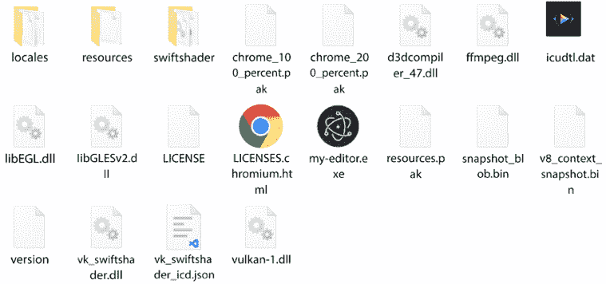

# 5

# 使用电子构建桌面 WYSIWYG 编辑器

Web 应用程序传统上是用 HTML、CSS 和 JavaScript 构建的。它们的使用也广泛扩展到使用**Node.js**的服务器开发。近年来，出现了各种工具和框架，它们使用 HTML、CSS 和 JavaScript 来创建桌面和移动应用程序。在本章中，我们将探讨如何使用 Angular 和**电子**创建桌面应用程序。

电子是一个 JavaScript 框架，用于使用 Web 技术构建原生桌面应用程序。结合 Angular 框架，我们可以创建快速且高性能的 Web 应用程序。在本章中，我们将构建一个桌面**WYSIWYG**编辑器，并涵盖以下主题：

+   为 Angular 添加 WYSIWYG 编辑器库

+   在工作区中集成电子

+   Angular 与电子之间的通信

+   打包桌面应用程序

# 必要的背景理论和上下文

电子框架是一个跨平台框架，用于构建 Windows、Linux 和 Mac 桌面应用程序。许多流行的应用程序，如 Visual Studio Code、Skype 和 Slack，都是使用电子框架制作的。电子框架建立在 Node.js 和 Chromium 之上。Web 开发者可以利用他们现有的 HTML、CSS 和 JavaScript 技能来创建桌面应用程序，而无需学习新的语言，如 C++或 C#。

电子应用程序与 PWA 应用程序有许多相似之处。考虑为以下场景构建电子应用程序，如高级文件系统操作或当你需要为你的应用程序提供更原生的外观和感觉时。另一个用例是当你为你的主要桌面产品构建补充工具并希望将它们一起发布时。

电子应用程序由两个进程组成：

+   **主进程**：这通过 Node.js API 与本地资源进行交互。

+   **渲染器**：负责管理应用程序的用户界面。

电子应用程序只能有一个主进程，该进程与一个或多个渲染进程进行通信。每个渲染进程与其他进程完全隔离运行。

电子框架提供了**ipcMain**和**ipcRenderer**接口，我们可以使用这些接口与这些进程进行交互。交互是通过**进程间通信（IPC）**完成的，这是一种通过基于 Promise 的 API 在公共通道上安全异步交换消息的机制。

# 项目概述

在此项目中，我们将构建一个桌面 WYSIWYG 编辑器，其内容保留在文件系统中。最初，我们将使用 **ngx-wig**，一个流行的 WYSIWYG Angular 库，将其构建为 Angular 应用程序。然后，我们将使用 Electron 将其转换为桌面应用程序，并学习如何在 Angular 和 Electron 之间同步内容。我们还将了解如何将编辑器的内容持久化到文件系统中。最后，我们将打包我们的应用程序为一个可执行的单一文件，该文件可以在桌面环境中运行。以下图表描述了项目的架构概述：


图 5.1 – 项目架构

构建时间：1 小时。

# 开始使用

完成此项目所需的软件工具如下：

+   **Angular CLI**：Angular 的命令行界面，您可以在 [`angular.io/cli`](https://angular.io/cli) 找到。

+   **Visual Studio Code**：一个代码编辑器，您可以从 [`code.visualstudio.com`](https://code.visualstudio.com) 下载。

+   **GitHub 材料**：本章的代码可以在 [`github.com/PacktPublishing/Angular-Projects-Third-Edition`](https://github.com/PacktPublishing/Angular-Projects-Third-Edition) 的 `Chapter05` 文件夹中找到。

# 为 Angular 添加 WYSIWYG 编辑器库

我们将通过创建一个作为 Angular 应用程序的 WYSIWYG 编辑器来启动我们的项目。使用 Angular CLI 从头开始创建一个新的 Angular 应用程序：

```js
ng new my-editor --defaults 
```

我们将以下选项传递给 `ng new` 命令：

+   `my-editor`: 定义应用程序的名称

+   `--defaults`: 定义 CSS 为应用程序的首选样式表格式，并禁用路由，因为我们的应用程序将仅由一个包含编辑器的组件组成

WYSIWYG 编辑器是一种富文本编辑器，例如 Microsoft Word。我们可以使用 Angular 框架从头开始创建一个，但这将非常耗时，我们只会重蹈覆辙。Angular 生态系统包含大量用于此目的的库。其中之一是 ngx-wig 库，它没有外部依赖，只有 Angular！让我们将库添加到我们的应用程序中，并学习如何使用它：

1.  使用 `npm` 客户端从 npm 包注册库安装 `ngx-wig`：

    ```js
    npm install ngx-wig 
    ```

1.  打开 `app.module.ts` 文件，并将 `NgxWigModule` 添加到 `@NgModule` 装饰器的 `imports` 数组中：

    ```js
    import { NgModule } from '@angular/core';
    import { BrowserModule } from '@angular/platform-browser';
    **import** **{** **NgxWigModule** **}** **from****'****ngx-wig'****;**
    import { AppComponent } from './app.component';
    @NgModule({
      declarations: [
        AppComponent
      ],
      imports: [
        BrowserModule,
        **NgxWigModule**
      ],
      providers: [],
      bootstrap: [AppComponent]
    })
    export class AppModule { } 
    ```

    `NgxWigModule` 是 ngx-wig 库的主要模块。

1.  创建一个新的 Angular 组件，该组件将托管我们的 WYSIWYG 编辑器：

    ```js
    ng generate component editor 
    ```

1.  打开新创建的组件的模板文件，`editor.component.html`，并用以下 HTML 片段替换其内容：

    ```js
    <ngx-wig placeholder="Enter your content"></ngx-wig> 
    ```

    `NgxWigModule` 提供了一组 Angular 服务和组件，我们可以在应用程序中使用。该模块的主要组件是 `<ngx-wig>` 组件，它显示实际的 WYSIWYG 编辑器。它公开了一组我们可以设置的输入属性，例如编辑器的占位符。

1.  打开`app.component.html`文件，并用`<app-editor>`组件替换其内容：

    ```js
    <app-editor></app-editor> 
    ```

1.  打开`styles.css`文件，该文件包含 Angular 应用程序的全局样式，并添加以下样式以使编辑器可停靠并占满整个页面：

    ```js
    html, body {
      margin: 0;
      width: 100%;
      height: 100%;
    }
    .ng-wig, .nw-editor-container, .nw-editor  {
      display: flex !important;
      flex-direction: column;
      height: 100% !important;
      overflow: hidden;
    } 
    ```

1.  打开 Angular 应用程序的主要 HTML 文件`index.html`，并从`<head>`元素中移除`<base>`标签。浏览器使用`<base>`标签通过相对 URL 引用脚本和 CSS 文件。保留它将使我们的桌面应用程序失败，因为它将直接从本地文件系统中加载所有必要的资源。我们将在*集成 Angular 与 Electron*部分了解更多。

让我们看看我们已经取得了哪些成果。运行`ng serve`并导航到`http://localhost:4200`以预览应用程序：


图 5.2 – 应用程序输出

我们的应用程序包括以下内容：

+   一个带有按钮的工具栏，允许我们应用不同的样式到编辑器的内容

+   一个用作编辑器主要容器的文本区域，用于添加内容

我们现在已经使用 Angular 创建了一个具有完全可操作的 WYSIWYG 编辑器的 Web 应用程序。在下一节中，我们将学习如何使用 Electron 将其转换为桌面应用程序。

# 在工作空间中集成 Electron

Electron 框架是一个我们可以使用以下命令安装的 npm 包：

```js
npm install -D electron 
```

之前的命令将在 Angular CLI 工作空间中安装最新版本的`electron` npm 包。它还将在我们的项目`package.json`文件的`devDependencies`部分添加相应的条目。

Electron 被添加到`package.json`文件的`devDependencies`部分，因为它是我们应用程序的开发依赖项。它仅用于将我们的应用程序作为桌面应用程序准备和构建，而不是在运行时使用。

Electron 应用程序在 Node.js 运行时上运行，并使用 Chromium 浏览器进行渲染。一个 Node.js 应用程序至少有一个 JavaScript 文件，通常称为`index.js`或`main.js`，它是应用程序的主要入口点。由于我们使用 Angular 和 TypeScript 作为我们的开发堆栈，我们将首先创建一个单独的 TypeScript 文件，最终将其编译成 JavaScript：

1.  在 Angular CLI 工作空间的`src`文件夹内创建一个名为`electron`的文件夹。`electron`文件夹将包含任何与 Electron 相关的源代码。

    我们可以将我们的应用程序视为两个不同的平台。Web 平台是 Angular 应用程序，位于`src\app`文件夹中。桌面平台是 Electron 应用程序，位于`src\electron`文件夹中。这种方法有许多优点，包括它强制我们在应用程序中分离关注点，并允许它们独立于彼此独立开发。从现在起，我们将它们称为 Angular 和 Electron 应用程序。

1.  在`electron`文件夹内创建一个`main.ts`文件，并包含以下内容：

    ```js
    import { app, BrowserWindow } from 'electron';
    function createWindow () {
      const mainWindow = new BrowserWindow({
        width: 800,
        height: 600
      });
      mainWindow.loadFile('index.html');
    }
    app.whenReady().then(() => {
      createWindow();
    }); 
    ```

    在前面的代码中，我们首先从`electron` npm 包中导入`BrowserWindow`和`app`模块。`BrowserWindow`类用于为我们的应用程序创建桌面窗口。我们通过构造函数传递一个`options`对象来定义窗口的尺寸，该对象设置了窗口的`width`和`height`值。然后我们调用`loadFile`方法，将作为参数传递我们想要在窗口内加载的 HTML 文件。

    我们在`loadFile`方法中传递的`index.html`文件是 Angular 应用程序的主 HTML 文件。它是使用**文件**协议加载的，这就是为什么我们在*为 Angular 添加 WYSIWYG 编辑器库*部分中移除了`<base>`标签。

    `app`对象是我们桌面应用程序的全局对象，就像网页上的`window`对象一样。它暴露了一个`whenReady` Promise，当它解析时，允许我们运行应用程序的任何初始化逻辑，包括创建窗口。

1.  在`electron`文件夹内创建一个`tsconfig.json`文件，并添加以下内容：

    ```js
    {
      "extends": "../../tsconfig.json",
      "compilerOptions": {
        "importHelpers": false
      },
      "include": [
        "**/*.ts"
      ]
    } 
    ```

    `main.ts`文件必须编译成 JavaScript，因为浏览器不理解 TypeScript。编译过程称为**转译**，需要一个 TypeScript 配置文件。配置文件包含驱动 TypeScript **转译器**的选项，转译器负责转译过程。

    上述 TypeScript 配置文件使用`include`属性定义了 Electron 源代码文件的路径，并将`importHelpers`属性设置为`false`。

    如果我们启用`importHelpers`标志，它将包括来自**tslib**库的帮助程序，从而导致包的大小更大。

1.  运行以下命令以安装**Webpack CLI**：

    ```js
    npm install -D webpack-cli 
    ```

    Webpack CLI 从命令行调用流行的模块打包器**webpack**。我们将使用 webpack 来构建和打包我们的 Electron 应用程序。

1.  使用以下命令安装`ts-loader` npm 包：

    ```js
    npm install -D ts-loader 
    ```

**ts-loader**库是一个 webpack 插件，可以加载 TypeScript 文件。

我们已经创建了将我们的 Angular 应用程序转换为桌面应用程序所需的全部组件，使用 Electron。我们只需要将它们组合起来以构建和运行我们的桌面应用程序。协调 Electron 应用程序的主要组件是我们需要在 Angular CLI 工作区的根目录中创建的 webpack 配置文件：

`webpack.config.js`

```js
const path = require('path');
const src = path.join(process.cwd(), 'src', 'electron');
module.exports = {
  mode: 'development',
  devtool: 'source-map',
  entry: path.join(src, 'main.ts'),
  output: {
    path: path.join(process.cwd(), 'dist', 'my-editor'),
    filename: 'shell.js'
  },
  module: {
    rules: [
      {
        test: /\.ts$/,
        loader: 'ts-loader',
        options: {
          configFile: path.join(src, 'tsconfig.json')
        }
      }
    ]
  },
  target: 'electron-main'
}; 
```

前面的文件使用以下选项配置了我们的应用程序中的 webpack：

+   `mode`：指示我们当前正在`开发`环境中运行。

+   `devtool`：启用源映射文件生成，用于调试目的。

+   `entry`：指示 Electron 应用程序的主入口点，即`main.ts`文件。

+   `输出`: 定义了从 webpack 生成的 Electron 包的路径和文件名。`path`属性指向 Angular CLI 创建 Angular 应用包所使用的相同文件夹。`filename`属性设置为`shell.js`，因为 webpack 默认生成的文件名为`main.js`，这将会与 Angular 应用生成的`main.js`文件冲突。

+   `module`: 指示 webpack 加载`ts-loader`插件来处理 TypeScript 文件。

+   `target`: 表示我们目前正在 Electron 的主进程中运行。

Webpack 模块打包器现在包含了构建和打包 Electron 应用所需的所有信息。另一方面，Angular CLI 负责构建 Angular 应用。让我们看看我们如何将它们结合起来并运行我们的桌面应用：

1.  运行以下命令来安装`concurrently`npm 包：

    ```js
    npm install -D concurrently 
    ```

    **concurrently**库使我们能够同时执行多个进程。在我们的案例中，它将允许我们并行运行 Angular 和 Electron 应用。

1.  打开`package.json`文件，并在`scripts`属性中添加一个新条目：

    ```js
    "scripts": {
      "ng": "ng",
      "start": "ng serve",
      "build": "ng build",
      "watch": "ng build --watch --configuration development",
      "test": "ng test",
      **"start:desktop"****:****"concurrently \"ng build --delete-output-path=false --watch\" \"webpack --watch\""**
    **}** 
    ```

    `start:desktop`脚本使用 Angular CLI 的`ng build`命令构建 Angular 应用，并使用`webpack`命令构建 Electron 应用。两个应用都使用`--watch`选项以监视模式运行，所以每次我们更改代码，应用都会重新构建以反映更改。

    当我们修改 Angular 应用时，Angular CLI 默认会删除`dist`文件夹。我们可以使用`--delete-output-path=false`选项来防止这种行为，因为 Electron 应用也是在同一个文件夹中构建的。

    我们没有将 webpack 配置文件传递给`webpack`命令，因为它默认假设文件名为`webpack.config.js`。

1.  点击 Visual Studio Code 侧边栏中存在的**运行**菜单：


图 5.3 – 运行菜单

1.  在出现的**运行和调试**面板中，从下拉菜单中选择**添加配置…**选项：


图 5.4 – 运行和调试面板

1.  Visual Studio Code 将打开一个下拉菜单，允许我们选择运行应用的环境。选择**{} Node.js: Electron Main**配置。

1.  在打开的`launch.json`文件中，将`program`属性的值设置为`${workspaceFolder}/dist/my-editor/shell.js`。`program`属性指向 Electron 包文件的绝对路径。

现在我们已经准备好运行我们的桌面应用并预览它。运行以下命令来构建应用：

```js
npm run start:desktop 
```

之前的命令将首先构建 Electron 应用，然后是 Angular 应用。等待 Angular 构建完成，从**运行和调试**面板的下拉菜单中选择**Electron Main**选项，然后点击*播放*按钮来预览应用：


图 5.5 – 应用程序窗口

在前面的屏幕截图中，我们可以看到我们的带有 WYSIWYG 编辑器的 Angular 应用程序托管在原生桌面窗口中。它包含以下我们在桌面应用程序中通常会发现的特点：

+   带有图标的标题

+   主菜单

+   最小化、最大化和关闭按钮

Angular 应用程序在 Chromium 浏览器内部渲染。为了验证这一点，点击 **视图** 菜单项并选择 **切换开发者工具** 选项。

干得好！你已经成功创建了自己的桌面 WYSIWYG 编辑器。在下一节中，我们将学习如何进行 Angular 和 Electron 之间的交互。

# Angular 和 Electron 之间的通信

根据项目的规格，WYSIWYG 编辑器的内容需要保存在本地文件系统中。此外，内容将在应用程序启动时从文件系统加载。

Angular 应用程序使用渲染进程处理 WYSIWYG 编辑器与数据之间的任何交互，而 Electron 应用程序使用主进程管理文件系统。因此，我们需要建立一个 IPC 机制，以便在两个 Electron 进程之间进行通信，如下所示：

+   配置 Angular CLI 工作区

+   与编辑器交互

+   与文件系统交互

让我们先设置 Angular CLI 项目以支持所需的通信机制。

## 配置 Angular CLI 工作区

我们需要修改几个文件来配置我们应用程序的工作区：

1.  打开位于 `src\electron` 文件夹中的 `main.ts` 文件，并在 `BrowserWindow` 构造函数中相应地设置 `webPreferences` 属性：

    ```js
    function createWindow () {
      const mainWindow = new BrowserWindow({
        width: 800,
        height: 600,
        **webPreferences****: {**
    **nodeIntegration****:** **true****,**
    **contextIsolation****:** **false**
     **}**
      });
      mainWindow.loadFile('index.html');
    } 
    ```

    之前的标志将在渲染进程中启用 Node.js 并公开 `ipcRenderer` 接口，这是我们与主进程通信所需的。

1.  运行以下命令来安装 `ngx-electronyzer` npm 包：

    ```js
    npm install ngx-electronyzer 
    ```

**ngx-electronyzer** 库允许我们将 Electron API 集成到 Angular 应用程序中。

Angular 和 Electron 应用程序现在已准备好通过 IPC 机制相互交互。让我们首先在 Angular 应用程序中实现必要的逻辑。

## 与编辑器交互

Angular 应用程序负责管理 WYSIWYG 编辑器。编辑器的内容通过 Electron 的渲染进程与文件系统保持同步。让我们了解如何使用渲染进程：

1.  使用以下 Angular CLI 命令创建一个新的 Angular 服务：

    ```js
    ng generate service editor 
    ```

1.  打开 `editor.service.ts` 文件，并从 `ngx-electronyzer` npm 包中注入 `ElectronService` 类：

    ```js
    import { Injectable } from '@angular/core';
    **import** **{** **ElectronService** **}** **from****'ngx-electronyzer'****;**
    @Injectable({
      providedIn: 'root'
    })
    export class EditorService {
      constructor(**private** **electronService: ElectronService**) { }
    } 
    ```

    `ElectronService` 类公开了部分 Electron API，包括我们目前感兴趣的 `ipcRenderer` 接口。

1.  创建一个方法，该方法将被调用来从文件系统获取编辑器的内容：

    ```js
    getContent(): Promise<string> {
      return this.electronService.ipcRenderer.invoke('getContent');
    } 
    ```

    我们使用 `ipcRenderer` 属性的 `invoke` 方法，将通信通道的名称作为参数传递。`getContent` 方法的返回值是一个 `Promise` 对象，其类型为 `string`，因为编辑器的内容是原始文本数据。`invoke` 方法通过 `getContent` 通道与主进程建立连接。在 *与文件系统交互* 部分，我们将看到如何设置主进程以响应该通道中的 `invoke` 方法调用。

1.  创建一个方法，当需要将编辑器的内容保存到文件系统时将被调用：

    ```js
    setContent(content: string) {
      this.electronService.ipcRenderer.invoke('setContent', content);
    } 
    ```

    `setContent` 方法再次调用 `ipcRenderer` 对象的 `invoke` 方法，但使用不同的通道名称。它还使用 `invoke` 方法的第二个参数将数据传递给主进程。在这种情况下，`content` 参数将包含编辑器的内容。我们将在 *与文件系统交互* 部分看到如何配置主进程以处理数据。

1.  打开 `editor.component.ts` 文件并创建一个 `myContent` 属性来保存编辑器数据。同时，在 `EditorComponent` 类的 `constructor` 中注入 `EditorService`，并添加来自 `@angular/core` npm 包的 `OnInit` 接口：

    ```js
    import { Component, **OnInit** } from '@angular/core';
    **import** **{** **EditorService** **}** **from****'../editor.service'****;**
    @Component({
      selector: 'app-editor',
      templateUrl: './editor.component.html',
      styleUrls: ['./editor.component.css']
    })
    export class EditorComponent **implements****OnInit** {
      **myContent =** **''****;**
    **constructor****(****private** **editorService: EditorService****) {}**
    } 
    ```

1.  创建一个方法，该方法调用 `editorService` 变量的 `getContent` 方法，并在 `ngOnInit` 方法内部执行它：

    ```js
    ngOnInit(): void {
      this.getContent();
    }
    private async getContent() {
      this.myContent = await this.editorService.getContent();
    } 
    ```

    我们使用 `async`/`await` 语法，它允许我们在基于 Promise 的方法调用中同步执行我们的代码。

1.  创建一个方法，该方法调用 `editorService` 变量的 `setContent` 方法：

    ```js
    saveContent(content: string) {
      this.editorService.setContent(content);
    } 
    ```

1.  让我们将我们创建的方法与组件的模板绑定起来。打开 `editor.component.html` 文件并添加以下绑定：

    ```js
    <ngx-wig placeholder="Enter your content" **[****ngModel****]=****"myContent"** **(****contentChange****)=****"saveContent($event)"**></ngx-wig> 
    ```

    我们使用 `ngModel` 指令将编辑器的模型绑定到 `myContent` 组件属性，该属性将用于最初显示内容。我们还使用 `contentChange` 事件绑定，以便在编辑器内容更改时（即用户输入时）保存编辑器的内容。

1.  `ngModel` 指令是 `@angular/forms` npm 包的一部分。将 `FormsModule` 导入到 `app.module.ts` 文件中以便使用：

    ```js
    import { NgModule } from '@angular/core';
    import { BrowserModule } from '@angular/platform-browser';
    **import** **{** **FormsModule** **}** **from****'@angular/forms'****;**
    import { NgxWigModule } from 'ngx-wig';
    import { AppComponent } from './app.component';
    import { EditorComponent } from './editor/editor.component';
    @NgModule({
      declarations: [
        AppComponent,
        EditorComponent
      ],
      imports: [
        BrowserModule,
        NgxWigModule,
        **FormsModule**
      ],
      providers: [],
      bootstrap: [AppComponent]
    })
    export class AppModule { } 
    ```

我们已经实现了 Angular 应用程序与主进程通信的所有逻辑。现在是时候实现通信机制的另一端，即 Electron 应用程序及其主进程了。

## 与文件系统交互

主进程通过内置在 Electron 框架中的 **fs** 库与文件系统进行交互。让我们看看如何使用它：

1.  打开位于 `src\electron` 文件夹中的 `main.ts` 文件并导入以下组件：

    ```js
    import { app, BrowserWindow, **ipcMain** } from 'electron';
    **import** ***** **as** **fs** **from****'fs'****;**
    **import** ***** **as** **path** **from****'path'****;** 
    ```

    `fs` 库负责与文件系统交互。`path` 库提供了用于处理文件和文件夹路径的实用工具。`ipcMain` 对象允许我们与 Electron 的主进程进行交互。

1.  创建一个变量来保存包含编辑器内容的文件路径：

    ```js
    const contentFile = path.join(app.getPath('userData'), 'content.html'); 
    ```

    保存编辑器内容的文件是位于预留的 `userData` 文件夹中的 `content.html` 文件。`userData` 文件夹是一个特殊用途的系统文件夹的别名，每个操作系统不同，用于存储特定于应用程序的文件，如配置。您可以在 [`www.electronjs.org/docs/api/app#appgetpathname`](https://www.electronjs.org/docs/api/app#appgetpathname) 找到有关 `userData` 文件夹和其他系统文件夹的更多详细信息。

    `app` 对象的 `getPath` 方法是跨平台的，用于获取特殊文件夹的路径，例如用户的家目录或应用程序数据。

1.  调用 `ipcMain` 对象的 `handle` 方法以在 `getContent` 通道中开始监听请求：

    ```js
    ipcMain.handle('getContent', () => {
      if (fs.existsSync(contentFile)) {
        const result = fs.readFileSync(contentFile);
        return result.toString();
      }
      return '';
    }); 
    ```

    当主进程接收到此通道的请求时，它使用 `fs` 库的 `existsSync` 方法检查包含编辑器内容的文件是否已存在。如果存在，它将使用 `readFileSync` 方法读取它，并将内容返回给渲染进程。

1.  再次调用 `handle` 方法，但这次是为 `setContent` 通道：

    ```js
    ipcMain.handle('setContent', ({}, content: string) => {
      fs.writeFileSync(contentFile, content);
    }); 
    writeFileSync method of the fs library to write the value of the content property in the file.
    ```

现在我们已经连接了 Angular 和 Electron 应用程序，是时候预览我们的 WYSIWYG 桌面应用程序了：

1.  执行 `start:desktop` npm 脚本，并按 *F5* 运行应用程序。

1.  使用编辑器和其工具栏输入一些内容，例如以下内容：


图 5.6 – 编辑器内容

1.  关闭应用程序窗口并重新运行应用程序。如果一切正常，您应该看到编辑器中输入的内容。

恭喜！您已经通过向其添加持久性功能来丰富了您的 WYSIWYG 编辑器。在下一节中，我们将采取创建桌面应用程序的最后一步，并学习如何打包和分发它。

# 打包桌面应用程序

网络应用程序通常被打包并部署到托管服务器。另一方面，桌面应用程序被打包并打包成一个可轻松分发的单个可执行文件。打包我们的 WYSIWYG 应用程序需要以下步骤：

+   配置生产模式下的 webpack

+   使用 Electron 打包器

我们将在下一节中更详细地介绍它们。

## 配置生产环境下的 webpack

我们已经为开发环境创建了一个 webpack 配置文件。我们现在需要为生产环境创建一个新的配置文件。这两个配置文件将共享一些功能，所以让我们先创建一个通用的配置文件：

1.  在 Angular CLI 工作区的根目录中创建一个 `webpack.dev.config.js` 文件，内容如下：

    ```js
    const path = require('path');
    const baseConfig = require('./webpack.config');
    module.exports = {
      ...baseConfig,
      mode: 'development',
      devtool: 'source-map',
      output: {
        path: path.join(process.cwd(), 'dist', 'my-editor'),
        filename: 'shell.js'
      }
    }; 
    ```

1.  从 `webpack.config.js` 文件中移除 `mode`、`devtool` 和 `output` 属性。

1.  打开 `package.json` 文件，并在 `start:desktop` 脚本中传递新的 webpack 开发配置文件：

    ```js
    "start:desktop": "concurrently \"ng build --delete-output-path=false --watch\" \"webpack **--config webpack.dev.config.js** --watch\"" 
    ```

1.  在 Angular CLI 工作区的根目录中创建一个 `webpack.prod.config.js` 文件，内容如下：

    ```js
    const path = require('path');
    const baseConfig = require('./webpack.config');
    module.exports = {
      ...baseConfig,
      output: {
        path: path.join(process.cwd(), 'dist', 'my-editor'),
        filename: 'main.js'
      }
    }; 
    ```

    与开发环境的 webpack 配置文件相比，主要区别在于我们将 `output` 包的 `filename` 改为了 `main.js`。Angular CLI 在生产环境中向 Angular 应用的 `main.js` 文件中添加一个哈希数字，因此不会发生冲突。

1.  在 `package.json` 文件的 `scripts` 属性中添加一个新的条目，以在生产模式下构建我们的应用程序：

    ```js
    "scripts": {
      "ng": "ng",
      "start": "ng serve",
      "build": "ng build",
      "watch": "ng build --watch --configuration development",
      "test": "ng test",
      "start:desktop": "concurrently \"ng build --delete-output-path=false --watch\" \"webpack --config webpack.dev.config.js --watch\"",
      **"build:electron"****:** **"ng build && webpack --config webpack.prod.config.js"**
    } 
    ```

    `build:electron` 脚本同时以生产模式构建 Angular 和 Electron 应用程序。

我们已经完成了打包桌面应用程序所需的所有配置。在下一节中，我们将学习如何将其转换为针对每个操作系统的单个包。

## 使用 Electron 打包器

Electron 框架拥有开源社区创建和维护的各种工具。其中之一是 **electron-packager** 库，我们可以使用它将我们的桌面应用程序打包成每个操作系统（Windows、Linux 和 macOS）的单个可执行文件。让我们看看如何将其集成到我们的开发工作流程中：

1.  运行以下命令将 `electron-packager` 作为我们的项目的开发依赖项安装：

    ```js
    npm install -D electron-packager 
    ```

1.  在 `package.json` 文件的 `scripts` 属性中添加一个新的条目以打包我们的应用程序：

    ```js
    "scripts": {
      "ng": "ng",
      "start": "ng serve",
      "build": "ng build",
      "watch": "ng build --watch --configuration development",
      "test": "ng test",
      "start:desktop": "concurrently \"ng build --delete-output-path=false --watch\" \"webpack --config webpack.dev.config.js --watch\"",
      "build:electron": "ng build && webpack --config webpack.prod.config.js",
      **"package"****:****"electron-packager dist/my-editor --out=dist --asar"**
    } 
    ```

    在前面的脚本中，`electron-packager` 将读取 `dist/my-editor` 文件夹中的所有文件，将它们打包，并将最终的包输出到 `dist` 文件夹。`--asar` 选项指示打包器将所有文件存档为 **ASAR** 格式，类似于 ZIP 或 TAR 文件。

1.  在 `src\electron` 文件夹中创建一个 `package.json` 文件，并添加以下内容：

    ```js
    {
      "name": "my-editor",
      "main": "main.js"
    } 
    ```

    `electron-packager` 库要求输出文件夹中存在一个 `package.json` 文件，该文件指向 Electron 应用程序的主入口文件。

1.  打开 `webpack.prod.config.js` 文件，并在 `plugins` 属性中添加 `CopyWebpackPlugin`：

    ```js
    const path = require('path');
    const baseConfig = require('./webpack.config');
    **const****CopyWebpackPlugin** **=** **require****(****'copy-webpack-plugin'****);**
    module.exports = {
      ...baseConfig,
      output: {
        path: path.join(process.cwd(), 'dist', 'my-editor'),
        filename: 'main.js'
      },
    **plugins****: [**
    **new****CopyWebpackPlugin****({**
    **patterns****: [**
     **{**
    **context****: path.****join****(process.****cwd****(),** **'src'****,**
    **'electron'****),**
    **from****:** **'****package.json'**
     **}**
     **]**
     **})**
     **]**
    }; 
    ```

    我们使用 `CopyWebpackPlugin` 在生产模式下构建应用程序时将 `package.json` 文件从 `src\electron` 文件夹复制到 `dist\my-editor` 文件夹。

1.  运行以下命令以在生产模式下构建应用程序：

    ```js
    npm run build:electron 
    ```

1.  现在运行以下 `npm` 命令来打包它：

    ```js
    npm run package 
    ```

    前面的命令将为当前运行的操作系统打包应用程序，这是 `electron-packager` 库的默认行为。您可以通过传递额外的选项来更改此行为，这些选项可以在库的 GitHub 仓库中找到，列在 *进一步阅读* 部分。

1.  导航到 Angular CLI 工作区的 `dist` 文件夹。您将找到一个名为 `my-editor-{OS}` 的文件夹，其中 `{OS}` 是您的当前操作系统及其架构。例如，在 Windows 上，它将是 `my-editor-win32-x64`。打开文件夹，您将得到以下文件：



图 5.7 – 应用程序包（Windows）

在前面的屏幕截图中，`my-editor.exe` 文件是我们桌面应用程序的可执行文件。我们的应用程序代码不包含在这个文件中，而是在 `resources` 文件夹中的 `app.asar` 文件中。我们的应用程序代码不包含在这个文件中，而是在 `resources` 文件夹中的 `app.asar` 文件中。

运行可执行文件，桌面应用程序应该可以正常打开。您可以整个文件夹上传到服务器，或者通过其他任何方式分发。现在，您的 WYSIWYG 编辑器可以触及更多用户，例如那些大部分时间都在离线状态的用户。太棒了！

# 摘要

在本章中，我们使用 Angular 和 Electron 构建了一个桌面 WYSIWYG 编辑器。最初，我们创建了一个 Angular 应用程序，并添加了 `ngx-wig`，一个流行的 Angular WYSIWYG 库。然后，我们学习了如何构建 Electron 应用程序，并实现了 Angular 和 Electron 应用程序之间的数据交换通信机制。最后，我们学习了如何打包我们的应用程序以进行打包，并准备好分发。

在下一章中，我们将学习如何使用 Angular 和 Ionic 构建一个移动照片地理标记应用程序。

# 实践问题

让我们看看几个实践问题：

1.  哪个类负责在 Electron 中创建桌面窗口？

1.  我们如何在 Electron 中的主进程和渲染进程之间进行通信？

1.  哪些标志可以启用在渲染进程中使用 Node.js？

1.  我们如何在 Angular 应用程序中加载 Electron？

1.  我们在 Angular 应用程序中与 Electron 交互时使用哪个接口？

1.  我们如何从 Angular 应用程序向主 Electron 进程传递数据？

1.  我们在 Electron 中使用哪个包进行文件系统操作？

1.  我们使用哪个库来打包 Electron 应用程序？

# 进一步阅读

这里有一些链接，可以帮助我们巩固本章所学的内容：

+   Electron: [`www.electronjs.org`](https://www.electronjs.org)

+   Electron 快速入门：[`www.electronjs.org/docs/tutorial/quick-start`](https://www.electronjs.org/docs/tutorial/quick-start)

+   `ngx-wig`: [`www.npmjs.com/package/ngx-wig`](https://www.npmjs.com/package/ngx-wig)

+   Webpack 配置：[`webpack.js.org/configuration`](https://webpack.js.org/configuration)

+   `ts-loader`: [`webpack.js.org/guides/typescript`](https://webpack.js.org/guides/typescript)

+   `ngx-electronyzer`: [`www.npmjs.com/package/ngx-electronyzer`](https://www.npmjs.com/package/ngx-electronyzer)

+   文件系统 API: [`nodejs.org/api/fs.html`](https://nodejs.org/api/fs.html)

+   `electron-packager`: [`www.npmjs.com/package/electron-packager`](https://www.npmjs.com/package/electron-packager)

+   `concurrently`: [`www.npmjs.com/package/concurrently`](https://www.npmjs.com/package/concurrently)
