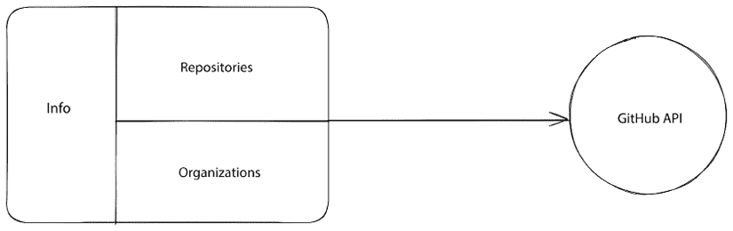

# 7

# 使用 Angular 为 GitHub 资料构建 SSR 应用程序

一个典型的 Angular 应用程序遵循**单页应用程序（SPA）**的方法，其中每个页面都在浏览器的 DOM 中创建，同时用户与应用程序进行交互。一个网络服务器托管应用程序，并在应用程序启动时仅提供主页面，通常称为`index.html`。

**服务器端渲染（SSR）**是一种与 SPA 完全不同的应用程序渲染方法。它在用户在运行时请求页面时使用服务器进行预渲染页面。在服务器上渲染内容极大地提高了 Web 应用程序的性能，并改善了其**搜索引擎优化（SEO）**能力。要在 Angular 应用程序中执行 SSR，我们使用一个名为**Angular Universal**的库。

在本章中，我们将学习如何通过构建使用**GitHub API**的资料应用程序来从 Angular Universal 中获益。我们将涵盖以下主题：

+   使用 GitHub API 构建 Angular 应用程序

+   集成 Angular Universal

+   在构建过程中预渲染内容

+   提升 SEO 能力

# 重要的背景理论和上下文

一个 Angular 应用程序由几个页面组成，这些页面在我们使用应用程序时由 Angular 框架在浏览器 DOM 中动态创建。Angular Universal 使 Angular 框架能够在应用程序运行时在服务器上静态地创建这些页面。换句话说，它可以创建一个完全静态的 Angular 应用程序版本，即使不需要启用 JavaScript 也可以运行。在服务器上预渲染应用程序有以下优点：

+   它允许网络爬虫索引应用程序，并在社交媒体网站上使其可发现和可链接。

+   这使得应用程序在移动和其他性能较低的设备上可用，这些设备无法在其侧执行 JavaScript。

+   它通过快速加载第一页并在后台同时加载实际客户端页面（**首次内容绘制（FCP）**）来提高用户体验。

GitHub API 是一个用于与 GitHub 数据交互的 HTTP REST API。它可以通过提供的开箱即用的认证机制公开或私下使用。

对 GitHub API 的无授权请求限制为每小时 60 次。有关可用认证方法的概述，您可以在[`docs.github.com/en/rest/overview/authenticating-to-the-rest-api`](https://docs.github.com/en/rest/overview/authenticating-to-the-rest-api)找到更多详细信息。

我们使用`@angular/common/http` npm 包中可用的内置 HTTP 客户端在 Angular 中进行 HTTP 通信。在 SSR 应用程序中与 HTTP 交互可能会导致由于在 FCP 时页面预渲染而导致的 HTTP 请求重复。然而，Angular Universal 可以通过称为**TransferState**的机制克服这种类型的重复。

# 项目概述

在这个项目中，我们将为我们的 GitHub 用户资料构建一个个人资料应用程序。我们最初将使用 Angular CLI 来搭建一个与 GitHub API 交互的 Angular 应用程序。我们将学习如何使用 GitHub API 并获取特定用户的数据。我们还将使用**Bootstrap CSS**库来美化我们的应用程序并创建一个美观的用户界面。

在创建我们的 Angular 应用程序后，我们将使用 Angular Universal 将其转换为服务器端渲染的应用程序。我们将了解如何安装和配置 Angular Universal，并学习如何在构建时进行预渲染。

然后，我们将配置我们的应用程序以在最受欢迎的社会平台上正确地使用 SEO 进行渲染。以下图表展示了项目的架构概述：



图 7.1 – 项目架构

构建时间：2 小时

# 入门

完成此项目所需的先决条件和软件工具如下：

+   **GitHub 账户**：一个有效的 GitHub 用户账户。

+   **Angular CLI**：Angular 的 CLI，您可以在[`angular.io/cli`](https://angular.io/cli)找到。

+   **GitHub 材料**：本章的相关代码可以在[`github.com/PacktPublishing/Angular-Projects-Third-Edition`](https://github.com/PacktPublishing/Angular-Projects-Third-Edition)的`Chapter07`文件夹中找到。

# 使用 GitHub API 构建 Angular 应用程序

GitHub 包含一个 API，我们可以使用它来获取有关 GitHub 用户资料的各项信息。我们正在构建的 Angular 应用程序将与 GitHub API 通信并显示我们 GitHub 资料的简要个人资料。我们的应用程序将包含以下功能：

+   **仪表板**：这将是应用程序的着陆页，它将显示我们的 GitHub 资料的摘要。

+   **信息**：这将显示关于我们的个人信息。

+   **仓库**：这将显示我们的**公共**仓库列表。

+   **组织**：这将显示我们作为成员的 GitHub 组织列表。

本章截图显示的每个功能的结果输出将根据您的 GitHub 资料而有所不同。

仪表板将是应用程序的主页，它将包含所有其他功能。我们将在下一节学习如何构建仪表板页面。

## 构建仪表板

在我们开始创建应用程序的主要功能之前，我们需要通过运行以下命令来搭建和配置一个 Angular 应用程序：

```js
ng new gh-portfolio --routing=false --style=scss 
```

以下命令将使用 Angular CLI 的`ng new`命令，传递以下选项：

+   `gh-portfolio`：我们想要创建的 Angular 应用程序的名称

+   `--routing=false`：禁用路由，因为我们的应用程序将只包含一个页面

+   `--style=scss`：配置 Angular 应用程序在处理 CSS 样式时使用 SCSS 样式表格式

我们将使用 Bootstrap CSS 库来为我们的投资组合应用程序进行样式设计。让我们看看如何在刚刚创建的 Angular CLI 应用程序中安装和配置它：

1.  执行以下`npm`命令安装 Bootstrap CSS 库：

    ```js
    npm install bootstrap 
    ```

1.  打开`src\styles.scss`文件并导入 Bootstrap SCSS 样式表：

    ```js
    @import "bootstrap/scss/bootstrap"; 
    ```

    `styles.scss`文件包含应用于应用程序的全局 CSS 样式。`@import` CSS 规则接受我们想要加载的样式表的绝对路径。

    当我们使用`@import`规则导入样式表格式时，我们省略了文件的扩展名。

1.  执行以下命令安装**Bootstrap Icons**，这是一个免费的开源图标库：

    ```js
    npm install bootstrap-icons 
    ```

    Bootstrap Icons 可以使用多种格式，如 SVG 或字体。在这个项目中，我们将使用后者。

1.  将 Bootstrap Icons 库的字体图标格式导入到`styles.scss`文件中：

    ```js
    @import "bootstrap/scss/bootstrap";
    **@import****"bootstrap-icons/font/bootstrap-icons"****;** 
    ```

我们已经创建了 Angular 应用程序并添加了必要的样式元素。现在我们准备开始创建 Angular 应用程序的主页：

1.  从官方 Angular 文档的[`angular.io/presskit`](https://angular.io/presskit)的**媒体包**中下载您选择的 Angular 标志。

1.  将下载的标志文件复制到 Angular CLI 工作区的`src\assets`文件夹中。`assets`文件夹用于静态文件，如图像、字体和 JSON 文件。

1.  打开`app.component.ts`文件，并在`AppComponent`类中创建一个`username`属性，该属性以 GitHub 登录名作为值：

    ```js
    export class AppComponent {
      title = 'gh-portfolio';
      **username =** **'<Your GitHub login>'****;**
    } 
    ```

1.  打开`app.component.html`文件，并用以下 HTML 模板替换其内容：

    ```js
    <div class="toolbar d-flex align-items-center">
      
      <span>Welcome to my GitHub portfolio</span>
      <a class="ms-auto p-2" target="_blank" rel="noopener" href="https://github.com/{{username}}" title="GitHub">
        <i class="bi-github"></i>
      </a>
    </div> 
    ```

    在前面的模板中，我们定义了我们的应用程序的标题。它包含一个锚点元素，链接到我们的 GitHub 个人资料。我们还使用了 Bootstrap Icons 集中的`bi-github`类添加了 GitHub 图标。

1.  在应用程序的标题之后插入以下 HTML 片段：

    ```js
    <div class="content d-flex flex-column">
      <div class="row">
        <div class="col-sm-3"></div>
        <div class="col-sm-9">
          <div class="row">
            <div class="col-12 col-sm-12"></div>
          </div>
          <div class="row">
            <div class="col-12 col-sm-12"></div>
          </div>
        </div>
      </div>
    </div> 
    col-sm-3 class selector will display the *personal information* feature. The element with the col-sm-9 class selector will be split into two rows, one for the *repositories* and another for the *organizations* features.
    ```

1.  打开`app.component.scss`文件，并为应用程序的标题和内容添加以下 CSS 样式：

    ```js
    .toolbar {
      height: 60px;
      background-color: #1976d2;
      color: white;
      font-weight: 600;
    }
    .toolbar img {
      margin: 0 16px;
    }
    .toolbar i {
      font-size: 1.5rem;
      color: white;
      margin: 0 16px;
    }
    .toolbar a {
      margin-bottom: 5px;
    }
    .toolbar i:hover {
      opacity: 0.8;
    }
    .content {
      margin: 52px auto 32px;
      padding: 0 16px;
    } 
    ```

1.  运行`ng serve`以启动应用程序并导航到`http://localhost:4200`。应用程序的标题应如下所示：


图 7.2 – 应用程序标题

我们的投资组合应用程序的主页现在准备好了。它包含一个标题和一个用于添加主要功能的空容器元素。在下一节中，我们将开始构建应用程序的*个人信息*功能。

## 显示个人信息

我们应用程序的第一个功能将是显示来自 GitHub 个人资料的个人信息，例如全名、个人照片和一些社交媒体链接。在创建功能之前，我们首先需要配置我们的应用程序，使其能够与 GitHub API 通信：

1.  打开应用程序的主模块，即`app.module.ts`文件，并将`HttpClientModule`类添加到`@NgModule`装饰器的`imports`数组中：

    ```js
    import { NgModule } from '@angular/core';
    import { BrowserModule } from '@angular/platform-browser';
    **import** **{** **HttpClientModule** **}** **from****'@angular/common/http'****;**
    import { AppComponent } from './app.component';
    @NgModule({
      declarations: [
        AppComponent
      ],
      imports: [
        BrowserModule,
        **HttpClientModule**
      ],
      providers: [],
      bootstrap: [AppComponent]
    })
    export class AppModule { } 
    ```

    `HttpClientModule`类是内置 HTTP 库的主要 Angular 模块，它导出了与 HTTP 资源交互所需的所有必要服务。

1.  使用以下 Angular CLI 命令创建一个新的 Angular 服务：

    ```js
    ng generate service github 
    ```

1.  打开`github.service.ts`文件，将`HttpClient`服务注入到`GithubService`类的`constructor`中：

    ```js
    **import** **{** **HttpClient** **}** **from****'@angular/common/http'****;**
    import { Injectable } from '@angular/core';
    @Injectable({
      providedIn: 'root'
    })
    export class GithubService {
      constructor(**private** **http: HttpClient**) { }
    } 
    ```

    `HttpClient`类是 Angular 内置 HTTP 客户端的服务，它提供了与 HTTP 交互的所有主要方法，例如**GET**、**POST**和**PUT**。

1.  在`GithubService`类中添加以下属性：

    ```js
    readonly username = '<Your GitHub login>';
    private apiUrl = 'https://api.github.com'; 
    ```

    确保将`username`属性的值设置为您的 GitHub 登录名。

1.  修改`app.component.ts`文件，使其使用`GithubService`中的`username`属性：

    ```js
    import { Component, **OnInit** } from '@angular/core';
    **import** **{** **GithubService** **}** **from****'./github.service'****;**
    @Component({
      selector: 'app-root',
      templateUrl: './app.component.html',
      styleUrls: ['./app.component.scss']
    })
    export class AppComponent **implements****OnInit** {
      title = 'gh-portfolio';
      **username =** **''****;**
      **constructor****(****private** **githubService: GithubService****) {}**
    **ngOnInit****():** **void** **{**
    **this****.****username** **=** **this****.****githubService****.****username****;**
     **}**
    } 
    ```

我们的应用程序与 GitHub API 之间的所有交互都将委托给`GithubService`。现在，让我们专注于构建我们的功能：

1.  执行以下 Angular CLI 命令来创建我们功能的新 Angular 组件：

    ```js
    ng generate component personal-info 
    ```

1.  使用以下 Angular CLI 命令创建一个`user`接口，以定义组件的数据模型：

    ```js
    ng generate interface user 
    ```

1.  打开`user.ts`文件，并将以下属性添加到`User`接口中：

    ```js
    export interface User {
    **avatar_url****:** **string****;**
    **name****:** **string****;**
    **blog****:** **string****;**
    **location****:** **string****;**
    **bio****:** **string****;**
    **twitter_username****:** **string****;**
    **followers****:** **number****;**
    } 
    ```

1.  打开`github.service.ts`文件，并添加以下`import`语句：

    ```js
    import { Observable } from 'rxjs';
    import { User } from './user'; 
    ```

1.  创建一个新方法，从 GitHub API 获取我们个人资料详情：

    ```js
    getUser(): Observable<User> {
      return this.http.get<User>(`${this.apiUrl}/users/${this.username}`);
    } 
    ```

1.  打开`personal-info.component.ts`文件，并相应地修改`import`语句：

    ```js
    import { Component, **OnInit** } from '@angular/core';
    **import** **{** **Observable** **}** **from****'rxjs'****;**
    **import** **{** **GithubService** **}** **from****'../github.service'****;**
    **import** **{** **User** **}** **from****'../user'****;** 
    ```

1.  将`GithubService`注入到`PersonalInfoComponent`类的`constructor`中，并创建一个组件属性以获取`getUser`方法的结果：

    ```js
    export class PersonalInfoComponent implements OnInit {
      user$: Observable<User> | undefined;
      constructor(private githubService: GithubService) {}
      ngOnInit(): void {
        this.user$ = this.githubService.getUser();
      }
    } 
    ```

1.  打开`personal-info.component.html`文件，将其内容替换为以下 HTML 模板：

    ```js
    <div class="card" *ngIf="user$ | async as user">
      
      <div class="card-body">
        <h5 class="card-title">{{user.name}}</h5>
        <p class="card-text">{{user.bio}}</p>
      </div>
      <ul class="list-group list-group-flush">
        <li class="list-group-item" title="Location">
          <i class="bi-geo me-2"></i>{{user.location}}
        </li>
        <li class="list-group-item" title="Followers">
          <i class="bi-people me-2"></i>{{user.followers}}
        </li>
      </ul>
      <div class="card-body">
        <a href="https://www.twitter.com/{{user.twitter_username}}" class="card-link">Twitter</a>
        <a [href]="user.blog" class="card-link">Personal blog</a>
      </div>
    </div> 
    ```

    在前面的模板中，我们使用`async`管道，因为`user$`属性是一个可观察对象，我们需要订阅它以获取其值。`async`管道的主要优点是当组件被销毁时，它会自动取消订阅可观察对象，从而避免潜在的内存泄漏。

    我们还创建了`user`别名，以便在组件模板的各个位置轻松引用它。

1.  打开`app.component.html`文件，并将`<app-personal-info>`组件添加到具有`col-sm-3`类选择器的元素中：

    ```js
    <div class="col-sm-3">
    **<****app-personal-info****></****app-personal-info****>**
    </div> 
    ```

如果我们运行`ng serve`来预览应用程序，我们应该在页面左侧看到个人信息面板：


图 7.3 – 个人信息

我们的投资组合应用程序的第一个功能现在已完成。它显示了我们 GitHub 个人资料的个人信息、简短的个人简介和一些社交网络链接。在下一节中，我们将构建应用程序的*仓库*功能。

## 列出用户仓库

GitHub 用户资料包含用户拥有的仓库列表，称为 **sources**，以及另一个贡献的仓库列表，称为 **forks**。

我们应用程序的仓库功能将仅显示源仓库。

*repositories* 和 *organizations* 功能将具有类似的用户界面。因此，我们需要为这两个功能创建一个组件：

1.  执行以下 Angular CLI 命令来创建一个新的组件：

    ```js
    ng generate component panel 
    ```

1.  打开 `panel.component.ts` 文件，并使用 `@Input` 装饰器定义两个输入属性：

    ```js
    import { Component, **Input** } from '@angular/core';
    @Component({
      selector: 'app-panel',
      templateUrl: './panel.component.html',
      styleUrls: ['./panel.component.scss']
    })
    export class PanelComponent {
      **@Input****() caption =** **''****;**
    **@Input****() icon =** **''****;**
    } 
    ```

1.  打开 `panel.component.html` 文件，并用以下 HTML 模板替换其内容：

    ```js
    <div class="card mb-4">
      <div class="card-header">
        <i class="bi bi-{{icon}} me-1"></i>
        {{caption}}
      </div>
      <div class="card-body">
        <ng-content></ng-content>
      </div>
    </div> 
    ```

    面板组件是一个 Bootstrap 卡片元素，由标题和主体组成。标题使用 `caption` 和 `icon` 输入属性来显示带图标的文本。主体使用 `<ng-content>` Angular 组件来定义一个占位符，其中将显示我们的功能内容。

我们现在可以使用面板组件来创建我们的功能：

1.  创建一个接口来表示 GitHub 仓库的数据模型：

    ```js
    ng generate interface repository 
    ```

1.  打开 `repository.ts` 文件，并在 `Repository` 接口中添加以下属性：

    ```js
    export interface Repository {
      **name****:** **string****;**
    **html_url****:** **string****;**
    **description****:** **string****;**
    **fork****:** **boolean****;**
    **stargazers_count****:** **number****;**
    **language****:** **string****;**
    **forks_count****:** **number****;**
    } 
    ```

1.  打开 `github.service.ts` 文件，并导入 `Repository` 接口：

    ```js
    import { Repository } from './repository'; 
    ```

1.  现在，是我们对服务进行重构的时候了。我们将用于获取仓库的 URL 与 `getUser` 方法的 URL 类似。将那个方法的 URL 提取为 `GithubService` 类的一个属性：

    ```js
    export class GithubService {
      readonly username = '<Your GitHub login>';
      **private** **userUrl =** **'https://api.github.com/users/'** **+** **this****.****username****;**
      constructor(private http: HttpClient) { }
      getUser(): Observable<User> {
        return this.http.get<User>(**this****.****userUrl**);
      }
    } 
    ```

1.  创建一个新的方法来获取当前 GitHub 用户的仓库：

    ```js
    getRepos(): Observable<Repository[]> {
      return this.http.get<Repository[]>(this.userUrl + '/repos');
    } 
    ```

现在我们已经为从 GitHub API 获取用户仓库创建了先决条件，我们可以开始构建将显示这些仓库的组件：

1.  执行以下命令使用 Angular CLI 创建一个新的 Angular 组件：

    ```js
    ng generate component repositories 
    ```

1.  打开 `repositories.component.ts` 文件，并相应地修改 `import` 语句：

    ```js
    import { Component, **OnInit** } from '@angular/core';
    **import** **{** **Observable** **}** **from****'rxjs'****;**
    **import** **{ map }** **from****'rxjs/operators'****;**
    **import** **{** **GithubService** **}** **from****'../github.service'****;**
    **import** **{** **Repository** **}** **from****'../repository'****;** 
    ```

1.  在 `RepositoriesComponent` 类的 `constructor` 中注入 `GithubService`，并创建一个组件属性以获取 `getRepos` 方法的结果：

    ```js
    export class RepositoriesComponent implements OnInit {
      repos$: Observable<Repository[]> | undefined;
      constructor(private githubService: GithubService) { }
      ngOnInit(): void {
        this.repos$ = this.githubService.getRepos().pipe(
          map(repos => repos.filter(repo => !repo.fork))
        );
      }
    } 
    ```

    在前面的类中，我们使用 RxJS 的 `pipe` 操作符将 `getRepos` 方法返回的可观察对象与 `map` 操作符结合，以过滤掉 `fork` 仓库并仅获取源。过滤是通过使用数组的标准 `filter` 方法完成的。

1.  打开 `repositories.component.html` 文件，并用以下 HTML 模板替换其内容：

    ```js
    <app-panel caption="Repositories" icon="archive">
      <div class="row row-cols-1 row-cols-md-3 g-4">
        <div class="col p-2" *ngFor="let repo of repos$ | async">
          <div class="card h-100">
            <div class="card-body">
              <h5 class="card-title">
                <a [href]="repo.html_url">{{repo.name}}</a>
              </h5>
              <p class="card-text">{{repo.description}}</p>
            </div>
          </div>
        </div>
      </div>
    </app-panel> 
    ```

    在前面的模板中，我们将组件的主要内容包裹在 `<app-panel>` 组件内部，并为标题设置了 `caption` 和 `icon` 属性。

    我们的组件遍历 `repos$` 可观察对象，并显示每个仓库的 `name` 和 `description`。名称是一个锚点元素，指向仓库的实际 GitHub URL。

1.  在具有 `card-body` 类选择器的元素之后立即添加以下列表：

    ```js
    <ul class="list-group list-group-flush list-group-horizontal">
      <li class="list-group-item border-0">
        <i class="bi-code me-2"></i>
        {{repo.language}}
      </li>
      <li class="list-group-item border-0">
        <i class="bi-star me-2"></i>
        {{repo.stargazers_count}}
      </li>
      <li class="list-group-item border-0">
        <i class="bi-diagram-2 me-2"></i>
        {{repo.forks_count}}
      </li>
    </ul> 
    language of each repository, how many have starred it, and how many have forked it.
    ```

1.  打开`app.component.html`文件，并在第一个 HTML 元素中使用`col-12 col-sm-12`类选择器添加`<app-repositories>`组件：

    ```js
    <div class="col-sm-9">
      <div class="row">
        <div class="col-12 col-sm-12">
          **<****app-repositories****></****app-repositories****>**
        </div>
      </div>
      <div class="row">
        <div class="col-12 col-sm-12"></div>
      </div>
    </div> 
    ```

1.  运行`ng serve`来预览应用程序，你应该能在*个人信息*功能旁边看到新的面板：


图 7.4 – 仓库

我们应用程序的第二个功能已经完成。它显示了我们 GitHub 个人资料中存在的公共仓库列表。我们的应用程序现在还提供了一个面板组件，我们可以在下一节中使用它来构建应用程序的组织功能。

## 可视化组织成员资格

一个 GitHub 用户可以是 GitHub 组织的成员。我们的应用程序将显示用户组织列表以及每个组织的附加信息。

让我们开始构建我们的组织列表：

1.  创建一个接口来定义组织的属性：

    ```js
    ng generate interface organization 
    ```

1.  打开`organization.ts`文件，并在`Organization`接口中添加以下属性：

    ```js
    export interface Organization {
      **login****:** **string****;**
    **description****:** **string****;**
    **avatar_url****:** **string****;**
    } 
    ```

1.  打开`github.service.ts`文件并导入`Organization`接口：

    ```js
    import { Organization } from './organization'; 
    ```

1.  创建一个新的方法来获取当前 GitHub 用户的组织：

    ```js
    getOrganizations(): Observable<Organization[]> {
      return this.http.get<Organization[]>(this.userUrl + '/orgs');
    } 
    ```

1.  执行以下命令来创建我们的功能对应的 Angular 组件：

    ```js
    ng generate component organizations 
    ```

1.  打开`organizations.component.ts`文件并相应地修改`import`语句：

    ```js
    import { Component, **OnInit** } from '@angular/core';
    **import** **{** **Observable** **}** **from****'rxjs'****;**
    **import** **{** **GithubService** **}** **from****'../github.service'****;**
    **import** **{** **Organization** **}** **from****'../organization'****;** 
    ```

1.  在`OrganizationsComponent`类的`constructor`中注入`GithubService`，并将其`getOrganizations`方法的结果设置为可观察的组件属性：

    ```js
    export class OrganizationsComponent implements OnInit {
      orgs$: Observable<Organization[]> | undefined;
      constructor(private githubService: GithubService) { }
      ngOnInit(): void {
        this.orgs$ =
         this.githubService.getOrganizations();
      }
    } 
    ```

1.  打开`organizations.component.html`文件，并用以下 HTML 模板替换其内容：

    ```js
    <app-panel caption="Organizations" icon="diagram-3">
      <div class="list-group">
        <a href="https://www.github.com/{{org.login}}" class="list-group-item list-group-item-action" *ngFor="let org of orgs$ | async">
          <div class="row">
            
            <div class="col-sm-9">
              <div class="d-flex w-100 justify-content-between">
                <h5 class="mb-1">{{org.login}}</h5>
              </div>
              <p class="mb-1">{{org.description}}</p>
            </div>
          </div>
        </a>
      </div>
    </app-panel> 
    ```

    在前面的 HTML 模板中，我们将组件的主要内容放在`<app-panel>`组件内部，传递适当的`caption`和`icon`。我们显示每个组织的`login`和`description`。每个组织都被一个指向组织 GitHub 页面的锚元素包裹。

1.  打开`organizations.component.scss`文件，为组织徽标添加以下 CSS 样式：

    ```js
    img {
      width: 60px;
      height: 40px;
    } 
    ```

1.  打开`app.component.html`文件，并在第二个元素中使用`col-12 col-sm-12`类选择器添加`<app-organizations>`组件：

    ```js
    <div class="col-sm-9">
      <div class="row">
        <div class="col-12 col-sm-12">
          <app-repositories></app-repositories>
        </div>
      </div>
      <div class="row">
        <div class="col-12 col-sm-12">
          **<****app-organizations****></****app-organizations****>**
        </div>
      </div>
    </div> 
    ```

1.  运行`ng serve`以启动应用程序，你应该能在*仓库*功能下看到组织列表：


图 7.5 – 组织

我们的应用程序现在为 GitHub 用户的个人资料提供了一个完整的组合。它显示以下内容：

+   个人信息、简短的个人简介和社交媒体链接

+   包含链接到每个仓库以获取更多信息的公共用户仓库列表

+   用户是成员的组织列表，每个组织都有链接以获取更多详细信息

在下一节中，我们将学习如何集成 Angular Universal 并在服务器上渲染我们的应用程序。

# 集成 Angular Universal

Angular Universal 是一个 Angular 库，它使 Angular CLI 应用程序能够在服务器上渲染。SSR 应用程序可以提高 Angular 应用程序的加载速度并改善第一页的加载。

要在现有的 Angular CLI 应用程序中安装 Angular Universal，我们将使用以下 Angular CLI 命令：

```js
ng add @nguniversal/express-engine 
```

之前的命令使用了 Angular CLI 的`ng add`命令来安装`@nguniversal/express-engine` npm 包。`@nguniversal/express-engine`包是 Angular Universal 库的核心，其核心是一个**Node.js Express**网络服务器。

当我们执行前面的命令来安装 Angular Universal 时，我们不仅安装了库，还修改了我们的 Angular CLI 工作区中的以下文件：

+   `angular.json`: 这在`architect`部分创建新的条目以构建和启用我们的 Angular Universal 应用程序。其中之一是`server`属性，它负责使用 SSR 构建我们的应用程序。它将生成的包输出到 Angular CLI 应用程序标准输出文件夹内的一个单独的`server`文件夹中：

    ```js
    "server": {
      "builder": "@angular-devkit/build-angular:server",
      "options": {
        "outputPath": "dist/gh-portfolio/server",
        "main": "server.ts",
        "tsConfig": "tsconfig.server.json",
        "inlineStyleLanguage": "scss"
      },
      "configurations": {
        "production": {
          "outputHashing": "media"
        },
        "development": {
          "buildOptimizer": false,
          "optimization": false,
          "sourceMap": true,
          "extractLicenses": false,
          "vendorChunk": true
        }
      },
      "defaultConfiguration": "production"
    } 
    ```

    原始应用程序包现在已生成到 Angular CLI 应用程序标准输出文件夹内的`browser`文件夹中，如`build`部分的`outputPath`属性所述。

    因此，Angular Universal 应用程序生成相同 Angular 应用程序的两个版本，一个用于服务器，另一个用于浏览器。

+   `package.json`: 这将添加所有必要的 npm 依赖项，并创建一组 npm `scripts`以使用 Angular Universal 开始构建：

    ```js
    "scripts": {
      "ng": "ng",
      "start": "ng serve",
      "build": "ng build",
      "watch": "ng build --watch --configuration development",
      "test": "ng test",
    **"dev:ssr"****:****"ng run gh-portfolio:serve-ssr"****,**
    **"serve:ssr"****:****"node dist/gh-portfolio/server/main.js"****,**
    **"build:ssr"****:****"ng build && ng run gh-portfolio:server"****,**
    **"prerender"****:****"ng run gh-portfolio:prerender"**
    } 
    ```

    包含`:ssr`后缀的脚本与构建和提供 Angular Universal 应用程序相关。`prerender`脚本将在构建时创建 Angular 应用程序的预渲染版本。我们将在*构建期间预渲染内容*部分了解`prerender`脚本。

+   `server.ts`: 这包含将托管我们的个人项目应用程序服务器端渲染版本的 Node.js Express 应用程序。

+   `main.server.ts`: 这是我们的 Angular Universal 应用程序的主要入口点。

+   `app.server.module.ts`: 这是服务器端渲染应用程序的主要应用程序模块。

+   `tsconfig.server.json`: 这是我们的 Angular Universal 应用程序的 TypeScript 配置。

在服务器上渲染 Angular 应用程序时，全局 JavaScript 对象如`window`和`document`不可用，因为没有浏览器。Angular 为一些对象提供了抽象 API，例如`DOCUMENT`注入令牌。如果您需要有条件地启用它们，可以注入`PLATFORM_ID`令牌，并使用`@angular/common` npm 包中的`isPlatformServer`或`isPlatformBrowser`方法来检查您的应用程序当前正在哪个平台上运行：

```js
import { Inject, PLATFORM_ID } from '@angular/core';
import { isPlatformBrowser } from '@angular/common';
export class CheckPlatformComponent {
  isBrowser: boolean;

  constructor( @Inject(PLATFORM_ID) platformId: any) {
    this.isBrowser = isPlatformBrowser(platformId);
  }
} 
```

我们现在可以使用以下`npm`命令在服务器上运行我们的 GitHub 个人项目应用程序：

```js
npm run dev:ssr 
```

要在服务器上预览您的 GitHub 个人项目应用程序，请在浏览器中打开`http://localhost:4200`。

你通常会看到应用程序在之前的版本。那么，我们在这里得到了什么？Angular Universal 应用程序在运行在具有强大处理器和大量内存的开发机器上时，并没有完全发挥其潜力。相反，我们需要在现实世界的情况中运行和预览它们，比如在慢速网络中。我们可以使用 Google Chrome 开发者工具在开发环境中模拟慢速网络：

1.  打开 Google Chrome 浏览器。

1.  切换到开发者工具并选择**网络**选项卡。

1.  从**限制**下拉菜单中选择**慢速 3G**选项。

1.  在浏览器地址栏中输入`http://localhost:4200`。

服务器首先加载一个静态版本的应用程序以向用户显示，直到实际的 Angular 应用程序在后台加载完成。当在后台完全加载后，Angular Universal 将切换到完整的应用程序。

在下一节中，我们将探讨如何使用预渲染技术进一步提高我们应用程序的加载速度。

# 构建过程中的预渲染内容

我们 Angular CLI 工作区的`package.json`文件包含一个`prerender` npm 脚本，我们可以使用它来改善我们应用程序的首次加载。该脚本从`angular.json`配置文件的`architect`部分运行`prerender`命令，并在构建时间预渲染我们应用程序的内容。让我们看看预渲染将对我们的 GitHub 个人项目应用程序产生什么影响：

1.  执行以下`npm`命令以生成应用程序的预渲染版本：

    ```js
    npm run prerender 
    ```

    上述命令将应用程序的生产版本输出到`dist\gh-portfolio\browser`文件夹。

1.  导航到`dist\gh-portfolio\browser`文件夹，你应该会看到两个 HTML 文件，即`index.html`和`index.original.html`文件。

1.  打开`index.original.html`文件，找到`<app-root>` HTML 元素。这是我们的 Angular 应用程序的主要组件，Angular 将在浏览器中渲染我们应用程序的内容。

1.  现在打开`index.html`文件，再次查看`<app-root>`元素。

    这次主要组件不为空。Angular Universal 在运行时对 GitHub API 进行了所有 HTTP 请求，并预取了应用程序的内容。所有组件模板和样式都已在主 HTML 文件中预渲染，这意味着我们可以在浏览器中查看我们的应用程序，即使没有启用 JavaScript！

1.  执行以下命令以启动我们 GitHub 个人项目应用程序的预渲染版本：

    ```js
    npm run serve:ssr 
    ```

    上述命令将启动一个 Node.js Express 服务器，该服务器托管我们的应用程序在`http://localhost:4000`。

1.  在浏览器设置中禁用 JavaScript，并导航到`http://localhost:4000`。

我们的 GitHub 个人项目应用程序即使在没有启用 JavaScript 的情况下也能完全正常运行。应用程序的主页也会立即渲染，无需用户等待应用程序加载。

之前的场景非常适合那些无法在设备上启用 JavaScript 的用户。但是，当启用 JavaScript 的用户使用相同的预先渲染版本的应用程序时会发生什么？让我们了解更多关于这一点：

1.  在您的浏览器中启用 JavaScript 并切换开发者工具。

1.  导航到`http://localhost:4000`。乍一看，似乎没有什么不同。然而，由于预先渲染的内容，应用程序立即加载。

1.  检查**网络**标签页，您将注意到以下内容：


图 7.6 – 网络标签页（Google Chrome）

我们的应用程序将所有 HTTP 请求到 GitHub API 初始化，就像它是由浏览器渲染的一样。即使 HTML 页面已经预先渲染了数据，它也会复制应用程序需要的所有 HTTP 请求。为什么是这样呢？

该应用程序为浏览器渲染版本和 SSR 应用程序分别发送一个 HTTP 请求，因为这两个版本有不同的状态。我们可以通过在服务器和浏览器之间共享状态来防止之前的行为。更具体地说，我们可以使用 Angular Universal 库中的一个特殊用途的 Angular 模块`TransferHttpCacheModule`将服务器的状态传输到浏览器。

如果我们使用`TransferHttpCacheModule`，服务器将缓存 GitHub API 的响应，浏览器将使用缓存而不是发起新的请求。`TransferHttpCacheModule`通过在 Angular 应用程序中安装一个**HTTP 拦截器**来解决该问题，该拦截器忽略最初由服务器处理的 HTTP 请求。

HTTP 拦截器是一个 Angular 服务，它拦截来自 Angular 框架内置 HTTP 客户端的 HTTP 请求和响应。

要在我们的 GitHub 个人项目应用程序中安装`TransferHttpCacheModule`，请按照以下步骤操作：

1.  打开 Angular 应用程序的主模块文件`app.module.ts`，并从`@nguniversal/common`npm 包中导入`TransferHttpCacheModule`：

    ```js
    import { TransferHttpCacheModule } from '@nguniversal/common'; 
    ```

1.  将`TransferHttpCacheModule`类添加到`@NgModule`装饰器的`imports`数组中：

    ```js
    @NgModule({
      declarations: [
        AppComponent,
        PersonalInfoComponent,
        PanelComponent,
        RepositoriesComponent,
        OrganizationsComponent
      ],
      imports: [
        BrowserModule,
        HttpClientModule,
        **TransferHttpCacheModule**
      ],
      providers: [],
      bootstrap: [AppComponent]
    }) 
    ```

1.  执行以下命令以预先渲染您的应用程序：

    ```js
    npm run prerender 
    ```

1.  执行以下命令以启动您的预先渲染应用程序：

    ```js
    npm run serve:ssr 
    ```

如果您预览个人项目应用程序并检查浏览器中的**网络**标签页，您将注意到它不会发起额外的 HTTP 请求。`TransferHttpCacheModule`拦截了所有 HTTP 请求并将它们存储在我们的应用程序的**TransferState**存储中。TransferState 是一个键值存储，可以从服务器传输到浏览器。应用程序的浏览器版本可以稍后直接从存储中读取 HTTP 响应，而不需要额外的调用。

我们现在有了 GitHub 个人资料的完整预渲染版本。但如何进一步优化以便在社交媒体平台上分享？我们将在下一节中了解更多关于 SEO 优化技术的内容。

# 提升 SEO 能力

SEO 通过优化网站，使其能够被**网络爬虫**正确索引。网络爬虫是大多数搜索引擎上的专用软件，可以识别和索引网站，以便通过其平台轻松发现和链接。

Angular Universal 通过在构建时预渲染内容，在 SEO 方面做得很好。一些网络爬虫无法执行 JavaScript 并构建 Angular 应用程序的动态内容。使用 Angular Universal 进行预渲染消除了对 JavaScript 的需求，从而允许网络爬虫尽其所能地识别网络应用程序。

我们还可以通过在 Angular 应用程序的主要`index.html`文件的`<head>`元素中定义几个标签来帮助 SEO，例如`title`、`viewport`和`charset`：

```js
<head>
  **<****meta****charset****=****"utf-8"****>**
**<****title****>****GhPortfolio****</****title****>**
  <base href="/">
  **<****meta****name****=****"viewport"****content****=****"width=device-width, initial-scale=1"****>**
  <link rel="icon" type="image/x-icon" href="favicon.ico">
</head> 
```

您可以在[`developer.mozilla.org/docs/Web/HTML/Element/meta/name`](https://developer.mozilla.org/docs/Web/HTML/Element/meta/name)找到可用的标签列表。

然而，在`index.html`文件中设置标签是不够的，尤其是当 Angular 应用程序启用了路由并包含多个路由时。Angular 框架提供了一些方便的服务，我们可以使用这些服务来程序化地设置标签。首先，让我们看看如何在我们的应用程序中设置标题标签：

1.  打开`app.component.ts`文件并添加以下`import`语句：

    ```js
    import { Title } from '@angular/platform-browser'; 
    ```

1.  将`Title`服务注入到`AppComponent`类的`constructor`中：

    ```js
    constructor(private githubService: GithubService, **private** **titleService: Title**) {} 
    ```

1.  在`ngOnInit`方法中调用`titleService`变量的`setTitle`方法：

    ```js
    ngOnInit(): void {
      this.username = this.githubService.username;
      **this****.****titleService****.****setTitle****(****'GitHub portfolio app'****);**
    } 
    ```

1.  运行`npm run dev:ssr`以预览应用程序，您应该在浏览器标签中看到标题：


图 7.7 – 浏览器标签页标题

与`Title`服务类似，我们可以使用`Meta`服务为我们的应用程序设置元标签：

1.  打开`app.component.ts`文件并从`@angular/platform-browser` npm 包中导入`Meta`：

    ```js
    import { **Meta**, Title } from '@angular/platform-browser'; 
    ```

1.  将`Meta`服务注入到`AppComponent`类的`constructor`中：

    ```js
    constructor(private githubService: GithubService, private titleService: Title, **private** **meta: Meta**) {} 
    ```

1.  使用`meta`变量的`addTags`方法在`ngOnInit`方法中添加一些元标签：

    ```js
    ngOnInit(): void {
      this.username = this.githubService.username;
      this.titleService.setTitle('GitHub portfolio app');
      **this****.****meta****.****addTags****([**
     **{**
    **name****:** **'description'****,**
    **content****:** **`****${****this****.username}****'s GitHub portfolio`**
     **},**
     **{**
    **name****:** **'author'****,**
    **content****:** **this****.****username**
     **}**
     **]);**
    } 
    ```

    在前面的代码中，我们添加了两个元标签。第一个设置了包含当前 GitHub 个人资料用户名的`description`。第二个将`author`标签设置为与 GitHub 个人资料的用户名相同。

1.  运行`npm run dev:ssr`以启动应用程序并导航到`http://localhost:4200`。

1.  使用您的浏览器检查页面，您应该在页面的**<head>**元素中看到以下元标签：


图 7.8 – 应用程序头部元素

每个流行的社交平台，如 Twitter、Facebook 和 LinkedIn，都需要其自己的元标签，以便 SSR 应用的 URL 可以在其平台上正确显示。

# 概述

在这个项目中，我们为我们的 GitHub 个人资料构建了一个投资组合应用程序。最初，我们学习了如何在新的 Angular 应用程序中与 GitHub API 交互。我们还使用了 Bootstrap CSS 和 Bootstrap 图标为我们的投资组合应用程序提供美观的用户界面。

我们看到了如何使用 Angular Universal 将我们的 Angular 应用程序转换为 SSR 应用程序。我们学习了当用户拥有低端和性能较慢的设备时，如何从预渲染内容中受益，以及这种技术的潜在陷阱。

我们使用了 Angular 框架提供的某些可用的 SEO 技术来提高我们应用程序的可发现性。

在下一章中，我们将学习关于 monorepo 架构以及我们如何管理 Angular 应用的状态。

# 练习题

让我们看看一些练习题：

1.  我们如何在组件的模板中订阅一个可观察对象？

1.  我们使用什么命令来安装 Angular Universal？

1.  我们如何通过编程区分浏览器和服务器平台？

1.  什么命令可以生成一个 SSR 应用的预渲染版本？

1.  我们使用哪个 Angular 模块将状态从服务器传输到浏览器？

1.  我们在 Angular 应用中设置标题时使用哪个 Angular 服务？

1.  我们在 Angular 应用中设置元标签时使用哪个 Angular 服务？

# 进一步阅读

这里有一些链接，可以帮助我们巩固本章所学的内容：

+   Angular Universal 指南：[`angular.io/guide/universal`](https://angular.io/guide/universal)

+   GitHub REST API：[`docs.github.com/rest`](https://docs.github.com/rest)

+   Bootstrap CSS：[`getbootstrap.com`](https://getbootstrap.com)

+   Bootstrap 图标：[`icons.getbootstrap.com`](https://icons.getbootstrap.com)

+   Angular HTTP 指南：[`angular.io/guide/http`](https://angular.io/guide/http)

+   `TransferHttpCacheModule`：[`github.com/angular/universal/blob/master/docs/transfer-http.md`](https://github.com/angular/universal/blob/master/docs/transfer-http.md)
