# 8

# 使用 Nx 单仓库工具和 NgRx 构建 Enterprise Portal

典型的企业应用程序通常由后端和前端系统组成。后端负责与数据库交互以实现数据持久化，并公开 REST API。前端通过 REST 接口与后端系统通信以交换数据。前端系统有时可以由多个应用程序组成，包括网页界面或移动应用程序。将这些应用程序和系统保留在单独的源控制仓库中会扩展不佳，且难以维护和构建。作为替代，我们可以为大型企业应用程序遵循 **单仓库** 架构，其中每个应用程序位于同一仓库内的不同位置。

在 Angular 生态系统中，**Nx** 是一个流行的工具，它采用了单仓库架构。将 Nx 单仓库应用程序与状态管理库相结合可以显著提高您的应用程序。对于 Angular 应用程序，**NgRx** 是一个流行的状态管理库，可以帮助我们维护一致且可管理的全局状态。

在本章中，我们将通过构建一个用于访问 **兴趣点（POI）** 的企业门户应用程序来研究这两种技术。我们将涵盖以下主题：

+   使用 Nx 创建单仓库应用程序

+   创建用户特定的门户

+   使用 NgRx 管理应用程序状态

+   使用图表可视化数据

# 重要的背景理论和上下文

Nx 是一套基于单仓库架构构建 Web 应用程序的开发工具和库。一个典型的 Nx 应用程序可以在单个工作区内部包含许多应用程序和共享库。单仓库架构的灵活性允许任何应用程序，无论是后端还是前端，都可以在工作区内部使用相同的库。

在这个项目中，我们只考虑使用 Angular 框架构建的前端应用程序。

Nx 为开发者提供了以下功能：

+   **应用程序依赖的集中管理**：每个应用程序都使用相同版本的 Angular 框架，这使得一次性更新所有应用程序变得容易。

+   **快速构建**：Nx 应用程序的构建过程仅涉及已更改的工件，而不对整个单仓库进行完全重建。

+   **分布式缓存**：每个应用程序构建都可以使用 **Nx Cloud** 本地或云端缓存，以改善其他构建类似工件的开发者的构建过程。

在大型 Angular 企业应用程序中维护一致的全球状态是繁琐的。使用 `@Input` 和 `@Output` 装饰器在 Angular 组件之间通信并不总是可行的，尤其是在许多组件需要共享相同状态时。

NgRx 是一个由 **RxJS** 库驱动的库，它高效地管理应用程序的全局状态。NgRx 的主要构建块如下：

+   **存储**：保持应用程序全局状态的中央存储。

+   **Reducer**：一个监听特定事件并直接与存储交互的函数。Reducer 根据存储中的现有状态推导出新的应用程序状态。

+   **动作**：由组件和服务派发的一个独特事件，触发 reducer。动作可以是用户或外部源（如 HTTP 调用）发起的任何交互。

+   **效果**：处理与外部源（如进行 HTTP 调用或与本地存储交换数据）的交互。效果通过隐藏业务逻辑从组件中处理应用程序的副作用。

+   **选择器**：一个从存储中选择应用程序状态或其特定部分（*切片*）的函数。选择器支持**记忆化**技术，即如果用相同的参数调用，它们可以返回相同的状态，这极大地提高了应用程序的性能。

# 项目概述

在这个项目中，我们将构建一个 Angular 企业应用来管理地图上的 POI 访问。该应用将包括两个门户，其中一个将允许访客从列表中选择一个 POI 并在地图上查看其位置。另一个门户将允许管理员查看每个 POI 的访问流量。

首先，我们将使用 Nx 从头开始构建一个 Angular 应用。然后，我们将通过添加我们应用的基本组件来创建每个门户的框架。在我们搭建好应用之后，我们将开始使用 NgRx 添加访客门户的功能。最后，我们将实现管理员门户，并学习如何使用 Angular 库在图表中可视化数据。以下图表描述了项目的架构概述：

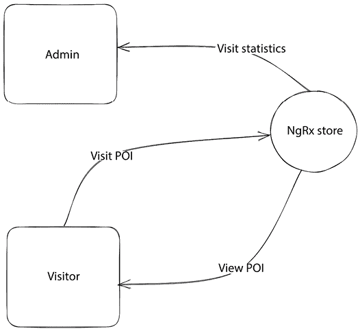

图 8.1 – 项目架构

构建时间：3 小时

# 入门

完成此项目所需的以下软件工具：

+   **Nx 控制台**：一个 VSCode 扩展，提供了一个图形界面来与 Nx 一起工作。你可以在*第一章*，*在 Angular 中创建你的第一个 Web 应用*中了解更多关于如何安装它的信息。

+   **GitHub 材料**：本章相关的代码可以在[`github.com/PacktPublishing/Angular-Projects-Third-Edition`](https://github.com/PacktPublishing/Angular-Projects-Third-Edition)的`Chapter08`文件夹中找到。

# 使用 Nx 创建单仓库应用

Nx 为开发者提供了与单仓库一起工作的工具，包括以下内容：

+   **create-nx-workspace**：一个 npm 包，用于搭建新的 Nx 单仓库应用。

+   **Nx CLI**：一个命令行界面，可以对单仓库应用运行命令。Nx CLI 扩展了 Angular CLI，提供了更多命令，由于分布式缓存机制，这使它更快。

建议在使用 Nx 单仓库时使用 VSCode 的**快速打开**功能。生成的文件夹和文件数量将显著增加，这将使导航变得具有挑战性。更多信息请参阅[`code.visualstudio.com/docs/editor/editingevolved#_quick-file-navigation`](https://code.visualstudio.com/docs/editor/editingevolved#_quick-file-navigation)。

要安装 Nx CLI，请在终端中运行以下命令：

```js
npm install -g nx 
```

上述命令将在我们的系统上全局安装`nx`npm 包。现在，我们可以使用以下命令来创建新的 Nx 单仓库工作区：

```js
npx create-nx-workspace packt --appName=tour --preset=angular-monorepo --style=css --linter=eslint --nx-cloud=false --routing 
```

上述命令将执行以下操作：

1.  查找`create-nx-workspace`npm 包的最新版本，并请求我们安装它。

1.  询问我们是否想在应用程序中使用独立组件。确保选择`No`并按*Enter*键继续。

独立的 Angular 组件是一种更简单、更现代的方法，用于构建不使用 Angular 模块的更组件化的 Angular 应用程序。在这个项目中，我们将默认使用 Angular 模块。

执行`create-nx-workspace`包涉及以下选项：

+   `packt`: Nx 单仓库工作区的名称。在大型企业环境中，我们通常使用组织名称。

+   `--appName=tour`: 应用程序的名称。

+   `--preset=angular-monorepo`: Nx 支持使用各种 JavaScript 框架构建的应用程序。`preset`选项定义了我们想构建的应用程序类型。

+   `--style=css`: 表示我们的应用程序将使用 CSS 样式表格式。

+   `--linter=eslint`: 将我们的应用程序配置为使用 ESLint 作为默认的代码检查工具。

+   `--nx-cloud=false`: 禁用 Nx Cloud 为我们应用程序。

+   `--routing`: 启用应用程序中的 Angular 路由。

创建新的 Nx 工作区可能需要一些时间，因为它会安装企业环境所需的所有必要的包。

工作区创建完成后，我们可以运行它来验证一切是否已正确设置：

1.  在 VSCode 编辑器中打开项目，然后在 VSCode 侧边栏中点击**Nx 控制台**菜单。

1.  从**项目**面板中选择**服务**命令，然后点击播放按钮执行它：

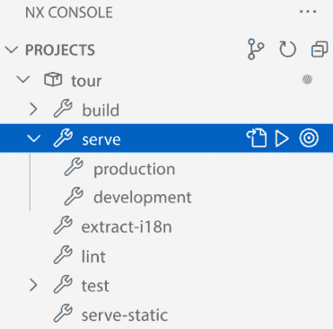

图 8.2 – 服务选项

1.  在浏览器中打开`http://localhost:4200`，你应该会看到以下输出：


图 8.3 – 最小 Nx 应用程序

恭喜！您的新应用程序已正确配置！Nx 创建了一个最小骨架应用程序，就像 Angular CLI 一样，以便我们可以在其上构建我们的功能。

在下一节中，我们将通过在我们的工作区中创建管理员和访客门户来深入了解 Nx。

# 创建用户特定门户

我们的应用程序将包含两个门户，不同的用户将使用它们。访客将能够查看 POI 列表并在地图上选择它们。管理员将能够查看每个 POI 的统计数据。我们将在接下来的章节中了解更多关于如何使用 Nx 的信息：

+   构建访客门户

+   构建管理员门户

每个门户都将是一个独立的 Nx 库，根据在浏览器地址栏中输入的 URL 进行加载。将我们的代码组织到库中允许我们在不同的应用程序之间重用它，并单独构建和测试它。我们将在下一节开始构建访客门户。

## 构建访客门户

访客门户将是 Nx 工作区内的一个库，默认情况下将被加载。让我们看看如何使用 Nx 控制台构建这个库：

1.  从 VSCode 侧边栏运行 Nx 控制台，并从**GENERATE & RUN TARGET**面板中选择**generate**选项：

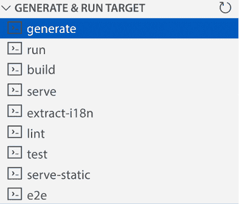

图 8.4 – 生成选项

1.  从出现的对话框中选择**@nrwl/angular – library**选项。**@nx/angular**命名空间包含我们可以在 Nx 单仓库中执行的 Angular 应用的 schematics。

1.  将库的名称输入为`visitor`并点击**运行**按钮：

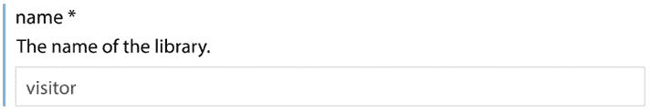

图 8.5 – 库名称

当你输入库的名称时，你可能已经注意到 Nx 在终端中运行了**generate**命令。但是，它并没有运行。相反，它模拟了在系统中运行命令的效果，这种技术称为**dry run**。

Nx 将在我们的工作区`libs`文件夹内创建`visitor`库。该库目前还没有任何组件。根据项目规格，访客门户将有一个 POI 列表，用户可以在地图上选择并查看他们的位置。因此，我们需要创建一个具有以下布局的 Angular 组件：

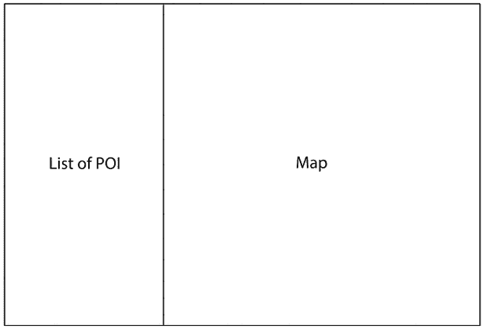

图 8.6 – 访客门户布局

在之前的图中，门户由显示 POI 列表的侧边栏和显示地图的主要内容区域组成。我们不会从头开始创建布局，而是会使用 Angular Material，它包含一些现成的布局，包括带有侧边栏的一个。

在使用 Angular Material 之前，我们需要使用以下命令将其安装到我们的应用程序中：

```js
npm install @angular/material 
```

安装成功完成后，我们可以使用以下命令在 Nx 工作区中配置 Angular Material：

```js
nx generate @angular/material:ng-add --project=tour --theme=deeppurple-amber --animations=enabled --typography 
```

上述命令将为我们的工作区配置`@angular/material` npm 包，并传递额外的选项。你可以在*第四章*，*使用 Angular Service Worker 构建 PWA 天气应用程序*中了解更多关于这些选项的信息。

在我们的项目中配置 Angular Material 也会安装 `@angular/cdk` npm 包，该包包含用于构建 Angular Material 的特定行为和交互。

**地址表单**：这使用 Angular Material 表单控件输入地址信息。

Angular Material 库包含以下组件模板，我们可以使用：

+   我们将在第九章 *使用 Angular CLI 和 Angular CDK 构建组件 UI 库* 中学习如何构建这样的库。

+   **导航**：这包含一个侧边导航组件以及一个内容占位符和标题栏。

+   **仪表板**：这由多个 Angular Material 卡片和菜单组件组成，以网格布局组织。

+   **表格**：这显示了一个具有排序和过滤功能的 Angular Material 表格。

+   **树形结构**：这表示树视图中的可视文件夹结构。

在我们的案例中，我们将使用 **导航** 组件，因为我们需要一个侧边栏。让我们看看我们如何生成该组件：

1.  从 VSCode 侧边栏打开 Nx 控制台并选择 **生成** 选项。

1.  从出现的对话框中选择 **@angular/material – 导航** 选项。**@angular/material** 命名空间包含我们可以运行的脚本来创建 Angular Material 组件。

1.  输入组件的名称：

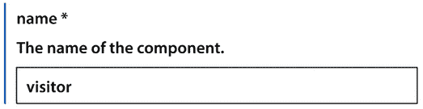

图 8.7 – 组件名称

1.  从我们之前创建的 **项目** 下拉菜单中选择 **访客** 库：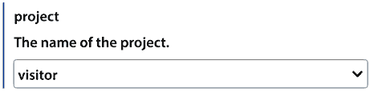

    图 8.8 – 项目选择

    如果选项未显示，请点击 **显示更多** 按钮。

1.  选择 **平铺** 选项，以便组件不会在单独的文件夹中生成：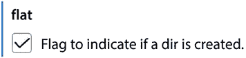

    图 8.9 – 平铺选项

    组件将是库的主要组件，因此我们希望将其与其相关的模块文件放在同一个文件夹中。

1.  输入组件将被创建的文件夹：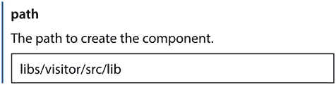

    图 8.10 – 组件文件夹

    没有必要定义组件将被创建的模块，因为 Angular CLI 可以直接从 **路径** 选项中推断出来。

1.  点击 **运行** 按钮以生成组件。

Nx 控制台将在 Nx 工作区的 **访客** 库中创建 **访客** 组件。我们现在需要将其与工作区的主应用程序连接：

1.  打开 `app.component.html` 文件并删除 `<packt-nx-welcome>` 选择器。

1.  打开 `app.routes.ts` 文件并添加一个路由配置，当 URL 包含 `tour` 路径时将加载访客门户：

    ```js
    export const appRoutes: Route[] = [
      **{**
    **path****:** **'tour'****,**
    **loadChildren****:** **() =>****import****(****'@packt/visitor'****).****then****(****m** **=>** **m.****VisitorModule****)**
     **},**
     **{**
    **path****:** **''****,**
    **pathMatch****:** **'full'****,**
    **redirectTo****:** **'****tour'**
     **}**
    ]; 
    ```

    路由配置包含两个路径。默认路径，由空字符串表示，重定向到 `tour` 路径。`tour` 路径会懒加载 **访客** 库的模块。

1.  打开`visitor.module.ts`文件，并添加一个路由配置来加载我们创建的**visitor**组件：

    ```js
    import { NgModule } from '@angular/core';
    import { CommonModule } from '@angular/common';
    import { VisitorComponent } from './visitor.component';
    import { MatToolbarModule } from '@angular/material/toolbar';
    import { MatButtonModule } from '@angular/material/button';
    import { MatSidenavModule } from '@angular/material/sidenav';
    import { MatIconModule } from '@angular/material/icon';
    import { MatListModule } from '@angular/material/list';
    **import** **{** **RouterModule** **}** **from****'@angular/router'****;**
    @NgModule({
      imports: [CommonModule, MatToolbarModule, MatButtonModule, MatSidenavModule, MatIconModule, MatListModule,
        **RouterModule****.****forChild****([**
     **{** **path****:** **''****,** **component****:** **VisitorComponent** **}**
     **])**
      ],
      declarations: [
        VisitorComponent
      ],
    })
    export class VisitorModule {} 
    ```

路由配置将在`VisitorModule`加载后默认激活`VisitorComponent`，使用步骤 3 中描述的`tour`路径。

如果我们现在从 Nx 控制台运行**serve**命令并导航到`http://localhost:4200`，我们应该看到以下输出：

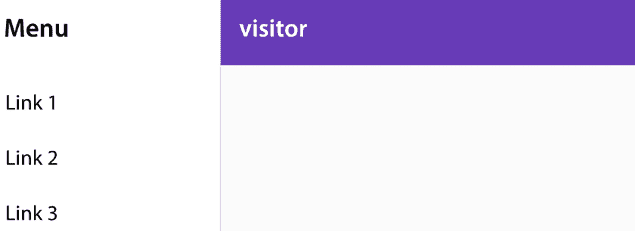

图 8.11 – 访客门户

Angular 路由将重定向我们到`http://localhost:4200/tour`并显示访客门户。它目前包含一些 Angular Material 在生成导航组件时输入的演示数据。我们将在*使用 NgRx 管理应用程序状态*部分重新访问它，以使用 NgRx 实现完整的功能。现在，我们将继续在下一节构建管理员门户。

## 构建管理员门户

管理员门户将是一个 Nx 库，包含一个组件，就像访客门户一样，但它不会基于 Angular Material 模板。让我们使用 Nx 控制台开始构建库的结构：

1.  从 VSCode 侧边栏运行 Nx 控制台并选择**generate**选项。

1.  在出现的对话框中，选择**@nx/angular – library**选项。

1.  输入`admin`作为库名称并点击**Run**按钮：

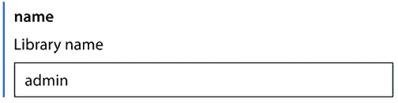

图 8.12 – 库名称

1.  再次点击**generate**选项并选择**@schematics/angular – component**选项。**@schematics/angular**命名空间包含我们可以在 Angular 应用程序中使用 Angular CLI 运行的 schematics。

1.  将组件名称与步骤 3 中相同：

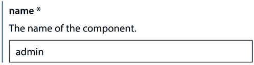

图 8.13 – 组件名称

1.  从**项目**下拉列表中选择我们创建的库：

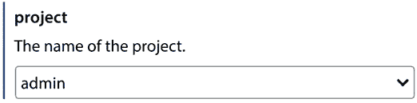

图 8.14 – 项目选择

1.  选择**flat**选项，以便组件将在库的模块文件相同的文件夹中创建：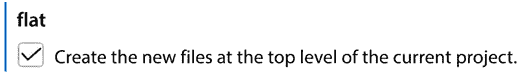

    图 8.15 – 平铺选项

    如果选项未显示，请点击**Show more**按钮。

1.  输入组件将被创建的文件夹，并点击**Run**按钮：

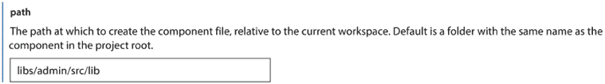

图 8.16 – 组件文件夹

Angular CLI 将在**admin**库的文件夹内创建**admin**组件。我们现在需要将其连接到主应用程序：

1.  打开`app.routes.ts`文件，并为`admin`路径添加一个新的路由配置对象：

    ```js
    export const appRoutes: Route[] = [
      **{**
    **path****:** **'****admin'****,**
    **loadChildren****:** **() =>****import****(****'@packt/admin'****).****then****(****m** **=>** **m.****AdminModule****)**
     **}**,
      {
        path: 'tour',
        loadChildren: () => import('@packt/visitor').then(m => m.VisitorModule)
      },
      {
        path: '',
        pathMatch: 'full',
        redirectTo: 'tour'
      }
    ]; 
    ```

1.  打开`admin.module.ts`文件，并添加一个路由配置来默认激活`AdminComponent`：

    ```js
    import { NgModule } from '@angular/core';
    import { CommonModule } from '@angular/common';
    import { AdminComponent } from './admin.component';
    **import** **{** **RouterModule** **}** **from****'@angular/router'****;**
    @NgModule({
      imports: [
        CommonModule,
        **RouterModule****.****forChild****([**
     **{** **path****:** **''****,** **component****:** **AdminComponent** **}**
     **])**
      ],
      declarations: [
        AdminComponent
      ],
    })
    export class AdminModule {} 
    ```

1.  使用 Nx 控制台的**serve**选项运行应用程序，并导航到`http://localhost:4200/admin`：


图 8.17 – 管理员门户

页面将显示 **admin** 库主组件的默认模板。

我们现在已经完成了企业应用程序的脚手架搭建。首先，我们创建了将托管应用程序门户的 Nx 单一代码仓库。然后，我们使用 Nx Console 生成我们的门户及其主组件。我们还安装了 Angular Material 以在组件中使用其 UI 元素。

在下一节中，我们将使用 NgRx 实现访客门户的功能。

# 使用 NgRx 管理应用程序状态

访客门户将允许用户查看可用的 POI 列表并选择一个查看其在地图上的位置。可用的 POI 列表和 POI 的选择是我们应用程序的全局状态。我们将通过完成以下任务来集成 NgRx 以管理访客门户的应用程序状态：

+   配置状态

+   与存储交互

让我们从配置应用程序状态开始，在下一节中。

## 配置状态

我们的应用程序将包括一个用于整个应用程序的 `root` 状态和一个用于访客门户的功能状态。我们将首先执行以下命令来创建 `root` 状态：

```js
nx generate @nx/angular:ngrx app --root --no-interactive --parent=apps/tour/src/app/app.module.ts 
```

上一条命令使用 Nx CLI 的 `generate` 命令，传递以下选项：

+   `@nx/angular:ngrx`：表示我们想要设置 NgRx 状态

+   `app`：状态名称

+   `--root`：表示我们想要配置一个根状态

+   `--no-interactive`：禁用交互式输入提示

+   `--parent=apps/tour/src/app/app.module.ts`：将状态注册到我们应用程序的主要 Angular 模块中

上一条命令将在 `package.json` 文件中添加所有必要的 NgRx npm 包并安装它们。它还将修改 `app.module.ts` 文件以配置所有 NgRx 相关艺术品，如存储和效果。

**访客**库不会管理访客门户状态的数据。相反，我们将在 Nx 工作区中创建一个新的库来获取和存储功能状态中的数据。执行以下 Nx CLI 命令来创建一个新的库：

```js
nx generate @nrwl/angular:library poi 
```

上一条命令将在我们的 Nx 单一代码仓库中生成 `poi` 库。现在，我们可以使用以下命令设置功能状态：

```js
nx generate @nx/angular:ngrx poi --no-interactive --parent=libs/poi/src/lib/poi.module.ts --barrels 
```

上一条命令使用 Nx CLI 的 `generate` 命令注册功能状态，传递额外的选项：

+   `@nx/angular:ngrx`：表示我们想要设置 NgRx 状态。

+   `poi`：状态名称。

+   `--no-interactive`：禁用交互式输入提示。

+   `--parent=libs/poi/src/lib/poi.module.ts`：将状态注册到我们库的 Angular 模块中。

+   `--barrels`：表示使用桶文件重新导出 NgRx 艺术品，如选择器和状态。桶文件的名称通常按惯例为 `index.ts`。

上一条命令将在我们的库中创建一个名为 `+state` 的文件夹（按惯例命名），其中包含以下文件：

+   `poi.actions.ts`：定义功能状态 NgRx 动作

+   `poi.effects.ts`: 定义 NgRx 效应用于功能状态

+   `poi.models.ts`: 定义 POI 数据的实体接口

+   `poi.reducer.ts`: 定义 NgRx 减法器用于功能状态

+   `poi.selectors.ts`: 定义 NgRx 选择器用于功能状态

Nx CLI 已经通过在之前的文件中添加必要的内容完成了大部分工作，消除了我们需要的样板代码。我们现在需要在库中创建一个 Angular 服务来获取 POI 数据：

1.  打开 `poi.models.ts` 文件并为 `PoiEntity` 接口添加以下属性：

    ```js
    export interface PoiEntity {
      id: string | number; // Primary ID
      name: string;
      **lat****:** **number****;**
    **lng****:** **number****;**
    **description****:** **string****;**
    **imgUrl****:** **string****;**
    } 
    ```

1.  执行以下命令以生成 Angular 服务：

    ```js
    nx generate service poi --project=poi 
    ```

    上述命令将在 `poi` 库中创建一个名为 `poi` 的 Angular 服务。

1.  打开 `poi.service.ts` 文件并添加以下 `import` 语句：

    ```js
    import { HttpClient } from '@angular/common/http';
    import { Observable } from 'rxjs';
    import { PoiEntity } from '..'; 
    ```

1.  在 `PoiService` 类的 `constructor` 中注入 `HttpClient` 并创建一个从 `assets/poi.json` 文件获取 POI 数据的方法：

    ```js
    export class PoiService {
      constructor(**private** **http: HttpClient**) {}
      **getAll****():** **Observable****<****PoiEntity****[]> {**
    **return****this****.****http****.****get****<****PoiEntity****[]>(****'assets/poi.json'****);**
     **}**
    } 
    ```

    我们使用 Angular 框架内置的 HTTP 客户端通过发起 GET HTTP 请求来获取 POI 数据。

    您可以从 GitHub 仓库的 *入门* 部分获取 `poi.json` 文件并将其复制到您的工作区中的 `apps\tour\src\assets` 文件夹。

1.  打开 `poi.effects.ts` 文件并导入 `map` 和 `PoiService` 实体：

    ```js
    import { Injectable, inject } from '@angular/core';
    import { createEffect, Actions, ofType } from '@ngrx/effects';
    import { switchMap, catchError, of, `map` } from 'rxjs';
    import * as PoiActions from './poi.actions';
    import * as PoiFeature from './poi.reducer';
    `import { PoiService } from '../poi.service';` 
    ```

1.  在 `PoiEffects` 类中注入 `PoiService`：

    ```js
    private poiService = inject(PoiService); 
    ```

1.  将 `init$` 属性修改为使用 `poiService` 变量：

    ```js
    init$ = createEffect(() =>
      this.actions$.pipe(
        ofType(PoiActions.initPoi),
    **switchMap****(****() =>****this****.****poiService****.****getAll****()),**
        switchMap(pois => of(PoiActions.loadPoiSuccess({ poi: **pois** }))),
        catchError((error) => {
          console.error('Error', error);
          return of(PoiActions.loadPoiFailure({ error }));
        })
      )
    ); 
    ```

    NgRx 效应负责监听存储中派发的所有动作。当派发 `PoiActions.initPoi` 动作时，`init$` 属性被触发并调用 `poiService` 变量的 `getAll` 方法。`init$` 属性通过 `ofType` 操作符的参数知道要监听哪个动作。

    `ofType` 操作符可以接受多个动作。

    如果数据获取成功，效应将在存储中触发一个新动作，即 `PoiActions.loadPoiSuccess`，并将 POI 数据作为负载。如果获取数据时出现失败，它将在存储中触发一个 `PoiActions.loadPoiFailure` 动作。

1.  打开 `app.module.ts` 文件并从 `@angular/common/http` 命名空间导入 `HttpClientModule`。同时将 `HttpClientModule` 类添加到 `@NgModule` 装饰器的 `imports` 数组中。

我们应用程序的全局状态现在已配置并准备好使用。在下一节中，我们将在访客库中创建额外的 Angular 组件，这些组件将与我们的应用程序的功能状态进行交互。

## 与存储进行交互

访客门户将通过两个 Angular 组件与我们的应用程序的功能状态进行交互。一个组件将显示 POI 列表并允许用户选择一个。另一个组件将在 Google Maps 中显示所选的 POI。

初始时，我们将构建显示 POI 列表的组件：

1.  打开 `visitor.module.ts` 文件并添加以下 `import` 语句：

    ```js
    import { PoiModule } from '@packt/poi'; 
    ```

1.  在 `@NgModule` 装饰器的 `imports` 数组中添加 `PoiModule`：

    ```js
    @NgModule({
      imports: [CommonModule, MatToolbarModule, MatButtonModule, MatSidenavModule, MatIconModule, MatListModule,
        RouterModule.forChild([
          { path: '', component: VisitorComponent }
        ]),
        **PoiModule**
      ],
      declarations: [
        VisitorComponent
      ],
    }) 
    ```

    我们导入 `PoiModule` 以确保在访问者门户加载时，**poi** 功能状态立即在存储中注册。

1.  执行以下 Nx CLI 命令以创建 Angular 组件：

    ```js
    nx generate @schematics/angular:component poi-list --project=visitor 
    ```

1.  打开 `poi-list.component.ts` 文件并相应地修改 `import` 语句：

    ```js
    import { Component, **OnInit** } from '@angular/core';
    **import** **{** **Store** **}** **from****'@ngrx/store'****;**
    **import** **{** **PoiActions****,** **PoiSelectors** **}** **from****'@packt/poi'****;** 
    ```

1.  修改 `PoiListComponent` 类，使其在组件初始化时在存储中触发 `PoiActions.initPoi` 动作以获取 POI 数据：

    ```js
    export class PoiListComponent implements OnInit {
      constructor(private store: Store) {}
      ngOnInit(): void {
        this.store.dispatch(PoiActions.initPoi());
      }
    } 
    ```

    我们将操作作为方法执行并将结果传递给 `store` 变量的 `dispatch` 方法。

1.  创建一个组件属性，它调用 `PoiSelectors.selectAllPoi` 选择器以从存储中列出 POI 数据：

    ```js
    pois$ = this.store.select(PoiSelectors.selectAllPoi); 
    ```

    我们使用 `store` 变量的 `select` 方法来执行选择器。

    我们没有创建 `PoiSelectors.selectAllPoi` 选择器。在生成 **poi** 库中的功能状态时，NgRx 为我们完成了这项工作。

1.  打开 `poi-list.component.html` 文件并用以下 HTML 模板替换其内容：

    ```js
    <mat-action-list *ngFor="let poi of pois$ | async">
      <button mat-list-item>{{poi.name}}</button>
    </mat-action-list> 
    ```

    我们使用 Angular Material 库中的 `<mat-action-list>` 组件来显示每个 POI 作为单个操作项。我们使用 `async` 管道订阅 `pois$` 属性并为每个 POI 创建一个带有 `mat-list-item` 指令的 `<button>` 元素。

1.  打开 `visitor.component.html` 文件并用我们创建的 `<packt-poi-list>` 组件替换 `<mat-nav-list>` 组件。

使用 Nx Console 启动应用程序，你应该在菜单侧边栏中看到以下输出：

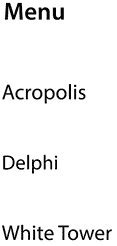

图 8.18 – POI 列表

我们已经创建了 Angular 组件来显示可用的 POI。现在让我们看看如何创建一个组件来在地图上显示 POI 使用 Google Maps。

Angular Material 库包含一个用于 Google Maps 的组件，我们可以在我们的应用程序中使用它：

1.  运行以下 `npm` 客户端命令来安装 Google Maps 组件：

    ```js
    npm install @angular/google-maps 
    ```

1.  打开 `visitor.module.ts` 文件并添加以下 `import` 语句：

    ```js
    import { GoogleMapsModule } from '@angular/google-maps'; 
    ```

1.  将 `GoogleMapsModule` 添加到 `@NgModule` 装饰器的 `imports` 数组中：

    ```js
    @NgModule({
      imports: [CommonModule, MatToolbarModule, MatButtonModule, MatSidenavModule, MatIconModule, MatListModule,
        RouterModule.forChild([
          { path: '', component: VisitorComponent }
        ]),
        PoiModule,
        **GoogleMapsModule**
      ],
      declarations: [
        VisitorComponent,
        PoiListComponent
      ],
    }) 
    ```

1.  打开应用程序的 `index.html` 文件并在 `<head>` 元素内添加 Google Maps JavaScript API：

    ```js
    <script src="img/js"></script> 
    ```

现在我们已经安装并注册了 Google Maps 到我们的应用程序中，让我们创建一个将托管它的 Angular 组件：

1.  执行以下 Nx CLI 命令以创建一个新的 Angular 组件：

    ```js
    nx generate @schematics/angular:component map --project=visitor 
    ```

1.  打开 `map.component.ts` 文件并添加以下 `import` 语句：

    ```js
    import { Store } from '@ngrx/store';
    import { PoiSelectors } from '@packt/poi'; 
    ```

1.  在 `MapComponent` 类的 `constructor` 中注入 `Store` 服务并声明一个属性以从存储中获取选定的 POI：

    ```js
    export class MapComponent {
     **poi$ =** **this****.****store****.****select****(****PoiSelectors****.****selectEntity****);**
    **constructor****(****private** **store: Store****) { }**
    } 
    ```

1.  打开 `map.component.html` 文件并用以下 HTML 模板替换其内容：

    ```js
    <google-map height="100%" width="auto" *ngIf="poi$ | async as poi" [center]="poi">
      <map-marker [position]="poi"></map-marker>
    </google-map> 
    ```

    在前面的模板中，我们使用 `async` 管道订阅 `poi$` 属性。一旦我们从存储中获取到选定的 POI，我们就显示一个 `<google-map>` 组件并将地图的中心设置为 POI 坐标。此外，我们在指定的 POI 坐标上添加了一个标记。

1.  打开`visitor.component.html`文件并将`<!-- Add Content Here -->`注释替换为`<packt-map>`选择器。

我们创建的 Angular 组件将在我们从列表中选择 POI 时立即在地图上显示其位置。如果您尝试从列表中选择一个 POI，您会注意到没有任何反应。这是为什么？

应用程序的全局状态目前不知道何时选择了 POI。我们需要添加必要的代码来设置选中的 POI 并与存储进行交互：

1.  打开`poi.actions.ts`文件并添加一个新操作以传递选中 POI 的 ID：

    ```js
    export const selectPoi = createAction(
      '[Poi/API] Select Poi',
      props<{ poiId: string | number }>()
    ); 
    ```

1.  打开`poi.reducer.ts`文件，并在`reducer`属性中添加一个新语句，该语句将监听`selectPoi`操作并将选中的 POI 保存到存储中：

    ```js
    const reducer = createReducer(
      initialPoiState,
      on(PoiActions.initPoi, (state) => ({ ...state, loaded: false, error: null })),
      on(PoiActions.loadPoiSuccess, (state, { poi }) =>
        poiAdapter.setAll(poi, { ...state, loaded: true })
      ),
      on(PoiActions.loadPoiFailure, (state, { error }) => ({ ...state, error })),
    **on****(****PoiActions****.****selectPoi****,** **(****state, { poiId }****) =>** **({ ...state,** **selectedId****: poiId }))**
    ); 
    ```

1.  打开`poi-list.component.ts`文件并导入`PoiEntity`接口：

    ```js
    import { PoiActions, **PoiEntity**, PoiSelectors } from '@packt/poi'; 
    ```

1.  创建一个新方法以将`selectPoi`操作及其选中的`PoiEntity`一起分发给存储：

    ```js
    selectPoi(poi: PoiEntity) {
      this.store.dispatch(PoiActions.selectPoi({poiId: poi.id}));
    } 
    ```

1.  打开`poi-list.component.html`文件，并将`selectPoi`方法绑定到`<button>`元素的`click`事件：

    ```js
    <mat-action-list *ngFor="let poi of pois$ | async">
      <button mat-list-item **(****click****)=****"selectPoi(poi)"**>{{poi.name}}</button>
    </mat-action-list> 
    ```

要查看新功能的效果，请使用 Nx Console 中的**serve**选项运行应用程序，并从列表中选择一个 POI。应用程序的输出应如下所示：

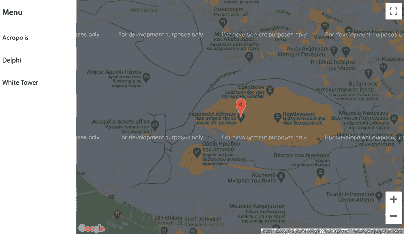

图 8.19 – POI 选择

在此项目中，我们以开发模式使用 Google Maps。对于生产环境，您应从[`developers.google.com/maps/get-started`](https://developers.google.com/maps/get-started)获取 API 密钥，并将其包含在您在`index.html`文件中加载的 Google Maps JavaScript API 脚本中，作为`<script src="img/js?key=YOUR_API_KEY"></script>`。

我们现在已经完成了访客门户所需的所有功能。做得好！实现访客门户的基本功能需要与 NgRx 交互以管理我们应用程序的全局状态。

全局状态被分离为应用程序的根状态和访客门户的特征状态。**访客**库使用后者创建 Angular 组件以显示 POI 列表并选择一个在 Google Maps 中查看：

在下一节中，我们将构建管理员门户以获取每个 POI 的访问统计。

# 使用图表可视化数据

管理员门户将使用图表显示每个 POI 的流量访问。当访客通过点击地图上的标记访问 POI 时，将生成流量。应用程序将在浏览器的本地存储中持久化访问数据。它将为每次访问记录 POI 的 ID 和总访问次数。管理员门户将包括以下功能：

+   在存储中持久化访问数据

+   显示访问统计

在下一节中，我们将通过实现跟踪访问的机制来开始构建管理员门户。

## 在存储中持久化访问数据

我们的应用程序目前还没有记录 POI 的交通统计数据。让我们看看我们如何完成这个任务：

1.  打开`map.component.html`文件，并添加一个`<map-info-window>`组件：

    ```js
    <google-map height="100%" width="auto" *ngIf="poi$ | async as poi" [center]="poi">
      <map-marker [position]="poi"></map-marker>
      **<****map-info-window****>**
    **<****mat-card****>**
    **<****mat-card-header****>**
    **<****mat-card-title****>****{{poi.name}}****</****mat-card-title****>**
    **</****mat-card-header****>**
    **<****img****mat-card-image** **[****src****]=****"poi.imgUrl"****>**
    **<****mat-card-content****>**
    **<****p****>****{{poi.description}}****</****p****>**
    **</****mat-card-content****>**
    **</****mat-card****>**
    **</****map-info-window****>**
    </google-map> 
    ```

    `<map-info-window>`组件是一个弹出窗口，显示有关当前地图标记的附加信息。它以 Angular Material 卡片组件的形式显示 POI 的标题、图像和描述。

    `<mat-card>`组件包含一个由`<mat-card-header>`组件表示的标题和一个由带有`mat-card-image`指令的``元素表示的图像。`<mat-card-content>`组件表示卡的正文内容。

1.  打开`visitor.module.ts`文件，并添加以下`import`语句：

    ```js
    import { MatCardModule } from '@angular/material/card'; 
    ```

1.  在`@NgModule`装饰器的`imports`数组中添加`MatCardModule`类：

    ```js
    @NgModule({
      imports: [CommonModule, MatToolbarModule, MatButtonModule, MatSidenavModule, MatIconModule, MatListModule,
        RouterModule.forChild([
          { path: '', component: VisitorComponent }
        ]),
        PoiModule,
        GoogleMapsModule,
        **MatCardModule**
      ],
      declarations: [
        VisitorComponent,
        PoiListComponent,
        MapComponent
      ],
    }) 
    ```

    `MatCardModule`类是一个 Angular Material 模块，它公开了我们创建卡片组件所需的所有组件。

1.  打开`map.component.ts`文件，并相应地修改`import`语句：

    ```js
    import { Component, **ViewChild** } from '@angular/core';
    import { Store } from '@ngrx/store';
    import { PoiSelectors } from '@packt/poi';
    **import** **{** **MapInfoWindow****,** **MapMarker** **}** **from****'@angular/google-maps'****;** 
    ```

1.  使用`@ViewChild`装饰器声明一个组件属性，以获取信息窗口的引用：

    ```js
    @ViewChild(MapInfoWindow) info: MapInfoWindow | undefined; 
    ```

1.  创建一个打开信息窗口的方法：

    ```js
    showInfo(marker: MapMarker) {
      this.info?.open(marker);
    } 
    ```

    在前面的代码中，我们调用信息窗口引用的`open`方法，并将相关的地图`marker`作为参数传递。

1.  打开`map.component.html`文件，并将`showInfo`组件方法绑定到`<map-marker>`组件的`mapClick`事件：

    ```js
    <map-marker **#****marker****=****"mapMarker"** **(****mapClick****)=****"showInfo(marker)"** [position]="poi"></map-marker> 
    ```

    我们创建`marker`模板引用变量以获取对`mapMarker`对象的引用，并在`showInfo`方法中将它作为参数传递。

1.  使用 Nx Console 的**serve**选项运行应用程序，并从列表中选择一个 POI。

1.  点击地图上的 POI 标记，你应该得到以下类似的输出：

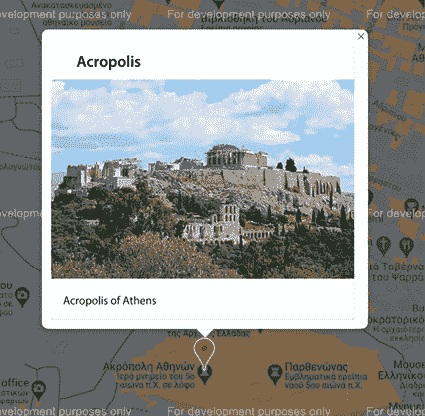

图 8.20 – 地图信息窗口

我们认为当访客点击地图标记并出现信息窗口时，POI 已被访问。然后我们的应用程序将通知存储该动作以将其保存在本地存储中。让我们创建与存储交互的逻辑：

1.  打开`poi.actions.ts`文件，并为访问 POI 的功能创建以下操作：

    ```js
    export const visitPoi = createAction(
      '[Poi/API] Visit Poi',
      props<{ poiId: string | number }>()
    )
    export const visitPoiSuccess = createAction('[Poi/API] Visit Poi Success');
    export const visitPoiFailure = createAction(
      '[Poi/API] Visit Poi Failure',
      props<{ error: any }>()
    ); 
    ```

1.  打开`poi.effects.ts`文件，并创建一个新的效果，该效果监听`visitPoi`动作，并将指定`poiId`的总访问次数增加一：

    ```js
    visit$ = createEffect(() =>
      this.actions$.pipe(
        ofType(PoiActions.visitPoi),
        switchMap(action => {
          const stat = localStorage.getItem('tour-' + action.poiId);
          const total = stat ? Number(stat) + 1 : 1;
          localStorage.setItem('tour-' + action.poiId, total.toString());
          return of(PoiActions.visitPoiSuccess())
        }),
        catchError((error) => {
          console.error('Error', error);
          return of(PoiActions.visitPoiFailure({ error }));
        })
      )
    ); 
    ```

    在前面的代码中，我们获取以单词`tour-`开头的本地存储键，后面跟着 POI ID。如果找到这个键，我们就将其增加一，并更新本地存储。如果没有找到，我们将其初始化为 1。

    在实际情况下，最好将本地存储的逻辑抽象为一个 Angular 服务，该服务将作为全局`localStorage`对象的包装器。我们鼓励你在构建此项目时创建此类服务。

1.  打开`map.component.ts`文件，并从`@packt/poi`命名空间导入`PoiActions`：

    ```js
    import { **PoiActions**, PoiSelectors } from '@packt/poi'; 
    ```

1.  修改`showInfo`组件方法，使其向存储发送`visitPoi`动作：

    ```js
    showInfo(marker: MapMarker, **poiId:** **string** **|** **number**) {
    **this****.****store****.****dispatch****(****PoiActions****.****visitPoi****({ poiId }));**
      this.info?.open(marker);
    } 
    ```

1.  最后，打开`map.component.html`文件并将选定的 POI ID 传递给`showInfo`方法：

    ```js
    <map-marker #marker="mapMarker" (mapClick)="showInfo(marker**, poi.id**)" [position]="poi" ></map-marker> 
    ```

我们的应用程序现在可以记录每个 POI 的访问次数并将它们保存在浏览器的本地存储中。在下一节中，我们将创建管理员门户的主组件，该组件利用访问数据。

## 显示访问统计

管理员门户将在其主组件上显示访问统计，并使用图表进行可视化。我们将使用**ng2-charts**库在饼图中可视化数据。让我们看看如何在组件中添加所需的功能：

1.  使用以下命令安装`ng2-charts`库：

    ```js
    npm install ng2-charts chart.js 
    ```

    前面的命令还将安装`chart.js`库，它是`ng2-charts`库的核心。

1.  打开`admin.module.ts`文件，并从`@packt/poi`命名空间导入`PoiModule`，从`ng2-charts` npm 包导入`NgChartsModule`：

    ```js
    import { NgModule } from '@angular/core';
    import { CommonModule } from '@angular/common';
    import { AdminComponent } from './admin.component';
    import { RouterModule } from '@angular/router';
    **import** **{** **PoiModule** **}** **from****'@packt/poi'****;**
    **import** **{** **NgChartsModule** **}** **from****'ng2-charts'****;**
    @NgModule({
      imports: [
        CommonModule,
        RouterModule.forChild([
          { path: '', component: AdminComponent }
        ]),
    **PoiModule****,**
    **NgChartsModule**
      ],
      declarations: [
        AdminComponent
      ],
    })
    export class AdminModule {} 
    ```

1.  打开`admin.component.ts`文件并根据需要修改`import`语句：

    ```js
    import { Component, **OnDestroy****,** **OnInit** } from '@angular/core';
    **import** **{** **Store** **}** **from****'@ngrx/store'****;**
    **import** **{** **PoiActions****,** **PoiEntity****,** **PoiSelectors** **}** **from****'@packt/poi'****;**
    **import** **{** **Subscription** **}** **from****'rxjs'****;** 
    ```

1.  修改`AdminComponent`类，使其与应用程序存储交互以获取 POI 数据：

    ```js
    export class AdminComponent implements OnInit, OnDestroy {
      private subscription: Subscription | undefined;
      constructor(private store: Store) { }
      ngOnInit(): void {
        this.subscription = this.store.select(PoiSelectors.selectAllPoi).subscribe();
        this.store.dispatch(PoiActions.initPoi());
      }
      ngOnDestroy() {
        this.subscription?.unsubscribe();
      }
    } 
    ```

    在前面的代码中，我们手动使用`subscription`属性订阅`selectAllPoi`选择器，而不是使用`async`管道。在这种情况下，我们必须在组件的`ngOnDestroy`生命周期钩子中使用`unsubscribe`方法手动取消订阅。如果我们不这样做，我们可能会在我们的应用程序中引入内存泄漏。

现在我们已经设置了与存储的交互，我们可以从本地存储中获取统计数据并创建我们的饼图：

1.  执行以下 Nx CLI 命令以在`admin`库中创建一个服务：

    ```js
    nx generate service admin --project=admin 
    ```

1.  打开`admin.service.ts`文件并添加以下`import`语句：

    ```js
    import { PoiEntity } from '@packt/poi'; 
    ```

1.  创建一个方法来从浏览器的本地存储中获取所有保存的流量统计数据：

    ```js
    getStatistics(pois: PoiEntity[]): number[] {
      return pois.map(poi => {
        const stat = localStorage.getItem('tour-' + poi.id) ?? 0;
        return +stat;
      });
    } 
    ```

    在前面的方法中，我们根据每个 POI 的`id`属性获取其流量。然后通过添加`+`前缀将`stat`属性转换为数字。

1.  打开`admin.component.ts`文件并添加以下`import`语句：

    ```js
    import { AdminService } from './admin.service';
    import { ChartDataset } from 'chart.js'; 
    ```

1.  声明组件属性，用于显示在饼图上的标签和实际数据，并将`AdminService`注入到`AdminComponent`类的`constructor`中：

    ```js
    export class AdminComponent implements OnInit, OnDestroy {
      private subscription: Subscription | undefined;
      **dataSets****:** **ChartDataset****[] = [];**
    **labels****:** **string****[] = [];**
      constructor(private store: Store, **private** **adminService: AdminService**) { }
      ngOnInit(): void {
        this.subscription = this.store.select(PoiSelectors.selectAllPoi).subscribe();
        this.store.dispatch(PoiActions.initPoi());
      }
      ngOnDestroy() {
        this.subscription?.unsubscribe();
      }
    } 
    ```

1.  创建一个组件方法来设置图表的标签和数据：

    ```js
    private buildChart(pois: PoiEntity[]) {
      this.labels = pois.map(poi => poi.name);
      this.dataSets = [{
        data: this.adminService.getStatistics(pois)
      }]
    } 
    ```

    图表标签是 POI 的标题，数据来自`adminService`变量的`getStatistics`方法。

1.  在`selectAllPoi`选择器的`subscribe`方法内部调用`buildChart`方法：

    ```js
    ngOnInit(): void {
      this.subscription = this.store.select(PoiSelectors.selectAllPoi).subscribe(**pois** **=>****this****.****buildChart****(pois)**);
      this.store.dispatch(PoiActions.initPoi());
    } 
    ```

1.  最后，打开`admin.component.html`文件并用以下 HTML 模板替换其内容：

    ```js
    <div class="chart" *ngIf="dataSets.length">
      <canvas
        height="100"
        baseChart
        [datasets]="dataSets"
        [labels]="labels"
        type="pie">
      </canvas>
    </div> 
    ```

    在前面的模板中，我们使用`baseChart`指令将`<canvas>`元素转换为图表。图表通过`type`属性设置为`pie`类型。

如果我们现在使用 Nx 控制台运行我们的应用程序，从地图中访问一个 POI，并切换到 `http://localhost:4200/admin` URL，我们应该看到以下输出：

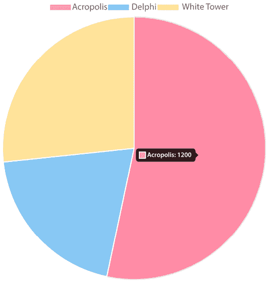

图 8.21 – POI 统计信息

现在管理员可以全面了解每个 POI 的访问情况。我们的管理员门户现在已经完成。访客门户可以与存储交互并在浏览器的本地存储中保存每个 POI 的访问统计信息。然后管理员门户可以获取并显示这些数据在饼图上。

# 摘要

在这个项目中，我们构建了一个企业门户应用程序，用于在地图上访问 POI 并显示每个 POI 的访问统计信息。首先，我们看到了如何使用 Nx 来搭建一个新的 Nx 单一代码库应用程序。然后，我们为我们的应用程序创建了两个不同的门户，一个是访客门户，另一个是管理员门户。我们学习了如何在访客门户中使用 NgRx 库来维护和管理应用程序的状态。最后，我们看到了如何在管理员门户中使用图表库来显示每个 POI 的统计信息。

在下一章中，我们将使用 Angular CLI 使用 Angular CDK 构建一个 UI 组件库。

# 练习问题

让我们看看几个练习问题：

1.  哪个 npm 包创建一个 Nx 单一代码库应用程序？

1.  Angular CLI 和 Nx CLI 之间的区别是什么？

1.  我们如何在单一代码库的库中启用 NgRx？

1.  我们如何从存储中选择数据？

1.  我们如何在 NgRx 中与 HTTP 交互？

1.  我们在哪里修改 NgRx 存储的状态？

1.  根状态和功能状态之间的区别是什么？

1.  我们可以使用哪个 npm 包在 Angular 应用程序中使用 Google Maps？

1.  我们如何手动订阅 NgRx 选择器？

1.  我们使用哪个组件在 Google 地图上显示附加信息？

# 进一步阅读

这里有一些链接，可以帮助我们巩固本章所学的内容：

+   Nx：[`nx.dev`](https://nx.dev)

+   NgRx：[`ngrx.io`](https://ngrx.io)

+   NgRx 存储指南：[`ngrx.io/guide/store`](https://ngrx.io/guide/store)

+   Angular Material 卡组件：[`material.angular.io/components/card/overview`](https://material.angular.io/components/card/overview)

+   Angular Google Maps：[`github.com/angular/components/tree/main/src/google-maps`](https://github.com/angular/components/tree/main/src/google-maps)

+   `ng2-charts`：[`valor-software.com/ng2-charts`](https://valor-software.com/ng2-charts)

+   `create-nx-workspace`：[`www.npmjs.com/package/create-nx-workspace`](https://www.npmjs.com/package/create-nx-workspace)
