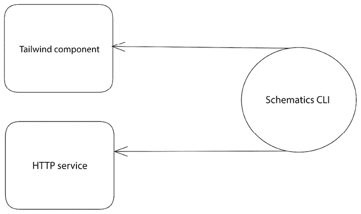
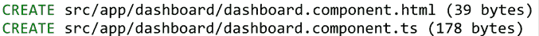
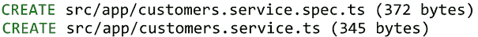

# 第十章：使用 Schematics 定制 Angular CLI 命令

Angular CLI 是一个强大的工具，也是处理 Angular 应用程序的默认解决方案。它消除了开发者大部分的样板代码和配置，使他们能够专注于有趣的事情，即构建出色的 Angular 应用程序。除了增强 Angular 开发体验外，它还可以轻松地根据每个开发者的需求进行定制。

Angular CLI 包含了一组用于构建、打包和测试 Angular 应用的有用命令。它还提供了一组称为 **schematics** 的特殊命令，这些命令可以生成各种 Angular 艺术品，如组件、模块和服务。Schematics 提供了一个公共 API，开发者可以使用它来创建自己的 Angular CLI 命令或扩展现有的命令。

在本章中，我们将介绍以下关于原理图（schematics）的细节：

+   安装 **Schematics CLI**

+   创建 **Tailwind CSS** 组件

+   创建 HTTP 服务

# 重要的背景理论和上下文

Angular schematics 是可以通过 `npm` 安装的库。它们在各种情况下使用，包括创建具有标准用户界面的组件或在一个组织内部强制执行约定和编码规范。一个 schematic 可以作为一个独立的工具使用，也可以作为现有 Angular 库的配套工具。

Angular schematics 被打包成集合，并位于 `@schematics/angular` npm 包中。当我们使用 Angular CLI 运行 `ng add` 或 `ng build` 命令时，它会运行该包中的相应 schematic。目前，Angular CLI 支持以下类型的 schematics：

+   **添加**：使用 `ng add` 命令在 Angular CLI 工作区中安装 Angular 库。

+   **更新**：使用 `ng update` 命令更新 Angular 库。

+   **生成**：使用 `ng generate` 命令在 Angular CLI 工作区中生成 Angular 艺术品。

在这个项目中，我们将专注于生成 schematics，但所有其他命令都适用相同的规则。

# 项目概述

在这个项目中，我们将学习如何使用 Schematics API 来构建自定义 Angular CLI 生成 schematic，用于创建组件、服务和指令。首先，我们将构建一个用于创建使用 Tailwind CSS 框架的模板的 Angular 组件的 schematic。然后，我们将创建一个用于生成默认注入内置 HTTP 客户端并为 CRUD 操作中的每个 HTTP 请求创建一个方法的 Angular 服务的 schematic。以下图表描述了项目的架构概述：



图 10.1 – 项目架构

构建时间：1 小时

# 入门

完成此项目需要以下先决条件和软件工具：

+   Angular CLI：Angular 的命令行界面，您可以在 [`angular.io/cli`](https://angular.io/cli) 找到。

+   GitHub 材料：本章的代码可以在[`github.com/PacktPublishing/Angular-Projects-Third-Edition`](https://github.com/PacktPublishing/Angular-Projects-Third-Edition)的`Chapter10`文件夹中找到。

# 安装 Schematics CLI

Schematics CLI 是一个命令行界面，我们可以用它来与 Schematics API 交互。要安装它，运行以下`npm`命令：

```js
npm install -g @angular-devkit/schematics-cli 
```

上述命令将在我们的系统上全局安装`@angular-devkit/schematics-cli` npm 包。然后我们可以使用`schematics`可执行文件为方案创建一个新的集合：

```js
schematics blank my-schematics 
```

上述命令将生成一个名为`my-schematics`的方案项目。它默认在`src`文件夹中包含一个同名的方案。方案包括以下文件：

+   `collection.json`：一个 JSON 方案，描述属于`my-schematics`集合的方案。

+   `my-schematics\index.ts`：方案的主入口点。

+   `my-schematics\index_spec.ts`：方案主入口点的单元测试文件。

该集合的 JSON 方案文件为每个与该集合关联的方案包含一个条目：

```js
`collection.json`
{
  "$schema": "../node_modules/@angular-devkit/schematics/collection-schema.json",
  "schematics": {
    "my-schematics": {
      "description": "A blank schematic.",
      "factory": "./my-schematics/index#mySchematics"
    }
  }
} 
```

集合中的每个方案都包含一个简短描述，如`description`属性所示，以及一个指向方案主入口点的`factory`属性，使用特殊语法。它包含文件名`./my-schematics/index`，后面跟着`#`字符，以及该文件导出的函数名称，命名为`mySchematics`。

方案的主入口点包含一个默认导出的规则工厂方法，它返回一个`Rule`对象，如`index.ts`文件中所述：

```js
export function mySchematics(_options: any): Rule {
  return (tree: Tree, _context: SchematicContext) => {
    return tree;
  };
} 
```

方案不会直接与文件系统交互。相反，它创建一个由`Tree`对象表示的虚拟文件系统。虚拟文件系统包含一个*暂存*区域，其中所有方案中的转换都会发生。这个区域旨在确保任何无效的转换都不会传播到实际的文件系统。一旦方案有效可以执行，虚拟文件系统将应用更改到真实文件系统。方案的所有转换都在`SchematicContext`对象中操作。

在以下部分，我们将学习如何使用 Schematics CLI 并创建一个组件生成方案。

# 创建 Tailwind CSS 组件

Tailwind 是一个非常流行的 CSS 框架，它强制执行以实用程序为核心的原则。它包含可以在 Angular 应用程序中使用以创建易于组合的用户界面的类和样式。

我们将使用 Angular CLI 的 Schematics API 来构建一个用于 Angular 组件的生成方案。该方案将生成一个带有 Tailwind 容器布局的新 Angular 组件。

我们将要构建的方案不需要默认安装 Tailwind CSS。然而，我们将使用该方案的程序确实需要它。

让我们看看如何实现这一点：

1.  执行以下命令以向我们的集合添加一个新的原理图：

    ```js
    schematics blank tailwind-container 
    ```

    上述命令将更新 `collection.json` 文件，包含一个新的 `tailwind-container` 原理图条目。它还会在我们的工作区 `src` 文件夹中创建一个 `tailwind-container` 文件夹。

1.  在 `tailwind-container` 文件夹内创建一个 `schema.json` 文件，并添加以下内容：

    ```js
    {
      "$schema": "http://json-schema.org/schema",
      "$id": "TailwindContainerSchema",
      "title": "My Tailwind Container Schema",
      "type": "object",
      "properties": {
        "name": {
          "description": "The name of the component.",
          "type": "string"
        },
        "path": {
          "type": "string",
          "format": "path",
          "description": "The path to create the component.",
          "visible": false
        }
      },
      "required": ["name"]
    } 
    ```

    每个原理图都可以有一个 JSON 模式文件，该文件定义了在运行原理图时可用选项。由于我们想要创建一个组件生成原理图，我们需要为我们的组件添加一个 `name` 和 `path` 属性。

    每个属性都关联着元数据，例如 `type` 和 `description`。在调用原理图时，组件名称是必需的，这由 `required` 数组属性所示。

1.  打开 `collection.json` 文件，并按以下方式设置 `tailwind-container` 原理图的属性：

    ```js
    "tailwind-container": {
      "description": "**Generate a Tailwind container component.**",
      "factory": "./tailwind-container/index#tailwindContainer",
      **"schema"****:****"./tailwind-container/schema.json"**
    } 
    ```

    在前面的文件中，我们为我们的原理图设置了一个适当的描述。我们还添加了 `schema` 属性，它指向我们在上一步创建的 `schema.json` 文件的绝对路径。

1.  在 `tailwind-container` 文件夹内创建一个 `schema.ts` 文件，并添加以下内容：

    ```js
    export interface Schema {
        name: string;
        path: string;
    } 
    ```

    前面的文件定义了 `Schema` 接口，将映射属性与 `schema.json` 文件中描述的属性相对应。

我们现在已经创建了所有我们将用于创建原理图的基础基础设施。让我们看看如何编写实际运行原理图的代码：

1.  在 `tailwind-container` 文件夹内创建一个名为 `files` 的文件夹。

1.  在 `files` 文件夹内创建一个名为 `__name@dasherize__.component.html.template` 的文件，并添加以下内容：

    ```js
    <div class="container mx-auto"></div> 
    ```

    前面的文件表示我们的原理图将生成的组件模板。`__name` 前缀将被我们作为选项传递给原理图的组件名称所替换。`@dasherize__` 语法表示如果以驼峰式输入，名称将通过连字符分隔并转换为小写。

1.  创建一个名为 `__name@dasherize__.component.ts.template` 的文件，并添加以下内容：

    ```js
    import { Component } from '@angular/core';
    @Component({
        selector: 'my-<%= dasherize(name) %>',
        templateUrl: './<%= dasherize(name) %>.component.html'
    })
    export class My<%= classify(name) %>Component {} 
    ```

    前面的文件包含将要生成的组件的 TypeScript 类。`@Component` 装饰器的 `selector` 和 `templateUrl` 属性是通过 `dasherize` 方法和组件的 `name` 构建的。类名包含一个不同的方法 `classify`，它接受组件的 `name` 作为参数并将其转换为标题格式。

1.  打开 `tailwind-container` 文件夹内的 `index.ts` 文件，将选项类型设置为 `Schema`，并移除 `return` 语句。生成的文件应该是以下内容：

    ```js
    import { Rule, SchematicContext, Tree } from '@angular-devkit/schematics';
    import { Schema } from './schema';
    export function tailwindContainer(_options: Schema): Rule {
      return (_tree: Tree, _context: SchematicContext) => {
      };
    } 
    ```

1.  修改文件顶部的 `import` 语句如下：

    ```js
    **import** **{ normalize, strings }** **from****'@angular-devkit/core'****;**
    import { **apply, applyTemplates, chain, mergeWith, move**, Rule, SchematicContext, Tree, **url** } from '@angular-devkit/schematics';
    import { Schema } from './schema'; 
    ```

1.  将以下代码插入到 `tailwindContainer` 函数中：

    ```js
    _options.path = _options.path ?? normalize('src/app/' + _options.name as string);
        const templateSource = apply(url('./files'), [
          applyTemplates({
            classify: strings.classify,
            dasherize: strings.dasherize,
            name: _options.name
          }),
          move(normalize(_options.path as string))
        ]); 
    ```

    在前面的代码中，首先，我们设置组件的 `path` 属性，以防在 schematic 中未传递。默认情况下，我们在 `src\app` 文件夹内创建一个与组件同名的文件夹。然后，我们使用 `apply` 方法从 `files` 文件夹中读取模板文件，并使用 `applyTemplates` 函数传递 `dasherize`、`classify` 和 `name` 属性。最后，我们调用 `move` 方法在提供的路径中创建生成的组件文件。

1.  将以下语句添加到工厂函数的末尾：

    ```js
    return chain([
      mergeWith(templateSource)
    ]); 
    chain method to execute our schematic, passing the result of the mergeWith function, which uses the templateSource variable we created in the previous step.
    ```

现在，我们可以继续测试我们的新组件 schematic：

1.  执行以下 `npm` 命令来构建 schematic：

    ```js
    npm run build 
    ```

    上述命令将调用 TypeScript 编译器并将 TypeScript 源文件转换为 JavaScript。它将生成与 TypeScript 文件夹并排的 JavaScript 输出文件。

1.  运行以下命令将 schematics 库安装到我们的全局 npm 缓存中：

    ```js
    npm link 
    ```

    上述命令将允许我们安装 schematic 而不查询公共 npm 注册表。

1.  在您选择的文件夹外部的工作空间中执行以下 Angular CLI 命令以使用默认选项生成新的 Angular 应用程序：

    ```js
    ng new my-app --defaults 
    ```

1.  导航到 `my-app` 文件夹并运行以下命令来安装我们的 schematics：

    ```js
    npm link my-schematics 
    ```

    之前的 `npm` 命令将在当前的 Angular CLI 工作空间中安装 `my-schematics` 库。

    `npm link` 命令类似于运行 `npm install my-schematics`，但它从我们的机器的全局 npm 缓存中下载 npm 包，并且不会将其添加到 `package.json` 文件中。

1.  使用 Angular CLI 的 `generate` 命令创建一个 `dashboard` 组件：

    ```js
    ng generate my-schematics:tailwind-container --name=dashboard 
    ```

    在上述命令中，我们通过传递我们的集合名称 `my-schematics`，后跟冒号分隔的具体 schematic 名称 `tailwind-container`，来使用我们的自定义 schematic。我们还使用 schematic 的 `--name` 选项为我们的组件传递一个名称。

1.  我们可以通过观察终端中的输出或使用 VS Code 打开我们的组件来验证我们的 schematic 是否正确工作：



图 10.2 – 生成 Angular 组件

我们已成功创建了一个新的 schematic，可以根据我们的需求创建自定义 Angular 组件。我们构建的 schematic 从头开始生成新的 Angular 组件。Angular CLI 非常灵活，我们可以挂钩到内置 Angular schematics 的执行并相应地修改它们。

在下一节中，我们将通过构建 Angular HTTP 服务的示意图来调查这一点。

# 创建 HTTP 服务

我们将为我们的 schematics 库创建一个 schematic，用于构建 Angular 服务。它将生成一个导入内置 HTTP 客户端的服务。它还将包含 CRUD 操作中涉及的每个 HTTP 请求的一个方法。

我们将要构建的生成原理图将不会独立存在。相反，我们将它与 Angular CLI 为服务提供的现有生成原理图相结合。因此，我们不需要单独的 JSON 模式。

让我们开始创建原理图：

1.  执行以下命令以将新的原理图添加到我们的集合中：

    ```js
    schematics blank crud-service 
    ```

1.  运行以下命令以安装`@schematics/angular` npm 包：

    ```js
    npm install @schematics/angular 
    ```

1.  打开`collection.json`文件并修改`crud-service`原理图：

    ```js
    "crud-service": {
      "description": "**Generate a CRUD HTTP service.**",
      "factory": "./crud-service/index#crudService",
      **"schema"****:****"../node_modules/@schematics/angular/service/schema.json"**
    } 
    ```

    我们为原理图设置了一个简短描述，并添加了一个`schema`属性，指向 Angular 服务的原始`schema.json`文件。

1.  在工作区中的`crud-service`文件夹内创建一个名为`files`的文件夹。

1.  在`files`文件夹内创建一个名为`__name@dasherize__.service.ts.template`的文件，并添加以下代码：

    ```js
    import { Injectable } from '@angular/core';
    import { HttpClient } from '@angular/common/http';
    import { Observable } from 'rxjs';
    @Injectable({
      providedIn: 'root'
    })
    export class <%= classify(name) %>Service {
      constructor(private http: HttpClient) { }
    } 
    ```

    前面的文件是原理图将生成的 Angular 服务文件的模板。它默认将`HttpClient`服务注入到类的`constructor`中。

1.  定义一个表示我们想要与之通信的 API URL 的服务属性：

    ```js
    apiUrl = '/api'; 
    ```

1.  为每个 CRUD 操作的 HTTP 请求添加以下方法：

    ```js
    create(obj) {
      return this.http.post(this.apiUrl, obj);
    }
    read() {
      return this.http.get(this.apiUrl);
    }
    update(obj) {
      return this.http.put(this.apiUrl, obj);
    }
    delete(id) {
      return this.http.delete(this.apiUrl + id);
    } 
    ```

在事先创建所有方法可以消除大部分样板代码。使用原理图的开发者只需修改这些方法并为每个方法添加实际实现。

我们几乎完成了原理图，除了创建将调用服务生成的工厂函数：

1.  打开`crud-service`文件夹中的`index.ts`文件，并按以下方式修改`import`语句：

    ```js
    **import** **{ normalize, strings }** **from****'@angular-devkit/core'****;**
    import { **apply, applyTemplates, chain, externalSchematic,** **MergeStrategy****, mergeWith, move**, Rule, SchematicContext, Tree, **url** } from '@angular-devkit/schematics'; 
    ```

1.  将`tree`参数重命名并从`return`语句中删除，因为我们不会使用它。生成的工厂函数应如下所示：

    ```js
    export function crudService(_options: any): Rule {
      return (_tree: Tree, _context: SchematicContext) => {};
    } 
    ```

1.  将以下片段添加到`crudService`函数中：

    ```js
    const templateSource = apply(url('./files'), [
      applyTemplates({
        ..._options,
        classify: strings.classify,
        dasherize: strings.dasherize
      }),
      move(normalize(_options.path ?? normalize('src/app/')))
    ]); 
    main differences are that the default path is the src\app folder and that we pass all available options using the _options parameter to the schematic.
    ```

    在事先知道将用于生成 Angular 服务的选项是不可能的。因此，我们使用**展开**运算符将所有可用选项传递给`templateSource`方法。这也是为什么`_options`参数是`any`类型的原因。

1.  将以下`return`语句添加到函数的末尾：

    ```js
    return chain([
      externalSchematic('@schematics/angular', 'service', _options),
      mergeWith(templateSource, MergeStrategy.Overwrite)
    ]); 
    ```

    在前面的语句中，我们使用`externalSchematic`方法调用用于创建 Angular 服务的内置生成原理图。然后，我们将执行该原理图的结果与我们的`templateSource`变量合并。我们还使用`MergeStrategy.Overwrite`定义了合并操作的策略，以便我们的原理图所做的任何更改都将覆盖默认值。

我们创建 CRUD 服务的原理图现在已完成。让我们在我们的示例应用程序中使用它：

1.  执行以下命令以构建原理图库：

    ```js
    npm run build 
    ```

    我们不需要再次链接原理图库。我们的应用程序将在我们为原理图进行新的构建时自动更新。

1.  导航到我们的应用程序所在的`my-app`文件夹。

1.  执行以下命令以使用我们的新原理图生成 Angular 服务：

    ```js
    ng generate my-schematics:crud-service --name=customers 
    ```

    我们使用 Angular CLI 的 `generate` 命令，再次传递我们脚手架集合的名称，但这次目标是 `crud-service` 脚手架。

1.  新的 Angular 服务是在 `src\app` 文件夹中创建的，如终端窗口中的输出所示：



图 10.3 – 生成 Angular 服务

注意，脚手架已经为我们自动生成了一个单元测试文件。这是如何实现的？回想一下，我们已经将我们的脚手架与 Angular CLI 内置的生成脚手架合并了。所以，默认脚手架所做的任何事情，都会直接反映在自定义脚手架的执行上。

我们刚刚为我们脚手架集合添加了一个新的有用命令。我们可以生成一个与 HTTP 端点交互的 Angular 服务。此外，我们还添加了与端点通信所需的基本方法。

# 摘要

在这个项目中，我们使用了 Angular CLI 的 Schematics API 来创建满足我们需求的自定义脚手架。我们构建了一个用于生成包含 Tailwind CSS 样式的 Angular 组件的脚手架。我们还构建了另一个脚手架，用于创建一个与内置 HTTP 客户端交互的 Angular 服务。该服务包括与 HTTP CRUD 应用程序一起工作的所有必要工件。

Angular CLI 是一个灵活且可扩展的工具，它极大地提升了开发体验。每个开发者的想象力是限制他们在工具链中使用这种资产所能做到的事情的唯一因素。CLI 和 Angular 框架允许开发者创建出色的 Web 应用程序。

正如我们在整本书中学到的，Angular 框架在 Web 开发者世界中的普及程度非常高，以至于今天可以轻松地将其与任何技术集成，并创建快速且可扩展的 Angular 应用程序。因此，我们鼓励你获取 Angular 的最新版本，并立即创建令人惊叹的应用程序。

# 练习

使用 Schematics CLI 创建一个用于生成 Angular 指令的 Angular 脚手架。该指令应将 `ElementRef` 和 `Renderer2` 服务从 `@angular/core` npm 包注入到 TypeScript 类的构造函数中。

你应该遵循我们在 *创建 Tailwind CSS 组件* 部分中为组件脚手架所采取的相同方法。

你可以在 GitHub 仓库中该章节的 `exercise` 分支的 `Chapter10` 文件夹中找到解决方案。

# 进一步阅读

+   脚手架概述：[`angular.io/guide/schematics`](https://angular.io/guide/schematics)

+   编写脚手架：[`angular.io/guide/schematics-authoring`](https://angular.io/guide/schematics-authoring)

+   库的脚手架：[`angular.io/guide/schematics-for-libraries`](https://angular.io/guide/schematics-for-libraries)

+   Angular CLI 内置的脚本文档：[`github.com/angular/angular-cli/tree/master/packages/schematics/angular`](https://github.com/angular/angular-cli/tree/master/packages/schematics/angular)
