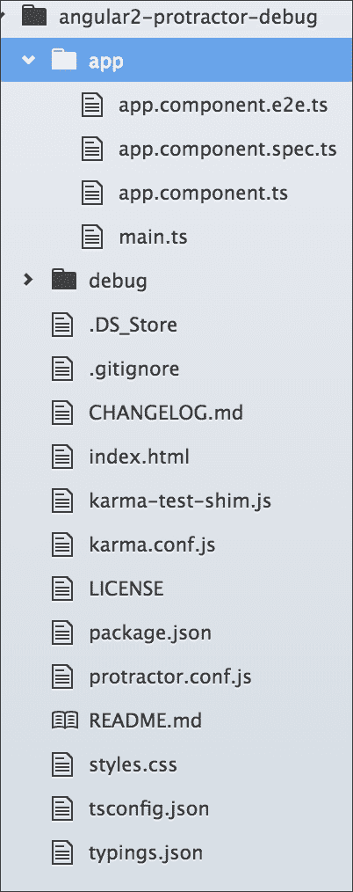
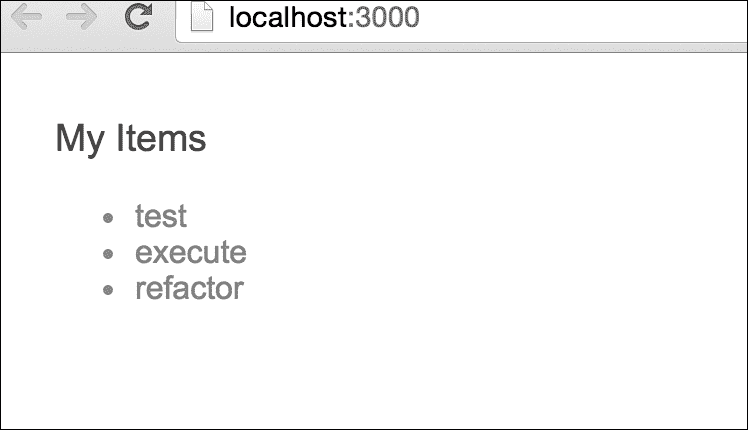
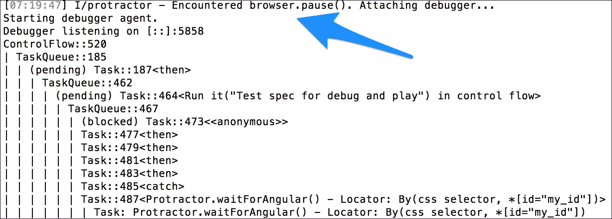
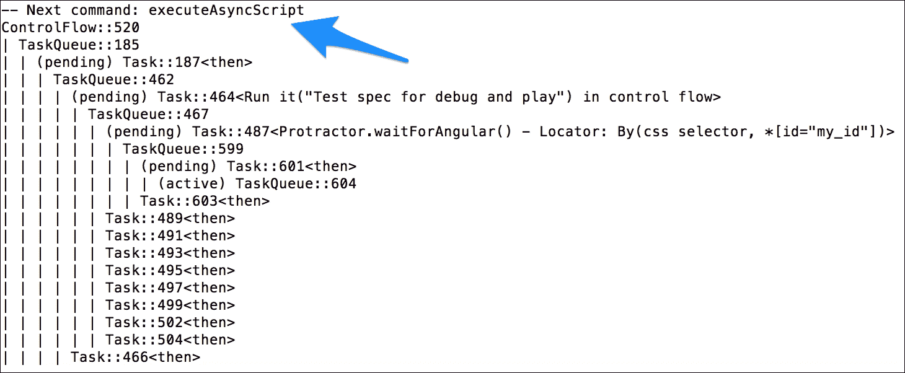
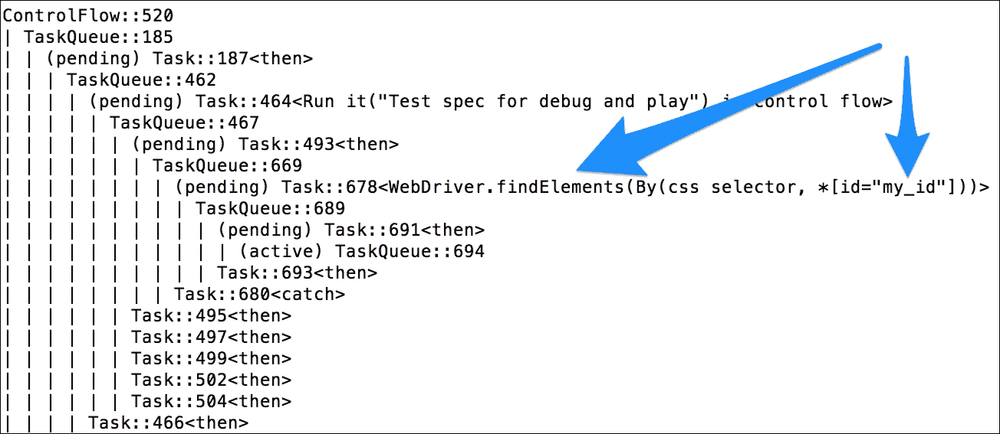
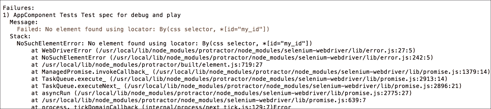
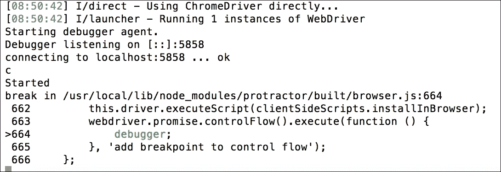

# 第五章：Protractor，更进一步

只要它与浏览器直接交互，端到端测试就非常有趣，但一个好的开发者应该了解 Protractor 的高级功能以执行大规模应用程序测试。除此之外，由于它依赖于浏览器的 DOM 元素，调试在端到端测试中也是一种挑战。

Protractor 提供了一些用于调试的 API。本章将主要涵盖这些 API 和功能，包括以下内容：

+   设置和配置 Protractor

+   一些高级 Protractor API，如 browser、locator 和 action

+   使用`browser.pause()`和`browser.debug()` API 调试 Protractor

# 高级设置和配置

在上一章中，我们看到了 Protractor 的基本和常用设置和配置。在这里，我们将探讨一些高级配置，这些配置可以使安装更加简单和强大。

## 全局安装 Protractor

下面是全局安装 Protractor 的步骤：

1.  一旦 Node.js 已经安装并且可以在命令提示符中使用，输入以下命令以在系统上全局安装 Protractor：

    ```js
    $ npm install -g protractor

    ```

    之前的命令使用 Node 的`npm`命令全局安装 Protractor，这样我们就可以仅使用`protractor`命令来使用 Protractor。

1.  检查 Protractor 版本是否可以如下确定：

    ```js
    $ protractor --version

    ```

## 高级配置

在本节中，我们将通过以下步骤对 Protractor 进行更多配置：

1.  更新 protractor 的`config`文件以支持单个测试套件中的多个浏览器。`multiCapabilities`参数是一个数组，它为任何测试套件接受多个`browserName`对象，如下所示：

    ```js
            exports.config = {  
              //...  
            multiCapabilities: [{
             'browserName': 'firefox' 
            }, { 
             'browserName': 'chrome' 
            }]
            //... };
    ```

1.  我们可以在`capabilities`参数中为浏览器设置高级设置；例如，对于`chrome`，我们可以通过`chromeOptions`传递额外的参数，如下所示：

    ```js
            exports.config = {  
              //...  
              capabilities: { 
                'browserName': 'chrome'
                'chromeOptions': {
                  'args': ['show-fps-counter=true']
                }}]
            //... };
    ```

1.  有时候，我们可能需要在不使用 Selenium 或 WebDriver 的情况下直接运行 Protractor。这可以通过在`config.js`文件中传递一个参数来实现。该参数是配置对象中的`directConnect: true`，如下所示：

    ```js
            exports.config = { 
              //... 
              directConnect: true, 
              //... 
            }; 

    ```

太好了！我们已经将 Protractor 配置得更加深入了一步。

# Protractor API

任何网页的端到端测试的主要活动是获取该页面的 DOM 元素，与之交互，为它们分配动作，并与它们共享信息；然后，用户可以获取网站的当前状态。为了使我们能够执行所有这些操作，Protractor 提供了一系列的 API（其中一些来自 web driver）。在本章中，我们将探讨一些常用 API。

在上一章中，我们看到了 Protractor 如何与 Angular 项目一起工作，其中我们必须与 UI 元素交互。为此，我们使用了几个 Protractor API，如 `element.all`、`by.css`、`first`、`last` 和 `getText`。然而，我们没有看到或深入理解这些 API 的工作原理。要理解 Protractor 中 API 的工作原理非常简单，但在现实生活中，我们大多数时候都必须与更大的、更复杂的项目一起工作。因此，了解并更多地了解这些 API 对于与 UI 交互和玩转其事件非常重要。

## 浏览器

Protractor 与 Selenium WebDriver 一起工作，这是一个浏览器自动化框架。我们可以使用 Selenium WebDriver API 中的方法从测试规范中与浏览器交互。我们将在以下部分查看其中的一些。

要在 Angular 加载之前将浏览器导航到特定的网页地址并加载该页面的模拟模块，我们将通过传递特定的地址或相对路径使用 `.get()` 方法：

```js
browser.get(url); 
browser.get('http://localhost:3000'); // This will navigate to
the localhost:3000 and will load mock module if needed 

```

要获取当前页面的网页 URL，使用 `CurrentUrl()` 方法，如下所示：

```js
browser.getCurrentUrl(); // will return http://localhost:3000 

```

要导航到另一个页面并使用页面内导航浏览它，使用 `setLocation`，如下所示：

```js
browser.setLocation('new-page'); // will change the url and navigate to the new url, as our current url was http://localhost:3000, now it will change and navigate to http://locahost:3000/#/new-page 

```

要获取当前页面的标题（基本上，是设置在 HTML 页面中的标题），使用 `getTitle` 方法，如下所示：

```js
browser.getTitle(); // will return the page title of our page, for us it will return us "Angular Protractor Debug" 

```

要在 Angular 加载之前使用模拟模块重新加载当前页面，使用 `refresh()` 方法，如下所示：

```js
browser.refresh(); // this will reload the full page and definitely will load the mocks module as well. 

```

要暂停测试过程，使用 `pause()` 方法。这对于调试测试过程很有用，我们将在本测试调试部分使用它：

```js
browser.pause(); 

```

要调试测试过程，使用 `debugger()` 方法。这种方法不同，可以被认为是 `pause()` 方法的进阶版本。这对于高级调试测试过程以及向浏览器中注入自定义辅助函数很有用。我们也将使用这个测试调试部分：

```js
browser.debugger(); 

```

要关闭当前浏览器，使用 `close()`。这在复杂的多模块测试中很有用，有时我们需要在打开新浏览器之前关闭当前浏览器：

```js
browser.close(); 

```

要在 Protractor 中支持 Angular，我们必须将 `useAllAngularAppRoots` 参数设置为 `true`。这样做背后的逻辑是，当我们将此参数设置为 `true` 时，它将在元素查找器遍历页面时搜索页面中的所有 Angular 应用：

```js
browser.useAllAngular2AppRoots; 

```

## 元素

### 小贴士

Protractor 本身暴露了一些全局函数，`element` 就是其中之一。这个函数接受一个定位器（一种选择器——我们将在下一步讨论它）并返回一个 `ElementFinder`。这个函数基本上基于定位器找到一个单一元素，但它支持多个元素选择，并可以通过 `element.all` 方法链式调用另一个方法，该方法也接受一个定位器并返回一个 `ElementFinderArray`。两者都支持链式调用以进行下一步操作。

### 元素.all

正如我们已经知道的，`element.all`返回一个`ElementArrayFinder`，它支持链式调用方法以进行下一步操作。我们将查看其中的一些以及它们是如何实际工作的：

要使用特定定位器选择多个元素作为数组，我们应该使用`element.all`，如下所示：

```js
element.all(Locator); 
var elementArr = element.all(by.css('.selector'));  // return the ElementFinderArray 

```

在获取了一组元素作为数组之后，我们可能需要选择特定元素。在这种情况下，我们应该通过传递特定的数组索引作为位置数字来链式调用`get(position)`：

```js
element.all(Locator).get(position); 
elementArr.get(0); // will return first element from the ElementFinderArray  

```

在获取了一组元素作为数组之后，我们可能需要再次使用首选定位器选择子元素，为此我们可以再次链式调用`.all(locator)`方法与现有元素，如下所示：

```js
element.all(Locator).all(Locator); 
elementArr.all(by.css('.childSelector')); // will return another ElementFinderArray as child elements based on child locator  

```

在获取到所需的元素之后，我们可能想要检查所选元素的数量是否符合预期。有一个名为`count()`的方法用于链式调用以获取所选元素的总数：

```js
element.all(Locator).count(); 
elementArr.count(); // will return the total number in the select element's array   

```

与`get(position)`方法类似，我们可以通过链式调用`first()`方法从数组中获取第一个元素：

```js
element.all(Locator).first(); 
elementArr.first(); // will return the first element from the element's array   

```

与`first()`方法类似，我们可以通过链式调用`last()`方法从数组中获取最后一个元素：

```js
element.all(Locator).last(); 
elementArr.last(); // will return the last element from the element array   

```

只要我们有一组元素作为数组，我们可能需要遍历这些元素以执行任何操作。在这种情况下，我们可能需要通过链式调用`each()`方法来遍历一个循环：

```js
element.all(Locator).each(Function) { }; 
elementArr.each( function (element, index) { 
    // ......  
}); // ... will loop through out the array elements 

```

就像`each()`方法一样，还有一个名为`filter()`的方法可以链式调用，用于遍历元素并给它们分配一个过滤器：

```js
element.all(Locator).filter(Function) { }; 
elementArr.filter( function (element, index) { 
    // ......  
}); //... will apply filter function's action to all elements  

```

### 元素

`element`类返回`ElementFinder`，这意味着元素数组中的一个单个元素，这也支持链式调用方法以进行下一步操作。在之前的示例中，我们看到了如何从元素数组中获取单个所选元素，以便所有链式方法都可以在该单个元素上工作。有很多针对单个元素的操作链式方法，我们将查看其中最常用的几个。

通过将特定定位器作为参数传递给`element`方法，我们可以选择单个 DOM 元素，如下所示：

```js
element(Locator); 
var elementObj = element(by.css('.selector'));  // return the ElementFinder based on locator  

```

在获取到特定单个元素之后，我们可能需要找到我们必须要链式调用`element.all`方法的元素的子元素。为此，传递一个特定的定位器以找到子`elementFinderArray`，如下所示：

```js
element(Locator).element.all(Locator); 
elementObj.element.all(by.css('.childSelector')); // will return another ElementFinderArray as child elements based on child locator  

```

在选择特定元素之后，我们可能需要检查在链式调用`isPresent()`方法时该元素是否存在，如下所示：

```js
element(Locator).isPresent(); 
elementObj.isPresent(); // will return boolean if the selected element is exist or not.   

```

## 行动

行动主要改变影响或触发所选 DOM 元素的方法。选择 DOM 元素的目标是通过触发一些行动与之交互，使其能够像真实用户一样行动。有一些常用的特定交互行动。我们在这里将查看其中的一些。

要获取任何元素的内部文本或包含的文本，我们必须在选择特定元素后链式调用`getText()`方法与`elementFinder`对象，如下所示：

```js
element(Locator).getText(); 
var elementObj = element(by.css('.selector'));  // return the ElementFinder based on locator  
elementObj.getText(); // will return the contained text of that specific selected element  

```

要获取任何元素的内部 HTML，我们必须在选定特定元素后，将`getInnerHtml()`方法与`elementFinder`对象链式调用，如下所示：

```js
element.(Locator).getInnerHtml(); 
elementObj.getInnerHtml(); // will return the inner html of the selected element.  

```

我们可以通过将属性键传递给`getAttribute()`方法来找到任何元素的任何特定属性值，这将与选定的`elementFinder`对象链式调用，如下所示：

```js
element(Locator).getAttribute('attribute'); 
elementObj.getAttribute('data'); // will return the value of data attribute of that selected element if that have that attribute 

```

在大多数情况下，我们需要清除输入字段的值。为此，我们可以将`clear()`方法与选定的`elementFinder`对象链式调用，如下所示：

```js
element.(Locator).clear(); 
elementObj.clear(); // Guessing the elementFinder is input/textarea, and after calling this clear() it will clear the value and reset it.    

```

### 小贴士

记住，只有输入或纹理可能具有一些值，需要你清除/重置其值。

当我们需要在按钮、链接或图像上触发点击事件时，在选定特定的`elementFinder`对象后，我们需要链式调用`click()`方法，它将像对该元素的实际点击一样操作：

```js
element.(Locator).click(); 
elementObj.click(); // will trigger the click event as the selected element chaining it.    

```

有时，我们可能需要触发`submit()`方法以提交表单。在这种情况下，我们必须将`submit()`方法与选定的元素链式调用。选定的元素应该是一个`form`元素：

```js
element.(Locator).submit(); 
elementObj.submit(); // Will trigger the submit for the form 
element as submit() work only for form element.   

```

## 定位器

定位器通知 Protractor 如何在 DOM 元素中找到某个元素。Protractor 导出`locator`作为一个全局工厂函数，它将与全局`by`对象一起使用。我们可以根据我们的 DOM 以多种方式使用它们，但让我们看看一些最常用的方法。

我们可以通过传递任何 CSS 选择器到`by.css`方法来选择任何元素，如下所示：

```js
element(by.css(cssSelector));  
element.all(by.css(cssSelector)); 
<span class="selector"></span> 
element.all(by.css('.selector'));  // return the specific DOM element/elements that will have selector class on it 

```

我们可以通过传递其元素 ID 到`by.id`方法来选择任何元素，如下所示：

```js
element(by.id(id)); 
<span id="selectorID"></span>   
element(by.id('selectorID')); // return the specific DOM element that will have selectorID as element id on it  

```

我们也可以通过传递给`by.tagName`来选择特定的元素或元素，如下所示：

```js
element(by.tagName(htmlTagName)); 
element.all(by.tagName(htmlTagName)); 
<span data="myData">Content</span> 
element.all(by.tagName('span')); // will return the DOM element/elements of all span tag.  

```

要选择任何特定输入字段的 DOM 元素，我们可以通过`by.name`方法传递其名称，如下所示：

```js
element(by.name(elementName)); 
<input type="text" name="myInput"> 
element(by.name('myInput')); // will return the specific input field's DOM element that have name attr as myInput 

```

除了 CSS 选择器或 ID 之外，我们还可以通过传递其文本标签到`by.buttonText`来选择特定的按钮：

```js
<button name="myButton">Click Me</button> 
element(by.buttonText('Click Me')); // will return the specific button that will have Click Me as label text  
element(by.buttonText(textLabel)); 

```

我们可以通过传递定义在`by.model`上的模型名称来找到元素，如下所示：

```js
element.(by.model); 
<span ng-model="userName"></span> 
element(by.model('userName')); // will return that specific element which have defined userName as model name    

```

同样，我们可以通过在`by.bindings`中传递使用`ng-bind`定义的绑定来找到特定的 DOM 元素，如下所示：

```js
element.(by.binding); 
<span ng-bind="email"></span> 
element(by.binding('email')); // will return the element that have email as bindings with ng-bind  

```

除了前面解释的所有定位器之外，还有另一种找到特定 DOM 元素的方法：自定义定位器。在这里，我们必须使用`by.addLocator`通过传递定位器名称和回调来创建自定义定位器。然后，我们必须使用`by.customLocatorName(args)`传递该自定义定位器，如下所示：

```js
element.(by.locatorName(args)); 
<button ng-click="someAction()">Click Me</button> 
by.addLocator('customLocator', function(args) { 
    // .....  
}) 
element(by. customLocator(args)); // will return the element that will match with the defined logic in the custom locator. This useful mostly when user need to select dynamic generated element.  

```

# Protractor 测试 - 剖析

调试端到端测试有点困难，因为它们依赖于应用程序的整个生态系统。有时它们依赖于先前的操作，如登录，有时它们依赖于权限。调试端到端测试的另一个主要障碍是其对 WebDriver 的依赖。由于它在不同的操作系统和浏览器中的行为不同，这使得调试端到端测试变得困难。除此之外，它生成长错误消息，这使得区分浏览器相关问题和测试过程错误变得困难。

尽管如此，我们仍将尝试调试所有 e2e 测试，看看这对我们的情况有何影响。

## 失败类型

只要测试套件依赖于 WebDriver 以及系统中的各个部分，就可能存在各种导致测试套件失败的原因。

让我们看看一些已知的失败类型：

+   **WebDrive 失败**：当命令无法完成时，WebDriver 会抛出错误。例如，浏览器无法获取定义的地址以帮助其导航，或者可能找不到预期的元素。

+   **WebDriver 非预期失败**：有时，当 WebDriver 失败并给出错误，无法更新 WebDriver 管理器时，WebDriver 会失败。这是一个与浏览器和操作系统相关的问题，尽管它并不常见。

+   **Protractor Angular 失败**：当在库中找不到预期的 Angular 时，Protractor 将会失败，因为 Protractor 测试依赖于 Angular 本身。

+   **Protractor Angular2 失败**：当配置中缺少 `useAllAngular2AppRoots` 参数时，Protractor 将会失败，因为在这种情况下，测试过程将查看单个根元素，而期望过程中有更多元素。

+   **Protractor 超时失败**：有时，当测试规范陷入循环或长时间等待并无法及时返回数据时，Protractor 会因为超时而失败。然而，超时是可配置的，因此可以根据需要增加。

+   **期望失败**：这是测试规范中常见的失败类型。

## 加载现有项目

用于此测试的代码来自 第四章，*使用 Protractor 进行端到端测试*。我们将把代码复制到一个新目录：`angular-protractor-debug`。

作为提醒，该应用程序是一个待办事项应用程序，其中包含一些待办事项，我们向其中添加了一些项目。它有一个单独的组件类，`AppComponent`，其中包含一个项目列表和一个 `add` 方法。

当前目录的结构应该如下所示：



在验证文件夹结构与前面截图所示相同后，第一项任务是运行以下命令，在本地获取所需的依赖项，`node_modules`：

```js
$ npm install

```

这将安装所有所需的模块。现在，让我们使用 `npm` 命令构建和运行项目：

```js
$ npm start

```

现在应该一切正常了：项目应该在 `http://localhost:3000` 上运行，输出应该如下所示：



这样，我们就准备好继续在 Angular 项目中实现调试器的下一步了。

## 将调试器包含到项目中

在将调试器添加到我们的项目之前，让我们在我们的现有项目中运行 e2e 测试。我们希望 e2e 测试规范通过，没有任何失败。

让我们使用以下命令运行它：

```js
$ npm run e2e

```

如预期的那样，我们的测试通过了。结果如下：


我们可以在通过测试规范相同的位置添加我们的调试代码，但让我们将通过的测试用例保持独立，并在不同的目录中与调试器互动。让我们创建一个新的目录，`debug/`。我们将在目录中需要两个文件：一个用于配置，另一个用于规范。

对于 Protractor 配置文件，我们可以复制 `protractor.conf.js` 文件并将其重命名为 `debugConf.js`。

配置中的所有内容都将与之前的配置相同。然而，我们需要增加 Jasmine 测试的默认超时时间，否则在调试过程中测试将超时。

让我们将超时时间增加到 `3000000` 毫秒：

```js
exports.config = { 
    // ....  
    jasmineNodeOpts: { 
      showColors: true, 
      defaultTimeoutInterval: 3000000 
    }, 
    // ..... 
}; 

```

接下来，我们需要一个规范文件来编写测试规范和调试测试。将新的规范文件保存为 `app.debug.e2e.ts`。哦，是的，我们还需要再次更改配置文件以定义调试的规范文件。

```js
exports.config = { 
    // ....  
    specs: [ 
      'app.debug.e2e.js' 
    ], 
    // ..... 
}; 

```

我们可以为 `app.debug.e2e.ts` 创建一个简单的测试规范文件。然后，我们可以添加调试代码并与之互动。

简单的测试规范如下：

```js
describe('AppComponent Tests', () => { 
    beforeEach(() => { 
        browser.get('/'); 
    }); 

    it('Test spec for debug and play', () => { 

    }); 
}); 

```

# 暂停和调试

要调试任何测试规范，我们必须暂停测试过程并逐步查看发生了什么。Protractor 还内置了暂停过程的方法。以下是两种暂停和调试测试过程的方法：

+   `browser.pause()`

+   `browser.debugger()`

## 使用暂停

使用 `browser.pause()` 命令，调试 Protractor 测试变得简单且直接。使用 `pause()` 方法，我们可以进入 Protractor 调试器的控制流并执行一些命令来检查测试控制流中的情况。通常，当测试因未知错误失败并且有长错误消息时，开发者会在测试中使用调试器。

使用 `browser.pause()` 命令后，我们可以根据需要使用更多命令。

让我们简要看看：

+   `c`: 如果我们输入 `c` 作为命令，它将在测试中向前移动一步，我们将看到测试命令是如何深入工作的。如果我们计划继续进行测试，最好快速操作，因为存在超时问题（Jasmine 默认超时），我们已经了解过。我们将在稍后看到一个示例。

+   `repl`: 通过输入 `repl` 作为命令，我们可以进入调试的交互模式。这被称为交互模式，因为从这里，我们可以通过输入 WebDriver 命令直接从终端与浏览器交互。来自浏览器的响应、结果或错误也会在终端上显示。我们将在稍后看到更多实际示例。

+   `Ctrl + C`: 按下 ***Ctrl*** + C 以退出暂停模式并继续测试。当我们使用这个命令时，测试将从暂停的地方继续进行。

### 一个快速示例

要在测试规范中使用 `browser.pause()`，我们必须将方法添加到我们想要暂停测试并观察控制流以进行调试的测试规范位置。这里我们只有一个包含错误/失败的测试用例的测试规范，我们知道它会失败，我们将找出它失败的原因。

我们必须将`pause()`方法，如图所示，添加到测试`spec it() {}`函数中：

```js
it('Test spec for debug and play', () => { 
  browser.pause(); 
  // There is not element with the id="my_id", so this will fail
  the test 
  expect(element(by.id('my_id')).getText()).toEqual('my text') 
});  

```

是时候运行测试了。由于我们已经将调试器的测试规范分离出来，我们将通过 Protractor（不是`npm`）运行测试。

让我们使用以下命令运行测试：

```js
$ protractor debug/debugConf.js

```

由于我们在`expect()`方法之前放置了`browser.pause()`方法，它将在这里暂停。我们可以在控制流中看到这让它等待 Angular：



我们将向前移动；为此，让我们输入`C`。它将运行`executeAsyncScript`并等待 Angular 加载：



我们将通过输入`C`再向前迈一步。它将尝试根据我们提供的定位器选择元素，即`element(by.id('my_id')`：



我们现在非常接近得到测试结果了。为此，我们必须通过输入`C`再向前迈一步。现在，它将尝试根据定位器选择元素，并且它将无法选择该元素。这将给出一个带有错误信息的预期结果：



### 交互模式调试

要进入交互模式，我们必须输入`repl`，之后我们可以在测试规范中运行任何命令。

让我们找到元素及其文本：

```js
> element(by.id('my_id')).getText() 

```

结果与我们之前通过逐步前进，输入`C`得到的结果相同。

**结果**：`NoSuchElementError: No element found using locator: By (css selector, ` `*[id="my_id"])`

现在，让我们看看对于有效的定位器，交互模式是如何工作的，当`element`将被找到时：

```js
> element.all(by.css('li')).first().getText() 

```

**结果**：`test`

## 使用调试器

使用`browser.debugger()`命令进行调试稍微复杂一些，比使用`browser.pause()`命令更高级。使用`browser.pause()`命令，我们可以暂停测试的控制流，并将自定义辅助函数注入到浏览器中，这样调试就会像我们在浏览器控制台中调试一样进行。

这种调试应该在调试模式下的 node 中，就像在这里的 Protractor 调试中。这种调试对于不擅长 node 调试的人来说没有用。

这里有一个例子：

要在测试规范中使用`browser.debugger()`方法，我们必须在想要设置断点和监视控制流的点添加该方法。

对于我们来说，我们必须将`debugger()`方法添加到`test spec it() {}`函数中，这将是我们断点：

```js
it('Test spec for debug and play', () => { 
  browser.debugger(); 
  // There is not element with the id="my_id", so this will fail 
the test 
  expect(element(by.id('my_id')).getText()).toEqual('my text') 
  });   

```

现在让我们运行它：

```js
$ protractor debug debug/debugConf.js

```

### 注意

要运行调试器，我们必须在`protractor`命令后添加`debug`：

运行命令后，我们必须通过输入`C`来向前移动，但在这里我们只需要做一次。输出如下：



# 自我测试问题

Q1. `Selenium WebDriver` 是一个浏览器自动化框架。

+   True

+   False

Q2. 使用`browser.debugger()`是调试 Protractor 的简单方法。

+   True

+   False

Q3. `by.css()`, `by.id()`, 和 `by.buttonText()` 被称为什么？

+   元素

+   定位器

+   操作

+   浏览器

# 摘要

Protractor 拥有各种类型的 API。在本章中，我们尝试通过一些示例理解一些最常用的 API。我们还详细介绍了 API 类型（如 browser、elements、locator 和 actions），以及它们是如何相互连接的。

在本章中，我们介绍了调试，并尝试学习使用`browser.pause()`的简单调试方法，进行了更详细的介绍，然后我们转向了复杂的方法（`browser.debugger()`），并了解到复杂的开发者需要具备 node 调试器的经验。

在下一章中，我们将深入探讨更多真实世界的项目；进一步地，我们将学习自顶向下和自底向上的方法，并掌握它们。
