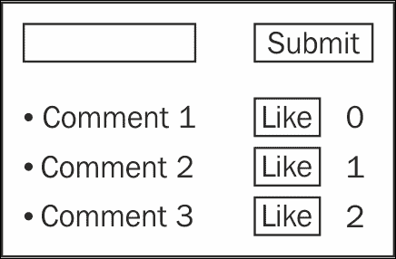
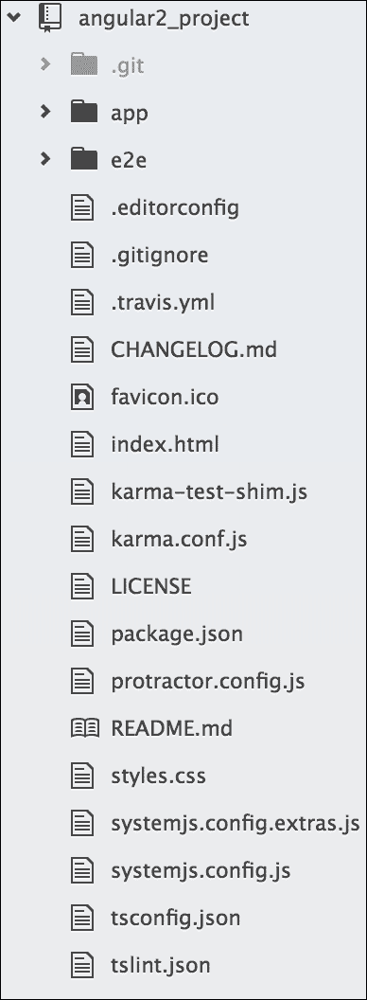
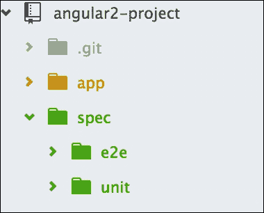
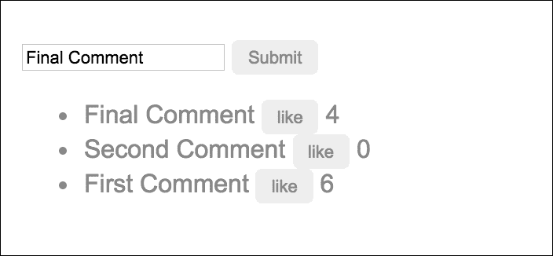

# 第六章。第一步

第一步总是最困难的。本章提供了一个使用组件、类和模型通过 TDD 构建 Angular 应用程序的初步介绍性概述。我们将能够开始 TDD 之旅，并看到基础原理的实际应用。到目前为止，这本书一直专注于 TDD 的基础和所需的工具。现在，我们将换挡，深入 Angular 的 TDD。

本章将是 TDD 的第一步。我们已经看到了如何安装 Karma 和 Protractor，以及一些小例子和如何应用它们的概述。在本章中，我们将专注于：

+   创建一个简单的评论应用程序

+   将 Karma 和 Protractor 集成到应用程序中

+   涵盖测试组件及其相关类

# 准备应用程序的规范

创建一个用于输入评论的应用程序。该应用程序的规范如下：

+   如果我在发表新评论时，点击 **提交** 按钮，评论应该被添加到评论列表中

+   对于评论，当我点击 **点赞** 按钮时，评论的点赞数应该增加

现在我们有了应用程序的规范，我们可以创建我们的开发待办事项列表。创建整个应用程序的待办事项列表并不容易。根据用户规范，我们有一个关于需要开发什么内容的想法。以下是 UI 的初步草图：



在跳入实现并思考我们将如何使用组件类、`*ngFor` 等之前，先忍住。忍住，忍住，忍住！虽然我们可以想象未来会如何开发，但直到我们深入研究代码，这永远是不清晰的，而且那正是我们将开始遇到麻烦的地方。TDD 及其原则就在这里帮助我们把思想和注意力放在正确的位置。

# 设置 Angular 项目

在前面的章节中，我们详细讨论了如何设置项目，查看涉及的不同组件，并走过了整个测试过程。我们将跳过这些细节，并在下一节提供一个列表，列出初始操作以设置项目并准备好单元测试和端到端测试的配置。

## 加载现有项目

我们将从 Angular 团队的示例中获取一个简单的 Angular 项目，并对其进行修改以适应我们的实现。

我们将从 Angular GitHub 仓库克隆 `quickstart` 项目，并从这个项目开始。除了 `node`/`npm` 之外，我们还应该全局安装 Git。

```js
$ git clone https://github.com/angular/quickstart.git 
    angular-project

```

这将把项目复制到本地，命名为 `angular-project`；这个项目可能包含一些额外的文件（它们可能会持续更新），但我们将努力保持我们的项目文件夹结构如下：



我们最初会保持简单，然后逐步添加我们需要的文件。这将使我们更有信心。

让我们继续进行并运行以下命令：

```js
$ cd angular-project
$ npm install

```

`npm install` 命令将安装项目根目录中 `package.json` 文件中定义的项目依赖所需的模块。

## 设置目录

在之前的示例中，我们只是为了保持简单，将组件、单元测试规范和端到端测试规范放在同一个文件夹中。对于更大的项目，将所有内容放在同一个文件夹中很难管理。

为了便于管理，我们将测试规范放在一个单独的文件夹中。在这里，我们的示例 `quickstart` 项目已经将测试规范放在了默认文件夹中，但我们将有一个新的结构，并将测试文件放在新的结构中。

让我们开始设置项目目录：

1.  导航到项目根目录：

    ```js
            cd angular-project

    ```

1.  初始化测试（`spec`）目录：

    ```js
            mkdir spec

    ```

1.  初始化 `unit` 测试目录：

    ```js
            mkdir spec/unit

    ```

1.  初始化端到端（`e2e`）测试目录：

    ```js
            mkdir spec/e2e

    ```

初始化完成后，我们的文件夹结构应该如下所示：



## 设置 Karma

关于 Karma 的详细信息可以在 第三章 *Karma 方式* 中找到。在这里，我们将主要查看 Karma 配置文件。

在这个 `quickstart` 项目中，我们已安装并配置了 Karma，并在项目目录中拥有 `karma.conf.js` 文件。

为了确认系统中已安装 Karma，让我们使用以下命令全局安装它：

```js
npm install -g karma

```

如前所述，我们已经在 `quickstart` 项目中配置了 Karma，作为项目的一部分，并在项目目录中拥有 `karma.conf.js` 文件。

现在，我们将查看一些每个人都应该知道的基本配置选项。在这个配置文件中，有一些高级选项，如测试报告和错误报告。我们将跳过这些，因为它们在这个初始阶段并不是很重要。

让我们更详细地了解一些我们将需要进一步进行的配置。

当我们在服务器中有项目的自定义路径时，应该更新 `basePath`。目前它是 `''`，因为这个项目是在根路径上运行的。下一个选项是 `frameworks`；默认情况下，我们在这里使用 `jasmine`，但如果我们想使用其他框架，如 `mocha`，我们可以更改框架名称。需要记住的一点是，如果我们计划使用不同的框架，我们必须添加相关的插件。

```js
    basePath: '', 
        frameworks: ['jasmine'], 

```

需要插件，因为 Karma 将使用这些 `npm` 模块来执行操作；例如，如果我们计划使用 PhantomJS 作为浏览器，我们需要将 `'karma-phantomjs-launcher'` 添加到列表中：

```js
    plugins: [ 
            'karma-jasmine', 
            'karma-chrome-launcher' 
    ] 

```

下一个最重要的选项是 `files[]`；通过这个选项，Karma 将包含所有测试所需的文件。它根据依赖关系加载文件。我们将所有所需的文件放在 `files[]` 数组中。

首先，我们将添加 `System.js`，因为我们在这个应用程序中使用 `systemjs` 作为模块加载器。然后，添加 `polyfills` 以支持所有浏览器的 shim，`zone.js` 以支持应用程序中的异步操作，RxJS 作为响应式库，Angular 库文件，Karma 测试的 shim，组件文件，最后是测试规范。列表中可能还有一些其他文件用于调试和报告；我们将跳过它们的解释。

这就是我们的 `files[]` 数组看起来像：

```js
    files: [
          // System.js for module loading
          'node_modules/systemjs/dist/system.src.js',

          // Polyfills
          'node_modules/core-js/client/shim.js',
          'node_modules/reflect-metadata/Reflect.js',

          // zone.js
          'node_modules/zone.js/dist/zone.js',
          'node_modules/zone.js/dist/long-stack-trace-zone.js',
          'node_modules/zone.js/dist/proxy.js',
          'node_modules/zone.js/dist/sync-test.js',
          'node_modules/zone.js/dist/jasmine-patch.js',
          'node_modules/zone.js/dist/async-test.js',
          'node_modules/zone.js/dist/fake-async-test.js',

          // RxJs
          { pattern: 'node_modules/rxjs/**/*.js', included: false, 
          watched: false },
          { pattern: 'node_modules/rxjs/**/*.js.map', included: 
          false, watched: false },

          // Paths loaded via module imports:
          // Angular itself
          { pattern: 'node_modules/@angular/**/*.js', included: 
          false, watched: false },
          { pattern: 'node_modules/@angular/**/*.js.map', included: 
          false, watched: false },

          { pattern: 'systemjs.config.js', included: false, watched: 
          false },
          { pattern: 'systemjs.config.extras.js', included: false, 
          watched: false },
          'karma-test-shim.js',

          // transpiled application & spec code paths loaded via 
          module imports
          { pattern: appBase + '**/*.js', included: false, watched: 
          true },
          { pattern: testBase + '**/*.spec.js', included: false, 
          watched: true },
],

```

目前我们只需要在 `karma.conf` 文件中了解这些。如果需要，我们将通过更新这些设置来继续。

让我们看一下完整的 `karma.conf.js` 文件：

```js
module.exports = function(config) {

  var appBase    = 'app/';       // transpiled app JS and map files
  var appSrcBase = 'app/';       // app source TS files
  var appAssets  = 'base/app/'; // component assets fetched by 
  Angular's compiler

  var testBase    = 'spec/unit/';       // transpiled test JS and map 
  files
  var testSrcBase = 'spec/unit/';       // test source TS files

  config.set({
    basePath: '',
    frameworks: ['jasmine'],
    plugins: [
      require('karma-jasmine'),
      require('karma-chrome-launcher'),
      require('karma-jasmine-html-reporter'), // click "Debug" in 
      browser to see it
      require('karma-htmlfile-reporter') // crashing w/ strange 
      socket error
    ],

    customLaunchers: {
      // From the CLI. Not used here but interesting
      // chrome setup for travis CI using chromium
      Chrome_travis_ci: {
        base: 'Chrome',
        flags: ['--no-sandbox']
      }
    },
    files: [
      // System.js for module loading
      'node_modules/systemjs/dist/system.src.js',

      // Polyfills
      'node_modules/core-js/client/shim.js',
      'node_modules/reflect-metadata/Reflect.js',

      // zone.js
      'node_modules/zone.js/dist/zone.js',
      'node_modules/zone.js/dist/long-stack-trace-zone.js',
      'node_modules/zone.js/dist/proxy.js',
      'node_modules/zone.js/dist/sync-test.js',
      'node_modules/zone.js/dist/jasmine-patch.js',
      'node_modules/zone.js/dist/async-test.js',
      'node_modules/zone.js/dist/fake-async-test.js',

      // RxJs
      { pattern: 'node_modules/rxjs/**/*.js', included: false, 
      watched: false },
      { pattern: 'node_modules/rxjs/**/*.js.map', included: false, 
      watched: false },

      // Paths loaded via module imports:
      // Angular itself
      { pattern: 'node_modules/@angular/**/*.js', included: false, 
      watched: false },
      { pattern: 'node_modules/@angular/**/*.js.map', included: 
      false, watched: false },

      { pattern: 'systemjs.config.js', included: false, watched: 
      false },
      { pattern: 'systemjs.config.extras.js', included: false, 
      watched: false },
      'karma-test-shim.js',

      // transpiled application & spec code paths loaded via module 
      imports
      { pattern: appBase + '**/*.js', included: false, watched: true 
      },
      { pattern: testBase + '**/*.spec.js', included: false, watched: 
      true },

      // Asset (HTML & CSS) paths loaded via Angular's component 
      compiler
      // (these paths need to be rewritten, see proxies section)
      { pattern: appBase + '**/*.html', included: false, watched: true 
      },
      { pattern: appBase + '**/*.css', included: false, watched: true 
      },

      // Paths for debugging with source maps in dev tools
      { pattern: appSrcBase + '**/*.ts', included: false, watched: 
      false },
      { pattern: appBase + '**/*.js.map', included: false, watched: 
      false },
      { pattern: testSrcBase + '**/*.ts', included: false, watched: 
      false },
      { pattern: testBase + '**/*.js.map', included: false, watched: 
      false }
    ],

    // Proxied base paths for loading assets
     proxies: {
       // required for component assets fetched by Angular's compiler
       "/app/": appAssets
   },

    exclude: [],
    preprocessors: {},
    // disabled HtmlReporter; suddenly crashing w/ strange socket 
    error
    reporters: ['progress', 'kjhtml'],//'html'],

    // HtmlReporter configuration
    htmlReporter: {
      // Open this file to see results in browser
      outputFile: '_test-output/tests.html',

      // Optional
      pageTitle: 'Unit Tests',
      subPageTitle: __dirname
    },

    port: 9876,
    colors: true,
    logLevel: config.LOG_INFO,
    autoWatch: true,
    browsers: ['Chrome'],
    singleRun: true
  })
};

```

## 测试目录已更新

我们在第三章中看到了 `karma-test-shim.js` 的详细内容，*Karma 方式*。这是通过 Karma 运行单元测试所需的。 

我们已更改测试规范目录/位置，并基于项目的默认结构配置了 `karma-test-shim.js`。因为我们已经将测试移动到不同的位置并移出了 `app/` 文件夹，所以我们需要相应地更新 `karma-test-shim.js`。

这里是需要进行的更改：

```js
    var builtPath = '/base/'; 

```

## 设置 Protractor

在第四章中，我们讨论了 Protractor 的完整安装和设置。这个示例应用程序已经安装并配置了 Protractor。因此，我们只需查看 `protractor.conf.js` 文件。

这个配置的 Protractor 实例实现了测试报告。我们将跳过配置文件中的这些部分，只查看常见的设置选项。

在我们进入配置文件概述之前，为了确保，我们将在系统上全局安装 Protractor：

```js
$ npm install -g protractor

```

更新 Selenium WebDriver：

```js
$ webdriver-manager update

```

我们必须确保 Selenium 已安装。

如预期的那样，`protractor.conf.js` 文件位于应用程序的根目录。以下是 `protractor.conf.js` 文件的完整配置：

```js
var fs = require('fs'); 
var path = require('canonical-path'); 
var _ = require('lodash'); 

exports.config = { 
  directConnect: true, 

  // Capabilities to be passed to the webdriver instance. 
  capabilities: { 
    'browserName': 'chrome' 
  }, 

  // Framework to use. Jasmine is recommended. 
  framework: 'jasmine', 

  // Spec patterns are relative to this config file 
  specs: ['**/*e2e-spec.js' ], 

  // For angular tests 
  useAllAngular2AppRoots: true, 

  // Base URL for application server 
  baseUrl: 'http://localhost:8080', 

  // doesn't seem to work. 
  // resultJsonOutputFile: "foo.json", 

  onPrepare: function() { 
    //// SpecReporter 
    //var SpecReporter = require('jasmine-spec-reporter'); 
    //jasmine.getEnv().addReporter(new 
    SpecReporter({displayStacktrace: 'none'}));  
    //// jasmine.getEnv().addReporter(new SpecReporter({
    displayStacktrace: 'all'})); 

    // debugging 
    // console.log('browser.params:' +    
    JSON.stringify(browser.params)); 
    jasmine.getEnv().addReporter(new Reporter( browser.params )) ; 

    // Allow changing bootstrap mode to NG1 for upgrade tests 
    global.setProtractorToNg1Mode = function() { 
      browser.useAllAngular2AppRoots = false; 
      browser.rootEl = 'body'; 
    }; 
  }, 

  jasmineNodeOpts: { 
    // defaultTimeoutInterval: 60000, 
    defaultTimeoutInterval: 10000, 
    showTiming: true, 
    print: function() {} 
  } 
};  

```

# 自顶向下与自底向上方法 - 我们使用哪一个？

从开发的角度来看，我们必须确定从哪里开始。本书中我们将讨论的方法如下：

+   **自底向上的方法**：采用这种方法，我们考虑我们需要的不同组件（类、服务、模块等），然后选择最合理的一个并开始编码。

+   **自顶向下的方法**：采用这种方法，我们从用户场景和 UI 开始工作。然后，我们围绕应用程序中的组件创建应用程序。

这两种方法都有优点，选择可以基于你的团队、现有组件、需求等。在大多数情况下，最好根据最小阻力原则来做出选择。

在本章中，规范的采用自顶向下的方法；从用户场景开始，所有内容都为你准备好了，这将允许你围绕 UI 有机地构建应用程序。

# 测试组件

在深入到规格和即将交付的功能的心态之前，了解测试组件类的基本原理非常重要。在 Angular 中，组件是一个在大多数应用程序中使用的核心功能。

## 准备出发

我们的示例应用程序（`quickstart`）有一些非常基本的单元和端到端测试规格。我们将从开始就采用 TDD 方法，因此我们不会在我们的实现中使用任何测试规格和现有组件的代码。

为了做到这一点，我们可以清理这个示例应用程序，我们只保留文件夹结构和应用程序引导文件。

因此，首先，我们必须删除单元测试文件（`app.component.spec.ts`）和端到端测试文件（`app.e2e-spec.ts`）。这是应用程序结构中存在的两个测试规格。

## 设置简单的组件测试

当测试组件时，将组件注入测试套件并作为第二项任务初始化组件类非常重要。测试确认组件范围内的对象或方法是否按预期可用。

要在测试套件中拥有组件实例，我们将在测试套件中使用简单的`import`语句，并在`beforeEach`方法中初始化组件对象，这样我们就可以为每个测试规格创建一个新的组件对象。以下是一个示例，展示这将如何看起来：

```js
import { async, ComponentFixture, TestBed } from '@angular/core/testing'; 

import {AppComponent} from "../../app.component"; 

describe('AppComponent Tests Suite', () => { 

  let comp: AppComponent; 
  let fixture: ComponentFixture<AppComponent>; 

  beforeEach(async(() => { 
   TestBed.configureTestingModule({ 
      declarations: [ AppComponent ] 
    }) 
    .compileComponents(); 
  })); 

  beforeEach(() => { 
    fixture = TestBed.createComponent(AppComponent); 
    comp = fixture.componentInstance; 

  }); 
}); 

```

因此，只要为每个测试规格初始化组件类，它将为每个规格提供一个新实例，内部作用域将根据这一点进行操作。

## 初始化组件

要测试一个组件，初始化组件类非常重要，这样我们就可以在测试套件的范围内获得组件对象，并且该对象的全部成员在特定的测试套件中都是可用的。

只要组件包含用于渲染 UI 的模板，在开始端到端测试之前初始化组件非常重要，并且它依赖于 DOM 元素。

因此，当我们计划对任何组件进行端到端测试时，我们应该在 DOM 中初始化它，如下所示：

```js
<body> 
  <my-app></my-app> 
</body> 

```

## 组件的端到端测试与单元测试的比较

在前面的示例中，我们查看的是组件测试套件，它是用于单元测试的，我们必须导入并创建组件类的实例作为单元测试。我们将测试组件中定义的每个方法的函数或特性。

另一方面，对于端到端测试，我们不需要导入或创建组件类的实例，因为我们不需要与组件对象或其所有成员进行注释。相反，它需要与应用程序运行页面的 DOM 元素交互。

因此，我们需要运行应用程序并导航测试套件到应用程序的着陆页，我们可以使用 Protractor 本身提供的全局`browser`对象来完成这一点。

下面是一个示例，展示它应该看起来像什么：

```js
import { browser, element, by } from 'protractor'; 

describe('Test suite for e2e test', () => { 
    beforeEach(() => { 
        browser.get(''); 
    }); 
}); 

```

我们可以使用`browser.get('path')`按需导航到应用程序的所有 URL。

# 深入我们的评论应用程序

现在设置和方案已经确定，我们可以开始我们的第一个测试。从测试的角度来看，因为我们将会使用自顶向下的方法，我们将首先编写 Protractor 测试，然后构建应用程序。我们将遵循我们已经审查过的相同 TDD 生命周期：先测试，然后运行，最后改进。

## 先测试

给定的场景已经以良好的格式指定，并且适合我们的 Protractor 测试模板：

```js
describe('', () => { 
    describe('', () => { 
     beforeEach(() => { 
     }); 

      it('', () => { 
      }); 
    }); 
}); 

```

将场景放入模板中，我们得到以下代码：

```js
describe('Given I am posting a new comment', () => { 
    describe('When I push the submit button', () => { 
        beforeEach(() => { 
            // ...  
        }); 

        it('Should then add the comment', () => { 
            // ... 
        }); 
    }); 
}); 

```

按照三个 A（组装、行动、断言），我们将用户场景适配到模板中。

### 组装

浏览器需要指向应用程序的第一页。因为基本 URL 已经定义，我们可以在测试中添加以下内容：

```js
beforeEach(() => { 
    browser.get(''); 
}); 

```

现在测试已经准备就绪，我们可以进行下一步：行动。

### 行动

根据用户规格，下一步我们需要做的是添加一个实际的评论。最简单的方法是将一些文本放入输入框中。对于这个测试，同样不知道元素将被命名为什么或它将做什么，我们可以根据它应该是什么来编写它。

这是为应用程序添加评论部分的代码：

```js
beforeEach(() => { 
    ... 
    var commentInput = element(by.css('input')); 
    commentInput.sendKeys('a sample comment'); 
}); 

```

最后一个组装组件，作为测试的一部分，是点击**提交**按钮。这可以通过 Protractor 中的`click`函数轻松实现。即使我们没有页面，或者任何属性，我们仍然可以命名将要创建的按钮：

```js
beforeEach(() => { 
    ... 
    var submitButton = element(by.buttonText('Submit')).click(); 
}); 

```

最后，我们将触及测试的核心，并断言用户的期望。

### 断言

用户期望的是，一旦点击**提交**按钮，评论就会被添加。这有点模糊，但我们可以确定用户需要以某种方式被告知评论已被添加。

最简单的方法是在页面上显示所有评论。在 Angular 中，最简单的方法是添加一个显示所有评论的`*ngFor`对象。为了测试这一点，我们将添加以下内容：

```js
it('Should then add the comment', () => { 
    var comment = element.all(by.css('li')).first(); 
    expect(comment.getText()).toBe('a sample comment'); 
}); 

```

现在测试已经构建并符合用户规格。它既小又简洁。以下是完成后的测试：

```js
describe('Given I am posting a new comment', () => { 
    describe('When I push the submit button', () => { 
      beforeEach(() => { 
            //Assemble 
            browser.get(''); 
            var commentInput = element(by.css('input')); 
            commentInput.sendKeys('a sample comment'); 

            //Act 
            var submitButton =  element(by.buttonText
            ('Submit')).click(); 
      }); 

       //Assert 
  it('Should then add the comment', () => { 
            var comment = element.all(by.css('li')).first(); 
            expect(comment.getText()).toBe('a sample comment'); 
  }); 
    }); 
}); 

```

## 让它运行

根据错误和测试输出，我们将逐步构建我们的应用程序。

使用以下命令启动网络服务器：

```js
$ npm start

```

运行 Protractor 测试以查看第一个错误：

```js
$ protractor

```

或者，我们可以运行以下命令：

```js
$ npm run e2e // run via npm 

```

我们可能遇到的第一个错误是它没有获取定位器期望的元素：

```js
$ Error: Failed: No element found using locator: 
    By(css selector, input)

```

错误的原因很简单：它没有获取定位器中定义的元素。我们可以看到当前应用程序以及为什么它没有获取到元素。

### 回顾当前应用程序

只要我们将样本 Angular `quickstart`项目克隆为我们测试的应用程序，它就有一个现成的 Angular 环境。它使用定义了`My First Angular 2 App`作为输出的简单应用程序组件引导 Angular 项目。

因此，在我们的 TDD 方法中，我们不应该有任何环境/Angular 引导相关的错误，而且看起来我们正在正确的道路上。

让我们看看我们现在在示例应用程序中的情况。在我们的着陆页`index.html`中，我们已经包含了所有必需的库文件并实现了`system.js`来加载应用程序文件。

在`index.html`文件中的`<body>`标签中，我们如下启动了应用程序：

```js
<body> 
    <my-app>Loading...</my-app> 
</body> 

```

HTML 标签期望一个具有`my-app`作为选择器的组件，是的，我们有一个作为`app.component.ts`，如下所示：

```js
import {Component} from '@angular/core'; 
@Component({ 
    selector: 'my-app', 
    template: '<h1>My First Angular 2 App</h1>' 
}) 
export class AppComponent { } 

```

Angular 引入了`ngModule`作为`appModule`来模块化和管理每个组件的依赖关系。使用这个`appModule`，一个应用程序可以一目了然地定义所有必需的依赖关系。除此之外，它还帮助懒加载模块。我们将在 Angular 文档中查看`ngModule`的详细信息。

它导入了应用程序中所有必需的模块，从单个入口点声明所有模块，并定义了引导组件。

应用程序始终根据此文件的配置引导。

该文件位于应用程序根目录下的`app.module.ts`，如下所示：

```js
import { NgModule }      from '@angular/core'; 
import { BrowserModule } from '@angular/platform-browser'; 

import { AppComponent }  from './app.component'; 

@NgModule({ 
  imports:      [ BrowserModule], 
  declarations: [ AppComponent ], 
  bootstrap:    [ AppComponent ] 
}) 
export class AppModule { } 

```

应用程序的入口点是`main.ts`文件，它将导入`appModule`文件并指示根据该文件引导应用程序：

```js
import { platformBrowserDynamic } from '@angular/platform
-browser-dynamic'; 

import { AppModule } from './app.module'; 

platformBrowserDynamic().bootstrapModule(AppModule); 

```

测试找不到我们的输入定位器。我们需要将输入添加到页面上，并且我们需要通过组件的模板来完成。

### 添加输入

我们需要遵循以下步骤将输入添加到页面上：

1.  我们将不得不向应用程序组件的模板中添加一个简单的`input`标签，如下所示：

    ```js
            template: ` 
            <input type='text' />` 

    ```

1.  再次运行测试后，似乎没有更多与输入定位器相关的错误，但有一个新的错误，因为`button`标签缺失：

    ```js
            $ Error: Failed: No element found using locator: 
            by.buttonText('Submit')

    ```

1.  就像之前的错误一样，我们需要在模板中添加一个带有适当文本的`button`：

    ```js
            template: ` ...........  
            <button type='button'>Submit</button>` 

    ```

1.  再次运行测试后，似乎没有更多与`button`定位器相关的错误，但再次出现新的错误，因为重复器定位器缺失：

    ```js
            $ Error: Failed: No element found using locator: By
            (css selector, li)

    ```

这似乎是我们假设提交的评论将通过`*ngFor`在页面上可用。为了将此添加到页面上，我们将使用组件类中的方法来提供重复器的数据。

### 组件

如前所述，错误发生是因为没有`comments`对象。为了添加`comments`对象，我们将使用在其作用域中有一个`comments`数组组件类。

执行以下步骤以将`comments`对象添加到作用域：

1.  由于我们已经在组件中有一个`AppComponent`类，我们需要定义评论数组，我们可以使用它在一个重复器中：

    ```js
            export class AppComponent { 
                comments:Array<string>; 
            } 

    ```

1.  然后，我们将在模板中添加一个用于评论的重复器，如下所示：

    ```js
            template: `..........  
                <ul> 
                  <li *ngFor="let comment of comments">{{comment}}</li> 
                </ul>` 

    ```

1.  让我们运行 Protractor 测试，看看我们现在在哪里：

    ```js
            $   Error: Failed: No element found using locator: By(css
            selector, li)

    ```

哎呀！我们还在得到相同的错误。然而，别担心；可能还有其他问题。

让我们看看实际渲染的页面，看看发生了什么。在 Chrome 中，导航到`http://localhost:3000`并打开控制台以查看页面源代码（*Ctrl + Shift + J*）。注意，重复器和组件都在那里；然而，重复器被注释掉了。由于 Protractor 只查看可见元素，它不会找到列表。

太好了！现在我们知道为什么重复列表不可见，但我们必须修复它。为了让注释显示出来，它必须存在于组件的`comments`作用域中。

最小的更改是向数组添加一些内容以初始化它，如下面的代码片段所示：

```js
export class AppComponent { 
    comments:Array<string>; 
    constructor() { 
        this.comments = ['First comment', 'Second comment',
        'Third comment']; 
    } 
}; 

```

现在，如果我们运行测试，我们会得到以下输出：

```js
$ Expected 'First comment' to be 'a sample comment'.

```

太好了，看起来我们越来越接近了，错误已经减少！我们几乎解决了所有意外错误，并达到了我们的预期。

因此，让我们看看我们迄今为止所做的更改以及我们的代码看起来像什么。

这是`index.html`文件的`body`标签：

```js
<body> 
    <my-app>Loading...</my-app> 
</body> 

```

应用组件文件如下：

```js
import {Component} from '@angular/core'; 

@Component({ 
    selector: 'my-app', 
    template: `<h1>My First Angular 2 App</h1> 
    <input type='text' /> 
    <button type='button'>Submit</button> 
    <ul> 
      <li *ngFor="let comment of comments">{{comment}}</li> 
    </ul>` 
}) 
export class AppComponent { 
    comments:Array<string>; 

    constructor() { 
        this.comments = ['First comment', 'Second comment', 
        'Third comment']; 
    } 
} 

```

## 使其通过

使用 TDD，我们希望添加最小的组件来使测试通过。

由于我们目前将注释数组硬编码为初始化为三个项目，第一个项目为`First comment`，将`First comment`更改为`一个示例注释`；这应该会使测试通过。

这是使测试通过的代码：

```js
export class AppComponent { 
    comments:Array<string>; 
    constructor() { 
        this.comments = ['a sample comment', 'Second comment', 
        'Third comment']; 
    } 
}; 

```

运行测试，然后！我们得到了一个通过测试：

```js
$ 1 test, 1 assertion, 0 failures

```

等一下！我们还有一些工作要做。虽然我们通过了测试，但这还没有完成。我们只是添加了一些黑客手段来让它通过。有两件事很突出：

+   我们点击了**提交**按钮，但实际上它没有任何功能

+   我们硬编码了注释预期值的初始化

上述更改是我们需要在我们继续前进之前执行的临界步骤。它们将在 TDD 生命周期的下一阶段解决，即改进（重构）。

## 改进

需要重做的两个组件如下：

+   为**提交**按钮添加行为

+   移除注释的硬编码值

### 实现提交按钮

**提交**按钮实际上需要做一些事情。我们通过仅硬编码值来规避了实现。使用我们经过验证和可靠的 TDD 技术，转向关注单元测试的方法。到目前为止，重点一直在于 UI 和向代码中推送更改；我们还没有编写任何单元测试。

对于接下来的工作，我们将转换方向，专注于通过测试驱动开发**提交**按钮。我们将遵循 TDD 生命周期（先测试，然后运行，最后改进）。

#### 配置 Karma

我们在第三章的待办事项列表应用程序中做了类似的事情，*因果之道*。我们不会花太多时间深入代码，所以请回顾前面的章节，以深入了解一些属性。

我们需要遵循以下步骤来配置 Karma：

1.  更新`files`部分以包含添加的文件：

    ```js
            files: [ 
                ... 
                // Application files 
                {pattern: 'app/**/*.js', included: false, watched: 
                true} 

                // Unit Test spec files 
                {pattern: 'spec/unit/**/*.spec.js', included: false,
                watched: true} 
                ... 
            ], 

    ```

1.  启动 Karma：

    ```js
            $ karma start

    ```

1.  确认 Karma 正在运行：

    ```js
            $ Chrome 50.0.2661 (Mac OS X 10.10.5): Executed 0 of 0 
            SUCCESS (0.003 secs / 0 secs)

    ```

#### 先进行测试

让我们从`spec/unit`文件夹中的新文件开始，命名为`app.component.spec.ts`。这将包含单元测试的测试规范。我们将使用基础模板，包括所有必要的导入，如`TestBed`：

```js
    describe('', () => { 
     beforeEach(() => { 
     }); 

      it('', () => { 
      }); 
    }); 

```

根据规范，当点击**提交**按钮时，需要添加一个注释。我们需要填写测试的三个组成部分的空白（组装、行动和断言）。

**组装**

该行为需要成为组件的一部分，以便前端可以使用它。在这种情况下，测试的对象是组件的作用域。我们需要将此添加到本测试的组装中。像我们在第三章中做的那样，*Karma 之道*，我们将在以下代码中做同样的事情：

```js
import {AppComponent} from "../../app/app.component"; 

describe('AppComponent Unit Test', () => { 
    let comp: AppComponent; 
    let fixture: ComponentFixture<AppComponent>; 

    beforeEach(() => { fixture = TestBed.create
    Component(AppComponent); 
      comp = fixture.componentInstance; 

    }); 
}); 

```

现在，组件对象及其成员在测试套件中可用，并将按预期可测试。

**行动**

规范确定我们需要在组件对象中调用一个`add`方法。向测试的`beforeEach`部分添加以下代码：

```js
beforeEach(() => { comp.add('a sample comment'); 
}); 

```

现在，断言应该获取第一个注释进行测试。

**断言**

断言`component`对象中的注释项现在包含任何注释作为第一个元素。向测试中添加以下代码：

```js
it('',function(){ 
  expect(com.comments[0]).toBe('a sample comment'); 
}); 

```

保存文件，让我们继续到生命周期中的下一个步骤，让它运行（执行）。

#### 让它运行

现在我们已经准备好了测试，我们需要让测试通过。查看 Karma 运行的控制台输出，我们看到以下内容：

```js
$ TypeError: com.add is not a function

```

查看我们的单元测试，我们看到这是`add`函数。让我们继续按照以下步骤在控制器的`scope`对象中添加一个`add`函数：

1.  打开控制器作用域并创建一个名为`add`的函数：

    ```js
            export class AppComponent { 
                ............. 
                add() { 
                // .... 
                } 
            } 

    ```

1.  检查 Karma 的输出，看看我们现在在哪里：

    ```js
            $ Expected 'First comment' to be 'a sample comment'.

    ```

1.  现在，我们已经达到了预期。记得考虑最小的改动以使其工作。修改`add`函数，在调用时将`$scope.comments`数组设置为任何注释：

    ```js
            export class AppComponent { 
                ............. 
                add() { 
                    this.comments.unshift('a sample comment'); 
                } 
            }; 

    ```

    ### 注意

    `unshift`函数是一个标准的 JavaScript 函数，它将一个项目添加到数组的开头。

当我们检查 Karma 的输出时，我们会看到以下内容：

```js
$ Chrome 50.0.2661 (Mac OS X 10.10.5): Executed 1 of 1 
    SUCCESS (0.008 secs / 0.002 secs)

```

成功！测试通过了，但仍然需要一些工作。让我们继续到下一个阶段，让它变得更好（重构）。

#### 让它变得更好

需要重构的主要点是`add`函数。它不接受任何参数！这应该很容易添加，并且只是确认测试仍然运行。更新`app.component.ts`中的`add`函数，使其接受一个参数并使用该参数将内容添加到`comments`数组中：

```js
export class AppComponent { 
    ............. 
    add(comment) { 
        this.comments.unshift(comment); 
    } 
}; 

```

检查 Karma 的输出窗口，确保测试仍然通过。完整的单元测试如下所示：

```js
import {AppComponent} from "../../app/app.component"; 

describe('AppComponent Tests', () => { 
    let comp: AppComponent; 
    let fixture: ComponentFixture<AppComponent>; 

    beforeEach(() => { 
        fixture = TestBed.createComponent(AppComponent); 
        comp = fixture.componentInstance;         
        comp.add('a sample comment'); 
    }); 

    it('First item inthe item should match', () => { 
        expect(com.comments[0]).toBe('a sample comment'); 
    }); 
}); 

```

`AppComponent`类文件现在看起来是这样的：

```js
import {Component} from '@angular/core'; 

@Component({ 
    selector: 'my-app', 
    template: `<h1>My First Angular 2 App</h1> 
    <input type='text' /> 
    <button type='button'>Submit</button> 
    <ul> 
      <li *ngFor="let comment of comments">{{comment}}</li> 
    </ul>` 
}) 
export class AppComponent { 
    comments:Array<string>; 

    constructor() { 
        this.comments = ['First comment', 'Second comment', 
        'Third comment']; 
    } 
    add(comment) { 
        this.comments.unshift(comment); 
    } 
} 

```

### 备份测试链

我们完成了单元测试并添加了 `add` 函数。现在我们可以添加函数来指定**提交**按钮的行为。将 `add` 方法链接到按钮的方式是使用 `(click)` 事件。将行为添加到**提交**按钮的步骤如下：

1.  打开 `app.component.ts` 文件并按以下方式更新：

    ```js
            @Component({ 
               template: `....... 
                <button type="button" (click)="add('a sample      
                comment')">Submit</button> 
                ...........` 
            }) 

    ```

    等一下！这个值是硬编码的吗？嗯，再次，我们想要做出最小的改变并确保测试仍然通过。我们将通过我们的重构直到代码达到我们想要的样子，但不是采用大爆炸方法，我们想要做出小的、渐进的改变。

1.  现在，让我们重新运行 Protractor 测试并确保它仍然通过。输出显示它通过了，我们没问题。硬编码的值没有被从注释中移除。让我们现在就移除它。

1.  `AppComponent` 类文件现在应该看起来如下：

    ```js
            constructor() { 
                this.comments = []; 
            } 

    ```

1.  运行测试并查看我们是否仍然得到一个通过测试。

我们最后需要清理的是 `(click)` 中的硬编码值。被添加的注释应该由注释输入文本中的输入决定。

## 绑定输入

这里是我们需要遵循的步骤来绑定输入：

1.  为了能够将输入绑定到有意义的东西，向 `input` 标签添加一个 `ngModel` 属性：

    ```js
            @Component({ 
                template: `............. 
                <input type="text" [(ngModel)]="newComment"> 
                ...........` 
            }) 

    ```

1.  然后，在 `(click)` 属性中，简单地使用 `newComment` 模型作为输入：

    ```js
            @Component({ 
               template: `....... 
                <button type="button" (click)="add(newComment)">
                Submit</button> 
                ...........` 
            }) 

    ```

1.  我们将不得不在应用模块 (`app.module.ts`) 中导入表单模块，因为它是 `ngModel` 的依赖项：

    ```js
            import { FormsModule }   from '@angular/forms'; 
            @NgModule({ 
            imports: [ BrowserModule, FormsModule ], 
            }) 

    ```

1.  运行 Protractor 测试并确认一切通过并且可以继续。

# 向上走

现在我们已经让第一个规范工作，并且它是端到端和单元测试的，我们可以开始下一个规范。下一个规范表明用户想要点赞评论的能力。

我们将使用自顶向下的方法，并从 Protractor 开始我们的测试。我们将继续遵循 TDD 生命周期：先测试，然后运行，然后改进。

## 先测试

按照模式，我们将从一个基本的 Protractor 测试模板开始：

```js
describe('', () => { 
     beforeEach(() => { 
     }); 

      it('', () => { 
      }); 
    }); 

```

当我们填写规范时，我们得到以下内容：

```js
describe('When I like a comment', () => { 
    beforeEach(() => { 
    }); 

    it('should then be liked', () => { 
      }); 
}); 

```

在模板就位后，我们准备好构建测试。

### 组装

这个测试的组装需要存在一个注释。将注释放置在现有的已发布注释测试中。它应该看起来像这样：

```js
describe(''Given I am posting a new comment', () => { 
    describe('When I like a comment', () => { 
    ... 
    }); 
}); 

```

### 行动

我们测试的用户规范是**点赞**按钮对特定评论执行一个动作。以下是执行这些步骤所需的步骤和代码（注意以下步骤将添加到 `beforeEach` 文本中）：

1.  存储第一个评论以便在测试中使用：

    ```js
            var firstComment = null; 
            beforeEach(() => { 
                ... 
            } 

    ```

1.  找到第一个评论的 `likeButton`：

    ```js
            var firstComment = element.all(by.css('li').first(); 
            var likeButton = firstComment.element(by.buttonText('like')); 

    ```

1.  当点击**点赞**按钮时的代码如下：

    ```js
            likeButton.click(); 

    ```

### 断言

规范期望是，一旦注释被点赞，它就被点赞了。这最好通过放置点赞数量的指示器并确保计数为 `1` 来完成。代码将如下所示：

```js
it('Should increase the number of likes to one', () => { 
var commentLikes = firstComment.element(by.binding('likes')); 
  expect(commentLikes.getText()).toBe(1); 
}); 

```

创建的测试现在看起来如下：

```js
describe('When I like a comment', () => { 
    var firstComment = null; 
    beforeEach(() => { 

      //Assemble 
      firstComment = element.all(by.css('li').first(); 
      var likeButton = firstComment.element(by.buttonText('like')); 

      //Act 
      likeButton.click(); 
  }); 

  //Assert 
  it('Should increase the number of likes to one', () => { 
      var commentLikes = firstComment.element(by.css('#likes')); 
      expect(commentLikes.getText()).toBe(1); 
  }); 
}); 

```

## 让它运行

测试已经准备就绪，迫不及待地想要运行。我们现在将运行它，并修复代码直到测试通过。以下步骤将详细说明错误和修复循环，以使测试路径通过：

1.  运行 Protractor。

1.  在命令行中查看错误信息：

    ```js
    $ Error: No element found using locator: by.buttonText("like")

    ```

1.  正如错误信息所述，没有 **点赞** 按钮。请继续添加该按钮：

    ```js
            @Component({ 
                  template: `........ 
                  <ul> 
                  <li *ngFor="let comment of comments"> 
                  {{comment}} 
                <button type="button">like</button> 
                  </li> 
                  </ul>` 
              }); 

    ```

1.  运行 Protractor。

1.  查看下一个错误信息：

    ```js
    $ Expected 'a sample comment like' to be 'a sample comment'.

    ```

1.  通过添加 **点赞** 按钮，我们导致其他测试失败。原因是我们的 `getText()` 方法使用不当。Protractor 的 `getText()` 方法获取内部文本，包括内部元素。

1.  为了修复这个问题，我们需要更新之前的测试以包括 **点赞** 作为测试的一部分：

    ```js
            it('Should then add the comment', () => { 
              var comments = element.all(by.css('li')).first(); 
              expect(comments.getText()).toBe('a sample comment like'); 
            }); 

    ```

1.  运行 Protractor。

1.  查看下一个错误信息：

    ```js
    $ Error: No element found using locator: by.css("#likes")

    ```

1.  是时候添加一个 `likes` 绑定了。这个稍微复杂一些。`likes` 需要绑定到一个评论上。我们需要更改组件中保存评论的方式。评论需要保存 `comment` 标题和点赞数。一个评论应该是一个像这样的对象：

    ```js
            {title:'',likes:0} 

    ```

1.  再次强调，这一步的重点只是确保测试通过。下一步是更新组件的 `add` 函数，以便根据我们在前几步中描述的对象创建评论。

1.  打开 `app.component.ts` 并编辑 `add` 函数，如下所示：

    ```js
            export class AppComponent { 
                ...... 
                  add(comment) { 
                      var commentObj = {title: comment, likes: 0}; 
                      this.comments.unshift(commentObj); 
                  } 
            } 

    ```

1.  更新页面以使用评论的值：

    ```js
            @Component({ 
                template: `........... 
                <ul> 
                  <li *ngFor="let comment of comments"> 
              {{comment.title}} 
                </li> 
                </ul>` 
            }) 

    ```

1.  在重新运行 Protractor 测试之前，我们需要将新的 `comment.likes` 绑定添加到 HTML 页面：

    ```js
            @Component({ 
                template: `........... 
                <ul> 
                  <li *ngFor="let comment of comments"> 
              {{comment.title}} 
              ............. 
              <span id="likes">{{comment.likes}}</span> 
                  </li> 
              </ul>` 
            }) 

    ```

1.  现在重新运行 Protractor 测试，看看错误在哪里：

    ```js
    $ Expected 'a sample comment like 0' to be 'a sample
            comment like'

    ```

1.  由于评论的内部文本已更改，我们需要更改测试的预期：

    ```js
            it('Should then add the comment',() => { 
            ... 
              expect(comments.getText()).toBe('a sample comment like 0'); 
            }); 

    ```

1.  运行 Protractor：

    ```js
    $ Expected '0' to be '1'.

    ```

1.  最后，我们来到了测试的预期。为了使这个测试通过，最小的更改将是使 **点赞** 按钮更新 `comment` 数组上的点赞数。第一步是在控制器中添加一个 `like` 方法，该方法将更新点赞数：

    ```js
            export class AppComponent { 
                ...... 
                  like(comment) { 
                      comment.like++; 
                  } 
            } 

    ```

1.  使用按钮上的 `(click)` 属性将 `like` 方法链接到 HTML 页面，如下所示：

    ```js
            @Component({ 
                  template: `........ 
                  <ul> 
                  <li *ngFor="let comment of comments"> 
                  {{comment}} 
                <button type="button" (click)="like(comment)">
                like</button> 
            <span id="likes">{{comment.likes}}</span> 
                  </li> 
                  </ul>` 
              }); 

    ```

1.  运行 Protractor 并确认测试通过！

页面现在看起来如下截图所示：



与本章开头的图示相比，所有功能都已创建。现在我们已经使用 Protractor 使测试通过，我们需要检查单元测试以确保我们的更改没有破坏它们。

### 修复单元测试

所需的主要更改之一是将评论变成一个包含值和点赞数的对象。在过多地考虑单元测试可能受到影响之前，让我们启动它们。执行以下命令：

```js
$ karma start

```

如预期的那样，错误与新的 `comment` 对象有关：

```js
$ Expected { value : 'a sample comment', likes : 0 } to be 
    'a sample comment'.

```

检查预期，似乎唯一需要的是在预期中使用 `comment.value`，而不是 `comment` 对象本身。按照以下方式更改预期：

```js
it('',() => { 
    var firstComment = app.comments[0]; 
    expect(firstComment.title).toBe('a sample comment'); 
}) 

```

保存文件并检查 Karma 输出。确认测试通过。Karma 和 Protractor 测试都通过了，我们已经完成了添加评论和点赞的主要用户行为。现在我们可以自由地继续下一步并使事情变得更好。

## 让它变得更好

总的来说，这种方法最终达到了我们想要的结果。用户现在能够在 UI 中点赞评论并看到点赞数。从重构的角度来看，主要的事情是我们没有对 `like` 方法进行单元测试。

回顾我们的开发待办事项列表，我们看到列表是我们写下的一项操作。在完全完成功能之前，让我们讨论为 `like` 功能添加单元测试的选项。

## 测试耦合

如前所述，测试与实现紧密耦合。当涉及复杂的逻辑或我们需要确保应用程序的某些方面以特定方式行为时，这是一个好事。重要的是要意识到耦合，并知道何时将其引入应用程序，何时不引入。我们创建的 `like` 函数只是简单地在一个对象上增加计数器。这可以很容易地进行测试；然而，我们将通过单元测试引入的耦合不会给我们带来额外的价值。

在这个情况下，我们不会为 `like` 方法添加另一个单元测试。随着应用程序的发展，我们可能会发现需要添加单元测试以开发和扩展功能。

在添加测试时，我会考虑以下一些事情：

+   添加测试是否超过了维护它的成本？

+   测试是否为代码增加了价值？

+   它是否有助于其他开发者更好地理解代码？

+   是否以某种方式正在测试功能？

根据我们的决定，不再需要重构或测试。在下一节中，我们将退后一步，回顾本章的主要观点。

# 自我测试问题

Q1. Karma 需要 Selenium WebDriver 来运行测试。

+   正确

+   错误

Q2. 给定以下代码段，你会如何选择以下按钮：

```js
    <button type="button">Click Me</button>? 

```

+   `element.all(by.button('button'))`

+   `element.all(by.css('type=button'))`

+   `element(by.buttonText('Click Me'))`

# 摘要

在本章中，我们介绍了使用 Protractor 和 Karma 一起进行 TDD 技术的方法。随着应用程序的开发，我们能够看到在哪里、为什么以及如何应用 TDD 测试工具和技术。

这种方法，自顶向下，与第三章（“Karma 方式”，ch03.html）、第四章（“使用 Protractor 进行端到端测试”，ch04.html）中讨论的自底向上方法不同。在自底向上的方法中，规格用于构建单元测试，然后在上面构建 UI 层。在本章中，展示了自顶向下的方法，重点关注用户的行为。

自顶向下的方法首先测试 UI，然后通过其他层过滤开发。这两种方法都有其优点。在应用 TDD（测试驱动开发）时，了解如何使用这两种方法是至关重要的。除了介绍不同的 TDD 方法外，我们还看到了 Angular 的一些核心测试组件，例如以下内容：

+   从端到端和单元测试的角度测试组件

+   将组件类导入测试套件并为其进行单元测试的初始化

+   Protractor 能够绑定到`ngModel`，向输入列发送按键，并通过其内部 HTML 代码及其所有子元素获取元素文本的能力

下一章将基于这里使用的技术，探讨无头浏览器测试、Protractor 的高级技术以及如何测试 Angular 路由。
