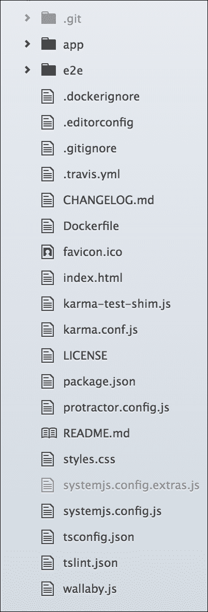
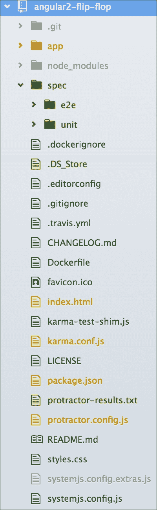
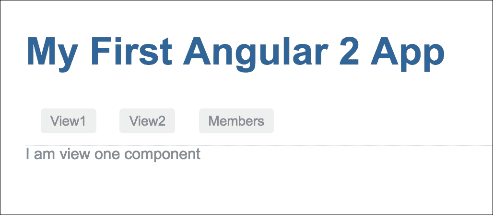
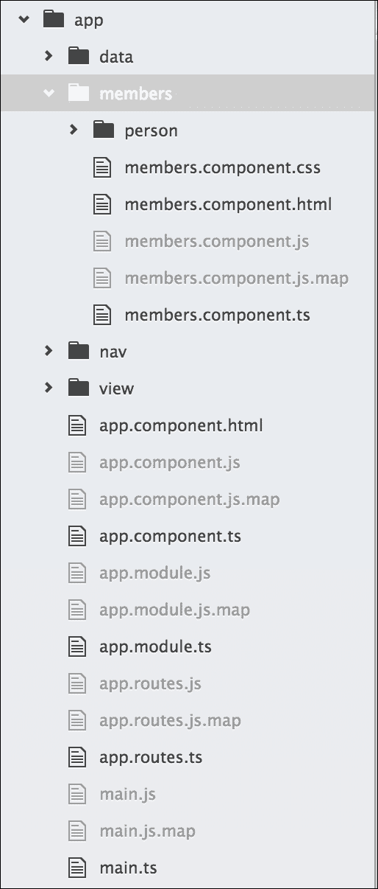
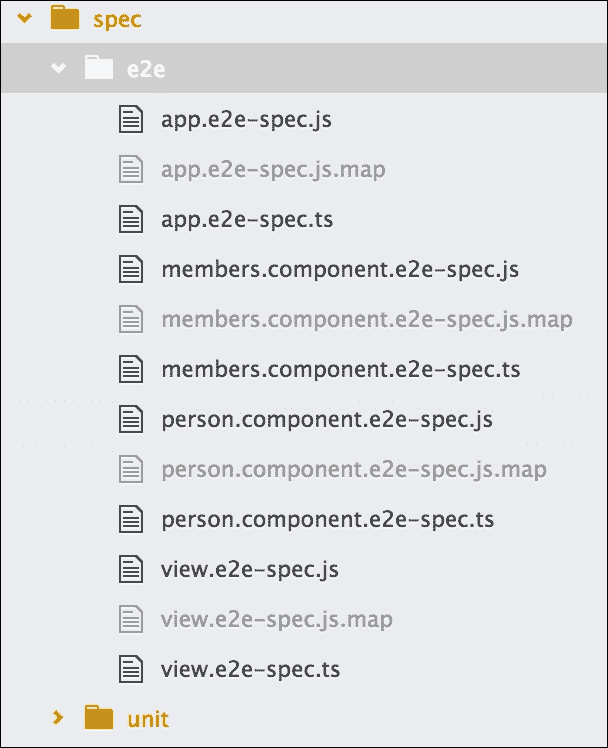
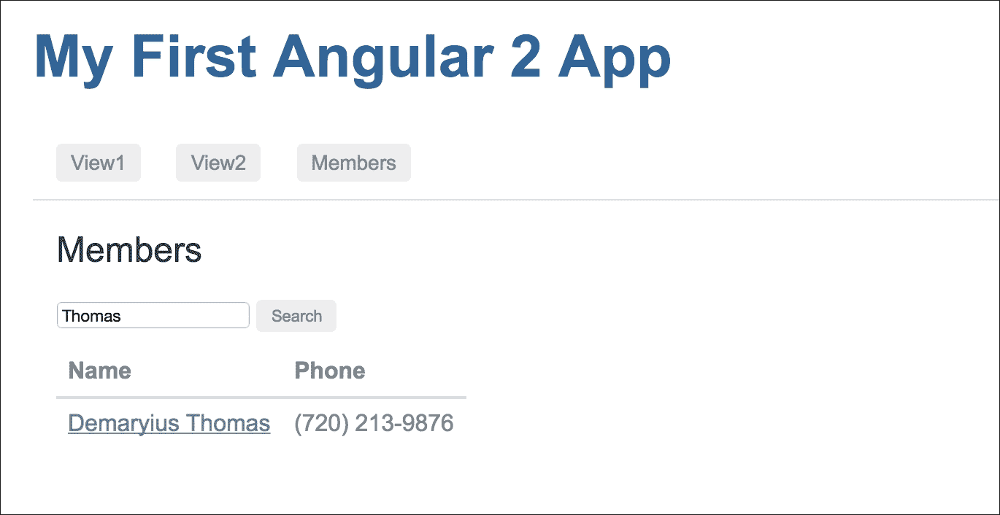
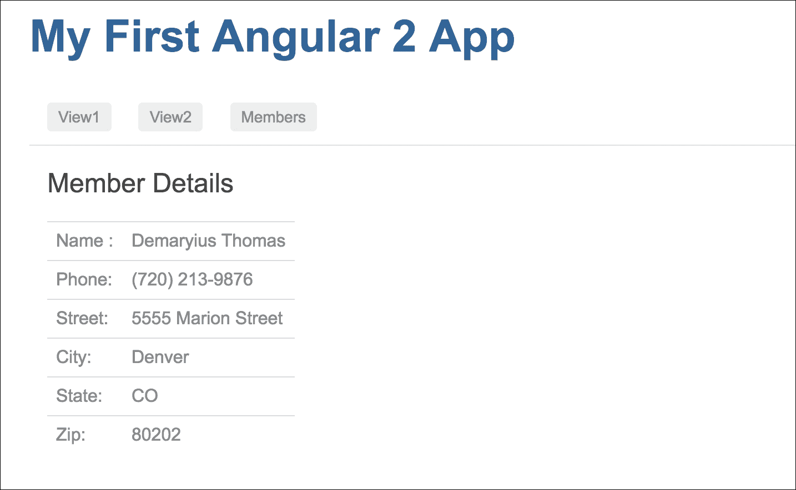
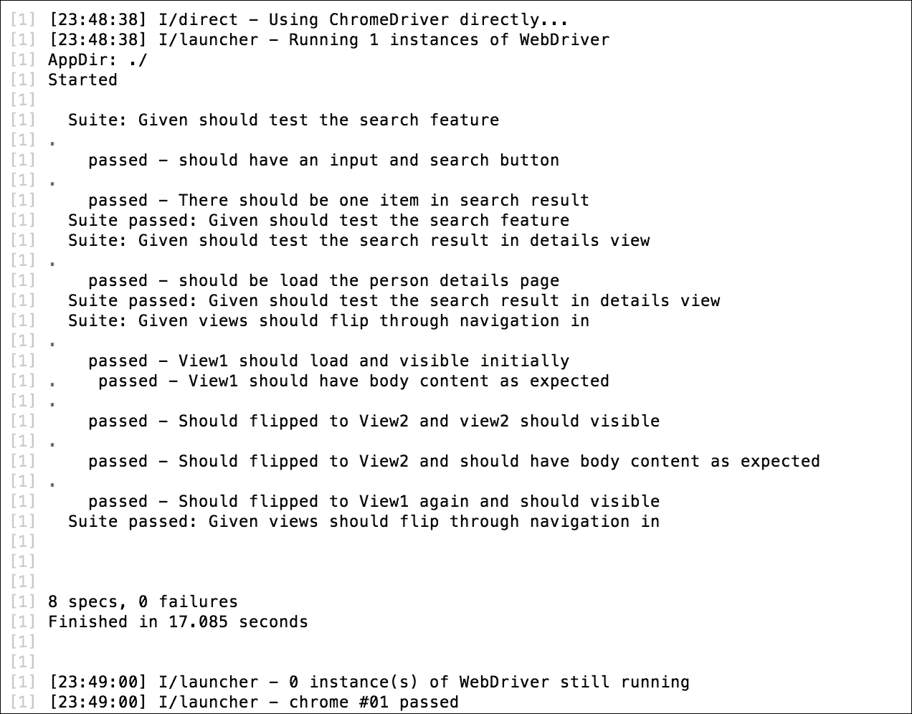

# 第七章。翻转

到目前为止，我们应该对使用 TDD 进行 Angular 应用程序的初始实现有信心。我们还应该熟悉使用测试优先方法。测试优先方法在学习阶段非常好，但有时当我们遇到很多错误时，它可能会浪费时间。对于简单和已知的行为，可能不是采用测试优先方法的最佳选择。

我们已经看到了测试优先方法是如何工作的，因此我们可以通过检查任何功能而不创建这些组件来跳过这些步骤。除此之外，我们可以更进一步，使我们更有信心更快地编写组件。我们可以让组件准备好，然后编写端到端测试规范来测试预期的行为。如果 e2e 测试失败，我们可以在 Protractor 调试器中触发错误。

在本章中，我们将继续扩展我们应用 TDD（但不是测试优先方法）与 Angular 的知识。在这里，我们不会讨论基本 Angular 组件生态系统的细节；相反，我们将更进一步，包括更多 Angular 功能。我们将通过以下主题进一步扩展我们的知识：

+   Angular 路由

+   导航到路由

+   与路由参数数据通信

+   使用 CSS 和 HTML 元素进行 Protractor 位置引用

# TDD 的基础

在本章中，我们将逐步介绍将 TDD 应用于搜索应用的路线和导航。在开始逐步介绍之前，我们需要了解本章中将使用的一些技术、配置和函数，包括以下内容：

+   Protractor 定位器

+   无头浏览器测试

在回顾了这些概念之后，我们可以继续进行逐步介绍。

## Protractor 定位器

Protractor 定位器是每个人都应该花时间学习的关键组件。在之前的 Protractor 章节中，我们通过一些工作示例了解了一些常用定位器。在这里，我们将提供一些 Protractor `Locator` 的示例。

Protractor 定位器允许我们在 HTML 页面中查找元素。在本章中，我们将看到 CSS、HTML 和 Angular 特定定位器的实际应用。定位器被传递给 `element` 函数。`element` 函数将找到并返回页面上的元素。通用的定位器语法如下：

```js
element(by.<LOCATOR>); 

```

在前面的代码中，`<LOCATOR>` 是一个占位符。以下几节将描述这些定位器中的几个。

### CSS 定位器

CSS 用于向 HTML 页面添加布局、颜色、格式化和样式。从端到端测试的角度来看，一个元素的看起来和样式可能是一个规范的一部分。例如，考虑以下 HTML 片段：

```js
<div class="anyClass" id="anyId"></div> 
// ... 
var e1 = element(by.css('.anyClass')); 
var e2 = element(by.css('#anyId')); 
var e3 = element(by.css('div')); 
var e4 = $('div'); 

```

所有这四个选择都将选择 `div` 元素。

### 按钮和链接定位器

除了能够选择和解释某物的外观方式外，也很重要能够找到页面中的按钮和链接。这将允许测试轻松地与网站交互。以下是一些示例：

+   `buttonText` 定位器：

```js
        <button>anyButton</button> 
        // ... 
        var b1 = element(by.buttonText('anyButton')); 

```

+   `linkText` 定位器：

```js
        <a href="#">anyLink</a> 
        // ... 
        var a1 = element(by.linkText('anyLink')); 

```

### URL 位置引用

当测试 Angular 路由时，我们需要能够测试我们测试的 URL。通过在 URL 和位置周围添加测试，我们必须确保应用程序与特定的路由一起工作。这很重要，因为路由为我们提供了应用程序的接口。以下是如何在 Protractor 测试中获得 URL 引用的方法：

```js
var location = browser.getLocationAbsUrl(); 

```

现在我们已经看到了如何使用不同的定位器，是时候将知识付诸实践了。

# 准备 Angular 项目

获得快速设置项目的过程和方法很重要。你花在思考目录结构和所需工具上的时间越少，你可以在开发上花的时间就越多！

因此，在前面的章节中，我们探讨了如何获取作为 `quickstart` 项目开发的简单现有 Angular 项目 [`github.com/angular/quickstart`](https://github.com/angular/quickstart)。

然而，有些人使用 `angular2-seed` [`github.com/mgechev/angular2-seed`](https://github.com/angular/angular-seed) 项目、Yeoman 或创建自定义模板。尽管这些技术很有用，并且有其优点，但在 Angular 的入门阶段，理解从头开始构建应用程序所需的东西是至关重要的。通过自己构建目录结构和安装工具，我们将更好地理解 Angular。

你将能够根据你特定的应用和需求做出布局决策，而不是将它们适应到某个其他模块中。随着你的成长和成为更好的 Angular 开发者，这一步可能不再需要，并且会变得自然而然。

## 加载现有项目

首先，我们将从 Angular 的 `quickstart` 项目 [`github.com/angular/quickstart`](https://github.com/angular/quickstart) 克隆项目，将其重命名为 `angular-flip-flop`，我们的项目文件夹结构将如下所示：



在前面的章节中，我们讨论了如何设置项目，理解了涉及的不同组件，并走过了整个过程。我们将跳过这些细节，并假设你可以回忆起如何执行必要的安装。

## 准备项目

这个 `quickstart` 项目没有在项目的着陆页（`index.html`）中包含基本 `href`。为了完美地进行路由，我们需要这个 `href`，所以让我们在 `index.html` 的 `<head>` 部分添加一行（`base href`）：

```js
<base href="/"> 

```

在这里，我们的引导组件位于应用程序组件中，HTML 模板位于组件本身中。在继续之前，我们应该将模板分离到一个新文件中。

为了这个，我们将更新我们的应用程序组件（`app/app.component.ts`），如下所示：

```js
import { Component } from '@angular/core'; 

@Component({ 
  moduleId: module.id, 
  selector: 'my-app', 
  templateUrl: 'app.component.html' 
}) 
export class AppComponent { 

}; 

```

让我们在 `app/app.component.html` 创建我们的单独模板文件。代码将如下所示：

```js
<h1>My First Angular 2 App</h1> 

```

## 运行项目

让我们继续进行，并准备好使用以下命令运行：

```js
$ cd angular-flip-flop
$ npm install // To install the required node modules. 
$ npm run // To build and run the project in http server. 

```

为了确认安装并运行项目，应用程序将自动在网页浏览器中运行。

运行项目后的预期输出如下：


## 重构项目

让我们稍微改变一下项目结构，但不是很多。默认情况下，它已经将单元测试包含在组件文件相同的目录中，并将端到端测试文件分离到`app/`文件夹外的`e2e/`文件夹中。

然而，我们将保持所有测试在同一位置，即`app`之外；我们将保持所有测试在`spec/e2e`和`spec/unit`。

目标是将测试规范与组件分离。这样，我们可以将单元测试文件放在`spec/unit`文件夹的外部。

因此，我们当前的项目结构将看起来像这样：



### 注意

只要我们更改了单元和端到端测试的路径，我们就需要在 Karma 配置文件和 Protractor 配置文件中更改路径。

# 为 Karma 设置无头浏览器测试

在前面的章节中，我们使用默认配置运行 Karma。默认的 Chrome 配置会在每次测试时启动 Chrome。针对应用程序将运行的实际代码和浏览器进行测试是一个强大的工具。然而，在启动时，浏览器可能并不总是知道你希望它如何表现。从单元测试的角度来看，你可能不希望浏览器在窗口中启动。原因可能是测试可能需要很长时间才能运行，或者你可能并不总是安装了浏览器。

幸运的是，Karma 配备了轻松配置 PhantomJS（一个无头浏览器）的能力。无头浏览器在后台运行，不会在 UI 中显示网页。PhantomJS 无头浏览器是用于测试的真正出色的工具。它甚至可以设置来对测试进行截图！有关如何进行此操作以及 PhantomJS 网站上使用的 WebKit 的更多信息，请参阅[`phantomjs.org/`](http://phantomjs.org/)。以下设置配置将展示如何使用 Karma 设置 PhantomJS 进行无头浏览器测试。

## 预配置

当 Karma 安装时，它将自动包含 PhantomJS 浏览器插件。有关进一步参考，插件位于[`github.com/karma-runner/karma-phantomjs-launcher`](https://github.com/karma-runner/karma-phantomjs-launcher)。不应需要更多的安装或配置。

然而，如果你的设置表明它缺少`karma-phantomjs-launcher`，你可以很容易地使用`npm`安装它，如下所示：

```js
$ npm install karma-phantomjs-launcher --save -dev

```

## 配置

PhantomJS 已在 Karma 配置的`browsers`部分进行配置。打开`karma.conf.js`文件，并使用以下详细信息更新它：

```js
browsers: ['PhantomJS'], 

```

同样在`plugins`选项中进行设置：

```js
plugins: [ 
        ......... 
        require('karma-phantomjs-launcher'), 
    ], 

```

现在项目已经初始化并配置了无头浏览器测试，你可以通过以下步骤查看其运行情况。

# Angular 路由和导航的概述

本指南将利用 Angular 路由。路由是 Angular 的一个极其有用的功能，就像在 Angular 1.x 中一样，但更强大。它们允许我们使用不同的组件来控制应用程序的某些方面。

本指南将切换组件以展示如何使用 TDD（测试驱动开发）来构建路由。以下是一些规范。将有一个导航菜单，其中包含两个菜单项，**View1**和**View2**：

+   在导航菜单中，点击标签**View1**

+   内容区域（路由出口）将加载/切换**View1**内容

接下来是第二部分：

+   在导航菜单中，点击标签**View2**

+   内容区域（路由出口）将加载/切换**View2**内容

实质上，这将是一个在两个视图之间切换的应用程序。

## 设置 Angular 路由

路由是 Angular 中的一个可选服务，因此它不包括在 Angular 核心中。如果我们需要使用路由，我们必须在我们的应用程序中安装 Angular 的`router`服务。

只要我们从`quickstart`克隆了我们的项目，我们就应该没问题，因为它最近已经将其依赖项中的 Angular 路由添加了进来，但我们应该检查并确认。如果`package.json`中的依赖项中没有`@angular/router`，我们可以使用`npm`安装 Angular 路由，如下所示：

```js
$ npm install @angular/router --save

```

### 定义方向

一个路由指定了一个位置并期望一个结果。从 Angular 的角度来看，路由必须首先指定，然后与某些组件相关联。

要在我们的应用程序中实现路由，我们需要在应用程序模块中导入路由模块，在那里它将在应用程序中注册路由。之后，我们需要配置所有路由并将该配置传递给应用程序模块。

### 路由模块

要在应用程序中实现路由，我们需要在我们的应用程序模块`app/app.module.ts`中导入`RouterModule`，如下所示：

```js
import {RouterModule} from "@angular/router"; 

```

这将使`router`模块在应用程序系统中可用，但我们将必须有一个路由配置来定义整个应用程序中所有可能的路由，然后通过应用程序模块将此配置导入到应用程序生态系统中。

### 配置路由

路由在没有配置之前是无用的，为此，我们首先需要导入`router`组件。配置将主要包含一个数组列表，其中路由路径和相关组件作为键值对存在。我们可以将配置数组添加到应用程序模块中，或者我们可以创建一个单独的配置文件并将应用程序模块包含在内。我们将选择第二种方法，以便将路由配置与应用程序模块分离。

让我们在应用程序根目录中创建一个名为`app/app.routes.ts`的路由配置文件。在那里，首先，我们需要从 Angular 服务中导入 Angular 的`Routes`，如下所示：

```js
import {Routes} from '@angular/router';

```

从路由配置文件中，我们需要导出配置数组，如下所示：

```js
export const rootRouterConfig: Routes = [ 
 // List of routes will come here 
]; 

```

### 应用程序中的路由器

我们已经将 `router` 模块导入到位于 `app/app.module.ts` 的应用程序模块中。

然后，我们需要将路由配置文件 (`rootRouterConfig`) 导入到这个应用程序模块文件中，如下所示：

```js
import {rootRouterConfig} from "./app.routes";

```

在应用程序模块中，我们知道 `NgModule` 将可选模块导入到应用程序生态系统中，同样地，为了将路由包含在应用程序中，`RouterModule` 有一个名为 `RouterModule.forRoot(RouterConfig)` 的函数，它接受 `routerConfiguration` 以在整个应用程序中实现路由。

应用程序模块 (`app/app.module.ts`) 将如下导入 `RouterModule`：

```js
@NgModule({ 
  declarations: [AppComponent, ........], 
  imports     : [........., RouterModule.forRoot(rootRouterConfig)], 
  bootstrap   : [AppComponent] 
}) 
export class AppModule { 
} 

```

### 配置中的路由

现在，让我们向我们的 `Routes` 配置数组添加一些路由，该数组位于 `app/app.routes.ts`。路由配置数组包含一些作为键值对的对象，每个对象中通常有两个到三个元素。

数组对象中的第一个元素包含 `path`，第二个元素包含为该 `path` 加载的相关 `component`。

让我们在配置数组中添加两条路由，如下所示：

```js
export const rootRouterConfig: Routes = [ 
  { 
    path: 'view1',  
    component: View1Component 
  }, 
  { 
    path: 'view2',  
    component: View2Component 
  } 
]; 

```

在这里，定义了两个路由 `view1` 和 `view2`，并为该路由分配了两个组件。

在某些情况下，我们可能需要从一个路由重定向到另一个路由。例如，对于应用程序的根路径 (`''`)，我们可能计划重定向到 `view1` 路由。为此，我们必须在对象中设置 `redirectTo` 元素，并将其值指定为某个路由名称。我们还需要添加一个额外的元素作为 `pathMatch` 并将其值设置为 `full`，这样它将在重定向到其他路由之前匹配完整路径。

代码将如下所示：

```js
export const rootRouterConfig: Routes = [ 
  { 
    path: '',  
    redirectTo: 'view1',  
    pathMatch: 'full' 
  }, 
  .............. 
]; 

```

因此，是的，我们的初始路由配置已经准备就绪。现在，完整的配置将如下所示：

```js
import {Routes} from '@angular/router'; 
import {View1Component} from './view/view1.component'; 
import {View2Component} from './view/view2.component'; 

export const rootRouterConfig: Routes = [ 
  { 
    path: '',  
    redirectTo: 'view1',  
    pathMatch: 'full' 
  }, 
  { 
    path: 'view1',  
    component: View1Component 
  }, 
  { 
    path: 'view2',  
    component: View2Component 
  } 
]; 

```

我应该在这里提到，我们必须导入 `view1` 和 `view2` 组件，因为我们已经在路由配置中使用了它们。

要详细了解 Angular 路由，请参阅 [`angular.io/docs/ts/latest/guide/router.html`](https://angular.io/docs/ts/latest/guide/router.html)。

## 实践路由

到目前为止，我们已经安装并导入了一个路由模块，配置了路由，并将一些内容包含在应用程序生态系统中。我们还需要做一些相关任务，例如创建路由出口、创建导航以及创建在路由中定义的组件，以便获得对路由的实践经验。

### 定义路由出口

只要路由在 `appComponent` 中配置，我们就需要一个占位符来加载路由的导航组件，Angular 将其定义为路由出口。

`RouterOutlet` 是一个占位符，Angular 根据应用程序的路由动态填充。

对于我们的应用程序，我们将在 `appComponent` 模板中放置 `router-outlet`，该模板位于 (`/app/app.component.html`)，如下所示：

```js
<router-outlet></router-outlet> 

```

### 准备导航

在路由配置中，我们为我们的应用程序设置了两个路径，`/view1`和`/view2`。现在，让我们创建一个带有两个路由路径的导航菜单，以便于导航。为此，我们可以创建一个单独的简单组件，以便在整个应用程序组件中隔离导航。

在`/app/nav/navbar.component.ts`中创建一个新的`NavbarComponent`组件文件，如下所示：

```js
import {Component} from '@angular/core'; 

@Component({ 
  selector: 'app-navbar', 
  templateUrl: 'navbar.component.html', 
  styleUrls: ['navbar.component.css'] 
}) 
export class NavbarComponent {} 

```

此外，创建导航组件的模板（`/app/nav/navbar.component.html`），如下所示：

```js
<main> 
  <nav> 
    <a [routerLink]="['/view1']">View1</a> 
    <a [routerLink]="['/view2']">View2</a> 
    <a [routerLink]="['/members']">Members</a>      
  </nav> 
</main> 

```

### 注意

目前不必担心导航中的`members`链接；我将在稍后的部分告诉你它是什么。

让我们在`/app/nav/navbar.component.css`中创建导航组件的基本 CSS 样式，以便更好地查看，如下所示：

```js
:host { 
  border-color: #e1e1e1; 
  border-style: solid; 
  border-width: 0 0 1px; 
  display: block; 
  height: 48px; 
  padding: 0 16px; 
} 

nav a { 
  color: #8f8f8f; 
  font-size: 14px; 
  font-weight: 500; 
  margin-right: 20px; 
  text-decoration: none; 
  vertical-align: middle; 
} 

nav a.router-link-active { 
  color: #106cc8; 
} 

```

我们有一个导航组件。现在我们将需要将其绑定到我们的应用程序组件，即我们的应用程序着陆页。

为了做到这一点，我们必须将以下内容添加到位于`/app/app.component.html`的`appComponent`模板中：

```js
<h1>My First Angular 2 App</h1> 
<app-navbar></app-navbar> 
<router-outlet></router-outlet> 

```

### 准备组件

对于每个定义的路由，我们需要创建一个单独的组件，因为每个路由都将与一个组件相关联。

在这里，我们有两个定义的路由，我们需要为每个路由创建两个单独的组件来处理导航。我们将根据我们的要求创建`View1Component`和`View2Component`。

在`/app/view/view1.component.ts`中创建一个新的`View 1`组件文件，如下所示：

```js
import {Component} from '@angular/core'; 

@Component({ 
  selector: 'app-view1', 
  template: '<div id="view1">I am view one component</div>' 
}) 
export class View1Component { } 

```

在`/app/view/view2.component.ts`中创建另一个`View 2`组件文件：

```js
import {Component} from '@angular/core'; 

@Component({ 
  selector: 'app-view2', 
  template: '<div id="view2">I am view two component</div>' 
}) 
export class View2Component { } 

```

我们已经准备好了我们的路由和相关组件（`Navigation`、`View1`和`View2`）。希望一切都能按预期工作，我们可以在浏览器中看到应用程序的输出。

等一下，在查看浏览器中的预期输出之前，让我们使用端到端测试来测试预期结果。现在我们知道了预期的行为，我们将根据我们的期望编写 e2e 测试规范。一旦我们准备好了 e2e 测试规范，我们将看到它是如何满足我们的期望的。

## 组装翻转/切换测试

按照三个 A 中的第一个 A，*组装*，这些步骤将向我们展示如何组装测试：

1.  从 Protractor 基础模板开始，如下所示：

    ```js
            describe('Given views should flip through navigation         
            interaction', () => { 
              beforeEach( () => { 
                // ..... 
            }); 

            it('Should fliped to the next view', () => { 
               // ....  
            }); 
            }); 

    ```

1.  使用以下代码导航到应用程序的根目录：

    ```js
            browser.get('view1'); 

    ```

1.  `beforeEach`方法需要确认显示的是正确的组件视图。这可以通过使用 CSS 定位器查找`view1`的`div`标签来实现。期望结果如下所示：

    ```js
            var view1 = element(by.css('#view1')); 
            expect(view1.isPresent()).toBeTruthy(); 

    ```

1.  然后，添加一个期望，即`view2`不可见：

    ```js
            var view2 = element(by.css('#view2')); 
            expect(view2.isPresent()).toBeFalsy(); 

    ```

1.  然后，通过获取`view1`组件的整个文本来进一步确认：

    ```js
            var view1 = element(by.css('#view1')); 
            expect(view1.getText()).toEqual('I am view one component'); 

    ```

### 切换到下一个视图

前面的测试需要确认当在导航中点击`view2`链接时，`view2`组件的内容将加载。为了进行测试，我们可以使用`by.linkText`定位器。它将看起来像这样：

```js
var view2Link = element(by.linkText('View2')); 
view2Link.click(); 

```

`beforeEach`函数现在已完成，如下所示：

```js
var view1 = element(by.css('#view1')); 
var view2 = element(by.css('#view2')); 
beforeEach(() => { 
    browser.get('view1'); 
    expect(view1.isPresent()).toBeTruthy(); 
    var view2Link = element(by.linkText('View2')); 
    view2Link.click(); 
}) 

```

接下来，我们将添加断言。

### 断言翻转

断言将再次使用 Protractor 的 CSS 定位器，如下所示，以查找`view2`是否可用：

```js
it('Should fliped to View2 and view2 should visible', () => { 
  expect(view2.isPresent()).toBeTruthy(); 
}); 

```

我们还需要确认`view1`不再可用。添加期望，`view1`不应存在，如下所示：

```js
it('Should fliped to View2 and view1 should not visible', () => { 
  expect(view1.isPresent()).toBeFalsy(); 
}); 

```

为了确保无误，我们还可以检查`view2`的内容是否已加载，如下所示：

```js
it('Should fliped to View2 and should have body content as expected',  () => { 
    expect(view2.getText()).toEqual('I am view two component'); 
}); 

```

由于我们即将通过点击导航中的`view2`链接来切换测试从`view1`组件到`view2`组件，让我们通过点击导航中的`view1`链接回到`view1`组件，希望一切按预期工作：

```js
it('Should flipped to View1 again and should visible', () => { 
    var view1Link = element(by.linkText('View1')); 
    view1Link.click(); 
    expect(view1.isPresent()).toBeTruthy(); 
    expect(view2.isPresent()).toBeFalsy(); 
  }); 

```

测试现在已经组装完成。

## 运行翻转/翻转测试

我们的测试规范已经准备好，现在是时候运行它并查看结果了。

首先，我们必须通过 HTTP 服务器保持我们的项目运行，使用以下命令：

```js
$ npm start

```

然后，我们必须运行 Protractor。确保运行中的应用程序的端口号和 Protractor 配置文件正确；为了确保无误，更新配置中的运行服务器端口号。要运行 Protractor，请使用以下命令：

```js
$ npm run e2e

```

结果应该如下所示：

```js
Suite: Given views should flip through navigation in 
    passed - View1 should have body content as expected 
    passed - Should flipped to View2 and view2 should visible 
    passed - Should flipped to View2 and should have body content
    as expected 
    passed - Should flipped to View1 again and should visible 
        Suite passed: Given views should flip through navigation in 

```

根据我们的预期，Protractor 测试已经通过。现在我们可以查看浏览器，检查事情是否与 e2e 测试结果一样工作。

## 在浏览器中打开应用

只要我们为 e2e 测试运行了`npm start`命令，我们的应用程序就可以在本地主机的特定端口`3000`上运行。默认情况下，它将在浏览器中打开。

预期输出显示在以下屏幕截图：



# 以 TDD 方式搜索

这个流程将展示我们如何构建一个简单的搜索应用程序。它有两个组件：第一个讨论搜索查询组件，第二个使用路由来显示搜索结果详情。

## 搜索查询的流程

正在构建的应用程序是一个搜索应用程序。第一步是设置搜索区域和搜索结果。想象一下我正在进行搜索。在这种情况下，以下操作将会发生：

+   输入搜索查询

+   结果显示在搜索框的底部

这部分应用与我们在第六章中看到的测试、布局和方法的相似性非常高，*第一步*。应用需要使用输入，响应用户点击，并确认结果数据。由于测试和代码使用与上一个示例相同的函数，因此没有必要提供完整的搜索功能流程。相反，以下小节将展示所需的代码和一些解释。

## 搜索查询测试

以下代码表示搜索查询功能的测试：

```js
describe('Given should test the search feature', () => { 
    let searchBox, searchButton, searchResult; 

    beforeEach(() => { 

    //ASSEMBLE  
    browser.get(''); 
    element(by.linkText('Search')).click(); 
    searchResult = element.all(by.css('#searchList tbody tr')); 
    expect(searchResult.count()).toBe(3); 

    //ACT 
    searchButton = element(by.css('form button')); 
    searchBox = element(by.css('form input')); 
    searchBox.sendKeys('Thomas'); 
    searchButton.click(); 
    }); 

    //Assert 
    it('There should be one item in search result', () => { 
    searchResult = element.all(by.css('#searchList tbody tr')); 
    expect(searchResult.count()).toBe(1); 
    }); 
}); 

```

我们应该注意到与之前的测试有相似之处。功能被编写来模拟用户在搜索框中输入的行为。测试找到输入字段，输入一个值，然后选择显示**搜索**的按钮。断言确认结果包含单个值。

## 搜索应用程序

要执行搜索操作，我们需要创建一个包含用于接受用户输入（搜索查询）的输入字段和用于执行用户动作的点击事件的按钮的搜索组件。除此之外，它可能还有一个占位符来包含搜索结果。

只要我们的应用程序已经包含了路由器，我们就可以为特定的路由放置搜索组件。

注意，我们已将我们的搜索组件命名为`MembersComponent`，因为我们已经在搜索组件中处理了一些成员数据。并且路由也将根据这一点进行配置。

因此，在我们的现有`app.routes.ts`文件中，我们将添加以下搜索路由：

```js
export const rootRouterConfig: Routes = [ 
  { 
    path: '/members', 
    component: MembersComponent 
  } 
................... 
]; 

```

## 搜索组件

搜索组件（`MembersComponent`）将是此处搜索功能的主要类。它将执行搜索并返回搜索结果。

在搜索组件的初始加载过程中，它将没有任何搜索查询，因此我们已将行为设置为返回所有数据。然后，在搜索触发后，它将根据搜索查询返回数据。

搜索组件将被放置在`app/members/members.compoennt.ts`。在代码中，一开始，我们不得不导入所需的 Angular 服务，如下所示：

```js
import { Component, OnInit } from '@angular/core'; 
import { Http, Response } from '@angular/http'; 
import { Router } from '@angular/router'; 

```

我们将使用`Http`服务进行 AJAX 调用，默认情况下，在 Angular 中，`Http`服务返回一个可观察对象。然而，处理一个承诺比处理一个可观察对象更容易。因此，我们将这个可观察对象转换为承诺。Angular 建议使用`rxjs`模块，它包含用于将可观察对象转换为承诺的`toPromise`方法。因此，我们将导入`rxjs`模块，如下所示：

```js
import 'rxjs/add/operator/toPromise'; 

```

Angular 引入了`ngOnInit()`方法，在初始化组件时执行，类似于任何类中的构造函数方法，但它有助于运行测试规范。为此，我们已从 Angular 核心导入`OnInit`接口，`Component`类将实现`OnInit`接口以获取`ngOnInit`方法。

此外，`Component`类应该注入所需的模块，例如`Http`和`Router`，如下所示：

```js
export class MembersComponent implements OnInit { 
    constructor(private http:Http, private router:Router) { 
  } 
} 

```

如前所述，我们将使用`ngOnInit()`方法，并从那里初始化搜索机制，如下所示：

```js
export class MembersComponent implements OnInit { 
 ngOnInit() { 
    this.search(); 
  } 

```

在这里，我们将对成员列表应用`search`功能，为此，我们在`app/data/people.json`中有些示例数据。我们将从这里检索数据并在数据上执行搜索操作。让我们看看如何：

+   `getData()`方法将从 API 检索数据，并将返回一个承诺。

```js
        getData() { 
            return this.http.get('app/data/people.json') 
            .toPromise() 
            .then(response => response.json()); 
        } 

```

+   `searchQuery()` 方法将解析返回的承诺，并根据搜索查询创建一个数据数组。如果没有提供搜索查询，它将返回完整的数据集作为数组：

```js
        searchQuery(q:string) { 
            if (!q || q === '*') { 
              q = ''; 
            } else { 
              q = q.toLowerCase(); 
            } 
            return this.getData() 
              .then(data => { 
              let results:Array<Person> = []; 
              data.map(item => { 
                if (JSON.stringify(item).toLowerCase().includes(q)) { 
                  results.push(item); 
                } 
              }); 
              return results; 
            }); 
        } 

```

+   `search()` 方法将为前端绑定模板准备数据集：

```js
        search(): void { 
          this.searchQuery(this.query) 
          .then(results => this.memberList = results); 
        } 

```

在这里，我们还有一个可选的方法，用于导航到成员详情组件。我们将其称为 `person` 组件。在这里，`viewDetails()` 方法将传递成员 ID，`router.navigate()` 方法将使用 ID 作为参数将应用程序导航到 `person` 组件，如下所示：

```js
viewDetails(id:number) { 
    this.router.navigate(['/person', id]); 
  } 

```

`MembersComponent` 的完整代码如下：

```js
import { Component, OnInit } from '@angular/core'; 
import { Http, Response } from '@angular/http'; 
import { Router } from '@angular/router'; 
import 'rxjs/add/operator/toPromise'; 
import { Person } from './person/person.component'; 

@Component({ 
  selector: 'app-member', 
  moduleId: module.id, 
  templateUrl: 'members.component.html', 
  styleUrls: ['members.component.css'] 
}) 
export class MembersComponent implements OnInit { 
  memberList: Array<Person> = []; 
  query: string; 

  constructor(private http:Http, private router:Router) { 
  } 

  ngOnInit() { 
    this.search(); 
  } 

  viewDetails(id:number) { 
    this.router.navigate(['/person', id]); 
  } 

  getData() { 
    return this.http.get('app/data/people.json') 
      .toPromise() 
      .then(response => response.json()); 
  } 

  search(): void { 
    this.searchQuery(this.query) 
    .then(results => this.memberList = results); 
  } 

  searchQuery(q:string) { 
    if (!q || q === '*') { 
      q = ''; 
    } else { 
      q = q.toLowerCase(); 
    } 
    return this.getData() 
      .then(data => { 
      let results:Array<Person> = []; 
      data.map(item => { 
        if (JSON.stringify(item).toLowerCase().includes(q)) { 
          results.push(item); 
        } 
      }); 
      return results; 
    }); 
  } 
} 

```

当有结果要显示时，`search` 组件模板包含搜索表单和搜索结果列表。

模板如下所示：

```js
<h2>Members</h2> 

<form> 
  <input type="search" [(ngModel)]="query" name="query" (keyup.enter)="search()"> 
  <button type="button" (click)="search()">Search</button> 
</form> 

<table *ngIf="memberList" id="searchList"> 
  <thead> 
  <tr> 
    <th>Name</th> 
    <th>Phone</th> 
  </tr> 
  </thead> 
  <tbody> 
  <tr *ngFor="let member of memberList; let i=index"> 
    <td><a href="javascript:void(0)" (click)="viewDetails(member.id)">{{member.name}}</a></td> 
    <td>{{member.phone}}</td> 
  </tr> 
  </tbody> 
</table> 

```

之前展示的 Angular 组件与之前章节中展示的类似。

我们正在使用来自 `people.json` 文件的模拟数据集，该数据集包含有关带地址的人的信息。我们希望将信息分成两部分，一部分为摘要信息，另一部分为地址详情。由于我们将使用此数据集，因此将很容易为该数据集创建一个对象模型。

摘要数据集将被定义为 `Person` 对象，地址详情将被定义为 `Address`。让我们在 `app/members/person/person.component.ts` 中创建一个人员对象，并将两个对象模型放在同一文件中。

`Person` 和 `Address` 的两个对象模型类如下所示：

```js
export class Person { 
  id:number; 
  name:string; 
  phone:string; 
  address:Address; 

  constructor(obj?:any) { 
    this.id = obj && Number(obj.id) || null; 
    this.name = obj && obj.name || null; 
    this.phone = obj && obj.phone || null; 
    this.address = obj && obj.address || null; 
  } 
} 

export class Address { 
  street:string; 
  city:string; 
  state:string; 
  zip:string; 

  constructor(obj?:any) { 
    this.street = obj && obj.street || null; 
    this.city = obj && obj.city || null; 
    this.state = obj && obj.state || null; 
    this.zip = obj && obj.zip || null; 
  } 
} 

```

## 展示我搜索结果！

现在，**搜索**按钮已设置所需的功能，结果应仅包含基于搜索查询的数据，而不是所有内容。让我们看看用户规范。

给定一组搜索结果：

+   我们将根据搜索查询拥有成员列表

+   我们将点击任何成员的姓名，并导航到详情组件以获取详细信息

采用自顶向下的方法，第一步将是 Protractor 测试，然后是使应用程序完全功能所需的必要步骤。

### 测试搜索结果

根据规范，我们需要利用现有的搜索结果。我们不必从头创建测试，可以添加到现有的搜索查询测试中。从以下嵌入在搜索查询测试中的基本测试开始：

```js
describe('Given should test the search result in details view', () => { 
  beforeEach(() => { 
  }); 

  it('should be load the person details page', () => { 
  }); 
}); 

```

下一步是构建测试。

### 组装搜索结果测试

在这种情况下，搜索结果已从搜索查询测试中获取。我们不需要为测试添加任何更多设置步骤。

### 选择搜索结果

测试的对象是结果。测试是结果被选中，然后应用程序必须执行某些操作。在 Protractor 中编写此测试的步骤如下：

1.  选择 `resultItem`。由于我们将使用路由来表示详情，我们将创建一个指向详情页面的链接并点击该链接。以下是创建链接的方法：

    在 `resultItem` 内选择链接。这使用当前选定的元素，然后找到任何符合标准子元素。此代码如下所示：

    ```js
            let resultItem = element(by.linkText('Demaryius Thomas')); 

    ```

1.  现在，要选择链接，请添加以下代码：

    ```js
            resultItem.click(); 

    ```

### 确认搜索结果

现在搜索项已被选择，我们需要验证结果详情页面是否可见。目前最简单的解决方案是确保详情视图是可见的。这可以通过使用 Protractor 的 CSS 定位器来查找搜索详情视图来完成。以下是要添加以确认搜索结果的代码：

```js
it('Should be load the person details page', () => { 
    var resultDetail = element(by.css('#personDetails')) 
    expect(resultDetail.isDisplayed()).toBeTruthy(); 
}) 

```

这里是完整的测试：

```js
describe('Given should test the search result in details view', () => { 

  beforeEach(() => { 
    browser.get('members'); 
    let searchButton = element(by.css('form button')); 
    let searchBox = element(by.css('form input')); 
    searchBox.sendKeys('Thomas'); 
    searchButton.click(); 
    let resultItem = element(by.linkText('Demaryius Thomas')); 
    resultItem.click(); 
  }); 

  it('should be load the person details page', () => { 
    var resultDetail = element(by.css('#personDetails')) 
    expect(resultDetail.isDisplayed()).toBeTruthy(); 
  }); 

}); 

```

现在测试已经设置好了，我们可以继续到生命周期的下一阶段并运行它。

## 搜索结果组件

我们命名的 `Person` 搜索结果组件将路由到接受 `params` 路由中的人员 ID，并将根据该 ID 搜索数据。

搜索结果组件将被放置在 `app/members/person/person.component.ts` 中。在代码中，首先，我们必须导入所需的 Angular 服务，如下所示：

```js
import { Component, OnInit } from '@angular/core'; 
import { Http, Response } from '@angular/http'; 
import { Router, ActivatedRoute, Params } from '@angular/router'; 

```

我们已经在 `members` 组件中看到了一些这些 Angular 服务。在这里，我们将主要讨论 `ActivatedRoute`，因为它很新。这是一个 Angular 路由模块，用于与当前/激活的路由交互：当我们需要访问当前路由的 `params` 时，我们将通过它来访问。

正如我们讨论的那样，在初始化组件时，我们需要 `ActivatedRoute`；因此，我们在 `ngOnInit()` 方法中调用了 `ActivatedRoute`。它将为我们提供当前的路由参数，我们将得到预期的 ID，这将用于从演示成员数据集中检索特定的 `Person`，如下所示：

```js
export class PersonComponent implements OnInit { 
  person: Person; 
  constructor(private http:Http, private route: ActivatedRoute, 
  private router: Router) { 
  } 

  ngOnInit() { 
    this.route.params.forEach((params: Params) => { 
       let id = +params['id']; 
       this.getPerson(id).then(person => { 
         this.person = person; 
       }); 
     }); 
  } 

```

我们在 `app/data/people.json` 中有一些模拟数据。这是与 `members` 组件中使用的相同数据。我们将根据所选 ID 检索数据，如下所示：

```js
getData() { 
    return this.http.get('app/data/people.json') 
      .toPromise() 
      .then(response => response.json()); 
  } 

```

`getData()` 方法将从 API 获取数据，并将返回一个承诺：

```js
getPerson(id:number) { 
    return this.getData().then(data => data.find(member => 
    member.id === id)); 
  } 

```

`getPerson()` 方法将解析返回的承诺，并根据所选 ID 返回 `Person` 对象。

关于 `PersonComponent` 的完整代码如下：

```js
import { Component, OnInit } from '@angular/core'; 
import { Http, Response } from '@angular/http'; 
import { Router, ActivatedRoute, Params } from '@angular/router'; 
import 'rxjs/add/operator/toPromise'; 

@Component({ 
  selector: 'app-person', 
  moduleId: module.id, 
  templateUrl: 'person.component.html', 
  styleUrls: ['../members.component.css'] 
}) 
export class PersonComponent implements OnInit { 
  person: Person; 
  constructor(private http:Http, private route: ActivatedRoute, private router: Router) { 
  } 

  ngOnInit() { 
    this.route.params.forEach((params: Params) => { 
       let id = +params['id']; 
       this.getPerson(id).then(person => { 
         this.person = person; 
       }); 
     }); 
  } 

  getPerson(id:number) { 
    return this.getData().then(data => data.find(member => member.id === id)); 
  } 

  getData() { 
    return this.http.get('app/data/people.json') 
      .toPromise() 
      .then(response => response.json()); 
  } 
} 

```

当有搜索结果要显示时，`search` 组件模板包含搜索表单和搜索结果列表。

模板如下所示：

```js
<h2>Member Details</h2> 

<table *ngIf="person" id="personDetails"> 
  <tbody> 
  <tr> 
    <td>Name :</td> 
    <td>{{person.name}}</td> 
  </tr> 
    <tr> 
      <td>Phone: </td> 
      <td>{{person.phone}}</td> 
    </tr> 
    <tr> 
      <td>Street: </td> 
      <td>{{person.address.street}}</td> 
    </tr> 
    <tr> 
      <td>City: </td> 
      <td>{{person.address.city}}</td> 
    </tr> 
    <tr> 
      <td>State: </td> 
      <td>{{person.address.state}}</td> 
    </tr> 
    <tr> 
      <td>Zip: </td> 
      <td>{{person.address.zip}}</td> 
  </tr> 
  </tbody> 
</table> 

```

## 路由中的搜索结果

我们已经有了搜索结果/`Person` 组件，但我们忘记将其包含在路由配置中。没有它，我们将遇到异常，因为我们无法在没有它在路由中的情况下从 `members` 列表中导航到 `Person` 组件。

因此，在我们的现有 `app.routes.ts` 文件中，我们将添加以下搜索路由：

```js
export const rootRouterConfig: Routes = [ 
  { 
    path: '/person/:id', 
    component: PersonComponent 
  } 
................... 
]; 

```

# 运行搜索轮

我们的应用程序经过重构、路由配置、端到端测试以及组件及其子组件的准备，我们将查看当前的项目文件结构和输出。

## 应用程序结构

我们的应用程序中有两个主要文件夹，一个是`app`目录，另一个是`spec/test`目录。

让我们看看当前`app`目录的结构：



这里是`test`目录：



## 让我们运行

我们搜索功能已经准备好运行。如果我们运行`npm start`，我们的应用程序将默认在端口`3000`上在浏览器中运行。让我们导航到**成员**以获取搜索功能的输出。搜索功能 URL 是`http://localhost:3000/members`。

当我们到达**成员**页面时，实际上会加载所有数据，因为搜索输入为空，这意味着没有搜索查询。输出应该如下所示：


现在，让我们检查带有搜索查询的**成员**页面。如果我们输入`Thomas`作为查询并搜索，它将只给我们一条数据行，如下所示：



数据列表中有一行。现在是我们查看数据详情的时候了。点击**Thomas**后，我们将看到关于 Thomas 的详细信息，包括地址，如下所示：



欢呼！完整的应用程序按预期在浏览器中运行。

## 现在端到端测试（e2e）怎么样了！

项目正在浏览器中运行，我们已经为每个组件进行了端到端测试。让我们看看当我们一起运行整个应用程序的端到端测试时，端到端测试是如何反应的。

让我们运行`npm run e2e`；输出如下所示：



# 自我测试问题

Q1. 在导航后加载组件时，使用哪种自定义占位符？

```js
<router-output> </router-output> 

<router-outlet> </router-outlet> 

<router-link> </router-link> 

```

Q2. 给定以下 Angular 组件，你会如何选择`element`并模拟点击？

```js
<a href="#">Some Link</a> 
$('a').click();. 
element(by.css('li)).click();. 
element(by.linkText('Some Link')).click();. 

```

Q3. 在使用 Angular 的路由时，你需要安装`@angular/router`。

+   真的

+   假的

# 摘要

本章向我们展示了如何使用 TDD 构建 Angular 应用程序。到目前为止，这种方法一直侧重于从用户角度的规范，并采用自上而下的 TDD 方法。这种技术帮助我们为用户测试和完成可用的且小的组件。

随着应用程序的增长，它们的复杂性也在增加。在下一章中，我们将探讨自下而上的方法，并看看何时使用这种方法而不是自上而下的方法。

本章向我们展示了如何使用测试驱动开发（TDD）来开发一个通过路由器进行导航的组件化应用程序。路由使我们能够很好地分离我们的组件和视图。我们探讨了几个 Protractor 定位器的使用，从 CSS 到重复器、链接文本和内部定位器。除了使用 Protractor，我们还学习了如何配置 Karma 以使用无头浏览器，并看到了它的实际应用。
